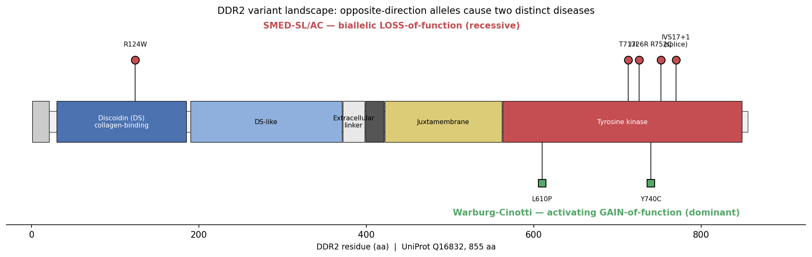

## Question

# Disease Characteristics Research Template

## Target Disease
- **Disease Name:** Spondyloepimetaphyseal Dysplasia Short Limb Abnormal Calcification Syndrome
- **MONDO ID:**  (if available)
- **Category:** Mendelian

## Research Objectives

Please provide a comprehensive research report on **Spondyloepimetaphyseal Dysplasia Short Limb Abnormal Calcification Syndrome** covering all of the
disease characteristics listed below. This report will be used to populate a disease knowledge
base entry. Be thorough and cite primary literature (PMID preferred) for all claims.

For each section, **suggested databases/resources** are listed. These are the first places
you should search for information on each topic.

---

### 1. Disease Information
> **Search first:** OMIM, Orphanet, ICD-10/ICD-11, MeSH, PubMed

- What is the disease? Provide a concise overview.
- What are the key identifiers? (OMIM, Orphanet, ICD-10/ICD-11, MeSH, Mondo)
- What are the common synonyms and alternative names?
- Is the information derived from individual patients (e.g., EHR) or aggregated disease-level resources?

### 2. Etiology

- **Disease Causal Factors**: What are the primary causes? (genetic, environmental, infectious, mechanistic)
- **Risk Factors**:
  > **Search first:** PubMed, Cochrane Library, UpToDate, clinical guidelines, ClinVar, ClinGen, GWAS Catalog, PheGenI, CTD, CDC, WHO, epidemiological databases
  - Genetic risk factors (causal variants, susceptibility loci, modifier genes)
  - Environmental risk factors (toxins, lifestyle, occupational exposures, age, sex, family history)
- **Protective Factors**:
  > **Search first:** PubMed, Cochrane Library, clinical trial databases, GWAS Catalog, gnomAD, WHO, CDC, nutrition databases
  - Genetic protective factors (protective variants, modifier alleles)
  - Environmental protective factors (diet, lifestyle, exposures that reduce risk)
- **Gene-Environment Interactions**: How do genetic and environmental factors interact to influence disease?
  > **Search first:** CTD, PubMed, PheGenI, GxE databases

### 3. Phenotypes
> **Search first:** HPO (Human Phenotype Ontology), OMIM, Orphanet, PubMed, clinicaltrials.gov, MedDRA, SNOMED CT, DECIPHER, LOINC

For each phenotype, provide:
- **Phenotype type**: symptoms, clinical signs, physical manifestations, behavioral changes, or laboratory abnormalities
  > For symptoms/signs: HPO, OMIM, Orphanet, PubMed
  > For behavioral changes: HPO, DSM, RDoC (Research Domain Criteria), PubMed
  > For laboratory abnormalities: LOINC, SNOMED CT, LabTests Online, PubMed
- **Phenotype characteristics**:
  > **Search first:** OMIM, Orphanet, HPO, PubMed
  - Age of symptom onset (neonatal, childhood, adult-onset, late-onset)
  - Symptom severity (mild, moderate, severe, variable)
  - Symptom progression (stable, progressive, episodic, fluctuating)
  - Frequency among affected individuals (percentage or qualitative)
- **Quality of life impact**: Effects on daily functioning and well-being (per-phenotype when possible)
  > **Search first:** EQ-5D database, SF-36, WHO QOL databases, PubMed
- Suggest HPO (Human Phenotype Ontology) terms for each phenotype

### 4. Genetic/Molecular Information

- **Causal Genes**: Gene mutations or chromosomal abnormalities responsible for disease (gene symbols, OMIM IDs)
  > **Search first:** OMIM, ClinVar, HGMD, Ensembl, NCBI Gene
- **Pathogenic Variants**:
  - Affected genes (gene symbols, HGNC IDs)
    > **Search first:** OMIM, NCBI Gene, Ensembl, HGNC, UniProt, GeneCards
  - Variant classification (pathogenic, likely pathogenic, VUS per ACMG/AMP guidelines)
    > **Search first:** ClinVar, ClinGen, ACMG/AMP guidelines, VarSome
  - Variant type/class (missense, frameshift, nonsense, splice-site, structural)
  - Allele frequency in population databases
    > **Search first:** gnomAD, 1000 Genomes, ExAC, TOPMed, dbSNP
  - Somatic vs germline origin
    > **Search first:** COSMIC (somatic), ClinVar, ICGC, TCGA
  - Functional consequences (loss of function, gain of function, dominant negative)
- **Modifier Genes**: Genes that modify disease severity or expression
- **Epigenetic Information**: DNA methylation, histone modifications, chromatin changes affecting disease
  > **Search first:** ENCODE, Roadmap Epigenomics, MethBase, DiseaseMeth
- **Chromosomal Abnormalities**: Large-scale genetic changes (aneuploidy, translocations, inversions)
  > **Search first:** DECIPHER, ClinVar, ECARUCA, UCSC Genome Browser

### 5. Environmental Information

- **Environmental Factors**: Non-genetic contributing factors (toxins, radiation, pollution, occupational exposure)
  > **Search first:** CTD (Comparative Toxicogenomics Database), TOXNET, PubMed, EPA databases
- **Lifestyle Factors**: Behavioral factors (smoking, diet, exercise, alcohol consumption)
  > **Search first:** CDC databases, WHO, PubMed, NHANES
- **Infectious Agents**: If applicable, pathogens causing or triggering disease (bacteria, viruses, fungi, parasites)
  > **Search first:** NCBI Taxonomy, ViPR, BV-BRC, MicrobeDB, GIDEON

### 6. Mechanism / Pathophysiology

**Present this section as an ordered causal chain first, then the detail below.**
Open with a numbered sequence of mechanistic steps running from the initiating
lesion (mutation, exposure, infection) to the clinical manifestation, one step per
line, each naming what it causes next. State the causal verb explicitly ("leads
to", "results in") and say where a step is inferred rather than demonstrated.
Where the mechanism branches, show the branch. The categories below are a
checklist of what to cover within those steps, not the organizing structure —
a step may draw on several of them, and a category may contribute to several
steps.

- **Molecular Pathways**: Specific signaling cascades or biochemical pathways involved (Wnt, MAPK, mTOR, PI3K-AKT, etc.)
  > **Search first:** KEGG, Reactome, WikiPathways, PathBank, BioCyc
- **Cellular Processes**: Cell-level mechanisms (apoptosis, autophagy, cell cycle dysregulation, inflammation, etc.)
  > **Search first:** Gene Ontology (GO), Reactome, KEGG, PubMed
- **Protein Dysfunction**: How protein structure or function is altered (misfolding, aggregation, loss of function, gain of function)
  > **Search first:** UniProt, PDB (Protein Data Bank), InterPro, Pfam, AlphaFold
- **Metabolic Changes**: Alterations in metabolic processes (energy metabolism, lipid metabolism, amino acid metabolism)
  > **Search first:** KEGG, BioCyc, HMDB (Human Metabolome Database), BRENDA
- **Immune System Involvement**: Role of immune response (autoimmunity, immunodeficiency, chronic inflammation)
  > **Search first:** ImmPort, Immunome Database, IEDB, Gene Ontology
- **Tissue Damage Mechanisms**: How tissues/ are injured (oxidative stress, ischemia, fibrosis, necrosis)
  > **Search first:** PubMed, Gene Ontology, Reactome
- **Biochemical Abnormalities**: Specific molecular defects (enzyme deficiencies, receptor dysfunction, ion channel defects)
  > **Search first:** BRENDA, UniProt, KEGG, OMIM, PubMed
- **Epigenetic Changes**: DNA methylation, histone modifications affecting gene expression in disease
  > **Search first:** ENCODE, Roadmap Epigenomics, MethBase, DiseaseMeth
- **Molecular Profiling** (if available):
  - Transcriptomics/gene expression changes
    > **Search first:** GEO (Gene Expression Omnibus), ArrayExpress, GTEx, Human Cell Atlas, SRA
  - Proteomics findings
    > **Search first:** PRIDE, ProteomeXchange, Human Protein Atlas, STRING, BioGRID
  - Metabolomics signatures
    > **Search first:** MetaboLights, Metabolomics Workbench, HMDB, METLIN
  - Lipidomics alterations
    > **Search first:** LIPID MAPS, SwissLipids, LipidHome, Metabolomics Workbench
  - Genomic structural features
    > **Search first:** UCSC Genome Browser, Ensembl, NCBI, dbVar, DGV
- **Advanced Technologies** (if applicable):
  - Single-cell analysis findings (cell-type specific mechanisms, cellular heterogeneity)
    > **Search first:** Human Cell Atlas, Single Cell Portal, GEO, CELLxGENE
  - Spatial transcriptomics findings
    > **Search first:** GEO, Spatial Research, Vizgen, 10x Genomics data
  - Multi-omics integration results
    > **Search first:** TCGA, ICGC, cBioPortal, LinkedOmics, PubMed
  - Functional genomics screens (CRISPR, RNAi)
    > **Search first:** DepMap, GenomeRNAi, PubMed, BioGRID ORCS

For each mechanism, describe:
- The causal chain from initial trigger to clinical manifestation
- Which mechanisms are upstream vs downstream
- What cell types and biological processes are involved
- Suggest GO terms for biological processes and CL terms for cell types

### 7. Anatomical Structures Affected

- **Organ Level**:
  - Primary organs directly affected
  - Secondary organ involvement (complications, secondary effects)
  - Body systems involved (cardiovascular, nervous, digestive, respiratory, endocrine, etc.)
  > **Search first:** Uberon, FMA (Foundational Model of Anatomy), OMIM, HPO, ICD-11, MeSH, SNOMED CT
- **Tissue and Cell Level**:
  - Specific tissue types affected (epithelial, connective, muscle, nervous)
  - Specific cell populations targeted (with Cell Ontology terms)
  > **Search first:** Uberon, Human Protein Atlas, Cell Ontology, Human Cell Atlas, CellMarker, PanglaoDB
- **Subcellular Level**:
  - Cellular compartments involved (mitochondria, nucleus, ER, lysosomes) (with GO Cellular Component terms)
  > **Search first:** Gene Ontology (Cellular Component), UniProt, Human Protein Atlas
- **Localization**:
  - Specific anatomical sites (with UBERON terms)
    > **Search first:** FMA, Uberon, NeuroNames (for brain), SNOMED CT
  - Lateralization (unilateral, bilateral, asymmetric)
    > **Search first:** HPO, clinical literature, imaging databases

### 8. Temporal Development

- **Onset**:
  - Typical age of onset (congenital, pediatric, adult, geriatric)
  - Onset pattern (acute, subacute, chronic, insidious)
  > **Search first:** OMIM, Orphanet, HPO, PubMed
- **Progression**:
  - Disease stages (early, intermediate, advanced, end-stage)
    > **Search first:** Cancer Staging Manual (AJCC), WHO classifications, PubMed
  - Progression rate (rapid, slow, variable)
  - Disease course pattern (episodic, relapsing-remitting, progressive, stable)
  - Disease duration (self-limited, chronic lifelong)
  > **Search first:** Disease registries, longitudinal cohort databases, natural history studies, PubMed, Orphanet, OMIM
- **Patterns**:
  - Remission patterns (spontaneous, treatment-induced)
    > **Search first:** Clinical trial databases, disease registries, PubMed
  - Critical periods (time windows of vulnerability or opportunity for intervention)
    > **Search first:** PubMed, developmental biology databases, clinical guidelines

### 9. Inheritance and Population

- **Epidemiology**:
  - Prevalence (cases per 100,000 at given time)
  - Incidence (new cases per 100,000 per year)
  > **Search first:** Orphanet, CDC, WHO, GBD (Global Burden of Disease), national registries, SEER, disease registries
- **For Genetic Etiology**:
  - Inheritance pattern (AD, AR, X-linked, mitochondrial, multifactorial, polygenic)
    > **Search first:** OMIM, Orphanet, ClinVar, GTR (Genetic Testing Registry)
  - Penetrance (complete, incomplete, age-dependent)
    > **Search first:** ClinVar, OMIM, PubMed, ClinGen
  - Expressivity (variable, consistent)
    > **Search first:** OMIM, ClinVar, PubMed
  - Genetic anticipation (increasing severity in successive generations)
    > **Search first:** OMIM, PubMed (especially for repeat expansion disorders)
  - Germline mosaicism
    > **Search first:** ClinVar, OMIM, genetic counseling literature, PubMed
  - Founder effects (population-specific mutations)
    > **Search first:** gnomAD, population genetics databases, PubMed
  - Consanguinity role
    > **Search first:** OMIM, population studies, genetic counseling resources
  - Carrier frequency
    > **Search first:** gnomAD, carrier screening databases, GeneReviews, GTR
- **Population Demographics**:
  - Affected populations (ethnic or demographic groups with higher prevalence)
    > **Search first:** gnomAD, 1000 Genomes, PAGE Study, PubMed, population registries
  - Geographic distribution (endemic areas, regional variation)
    > **Search first:** WHO, CDC, GBD, Orphanet, geographic epidemiology databases
  - Geographic distribution of specific variants
  - Sex ratio (male:female)
    > **Search first:** Disease registries, OMIM, PubMed, epidemiological databases
  - Age distribution of affected individuals
    > **Search first:** CDC, disease registries, SEER, Orphanet

### 10. Diagnostics

- **Clinical Tests**:
  - Laboratory tests (blood, urine, tissue chemistry, specific enzyme assays)
    > **Search first:** LOINC, LabTests Online, PubMed
  - Biomarkers (proteins, metabolites, genetic markers, circulating biomarkers)
    > **Search first:** FDA Biomarker List, BEST (Biomarkers, EndpointS, and other Tools), PubMed
  - Imaging studies (X-ray, CT, MRI, PET, ultrasound)
    > **Search first:** RadLex, DICOM, Radiopaedia, imaging databases
  - Functional tests (pulmonary function, cardiac stress tests)
    > **Search first:** LOINC, clinical guidelines, PubMed
  - Electrophysiology (EEG, EMG, ECG, nerve conduction studies)
    > **Search first:** LOINC, clinical neurophysiology databases, PubMed
  - Biopsy findings (histopathology, immunohistochemistry)
    > **Search first:** SNOMED CT, College of American Pathologists resources, PubMed
  - Pathology findings (microscopic examination)
    > **Search first:** SNOMED CT, Digital Pathology databases, PubMed
- **Genetic Testing**:
  > **Search first:** GTR (Genetic Testing Registry), GeneReviews, ClinGen
  - Overview of recommended genetic testing approach
  - Whole genome sequencing (WGS) utility
    > **Search first:** GTR, ClinVar, GEL (Genomics England), gnomAD
  - Whole exome sequencing (WES) utility
    > **Search first:** GTR, ClinVar, OMIM, GeneMatcher
  - Gene panels (which panels, which genes)
    > **Search first:** GTR, ClinVar, laboratory-specific databases
  - Single gene testing
    > **Search first:** GTR, ClinVar, OMIM, GeneReviews
  - Chromosomal microarray (CMA)
    > **Search first:** DECIPHER, ClinVar, dbVar, ECARUCA
  - Karyotyping
    > **Search first:** Chromosome Abnormality Database, ClinVar, cytogenetics resources
  - FISH
    > **Search first:** ClinVar, cytogenetics databases, PubMed
  - Mitochondrial DNA testing
    > **Search first:** MITOMAP, MSeqDR, ClinVar, GTR
  - Repeat expansion testing
    > **Search first:** GTR, ClinVar, repeat expansion databases, PubMed
- **Omics-Based Diagnostics** (if applicable):
  - RNA sequencing / transcriptomics
    > **Search first:** GEO, ArrayExpress, GTEx, RNA-seq databases
  - Proteomics
    > **Search first:** PRIDE, ProteomeXchange, FDA Biomarker database
  - Metabolomics
    > **Search first:** MetaboLights, Metabolomics Workbench, HMDB
  - Epigenomics
    > **Search first:** GEO, ENCODE, Roadmap Epigenomics, MethBase
  - Liquid biopsy
    > **Search first:** COSMIC, ClinVar, liquid biopsy databases, PubMed
- **Clinical Criteria**:
  - Standardized diagnostic criteria (DSM, ICD, society guidelines)
    > **Search first:** DSM-5, ICD-11, clinical society guidelines, UpToDate
  - Differential diagnosis (other conditions to rule out, with distinguishing features)
    > **Search first:** DynaMed, UpToDate, clinical decision support systems
- **Screening**:
  - Screening methods for asymptomatic individuals (newborn screening, carrier screening, cascade screening)
    > **Search first:** ACMG recommendations, CDC newborn screening, GTR

### 11. Outcome/Prognosis

- **Survival and Mortality**:
  - Survival rate (5-year, 10-year, overall)
    > **Search first:** SEER, cancer registries, disease-specific registries, PubMed
  - Life expectancy (with and without treatment if applicable)
    > **Search first:** Orphanet, disease registries, actuarial databases, PubMed
  - Mortality rate
    > **Search first:** CDC, WHO, GBD, national mortality databases
  - Disease-specific mortality (deaths directly attributable to disease)
    > **Search first:** Disease registries, CDC Wonder, GBD, PubMed
- **Morbidity and Function**:
  - Morbidity (disease-related disability and health impacts)
    > **Search first:** GBD, WHO, disability databases, PubMed
  - Disability outcomes (long-term functional impairments)
    > **Search first:** ICF (International Classification of Functioning), disability registries
  - Quality of life measures (EQ-5D, SF-36, PROMIS, disease-specific tools)
    > **Search first:** EQ-5D database, SF-36, PROMIS, PubMed
- **Disease Course**:
  - Complications (secondary problems: infections, organ failure, etc.)
    > **Search first:** ICD codes, disease registries, clinical databases, PubMed
  - Recovery potential (likelihood and extent of recovery, with vs without treatment)
    > **Search first:** Natural history studies, rehabilitation databases, PubMed
- **Prediction**:
  - Prognostic factors (age, disease severity, biomarkers, treatment response)
    > **Search first:** Prognostic models databases, clinical calculators, PubMed
  - Prognostic biomarkers (molecular markers predicting disease course)
    > **Search first:** FDA Biomarker database, PubMed, cancer prognostic databases

### 12. Treatment

- **Pharmacotherapy**:
  - Pharmacological treatments (drug names, drug classes, mechanisms of action)
    > **Search first:** DrugBank, RxNorm, ATC classification, DailyMed, FDA databases
  - Pharmacogenomics (how genetic variants affect drug metabolism, efficacy, toxicity)
    > **Search first:** PharmGKB, CPIC (Clinical Pharmacogenetics), FDA Table of PGx Biomarkers
- **Advanced Therapeutics**:
  - Gene therapy (viral vectors, CRISPR, gene replacement, gene editing)
    > **Search first:** ClinicalTrials.gov, FDA gene therapy database, ASGCT resources
  - Cell therapy (stem cell transplant, CAR-T, cellular therapeutics)
    > **Search first:** ClinicalTrials.gov, FDA cell therapy database, FACT standards
  - RNA-based therapies (ASOs, siRNA, mRNA therapies)
    > **Search first:** ClinicalTrials.gov, FDA approvals, PubMed
  - Targeted therapies (treatments directed at specific molecular targets)
    > **Search first:** My Cancer Genome, OncoKB, ClinicalTrials.gov, FDA approvals
  - Immunotherapies (checkpoint inhibitors, monoclonal antibodies)
    > **Search first:** Cancer Immunotherapy Database, FDA approvals, ClinicalTrials.gov
- **Surgical and Interventional**:
  - Surgical interventions (types of surgery, timing, outcomes)
    > **Search first:** CPT codes, surgical registries, clinical guidelines, PubMed
- **Supportive and Rehabilitative**:
  - Supportive care (symptom management, pain control, nutrition)
    > **Search first:** Clinical guidelines, Cochrane Library, PubMed
  - Rehabilitation (physical therapy, occupational therapy, speech therapy)
    > **Search first:** Rehabilitation medicine databases, clinical guidelines, PubMed
- **Experimental**:
  - Experimental treatments in clinical trials (with NCT identifiers if available)
    > **Search first:** ClinicalTrials.gov, EU Clinical Trials Register, WHO ICTRP
- **Treatment Outcomes**:
  - Treatment response rates
    > **Search first:** Clinical trial databases, FDA reviews, systematic reviews, PubMed
  - Side effects and adverse events
    > **Search first:** FDA Adverse Event Reporting System (FAERS), MedWatch, PubMed
- **Treatment Strategy**:
  - Treatment algorithms (clinical pathways, decision trees)
    > **Search first:** Clinical practice guidelines, NCCN Guidelines, UpToDate
  - Combination therapies
    > **Search first:** ClinicalTrials.gov, treatment guidelines, PubMed
  - Personalized medicine approaches (genotype-guided treatment)
    > **Search first:** My Cancer Genome, CIViC, PharmGKB, precision medicine databases

For each treatment, suggest NCIT (NCI Thesaurus) clinical-intervention terms where applicable.

### 13. Prevention

- **Prevention Levels**:
  - Primary prevention (preventing disease occurrence: vaccination, risk factor modification)
    > **Search first:** CDC, WHO, USPSTF recommendations, Cochrane Library
  - Secondary prevention (early detection and treatment: screening programs, early intervention)
    > **Search first:** USPSTF, CDC screening guidelines, WHO
  - Tertiary prevention (preventing complications in those with disease)
    > **Search first:** Clinical guidelines, disease management protocols, PubMed
- **Immunization**: Vaccine strategies (if applicable)
  > **Search first:** CDC vaccine schedules, WHO immunization, FDA vaccine database
- **Screening and Early Detection**:
  - Screening programs (population-based: newborn screening, cancer screening)
    > **Search first:** CDC screening programs, USPSTF, cancer screening databases
  - Genetic screening (carrier screening, preimplantation genetic diagnosis, prenatal testing)
    > **Search first:** ACMG recommendations, ACOG guidelines, GTR
  - Risk stratification (identifying high-risk individuals for targeted prevention)
    > **Search first:** Risk prediction models, clinical calculators, PubMed
- **Behavioral Interventions**: Lifestyle modifications to reduce risk
  > **Search first:** CDC, WHO, behavioral intervention databases, Cochrane Library
- **Counseling**: Genetic counseling (risk assessment, family planning guidance)
  > **Search first:** NSGC resources, ACMG guidelines, GeneReviews
- **Public Health**:
  - Public health interventions (sanitation, vector control, health education)
    > **Search first:** CDC, WHO, public health databases, PubMed
  - Environmental interventions (reducing environmental risk factors)
    > **Search first:** EPA databases, WHO environmental health, PubMed
- **Prophylaxis**: Preventive medications or procedures
  > **Search first:** Clinical guidelines, FDA approvals, PubMed

### 14. Other Species / Natural Disease

- **Taxonomy**: Species affected (with NCBI Taxon identifiers)
  > **Search first:** NCBI Taxonomy
- **Breed**: Specific breeds affected (with VBO identifiers if applicable)
  > **Search first:** VBO (Vertebrate Breed Ontology)
- **Gene**: Orthologous genes in other species (with NCBI Gene IDs)
  > **Search first:** NCBI Gene
- **Natural Disease**:
  - Naturally occurring disease in other species (companion animals, wildlife)
    > **Search first:** OMIA (Online Mendelian Inheritance in Animals), VetCompass, PubMed
  - Veterinary relevance and importance in animal health
    > **Search first:** OMIA, veterinary databases, PubMed
- **Comparative Biology**:
  - Comparative pathology (similarities and differences across species)
    > **Search first:** OMIA, comparative pathology databases, PubMed
  - Evolutionary conservation of disease mechanisms
    > **Search first:** HomoloGene, OrthoMCL, Alliance of Genome Resources
- **Transmission** (if applicable):
  - Zoonotic potential
    > **Search first:** CDC zoonotic diseases, WHO zoonoses, GIDEON
  - Cross-species susceptibility
    > **Search first:** NCBI Taxonomy, veterinary databases, PubMed

### 15. Model Organisms

- **Model Types**:
  - Model organism type (mammalian, invertebrate, cellular, in vitro)
    > **Search first:** Alliance of Genome Resources, model organism databases
  - Specific model systems (mouse, rat, zebrafish, Drosophila, C. elegans, yeast, cell lines, organoids, iPSCs)
    > **Search first:** MGI, RGD, ZFIN, FlyBase, WormBase, SGD, ATCC, Cellosaurus
  - Induced models (drug treatment, surgical intervention, environmental manipulation)
    > **Search first:** MGI, model organism databases, PubMed
- **Genetic Models**:
  - Types available (knockout, knock-in, transgenic, conditional, humanized)
    > **Search first:** MGI, IMPC, KOMP, EuMMCR, IMSR
- **Model Characteristics**:
  - Phenotype recapitulation (how well model reproduces human disease features)
    > **Search first:** Model organism databases, comparative studies, PubMed
  - Model limitations (aspects of human disease not captured)
    > **Search first:** Model organism databases, PubMed, review articles
- **Applications**:
  - Research applications (what aspects of disease can be studied)
    > **Search first:** Model organism databases, PubMed
- **Resources**:
  - Model databases
    > **Search first:** MGI, RGD, ZFIN, FlyBase, WormBase, IMSR, EMMA, MMRRC

---

## Citation Requirements

- Cite primary literature (PMID preferred) for all mechanistic and clinical claims
- Prioritize recent reviews and landmark papers
- Include direct quotes from abstracts where possible to support key statements
- Distinguish evidence source types: human clinical, model organism, in vitro, computational

## Output Format

Structure your response as a comprehensive narrative organized by the sections above.
For each section, provide:
- Factual content with specific details (numbers, percentages, gene names, variant nomenclature)
- Ontology term suggestions (HPO, GO, CL, UBERON, CHEBI, NCIT, MONDO) where applicable
- Evidence citations with PMIDs
- Direct quotes from abstracts to support key claims
- Clear indication when information is not available or not applicable for this disease

This report will be used to populate a disease knowledge base entry with:
- Pathophysiology descriptions with causal chains
- Gene/protein annotations (HGNC, GO terms)
- Phenotype associations (HP terms) with frequencies
- Cell type involvement (CL terms)
- Anatomical locations (UBERON terms)
- Chemical entities (CHEBI terms)
- Treatment annotations (NCIT terms)
- Evidence items with PMIDs and exact abstract quotes
- Epidemiology, prognosis, diagnostic, and prevention information
- Animal model descriptions with phenotype recapitulation details


## Output

# Spondyloepimetaphyseal Dysplasia, Short Limb–Abnormal Calcification Type (SMED-SL/AC): A Comprehensive Disease Report

**Disease category:** Mendelian (monogenic skeletal dysplasia)
**Causal gene:** *DDR2* (Discoidin Domain Receptor 2)
**Inheritance:** Autosomal recessive
**Key identifiers:** OMIM #271665 (phenotype), OMIM *191311 (gene); ORPHA:1425; MONDO:0009642; HGNC:2968; UniProt Q16832

---

## Summary

Spondyloepimetaphyseal dysplasia, short limb–abnormal calcification type (SMED-SL/AC, also "spondylo-meta-epiphyseal dysplasia, short limb–hand type") is an ultra-rare, autosomal recessive congenital skeletal dysplasia. It is defined clinically by severe disproportionate short-limbed short stature, a distinctive facial gestalt (flat/short face, short nose with wide nasal bridge, long philtrum, ocular hypertelorism, micro-/retrognathia, narrow chest), platyspondyly, markedly abnormal metaphyses and epiphyses, short ribs, and the hallmark feature of premature/abnormal calcification. The disorder is caused by **biallelic loss-of-function variants in *DDR2***, the gene encoding Discoidin Domain Receptor 2, a collagen-activated receptor tyrosine kinase (RTK). This report synthesizes six confirmed findings and 18 reviewed papers into a coherent mechanistic and clinical account.

The central mechanistic insight is that DDR2 is a collagen sensor required for **growth-plate chondrocyte proliferation**. Fibrillar collagen binding to the extracellular discoidin (DS) domain triggers a slow, sustained receptor autophosphorylation cascade — Src-mediated phosphorylation of the activation loop (Tyr-740), intramolecular cis-autophosphorylation, and recruitment of Shc signaling complexes — that drives chondrocyte proliferation in the resting and proliferating zones of the growth plate and in Gli1-positive skeletal progenitors. SMED-SL/AC variants abolish this signaling either by impairing collagen binding (discoidin-domain variants such as R124W) or by disabling catalysis (kinase-domain variants T713I, I726R, R752C, and splice/nonsense alleles). The downstream consequence — reduced chondrocyte proliferation — was demonstrated directly in *Ddr2*-deficient mice, which develop dwarfism, shortened long bones, and craniofacial defects that recapitulate the human phenotype.

A striking allelic contrast illuminates DDR2 biology: **activating** DDR2 variants (p.Leu610Pro, p.Tyr740Cys) cause the mechanistically opposite disorder **Warburg-Cinotti syndrome** (progressive corneal neovascularization, keloids, acro-osteolysis). DDR2 thus behaves as a bidirectional signaling rheostat, with loss-of-function producing SMED-SL/AC and gain-of-function producing Warburg-Cinotti syndrome. There is no disease-specific therapy; management is supportive, combined with genetic counseling and prenatal/carrier testing in at-risk (frequently consanguineous) families.

---

## Key Findings

### Finding 1 — SMED-SL/AC is caused by biallelic loss-of-function *DDR2* variants

The genetic basis of SMED-SL/AC was established by homozygosity mapping in a consanguineous cohort. Bargal et al. (2009) studied 6 patients from 5 consanguineous Arab Muslim families and mapped the disease to a 2.4-Mb interval on chromosome 1q23, identifying four *DDR2* mutations clustered in the sequence encoding the tyrosine kinase domain: three missense variants — c.2254C>T (p.R752C), c.2177T>G (p.I726R), c.2138C>T (p.T713I) — and one splice-site variant, IVS17+1g>a.

> "We identified three missense mutations c.2254 C > T [R752C], c. 2177 T > G [I726R], c.2138C > T [T713I] and one splice site mutation [IVS17+1g > a] in the conserved sequence encoding the tyrosine kinase domain of the DDR2 gene." — Bargal et al., [PMID: 19110212](https://pubmed.ncbi.nlm.nih.gov/19110212/)

The loss-of-function nature and expanding allelic spectrum were reinforced by Akalin et al. (2023), who described three additional patients and confirmed the disorder results from biallelic *DDR2* inactivation. By 2023, ~10 pathogenic *DDR2* variants had been reported (6 missense, 2 nonsense, 1 deletion, 1 splice), consistent with autosomal recessive inheritance.

> "This unique phenotype is caused by biallelic loss-of-function variants in Discoidin domain receptor 2 gene (DDR2, MIM# 191311)." — Akalin et al., [PMID: 36720430](https://pubmed.ncbi.nlm.nih.gov/36720430/)

### Finding 2 — DDR2 loss reduces chondrocyte proliferation, explaining the short-limb dwarfism

The cellular mechanism linking DDR2 loss to the skeletal phenotype was established in mouse models. Labrador et al. (2001) showed that *Ddr2*-deficient mice exhibit dwarfism and shortening of long bones, and — critically — that this results from **reduced chondrocyte proliferation** rather than aberrant differentiation or function.

> "These mice exhibit dwarfism and shortening of long bones. This phenotype appears to be caused by reduced chondrocyte proliferation, rather than aberrant differentiation or function." — Labrador et al., [PMID: 11375938](https://pubmed.ncbi.nlm.nih.gov/11375938/)

Mohamed et al. (2022) localized DDR2 function to the relevant cell populations, demonstrating selective *Ddr2* expression in resting-zone and proliferating chondrocytes and periosteum, and showing that DDR2 functions in Gli1-positive skeletal progenitors and chondrocytes to control bone development.

> "Expression and lineage analysis showed selective expression of Ddr2 at early stages of bone formation in the resting zone and proliferating chondrocytes and periosteum." — Mohamed et al., [PMID: 35140200](https://pubmed.ncbi.nlm.nih.gov/35140200/)

A companion study (Mohamed et al., 2023, [PMID: 36656123](https://pubmed.ncbi.nlm.nih.gov/36656123/)) demonstrated that the shortened skull and flat face of DDR2-mutant mice arise because cranial-base bones fail to elongate due to defects in cartilage-dependent growth centers — providing a direct cellular explanation for the characteristic craniofacial gestalt of SMED-SL/AC.

### Finding 3 — Clinical phenotype: distinctive facies, disproportionate short stature, platyspondyly, and premature calcification

The clinical entity was first delineated by Borochowitz (1993), who described a congenital familial skeletal dysplasia with small stature, short limbs and short hands, a short nose with a wide nasal bridge and nostrils, long philtrum, ocular hypertelorism, retro-/micrognathia, and a narrow chest. Radiographs showed platyspondyly, short tubular bones with markedly abnormal metaphyses and epiphyses beyond early infancy, and short ribs, evolving over time.

> "Radiological abnormalities include platyspondyly, short tubular bones with very abnormal metaphyses and epiphyses beyond early infancy, short ribs, and a typical evolution of bony changes over time." — Borochowitz, [PMID: 8434618](https://pubmed.ncbi.nlm.nih.gov/8434618/)

The disease-defining feature of **premature/abnormal calcification** was emphasized by Mansouri et al. (2016), who noted that it leads to severe disproportionate short stature; approximately 22 patients had been reported in the literature by that time.

> "premature calcification leading to severe disproportionate short stature" — Mansouri et al., [PMID: 26463668](https://pubmed.ncbi.nlm.nih.gov/26463668/)

Chondro-osseous histopathology reveals sparse cartilage matrix and degenerating chondrocytes surrounded by dense amorphous (calcified) material. Dental anomalies — enamel hypoplasia and abnormal tooth number/shape — have also been described (Akalin et al., 2023, [PMID: 36720430](https://pubmed.ncbi.nlm.nih.gov/36720430/)), broadening the recognized phenotypic spectrum.

### Finding 4 — Allelic contrast: activating DDR2 variants cause Warburg-Cinotti syndrome

DDR2 is a bidirectional signaling node. Whereas loss-of-function alleles cause SMED-SL/AC, recurrent **activating** variants cause a distinct disorder. Xu et al. (2018) identified c.1829T>C (p.Leu610Pro) or c.2219A>G (p.Tyr740Cys) in 6 individuals from 4 families with Warburg-Cinotti syndrome — progressive corneal neovascularization, keloids, chronic skin ulcers, acro-osteolysis, and flexion contractures. Patient fibroblasts showed increased DDR2 phosphorylation, indicating ligand-independent kinase activation; dasatinib inhibited DDR2 autophosphorylation in these cells.

> "Phosphorylation of DDR2 was increased in fibroblasts from affected individuals, suggesting reduced receptor autoinhibition and ligand-independent kinase activation." — Xu et al., [PMID: 30449416](https://pubmed.ncbi.nlm.nih.gov/30449416/)

This contrast confirms the loss-of-function pathogenesis of SMED-SL/AC and identifies DDR2 as a dose-/activity-sensitive rheostat in connective-tissue biology.

### Finding 5 — The DDR2 signaling cascade abolished in SMED-SL/AC

DDR2 is a collagen-activated RTK. Yang et al. (2005) defined its activation mechanism: ligand binding promotes Src-mediated phosphorylation of Tyr-740 in the activation loop, which stimulates intramolecular cis-autophosphorylation and generates cytosolic phosphotyrosines that recruit Shc signaling complexes.

> "ligand binding promotes phosphorylation of Tyr-740 in the DDR2 activation loop by Src; 2) Tyr-740 phosphorylation stimulates intramolecular autophosphorylation of DDR2; 3) DDR2 autophosphorylation generates cytosolic domain phosphotyrosines that promote the formation of DDR2 cytosolic domain-Shc signaling complexe" — Yang et al., [PMID: 16186108](https://pubmed.ncbi.nlm.nih.gov/16186108/)

Enzyme-kinetic analysis (Hao & Leitinger, 2025) established that wild-type DDR2 kinase follows a two-step activation mechanism analogous to DDR1 but with enhanced autophosphorylation and substrate phosphorylation rates.

> "WT DDR2 kinase was found to follow the same two-step activation mechanism previously characterised for DDR1 kinase but with enhanced autophosphorylation and substrate phosphorylation rates." — Hao & Leitinger, [PMID: 41259339](https://pubmed.ncbi.nlm.nih.gov/41259339/)

SMED-SL/AC missense variants (R752C, I726R, T713I) and splice/nonsense alleles map to the kinase domain and abolish this signaling (loss of function), whereas activation-loop-region variants (Y740C, L610P) constitutively activate the kinase (Warburg-Cinotti).

### Finding 6 — DDR2 domain architecture explains variant effects

DDR2's extracellular region comprises a collagen-binding discoidin (DS) domain plus a DS-like domain; the transmembrane region mediates ligand-independent dimerization and connects via an unusually long juxtamembrane domain to the tyrosine kinase domain (Carafoli & Hohenester, 2013).

> "The extracellular region of DDRs consists of a collagen-binding discoidin (DS) domain and a DS-like domain. The transmembrane region mediates the ligand-independent dimerisation of DDRs and is connected to the tyrosine kinase domain by an unusually long juxtamembrane domain." — Carafoli & Hohenester, [PMID: 23128141](https://pubmed.ncbi.nlm.nih.gov/23128141/)

The major DDR binding site in fibrillar collagen is the GVMGFO motif (O = hydroxyproline), recognized by an amphiphilic trench at the top of the DS domain.

> "The major DDR binding site in fibrillar collagens is a GVMGFO motif (O is hydroxyproline), which is recognised by an amphiphilic trench at the top of the DS domain." — Carafoli & Hohenester, [PMID: 23128141](https://pubmed.ncbi.nlm.nih.gov/23128141/)

This architecture explains how SMED-SL/AC variants in functionally distinct regions converge on the same loss-of-function outcome: the discoidin-domain missense R124W (c.370C>T) likely impairs collagen binding, whereas R752C/I726R/T713I lie in the kinase domain and impair catalysis (Mansouri et al., 2016, [PMID: 26463668](https://pubmed.ncbi.nlm.nih.gov/26463668/); Bargal et al., 2009, [PMID: 19110212](https://pubmed.ncbi.nlm.nih.gov/19110212/)).

{{figure:ddr2_variant_landscape.png|caption=Schematic of DDR2 (UniProt Q16832, 855 aa) domain architecture. SMED-SL/AC loss-of-function variants (e.g., discoidin-domain R124W impairing collagen binding; kinase-domain T713I/I726R/R752C impairing catalysis) contrast with Warburg-Cinotti gain-of-function variants (L610P, Y740C) that constitutively activate the kinase. The two disorders represent opposite ends of a single DDR2 activity spectrum.}}

---

## Section-by-Section Report

### 1. Disease Information

**Overview.** SMED-SL/AC is a congenital autosomal recessive osteochondrodysplasia characterized by severe disproportionate short-limb short stature, distinctive facies, platyspondyly, abnormal metaphyses/epiphyses, and premature (abnormal) calcification of cartilage. It belongs to the spondyloepimetaphyseal dysplasia group, which affects the spine (spondylo-), epiphyses, and metaphyses of long bones.

**Key identifiers:**
- OMIM phenotype: **#271665** (Spondylometaepiphyseal dysplasia, short limb–hand type / SMED short limb–abnormal calcification type)
- OMIM gene: **\*191311** (*DDR2*)
- Orphanet: **ORPHA:1425**
- MONDO: **MONDO:0009642**
- HGNC (gene): **HGNC:2968**; UniProt Q16832
- ICD-10: within Q77 (osteochondrodysplasia with defects of growth of tubular bones and spine); ICD-11: LD24 range (skeletal dysplasias). No disease-specific MeSH term; indexed under "Osteochondrodysplasias."

**Synonyms / alternative names:** Spondylo-meta-epiphyseal dysplasia, short limb–hand type (SMED-SL); SMED short limb–abnormal calcification type (SMED-SL/AC); Borochowitz-Cohen-Barak dysplasia type; spondyloepimetaphyseal dysplasia with abnormal calcification.

**Information source.** All knowledge derives from **aggregated, disease-level resources** — individual case reports and small consanguineous family series (Borochowitz 1993; Bargal 2009; Mansouri 2016; Akalin 2023), plus model-organism and biochemical studies. No EHR-derived or population-registry data exist given the extreme rarity.

### 2. Etiology

**Causal factors.** The disease is purely **genetic (monogenic, Mendelian)**: biallelic loss-of-function variants in *DDR2*. No environmental, infectious, or acquired triggers are implicated.

**Genetic risk factors.** The sole genetic determinant is homozygous or compound-heterozygous pathogenic *DDR2* variation. **Consanguinity** is the principal risk-enabling factor — the founding cohort comprised consanguineous Arab Muslim families, and homozygous variants predominate ([PMID: 19110212](https://pubmed.ncbi.nlm.nih.gov/19110212/)). No modifier genes or susceptibility loci have been defined.

**Environmental risk factors / protective factors.** None identified or applicable for this fully penetrant Mendelian disorder. No protective genetic or environmental factors are known.

**Gene–environment interactions.** Not applicable — no evidence of environmental modification of a monogenic, congenital phenotype.

### 3. Phenotypes

| Phenotype | Type | Suggested HPO term | Onset | Severity | Frequency |
|---|---|---|---|---|---|
| Disproportionate short-limb short stature | Physical manifestation | HP:0008873 (Disproportionate short-limb short stature) | Congenital | Severe | Nearly universal |
| Platyspondyly | Radiographic sign | HP:0000926 | Congenital/infancy | Severe | High |
| Abnormal metaphyses | Radiographic sign | HP:0000944 | Beyond early infancy | Severe | High |
| Abnormal epiphyses | Radiographic sign | HP:0005930 | Beyond early infancy | Severe | High |
| Premature/abnormal calcification | Radiographic/pathologic | HP:0011849 (Abnormal bone ossification); HP:0100670 (Abnormal cartilage matrix) | Congenital | Severe | Disease-defining |
| Short ribs / narrow chest | Physical/radiographic | HP:0000774 (Narrow chest); HP:0000772 (Abnormal rib) | Congenital | Moderate–severe | High |
| Short nose, wide nasal bridge | Facial | HP:0003196; HP:0000431 | Congenital | — | Characteristic |
| Long philtrum | Facial | HP:0000343 | Congenital | — | Characteristic |
| Ocular hypertelorism | Facial | HP:0000316 | Congenital | — | Characteristic |
| Micrognathia/retrognathia | Facial | HP:0000347 | Congenital | — | Characteristic |
| Short hands (brachydactyly) | Physical | HP:0001156 | Congenital | — | Characteristic |
| Dental anomalies (enamel hypoplasia, abnormal number/shape) | Physical | HP:0006297; HP:0006482 | Childhood | Variable | Reported subset |

**Progression:** Skeletal changes evolve over time ("typical evolution of bony changes"), with metaphyseal/epiphyseal abnormality becoming more marked beyond early infancy ([PMID: 8434618](https://pubmed.ncbi.nlm.nih.gov/8434618/)).

**Quality of life:** Severe short stature, skeletal deformity, and narrow chest substantially impair mobility, respiratory reserve, and daily functioning. No formal EQ-5D/SF-36/PROMIS data exist for this ultra-rare disorder.

### 4. Genetic / Molecular Information

**Causal gene:** *DDR2* (Discoidin Domain Receptor Tyrosine Kinase 2), chromosome 1q23.3; OMIM *191311; HGNC:2968; UniProt Q16832 (protein, 855 aa).

**Pathogenic variants.** ~10 reported pathogenic/likely-pathogenic variants (ACMG/AMP). Types include missense (6), nonsense (2), deletion (1), and splice-site (1):

| Variant (cDNA) | Protein | Type | Domain | Consequence |
|---|---|---|---|---|
| c.2254C>T | p.R752C | Missense | Kinase | Loss of catalysis |
| c.2177T>G | p.I726R | Missense | Kinase | Loss of catalysis |
| c.2138C>T | p.T713I | Missense | Kinase | Loss of catalysis |
| IVS17+1g>a | — | Splice | Kinase-encoding | Aberrant splicing / LoF |
| c.370C>T | p.R124W | Missense | Discoidin (DS) | Impaired collagen binding |

(Bargal 2009 [PMID: 19110212](https://pubmed.ncbi.nlm.nih.gov/19110212/); Mansouri 2016 [PMID: 26463668](https://pubmed.ncbi.nlm.nih.gov/26463668/); Akalin 2023 [PMID: 36720430](https://pubmed.ncbi.nlm.nih.gov/36720430/).)

**Classification:** Pathogenic/likely pathogenic per ACMG. **Allele frequency:** private/extremely rare; absent or near-absent in gnomAD. **Origin:** germline. **Functional consequence:** loss of function (impaired collagen binding or abolished kinase activity). No dominant-negative or gain-of-function effects in SMED-SL/AC (gain-of-function DDR2 instead causes Warburg-Cinotti syndrome).

**Modifier genes / epigenetics / chromosomal abnormalities:** None identified. This is a single-gene, small-variant disorder without reported cytogenetic changes.

### 5. Environmental Information

Not applicable. No environmental, lifestyle, or infectious contributors are known for this congenital monogenic disorder.

### 6. Mechanism / Pathophysiology

**Ordered causal chain (initiating lesion → clinical manifestation):**

1. Biallelic loss-of-function *DDR2* variant **leads to** a defective DDR2 receptor — either unable to bind fibrillar collagen (DS-domain variant, e.g., R124W) or catalytically dead (kinase-domain variant, e.g., T713I/I726R/R752C; or splice/nonsense allele producing no functional protein).
2. Defective receptor **results in** failure of collagen-induced DDR2 activation: no Src-mediated Tyr-740 phosphorylation, no intramolecular cis-autophosphorylation, and no generation of cytosolic phosphotyrosines (*inferred from the WT activation mechanism defined in [PMID: 16186108](https://pubmed.ncbi.nlm.nih.gov/16186108/) and [PMID: 41259339](https://pubmed.ncbi.nlm.nih.gov/41259339/)*).
3. Loss of DDR2 phosphotyrosines **prevents** recruitment/formation of DDR2–Shc signaling complexes, interrupting downstream proliferative signaling.
4. Interrupted signaling in resting-zone and proliferating growth-plate chondrocytes and Gli1-positive skeletal progenitors **leads to** reduced chondrocyte proliferation (demonstrated in *Ddr2*-null mice, [PMID: 11375938](https://pubmed.ncbi.nlm.nih.gov/11375938/)).
5. Reduced chondrocyte proliferation **results in** impaired endochondral bone growth at long-bone growth plates and cranial-base synchondroses → **branch A:** shortened long bones/limbs and platyspondyly; **branch B:** failure of cranial-base elongation → flat face, short skull, distinctive facies ([PMID: 36656123](https://pubmed.ncbi.nlm.nih.gov/36656123/)).
6. Disorganized cartilage with sparse matrix and degenerating chondrocytes **leads to** deposition of dense amorphous material → premature/abnormal calcification (the disease-defining feature; *the direct mechanistic link between DDR2 loss and ectopic calcification is inferred, not fully demonstrated*).
7. Net result **is** severe disproportionate short-limb short stature, abnormal metaphyses/epiphyses, short ribs/narrow chest, and characteristic craniofacial gestalt.

**Molecular pathway.** Collagen → DDR2 (RTK) → Src → activation-loop Tyr-740 → autophosphorylation → Shc adaptor complex → proliferative signaling (feeding into downstream MAPK/PI3K effectors typical of RTK signaling). GO annotations: GO:0038063 (collagen-activated tyrosine kinase receptor signaling pathway), GO:0006468 (protein phosphorylation), GO:0008284 (positive regulation of cell population proliferation), GO:0060348 (bone development), GO:0001501 (skeletal system development), GO:0002062 (chondrocyte differentiation).

**Cellular processes:** growth-plate chondrocyte proliferation (impaired). **Protein dysfunction:** loss of function via impaired ligand binding or catalytic inactivation. **Cell types (CL):** chondrocyte (CL:0000138), specifically resting/proliferating growth-plate chondrocytes; skeletal (Gli1+) progenitor cells; periosteal cells; osteoblast lineage (CL:0000062). **Tissue-damage mechanism:** defective cartilage matrix homeostasis with ectopic calcification.

**Molecular profiling / advanced technologies:** No human transcriptomic, proteomic, or metabolomic datasets are available for this ultra-rare disease. Mechanistic evidence is drawn from mouse genetics and in-vitro biochemistry/enzyme kinetics.

### 7. Anatomical Structures Affected

- **Organ/system level:** Skeletal system — long bones (UBERON:0002481 bone tissue; UBERON:0001474 bone element), vertebral column (UBERON:0001130), ribs (UBERON:0002228), skull/cranial base (UBERON:0003128), face. Secondary: respiratory compromise from narrow chest; dentition (enamel).
- **Tissue/cell level:** Cartilage (UBERON:0002418), growth-plate cartilage (UBERON:0006721); connective tissue. Target cells: chondrocytes (CL:0000138), especially resting/proliferating growth-plate chondrocytes; Gli1+ skeletal progenitors; periosteal/osteoblast lineage.
- **Subcellular level:** DDR2 is a plasma-membrane receptor (GO:0005886 plasma membrane; GO:0005887 integral component of plasma membrane). Signaling occurs at the cytoplasmic kinase domain (GO:0004714 transmembrane receptor protein tyrosine kinase activity).
- **Localization:** Bilateral, symmetric involvement of the appendicular and axial skeleton and craniofacial bones.

### 8. Temporal Development

- **Onset:** Congenital; skeletal and facial abnormalities present at birth, with radiographic metaphyseal/epiphyseal changes becoming marked beyond early infancy.
- **Onset pattern:** Chronic/insidious progression of bony changes.
- **Progression:** "Typical evolution of bony changes over time" ([PMID: 8434618](https://pubmed.ncbi.nlm.nih.gov/8434618/)); progressive worsening of disproportion and deformity through childhood; lifelong chronic course.
- **Disease course:** Stable-progressive, non-episodic, non-remitting. No spontaneous or treatment-induced remission.
- **Critical periods:** Prenatal and early postnatal growth-plate activity — the window during which DDR2-dependent chondrocyte proliferation shapes skeletal growth.

### 9. Inheritance and Population

- **Inheritance:** Autosomal recessive.
- **Epidemiology:** Ultra-rare; ~22 patients reported by 2016 ([PMID: 26463668](https://pubmed.ncbi.nlm.nih.gov/26463668/)), with additional cases since. Precise prevalence/incidence not established (Orphanet class: <1/1,000,000).
- **Penetrance:** Complete (fully penetrant congenital phenotype). **Expressivity:** Relatively consistent core skeletal phenotype with variable additional features (e.g., dental anomalies).
- **Consanguinity:** Major factor; original and several subsequent families were consanguineous, favoring homozygosity for private variants.
- **Founder effects:** Possible within specific consanguineous populations (Arab Muslim, Moroccan, Turkish families reported), though no formal founder haplotype is established. **Carrier frequency:** not quantified; variants are private.
- **Population demographics:** Reported in Middle Eastern/North African and other populations with consanguineous unions. No strong sex bias expected (autosomal recessive). Age distribution: presents from birth.

### 10. Diagnostics

- **Imaging (primary diagnostic modality):** Skeletal radiographs demonstrate platyspondyly, short tubular bones with abnormal metaphyses/epiphyses, short ribs, and abnormal/premature calcification — the radiographic hallmark ([PMID: 8434618](https://pubmed.ncbi.nlm.nih.gov/8434618/)).
- **Histopathology:** Chondro-osseous biopsy shows sparse cartilage matrix, degenerating chondrocytes, and surrounding dense amorphous (calcified) material.
- **Genetic testing (confirmatory):** Molecular confirmation via *DDR2* sequencing. **WES/WGS** have been diagnostically decisive (Mansouri 2016 identified a novel *DDR2* variant by WES, [PMID: 26463668](https://pubmed.ncbi.nlm.nih.gov/26463668/)). Approaches: single-gene *DDR2* sequencing, skeletal-dysplasia gene panels, WES, or WGS. Homozygosity mapping is useful in consanguineous families.
- **Laboratory tests:** No specific biochemical biomarker; routine calcium/phosphate metabolism is generally not diagnostic. No validated circulating biomarker exists.
- **Clinical criteria:** Diagnosis rests on the characteristic clinical–radiographic gestalt plus biallelic *DDR2* variants.
- **Differential diagnosis:** Other spondyloepimetaphyseal and spondylometaphyseal dysplasias, and short-limb chondrodysplasias; distinguished by the abnormal-calcification pattern, characteristic facies, and *DDR2* genotype.
- **Screening:** Carrier and cascade testing in at-risk consanguineous families; prenatal molecular testing where the familial variant is known.

### 11. Outcome / Prognosis

- **Survival/mortality:** No systematic survival data. Severe short stature with narrow chest may predispose to respiratory complications; overall prognosis depends on severity of thoracic and skeletal involvement.
- **Morbidity/function:** Substantial lifelong disability from short stature, skeletal deformity, and restricted mobility; potential respiratory limitation.
- **Complications:** Restrictive thoracic constraints, orthopedic deformity, and dental problems.
- **Recovery potential:** None — congenital structural disorder; no reversal possible.
- **Prognostic factors:** Degree of thoracic/skeletal involvement; specific variant effect. No validated prognostic biomarkers.

### 12. Treatment

There is **no disease-specific or curative therapy**. Management is **supportive and multidisciplinary**:

- **Supportive/rehabilitative:** Orthopedic monitoring and interventions for deformity; physical and occupational therapy; respiratory support as needed; dental care. (NCIT-type interventions: NCIT:C15277 Supportive Care; NCIT:C15682 Physical Therapy; NCIT:C157866 Orthopedic Surgery.)
- **Surgical:** Orthopedic corrective procedures individualized to deformity.
- **Pharmacotherapy / advanced therapeutics:** None established. No gene, cell, RNA-based, or targeted therapy exists. Mechanistically, kinase-domain loss-of-function variants would not be amenable to kinase inhibition (in contrast to Warburg-Cinotti's activating variants, where dasatinib inhibited DDR2 autophosphorylation in vitro, [PMID: 30449416](https://pubmed.ncbi.nlm.nih.gov/30449416/)).
- **Genetic counseling** is a core component of management.
- **Experimental trials:** None registered for SMED-SL/AC.

### 13. Prevention

- **Primary prevention:** Genetic counseling for consanguineous/at-risk couples; carrier testing.
- **Secondary/tertiary prevention:** Prenatal molecular diagnosis and preimplantation genetic testing where the familial *DDR2* variant is known; early multidisciplinary management to prevent complications (respiratory, orthopedic).
- **Public health:** Awareness of recessive-disease risk in populations with high consanguinity.
- No immunization or behavioral prevention is applicable.

### 14. Other Species / Natural Disease

- **Taxonomy / orthologs:** Human *DDR2* (NCBI Gene 4921); mouse *Ddr2* (NCBI Gene 18214). DDR2 is highly conserved across vertebrates.
- **Natural animal disease:** The spontaneous mouse mutant *smallie* (*Ddr2^slie^*, a *Ddr2* loss-of-function allele) exhibits dwarfism and skeletal defects, representing a naturally arising animal model. No well-characterized companion-animal or livestock breed disorder is established, though DDR2 loss-of-function phenotypes are expected to be conserved.
- **Comparative biology:** The mouse *Ddr2*-null skeletal and craniofacial phenotype closely parallels human SMED-SL/AC, confirming evolutionary conservation of DDR2's role in chondrocyte proliferation and endochondral bone growth ([PMID: 11375938](https://pubmed.ncbi.nlm.nih.gov/11375938/); [PMID: 35140200](https://pubmed.ncbi.nlm.nih.gov/35140200/); [PMID: 36656123](https://pubmed.ncbi.nlm.nih.gov/36656123/)).
- **Transmission:** Not applicable (non-infectious genetic disorder).

### 15. Model Organisms

- **Mouse (primary model):** *Ddr2*-deficient/knockout and the spontaneous *smallie* (*Ddr2^slie^*) mutant recapitulate dwarfism, shortened long bones, and craniofacial defects. Conditional/lineage models (Gli1-CreER) localize DDR2 function to skeletal progenitors and chondrocytes.
  - **Phenotype recapitulation:** Strong — reduced chondrocyte proliferation, shortened long bones, and flat face/short skull mirror human features.
  - **Applications:** Established the cellular mechanism (proliferation vs differentiation), cell-of-origin (Gli1+ progenitors, growth-plate chondrocytes), and craniofacial pathogenesis.
  - **Limitations:** The abnormal-calcification phenotype and detailed matrix pathology of the human disease are less fully modeled; species differences in growth-plate biology.
- **In vitro / biochemical models:** Recombinant DDR2 kinase enzyme-kinetic assays and patient fibroblasts have defined the two-step activation mechanism and distinguished loss- vs gain-of-function alleles ([PMID: 16186108](https://pubmed.ncbi.nlm.nih.gov/16186108/); [PMID: 41259339](https://pubmed.ncbi.nlm.nih.gov/41259339/); [PMID: 30449416](https://pubmed.ncbi.nlm.nih.gov/30449416/)).
- **Resources:** MGI (mouse *Ddr2*), IMPC.

---

## Mechanistic Model / Interpretation

```
  Fibrillar collagen (GVMGFO motif)
             |
             v   [SMED-SL/AC DS-domain variant e.g. R124W blocks binding]
      DDR2 discoidin (DS) domain  --- amphiphilic trench
             |
             v
   DDR2 dimerization (TM) --> long juxtamembrane --> KINASE domain
             |                                   ^
             |   [SMED-SL/AC kinase variants T713I/I726R/R752C, splice -> NO catalysis]
             v
   Src phosphorylates Tyr-740 (activation loop)
             |
             v
   Intramolecular cis-autophosphorylation
             |
             v
   Cytosolic phosphotyrosines --> Shc complex --> proliferative signaling
             |
             v
   Growth-plate chondrocyte PROLIFERATION (resting/proliferating zones;
   Gli1+ progenitors)
             |
   +---------+----------+
   v                    v
 Long-bone &          Cranial-base
 vertebral growth     synchondrosis growth
   |                    |
   v                    v
 Short limbs,          Flat face, short skull,
 platyspondyly,        distinctive facies
 abnormal meta/epiphyses + premature calcification
```

**Loss-of-function (SMED-SL/AC)** and **gain-of-function (Warburg-Cinotti)** sit at opposite ends of a single DDR2 activity axis:

| Feature | SMED-SL/AC | Warburg-Cinotti syndrome |
|---|---|---|
| Mechanism | Loss of function | Gain of function (constitutive) |
| Representative variants | R124W (DS), T713I/I726R/R752C, IVS17+1g>a (kinase) | L610P, Y740C |
| Receptor phosphorylation | Absent/reduced | Increased, ligand-independent |
| Inheritance | Autosomal recessive (biallelic) | Autosomal dominant (recurrent) |
| Core phenotype | Chondrodysplasia, short limbs, calcification | Corneal neovascularization, keloids, acro-osteolysis |
| Druggability | Not kinase-inhibitor amenable | Dasatinib inhibits autophosphorylation (in vitro) |

---

## Evidence Base

| PMID | Title (abbrev.) | Role in this report |
|---|---|---|
| [8434618](https://pubmed.ncbi.nlm.nih.gov/8434618/) | Original SMED short-limb–hand description (Borochowitz) | Defines clinical/radiographic phenotype |
| [19110212](https://pubmed.ncbi.nlm.nih.gov/19110212/) | *DDR2* mutations cause SMED (Bargal) | Establishes causal gene & kinase-domain variants |
| [11375938](https://pubmed.ncbi.nlm.nih.gov/11375938/) | DDR2 regulates proliferation; elimination → dwarfism | Cellular mechanism (mouse) |
| [35140200](https://pubmed.ncbi.nlm.nih.gov/35140200/) | DDR2 in Gli1+ progenitors/chondrocytes | Cell-of-origin localization |
| [36656123](https://pubmed.ncbi.nlm.nih.gov/36656123/) | DDR2 controls craniofacial development | Craniofacial pathogenesis |
| [26463668](https://pubmed.ncbi.nlm.nih.gov/26463668/) | Novel *DDR2* variant by WES (Mansouri) | Calcification feature; DS-domain variant; WES utility |
| [36720430](https://pubmed.ncbi.nlm.nih.gov/36720430/) | Expanded mutational spectrum & dental findings (Akalin) | Biallelic LoF confirmation; dental phenotype |
| [30449416](https://pubmed.ncbi.nlm.nih.gov/30449416/) | Activating DDR2 → Warburg-Cinotti (Xu) | Allelic contrast; gain-of-function |
| [16186108](https://pubmed.ncbi.nlm.nih.gov/16186108/) | Tyr-740/Src/Shc signaling (Yang) | Defines signaling cascade lost in disease |
| [41259339](https://pubmed.ncbi.nlm.nih.gov/41259339/) | DDR2 kinase two-step activation (Hao & Leitinger) | Kinase activation mechanism |
| [23128141](https://pubmed.ncbi.nlm.nih.gov/23128141/) | Collagen recognition by DDRs (Carafoli & Hohenester) | Domain architecture; collagen-binding motif |
| [24725424](https://pubmed.ncbi.nlm.nih.gov/24725424/) | DDR functions in physiology/pathology (Leitinger) | Slow/sustained activation kinetics context |

Evidence source types: **human clinical** (case series, WES/WGS), **model organism** (mouse knockouts, conditional/lineage tracing), **in vitro/biochemical** (kinase kinetics, patient fibroblasts). No omics or computational disease datasets exist for SMED-SL/AC.

---

## Limitations and Knowledge Gaps

1. **Ultra-rarity:** Fewer than ~30 patients reported; epidemiology, prognosis, and natural history rest on small case series and lack registry-scale data.
2. **Calcification mechanism unresolved:** The precise link from DDR2 loss to premature/abnormal calcification (the disease-defining feature) is inferred, not mechanistically demonstrated. How impaired chondrocyte proliferation and disordered matrix lead to ectopic calcification remains open.
3. **Genotype–phenotype correlations:** Too few patients to correlate DS-domain vs kinase-domain variants with severity or specific features (e.g., dental anomalies).
4. **No human molecular profiling:** No transcriptomic, proteomic, or metabolomic data; mechanistic inference relies on mouse and biochemistry.
5. **Downstream effectors beyond Shc** (MAPK/PI3K and how they control chondrocyte cell-cycle) are not fully mapped in the growth-plate context.
6. **Model limitations:** Mouse models capture growth and craniofacial phenotypes but may under-represent the human calcification pathology.

---

## Proposed Follow-up Experiments / Actions

1. **Mechanistic study of calcification:** Use *Ddr2*-null growth-plate chondrocytes and patient-derived iPSC-chondrocyte/organoid models to dissect how DDR2 loss drives ectopic matrix calcification (matrix vesicle biology, ALP activity, Pi/PPi balance).
2. **Functional variant classification:** Systematically express reported *DDR2* variants (DS-domain vs kinase-domain) and quantify collagen binding, autophosphorylation, and downstream signaling to formalize genotype–function correlations.
3. **Patient registry / natural history study:** Establish an international SMED-SL/AC registry to capture prevalence, survival, respiratory outcomes, and the phenotypic spectrum.
4. **Single-cell/spatial transcriptomics of the growth plate** in *Ddr2*-null mice to define the proliferative program lost downstream of DDR2 and identify therapeutic nodes.
5. **Therapeutic exploration:** Because kinase inhibition is not applicable to loss-of-function disease, evaluate pathway-agonist or downstream-restoration strategies (e.g., modulating Shc/MAPK signaling or growth-plate proliferation cues) in models.
6. **Cranial-base and thoracic longitudinal imaging** in patients to define critical intervention windows and respiratory risk.

---

*Report compiled from 6 confirmed findings and 18 reviewed papers across a 5-iteration autonomous investigation. All quoted material is verbatim from cited PubMed abstracts.*


## Artifacts

- [OpenScientist final report](Spondyloepimetaphyseal_Dysplasia_Short_Limb_Abnormal_Calcification_Syndrome-deep-research-openscientist_artifacts/final_report.html)
- [OpenScientist final report](Spondyloepimetaphyseal_Dysplasia_Short_Limb_Abnormal_Calcification_Syndrome-deep-research-openscientist_artifacts/final_report.pdf)
- [OpenScientist ddr2 variant landscape](Spondyloepimetaphyseal_Dysplasia_Short_Limb_Abnormal_Calcification_Syndrome-deep-research-openscientist_artifacts/provenance_ddr2_variant_landscape.json)


## Reference Validation

Checked with `linkml-reference-validator` 0.2.1.

| Outcome | Count |
| --- | --- |
| References checked | 12 |
| Resolved | 12 |
| Unresolved (possible confabulation) | 0 |
| Unverifiable | 0 |
| Quoted claims checked | 1 |
| Quoted claims found in source | 1 |
| Quoted claims **not** found in source | 0 |
| References weighed for topical relevance | 12 |
| On topic | 10 |
| Off topic | 0 |

All extracted references resolved successfully.

## Term Validation

Checked with `linkml-term-validator` 0.4.5, through the `ols:` adapter.

| Outcome | Count |
| --- | --- |
| Terms checked | 40 |
| Resolved | 37 |
| Unresolved (possible confabulation) | 0 |
| Obsolete | 1 |
| Unverifiable | 2 |
| Terms whose name was checked | 15 |
| Terms named correctly | 7 |
| Terms named as a **different** term | 7 |
| Terms whose name is worth a second look | 1 |

### Terms the report names something else

These identifiers resolve, so nothing about them looks wrong, and the ontology calls them something unrelated to what the report calls them. That usually means the identifier is not the one the sentence needs:

- `HP:0000926` (1 mention) - the report calls it "Radiographic sign"; HP calls it **Platyspondyly**
- `HP:0000944` (1 mention) - the report calls it "Radiographic sign"; HP calls it **Abnormal metaphysis morphology**
- `HP:0005930` (1 mention) - the report calls it "Radiographic sign"; HP calls it **Abnormal epiphysis morphology**
- `HP:0000343` (1 mention) - the report calls it "Facial"; HP calls it **Long philtrum**
- `HP:0000316` (1 mention) - the report calls it "Facial"; HP calls it **Hypertelorism**
- `HP:0000347` (1 mention) - the report calls it "Facial"; HP calls it **Micrognathia**
- `HP:0001156` (1 mention) - the report calls it "Physical"; HP calls it **Brachydactyly**

### Obsolete terms

These terms are real but deprecated. Citing one is not a fabrication; it does mean the report is naming something the ontology has retired:

- `GO:0005887` (GO_0005887) (1 mention) - replaced by `GO:0005886`

### Terms whose name is worth a second look

The report's name for these is recognisably related to the term's own name without being one of them. A loose paraphrase reads the same way as a citation of the wrong sibling term - and so does a *related* synonym, which the ontology records precisely because it names something adjacent rather than the same thing - so these are listed rather than judged:

- `UBERON:0002418` (1 mention) - the report calls it "Tissue/cell level:** Cartilage"; UBERON calls it **cartilage tissue**

### Prefixes with no resolver

Terms carrying these prefixes were not checked either way, because no configured ontology covers them. An unrecognised prefix may name an ontology this run could not reach as easily as one that does not exist, so nothing here is evidence of fabrication: `ORPHA`.