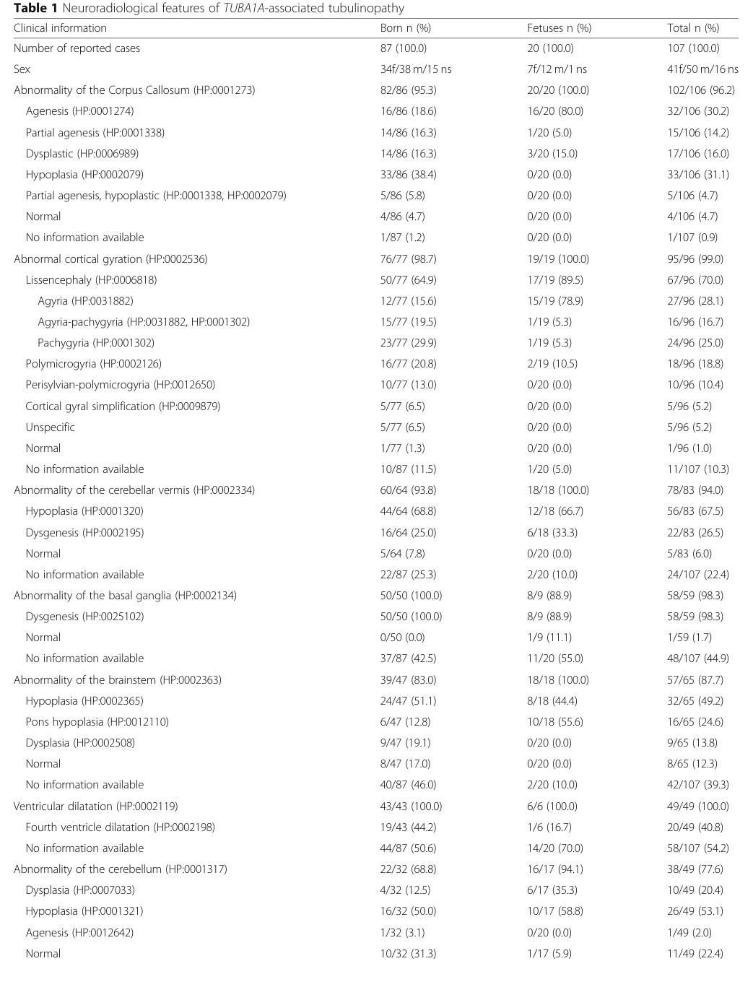

## Question

# Disease Characteristics Research Template

## Target Disease
- **Disease Name:** TUBA1A-related Tubulinopathy
- **MONDO ID:**  (if available)
- **Category:** Mendelian

## Research Objectives

Please provide a comprehensive research report on **TUBA1A-related Tubulinopathy** covering all of the
disease characteristics listed below. This report will be used to populate a disease knowledge
base entry. Be thorough and cite primary literature (PMID preferred) for all claims.

For each section, **suggested databases/resources** are listed. These are the first places
you should search for information on each topic.

---

### 1. Disease Information
> **Search first:** OMIM, Orphanet, ICD-10/ICD-11, MeSH, PubMed

- What is the disease? Provide a concise overview.
- What are the key identifiers? (OMIM, Orphanet, ICD-10/ICD-11, MeSH, Mondo)
- What are the common synonyms and alternative names?
- Is the information derived from individual patients (e.g., EHR) or aggregated disease-level resources?

### 2. Etiology

- **Disease Causal Factors**: What are the primary causes? (genetic, environmental, infectious, mechanistic)
- **Risk Factors**:
  > **Search first:** PubMed, Cochrane Library, UpToDate, clinical guidelines, ClinVar, ClinGen, GWAS Catalog, PheGenI, CTD, CDC, WHO, epidemiological databases
  - Genetic risk factors (causal variants, susceptibility loci, modifier genes)
  - Environmental risk factors (toxins, lifestyle, occupational exposures, age, sex, family history)
- **Protective Factors**:
  > **Search first:** PubMed, Cochrane Library, clinical trial databases, GWAS Catalog, gnomAD, WHO, CDC, nutrition databases
  - Genetic protective factors (protective variants, modifier alleles)
  - Environmental protective factors (diet, lifestyle, exposures that reduce risk)
- **Gene-Environment Interactions**: How do genetic and environmental factors interact to influence disease?
  > **Search first:** CTD, PubMed, PheGenI, GxE databases

### 3. Phenotypes
> **Search first:** HPO (Human Phenotype Ontology), OMIM, Orphanet, PubMed, clinicaltrials.gov, MedDRA, SNOMED CT, DECIPHER, LOINC

For each phenotype, provide:
- **Phenotype type**: symptoms, clinical signs, physical manifestations, behavioral changes, or laboratory abnormalities
  > For symptoms/signs: HPO, OMIM, Orphanet, PubMed
  > For behavioral changes: HPO, DSM, RDoC (Research Domain Criteria), PubMed
  > For laboratory abnormalities: LOINC, SNOMED CT, LabTests Online, PubMed
- **Phenotype characteristics**:
  > **Search first:** OMIM, Orphanet, HPO, PubMed
  - Age of symptom onset (neonatal, childhood, adult-onset, late-onset)
  - Symptom severity (mild, moderate, severe, variable)
  - Symptom progression (stable, progressive, episodic, fluctuating)
  - Frequency among affected individuals (percentage or qualitative)
- **Quality of life impact**: Effects on daily functioning and well-being (per-phenotype when possible)
  > **Search first:** EQ-5D database, SF-36, WHO QOL databases, PubMed
- Suggest HPO (Human Phenotype Ontology) terms for each phenotype

### 4. Genetic/Molecular Information

- **Causal Genes**: Gene mutations or chromosomal abnormalities responsible for disease (gene symbols, OMIM IDs)
  > **Search first:** OMIM, ClinVar, HGMD, Ensembl, NCBI Gene
- **Pathogenic Variants**:
  - Affected genes (gene symbols, HGNC IDs)
    > **Search first:** OMIM, NCBI Gene, Ensembl, HGNC, UniProt, GeneCards
  - Variant classification (pathogenic, likely pathogenic, VUS per ACMG/AMP guidelines)
    > **Search first:** ClinVar, ClinGen, ACMG/AMP guidelines, VarSome
  - Variant type/class (missense, frameshift, nonsense, splice-site, structural)
  - Allele frequency in population databases
    > **Search first:** gnomAD, 1000 Genomes, ExAC, TOPMed, dbSNP
  - Somatic vs germline origin
    > **Search first:** COSMIC (somatic), ClinVar, ICGC, TCGA
  - Functional consequences (loss of function, gain of function, dominant negative)
- **Modifier Genes**: Genes that modify disease severity or expression
- **Epigenetic Information**: DNA methylation, histone modifications, chromatin changes affecting disease
  > **Search first:** ENCODE, Roadmap Epigenomics, MethBase, DiseaseMeth
- **Chromosomal Abnormalities**: Large-scale genetic changes (aneuploidy, translocations, inversions)
  > **Search first:** DECIPHER, ClinVar, ECARUCA, UCSC Genome Browser

### 5. Environmental Information

- **Environmental Factors**: Non-genetic contributing factors (toxins, radiation, pollution, occupational exposure)
  > **Search first:** CTD (Comparative Toxicogenomics Database), TOXNET, PubMed, EPA databases
- **Lifestyle Factors**: Behavioral factors (smoking, diet, exercise, alcohol consumption)
  > **Search first:** CDC databases, WHO, PubMed, NHANES
- **Infectious Agents**: If applicable, pathogens causing or triggering disease (bacteria, viruses, fungi, parasites)
  > **Search first:** NCBI Taxonomy, ViPR, BV-BRC, MicrobeDB, GIDEON

### 6. Mechanism / Pathophysiology

- **Molecular Pathways**: Specific signaling cascades or biochemical pathways involved (Wnt, MAPK, mTOR, PI3K-AKT, etc.)
  > **Search first:** KEGG, Reactome, WikiPathways, PathBank, BioCyc
- **Cellular Processes**: Cell-level mechanisms (apoptosis, autophagy, cell cycle dysregulation, inflammation, etc.)
  > **Search first:** Gene Ontology (GO), Reactome, KEGG, PubMed
- **Protein Dysfunction**: How protein structure or function is altered (misfolding, aggregation, loss of function, gain of function)
  > **Search first:** UniProt, PDB (Protein Data Bank), InterPro, Pfam, AlphaFold
- **Metabolic Changes**: Alterations in metabolic processes (energy metabolism, lipid metabolism, amino acid metabolism)
  > **Search first:** KEGG, BioCyc, HMDB (Human Metabolome Database), BRENDA
- **Immune System Involvement**: Role of immune response (autoimmunity, immunodeficiency, chronic inflammation)
  > **Search first:** ImmPort, Immunome Database, IEDB, Gene Ontology
- **Tissue Damage Mechanisms**: How tissues/ are injured (oxidative stress, ischemia, fibrosis, necrosis)
  > **Search first:** PubMed, Gene Ontology, Reactome
- **Biochemical Abnormalities**: Specific molecular defects (enzyme deficiencies, receptor dysfunction, ion channel defects)
  > **Search first:** BRENDA, UniProt, KEGG, OMIM, PubMed
- **Epigenetic Changes**: DNA methylation, histone modifications affecting gene expression in disease
  > **Search first:** ENCODE, Roadmap Epigenomics, MethBase, DiseaseMeth
- **Molecular Profiling** (if available):
  - Transcriptomics/gene expression changes
    > **Search first:** GEO (Gene Expression Omnibus), ArrayExpress, GTEx, Human Cell Atlas, SRA
  - Proteomics findings
    > **Search first:** PRIDE, ProteomeXchange, Human Protein Atlas, STRING, BioGRID
  - Metabolomics signatures
    > **Search first:** MetaboLights, Metabolomics Workbench, HMDB, METLIN
  - Lipidomics alterations
    > **Search first:** LIPID MAPS, SwissLipids, LipidHome, Metabolomics Workbench
  - Genomic structural features
    > **Search first:** UCSC Genome Browser, Ensembl, NCBI, dbVar, DGV
- **Advanced Technologies** (if applicable):
  - Single-cell analysis findings (cell-type specific mechanisms, cellular heterogeneity)
    > **Search first:** Human Cell Atlas, Single Cell Portal, GEO, CELLxGENE
  - Spatial transcriptomics findings
    > **Search first:** GEO, Spatial Research, Vizgen, 10x Genomics data
  - Multi-omics integration results
    > **Search first:** TCGA, ICGC, cBioPortal, LinkedOmics, PubMed
  - Functional genomics screens (CRISPR, RNAi)
    > **Search first:** DepMap, GenomeRNAi, PubMed, BioGRID ORCS

For each mechanism, describe:
- The causal chain from initial trigger to clinical manifestation
- Which mechanisms are upstream vs downstream
- What cell types and biological processes are involved
- Suggest GO terms for biological processes and CL terms for cell types

### 7. Anatomical Structures Affected

- **Organ Level**:
  - Primary organs directly affected
  - Secondary organ involvement (complications, secondary effects)
  - Body systems involved (cardiovascular, nervous, digestive, respiratory, endocrine, etc.)
  > **Search first:** Uberon, FMA (Foundational Model of Anatomy), OMIM, HPO, ICD-11, MeSH, SNOMED CT
- **Tissue and Cell Level**:
  - Specific tissue types affected (epithelial, connective, muscle, nervous)
  - Specific cell populations targeted (with Cell Ontology terms)
  > **Search first:** Uberon, Human Protein Atlas, Cell Ontology, Human Cell Atlas, CellMarker, PanglaoDB
- **Subcellular Level**:
  - Cellular compartments involved (mitochondria, nucleus, ER, lysosomes) (with GO Cellular Component terms)
  > **Search first:** Gene Ontology (Cellular Component), UniProt, Human Protein Atlas
- **Localization**:
  - Specific anatomical sites (with UBERON terms)
    > **Search first:** FMA, Uberon, NeuroNames (for brain), SNOMED CT
  - Lateralization (unilateral, bilateral, asymmetric)
    > **Search first:** HPO, clinical literature, imaging databases

### 8. Temporal Development

- **Onset**:
  - Typical age of onset (congenital, pediatric, adult, geriatric)
  - Onset pattern (acute, subacute, chronic, insidious)
  > **Search first:** OMIM, Orphanet, HPO, PubMed
- **Progression**:
  - Disease stages (early, intermediate, advanced, end-stage)
    > **Search first:** Cancer Staging Manual (AJCC), WHO classifications, PubMed
  - Progression rate (rapid, slow, variable)
  - Disease course pattern (episodic, relapsing-remitting, progressive, stable)
  - Disease duration (self-limited, chronic lifelong)
  > **Search first:** Disease registries, longitudinal cohort databases, natural history studies, PubMed, Orphanet, OMIM
- **Patterns**:
  - Remission patterns (spontaneous, treatment-induced)
    > **Search first:** Clinical trial databases, disease registries, PubMed
  - Critical periods (time windows of vulnerability or opportunity for intervention)
    > **Search first:** PubMed, developmental biology databases, clinical guidelines

### 9. Inheritance and Population

- **Epidemiology**:
  - Prevalence (cases per 100,000 at given time)
  - Incidence (new cases per 100,000 per year)
  > **Search first:** Orphanet, CDC, WHO, GBD (Global Burden of Disease), national registries, SEER, disease registries
- **For Genetic Etiology**:
  - Inheritance pattern (AD, AR, X-linked, mitochondrial, multifactorial, polygenic)
    > **Search first:** OMIM, Orphanet, ClinVar, GTR (Genetic Testing Registry)
  - Penetrance (complete, incomplete, age-dependent)
    > **Search first:** ClinVar, OMIM, PubMed, ClinGen
  - Expressivity (variable, consistent)
    > **Search first:** OMIM, ClinVar, PubMed
  - Genetic anticipation (increasing severity in successive generations)
    > **Search first:** OMIM, PubMed (especially for repeat expansion disorders)
  - Germline mosaicism
    > **Search first:** ClinVar, OMIM, genetic counseling literature, PubMed
  - Founder effects (population-specific mutations)
    > **Search first:** gnomAD, population genetics databases, PubMed
  - Consanguinity role
    > **Search first:** OMIM, population studies, genetic counseling resources
  - Carrier frequency
    > **Search first:** gnomAD, carrier screening databases, GeneReviews, GTR
- **Population Demographics**:
  - Affected populations (ethnic or demographic groups with higher prevalence)
    > **Search first:** gnomAD, 1000 Genomes, PAGE Study, PubMed, population registries
  - Geographic distribution (endemic areas, regional variation)
    > **Search first:** WHO, CDC, GBD, Orphanet, geographic epidemiology databases
  - Geographic distribution of specific variants
  - Sex ratio (male:female)
    > **Search first:** Disease registries, OMIM, PubMed, epidemiological databases
  - Age distribution of affected individuals
    > **Search first:** CDC, disease registries, SEER, Orphanet

### 10. Diagnostics

- **Clinical Tests**:
  - Laboratory tests (blood, urine, tissue chemistry, specific enzyme assays)
    > **Search first:** LOINC, LabTests Online, PubMed
  - Biomarkers (proteins, metabolites, genetic markers, circulating biomarkers)
    > **Search first:** FDA Biomarker List, BEST (Biomarkers, EndpointS, and other Tools), PubMed
  - Imaging studies (X-ray, CT, MRI, PET, ultrasound)
    > **Search first:** RadLex, DICOM, Radiopaedia, imaging databases
  - Functional tests (pulmonary function, cardiac stress tests)
    > **Search first:** LOINC, clinical guidelines, PubMed
  - Electrophysiology (EEG, EMG, ECG, nerve conduction studies)
    > **Search first:** LOINC, clinical neurophysiology databases, PubMed
  - Biopsy findings (histopathology, immunohistochemistry)
    > **Search first:** SNOMED CT, College of American Pathologists resources, PubMed
  - Pathology findings (microscopic examination)
    > **Search first:** SNOMED CT, Digital Pathology databases, PubMed
- **Genetic Testing**:
  > **Search first:** GTR (Genetic Testing Registry), GeneReviews, ClinGen
  - Overview of recommended genetic testing approach
  - Whole genome sequencing (WGS) utility
    > **Search first:** GTR, ClinVar, GEL (Genomics England), gnomAD
  - Whole exome sequencing (WES) utility
    > **Search first:** GTR, ClinVar, OMIM, GeneMatcher
  - Gene panels (which panels, which genes)
    > **Search first:** GTR, ClinVar, laboratory-specific databases
  - Single gene testing
    > **Search first:** GTR, ClinVar, OMIM, GeneReviews
  - Chromosomal microarray (CMA)
    > **Search first:** DECIPHER, ClinVar, dbVar, ECARUCA
  - Karyotyping
    > **Search first:** Chromosome Abnormality Database, ClinVar, cytogenetics resources
  - FISH
    > **Search first:** ClinVar, cytogenetics databases, PubMed
  - Mitochondrial DNA testing
    > **Search first:** MITOMAP, MSeqDR, ClinVar, GTR
  - Repeat expansion testing
    > **Search first:** GTR, ClinVar, repeat expansion databases, PubMed
- **Omics-Based Diagnostics** (if applicable):
  - RNA sequencing / transcriptomics
    > **Search first:** GEO, ArrayExpress, GTEx, RNA-seq databases
  - Proteomics
    > **Search first:** PRIDE, ProteomeXchange, FDA Biomarker database
  - Metabolomics
    > **Search first:** MetaboLights, Metabolomics Workbench, HMDB
  - Epigenomics
    > **Search first:** GEO, ENCODE, Roadmap Epigenomics, MethBase
  - Liquid biopsy
    > **Search first:** COSMIC, ClinVar, liquid biopsy databases, PubMed
- **Clinical Criteria**:
  - Standardized diagnostic criteria (DSM, ICD, society guidelines)
    > **Search first:** DSM-5, ICD-11, clinical society guidelines, UpToDate
  - Differential diagnosis (other conditions to rule out, with distinguishing features)
    > **Search first:** DynaMed, UpToDate, clinical decision support systems
- **Screening**:
  - Screening methods for asymptomatic individuals (newborn screening, carrier screening, cascade screening)
    > **Search first:** ACMG recommendations, CDC newborn screening, GTR

### 11. Outcome/Prognosis

- **Survival and Mortality**:
  - Survival rate (5-year, 10-year, overall)
    > **Search first:** SEER, cancer registries, disease-specific registries, PubMed
  - Life expectancy (with and without treatment if applicable)
    > **Search first:** Orphanet, disease registries, actuarial databases, PubMed
  - Mortality rate
    > **Search first:** CDC, WHO, GBD, national mortality databases
  - Disease-specific mortality (deaths directly attributable to disease)
    > **Search first:** Disease registries, CDC Wonder, GBD, PubMed
- **Morbidity and Function**:
  - Morbidity (disease-related disability and health impacts)
    > **Search first:** GBD, WHO, disability databases, PubMed
  - Disability outcomes (long-term functional impairments)
    > **Search first:** ICF (International Classification of Functioning), disability registries
  - Quality of life measures (EQ-5D, SF-36, PROMIS, disease-specific tools)
    > **Search first:** EQ-5D database, SF-36, PROMIS, PubMed
- **Disease Course**:
  - Complications (secondary problems: infections, organ failure, etc.)
    > **Search first:** ICD codes, disease registries, clinical databases, PubMed
  - Recovery potential (likelihood and extent of recovery, with vs without treatment)
    > **Search first:** Natural history studies, rehabilitation databases, PubMed
- **Prediction**:
  - Prognostic factors (age, disease severity, biomarkers, treatment response)
    > **Search first:** Prognostic models databases, clinical calculators, PubMed
  - Prognostic biomarkers (molecular markers predicting disease course)
    > **Search first:** FDA Biomarker database, PubMed, cancer prognostic databases

### 12. Treatment

- **Pharmacotherapy**:
  - Pharmacological treatments (drug names, drug classes, mechanisms of action)
    > **Search first:** DrugBank, RxNorm, ATC classification, DailyMed, FDA databases
  - Pharmacogenomics (how genetic variants affect drug metabolism, efficacy, toxicity)
    > **Search first:** PharmGKB, CPIC (Clinical Pharmacogenetics), FDA Table of PGx Biomarkers
- **Advanced Therapeutics**:
  - Gene therapy (viral vectors, CRISPR, gene replacement, gene editing)
    > **Search first:** ClinicalTrials.gov, FDA gene therapy database, ASGCT resources
  - Cell therapy (stem cell transplant, CAR-T, cellular therapeutics)
    > **Search first:** ClinicalTrials.gov, FDA cell therapy database, FACT standards
  - RNA-based therapies (ASOs, siRNA, mRNA therapies)
    > **Search first:** ClinicalTrials.gov, FDA approvals, PubMed
  - Targeted therapies (treatments directed at specific molecular targets)
    > **Search first:** My Cancer Genome, OncoKB, ClinicalTrials.gov, FDA approvals
  - Immunotherapies (checkpoint inhibitors, monoclonal antibodies)
    > **Search first:** Cancer Immunotherapy Database, FDA approvals, ClinicalTrials.gov
- **Surgical and Interventional**:
  - Surgical interventions (types of surgery, timing, outcomes)
    > **Search first:** CPT codes, surgical registries, clinical guidelines, PubMed
- **Supportive and Rehabilitative**:
  - Supportive care (symptom management, pain control, nutrition)
    > **Search first:** Clinical guidelines, Cochrane Library, PubMed
  - Rehabilitation (physical therapy, occupational therapy, speech therapy)
    > **Search first:** Rehabilitation medicine databases, clinical guidelines, PubMed
- **Experimental**:
  - Experimental treatments in clinical trials (with NCT identifiers if available)
    > **Search first:** ClinicalTrials.gov, EU Clinical Trials Register, WHO ICTRP
- **Treatment Outcomes**:
  - Treatment response rates
    > **Search first:** Clinical trial databases, FDA reviews, systematic reviews, PubMed
  - Side effects and adverse events
    > **Search first:** FDA Adverse Event Reporting System (FAERS), MedWatch, PubMed
- **Treatment Strategy**:
  - Treatment algorithms (clinical pathways, decision trees)
    > **Search first:** Clinical practice guidelines, NCCN Guidelines, UpToDate
  - Combination therapies
    > **Search first:** ClinicalTrials.gov, treatment guidelines, PubMed
  - Personalized medicine approaches (genotype-guided treatment)
    > **Search first:** My Cancer Genome, CIViC, PharmGKB, precision medicine databases

For each treatment, suggest MAXO (Medical Action Ontology) terms where applicable.

### 13. Prevention

- **Prevention Levels**:
  - Primary prevention (preventing disease occurrence: vaccination, risk factor modification)
    > **Search first:** CDC, WHO, USPSTF recommendations, Cochrane Library
  - Secondary prevention (early detection and treatment: screening programs, early intervention)
    > **Search first:** USPSTF, CDC screening guidelines, WHO
  - Tertiary prevention (preventing complications in those with disease)
    > **Search first:** Clinical guidelines, disease management protocols, PubMed
- **Immunization**: Vaccine strategies (if applicable)
  > **Search first:** CDC vaccine schedules, WHO immunization, FDA vaccine database
- **Screening and Early Detection**:
  - Screening programs (population-based: newborn screening, cancer screening)
    > **Search first:** CDC screening programs, USPSTF, cancer screening databases
  - Genetic screening (carrier screening, preimplantation genetic diagnosis, prenatal testing)
    > **Search first:** ACMG recommendations, ACOG guidelines, GTR
  - Risk stratification (identifying high-risk individuals for targeted prevention)
    > **Search first:** Risk prediction models, clinical calculators, PubMed
- **Behavioral Interventions**: Lifestyle modifications to reduce risk
  > **Search first:** CDC, WHO, behavioral intervention databases, Cochrane Library
- **Counseling**: Genetic counseling (risk assessment, family planning guidance)
  > **Search first:** NSGC resources, ACMG guidelines, GeneReviews
- **Public Health**:
  - Public health interventions (sanitation, vector control, health education)
    > **Search first:** CDC, WHO, public health databases, PubMed
  - Environmental interventions (reducing environmental risk factors)
    > **Search first:** EPA databases, WHO environmental health, PubMed
- **Prophylaxis**: Preventive medications or procedures
  > **Search first:** Clinical guidelines, FDA approvals, PubMed

### 14. Other Species / Natural Disease

- **Taxonomy**: Species affected (with NCBI Taxon identifiers)
  > **Search first:** NCBI Taxonomy
- **Breed**: Specific breeds affected (with VBO identifiers if applicable)
  > **Search first:** VBO (Vertebrate Breed Ontology)
- **Gene**: Orthologous genes in other species (with NCBI Gene IDs)
  > **Search first:** NCBI Gene
- **Natural Disease**:
  - Naturally occurring disease in other species (companion animals, wildlife)
    > **Search first:** OMIA (Online Mendelian Inheritance in Animals), VetCompass, PubMed
  - Veterinary relevance and importance in animal health
    > **Search first:** OMIA, veterinary databases, PubMed
- **Comparative Biology**:
  - Comparative pathology (similarities and differences across species)
    > **Search first:** OMIA, comparative pathology databases, PubMed
  - Evolutionary conservation of disease mechanisms
    > **Search first:** HomoloGene, OrthoMCL, Alliance of Genome Resources
- **Transmission** (if applicable):
  - Zoonotic potential
    > **Search first:** CDC zoonotic diseases, WHO zoonoses, GIDEON
  - Cross-species susceptibility
    > **Search first:** NCBI Taxonomy, veterinary databases, PubMed

### 15. Model Organisms

- **Model Types**:
  - Model organism type (mammalian, invertebrate, cellular, in vitro)
    > **Search first:** Alliance of Genome Resources, model organism databases
  - Specific model systems (mouse, rat, zebrafish, Drosophila, C. elegans, yeast, cell lines, organoids, iPSCs)
    > **Search first:** MGI, RGD, ZFIN, FlyBase, WormBase, SGD, ATCC, Cellosaurus
  - Induced models (drug treatment, surgical intervention, environmental manipulation)
    > **Search first:** MGI, model organism databases, PubMed
- **Genetic Models**:
  - Types available (knockout, knock-in, transgenic, conditional, humanized)
    > **Search first:** MGI, IMPC, KOMP, EuMMCR, IMSR
- **Model Characteristics**:
  - Phenotype recapitulation (how well model reproduces human disease features)
    > **Search first:** Model organism databases, comparative studies, PubMed
  - Model limitations (aspects of human disease not captured)
    > **Search first:** Model organism databases, PubMed, review articles
- **Applications**:
  - Research applications (what aspects of disease can be studied)
    > **Search first:** Model organism databases, PubMed
- **Resources**:
  - Model databases
    > **Search first:** MGI, RGD, ZFIN, FlyBase, WormBase, IMSR, EMMA, MMRRC

---

## Citation Requirements

- Cite primary literature (PMID preferred) for all mechanistic and clinical claims
- Prioritize recent reviews and landmark papers
- Include direct quotes from abstracts where possible to support key statements
- Distinguish evidence source types: human clinical, model organism, in vitro, computational

## Output Format

Structure your response as a comprehensive narrative organized by the sections above.
For each section, provide:
- Factual content with specific details (numbers, percentages, gene names, variant nomenclature)
- Ontology term suggestions (HPO, GO, CL, UBERON, CHEBI, MAXO, MONDO) where applicable
- Evidence citations with PMIDs
- Direct quotes from abstracts to support key claims
- Clear indication when information is not available or not applicable for this disease

This report will be used to populate a disease knowledge base entry with:
- Pathophysiology descriptions with causal chains
- Gene/protein annotations (HGNC, GO terms)
- Phenotype associations (HP terms) with frequencies
- Cell type involvement (CL terms)
- Anatomical locations (UBERON terms)
- Chemical entities (CHEBI terms)
- Treatment annotations (MAXO terms)
- Evidence items with PMIDs and exact abstract quotes
- Epidemiology, prognosis, diagnostic, and prevention information
- Animal model descriptions with phenotype recapitulation details

## Output

Question: You are an expert researcher providing comprehensive, well-cited information.

Provide detailed information focusing on:
1. Key concepts and definitions with current understanding
2. Recent developments and latest research (prioritize 2023-2024 sources)
3. Current applications and real-world implementations
4. Expert opinions and analysis from authoritative sources
5. Relevant statistics and data from recent studies

Format as a comprehensive research report with proper citations. Include URLs and publication dates where available.
Always prioritize recent, authoritative sources and provide specific citations for all major claims.

# Disease Characteristics Research Template

## Target Disease
- **Disease Name:** TUBA1A-related Tubulinopathy
- **MONDO ID:**  (if available)
- **Category:** Mendelian

## Research Objectives

Please provide a comprehensive research report on **TUBA1A-related Tubulinopathy** covering all of the
disease characteristics listed below. This report will be used to populate a disease knowledge
base entry. Be thorough and cite primary literature (PMID preferred) for all claims.

For each section, **suggested databases/resources** are listed. These are the first places
you should search for information on each topic.

---

### 1. Disease Information
> **Search first:** OMIM, Orphanet, ICD-10/ICD-11, MeSH, PubMed

- What is the disease? Provide a concise overview.
- What are the key identifiers? (OMIM, Orphanet, ICD-10/ICD-11, MeSH, Mondo)
- What are the common synonyms and alternative names?
- Is the information derived from individual patients (e.g., EHR) or aggregated disease-level resources?

### 2. Etiology

- **Disease Causal Factors**: What are the primary causes? (genetic, environmental, infectious, mechanistic)
- **Risk Factors**:
  > **Search first:** PubMed, Cochrane Library, UpToDate, clinical guidelines, ClinVar, ClinGen, GWAS Catalog, PheGenI, CTD, CDC, WHO, epidemiological databases
  - Genetic risk factors (causal variants, susceptibility loci, modifier genes)
  - Environmental risk factors (toxins, lifestyle, occupational exposures, age, sex, family history)
- **Protective Factors**:
  > **Search first:** PubMed, Cochrane Library, clinical trial databases, GWAS Catalog, gnomAD, WHO, CDC, nutrition databases
  - Genetic protective factors (protective variants, modifier alleles)
  - Environmental protective factors (diet, lifestyle, exposures that reduce risk)
- **Gene-Environment Interactions**: How do genetic and environmental factors interact to influence disease?
  > **Search first:** CTD, PubMed, PheGenI, GxE databases

### 3. Phenotypes
> **Search first:** HPO (Human Phenotype Ontology), OMIM, Orphanet, PubMed, clinicaltrials.gov, MedDRA, SNOMED CT, DECIPHER, LOINC

For each phenotype, provide:
- **Phenotype type**: symptoms, clinical signs, physical manifestations, behavioral changes, or laboratory abnormalities
  > For symptoms/signs: HPO, OMIM, Orphanet, PubMed
  > For behavioral changes: HPO, DSM, RDoC (Research Domain Criteria), PubMed
  > For laboratory abnormalities: LOINC, SNOMED CT, LabTests Online, PubMed
- **Phenotype characteristics**:
  > **Search first:** OMIM, Orphanet, HPO, PubMed
  - Age of symptom onset (neonatal, childhood, adult-onset, late-onset)
  - Symptom severity (mild, moderate, severe, variable)
  - Symptom progression (stable, progressive, episodic, fluctuating)
  - Frequency among affected individuals (percentage or qualitative)
- **Quality of life impact**: Effects on daily functioning and well-being (per-phenotype when possible)
  > **Search first:** EQ-5D database, SF-36, WHO QOL databases, PubMed
- Suggest HPO (Human Phenotype Ontology) terms for each phenotype

### 4. Genetic/Molecular Information

- **Causal Genes**: Gene mutations or chromosomal abnormalities responsible for disease (gene symbols, OMIM IDs)
  > **Search first:** OMIM, ClinVar, HGMD, Ensembl, NCBI Gene
- **Pathogenic Variants**:
  - Affected genes (gene symbols, HGNC IDs)
    > **Search first:** OMIM, NCBI Gene, Ensembl, HGNC, UniProt, GeneCards
  - Variant classification (pathogenic, likely pathogenic, VUS per ACMG/AMP guidelines)
    > **Search first:** ClinVar, ClinGen, ACMG/AMP guidelines, VarSome
  - Variant type/class (missense, frameshift, nonsense, splice-site, structural)
  - Allele frequency in population databases
    > **Search first:** gnomAD, 1000 Genomes, ExAC, TOPMed, dbSNP
  - Somatic vs germline origin
    > **Search first:** COSMIC (somatic), ClinVar, ICGC, TCGA
  - Functional consequences (loss of function, gain of function, dominant negative)
- **Modifier Genes**: Genes that modify disease severity or expression
- **Epigenetic Information**: DNA methylation, histone modifications, chromatin changes affecting disease
  > **Search first:** ENCODE, Roadmap Epigenomics, MethBase, DiseaseMeth
- **Chromosomal Abnormalities**: Large-scale genetic changes (aneuploidy, translocations, inversions)
  > **Search first:** DECIPHER, ClinVar, ECARUCA, UCSC Genome Browser

### 5. Environmental Information

- **Environmental Factors**: Non-genetic contributing factors (toxins, radiation, pollution, occupational exposure)
  > **Search first:** CTD (Comparative Toxicogenomics Database), TOXNET, PubMed, EPA databases
- **Lifestyle Factors**: Behavioral factors (smoking, diet, exercise, alcohol consumption)
  > **Search first:** CDC databases, WHO, PubMed, NHANES
- **Infectious Agents**: If applicable, pathogens causing or triggering disease (bacteria, viruses, fungi, parasites)
  > **Search first:** NCBI Taxonomy, ViPR, BV-BRC, MicrobeDB, GIDEON

### 6. Mechanism / Pathophysiology

- **Molecular Pathways**: Specific signaling cascades or biochemical pathways involved (Wnt, MAPK, mTOR, PI3K-AKT, etc.)
  > **Search first:** KEGG, Reactome, WikiPathways, PathBank, BioCyc
- **Cellular Processes**: Cell-level mechanisms (apoptosis, autophagy, cell cycle dysregulation, inflammation, etc.)
  > **Search first:** Gene Ontology (GO), Reactome, KEGG, PubMed
- **Protein Dysfunction**: How protein structure or function is altered (misfolding, aggregation, loss of function, gain of function)
  > **Search first:** UniProt, PDB (Protein Data Bank), InterPro, Pfam, AlphaFold
- **Metabolic Changes**: Alterations in metabolic processes (energy metabolism, lipid metabolism, amino acid metabolism)
  > **Search first:** KEGG, BioCyc, HMDB (Human Metabolome Database), BRENDA
- **Immune System Involvement**: Role of immune response (autoimmunity, immunodeficiency, chronic inflammation)
  > **Search first:** ImmPort, Immunome Database, IEDB, Gene Ontology
- **Tissue Damage Mechanisms**: How tissues/ are injured (oxidative stress, ischemia, fibrosis, necrosis)
  > **Search first:** PubMed, Gene Ontology, Reactome
- **Biochemical Abnormalities**: Specific molecular defects (enzyme deficiencies, receptor dysfunction, ion channel defects)
  > **Search first:** BRENDA, UniProt, KEGG, OMIM, PubMed
- **Epigenetic Changes**: DNA methylation, histone modifications affecting gene expression in disease
  > **Search first:** ENCODE, Roadmap Epigenomics, MethBase, DiseaseMeth
- **Molecular Profiling** (if available):
  - Transcriptomics/gene expression changes
    > **Search first:** GEO (Gene Expression Omnibus), ArrayExpress, GTEx, Human Cell Atlas, SRA
  - Proteomics findings
    > **Search first:** PRIDE, ProteomeXchange, Human Protein Atlas, STRING, BioGRID
  - Metabolomics signatures
    > **Search first:** MetaboLights, Metabolomics Workbench, HMDB, METLIN
  - Lipidomics alterations
    > **Search first:** LIPID MAPS, SwissLipids, LipidHome, Metabolomics Workbench
  - Genomic structural features
    > **Search first:** UCSC Genome Browser, Ensembl, NCBI, dbVar, DGV
- **Advanced Technologies** (if applicable):
  - Single-cell analysis findings (cell-type specific mechanisms, cellular heterogeneity)
    > **Search first:** Human Cell Atlas, Single Cell Portal, GEO, CELLxGENE
  - Spatial transcriptomics findings
    > **Search first:** GEO, Spatial Research, Vizgen, 10x Genomics data
  - Multi-omics integration results
    > **Search first:** TCGA, ICGC, cBioPortal, LinkedOmics, PubMed
  - Functional genomics screens (CRISPR, RNAi)
    > **Search first:** DepMap, GenomeRNAi, PubMed, BioGRID ORCS

For each mechanism, describe:
- The causal chain from initial trigger to clinical manifestation
- Which mechanisms are upstream vs downstream
- What cell types and biological processes are involved
- Suggest GO terms for biological processes and CL terms for cell types

### 7. Anatomical Structures Affected

- **Organ Level**:
  - Primary organs directly affected
  - Secondary organ involvement (complications, secondary effects)
  - Body systems involved (cardiovascular, nervous, digestive, respiratory, endocrine, etc.)
  > **Search first:** Uberon, FMA (Foundational Model of Anatomy), OMIM, HPO, ICD-11, MeSH, SNOMED CT
- **Tissue and Cell Level**:
  - Specific tissue types affected (epithelial, connective, muscle, nervous)
  - Specific cell populations targeted (with Cell Ontology terms)
  > **Search first:** Uberon, Human Protein Atlas, Cell Ontology, Human Cell Atlas, CellMarker, PanglaoDB
- **Subcellular Level**:
  - Cellular compartments involved (mitochondria, nucleus, ER, lysosomes) (with GO Cellular Component terms)
  > **Search first:** Gene Ontology (Cellular Component), UniProt, Human Protein Atlas
- **Localization**:
  - Specific anatomical sites (with UBERON terms)
    > **Search first:** FMA, Uberon, NeuroNames (for brain), SNOMED CT
  - Lateralization (unilateral, bilateral, asymmetric)
    > **Search first:** HPO, clinical literature, imaging databases

### 8. Temporal Development

- **Onset**:
  - Typical age of onset (congenital, pediatric, adult, geriatric)
  - Onset pattern (acute, subacute, chronic, insidious)
  > **Search first:** OMIM, Orphanet, HPO, PubMed
- **Progression**:
  - Disease stages (early, intermediate, advanced, end-stage)
    > **Search first:** Cancer Staging Manual (AJCC), WHO classifications, PubMed
  - Progression rate (rapid, slow, variable)
  - Disease course pattern (episodic, relapsing-remitting, progressive, stable)
  - Disease duration (self-limited, chronic lifelong)
  > **Search first:** Disease registries, longitudinal cohort databases, natural history studies, PubMed, Orphanet, OMIM
- **Patterns**:
  - Remission patterns (spontaneous, treatment-induced)
    > **Search first:** Clinical trial databases, disease registries, PubMed
  - Critical periods (time windows of vulnerability or opportunity for intervention)
    > **Search first:** PubMed, developmental biology databases, clinical guidelines

### 9. Inheritance and Population

- **Epidemiology**:
  - Prevalence (cases per 100,000 at given time)
  - Incidence (new cases per 100,000 per year)
  > **Search first:** Orphanet, CDC, WHO, GBD (Global Burden of Disease), national registries, SEER, disease registries
- **For Genetic Etiology**:
  - Inheritance pattern (AD, AR, X-linked, mitochondrial, multifactorial, polygenic)
    > **Search first:** OMIM, Orphanet, ClinVar, GTR (Genetic Testing Registry)
  - Penetrance (complete, incomplete, age-dependent)
    > **Search first:** ClinVar, OMIM, PubMed, ClinGen
  - Expressivity (variable, consistent)
    > **Search first:** OMIM, ClinVar, PubMed
  - Genetic anticipation (increasing severity in successive generations)
    > **Search first:** OMIM, PubMed (especially for repeat expansion disorders)
  - Germline mosaicism
    > **Search first:** ClinVar, OMIM, genetic counseling literature, PubMed
  - Founder effects (population-specific mutations)
    > **Search first:** gnomAD, population genetics databases, PubMed
  - Consanguinity role
    > **Search first:** OMIM, population studies, genetic counseling resources
  - Carrier frequency
    > **Search first:** gnomAD, carrier screening databases, GeneReviews, GTR
- **Population Demographics**:
  - Affected populations (ethnic or demographic groups with higher prevalence)
    > **Search first:** gnomAD, 1000 Genomes, PAGE Study, PubMed, population registries
  - Geographic distribution (endemic areas, regional variation)
    > **Search first:** WHO, CDC, GBD, Orphanet, geographic epidemiology databases
  - Geographic distribution of specific variants
  - Sex ratio (male:female)
    > **Search first:** Disease registries, OMIM, PubMed, epidemiological databases
  - Age distribution of affected individuals
    > **Search first:** CDC, disease registries, SEER, Orphanet

### 10. Diagnostics

- **Clinical Tests**:
  - Laboratory tests (blood, urine, tissue chemistry, specific enzyme assays)
    > **Search first:** LOINC, LabTests Online, PubMed
  - Biomarkers (proteins, metabolites, genetic markers, circulating biomarkers)
    > **Search first:** FDA Biomarker List, BEST (Biomarkers, EndpointS, and other Tools), PubMed
  - Imaging studies (X-ray, CT, MRI, PET, ultrasound)
    > **Search first:** RadLex, DICOM, Radiopaedia, imaging databases
  - Functional tests (pulmonary function, cardiac stress tests)
    > **Search first:** LOINC, clinical guidelines, PubMed
  - Electrophysiology (EEG, EMG, ECG, nerve conduction studies)
    > **Search first:** LOINC, clinical neurophysiology databases, PubMed
  - Biopsy findings (histopathology, immunohistochemistry)
    > **Search first:** SNOMED CT, College of American Pathologists resources, PubMed
  - Pathology findings (microscopic examination)
    > **Search first:** SNOMED CT, Digital Pathology databases, PubMed
- **Genetic Testing**:
  > **Search first:** GTR (Genetic Testing Registry), GeneReviews, ClinGen
  - Overview of recommended genetic testing approach
  - Whole genome sequencing (WGS) utility
    > **Search first:** GTR, ClinVar, GEL (Genomics England), gnomAD
  - Whole exome sequencing (WES) utility
    > **Search first:** GTR, ClinVar, OMIM, GeneMatcher
  - Gene panels (which panels, which genes)
    > **Search first:** GTR, ClinVar, laboratory-specific databases
  - Single gene testing
    > **Search first:** GTR, ClinVar, OMIM, GeneReviews
  - Chromosomal microarray (CMA)
    > **Search first:** DECIPHER, ClinVar, dbVar, ECARUCA
  - Karyotyping
    > **Search first:** Chromosome Abnormality Database, ClinVar, cytogenetics resources
  - FISH
    > **Search first:** ClinVar, cytogenetics databases, PubMed
  - Mitochondrial DNA testing
    > **Search first:** MITOMAP, MSeqDR, ClinVar, GTR
  - Repeat expansion testing
    > **Search first:** GTR, ClinVar, repeat expansion databases, PubMed
- **Omics-Based Diagnostics** (if applicable):
  - RNA sequencing / transcriptomics
    > **Search first:** GEO, ArrayExpress, GTEx, RNA-seq databases
  - Proteomics
    > **Search first:** PRIDE, ProteomeXchange, FDA Biomarker database
  - Metabolomics
    > **Search first:** MetaboLights, Metabolomics Workbench, HMDB
  - Epigenomics
    > **Search first:** GEO, ENCODE, Roadmap Epigenomics, MethBase
  - Liquid biopsy
    > **Search first:** COSMIC, ClinVar, liquid biopsy databases, PubMed
- **Clinical Criteria**:
  - Standardized diagnostic criteria (DSM, ICD, society guidelines)
    > **Search first:** DSM-5, ICD-11, clinical society guidelines, UpToDate
  - Differential diagnosis (other conditions to rule out, with distinguishing features)
    > **Search first:** DynaMed, UpToDate, clinical decision support systems
- **Screening**:
  - Screening methods for asymptomatic individuals (newborn screening, carrier screening, cascade screening)
    > **Search first:** ACMG recommendations, CDC newborn screening, GTR

### 11. Outcome/Prognosis

- **Survival and Mortality**:
  - Survival rate (5-year, 10-year, overall)
    > **Search first:** SEER, cancer registries, disease-specific registries, PubMed
  - Life expectancy (with and without treatment if applicable)
    > **Search first:** Orphanet, disease registries, actuarial databases, PubMed
  - Mortality rate
    > **Search first:** CDC, WHO, GBD, national mortality databases
  - Disease-specific mortality (deaths directly attributable to disease)
    > **Search first:** Disease registries, CDC Wonder, GBD, PubMed
- **Morbidity and Function**:
  - Morbidity (disease-related disability and health impacts)
    > **Search first:** GBD, WHO, disability databases, PubMed
  - Disability outcomes (long-term functional impairments)
    > **Search first:** ICF (International Classification of Functioning), disability registries
  - Quality of life measures (EQ-5D, SF-36, PROMIS, disease-specific tools)
    > **Search first:** EQ-5D database, SF-36, PROMIS, PubMed
- **Disease Course**:
  - Complications (secondary problems: infections, organ failure, etc.)
    > **Search first:** ICD codes, disease registries, clinical databases, PubMed
  - Recovery potential (likelihood and extent of recovery, with vs without treatment)
    > **Search first:** Natural history studies, rehabilitation databases, PubMed
- **Prediction**:
  - Prognostic factors (age, disease severity, biomarkers, treatment response)
    > **Search first:** Prognostic models databases, clinical calculators, PubMed
  - Prognostic biomarkers (molecular markers predicting disease course)
    > **Search first:** FDA Biomarker database, PubMed, cancer prognostic databases

### 12. Treatment

- **Pharmacotherapy**:
  - Pharmacological treatments (drug names, drug classes, mechanisms of action)
    > **Search first:** DrugBank, RxNorm, ATC classification, DailyMed, FDA databases
  - Pharmacogenomics (how genetic variants affect drug metabolism, efficacy, toxicity)
    > **Search first:** PharmGKB, CPIC (Clinical Pharmacogenetics), FDA Table of PGx Biomarkers
- **Advanced Therapeutics**:
  - Gene therapy (viral vectors, CRISPR, gene replacement, gene editing)
    > **Search first:** ClinicalTrials.gov, FDA gene therapy database, ASGCT resources
  - Cell therapy (stem cell transplant, CAR-T, cellular therapeutics)
    > **Search first:** ClinicalTrials.gov, FDA cell therapy database, FACT standards
  - RNA-based therapies (ASOs, siRNA, mRNA therapies)
    > **Search first:** ClinicalTrials.gov, FDA approvals, PubMed
  - Targeted therapies (treatments directed at specific molecular targets)
    > **Search first:** My Cancer Genome, OncoKB, ClinicalTrials.gov, FDA approvals
  - Immunotherapies (checkpoint inhibitors, monoclonal antibodies)
    > **Search first:** Cancer Immunotherapy Database, FDA approvals, ClinicalTrials.gov
- **Surgical and Interventional**:
  - Surgical interventions (types of surgery, timing, outcomes)
    > **Search first:** CPT codes, surgical registries, clinical guidelines, PubMed
- **Supportive and Rehabilitative**:
  - Supportive care (symptom management, pain control, nutrition)
    > **Search first:** Clinical guidelines, Cochrane Library, PubMed
  - Rehabilitation (physical therapy, occupational therapy, speech therapy)
    > **Search first:** Rehabilitation medicine databases, clinical guidelines, PubMed
- **Experimental**:
  - Experimental treatments in clinical trials (with NCT identifiers if available)
    > **Search first:** ClinicalTrials.gov, EU Clinical Trials Register, WHO ICTRP
- **Treatment Outcomes**:
  - Treatment response rates
    > **Search first:** Clinical trial databases, FDA reviews, systematic reviews, PubMed
  - Side effects and adverse events
    > **Search first:** FDA Adverse Event Reporting System (FAERS), MedWatch, PubMed
- **Treatment Strategy**:
  - Treatment algorithms (clinical pathways, decision trees)
    > **Search first:** Clinical practice guidelines, NCCN Guidelines, UpToDate
  - Combination therapies
    > **Search first:** ClinicalTrials.gov, treatment guidelines, PubMed
  - Personalized medicine approaches (genotype-guided treatment)
    > **Search first:** My Cancer Genome, CIViC, PharmGKB, precision medicine databases

For each treatment, suggest MAXO (Medical Action Ontology) terms where applicable.

### 13. Prevention

- **Prevention Levels**:
  - Primary prevention (preventing disease occurrence: vaccination, risk factor modification)
    > **Search first:** CDC, WHO, USPSTF recommendations, Cochrane Library
  - Secondary prevention (early detection and treatment: screening programs, early intervention)
    > **Search first:** USPSTF, CDC screening guidelines, WHO
  - Tertiary prevention (preventing complications in those with disease)
    > **Search first:** Clinical guidelines, disease management protocols, PubMed
- **Immunization**: Vaccine strategies (if applicable)
  > **Search first:** CDC vaccine schedules, WHO immunization, FDA vaccine database
- **Screening and Early Detection**:
  - Screening programs (population-based: newborn screening, cancer screening)
    > **Search first:** CDC screening programs, USPSTF, cancer screening databases
  - Genetic screening (carrier screening, preimplantation genetic diagnosis, prenatal testing)
    > **Search first:** ACMG recommendations, ACOG guidelines, GTR
  - Risk stratification (identifying high-risk individuals for targeted prevention)
    > **Search first:** Risk prediction models, clinical calculators, PubMed
- **Behavioral Interventions**: Lifestyle modifications to reduce risk
  > **Search first:** CDC, WHO, behavioral intervention databases, Cochrane Library
- **Counseling**: Genetic counseling (risk assessment, family planning guidance)
  > **Search first:** NSGC resources, ACMG guidelines, GeneReviews
- **Public Health**:
  - Public health interventions (sanitation, vector control, health education)
    > **Search first:** CDC, WHO, public health databases, PubMed
  - Environmental interventions (reducing environmental risk factors)
    > **Search first:** EPA databases, WHO environmental health, PubMed
- **Prophylaxis**: Preventive medications or procedures
  > **Search first:** Clinical guidelines, FDA approvals, PubMed

### 14. Other Species / Natural Disease

- **Taxonomy**: Species affected (with NCBI Taxon identifiers)
  > **Search first:** NCBI Taxonomy
- **Breed**: Specific breeds affected (with VBO identifiers if applicable)
  > **Search first:** VBO (Vertebrate Breed Ontology)
- **Gene**: Orthologous genes in other species (with NCBI Gene IDs)
  > **Search first:** NCBI Gene
- **Natural Disease**:
  - Naturally occurring disease in other species (companion animals, wildlife)
    > **Search first:** OMIA (Online Mendelian Inheritance in Animals), VetCompass, PubMed
  - Veterinary relevance and importance in animal health
    > **Search first:** OMIA, veterinary databases, PubMed
- **Comparative Biology**:
  - Comparative pathology (similarities and differences across species)
    > **Search first:** OMIA, comparative pathology databases, PubMed
  - Evolutionary conservation of disease mechanisms
    > **Search first:** HomoloGene, OrthoMCL, Alliance of Genome Resources
- **Transmission** (if applicable):
  - Zoonotic potential
    > **Search first:** CDC zoonotic diseases, WHO zoonoses, GIDEON
  - Cross-species susceptibility
    > **Search first:** NCBI Taxonomy, veterinary databases, PubMed

### 15. Model Organisms

- **Model Types**:
  - Model organism type (mammalian, invertebrate, cellular, in vitro)
    > **Search first:** Alliance of Genome Resources, model organism databases
  - Specific model systems (mouse, rat, zebrafish, Drosophila, C. elegans, yeast, cell lines, organoids, iPSCs)
    > **Search first:** MGI, RGD, ZFIN, FlyBase, WormBase, SGD, ATCC, Cellosaurus
  - Induced models (drug treatment, surgical intervention, environmental manipulation)
    > **Search first:** MGI, model organism databases, PubMed
- **Genetic Models**:
  - Types available (knockout, knock-in, transgenic, conditional, humanized)
    > **Search first:** MGI, IMPC, KOMP, EuMMCR, IMSR
- **Model Characteristics**:
  - Phenotype recapitulation (how well model reproduces human disease features)
    > **Search first:** Model organism databases, comparative studies, PubMed
  - Model limitations (aspects of human disease not captured)
    > **Search first:** Model organism databases, PubMed, review articles
- **Applications**:
  - Research applications (what aspects of disease can be studied)
    > **Search first:** Model organism databases, PubMed
- **Resources**:
  - Model databases
    > **Search first:** MGI, RGD, ZFIN, FlyBase, WormBase, IMSR, EMMA, MMRRC

---

## Citation Requirements

- Cite primary literature (PMID preferred) for all mechanistic and clinical claims
- Prioritize recent reviews and landmark papers
- Include direct quotes from abstracts where possible to support key statements
- Distinguish evidence source types: human clinical, model organism, in vitro, computational

## Output Format

Structure your response as a comprehensive narrative organized by the sections above.
For each section, provide:
- Factual content with specific details (numbers, percentages, gene names, variant nomenclature)
- Ontology term suggestions (HPO, GO, CL, UBERON, CHEBI, MAXO, MONDO) where applicable
- Evidence citations with PMIDs
- Direct quotes from abstracts to support key claims
- Clear indication when information is not available or not applicable for this disease

This report will be used to populate a disease knowledge base entry with:
- Pathophysiology descriptions with causal chains
- Gene/protein annotations (HGNC, GO terms)
- Phenotype associations (HP terms) with frequencies
- Cell type involvement (CL terms)
- Anatomical locations (UBERON terms)
- Chemical entities (CHEBI terms)
- Treatment annotations (MAXO terms)
- Evidence items with PMIDs and exact abstract quotes
- Epidemiology, prognosis, diagnostic, and prevention information
- Animal model descriptions with phenotype recapitulation details

# TUBA1A-related Tubulinopathy (TUBA1A-associated tubulinopathy / LIS3)

## Executive summary
TUBA1A-related tubulinopathy is an autosomal-dominant neurodevelopmental disorder caused predominantly by heterozygous (usually de novo) TUBA1A missense variants that disrupt microtubule function during cortical development, leading to malformations of cortical development (MCD) such as lissencephaly/pachygyria, polymicrogyria-like dysgenesis, and associated abnormalities of the corpus callosum, basal ganglia, cerebellum/brainstem, and ventricles, with frequent global developmental delay and epilepsy. Large aggregated analyses (166 individuals) and more recent phenotype-deep cohorts (10 individuals with detailed epilepsy phenotyping) provide quantitative phenotype frequencies and expanding genotype–phenotype correlations, while real-world genomic testing cohorts show high diagnostic yield for “tubulinopathy” imaging patterns and prominent contribution from TUBA1A. (hebebrand2019themutationaland pages 1-2, hebebrand2019themutationaland pages 2-3, kooshavar2024diagnosticutilityof pages 4-5, schroter2022complementingthephenotypical pages 1-2)

| Study (year, journal) | Cohort | Key phenotype stats | Variant/genetic stats | Diagnostic/testing stats | URL/DOI |
|---|---|---|---|---|---|
| Hebebrand et al. 2019, *Orphanet Journal of Rare Diseases* | 166 affected individuals total (146 born, 20 fetuses); HPO-standardized clinical data available for 107 cases | Developmental delay 98.1% (52/53); corpus callosum anomalies 96.2% (102/106); microcephaly 76.0% (57/75); lissencephaly/agyria-pachygyria 70.0% (67/96) (hebebrand2019themutationaland pages 1-2, hebebrand2019themutationaland pages 2-3, hebebrand2019themutationaland media ec7b3e06) | 121 distinct TUBA1A variants identified, including 15 recurrent variants; missense variants clustered in the C-terminal region; Arg402 was the most commonly affected residue (13.3% of cases/variants reviewed) (hebebrand2019themutationaland pages 1-2, hebebrand2019themutationaland pages 5-6) | Exome sequencing identified heterozygous de novo missense variants in new cases; study also curated ClinVar/DECIPHER/denovo-db and applied ACMG-style interpretation workflows (hebebrand2019themutationaland pages 1-2, hebebrand2019themutationaland pages 2-3) | https://doi.org/10.1186/s13023-019-1020-x |
| Schröter et al. 2022, *European Journal of Human Genetics* | 10 unrelated individuals (8 living; 2 terminated pregnancies) | Epilepsy 75% (6/8); infantile onset among epilepsies 83%; refractory epilepsy 50%; global developmental delay 63%; severe motor impairment/tetraparesis 50% (schroter2022complementingthephenotypical pages 1-2, schroter2022complementingthephenotypical pages 2-3) | 9 missense variants reported (4 novel, 5 previously published); hotspot residues Arg264/Arg402/Arg422 together accounted for 55% of reported cases in the broader literature summarized by the authors (N=57) (schroter2022complementingthephenotypical pages 6-7, schroter2022complementingthephenotypical pages 5-6) | Systematic MRI re-evaluation plus protein-structure/prediction modeling; all reported MRIs abnormal; study emphasizes TUBA1A as a cause of congenital brain malformation with early-onset epilepsy (schroter2022complementingthephenotypical pages 2-3, schroter2022complementingthephenotypical pages 1-2, schroter2022complementingthephenotypical pages 7-8) | https://doi.org/10.1038/s41431-021-01027-0 |
| Kooshavar et al. 2024, *Brain Communications* | 102 children with brain malformations in the Australian Genomics Brain Malformation Flagship; tubulinopathy subgroup n=10 | Tubulinopathy represented ~10% of the imaged/sequenced cohort; mean age at ES 5.4 years (kooshavar2024diagnosticutilityof pages 1-3, kooshavar2024diagnosticutilityof pages 3-4) | TUBA1A was the most frequent genetic diagnosis; 8/37 diagnoses from clinical singleton ES were TUBA1A (22% of solved clinical ES cases) (kooshavar2024diagnosticutilityof pages 1-3, kooshavar2024diagnosticutilityof pages 4-5) | Clinical singleton exome sequencing yield 36% (37/102), rising to 43% (44/102) after research reanalysis; tubulinopathy subgroup yield 90% (9/10); workflow included mandatory CMA first and phenotype-guided ES/reanalysis (kooshavar2024diagnosticutilityof pages 1-3, kooshavar2024diagnosticutilityof pages 5-6, kooshavar2024diagnosticutilityof pages 4-5, kooshavar2024diagnosticutilityof pages 3-4) | https://doi.org/10.1093/braincomms/fcae056 |

*Table: This table compiles the most clinically actionable quantitative findings from key TUBA1A-related tubulinopathy studies, including phenotype frequencies, variant hotspots, and real-world exome sequencing performance. It is useful for rapid knowledge-base curation and evidence-backed clinical summary.*

---

## 1. Disease information

### 1.1 Definition and overview
“TUBA1A-associated tubulinopathy” is described as clinically heterogeneous, with principal manifestations including “brain malformations, microcephaly, developmental delay and epilepsy.” (hebebrand2019themutationaland pages 1-2)

Recent clinical reviews emphasize that tubulinopathies are disorders of microtubule proteins critical for mitosis and neuronal migration; TUBA1A is commonly highlighted as the most frequently implicated tubulin gene with severe neurological manifestations and complex cortical/subcortical malformations. (pavone2023casereportstructural pages 1-2)

### 1.2 Key identifiers (available from retrieved sources)
- **Causal gene:** **TUBA1A** (α-tubulin isotype) (hebebrand2019themutationaland pages 1-2)
- **TUBA1A gene identifiers:**
  - **OMIM (gene):** **TUBA1A, MIM#602529** (hebebrand2019themutationaland pages 1-2, pavone2023casereportstructural pages 1-2)
- **Disease OMIM identifier used in disease literature:**
  - **“TUBA1A (OMIM #611603)”** is explicitly referenced in a 2024 familial mosaicism report discussing tubulinopathies and recurrence risk. (tang2024parentalmosaicismrather pages 1-2)
  - Note: In the retrieved evidence, OMIM #611603 is used in the context of the disorder (commonly referred to in the broader literature as **Lissencephaly 3 / LIS3**), but a full OMIM disease entry text was not retrieved in this run.

**Not available in retrieved texts:** MONDO ID, Orphanet ID, ICD-10/ICD-11 codes, and MeSH term(s). These typically require direct querying of curated ontology/clinical coding databases (e.g., Orphanet/MONDO/ICD browsers), which were not retrievable from the current document set.

### 1.3 Common synonyms / alternative names (from retrieved texts and standard usage in papers)
- **TUBA1A-associated tubulinopathy** (hebebrand2019themutationaland pages 1-2)
- **TUBA1A tubulinopathy** (schroter2022complementingthephenotypical pages 1-2)
- Often presented clinically under MCD labels such as **lissencephaly (agyria–pachygyria)**, **polymicrogyria-like cortical dysgenesis**, and other complex MCDs. (hebebrand2019themutationaland pages 2-3, schroter2022complementingthephenotypical pages 1-2)

### 1.4 Evidence type
The current synthesis is derived primarily from:
- Aggregated disease-level evidence compiled from published cases (systematic HPO standardization across studies). (hebebrand2019themutationaland pages 1-2, hebebrand2019themutationaland pages 2-3)
- More recent multicenter case series with systematic MRI re-evaluation and seizure phenotyping. (schroter2022complementingthephenotypical pages 1-2)
- Real-world diagnostic cohort data from clinical exome sequencing pipelines with research reanalysis. (kooshavar2024diagnosticutilityof pages 4-5)

---

## 2. Etiology

### 2.1 Disease causal factors
**Primary cause:** heterozygous pathogenic variants in **TUBA1A** leading to impaired microtubule function during brain development. TUBA1A-associated tubulinopathy is described as “an autosomal dominant disorder mostly caused by de novo variants in TUBA1A.” (hebebrand2019themutationaland pages 1-2)

### 2.2 Risk factors
#### Genetic risk factors
- **De novo heterozygous missense variation** is the dominant causal pattern in most reported cases. A recent multicenter series states: “Except for three familial cases, TUBA1A-tubulinopathy is exclusively caused by de novo missense variants scattered throughout the gene.” (schroter2022complementingthephenotypical pages 1-2)
- **Variant hotspots / recurrent residues:**
  - Large standardized synopsis identified **121 specific variants**, including **15 recurrent variants**, with clustering around **Arg402** (reported as the most commonly affected position; 13.3%). (hebebrand2019themutationaland pages 1-2)
  - The 2022 multicenter series highlights enrichment at residues including **Arg264, Arg402, Arg422** and reports that **Arg264/Arg402/Arg422** account for **55% (N=57)** of reported cases summarized by the authors. (schroter2022complementingthephenotypical pages 6-7)

#### Environmental risk factors
No specific environmental risk factors were identified in the retrieved disease-focused literature. TUBA1A-related tubulinopathy is primarily a monogenic developmental disorder; any gene–environment contributors to severity (e.g., prenatal exposures) are not established in the cited evidence.

### 2.3 Protective factors
No protective genetic or environmental factors were identified in the retrieved evidence set.

### 2.4 Gene–environment interactions
No gene–environment interaction evidence specific to TUBA1A-related tubulinopathy was identified in the retrieved texts.

---

## 3. Phenotypes

### 3.1 Core clinical phenotype (with frequencies)
**Largest standardized review (166 individuals; HPO standardized):**
- Developmental delay: **98%** (hebebrand2019themutationaland pages 1-2)
- Corpus callosum anomalies: **96%** (hebebrand2019themutationaland pages 1-2)
- Microcephaly: **76%** (hebebrand2019themutationaland pages 1-2)
- Lissencephaly (agyria–pachygyria): **70%** (hebebrand2019themutationaland pages 1-2)

These frequencies are also captured in the paper’s summary tables (image-extracted table regions). (hebebrand2019themutationaland media ec7b3e06, hebebrand2019themutationaland media f96aba65, hebebrand2019themutationaland media 2322f156)

**Detailed epilepsy-focused cohort (10 individuals; 8 living):**
- “Epilepsy was observed in **75%** of the cases, which showed infantile onset in **83%** and a refractory course in **50%**.” (schroter2022complementingthephenotypical pages 1-2)
- “Global developmental delay and severe motor impairment with tetraparesis was present in **63%** and **50%** of the subjects, respectively.” (schroter2022complementingthephenotypical pages 1-2)

### 3.2 Neuroimaging / structural brain abnormalities
High-frequency MRI abnormalities in the large synopsis include corpus callosum abnormality, abnormal cortical gyration/lissencephaly, cerebellar vermis abnormality, basal ganglia dysgenesis, brainstem abnormalities, and ventricular dilatation. (hebebrand2019themutationaland pages 2-3)

The 2022 cohort further emphasizes heterogeneity including “cobblestone lissencephaly and subcortical band heterotopia” and reports hydrocephalus with posterior infarction in two cases. (schroter2022complementingthephenotypical pages 1-2)

### 3.3 Epilepsy and electrophysiology
A tubulinopathy epilepsy review states epilepsy can be variable but suggests a generally less aggressive treatment stance in some cohorts: “epilepsy in tubulinopathies when present has a favorable evolution over time suggesting a not particularly aggressive therapeutic approach.” (romaniello2019epilepsyintubulinopathy pages 1-3)

In contrast, the 2022 TUBA1A-focused series notes a substantial refractory burden: “Their anti-epileptic treatment is challenging as epilepsy predominantly shows an infantile onset and treatment-resistant course...” (schroter2022complementingthephenotypical pages 1-2)

### 3.4 Example phenotype-to-HPO mapping (suggested)
(These are ontology suggestions for knowledge-base structuring; frequencies vary by cohort.)
- Global developmental delay — **HP:0001263**
- Intellectual disability — **HP:0001249**
- Microcephaly — **HP:0000252**
- Seizures — **HP:0001250**; Infantile-onset seizures — **HP:0003593**
- Lissencephaly — **HP:0001339**
- Pachygyria — **HP:0001302**
- Polymicrogyria — **HP:0002126**
- Agenesis/dysgenesis of corpus callosum — **HP:0001274**
- Cerebellar hypoplasia — **HP:0001321**
- Ventriculomegaly/hydrocephalus — **HP:0002119** / **HP:0000238**
- Spasticity — **HP:0001257**
- Hypotonia — **HP:0001252**
- Nystagmus — **HP:0000639**; Strabismus — **HP:0000486**

---

## 4. Genetic / molecular information

### 4.1 Causal gene
- **TUBA1A** (α-tubulin). (hebebrand2019themutationaland pages 1-2)

### 4.2 Variant spectrum and classes
- Predominantly **heterozygous missense** variants reported across cohorts and reviews. (hebebrand2019themutationaland pages 1-2, schroter2022complementingthephenotypical pages 1-2)
- Large synopsis: **121 specific variants** (15 recurrent), with clustering in the C-terminal region and around **Arg402**. (hebebrand2019themutationaland pages 1-2)

### 4.3 Inheritance
- Autosomal dominant; “mostly caused by de novo variants.” (hebebrand2019themutationaland pages 1-2)
- Familial recurrence can occur through **parental mosaicism**, which is clinically important for counseling and recurrence-risk estimation. (tang2024parentalmosaicismrather pages 1-2, tang2024parentalmosaicismrather pages 4-5)

### 4.4 Mosaicism and recurrence risk (2024 development)
A 2024 report highlights that parental mosaicism can explain sibling recurrence even when parental leukocyte testing is negative and summarizes recurrence-risk estimates tied to variant allele fraction (VAF) in parental blood (≥1% associated with ~24% recurrence risk; >6% up to ~50%). (tang2024parentalmosaicismrather pages 1-2, tang2024parentalmosaicismrather pages 5-7)

### 4.5 Population frequency
Disease-causing variants are typically ultra-rare/absent in population databases in reported cases (e.g., a de novo variant absent in gnomAD; and a 2024 case report noting absence from multiple population datasets). (hebebrand2019themutationaland pages 5-6, saidin2024anovelpathogenic pages 6-8)

---

## 5. Environmental information
No robust environmental or lifestyle contributors are established in the retrieved evidence for TUBA1A-related tubulinopathy.

---

## 6. Mechanism / pathophysiology

### 6.1 Current mechanistic understanding (causal chain)
**Upstream event:** pathogenic TUBA1A variants alter α/β-tubulin heterodimer behavior and/or microtubule lattice properties. (hoff2022themolecularbiology pages 10-11, hoff2022themolecularbiology pages 11-12)

**Cellular consequence:** disrupted microtubule dynamics and/or impaired binding/function of microtubule-associated proteins (MAPs) and motors (notably dynein), affecting neuronal migration, neurite outgrowth, and cortical organization. (cushion2023mappingtubulinmutations pages 6-7, zocchi2023decipheringthetubulin pages 19-20)

**Tissue-level outcome:** malformations of cortical development (lissencephaly/pachygyria, polymicrogyria-like dysgenesis, heterotopia) and associated deep gray matter, commissural, cerebellar/brainstem and ventricular abnormalities. (hebebrand2019themutationaland pages 2-3, schroter2022complementingthephenotypical pages 1-2)

### 6.2 MAP/motor protein interaction mechanism (R402 hotspot)
A mechanistic review summarizes that α-tubulin residue **R402** is a pathogenic hotspot whose substitutions commonly cause lissencephaly through defective neuronal migration. R402 (with E415) stabilizes a C-terminal hairpin important for MAP binding and also interacts with dynein; R402 substitutions incorporate into microtubules yet impair dynein processivity (yeast models) and cause severe neuronal migration defects with altered microtubule-associated proteome (mouse conditional R402H). (cushion2023mappingtubulinmutations pages 6-7)

### 6.3 Variant-specific mechanistic diversity (developmental vs degenerative)
Mechanisms appear variant-specific and include:
- **Dominant “poisoning” / dominant-negative or neomorphic effects** after incorporation into microtubules (e.g., R402 mutants impair dynein activity and neuronal migration). (zocchi2023decipheringthetubulin pages 19-20, hoff2022themolecularbiology pages 11-12)
- **Heterodimer destabilization / reduced incorporation** (e.g., N102D prevents incorporation and reduces total α-tubulin; associated with neonatal lethality in model evidence summarized in review). (hoff2022themolecularbiology pages 10-11)
- **Proteostasis and aggregation phenotypes** (2023): a novel p.I384N variant reduced TUBA1A stability and microtubule incorporation and increased aggregation; proteasome inhibition increased mutant tubulin levels and promoted insoluble aggregates, suggesting a mechanistic bridge to neurodegeneration (spastic paraplegia/ataxia phenotype). (zocchi2023novellossof pages 1-2, zocchi2023novellossof pages 8-12)

### 6.4 Suggested ontology annotations
**GO (Biological Process):**
- Microtubule-based process — **GO:0007017**
- Microtubule cytoskeleton organization — **GO:0000226**
- Neuron migration — **GO:0001764**
- Axon guidance — **GO:0007411**
- Intracellular transport — **GO:0046907**

**CL (cell types; major implicated populations):**
- Radial glial cell — **CL:0000675** (neuronal migration scaffold; common in MCD mechanism models)
- Cortical excitatory neuron — **CL:0002600** (or broader cortical neuron terms)

**UBERON (anatomy):**
- Cerebral cortex — **UBERON:0000956**
- Corpus callosum — **UBERON:0002020**
- Basal ganglion — **UBERON:0002420**
- Cerebellum — **UBERON:0002037**
- Brainstem — **UBERON:0002298**
- Lateral ventricle — **UBERON:0002083**

---

## 7. Anatomical structures affected
Predominantly central nervous system structures, consistent with TUBA1A’s role in neuronal microtubules:
- Cerebral cortex (MCD including lissencephaly/polymicrogyria-like patterns) (hebebrand2019themutationaland pages 2-3, schroter2022complementingthephenotypical pages 1-2)
- Corpus callosum anomalies (high frequency in aggregated series) (hebebrand2019themutationaland pages 1-2, hebebrand2019themutationaland media ec7b3e06)
- Basal ganglia/internal capsule abnormalities and thalamic abnormalities (hebebrand2019themutationaland pages 2-3, schroter2022complementingthephenotypical pages 1-2)
- Cerebellum/vermis and brainstem abnormalities (hebebrand2019themutationaland pages 2-3, schroter2022complementingthephenotypical pages 1-2)
- Ventricular dilatation/hydrocephalus (hebebrand2019themutationaland pages 2-3, schroter2022complementingthephenotypical pages 1-2)

---

## 8. Temporal development
- Typically congenital/neurodevelopmental onset, with brain malformations detectable prenatally or in infancy in severe cases; pregnancy termination due to brain malformations is reported in TUBA1A cohorts. (schroter2022complementingthephenotypical pages 1-2)
- Epilepsy often starts in infancy/neonatal period in detailed cohorts (infantile onset 83% among epilepsy cases). (schroter2022complementingthephenotypical pages 1-2)

---

## 9. Inheritance and population

### 9.1 Inheritance
- Autosomal dominant, predominantly de novo. (hebebrand2019themutationaland pages 1-2, schroter2022complementingthephenotypical pages 1-2)

### 9.2 Epidemiology
Population prevalence/incidence is not established in the retrieved evidence set.

However, multiple sources state that TUBA1A accounts for a measurable fraction of lissencephaly:
- “TUBA1A accounts for 4–5% of all lissencephaly cases.” (hebebrand2019themutationaland pages 1-2)

---

## 10. Diagnostics

### 10.1 Clinical diagnostic approach (current practice)
TUBA1A-related disease is typically suspected based on MRI patterns of malformations of cortical development and associated midline/deep gray matter anomalies, followed by genomic testing (often exome sequencing) to identify pathogenic variants. (hebebrand2019themutationaland pages 2-3, schroter2022complementingthephenotypical pages 1-2)

A narrative review recommends screening: individuals with cortical and subcortical anomalies “should be screened also for pathogenic variants in TUBA1A.” (pavone2023casereportstructural pages 1-2)

### 10.2 Genetic testing utility and real-world yields (2024)
A 2024 national cohort study of children with brain malformations (Australian Genomics Brain Malformation Flagship; n=102) provides real-world performance data:
- Overall diagnostic yield: **36% (37/102)** from clinical singleton exome sequencing, rising to **43% (44/102)** after research reanalysis. (kooshavar2024diagnosticutilityof pages 1-3, kooshavar2024diagnosticutilityof pages 5-6)
- TUBA1A contribution: **8/37 (22%)** of clinical singleton-exome diagnoses were due to TUBA1A. (kooshavar2024diagnosticutilityof pages 4-5)
- Tubulinopathy subgroup: **9/10 (90%)** diagnostic rate via clinical singleton exome sequencing. (kooshavar2024diagnosticutilityof pages 5-6)

The same study documents common implementation steps: mandatory chromosomal microarray prior to exome testing and exclusion of congenital CMV in polymicrogyria cases, underscoring multidisciplinary diagnostic workflows. (kooshavar2024diagnosticutilityof pages 1-3)

### 10.3 Differential diagnosis
In practice, differential diagnosis overlaps with other malformations of cortical development and genetic lissencephalies/tubulinopathies (other tubulin genes), as well as non-genetic causes of polymicrogyria (e.g., congenital CMV, per Kooshavar cohort protocol). (kooshavar2024diagnosticutilityof pages 1-3, pavone2023casereportstructural pages 1-2)

---

## 11. Outcome / prognosis
Prognosis is variable and driven by severity of brain malformations and epilepsy burden:
- In the epilepsy-focused TUBA1A cohort, severe motor impairment (tetraparesis) occurred in 50%, and epilepsy was refractory in 50% of epilepsy cases, reflecting substantial neurodisability in a sizable subset. (schroter2022complementingthephenotypical pages 1-2)
- Some tubulinopathy epilepsy series suggest seizures may improve over time in subsets (“favorable evolution over time”), but this may not generalize to all TUBA1A phenotypes given the treatment-resistant course described in more recent TUBA1A-focused cohorts. (romaniello2019epilepsyintubulinopathy pages 1-3, schroter2022complementingthephenotypical pages 1-2)

---

## 12. Treatment

### 12.1 Disease-modifying therapies
No disease-modifying therapies specific to TUBA1A-related tubulinopathy were identified in the retrieved evidence.

### 12.2 Symptomatic management
**Epilepsy:** anti-seizure medications are standard, but treatment can be challenging due to early-onset and refractory seizures in many patients. (schroter2022complementingthephenotypical pages 1-2)

**Supportive care:** disease reviews emphasize broad supportive management (developmental/rehabilitative care) as central, but detailed standardized protocols were not retrievable in the current text set.

### 12.3 MAXO suggestions (supportive actions)
- Anti-seizure pharmacotherapy — **MAXO:0000746** (anti-epileptic drug therapy; term may vary by version)
- Physical therapy — **MAXO:0000011**
- Occupational therapy — **MAXO:0000012**
- Speech and language therapy — **MAXO:0000013**
- Nutritional support / enteral feeding when needed — **MAXO:0000112** (term may vary)

### 12.4 Clinical trials
A ClinicalTrials.gov search using broad terms (TUBA1A/tubulinopathy/lissencephaly) did not return clearly relevant interventional trials in the retrieved tool output. (kooshavar2024diagnosticutilityof pages 3-4)

---

## 13. Prevention
Prevention is primarily genetic (reproductive risk management) rather than environmental.

### 13.1 Genetic counseling and reproductive options
Parental mosaicism is increasingly recognized as a cause of sibling recurrence and changes recurrence-risk counseling. The 2024 report emphasizes offering genetic counseling and prioritizing prenatal diagnosis and/or preimplantation genetic testing (PGT-M) for subsequent pregnancies when mosaicism is suspected. (tang2024parentalmosaicismrather pages 4-5, tang2024parentalmosaicismrather pages 5-7)

---

## 14. Other species / natural disease
No naturally occurring veterinary analogs were identified in the retrieved evidence.

---

## 15. Model organisms and experimental systems
Evidence for models relevant to mechanism and translation includes:
- **Yeast models** of the R402-equivalent mutation demonstrate mutant tubulin incorporation with specific impairment of dynein processivity despite normal recruitment, supporting a dominant mechanism. (cushion2023mappingtubulinmutations pages 6-7)
- **Mouse models** (conditional Tuba1a R402H) show severe neuronal migration defects and altered microtubule-associated proteome composition; neuron culture tracking shows impaired dynein-mediated lysosomal transport. (cushion2023mappingtubulinmutations pages 6-7)
- **Cellular overexpression systems** (HEK-293, COS-1; neural progenitors) were used to demonstrate variant-specific effects on tubulin stability, microtubule incorporation, and aggregation/proteostasis (e.g., p.I384N). (zocchi2023novellossof pages 6-8, zocchi2023novellossof pages 8-12)

---

# Figures/tables supporting phenotype frequencies
Phenotype frequency tables for the large 2019 TUBA1A synopsis (including developmental delay, corpus callosum anomalies, microcephaly, and lissencephaly) were retrieved as cropped table images from the source article. (hebebrand2019themutationaland media ec7b3e06, hebebrand2019themutationaland media f96aba65, hebebrand2019themutationaland media 2322f156)

# Notes on evidence gaps
- MONDO/Orphanet/ICD/MeSH identifiers were not present in the retrieved full-text excerpts; adding these would require direct database retrieval.
- Standardized treatment algorithms and rehabilitation protocols specific to TUBA1A-related tubulinopathy were not available in the retrieved texts; current evidence supports symptomatic and supportive management with challenging epilepsy control in many cases.

References

1. (hebebrand2019themutationaland pages 1-2): Moritz Hebebrand, Ulrike Hüffmeier, Regina Trollmann, Ute Hehr, Steffen Uebe, Arif B. Ekici, Cornelia Kraus, Mandy Krumbiegel, André Reis, Christian T. Thiel, and Bernt Popp. The mutational and phenotypic spectrum of tuba1a-associated tubulinopathy. Orphanet Journal of Rare Diseases, Feb 2019. URL: https://doi.org/10.1186/s13023-019-1020-x, doi:10.1186/s13023-019-1020-x. This article has 100 citations and is from a peer-reviewed journal.

2. (hebebrand2019themutationaland pages 2-3): Moritz Hebebrand, Ulrike Hüffmeier, Regina Trollmann, Ute Hehr, Steffen Uebe, Arif B. Ekici, Cornelia Kraus, Mandy Krumbiegel, André Reis, Christian T. Thiel, and Bernt Popp. The mutational and phenotypic spectrum of tuba1a-associated tubulinopathy. Orphanet Journal of Rare Diseases, Feb 2019. URL: https://doi.org/10.1186/s13023-019-1020-x, doi:10.1186/s13023-019-1020-x. This article has 100 citations and is from a peer-reviewed journal.

3. (kooshavar2024diagnosticutilityof pages 4-5): Daniz Kooshavar, David J Amor, Kirsten Boggs, Naomi Baker, Christopher Barnett, Michelle G de Silva, Samantha Edwards, Michael C Fahey, Justine E Marum, Penny Snell, Kiymet Bozaoglu, Kate Pope, Shekeeb S Mohammad, Kate Riney, Rani Sachdev, Ingrid E Scheffer, Sarah Schenscher, John Silberstein, Nicholas Smith, Melanie Tom, Tyson L Ware, Paul J Lockhart, and Richard J Leventer. Diagnostic utility of exome sequencing followed by research reanalysis in human brain malformations. Brain Communications, Feb 2024. URL: https://doi.org/10.1093/braincomms/fcae056, doi:10.1093/braincomms/fcae056. This article has 6 citations and is from a peer-reviewed journal.

4. (schroter2022complementingthephenotypical pages 1-2): Julian Schröter, Bernt Popp, Heiko Brennenstuhl, Jan H. Döring, Stephany H. Donze, Emilia K. Bijlsma, Arie van Haeringen, Dagmar Huhle, Leonie Jestaedt, Andreas Merkenschlager, Maria Arelin, Daniel Gräfe, Sonja Neuser, Stephanie Oates, Deb K. Pal, Michael J. Parker, Johannes R. Lemke, Georg F. Hoffmann, Stefan Kölker, Inga Harting, and Steffen Syrbe. Complementing the phenotypical spectrum of tuba1a tubulinopathy and its role in early-onset epilepsies. European Journal of Human Genetics, 30:298-306, Jan 2022. URL: https://doi.org/10.1038/s41431-021-01027-0, doi:10.1038/s41431-021-01027-0. This article has 26 citations and is from a domain leading peer-reviewed journal.

5. (hebebrand2019themutationaland media ec7b3e06): Moritz Hebebrand, Ulrike Hüffmeier, Regina Trollmann, Ute Hehr, Steffen Uebe, Arif B. Ekici, Cornelia Kraus, Mandy Krumbiegel, André Reis, Christian T. Thiel, and Bernt Popp. The mutational and phenotypic spectrum of tuba1a-associated tubulinopathy. Orphanet Journal of Rare Diseases, Feb 2019. URL: https://doi.org/10.1186/s13023-019-1020-x, doi:10.1186/s13023-019-1020-x. This article has 100 citations and is from a peer-reviewed journal.

6. (hebebrand2019themutationaland pages 5-6): Moritz Hebebrand, Ulrike Hüffmeier, Regina Trollmann, Ute Hehr, Steffen Uebe, Arif B. Ekici, Cornelia Kraus, Mandy Krumbiegel, André Reis, Christian T. Thiel, and Bernt Popp. The mutational and phenotypic spectrum of tuba1a-associated tubulinopathy. Orphanet Journal of Rare Diseases, Feb 2019. URL: https://doi.org/10.1186/s13023-019-1020-x, doi:10.1186/s13023-019-1020-x. This article has 100 citations and is from a peer-reviewed journal.

7. (schroter2022complementingthephenotypical pages 2-3): Julian Schröter, Bernt Popp, Heiko Brennenstuhl, Jan H. Döring, Stephany H. Donze, Emilia K. Bijlsma, Arie van Haeringen, Dagmar Huhle, Leonie Jestaedt, Andreas Merkenschlager, Maria Arelin, Daniel Gräfe, Sonja Neuser, Stephanie Oates, Deb K. Pal, Michael J. Parker, Johannes R. Lemke, Georg F. Hoffmann, Stefan Kölker, Inga Harting, and Steffen Syrbe. Complementing the phenotypical spectrum of tuba1a tubulinopathy and its role in early-onset epilepsies. European Journal of Human Genetics, 30:298-306, Jan 2022. URL: https://doi.org/10.1038/s41431-021-01027-0, doi:10.1038/s41431-021-01027-0. This article has 26 citations and is from a domain leading peer-reviewed journal.

8. (schroter2022complementingthephenotypical pages 6-7): Julian Schröter, Bernt Popp, Heiko Brennenstuhl, Jan H. Döring, Stephany H. Donze, Emilia K. Bijlsma, Arie van Haeringen, Dagmar Huhle, Leonie Jestaedt, Andreas Merkenschlager, Maria Arelin, Daniel Gräfe, Sonja Neuser, Stephanie Oates, Deb K. Pal, Michael J. Parker, Johannes R. Lemke, Georg F. Hoffmann, Stefan Kölker, Inga Harting, and Steffen Syrbe. Complementing the phenotypical spectrum of tuba1a tubulinopathy and its role in early-onset epilepsies. European Journal of Human Genetics, 30:298-306, Jan 2022. URL: https://doi.org/10.1038/s41431-021-01027-0, doi:10.1038/s41431-021-01027-0. This article has 26 citations and is from a domain leading peer-reviewed journal.

9. (schroter2022complementingthephenotypical pages 5-6): Julian Schröter, Bernt Popp, Heiko Brennenstuhl, Jan H. Döring, Stephany H. Donze, Emilia K. Bijlsma, Arie van Haeringen, Dagmar Huhle, Leonie Jestaedt, Andreas Merkenschlager, Maria Arelin, Daniel Gräfe, Sonja Neuser, Stephanie Oates, Deb K. Pal, Michael J. Parker, Johannes R. Lemke, Georg F. Hoffmann, Stefan Kölker, Inga Harting, and Steffen Syrbe. Complementing the phenotypical spectrum of tuba1a tubulinopathy and its role in early-onset epilepsies. European Journal of Human Genetics, 30:298-306, Jan 2022. URL: https://doi.org/10.1038/s41431-021-01027-0, doi:10.1038/s41431-021-01027-0. This article has 26 citations and is from a domain leading peer-reviewed journal.

10. (schroter2022complementingthephenotypical pages 7-8): Julian Schröter, Bernt Popp, Heiko Brennenstuhl, Jan H. Döring, Stephany H. Donze, Emilia K. Bijlsma, Arie van Haeringen, Dagmar Huhle, Leonie Jestaedt, Andreas Merkenschlager, Maria Arelin, Daniel Gräfe, Sonja Neuser, Stephanie Oates, Deb K. Pal, Michael J. Parker, Johannes R. Lemke, Georg F. Hoffmann, Stefan Kölker, Inga Harting, and Steffen Syrbe. Complementing the phenotypical spectrum of tuba1a tubulinopathy and its role in early-onset epilepsies. European Journal of Human Genetics, 30:298-306, Jan 2022. URL: https://doi.org/10.1038/s41431-021-01027-0, doi:10.1038/s41431-021-01027-0. This article has 26 citations and is from a domain leading peer-reviewed journal.

11. (kooshavar2024diagnosticutilityof pages 1-3): Daniz Kooshavar, David J Amor, Kirsten Boggs, Naomi Baker, Christopher Barnett, Michelle G de Silva, Samantha Edwards, Michael C Fahey, Justine E Marum, Penny Snell, Kiymet Bozaoglu, Kate Pope, Shekeeb S Mohammad, Kate Riney, Rani Sachdev, Ingrid E Scheffer, Sarah Schenscher, John Silberstein, Nicholas Smith, Melanie Tom, Tyson L Ware, Paul J Lockhart, and Richard J Leventer. Diagnostic utility of exome sequencing followed by research reanalysis in human brain malformations. Brain Communications, Feb 2024. URL: https://doi.org/10.1093/braincomms/fcae056, doi:10.1093/braincomms/fcae056. This article has 6 citations and is from a peer-reviewed journal.

12. (kooshavar2024diagnosticutilityof pages 3-4): Daniz Kooshavar, David J Amor, Kirsten Boggs, Naomi Baker, Christopher Barnett, Michelle G de Silva, Samantha Edwards, Michael C Fahey, Justine E Marum, Penny Snell, Kiymet Bozaoglu, Kate Pope, Shekeeb S Mohammad, Kate Riney, Rani Sachdev, Ingrid E Scheffer, Sarah Schenscher, John Silberstein, Nicholas Smith, Melanie Tom, Tyson L Ware, Paul J Lockhart, and Richard J Leventer. Diagnostic utility of exome sequencing followed by research reanalysis in human brain malformations. Brain Communications, Feb 2024. URL: https://doi.org/10.1093/braincomms/fcae056, doi:10.1093/braincomms/fcae056. This article has 6 citations and is from a peer-reviewed journal.

13. (kooshavar2024diagnosticutilityof pages 5-6): Daniz Kooshavar, David J Amor, Kirsten Boggs, Naomi Baker, Christopher Barnett, Michelle G de Silva, Samantha Edwards, Michael C Fahey, Justine E Marum, Penny Snell, Kiymet Bozaoglu, Kate Pope, Shekeeb S Mohammad, Kate Riney, Rani Sachdev, Ingrid E Scheffer, Sarah Schenscher, John Silberstein, Nicholas Smith, Melanie Tom, Tyson L Ware, Paul J Lockhart, and Richard J Leventer. Diagnostic utility of exome sequencing followed by research reanalysis in human brain malformations. Brain Communications, Feb 2024. URL: https://doi.org/10.1093/braincomms/fcae056, doi:10.1093/braincomms/fcae056. This article has 6 citations and is from a peer-reviewed journal.

14. (pavone2023casereportstructural pages 1-2): Piero Pavone, Pasquale Striano, Giovanni Cacciaguerra, Simona Domenica Marino, Enrico Parano, Xena Giada Pappalardo, Raffaele Falsaperla, and Martino Ruggieri. Case report: structural brain abnormalities in tuba1a-tubulinopathies: a narrative review. Frontiers in Pediatrics, Sep 2023. URL: https://doi.org/10.3389/fped.2023.1210272, doi:10.3389/fped.2023.1210272. This article has 7 citations.

15. (tang2024parentalmosaicismrather pages 1-2): Hai Xuan Tang, Y‐Thanh Lu, Thi Minh Thi Ha, Nhat‐Thang Tran, Doan Minh Dang, Son Xuan Ly, Thu Ha Thi Bui, Son Ta Vo, Minh Doan Thai, Vu Dinh Nguyen, Thong Van Nguyen, Linh Thuy Dinh, Lan‐Anh Thi Luong, Kim‐Phuong Doan, Kim Huong Thi Nguyen, Thanh‐Thuy Thi Do, Dinh‐Kiet Truong, Hoa Giang, Hoai‐Nghia Nguyen, Thu Huong Nhut Trinh, and Hung Sang Tang. Parental mosaicism rather than de novo variants in foxg1 ‐related syndrome and tuba1a ‐associated tubulinopathy: familial case reports. Molecular Genetics & Genomic Medicine, Jun 2024. URL: https://doi.org/10.1002/mgg3.2484, doi:10.1002/mgg3.2484. This article has 0 citations and is from a peer-reviewed journal.

16. (hebebrand2019themutationaland media f96aba65): Moritz Hebebrand, Ulrike Hüffmeier, Regina Trollmann, Ute Hehr, Steffen Uebe, Arif B. Ekici, Cornelia Kraus, Mandy Krumbiegel, André Reis, Christian T. Thiel, and Bernt Popp. The mutational and phenotypic spectrum of tuba1a-associated tubulinopathy. Orphanet Journal of Rare Diseases, Feb 2019. URL: https://doi.org/10.1186/s13023-019-1020-x, doi:10.1186/s13023-019-1020-x. This article has 100 citations and is from a peer-reviewed journal.

17. (hebebrand2019themutationaland media 2322f156): Moritz Hebebrand, Ulrike Hüffmeier, Regina Trollmann, Ute Hehr, Steffen Uebe, Arif B. Ekici, Cornelia Kraus, Mandy Krumbiegel, André Reis, Christian T. Thiel, and Bernt Popp. The mutational and phenotypic spectrum of tuba1a-associated tubulinopathy. Orphanet Journal of Rare Diseases, Feb 2019. URL: https://doi.org/10.1186/s13023-019-1020-x, doi:10.1186/s13023-019-1020-x. This article has 100 citations and is from a peer-reviewed journal.

18. (romaniello2019epilepsyintubulinopathy pages 1-3): Romina Romaniello, Claudio Zucca, Filippo Arrigoni, Paolo Bonanni, Elena Panzeri, Maria T. Bassi, and Renato Borgatti. Epilepsy in tubulinopathy: personal series and literature review. Cells, 8:669, Jul 2019. URL: https://doi.org/10.3390/cells8070669, doi:10.3390/cells8070669. This article has 48 citations.

19. (tang2024parentalmosaicismrather pages 4-5): Hai Xuan Tang, Y‐Thanh Lu, Thi Minh Thi Ha, Nhat‐Thang Tran, Doan Minh Dang, Son Xuan Ly, Thu Ha Thi Bui, Son Ta Vo, Minh Doan Thai, Vu Dinh Nguyen, Thong Van Nguyen, Linh Thuy Dinh, Lan‐Anh Thi Luong, Kim‐Phuong Doan, Kim Huong Thi Nguyen, Thanh‐Thuy Thi Do, Dinh‐Kiet Truong, Hoa Giang, Hoai‐Nghia Nguyen, Thu Huong Nhut Trinh, and Hung Sang Tang. Parental mosaicism rather than de novo variants in foxg1 ‐related syndrome and tuba1a ‐associated tubulinopathy: familial case reports. Molecular Genetics & Genomic Medicine, Jun 2024. URL: https://doi.org/10.1002/mgg3.2484, doi:10.1002/mgg3.2484. This article has 0 citations and is from a peer-reviewed journal.

20. (tang2024parentalmosaicismrather pages 5-7): Hai Xuan Tang, Y‐Thanh Lu, Thi Minh Thi Ha, Nhat‐Thang Tran, Doan Minh Dang, Son Xuan Ly, Thu Ha Thi Bui, Son Ta Vo, Minh Doan Thai, Vu Dinh Nguyen, Thong Van Nguyen, Linh Thuy Dinh, Lan‐Anh Thi Luong, Kim‐Phuong Doan, Kim Huong Thi Nguyen, Thanh‐Thuy Thi Do, Dinh‐Kiet Truong, Hoa Giang, Hoai‐Nghia Nguyen, Thu Huong Nhut Trinh, and Hung Sang Tang. Parental mosaicism rather than de novo variants in foxg1 ‐related syndrome and tuba1a ‐associated tubulinopathy: familial case reports. Molecular Genetics & Genomic Medicine, Jun 2024. URL: https://doi.org/10.1002/mgg3.2484, doi:10.1002/mgg3.2484. This article has 0 citations and is from a peer-reviewed journal.

21. (saidin2024anovelpathogenic pages 6-8): Akzam Saidin, Anet Papazovska Cherepnalkovski, Zeeshan Shaukat, Todor Arsov, Rashid Hussain, Ben J. Roberts, Marija Bucat, Klara Cogelja, Michael G. Ricos, and Leanne M. Dibbens. A novel pathogenic tuba1a variant in a croatian infant is linked to a severe tubulinopathy with walker–warburg-like features. Genes, 15:1031, Aug 2024. URL: https://doi.org/10.3390/genes15081031, doi:10.3390/genes15081031. This article has 0 citations.

22. (hoff2022themolecularbiology pages 10-11): Katelyn J. Hoff, Andrew J. Neumann, and Jeffrey K. Moore. The molecular biology of tubulinopathies: understanding the impact of variants on tubulin structure and microtubule regulation. Frontiers in Cellular Neuroscience, Nov 2022. URL: https://doi.org/10.3389/fncel.2022.1023267, doi:10.3389/fncel.2022.1023267. This article has 41 citations.

23. (hoff2022themolecularbiology pages 11-12): Katelyn J. Hoff, Andrew J. Neumann, and Jeffrey K. Moore. The molecular biology of tubulinopathies: understanding the impact of variants on tubulin structure and microtubule regulation. Frontiers in Cellular Neuroscience, Nov 2022. URL: https://doi.org/10.3389/fncel.2022.1023267, doi:10.3389/fncel.2022.1023267. This article has 41 citations.

24. (cushion2023mappingtubulinmutations pages 6-7): Thomas D. Cushion, Ines Leca, and David A. Keays. Mapping tubulin mutations. Frontiers in Cell and Developmental Biology, Feb 2023. URL: https://doi.org/10.3389/fcell.2023.1136699, doi:10.3389/fcell.2023.1136699. This article has 27 citations.

25. (zocchi2023decipheringthetubulin pages 19-20): Riccardo Zocchi, Claudia Compagnucci, Enrico Bertini, and Antonella Sferra. Deciphering the tubulin language: molecular determinants and readout mechanisms of the tubulin code in neurons. International Journal of Molecular Sciences, 24:2781, Feb 2023. URL: https://doi.org/10.3390/ijms24032781, doi:10.3390/ijms24032781. This article has 15 citations.

26. (zocchi2023novellossof pages 1-2): Riccardo Zocchi, Emanuele Bellacchio, Michela Piccione, Raffaella Scardigli, Valentina D’Oria, Stefania Petrini, Kristin Baranano, Enrico Bertini, and Antonella Sferra. Novel loss of function mutation in tuba1a gene compromises tubulin stability and proteostasis causing spastic paraplegia and ataxia. Frontiers in Cellular Neuroscience, Jun 2023. URL: https://doi.org/10.3389/fncel.2023.1162363, doi:10.3389/fncel.2023.1162363. This article has 11 citations.

27. (zocchi2023novellossof pages 8-12): Riccardo Zocchi, Emanuele Bellacchio, Michela Piccione, Raffaella Scardigli, Valentina D’Oria, Stefania Petrini, Kristin Baranano, Enrico Bertini, and Antonella Sferra. Novel loss of function mutation in tuba1a gene compromises tubulin stability and proteostasis causing spastic paraplegia and ataxia. Frontiers in Cellular Neuroscience, Jun 2023. URL: https://doi.org/10.3389/fncel.2023.1162363, doi:10.3389/fncel.2023.1162363. This article has 11 citations.

28. (zocchi2023novellossof pages 6-8): Riccardo Zocchi, Emanuele Bellacchio, Michela Piccione, Raffaella Scardigli, Valentina D’Oria, Stefania Petrini, Kristin Baranano, Enrico Bertini, and Antonella Sferra. Novel loss of function mutation in tuba1a gene compromises tubulin stability and proteostasis causing spastic paraplegia and ataxia. Frontiers in Cellular Neuroscience, Jun 2023. URL: https://doi.org/10.3389/fncel.2023.1162363, doi:10.3389/fncel.2023.1162363. This article has 11 citations.

## Artifacts

- [Edison artifact artifact-00](TUBA1A-related_Tubulinopathy-deep-research-falcon_artifacts/artifact-00.md)

