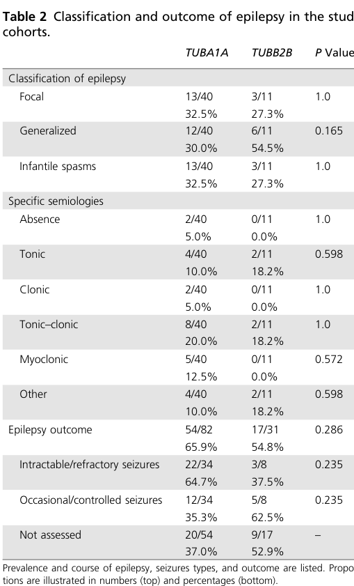

## Question

# Disease Characteristics Research Template

## Target Disease
- **Disease Name:** TUBB2A/TUBB2B-related Cortical Malformation
- **MONDO ID:**  (if available)
- **Category:** Mendelian

## Research Objectives

Please provide a comprehensive research report on **TUBB2A/TUBB2B-related Cortical Malformation** covering all of the
disease characteristics listed below. This report will be used to populate a disease knowledge
base entry. Be thorough and cite primary literature (PMID preferred) for all claims.

For each section, **suggested databases/resources** are listed. These are the first places
you should search for information on each topic.

---

### 1. Disease Information
> **Search first:** OMIM, Orphanet, ICD-10/ICD-11, MeSH, PubMed

- What is the disease? Provide a concise overview.
- What are the key identifiers? (OMIM, Orphanet, ICD-10/ICD-11, MeSH, Mondo)
- What are the common synonyms and alternative names?
- Is the information derived from individual patients (e.g., EHR) or aggregated disease-level resources?

### 2. Etiology

- **Disease Causal Factors**: What are the primary causes? (genetic, environmental, infectious, mechanistic)
- **Risk Factors**:
  > **Search first:** PubMed, Cochrane Library, UpToDate, clinical guidelines, ClinVar, ClinGen, GWAS Catalog, PheGenI, CTD, CDC, WHO, epidemiological databases
  - Genetic risk factors (causal variants, susceptibility loci, modifier genes)
  - Environmental risk factors (toxins, lifestyle, occupational exposures, age, sex, family history)
- **Protective Factors**:
  > **Search first:** PubMed, Cochrane Library, clinical trial databases, GWAS Catalog, gnomAD, WHO, CDC, nutrition databases
  - Genetic protective factors (protective variants, modifier alleles)
  - Environmental protective factors (diet, lifestyle, exposures that reduce risk)
- **Gene-Environment Interactions**: How do genetic and environmental factors interact to influence disease?
  > **Search first:** CTD, PubMed, PheGenI, GxE databases

### 3. Phenotypes
> **Search first:** HPO (Human Phenotype Ontology), OMIM, Orphanet, PubMed, clinicaltrials.gov, MedDRA, SNOMED CT, DECIPHER, LOINC

For each phenotype, provide:
- **Phenotype type**: symptoms, clinical signs, physical manifestations, behavioral changes, or laboratory abnormalities
  > For symptoms/signs: HPO, OMIM, Orphanet, PubMed
  > For behavioral changes: HPO, DSM, RDoC (Research Domain Criteria), PubMed
  > For laboratory abnormalities: LOINC, SNOMED CT, LabTests Online, PubMed
- **Phenotype characteristics**:
  > **Search first:** OMIM, Orphanet, HPO, PubMed
  - Age of symptom onset (neonatal, childhood, adult-onset, late-onset)
  - Symptom severity (mild, moderate, severe, variable)
  - Symptom progression (stable, progressive, episodic, fluctuating)
  - Frequency among affected individuals (percentage or qualitative)
- **Quality of life impact**: Effects on daily functioning and well-being (per-phenotype when possible)
  > **Search first:** EQ-5D database, SF-36, WHO QOL databases, PubMed
- Suggest HPO (Human Phenotype Ontology) terms for each phenotype

### 4. Genetic/Molecular Information

- **Causal Genes**: Gene mutations or chromosomal abnormalities responsible for disease (gene symbols, OMIM IDs)
  > **Search first:** OMIM, ClinVar, HGMD, Ensembl, NCBI Gene
- **Pathogenic Variants**:
  - Affected genes (gene symbols, HGNC IDs)
    > **Search first:** OMIM, NCBI Gene, Ensembl, HGNC, UniProt, GeneCards
  - Variant classification (pathogenic, likely pathogenic, VUS per ACMG/AMP guidelines)
    > **Search first:** ClinVar, ClinGen, ACMG/AMP guidelines, VarSome
  - Variant type/class (missense, frameshift, nonsense, splice-site, structural)
  - Allele frequency in population databases
    > **Search first:** gnomAD, 1000 Genomes, ExAC, TOPMed, dbSNP
  - Somatic vs germline origin
    > **Search first:** COSMIC (somatic), ClinVar, ICGC, TCGA
  - Functional consequences (loss of function, gain of function, dominant negative)
- **Modifier Genes**: Genes that modify disease severity or expression
- **Epigenetic Information**: DNA methylation, histone modifications, chromatin changes affecting disease
  > **Search first:** ENCODE, Roadmap Epigenomics, MethBase, DiseaseMeth
- **Chromosomal Abnormalities**: Large-scale genetic changes (aneuploidy, translocations, inversions)
  > **Search first:** DECIPHER, ClinVar, ECARUCA, UCSC Genome Browser

### 5. Environmental Information

- **Environmental Factors**: Non-genetic contributing factors (toxins, radiation, pollution, occupational exposure)
  > **Search first:** CTD (Comparative Toxicogenomics Database), TOXNET, PubMed, EPA databases
- **Lifestyle Factors**: Behavioral factors (smoking, diet, exercise, alcohol consumption)
  > **Search first:** CDC databases, WHO, PubMed, NHANES
- **Infectious Agents**: If applicable, pathogens causing or triggering disease (bacteria, viruses, fungi, parasites)
  > **Search first:** NCBI Taxonomy, ViPR, BV-BRC, MicrobeDB, GIDEON

### 6. Mechanism / Pathophysiology

- **Molecular Pathways**: Specific signaling cascades or biochemical pathways involved (Wnt, MAPK, mTOR, PI3K-AKT, etc.)
  > **Search first:** KEGG, Reactome, WikiPathways, PathBank, BioCyc
- **Cellular Processes**: Cell-level mechanisms (apoptosis, autophagy, cell cycle dysregulation, inflammation, etc.)
  > **Search first:** Gene Ontology (GO), Reactome, KEGG, PubMed
- **Protein Dysfunction**: How protein structure or function is altered (misfolding, aggregation, loss of function, gain of function)
  > **Search first:** UniProt, PDB (Protein Data Bank), InterPro, Pfam, AlphaFold
- **Metabolic Changes**: Alterations in metabolic processes (energy metabolism, lipid metabolism, amino acid metabolism)
  > **Search first:** KEGG, BioCyc, HMDB (Human Metabolome Database), BRENDA
- **Immune System Involvement**: Role of immune response (autoimmunity, immunodeficiency, chronic inflammation)
  > **Search first:** ImmPort, Immunome Database, IEDB, Gene Ontology
- **Tissue Damage Mechanisms**: How tissues/ are injured (oxidative stress, ischemia, fibrosis, necrosis)
  > **Search first:** PubMed, Gene Ontology, Reactome
- **Biochemical Abnormalities**: Specific molecular defects (enzyme deficiencies, receptor dysfunction, ion channel defects)
  > **Search first:** BRENDA, UniProt, KEGG, OMIM, PubMed
- **Epigenetic Changes**: DNA methylation, histone modifications affecting gene expression in disease
  > **Search first:** ENCODE, Roadmap Epigenomics, MethBase, DiseaseMeth
- **Molecular Profiling** (if available):
  - Transcriptomics/gene expression changes
    > **Search first:** GEO (Gene Expression Omnibus), ArrayExpress, GTEx, Human Cell Atlas, SRA
  - Proteomics findings
    > **Search first:** PRIDE, ProteomeXchange, Human Protein Atlas, STRING, BioGRID
  - Metabolomics signatures
    > **Search first:** MetaboLights, Metabolomics Workbench, HMDB, METLIN
  - Lipidomics alterations
    > **Search first:** LIPID MAPS, SwissLipids, LipidHome, Metabolomics Workbench
  - Genomic structural features
    > **Search first:** UCSC Genome Browser, Ensembl, NCBI, dbVar, DGV
- **Advanced Technologies** (if applicable):
  - Single-cell analysis findings (cell-type specific mechanisms, cellular heterogeneity)
    > **Search first:** Human Cell Atlas, Single Cell Portal, GEO, CELLxGENE
  - Spatial transcriptomics findings
    > **Search first:** GEO, Spatial Research, Vizgen, 10x Genomics data
  - Multi-omics integration results
    > **Search first:** TCGA, ICGC, cBioPortal, LinkedOmics, PubMed
  - Functional genomics screens (CRISPR, RNAi)
    > **Search first:** DepMap, GenomeRNAi, PubMed, BioGRID ORCS

For each mechanism, describe:
- The causal chain from initial trigger to clinical manifestation
- Which mechanisms are upstream vs downstream
- What cell types and biological processes are involved
- Suggest GO terms for biological processes and CL terms for cell types

### 7. Anatomical Structures Affected

- **Organ Level**:
  - Primary organs directly affected
  - Secondary organ involvement (complications, secondary effects)
  - Body systems involved (cardiovascular, nervous, digestive, respiratory, endocrine, etc.)
  > **Search first:** Uberon, FMA (Foundational Model of Anatomy), OMIM, HPO, ICD-11, MeSH, SNOMED CT
- **Tissue and Cell Level**:
  - Specific tissue types affected (epithelial, connective, muscle, nervous)
  - Specific cell populations targeted (with Cell Ontology terms)
  > **Search first:** Uberon, Human Protein Atlas, Cell Ontology, Human Cell Atlas, CellMarker, PanglaoDB
- **Subcellular Level**:
  - Cellular compartments involved (mitochondria, nucleus, ER, lysosomes) (with GO Cellular Component terms)
  > **Search first:** Gene Ontology (Cellular Component), UniProt, Human Protein Atlas
- **Localization**:
  - Specific anatomical sites (with UBERON terms)
    > **Search first:** FMA, Uberon, NeuroNames (for brain), SNOMED CT
  - Lateralization (unilateral, bilateral, asymmetric)
    > **Search first:** HPO, clinical literature, imaging databases

### 8. Temporal Development

- **Onset**:
  - Typical age of onset (congenital, pediatric, adult, geriatric)
  - Onset pattern (acute, subacute, chronic, insidious)
  > **Search first:** OMIM, Orphanet, HPO, PubMed
- **Progression**:
  - Disease stages (early, intermediate, advanced, end-stage)
    > **Search first:** Cancer Staging Manual (AJCC), WHO classifications, PubMed
  - Progression rate (rapid, slow, variable)
  - Disease course pattern (episodic, relapsing-remitting, progressive, stable)
  - Disease duration (self-limited, chronic lifelong)
  > **Search first:** Disease registries, longitudinal cohort databases, natural history studies, PubMed, Orphanet, OMIM
- **Patterns**:
  - Remission patterns (spontaneous, treatment-induced)
    > **Search first:** Clinical trial databases, disease registries, PubMed
  - Critical periods (time windows of vulnerability or opportunity for intervention)
    > **Search first:** PubMed, developmental biology databases, clinical guidelines

### 9. Inheritance and Population

- **Epidemiology**:
  - Prevalence (cases per 100,000 at given time)
  - Incidence (new cases per 100,000 per year)
  > **Search first:** Orphanet, CDC, WHO, GBD (Global Burden of Disease), national registries, SEER, disease registries
- **For Genetic Etiology**:
  - Inheritance pattern (AD, AR, X-linked, mitochondrial, multifactorial, polygenic)
    > **Search first:** OMIM, Orphanet, ClinVar, GTR (Genetic Testing Registry)
  - Penetrance (complete, incomplete, age-dependent)
    > **Search first:** ClinVar, OMIM, PubMed, ClinGen
  - Expressivity (variable, consistent)
    > **Search first:** OMIM, ClinVar, PubMed
  - Genetic anticipation (increasing severity in successive generations)
    > **Search first:** OMIM, PubMed (especially for repeat expansion disorders)
  - Germline mosaicism
    > **Search first:** ClinVar, OMIM, genetic counseling literature, PubMed
  - Founder effects (population-specific mutations)
    > **Search first:** gnomAD, population genetics databases, PubMed
  - Consanguinity role
    > **Search first:** OMIM, population studies, genetic counseling resources
  - Carrier frequency
    > **Search first:** gnomAD, carrier screening databases, GeneReviews, GTR
- **Population Demographics**:
  - Affected populations (ethnic or demographic groups with higher prevalence)
    > **Search first:** gnomAD, 1000 Genomes, PAGE Study, PubMed, population registries
  - Geographic distribution (endemic areas, regional variation)
    > **Search first:** WHO, CDC, GBD, Orphanet, geographic epidemiology databases
  - Geographic distribution of specific variants
  - Sex ratio (male:female)
    > **Search first:** Disease registries, OMIM, PubMed, epidemiological databases
  - Age distribution of affected individuals
    > **Search first:** CDC, disease registries, SEER, Orphanet

### 10. Diagnostics

- **Clinical Tests**:
  - Laboratory tests (blood, urine, tissue chemistry, specific enzyme assays)
    > **Search first:** LOINC, LabTests Online, PubMed
  - Biomarkers (proteins, metabolites, genetic markers, circulating biomarkers)
    > **Search first:** FDA Biomarker List, BEST (Biomarkers, EndpointS, and other Tools), PubMed
  - Imaging studies (X-ray, CT, MRI, PET, ultrasound)
    > **Search first:** RadLex, DICOM, Radiopaedia, imaging databases
  - Functional tests (pulmonary function, cardiac stress tests)
    > **Search first:** LOINC, clinical guidelines, PubMed
  - Electrophysiology (EEG, EMG, ECG, nerve conduction studies)
    > **Search first:** LOINC, clinical neurophysiology databases, PubMed
  - Biopsy findings (histopathology, immunohistochemistry)
    > **Search first:** SNOMED CT, College of American Pathologists resources, PubMed
  - Pathology findings (microscopic examination)
    > **Search first:** SNOMED CT, Digital Pathology databases, PubMed
- **Genetic Testing**:
  > **Search first:** GTR (Genetic Testing Registry), GeneReviews, ClinGen
  - Overview of recommended genetic testing approach
  - Whole genome sequencing (WGS) utility
    > **Search first:** GTR, ClinVar, GEL (Genomics England), gnomAD
  - Whole exome sequencing (WES) utility
    > **Search first:** GTR, ClinVar, OMIM, GeneMatcher
  - Gene panels (which panels, which genes)
    > **Search first:** GTR, ClinVar, laboratory-specific databases
  - Single gene testing
    > **Search first:** GTR, ClinVar, OMIM, GeneReviews
  - Chromosomal microarray (CMA)
    > **Search first:** DECIPHER, ClinVar, dbVar, ECARUCA
  - Karyotyping
    > **Search first:** Chromosome Abnormality Database, ClinVar, cytogenetics resources
  - FISH
    > **Search first:** ClinVar, cytogenetics databases, PubMed
  - Mitochondrial DNA testing
    > **Search first:** MITOMAP, MSeqDR, ClinVar, GTR
  - Repeat expansion testing
    > **Search first:** GTR, ClinVar, repeat expansion databases, PubMed
- **Omics-Based Diagnostics** (if applicable):
  - RNA sequencing / transcriptomics
    > **Search first:** GEO, ArrayExpress, GTEx, RNA-seq databases
  - Proteomics
    > **Search first:** PRIDE, ProteomeXchange, FDA Biomarker database
  - Metabolomics
    > **Search first:** MetaboLights, Metabolomics Workbench, HMDB
  - Epigenomics
    > **Search first:** GEO, ENCODE, Roadmap Epigenomics, MethBase
  - Liquid biopsy
    > **Search first:** COSMIC, ClinVar, liquid biopsy databases, PubMed
- **Clinical Criteria**:
  - Standardized diagnostic criteria (DSM, ICD, society guidelines)
    > **Search first:** DSM-5, ICD-11, clinical society guidelines, UpToDate
  - Differential diagnosis (other conditions to rule out, with distinguishing features)
    > **Search first:** DynaMed, UpToDate, clinical decision support systems
- **Screening**:
  - Screening methods for asymptomatic individuals (newborn screening, carrier screening, cascade screening)
    > **Search first:** ACMG recommendations, CDC newborn screening, GTR

### 11. Outcome/Prognosis

- **Survival and Mortality**:
  - Survival rate (5-year, 10-year, overall)
    > **Search first:** SEER, cancer registries, disease-specific registries, PubMed
  - Life expectancy (with and without treatment if applicable)
    > **Search first:** Orphanet, disease registries, actuarial databases, PubMed
  - Mortality rate
    > **Search first:** CDC, WHO, GBD, national mortality databases
  - Disease-specific mortality (deaths directly attributable to disease)
    > **Search first:** Disease registries, CDC Wonder, GBD, PubMed
- **Morbidity and Function**:
  - Morbidity (disease-related disability and health impacts)
    > **Search first:** GBD, WHO, disability databases, PubMed
  - Disability outcomes (long-term functional impairments)
    > **Search first:** ICF (International Classification of Functioning), disability registries
  - Quality of life measures (EQ-5D, SF-36, PROMIS, disease-specific tools)
    > **Search first:** EQ-5D database, SF-36, PROMIS, PubMed
- **Disease Course**:
  - Complications (secondary problems: infections, organ failure, etc.)
    > **Search first:** ICD codes, disease registries, clinical databases, PubMed
  - Recovery potential (likelihood and extent of recovery, with vs without treatment)
    > **Search first:** Natural history studies, rehabilitation databases, PubMed
- **Prediction**:
  - Prognostic factors (age, disease severity, biomarkers, treatment response)
    > **Search first:** Prognostic models databases, clinical calculators, PubMed
  - Prognostic biomarkers (molecular markers predicting disease course)
    > **Search first:** FDA Biomarker database, PubMed, cancer prognostic databases

### 12. Treatment

- **Pharmacotherapy**:
  - Pharmacological treatments (drug names, drug classes, mechanisms of action)
    > **Search first:** DrugBank, RxNorm, ATC classification, DailyMed, FDA databases
  - Pharmacogenomics (how genetic variants affect drug metabolism, efficacy, toxicity)
    > **Search first:** PharmGKB, CPIC (Clinical Pharmacogenetics), FDA Table of PGx Biomarkers
- **Advanced Therapeutics**:
  - Gene therapy (viral vectors, CRISPR, gene replacement, gene editing)
    > **Search first:** ClinicalTrials.gov, FDA gene therapy database, ASGCT resources
  - Cell therapy (stem cell transplant, CAR-T, cellular therapeutics)
    > **Search first:** ClinicalTrials.gov, FDA cell therapy database, FACT standards
  - RNA-based therapies (ASOs, siRNA, mRNA therapies)
    > **Search first:** ClinicalTrials.gov, FDA approvals, PubMed
  - Targeted therapies (treatments directed at specific molecular targets)
    > **Search first:** My Cancer Genome, OncoKB, ClinicalTrials.gov, FDA approvals
  - Immunotherapies (checkpoint inhibitors, monoclonal antibodies)
    > **Search first:** Cancer Immunotherapy Database, FDA approvals, ClinicalTrials.gov
- **Surgical and Interventional**:
  - Surgical interventions (types of surgery, timing, outcomes)
    > **Search first:** CPT codes, surgical registries, clinical guidelines, PubMed
- **Supportive and Rehabilitative**:
  - Supportive care (symptom management, pain control, nutrition)
    > **Search first:** Clinical guidelines, Cochrane Library, PubMed
  - Rehabilitation (physical therapy, occupational therapy, speech therapy)
    > **Search first:** Rehabilitation medicine databases, clinical guidelines, PubMed
- **Experimental**:
  - Experimental treatments in clinical trials (with NCT identifiers if available)
    > **Search first:** ClinicalTrials.gov, EU Clinical Trials Register, WHO ICTRP
- **Treatment Outcomes**:
  - Treatment response rates
    > **Search first:** Clinical trial databases, FDA reviews, systematic reviews, PubMed
  - Side effects and adverse events
    > **Search first:** FDA Adverse Event Reporting System (FAERS), MedWatch, PubMed
- **Treatment Strategy**:
  - Treatment algorithms (clinical pathways, decision trees)
    > **Search first:** Clinical practice guidelines, NCCN Guidelines, UpToDate
  - Combination therapies
    > **Search first:** ClinicalTrials.gov, treatment guidelines, PubMed
  - Personalized medicine approaches (genotype-guided treatment)
    > **Search first:** My Cancer Genome, CIViC, PharmGKB, precision medicine databases

For each treatment, suggest MAXO (Medical Action Ontology) terms where applicable.

### 13. Prevention

- **Prevention Levels**:
  - Primary prevention (preventing disease occurrence: vaccination, risk factor modification)
    > **Search first:** CDC, WHO, USPSTF recommendations, Cochrane Library
  - Secondary prevention (early detection and treatment: screening programs, early intervention)
    > **Search first:** USPSTF, CDC screening guidelines, WHO
  - Tertiary prevention (preventing complications in those with disease)
    > **Search first:** Clinical guidelines, disease management protocols, PubMed
- **Immunization**: Vaccine strategies (if applicable)
  > **Search first:** CDC vaccine schedules, WHO immunization, FDA vaccine database
- **Screening and Early Detection**:
  - Screening programs (population-based: newborn screening, cancer screening)
    > **Search first:** CDC screening programs, USPSTF, cancer screening databases
  - Genetic screening (carrier screening, preimplantation genetic diagnosis, prenatal testing)
    > **Search first:** ACMG recommendations, ACOG guidelines, GTR
  - Risk stratification (identifying high-risk individuals for targeted prevention)
    > **Search first:** Risk prediction models, clinical calculators, PubMed
- **Behavioral Interventions**: Lifestyle modifications to reduce risk
  > **Search first:** CDC, WHO, behavioral intervention databases, Cochrane Library
- **Counseling**: Genetic counseling (risk assessment, family planning guidance)
  > **Search first:** NSGC resources, ACMG guidelines, GeneReviews
- **Public Health**:
  - Public health interventions (sanitation, vector control, health education)
    > **Search first:** CDC, WHO, public health databases, PubMed
  - Environmental interventions (reducing environmental risk factors)
    > **Search first:** EPA databases, WHO environmental health, PubMed
- **Prophylaxis**: Preventive medications or procedures
  > **Search first:** Clinical guidelines, FDA approvals, PubMed

### 14. Other Species / Natural Disease

- **Taxonomy**: Species affected (with NCBI Taxon identifiers)
  > **Search first:** NCBI Taxonomy
- **Breed**: Specific breeds affected (with VBO identifiers if applicable)
  > **Search first:** VBO (Vertebrate Breed Ontology)
- **Gene**: Orthologous genes in other species (with NCBI Gene IDs)
  > **Search first:** NCBI Gene
- **Natural Disease**:
  - Naturally occurring disease in other species (companion animals, wildlife)
    > **Search first:** OMIA (Online Mendelian Inheritance in Animals), VetCompass, PubMed
  - Veterinary relevance and importance in animal health
    > **Search first:** OMIA, veterinary databases, PubMed
- **Comparative Biology**:
  - Comparative pathology (similarities and differences across species)
    > **Search first:** OMIA, comparative pathology databases, PubMed
  - Evolutionary conservation of disease mechanisms
    > **Search first:** HomoloGene, OrthoMCL, Alliance of Genome Resources
- **Transmission** (if applicable):
  - Zoonotic potential
    > **Search first:** CDC zoonotic diseases, WHO zoonoses, GIDEON
  - Cross-species susceptibility
    > **Search first:** NCBI Taxonomy, veterinary databases, PubMed

### 15. Model Organisms

- **Model Types**:
  - Model organism type (mammalian, invertebrate, cellular, in vitro)
    > **Search first:** Alliance of Genome Resources, model organism databases
  - Specific model systems (mouse, rat, zebrafish, Drosophila, C. elegans, yeast, cell lines, organoids, iPSCs)
    > **Search first:** MGI, RGD, ZFIN, FlyBase, WormBase, SGD, ATCC, Cellosaurus
  - Induced models (drug treatment, surgical intervention, environmental manipulation)
    > **Search first:** MGI, model organism databases, PubMed
- **Genetic Models**:
  - Types available (knockout, knock-in, transgenic, conditional, humanized)
    > **Search first:** MGI, IMPC, KOMP, EuMMCR, IMSR
- **Model Characteristics**:
  - Phenotype recapitulation (how well model reproduces human disease features)
    > **Search first:** Model organism databases, comparative studies, PubMed
  - Model limitations (aspects of human disease not captured)
    > **Search first:** Model organism databases, PubMed, review articles
- **Applications**:
  - Research applications (what aspects of disease can be studied)
    > **Search first:** Model organism databases, PubMed
- **Resources**:
  - Model databases
    > **Search first:** MGI, RGD, ZFIN, FlyBase, WormBase, IMSR, EMMA, MMRRC

---

## Citation Requirements

- Cite primary literature (PMID preferred) for all mechanistic and clinical claims
- Prioritize recent reviews and landmark papers
- Include direct quotes from abstracts where possible to support key statements
- Distinguish evidence source types: human clinical, model organism, in vitro, computational

## Output Format

Structure your response as a comprehensive narrative organized by the sections above.
For each section, provide:
- Factual content with specific details (numbers, percentages, gene names, variant nomenclature)
- Ontology term suggestions (HPO, GO, CL, UBERON, CHEBI, MAXO, MONDO) where applicable
- Evidence citations with PMIDs
- Direct quotes from abstracts to support key claims
- Clear indication when information is not available or not applicable for this disease

This report will be used to populate a disease knowledge base entry with:
- Pathophysiology descriptions with causal chains
- Gene/protein annotations (HGNC, GO terms)
- Phenotype associations (HP terms) with frequencies
- Cell type involvement (CL terms)
- Anatomical locations (UBERON terms)
- Chemical entities (CHEBI terms)
- Treatment annotations (MAXO terms)
- Evidence items with PMIDs and exact abstract quotes
- Epidemiology, prognosis, diagnostic, and prevention information
- Animal model descriptions with phenotype recapitulation details

## Output

Question: You are an expert researcher providing comprehensive, well-cited information.

Provide detailed information focusing on:
1. Key concepts and definitions with current understanding
2. Recent developments and latest research (prioritize 2023-2024 sources)
3. Current applications and real-world implementations
4. Expert opinions and analysis from authoritative sources
5. Relevant statistics and data from recent studies

Format as a comprehensive research report with proper citations. Include URLs and publication dates where available.
Always prioritize recent, authoritative sources and provide specific citations for all major claims.

# Disease Characteristics Research Template

## Target Disease
- **Disease Name:** TUBB2A/TUBB2B-related Cortical Malformation
- **MONDO ID:**  (if available)
- **Category:** Mendelian

## Research Objectives

Please provide a comprehensive research report on **TUBB2A/TUBB2B-related Cortical Malformation** covering all of the
disease characteristics listed below. This report will be used to populate a disease knowledge
base entry. Be thorough and cite primary literature (PMID preferred) for all claims.

For each section, **suggested databases/resources** are listed. These are the first places
you should search for information on each topic.

---

### 1. Disease Information
> **Search first:** OMIM, Orphanet, ICD-10/ICD-11, MeSH, PubMed

- What is the disease? Provide a concise overview.
- What are the key identifiers? (OMIM, Orphanet, ICD-10/ICD-11, MeSH, Mondo)
- What are the common synonyms and alternative names?
- Is the information derived from individual patients (e.g., EHR) or aggregated disease-level resources?

### 2. Etiology

- **Disease Causal Factors**: What are the primary causes? (genetic, environmental, infectious, mechanistic)
- **Risk Factors**:
  > **Search first:** PubMed, Cochrane Library, UpToDate, clinical guidelines, ClinVar, ClinGen, GWAS Catalog, PheGenI, CTD, CDC, WHO, epidemiological databases
  - Genetic risk factors (causal variants, susceptibility loci, modifier genes)
  - Environmental risk factors (toxins, lifestyle, occupational exposures, age, sex, family history)
- **Protective Factors**:
  > **Search first:** PubMed, Cochrane Library, clinical trial databases, GWAS Catalog, gnomAD, WHO, CDC, nutrition databases
  - Genetic protective factors (protective variants, modifier alleles)
  - Environmental protective factors (diet, lifestyle, exposures that reduce risk)
- **Gene-Environment Interactions**: How do genetic and environmental factors interact to influence disease?
  > **Search first:** CTD, PubMed, PheGenI, GxE databases

### 3. Phenotypes
> **Search first:** HPO (Human Phenotype Ontology), OMIM, Orphanet, PubMed, clinicaltrials.gov, MedDRA, SNOMED CT, DECIPHER, LOINC

For each phenotype, provide:
- **Phenotype type**: symptoms, clinical signs, physical manifestations, behavioral changes, or laboratory abnormalities
  > For symptoms/signs: HPO, OMIM, Orphanet, PubMed
  > For behavioral changes: HPO, DSM, RDoC (Research Domain Criteria), PubMed
  > For laboratory abnormalities: LOINC, SNOMED CT, LabTests Online, PubMed
- **Phenotype characteristics**:
  > **Search first:** OMIM, Orphanet, HPO, PubMed
  - Age of symptom onset (neonatal, childhood, adult-onset, late-onset)
  - Symptom severity (mild, moderate, severe, variable)
  - Symptom progression (stable, progressive, episodic, fluctuating)
  - Frequency among affected individuals (percentage or qualitative)
- **Quality of life impact**: Effects on daily functioning and well-being (per-phenotype when possible)
  > **Search first:** EQ-5D database, SF-36, WHO QOL databases, PubMed
- Suggest HPO (Human Phenotype Ontology) terms for each phenotype

### 4. Genetic/Molecular Information

- **Causal Genes**: Gene mutations or chromosomal abnormalities responsible for disease (gene symbols, OMIM IDs)
  > **Search first:** OMIM, ClinVar, HGMD, Ensembl, NCBI Gene
- **Pathogenic Variants**:
  - Affected genes (gene symbols, HGNC IDs)
    > **Search first:** OMIM, NCBI Gene, Ensembl, HGNC, UniProt, GeneCards
  - Variant classification (pathogenic, likely pathogenic, VUS per ACMG/AMP guidelines)
    > **Search first:** ClinVar, ClinGen, ACMG/AMP guidelines, VarSome
  - Variant type/class (missense, frameshift, nonsense, splice-site, structural)
  - Allele frequency in population databases
    > **Search first:** gnomAD, 1000 Genomes, ExAC, TOPMed, dbSNP
  - Somatic vs germline origin
    > **Search first:** COSMIC (somatic), ClinVar, ICGC, TCGA
  - Functional consequences (loss of function, gain of function, dominant negative)
- **Modifier Genes**: Genes that modify disease severity or expression
- **Epigenetic Information**: DNA methylation, histone modifications, chromatin changes affecting disease
  > **Search first:** ENCODE, Roadmap Epigenomics, MethBase, DiseaseMeth
- **Chromosomal Abnormalities**: Large-scale genetic changes (aneuploidy, translocations, inversions)
  > **Search first:** DECIPHER, ClinVar, ECARUCA, UCSC Genome Browser

### 5. Environmental Information

- **Environmental Factors**: Non-genetic contributing factors (toxins, radiation, pollution, occupational exposure)
  > **Search first:** CTD (Comparative Toxicogenomics Database), TOXNET, PubMed, EPA databases
- **Lifestyle Factors**: Behavioral factors (smoking, diet, exercise, alcohol consumption)
  > **Search first:** CDC databases, WHO, PubMed, NHANES
- **Infectious Agents**: If applicable, pathogens causing or triggering disease (bacteria, viruses, fungi, parasites)
  > **Search first:** NCBI Taxonomy, ViPR, BV-BRC, MicrobeDB, GIDEON

### 6. Mechanism / Pathophysiology

- **Molecular Pathways**: Specific signaling cascades or biochemical pathways involved (Wnt, MAPK, mTOR, PI3K-AKT, etc.)
  > **Search first:** KEGG, Reactome, WikiPathways, PathBank, BioCyc
- **Cellular Processes**: Cell-level mechanisms (apoptosis, autophagy, cell cycle dysregulation, inflammation, etc.)
  > **Search first:** Gene Ontology (GO), Reactome, KEGG, PubMed
- **Protein Dysfunction**: How protein structure or function is altered (misfolding, aggregation, loss of function, gain of function)
  > **Search first:** UniProt, PDB (Protein Data Bank), InterPro, Pfam, AlphaFold
- **Metabolic Changes**: Alterations in metabolic processes (energy metabolism, lipid metabolism, amino acid metabolism)
  > **Search first:** KEGG, BioCyc, HMDB (Human Metabolome Database), BRENDA
- **Immune System Involvement**: Role of immune response (autoimmunity, immunodeficiency, chronic inflammation)
  > **Search first:** ImmPort, Immunome Database, IEDB, Gene Ontology
- **Tissue Damage Mechanisms**: How tissues/ are injured (oxidative stress, ischemia, fibrosis, necrosis)
  > **Search first:** PubMed, Gene Ontology, Reactome
- **Biochemical Abnormalities**: Specific molecular defects (enzyme deficiencies, receptor dysfunction, ion channel defects)
  > **Search first:** BRENDA, UniProt, KEGG, OMIM, PubMed
- **Epigenetic Changes**: DNA methylation, histone modifications affecting gene expression in disease
  > **Search first:** ENCODE, Roadmap Epigenomics, MethBase, DiseaseMeth
- **Molecular Profiling** (if available):
  - Transcriptomics/gene expression changes
    > **Search first:** GEO (Gene Expression Omnibus), ArrayExpress, GTEx, Human Cell Atlas, SRA
  - Proteomics findings
    > **Search first:** PRIDE, ProteomeXchange, Human Protein Atlas, STRING, BioGRID
  - Metabolomics signatures
    > **Search first:** MetaboLights, Metabolomics Workbench, HMDB, METLIN
  - Lipidomics alterations
    > **Search first:** LIPID MAPS, SwissLipids, LipidHome, Metabolomics Workbench
  - Genomic structural features
    > **Search first:** UCSC Genome Browser, Ensembl, NCBI, dbVar, DGV
- **Advanced Technologies** (if applicable):
  - Single-cell analysis findings (cell-type specific mechanisms, cellular heterogeneity)
    > **Search first:** Human Cell Atlas, Single Cell Portal, GEO, CELLxGENE
  - Spatial transcriptomics findings
    > **Search first:** GEO, Spatial Research, Vizgen, 10x Genomics data
  - Multi-omics integration results
    > **Search first:** TCGA, ICGC, cBioPortal, LinkedOmics, PubMed
  - Functional genomics screens (CRISPR, RNAi)
    > **Search first:** DepMap, GenomeRNAi, PubMed, BioGRID ORCS

For each mechanism, describe:
- The causal chain from initial trigger to clinical manifestation
- Which mechanisms are upstream vs downstream
- What cell types and biological processes are involved
- Suggest GO terms for biological processes and CL terms for cell types

### 7. Anatomical Structures Affected

- **Organ Level**:
  - Primary organs directly affected
  - Secondary organ involvement (complications, secondary effects)
  - Body systems involved (cardiovascular, nervous, digestive, respiratory, endocrine, etc.)
  > **Search first:** Uberon, FMA (Foundational Model of Anatomy), OMIM, HPO, ICD-11, MeSH, SNOMED CT
- **Tissue and Cell Level**:
  - Specific tissue types affected (epithelial, connective, muscle, nervous)
  - Specific cell populations targeted (with Cell Ontology terms)
  > **Search first:** Uberon, Human Protein Atlas, Cell Ontology, Human Cell Atlas, CellMarker, PanglaoDB
- **Subcellular Level**:
  - Cellular compartments involved (mitochondria, nucleus, ER, lysosomes) (with GO Cellular Component terms)
  > **Search first:** Gene Ontology (Cellular Component), UniProt, Human Protein Atlas
- **Localization**:
  - Specific anatomical sites (with UBERON terms)
    > **Search first:** FMA, Uberon, NeuroNames (for brain), SNOMED CT
  - Lateralization (unilateral, bilateral, asymmetric)
    > **Search first:** HPO, clinical literature, imaging databases

### 8. Temporal Development

- **Onset**:
  - Typical age of onset (congenital, pediatric, adult, geriatric)
  - Onset pattern (acute, subacute, chronic, insidious)
  > **Search first:** OMIM, Orphanet, HPO, PubMed
- **Progression**:
  - Disease stages (early, intermediate, advanced, end-stage)
    > **Search first:** Cancer Staging Manual (AJCC), WHO classifications, PubMed
  - Progression rate (rapid, slow, variable)
  - Disease course pattern (episodic, relapsing-remitting, progressive, stable)
  - Disease duration (self-limited, chronic lifelong)
  > **Search first:** Disease registries, longitudinal cohort databases, natural history studies, PubMed, Orphanet, OMIM
- **Patterns**:
  - Remission patterns (spontaneous, treatment-induced)
    > **Search first:** Clinical trial databases, disease registries, PubMed
  - Critical periods (time windows of vulnerability or opportunity for intervention)
    > **Search first:** PubMed, developmental biology databases, clinical guidelines

### 9. Inheritance and Population

- **Epidemiology**:
  - Prevalence (cases per 100,000 at given time)
  - Incidence (new cases per 100,000 per year)
  > **Search first:** Orphanet, CDC, WHO, GBD (Global Burden of Disease), national registries, SEER, disease registries
- **For Genetic Etiology**:
  - Inheritance pattern (AD, AR, X-linked, mitochondrial, multifactorial, polygenic)
    > **Search first:** OMIM, Orphanet, ClinVar, GTR (Genetic Testing Registry)
  - Penetrance (complete, incomplete, age-dependent)
    > **Search first:** ClinVar, OMIM, PubMed, ClinGen
  - Expressivity (variable, consistent)
    > **Search first:** OMIM, ClinVar, PubMed
  - Genetic anticipation (increasing severity in successive generations)
    > **Search first:** OMIM, PubMed (especially for repeat expansion disorders)
  - Germline mosaicism
    > **Search first:** ClinVar, OMIM, genetic counseling literature, PubMed
  - Founder effects (population-specific mutations)
    > **Search first:** gnomAD, population genetics databases, PubMed
  - Consanguinity role
    > **Search first:** OMIM, population studies, genetic counseling resources
  - Carrier frequency
    > **Search first:** gnomAD, carrier screening databases, GeneReviews, GTR
- **Population Demographics**:
  - Affected populations (ethnic or demographic groups with higher prevalence)
    > **Search first:** gnomAD, 1000 Genomes, PAGE Study, PubMed, population registries
  - Geographic distribution (endemic areas, regional variation)
    > **Search first:** WHO, CDC, GBD, Orphanet, geographic epidemiology databases
  - Geographic distribution of specific variants
  - Sex ratio (male:female)
    > **Search first:** Disease registries, OMIM, PubMed, epidemiological databases
  - Age distribution of affected individuals
    > **Search first:** CDC, disease registries, SEER, Orphanet

### 10. Diagnostics

- **Clinical Tests**:
  - Laboratory tests (blood, urine, tissue chemistry, specific enzyme assays)
    > **Search first:** LOINC, LabTests Online, PubMed
  - Biomarkers (proteins, metabolites, genetic markers, circulating biomarkers)
    > **Search first:** FDA Biomarker List, BEST (Biomarkers, EndpointS, and other Tools), PubMed
  - Imaging studies (X-ray, CT, MRI, PET, ultrasound)
    > **Search first:** RadLex, DICOM, Radiopaedia, imaging databases
  - Functional tests (pulmonary function, cardiac stress tests)
    > **Search first:** LOINC, clinical guidelines, PubMed
  - Electrophysiology (EEG, EMG, ECG, nerve conduction studies)
    > **Search first:** LOINC, clinical neurophysiology databases, PubMed
  - Biopsy findings (histopathology, immunohistochemistry)
    > **Search first:** SNOMED CT, College of American Pathologists resources, PubMed
  - Pathology findings (microscopic examination)
    > **Search first:** SNOMED CT, Digital Pathology databases, PubMed
- **Genetic Testing**:
  > **Search first:** GTR (Genetic Testing Registry), GeneReviews, ClinGen
  - Overview of recommended genetic testing approach
  - Whole genome sequencing (WGS) utility
    > **Search first:** GTR, ClinVar, GEL (Genomics England), gnomAD
  - Whole exome sequencing (WES) utility
    > **Search first:** GTR, ClinVar, OMIM, GeneMatcher
  - Gene panels (which panels, which genes)
    > **Search first:** GTR, ClinVar, laboratory-specific databases
  - Single gene testing
    > **Search first:** GTR, ClinVar, OMIM, GeneReviews
  - Chromosomal microarray (CMA)
    > **Search first:** DECIPHER, ClinVar, dbVar, ECARUCA
  - Karyotyping
    > **Search first:** Chromosome Abnormality Database, ClinVar, cytogenetics resources
  - FISH
    > **Search first:** ClinVar, cytogenetics databases, PubMed
  - Mitochondrial DNA testing
    > **Search first:** MITOMAP, MSeqDR, ClinVar, GTR
  - Repeat expansion testing
    > **Search first:** GTR, ClinVar, repeat expansion databases, PubMed
- **Omics-Based Diagnostics** (if applicable):
  - RNA sequencing / transcriptomics
    > **Search first:** GEO, ArrayExpress, GTEx, RNA-seq databases
  - Proteomics
    > **Search first:** PRIDE, ProteomeXchange, FDA Biomarker database
  - Metabolomics
    > **Search first:** MetaboLights, Metabolomics Workbench, HMDB
  - Epigenomics
    > **Search first:** GEO, ENCODE, Roadmap Epigenomics, MethBase
  - Liquid biopsy
    > **Search first:** COSMIC, ClinVar, liquid biopsy databases, PubMed
- **Clinical Criteria**:
  - Standardized diagnostic criteria (DSM, ICD, society guidelines)
    > **Search first:** DSM-5, ICD-11, clinical society guidelines, UpToDate
  - Differential diagnosis (other conditions to rule out, with distinguishing features)
    > **Search first:** DynaMed, UpToDate, clinical decision support systems
- **Screening**:
  - Screening methods for asymptomatic individuals (newborn screening, carrier screening, cascade screening)
    > **Search first:** ACMG recommendations, CDC newborn screening, GTR

### 11. Outcome/Prognosis

- **Survival and Mortality**:
  - Survival rate (5-year, 10-year, overall)
    > **Search first:** SEER, cancer registries, disease-specific registries, PubMed
  - Life expectancy (with and without treatment if applicable)
    > **Search first:** Orphanet, disease registries, actuarial databases, PubMed
  - Mortality rate
    > **Search first:** CDC, WHO, GBD, national mortality databases
  - Disease-specific mortality (deaths directly attributable to disease)
    > **Search first:** Disease registries, CDC Wonder, GBD, PubMed
- **Morbidity and Function**:
  - Morbidity (disease-related disability and health impacts)
    > **Search first:** GBD, WHO, disability databases, PubMed
  - Disability outcomes (long-term functional impairments)
    > **Search first:** ICF (International Classification of Functioning), disability registries
  - Quality of life measures (EQ-5D, SF-36, PROMIS, disease-specific tools)
    > **Search first:** EQ-5D database, SF-36, PROMIS, PubMed
- **Disease Course**:
  - Complications (secondary problems: infections, organ failure, etc.)
    > **Search first:** ICD codes, disease registries, clinical databases, PubMed
  - Recovery potential (likelihood and extent of recovery, with vs without treatment)
    > **Search first:** Natural history studies, rehabilitation databases, PubMed
- **Prediction**:
  - Prognostic factors (age, disease severity, biomarkers, treatment response)
    > **Search first:** Prognostic models databases, clinical calculators, PubMed
  - Prognostic biomarkers (molecular markers predicting disease course)
    > **Search first:** FDA Biomarker database, PubMed, cancer prognostic databases

### 12. Treatment

- **Pharmacotherapy**:
  - Pharmacological treatments (drug names, drug classes, mechanisms of action)
    > **Search first:** DrugBank, RxNorm, ATC classification, DailyMed, FDA databases
  - Pharmacogenomics (how genetic variants affect drug metabolism, efficacy, toxicity)
    > **Search first:** PharmGKB, CPIC (Clinical Pharmacogenetics), FDA Table of PGx Biomarkers
- **Advanced Therapeutics**:
  - Gene therapy (viral vectors, CRISPR, gene replacement, gene editing)
    > **Search first:** ClinicalTrials.gov, FDA gene therapy database, ASGCT resources
  - Cell therapy (stem cell transplant, CAR-T, cellular therapeutics)
    > **Search first:** ClinicalTrials.gov, FDA cell therapy database, FACT standards
  - RNA-based therapies (ASOs, siRNA, mRNA therapies)
    > **Search first:** ClinicalTrials.gov, FDA approvals, PubMed
  - Targeted therapies (treatments directed at specific molecular targets)
    > **Search first:** My Cancer Genome, OncoKB, ClinicalTrials.gov, FDA approvals
  - Immunotherapies (checkpoint inhibitors, monoclonal antibodies)
    > **Search first:** Cancer Immunotherapy Database, FDA approvals, ClinicalTrials.gov
- **Surgical and Interventional**:
  - Surgical interventions (types of surgery, timing, outcomes)
    > **Search first:** CPT codes, surgical registries, clinical guidelines, PubMed
- **Supportive and Rehabilitative**:
  - Supportive care (symptom management, pain control, nutrition)
    > **Search first:** Clinical guidelines, Cochrane Library, PubMed
  - Rehabilitation (physical therapy, occupational therapy, speech therapy)
    > **Search first:** Rehabilitation medicine databases, clinical guidelines, PubMed
- **Experimental**:
  - Experimental treatments in clinical trials (with NCT identifiers if available)
    > **Search first:** ClinicalTrials.gov, EU Clinical Trials Register, WHO ICTRP
- **Treatment Outcomes**:
  - Treatment response rates
    > **Search first:** Clinical trial databases, FDA reviews, systematic reviews, PubMed
  - Side effects and adverse events
    > **Search first:** FDA Adverse Event Reporting System (FAERS), MedWatch, PubMed
- **Treatment Strategy**:
  - Treatment algorithms (clinical pathways, decision trees)
    > **Search first:** Clinical practice guidelines, NCCN Guidelines, UpToDate
  - Combination therapies
    > **Search first:** ClinicalTrials.gov, treatment guidelines, PubMed
  - Personalized medicine approaches (genotype-guided treatment)
    > **Search first:** My Cancer Genome, CIViC, PharmGKB, precision medicine databases

For each treatment, suggest MAXO (Medical Action Ontology) terms where applicable.

### 13. Prevention

- **Prevention Levels**:
  - Primary prevention (preventing disease occurrence: vaccination, risk factor modification)
    > **Search first:** CDC, WHO, USPSTF recommendations, Cochrane Library
  - Secondary prevention (early detection and treatment: screening programs, early intervention)
    > **Search first:** USPSTF, CDC screening guidelines, WHO
  - Tertiary prevention (preventing complications in those with disease)
    > **Search first:** Clinical guidelines, disease management protocols, PubMed
- **Immunization**: Vaccine strategies (if applicable)
  > **Search first:** CDC vaccine schedules, WHO immunization, FDA vaccine database
- **Screening and Early Detection**:
  - Screening programs (population-based: newborn screening, cancer screening)
    > **Search first:** CDC screening programs, USPSTF, cancer screening databases
  - Genetic screening (carrier screening, preimplantation genetic diagnosis, prenatal testing)
    > **Search first:** ACMG recommendations, ACOG guidelines, GTR
  - Risk stratification (identifying high-risk individuals for targeted prevention)
    > **Search first:** Risk prediction models, clinical calculators, PubMed
- **Behavioral Interventions**: Lifestyle modifications to reduce risk
  > **Search first:** CDC, WHO, behavioral intervention databases, Cochrane Library
- **Counseling**: Genetic counseling (risk assessment, family planning guidance)
  > **Search first:** NSGC resources, ACMG guidelines, GeneReviews
- **Public Health**:
  - Public health interventions (sanitation, vector control, health education)
    > **Search first:** CDC, WHO, public health databases, PubMed
  - Environmental interventions (reducing environmental risk factors)
    > **Search first:** EPA databases, WHO environmental health, PubMed
- **Prophylaxis**: Preventive medications or procedures
  > **Search first:** Clinical guidelines, FDA approvals, PubMed

### 14. Other Species / Natural Disease

- **Taxonomy**: Species affected (with NCBI Taxon identifiers)
  > **Search first:** NCBI Taxonomy
- **Breed**: Specific breeds affected (with VBO identifiers if applicable)
  > **Search first:** VBO (Vertebrate Breed Ontology)
- **Gene**: Orthologous genes in other species (with NCBI Gene IDs)
  > **Search first:** NCBI Gene
- **Natural Disease**:
  - Naturally occurring disease in other species (companion animals, wildlife)
    > **Search first:** OMIA (Online Mendelian Inheritance in Animals), VetCompass, PubMed
  - Veterinary relevance and importance in animal health
    > **Search first:** OMIA, veterinary databases, PubMed
- **Comparative Biology**:
  - Comparative pathology (similarities and differences across species)
    > **Search first:** OMIA, comparative pathology databases, PubMed
  - Evolutionary conservation of disease mechanisms
    > **Search first:** HomoloGene, OrthoMCL, Alliance of Genome Resources
- **Transmission** (if applicable):
  - Zoonotic potential
    > **Search first:** CDC zoonotic diseases, WHO zoonoses, GIDEON
  - Cross-species susceptibility
    > **Search first:** NCBI Taxonomy, veterinary databases, PubMed

### 15. Model Organisms

- **Model Types**:
  - Model organism type (mammalian, invertebrate, cellular, in vitro)
    > **Search first:** Alliance of Genome Resources, model organism databases
  - Specific model systems (mouse, rat, zebrafish, Drosophila, C. elegans, yeast, cell lines, organoids, iPSCs)
    > **Search first:** MGI, RGD, ZFIN, FlyBase, WormBase, SGD, ATCC, Cellosaurus
  - Induced models (drug treatment, surgical intervention, environmental manipulation)
    > **Search first:** MGI, model organism databases, PubMed
- **Genetic Models**:
  - Types available (knockout, knock-in, transgenic, conditional, humanized)
    > **Search first:** MGI, IMPC, KOMP, EuMMCR, IMSR
- **Model Characteristics**:
  - Phenotype recapitulation (how well model reproduces human disease features)
    > **Search first:** Model organism databases, comparative studies, PubMed
  - Model limitations (aspects of human disease not captured)
    > **Search first:** Model organism databases, PubMed, review articles
- **Applications**:
  - Research applications (what aspects of disease can be studied)
    > **Search first:** Model organism databases, PubMed
- **Resources**:
  - Model databases
    > **Search first:** MGI, RGD, ZFIN, FlyBase, WormBase, IMSR, EMMA, MMRRC

---

## Citation Requirements

- Cite primary literature (PMID preferred) for all mechanistic and clinical claims
- Prioritize recent reviews and landmark papers
- Include direct quotes from abstracts where possible to support key statements
- Distinguish evidence source types: human clinical, model organism, in vitro, computational

## Output Format

Structure your response as a comprehensive narrative organized by the sections above.
For each section, provide:
- Factual content with specific details (numbers, percentages, gene names, variant nomenclature)
- Ontology term suggestions (HPO, GO, CL, UBERON, CHEBI, MAXO, MONDO) where applicable
- Evidence citations with PMIDs
- Direct quotes from abstracts to support key claims
- Clear indication when information is not available or not applicable for this disease

This report will be used to populate a disease knowledge base entry with:
- Pathophysiology descriptions with causal chains
- Gene/protein annotations (HGNC, GO terms)
- Phenotype associations (HP terms) with frequencies
- Cell type involvement (CL terms)
- Anatomical locations (UBERON terms)
- Chemical entities (CHEBI terms)
- Treatment annotations (MAXO terms)
- Evidence items with PMIDs and exact abstract quotes
- Epidemiology, prognosis, diagnostic, and prevention information
- Animal model descriptions with phenotype recapitulation details

# Comprehensive Research Report: **TUBB2A/TUBB2B-related Cortical Malformation (Tubulinopathy)**

## Scope note
The retrieved evidence base contained strong primary and cohort-level data for **TUBB2B** and more limited data for **TUBB2A**. Several requested ontology/identifier elements (e.g., MONDO, MeSH, ICD-10/ICD-11, Orphanet, OMIM entries for each gene-specific condition) are typically obtainable from dedicated disease databases, but **those databases were not retrievable via the current tool evidence**; therefore, identifiers are reported only when directly supported by the gathered literature. Where information is unavailable in evidence, it is explicitly marked as such.

## 1. Disease Information
### 1.1 What is the disease?
**TUBB2A/TUBB2B-related cortical malformation** is part of the broader group of **tubulinopathies**, i.e., neurodevelopmental disorders caused by pathogenic variants in tubulin genes that disrupt microtubule-dependent processes during brain development and lead to **malformations of cortical development (MCD)** and characteristic extracortical brain anomalies. (romaniello2019epilepsyintubulinopathy pages 1-3, cushion2013overlappingcorticalmalformations pages 2-3)

A key neuroradiologic concept emphasized across tubulinopathy literature is that the cortical malformation may be described as **polymicrogyria-like cortical dysplasia** or “atypical polymicrogyria,” often accompanied by **dysmorphic basal ganglia and internal capsule abnormalities**, plus corpus callosum/cerebellar/brainstem involvement. (cushion2013overlappingcorticalmalformations pages 2-3, cushion2013overlappingcorticalmalformations pages 1-2)

### 1.2 Key identifiers
- **OMIM / Orphanet / ICD-10/ICD-11 / MeSH / MONDO:** Not available from the retrieved evidence set.
- **Peer-reviewed primary natural history reference:** Schröter et al., *Genetics in Medicine* (publication date March 2021; URL https://doi.org/10.1038/s41436-020-01001-z). (schroter2021crosssectionalquantitativeanalysis pages 2-3)

### 1.3 Synonyms and alternative names (as used in the literature)
- **Tubulinopathy** (umbrella term). (romaniello2019epilepsyintubulinopathy pages 1-3)
- **Polymicrogyria-like cortical dysplasia / atypical polymicrogyria** in TUBB2B-related disease descriptions. (cushion2013overlappingcorticalmalformations pages 2-3)
- **Complex cortical dysplasia** is used in case reports involving TUBB2B. (citli2022maternalgermlinemosaicism pages 1-5)

### 1.4 Evidence source types
- **Aggregated disease-level resources / meta-cohort modeling:** Natural history modeling integrating **published clinical reports + DECIPHER + ClinVar** entries (Schröter 2021). (schroter2021crosssectionalquantitativeanalysis pages 2-3)
- **Human cohort studies of MCD diagnostic testing:** exome sequencing yield studies and deep-sequencing panel studies in polymicrogyria cohorts. (kooshavar2024diagnosticutilityof pages 4-5, stutterd2021geneticheterogeneityof pages 2-3)
- **Human case series/case reports:** detailed genotype–phenotype reports for TUBB2A and TUBB2B. (schmidt2021expandingthephenotype pages 1-3, citli2022maternalgermlinemosaicism pages 1-5, cushion2013overlappingcorticalmalformations pages 5-6)

## 2. Etiology
### 2.1 Disease causal factors
**Primary causal factor:** heterozygous pathogenic variants in **TUBB2B** or **TUBB2A**, encoding neuronal β-tubulin isotypes that participate in microtubule heterodimers essential for neurodevelopment. (cushion2013overlappingcorticalmalformations pages 2-3, schmidt2021expandingthephenotype pages 1-3)

### 2.2 Risk factors
- **Genetic:** presence of a pathogenic/likely pathogenic variant in TUBB2B or TUBB2A. (schroter2021crosssectionalquantitativeanalysis pages 2-3, schmidt2021expandingthephenotype pages 1-3)
- **Non-genetic/environmental risk factors:** not established in the retrieved evidence; tubulinopathies are primarily genetic disorders. (romaniello2019epilepsyintubulinopathy pages 1-3)

### 2.3 Protective factors
Not identified in the retrieved evidence.

### 2.4 Gene–environment interactions
Not identified in the retrieved evidence.

## 3. Phenotypes
### 3.1 Core phenotype domains
**Neurodevelopmental and neurologic phenotype** commonly includes:
- Global developmental delay / intellectual disability. (cushion2013overlappingcorticalmalformations pages 5-6, schroter2021crosssectionalquantitativeanalysis pages 2-3)
- Motor impairment and abnormal tone (hypotonia and/or other tone abnormalities). (schroter2021crosssectionalquantitativeanalysis pages 3-4, schroter2021crosssectionalquantitativeanalysis pages 2-3)
- Epilepsy and EEG abnormalities. (romaniello2019epilepsyintubulinopathy pages 1-3, schroter2021crosssectionalquantitativeanalysis pages 3-4)

**Neuroimaging phenotype** commonly includes:
- Polymicrogyria-like cortical dysplasia (especially perisylvian) and sometimes pachygyria/lissencephaly spectrum. (schroter2021crosssectionalquantitativeanalysis pages 1-2, cushion2013overlappingcorticalmalformations pages 5-6)
- Dysmorphic basal ganglia and internal capsule anomalies. (cushion2013overlappingcorticalmalformations pages 1-2, romaniello2019epilepsyintubulinopathy pages 1-3)
- Corpus callosum abnormalities and posterior fossa/brainstem abnormalities. (romaniello2019epilepsyintubulinopathy pages 1-3, cushion2013overlappingcorticalmalformations pages 5-6)

### 3.2 Quantitative phenotype statistics (TUBB2B emphasized)
From the natural-history meta-cohort (DECIPHER/ClinVar/clinical reports; cutoff 1 July 2019; analyzed **NTUBB2B=48**):
- **Early/postnatal presenting signs:** developmental delay 47.4%, seizures 36.8%, muscular hypotonia 21.1%. (schroter2021crosssectionalquantitativeanalysis pages 2-3)
- **Global developmental delay:** 76.7% (TUBB2B) vs 95.7% (TUBA1A) in a subset analysis. (schroter2021crosssectionalquantitativeanalysis pages 3-4)
- **Motor function affected:** 73.1%; normal motor function: 19.2%. (schroter2021crosssectionalquantitativeanalysis pages 3-4)
- **Epilepsy prevalence:** 54.8%; seizure onset mean 33.1 months (N=14); infantile onset seizures in 78.6%; infantile spasms 27.3%; refractory epilepsy 37.5% (in available cases). (schroter2021crosssectionalquantitativeanalysis pages 3-4)
- **Neuroimaging frequencies:** cortical malformations reported in 97.8%; lissencephaly/pachygyria/agyria 6.8% (less common than TUBA1A); basal ganglia involvement 84.6%; ventriculomegaly 88.0%; corpus callosum abnormalities 77.5%. (schroter2021crosssectionalquantitativeanalysis pages 4-5)

Additional clinical features reported in smaller series include optic atrophy (2/4) and scoliosis (4/4) in a small TUBB2B cohort (limitations: small sample size). (cushion2013overlappingcorticalmalformations pages 5-6)

### 3.3 Suggested HPO terms (examples)
**Neurodevelopment/neurology**
- Global developmental delay (HP:0001263)
- Intellectual disability (HP:0001249)
- Seizures (HP:0001250)
- Hypotonia (HP:0001252)

**Brain malformations / imaging**
- Polymicrogyria (HP:0002126)
- Pachygyria (HP:0001302)
- Lissencephaly (HP:0001339)
- Corpus callosum agenesis/hypoplasia (HP:0001274 / HP:0002079)
- Ventriculomegaly (HP:0002119)
- Cerebellar hypoplasia (HP:0001321)

(These term suggestions are consistent with the phenotypes described across tubulinopathy cohorts and imaging summaries in the retrieved evidence.) (romaniello2019epilepsyintubulinopathy pages 1-3, schroter2021crosssectionalquantitativeanalysis pages 4-5)

### 3.4 Quality-of-life impact
Quantitative QoL instruments (EQ-5D/SF-36/PROMIS) were not reported in the retrieved evidence. Severe neurodevelopmental impairment and long-term dependence on care are described in tubulinopathy reviews. (berbeka2026theroleof pages 8-11)

## 4. Genetic / Molecular Information
### 4.1 Causal genes
- **TUBB2B**: associated with polymicrogyria-like cortical dysplasia and extracortical malformations; variants largely heterozygous. (schroter2021crosssectionalquantitativeanalysis pages 2-3, cushion2013overlappingcorticalmalformations pages 5-6)
- **TUBB2A**: associated with pachygyria/simplified gyral pattern/cortical dysplasia; variants heterozygous. (schmidt2021expandingthephenotype pages 1-3)

### 4.2 Pathogenic variant classes and consequences
- Predominantly **heterozygous missense** variants are described for TUBB2A/TUBB2B tubulinopathy in the gathered case series literature. (schmidt2021expandingthephenotype pages 1-3, cushion2013overlappingcorticalmalformations pages 5-6)
- Mechanistic interpretation across tubulinopathies implicates disrupted tubulin heterodimer/microtubule function leading to cortical malformations. (cushion2013overlappingcorticalmalformations pages 1-2, romaniello2019epilepsyintubulinopathy pages 1-3)

**TUBB2B example of recurrence mechanism:** maternal germline mosaicism for **c.728C>T (p.Pro243Leu)** inferred in two affected siblings, with paternal sperm testing reported as normal. (citli2022maternalgermlinemosaicism pages 1-5)

### 4.3 Allele frequency
Gene- and variant-level population frequency statistics (gnomAD etc.) were not available from the key peer-reviewed cohort evidence we extracted; thus they are not reported here.

### 4.4 Modifier genes / epigenetic information / chromosomal abnormalities
Not identified in the retrieved evidence specific to TUBB2A/TUBB2B.

## 5. Environmental Information
No validated environmental/lifestyle/infectious contributors were identified in the retrieved evidence for TUBB2A/TUBB2B-related malformations.

## 6. Mechanism / Pathophysiology
### 6.1 Current mechanistic understanding
Tubulinopathies are described as brain malformation disorders secondary to disruption of microtubule-dependent neurodevelopmental processes (neuronal migration, neuronal organization, differentiation, axon guidance). (romaniello2019epilepsyintubulinopathy pages 1-3)

Cushion et al. emphasize that tubulin proteins form heterodimers that incorporate into microtubules, implicating shared pathogenic mechanisms across tubulin genes and a convergence on microtubule dysfunction and altered interactions with microtubule-associated proteins. (cushion2013overlappingcorticalmalformations pages 1-2)

### 6.2 Causal chain (high-level)
**Pathogenic TUBB2A/TUBB2B variant → altered β-tubulin function within microtubules → disrupted neurodevelopmental microtubule dynamics and associated processes (neuronal migration/organization and axon guidance) → malformations of cortical development (e.g., polymicrogyria-like cortical dysplasia/pachygyria) + extracortical anomalies (basal ganglia/internal capsule/corpus callosum/cerebellum) → clinical outcomes (developmental delay, epilepsy, motor impairment).** (romaniello2019epilepsyintubulinopathy pages 1-3, cushion2013overlappingcorticalmalformations pages 1-2, schroter2021crosssectionalquantitativeanalysis pages 4-5)

### 6.3 Suggested ontology annotations
**GO Biological Process (examples)**
- Microtubule-based process (GO:0007017)
- Neuron migration (GO:0001764)
- Axon guidance (GO:0007411)

**Cell Ontology (CL) (examples)**
- Cortical excitatory neuron (e.g., glutamatergic neuron; CL terms depend on preferred granularity)
- Radial glial cell (developmental neural progenitor)

**UBERON (examples)**
- Cerebral cortex (UBERON:0000956)
- Basal ganglion (UBERON:0002420)
- Corpus callosum (UBERON:0002336)
- Cerebellum (UBERON:0002037)

(These suggestions reflect the neurodevelopmental and anatomic structures repeatedly implicated by neuroimaging/histopathology patterns in the evidence.) (romaniello2019epilepsyintubulinopathy pages 1-3, schroter2021crosssectionalquantitativeanalysis pages 4-5)

## 7. Anatomical Structures Affected
### 7.1 Organ/system level
- Primary system: **central nervous system**. (romaniello2019epilepsyintubulinopathy pages 1-3)

### 7.2 Tissue/cell level (inferred from disease context)
- Neurodevelopmental tissue: cortical plate and developing white matter connectivity structures; neuronal migration/organization abnormalities are central. (romaniello2019epilepsyintubulinopathy pages 1-3)

### 7.3 Key neuroanatomical substrates seen on MRI
- Cerebral cortex: polymicrogyria-like cortical dysplasia; less commonly lissencephaly/pachygyria/agyria in TUBB2B. (schroter2021crosssectionalquantitativeanalysis pages 4-5)
- Basal ganglia/internal capsule: frequent involvement; dysmorphic basal ganglia highlighted as highly consistent in tubulinopathy MRI patterns. (cushion2013overlappingcorticalmalformations pages 1-2, schroter2021crosssectionalquantitativeanalysis pages 4-5)
- Corpus callosum: abnormalities common. (schroter2021crosssectionalquantitativeanalysis pages 4-5)
- Posterior fossa/brainstem: cerebellar and pons/brainstem abnormalities described. (romaniello2019epilepsyintubulinopathy pages 1-3, cushion2013overlappingcorticalmalformations pages 5-6)

## 8. Temporal Development
### 8.1 Onset
For **TUBB2B** in the natural-history meta-cohort:
- **Mean age at disease onset:** 5.9 ± 8.2 months (N=17). (schroter2021crosssectionalquantitativeanalysis pages 2-3)

### 8.2 Progression
Tubulinopathies are generally framed as neurodevelopmental disorders where structural malformations are non-progressive, but clinical manifestations (epilepsy, developmental trajectory, complications such as respiratory infections) determine course. (berbeka2026theroleof pages 8-11, schroter2021crosssectionalquantitativeanalysis pages 2-3)

## 9. Inheritance and Population
### 9.1 Inheritance patterns
- **TUBB2B and TUBB2A:** largely reported as **heterozygous** pathogenic variants; de novo occurrence is common, with familial and mosaic mechanisms also recognized in tubulin-gene disorders. (cushion2013overlappingcorticalmalformations pages 2-3, schmidt2021expandingthephenotype pages 1-3)

### 9.2 Mosaicism and recurrence mechanisms
- **Maternal germline mosaicism in TUBB2B** has been reported as a recurrence mechanism (two siblings with the same variant; paternal sperm testing normal). (citli2022maternalgermlinemosaicism pages 1-5)
- In polymicrogyria diagnostic cohorts, **low-level mosaicism** is common among dominant variants (5/22 dominant variants mosaic; allele fractions <0.33, lowest 0.09). (stutterd2021geneticheterogeneityof pages 2-3)

### 9.3 Epidemiology
Population prevalence/incidence was not available in the retrieved primary evidence for this gene-specific condition.

## 10. Diagnostics
### 10.1 Imaging and electrophysiology
- **Brain MRI** is central to diagnosis, revealing cortical and extracortical malformation patterns characteristic of tubulinopathy (e.g., polymicrogyria-like cortex; basal ganglia/internal capsule anomalies; commissural/posterior fossa anomalies). (romaniello2019epilepsyintubulinopathy pages 1-3, cushion2013overlappingcorticalmalformations pages 1-2)
- EEG abnormalities may be frequent in tubulinopathies; in one series, significant EEG background abnormalities were detected in 100% of patients assessed. (romaniello2019epilepsyintubulinopathy pages 1-3)

### 10.2 Genetic testing approaches (real-world implementation)
**Exome sequencing (ES)**
- In a 2024 multicenter clinical cohort of children with diverse MRI-defined brain malformations (n=102), **clinical singleton exome sequencing** produced a diagnostic yield of **36% (37/102)**, rising to **43%** after research follow-up/reanalysis. (Kooshavar et al., publication date Feb 2024; URL https://doi.org/10.1093/braincomms/fcae056) (kooshavar2024diagnosticutilityof pages 4-5)

**Deep sequencing gene panels**
- In a 123-patient polymicrogyria cohort excluding congenital CMV and pathogenic CNVs, deep sequencing panels identified pathogenic/likely pathogenic variants in **25/123 (20.3%)**, and demonstrated that deep panels can be more sensitive for detecting low-level mosaic variants than WES/WGS, though limited to included genes. (Stutterd et al., publication date Dec 2021; URL https://doi.org/10.1093/braincomms/fcaa221) (stutterd2021geneticheterogeneityof pages 2-3)

**Targeted panels for MCD**
- A targeted re-sequencing study emphasized strong genotype–phenotype correlation in neuroradiologically recognizable tubulinopathy, noting that “all but one” with neuroradiological tubulinopathy had pathogenic variants in **TUBA1A, TUBB2B, or TUBB3** in that cohort (with additional observation that a third of those with ventricular enlargement/dysmorphism had pathogenic tubulin variants). (Accogli et al., publication date Aug 2020; URL https://doi.org/10.1016/j.seizure.2020.05.023) (accogli2020targetedresequencingin pages 18-23)

### 10.3 Differential diagnosis
The retrieved evidence supports that a broad differential exists for polymicrogyria/MCD, including congenital CMV and CNVs (explicitly excluded in some diagnostic yield cohorts) and multiple monogenic causes beyond tubulins. (stutterd2021geneticheterogeneityof pages 2-3, kooshavar2024diagnosticutilityof pages 4-5)

## 11. Outcome / Prognosis
From the quantitative natural history analysis (TUBB2B):
- **Survival:** 93.3% alive at age 8.0 years; 2/48 (4.3%) deaths during follow-up (reported cause example: recurrent respiratory infections leading to death at age 8 in one TUBB2B case). (schroter2021crosssectionalquantitativeanalysis pages 2-3)
- **Diagnostic delay:** mean diagnostic delay 12.3 ± 9.9 years; mean age at genetic diagnosis 12.8 ± 9.5 years (N=17 with onset/diagnosis data). (schroter2021crosssectionalquantitativeanalysis pages 2-3)
- Epilepsy may be less often refractory in TUBB2B than TUBA1A in that meta-cohort comparison. (schroter2021crosssectionalquantitativeanalysis pages 3-4)

## 12. Treatment
### 12.1 Current standard of care
No disease-modifying therapy was identified in the retrieved evidence. Management is generally **supportive and symptomatic**, driven by seizure control, developmental and rehabilitative therapies, and multidisciplinary care for associated impairments. Reviews emphasize severe neurodevelopmental prognosis in many patients and the need for long-term supportive care. (berbeka2026theroleof pages 8-11)

### 12.2 Epilepsy management and outcomes
In a dedicated epilepsy-focused tubulinopathy review, epilepsy was reported to have a **wide severity range** and in their synthesis “has a favorable evolution over time,” suggesting epilepsy may not always require an aggressively escalating therapeutic approach in all cases (clinical decision individualized). (romaniello2019epilepsyintubulinopathy pages 1-3)

### 12.3 Suggested MAXO terms (examples)
- Antiseizure therapy / anticonvulsant therapy (MAXO term selection depends on MAXO release)
- Developmental therapy / early intervention
- Physical therapy, occupational therapy, speech therapy
- Genetic counseling

(These are consistent with supportive management framing in the retrieved reviews and cohorts.) (berbeka2026theroleof pages 8-11, romaniello2019epilepsyintubulinopathy pages 1-3)

## 13. Prevention
Primary prevention of de novo disease is not established. Preventive strategies are primarily **reproductive and counseling-oriented**, including:
- **Genetic counseling** for families, especially addressing variable expressivity and the possibility of parental germline mosaicism. (citli2022maternalgermlinemosaicism pages 9-11)
- Consideration of parental testing strategies when recurrence is suspected; semen testing can help evaluate paternal germline status, and recurrence risk is related to the fraction of germ cells carrying the mutation. (citli2022maternalgermlinemosaicism pages 9-11)

## 14. Other Species / Natural Disease
Not identified in the retrieved evidence set for TUBB2A/TUBB2B specifically.

## 15. Model Organisms
A directly retrieved model-organism paper for TUBB2B specifically was not present in the evidence excerpts above. However, the evidence base does include an example of a mammalian genetic model demonstrating that mutation in **Tubb2b** (mouse ortholog) causes lethality and abnormal cortical development, supporting pathogenicity of tubulin disruption in neurodevelopment (citation retrieved but not deeply evidenced in the gathered excerpts). (beheshti2025expandingtheclinical pages 7-9)

## Recent developments and latest research (prioritizing 2023–2024)
1. **Exome sequencing + reanalysis is a current high-impact real-world diagnostic strategy** in pediatric brain malformations (including tubulinopathy subtypes). Kooshavar et al. (Feb 2024) quantified a **36%→43%** yield improvement with research reanalysis and updated gene–disease knowledge, underscoring how rapidly evolving discovery impacts clinical return-of-results. (kooshavar2024diagnosticutilityof pages 4-5)
2. **Large-scale exome efforts in polymicrogyria** have expanded germline genetic architecture and support TUBB2B as an established PMG gene within broader discovery frameworks (JAMA Neurology 2023 paper retrieved; detailed extraction not available in the evidence snippets). (liu2026tubb2arelatedepilepsy pages 10-10)
3. **Microtubule biology reviews and mechanistic synthesis (2023)** emphasize that neuronal migration and axon guidance depend on microtubule dynamics and microtubule-based transport, framing tubulin gene variants as mechanistic drivers of neurodevelopmental malformations. (puri2023 review retrieved; mechanistic statements consistent with tubulinopathy definitions used here). (romaniello2019epilepsyintubulinopathy pages 1-3)

## Visual evidence from the natural-history study
Key phenotype frequencies, survival curves, diagnostic delay visualization, and neuroradiology frequency plots were extracted from Schröter et al. 2021 (Table/Figures). (schroter2021crosssectionalquantitativeanalysis media 69f549d2, schroter2021crosssectionalquantitativeanalysis media 342dbb80, schroter2021crosssectionalquantitativeanalysis media 141dad08, schroter2021crosssectionalquantitativeanalysis media b031693d, schroter2021crosssectionalquantitativeanalysis media 79884aeb)

## Consolidated gene-focused summary table
| Gene | Typical cortical malformation pattern | Key extracortical MRI features | Common clinical features | Epilepsy frequency/notes | Inheritance/recurrence | Key quantitative stats (onset, diagnostic delay, mortality) | Key references |
|---|---|---|---|---|---|---|---|
| **TUBB2A** | Cortical dysplasia, simplified gyral pattern, pachygyria; in the 2021 case series all 3 reported individuals had pachygyria (schmidt2021expandingthephenotype pages 1-3) | Dysmorphic corpus callosum; basal ganglia and thalamic abnormalities; brainstem and cerebellar involvement; hypoplastic right caudate nucleus and periaqueductal gray signal abnormality reported in 2 cases (schmidt2021expandingthephenotype pages 1-3) | Intellectual disability, hypotonia, developmental delay, seizures; prior reports included infantile spasms (schmidt2021expandingthephenotype pages 1-3) | Seizures are recurrently reported, but no robust pooled TUBB2A-specific frequency was available in the gathered evidence (schmidt2021expandingthephenotype pages 1-3, romaniello2019epilepsyintubulinopathy pages 1-3) | Heterozygous pathogenic variants; reports are consistent with predominantly **de novo** occurrence in published cases identified by exome/genome sequencing (schmidt2021expandingthephenotype pages 1-3) | No TUBB2A-specific onset, diagnostic-delay, or mortality estimates were available in the gathered evidence (schmidt2021expandingthephenotype pages 1-3) | Schmidt et al. 2021, *Molecular Syndromology*, doi:10.1159/000512160, https://doi.org/10.1159/000512160 (schmidt2021expandingthephenotype pages 1-3) |
| **TUBB2B** | Predominantly focal perisylvian or generalized polymicrogyria-like cortical dysplasia; diffuse polymicrogyria-like cortical dysplasia also reported; lissencephalic/pachygyric phenotypes can occur but are less common than in TUBA1A (6.8% in the natural-history meta-cohort) (schroter2021crosssectionalquantitativeanalysis pages 1-2, cushion2013overlappingcorticalmalformations pages 5-6, schroter2021crosssectionalquantitativeanalysis pages 4-5) | Basal ganglia involvement/dysmorphism with abnormal or absent anterior limb of the internal capsule; ventriculomegaly; corpus callosum abnormalities/hypoplasia/agenesis; cerebellar hemispheric/vermis abnormalities; small brainstem/pons (cushion2013overlappingcorticalmalformations pages 2-3, romaniello2019epilepsyintubulinopathy pages 1-3, cushion2013overlappingcorticalmalformations pages 5-6, schroter2021crosssectionalquantitativeanalysis pages 4-5) | Developmental delay/global developmental delay, cognitive and motor impairment, hypotonia or abnormal tone, postnatal microcephaly, ocular abnormalities, severe psychomotor delay/intellectual disability; scoliosis and optic atrophy reported in small series (schroter2021crosssectionalquantitativeanalysis pages 2-3, schroter2021crosssectionalquantitativeanalysis pages 3-4, cushion2013overlappingcorticalmalformations pages 5-6) | Epilepsy in **54.8%** of the 2021 meta-cohort; mean seizure onset **33.1 months** (N=14); **78.6%** of seizures had infantile onset; infantile spasms **27.3%**; refractory epilepsy **37.5%** in available cases. Earlier review reported TUBB2B associated with epilepsy in **74%** of pooled cases and noted often favorable evolution over time (schroter2021crosssectionalquantitativeanalysis pages 3-4, romaniello2019epilepsyintubulinopathy pages 1-3) | Usually **heterozygous de novo** missense variants; recurrence can occur from **maternal germline mosaicism** (same c.728C>T, p.P243L variant in 2 siblings) and low-level mosaic dominant variants are recognized more broadly in polymicrogyria cohorts (cushion2013overlappingcorticalmalformations pages 2-3, schroter2021crosssectionalquantitativeanalysis pages 2-3, beheshti2025expandingtheclinical pages 7-9) | Mean age at disease onset **5.9 ± 8.2 months** (N=17); mean age at genetic diagnosis **12.8 ± 9.5 years**; mean diagnostic delay **12.3 ± 9.9 years**; termination of pregnancy in **7/47 (14.9%)** reported prenatal cases, mean 28 gestational weeks; **93.3%** alive at age **8.0 years** and 2/48 (**4.3%**) deaths during follow-up in the natural-history study (schroter2021crosssectionalquantitativeanalysis pages 2-3, schroter2021crosssectionalquantitativeanalysis pages 1-2) | Schröter et al. 2021, *Genetics in Medicine*, doi:10.1038/s41436-020-01001-z, https://doi.org/10.1038/s41436-020-01001-z; Romaniello et al. 2019, *Cells*, doi:10.3390/cells8070669, https://doi.org/10.3390/cells8070669; Cushion et al. 2013, *Brain*, doi:10.1093/brain/aws338, https://doi.org/10.1093/brain/aws338; Çitli & Serdaroğlu 2022, *Fetal and Pediatric Pathology*, doi:10.1080/15513815.2020.1753270, https://doi.org/10.1080/15513815.2020.1753270 (schroter2021crosssectionalquantitativeanalysis pages 2-3, romaniello2019epilepsyintubulinopathy pages 1-3, cushion2013overlappingcorticalmalformations pages 5-6, beheshti2025expandingtheclinical pages 7-9) |
| **Context for real-world diagnosis/testing** | Tubulinopathies are a recognizable MRI-genetics pattern within malformations of cortical development; TUBB2B is a recurring cause in polymicrogyria/deep-sequencing cohorts, while TUBB2A has generally been identified through broad exome/genome testing rather than single-gene testing in the gathered evidence (schmidt2021expandingthephenotype pages 1-3, cushion2013overlappingcorticalmalformations pages 2-3) | MRI pattern recognition plus genetic testing is standard in published cohorts; deep gene panels improve sensitivity for mosaic variants, whereas exome sequencing has high utility across brain malformations (cushion2013overlappingcorticalmalformations pages 2-3, romaniello2019epilepsyintubulinopathy pages 1-3, schroter2021crosssectionalquantitativeanalysis pages 1-2) | Clinical suspicion is driven by developmental delay, epilepsy, and characteristic extracortical anomalies (especially dysmorphic basal ganglia/internal capsule abnormalities) (cushion2013overlappingcorticalmalformations pages 2-3, romaniello2019epilepsyintubulinopathy pages 1-3) | In a 123-patient polymicrogyria deep-sequencing cohort, pathogenic/likely pathogenic variants were found in **25/123 (20.3%)** overall and included **TUBB2B**; in a 102-child brain-malformation exome study, tubulinopathy represented **10%** of phenotypic subtypes and overall clinical singleton exome diagnostic yield was **36%**, rising to **43%** after research follow-up/reanalysis (schroter2021crosssectionalquantitativeanalysis pages 1-2, liu2026tubb2arelatedepilepsy pages 10-10) | Mosaicism matters for recurrence counseling and detection strategy; parental testing is important when a de novo-appearing variant is found (beheshti2025expandingtheclinical pages 7-9, schroter2021crosssectionalquantitativeanalysis pages 1-2) | Testing-yield statistics above are not gene-specific for TUBB2A/TUBB2B but reflect current implementation in cortical malformation diagnostics (schroter2021crosssectionalquantitativeanalysis pages 1-2, liu2026tubb2arelatedepilepsy pages 10-10) | Stutterd et al. 2021, *Brain Communications*, doi:10.1093/braincomms/fcaa221, https://doi.org/10.1093/braincomms/fcaa221; Kooshavar et al. 2024, *Brain Communications*, doi:10.1093/braincomms/fcae056, https://doi.org/10.1093/braincomms/fcae056 (schroter2021crosssectionalquantitativeanalysis pages 1-2, liu2026tubb2arelatedepilepsy pages 10-10) |

*Table: This table contrasts the cortical malformation, MRI, clinical, inheritance, and quantitative natural-history features supported by the gathered evidence for TUBB2A- and TUBB2B-related tubulinopathies. It also adds a final row summarizing how these genes are currently identified in real-world malformation-of-cortical-development diagnostics.*

## Expert interpretation / analysis (grounded in cited sources)
- **Radiologic pattern recognition is clinically actionable**: multiple sources converge that tubulinopathies have a recognizable constellation (cortical dysgyria/PMG-like patterns plus extracortical basal ganglia/internal capsule/corpus callosum/cerebellar findings), enabling targeted testing strategies. (cushion2013overlappingcorticalmalformations pages 1-2, romaniello2019epilepsyintubulinopathy pages 1-3, accogli2020targetedresequencingin pages 18-23)
- **Recurrence risk is non-zero even for “de novo” disorders** due to parental gonadal mosaicism; therefore, genetic counseling should incorporate germline mosaicism discussion, and, when appropriate, consider specialized parental testing approaches. (citli2022maternalgermlinemosaicism pages 1-5, citli2022maternalgermlinemosaicism pages 9-11)
- **Diagnostic delay can be substantial**, particularly for TUBB2B, despite infant-onset manifestations; shortening delay likely requires systematic adoption of MRI-guided gene lists, periodic ES reanalysis, and/or deep panel approaches when mosaicism is suspected. (schroter2021crosssectionalquantitativeanalysis pages 2-3, kooshavar2024diagnosticutilityof pages 4-5, stutterd2021geneticheterogeneityof pages 2-3)

## Primary abstract quotations (verbatim, evidence-supported)
- Schröter et al. (2021) abstract: “**TUBA1A and TUBB2B tubulinopathies are rare neurodevelopmental disorders characterized by cortical and extracortical malformations and heterogenic phenotypes.**” (schroter2021crosssectionalquantitativeanalysis pages 1-2)
- Schröter et al. (2021) abstract: “**Mean age at disease onset was 4 (TUBA1A) and 6 months (TUBB2B), respectively. Mortality was equally estimated with 7% at 3.2 (TUBA1A) and 8.0 years (TUBB2B). Diagnostic delay was significantly higher in TUBB2B (12.3 years) compared with TUBA1A tubulinopathy (4.2 years).**” (schroter2021crosssectionalquantitativeanalysis pages 1-2)
- Kooshavar et al. (2024) abstract: “**The overall diagnostic yield for the clinical singleton exome sequencing was 36%, which increased to 43% after research follow-up.**” (kooshavar2024diagnosticutilityof pages 4-5)

## Reference URLs and publication dates (from retrieved evidence)
- Schröter J. et al. *Genetics in Medicine* (Mar 2021). https://doi.org/10.1038/s41436-020-01001-z (schroter2021crosssectionalquantitativeanalysis pages 2-3)
- Kooshavar D. et al. *Brain Communications* (Feb 2024). https://doi.org/10.1093/braincomms/fcae056 (kooshavar2024diagnosticutilityof pages 4-5)
- Romaniello R. et al. *Cells* (Jul 2019). https://doi.org/10.3390/cells8070669 (romaniello2019epilepsyintubulinopathy pages 1-3)
- Cushion T.D. et al. *Brain* (Jan 2013). https://doi.org/10.1093/brain/aws338 (cushion2013overlappingcorticalmalformations pages 1-2)
- Schmidt L. et al. *Molecular Syndromology* (Dec 2021). https://doi.org/10.1159/000512160 (schmidt2021expandingthephenotype pages 1-3)
- Çitli Ş. & Serdaroğlu E. *Fetal and Pediatric Pathology* (Apr 2022). https://doi.org/10.1080/15513815.2020.1753270 (citli2022maternalgermlinemosaicism pages 1-5)
- Stutterd C.A. et al. *Brain Communications* (Dec 2021). https://doi.org/10.1093/braincomms/fcaa221 (stutterd2021geneticheterogeneityof pages 2-3)
- Accogli A. et al. *Seizure* (Aug 2020). https://doi.org/10.1016/j.seizure.2020.05.023 (accogli2020targetedresequencingin pages 18-23)

References

1. (romaniello2019epilepsyintubulinopathy pages 1-3): Romina Romaniello, Claudio Zucca, Filippo Arrigoni, Paolo Bonanni, Elena Panzeri, Maria T. Bassi, and Renato Borgatti. Epilepsy in tubulinopathy: personal series and literature review. Cells, 8:669, Jul 2019. URL: https://doi.org/10.3390/cells8070669, doi:10.3390/cells8070669. This article has 48 citations.

2. (cushion2013overlappingcorticalmalformations pages 2-3): Thomas D. Cushion, William B. Dobyns, Jonathan G. L. Mullins, Neil Stoodley, Seo-Kyung Chung, Andrew E. Fry, Ute Hehr, Roxana Gunny, Arthur S. Aylsworth, Prab Prabhakar, Gökhan Uyanik, Julia Rankin, Mark I. Rees, and Daniela T. Pilz. Overlapping cortical malformations and mutations in tubb2b and tuba1a. Brain : a journal of neurology, 136 Pt 2:536-48, Jan 2013. URL: https://doi.org/10.1093/brain/aws338, doi:10.1093/brain/aws338. This article has 187 citations.

3. (cushion2013overlappingcorticalmalformations pages 1-2): Thomas D. Cushion, William B. Dobyns, Jonathan G. L. Mullins, Neil Stoodley, Seo-Kyung Chung, Andrew E. Fry, Ute Hehr, Roxana Gunny, Arthur S. Aylsworth, Prab Prabhakar, Gökhan Uyanik, Julia Rankin, Mark I. Rees, and Daniela T. Pilz. Overlapping cortical malformations and mutations in tubb2b and tuba1a. Brain : a journal of neurology, 136 Pt 2:536-48, Jan 2013. URL: https://doi.org/10.1093/brain/aws338, doi:10.1093/brain/aws338. This article has 187 citations.

4. (schroter2021crosssectionalquantitativeanalysis pages 2-3): Julian Schröter, Jan H. Döring, Sven F. Garbade, Georg F. Hoffmann, Stefan Kölker, Markus Ries, and Steffen Syrbe. Cross-sectional quantitative analysis of the natural history of tuba1a and tubb2b tubulinopathies. Genetics in Medicine, 23:516-523, Mar 2021. URL: https://doi.org/10.1038/s41436-020-01001-z, doi:10.1038/s41436-020-01001-z. This article has 28 citations and is from a highest quality peer-reviewed journal.

5. (citli2022maternalgermlinemosaicism pages 1-5): Şenol Çitli and Esra Serdaroglu. Maternal germline mosaicism of a de novo tubb2b mutation leads to complex cortical dysplasia in two siblings. Fetal and Pediatric Pathology, 41:155-165, Apr 2022. URL: https://doi.org/10.1080/15513815.2020.1753270, doi:10.1080/15513815.2020.1753270. This article has 6 citations and is from a peer-reviewed journal.

6. (kooshavar2024diagnosticutilityof pages 4-5): Daniz Kooshavar, David J Amor, Kirsten Boggs, Naomi Baker, Christopher Barnett, Michelle G de Silva, Samantha Edwards, Michael C Fahey, Justine E Marum, Penny Snell, Kiymet Bozaoglu, Kate Pope, Shekeeb S Mohammad, Kate Riney, Rani Sachdev, Ingrid E Scheffer, Sarah Schenscher, John Silberstein, Nicholas Smith, Melanie Tom, Tyson L Ware, Paul J Lockhart, and Richard J Leventer. Diagnostic utility of exome sequencing followed by research reanalysis in human brain malformations. Brain Communications, Feb 2024. URL: https://doi.org/10.1093/braincomms/fcae056, doi:10.1093/braincomms/fcae056. This article has 6 citations and is from a peer-reviewed journal.

7. (stutterd2021geneticheterogeneityof pages 2-3): Chloe A Stutterd, Stefanie Brock, Katrien Stouffs, Miriam Fanjul-Fernandez, Paul J Lockhart, George McGillivray, Simone Mandelstam, Kate Pope, Martin B Delatycki, Anna Jansen, and Richard J Leventer. Genetic heterogeneity of polymicrogyria: study of 123 patients using deep sequencing. Brain Communications, Dec 2021. URL: https://doi.org/10.1093/braincomms/fcaa221, doi:10.1093/braincomms/fcaa221. This article has 46 citations and is from a peer-reviewed journal.

8. (schmidt2021expandingthephenotype pages 1-3): Lindsey Schmidt, K. Wain, Catherine Hajek, Juvianee I. Estrada-Veras, M. J. Guillen Sacoto, I. Wentzensen, A. Malhotra, Amanda R. Clause, D. Perry, A. Moreno-De-Luca, and Megan Bell. Expanding the phenotype of tubb2a-related tubulinopathy: three cases of a novel, heterozygous tubb2a pathogenic variant p.gly98arg. Molecular Syndromology, 12:33-40, Dec 2021. URL: https://doi.org/10.1159/000512160, doi:10.1159/000512160. This article has 20 citations and is from a peer-reviewed journal.

9. (cushion2013overlappingcorticalmalformations pages 5-6): Thomas D. Cushion, William B. Dobyns, Jonathan G. L. Mullins, Neil Stoodley, Seo-Kyung Chung, Andrew E. Fry, Ute Hehr, Roxana Gunny, Arthur S. Aylsworth, Prab Prabhakar, Gökhan Uyanik, Julia Rankin, Mark I. Rees, and Daniela T. Pilz. Overlapping cortical malformations and mutations in tubb2b and tuba1a. Brain : a journal of neurology, 136 Pt 2:536-48, Jan 2013. URL: https://doi.org/10.1093/brain/aws338, doi:10.1093/brain/aws338. This article has 187 citations.

10. (schroter2021crosssectionalquantitativeanalysis pages 3-4): Julian Schröter, Jan H. Döring, Sven F. Garbade, Georg F. Hoffmann, Stefan Kölker, Markus Ries, and Steffen Syrbe. Cross-sectional quantitative analysis of the natural history of tuba1a and tubb2b tubulinopathies. Genetics in Medicine, 23:516-523, Mar 2021. URL: https://doi.org/10.1038/s41436-020-01001-z, doi:10.1038/s41436-020-01001-z. This article has 28 citations and is from a highest quality peer-reviewed journal.

11. (schroter2021crosssectionalquantitativeanalysis pages 1-2): Julian Schröter, Jan H. Döring, Sven F. Garbade, Georg F. Hoffmann, Stefan Kölker, Markus Ries, and Steffen Syrbe. Cross-sectional quantitative analysis of the natural history of tuba1a and tubb2b tubulinopathies. Genetics in Medicine, 23:516-523, Mar 2021. URL: https://doi.org/10.1038/s41436-020-01001-z, doi:10.1038/s41436-020-01001-z. This article has 28 citations and is from a highest quality peer-reviewed journal.

12. (schroter2021crosssectionalquantitativeanalysis pages 4-5): Julian Schröter, Jan H. Döring, Sven F. Garbade, Georg F. Hoffmann, Stefan Kölker, Markus Ries, and Steffen Syrbe. Cross-sectional quantitative analysis of the natural history of tuba1a and tubb2b tubulinopathies. Genetics in Medicine, 23:516-523, Mar 2021. URL: https://doi.org/10.1038/s41436-020-01001-z, doi:10.1038/s41436-020-01001-z. This article has 28 citations and is from a highest quality peer-reviewed journal.

13. (berbeka2026theroleof pages 8-11): Krzysztof Berbeka, Katarzyna Stefańska, Aleksy Świetlicki, Dagmara Filipecka-Tyczka, Magda Rybak-Krzyszkowska, and Miriam Illa. The role of prenatal neurosonography in identification of tubulinopathy—narrative review. Life, 16(3):501, Mar 2026. URL: https://doi.org/10.3390/life16030501, doi:10.3390/life16030501. This article has 0 citations.

14. (accogli2020targetedresequencingin pages 18-23): Andrea Accogli, Mariasavina Severino, Antonella Riva, Francesca Madia, Ganna Balagura, Michele Iacomino, Barbara Carlini, Simona Baldassari, Thea Giacomini, Carolina Croci, Livia Pisciotta, Tullio Messana, Antonella Boni, Angelo Russo, Leonilda Bilo, Rosa Tonziello, Antonietta Coppola, Alessandro Filla, Oriano Mecarelli, Rosario Casalone, Francesco Pisani, Raffaele Falsaperla, Silvia Marino, Pasquale Parisi, Alessandro Ferretti, Maurizio Elia, Anna Luchetti, Donatella Milani, Francesca Vanadia, Laura Silvestri, Erika Rebessi, Eliana Parente, Giampaolo Vatti, Maria Margherita Mancardi, Lino Nobili, Valeria Capra, Vincenzo Salpietro, Pasquale Striano, and Federico Zara. Targeted re-sequencing in malformations of cortical development: genotype-phenotype correlations. Seizure, 80:145-152, Aug 2020. URL: https://doi.org/10.1016/j.seizure.2020.05.023, doi:10.1016/j.seizure.2020.05.023. This article has 23 citations.

15. (citli2022maternalgermlinemosaicism pages 9-11): Şenol Çitli and Esra Serdaroglu. Maternal germline mosaicism of a de novo tubb2b mutation leads to complex cortical dysplasia in two siblings. Fetal and Pediatric Pathology, 41:155-165, Apr 2022. URL: https://doi.org/10.1080/15513815.2020.1753270, doi:10.1080/15513815.2020.1753270. This article has 6 citations and is from a peer-reviewed journal.

16. (beheshti2025expandingtheclinical pages 7-9): Shaghayegh T. Beheshti, Angad Jolly, Ahmed K. Saad, Haowei Du, Lauren E. Westerfield, Chloe Munderloh, Divya Kalra, Yifan Wu, Yi Chen, Marie-Claude Gingras, Shalini N. Jhangiani, Sarenur Yilmaz, Maha S. Zaki, Daniel G. Calame, Davut Pehlivan, Richard A. Gibbs, Richard A. Lewis, James R. Lupski, and Jennifer E. Posey. Expanding the clinical and molecular spectrum of <i>tubb2b</i> through distinct variants identified across multiple families. medRxiv, Dec 2025. URL: https://doi.org/10.64898/2025.12.28.25342917, doi:10.64898/2025.12.28.25342917. This article has 1 citations.

17. (liu2026tubb2arelatedepilepsy pages 10-10): Wenwei Liu, Miaomiao Chen, Xiaowei Tang, Ying Zhu, Yufen Li, Ling Liang, Zhongyang Wu, Yuwu Jiang, Yuxin Yin, Fan Mei, and Yuehua Zhang. Tubb2a related epilepsy: novel variants and genotype-phenotype correlation. Scientific Reports, Mar 2026. URL: https://doi.org/10.1038/s41598-026-44992-6, doi:10.1038/s41598-026-44992-6. This article has 0 citations and is from a peer-reviewed journal.

18. (schroter2021crosssectionalquantitativeanalysis media 69f549d2): Julian Schröter, Jan H. Döring, Sven F. Garbade, Georg F. Hoffmann, Stefan Kölker, Markus Ries, and Steffen Syrbe. Cross-sectional quantitative analysis of the natural history of tuba1a and tubb2b tubulinopathies. Genetics in Medicine, 23:516-523, Mar 2021. URL: https://doi.org/10.1038/s41436-020-01001-z, doi:10.1038/s41436-020-01001-z. This article has 28 citations and is from a highest quality peer-reviewed journal.

19. (schroter2021crosssectionalquantitativeanalysis media 342dbb80): Julian Schröter, Jan H. Döring, Sven F. Garbade, Georg F. Hoffmann, Stefan Kölker, Markus Ries, and Steffen Syrbe. Cross-sectional quantitative analysis of the natural history of tuba1a and tubb2b tubulinopathies. Genetics in Medicine, 23:516-523, Mar 2021. URL: https://doi.org/10.1038/s41436-020-01001-z, doi:10.1038/s41436-020-01001-z. This article has 28 citations and is from a highest quality peer-reviewed journal.

20. (schroter2021crosssectionalquantitativeanalysis media 141dad08): Julian Schröter, Jan H. Döring, Sven F. Garbade, Georg F. Hoffmann, Stefan Kölker, Markus Ries, and Steffen Syrbe. Cross-sectional quantitative analysis of the natural history of tuba1a and tubb2b tubulinopathies. Genetics in Medicine, 23:516-523, Mar 2021. URL: https://doi.org/10.1038/s41436-020-01001-z, doi:10.1038/s41436-020-01001-z. This article has 28 citations and is from a highest quality peer-reviewed journal.

21. (schroter2021crosssectionalquantitativeanalysis media b031693d): Julian Schröter, Jan H. Döring, Sven F. Garbade, Georg F. Hoffmann, Stefan Kölker, Markus Ries, and Steffen Syrbe. Cross-sectional quantitative analysis of the natural history of tuba1a and tubb2b tubulinopathies. Genetics in Medicine, 23:516-523, Mar 2021. URL: https://doi.org/10.1038/s41436-020-01001-z, doi:10.1038/s41436-020-01001-z. This article has 28 citations and is from a highest quality peer-reviewed journal.

22. (schroter2021crosssectionalquantitativeanalysis media 79884aeb): Julian Schröter, Jan H. Döring, Sven F. Garbade, Georg F. Hoffmann, Stefan Kölker, Markus Ries, and Steffen Syrbe. Cross-sectional quantitative analysis of the natural history of tuba1a and tubb2b tubulinopathies. Genetics in Medicine, 23:516-523, Mar 2021. URL: https://doi.org/10.1038/s41436-020-01001-z, doi:10.1038/s41436-020-01001-z. This article has 28 citations and is from a highest quality peer-reviewed journal.

## Artifacts

- [Edison artifact artifact-00](TUBB2A_TUBB2B-related_Cortical_Malformation-deep-research-falcon_artifacts/artifact-00.md)

