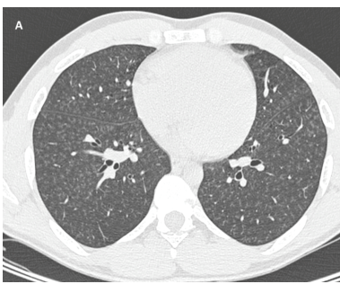

## Question

# Disease Characteristics Research Template

## Target Disease
- **Disease Name:** Talc Pneumoconiosis
- **MONDO ID:** MONDO:0001003 (if available)
- **Category:** Environmental

## Research Objectives

Please provide a comprehensive research report on **Talc Pneumoconiosis** covering all of the
disease characteristics listed below. This report will be used to populate a disease knowledge
base entry. Be thorough and cite primary literature (PMID preferred) for all claims.

For each section, **suggested databases/resources** are listed. These are the first places
you should search for information on each topic.

---

### 1. Disease Information
> **Search first:** OMIM, Orphanet, ICD-10/ICD-11, MeSH, PubMed

- What is the disease? Provide a concise overview.
- What are the key identifiers? (OMIM, Orphanet, ICD-10/ICD-11, MeSH, Mondo)
- What are the common synonyms and alternative names?
- Is the information derived from individual patients (e.g., EHR) or aggregated disease-level resources?

### 2. Etiology

- **Disease Causal Factors**: What are the primary causes? (genetic, environmental, infectious, mechanistic)
- **Risk Factors**:
  > **Search first:** PubMed, Cochrane Library, UpToDate, clinical guidelines, ClinVar, ClinGen, GWAS Catalog, PheGenI, CTD, CDC, WHO, epidemiological databases
  - Genetic risk factors (causal variants, susceptibility loci, modifier genes)
  - Environmental risk factors (toxins, lifestyle, occupational exposures, age, sex, family history)
- **Protective Factors**:
  > **Search first:** PubMed, Cochrane Library, clinical trial databases, GWAS Catalog, gnomAD, WHO, CDC, nutrition databases
  - Genetic protective factors (protective variants, modifier alleles)
  - Environmental protective factors (diet, lifestyle, exposures that reduce risk)
- **Gene-Environment Interactions**: How do genetic and environmental factors interact to influence disease?
  > **Search first:** CTD, PubMed, PheGenI, GxE databases

### 3. Phenotypes
> **Search first:** HPO (Human Phenotype Ontology), OMIM, Orphanet, PubMed, clinicaltrials.gov, MedDRA, SNOMED CT, DECIPHER, LOINC

For each phenotype, provide:
- **Phenotype type**: symptoms, clinical signs, physical manifestations, behavioral changes, or laboratory abnormalities
  > For symptoms/signs: HPO, OMIM, Orphanet, PubMed
  > For behavioral changes: HPO, DSM, RDoC (Research Domain Criteria), PubMed
  > For laboratory abnormalities: LOINC, SNOMED CT, LabTests Online, PubMed
- **Phenotype characteristics**:
  > **Search first:** OMIM, Orphanet, HPO, PubMed
  - Age of symptom onset (neonatal, childhood, adult-onset, late-onset)
  - Symptom severity (mild, moderate, severe, variable)
  - Symptom progression (stable, progressive, episodic, fluctuating)
  - Frequency among affected individuals (percentage or qualitative)
- **Quality of life impact**: Effects on daily functioning and well-being (per-phenotype when possible)
  > **Search first:** EQ-5D database, SF-36, WHO QOL databases, PubMed
- Suggest HPO (Human Phenotype Ontology) terms for each phenotype

### 4. Genetic/Molecular Information

- **Causal Genes**: Gene mutations or chromosomal abnormalities responsible for disease (gene symbols, OMIM IDs)
  > **Search first:** OMIM, ClinVar, HGMD, Ensembl, NCBI Gene
- **Pathogenic Variants**:
  - Affected genes (gene symbols, HGNC IDs)
    > **Search first:** OMIM, NCBI Gene, Ensembl, HGNC, UniProt, GeneCards
  - Variant classification (pathogenic, likely pathogenic, VUS per ACMG/AMP guidelines)
    > **Search first:** ClinVar, ClinGen, ACMG/AMP guidelines, VarSome
  - Variant type/class (missense, frameshift, nonsense, splice-site, structural)
  - Allele frequency in population databases
    > **Search first:** gnomAD, 1000 Genomes, ExAC, TOPMed, dbSNP
  - Somatic vs germline origin
    > **Search first:** COSMIC (somatic), ClinVar, ICGC, TCGA
  - Functional consequences (loss of function, gain of function, dominant negative)
- **Modifier Genes**: Genes that modify disease severity or expression
- **Epigenetic Information**: DNA methylation, histone modifications, chromatin changes affecting disease
  > **Search first:** ENCODE, Roadmap Epigenomics, MethBase, DiseaseMeth
- **Chromosomal Abnormalities**: Large-scale genetic changes (aneuploidy, translocations, inversions)
  > **Search first:** DECIPHER, ClinVar, ECARUCA, UCSC Genome Browser

### 5. Environmental Information

- **Environmental Factors**: Non-genetic contributing factors (toxins, radiation, pollution, occupational exposure)
  > **Search first:** CTD (Comparative Toxicogenomics Database), TOXNET, PubMed, EPA databases
- **Lifestyle Factors**: Behavioral factors (smoking, diet, exercise, alcohol consumption)
  > **Search first:** CDC databases, WHO, PubMed, NHANES
- **Infectious Agents**: If applicable, pathogens causing or triggering disease (bacteria, viruses, fungi, parasites)
  > **Search first:** NCBI Taxonomy, ViPR, BV-BRC, MicrobeDB, GIDEON

### 6. Mechanism / Pathophysiology

**Present this section as an ordered causal chain first, then the detail below.**
Open with a numbered sequence of mechanistic steps running from the initiating
lesion (mutation, exposure, infection) to the clinical manifestation, one step per
line, each naming what it causes next. State the causal verb explicitly ("leads
to", "results in") and say where a step is inferred rather than demonstrated.
Where the mechanism branches, show the branch. The categories below are a
checklist of what to cover within those steps, not the organizing structure —
a step may draw on several of them, and a category may contribute to several
steps.

- **Molecular Pathways**: Specific signaling cascades or biochemical pathways involved (Wnt, MAPK, mTOR, PI3K-AKT, etc.)
  > **Search first:** KEGG, Reactome, WikiPathways, PathBank, BioCyc
- **Cellular Processes**: Cell-level mechanisms (apoptosis, autophagy, cell cycle dysregulation, inflammation, etc.)
  > **Search first:** Gene Ontology (GO), Reactome, KEGG, PubMed
- **Protein Dysfunction**: How protein structure or function is altered (misfolding, aggregation, loss of function, gain of function)
  > **Search first:** UniProt, PDB (Protein Data Bank), InterPro, Pfam, AlphaFold
- **Metabolic Changes**: Alterations in metabolic processes (energy metabolism, lipid metabolism, amino acid metabolism)
  > **Search first:** KEGG, BioCyc, HMDB (Human Metabolome Database), BRENDA
- **Immune System Involvement**: Role of immune response (autoimmunity, immunodeficiency, chronic inflammation)
  > **Search first:** ImmPort, Immunome Database, IEDB, Gene Ontology
- **Tissue Damage Mechanisms**: How tissues/ are injured (oxidative stress, ischemia, fibrosis, necrosis)
  > **Search first:** PubMed, Gene Ontology, Reactome
- **Biochemical Abnormalities**: Specific molecular defects (enzyme deficiencies, receptor dysfunction, ion channel defects)
  > **Search first:** BRENDA, UniProt, KEGG, OMIM, PubMed
- **Epigenetic Changes**: DNA methylation, histone modifications affecting gene expression in disease
  > **Search first:** ENCODE, Roadmap Epigenomics, MethBase, DiseaseMeth
- **Molecular Profiling** (if available):
  - Transcriptomics/gene expression changes
    > **Search first:** GEO (Gene Expression Omnibus), ArrayExpress, GTEx, Human Cell Atlas, SRA
  - Proteomics findings
    > **Search first:** PRIDE, ProteomeXchange, Human Protein Atlas, STRING, BioGRID
  - Metabolomics signatures
    > **Search first:** MetaboLights, Metabolomics Workbench, HMDB, METLIN
  - Lipidomics alterations
    > **Search first:** LIPID MAPS, SwissLipids, LipidHome, Metabolomics Workbench
  - Genomic structural features
    > **Search first:** UCSC Genome Browser, Ensembl, NCBI, dbVar, DGV
- **Advanced Technologies** (if applicable):
  - Single-cell analysis findings (cell-type specific mechanisms, cellular heterogeneity)
    > **Search first:** Human Cell Atlas, Single Cell Portal, GEO, CELLxGENE
  - Spatial transcriptomics findings
    > **Search first:** GEO, Spatial Research, Vizgen, 10x Genomics data
  - Multi-omics integration results
    > **Search first:** TCGA, ICGC, cBioPortal, LinkedOmics, PubMed
  - Functional genomics screens (CRISPR, RNAi)
    > **Search first:** DepMap, GenomeRNAi, PubMed, BioGRID ORCS

For each mechanism, describe:
- The causal chain from initial trigger to clinical manifestation
- Which mechanisms are upstream vs downstream
- What cell types and biological processes are involved
- Suggest GO terms for biological processes and CL terms for cell types

### 7. Anatomical Structures Affected

- **Organ Level**:
  - Primary organs directly affected
  - Secondary organ involvement (complications, secondary effects)
  - Body systems involved (cardiovascular, nervous, digestive, respiratory, endocrine, etc.)
  > **Search first:** Uberon, FMA (Foundational Model of Anatomy), OMIM, HPO, ICD-11, MeSH, SNOMED CT
- **Tissue and Cell Level**:
  - Specific tissue types affected (epithelial, connective, muscle, nervous)
  - Specific cell populations targeted (with Cell Ontology terms)
  > **Search first:** Uberon, Human Protein Atlas, Cell Ontology, Human Cell Atlas, CellMarker, PanglaoDB
- **Subcellular Level**:
  - Cellular compartments involved (mitochondria, nucleus, ER, lysosomes) (with GO Cellular Component terms)
  > **Search first:** Gene Ontology (Cellular Component), UniProt, Human Protein Atlas
- **Localization**:
  - Specific anatomical sites (with UBERON terms)
    > **Search first:** FMA, Uberon, NeuroNames (for brain), SNOMED CT
  - Lateralization (unilateral, bilateral, asymmetric)
    > **Search first:** HPO, clinical literature, imaging databases

### 8. Temporal Development

- **Onset**:
  - Typical age of onset (congenital, pediatric, adult, geriatric)
  - Onset pattern (acute, subacute, chronic, insidious)
  > **Search first:** OMIM, Orphanet, HPO, PubMed
- **Progression**:
  - Disease stages (early, intermediate, advanced, end-stage)
    > **Search first:** Cancer Staging Manual (AJCC), WHO classifications, PubMed
  - Progression rate (rapid, slow, variable)
  - Disease course pattern (episodic, relapsing-remitting, progressive, stable)
  - Disease duration (self-limited, chronic lifelong)
  > **Search first:** Disease registries, longitudinal cohort databases, natural history studies, PubMed, Orphanet, OMIM
- **Patterns**:
  - Remission patterns (spontaneous, treatment-induced)
    > **Search first:** Clinical trial databases, disease registries, PubMed
  - Critical periods (time windows of vulnerability or opportunity for intervention)
    > **Search first:** PubMed, developmental biology databases, clinical guidelines

### 9. Inheritance and Population

- **Epidemiology**:
  - Prevalence (cases per 100,000 at given time)
  - Incidence (new cases per 100,000 per year)
  > **Search first:** Orphanet, CDC, WHO, GBD (Global Burden of Disease), national registries, SEER, disease registries
- **For Genetic Etiology**:
  - Inheritance pattern (AD, AR, X-linked, mitochondrial, multifactorial, polygenic)
    > **Search first:** OMIM, Orphanet, ClinVar, GTR (Genetic Testing Registry)
  - Penetrance (complete, incomplete, age-dependent)
    > **Search first:** ClinVar, OMIM, PubMed, ClinGen
  - Expressivity (variable, consistent)
    > **Search first:** OMIM, ClinVar, PubMed
  - Genetic anticipation (increasing severity in successive generations)
    > **Search first:** OMIM, PubMed (especially for repeat expansion disorders)
  - Germline mosaicism
    > **Search first:** ClinVar, OMIM, genetic counseling literature, PubMed
  - Founder effects (population-specific mutations)
    > **Search first:** gnomAD, population genetics databases, PubMed
  - Consanguinity role
    > **Search first:** OMIM, population studies, genetic counseling resources
  - Carrier frequency
    > **Search first:** gnomAD, carrier screening databases, GeneReviews, GTR
- **Population Demographics**:
  - Affected populations (ethnic or demographic groups with higher prevalence)
    > **Search first:** gnomAD, 1000 Genomes, PAGE Study, PubMed, population registries
  - Geographic distribution (endemic areas, regional variation)
    > **Search first:** WHO, CDC, GBD, Orphanet, geographic epidemiology databases
  - Geographic distribution of specific variants
  - Sex ratio (male:female)
    > **Search first:** Disease registries, OMIM, PubMed, epidemiological databases
  - Age distribution of affected individuals
    > **Search first:** CDC, disease registries, SEER, Orphanet

### 10. Diagnostics

- **Clinical Tests**:
  - Laboratory tests (blood, urine, tissue chemistry, specific enzyme assays)
    > **Search first:** LOINC, LabTests Online, PubMed
  - Biomarkers (proteins, metabolites, genetic markers, circulating biomarkers)
    > **Search first:** FDA Biomarker List, BEST (Biomarkers, EndpointS, and other Tools), PubMed
  - Imaging studies (X-ray, CT, MRI, PET, ultrasound)
    > **Search first:** RadLex, DICOM, Radiopaedia, imaging databases
  - Functional tests (pulmonary function, cardiac stress tests)
    > **Search first:** LOINC, clinical guidelines, PubMed
  - Electrophysiology (EEG, EMG, ECG, nerve conduction studies)
    > **Search first:** LOINC, clinical neurophysiology databases, PubMed
  - Biopsy findings (histopathology, immunohistochemistry)
    > **Search first:** SNOMED CT, College of American Pathologists resources, PubMed
  - Pathology findings (microscopic examination)
    > **Search first:** SNOMED CT, Digital Pathology databases, PubMed
- **Genetic Testing**:
  > **Search first:** GTR (Genetic Testing Registry), GeneReviews, ClinGen
  - Overview of recommended genetic testing approach
  - Whole genome sequencing (WGS) utility
    > **Search first:** GTR, ClinVar, GEL (Genomics England), gnomAD
  - Whole exome sequencing (WES) utility
    > **Search first:** GTR, ClinVar, OMIM, GeneMatcher
  - Gene panels (which panels, which genes)
    > **Search first:** GTR, ClinVar, laboratory-specific databases
  - Single gene testing
    > **Search first:** GTR, ClinVar, OMIM, GeneReviews
  - Chromosomal microarray (CMA)
    > **Search first:** DECIPHER, ClinVar, dbVar, ECARUCA
  - Karyotyping
    > **Search first:** Chromosome Abnormality Database, ClinVar, cytogenetics resources
  - FISH
    > **Search first:** ClinVar, cytogenetics databases, PubMed
  - Mitochondrial DNA testing
    > **Search first:** MITOMAP, MSeqDR, ClinVar, GTR
  - Repeat expansion testing
    > **Search first:** GTR, ClinVar, repeat expansion databases, PubMed
- **Omics-Based Diagnostics** (if applicable):
  - RNA sequencing / transcriptomics
    > **Search first:** GEO, ArrayExpress, GTEx, RNA-seq databases
  - Proteomics
    > **Search first:** PRIDE, ProteomeXchange, FDA Biomarker database
  - Metabolomics
    > **Search first:** MetaboLights, Metabolomics Workbench, HMDB
  - Epigenomics
    > **Search first:** GEO, ENCODE, Roadmap Epigenomics, MethBase
  - Liquid biopsy
    > **Search first:** COSMIC, ClinVar, liquid biopsy databases, PubMed
- **Clinical Criteria**:
  - Standardized diagnostic criteria (DSM, ICD, society guidelines)
    > **Search first:** DSM-5, ICD-11, clinical society guidelines, UpToDate
  - Differential diagnosis (other conditions to rule out, with distinguishing features)
    > **Search first:** DynaMed, UpToDate, clinical decision support systems
- **Screening**:
  - Screening methods for asymptomatic individuals (newborn screening, carrier screening, cascade screening)
    > **Search first:** ACMG recommendations, CDC newborn screening, GTR

### 11. Outcome/Prognosis

- **Survival and Mortality**:
  - Survival rate (5-year, 10-year, overall)
    > **Search first:** SEER, cancer registries, disease-specific registries, PubMed
  - Life expectancy (with and without treatment if applicable)
    > **Search first:** Orphanet, disease registries, actuarial databases, PubMed
  - Mortality rate
    > **Search first:** CDC, WHO, GBD, national mortality databases
  - Disease-specific mortality (deaths directly attributable to disease)
    > **Search first:** Disease registries, CDC Wonder, GBD, PubMed
- **Morbidity and Function**:
  - Morbidity (disease-related disability and health impacts)
    > **Search first:** GBD, WHO, disability databases, PubMed
  - Disability outcomes (long-term functional impairments)
    > **Search first:** ICF (International Classification of Functioning), disability registries
  - Quality of life measures (EQ-5D, SF-36, PROMIS, disease-specific tools)
    > **Search first:** EQ-5D database, SF-36, PROMIS, PubMed
- **Disease Course**:
  - Complications (secondary problems: infections, organ failure, etc.)
    > **Search first:** ICD codes, disease registries, clinical databases, PubMed
  - Recovery potential (likelihood and extent of recovery, with vs without treatment)
    > **Search first:** Natural history studies, rehabilitation databases, PubMed
- **Prediction**:
  - Prognostic factors (age, disease severity, biomarkers, treatment response)
    > **Search first:** Prognostic models databases, clinical calculators, PubMed
  - Prognostic biomarkers (molecular markers predicting disease course)
    > **Search first:** FDA Biomarker database, PubMed, cancer prognostic databases

### 12. Treatment

- **Pharmacotherapy**:
  - Pharmacological treatments (drug names, drug classes, mechanisms of action)
    > **Search first:** DrugBank, RxNorm, ATC classification, DailyMed, FDA databases
  - Pharmacogenomics (how genetic variants affect drug metabolism, efficacy, toxicity)
    > **Search first:** PharmGKB, CPIC (Clinical Pharmacogenetics), FDA Table of PGx Biomarkers
- **Advanced Therapeutics**:
  - Gene therapy (viral vectors, CRISPR, gene replacement, gene editing)
    > **Search first:** ClinicalTrials.gov, FDA gene therapy database, ASGCT resources
  - Cell therapy (stem cell transplant, CAR-T, cellular therapeutics)
    > **Search first:** ClinicalTrials.gov, FDA cell therapy database, FACT standards
  - RNA-based therapies (ASOs, siRNA, mRNA therapies)
    > **Search first:** ClinicalTrials.gov, FDA approvals, PubMed
  - Targeted therapies (treatments directed at specific molecular targets)
    > **Search first:** My Cancer Genome, OncoKB, ClinicalTrials.gov, FDA approvals
  - Immunotherapies (checkpoint inhibitors, monoclonal antibodies)
    > **Search first:** Cancer Immunotherapy Database, FDA approvals, ClinicalTrials.gov
- **Surgical and Interventional**:
  - Surgical interventions (types of surgery, timing, outcomes)
    > **Search first:** CPT codes, surgical registries, clinical guidelines, PubMed
- **Supportive and Rehabilitative**:
  - Supportive care (symptom management, pain control, nutrition)
    > **Search first:** Clinical guidelines, Cochrane Library, PubMed
  - Rehabilitation (physical therapy, occupational therapy, speech therapy)
    > **Search first:** Rehabilitation medicine databases, clinical guidelines, PubMed
- **Experimental**:
  - Experimental treatments in clinical trials (with NCT identifiers if available)
    > **Search first:** ClinicalTrials.gov, EU Clinical Trials Register, WHO ICTRP
- **Treatment Outcomes**:
  - Treatment response rates
    > **Search first:** Clinical trial databases, FDA reviews, systematic reviews, PubMed
  - Side effects and adverse events
    > **Search first:** FDA Adverse Event Reporting System (FAERS), MedWatch, PubMed
- **Treatment Strategy**:
  - Treatment algorithms (clinical pathways, decision trees)
    > **Search first:** Clinical practice guidelines, NCCN Guidelines, UpToDate
  - Combination therapies
    > **Search first:** ClinicalTrials.gov, treatment guidelines, PubMed
  - Personalized medicine approaches (genotype-guided treatment)
    > **Search first:** My Cancer Genome, CIViC, PharmGKB, precision medicine databases

For each treatment, suggest NCIT (NCI Thesaurus) clinical-intervention terms where applicable.

### 13. Prevention

- **Prevention Levels**:
  - Primary prevention (preventing disease occurrence: vaccination, risk factor modification)
    > **Search first:** CDC, WHO, USPSTF recommendations, Cochrane Library
  - Secondary prevention (early detection and treatment: screening programs, early intervention)
    > **Search first:** USPSTF, CDC screening guidelines, WHO
  - Tertiary prevention (preventing complications in those with disease)
    > **Search first:** Clinical guidelines, disease management protocols, PubMed
- **Immunization**: Vaccine strategies (if applicable)
  > **Search first:** CDC vaccine schedules, WHO immunization, FDA vaccine database
- **Screening and Early Detection**:
  - Screening programs (population-based: newborn screening, cancer screening)
    > **Search first:** CDC screening programs, USPSTF, cancer screening databases
  - Genetic screening (carrier screening, preimplantation genetic diagnosis, prenatal testing)
    > **Search first:** ACMG recommendations, ACOG guidelines, GTR
  - Risk stratification (identifying high-risk individuals for targeted prevention)
    > **Search first:** Risk prediction models, clinical calculators, PubMed
- **Behavioral Interventions**: Lifestyle modifications to reduce risk
  > **Search first:** CDC, WHO, behavioral intervention databases, Cochrane Library
- **Counseling**: Genetic counseling (risk assessment, family planning guidance)
  > **Search first:** NSGC resources, ACMG guidelines, GeneReviews
- **Public Health**:
  - Public health interventions (sanitation, vector control, health education)
    > **Search first:** CDC, WHO, public health databases, PubMed
  - Environmental interventions (reducing environmental risk factors)
    > **Search first:** EPA databases, WHO environmental health, PubMed
- **Prophylaxis**: Preventive medications or procedures
  > **Search first:** Clinical guidelines, FDA approvals, PubMed

### 14. Other Species / Natural Disease

- **Taxonomy**: Species affected (with NCBI Taxon identifiers)
  > **Search first:** NCBI Taxonomy
- **Breed**: Specific breeds affected (with VBO identifiers if applicable)
  > **Search first:** VBO (Vertebrate Breed Ontology)
- **Gene**: Orthologous genes in other species (with NCBI Gene IDs)
  > **Search first:** NCBI Gene
- **Natural Disease**:
  - Naturally occurring disease in other species (companion animals, wildlife)
    > **Search first:** OMIA (Online Mendelian Inheritance in Animals), VetCompass, PubMed
  - Veterinary relevance and importance in animal health
    > **Search first:** OMIA, veterinary databases, PubMed
- **Comparative Biology**:
  - Comparative pathology (similarities and differences across species)
    > **Search first:** OMIA, comparative pathology databases, PubMed
  - Evolutionary conservation of disease mechanisms
    > **Search first:** HomoloGene, OrthoMCL, Alliance of Genome Resources
- **Transmission** (if applicable):
  - Zoonotic potential
    > **Search first:** CDC zoonotic diseases, WHO zoonoses, GIDEON
  - Cross-species susceptibility
    > **Search first:** NCBI Taxonomy, veterinary databases, PubMed

### 15. Model Organisms

- **Model Types**:
  - Model organism type (mammalian, invertebrate, cellular, in vitro)
    > **Search first:** Alliance of Genome Resources, model organism databases
  - Specific model systems (mouse, rat, zebrafish, Drosophila, C. elegans, yeast, cell lines, organoids, iPSCs)
    > **Search first:** MGI, RGD, ZFIN, FlyBase, WormBase, SGD, ATCC, Cellosaurus
  - Induced models (drug treatment, surgical intervention, environmental manipulation)
    > **Search first:** MGI, model organism databases, PubMed
- **Genetic Models**:
  - Types available (knockout, knock-in, transgenic, conditional, humanized)
    > **Search first:** MGI, IMPC, KOMP, EuMMCR, IMSR
- **Model Characteristics**:
  - Phenotype recapitulation (how well model reproduces human disease features)
    > **Search first:** Model organism databases, comparative studies, PubMed
  - Model limitations (aspects of human disease not captured)
    > **Search first:** Model organism databases, PubMed, review articles
- **Applications**:
  - Research applications (what aspects of disease can be studied)
    > **Search first:** Model organism databases, PubMed
- **Resources**:
  - Model databases
    > **Search first:** MGI, RGD, ZFIN, FlyBase, WormBase, IMSR, EMMA, MMRRC

---

## Citation Requirements

- Cite primary literature (PMID preferred) for all mechanistic and clinical claims
- Prioritize recent reviews and landmark papers
- Include direct quotes from abstracts where possible to support key statements
- Distinguish evidence source types: human clinical, model organism, in vitro, computational

## Output Format

Structure your response as a comprehensive narrative organized by the sections above.
For each section, provide:
- Factual content with specific details (numbers, percentages, gene names, variant nomenclature)
- Ontology term suggestions (HPO, GO, CL, UBERON, CHEBI, NCIT, MONDO) where applicable
- Evidence citations with PMIDs
- Direct quotes from abstracts to support key claims
- Clear indication when information is not available or not applicable for this disease

This report will be used to populate a disease knowledge base entry with:
- Pathophysiology descriptions with causal chains
- Gene/protein annotations (HGNC, GO terms)
- Phenotype associations (HP terms) with frequencies
- Cell type involvement (CL terms)
- Anatomical locations (UBERON terms)
- Chemical entities (CHEBI terms)
- Treatment annotations (NCIT terms)
- Evidence items with PMIDs and exact abstract quotes
- Epidemiology, prognosis, diagnostic, and prevention information
- Animal model descriptions with phenotype recapitulation details

## Output

Question: You are an expert researcher providing comprehensive, well-cited information.

Provide detailed information focusing on:
1. Key concepts and definitions with current understanding
2. Recent developments and latest research (prioritize 2023-2024 sources)
3. Current applications and real-world implementations
4. Expert opinions and analysis from authoritative sources
5. Relevant statistics and data from recent studies

Format as a comprehensive research report with proper citations. Include URLs and publication dates where available.
Always prioritize recent, authoritative sources and provide specific citations for all major claims.

# Disease Characteristics Research Template

## Target Disease
- **Disease Name:** Talc Pneumoconiosis
- **MONDO ID:** MONDO:0001003 (if available)
- **Category:** Environmental

## Research Objectives

Please provide a comprehensive research report on **Talc Pneumoconiosis** covering all of the
disease characteristics listed below. This report will be used to populate a disease knowledge
base entry. Be thorough and cite primary literature (PMID preferred) for all claims.

For each section, **suggested databases/resources** are listed. These are the first places
you should search for information on each topic.

---

### 1. Disease Information
> **Search first:** OMIM, Orphanet, ICD-10/ICD-11, MeSH, PubMed

- What is the disease? Provide a concise overview.
- What are the key identifiers? (OMIM, Orphanet, ICD-10/ICD-11, MeSH, Mondo)
- What are the common synonyms and alternative names?
- Is the information derived from individual patients (e.g., EHR) or aggregated disease-level resources?

### 2. Etiology

- **Disease Causal Factors**: What are the primary causes? (genetic, environmental, infectious, mechanistic)
- **Risk Factors**:
  > **Search first:** PubMed, Cochrane Library, UpToDate, clinical guidelines, ClinVar, ClinGen, GWAS Catalog, PheGenI, CTD, CDC, WHO, epidemiological databases
  - Genetic risk factors (causal variants, susceptibility loci, modifier genes)
  - Environmental risk factors (toxins, lifestyle, occupational exposures, age, sex, family history)
- **Protective Factors**:
  > **Search first:** PubMed, Cochrane Library, clinical trial databases, GWAS Catalog, gnomAD, WHO, CDC, nutrition databases
  - Genetic protective factors (protective variants, modifier alleles)
  - Environmental protective factors (diet, lifestyle, exposures that reduce risk)
- **Gene-Environment Interactions**: How do genetic and environmental factors interact to influence disease?
  > **Search first:** CTD, PubMed, PheGenI, GxE databases

### 3. Phenotypes
> **Search first:** HPO (Human Phenotype Ontology), OMIM, Orphanet, PubMed, clinicaltrials.gov, MedDRA, SNOMED CT, DECIPHER, LOINC

For each phenotype, provide:
- **Phenotype type**: symptoms, clinical signs, physical manifestations, behavioral changes, or laboratory abnormalities
  > For symptoms/signs: HPO, OMIM, Orphanet, PubMed
  > For behavioral changes: HPO, DSM, RDoC (Research Domain Criteria), PubMed
  > For laboratory abnormalities: LOINC, SNOMED CT, LabTests Online, PubMed
- **Phenotype characteristics**:
  > **Search first:** OMIM, Orphanet, HPO, PubMed
  - Age of symptom onset (neonatal, childhood, adult-onset, late-onset)
  - Symptom severity (mild, moderate, severe, variable)
  - Symptom progression (stable, progressive, episodic, fluctuating)
  - Frequency among affected individuals (percentage or qualitative)
- **Quality of life impact**: Effects on daily functioning and well-being (per-phenotype when possible)
  > **Search first:** EQ-5D database, SF-36, WHO QOL databases, PubMed
- Suggest HPO (Human Phenotype Ontology) terms for each phenotype

### 4. Genetic/Molecular Information

- **Causal Genes**: Gene mutations or chromosomal abnormalities responsible for disease (gene symbols, OMIM IDs)
  > **Search first:** OMIM, ClinVar, HGMD, Ensembl, NCBI Gene
- **Pathogenic Variants**:
  - Affected genes (gene symbols, HGNC IDs)
    > **Search first:** OMIM, NCBI Gene, Ensembl, HGNC, UniProt, GeneCards
  - Variant classification (pathogenic, likely pathogenic, VUS per ACMG/AMP guidelines)
    > **Search first:** ClinVar, ClinGen, ACMG/AMP guidelines, VarSome
  - Variant type/class (missense, frameshift, nonsense, splice-site, structural)
  - Allele frequency in population databases
    > **Search first:** gnomAD, 1000 Genomes, ExAC, TOPMed, dbSNP
  - Somatic vs germline origin
    > **Search first:** COSMIC (somatic), ClinVar, ICGC, TCGA
  - Functional consequences (loss of function, gain of function, dominant negative)
- **Modifier Genes**: Genes that modify disease severity or expression
- **Epigenetic Information**: DNA methylation, histone modifications, chromatin changes affecting disease
  > **Search first:** ENCODE, Roadmap Epigenomics, MethBase, DiseaseMeth
- **Chromosomal Abnormalities**: Large-scale genetic changes (aneuploidy, translocations, inversions)
  > **Search first:** DECIPHER, ClinVar, ECARUCA, UCSC Genome Browser

### 5. Environmental Information

- **Environmental Factors**: Non-genetic contributing factors (toxins, radiation, pollution, occupational exposure)
  > **Search first:** CTD (Comparative Toxicogenomics Database), TOXNET, PubMed, EPA databases
- **Lifestyle Factors**: Behavioral factors (smoking, diet, exercise, alcohol consumption)
  > **Search first:** CDC databases, WHO, PubMed, NHANES
- **Infectious Agents**: If applicable, pathogens causing or triggering disease (bacteria, viruses, fungi, parasites)
  > **Search first:** NCBI Taxonomy, ViPR, BV-BRC, MicrobeDB, GIDEON

### 6. Mechanism / Pathophysiology

**Present this section as an ordered causal chain first, then the detail below.**
Open with a numbered sequence of mechanistic steps running from the initiating
lesion (mutation, exposure, infection) to the clinical manifestation, one step per
line, each naming what it causes next. State the causal verb explicitly ("leads
to", "results in") and say where a step is inferred rather than demonstrated.
Where the mechanism branches, show the branch. The categories below are a
checklist of what to cover within those steps, not the organizing structure —
a step may draw on several of them, and a category may contribute to several
steps.

- **Molecular Pathways**: Specific signaling cascades or biochemical pathways involved (Wnt, MAPK, mTOR, PI3K-AKT, etc.)
  > **Search first:** KEGG, Reactome, WikiPathways, PathBank, BioCyc
- **Cellular Processes**: Cell-level mechanisms (apoptosis, autophagy, cell cycle dysregulation, inflammation, etc.)
  > **Search first:** Gene Ontology (GO), Reactome, KEGG, PubMed
- **Protein Dysfunction**: How protein structure or function is altered (misfolding, aggregation, loss of function, gain of function)
  > **Search first:** UniProt, PDB (Protein Data Bank), InterPro, Pfam, AlphaFold
- **Metabolic Changes**: Alterations in metabolic processes (energy metabolism, lipid metabolism, amino acid metabolism)
  > **Search first:** KEGG, BioCyc, HMDB (Human Metabolome Database), BRENDA
- **Immune System Involvement**: Role of immune response (autoimmunity, immunodeficiency, chronic inflammation)
  > **Search first:** ImmPort, Immunome Database, IEDB, Gene Ontology
- **Tissue Damage Mechanisms**: How tissues/ are injured (oxidative stress, ischemia, fibrosis, necrosis)
  > **Search first:** PubMed, Gene Ontology, Reactome
- **Biochemical Abnormalities**: Specific molecular defects (enzyme deficiencies, receptor dysfunction, ion channel defects)
  > **Search first:** BRENDA, UniProt, KEGG, OMIM, PubMed
- **Epigenetic Changes**: DNA methylation, histone modifications affecting gene expression in disease
  > **Search first:** ENCODE, Roadmap Epigenomics, MethBase, DiseaseMeth
- **Molecular Profiling** (if available):
  - Transcriptomics/gene expression changes
    > **Search first:** GEO (Gene Expression Omnibus), ArrayExpress, GTEx, Human Cell Atlas, SRA
  - Proteomics findings
    > **Search first:** PRIDE, ProteomeXchange, Human Protein Atlas, STRING, BioGRID
  - Metabolomics signatures
    > **Search first:** MetaboLights, Metabolomics Workbench, HMDB, METLIN
  - Lipidomics alterations
    > **Search first:** LIPID MAPS, SwissLipids, LipidHome, Metabolomics Workbench
  - Genomic structural features
    > **Search first:** UCSC Genome Browser, Ensembl, NCBI, dbVar, DGV
- **Advanced Technologies** (if applicable):
  - Single-cell analysis findings (cell-type specific mechanisms, cellular heterogeneity)
    > **Search first:** Human Cell Atlas, Single Cell Portal, GEO, CELLxGENE
  - Spatial transcriptomics findings
    > **Search first:** GEO, Spatial Research, Vizgen, 10x Genomics data
  - Multi-omics integration results
    > **Search first:** TCGA, ICGC, cBioPortal, LinkedOmics, PubMed
  - Functional genomics screens (CRISPR, RNAi)
    > **Search first:** DepMap, GenomeRNAi, PubMed, BioGRID ORCS

For each mechanism, describe:
- The causal chain from initial trigger to clinical manifestation
- Which mechanisms are upstream vs downstream
- What cell types and biological processes are involved
- Suggest GO terms for biological processes and CL terms for cell types

### 7. Anatomical Structures Affected

- **Organ Level**:
  - Primary organs directly affected
  - Secondary organ involvement (complications, secondary effects)
  - Body systems involved (cardiovascular, nervous, digestive, respiratory, endocrine, etc.)
  > **Search first:** Uberon, FMA (Foundational Model of Anatomy), OMIM, HPO, ICD-11, MeSH, SNOMED CT
- **Tissue and Cell Level**:
  - Specific tissue types affected (epithelial, connective, muscle, nervous)
  - Specific cell populations targeted (with Cell Ontology terms)
  > **Search first:** Uberon, Human Protein Atlas, Cell Ontology, Human Cell Atlas, CellMarker, PanglaoDB
- **Subcellular Level**:
  - Cellular compartments involved (mitochondria, nucleus, ER, lysosomes) (with GO Cellular Component terms)
  > **Search first:** Gene Ontology (Cellular Component), UniProt, Human Protein Atlas
- **Localization**:
  - Specific anatomical sites (with UBERON terms)
    > **Search first:** FMA, Uberon, NeuroNames (for brain), SNOMED CT
  - Lateralization (unilateral, bilateral, asymmetric)
    > **Search first:** HPO, clinical literature, imaging databases

### 8. Temporal Development

- **Onset**:
  - Typical age of onset (congenital, pediatric, adult, geriatric)
  - Onset pattern (acute, subacute, chronic, insidious)
  > **Search first:** OMIM, Orphanet, HPO, PubMed
- **Progression**:
  - Disease stages (early, intermediate, advanced, end-stage)
    > **Search first:** Cancer Staging Manual (AJCC), WHO classifications, PubMed
  - Progression rate (rapid, slow, variable)
  - Disease course pattern (episodic, relapsing-remitting, progressive, stable)
  - Disease duration (self-limited, chronic lifelong)
  > **Search first:** Disease registries, longitudinal cohort databases, natural history studies, PubMed, Orphanet, OMIM
- **Patterns**:
  - Remission patterns (spontaneous, treatment-induced)
    > **Search first:** Clinical trial databases, disease registries, PubMed
  - Critical periods (time windows of vulnerability or opportunity for intervention)
    > **Search first:** PubMed, developmental biology databases, clinical guidelines

### 9. Inheritance and Population

- **Epidemiology**:
  - Prevalence (cases per 100,000 at given time)
  - Incidence (new cases per 100,000 per year)
  > **Search first:** Orphanet, CDC, WHO, GBD (Global Burden of Disease), national registries, SEER, disease registries
- **For Genetic Etiology**:
  - Inheritance pattern (AD, AR, X-linked, mitochondrial, multifactorial, polygenic)
    > **Search first:** OMIM, Orphanet, ClinVar, GTR (Genetic Testing Registry)
  - Penetrance (complete, incomplete, age-dependent)
    > **Search first:** ClinVar, OMIM, PubMed, ClinGen
  - Expressivity (variable, consistent)
    > **Search first:** OMIM, ClinVar, PubMed
  - Genetic anticipation (increasing severity in successive generations)
    > **Search first:** OMIM, PubMed (especially for repeat expansion disorders)
  - Germline mosaicism
    > **Search first:** ClinVar, OMIM, genetic counseling literature, PubMed
  - Founder effects (population-specific mutations)
    > **Search first:** gnomAD, population genetics databases, PubMed
  - Consanguinity role
    > **Search first:** OMIM, population studies, genetic counseling resources
  - Carrier frequency
    > **Search first:** gnomAD, carrier screening databases, GeneReviews, GTR
- **Population Demographics**:
  - Affected populations (ethnic or demographic groups with higher prevalence)
    > **Search first:** gnomAD, 1000 Genomes, PAGE Study, PubMed, population registries
  - Geographic distribution (endemic areas, regional variation)
    > **Search first:** WHO, CDC, GBD, Orphanet, geographic epidemiology databases
  - Geographic distribution of specific variants
  - Sex ratio (male:female)
    > **Search first:** Disease registries, OMIM, PubMed, epidemiological databases
  - Age distribution of affected individuals
    > **Search first:** CDC, disease registries, SEER, Orphanet

### 10. Diagnostics

- **Clinical Tests**:
  - Laboratory tests (blood, urine, tissue chemistry, specific enzyme assays)
    > **Search first:** LOINC, LabTests Online, PubMed
  - Biomarkers (proteins, metabolites, genetic markers, circulating biomarkers)
    > **Search first:** FDA Biomarker List, BEST (Biomarkers, EndpointS, and other Tools), PubMed
  - Imaging studies (X-ray, CT, MRI, PET, ultrasound)
    > **Search first:** RadLex, DICOM, Radiopaedia, imaging databases
  - Functional tests (pulmonary function, cardiac stress tests)
    > **Search first:** LOINC, clinical guidelines, PubMed
  - Electrophysiology (EEG, EMG, ECG, nerve conduction studies)
    > **Search first:** LOINC, clinical neurophysiology databases, PubMed
  - Biopsy findings (histopathology, immunohistochemistry)
    > **Search first:** SNOMED CT, College of American Pathologists resources, PubMed
  - Pathology findings (microscopic examination)
    > **Search first:** SNOMED CT, Digital Pathology databases, PubMed
- **Genetic Testing**:
  > **Search first:** GTR (Genetic Testing Registry), GeneReviews, ClinGen
  - Overview of recommended genetic testing approach
  - Whole genome sequencing (WGS) utility
    > **Search first:** GTR, ClinVar, GEL (Genomics England), gnomAD
  - Whole exome sequencing (WES) utility
    > **Search first:** GTR, ClinVar, OMIM, GeneMatcher
  - Gene panels (which panels, which genes)
    > **Search first:** GTR, ClinVar, laboratory-specific databases
  - Single gene testing
    > **Search first:** GTR, ClinVar, OMIM, GeneReviews
  - Chromosomal microarray (CMA)
    > **Search first:** DECIPHER, ClinVar, dbVar, ECARUCA
  - Karyotyping
    > **Search first:** Chromosome Abnormality Database, ClinVar, cytogenetics resources
  - FISH
    > **Search first:** ClinVar, cytogenetics databases, PubMed
  - Mitochondrial DNA testing
    > **Search first:** MITOMAP, MSeqDR, ClinVar, GTR
  - Repeat expansion testing
    > **Search first:** GTR, ClinVar, repeat expansion databases, PubMed
- **Omics-Based Diagnostics** (if applicable):
  - RNA sequencing / transcriptomics
    > **Search first:** GEO, ArrayExpress, GTEx, RNA-seq databases
  - Proteomics
    > **Search first:** PRIDE, ProteomeXchange, FDA Biomarker database
  - Metabolomics
    > **Search first:** MetaboLights, Metabolomics Workbench, HMDB
  - Epigenomics
    > **Search first:** GEO, ENCODE, Roadmap Epigenomics, MethBase
  - Liquid biopsy
    > **Search first:** COSMIC, ClinVar, liquid biopsy databases, PubMed
- **Clinical Criteria**:
  - Standardized diagnostic criteria (DSM, ICD, society guidelines)
    > **Search first:** DSM-5, ICD-11, clinical society guidelines, UpToDate
  - Differential diagnosis (other conditions to rule out, with distinguishing features)
    > **Search first:** DynaMed, UpToDate, clinical decision support systems
- **Screening**:
  - Screening methods for asymptomatic individuals (newborn screening, carrier screening, cascade screening)
    > **Search first:** ACMG recommendations, CDC newborn screening, GTR

### 11. Outcome/Prognosis

- **Survival and Mortality**:
  - Survival rate (5-year, 10-year, overall)
    > **Search first:** SEER, cancer registries, disease-specific registries, PubMed
  - Life expectancy (with and without treatment if applicable)
    > **Search first:** Orphanet, disease registries, actuarial databases, PubMed
  - Mortality rate
    > **Search first:** CDC, WHO, GBD, national mortality databases
  - Disease-specific mortality (deaths directly attributable to disease)
    > **Search first:** Disease registries, CDC Wonder, GBD, PubMed
- **Morbidity and Function**:
  - Morbidity (disease-related disability and health impacts)
    > **Search first:** GBD, WHO, disability databases, PubMed
  - Disability outcomes (long-term functional impairments)
    > **Search first:** ICF (International Classification of Functioning), disability registries
  - Quality of life measures (EQ-5D, SF-36, PROMIS, disease-specific tools)
    > **Search first:** EQ-5D database, SF-36, PROMIS, PubMed
- **Disease Course**:
  - Complications (secondary problems: infections, organ failure, etc.)
    > **Search first:** ICD codes, disease registries, clinical databases, PubMed
  - Recovery potential (likelihood and extent of recovery, with vs without treatment)
    > **Search first:** Natural history studies, rehabilitation databases, PubMed
- **Prediction**:
  - Prognostic factors (age, disease severity, biomarkers, treatment response)
    > **Search first:** Prognostic models databases, clinical calculators, PubMed
  - Prognostic biomarkers (molecular markers predicting disease course)
    > **Search first:** FDA Biomarker database, PubMed, cancer prognostic databases

### 12. Treatment

- **Pharmacotherapy**:
  - Pharmacological treatments (drug names, drug classes, mechanisms of action)
    > **Search first:** DrugBank, RxNorm, ATC classification, DailyMed, FDA databases
  - Pharmacogenomics (how genetic variants affect drug metabolism, efficacy, toxicity)
    > **Search first:** PharmGKB, CPIC (Clinical Pharmacogenetics), FDA Table of PGx Biomarkers
- **Advanced Therapeutics**:
  - Gene therapy (viral vectors, CRISPR, gene replacement, gene editing)
    > **Search first:** ClinicalTrials.gov, FDA gene therapy database, ASGCT resources
  - Cell therapy (stem cell transplant, CAR-T, cellular therapeutics)
    > **Search first:** ClinicalTrials.gov, FDA cell therapy database, FACT standards
  - RNA-based therapies (ASOs, siRNA, mRNA therapies)
    > **Search first:** ClinicalTrials.gov, FDA approvals, PubMed
  - Targeted therapies (treatments directed at specific molecular targets)
    > **Search first:** My Cancer Genome, OncoKB, ClinicalTrials.gov, FDA approvals
  - Immunotherapies (checkpoint inhibitors, monoclonal antibodies)
    > **Search first:** Cancer Immunotherapy Database, FDA approvals, ClinicalTrials.gov
- **Surgical and Interventional**:
  - Surgical interventions (types of surgery, timing, outcomes)
    > **Search first:** CPT codes, surgical registries, clinical guidelines, PubMed
- **Supportive and Rehabilitative**:
  - Supportive care (symptom management, pain control, nutrition)
    > **Search first:** Clinical guidelines, Cochrane Library, PubMed
  - Rehabilitation (physical therapy, occupational therapy, speech therapy)
    > **Search first:** Rehabilitation medicine databases, clinical guidelines, PubMed
- **Experimental**:
  - Experimental treatments in clinical trials (with NCT identifiers if available)
    > **Search first:** ClinicalTrials.gov, EU Clinical Trials Register, WHO ICTRP
- **Treatment Outcomes**:
  - Treatment response rates
    > **Search first:** Clinical trial databases, FDA reviews, systematic reviews, PubMed
  - Side effects and adverse events
    > **Search first:** FDA Adverse Event Reporting System (FAERS), MedWatch, PubMed
- **Treatment Strategy**:
  - Treatment algorithms (clinical pathways, decision trees)
    > **Search first:** Clinical practice guidelines, NCCN Guidelines, UpToDate
  - Combination therapies
    > **Search first:** ClinicalTrials.gov, treatment guidelines, PubMed
  - Personalized medicine approaches (genotype-guided treatment)
    > **Search first:** My Cancer Genome, CIViC, PharmGKB, precision medicine databases

For each treatment, suggest NCIT (NCI Thesaurus) clinical-intervention terms where applicable.

### 13. Prevention

- **Prevention Levels**:
  - Primary prevention (preventing disease occurrence: vaccination, risk factor modification)
    > **Search first:** CDC, WHO, USPSTF recommendations, Cochrane Library
  - Secondary prevention (early detection and treatment: screening programs, early intervention)
    > **Search first:** USPSTF, CDC screening guidelines, WHO
  - Tertiary prevention (preventing complications in those with disease)
    > **Search first:** Clinical guidelines, disease management protocols, PubMed
- **Immunization**: Vaccine strategies (if applicable)
  > **Search first:** CDC vaccine schedules, WHO immunization, FDA vaccine database
- **Screening and Early Detection**:
  - Screening programs (population-based: newborn screening, cancer screening)
    > **Search first:** CDC screening programs, USPSTF, cancer screening databases
  - Genetic screening (carrier screening, preimplantation genetic diagnosis, prenatal testing)
    > **Search first:** ACMG recommendations, ACOG guidelines, GTR
  - Risk stratification (identifying high-risk individuals for targeted prevention)
    > **Search first:** Risk prediction models, clinical calculators, PubMed
- **Behavioral Interventions**: Lifestyle modifications to reduce risk
  > **Search first:** CDC, WHO, behavioral intervention databases, Cochrane Library
- **Counseling**: Genetic counseling (risk assessment, family planning guidance)
  > **Search first:** NSGC resources, ACMG guidelines, GeneReviews
- **Public Health**:
  - Public health interventions (sanitation, vector control, health education)
    > **Search first:** CDC, WHO, public health databases, PubMed
  - Environmental interventions (reducing environmental risk factors)
    > **Search first:** EPA databases, WHO environmental health, PubMed
- **Prophylaxis**: Preventive medications or procedures
  > **Search first:** Clinical guidelines, FDA approvals, PubMed

### 14. Other Species / Natural Disease

- **Taxonomy**: Species affected (with NCBI Taxon identifiers)
  > **Search first:** NCBI Taxonomy
- **Breed**: Specific breeds affected (with VBO identifiers if applicable)
  > **Search first:** VBO (Vertebrate Breed Ontology)
- **Gene**: Orthologous genes in other species (with NCBI Gene IDs)
  > **Search first:** NCBI Gene
- **Natural Disease**:
  - Naturally occurring disease in other species (companion animals, wildlife)
    > **Search first:** OMIA (Online Mendelian Inheritance in Animals), VetCompass, PubMed
  - Veterinary relevance and importance in animal health
    > **Search first:** OMIA, veterinary databases, PubMed
- **Comparative Biology**:
  - Comparative pathology (similarities and differences across species)
    > **Search first:** OMIA, comparative pathology databases, PubMed
  - Evolutionary conservation of disease mechanisms
    > **Search first:** HomoloGene, OrthoMCL, Alliance of Genome Resources
- **Transmission** (if applicable):
  - Zoonotic potential
    > **Search first:** CDC zoonotic diseases, WHO zoonoses, GIDEON
  - Cross-species susceptibility
    > **Search first:** NCBI Taxonomy, veterinary databases, PubMed

### 15. Model Organisms

- **Model Types**:
  - Model organism type (mammalian, invertebrate, cellular, in vitro)
    > **Search first:** Alliance of Genome Resources, model organism databases
  - Specific model systems (mouse, rat, zebrafish, Drosophila, C. elegans, yeast, cell lines, organoids, iPSCs)
    > **Search first:** MGI, RGD, ZFIN, FlyBase, WormBase, SGD, ATCC, Cellosaurus
  - Induced models (drug treatment, surgical intervention, environmental manipulation)
    > **Search first:** MGI, model organism databases, PubMed
- **Genetic Models**:
  - Types available (knockout, knock-in, transgenic, conditional, humanized)
    > **Search first:** MGI, IMPC, KOMP, EuMMCR, IMSR
- **Model Characteristics**:
  - Phenotype recapitulation (how well model reproduces human disease features)
    > **Search first:** Model organism databases, comparative studies, PubMed
  - Model limitations (aspects of human disease not captured)
    > **Search first:** Model organism databases, PubMed, review articles
- **Applications**:
  - Research applications (what aspects of disease can be studied)
    > **Search first:** Model organism databases, PubMed
- **Resources**:
  - Model databases
    > **Search first:** MGI, RGD, ZFIN, FlyBase, WormBase, IMSR, EMMA, MMRRC

---

## Citation Requirements

- Cite primary literature (PMID preferred) for all mechanistic and clinical claims
- Prioritize recent reviews and landmark papers
- Include direct quotes from abstracts where possible to support key statements
- Distinguish evidence source types: human clinical, model organism, in vitro, computational

## Output Format

Structure your response as a comprehensive narrative organized by the sections above.
For each section, provide:
- Factual content with specific details (numbers, percentages, gene names, variant nomenclature)
- Ontology term suggestions (HPO, GO, CL, UBERON, CHEBI, NCIT, MONDO) where applicable
- Evidence citations with PMIDs
- Direct quotes from abstracts to support key claims
- Clear indication when information is not available or not applicable for this disease

This report will be used to populate a disease knowledge base entry with:
- Pathophysiology descriptions with causal chains
- Gene/protein annotations (HGNC, GO terms)
- Phenotype associations (HP terms) with frequencies
- Cell type involvement (CL terms)
- Anatomical locations (UBERON terms)
- Chemical entities (CHEBI terms)
- Treatment annotations (NCIT terms)
- Evidence items with PMIDs and exact abstract quotes
- Epidemiology, prognosis, diagnostic, and prevention information
- Animal model descriptions with phenotype recapitulation details

# Talc pneumoconiosis: disease-characteristics research report

**Scope and evidence standard.** Talc pneumoconiosis is the **inhalational**, usually occupational, form of pulmonary talcosis. Intravenous injection of talc-containing crushed tablets causes a related but anatomically distinct *pulmonary foreign-body/excipient granulomatosis*; findings from intravenous cases must not be assigned automatically to inhalational disease. Likewise, quartz- or asbestos-contaminated talc can produce mixed-mineral disease rather than an effect attributable to talc alone. This report distinguishes original human observations, animal experiments, expert reviews, and untested extrapolations. (calabrese2024theroleof pages 3-5, antao2006lungdiseasesassociated pages 11-12, lassandro2024noninfectiousgranulomatouslung pages 11-14)

The following evidence matrix identifies the most informative quantitative and pathology sources before the detailed characteristics.

| Study/type | Exposed subjects/route | Validated observations | Key limitation | Source DOI/PMID |
|---|---|---|---|---|
| Wegman et al., 1982; primary occupational cohort | 116 Vermont talc miners/millers exposed to ore reported free of silica and asbestos; inhalation | 12/116 workers had radiographic small opacities; 103 were followed for 1 year; FEV₁ and FVC declined more than expected. These are cohort counts, **not population prevalence estimates**. (antao2006lungdiseasesassociated pages 11-12) | Numerical findings were recovered from the Antao review rather than directly from the original full text; smoking partly explained functional decline. | PMID: [7093149](https://pubmed.ncbi.nlm.nih.gov/7093149/) |
| Ciocan et al., 2022; systematic review/meta-analysis | Seven male mining/milling cohorts; n=5,394; occupational inhalation; 28–74 years of follow-up | Pneumoconiosis mortality: overall SMR 5.62 (95% CI 2.83–11.14), miners 7.90 (2.76–22.58), millers 2.64 (1.40–4.96), and cohorts with quartz >1% 9.55 (7.48–12.18). (ciocan2022riskofmortality pages 6-8, ciocan2022riskofmortality pages 1-2, ciocan2022riskofmortality pages 2-4) | The pooled category is pneumoconiosis among talc-industry workers, **not proven talc-only pneumoconiosis**; quartz/asbestos exposure varied, smoking data were incomplete, and only a few cohorts existed. (ciocan2022riskofmortality pages 2-4, ciocan2022riskofmortality pages 8-10) | DOI: [10.3390/toxics10100589](https://doi.org/10.3390/toxics10100589) |
| Escuissato et al., 2017; human case report | 38-year-old woman; single intravenous injection of crushed methadone tablet | SpO₂ 92%; residual volume 127% predicted; DLCO 70% predicted; diffuse bilateral centrilobular/tree-in-bud nodules; biopsy showed giant-cell granulomas with birefringent material. Symptoms and CT remained stable over 3 years without disease-specific treatment. (escuissato2017pulmonarytalcosiscaused pages 1-2) | Single IV-excipient case—not occupational inhalational pneumoconiosis; crushed tablets may contain insoluble excipients other than talc. | DOI: [10.1590/S1806-37562016000000337](https://doi.org/10.1590/S1806-37562016000000337) |
| Sato et al., 2020; primary animal reanalysis | Male hamsters; single intratracheal talc instillation, followed for 14 days | Fibers with aspect ratio ≥3:1 constituted 22% of instilled material, mostly fibrous talc; asbestos and quartz were below detection. Talc particles occurred in macrophages, neutrophils, and multinucleated giant cells, supporting acute inflammation and impaired particle ingestion. (sato2020analysisofparticles pages 1-2, sato2020analysisofparticles pages 13-14) | Instillation does not reproduce chronic occupational inhalation or aerosol deposition; short follow-up, male-only animals, and hamster clearance differs from humans. | DOI: [10.1186/s12989-020-00356-0](https://doi.org/10.1186/s12989-020-00356-0) |
| Calabrese et al., 2024; European Society of Pathology expert opinion | Disease-level expert synthesis; occupational inhalation contrasted with vascular delivery after IV injection of crushed tablets | Inhaled silicates produce patchy/stellate centrilobular interstitial fibrosis with fibroblasts, collagen, and dust-laden macrophages; IV talc produces perivascular granulomas, focal perivascular/peribronchial fibrosis, birefringent particles, and foreign-body giant cells. (calabrese2024theroleof pages 3-5, calabrese2024theroleof pages 1-2) | Expert review rather than a talc-specific cohort; morphology overlaps sarcoidosis and other mineral-dust diseases, so exposure history and mineral analysis remain essential. | DOI: [10.1007/s00428-024-03845-1](https://doi.org/10.1007/s00428-024-03845-1) |

*Table: Compact evidence matrix distinguishing occupational talc pneumoconiosis from intravenous talc granulomatosis and experimental exposure. It emphasizes which quantitative findings are descriptive, pooled, or mechanistic and identifies major attribution limitations.*

## 1. Disease information

**Definition.** Talc pneumoconiosis, also called **inhalational talcosis**, is a dust-related pulmonary disease following deposition of respirable talc—hydrated magnesium silicate, Mg₃Si₄O₁₀(OH)₂. Findings range from retained particles and small radiographic opacities to foreign-body granulomas, interstitial fibrosis, and occasionally confluent fibrotic masses. Commercial “talc” may be a mineral mixture rather than pure talc. *Talcosilicosis* denotes important accompanying crystalline silica; *talcoasbestosis* denotes an asbestos-associated pattern. “Intravascular talcosis” or “excipient lung disease” should be recorded separately by exposure route. (calabrese2024theroleof pages 3-5, antao2006lungdiseasesassociated pages 11-12, franquet2021noninfectiousgranulomatouslung pages 7-9, rosenman2012talc pages 1-2)

**Identifiers and provenance.** The supplied disease identifier is **MONDO:0001003**, but its current ontology mapping was not independently verified by the accessible sources. The retrieved trial registry identifies the **parent concept** *Pneumoconiosis* as **MeSH D011009**; this is not evidence for a talc-specific MeSH descriptor. Candidate ICD-10 classification is **J62.0, pneumoconiosis due to talc dust**, subject to verification against the relevant national ICD edition before database import. No independently verified disease-specific OMIM, Orphanet, or ICD-11 identifier was retrieved. This entry synthesizes published case descriptions, exposure cohorts, experiments, and disease-level expert interpretation; it is **not** an individual’s EHR record. (NCT05288179 chunk 1, calabrese2024theroleof pages 1-2, ciocan2022riskofmortality pages 2-4)

## 2. Etiology and risk or protective factors

The necessary initiating exposure is inhalation of respirable talc dust, encountered during mining, crushing, milling, bagging, loading, and manufacture or handling of talc-containing products; exceptional heavy cosmetic or deliberate inhalational exposures are described. **Intensity, duration, respirable particle size, and mineral composition** are relevant. Deposits can contain quartz, tremolite, anthophyllite, or other minerals; asbestos-related pleural changes and silica-like lesions should not be attributed to pure talc. Injection of crushed oral tablets is an *alternative pulmonary exposure pathway*, not occupational pneumoconiosis. (antao2006lungdiseasesassociated pages 11-12, sato2020analysisofparticles pages 1-2, ciocan2022riskofmortality pages 1-2, rosenman2012talc pages 1-2)

In an older study summarized by Antao and colleagues, **116 Vermont miners/millers** handling ore described as free of silica and asbestos were evaluated: **12/116 (10.3%)** had small radiographic opacities, and **103** were followed for one year. This is a study-group observation, **not disease prevalence**; smoking partly contributed to greater-than-expected FEV₁ and FVC declines. A separate French study of **166 millers** associated greater exposure with dyspnea, small opacities, and lower FEV₁/FVC. In **108 Brazilian soapstone workers**, whose dust also contained tremolite-actinolite fibers, **34%** reported dyspnea, five had small opacities, and seven had abnormal spirometry: this **cannot isolate talc’s effect**. Original Vermont study: Wegman *et al.*, August 1982, **PMID 7093149**, https://pubmed.ncbi.nlm.nih.gov/7093149/; these particular numerical observations were verified in a subsequent occupational-disease review, not independently re-extracted from that primary article. (antao2006lungdiseasesassociated pages 11-12)

**Protective exposures:** lowering airborne dust and eliminating avoidable quartz/asbestos co-exposure are the defensible interventions; cessation of smoking reduces a competing respiratory risk but has not been shown specifically to prevent talc pneumoconiosis. No established protective dietary factor or protective genetic allele was found. **Gene–environment interaction:** general mineral-dust susceptibility is biologically plausible, but no reproducible talc-specific susceptibility locus, gene–talc interaction, or family-history effect was established. The 2024 pathology opinion mentions GSTM1, GSTT1, and SOD2 as *general occupational respiratory-disease candidates*, **not validated talc-pneumoconiosis genes**. (calabrese2024theroleof pages 3-5, antao2006lungdiseasesassociated pages 11-12, calabrese2024theroleof pages 17-19)

## 3. Phenotypes and suggested HPO terms

**The HPO labels below are candidates for ontology reconciliation, not validated frequency-coded talcosis annotations.** Onset is generally in exposed adults and can be delayed for years; intensity and admixtures strongly affect presentation. Except where explicitly shown, disease-wide percentages, severity distributions, and phenotype-specific quality-of-life scores are unavailable. (antao2006lungdiseasesassociated pages 11-12, calabrese2024theroleof pages 1-2)

| Phenotype and type | Character, onset/course, frequency and functional impact | Suggested HPO label |
|---|---|---|
| Exertional dyspnea; symptom | Variable, potentially progressive with fibrosis; limits walking/work. **34%** in one *asbestos-contaminated soapstone* worker sample, not a talc-only estimate. | Dyspnea / exertional dyspnea |
| Cough, sometimes sputum; symptoms | May be absent for years or persist chronically; can disturb activity and sleep. Frequency unavailable. | Cough; productive cough |
| Bilateral small lung opacities; imaging sign | Can occur without symptoms; **12/116** in the older Vermont sample. Bilateral centrilobular/subpleural nodules are described in inhalational cases. | Abnormal pulmonary opacity; pulmonary nodule |
| Reduced FEV₁ or FVC; functional-test abnormality | Obstructive, restrictive, or mixed patterns; may worsen with continued exposure. No reliable talc-specific frequency. | Obstructive lung disease / restrictive ventilatory defect *(verify exact HPO terms)* |
| Reduced diffusing capacity, exertional hypoxemia; physiological abnormalities | Particularly relevant to extensive parenchymal injury; can limit exercise. The IV case had DLCO **70% predicted** and room-air SpO₂ **92%**, not representative of occupational frequency. | Reduced pulmonary diffusing capacity; hypoxemia |
| Foreign-body granulomas, interstitial fibrosis; tissue findings | Histological findings, ranging from limited to extensive; substantial fibrosis can impair gas exchange. | Pulmonary granuloma; pulmonary fibrosis |
| Crackles, clubbing, cyanosis, respiratory failure/cor pulmonale; clinical signs/complications | Mainly described in advanced or mixed/asbestosis-like disease; **not universal or quantified**. | Pulmonary crackles; clubbing; cyanosis; respiratory insufficiency; cor pulmonale |

Clinical and functional assignments above derive from worker observations and talcosis descriptions; the quoted IV measurements are deliberately labeled as such. No talc-specific behavioral syndrome or validated blood/urine laboratory phenotype was identified. No talc-specific EQ-5D, SF-36, or PROMIS estimate was retrieved. (escuissato2017pulmonarytalcosiscaused pages 1-2, antao2006lungdiseasesassociated pages 11-12, rosenman2012talc pages 6-7)

## 4. Genetic and molecular information

**No Mendelian causal gene, chromosomal alteration, pathogenic germline or somatic variant, ACMG/AMP classification, allele frequency, inheritance-linked modifier, or protective allele is established for this environmentally initiated condition.** Consequently, OMIM gene IDs, HGNC disease-gene assignments, variant nomenclature, penetrance, carrier frequency, and founder variants should be marked **not applicable/not established**, rather than populated with genes involved in generic fibrosis. Likewise, no disease-specific validated DNA methylation, chromatin, or histone signature was found; the 2022 occupational meta-analysis explicitly describes talc-related epigenetic investigations as very limited. (calabrese2024theroleof pages 3-5, ciocan2022riskofmortality pages 8-10)

## 5. Environmental information

The relevant environmental entity is **inhalable/respirable talc**; record separately the **composition of actual sampled ore or product**, including crystalline silica and amphibole asbestos where present. Smoking can complicate respiratory symptoms, lung-function interpretation, and mortality comparisons, but should not be coded as a proven talc-specific causal exposure. Ordinary diet, alcohol, exercise, and radiation have no demonstrated primary etiological role. No bacterial, viral, fungal, or parasitic agent causes talc pneumoconiosis; infections are important **differentials** or complications, not its initiating lesion. Suggested ChEBI entities for checking against the live ontology are **talc**, **silicon dioxide/quartz**, and **nicotine** where documenting a competing exposure; do not assign an unverified ChEBI numeric identifier. (escuissato2017pulmonarytalcosiscaused pages 1-2, antao2006lungdiseasesassociated pages 11-12, ciocan2022riskofmortality pages 2-4, rosenman2012talc pages 1-2)

## 6. Mechanism and pathophysiology

**Ordered causal chain — inhalational disease first; IV branch shown explicitly:**

1. **Repeated inhalation of respirable talc, sometimes mixed with quartz or asbestos, leads to** particle deposition and retention in distal airways and alveolar/interstitial regions. Co-contaminants constitute a mechanistically separate branch. (calabrese2024theroleof pages 3-5, sato2020analysisofparticles pages 1-2, franquet2021noninfectiousgranulomatouslung pages 7-9)
2. **Retained particles lead to** uptake by alveolar macrophages and, experimentally, neutrophils; poorly cleared or larger particles **lead to** multinucleated foreign-body giant-cell reactions. The cell uptake and acute inflammation are **directly demonstrated in talc-exposed hamsters**; human long-term kinetics are inferred. (sato2020analysisofparticles pages 1-2, sato2020analysisofparticles pages 13-14)
3. **Persistent particle-associated inflammation leads to** macrophage-rich granulomas and cytokine/growth-factor signaling; the specific causal contributions of **TNF, IL-1β/NLRP3, MAPK, PI3K–AKT, mTOR, Wnt, or TGF-β in *human talc pneumoconiosis*** remain **inferred from other pneumoconioses, not demonstrated here**. Generic occupational-dust oxidative stress/ROS is plausible; it is not an established talc-specific clinical pathway. (calabrese2024theroleof pages 3-5, sato2020analysisofparticles pages 1-2, sato2020analysisofparticles pages 13-14)
4. **Sustained inflammation and repair lead to** fibroblast activity, collagen accumulation, peribronchiolar/centrilobular or interstitial scarring and, in some cases, conglomerate masses. Talc-associated fibrosis is observed histologically in humans; prolonged nonfibrous-talc inhalation experimentally produced collagen accumulation and fibrosis in **rats**, with a less fibrotic response in **mice**. (calabrese2024theroleof pages 3-5, rosenman2012talc pages 4-6, franquet2021noninfectiousgranulomatouslung pages 7-9)
5. **Fibrosis and associated airway damage lead to** impaired ventilation/gas transfer, dyspnea, cough and exercise limitation; extensive disease **can lead to** respiratory failure and secondary right-heart strain. The exact patient-to-patient causal rate is not established. (antao2006lungdiseasesassociated pages 11-12, rosenman2012talc pages 6-7, calabrese2024theroleof pages 17-19)
6. **Alternative IV branch:** injection of crushed tablets **leads to** excipient microemboli in pulmonary arterioles/capillaries **leads to** perivascular foreign-body granulomas and sometimes fibrosis/thrombosis **can lead to** pulmonary hypertension. Because tablets may contain cellulose, crospovidone, or starch, a birefringent particle alone does not prove chemically pure talc. (nagarajan2025pulmonaryarterialhypertension pages 2-4, escuissato2017pulmonarytalcosiscaused pages 1-2, lassandro2024noninfectiousgranulomatouslung pages 11-14)

**Upstream versus downstream and annotations.** Upstream events are exposure, deposition, clearance and inflammatory-cell recruitment; downstream events are collagen deposition, architectural damage, reduced DLCO, and cardiopulmonary manifestations. Candidate **GO biological-process labels**, requiring term-ID verification, are *phagocytosis*, *response to inorganic substance*, *inflammatory response*, *granuloma formation*, *extracellular-matrix organization*, and *collagen fibril organization*. Candidate **Cell Ontology (CL) labels** are *alveolar macrophage*, *neutrophil*, *multinucleated giant cell*, *lung fibroblast*, and, for IV injury, *vascular endothelial cell*. No specific dysfunctional host protein, inherited enzyme defect, altered metabolite/lipid signature, or validated talc-specific transcriptomic, proteomic, single-cell, spatial, multi-omics, or CRISPR-screen result was established by the retrieved evidence. It would be misleading to import findings from **silicosis** or **pleural talc instillation** as if experimentally confirmed in inhalational talcosis. (calabrese2024theroleof pages 3-5, sato2020analysisofparticles pages 1-2, rosenman2012talc pages 4-6)

## 7. Anatomical structures affected

**Primary:** both lungs, especially distal respiratory units—alveoli, alveolar septa/interstitium, centrilobular bronchiolar regions, and peribronchial connective tissue. **IV-specific additional site:** pulmonary arterioles and their perivascular/interstitial surroundings. Dust-laden macrophages and foreign-body giant cells occupy granulomas; fibroblasts and deposited collagen characterize scarring. **Secondary:** pulmonary vessels and right heart in advanced pulmonary hypertension/cor pulmonale; pleural plaques/thickening raise concern for associated asbestos, not necessarily talc alone. Candidate UBERON labels to map locally are *lung*, *pulmonary alveolus*, *bronchiole*, *pulmonary artery*, *pleura*, and *heart*; candidate GO cellular-component labels are *phagosome/lysosome* (particle handling) and *extracellular matrix* (fibrosis), with human-talcosis subcellular localization not specifically validated. Findings are often **bilateral** rather than characteristically unilateral. The 2024 Figure 7A CT image illustrates centrilobular micronodules in *talc granulomatosis*; it must not be read as evidence of an occupational route without an exposure history. (calabrese2024theroleof pages 3-5, antao2006lungdiseasesassociated pages 11-12, lassandro2024noninfectiousgranulomatouslung pages 11-14, lassandro2024noninfectiousgranulomatouslung media bed83719)

## 8. Temporal development

Occupational inhalation usually produces an **insidious adult-onset** process after sustained exposure, but radiological or symptomatic disease can be recognized years after a relatively short workplace exposure; there is no single defensible minimum latency. Conceptual—not formally validated—stages are particle retention/early small opacities → symptomatic or functionally impaired diffuse disease → confluent fibrosis and possible cardiopulmonary complications. Outcomes vary from persistent but stable abnormalities to progression; spontaneous disappearance of established fibrosis is **not established**. The IV route can instead begin after a discrete exposure: in the original 2017 case, injection occurred approximately **one month before symptom onset**, and symptoms and CT remained stable for **three years** without disease-specific medication. Prompt exposure reduction is the principal actionable window; no disease-specific developmental critical period or quantitative remission probability is available. (escuissato2017pulmonarytalcosiscaused pages 1-2, antao2006lungdiseasesassociated pages 11-12, rosenman2012talc pages 6-7, calabrese2024theroleof pages 1-2)

## 9. Inheritance, population and epidemiology

**Inheritance:** none defined; autosomal/X-linked/mitochondrial patterns, genetic anticipation, germline mosaicism, consanguinity, penetrance, carrier frequencies, and variant geography are **not applicable** absent an established causal allele. Talcosis tracks **where dust-producing work or particular exposure practices occur**, not a demonstrated ancestry-specific biological predisposition. The mining/milling meta-analysis included **5,394 men in seven cohorts** across Italy, Norway, France, Austria, and the United States, followed for **28–74 years**. This all-male cohort composition reflects recruitment and work patterns and cannot establish a biological male:female susceptibility ratio. No valid general-population talc-pneumoconiosis **incidence per year or point prevalence per 100,000** was found. The **12/116** Vermont observation describes radiographic findings among exposed workers, not general-population disease prevalence. (antao2006lungdiseasesassociated pages 11-12, ciocan2022riskofmortality pages 2-4)

**Quantitative mortality association, not incidence:** pooled pneumoconiosis mortality **SMR 5.62 (95% CI 2.83–11.14)** in talc-industry cohorts; miners **7.90 (2.76–22.58)** versus millers **2.64 (1.40–4.96)**. In cohorts grouped by quartz content, estimates were **9.55 (7.48–12.18)** for **>1% quartz** and **5.82 (3.10–10.91)** for **<1%**. These are deaths coded as pneumoconiosis in **talc-exposed workplaces**, not histologically confirmed *pure-talc* deaths; they should not be presented as population mortality rates. Ciocan *et al.*, published **5 October 2022**, https://doi.org/10.3390/toxics10100589. (ciocan2022riskofmortality pages 6-8, ciocan2022riskofmortality pages 1-2, ciocan2022riskofmortality pages 2-4)

## 10. Diagnostics

**Practical clinical sequence:** (a) obtain a dated job/product history, duration and intensity, other dusts, IV medication use, and smoking history; review industrial-hygiene measurements and mineral composition; (b) assess symptoms, oxygenation, spirometry/lung volumes, and **DLCO**; (c) obtain chest radiography, with **ILO classification** for occupational surveillance, and **thin-section/HRCT** if more anatomical detail or a differential diagnosis is needed; (d) consider BAL, transbronchial biopsy, and mineral analysis **when the exposure/imaging picture is inconsistent or an alternative diagnosis matters**, rather than treating biopsy as universally required. The 2024 European pathology working group specifically supports cross-disciplinary review and electron-microscopic mineral analysis in difficult mixed-exposure cases. (escuissato2017pulmonarytalcosiscaused pages 1-2, calabrese2024theroleof pages 1-2, calabrese2024theroleof pages 17-19)

**Imaging and pathology.** Inhalational reports describe small centrilobular and subpleural nodules, ground-glass foci, and, with advanced disease, conglomerate fibrosis; CT distribution **cannot alone identify exposure route**. IV granulomatosis often has perivascular/centrilobular nodules, sometimes tree-in-bud appearances; high-attenuation masses can occur by either route. Tissue shows polarized-light-birefringent foreign material with macrophages/giant cells and fibrosis; locating material near vessels favors IV embolization, whereas an inhalation history and dust-associated interstitial pattern favor occupational disease. Mineral identification and, when relevant, assessment for silica or asbestos improve attribution. A 2024 imaging review stresses that aspiration and talc granulomatosis may be indistinguishable on CT without history and BAL. Lassandro *et al.*, **January 2024**, https://doi.org/10.3390/jpm14020134; Calabrese *et al.*, online **20 July 2024**, https://doi.org/10.1007/s00428-024-03845-1. (calabrese2024theroleof pages 3-5, escuissato2017pulmonarytalcosiscaused pages 1-2, lassandro2024noninfectiousgranulomatouslung pages 11-14, franquet2021noninfectiousgranulomatouslung pages 7-9, calabrese2024theroleof pages 1-2)

**Differential:** silicosis, asbestosis, mixed-dust pneumoconiosis, sarcoidosis, chronic beryllium disease where relevant, infectious granulomas including tuberculosis and fungi, aspiration, and other occupational or drug-associated foreign-body lung diseases. For IV-associated cases, consider septic emboli and pulmonary vascular disease. Routine blood tests and echocardiography are for alternatives/complications, **not specific talcosis assays**; the 2017 IV case had negative BAL cultures and normal echocardiography despite diagnostic biopsy. There is **no validated circulating biomarker or molecular/omics diagnostic** for talc pneumoconiosis. **WGS, WES, gene panels, single-gene tests, CMA, karyotype, FISH, mitochondrial sequencing, and repeat-expansion tests are not indicated to establish this exposure-defined diagnosis.** Screening applies to **exposed workers**, not newborns, carriers, or the general population. (escuissato2017pulmonarytalcosiscaused pages 1-2, lassandro2024noninfectiousgranulomatouslung pages 11-14, calabrese2024theroleof pages 17-19)

## 11. Outcome and prognosis

Disease burden includes long-term breathlessness, reduced exercise capacity and work ability, chronic cough, impaired gas transfer and, in advanced cases, fibrotic respiratory failure or pulmonary hypertension/right-heart disease. **No talc-specific 5-/10-year survival, life-expectancy estimate, disability rate, or validated EQ-5D/SF-36 distribution** was identified. Exposure intensity, fibrosis burden, co-inhaled quartz/asbestos, and smoking are reasonable **clinical risk descriptors**, not independently validated patient-level talcosis prognostic coefficients. The single IV patient above remained stable for three years; that observation is not a recovery rate. (escuissato2017pulmonarytalcosiscaused pages 1-2, antao2006lungdiseasesassociated pages 11-12, calabrese2024theroleof pages 17-19)

The pooled miner/miller mortality estimate for **non-malignant respiratory disease** was **SMR 1.80 (95% CI 1.15–2.82)** in the displayed results table; its abstract/nearby prose rounds the same point estimate to **1.81**. Pooled **lung-cancer mortality SMR was 1.42 (1.07–1.89)**, but smoking, radon, diesel exhaust and mixed minerals complicate attribution, and an excess of lung cancer is **not equivalent to talcosis as a malignant disease**. Mesothelioma could not be reliably meta-analyzed. Other reviews reach differing conclusions on inhaled talc and pulmonary carcinogenicity; do not equate asbestos-contaminated and demonstrably asbestos-free material. (ciocan2022riskofmortality pages 6-8, ciocan2022riskofmortality pages 1-2, ciocan2022riskofmortality pages 8-10, lynch2022systematicreviewof pages 8-9)

## 12. Treatment

**Strategy:** first eliminate or substantially reduce the responsible exposure, document co-exposures, and treat measurable respiratory problems and comorbidities. Monitor symptoms, oxygenation, lung function and imaging as clinically indicated. **Supplemental oxygen** for qualifying hypoxemia, **pulmonary rehabilitation** for reduced exercise tolerance, and treatment of coexisting airflow obstruction or infection are supportive extrapolations from general interstitial/occupational lung-disease practice; none removes deposited talc or has a demonstrated talc-specific response rate. A transplant assessment may be considered for exceptional end-stage disease, but case-report discussion of transplantation predominantly concerns **IV talcosis**, not an established occupational talcosis treatment pathway. Steroids/immunosuppressants have **no established disease-modifying benefit** for talc granulomatosis. (escuissato2017pulmonarytalcosiscaused pages 1-2, calabrese2024theroleof pages 1-2, calabrese2024theroleof pages 17-19)

**IV-specific management:** stop injecting crushed tablets and address substance use; assess and treat associated pulmonary hypertension in specialist care. Sildenafil/oxygen were used in a 2025 **IV-excipient** case, not tested as occupational pneumoconiosis therapy. One stable 2017 IV case received no disease-specific treatment. Suggested **NCIT intervention labels**, with numeric codes requiring ontology verification: *exposure avoidance*, *smoking cessation*, *oxygen therapy*, *pulmonary rehabilitation*, *lung transplantation*; IV-only, *substance-use treatment* and *pulmonary-hypertension therapy*. No talc-specific pharmacogenomic, gene/cell/RNA, immunotherapy, or personalized-genotype treatment exists in the evidence reviewed. (nagarajan2025pulmonaryarterialhypertension pages 4-5, nagarajan2025pulmonaryarterialhypertension pages 2-4, escuissato2017pulmonarytalcosiscaused pages 1-2)

**Clinical-trial interpretation matters.** Registry [NCT05288179](https://clinicaltrials.gov/study/NCT05288179), first posted **21 March 2022**, studies pirfenidone for pneumoconiosis, with **272 planned** participants over **52 weeks**, but **eligibility specifies silicosis or coal-worker pneumoconiosis—not talc pneumoconiosis**. Its results therefore cannot be cited as a talcosis response rate or evidence of an approved talcosis drug. A separately retrieved coal-worker pirfenidone trial, NCT04461587, is similarly not talc-specific. No interventional talc-pneumoconiosis trial was identified by the targeted search. (NCT05288179 chunk 1)

## 13. Prevention

**Primary:** characterize the actual talc source and co-minerals; reduce generation and inhalation of respirable dust by process enclosure, effective local exhaust/ventilation, improved drilling and wet methods when feasible, appropriate respiratory protection, and exposure measurement. The talc-miner meta-analysis explicitly recommends improving ventilation and drilling procedures. Avoid IV injection of oral tablets to prevent the *separate* embolic condition. **Secondary:** occupational-exposure histories, respiratory questionnaires, spirometry and appropriately interpreted chest radiographs in at-risk workers; investigate changes rather than waiting for severe fibrosis. **Tertiary:** remove continuing exposure, manage hypoxemia and comorbid respiratory disease, rehabilitate, and address pulmonary hypertension if present. Benefits of particular talc-specific screening intervals or exposure-limit thresholds were **not quantified** in the retrieved studies. No talcosis vaccine, chemoprophylaxis, carrier screening, prenatal testing, or genetic counseling program is indicated. (escuissato2017pulmonarytalcosiscaused pages 1-2, antao2006lungdiseasesassociated pages 11-12, calabrese2024theroleof pages 17-19, ciocan2022riskofmortality pages 8-10)

## 14. Other species and natural disease

Naturally occurring talc pneumoconiosis in a specific **nonhuman species or breed** was not established in the retrieved literature. Consequently, no veterinary breed-ontology term, natural-disease prevalence, or orthologous *disease gene* can responsibly be assigned. It is a **noninfectious exposure-associated** condition with no zoonotic or animal-to-human transmission pathway. Experimental cross-species responses are addressed below and should not be mistaken for naturally occurring veterinary disease. (sato2020analysisofparticles pages 1-2, rosenman2012talc pages 4-6)

## 15. Model organisms

**Hamster, *Mesocricetus auratus*—experimental induced model.** Sato *et al.* reanalyzed particles and lavage material from male hamsters after a **single intratracheal talc instillation** with assessments over **1–14 days**. Quartz, asbestos fibers and toxic-metal particulates were below detection in the original talc sample, although **22%** of instilled particles meeting an aspect-ratio ≥3:1 definition were mainly fibrous talc. Macrophages, neutrophils and giant cells contained particles; talc caused acute inflammation and distinctive particle-handling changes. It demonstrates inflammatory plausibility, **not chronic occupational latency or human fibrosis incidence**. Sato *et al.*, **June 2020**, https://doi.org/10.1186/s12989-020-00356-0. Exact abstract quote: “talc, even without asbestos and other known toxic contaminants, may elicit inflammation and contribute to lung disease.” (sato2020analysisofparticles pages 1-2, sato2020analysisofparticles pages 13-14)

**Rat and mouse—experimental inhalation.** A historical National Toxicology Program experiment, summarized in the retrieved toxicology chapter, exposed **F344/N rats and B6C3F1 mice** to **0, 6 or 18 mg/m³** nonfibrous talc free of identified silica/asbestos, **6 h/day, 5 days/week** for approximately two years. Rats developed exposure-associated chronic lung inflammation, collagen accumulation/fibrosis and functional impairment; mice showed more limited changes. A shorter **20-day** rat/mouse inhalation experiment at **0, 2, 6 or 18 mg/m³** was described as producing limited macrophage changes without exposure-related lesions. Different duration, dose, animal species, particle morphology, and deposition route explain why apparently discrepant models must not be merged into one human risk estimate. The talc-specific experimental models are useful for particle persistence, phagocyte recruitment and fibrosis but do not reproduce a worker’s complex co-exposures or duration. No validated talcosis-specific knockout/knock-in, zebrafish, organoid, iPSC, or humanized genetic model was identified. (lynch2022systematicreviewof pages 5-6, rosenman2012talc pages 4-6)

**Evidence and curation note.** The principal 2023–2024 additions retrieved were a **2024 European occupational-pathology expert opinion** and **2024 HRCT differential review**; the most informative *direct talc-specific* human observations and controlled animal exposures are older. Reviews supply context, whereas the 2017 IV patient and 2020 hamster analyses are primary reports. For database import, maintain fields for **inhalation versus injection**, **talc mineralogy/co-contaminants**, **original versus secondary evidence**, and **unverified ontology IDs**; do not assign phenotype frequencies, cancer risks, genetic causes, or therapeutic efficacy to pure occupational talc pneumoconiosis when their evidence comes from mixed-dust cohorts or IV-excipient cases. (calabrese2024theroleof pages 3-5, escuissato2017pulmonarytalcosiscaused pages 1-2, sato2020analysisofparticles pages 1-2, lassandro2024noninfectiousgranulomatouslung pages 11-14, ciocan2022riskofmortality pages 2-4)

References

1. (calabrese2024theroleof pages 3-5): Fiorella Calabrese, M. Angeles Montero-Fernandez, Izidor Kern, Federica Pezzuto, Francesca Lunardi, Paul Hofman, Sabina Berezowska, Richard Attanoos, Louise Burke, Paola Mason, Elisabetta Balestro, Maria Molina Molina, Chiara Giraudo, Helmut Prosch, Luka Brcic, and Francoise Galateau-Salle. The role of pathologists in the diagnosis of occupational lung diseases: an expert opinion of the european society of pathology pulmonary pathology working group. Virchows Archiv, 485:173-195, Jul 2024. URL: https://doi.org/10.1007/s00428-024-03845-1, doi:10.1007/s00428-024-03845-1. This article has 22 citations and is from a peer-reviewed journal.

2. (antao2006lungdiseasesassociated pages 11-12): VC Antao, JE Parker, and GA Pinheiro. Lung diseases associated with silicates and other dusts. Unknown journal, 2006.

3. (lassandro2024noninfectiousgranulomatouslung pages 11-14): Giulia Lassandro, Stefano Giusto Picchi, Antonio Corvino, Candida Massimo, Stefania Tamburrini, Laura Vanore, Giovanna Urraro, Giuseppe Russo, and Francesco Lassandro. Noninfectious granulomatous lung disease: radiological findings and differential diagnosis. Journal of Personalized Medicine, 14:134, Jan 2024. URL: https://doi.org/10.3390/jpm14020134, doi:10.3390/jpm14020134. This article has 9 citations.

4. (ciocan2022riskofmortality pages 6-8): Catalina Ciocan, Alessandro Godono, Sandro Stefanin, Paolo Boffetta, Enrico Pira, and Marco Clari. Risk of mortality from respiratory malignant and non-malignant diseases among talc miners and millers: a systematic review and meta-analysis. Toxics, 10:589, Oct 2022. URL: https://doi.org/10.3390/toxics10100589, doi:10.3390/toxics10100589. This article has 6 citations.

5. (ciocan2022riskofmortality pages 1-2): Catalina Ciocan, Alessandro Godono, Sandro Stefanin, Paolo Boffetta, Enrico Pira, and Marco Clari. Risk of mortality from respiratory malignant and non-malignant diseases among talc miners and millers: a systematic review and meta-analysis. Toxics, 10:589, Oct 2022. URL: https://doi.org/10.3390/toxics10100589, doi:10.3390/toxics10100589. This article has 6 citations.

6. (ciocan2022riskofmortality pages 2-4): Catalina Ciocan, Alessandro Godono, Sandro Stefanin, Paolo Boffetta, Enrico Pira, and Marco Clari. Risk of mortality from respiratory malignant and non-malignant diseases among talc miners and millers: a systematic review and meta-analysis. Toxics, 10:589, Oct 2022. URL: https://doi.org/10.3390/toxics10100589, doi:10.3390/toxics10100589. This article has 6 citations.

7. (ciocan2022riskofmortality pages 8-10): Catalina Ciocan, Alessandro Godono, Sandro Stefanin, Paolo Boffetta, Enrico Pira, and Marco Clari. Risk of mortality from respiratory malignant and non-malignant diseases among talc miners and millers: a systematic review and meta-analysis. Toxics, 10:589, Oct 2022. URL: https://doi.org/10.3390/toxics10100589, doi:10.3390/toxics10100589. This article has 6 citations.

8. (escuissato2017pulmonarytalcosiscaused pages 1-2): Dante Luiz Escuissato, Rimarcs Gomes Ferreira, João Adriano de Barros, and Edson Marchiori. Pulmonary talcosis caused by intravenous methadone injection. Jornal Brasileiro de Pneumologia, 43:154-155, Apr 2017. URL: https://doi.org/10.1590/s1806-37562016000000337, doi:10.1590/s1806-37562016000000337. This article has 10 citations and is from a peer-reviewed journal.

9. (sato2020analysisofparticles pages 1-2): Erika Sato, Sandra A. McDonald, Yuwei Fan, Shaina Peterson, Joseph D. Brain, and John J. Godleski. Analysis of particles from hamster lungs following pulmonary talc exposures: implications for pathogenicity. Particle and Fibre Toxicology, Jun 2020. URL: https://doi.org/10.1186/s12989-020-00356-0, doi:10.1186/s12989-020-00356-0. This article has 13 citations and is from a domain leading peer-reviewed journal.

10. (sato2020analysisofparticles pages 13-14): Erika Sato, Sandra A. McDonald, Yuwei Fan, Shaina Peterson, Joseph D. Brain, and John J. Godleski. Analysis of particles from hamster lungs following pulmonary talc exposures: implications for pathogenicity. Particle and Fibre Toxicology, Jun 2020. URL: https://doi.org/10.1186/s12989-020-00356-0, doi:10.1186/s12989-020-00356-0. This article has 13 citations and is from a domain leading peer-reviewed journal.

11. (calabrese2024theroleof pages 1-2): Fiorella Calabrese, M. Angeles Montero-Fernandez, Izidor Kern, Federica Pezzuto, Francesca Lunardi, Paul Hofman, Sabina Berezowska, Richard Attanoos, Louise Burke, Paola Mason, Elisabetta Balestro, Maria Molina Molina, Chiara Giraudo, Helmut Prosch, Luka Brcic, and Francoise Galateau-Salle. The role of pathologists in the diagnosis of occupational lung diseases: an expert opinion of the european society of pathology pulmonary pathology working group. Virchows Archiv, 485:173-195, Jul 2024. URL: https://doi.org/10.1007/s00428-024-03845-1, doi:10.1007/s00428-024-03845-1. This article has 22 citations and is from a peer-reviewed journal.

12. (franquet2021noninfectiousgranulomatouslung pages 7-9): Tomás Franquet, Teri J. Franks, Jeffrey R. Galvin, Edson Marchiori, Ana Giménez, Sandra Mazzini, Takeshi Johkoh, and Kyung Soo Lee. Non-infectious granulomatous lung disease: imaging findings with pathologic correlation. Korean Journal of Radiology, 22:1416-1435, May 2021. URL: https://doi.org/10.3348/kjr.2020.1082, doi:10.3348/kjr.2020.1082. This article has 21 citations and is from a peer-reviewed journal.

13. (rosenman2012talc pages 1-2): Kenneth D. Rosenman. Talc. Patty's Toxicology, pages 257-272, Aug 2012. URL: https://doi.org/10.1002/0471435139.tox013.pub2, doi:10.1002/0471435139.tox013.pub2. This article has 1 citations.

14. (NCT05288179 chunk 1):  Efficacy and Safety of Pirfenidone Capsules in the Treatment of Pneumoconiosis. Beijing Continent Pharmaceutical Co, Ltd.. 2022. ClinicalTrials.gov Identifier: NCT05288179

15. (calabrese2024theroleof pages 17-19): Fiorella Calabrese, M. Angeles Montero-Fernandez, Izidor Kern, Federica Pezzuto, Francesca Lunardi, Paul Hofman, Sabina Berezowska, Richard Attanoos, Louise Burke, Paola Mason, Elisabetta Balestro, Maria Molina Molina, Chiara Giraudo, Helmut Prosch, Luka Brcic, and Francoise Galateau-Salle. The role of pathologists in the diagnosis of occupational lung diseases: an expert opinion of the european society of pathology pulmonary pathology working group. Virchows Archiv, 485:173-195, Jul 2024. URL: https://doi.org/10.1007/s00428-024-03845-1, doi:10.1007/s00428-024-03845-1. This article has 22 citations and is from a peer-reviewed journal.

16. (rosenman2012talc pages 6-7): Kenneth D. Rosenman. Talc. Patty's Toxicology, pages 257-272, Aug 2012. URL: https://doi.org/10.1002/0471435139.tox013.pub2, doi:10.1002/0471435139.tox013.pub2. This article has 1 citations.

17. (rosenman2012talc pages 4-6): Kenneth D. Rosenman. Talc. Patty's Toxicology, pages 257-272, Aug 2012. URL: https://doi.org/10.1002/0471435139.tox013.pub2, doi:10.1002/0471435139.tox013.pub2. This article has 1 citations.

18. (nagarajan2025pulmonaryarterialhypertension pages 2-4): Keerthana Nagarajan, Jacinth Preethi, Sathya A, Rangaswami M, and Chandrasekar Selvaraj. Pulmonary arterial hypertension due to talc granulomatosis following intravenous use of oral medications: a report of a rare case. Cureus, Jul 2025. URL: https://doi.org/10.7759/cureus.88887, doi:10.7759/cureus.88887. This article has 3 citations.

19. (lassandro2024noninfectiousgranulomatouslung media bed83719): Giulia Lassandro, Stefano Giusto Picchi, Antonio Corvino, Candida Massimo, Stefania Tamburrini, Laura Vanore, Giovanna Urraro, Giuseppe Russo, and Francesco Lassandro. Noninfectious granulomatous lung disease: radiological findings and differential diagnosis. Journal of Personalized Medicine, 14:134, Jan 2024. URL: https://doi.org/10.3390/jpm14020134, doi:10.3390/jpm14020134. This article has 9 citations.

20. (lynch2022systematicreviewof pages 8-9): Heather N. Lynch, Daniel J. Lauer, William J. Thompson, Olivia Leleck, Rachel D. Freid, Justin Collins, Kathleen Chen, A. Michael Ierardi, Ania M. Urban, Michael A. Cappello, Paolo Boffetta, and Kenneth A. Mundt. Systematic review of the scientific evidence of the pulmonary carcinogenicity of talc. Frontiers in Public Health, Oct 2022. URL: https://doi.org/10.3389/fpubh.2022.989111, doi:10.3389/fpubh.2022.989111. This article has 20 citations.

21. (nagarajan2025pulmonaryarterialhypertension pages 4-5): Keerthana Nagarajan, Jacinth Preethi, Sathya A, Rangaswami M, and Chandrasekar Selvaraj. Pulmonary arterial hypertension due to talc granulomatosis following intravenous use of oral medications: a report of a rare case. Cureus, Jul 2025. URL: https://doi.org/10.7759/cureus.88887, doi:10.7759/cureus.88887. This article has 3 citations.

22. (lynch2022systematicreviewof pages 5-6): Heather N. Lynch, Daniel J. Lauer, William J. Thompson, Olivia Leleck, Rachel D. Freid, Justin Collins, Kathleen Chen, A. Michael Ierardi, Ania M. Urban, Michael A. Cappello, Paolo Boffetta, and Kenneth A. Mundt. Systematic review of the scientific evidence of the pulmonary carcinogenicity of talc. Frontiers in Public Health, Oct 2022. URL: https://doi.org/10.3389/fpubh.2022.989111, doi:10.3389/fpubh.2022.989111. This article has 20 citations.

## Artifacts

- [Edison artifact artifact-00](Talc_Pneumoconiosis-deep-research-falcon_artifacts/artifact-00.md)

## Reference Validation

Checked with `linkml-reference-validator` 0.3.0.

| Outcome | Count |
| --- | --- |
| References checked | 11 |
| Resolved | 11 |
| Unresolved (possible confabulation) | 0 |
| Unverifiable | 0 |
| References weighed for topical relevance | 11 |
| On topic | 3 |
| Off topic | 1 |

### References that may not be about this subject

These identifiers resolve, so they are not fabrications, but the records they resolve to share almost none of this report's vocabulary. That is a clue and not a verdict - a paper can be relevant in ways its title and abstract do not spell out - so read them before deciding:

- `DOI:10.1002/0471435139.tox013.pub2` (7 mentions) - Talc
  - shared terms: talc

Weighed against this report's own most characteristic terms: `disease`, `exposure`, `talc`, `clinical`, `gene`, `pulmonary`, `genetic`, `occupational`, `pneumoconiosis`, `fibrosis`, `cell`, `ontology`, `primary`, `respiratory`, `talc-specific`, `talcosis`, `type`, `validated`, `year`, `treatment`.

All extracted references resolved successfully.
Resolving is not the same as being relevant, though - see the references listed above as possibly off topic.

## Term Validation

Checked with `linkml-term-validator` 0.4.5, through the `ols:` adapter.

| Outcome | Count |
| --- | --- |
| Terms checked | 1 |
| Resolved | 1 |
| Unresolved (possible confabulation) | 0 |
| Obsolete | 0 |
| Unverifiable | 0 |
| Terms whose name was checked | 1 |
| Terms named correctly | 0 |
| Terms named as a **different** term | 1 |

### Terms the report names something else

These identifiers resolve, so nothing about them looks wrong, and the ontology calls them something unrelated to what the report calls them. That usually means the identifier is not the one the sentence needs:

- `MONDO:0001003` (2 mentions) - the report calls it "if available"; MONDO calls it **pneumoconiosis due to talc**