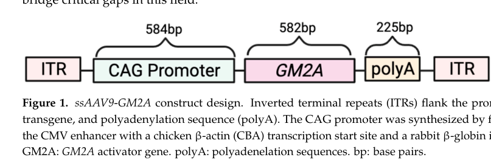

## Question

# Disease Characteristics Research Template

## Target Disease
- **Disease Name:** Tay-Sachs Disease AB Variant
- **MONDO ID:**  (if available)
- **Category:** Mendelian

## Research Objectives

Please provide a comprehensive research report on **Tay-Sachs Disease AB Variant** covering all of the
disease characteristics listed below. This report will be used to populate a disease knowledge
base entry. Be thorough and cite primary literature (PMID preferred) for all claims.

For each section, **suggested databases/resources** are listed. These are the first places
you should search for information on each topic.

---

### 1. Disease Information
> **Search first:** OMIM, Orphanet, ICD-10/ICD-11, MeSH, PubMed

- What is the disease? Provide a concise overview.
- What are the key identifiers? (OMIM, Orphanet, ICD-10/ICD-11, MeSH, Mondo)
- What are the common synonyms and alternative names?
- Is the information derived from individual patients (e.g., EHR) or aggregated disease-level resources?

### 2. Etiology

- **Disease Causal Factors**: What are the primary causes? (genetic, environmental, infectious, mechanistic)
- **Risk Factors**:
  > **Search first:** PubMed, Cochrane Library, UpToDate, clinical guidelines, ClinVar, ClinGen, GWAS Catalog, PheGenI, CTD, CDC, WHO, epidemiological databases
  - Genetic risk factors (causal variants, susceptibility loci, modifier genes)
  - Environmental risk factors (toxins, lifestyle, occupational exposures, age, sex, family history)
- **Protective Factors**:
  > **Search first:** PubMed, Cochrane Library, clinical trial databases, GWAS Catalog, gnomAD, WHO, CDC, nutrition databases
  - Genetic protective factors (protective variants, modifier alleles)
  - Environmental protective factors (diet, lifestyle, exposures that reduce risk)
- **Gene-Environment Interactions**: How do genetic and environmental factors interact to influence disease?
  > **Search first:** CTD, PubMed, PheGenI, GxE databases

### 3. Phenotypes
> **Search first:** HPO (Human Phenotype Ontology), OMIM, Orphanet, PubMed, clinicaltrials.gov, MedDRA, SNOMED CT, DECIPHER, LOINC

For each phenotype, provide:
- **Phenotype type**: symptoms, clinical signs, physical manifestations, behavioral changes, or laboratory abnormalities
  > For symptoms/signs: HPO, OMIM, Orphanet, PubMed
  > For behavioral changes: HPO, DSM, RDoC (Research Domain Criteria), PubMed
  > For laboratory abnormalities: LOINC, SNOMED CT, LabTests Online, PubMed
- **Phenotype characteristics**:
  > **Search first:** OMIM, Orphanet, HPO, PubMed
  - Age of symptom onset (neonatal, childhood, adult-onset, late-onset)
  - Symptom severity (mild, moderate, severe, variable)
  - Symptom progression (stable, progressive, episodic, fluctuating)
  - Frequency among affected individuals (percentage or qualitative)
- **Quality of life impact**: Effects on daily functioning and well-being (per-phenotype when possible)
  > **Search first:** EQ-5D database, SF-36, WHO QOL databases, PubMed
- Suggest HPO (Human Phenotype Ontology) terms for each phenotype

### 4. Genetic/Molecular Information

- **Causal Genes**: Gene mutations or chromosomal abnormalities responsible for disease (gene symbols, OMIM IDs)
  > **Search first:** OMIM, ClinVar, HGMD, Ensembl, NCBI Gene
- **Pathogenic Variants**:
  - Affected genes (gene symbols, HGNC IDs)
    > **Search first:** OMIM, NCBI Gene, Ensembl, HGNC, UniProt, GeneCards
  - Variant classification (pathogenic, likely pathogenic, VUS per ACMG/AMP guidelines)
    > **Search first:** ClinVar, ClinGen, ACMG/AMP guidelines, VarSome
  - Variant type/class (missense, frameshift, nonsense, splice-site, structural)
  - Allele frequency in population databases
    > **Search first:** gnomAD, 1000 Genomes, ExAC, TOPMed, dbSNP
  - Somatic vs germline origin
    > **Search first:** COSMIC (somatic), ClinVar, ICGC, TCGA
  - Functional consequences (loss of function, gain of function, dominant negative)
- **Modifier Genes**: Genes that modify disease severity or expression
- **Epigenetic Information**: DNA methylation, histone modifications, chromatin changes affecting disease
  > **Search first:** ENCODE, Roadmap Epigenomics, MethBase, DiseaseMeth
- **Chromosomal Abnormalities**: Large-scale genetic changes (aneuploidy, translocations, inversions)
  > **Search first:** DECIPHER, ClinVar, ECARUCA, UCSC Genome Browser

### 5. Environmental Information

- **Environmental Factors**: Non-genetic contributing factors (toxins, radiation, pollution, occupational exposure)
  > **Search first:** CTD (Comparative Toxicogenomics Database), TOXNET, PubMed, EPA databases
- **Lifestyle Factors**: Behavioral factors (smoking, diet, exercise, alcohol consumption)
  > **Search first:** CDC databases, WHO, PubMed, NHANES
- **Infectious Agents**: If applicable, pathogens causing or triggering disease (bacteria, viruses, fungi, parasites)
  > **Search first:** NCBI Taxonomy, ViPR, BV-BRC, MicrobeDB, GIDEON

### 6. Mechanism / Pathophysiology

- **Molecular Pathways**: Specific signaling cascades or biochemical pathways involved (Wnt, MAPK, mTOR, PI3K-AKT, etc.)
  > **Search first:** KEGG, Reactome, WikiPathways, PathBank, BioCyc
- **Cellular Processes**: Cell-level mechanisms (apoptosis, autophagy, cell cycle dysregulation, inflammation, etc.)
  > **Search first:** Gene Ontology (GO), Reactome, KEGG, PubMed
- **Protein Dysfunction**: How protein structure or function is altered (misfolding, aggregation, loss of function, gain of function)
  > **Search first:** UniProt, PDB (Protein Data Bank), InterPro, Pfam, AlphaFold
- **Metabolic Changes**: Alterations in metabolic processes (energy metabolism, lipid metabolism, amino acid metabolism)
  > **Search first:** KEGG, BioCyc, HMDB (Human Metabolome Database), BRENDA
- **Immune System Involvement**: Role of immune response (autoimmunity, immunodeficiency, chronic inflammation)
  > **Search first:** ImmPort, Immunome Database, IEDB, Gene Ontology
- **Tissue Damage Mechanisms**: How tissues/ are injured (oxidative stress, ischemia, fibrosis, necrosis)
  > **Search first:** PubMed, Gene Ontology, Reactome
- **Biochemical Abnormalities**: Specific molecular defects (enzyme deficiencies, receptor dysfunction, ion channel defects)
  > **Search first:** BRENDA, UniProt, KEGG, OMIM, PubMed
- **Epigenetic Changes**: DNA methylation, histone modifications affecting gene expression in disease
  > **Search first:** ENCODE, Roadmap Epigenomics, MethBase, DiseaseMeth
- **Molecular Profiling** (if available):
  - Transcriptomics/gene expression changes
    > **Search first:** GEO (Gene Expression Omnibus), ArrayExpress, GTEx, Human Cell Atlas, SRA
  - Proteomics findings
    > **Search first:** PRIDE, ProteomeXchange, Human Protein Atlas, STRING, BioGRID
  - Metabolomics signatures
    > **Search first:** MetaboLights, Metabolomics Workbench, HMDB, METLIN
  - Lipidomics alterations
    > **Search first:** LIPID MAPS, SwissLipids, LipidHome, Metabolomics Workbench
  - Genomic structural features
    > **Search first:** UCSC Genome Browser, Ensembl, NCBI, dbVar, DGV
- **Advanced Technologies** (if applicable):
  - Single-cell analysis findings (cell-type specific mechanisms, cellular heterogeneity)
    > **Search first:** Human Cell Atlas, Single Cell Portal, GEO, CELLxGENE
  - Spatial transcriptomics findings
    > **Search first:** GEO, Spatial Research, Vizgen, 10x Genomics data
  - Multi-omics integration results
    > **Search first:** TCGA, ICGC, cBioPortal, LinkedOmics, PubMed
  - Functional genomics screens (CRISPR, RNAi)
    > **Search first:** DepMap, GenomeRNAi, PubMed, BioGRID ORCS

For each mechanism, describe:
- The causal chain from initial trigger to clinical manifestation
- Which mechanisms are upstream vs downstream
- What cell types and biological processes are involved
- Suggest GO terms for biological processes and CL terms for cell types

### 7. Anatomical Structures Affected

- **Organ Level**:
  - Primary organs directly affected
  - Secondary organ involvement (complications, secondary effects)
  - Body systems involved (cardiovascular, nervous, digestive, respiratory, endocrine, etc.)
  > **Search first:** Uberon, FMA (Foundational Model of Anatomy), OMIM, HPO, ICD-11, MeSH, SNOMED CT
- **Tissue and Cell Level**:
  - Specific tissue types affected (epithelial, connective, muscle, nervous)
  - Specific cell populations targeted (with Cell Ontology terms)
  > **Search first:** Uberon, Human Protein Atlas, Cell Ontology, Human Cell Atlas, CellMarker, PanglaoDB
- **Subcellular Level**:
  - Cellular compartments involved (mitochondria, nucleus, ER, lysosomes) (with GO Cellular Component terms)
  > **Search first:** Gene Ontology (Cellular Component), UniProt, Human Protein Atlas
- **Localization**:
  - Specific anatomical sites (with UBERON terms)
    > **Search first:** FMA, Uberon, NeuroNames (for brain), SNOMED CT
  - Lateralization (unilateral, bilateral, asymmetric)
    > **Search first:** HPO, clinical literature, imaging databases

### 8. Temporal Development

- **Onset**:
  - Typical age of onset (congenital, pediatric, adult, geriatric)
  - Onset pattern (acute, subacute, chronic, insidious)
  > **Search first:** OMIM, Orphanet, HPO, PubMed
- **Progression**:
  - Disease stages (early, intermediate, advanced, end-stage)
    > **Search first:** Cancer Staging Manual (AJCC), WHO classifications, PubMed
  - Progression rate (rapid, slow, variable)
  - Disease course pattern (episodic, relapsing-remitting, progressive, stable)
  - Disease duration (self-limited, chronic lifelong)
  > **Search first:** Disease registries, longitudinal cohort databases, natural history studies, PubMed, Orphanet, OMIM
- **Patterns**:
  - Remission patterns (spontaneous, treatment-induced)
    > **Search first:** Clinical trial databases, disease registries, PubMed
  - Critical periods (time windows of vulnerability or opportunity for intervention)
    > **Search first:** PubMed, developmental biology databases, clinical guidelines

### 9. Inheritance and Population

- **Epidemiology**:
  - Prevalence (cases per 100,000 at given time)
  - Incidence (new cases per 100,000 per year)
  > **Search first:** Orphanet, CDC, WHO, GBD (Global Burden of Disease), national registries, SEER, disease registries
- **For Genetic Etiology**:
  - Inheritance pattern (AD, AR, X-linked, mitochondrial, multifactorial, polygenic)
    > **Search first:** OMIM, Orphanet, ClinVar, GTR (Genetic Testing Registry)
  - Penetrance (complete, incomplete, age-dependent)
    > **Search first:** ClinVar, OMIM, PubMed, ClinGen
  - Expressivity (variable, consistent)
    > **Search first:** OMIM, ClinVar, PubMed
  - Genetic anticipation (increasing severity in successive generations)
    > **Search first:** OMIM, PubMed (especially for repeat expansion disorders)
  - Germline mosaicism
    > **Search first:** ClinVar, OMIM, genetic counseling literature, PubMed
  - Founder effects (population-specific mutations)
    > **Search first:** gnomAD, population genetics databases, PubMed
  - Consanguinity role
    > **Search first:** OMIM, population studies, genetic counseling resources
  - Carrier frequency
    > **Search first:** gnomAD, carrier screening databases, GeneReviews, GTR
- **Population Demographics**:
  - Affected populations (ethnic or demographic groups with higher prevalence)
    > **Search first:** gnomAD, 1000 Genomes, PAGE Study, PubMed, population registries
  - Geographic distribution (endemic areas, regional variation)
    > **Search first:** WHO, CDC, GBD, Orphanet, geographic epidemiology databases
  - Geographic distribution of specific variants
  - Sex ratio (male:female)
    > **Search first:** Disease registries, OMIM, PubMed, epidemiological databases
  - Age distribution of affected individuals
    > **Search first:** CDC, disease registries, SEER, Orphanet

### 10. Diagnostics

- **Clinical Tests**:
  - Laboratory tests (blood, urine, tissue chemistry, specific enzyme assays)
    > **Search first:** LOINC, LabTests Online, PubMed
  - Biomarkers (proteins, metabolites, genetic markers, circulating biomarkers)
    > **Search first:** FDA Biomarker List, BEST (Biomarkers, EndpointS, and other Tools), PubMed
  - Imaging studies (X-ray, CT, MRI, PET, ultrasound)
    > **Search first:** RadLex, DICOM, Radiopaedia, imaging databases
  - Functional tests (pulmonary function, cardiac stress tests)
    > **Search first:** LOINC, clinical guidelines, PubMed
  - Electrophysiology (EEG, EMG, ECG, nerve conduction studies)
    > **Search first:** LOINC, clinical neurophysiology databases, PubMed
  - Biopsy findings (histopathology, immunohistochemistry)
    > **Search first:** SNOMED CT, College of American Pathologists resources, PubMed
  - Pathology findings (microscopic examination)
    > **Search first:** SNOMED CT, Digital Pathology databases, PubMed
- **Genetic Testing**:
  > **Search first:** GTR (Genetic Testing Registry), GeneReviews, ClinGen
  - Overview of recommended genetic testing approach
  - Whole genome sequencing (WGS) utility
    > **Search first:** GTR, ClinVar, GEL (Genomics England), gnomAD
  - Whole exome sequencing (WES) utility
    > **Search first:** GTR, ClinVar, OMIM, GeneMatcher
  - Gene panels (which panels, which genes)
    > **Search first:** GTR, ClinVar, laboratory-specific databases
  - Single gene testing
    > **Search first:** GTR, ClinVar, OMIM, GeneReviews
  - Chromosomal microarray (CMA)
    > **Search first:** DECIPHER, ClinVar, dbVar, ECARUCA
  - Karyotyping
    > **Search first:** Chromosome Abnormality Database, ClinVar, cytogenetics resources
  - FISH
    > **Search first:** ClinVar, cytogenetics databases, PubMed
  - Mitochondrial DNA testing
    > **Search first:** MITOMAP, MSeqDR, ClinVar, GTR
  - Repeat expansion testing
    > **Search first:** GTR, ClinVar, repeat expansion databases, PubMed
- **Omics-Based Diagnostics** (if applicable):
  - RNA sequencing / transcriptomics
    > **Search first:** GEO, ArrayExpress, GTEx, RNA-seq databases
  - Proteomics
    > **Search first:** PRIDE, ProteomeXchange, FDA Biomarker database
  - Metabolomics
    > **Search first:** MetaboLights, Metabolomics Workbench, HMDB
  - Epigenomics
    > **Search first:** GEO, ENCODE, Roadmap Epigenomics, MethBase
  - Liquid biopsy
    > **Search first:** COSMIC, ClinVar, liquid biopsy databases, PubMed
- **Clinical Criteria**:
  - Standardized diagnostic criteria (DSM, ICD, society guidelines)
    > **Search first:** DSM-5, ICD-11, clinical society guidelines, UpToDate
  - Differential diagnosis (other conditions to rule out, with distinguishing features)
    > **Search first:** DynaMed, UpToDate, clinical decision support systems
- **Screening**:
  - Screening methods for asymptomatic individuals (newborn screening, carrier screening, cascade screening)
    > **Search first:** ACMG recommendations, CDC newborn screening, GTR

### 11. Outcome/Prognosis

- **Survival and Mortality**:
  - Survival rate (5-year, 10-year, overall)
    > **Search first:** SEER, cancer registries, disease-specific registries, PubMed
  - Life expectancy (with and without treatment if applicable)
    > **Search first:** Orphanet, disease registries, actuarial databases, PubMed
  - Mortality rate
    > **Search first:** CDC, WHO, GBD, national mortality databases
  - Disease-specific mortality (deaths directly attributable to disease)
    > **Search first:** Disease registries, CDC Wonder, GBD, PubMed
- **Morbidity and Function**:
  - Morbidity (disease-related disability and health impacts)
    > **Search first:** GBD, WHO, disability databases, PubMed
  - Disability outcomes (long-term functional impairments)
    > **Search first:** ICF (International Classification of Functioning), disability registries
  - Quality of life measures (EQ-5D, SF-36, PROMIS, disease-specific tools)
    > **Search first:** EQ-5D database, SF-36, PROMIS, PubMed
- **Disease Course**:
  - Complications (secondary problems: infections, organ failure, etc.)
    > **Search first:** ICD codes, disease registries, clinical databases, PubMed
  - Recovery potential (likelihood and extent of recovery, with vs without treatment)
    > **Search first:** Natural history studies, rehabilitation databases, PubMed
- **Prediction**:
  - Prognostic factors (age, disease severity, biomarkers, treatment response)
    > **Search first:** Prognostic models databases, clinical calculators, PubMed
  - Prognostic biomarkers (molecular markers predicting disease course)
    > **Search first:** FDA Biomarker database, PubMed, cancer prognostic databases

### 12. Treatment

- **Pharmacotherapy**:
  - Pharmacological treatments (drug names, drug classes, mechanisms of action)
    > **Search first:** DrugBank, RxNorm, ATC classification, DailyMed, FDA databases
  - Pharmacogenomics (how genetic variants affect drug metabolism, efficacy, toxicity)
    > **Search first:** PharmGKB, CPIC (Clinical Pharmacogenetics), FDA Table of PGx Biomarkers
- **Advanced Therapeutics**:
  - Gene therapy (viral vectors, CRISPR, gene replacement, gene editing)
    > **Search first:** ClinicalTrials.gov, FDA gene therapy database, ASGCT resources
  - Cell therapy (stem cell transplant, CAR-T, cellular therapeutics)
    > **Search first:** ClinicalTrials.gov, FDA cell therapy database, FACT standards
  - RNA-based therapies (ASOs, siRNA, mRNA therapies)
    > **Search first:** ClinicalTrials.gov, FDA approvals, PubMed
  - Targeted therapies (treatments directed at specific molecular targets)
    > **Search first:** My Cancer Genome, OncoKB, ClinicalTrials.gov, FDA approvals
  - Immunotherapies (checkpoint inhibitors, monoclonal antibodies)
    > **Search first:** Cancer Immunotherapy Database, FDA approvals, ClinicalTrials.gov
- **Surgical and Interventional**:
  - Surgical interventions (types of surgery, timing, outcomes)
    > **Search first:** CPT codes, surgical registries, clinical guidelines, PubMed
- **Supportive and Rehabilitative**:
  - Supportive care (symptom management, pain control, nutrition)
    > **Search first:** Clinical guidelines, Cochrane Library, PubMed
  - Rehabilitation (physical therapy, occupational therapy, speech therapy)
    > **Search first:** Rehabilitation medicine databases, clinical guidelines, PubMed
- **Experimental**:
  - Experimental treatments in clinical trials (with NCT identifiers if available)
    > **Search first:** ClinicalTrials.gov, EU Clinical Trials Register, WHO ICTRP
- **Treatment Outcomes**:
  - Treatment response rates
    > **Search first:** Clinical trial databases, FDA reviews, systematic reviews, PubMed
  - Side effects and adverse events
    > **Search first:** FDA Adverse Event Reporting System (FAERS), MedWatch, PubMed
- **Treatment Strategy**:
  - Treatment algorithms (clinical pathways, decision trees)
    > **Search first:** Clinical practice guidelines, NCCN Guidelines, UpToDate
  - Combination therapies
    > **Search first:** ClinicalTrials.gov, treatment guidelines, PubMed
  - Personalized medicine approaches (genotype-guided treatment)
    > **Search first:** My Cancer Genome, CIViC, PharmGKB, precision medicine databases

For each treatment, suggest MAXO (Medical Action Ontology) terms where applicable.

### 13. Prevention

- **Prevention Levels**:
  - Primary prevention (preventing disease occurrence: vaccination, risk factor modification)
    > **Search first:** CDC, WHO, USPSTF recommendations, Cochrane Library
  - Secondary prevention (early detection and treatment: screening programs, early intervention)
    > **Search first:** USPSTF, CDC screening guidelines, WHO
  - Tertiary prevention (preventing complications in those with disease)
    > **Search first:** Clinical guidelines, disease management protocols, PubMed
- **Immunization**: Vaccine strategies (if applicable)
  > **Search first:** CDC vaccine schedules, WHO immunization, FDA vaccine database
- **Screening and Early Detection**:
  - Screening programs (population-based: newborn screening, cancer screening)
    > **Search first:** CDC screening programs, USPSTF, cancer screening databases
  - Genetic screening (carrier screening, preimplantation genetic diagnosis, prenatal testing)
    > **Search first:** ACMG recommendations, ACOG guidelines, GTR
  - Risk stratification (identifying high-risk individuals for targeted prevention)
    > **Search first:** Risk prediction models, clinical calculators, PubMed
- **Behavioral Interventions**: Lifestyle modifications to reduce risk
  > **Search first:** CDC, WHO, behavioral intervention databases, Cochrane Library
- **Counseling**: Genetic counseling (risk assessment, family planning guidance)
  > **Search first:** NSGC resources, ACMG guidelines, GeneReviews
- **Public Health**:
  - Public health interventions (sanitation, vector control, health education)
    > **Search first:** CDC, WHO, public health databases, PubMed
  - Environmental interventions (reducing environmental risk factors)
    > **Search first:** EPA databases, WHO environmental health, PubMed
- **Prophylaxis**: Preventive medications or procedures
  > **Search first:** Clinical guidelines, FDA approvals, PubMed

### 14. Other Species / Natural Disease

- **Taxonomy**: Species affected (with NCBI Taxon identifiers)
  > **Search first:** NCBI Taxonomy
- **Breed**: Specific breeds affected (with VBO identifiers if applicable)
  > **Search first:** VBO (Vertebrate Breed Ontology)
- **Gene**: Orthologous genes in other species (with NCBI Gene IDs)
  > **Search first:** NCBI Gene
- **Natural Disease**:
  - Naturally occurring disease in other species (companion animals, wildlife)
    > **Search first:** OMIA (Online Mendelian Inheritance in Animals), VetCompass, PubMed
  - Veterinary relevance and importance in animal health
    > **Search first:** OMIA, veterinary databases, PubMed
- **Comparative Biology**:
  - Comparative pathology (similarities and differences across species)
    > **Search first:** OMIA, comparative pathology databases, PubMed
  - Evolutionary conservation of disease mechanisms
    > **Search first:** HomoloGene, OrthoMCL, Alliance of Genome Resources
- **Transmission** (if applicable):
  - Zoonotic potential
    > **Search first:** CDC zoonotic diseases, WHO zoonoses, GIDEON
  - Cross-species susceptibility
    > **Search first:** NCBI Taxonomy, veterinary databases, PubMed

### 15. Model Organisms

- **Model Types**:
  - Model organism type (mammalian, invertebrate, cellular, in vitro)
    > **Search first:** Alliance of Genome Resources, model organism databases
  - Specific model systems (mouse, rat, zebrafish, Drosophila, C. elegans, yeast, cell lines, organoids, iPSCs)
    > **Search first:** MGI, RGD, ZFIN, FlyBase, WormBase, SGD, ATCC, Cellosaurus
  - Induced models (drug treatment, surgical intervention, environmental manipulation)
    > **Search first:** MGI, model organism databases, PubMed
- **Genetic Models**:
  - Types available (knockout, knock-in, transgenic, conditional, humanized)
    > **Search first:** MGI, IMPC, KOMP, EuMMCR, IMSR
- **Model Characteristics**:
  - Phenotype recapitulation (how well model reproduces human disease features)
    > **Search first:** Model organism databases, comparative studies, PubMed
  - Model limitations (aspects of human disease not captured)
    > **Search first:** Model organism databases, PubMed, review articles
- **Applications**:
  - Research applications (what aspects of disease can be studied)
    > **Search first:** Model organism databases, PubMed
- **Resources**:
  - Model databases
    > **Search first:** MGI, RGD, ZFIN, FlyBase, WormBase, IMSR, EMMA, MMRRC

---

## Citation Requirements

- Cite primary literature (PMID preferred) for all mechanistic and clinical claims
- Prioritize recent reviews and landmark papers
- Include direct quotes from abstracts where possible to support key statements
- Distinguish evidence source types: human clinical, model organism, in vitro, computational

## Output Format

Structure your response as a comprehensive narrative organized by the sections above.
For each section, provide:
- Factual content with specific details (numbers, percentages, gene names, variant nomenclature)
- Ontology term suggestions (HPO, GO, CL, UBERON, CHEBI, MAXO, MONDO) where applicable
- Evidence citations with PMIDs
- Direct quotes from abstracts to support key claims
- Clear indication when information is not available or not applicable for this disease

This report will be used to populate a disease knowledge base entry with:
- Pathophysiology descriptions with causal chains
- Gene/protein annotations (HGNC, GO terms)
- Phenotype associations (HP terms) with frequencies
- Cell type involvement (CL terms)
- Anatomical locations (UBERON terms)
- Chemical entities (CHEBI terms)
- Treatment annotations (MAXO terms)
- Evidence items with PMIDs and exact abstract quotes
- Epidemiology, prognosis, diagnostic, and prevention information
- Animal model descriptions with phenotype recapitulation details

## Output

Question: You are an expert researcher providing comprehensive, well-cited information.

Provide detailed information focusing on:
1. Key concepts and definitions with current understanding
2. Recent developments and latest research (prioritize 2023-2024 sources)
3. Current applications and real-world implementations
4. Expert opinions and analysis from authoritative sources
5. Relevant statistics and data from recent studies

Format as a comprehensive research report with proper citations. Include URLs and publication dates where available.
Always prioritize recent, authoritative sources and provide specific citations for all major claims.

# Disease Characteristics Research Template

## Target Disease
- **Disease Name:** Tay-Sachs Disease AB Variant
- **MONDO ID:**  (if available)
- **Category:** Mendelian

## Research Objectives

Please provide a comprehensive research report on **Tay-Sachs Disease AB Variant** covering all of the
disease characteristics listed below. This report will be used to populate a disease knowledge
base entry. Be thorough and cite primary literature (PMID preferred) for all claims.

For each section, **suggested databases/resources** are listed. These are the first places
you should search for information on each topic.

---

### 1. Disease Information
> **Search first:** OMIM, Orphanet, ICD-10/ICD-11, MeSH, PubMed

- What is the disease? Provide a concise overview.
- What are the key identifiers? (OMIM, Orphanet, ICD-10/ICD-11, MeSH, Mondo)
- What are the common synonyms and alternative names?
- Is the information derived from individual patients (e.g., EHR) or aggregated disease-level resources?

### 2. Etiology

- **Disease Causal Factors**: What are the primary causes? (genetic, environmental, infectious, mechanistic)
- **Risk Factors**:
  > **Search first:** PubMed, Cochrane Library, UpToDate, clinical guidelines, ClinVar, ClinGen, GWAS Catalog, PheGenI, CTD, CDC, WHO, epidemiological databases
  - Genetic risk factors (causal variants, susceptibility loci, modifier genes)
  - Environmental risk factors (toxins, lifestyle, occupational exposures, age, sex, family history)
- **Protective Factors**:
  > **Search first:** PubMed, Cochrane Library, clinical trial databases, GWAS Catalog, gnomAD, WHO, CDC, nutrition databases
  - Genetic protective factors (protective variants, modifier alleles)
  - Environmental protective factors (diet, lifestyle, exposures that reduce risk)
- **Gene-Environment Interactions**: How do genetic and environmental factors interact to influence disease?
  > **Search first:** CTD, PubMed, PheGenI, GxE databases

### 3. Phenotypes
> **Search first:** HPO (Human Phenotype Ontology), OMIM, Orphanet, PubMed, clinicaltrials.gov, MedDRA, SNOMED CT, DECIPHER, LOINC

For each phenotype, provide:
- **Phenotype type**: symptoms, clinical signs, physical manifestations, behavioral changes, or laboratory abnormalities
  > For symptoms/signs: HPO, OMIM, Orphanet, PubMed
  > For behavioral changes: HPO, DSM, RDoC (Research Domain Criteria), PubMed
  > For laboratory abnormalities: LOINC, SNOMED CT, LabTests Online, PubMed
- **Phenotype characteristics**:
  > **Search first:** OMIM, Orphanet, HPO, PubMed
  - Age of symptom onset (neonatal, childhood, adult-onset, late-onset)
  - Symptom severity (mild, moderate, severe, variable)
  - Symptom progression (stable, progressive, episodic, fluctuating)
  - Frequency among affected individuals (percentage or qualitative)
- **Quality of life impact**: Effects on daily functioning and well-being (per-phenotype when possible)
  > **Search first:** EQ-5D database, SF-36, WHO QOL databases, PubMed
- Suggest HPO (Human Phenotype Ontology) terms for each phenotype

### 4. Genetic/Molecular Information

- **Causal Genes**: Gene mutations or chromosomal abnormalities responsible for disease (gene symbols, OMIM IDs)
  > **Search first:** OMIM, ClinVar, HGMD, Ensembl, NCBI Gene
- **Pathogenic Variants**:
  - Affected genes (gene symbols, HGNC IDs)
    > **Search first:** OMIM, NCBI Gene, Ensembl, HGNC, UniProt, GeneCards
  - Variant classification (pathogenic, likely pathogenic, VUS per ACMG/AMP guidelines)
    > **Search first:** ClinVar, ClinGen, ACMG/AMP guidelines, VarSome
  - Variant type/class (missense, frameshift, nonsense, splice-site, structural)
  - Allele frequency in population databases
    > **Search first:** gnomAD, 1000 Genomes, ExAC, TOPMed, dbSNP
  - Somatic vs germline origin
    > **Search first:** COSMIC (somatic), ClinVar, ICGC, TCGA
  - Functional consequences (loss of function, gain of function, dominant negative)
- **Modifier Genes**: Genes that modify disease severity or expression
- **Epigenetic Information**: DNA methylation, histone modifications, chromatin changes affecting disease
  > **Search first:** ENCODE, Roadmap Epigenomics, MethBase, DiseaseMeth
- **Chromosomal Abnormalities**: Large-scale genetic changes (aneuploidy, translocations, inversions)
  > **Search first:** DECIPHER, ClinVar, ECARUCA, UCSC Genome Browser

### 5. Environmental Information

- **Environmental Factors**: Non-genetic contributing factors (toxins, radiation, pollution, occupational exposure)
  > **Search first:** CTD (Comparative Toxicogenomics Database), TOXNET, PubMed, EPA databases
- **Lifestyle Factors**: Behavioral factors (smoking, diet, exercise, alcohol consumption)
  > **Search first:** CDC databases, WHO, PubMed, NHANES
- **Infectious Agents**: If applicable, pathogens causing or triggering disease (bacteria, viruses, fungi, parasites)
  > **Search first:** NCBI Taxonomy, ViPR, BV-BRC, MicrobeDB, GIDEON

### 6. Mechanism / Pathophysiology

- **Molecular Pathways**: Specific signaling cascades or biochemical pathways involved (Wnt, MAPK, mTOR, PI3K-AKT, etc.)
  > **Search first:** KEGG, Reactome, WikiPathways, PathBank, BioCyc
- **Cellular Processes**: Cell-level mechanisms (apoptosis, autophagy, cell cycle dysregulation, inflammation, etc.)
  > **Search first:** Gene Ontology (GO), Reactome, KEGG, PubMed
- **Protein Dysfunction**: How protein structure or function is altered (misfolding, aggregation, loss of function, gain of function)
  > **Search first:** UniProt, PDB (Protein Data Bank), InterPro, Pfam, AlphaFold
- **Metabolic Changes**: Alterations in metabolic processes (energy metabolism, lipid metabolism, amino acid metabolism)
  > **Search first:** KEGG, BioCyc, HMDB (Human Metabolome Database), BRENDA
- **Immune System Involvement**: Role of immune response (autoimmunity, immunodeficiency, chronic inflammation)
  > **Search first:** ImmPort, Immunome Database, IEDB, Gene Ontology
- **Tissue Damage Mechanisms**: How tissues/ are injured (oxidative stress, ischemia, fibrosis, necrosis)
  > **Search first:** PubMed, Gene Ontology, Reactome
- **Biochemical Abnormalities**: Specific molecular defects (enzyme deficiencies, receptor dysfunction, ion channel defects)
  > **Search first:** BRENDA, UniProt, KEGG, OMIM, PubMed
- **Epigenetic Changes**: DNA methylation, histone modifications affecting gene expression in disease
  > **Search first:** ENCODE, Roadmap Epigenomics, MethBase, DiseaseMeth
- **Molecular Profiling** (if available):
  - Transcriptomics/gene expression changes
    > **Search first:** GEO (Gene Expression Omnibus), ArrayExpress, GTEx, Human Cell Atlas, SRA
  - Proteomics findings
    > **Search first:** PRIDE, ProteomeXchange, Human Protein Atlas, STRING, BioGRID
  - Metabolomics signatures
    > **Search first:** MetaboLights, Metabolomics Workbench, HMDB, METLIN
  - Lipidomics alterations
    > **Search first:** LIPID MAPS, SwissLipids, LipidHome, Metabolomics Workbench
  - Genomic structural features
    > **Search first:** UCSC Genome Browser, Ensembl, NCBI, dbVar, DGV
- **Advanced Technologies** (if applicable):
  - Single-cell analysis findings (cell-type specific mechanisms, cellular heterogeneity)
    > **Search first:** Human Cell Atlas, Single Cell Portal, GEO, CELLxGENE
  - Spatial transcriptomics findings
    > **Search first:** GEO, Spatial Research, Vizgen, 10x Genomics data
  - Multi-omics integration results
    > **Search first:** TCGA, ICGC, cBioPortal, LinkedOmics, PubMed
  - Functional genomics screens (CRISPR, RNAi)
    > **Search first:** DepMap, GenomeRNAi, PubMed, BioGRID ORCS

For each mechanism, describe:
- The causal chain from initial trigger to clinical manifestation
- Which mechanisms are upstream vs downstream
- What cell types and biological processes are involved
- Suggest GO terms for biological processes and CL terms for cell types

### 7. Anatomical Structures Affected

- **Organ Level**:
  - Primary organs directly affected
  - Secondary organ involvement (complications, secondary effects)
  - Body systems involved (cardiovascular, nervous, digestive, respiratory, endocrine, etc.)
  > **Search first:** Uberon, FMA (Foundational Model of Anatomy), OMIM, HPO, ICD-11, MeSH, SNOMED CT
- **Tissue and Cell Level**:
  - Specific tissue types affected (epithelial, connective, muscle, nervous)
  - Specific cell populations targeted (with Cell Ontology terms)
  > **Search first:** Uberon, Human Protein Atlas, Cell Ontology, Human Cell Atlas, CellMarker, PanglaoDB
- **Subcellular Level**:
  - Cellular compartments involved (mitochondria, nucleus, ER, lysosomes) (with GO Cellular Component terms)
  > **Search first:** Gene Ontology (Cellular Component), UniProt, Human Protein Atlas
- **Localization**:
  - Specific anatomical sites (with UBERON terms)
    > **Search first:** FMA, Uberon, NeuroNames (for brain), SNOMED CT
  - Lateralization (unilateral, bilateral, asymmetric)
    > **Search first:** HPO, clinical literature, imaging databases

### 8. Temporal Development

- **Onset**:
  - Typical age of onset (congenital, pediatric, adult, geriatric)
  - Onset pattern (acute, subacute, chronic, insidious)
  > **Search first:** OMIM, Orphanet, HPO, PubMed
- **Progression**:
  - Disease stages (early, intermediate, advanced, end-stage)
    > **Search first:** Cancer Staging Manual (AJCC), WHO classifications, PubMed
  - Progression rate (rapid, slow, variable)
  - Disease course pattern (episodic, relapsing-remitting, progressive, stable)
  - Disease duration (self-limited, chronic lifelong)
  > **Search first:** Disease registries, longitudinal cohort databases, natural history studies, PubMed, Orphanet, OMIM
- **Patterns**:
  - Remission patterns (spontaneous, treatment-induced)
    > **Search first:** Clinical trial databases, disease registries, PubMed
  - Critical periods (time windows of vulnerability or opportunity for intervention)
    > **Search first:** PubMed, developmental biology databases, clinical guidelines

### 9. Inheritance and Population

- **Epidemiology**:
  - Prevalence (cases per 100,000 at given time)
  - Incidence (new cases per 100,000 per year)
  > **Search first:** Orphanet, CDC, WHO, GBD (Global Burden of Disease), national registries, SEER, disease registries
- **For Genetic Etiology**:
  - Inheritance pattern (AD, AR, X-linked, mitochondrial, multifactorial, polygenic)
    > **Search first:** OMIM, Orphanet, ClinVar, GTR (Genetic Testing Registry)
  - Penetrance (complete, incomplete, age-dependent)
    > **Search first:** ClinVar, OMIM, PubMed, ClinGen
  - Expressivity (variable, consistent)
    > **Search first:** OMIM, ClinVar, PubMed
  - Genetic anticipation (increasing severity in successive generations)
    > **Search first:** OMIM, PubMed (especially for repeat expansion disorders)
  - Germline mosaicism
    > **Search first:** ClinVar, OMIM, genetic counseling literature, PubMed
  - Founder effects (population-specific mutations)
    > **Search first:** gnomAD, population genetics databases, PubMed
  - Consanguinity role
    > **Search first:** OMIM, population studies, genetic counseling resources
  - Carrier frequency
    > **Search first:** gnomAD, carrier screening databases, GeneReviews, GTR
- **Population Demographics**:
  - Affected populations (ethnic or demographic groups with higher prevalence)
    > **Search first:** gnomAD, 1000 Genomes, PAGE Study, PubMed, population registries
  - Geographic distribution (endemic areas, regional variation)
    > **Search first:** WHO, CDC, GBD, Orphanet, geographic epidemiology databases
  - Geographic distribution of specific variants
  - Sex ratio (male:female)
    > **Search first:** Disease registries, OMIM, PubMed, epidemiological databases
  - Age distribution of affected individuals
    > **Search first:** CDC, disease registries, SEER, Orphanet

### 10. Diagnostics

- **Clinical Tests**:
  - Laboratory tests (blood, urine, tissue chemistry, specific enzyme assays)
    > **Search first:** LOINC, LabTests Online, PubMed
  - Biomarkers (proteins, metabolites, genetic markers, circulating biomarkers)
    > **Search first:** FDA Biomarker List, BEST (Biomarkers, EndpointS, and other Tools), PubMed
  - Imaging studies (X-ray, CT, MRI, PET, ultrasound)
    > **Search first:** RadLex, DICOM, Radiopaedia, imaging databases
  - Functional tests (pulmonary function, cardiac stress tests)
    > **Search first:** LOINC, clinical guidelines, PubMed
  - Electrophysiology (EEG, EMG, ECG, nerve conduction studies)
    > **Search first:** LOINC, clinical neurophysiology databases, PubMed
  - Biopsy findings (histopathology, immunohistochemistry)
    > **Search first:** SNOMED CT, College of American Pathologists resources, PubMed
  - Pathology findings (microscopic examination)
    > **Search first:** SNOMED CT, Digital Pathology databases, PubMed
- **Genetic Testing**:
  > **Search first:** GTR (Genetic Testing Registry), GeneReviews, ClinGen
  - Overview of recommended genetic testing approach
  - Whole genome sequencing (WGS) utility
    > **Search first:** GTR, ClinVar, GEL (Genomics England), gnomAD
  - Whole exome sequencing (WES) utility
    > **Search first:** GTR, ClinVar, OMIM, GeneMatcher
  - Gene panels (which panels, which genes)
    > **Search first:** GTR, ClinVar, laboratory-specific databases
  - Single gene testing
    > **Search first:** GTR, ClinVar, OMIM, GeneReviews
  - Chromosomal microarray (CMA)
    > **Search first:** DECIPHER, ClinVar, dbVar, ECARUCA
  - Karyotyping
    > **Search first:** Chromosome Abnormality Database, ClinVar, cytogenetics resources
  - FISH
    > **Search first:** ClinVar, cytogenetics databases, PubMed
  - Mitochondrial DNA testing
    > **Search first:** MITOMAP, MSeqDR, ClinVar, GTR
  - Repeat expansion testing
    > **Search first:** GTR, ClinVar, repeat expansion databases, PubMed
- **Omics-Based Diagnostics** (if applicable):
  - RNA sequencing / transcriptomics
    > **Search first:** GEO, ArrayExpress, GTEx, RNA-seq databases
  - Proteomics
    > **Search first:** PRIDE, ProteomeXchange, FDA Biomarker database
  - Metabolomics
    > **Search first:** MetaboLights, Metabolomics Workbench, HMDB
  - Epigenomics
    > **Search first:** GEO, ENCODE, Roadmap Epigenomics, MethBase
  - Liquid biopsy
    > **Search first:** COSMIC, ClinVar, liquid biopsy databases, PubMed
- **Clinical Criteria**:
  - Standardized diagnostic criteria (DSM, ICD, society guidelines)
    > **Search first:** DSM-5, ICD-11, clinical society guidelines, UpToDate
  - Differential diagnosis (other conditions to rule out, with distinguishing features)
    > **Search first:** DynaMed, UpToDate, clinical decision support systems
- **Screening**:
  - Screening methods for asymptomatic individuals (newborn screening, carrier screening, cascade screening)
    > **Search first:** ACMG recommendations, CDC newborn screening, GTR

### 11. Outcome/Prognosis

- **Survival and Mortality**:
  - Survival rate (5-year, 10-year, overall)
    > **Search first:** SEER, cancer registries, disease-specific registries, PubMed
  - Life expectancy (with and without treatment if applicable)
    > **Search first:** Orphanet, disease registries, actuarial databases, PubMed
  - Mortality rate
    > **Search first:** CDC, WHO, GBD, national mortality databases
  - Disease-specific mortality (deaths directly attributable to disease)
    > **Search first:** Disease registries, CDC Wonder, GBD, PubMed
- **Morbidity and Function**:
  - Morbidity (disease-related disability and health impacts)
    > **Search first:** GBD, WHO, disability databases, PubMed
  - Disability outcomes (long-term functional impairments)
    > **Search first:** ICF (International Classification of Functioning), disability registries
  - Quality of life measures (EQ-5D, SF-36, PROMIS, disease-specific tools)
    > **Search first:** EQ-5D database, SF-36, PROMIS, PubMed
- **Disease Course**:
  - Complications (secondary problems: infections, organ failure, etc.)
    > **Search first:** ICD codes, disease registries, clinical databases, PubMed
  - Recovery potential (likelihood and extent of recovery, with vs without treatment)
    > **Search first:** Natural history studies, rehabilitation databases, PubMed
- **Prediction**:
  - Prognostic factors (age, disease severity, biomarkers, treatment response)
    > **Search first:** Prognostic models databases, clinical calculators, PubMed
  - Prognostic biomarkers (molecular markers predicting disease course)
    > **Search first:** FDA Biomarker database, PubMed, cancer prognostic databases

### 12. Treatment

- **Pharmacotherapy**:
  - Pharmacological treatments (drug names, drug classes, mechanisms of action)
    > **Search first:** DrugBank, RxNorm, ATC classification, DailyMed, FDA databases
  - Pharmacogenomics (how genetic variants affect drug metabolism, efficacy, toxicity)
    > **Search first:** PharmGKB, CPIC (Clinical Pharmacogenetics), FDA Table of PGx Biomarkers
- **Advanced Therapeutics**:
  - Gene therapy (viral vectors, CRISPR, gene replacement, gene editing)
    > **Search first:** ClinicalTrials.gov, FDA gene therapy database, ASGCT resources
  - Cell therapy (stem cell transplant, CAR-T, cellular therapeutics)
    > **Search first:** ClinicalTrials.gov, FDA cell therapy database, FACT standards
  - RNA-based therapies (ASOs, siRNA, mRNA therapies)
    > **Search first:** ClinicalTrials.gov, FDA approvals, PubMed
  - Targeted therapies (treatments directed at specific molecular targets)
    > **Search first:** My Cancer Genome, OncoKB, ClinicalTrials.gov, FDA approvals
  - Immunotherapies (checkpoint inhibitors, monoclonal antibodies)
    > **Search first:** Cancer Immunotherapy Database, FDA approvals, ClinicalTrials.gov
- **Surgical and Interventional**:
  - Surgical interventions (types of surgery, timing, outcomes)
    > **Search first:** CPT codes, surgical registries, clinical guidelines, PubMed
- **Supportive and Rehabilitative**:
  - Supportive care (symptom management, pain control, nutrition)
    > **Search first:** Clinical guidelines, Cochrane Library, PubMed
  - Rehabilitation (physical therapy, occupational therapy, speech therapy)
    > **Search first:** Rehabilitation medicine databases, clinical guidelines, PubMed
- **Experimental**:
  - Experimental treatments in clinical trials (with NCT identifiers if available)
    > **Search first:** ClinicalTrials.gov, EU Clinical Trials Register, WHO ICTRP
- **Treatment Outcomes**:
  - Treatment response rates
    > **Search first:** Clinical trial databases, FDA reviews, systematic reviews, PubMed
  - Side effects and adverse events
    > **Search first:** FDA Adverse Event Reporting System (FAERS), MedWatch, PubMed
- **Treatment Strategy**:
  - Treatment algorithms (clinical pathways, decision trees)
    > **Search first:** Clinical practice guidelines, NCCN Guidelines, UpToDate
  - Combination therapies
    > **Search first:** ClinicalTrials.gov, treatment guidelines, PubMed
  - Personalized medicine approaches (genotype-guided treatment)
    > **Search first:** My Cancer Genome, CIViC, PharmGKB, precision medicine databases

For each treatment, suggest MAXO (Medical Action Ontology) terms where applicable.

### 13. Prevention

- **Prevention Levels**:
  - Primary prevention (preventing disease occurrence: vaccination, risk factor modification)
    > **Search first:** CDC, WHO, USPSTF recommendations, Cochrane Library
  - Secondary prevention (early detection and treatment: screening programs, early intervention)
    > **Search first:** USPSTF, CDC screening guidelines, WHO
  - Tertiary prevention (preventing complications in those with disease)
    > **Search first:** Clinical guidelines, disease management protocols, PubMed
- **Immunization**: Vaccine strategies (if applicable)
  > **Search first:** CDC vaccine schedules, WHO immunization, FDA vaccine database
- **Screening and Early Detection**:
  - Screening programs (population-based: newborn screening, cancer screening)
    > **Search first:** CDC screening programs, USPSTF, cancer screening databases
  - Genetic screening (carrier screening, preimplantation genetic diagnosis, prenatal testing)
    > **Search first:** ACMG recommendations, ACOG guidelines, GTR
  - Risk stratification (identifying high-risk individuals for targeted prevention)
    > **Search first:** Risk prediction models, clinical calculators, PubMed
- **Behavioral Interventions**: Lifestyle modifications to reduce risk
  > **Search first:** CDC, WHO, behavioral intervention databases, Cochrane Library
- **Counseling**: Genetic counseling (risk assessment, family planning guidance)
  > **Search first:** NSGC resources, ACMG guidelines, GeneReviews
- **Public Health**:
  - Public health interventions (sanitation, vector control, health education)
    > **Search first:** CDC, WHO, public health databases, PubMed
  - Environmental interventions (reducing environmental risk factors)
    > **Search first:** EPA databases, WHO environmental health, PubMed
- **Prophylaxis**: Preventive medications or procedures
  > **Search first:** Clinical guidelines, FDA approvals, PubMed

### 14. Other Species / Natural Disease

- **Taxonomy**: Species affected (with NCBI Taxon identifiers)
  > **Search first:** NCBI Taxonomy
- **Breed**: Specific breeds affected (with VBO identifiers if applicable)
  > **Search first:** VBO (Vertebrate Breed Ontology)
- **Gene**: Orthologous genes in other species (with NCBI Gene IDs)
  > **Search first:** NCBI Gene
- **Natural Disease**:
  - Naturally occurring disease in other species (companion animals, wildlife)
    > **Search first:** OMIA (Online Mendelian Inheritance in Animals), VetCompass, PubMed
  - Veterinary relevance and importance in animal health
    > **Search first:** OMIA, veterinary databases, PubMed
- **Comparative Biology**:
  - Comparative pathology (similarities and differences across species)
    > **Search first:** OMIA, comparative pathology databases, PubMed
  - Evolutionary conservation of disease mechanisms
    > **Search first:** HomoloGene, OrthoMCL, Alliance of Genome Resources
- **Transmission** (if applicable):
  - Zoonotic potential
    > **Search first:** CDC zoonotic diseases, WHO zoonoses, GIDEON
  - Cross-species susceptibility
    > **Search first:** NCBI Taxonomy, veterinary databases, PubMed

### 15. Model Organisms

- **Model Types**:
  - Model organism type (mammalian, invertebrate, cellular, in vitro)
    > **Search first:** Alliance of Genome Resources, model organism databases
  - Specific model systems (mouse, rat, zebrafish, Drosophila, C. elegans, yeast, cell lines, organoids, iPSCs)
    > **Search first:** MGI, RGD, ZFIN, FlyBase, WormBase, SGD, ATCC, Cellosaurus
  - Induced models (drug treatment, surgical intervention, environmental manipulation)
    > **Search first:** MGI, model organism databases, PubMed
- **Genetic Models**:
  - Types available (knockout, knock-in, transgenic, conditional, humanized)
    > **Search first:** MGI, IMPC, KOMP, EuMMCR, IMSR
- **Model Characteristics**:
  - Phenotype recapitulation (how well model reproduces human disease features)
    > **Search first:** Model organism databases, comparative studies, PubMed
  - Model limitations (aspects of human disease not captured)
    > **Search first:** Model organism databases, PubMed, review articles
- **Applications**:
  - Research applications (what aspects of disease can be studied)
    > **Search first:** Model organism databases, PubMed
- **Resources**:
  - Model databases
    > **Search first:** MGI, RGD, ZFIN, FlyBase, WormBase, IMSR, EMMA, MMRRC

---

## Citation Requirements

- Cite primary literature (PMID preferred) for all mechanistic and clinical claims
- Prioritize recent reviews and landmark papers
- Include direct quotes from abstracts where possible to support key statements
- Distinguish evidence source types: human clinical, model organism, in vitro, computational

## Output Format

Structure your response as a comprehensive narrative organized by the sections above.
For each section, provide:
- Factual content with specific details (numbers, percentages, gene names, variant nomenclature)
- Ontology term suggestions (HPO, GO, CL, UBERON, CHEBI, MAXO, MONDO) where applicable
- Evidence citations with PMIDs
- Direct quotes from abstracts to support key claims
- Clear indication when information is not available or not applicable for this disease

This report will be used to populate a disease knowledge base entry with:
- Pathophysiology descriptions with causal chains
- Gene/protein annotations (HGNC, GO terms)
- Phenotype associations (HP terms) with frequencies
- Cell type involvement (CL terms)
- Anatomical locations (UBERON terms)
- Chemical entities (CHEBI terms)
- Treatment annotations (MAXO terms)
- Evidence items with PMIDs and exact abstract quotes
- Epidemiology, prognosis, diagnostic, and prevention information
- Animal model descriptions with phenotype recapitulation details

# Tay–Sachs Disease, AB Variant (GM2 Activator Deficiency): Comprehensive Disease Characteristics Report

## Executive summary
Tay–Sachs disease AB variant (also called **GM2 gangliosidosis AB variant**) is an ultra-rare, autosomal-recessive lysosomal storage disorder caused by **biallelic pathogenic variants in GM2A**, which encodes the **GM2 activator protein (GM2AP)**. GM2AP is required for β-hexosaminidase A (HexA) to hydrolyze GM2 ganglioside; thus, AB-variant patients can have a Tay–Sachs-like phenotype **despite normal HexA/HexB enzyme activities** on routine assays. Recent (2023) preclinical work demonstrates proof-of-concept **AAV9-GM2A gene replacement** and establishes a more severe, translationally relevant **Gm2a−/−Neu3−/−** mouse model by removing a mouse-specific compensatory GM2 catabolic pathway. (ganne2022gm2gangliosidosisab pages 1-5, sheth2016gm2gangliosidosisab pages 1-3, hall2017gm2activatordeficiency pages 1-3, deschenes2023characterizationofa pages 8-10, vyas2023efficacyofadenoassociated pages 1-2)

## Key resource field summary (for knowledge base curation)
| Knowledge-base field | Summary |
|---|---|
| Disease definition / synonyms / identifiers | Ultra-rare autosomal-recessive GM2 gangliosidosis caused by deficiency of the GM2 activator protein (GM2AP), clinically often indistinguishable from Tay-Sachs disease. Common names: **Tay-Sachs disease AB variant**, **GM2 gangliosidosis AB variant**, **GM2 activator deficiency**, **GM2 activator protein deficiency**. OMIM disease entry reported as **272750**; GM2A gene OMIM **\*613109**; MONDO **Tay-Sachs disease AB variant = MONDO_0010099**; broader **GM2 gangliosidosis = MONDO_0017720**. Fewer than 30 cases were reported in the literature by 2022; older reviews counted 9-10 molecularly confirmed cases worldwide (sheth2016gm2gangliosidosisab pages 1-3, ganne2022gm2gangliosidosisab pages 1-5, hall2017gm2activatordeficiency pages 1-3, OpenTargets Search: GM2 gangliosidosis,Tay-Sachs disease-GM2A,HEXA,HEXB). |
| Causal gene and inheritance | Caused by **biallelic GM2A variants** (gene encodes ganglioside GM2 activator, a non-enzymatic lysosomal cofactor required to present GM2 to Hex A for hydrolysis). Inheritance is **autosomal recessive**. Mechanistically distinct from classic Tay-Sachs (HEXA) and Sandhoff (HEXB) despite overlapping phenotype (ganne2022gm2gangliosidosisab pages 1-5, sheth2016gm2gangliosidosisab pages 3-4, sheth2016gm2gangliosidosisab pages 1-3, gualdronfrias2019taysachsdisease pages 3-4). |
| Hallmark diagnostic pattern | Key clue: **GM2 gangliosidosis phenotype with normal Hex A and Hex B enzyme activity** in leukocytes/blood. Recommended workup includes **GM2A sequencing**, with **copy-number analysis** because exon-level deletions can be missed by routine sequencing; supportive/confirmatory tools include plasma **GM2 LC-MS/MS**, fibroblast GM2 studies, EM/IF, and RNA/cDNA analyses in unresolved cases (hall2017gm2activatordeficiency pages 1-3, ganne2022gm2gangliosidosisab pages 5-8, ganne2022gm2gangliosidosisab pages 8-14, sheth2016gm2gangliosidosisab pages 3-4). |
| Main phenotypes by onset: infantile | Usually onset in the **first year** (often ~3-12 months). Features include **developmental delay/regression, hypotonia, hyperacusis/exaggerated startle, seizures, poor visual attention/nystagmus, bilateral cherry-red maculae**, and progressive neurodegeneration. MRI may show **putaminal hyperintensity, thalamic hypointensity, delayed/unmyelinated white matter**. Reported outcome: severe disability and **early death around 4-5 years**, sometimes earlier from respiratory complications (ganne2022gm2gangliosidosisab pages 1-5, sheth2016gm2gangliosidosisab pages 3-4, sheth2016gm2gangliosidosisab pages 1-3, deschenes2023characterizationofa pages 1-2, noites2025gm2gangliosidosisab pages 2-3). |
| Main phenotypes by onset: juvenile | Reported onset roughly **2-10 years** with **ataxia, psychomotor deterioration/regression, spasticity, seizures** and progressive neurologic decline; historically death before adulthood in described juvenile GM2 gangliosidosis summaries. AB-variant-specific juvenile cases are rare and sparsely characterized (ganne2022gm2gangliosidosisab pages 1-5). |
| Main phenotypes by onset: late / adult | First late-onset AB-variant case reported in 2022. Phenotype may include **gait disorder beginning around age 10, lower motor neuron involvement, spinocerebellar ataxia, muscular atrophy, mild cognitive/executive deficits, psychiatric features**, and subtle cerebellar vermis atrophy with normal Hex A/B activity. Prognosis appears better than infantile disease but data are very limited (ganne2022gm2gangliosidosisab pages 5-8, ganne2022gm2gangliosidosisab pages 1-5). |
| Representative pathogenic variants reported | Reported variants include **c.472G>T (p.Glu158Ter / p.E158X)**, **homozygous exon 2 deletion**, **c.79A>T (p.Lys27Ter)**, **c.415C>T (p.Pro139Ser; evaluated as likely hypomorphic / VUS in trans with truncating allele)**, and earlier literature variants such as **c.160G>T (p.Glu54Ter)**, **c.164C>T (p.Pro55Leu)**, **c.412T>C**, **c.506G>C (p.Arg169Pro)**, **c.522T>G (p.Leu174Arg)** plus frameshift/deletion alleles. Population data are sparse; some variants were absent from gnomAD/ExAC/TOPMed and one missense allele had a single prior Latin American report (sheth2016gm2gangliosidosisab pages 3-4, hall2017gm2activatordeficiency pages 1-3, ganne2022gm2gangliosidosisab pages 5-8, sheth2016gm2gangliosidosisab pages 1-3, ganne2022gm2gangliosidosisab pages 14-17). |
| Epidemiology / population notes | **Rarest** GM2 gangliosidosis subtype. Literature-based counts: **9 cases / 7 mutations** in older review, **10 molecularly proven cases** by 2016 review table, and **<30 cases** by 2022 review. Reported ancestries/populations include **Indian, Saudi, Spanish, US Black, Laotian/Hmong**, and later **Portuguese**; consanguinity is reported in some infantile cases but no robust carrier-frequency estimate exists for AB variant (sheth2016gm2gangliosidosisab pages 1-3, ganne2022gm2gangliosidosisab pages 1-5, gowda2022clinicalandlaboratory pages 1-2, noites2025gm2gangliosidosisab pages 1-2). |
| 2023-2024 translational development: AAV9-GM2A preclinical | **2023 AB-variant-specific gene therapy proof-of-concept**: systemic **ssAAV9-GM2A** in **Gm2a-/-** mice at **1 × 10^14 vg/kg** (reported also as **1 × 10^11 vg/mouse**) given at **postnatal day 1 or 6 weeks** produced long-term vector persistence in brain/liver, reduced CNS GM2 accumulation, and improved rotarod performance especially in 6-week-treated animals; long-term biochemical correction was partial, suggesting need for higher dose/optimization. Separate **2023 intrathecal scAAV9.hGM2A** study showed dose-responsive biochemical correction with **0.5, 1.0, 2.0 × 10^11 vg/mouse**, broad CNS distribution, persistence up to **104 weeks**, and no severe adverse events (deschenes2023biochemicalcorrectionof pages 1-2, deschenes2023biochemicalcorrectionof pages 2-4, vyas2023efficacyofadenoassociated pages 7-9, deschenes2023biochemicalcorrectionof pages 14-15, vyas2023efficacyofadenoassociated pages 11-13, vyas2023efficacyofadenoassociated pages 1-2, vyas2023efficacyofadenoassociated pages 2-4, vyas2023efficacyofadenoassociated pages 9-10, vyas2023efficacyofadenoassociated media 2eb6c65b). |
| 2023-2024 translational development: severe double-KO model | **2023 Gm2a-/-Neu3-/- double knockout** mouse established as a more severe and translationally relevant AB-variant model. Rationale: single **Gm2a-/-** mice are mild because murine **NEU3** provides an alternative GM2 catabolic route. Double KO causes **marked CNS GM2 accumulation (~3-4-fold vs Gm2a-/-), ataxia, reduced mobility/coordination, weight loss, vacuolization, onset of deficits by ~12-16 weeks, and shortened lifespan (~27 weeks vs ~92 weeks for Gm2a-/-)**, better approximating severe human disease for preclinical testing (deschenes2023characterizationofa pages 8-10, vyas2023efficacyofadenoassociated pages 9-10, deschenes2023characterizationofa pages 1-2, deschenes2023characterizationofa pages 2-3, deschenes2023characterizationofa pages 3-4). |
| Relevant clinical trials for GM2 gangliosidoses: TSHA-101 | **NCT04798235**; **TSHA-101** bicistronic **AAV9-HEXA/HEXB** gene therapy; **intrathecal**, one-time; target **infantile-onset GM2 gangliosidosis**; **ACTIVE_NOT_RECRUITING**; start date **2021-03-12**; phase **1/2**; planned enrollment **3**. Primary focus: safety/tolerability; secondary outcomes include survival, Hex A activity, motor/neurologic measures (NCT04798235 chunk 1). |
| Relevant clinical trials for GM2 gangliosidoses: AXO-AAV-GM2 interventional | **NCT04669535**; **AXO-AAV-GM2** dual-vector gene therapy for Tay-Sachs/Sandhoff; delivery described as **bilateral intraparenchymal thalamic plus intracisternal/intrathecal**; pediatric target population; **TERMINATED** in trial search output; start year **2021**; phase **1**; enrollment reported as **9** in trial search output (review chapter listed 18 planned). No posted efficacy results in the retrieved context (NCT04669535 chunk 2). |
| Relevant clinical trials for GM2 gangliosidoses: AXO-AAV-GM2 long-term follow-up | **NCT06614569**; long-term follow-up of previously treated AXO-AAV-GM2 subjects; parent intervention route **bilateral intraparenchymal thalamic and intracisternal/intrathecal**; **ACTIVE_NOT_RECRUITING**; actual start **2024-09-17**; estimated enrollment **7**; main purpose is delayed safety plus longitudinal neurocognitive/motor follow-up for up to 5 years (NCT06614569 chunk 1). |
| Relevant clinical trials for GM2 gangliosidoses: natural history | **NCT00668187**; **A Natural History Study of the Gangliosidoses**; observational, no intervention; includes Tay-Sachs/Sandhoff/GM1; **RECRUITING**; start **2010-12**; estimated enrollment **52**. Important for defining progression and outcome measures for future AB-variant and broader GM2 trials (NCT00668187 chunk 1). |

*Table: This table compiles the core knowledge-base fields for Tay-Sachs disease AB variant (GM2A deficiency), including disease definition, genetics, phenotype, diagnostics, and 2023-2024 translational advances. It also summarizes relevant GM2 gangliosidosis clinical trials to support curation and therapeutic landscape review.*

---

## 1. Disease information
### 1.1 What is the disease?
**GM2 gangliosidosis AB variant** is a GM2 gangliosidosis caused by deficiency of the non-enzymatic cofactor **GM2 activator protein**. Clinically, it is often described as **indistinguishable from Tay–Sachs disease**, because GM2 accumulates in neurons in both conditions, leading to progressive neurodegeneration. (ganne2022gm2gangliosidosisab pages 1-5, sheth2016gm2gangliosidosisab pages 1-3)

**Current understanding:** AB variant is best conceptualized as a *third genetic cause* of the Tay–Sachs/Sandhoff clinical spectrum: HEXA (Tay–Sachs), HEXB (Sandhoff), and **GM2A (AB variant)**. (ganne2022gm2gangliosidosisab pages 1-5, sheth2016gm2gangliosidosisab pages 1-3)

### 1.2 Key identifiers
* **OMIM (disease):** 272750 (reported in a case-report review of AB variant). (sheth2016gm2gangliosidosisab pages 1-3)
* **OMIM (gene GM2A):** *613109 (reported in a 2022 AB-variant review). (ganne2022gm2gangliosidosisab pages 1-5)
* **MONDO:**
  * Tay–Sachs disease AB variant: **MONDO_0010099** (OpenTargets disease label). (OpenTargets Search: GM2 gangliosidosis,Tay-Sachs disease-GM2A,HEXA,HEXB)
  * GM2 gangliosidosis (broader parent concept): **MONDO_0017720**. (OpenTargets Search: GM2 gangliosidosis,Tay-Sachs disease-GM2A,HEXA,HEXB)

**Not found in retrieved sources for AB variant:** Orphanet ID, ICD-10/ICD-11 codes, and MeSH unique ID were not explicitly provided in the retrieved full-text evidence. (sheth2016gm2gangliosidosisab pages 1-3, ganne2022gm2gangliosidosisab pages 1-5)

### 1.3 Synonyms / alternative names
* GM2 gangliosidosis AB variant (preferred in many papers) (ganne2022gm2gangliosidosisab pages 1-5, sheth2016gm2gangliosidosisab pages 1-3)
* GM2 activator deficiency / GM2 activator protein deficiency (hall2017gm2activatordeficiency pages 1-3)
* GM2AB / ABGM2 (in some recent literature) (deschenes2023characterizationofa pages 1-2, vyas2023efficacyofadenoassociated pages 1-2)

### 1.4 Evidence provenance (individual vs aggregated)
Most AB-variant knowledge is derived from **individual case reports** and small case series/reviews (reflecting extreme rarity), plus **animal-model** and **in vitro** studies for mechanistic and therapeutic development. (sheth2016gm2gangliosidosisab pages 1-3, ganne2022gm2gangliosidosisab pages 1-5, deschenes2023characterizationofa pages 8-10, vyas2023efficacyofadenoassociated pages 7-9)

---

## 2. Etiology
### 2.1 Disease causal factors
**Primary cause:** biallelic loss-of-function (or severely hypomorphic) variants in **GM2A** leading to **GM2AP deficiency** and failure of GM2 hydrolysis in lysosomes. (sheth2016gm2gangliosidosisab pages 1-3, sheth2016gm2gangliosidosisab pages 3-4, hall2017gm2activatordeficiency pages 1-3)

### 2.2 Risk factors
#### Genetic risk factors
* **Autosomal-recessive inheritance:** affected individuals typically have **biallelic GM2A variants**, with parents being heterozygous carriers in reported families. (sheth2016gm2gangliosidosisab pages 3-4, sheth2016gm2gangliosidosisab pages 1-3)
* **Consanguinity:** reported in some cases and cohorts (e.g., an Indian AB-variant case born to consanguineous parents; and a southern India gangliosidosis cohort with high consanguinity overall). (sheth2016gm2gangliosidosisab pages 1-3, gowda2022clinicalandlaboratory pages 1-2)

#### Environmental risk factors
No environmental or lifestyle risk factors were identified in the retrieved evidence; AB variant is a monogenic lysosomal disorder. (sheth2016gm2gangliosidosisab pages 1-3)

### 2.3 Protective factors
No protective genetic/environmental factors were identified in the retrieved evidence. In mice, an **alternate GM2 catabolic pathway mediated by NEU3** partially compensates for GM2A deficiency (a species-specific modifier), but this is not established as a human protective factor. (deschenes2023characterizationofa pages 1-2, vyas2023efficacyofadenoassociated pages 9-10)

### 2.4 Gene–environment interactions
Not reported in the retrieved evidence. (sheth2016gm2gangliosidosisab pages 1-3)

---

## 3. Phenotypes
### 3.1 Core phenotype spectrum (human)
AB variant is frequently described as phenotypically similar to Tay–Sachs disease, with severe neurodegeneration in infantile forms and more heterogeneous manifestations in later-onset disease. (ganne2022gm2gangliosidosisab pages 1-5, sheth2016gm2gangliosidosisab pages 1-3)

#### Infantile-onset AB variant (symptoms/signs)
Commonly reported phenotypes include:
* **Global developmental delay/regression** (HPO suggestion: HP:0001263 Global developmental delay; HP:0002376 Developmental regression) (sheth2016gm2gangliosidosisab pages 1-3)
* **Hypotonia** (HP:0001252) (sheth2016gm2gangliosidosisab pages 1-3)
* **Hyperacusis / exaggerated startle** (HP:0000347 Hyperacusis; HP:0002343 Startle response) (sheth2016gm2gangliosidosisab pages 1-3, noites2025gm2gangliosidosisab pages 2-3)
* **Seizures** (HP:0001250) (ganne2022gm2gangliosidosisab pages 1-5, noites2025gm2gangliosidosisab pages 2-3)
* **Nystagmus / visual impairment** (HP:0000639 Nystagmus; HP:0000505 Visual impairment) (sheth2016gm2gangliosidosisab pages 1-3)
* **Cherry-red spot of the macula** (HP:0001103) (sheth2016gm2gangliosidosisab pages 1-3)

**Neuroimaging features (infantile):** basal ganglia and thalamic signal abnormalities and delayed myelination have been reported (e.g., putaminal hyperintensity, thalamic hypointensity, unmyelinated white matter). (sheth2016gm2gangliosidosisab pages 1-3)

**Temporal course:** infantile AB variant typically presents in the first year and progresses to severe disability and early death (premature death around 4–5 years is cited in review summaries; individual infantile cases may die earlier due to complications). (ganne2022gm2gangliosidosisab pages 1-5, noites2025gm2gangliosidosisab pages 2-3)

#### Juvenile-onset AB variant
Summary descriptions (limited AB-variant-specific case detail in retrieved evidence):
* **Onset:** ~2–10 years (ganne2022gm2gangliosidosisab pages 1-5)
* **Phenotypes:** ataxia, psychomotor deterioration, spasticity, seizures (HPO suggestions: HP:0001251 Ataxia; HP:0001257 Spasticity) (ganne2022gm2gangliosidosisab pages 1-5)
* **Outcome:** progression and death before adulthood is described in GM2 gangliosidosis subtype summaries (AB-variant-specific longitudinal datasets remain sparse). (ganne2022gm2gangliosidosisab pages 1-5)

#### Late-onset/adult AB variant
A 2022 report described a first late-onset AB-variant case with:
* **Gait disorder beginning ~age 10** and progressive course (ganne2022gm2gangliosidosisab pages 5-8)
* **Lower motor neuronopathy** and **spinocerebellar ataxia** (HPO: HP:0001272 Cerebellar ataxia; HP:0000739 Abnormality of the corticospinal tract can be considered depending on exam; lower motor neuron involvement is captured by HP:0003433 Lower motor neuron dysfunction) (ganne2022gm2gangliosidosisab pages 5-8, ganne2022gm2gangliosidosisab pages 1-5)
* **Mild cognitive/executive deficits** (HP:0001263 / HP:0002143 Abnormal executive function) (ganne2022gm2gangliosidosisab pages 5-8)
* **Subtle cerebellar vermis atrophy** on MRI (UBERON: cerebellar vermis) (ganne2022gm2gangliosidosisab pages 5-8)

### 3.2 Quality of life impact
Formal QoL instruments were not reported in the retrieved evidence. Functional impairment is implied by progressive neurologic decline and loss of mobility/vision in infantile forms, and by progressive ataxia/LMN dysfunction in later-onset disease. (ganne2022gm2gangliosidosisab pages 1-5, ganne2022gm2gangliosidosisab pages 5-8)

---

## 4. Genetic / molecular information
### 4.1 Causal gene
* **GM2A** (ganglioside GM2 activator). (ganne2022gm2gangliosidosisab pages 1-5)

**Role:** GM2AP is described as a non-enzymatic lipid-binding cofactor that enables HexA to interact with GM2 ganglioside; a review states GM2-AP “**forms a complex with GM2 ganglioside allowing interaction between hexosaminidase A and GM2 ganglioside**.” (ganne2022gm2gangliosidosisab pages 1-5)

### 4.2 Pathogenic variant types and examples
Reported AB-variant disease alleles include:
* **Nonsense**: GM2A **c.472G>T (p.E158X)** (infantile case report; predicted truncation and loss of function) (sheth2016gm2gangliosidosisab pages 3-4)
* **Structural/copy-number variant**: **homozygous exon 2 deletion** in GM2A (requires CNV analysis; first whole-exon deletion reported) (hall2017gm2activatordeficiency pages 1-3)
* **Compound heterozygosity**: **c.79A>T (p.Lys27*)** with **c.415C>T (p.Pro139Ser)** in a late-onset case; the missense allele was discussed as potentially hypomorphic and extremely rare in population databases. (ganne2022gm2gangliosidosisab pages 5-8, ganne2022gm2gangliosidosisab pages 14-17)

**Population frequency notes:** for the late-onset case, the p.Pro139Ser allele was reported with no homozygotes in gnomAD/ExAC/TOPMed and only one prior report in a Latin American individual. (ganne2022gm2gangliosidosisab pages 14-17)

### 4.3 Modifier genes / pathways
**NEU3** (neuraminidase 3) acts as a compensatory enzyme in mice, providing an alternative GM2 breakdown route (GM2 → GA2) and attenuating the phenotype of Gm2a−/− mice. This is a key translational consideration and a model-based modifier mechanism. (deschenes2023characterizationofa pages 1-2, vyas2023efficacyofadenoassociated pages 9-10)

### 4.4 Epigenetic information / chromosomal abnormalities
Not reported in retrieved evidence for AB variant. (sheth2016gm2gangliosidosisab pages 1-3)

---

## 5. Environmental information
No non-genetic environmental, lifestyle, or infectious contributors were identified in the retrieved evidence; AB variant is a monogenic lysosomal storage disorder. (sheth2016gm2gangliosidosisab pages 1-3)

---

## 6. Mechanism / pathophysiology
### 6.1 Causal chain (trigger → molecular defect → clinical manifestations)
1. **GM2A pathogenic variants** reduce/abolish functional GM2 activator protein (GM2AP). (sheth2016gm2gangliosidosisab pages 3-4, hall2017gm2activatordeficiency pages 1-3)
2. Without GM2AP, **HexA cannot efficiently hydrolyze GM2 ganglioside** in lysosomes (despite normal HexA/HexB activity on synthetic substrates). (ganne2022gm2gangliosidosisab pages 1-5, sheth2016gm2gangliosidosisab pages 1-3)
3. **GM2 accumulates intralysosomally**, particularly in CNS neurons, driving progressive neurodegeneration and neurologic decline (developmental regression, seizures, ataxia, etc.). (sheth2016gm2gangliosidosisab pages 1-3, ganne2022gm2gangliosidosisab pages 1-5)

### 6.2 Pathways, processes, compartments
* **Biological pathway:** GM2 ganglioside catabolism (lysosomal glycosphingolipid degradation) (ganne2022gm2gangliosidosisab pages 1-5, sheth2016gm2gangliosidosisab pages 1-3)
* **Subcellular compartment:** lysosome (GO Cellular Component suggestion: GO:0005764 lysosome) (sheth2016gm2gangliosidosisab pages 1-3)
* **Cell types:** neurons (CL suggestion: CL:0000540 neuron); also glial responses are plausible but not directly evidenced in retrieved AB-variant human data. (sheth2016gm2gangliosidosisab pages 1-3)

**Suggested GO Biological Process terms (mechanism-level):**
* GO:0006687 glycosphingolipid metabolic process
* GO:0046467 membrane lipid metabolic process
* GO:0006508 proteolysis (relevant for degradation of misfolded/truncated proteins described in some AB-variant mutation mechanisms)

### 6.3 Model-organism mechanistic insight (species difference)
A major translational insight is that **mice have stronger NEU3-mediated alternative GM2 catabolism**, which masks severity in Gm2a−/− mice. A 2023 study generated **Gm2a−/−Neu3−/−** mice and showed (relative to Gm2a−/− alone) markedly increased CNS GM2 accumulation, neurodegenerative pathology, and shortened lifespan, supporting the causal role of GM2 storage and providing a more severe preclinical model. (deschenes2023characterizationofa pages 8-10, deschenes2023characterizationofa pages 1-2)

---

## 7. Anatomical structures affected
### 7.1 Organ/system level
* **Central nervous system (primary):** progressive neurodegeneration (UBERON suggestion: UBERON:0000955 brain; UBERON:0001017 central nervous system). (sheth2016gm2gangliosidosisab pages 1-3, ganne2022gm2gangliosidosisab pages 1-5)
* **Eye/retina (common clinical sign):** cherry-red macula (UBERON:0000966 retina; UBERON:0001768 macula). (sheth2016gm2gangliosidosisab pages 1-3)

### 7.2 Tissue/cell level
* **Neural tissue**; neuronal storage pathology (CL:0000540 neuron). (sheth2016gm2gangliosidosisab pages 1-3)

### 7.3 Subcellular level
* **Lysosomal storage** (GO:0005764 lysosome). (sheth2016gm2gangliosidosisab pages 1-3)

---

## 8. Temporal development
### 8.1 Onset
* **Infantile:** first year of life (often 3–12 months in summaries/cases). (deschenes2023characterizationofa pages 1-2, ganne2022gm2gangliosidosisab pages 1-5)
* **Juvenile:** 2–10 years (summary). (ganne2022gm2gangliosidosisab pages 1-5)
* **Late-onset:** heterogenous; AB-variant late-onset case began with gait disorder at ~10 years. (ganne2022gm2gangliosidosisab pages 5-8)

### 8.2 Progression
* Infantile AB variant is typically rapidly progressive with early childhood mortality in summaries. (ganne2022gm2gangliosidosisab pages 1-5, noites2025gm2gangliosidosisab pages 2-3)
* Later-onset disease appears more slowly progressive and heterogeneous, but AB-variant-specific natural history datasets remain extremely limited. (ganne2022gm2gangliosidosisab pages 5-8, ganne2022gm2gangliosidosisab pages 1-5)

---

## 9. Inheritance and population
### 9.1 Inheritance
Autosomal recessive (biallelic GM2A). (ganne2022gm2gangliosidosisab pages 1-5, sheth2016gm2gangliosidosisab pages 3-4)

### 9.2 Epidemiology
Robust population prevalence/incidence estimates for AB variant are not available in the retrieved evidence. Instead, rarity is described by **case counts**, e.g.:
* “Only seven mutations in nine cases have been reported…” in a 2016 review/case report, with their report adding a tenth molecularly confirmed case. (sheth2016gm2gangliosidosisab pages 3-4)
* A 2022 review states AB variant is the rarest GM2 subtype with “less than thirty cases described in the literature.” (ganne2022gm2gangliosidosisab pages 1-5)
* A 2022 Indian clinical series identified **1 AB-variant case among 32 gangliosidosis patients** in that center-based cohort (not population incidence). (gowda2022clinicalandlaboratory pages 1-2)

### 9.3 Populations / founder effects
No clear AB-variant founder mutation pattern was established in the retrieved evidence; reported cases span diverse ancestries (e.g., Indian, Saudi, Spanish, US Black, Laotian/Hmong). (sheth2016gm2gangliosidosisab pages 1-3)

---

## 10. Diagnostics
### 10.1 Clinical and biochemical testing
**Key diagnostic clue:** Tay–Sachs-like phenotype with **normal** leukocyte HexA and total hexosaminidase activity should prompt evaluation for GM2AP deficiency / GM2A variants. (sheth2016gm2gangliosidosisab pages 3-4)

Case-report example enzyme pattern (infantile AB variant): normal Hex-A and total-Hex activities were documented despite a classic clinical presentation. (sheth2016gm2gangliosidosisab pages 3-4)

### 10.2 Genetic testing strategy
**Recommended approach (from case-based evidence):**
1. If GM2 gangliosidosis is clinically suspected, start with HexA/HexB enzymology.
2. If HexA/HexB results are non-diagnostic/normal but phenotype is strong, perform **GM2A sequencing**.
3. If sequencing is negative but suspicion remains, perform **exon-level copy number analysis** because exon deletions can be missed by routine sequencing (e.g., exon 2 deletion). (hall2017gm2activatordeficiency pages 1-3)

**Advanced confirmatory methods (used in a late-onset case):** plasma GM2 quantification by LC–MS/MS with reported sensitivity/specificity 100% at specific cutoffs; fibroblast studies by EM/IF; and GM2A expression studies (RT-qPCR/cDNA sequencing) to help classify variants. (ganne2022gm2gangliosidosisab pages 5-8, ganne2022gm2gangliosidosisab pages 8-14)

### 10.3 Differential diagnosis
* **Tay–Sachs (HEXA):** low HexA activity.
* **Sandhoff (HEXB):** low total hexosaminidase activity and often more systemic involvement.
* **AB variant (GM2A):** normal HexA/HexB activity on routine assays with GM2 gangliosidosis phenotype. (sheth2016gm2gangliosidosisab pages 3-4, hall2017gm2activatordeficiency pages 1-3)

### 10.4 Screening (carrier/newborn)
The retrieved evidence supports that **molecular diagnosis** (gene-based) is essential for AB-variant detection and family counseling because enzyme testing may not be informative for GM2A deficiency. (hall2017gm2activatordeficiency pages 1-3, sheth2016gm2gangliosidosisab pages 3-4)

---

## 11. Outcome / prognosis
* **Infantile:** severe, progressive neurodegeneration; reviews describe death in early childhood (~4–5 years) (ganne2022gm2gangliosidosisab pages 1-5)
* **Juvenile:** progressive decline with death before adulthood in summary descriptions (ganne2022gm2gangliosidosisab pages 1-5)
* **Late-onset:** better prognosis but heterogeneous; AB-variant-specific data remain extremely limited. (ganne2022gm2gangliosidosisab pages 1-5, ganne2022gm2gangliosidosisab pages 5-8)

---

## 12. Treatment
### 12.1 Standard of care
No disease-modifying standard therapy was identified in the retrieved AB-variant evidence; care is generally supportive and multidisciplinary given progressive neurodegeneration. (ganne2022gm2gangliosidosisab pages 1-5)

**Suggested MAXO terms (supportive care examples):**
* MAXO:0000756 palliative care
* MAXO:0000917 physical therapy
* MAXO:0000918 occupational therapy
* MAXO:0000919 speech therapy
* MAXO:0001020 seizure management (antiseizure pharmacotherapy)

### 12.2 Recent developments (prioritize 2023–2024)
#### 12.2.1 AB-variant–focused gene therapy (preclinical; 2023)
Two 2023 studies provide AB-variant-specific proof-of-concept **GM2A gene replacement**:

* **Systemic IV ssAAV9-GM2A** in Gm2a−/− mice at a single dose reported as **1 × 10^14 vg/kg** (and also described as 1 × 10^11 vg/mouse in study methods), delivered at postnatal day 1 or 6 weeks, led to detectable transgene persistence in brain and liver, reduced GM2 accumulation at 20 weeks, and improved rotarod performance in the 6-week-treated cohort; longer-term biochemical correction at 60 weeks was less robust. (vyas2023efficacyofadenoassociated pages 1-2, vyas2023efficacyofadenoassociated pages 7-9, vyas2023efficacyofadenoassociated pages 9-10)

* **Intrathecal scAAV9.hGM2A** in Gm2a−/− mice prevented GM2 accumulation, with dose-escalation (0.5, 1.0, 2.0 × 10^11 vg/mouse) showing dose-responsive biochemical correction and long-term persistence up to 104 weeks, with no severe adverse events reported. (deschenes2023biochemicalcorrectionof pages 1-2, deschenes2023biochemicalcorrectionof pages 2-4)

**Real-world implementation status:** These are **preclinical mouse** studies; no human AB-variant GM2A gene therapy trial was identified in retrieved clinical trial records. (vyas2023efficacyofadenoassociated pages 1-2, deschenes2023biochemicalcorrectionof pages 1-2)

#### 12.2.2 Related (non–AB-variant-specific) gene therapy clinical trials for GM2 gangliosidoses
Although not AB-variant-specific, the current clinical development pipeline for GM2 gangliosidoses includes:
* **TSHA-101** (AAV9-HEXA/HEXB bicistronic) intrathecal gene therapy trial in infantile-onset GM2 gangliosidosis: **NCT04798235** (Active, not recruiting; start 2021-03-12). (NCT04798235 chunk 1)
* **AXO-AAV-GM2** gene therapy trial for Tay–Sachs or Sandhoff: **NCT04669535** (terminated in retrieved trial metadata; pediatric surgical delivery includes bilateral thalamic and intracisternal/intrathecal routes). (NCT04669535 chunk 2)
* Long-term follow-up of AXO-AAV-GM2-treated subjects: **NCT06614569** (Active, not recruiting; start 2024-09-17). (NCT06614569 chunk 1)

#### 12.2.3 Substrate reduction therapy (SRT) concept (review-level; 2024)
A 2024 review frames AB variant within GM2 disorders and discusses targeting **GM2 synthesis** pathways as an SRT approach, while noting the AB variant is due to GM2AP deficiency (not HexA deficiency). (abidi2024metabolismofglycosphingolipids pages 19-24)

### 12.3 Expert opinion and analysis (from authoritative sources in retrieved evidence)
* **Diagnostic experts emphasize persistence despite normal enzyme tests:** one report states diagnosis “requires a high degree of suspicion and persistence, despite consistently normal or uninformative results,” highlighting a recurring clinical pitfall. (hall2017gm2activatordeficiency pages 1-3)
* **Translational experts emphasize model validity:** multiple 2023 sources argue that the mild Gm2a−/− phenotype is due to NEU3-mediated compensation and recommend double-knockout models (or other strategies) to better match human disease for therapy testing. (vyas2023efficacyofadenoassociated pages 9-10, deschenes2023characterizationofa pages 1-2)

---

## 13. Prevention
Primary prevention is genetic:
* **Carrier testing and reproductive counseling** (autosomal recessive inheritance). (sheth2016gm2gangliosidosisab pages 3-4)
* **Prenatal and preimplantation genetic testing** are conceptually applicable where familial GM2A variants are known; however, specific AB-variant screening guideline statements were not present in retrieved evidence.

**Secondary prevention:** early diagnosis (including molecular diagnosis when enzyme assays are normal) may support earlier supportive interventions and trial enrollment. (hall2017gm2activatordeficiency pages 1-3)

---

## 14. Other species / natural disease
No naturally occurring AB-variant GM2A deficiency in non-human species was identified in the retrieved evidence; the key comparative biology discussion in retrieved sources relates to **species differences in GM2 catabolism (NEU3 compensation in mice)**. (deschenes2023characterizationofa pages 1-2)

---

## 15. Model organisms
### 15.1 Mouse models (highly relevant)
* **Gm2a−/−**: moderate GM2 accumulation and mild neurological defects; normal lifespan; considered more representative of predicted adult-onset human AB variant because of murine compensatory GM2 catabolism. (vyas2023efficacyofadenoassociated pages 2-4, deschenes2023characterizationofa pages 1-2)
* **Gm2a−/−Neu3−/− (double knockout)**: severe CNS GM2 accumulation, ataxia, reduced mobility/coordination, weight loss, and early lethality (~6–7 months); proposed as a “highly relevant model for pre-clinical drug studies” for severe AB variant. (deschenes2023characterizationofa pages 1-2)

### 15.2 Model applications and limitations
* **Applications:** testing gene therapy delivery and biochemical correction; interrogating modifier pathways (NEU3). (vyas2023efficacyofadenoassociated pages 7-9, deschenes2023characterizationofa pages 8-10)
* **Limitations:** single Gm2a−/− mice may underpredict severity of human infantile AB variant due to mouse-specific alternative catabolism; thus, therapeutic efficacy in Gm2a−/− should be interpreted cautiously. (vyas2023efficacyofadenoassociated pages 9-10, deschenes2023characterizationofa pages 1-2)

---

## Visual evidence (figures)
Vyas et al. (2023) provide key preclinical gene-therapy visuals including ssAAV9-GM2A construct, biodistribution, GM2 histology/quantification, and rotarod improvement, supporting translational claims about vector design, tissue distribution, biochemical correction, and functional outcomes. (vyas2023efficacyofadenoassociated media 2eb6c65b, vyas2023efficacyofadenoassociated media 580ab361, vyas2023efficacyofadenoassociated media 8f62a7a9, vyas2023efficacyofadenoassociated media bb08d317)

---

## URLs and publication dates (retrieved sources)
* Sheth et al. **2016-07**. *BMC Pediatrics*. https://doi.org/10.1186/s12887-016-0626-6 (sheth2016gm2gangliosidosisab pages 3-4)
* Hall et al. **2017-05**. *JIMD Reports*. https://doi.org/10.1007/8904_2017_31 (hall2017gm2activatordeficiency pages 1-3)
* Ganne et al. **2022-08**. *Neurological Sciences*. https://doi.org/10.1007/s10072-022-06270-x (ganne2022gm2gangliosidosisab pages 1-5)
* Deschenes et al. **2023-05**. *Int J Mol Sci*. https://doi.org/10.3390/ijms24119217 (deschenes2023biochemicalcorrectionof pages 1-2)
* Vyas et al. **2023-09**. *Int J Mol Sci*. https://doi.org/10.3390/ijms241914611 (vyas2023efficacyofadenoassociated pages 1-2)
* Deschenes et al. **2023-11**. *Front Mol Neurosci*. https://doi.org/10.3389/fnmol.2023.1242814 (deschenes2023characterizationofa pages 1-2)
* ClinicalTrials.gov: **NCT04798235** (start 2021-03-12). https://clinicaltrials.gov/study/NCT04798235 (NCT04798235 chunk 1)
* ClinicalTrials.gov: **NCT04669535** (start 2021). https://clinicaltrials.gov/study/NCT04669535 (NCT04669535 chunk 2)
* ClinicalTrials.gov: **NCT06614569** (start 2024-09-17). https://clinicaltrials.gov/study/NCT06614569 (NCT06614569 chunk 1)
* ClinicalTrials.gov: **NCT00668187** (start 2010-12). https://clinicaltrials.gov/study/NCT00668187 (NCT00668187 chunk 1)

---

## Data gaps and limitations
* AB-variant-specific **incidence/prevalence**, **carrier frequency**, and **founder variants** are not established in the retrieved evidence; rarity is primarily captured via **reported case counts** and center-based cohorts. (ganne2022gm2gangliosidosisab pages 1-5, sheth2016gm2gangliosidosisab pages 1-3, gowda2022clinicalandlaboratory pages 1-2)
* AB-variant-specific **prospective natural history** and **validated clinical endpoints** remain sparse; broader GM2 natural history studies exist but may include few/no AB-variant participants. (NCT00668187 chunk 1)
* Orphanet/ICD/MeSH identifiers for AB variant were not recoverable from the retrieved full-text evidence set.

References

1. (ganne2022gm2gangliosidosisab pages 1-5): Benjamin Ganne, Benjamin Dauriat, Laurence Richard, Foudil Lamari, Karima Ghorab, Laurent Magy, Mehdi Benkirane, Alexandre Perani, Valentine Marquet, Patrick Calvas, Catherine Yardin, and Sylvie Bourthoumieu. Gm2 gangliosidosis ab variant: first case of late onset and review of the literature. Neurological Sciences, 43:6517-6527, Aug 2022. URL: https://doi.org/10.1007/s10072-022-06270-x, doi:10.1007/s10072-022-06270-x. This article has 15 citations and is from a peer-reviewed journal.

2. (sheth2016gm2gangliosidosisab pages 1-3): Jayesh Sheth, Chaitanya Datar, Mehul Mistri, Riddhi Bhavsar, Frenny Sheth, and Krati Shah. Gm2 gangliosidosis ab variant: novel mutation from india – a case report with a review. BMC Pediatrics, Jul 2016. URL: https://doi.org/10.1186/s12887-016-0626-6, doi:10.1186/s12887-016-0626-6. This article has 39 citations and is from a peer-reviewed journal.

3. (hall2017gm2activatordeficiency pages 1-3): Patricia L. Hall, Regina Laine, John J. Alexander, Arunkanth Ankala, Lisa A. Teot, Hart G. W. Lidov, and Irina Anselm. Gm2 activator deficiency caused by a homozygous exon 2 deletion in gm2a. JIMD reports, 38:61-65, May 2017. URL: https://doi.org/10.1007/8904\_2017\_31, doi:10.1007/8904\_2017\_31. This article has 10 citations and is from a peer-reviewed journal.

4. (deschenes2023characterizationofa pages 8-10): Natalie M. Deschenes, Camilyn Cheng, Prem Khanal, Brianna M. Quinville, Alex E. Ryckman, Melissa Mitchell, Alexey V. Pshezhetsky, and Jagdeep S. Walia. Characterization of a phenotypically severe animal model for human ab-variant gm2 gangliosidosis. Frontiers in Molecular Neuroscience, Nov 2023. URL: https://doi.org/10.3389/fnmol.2023.1242814, doi:10.3389/fnmol.2023.1242814. This article has 5 citations.

5. (vyas2023efficacyofadenoassociated pages 1-2): Meera Vyas, Natalie M. Deschenes, Karlaina J. L. Osmon, Zhilin Chen, Imtiaz Ahmad, Shalini Kot, Patrick Thompson, Chris Richmond, Steven J. Gray, and Jagdeep S. Walia. Efficacy of adeno-associated virus serotype 9-mediated gene therapy for ab-variant gm2 gangliosidosis. International Journal of Molecular Sciences, 24:14611, Sep 2023. URL: https://doi.org/10.3390/ijms241914611, doi:10.3390/ijms241914611. This article has 6 citations.

6. (OpenTargets Search: GM2 gangliosidosis,Tay-Sachs disease-GM2A,HEXA,HEXB): Open Targets Query (GM2 gangliosidosis,Tay-Sachs disease-GM2A,HEXA,HEXB, 15 results). Buniello, A. et al. (2025). Open Targets Platform: facilitating therapeutic hypotheses building in drug discovery. Nucleic Acids Research.

7. (sheth2016gm2gangliosidosisab pages 3-4): Jayesh Sheth, Chaitanya Datar, Mehul Mistri, Riddhi Bhavsar, Frenny Sheth, and Krati Shah. Gm2 gangliosidosis ab variant: novel mutation from india – a case report with a review. BMC Pediatrics, Jul 2016. URL: https://doi.org/10.1186/s12887-016-0626-6, doi:10.1186/s12887-016-0626-6. This article has 39 citations and is from a peer-reviewed journal.

8. (gualdronfrias2019taysachsdisease pages 3-4): Carlos Andrés Gualdrón-Frías and Laura Tatiana Calderón-Nossa. Tay-sachs disease. Revista de la Facultad de Medicina, 67:323-329, Jul 2019. URL: https://doi.org/10.15446/revfacmed.v67n3.69742, doi:10.15446/revfacmed.v67n3.69742. This article has 3 citations.

9. (ganne2022gm2gangliosidosisab pages 5-8): Benjamin Ganne, Benjamin Dauriat, Laurence Richard, Foudil Lamari, Karima Ghorab, Laurent Magy, Mehdi Benkirane, Alexandre Perani, Valentine Marquet, Patrick Calvas, Catherine Yardin, and Sylvie Bourthoumieu. Gm2 gangliosidosis ab variant: first case of late onset and review of the literature. Neurological Sciences, 43:6517-6527, Aug 2022. URL: https://doi.org/10.1007/s10072-022-06270-x, doi:10.1007/s10072-022-06270-x. This article has 15 citations and is from a peer-reviewed journal.

10. (ganne2022gm2gangliosidosisab pages 8-14): Benjamin Ganne, Benjamin Dauriat, Laurence Richard, Foudil Lamari, Karima Ghorab, Laurent Magy, Mehdi Benkirane, Alexandre Perani, Valentine Marquet, Patrick Calvas, Catherine Yardin, and Sylvie Bourthoumieu. Gm2 gangliosidosis ab variant: first case of late onset and review of the literature. Neurological Sciences, 43:6517-6527, Aug 2022. URL: https://doi.org/10.1007/s10072-022-06270-x, doi:10.1007/s10072-022-06270-x. This article has 15 citations and is from a peer-reviewed journal.

11. (deschenes2023characterizationofa pages 1-2): Natalie M. Deschenes, Camilyn Cheng, Prem Khanal, Brianna M. Quinville, Alex E. Ryckman, Melissa Mitchell, Alexey V. Pshezhetsky, and Jagdeep S. Walia. Characterization of a phenotypically severe animal model for human ab-variant gm2 gangliosidosis. Frontiers in Molecular Neuroscience, Nov 2023. URL: https://doi.org/10.3389/fnmol.2023.1242814, doi:10.3389/fnmol.2023.1242814. This article has 5 citations.

12. (noites2025gm2gangliosidosisab pages 2-3): Inês Noites, Ana Sofia Coelho, Catarina Magalhães, Sandra Ramos, Francisco Laranjeira, Lúcia Lacerda, Ricardo Taipa, Cristina Garrido, Teresa Temudo, and Sónia Figueiroa. Gm2 gangliosidosis ab variant: a hidden truth. Cureus, Sep 2025. URL: https://doi.org/10.7759/cureus.92445, doi:10.7759/cureus.92445. This article has 0 citations.

13. (ganne2022gm2gangliosidosisab pages 14-17): Benjamin Ganne, Benjamin Dauriat, Laurence Richard, Foudil Lamari, Karima Ghorab, Laurent Magy, Mehdi Benkirane, Alexandre Perani, Valentine Marquet, Patrick Calvas, Catherine Yardin, and Sylvie Bourthoumieu. Gm2 gangliosidosis ab variant: first case of late onset and review of the literature. Neurological Sciences, 43:6517-6527, Aug 2022. URL: https://doi.org/10.1007/s10072-022-06270-x, doi:10.1007/s10072-022-06270-x. This article has 15 citations and is from a peer-reviewed journal.

14. (gowda2022clinicalandlaboratory pages 1-2): Vykuntaraju K. Gowda, Priya Gupta, Narmadham K. Bharathi, Maya Bhat, Sanjay K. Shivappa, and Naveen Benakappa. Clinical and laboratory profile of gangliosidosis from southern part of india. Journal of Pediatric Genetics, 11:034-041, Oct 2022. URL: https://doi.org/10.1055/s-0040-1718726, doi:10.1055/s-0040-1718726. This article has 10 citations and is from a peer-reviewed journal.

15. (noites2025gm2gangliosidosisab pages 1-2): Inês Noites, Ana Sofia Coelho, Catarina Magalhães, Sandra Ramos, Francisco Laranjeira, Lúcia Lacerda, Ricardo Taipa, Cristina Garrido, Teresa Temudo, and Sónia Figueiroa. Gm2 gangliosidosis ab variant: a hidden truth. Cureus, Sep 2025. URL: https://doi.org/10.7759/cureus.92445, doi:10.7759/cureus.92445. This article has 0 citations.

16. (deschenes2023biochemicalcorrectionof pages 1-2): Natalie M. Deschenes, Camilyn Cheng, Alex E. Ryckman, Brianna M. Quinville, Prem Khanal, Melissa Mitchell, Zhilin Chen, Waheed Sangrar, Steven J. Gray, and Jagdeep S. Walia. Biochemical correction of gm2 ganglioside accumulation in ab-variant gm2 gangliosidosis. International Journal of Molecular Sciences, 24:9217, May 2023. URL: https://doi.org/10.3390/ijms24119217, doi:10.3390/ijms24119217. This article has 8 citations.

17. (deschenes2023biochemicalcorrectionof pages 2-4): Natalie M. Deschenes, Camilyn Cheng, Alex E. Ryckman, Brianna M. Quinville, Prem Khanal, Melissa Mitchell, Zhilin Chen, Waheed Sangrar, Steven J. Gray, and Jagdeep S. Walia. Biochemical correction of gm2 ganglioside accumulation in ab-variant gm2 gangliosidosis. International Journal of Molecular Sciences, 24:9217, May 2023. URL: https://doi.org/10.3390/ijms24119217, doi:10.3390/ijms24119217. This article has 8 citations.

18. (vyas2023efficacyofadenoassociated pages 7-9): Meera Vyas, Natalie M. Deschenes, Karlaina J. L. Osmon, Zhilin Chen, Imtiaz Ahmad, Shalini Kot, Patrick Thompson, Chris Richmond, Steven J. Gray, and Jagdeep S. Walia. Efficacy of adeno-associated virus serotype 9-mediated gene therapy for ab-variant gm2 gangliosidosis. International Journal of Molecular Sciences, 24:14611, Sep 2023. URL: https://doi.org/10.3390/ijms241914611, doi:10.3390/ijms241914611. This article has 6 citations.

19. (deschenes2023biochemicalcorrectionof pages 14-15): Natalie M. Deschenes, Camilyn Cheng, Alex E. Ryckman, Brianna M. Quinville, Prem Khanal, Melissa Mitchell, Zhilin Chen, Waheed Sangrar, Steven J. Gray, and Jagdeep S. Walia. Biochemical correction of gm2 ganglioside accumulation in ab-variant gm2 gangliosidosis. International Journal of Molecular Sciences, 24:9217, May 2023. URL: https://doi.org/10.3390/ijms24119217, doi:10.3390/ijms24119217. This article has 8 citations.

20. (vyas2023efficacyofadenoassociated pages 11-13): Meera Vyas, Natalie M. Deschenes, Karlaina J. L. Osmon, Zhilin Chen, Imtiaz Ahmad, Shalini Kot, Patrick Thompson, Chris Richmond, Steven J. Gray, and Jagdeep S. Walia. Efficacy of adeno-associated virus serotype 9-mediated gene therapy for ab-variant gm2 gangliosidosis. International Journal of Molecular Sciences, 24:14611, Sep 2023. URL: https://doi.org/10.3390/ijms241914611, doi:10.3390/ijms241914611. This article has 6 citations.

21. (vyas2023efficacyofadenoassociated pages 2-4): Meera Vyas, Natalie M. Deschenes, Karlaina J. L. Osmon, Zhilin Chen, Imtiaz Ahmad, Shalini Kot, Patrick Thompson, Chris Richmond, Steven J. Gray, and Jagdeep S. Walia. Efficacy of adeno-associated virus serotype 9-mediated gene therapy for ab-variant gm2 gangliosidosis. International Journal of Molecular Sciences, 24:14611, Sep 2023. URL: https://doi.org/10.3390/ijms241914611, doi:10.3390/ijms241914611. This article has 6 citations.

22. (vyas2023efficacyofadenoassociated pages 9-10): Meera Vyas, Natalie M. Deschenes, Karlaina J. L. Osmon, Zhilin Chen, Imtiaz Ahmad, Shalini Kot, Patrick Thompson, Chris Richmond, Steven J. Gray, and Jagdeep S. Walia. Efficacy of adeno-associated virus serotype 9-mediated gene therapy for ab-variant gm2 gangliosidosis. International Journal of Molecular Sciences, 24:14611, Sep 2023. URL: https://doi.org/10.3390/ijms241914611, doi:10.3390/ijms241914611. This article has 6 citations.

23. (vyas2023efficacyofadenoassociated media 2eb6c65b): Meera Vyas, Natalie M. Deschenes, Karlaina J. L. Osmon, Zhilin Chen, Imtiaz Ahmad, Shalini Kot, Patrick Thompson, Chris Richmond, Steven J. Gray, and Jagdeep S. Walia. Efficacy of adeno-associated virus serotype 9-mediated gene therapy for ab-variant gm2 gangliosidosis. International Journal of Molecular Sciences, 24:14611, Sep 2023. URL: https://doi.org/10.3390/ijms241914611, doi:10.3390/ijms241914611. This article has 6 citations.

24. (deschenes2023characterizationofa pages 2-3): Natalie M. Deschenes, Camilyn Cheng, Prem Khanal, Brianna M. Quinville, Alex E. Ryckman, Melissa Mitchell, Alexey V. Pshezhetsky, and Jagdeep S. Walia. Characterization of a phenotypically severe animal model for human ab-variant gm2 gangliosidosis. Frontiers in Molecular Neuroscience, Nov 2023. URL: https://doi.org/10.3389/fnmol.2023.1242814, doi:10.3389/fnmol.2023.1242814. This article has 5 citations.

25. (deschenes2023characterizationofa pages 3-4): Natalie M. Deschenes, Camilyn Cheng, Prem Khanal, Brianna M. Quinville, Alex E. Ryckman, Melissa Mitchell, Alexey V. Pshezhetsky, and Jagdeep S. Walia. Characterization of a phenotypically severe animal model for human ab-variant gm2 gangliosidosis. Frontiers in Molecular Neuroscience, Nov 2023. URL: https://doi.org/10.3389/fnmol.2023.1242814, doi:10.3389/fnmol.2023.1242814. This article has 5 citations.

26. (NCT04798235 chunk 1): Dr. Anupam Sehgal. First-in-Human Study of TSHA-101 Gene Therapy for Treatment of Infantile Onset GM2 Gangliosidosis. Dr. Anupam Sehgal. 2021. ClinicalTrials.gov Identifier: NCT04798235

27. (NCT04669535 chunk 2): Terence Flotte. A Dose-escalation and Safety & Efficacy Study of AXO-AAV-GM2 in Tay-Sachs or Sandhoff Disease. Terence Flotte. 2021. ClinicalTrials.gov Identifier: NCT04669535

28. (NCT06614569 chunk 1): Terence Flotte. Long-Term Follow-Up of Subjects Treated With AXO-AAV-GM2 for Tay-Sachs or Sandhoff Disease. Terence Flotte. 2024. ClinicalTrials.gov Identifier: NCT06614569

29. (NCT00668187 chunk 1):  A Natural History Study of the Gangliosidoses. University of Minnesota. 2010. ClinicalTrials.gov Identifier: NCT00668187

30. (abidi2024metabolismofglycosphingolipids pages 19-24): I Abidi. Metabolism of glycosphingolipids and targeting gm2 synthesis pathway to develop substrate reduction approach in tay-sachs and sandhoff disorders. Unknown journal, 2024.

31. (vyas2023efficacyofadenoassociated media 580ab361): Meera Vyas, Natalie M. Deschenes, Karlaina J. L. Osmon, Zhilin Chen, Imtiaz Ahmad, Shalini Kot, Patrick Thompson, Chris Richmond, Steven J. Gray, and Jagdeep S. Walia. Efficacy of adeno-associated virus serotype 9-mediated gene therapy for ab-variant gm2 gangliosidosis. International Journal of Molecular Sciences, 24:14611, Sep 2023. URL: https://doi.org/10.3390/ijms241914611, doi:10.3390/ijms241914611. This article has 6 citations.

32. (vyas2023efficacyofadenoassociated media 8f62a7a9): Meera Vyas, Natalie M. Deschenes, Karlaina J. L. Osmon, Zhilin Chen, Imtiaz Ahmad, Shalini Kot, Patrick Thompson, Chris Richmond, Steven J. Gray, and Jagdeep S. Walia. Efficacy of adeno-associated virus serotype 9-mediated gene therapy for ab-variant gm2 gangliosidosis. International Journal of Molecular Sciences, 24:14611, Sep 2023. URL: https://doi.org/10.3390/ijms241914611, doi:10.3390/ijms241914611. This article has 6 citations.

33. (vyas2023efficacyofadenoassociated media bb08d317): Meera Vyas, Natalie M. Deschenes, Karlaina J. L. Osmon, Zhilin Chen, Imtiaz Ahmad, Shalini Kot, Patrick Thompson, Chris Richmond, Steven J. Gray, and Jagdeep S. Walia. Efficacy of adeno-associated virus serotype 9-mediated gene therapy for ab-variant gm2 gangliosidosis. International Journal of Molecular Sciences, 24:14611, Sep 2023. URL: https://doi.org/10.3390/ijms241914611, doi:10.3390/ijms241914611. This article has 6 citations.

## Artifacts

- [Edison artifact artifact-00](Tay-Sachs_Disease_AB_Variant-deep-research-falcon_artifacts/artifact-00.md)
