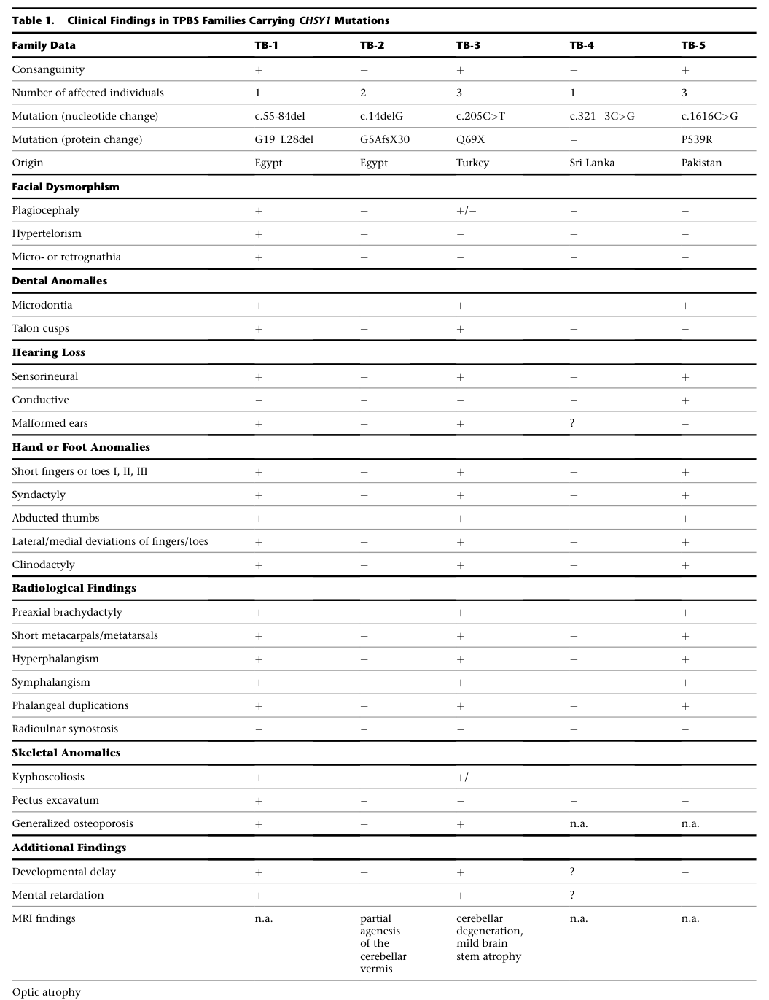

## Question

# Disease Characteristics Research Template

## Target Disease
- **Disease Name:** Temtamy Preaxial Brachydactyly Syndrome
- **MONDO ID:**  (if available)
- **Category:** Mendelian

## Research Objectives

Please provide a comprehensive research report on **Temtamy Preaxial Brachydactyly Syndrome** covering all of the
disease characteristics listed below. This report will be used to populate a disease knowledge
base entry. Be thorough and cite primary literature (PMID preferred) for all claims.

For each section, **suggested databases/resources** are listed. These are the first places
you should search for information on each topic.

---

### 1. Disease Information
> **Search first:** OMIM, Orphanet, ICD-10/ICD-11, MeSH, PubMed

- What is the disease? Provide a concise overview.
- What are the key identifiers? (OMIM, Orphanet, ICD-10/ICD-11, MeSH, Mondo)
- What are the common synonyms and alternative names?
- Is the information derived from individual patients (e.g., EHR) or aggregated disease-level resources?

### 2. Etiology

- **Disease Causal Factors**: What are the primary causes? (genetic, environmental, infectious, mechanistic)
- **Risk Factors**:
  > **Search first:** PubMed, Cochrane Library, UpToDate, clinical guidelines, ClinVar, ClinGen, GWAS Catalog, PheGenI, CTD, CDC, WHO, epidemiological databases
  - Genetic risk factors (causal variants, susceptibility loci, modifier genes)
  - Environmental risk factors (toxins, lifestyle, occupational exposures, age, sex, family history)
- **Protective Factors**:
  > **Search first:** PubMed, Cochrane Library, clinical trial databases, GWAS Catalog, gnomAD, WHO, CDC, nutrition databases
  - Genetic protective factors (protective variants, modifier alleles)
  - Environmental protective factors (diet, lifestyle, exposures that reduce risk)
- **Gene-Environment Interactions**: How do genetic and environmental factors interact to influence disease?
  > **Search first:** CTD, PubMed, PheGenI, GxE databases

### 3. Phenotypes
> **Search first:** HPO (Human Phenotype Ontology), OMIM, Orphanet, PubMed, clinicaltrials.gov, MedDRA, SNOMED CT, DECIPHER, LOINC

For each phenotype, provide:
- **Phenotype type**: symptoms, clinical signs, physical manifestations, behavioral changes, or laboratory abnormalities
  > For symptoms/signs: HPO, OMIM, Orphanet, PubMed
  > For behavioral changes: HPO, DSM, RDoC (Research Domain Criteria), PubMed
  > For laboratory abnormalities: LOINC, SNOMED CT, LabTests Online, PubMed
- **Phenotype characteristics**:
  > **Search first:** OMIM, Orphanet, HPO, PubMed
  - Age of symptom onset (neonatal, childhood, adult-onset, late-onset)
  - Symptom severity (mild, moderate, severe, variable)
  - Symptom progression (stable, progressive, episodic, fluctuating)
  - Frequency among affected individuals (percentage or qualitative)
- **Quality of life impact**: Effects on daily functioning and well-being (per-phenotype when possible)
  > **Search first:** EQ-5D database, SF-36, WHO QOL databases, PubMed
- Suggest HPO (Human Phenotype Ontology) terms for each phenotype

### 4. Genetic/Molecular Information

- **Causal Genes**: Gene mutations or chromosomal abnormalities responsible for disease (gene symbols, OMIM IDs)
  > **Search first:** OMIM, ClinVar, HGMD, Ensembl, NCBI Gene
- **Pathogenic Variants**:
  - Affected genes (gene symbols, HGNC IDs)
    > **Search first:** OMIM, NCBI Gene, Ensembl, HGNC, UniProt, GeneCards
  - Variant classification (pathogenic, likely pathogenic, VUS per ACMG/AMP guidelines)
    > **Search first:** ClinVar, ClinGen, ACMG/AMP guidelines, VarSome
  - Variant type/class (missense, frameshift, nonsense, splice-site, structural)
  - Allele frequency in population databases
    > **Search first:** gnomAD, 1000 Genomes, ExAC, TOPMed, dbSNP
  - Somatic vs germline origin
    > **Search first:** COSMIC (somatic), ClinVar, ICGC, TCGA
  - Functional consequences (loss of function, gain of function, dominant negative)
- **Modifier Genes**: Genes that modify disease severity or expression
- **Epigenetic Information**: DNA methylation, histone modifications, chromatin changes affecting disease
  > **Search first:** ENCODE, Roadmap Epigenomics, MethBase, DiseaseMeth
- **Chromosomal Abnormalities**: Large-scale genetic changes (aneuploidy, translocations, inversions)
  > **Search first:** DECIPHER, ClinVar, ECARUCA, UCSC Genome Browser

### 5. Environmental Information

- **Environmental Factors**: Non-genetic contributing factors (toxins, radiation, pollution, occupational exposure)
  > **Search first:** CTD (Comparative Toxicogenomics Database), TOXNET, PubMed, EPA databases
- **Lifestyle Factors**: Behavioral factors (smoking, diet, exercise, alcohol consumption)
  > **Search first:** CDC databases, WHO, PubMed, NHANES
- **Infectious Agents**: If applicable, pathogens causing or triggering disease (bacteria, viruses, fungi, parasites)
  > **Search first:** NCBI Taxonomy, ViPR, BV-BRC, MicrobeDB, GIDEON

### 6. Mechanism / Pathophysiology

- **Molecular Pathways**: Specific signaling cascades or biochemical pathways involved (Wnt, MAPK, mTOR, PI3K-AKT, etc.)
  > **Search first:** KEGG, Reactome, WikiPathways, PathBank, BioCyc
- **Cellular Processes**: Cell-level mechanisms (apoptosis, autophagy, cell cycle dysregulation, inflammation, etc.)
  > **Search first:** Gene Ontology (GO), Reactome, KEGG, PubMed
- **Protein Dysfunction**: How protein structure or function is altered (misfolding, aggregation, loss of function, gain of function)
  > **Search first:** UniProt, PDB (Protein Data Bank), InterPro, Pfam, AlphaFold
- **Metabolic Changes**: Alterations in metabolic processes (energy metabolism, lipid metabolism, amino acid metabolism)
  > **Search first:** KEGG, BioCyc, HMDB (Human Metabolome Database), BRENDA
- **Immune System Involvement**: Role of immune response (autoimmunity, immunodeficiency, chronic inflammation)
  > **Search first:** ImmPort, Immunome Database, IEDB, Gene Ontology
- **Tissue Damage Mechanisms**: How tissues/ are injured (oxidative stress, ischemia, fibrosis, necrosis)
  > **Search first:** PubMed, Gene Ontology, Reactome
- **Biochemical Abnormalities**: Specific molecular defects (enzyme deficiencies, receptor dysfunction, ion channel defects)
  > **Search first:** BRENDA, UniProt, KEGG, OMIM, PubMed
- **Epigenetic Changes**: DNA methylation, histone modifications affecting gene expression in disease
  > **Search first:** ENCODE, Roadmap Epigenomics, MethBase, DiseaseMeth
- **Molecular Profiling** (if available):
  - Transcriptomics/gene expression changes
    > **Search first:** GEO (Gene Expression Omnibus), ArrayExpress, GTEx, Human Cell Atlas, SRA
  - Proteomics findings
    > **Search first:** PRIDE, ProteomeXchange, Human Protein Atlas, STRING, BioGRID
  - Metabolomics signatures
    > **Search first:** MetaboLights, Metabolomics Workbench, HMDB, METLIN
  - Lipidomics alterations
    > **Search first:** LIPID MAPS, SwissLipids, LipidHome, Metabolomics Workbench
  - Genomic structural features
    > **Search first:** UCSC Genome Browser, Ensembl, NCBI, dbVar, DGV
- **Advanced Technologies** (if applicable):
  - Single-cell analysis findings (cell-type specific mechanisms, cellular heterogeneity)
    > **Search first:** Human Cell Atlas, Single Cell Portal, GEO, CELLxGENE
  - Spatial transcriptomics findings
    > **Search first:** GEO, Spatial Research, Vizgen, 10x Genomics data
  - Multi-omics integration results
    > **Search first:** TCGA, ICGC, cBioPortal, LinkedOmics, PubMed
  - Functional genomics screens (CRISPR, RNAi)
    > **Search first:** DepMap, GenomeRNAi, PubMed, BioGRID ORCS

For each mechanism, describe:
- The causal chain from initial trigger to clinical manifestation
- Which mechanisms are upstream vs downstream
- What cell types and biological processes are involved
- Suggest GO terms for biological processes and CL terms for cell types

### 7. Anatomical Structures Affected

- **Organ Level**:
  - Primary organs directly affected
  - Secondary organ involvement (complications, secondary effects)
  - Body systems involved (cardiovascular, nervous, digestive, respiratory, endocrine, etc.)
  > **Search first:** Uberon, FMA (Foundational Model of Anatomy), OMIM, HPO, ICD-11, MeSH, SNOMED CT
- **Tissue and Cell Level**:
  - Specific tissue types affected (epithelial, connective, muscle, nervous)
  - Specific cell populations targeted (with Cell Ontology terms)
  > **Search first:** Uberon, Human Protein Atlas, Cell Ontology, Human Cell Atlas, CellMarker, PanglaoDB
- **Subcellular Level**:
  - Cellular compartments involved (mitochondria, nucleus, ER, lysosomes) (with GO Cellular Component terms)
  > **Search first:** Gene Ontology (Cellular Component), UniProt, Human Protein Atlas
- **Localization**:
  - Specific anatomical sites (with UBERON terms)
    > **Search first:** FMA, Uberon, NeuroNames (for brain), SNOMED CT
  - Lateralization (unilateral, bilateral, asymmetric)
    > **Search first:** HPO, clinical literature, imaging databases

### 8. Temporal Development

- **Onset**:
  - Typical age of onset (congenital, pediatric, adult, geriatric)
  - Onset pattern (acute, subacute, chronic, insidious)
  > **Search first:** OMIM, Orphanet, HPO, PubMed
- **Progression**:
  - Disease stages (early, intermediate, advanced, end-stage)
    > **Search first:** Cancer Staging Manual (AJCC), WHO classifications, PubMed
  - Progression rate (rapid, slow, variable)
  - Disease course pattern (episodic, relapsing-remitting, progressive, stable)
  - Disease duration (self-limited, chronic lifelong)
  > **Search first:** Disease registries, longitudinal cohort databases, natural history studies, PubMed, Orphanet, OMIM
- **Patterns**:
  - Remission patterns (spontaneous, treatment-induced)
    > **Search first:** Clinical trial databases, disease registries, PubMed
  - Critical periods (time windows of vulnerability or opportunity for intervention)
    > **Search first:** PubMed, developmental biology databases, clinical guidelines

### 9. Inheritance and Population

- **Epidemiology**:
  - Prevalence (cases per 100,000 at given time)
  - Incidence (new cases per 100,000 per year)
  > **Search first:** Orphanet, CDC, WHO, GBD (Global Burden of Disease), national registries, SEER, disease registries
- **For Genetic Etiology**:
  - Inheritance pattern (AD, AR, X-linked, mitochondrial, multifactorial, polygenic)
    > **Search first:** OMIM, Orphanet, ClinVar, GTR (Genetic Testing Registry)
  - Penetrance (complete, incomplete, age-dependent)
    > **Search first:** ClinVar, OMIM, PubMed, ClinGen
  - Expressivity (variable, consistent)
    > **Search first:** OMIM, ClinVar, PubMed
  - Genetic anticipation (increasing severity in successive generations)
    > **Search first:** OMIM, PubMed (especially for repeat expansion disorders)
  - Germline mosaicism
    > **Search first:** ClinVar, OMIM, genetic counseling literature, PubMed
  - Founder effects (population-specific mutations)
    > **Search first:** gnomAD, population genetics databases, PubMed
  - Consanguinity role
    > **Search first:** OMIM, population studies, genetic counseling resources
  - Carrier frequency
    > **Search first:** gnomAD, carrier screening databases, GeneReviews, GTR
- **Population Demographics**:
  - Affected populations (ethnic or demographic groups with higher prevalence)
    > **Search first:** gnomAD, 1000 Genomes, PAGE Study, PubMed, population registries
  - Geographic distribution (endemic areas, regional variation)
    > **Search first:** WHO, CDC, GBD, Orphanet, geographic epidemiology databases
  - Geographic distribution of specific variants
  - Sex ratio (male:female)
    > **Search first:** Disease registries, OMIM, PubMed, epidemiological databases
  - Age distribution of affected individuals
    > **Search first:** CDC, disease registries, SEER, Orphanet

### 10. Diagnostics

- **Clinical Tests**:
  - Laboratory tests (blood, urine, tissue chemistry, specific enzyme assays)
    > **Search first:** LOINC, LabTests Online, PubMed
  - Biomarkers (proteins, metabolites, genetic markers, circulating biomarkers)
    > **Search first:** FDA Biomarker List, BEST (Biomarkers, EndpointS, and other Tools), PubMed
  - Imaging studies (X-ray, CT, MRI, PET, ultrasound)
    > **Search first:** RadLex, DICOM, Radiopaedia, imaging databases
  - Functional tests (pulmonary function, cardiac stress tests)
    > **Search first:** LOINC, clinical guidelines, PubMed
  - Electrophysiology (EEG, EMG, ECG, nerve conduction studies)
    > **Search first:** LOINC, clinical neurophysiology databases, PubMed
  - Biopsy findings (histopathology, immunohistochemistry)
    > **Search first:** SNOMED CT, College of American Pathologists resources, PubMed
  - Pathology findings (microscopic examination)
    > **Search first:** SNOMED CT, Digital Pathology databases, PubMed
- **Genetic Testing**:
  > **Search first:** GTR (Genetic Testing Registry), GeneReviews, ClinGen
  - Overview of recommended genetic testing approach
  - Whole genome sequencing (WGS) utility
    > **Search first:** GTR, ClinVar, GEL (Genomics England), gnomAD
  - Whole exome sequencing (WES) utility
    > **Search first:** GTR, ClinVar, OMIM, GeneMatcher
  - Gene panels (which panels, which genes)
    > **Search first:** GTR, ClinVar, laboratory-specific databases
  - Single gene testing
    > **Search first:** GTR, ClinVar, OMIM, GeneReviews
  - Chromosomal microarray (CMA)
    > **Search first:** DECIPHER, ClinVar, dbVar, ECARUCA
  - Karyotyping
    > **Search first:** Chromosome Abnormality Database, ClinVar, cytogenetics resources
  - FISH
    > **Search first:** ClinVar, cytogenetics databases, PubMed
  - Mitochondrial DNA testing
    > **Search first:** MITOMAP, MSeqDR, ClinVar, GTR
  - Repeat expansion testing
    > **Search first:** GTR, ClinVar, repeat expansion databases, PubMed
- **Omics-Based Diagnostics** (if applicable):
  - RNA sequencing / transcriptomics
    > **Search first:** GEO, ArrayExpress, GTEx, RNA-seq databases
  - Proteomics
    > **Search first:** PRIDE, ProteomeXchange, FDA Biomarker database
  - Metabolomics
    > **Search first:** MetaboLights, Metabolomics Workbench, HMDB
  - Epigenomics
    > **Search first:** GEO, ENCODE, Roadmap Epigenomics, MethBase
  - Liquid biopsy
    > **Search first:** COSMIC, ClinVar, liquid biopsy databases, PubMed
- **Clinical Criteria**:
  - Standardized diagnostic criteria (DSM, ICD, society guidelines)
    > **Search first:** DSM-5, ICD-11, clinical society guidelines, UpToDate
  - Differential diagnosis (other conditions to rule out, with distinguishing features)
    > **Search first:** DynaMed, UpToDate, clinical decision support systems
- **Screening**:
  - Screening methods for asymptomatic individuals (newborn screening, carrier screening, cascade screening)
    > **Search first:** ACMG recommendations, CDC newborn screening, GTR

### 11. Outcome/Prognosis

- **Survival and Mortality**:
  - Survival rate (5-year, 10-year, overall)
    > **Search first:** SEER, cancer registries, disease-specific registries, PubMed
  - Life expectancy (with and without treatment if applicable)
    > **Search first:** Orphanet, disease registries, actuarial databases, PubMed
  - Mortality rate
    > **Search first:** CDC, WHO, GBD, national mortality databases
  - Disease-specific mortality (deaths directly attributable to disease)
    > **Search first:** Disease registries, CDC Wonder, GBD, PubMed
- **Morbidity and Function**:
  - Morbidity (disease-related disability and health impacts)
    > **Search first:** GBD, WHO, disability databases, PubMed
  - Disability outcomes (long-term functional impairments)
    > **Search first:** ICF (International Classification of Functioning), disability registries
  - Quality of life measures (EQ-5D, SF-36, PROMIS, disease-specific tools)
    > **Search first:** EQ-5D database, SF-36, PROMIS, PubMed
- **Disease Course**:
  - Complications (secondary problems: infections, organ failure, etc.)
    > **Search first:** ICD codes, disease registries, clinical databases, PubMed
  - Recovery potential (likelihood and extent of recovery, with vs without treatment)
    > **Search first:** Natural history studies, rehabilitation databases, PubMed
- **Prediction**:
  - Prognostic factors (age, disease severity, biomarkers, treatment response)
    > **Search first:** Prognostic models databases, clinical calculators, PubMed
  - Prognostic biomarkers (molecular markers predicting disease course)
    > **Search first:** FDA Biomarker database, PubMed, cancer prognostic databases

### 12. Treatment

- **Pharmacotherapy**:
  - Pharmacological treatments (drug names, drug classes, mechanisms of action)
    > **Search first:** DrugBank, RxNorm, ATC classification, DailyMed, FDA databases
  - Pharmacogenomics (how genetic variants affect drug metabolism, efficacy, toxicity)
    > **Search first:** PharmGKB, CPIC (Clinical Pharmacogenetics), FDA Table of PGx Biomarkers
- **Advanced Therapeutics**:
  - Gene therapy (viral vectors, CRISPR, gene replacement, gene editing)
    > **Search first:** ClinicalTrials.gov, FDA gene therapy database, ASGCT resources
  - Cell therapy (stem cell transplant, CAR-T, cellular therapeutics)
    > **Search first:** ClinicalTrials.gov, FDA cell therapy database, FACT standards
  - RNA-based therapies (ASOs, siRNA, mRNA therapies)
    > **Search first:** ClinicalTrials.gov, FDA approvals, PubMed
  - Targeted therapies (treatments directed at specific molecular targets)
    > **Search first:** My Cancer Genome, OncoKB, ClinicalTrials.gov, FDA approvals
  - Immunotherapies (checkpoint inhibitors, monoclonal antibodies)
    > **Search first:** Cancer Immunotherapy Database, FDA approvals, ClinicalTrials.gov
- **Surgical and Interventional**:
  - Surgical interventions (types of surgery, timing, outcomes)
    > **Search first:** CPT codes, surgical registries, clinical guidelines, PubMed
- **Supportive and Rehabilitative**:
  - Supportive care (symptom management, pain control, nutrition)
    > **Search first:** Clinical guidelines, Cochrane Library, PubMed
  - Rehabilitation (physical therapy, occupational therapy, speech therapy)
    > **Search first:** Rehabilitation medicine databases, clinical guidelines, PubMed
- **Experimental**:
  - Experimental treatments in clinical trials (with NCT identifiers if available)
    > **Search first:** ClinicalTrials.gov, EU Clinical Trials Register, WHO ICTRP
- **Treatment Outcomes**:
  - Treatment response rates
    > **Search first:** Clinical trial databases, FDA reviews, systematic reviews, PubMed
  - Side effects and adverse events
    > **Search first:** FDA Adverse Event Reporting System (FAERS), MedWatch, PubMed
- **Treatment Strategy**:
  - Treatment algorithms (clinical pathways, decision trees)
    > **Search first:** Clinical practice guidelines, NCCN Guidelines, UpToDate
  - Combination therapies
    > **Search first:** ClinicalTrials.gov, treatment guidelines, PubMed
  - Personalized medicine approaches (genotype-guided treatment)
    > **Search first:** My Cancer Genome, CIViC, PharmGKB, precision medicine databases

For each treatment, suggest MAXO (Medical Action Ontology) terms where applicable.

### 13. Prevention

- **Prevention Levels**:
  - Primary prevention (preventing disease occurrence: vaccination, risk factor modification)
    > **Search first:** CDC, WHO, USPSTF recommendations, Cochrane Library
  - Secondary prevention (early detection and treatment: screening programs, early intervention)
    > **Search first:** USPSTF, CDC screening guidelines, WHO
  - Tertiary prevention (preventing complications in those with disease)
    > **Search first:** Clinical guidelines, disease management protocols, PubMed
- **Immunization**: Vaccine strategies (if applicable)
  > **Search first:** CDC vaccine schedules, WHO immunization, FDA vaccine database
- **Screening and Early Detection**:
  - Screening programs (population-based: newborn screening, cancer screening)
    > **Search first:** CDC screening programs, USPSTF, cancer screening databases
  - Genetic screening (carrier screening, preimplantation genetic diagnosis, prenatal testing)
    > **Search first:** ACMG recommendations, ACOG guidelines, GTR
  - Risk stratification (identifying high-risk individuals for targeted prevention)
    > **Search first:** Risk prediction models, clinical calculators, PubMed
- **Behavioral Interventions**: Lifestyle modifications to reduce risk
  > **Search first:** CDC, WHO, behavioral intervention databases, Cochrane Library
- **Counseling**: Genetic counseling (risk assessment, family planning guidance)
  > **Search first:** NSGC resources, ACMG guidelines, GeneReviews
- **Public Health**:
  - Public health interventions (sanitation, vector control, health education)
    > **Search first:** CDC, WHO, public health databases, PubMed
  - Environmental interventions (reducing environmental risk factors)
    > **Search first:** EPA databases, WHO environmental health, PubMed
- **Prophylaxis**: Preventive medications or procedures
  > **Search first:** Clinical guidelines, FDA approvals, PubMed

### 14. Other Species / Natural Disease

- **Taxonomy**: Species affected (with NCBI Taxon identifiers)
  > **Search first:** NCBI Taxonomy
- **Breed**: Specific breeds affected (with VBO identifiers if applicable)
  > **Search first:** VBO (Vertebrate Breed Ontology)
- **Gene**: Orthologous genes in other species (with NCBI Gene IDs)
  > **Search first:** NCBI Gene
- **Natural Disease**:
  - Naturally occurring disease in other species (companion animals, wildlife)
    > **Search first:** OMIA (Online Mendelian Inheritance in Animals), VetCompass, PubMed
  - Veterinary relevance and importance in animal health
    > **Search first:** OMIA, veterinary databases, PubMed
- **Comparative Biology**:
  - Comparative pathology (similarities and differences across species)
    > **Search first:** OMIA, comparative pathology databases, PubMed
  - Evolutionary conservation of disease mechanisms
    > **Search first:** HomoloGene, OrthoMCL, Alliance of Genome Resources
- **Transmission** (if applicable):
  - Zoonotic potential
    > **Search first:** CDC zoonotic diseases, WHO zoonoses, GIDEON
  - Cross-species susceptibility
    > **Search first:** NCBI Taxonomy, veterinary databases, PubMed

### 15. Model Organisms

- **Model Types**:
  - Model organism type (mammalian, invertebrate, cellular, in vitro)
    > **Search first:** Alliance of Genome Resources, model organism databases
  - Specific model systems (mouse, rat, zebrafish, Drosophila, C. elegans, yeast, cell lines, organoids, iPSCs)
    > **Search first:** MGI, RGD, ZFIN, FlyBase, WormBase, SGD, ATCC, Cellosaurus
  - Induced models (drug treatment, surgical intervention, environmental manipulation)
    > **Search first:** MGI, model organism databases, PubMed
- **Genetic Models**:
  - Types available (knockout, knock-in, transgenic, conditional, humanized)
    > **Search first:** MGI, IMPC, KOMP, EuMMCR, IMSR
- **Model Characteristics**:
  - Phenotype recapitulation (how well model reproduces human disease features)
    > **Search first:** Model organism databases, comparative studies, PubMed
  - Model limitations (aspects of human disease not captured)
    > **Search first:** Model organism databases, PubMed, review articles
- **Applications**:
  - Research applications (what aspects of disease can be studied)
    > **Search first:** Model organism databases, PubMed
- **Resources**:
  - Model databases
    > **Search first:** MGI, RGD, ZFIN, FlyBase, WormBase, IMSR, EMMA, MMRRC

---

## Citation Requirements

- Cite primary literature (PMID preferred) for all mechanistic and clinical claims
- Prioritize recent reviews and landmark papers
- Include direct quotes from abstracts where possible to support key statements
- Distinguish evidence source types: human clinical, model organism, in vitro, computational

## Output Format

Structure your response as a comprehensive narrative organized by the sections above.
For each section, provide:
- Factual content with specific details (numbers, percentages, gene names, variant nomenclature)
- Ontology term suggestions (HPO, GO, CL, UBERON, CHEBI, MAXO, MONDO) where applicable
- Evidence citations with PMIDs
- Direct quotes from abstracts to support key claims
- Clear indication when information is not available or not applicable for this disease

This report will be used to populate a disease knowledge base entry with:
- Pathophysiology descriptions with causal chains
- Gene/protein annotations (HGNC, GO terms)
- Phenotype associations (HP terms) with frequencies
- Cell type involvement (CL terms)
- Anatomical locations (UBERON terms)
- Chemical entities (CHEBI terms)
- Treatment annotations (MAXO terms)
- Evidence items with PMIDs and exact abstract quotes
- Epidemiology, prognosis, diagnostic, and prevention information
- Animal model descriptions with phenotype recapitulation details

## Output

Question: You are an expert researcher providing comprehensive, well-cited information.

Provide detailed information focusing on:
1. Key concepts and definitions with current understanding
2. Recent developments and latest research (prioritize 2023-2024 sources)
3. Current applications and real-world implementations
4. Expert opinions and analysis from authoritative sources
5. Relevant statistics and data from recent studies

Format as a comprehensive research report with proper citations. Include URLs and publication dates where available.
Always prioritize recent, authoritative sources and provide specific citations for all major claims.

# Disease Characteristics Research Template

## Target Disease
- **Disease Name:** Temtamy Preaxial Brachydactyly Syndrome
- **MONDO ID:**  (if available)
- **Category:** Mendelian

## Research Objectives

Please provide a comprehensive research report on **Temtamy Preaxial Brachydactyly Syndrome** covering all of the
disease characteristics listed below. This report will be used to populate a disease knowledge
base entry. Be thorough and cite primary literature (PMID preferred) for all claims.

For each section, **suggested databases/resources** are listed. These are the first places
you should search for information on each topic.

---

### 1. Disease Information
> **Search first:** OMIM, Orphanet, ICD-10/ICD-11, MeSH, PubMed

- What is the disease? Provide a concise overview.
- What are the key identifiers? (OMIM, Orphanet, ICD-10/ICD-11, MeSH, Mondo)
- What are the common synonyms and alternative names?
- Is the information derived from individual patients (e.g., EHR) or aggregated disease-level resources?

### 2. Etiology

- **Disease Causal Factors**: What are the primary causes? (genetic, environmental, infectious, mechanistic)
- **Risk Factors**:
  > **Search first:** PubMed, Cochrane Library, UpToDate, clinical guidelines, ClinVar, ClinGen, GWAS Catalog, PheGenI, CTD, CDC, WHO, epidemiological databases
  - Genetic risk factors (causal variants, susceptibility loci, modifier genes)
  - Environmental risk factors (toxins, lifestyle, occupational exposures, age, sex, family history)
- **Protective Factors**:
  > **Search first:** PubMed, Cochrane Library, clinical trial databases, GWAS Catalog, gnomAD, WHO, CDC, nutrition databases
  - Genetic protective factors (protective variants, modifier alleles)
  - Environmental protective factors (diet, lifestyle, exposures that reduce risk)
- **Gene-Environment Interactions**: How do genetic and environmental factors interact to influence disease?
  > **Search first:** CTD, PubMed, PheGenI, GxE databases

### 3. Phenotypes
> **Search first:** HPO (Human Phenotype Ontology), OMIM, Orphanet, PubMed, clinicaltrials.gov, MedDRA, SNOMED CT, DECIPHER, LOINC

For each phenotype, provide:
- **Phenotype type**: symptoms, clinical signs, physical manifestations, behavioral changes, or laboratory abnormalities
  > For symptoms/signs: HPO, OMIM, Orphanet, PubMed
  > For behavioral changes: HPO, DSM, RDoC (Research Domain Criteria), PubMed
  > For laboratory abnormalities: LOINC, SNOMED CT, LabTests Online, PubMed
- **Phenotype characteristics**:
  > **Search first:** OMIM, Orphanet, HPO, PubMed
  - Age of symptom onset (neonatal, childhood, adult-onset, late-onset)
  - Symptom severity (mild, moderate, severe, variable)
  - Symptom progression (stable, progressive, episodic, fluctuating)
  - Frequency among affected individuals (percentage or qualitative)
- **Quality of life impact**: Effects on daily functioning and well-being (per-phenotype when possible)
  > **Search first:** EQ-5D database, SF-36, WHO QOL databases, PubMed
- Suggest HPO (Human Phenotype Ontology) terms for each phenotype

### 4. Genetic/Molecular Information

- **Causal Genes**: Gene mutations or chromosomal abnormalities responsible for disease (gene symbols, OMIM IDs)
  > **Search first:** OMIM, ClinVar, HGMD, Ensembl, NCBI Gene
- **Pathogenic Variants**:
  - Affected genes (gene symbols, HGNC IDs)
    > **Search first:** OMIM, NCBI Gene, Ensembl, HGNC, UniProt, GeneCards
  - Variant classification (pathogenic, likely pathogenic, VUS per ACMG/AMP guidelines)
    > **Search first:** ClinVar, ClinGen, ACMG/AMP guidelines, VarSome
  - Variant type/class (missense, frameshift, nonsense, splice-site, structural)
  - Allele frequency in population databases
    > **Search first:** gnomAD, 1000 Genomes, ExAC, TOPMed, dbSNP
  - Somatic vs germline origin
    > **Search first:** COSMIC (somatic), ClinVar, ICGC, TCGA
  - Functional consequences (loss of function, gain of function, dominant negative)
- **Modifier Genes**: Genes that modify disease severity or expression
- **Epigenetic Information**: DNA methylation, histone modifications, chromatin changes affecting disease
  > **Search first:** ENCODE, Roadmap Epigenomics, MethBase, DiseaseMeth
- **Chromosomal Abnormalities**: Large-scale genetic changes (aneuploidy, translocations, inversions)
  > **Search first:** DECIPHER, ClinVar, ECARUCA, UCSC Genome Browser

### 5. Environmental Information

- **Environmental Factors**: Non-genetic contributing factors (toxins, radiation, pollution, occupational exposure)
  > **Search first:** CTD (Comparative Toxicogenomics Database), TOXNET, PubMed, EPA databases
- **Lifestyle Factors**: Behavioral factors (smoking, diet, exercise, alcohol consumption)
  > **Search first:** CDC databases, WHO, PubMed, NHANES
- **Infectious Agents**: If applicable, pathogens causing or triggering disease (bacteria, viruses, fungi, parasites)
  > **Search first:** NCBI Taxonomy, ViPR, BV-BRC, MicrobeDB, GIDEON

### 6. Mechanism / Pathophysiology

- **Molecular Pathways**: Specific signaling cascades or biochemical pathways involved (Wnt, MAPK, mTOR, PI3K-AKT, etc.)
  > **Search first:** KEGG, Reactome, WikiPathways, PathBank, BioCyc
- **Cellular Processes**: Cell-level mechanisms (apoptosis, autophagy, cell cycle dysregulation, inflammation, etc.)
  > **Search first:** Gene Ontology (GO), Reactome, KEGG, PubMed
- **Protein Dysfunction**: How protein structure or function is altered (misfolding, aggregation, loss of function, gain of function)
  > **Search first:** UniProt, PDB (Protein Data Bank), InterPro, Pfam, AlphaFold
- **Metabolic Changes**: Alterations in metabolic processes (energy metabolism, lipid metabolism, amino acid metabolism)
  > **Search first:** KEGG, BioCyc, HMDB (Human Metabolome Database), BRENDA
- **Immune System Involvement**: Role of immune response (autoimmunity, immunodeficiency, chronic inflammation)
  > **Search first:** ImmPort, Immunome Database, IEDB, Gene Ontology
- **Tissue Damage Mechanisms**: How tissues/ are injured (oxidative stress, ischemia, fibrosis, necrosis)
  > **Search first:** PubMed, Gene Ontology, Reactome
- **Biochemical Abnormalities**: Specific molecular defects (enzyme deficiencies, receptor dysfunction, ion channel defects)
  > **Search first:** BRENDA, UniProt, KEGG, OMIM, PubMed
- **Epigenetic Changes**: DNA methylation, histone modifications affecting gene expression in disease
  > **Search first:** ENCODE, Roadmap Epigenomics, MethBase, DiseaseMeth
- **Molecular Profiling** (if available):
  - Transcriptomics/gene expression changes
    > **Search first:** GEO (Gene Expression Omnibus), ArrayExpress, GTEx, Human Cell Atlas, SRA
  - Proteomics findings
    > **Search first:** PRIDE, ProteomeXchange, Human Protein Atlas, STRING, BioGRID
  - Metabolomics signatures
    > **Search first:** MetaboLights, Metabolomics Workbench, HMDB, METLIN
  - Lipidomics alterations
    > **Search first:** LIPID MAPS, SwissLipids, LipidHome, Metabolomics Workbench
  - Genomic structural features
    > **Search first:** UCSC Genome Browser, Ensembl, NCBI, dbVar, DGV
- **Advanced Technologies** (if applicable):
  - Single-cell analysis findings (cell-type specific mechanisms, cellular heterogeneity)
    > **Search first:** Human Cell Atlas, Single Cell Portal, GEO, CELLxGENE
  - Spatial transcriptomics findings
    > **Search first:** GEO, Spatial Research, Vizgen, 10x Genomics data
  - Multi-omics integration results
    > **Search first:** TCGA, ICGC, cBioPortal, LinkedOmics, PubMed
  - Functional genomics screens (CRISPR, RNAi)
    > **Search first:** DepMap, GenomeRNAi, PubMed, BioGRID ORCS

For each mechanism, describe:
- The causal chain from initial trigger to clinical manifestation
- Which mechanisms are upstream vs downstream
- What cell types and biological processes are involved
- Suggest GO terms for biological processes and CL terms for cell types

### 7. Anatomical Structures Affected

- **Organ Level**:
  - Primary organs directly affected
  - Secondary organ involvement (complications, secondary effects)
  - Body systems involved (cardiovascular, nervous, digestive, respiratory, endocrine, etc.)
  > **Search first:** Uberon, FMA (Foundational Model of Anatomy), OMIM, HPO, ICD-11, MeSH, SNOMED CT
- **Tissue and Cell Level**:
  - Specific tissue types affected (epithelial, connective, muscle, nervous)
  - Specific cell populations targeted (with Cell Ontology terms)
  > **Search first:** Uberon, Human Protein Atlas, Cell Ontology, Human Cell Atlas, CellMarker, PanglaoDB
- **Subcellular Level**:
  - Cellular compartments involved (mitochondria, nucleus, ER, lysosomes) (with GO Cellular Component terms)
  > **Search first:** Gene Ontology (Cellular Component), UniProt, Human Protein Atlas
- **Localization**:
  - Specific anatomical sites (with UBERON terms)
    > **Search first:** FMA, Uberon, NeuroNames (for brain), SNOMED CT
  - Lateralization (unilateral, bilateral, asymmetric)
    > **Search first:** HPO, clinical literature, imaging databases

### 8. Temporal Development

- **Onset**:
  - Typical age of onset (congenital, pediatric, adult, geriatric)
  - Onset pattern (acute, subacute, chronic, insidious)
  > **Search first:** OMIM, Orphanet, HPO, PubMed
- **Progression**:
  - Disease stages (early, intermediate, advanced, end-stage)
    > **Search first:** Cancer Staging Manual (AJCC), WHO classifications, PubMed
  - Progression rate (rapid, slow, variable)
  - Disease course pattern (episodic, relapsing-remitting, progressive, stable)
  - Disease duration (self-limited, chronic lifelong)
  > **Search first:** Disease registries, longitudinal cohort databases, natural history studies, PubMed, Orphanet, OMIM
- **Patterns**:
  - Remission patterns (spontaneous, treatment-induced)
    > **Search first:** Clinical trial databases, disease registries, PubMed
  - Critical periods (time windows of vulnerability or opportunity for intervention)
    > **Search first:** PubMed, developmental biology databases, clinical guidelines

### 9. Inheritance and Population

- **Epidemiology**:
  - Prevalence (cases per 100,000 at given time)
  - Incidence (new cases per 100,000 per year)
  > **Search first:** Orphanet, CDC, WHO, GBD (Global Burden of Disease), national registries, SEER, disease registries
- **For Genetic Etiology**:
  - Inheritance pattern (AD, AR, X-linked, mitochondrial, multifactorial, polygenic)
    > **Search first:** OMIM, Orphanet, ClinVar, GTR (Genetic Testing Registry)
  - Penetrance (complete, incomplete, age-dependent)
    > **Search first:** ClinVar, OMIM, PubMed, ClinGen
  - Expressivity (variable, consistent)
    > **Search first:** OMIM, ClinVar, PubMed
  - Genetic anticipation (increasing severity in successive generations)
    > **Search first:** OMIM, PubMed (especially for repeat expansion disorders)
  - Germline mosaicism
    > **Search first:** ClinVar, OMIM, genetic counseling literature, PubMed
  - Founder effects (population-specific mutations)
    > **Search first:** gnomAD, population genetics databases, PubMed
  - Consanguinity role
    > **Search first:** OMIM, population studies, genetic counseling resources
  - Carrier frequency
    > **Search first:** gnomAD, carrier screening databases, GeneReviews, GTR
- **Population Demographics**:
  - Affected populations (ethnic or demographic groups with higher prevalence)
    > **Search first:** gnomAD, 1000 Genomes, PAGE Study, PubMed, population registries
  - Geographic distribution (endemic areas, regional variation)
    > **Search first:** WHO, CDC, GBD, Orphanet, geographic epidemiology databases
  - Geographic distribution of specific variants
  - Sex ratio (male:female)
    > **Search first:** Disease registries, OMIM, PubMed, epidemiological databases
  - Age distribution of affected individuals
    > **Search first:** CDC, disease registries, SEER, Orphanet

### 10. Diagnostics

- **Clinical Tests**:
  - Laboratory tests (blood, urine, tissue chemistry, specific enzyme assays)
    > **Search first:** LOINC, LabTests Online, PubMed
  - Biomarkers (proteins, metabolites, genetic markers, circulating biomarkers)
    > **Search first:** FDA Biomarker List, BEST (Biomarkers, EndpointS, and other Tools), PubMed
  - Imaging studies (X-ray, CT, MRI, PET, ultrasound)
    > **Search first:** RadLex, DICOM, Radiopaedia, imaging databases
  - Functional tests (pulmonary function, cardiac stress tests)
    > **Search first:** LOINC, clinical guidelines, PubMed
  - Electrophysiology (EEG, EMG, ECG, nerve conduction studies)
    > **Search first:** LOINC, clinical neurophysiology databases, PubMed
  - Biopsy findings (histopathology, immunohistochemistry)
    > **Search first:** SNOMED CT, College of American Pathologists resources, PubMed
  - Pathology findings (microscopic examination)
    > **Search first:** SNOMED CT, Digital Pathology databases, PubMed
- **Genetic Testing**:
  > **Search first:** GTR (Genetic Testing Registry), GeneReviews, ClinGen
  - Overview of recommended genetic testing approach
  - Whole genome sequencing (WGS) utility
    > **Search first:** GTR, ClinVar, GEL (Genomics England), gnomAD
  - Whole exome sequencing (WES) utility
    > **Search first:** GTR, ClinVar, OMIM, GeneMatcher
  - Gene panels (which panels, which genes)
    > **Search first:** GTR, ClinVar, laboratory-specific databases
  - Single gene testing
    > **Search first:** GTR, ClinVar, OMIM, GeneReviews
  - Chromosomal microarray (CMA)
    > **Search first:** DECIPHER, ClinVar, dbVar, ECARUCA
  - Karyotyping
    > **Search first:** Chromosome Abnormality Database, ClinVar, cytogenetics resources
  - FISH
    > **Search first:** ClinVar, cytogenetics databases, PubMed
  - Mitochondrial DNA testing
    > **Search first:** MITOMAP, MSeqDR, ClinVar, GTR
  - Repeat expansion testing
    > **Search first:** GTR, ClinVar, repeat expansion databases, PubMed
- **Omics-Based Diagnostics** (if applicable):
  - RNA sequencing / transcriptomics
    > **Search first:** GEO, ArrayExpress, GTEx, RNA-seq databases
  - Proteomics
    > **Search first:** PRIDE, ProteomeXchange, FDA Biomarker database
  - Metabolomics
    > **Search first:** MetaboLights, Metabolomics Workbench, HMDB
  - Epigenomics
    > **Search first:** GEO, ENCODE, Roadmap Epigenomics, MethBase
  - Liquid biopsy
    > **Search first:** COSMIC, ClinVar, liquid biopsy databases, PubMed
- **Clinical Criteria**:
  - Standardized diagnostic criteria (DSM, ICD, society guidelines)
    > **Search first:** DSM-5, ICD-11, clinical society guidelines, UpToDate
  - Differential diagnosis (other conditions to rule out, with distinguishing features)
    > **Search first:** DynaMed, UpToDate, clinical decision support systems
- **Screening**:
  - Screening methods for asymptomatic individuals (newborn screening, carrier screening, cascade screening)
    > **Search first:** ACMG recommendations, CDC newborn screening, GTR

### 11. Outcome/Prognosis

- **Survival and Mortality**:
  - Survival rate (5-year, 10-year, overall)
    > **Search first:** SEER, cancer registries, disease-specific registries, PubMed
  - Life expectancy (with and without treatment if applicable)
    > **Search first:** Orphanet, disease registries, actuarial databases, PubMed
  - Mortality rate
    > **Search first:** CDC, WHO, GBD, national mortality databases
  - Disease-specific mortality (deaths directly attributable to disease)
    > **Search first:** Disease registries, CDC Wonder, GBD, PubMed
- **Morbidity and Function**:
  - Morbidity (disease-related disability and health impacts)
    > **Search first:** GBD, WHO, disability databases, PubMed
  - Disability outcomes (long-term functional impairments)
    > **Search first:** ICF (International Classification of Functioning), disability registries
  - Quality of life measures (EQ-5D, SF-36, PROMIS, disease-specific tools)
    > **Search first:** EQ-5D database, SF-36, PROMIS, PubMed
- **Disease Course**:
  - Complications (secondary problems: infections, organ failure, etc.)
    > **Search first:** ICD codes, disease registries, clinical databases, PubMed
  - Recovery potential (likelihood and extent of recovery, with vs without treatment)
    > **Search first:** Natural history studies, rehabilitation databases, PubMed
- **Prediction**:
  - Prognostic factors (age, disease severity, biomarkers, treatment response)
    > **Search first:** Prognostic models databases, clinical calculators, PubMed
  - Prognostic biomarkers (molecular markers predicting disease course)
    > **Search first:** FDA Biomarker database, PubMed, cancer prognostic databases

### 12. Treatment

- **Pharmacotherapy**:
  - Pharmacological treatments (drug names, drug classes, mechanisms of action)
    > **Search first:** DrugBank, RxNorm, ATC classification, DailyMed, FDA databases
  - Pharmacogenomics (how genetic variants affect drug metabolism, efficacy, toxicity)
    > **Search first:** PharmGKB, CPIC (Clinical Pharmacogenetics), FDA Table of PGx Biomarkers
- **Advanced Therapeutics**:
  - Gene therapy (viral vectors, CRISPR, gene replacement, gene editing)
    > **Search first:** ClinicalTrials.gov, FDA gene therapy database, ASGCT resources
  - Cell therapy (stem cell transplant, CAR-T, cellular therapeutics)
    > **Search first:** ClinicalTrials.gov, FDA cell therapy database, FACT standards
  - RNA-based therapies (ASOs, siRNA, mRNA therapies)
    > **Search first:** ClinicalTrials.gov, FDA approvals, PubMed
  - Targeted therapies (treatments directed at specific molecular targets)
    > **Search first:** My Cancer Genome, OncoKB, ClinicalTrials.gov, FDA approvals
  - Immunotherapies (checkpoint inhibitors, monoclonal antibodies)
    > **Search first:** Cancer Immunotherapy Database, FDA approvals, ClinicalTrials.gov
- **Surgical and Interventional**:
  - Surgical interventions (types of surgery, timing, outcomes)
    > **Search first:** CPT codes, surgical registries, clinical guidelines, PubMed
- **Supportive and Rehabilitative**:
  - Supportive care (symptom management, pain control, nutrition)
    > **Search first:** Clinical guidelines, Cochrane Library, PubMed
  - Rehabilitation (physical therapy, occupational therapy, speech therapy)
    > **Search first:** Rehabilitation medicine databases, clinical guidelines, PubMed
- **Experimental**:
  - Experimental treatments in clinical trials (with NCT identifiers if available)
    > **Search first:** ClinicalTrials.gov, EU Clinical Trials Register, WHO ICTRP
- **Treatment Outcomes**:
  - Treatment response rates
    > **Search first:** Clinical trial databases, FDA reviews, systematic reviews, PubMed
  - Side effects and adverse events
    > **Search first:** FDA Adverse Event Reporting System (FAERS), MedWatch, PubMed
- **Treatment Strategy**:
  - Treatment algorithms (clinical pathways, decision trees)
    > **Search first:** Clinical practice guidelines, NCCN Guidelines, UpToDate
  - Combination therapies
    > **Search first:** ClinicalTrials.gov, treatment guidelines, PubMed
  - Personalized medicine approaches (genotype-guided treatment)
    > **Search first:** My Cancer Genome, CIViC, PharmGKB, precision medicine databases

For each treatment, suggest MAXO (Medical Action Ontology) terms where applicable.

### 13. Prevention

- **Prevention Levels**:
  - Primary prevention (preventing disease occurrence: vaccination, risk factor modification)
    > **Search first:** CDC, WHO, USPSTF recommendations, Cochrane Library
  - Secondary prevention (early detection and treatment: screening programs, early intervention)
    > **Search first:** USPSTF, CDC screening guidelines, WHO
  - Tertiary prevention (preventing complications in those with disease)
    > **Search first:** Clinical guidelines, disease management protocols, PubMed
- **Immunization**: Vaccine strategies (if applicable)
  > **Search first:** CDC vaccine schedules, WHO immunization, FDA vaccine database
- **Screening and Early Detection**:
  - Screening programs (population-based: newborn screening, cancer screening)
    > **Search first:** CDC screening programs, USPSTF, cancer screening databases
  - Genetic screening (carrier screening, preimplantation genetic diagnosis, prenatal testing)
    > **Search first:** ACMG recommendations, ACOG guidelines, GTR
  - Risk stratification (identifying high-risk individuals for targeted prevention)
    > **Search first:** Risk prediction models, clinical calculators, PubMed
- **Behavioral Interventions**: Lifestyle modifications to reduce risk
  > **Search first:** CDC, WHO, behavioral intervention databases, Cochrane Library
- **Counseling**: Genetic counseling (risk assessment, family planning guidance)
  > **Search first:** NSGC resources, ACMG guidelines, GeneReviews
- **Public Health**:
  - Public health interventions (sanitation, vector control, health education)
    > **Search first:** CDC, WHO, public health databases, PubMed
  - Environmental interventions (reducing environmental risk factors)
    > **Search first:** EPA databases, WHO environmental health, PubMed
- **Prophylaxis**: Preventive medications or procedures
  > **Search first:** Clinical guidelines, FDA approvals, PubMed

### 14. Other Species / Natural Disease

- **Taxonomy**: Species affected (with NCBI Taxon identifiers)
  > **Search first:** NCBI Taxonomy
- **Breed**: Specific breeds affected (with VBO identifiers if applicable)
  > **Search first:** VBO (Vertebrate Breed Ontology)
- **Gene**: Orthologous genes in other species (with NCBI Gene IDs)
  > **Search first:** NCBI Gene
- **Natural Disease**:
  - Naturally occurring disease in other species (companion animals, wildlife)
    > **Search first:** OMIA (Online Mendelian Inheritance in Animals), VetCompass, PubMed
  - Veterinary relevance and importance in animal health
    > **Search first:** OMIA, veterinary databases, PubMed
- **Comparative Biology**:
  - Comparative pathology (similarities and differences across species)
    > **Search first:** OMIA, comparative pathology databases, PubMed
  - Evolutionary conservation of disease mechanisms
    > **Search first:** HomoloGene, OrthoMCL, Alliance of Genome Resources
- **Transmission** (if applicable):
  - Zoonotic potential
    > **Search first:** CDC zoonotic diseases, WHO zoonoses, GIDEON
  - Cross-species susceptibility
    > **Search first:** NCBI Taxonomy, veterinary databases, PubMed

### 15. Model Organisms

- **Model Types**:
  - Model organism type (mammalian, invertebrate, cellular, in vitro)
    > **Search first:** Alliance of Genome Resources, model organism databases
  - Specific model systems (mouse, rat, zebrafish, Drosophila, C. elegans, yeast, cell lines, organoids, iPSCs)
    > **Search first:** MGI, RGD, ZFIN, FlyBase, WormBase, SGD, ATCC, Cellosaurus
  - Induced models (drug treatment, surgical intervention, environmental manipulation)
    > **Search first:** MGI, model organism databases, PubMed
- **Genetic Models**:
  - Types available (knockout, knock-in, transgenic, conditional, humanized)
    > **Search first:** MGI, IMPC, KOMP, EuMMCR, IMSR
- **Model Characteristics**:
  - Phenotype recapitulation (how well model reproduces human disease features)
    > **Search first:** Model organism databases, comparative studies, PubMed
  - Model limitations (aspects of human disease not captured)
    > **Search first:** Model organism databases, PubMed, review articles
- **Applications**:
  - Research applications (what aspects of disease can be studied)
    > **Search first:** Model organism databases, PubMed
- **Resources**:
  - Model databases
    > **Search first:** MGI, RGD, ZFIN, FlyBase, WormBase, IMSR, EMMA, MMRRC

---

## Citation Requirements

- Cite primary literature (PMID preferred) for all mechanistic and clinical claims
- Prioritize recent reviews and landmark papers
- Include direct quotes from abstracts where possible to support key statements
- Distinguish evidence source types: human clinical, model organism, in vitro, computational

## Output Format

Structure your response as a comprehensive narrative organized by the sections above.
For each section, provide:
- Factual content with specific details (numbers, percentages, gene names, variant nomenclature)
- Ontology term suggestions (HPO, GO, CL, UBERON, CHEBI, MAXO, MONDO) where applicable
- Evidence citations with PMIDs
- Direct quotes from abstracts to support key claims
- Clear indication when information is not available or not applicable for this disease

This report will be used to populate a disease knowledge base entry with:
- Pathophysiology descriptions with causal chains
- Gene/protein annotations (HGNC, GO terms)
- Phenotype associations (HP terms) with frequencies
- Cell type involvement (CL terms)
- Anatomical locations (UBERON terms)
- Chemical entities (CHEBI terms)
- Treatment annotations (MAXO terms)
- Evidence items with PMIDs and exact abstract quotes
- Epidemiology, prognosis, diagnostic, and prevention information
- Animal model descriptions with phenotype recapitulation details

# Temtamy Preaxial Brachydactyly Syndrome (TPBS) — Comprehensive Disease Characteristics Report

## Executive summary
Temtamy preaxial brachydactyly syndrome (TPBS) is a rare, autosomal-recessive limb malformation syndrome caused by biallelic loss-of-function variants in **CHSY1** (chondroitin sulfate synthase 1), a key enzyme in **chondroitin sulfate glycosaminoglycan biosynthesis** with additional evidence for dysregulation of **BMP**- and **NOTCH**-pathway outputs during development. Core features include **bilateral, symmetric preaxial brachydactyly/hyperphalangism (digits 1–3)**, characteristic radiographic findings (phalangeal splitting/duplication, symphalangism, carpal/tarsal fusions, radioulnar synostosis), **sensorineural hearing loss**, craniofacial dysmorphism, and dental anomalies, with variable growth/developmental effects. (li2010temtamypreaxialbrachydactyly pages 2-4, li2010temtamypreaxialbrachydactyly pages 1-2, tian2010lossofchsy1 pages 1-2, sher2014anovelchsy1 pages 1-2)

| Category | Details | Key sources (with PMID/DOI when present) |
|---|---|---|
| Disease identifiers | **Temtamy preaxial brachydactyly syndrome (TPBS)**; Mendelian skeletal/limb-malformation syndrome. **MONDO:** MONDO_0011533. **MIM/OMIM phenotype number:** 605282. Open Targets links MONDO_0011533 to **CHSY1** with biallelic loss-of-function evidence and Orphanet/gene2phenotype support. (OpenTargets Search: Temtamy preaxial brachydactyly syndrome, sher2014anovelchsy1 pages 1-2) | Open Targets MONDO_0011533 (OpenTargets Search: Temtamy preaxial brachydactyly syndrome); Sher 2014, *Eur J Med Genet* DOI: 10.1016/j.ejmg.2013.11.001 (sher2014anovelchsy1 pages 1-2) |
| Causal gene | **CHSY1** (**chondroitin sulfate synthase 1**), gene MIM **608183**; encodes an ~802-aa enzyme with glycosyltransferase activity involved in **chondroitin sulfate (CS) biosynthesis**. CHSY1 is the single high-confidence associated target in Open Targets for this disease. (li2010temtamypreaxialbrachydactyly pages 1-2, tian2010lossofchsy1 pages 1-2, OpenTargets Search: Temtamy preaxial brachydactyly syndrome) | Li 2010, *Am J Hum Genet* DOI: 10.1016/j.ajhg.2010.10.003; PMID: 21129727 (li2010temtamypreaxialbrachydactyly pages 1-2); Tian 2010, *Am J Hum Genet* DOI: 10.1016/j.ajhg.2010.11.005; PMID: 21129728 (tian2010lossofchsy1 pages 1-2) |
| Inheritance | **Autosomal recessive / biallelic** inheritance. Original reports identified affected individuals from **consanguineous families** and mapped the locus by homozygosity/linkage analysis to **15q26-qter**. (li2010temtamypreaxialbrachydactyly pages 2-4, li2010temtamypreaxialbrachydactyly pages 1-2, tian2010lossofchsy1 pages 1-2, OpenTargets Search: Temtamy preaxial brachydactyly syndrome) | Li 2010 DOI: 10.1016/j.ajhg.2010.10.003; PMID: 21129727 (li2010temtamypreaxialbrachydactyly pages 2-4, li2010temtamypreaxialbrachydactyly pages 1-2); Tian 2010 DOI: 10.1016/j.ajhg.2010.11.005; PMID: 21129728 (tian2010lossofchsy1 pages 1-2) |
| Core phenotypes | Hallmark phenotype is **bilateral, symmetric preaxial brachydactyly** with **hyperphalangism** (especially digits 1–3). Common associated findings include **facial dysmorphism**, **dental anomalies**, **sensorineural hearing loss**, **short stature/growth retardation**, and in some reports **developmental delay**. (li2010temtamypreaxialbrachydactyly pages 2-4, li2010temtamypreaxialbrachydactyly pages 1-2, tian2010lossofchsy1 pages 1-2, sher2014anovelchsy1 pages 1-2, li2010temtamypreaxialbrachydactyly media e19ad15a) | Li 2010 DOI: 10.1016/j.ajhg.2010.10.003; PMID: 21129727 (li2010temtamypreaxialbrachydactyly pages 2-4, li2010temtamypreaxialbrachydactyly pages 1-2, li2010temtamypreaxialbrachydactyly media e19ad15a); Tian 2010 DOI: 10.1016/j.ajhg.2010.11.005; PMID: 21129728 (tian2010lossofchsy1 pages 1-2); Sher 2014 DOI: 10.1016/j.ejmg.2013.11.001 (sher2014anovelchsy1 pages 1-2) |
| Key radiographic findings | Radiographs show **partial duplication/splitting of proximal phalanges** in preaxial digits, **hyper- and symphalangism**, **radio-ulnar synostosis**, and **carpal/tarsal fusions**; Table/Figure summaries in Li 2010 depict characteristic hand/foot radiographs and mutation positions. (tian2010lossofchsy1 pages 9-10, li2010temtamypreaxialbrachydactyly pages 2-4, li2010temtamypreaxialbrachydactyly media e19ad15a) | Tian 2010 DOI: 10.1016/j.ajhg.2010.11.005; PMID: 21129728 (tian2010lossofchsy1 pages 9-10); Li 2010 DOI: 10.1016/j.ajhg.2010.10.003; PMID: 21129727 (li2010temtamypreaxialbrachydactyly pages 2-4, li2010temtamypreaxialbrachydactyly media e19ad15a) |
| Representative pathogenic variants: Li 2010 | Reported **CHSY1 loss-of-function** alleles included **c.55_84del30 (p.Gly19_Leu28del)**, **c.14delG (p.Gly5Alafs*29)**, **c.205C>T (p.Gln69*)**, **c.321-3C>G** (splice-site), and **c.1616C>G (p.Pro539Arg)**; variants segregated with disease and were absent in tested controls. (pawlik2010molecularmechanismsof pages 89-92, li2010temtamypreaxialbrachydactyly pages 2-4, li2010temtamypreaxialbrachydactyly pages 1-2, li2010temtamypreaxialbrachydactyly media e19ad15a) | Li 2010 DOI: 10.1016/j.ajhg.2010.10.003; PMID: 21129727 (li2010temtamypreaxialbrachydactyly pages 2-4, li2010temtamypreaxialbrachydactyly pages 1-2, li2010temtamypreaxialbrachydactyly media e19ad15a); Pawlik 2010 summary (pawlik2010molecularmechanismsof pages 89-92) |
| Representative pathogenic variants: Tian 2010 | Tian et al. independently identified **truncating frameshift loss-of-function CHSY1 alleles** in an autosomal-recessive syndromic brachydactyly family and linked CHSY1 deficiency to abnormal NOTCH signaling output. (tian2010lossofchsy1 pages 1-2, tian2010lossofchsy1 pages 9-10) | Tian 2010 DOI: 10.1016/j.ajhg.2010.11.005; PMID: 21129728 (tian2010lossofchsy1 pages 1-2, tian2010lossofchsy1 pages 9-10) |
| Representative pathogenic variants: Sher 2014 | Sher et al. reported a novel homozygous missense variant **c.1897G>A (p.Asp633Asn / D633N)** in a consanguineous Pakistani family; the paper noted that previously known TPBS variants included both **protein-truncating/deletion** and **missense** alleles. (sher2014anovelchsy1 pages 4-4, sher2014anovelchsy1 pages 1-2) | Sher 2014, *Eur J Med Genet* DOI: 10.1016/j.ejmg.2013.11.001 (sher2014anovelchsy1 pages 4-4, sher2014anovelchsy1 pages 1-2) |
| Mechanism: glycosaminoglycan biology | CHSY1 is required for **chondroitin sulfate biosynthesis**; TPBS is therefore part of the spectrum of disorders caused by defects in **glycosaminoglycan (GAG) synthesis**. Disrupted CS/proteoglycan production is thought to impair cartilage/bone development and morphogen signaling during limb and craniofacial patterning. (li2010temtamypreaxialbrachydactyly pages 1-2, tian2010lossofchsy1 pages 1-2, sher2014anovelchsy1 pages 1-2) | Li 2010 DOI: 10.1016/j.ajhg.2010.10.003; PMID: 21129727 (li2010temtamypreaxialbrachydactyly pages 1-2); Tian 2010 DOI: 10.1016/j.ajhg.2010.11.005; PMID: 21129728 (tian2010lossofchsy1 pages 1-2); Sher 2014 DOI: 10.1016/j.ejmg.2013.11.001 (sher2014anovelchsy1 pages 1-2) |
| Mechanism: BMP signaling | Li et al. identified CHSY1 as a **potential target of BMP signaling**; in zebrafish, **BMP signaling negatively regulated chsy1 expression**, and perturbation of chsy1 caused developmental defects resembling TPBS. (li2010temtamypreaxialbrachydactyly pages 2-4, li2010temtamypreaxialbrachydactyly pages 1-2, pawlik2010molecularmechanismsof pages 89-92) | Li 2010 DOI: 10.1016/j.ajhg.2010.10.003; PMID: 21129727 (li2010temtamypreaxialbrachydactyly pages 2-4, li2010temtamypreaxialbrachydactyly pages 1-2); Pawlik 2010 summary (pawlik2010molecularmechanismsof pages 89-92) |
| Mechanism: NOTCH signaling | Tian et al. proposed that CHSY1 also acts as a **secreted FRINGE-like regulator**: loss of CHSY1 led to **increased JAG1/JAG2 and subsequent NOTCH activation**, linking extracellular CHSY1 deficiency to abnormal limb patterning. (tian2010lossofchsy1 pages 9-10, tian2010lossofchsy1 pages 1-2) | Tian 2010 DOI: 10.1016/j.ajhg.2010.11.005; PMID: 21129728 (tian2010lossofchsy1 pages 9-10, tian2010lossofchsy1 pages 1-2) |
| Evidence/implementation notes | Evidence is primarily from **aggregated disease-level rare-disease/genomics resources** plus **small human family studies** and **zebrafish functional work**. No disease-specific interventional clinical trials were identified in the searched clinical-trials results. (OpenTargets Search: Temtamy preaxial brachydactyly syndrome, li2010temtamypreaxialbrachydactyly pages 1-2, tian2010lossofchsy1 pages 1-2) | Open Targets disease-target evidence (OpenTargets Search: Temtamy preaxial brachydactyly syndrome); Li 2010 PMID: 21129727 (li2010temtamypreaxialbrachydactyly pages 1-2); Tian 2010 PMID: 21129728 (tian2010lossofchsy1 pages 1-2) |

*Table: This table condenses the core identifiers, genetics, phenotype, radiographic findings, representative variants, and mechanisms for Temtamy preaxial brachydactyly syndrome. It is useful as a quick-reference artifact for building a disease knowledge base entry with source-linked evidence.*

---

## 1. Disease information

### 1.1 Definition / overview
TPBS is a syndromic brachydactyly entity in which CHSY1 deficiency disrupts limb patterning and other developmental processes. In the original gene-discovery paper, the disorder is described as “**mainly characterized by limb malformations, short stature, and hearing loss**.” (li2010temtamypreaxialbrachydactyly pages 1-2)

### 1.2 Key identifiers
* **MONDO:** **MONDO_0011533** (temtamy preaxial brachydactyly syndrome). (OpenTargets Search: Temtamy preaxial brachydactyly syndrome)
* **OMIM/MIM phenotype number:** **MIM 605282** (noted in genetics literature discussing TPBS). (sher2014anovelchsy1 pages 1-2)
* **Causal gene:** **CHSY1** (gene MIM 608183; Ensembl ENSG00000131873). (li2010temtamypreaxialbrachydactyly pages 1-2, OpenTargets Search: Temtamy preaxial brachydactyly syndrome)

**Not found in the retrieved full text** (should be confirmed directly from the relevant authority websites): Orphanet ORPHA number, MeSH term, ICD-10/ICD-11 code(s).

### 1.3 Synonyms / alternative names
* “Temtamy preaxial brachydactyly syndrome” (TPBS). (li2010temtamypreaxialbrachydactyly pages 2-4, sher2014anovelchsy1 pages 1-2)
* “Temtamy type brachydactyly, CHSY1-related” is referenced as a modern dyadic naming style in broader skeletal dysplasia nosology contexts, but the exact 2023 nosology entry line could not be reliably extracted from the retrieved text segments. (unger2023nosologyofgenetic pages 50-51)

### 1.4 Evidence provenance (patient-level vs aggregated)
* **Human evidence:** small numbers of affected individuals in multiple **consanguineous families** identified via linkage/homozygosity mapping and sequencing (patient-level family studies). (li2010temtamypreaxialbrachydactyly pages 2-4, li2010temtamypreaxialbrachydactyly pages 1-2, sher2014anovelchsy1 pages 1-2)
* **Aggregated resources:** Open Targets/Orphanet/gene2phenotype-style assertions connecting TPBS (MONDO) to CHSY1 with biallelic LOF requirement. (OpenTargets Search: Temtamy preaxial brachydactyly syndrome)

---

## 2. Etiology

### 2.1 Disease causal factors
**Primary cause:** biallelic pathogenic variants in **CHSY1** leading to CHSY1 loss of function (autosomal recessive). (li2010temtamypreaxialbrachydactyly pages 2-4, li2010temtamypreaxialbrachydactyly pages 1-2, tian2010lossofchsy1 pages 1-2, OpenTargets Search: Temtamy preaxial brachydactyly syndrome)

**Mechanistic class:** congenital disorder of glycosaminoglycan/proteoglycan biosynthesis (chondroitin sulfate). (li2010temtamypreaxialbrachydactyly pages 1-2, tian2010lossofchsy1 pages 1-2, sher2014anovelchsy1 pages 1-2)

### 2.2 Risk factors
* **Genetic:** parental consanguinity/family history consistent with autosomal-recessive inheritance is a practical risk factor observed in reported families. (li2010temtamypreaxialbrachydactyly pages 2-4, sher2014anovelchsy1 pages 1-2)
* **Environmental:** no environmental or infectious risk factors have been established in the retrieved evidence (typical for a congenital Mendelian limb-malformation syndrome).

### 2.3 Protective factors
No protective genetic or environmental factors were identified in the retrieved evidence.

### 2.4 Gene–environment interactions
No TPBS-specific gene–environment interactions were identified in the retrieved evidence.

---

## 3. Phenotypes

### 3.1 Core phenotype spectrum (human)
Across reports, TPBS is described as an autosomal recessive disorder marked by:
* **Bilateral symmetric preaxial brachydactyly** and **hyperphalangism** (especially digits 1–3). (li2010temtamypreaxialbrachydactyly pages 2-4, sher2014anovelchsy1 pages 1-2)
* **Sensorineural hearing impairment**; Li et al. describe “**Moderate to profound sensorineural hearing impairment**” in affected individuals. (li2010temtamypreaxialbrachydactyly pages 2-4)
* **Facial dysmorphism** and **dental anomalies**. (sher2014anovelchsy1 pages 1-2, pawlik2010molecularmechanismsof pages 89-92)
* Variable **growth retardation/short stature** and **developmental delay** reported in summary sources. (pawlik2010molecularmechanismsof pages 89-92, li2010temtamypreaxialbrachydactyly pages 1-2, sher2014anovelchsy1 pages 1-2)

### 3.2 Radiographic/structural phenotype highlights
Characteristic radiographic findings include:
* **Splitting/partial duplication of proximal phalanges** in preaxial digits (described as “**the particular splitting of proximal phalanges in digits 1, 2, and 3**”). (tian2010lossofchsy1 pages 9-10)
* **Hyper- and symphalangism**, **radioulnar synostosis**, **carpal/tarsal fusions**. (li2010temtamypreaxialbrachydactyly pages 2-4)

A key visual summary of limb photographs/radiographs and the CHSY1 mutation schematic is provided in Li et al. (Figure 1) and the cross-family clinical summary table (Table 1). (li2010temtamypreaxialbrachydactyly media e19ad15a, li2010temtamypreaxialbrachydactyly media beeffb84, li2010temtamypreaxialbrachydactyly media 5e8efed1)

### 3.3 Onset, severity, progression
* **Onset:** congenital (limb malformations present from birth), consistent with developmental limb-patterning disorder. (li2010temtamypreaxialbrachydactyly pages 2-4, sher2014anovelchsy1 pages 1-2)
* **Course:** structural congenital anomalies; no evidence in retrieved texts for progressive degenerative course as a defining feature.

### 3.4 Frequency among affected individuals
Quantitative phenotype frequencies (percentages) across cohorts were not extractable from the retrieved evidence; the Li et al. Table 1 is the most likely source for cross-family “present/absent” counts, but the tool returned the table as an image rather than machine-readable rows. (li2010temtamypreaxialbrachydactyly media e19ad15a)

### 3.5 Quality-of-life impact
Direct QoL instrument data (e.g., SF-36, EQ-5D) were not identified in the retrieved evidence. Functional impacts plausibly arise from limb malformations and hearing loss, but disease-specific quantified QoL outcomes were not located.

### 3.6 Suggested HPO terms (non-exhaustive)
Based on the reported phenotype spectrum:
* **Preaxial brachydactyly:** HP:0009775 (suggested)
* **Brachydactyly:** HP:0001156 (suggested)
* **Hyperphalangy / hyperphalangism:** HP:0005879 (suggested)
* **Symphalangism:** HP:0001159 (suggested)
* **Radioulnar synostosis:** HP:0002970 (suggested)
* **Carpal bone fusion / synostosis:** HP:0009702 (suggested)
* **Tarsal coalition:** HP:0001872 (suggested)
* **Sensorineural hearing impairment:** HP:0000407 (suggested)
* **Abnormality of the dentition / dental anomalies:** HP:0000164 (suggested)
* **Short stature:** HP:0004322 (suggested)
* **Global developmental delay / delayed motor development:** HP:0001263 / HP:0001270 (suggested)

(li2010temtamypreaxialbrachydactyly pages 2-4, sher2014anovelchsy1 pages 1-2, pawlik2010molecularmechanismsof pages 89-92)

---

## 4. Genetic / molecular information

### 4.1 Causal gene
* **CHSY1** encodes an ~802-aa chondroitin sulfate synthase with glucuronyltransferase and N-acetylgalactosaminyltransferase activities involved in chondroitin sulfate chain polymerization. (sher2014anovelchsy1 pages 1-2)

### 4.2 Pathogenic variant classes (reported)
**Loss-of-function spectrum** includes deletions/frameshifts/nonsense/splice and missense variants; Li et al. and other summaries list multiple alleles segregating with TPBS and absent in control cohorts. (li2010temtamypreaxialbrachydactyly pages 2-4, li2010temtamypreaxialbrachydactyly pages 1-2, pawlik2010molecularmechanismsof pages 89-92)

Representative variants explicitly mentioned in retrieved evidence include:
* **c.55_84del** (in-frame deletion; p.G19_L28del) (pawlik2010molecularmechanismsof pages 89-92)
* **c.14delG** (frameshift; p.G5Afs*29) (pawlik2010molecularmechanismsof pages 89-92)
* **c.205C>T** (nonsense; p.Q69*) (pawlik2010molecularmechanismsof pages 89-92)
* **c.321-3C>G** (splice) (pawlik2010molecularmechanismsof pages 89-92)
* **c.1616C>G** (missense; p.P539R) (pawlik2010molecularmechanismsof pages 89-92)
* **c.1897G>A (p.Asp633Asn; D633N)** (Sher 2014) (sher2014anovelchsy1 pages 1-2)

### 4.3 Variant interpretation and population frequency
* Open Targets summarizes allelic requirement as **biallelic** and consequences as **loss_of_function_variant / absent_gene_product** for the disease–gene association. (OpenTargets Search: Temtamy preaxial brachydactyly syndrome)
* Allele frequencies in gnomAD/1000G/ExAC were not extracted from the retrieved texts.

### 4.4 Somatic vs germline
Reported pathogenic variants are **germline** (congenital Mendelian syndrome). (li2010temtamypreaxialbrachydactyly pages 2-4, sher2014anovelchsy1 pages 1-2)

### 4.5 Modifier genes / epigenetics
No modifier genes or TPBS-specific epigenetic signatures were identified in the retrieved evidence.

---

## 5. Environmental information
No non-genetic contributing factors (toxins, lifestyle, infections) were identified in the retrieved evidence; TPBS is best-supported as a primarily genetic developmental disorder. (li2010temtamypreaxialbrachydactyly pages 2-4, li2010temtamypreaxialbrachydactyly pages 1-2, sher2014anovelchsy1 pages 1-2)

---

## 6. Mechanism / pathophysiology

### 6.1 High-level causal chain (integrated)
1. **Biallelic CHSY1 loss of function** → impaired **chondroitin sulfate** biosynthesis and altered extracellular matrix/proteoglycan context. (li2010temtamypreaxialbrachydactyly pages 1-2, tian2010lossofchsy1 pages 1-2, sher2014anovelchsy1 pages 1-2)
2. Altered ECM/morphogen interaction and signaling outputs during limb and craniofacial development, supported by:
   * **BMP-pathway coupling:** “**Bmp signaling has a negative effect on chsy1 expression**,” with developmental effects in zebrafish and implication of CHSY1 as “a potential target of BMP signaling.” (li2010temtamypreaxialbrachydactyly pages 1-2, li2010temtamypreaxialbrachydactyly pages 2-4)
   * **NOTCH-pathway dysregulation:** CHSY1 deficiency “**triggered massive production of JAG1 and subsequent NOTCH activation**,” and authors frame the disorder as “**causes syndromic brachydactyly in humans via increased notch signaling**.” (tian2010lossofchsy1 pages 1-2)
3. Resultant abnormal patterning and ossification → **preaxial brachydactyly/hyperphalangism**, skeletal fusions/synostoses, and other congenital anomalies (including hearing loss). (li2010temtamypreaxialbrachydactyly pages 2-4, tian2010lossofchsy1 pages 1-2, tian2010lossofchsy1 pages 9-10)

### 6.2 Model organism and in vitro evidence
* **Zebrafish:** antisense knockdown produced multiple developmental defects and “partially phenocopied the human disorder,” including inner ear/semicircular canal developmental issues in summary sources. (li2010temtamypreaxialbrachydactyly pages 1-2, tian2010lossofchsy1 pages 1-2, pawlik2010molecularmechanismsof pages 89-92)

### 6.3 Suggested pathway/ontology terms
**GO biological processes (suggested):**
* chondroitin sulfate biosynthetic process (GO:0006024)
* glycosaminoglycan biosynthetic process (GO:0006026)
* limb development / appendage morphogenesis (e.g., GO:0060173)
* Notch signaling pathway (GO:0007219)
* BMP signaling pathway (GO:0030509)

**Cell types (CL; suggested):**
* chondrocyte (CL:0000138)
* osteoblast (CL:0000062)
* (for hearing phenotype) inner ear sensory epithelial cell / hair cell (CL terms require confirmation)

(li2010temtamypreaxialbrachydactyly pages 1-2, tian2010lossofchsy1 pages 1-2, pawlik2010molecularmechanismsof pages 89-92)

---

## 7. Anatomical structures affected

### 7.1 Organ/system level (primary)
* **Skeletal system (limbs/hands/feet)** (UBERON:0002101 for limb; UBERON:0002398 for hand; UBERON:0002387 for foot — suggested)
* **Auditory system / inner ear** (UBERON:0004648 inner ear — suggested) consistent with sensorineural hearing impairment. (li2010temtamypreaxialbrachydactyly pages 2-4, pawlik2010molecularmechanismsof pages 89-92)
* **Craniofacial structures** (suggested) based on facial dysmorphism. (sher2014anovelchsy1 pages 1-2)
* **Dentition** (UBERON:0000970 tooth — suggested) based on dental anomalies. (sher2014anovelchsy1 pages 1-2)

### 7.2 Tissue/cellular level
* **Cartilage and bone developmental tissues** (chondrocytes/osteoblast lineage) supported by the skeletal phenotype and chondroitin sulfate biology. (li2010temtamypreaxialbrachydactyly pages 1-2, tian2010lossofchsy1 pages 1-2, sher2014anovelchsy1 pages 1-2)

### 7.3 Subcellular localization (suggested)
* Golgi/secretory pathway involvement is plausible for glycosyltransferases and proteoglycan synthesis, but TPBS-specific subcellular pathology statements were not extracted from the retrieved evidence.

---

## 8. Temporal development

* **Typical onset:** congenital (developmental anomaly present at birth). (li2010temtamypreaxialbrachydactyly pages 2-4, sher2014anovelchsy1 pages 1-2)
* **Progression:** predominantly structural and non-progressive in available descriptions; no staged course or remission patterns were identified in retrieved evidence.

---

## 9. Inheritance and population

### 9.1 Inheritance
* **Autosomal recessive / biallelic**. (li2010temtamypreaxialbrachydactyly pages 1-2, OpenTargets Search: Temtamy preaxial brachydactyly syndrome)

### 9.2 Penetrance/expressivity
Not quantified in retrieved evidence; likely variable expressivity given multi-system involvement across families, but formal penetrance estimates were not found.

### 9.3 Epidemiology
Prevalence/incidence statistics were not identified in the retrieved evidence. The disorder appears extremely rare and largely known from a limited number of families reported in the literature. (li2010temtamypreaxialbrachydactyly pages 2-4, sher2014anovelchsy1 pages 1-2)

---

## 10. Diagnostics

### 10.1 Clinical/radiographic evaluation
* **Radiographs** of hands/feet are central to recognition: phalangeal splitting/duplication, hyperphalangism/symphalangism, carpal/tarsal fusions, radioulnar synostosis. (li2010temtamypreaxialbrachydactyly pages 2-4, tian2010lossofchsy1 pages 9-10, li2010temtamypreaxialbrachydactyly media e19ad15a)
* **Audiologic testing** (audiometry) is described as part of phenotyping in the gene discovery work. (li2010temtamypreaxialbrachydactyly pages 2-4)

### 10.2 Genetic testing strategy (real-world implementation)
Evidence-supported approaches used in reported families included:
* Homozygosity mapping / linkage (in consanguineous pedigrees) and **sequencing of CHSY1** coding exons and splice junctions. (li2010temtamypreaxialbrachydactyly pages 2-4, li2010temtamypreaxialbrachydactyly pages 1-2, sher2014anovelchsy1 pages 1-2)
* Contemporary practice would typically use an NGS **limb malformation/skeletal dysplasia panel** that includes CHSY1 or **exome/genome sequencing**, but explicit professional-society algorithms and GTR test listings were not retrieved in the current tool context.

### 10.3 Differential diagnosis (examples; requires clinical correlation)
Conditions with overlapping hyperphalangism/craniofacial findings (e.g., Catel–Manzke syndrome) have been discussed as overlapping in the literature, but differential diagnosis details for TPBS were not comprehensively extractable from the retrieved evidence. (sher2014anovelchsy1 pages 4-4)

---

## 11. Outcome / prognosis
No survival, life expectancy, or validated prognostic-factor statistics were identified in the retrieved evidence. Available reports focus on congenital malformation phenotype delineation and molecular etiology rather than longitudinal outcomes. (li2010temtamypreaxialbrachydactyly pages 2-4, sher2014anovelchsy1 pages 1-2)

---

## 12. Treatment

### 12.1 Disease-modifying therapy
No disease-modifying pharmacologic or gene-targeted therapy evidence was identified in the retrieved texts.

### 12.2 Supportive/symptomatic management
The retrieved evidence did not provide systematic treatment guidance or outcomes. Given the core manifestations (limb malformations, hearing loss), real-world care is expected to be multidisciplinary (orthopedics/hand surgery, audiology, dentistry), but **TPBS-specific management guidelines and quantified outcomes were not located** in the current evidence set.

### 12.3 Clinical trials
No TPBS-specific interventional clinical trials were identified from the provided clinical-trials search context. (OpenTargets Search: Temtamy preaxial brachydactyly syndrome)

**Suggested MAXO terms (if used for knowledge base annotation; not evidence-derived):**
* genetic counseling (MAXO:0000127 — suggested)
* hearing aid therapy (MAXO term requires confirmation)
* orthopedic surgical procedure (MAXO term requires confirmation)

---

## 13. Prevention

Because TPBS is a congenital Mendelian disorder, prevention is primarily via **reproductive genetics**:
* **Carrier testing** in at-risk families and **prenatal/preimplantation genetic testing** are conceptually enabled by identification of familial CHSY1 variants; Sher et al. explicitly note that findings “will aid prenatal diagnosis and genetic counseling” (as summarized in the retrieved excerpt). (sher2014anovelchsy1 pages 4-4)

No primary prevention (environmental) strategies were identified.

---

## 14. Other species / natural disease
No naturally occurring veterinary disease analogue was identified in the retrieved evidence.

---

## 15. Model organisms

* **Zebrafish knockdown models** were used to evaluate developmental roles of chsy1; knockdown/overexpression produced defects in multiple processes and partially phenocopied human TPBS in summary descriptions. (li2010temtamypreaxialbrachydactyly pages 1-2, tian2010lossofchsy1 pages 1-2, pawlik2010molecularmechanismsof pages 89-92)

---

## Recent developments and latest research (2023–2024 prioritization)
The tool-accessible evidence set for 2023–2024 contained limited TPBS-specific primary clinical updates. The most substantive TPBS-linked advances remain the 2010 gene-discovery/mechanism papers and subsequent case expansion (2014). (li2010temtamypreaxialbrachydactyly pages 2-4, tian2010lossofchsy1 pages 1-2, sher2014anovelchsy1 pages 1-2)

A broadly relevant 2023 trend in skeletal dysplasia classification is the shift toward **dyadic disease names (phenotype–gene)** in nosology updates; however, the exact TPBS/CHSY1 entry line could not be cleanly extracted from the retrieved 2023 nosology pages in this run. (unger2023nosologyofgenetic pages 50-51)

---

## Key URLs (from retrieved sources)
* Li et al., 2010 (Dec 2010). *American Journal of Human Genetics.* https://doi.org/10.1016/j.ajhg.2010.10.003 (li2010temtamypreaxialbrachydactyly pages 2-4)
* Tian et al., 2010 (Dec 2010). *American Journal of Human Genetics.* https://doi.org/10.1016/j.ajhg.2010.11.005 (tian2010lossofchsy1 pages 1-2)
* Sher & Naeem, 2014 (Jan 2014). *European Journal of Medical Genetics.* https://doi.org/10.1016/j.ejmg.2013.11.001 (sher2014anovelchsy1 pages 1-2)

---

## Notes on evidence limitations
* The present extraction did not yield authoritative Orphanet/ICD/MeSH identifiers or epidemiology estimates; these likely require direct queries to OMIM/Orphanet and registry resources.
* Phenotype frequencies and longitudinal outcomes are not well quantified in the retrieved full texts; TPBS remains a very rare disorder largely defined by family-based reports and functional developmental studies.

References

1. (li2010temtamypreaxialbrachydactyly pages 2-4): Yun Li, Kathrin Laue, Samia Temtamy, Mona Aglan, L. Damla Kotan, Gökhan Yigit, Husniye Canan, Barbara Pawlik, Gudrun Nürnberg, Emma L. Wakeling, Oliver W. Quarrell, Ingelore Baessmann, Matthew B. Lanktree, Mustafa Yilmaz, Robert A. Hegele, Khalda Amr, Klaus W. May, Peter Nürnberg, A. Kemal Topaloglu, Matthias Hammerschmidt, and Bernd Wollnik. Temtamy preaxial brachydactyly syndrome is caused by loss-of-function mutations in chondroitin synthase 1, a potential target of bmp signaling. American journal of human genetics, 87 6:757-67, Dec 2010. URL: https://doi.org/10.1016/j.ajhg.2010.10.003, doi:10.1016/j.ajhg.2010.10.003. This article has 126 citations and is from a highest quality peer-reviewed journal.

2. (li2010temtamypreaxialbrachydactyly pages 1-2): Yun Li, Kathrin Laue, Samia Temtamy, Mona Aglan, L. Damla Kotan, Gökhan Yigit, Husniye Canan, Barbara Pawlik, Gudrun Nürnberg, Emma L. Wakeling, Oliver W. Quarrell, Ingelore Baessmann, Matthew B. Lanktree, Mustafa Yilmaz, Robert A. Hegele, Khalda Amr, Klaus W. May, Peter Nürnberg, A. Kemal Topaloglu, Matthias Hammerschmidt, and Bernd Wollnik. Temtamy preaxial brachydactyly syndrome is caused by loss-of-function mutations in chondroitin synthase 1, a potential target of bmp signaling. American journal of human genetics, 87 6:757-67, Dec 2010. URL: https://doi.org/10.1016/j.ajhg.2010.10.003, doi:10.1016/j.ajhg.2010.10.003. This article has 126 citations and is from a highest quality peer-reviewed journal.

3. (tian2010lossofchsy1 pages 1-2): Jing Tian, Ling Ling, Mohammad Shboul, Hane Lee, Brian O'Connor, Barry Merriman, Stanley F. Nelson, Simon Cool, Osama H. Ababneh, Azmy Al-Hadidy, Amira Masri, Hanan Hamamy, and Bruno Reversade. Loss of chsy1, a secreted fringe enzyme, causes syndromic brachydactyly in humans via increased notch signaling. American journal of human genetics, 87 6:768-78, Dec 2010. URL: https://doi.org/10.1016/j.ajhg.2010.11.005, doi:10.1016/j.ajhg.2010.11.005. This article has 121 citations and is from a highest quality peer-reviewed journal.

4. (sher2014anovelchsy1 pages 1-2): Gulab Sher and Muhammad Naeem. A novel chsy1 gene mutation underlies temtamy preaxial brachydactyly syndrome in a pakistani family. European journal of medical genetics, 57 1:21-4, Jan 2014. URL: https://doi.org/10.1016/j.ejmg.2013.11.001, doi:10.1016/j.ejmg.2013.11.001. This article has 28 citations and is from a peer-reviewed journal.

5. (OpenTargets Search: Temtamy preaxial brachydactyly syndrome): Open Targets Query (Temtamy preaxial brachydactyly syndrome, 1 results). Buniello, A. et al. (2025). Open Targets Platform: facilitating therapeutic hypotheses building in drug discovery. Nucleic Acids Research.

6. (li2010temtamypreaxialbrachydactyly media e19ad15a): Yun Li, Kathrin Laue, Samia Temtamy, Mona Aglan, L. Damla Kotan, Gökhan Yigit, Husniye Canan, Barbara Pawlik, Gudrun Nürnberg, Emma L. Wakeling, Oliver W. Quarrell, Ingelore Baessmann, Matthew B. Lanktree, Mustafa Yilmaz, Robert A. Hegele, Khalda Amr, Klaus W. May, Peter Nürnberg, A. Kemal Topaloglu, Matthias Hammerschmidt, and Bernd Wollnik. Temtamy preaxial brachydactyly syndrome is caused by loss-of-function mutations in chondroitin synthase 1, a potential target of bmp signaling. American journal of human genetics, 87 6:757-67, Dec 2010. URL: https://doi.org/10.1016/j.ajhg.2010.10.003, doi:10.1016/j.ajhg.2010.10.003. This article has 126 citations and is from a highest quality peer-reviewed journal.

7. (tian2010lossofchsy1 pages 9-10): Jing Tian, Ling Ling, Mohammad Shboul, Hane Lee, Brian O'Connor, Barry Merriman, Stanley F. Nelson, Simon Cool, Osama H. Ababneh, Azmy Al-Hadidy, Amira Masri, Hanan Hamamy, and Bruno Reversade. Loss of chsy1, a secreted fringe enzyme, causes syndromic brachydactyly in humans via increased notch signaling. American journal of human genetics, 87 6:768-78, Dec 2010. URL: https://doi.org/10.1016/j.ajhg.2010.11.005, doi:10.1016/j.ajhg.2010.11.005. This article has 121 citations and is from a highest quality peer-reviewed journal.

8. (pawlik2010molecularmechanismsof pages 89-92): B Pawlik. Molecular mechanisms of congenital limb malformations. Unknown journal, 2010.

9. (sher2014anovelchsy1 pages 4-4): Gulab Sher and Muhammad Naeem. A novel chsy1 gene mutation underlies temtamy preaxial brachydactyly syndrome in a pakistani family. European journal of medical genetics, 57 1:21-4, Jan 2014. URL: https://doi.org/10.1016/j.ejmg.2013.11.001, doi:10.1016/j.ejmg.2013.11.001. This article has 28 citations and is from a peer-reviewed journal.

10. (unger2023nosologyofgenetic pages 50-51): Sheila Unger, Carlos R. Ferreira, Geert R. Mortier, Houda Ali, Débora R. Bertola, Alistair Calder, Daniel H. Cohn, Valerie Cormier‐Daire, Katta M. Girisha, Christine Hall, Deborah Krakow, Outi Makitie, Stefan Mundlos, Gen Nishimura, Stephen P. Robertson, Ravi Savarirayan, David Sillence, Marleen Simon, V. Reid Sutton, Matthew L. Warman, and Andrea Superti‐Furga. Nosology of genetic skeletal disorders: 2023 revision. American Journal of Medical Genetics Part A, 191:1164-1209, Feb 2023. URL: https://doi.org/10.1002/ajmg.a.63132, doi:10.1002/ajmg.a.63132. This article has 495 citations.

11. (li2010temtamypreaxialbrachydactyly media beeffb84): Yun Li, Kathrin Laue, Samia Temtamy, Mona Aglan, L. Damla Kotan, Gökhan Yigit, Husniye Canan, Barbara Pawlik, Gudrun Nürnberg, Emma L. Wakeling, Oliver W. Quarrell, Ingelore Baessmann, Matthew B. Lanktree, Mustafa Yilmaz, Robert A. Hegele, Khalda Amr, Klaus W. May, Peter Nürnberg, A. Kemal Topaloglu, Matthias Hammerschmidt, and Bernd Wollnik. Temtamy preaxial brachydactyly syndrome is caused by loss-of-function mutations in chondroitin synthase 1, a potential target of bmp signaling. American journal of human genetics, 87 6:757-67, Dec 2010. URL: https://doi.org/10.1016/j.ajhg.2010.10.003, doi:10.1016/j.ajhg.2010.10.003. This article has 126 citations and is from a highest quality peer-reviewed journal.

12. (li2010temtamypreaxialbrachydactyly media 5e8efed1): Yun Li, Kathrin Laue, Samia Temtamy, Mona Aglan, L. Damla Kotan, Gökhan Yigit, Husniye Canan, Barbara Pawlik, Gudrun Nürnberg, Emma L. Wakeling, Oliver W. Quarrell, Ingelore Baessmann, Matthew B. Lanktree, Mustafa Yilmaz, Robert A. Hegele, Khalda Amr, Klaus W. May, Peter Nürnberg, A. Kemal Topaloglu, Matthias Hammerschmidt, and Bernd Wollnik. Temtamy preaxial brachydactyly syndrome is caused by loss-of-function mutations in chondroitin synthase 1, a potential target of bmp signaling. American journal of human genetics, 87 6:757-67, Dec 2010. URL: https://doi.org/10.1016/j.ajhg.2010.10.003, doi:10.1016/j.ajhg.2010.10.003. This article has 126 citations and is from a highest quality peer-reviewed journal.

## Artifacts

- [Edison artifact artifact-00](Temtamy_Preaxial_Brachydactyly_Syndrome-deep-research-falcon_artifacts/artifact-00.md)
