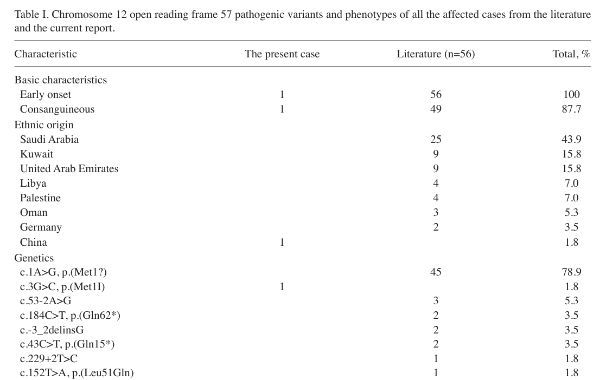

## Question

# Disease Characteristics Research Template

## Target Disease
- **Disease Name:** Temtamy Syndrome
- **MONDO ID:**  (if available)
- **Category:** Mendelian

## Research Objectives

Please provide a comprehensive research report on **Temtamy Syndrome** covering all of the
disease characteristics listed below. This report will be used to populate a disease knowledge
base entry. Be thorough and cite primary literature (PMID preferred) for all claims.

For each section, **suggested databases/resources** are listed. These are the first places
you should search for information on each topic.

---

### 1. Disease Information
> **Search first:** OMIM, Orphanet, ICD-10/ICD-11, MeSH, PubMed

- What is the disease? Provide a concise overview.
- What are the key identifiers? (OMIM, Orphanet, ICD-10/ICD-11, MeSH, Mondo)
- What are the common synonyms and alternative names?
- Is the information derived from individual patients (e.g., EHR) or aggregated disease-level resources?

### 2. Etiology

- **Disease Causal Factors**: What are the primary causes? (genetic, environmental, infectious, mechanistic)
- **Risk Factors**:
  > **Search first:** PubMed, Cochrane Library, UpToDate, clinical guidelines, ClinVar, ClinGen, GWAS Catalog, PheGenI, CTD, CDC, WHO, epidemiological databases
  - Genetic risk factors (causal variants, susceptibility loci, modifier genes)
  - Environmental risk factors (toxins, lifestyle, occupational exposures, age, sex, family history)
- **Protective Factors**:
  > **Search first:** PubMed, Cochrane Library, clinical trial databases, GWAS Catalog, gnomAD, WHO, CDC, nutrition databases
  - Genetic protective factors (protective variants, modifier alleles)
  - Environmental protective factors (diet, lifestyle, exposures that reduce risk)
- **Gene-Environment Interactions**: How do genetic and environmental factors interact to influence disease?
  > **Search first:** CTD, PubMed, PheGenI, GxE databases

### 3. Phenotypes
> **Search first:** HPO (Human Phenotype Ontology), OMIM, Orphanet, PubMed, clinicaltrials.gov, MedDRA, SNOMED CT, DECIPHER, LOINC

For each phenotype, provide:
- **Phenotype type**: symptoms, clinical signs, physical manifestations, behavioral changes, or laboratory abnormalities
  > For symptoms/signs: HPO, OMIM, Orphanet, PubMed
  > For behavioral changes: HPO, DSM, RDoC (Research Domain Criteria), PubMed
  > For laboratory abnormalities: LOINC, SNOMED CT, LabTests Online, PubMed
- **Phenotype characteristics**:
  > **Search first:** OMIM, Orphanet, HPO, PubMed
  - Age of symptom onset (neonatal, childhood, adult-onset, late-onset)
  - Symptom severity (mild, moderate, severe, variable)
  - Symptom progression (stable, progressive, episodic, fluctuating)
  - Frequency among affected individuals (percentage or qualitative)
- **Quality of life impact**: Effects on daily functioning and well-being (per-phenotype when possible)
  > **Search first:** EQ-5D database, SF-36, WHO QOL databases, PubMed
- Suggest HPO (Human Phenotype Ontology) terms for each phenotype

### 4. Genetic/Molecular Information

- **Causal Genes**: Gene mutations or chromosomal abnormalities responsible for disease (gene symbols, OMIM IDs)
  > **Search first:** OMIM, ClinVar, HGMD, Ensembl, NCBI Gene
- **Pathogenic Variants**:
  - Affected genes (gene symbols, HGNC IDs)
    > **Search first:** OMIM, NCBI Gene, Ensembl, HGNC, UniProt, GeneCards
  - Variant classification (pathogenic, likely pathogenic, VUS per ACMG/AMP guidelines)
    > **Search first:** ClinVar, ClinGen, ACMG/AMP guidelines, VarSome
  - Variant type/class (missense, frameshift, nonsense, splice-site, structural)
  - Allele frequency in population databases
    > **Search first:** gnomAD, 1000 Genomes, ExAC, TOPMed, dbSNP
  - Somatic vs germline origin
    > **Search first:** COSMIC (somatic), ClinVar, ICGC, TCGA
  - Functional consequences (loss of function, gain of function, dominant negative)
- **Modifier Genes**: Genes that modify disease severity or expression
- **Epigenetic Information**: DNA methylation, histone modifications, chromatin changes affecting disease
  > **Search first:** ENCODE, Roadmap Epigenomics, MethBase, DiseaseMeth
- **Chromosomal Abnormalities**: Large-scale genetic changes (aneuploidy, translocations, inversions)
  > **Search first:** DECIPHER, ClinVar, ECARUCA, UCSC Genome Browser

### 5. Environmental Information

- **Environmental Factors**: Non-genetic contributing factors (toxins, radiation, pollution, occupational exposure)
  > **Search first:** CTD (Comparative Toxicogenomics Database), TOXNET, PubMed, EPA databases
- **Lifestyle Factors**: Behavioral factors (smoking, diet, exercise, alcohol consumption)
  > **Search first:** CDC databases, WHO, PubMed, NHANES
- **Infectious Agents**: If applicable, pathogens causing or triggering disease (bacteria, viruses, fungi, parasites)
  > **Search first:** NCBI Taxonomy, ViPR, BV-BRC, MicrobeDB, GIDEON

### 6. Mechanism / Pathophysiology

- **Molecular Pathways**: Specific signaling cascades or biochemical pathways involved (Wnt, MAPK, mTOR, PI3K-AKT, etc.)
  > **Search first:** KEGG, Reactome, WikiPathways, PathBank, BioCyc
- **Cellular Processes**: Cell-level mechanisms (apoptosis, autophagy, cell cycle dysregulation, inflammation, etc.)
  > **Search first:** Gene Ontology (GO), Reactome, KEGG, PubMed
- **Protein Dysfunction**: How protein structure or function is altered (misfolding, aggregation, loss of function, gain of function)
  > **Search first:** UniProt, PDB (Protein Data Bank), InterPro, Pfam, AlphaFold
- **Metabolic Changes**: Alterations in metabolic processes (energy metabolism, lipid metabolism, amino acid metabolism)
  > **Search first:** KEGG, BioCyc, HMDB (Human Metabolome Database), BRENDA
- **Immune System Involvement**: Role of immune response (autoimmunity, immunodeficiency, chronic inflammation)
  > **Search first:** ImmPort, Immunome Database, IEDB, Gene Ontology
- **Tissue Damage Mechanisms**: How tissues/ are injured (oxidative stress, ischemia, fibrosis, necrosis)
  > **Search first:** PubMed, Gene Ontology, Reactome
- **Biochemical Abnormalities**: Specific molecular defects (enzyme deficiencies, receptor dysfunction, ion channel defects)
  > **Search first:** BRENDA, UniProt, KEGG, OMIM, PubMed
- **Epigenetic Changes**: DNA methylation, histone modifications affecting gene expression in disease
  > **Search first:** ENCODE, Roadmap Epigenomics, MethBase, DiseaseMeth
- **Molecular Profiling** (if available):
  - Transcriptomics/gene expression changes
    > **Search first:** GEO (Gene Expression Omnibus), ArrayExpress, GTEx, Human Cell Atlas, SRA
  - Proteomics findings
    > **Search first:** PRIDE, ProteomeXchange, Human Protein Atlas, STRING, BioGRID
  - Metabolomics signatures
    > **Search first:** MetaboLights, Metabolomics Workbench, HMDB, METLIN
  - Lipidomics alterations
    > **Search first:** LIPID MAPS, SwissLipids, LipidHome, Metabolomics Workbench
  - Genomic structural features
    > **Search first:** UCSC Genome Browser, Ensembl, NCBI, dbVar, DGV
- **Advanced Technologies** (if applicable):
  - Single-cell analysis findings (cell-type specific mechanisms, cellular heterogeneity)
    > **Search first:** Human Cell Atlas, Single Cell Portal, GEO, CELLxGENE
  - Spatial transcriptomics findings
    > **Search first:** GEO, Spatial Research, Vizgen, 10x Genomics data
  - Multi-omics integration results
    > **Search first:** TCGA, ICGC, cBioPortal, LinkedOmics, PubMed
  - Functional genomics screens (CRISPR, RNAi)
    > **Search first:** DepMap, GenomeRNAi, PubMed, BioGRID ORCS

For each mechanism, describe:
- The causal chain from initial trigger to clinical manifestation
- Which mechanisms are upstream vs downstream
- What cell types and biological processes are involved
- Suggest GO terms for biological processes and CL terms for cell types

### 7. Anatomical Structures Affected

- **Organ Level**:
  - Primary organs directly affected
  - Secondary organ involvement (complications, secondary effects)
  - Body systems involved (cardiovascular, nervous, digestive, respiratory, endocrine, etc.)
  > **Search first:** Uberon, FMA (Foundational Model of Anatomy), OMIM, HPO, ICD-11, MeSH, SNOMED CT
- **Tissue and Cell Level**:
  - Specific tissue types affected (epithelial, connective, muscle, nervous)
  - Specific cell populations targeted (with Cell Ontology terms)
  > **Search first:** Uberon, Human Protein Atlas, Cell Ontology, Human Cell Atlas, CellMarker, PanglaoDB
- **Subcellular Level**:
  - Cellular compartments involved (mitochondria, nucleus, ER, lysosomes) (with GO Cellular Component terms)
  > **Search first:** Gene Ontology (Cellular Component), UniProt, Human Protein Atlas
- **Localization**:
  - Specific anatomical sites (with UBERON terms)
    > **Search first:** FMA, Uberon, NeuroNames (for brain), SNOMED CT
  - Lateralization (unilateral, bilateral, asymmetric)
    > **Search first:** HPO, clinical literature, imaging databases

### 8. Temporal Development

- **Onset**:
  - Typical age of onset (congenital, pediatric, adult, geriatric)
  - Onset pattern (acute, subacute, chronic, insidious)
  > **Search first:** OMIM, Orphanet, HPO, PubMed
- **Progression**:
  - Disease stages (early, intermediate, advanced, end-stage)
    > **Search first:** Cancer Staging Manual (AJCC), WHO classifications, PubMed
  - Progression rate (rapid, slow, variable)
  - Disease course pattern (episodic, relapsing-remitting, progressive, stable)
  - Disease duration (self-limited, chronic lifelong)
  > **Search first:** Disease registries, longitudinal cohort databases, natural history studies, PubMed, Orphanet, OMIM
- **Patterns**:
  - Remission patterns (spontaneous, treatment-induced)
    > **Search first:** Clinical trial databases, disease registries, PubMed
  - Critical periods (time windows of vulnerability or opportunity for intervention)
    > **Search first:** PubMed, developmental biology databases, clinical guidelines

### 9. Inheritance and Population

- **Epidemiology**:
  - Prevalence (cases per 100,000 at given time)
  - Incidence (new cases per 100,000 per year)
  > **Search first:** Orphanet, CDC, WHO, GBD (Global Burden of Disease), national registries, SEER, disease registries
- **For Genetic Etiology**:
  - Inheritance pattern (AD, AR, X-linked, mitochondrial, multifactorial, polygenic)
    > **Search first:** OMIM, Orphanet, ClinVar, GTR (Genetic Testing Registry)
  - Penetrance (complete, incomplete, age-dependent)
    > **Search first:** ClinVar, OMIM, PubMed, ClinGen
  - Expressivity (variable, consistent)
    > **Search first:** OMIM, ClinVar, PubMed
  - Genetic anticipation (increasing severity in successive generations)
    > **Search first:** OMIM, PubMed (especially for repeat expansion disorders)
  - Germline mosaicism
    > **Search first:** ClinVar, OMIM, genetic counseling literature, PubMed
  - Founder effects (population-specific mutations)
    > **Search first:** gnomAD, population genetics databases, PubMed
  - Consanguinity role
    > **Search first:** OMIM, population studies, genetic counseling resources
  - Carrier frequency
    > **Search first:** gnomAD, carrier screening databases, GeneReviews, GTR
- **Population Demographics**:
  - Affected populations (ethnic or demographic groups with higher prevalence)
    > **Search first:** gnomAD, 1000 Genomes, PAGE Study, PubMed, population registries
  - Geographic distribution (endemic areas, regional variation)
    > **Search first:** WHO, CDC, GBD, Orphanet, geographic epidemiology databases
  - Geographic distribution of specific variants
  - Sex ratio (male:female)
    > **Search first:** Disease registries, OMIM, PubMed, epidemiological databases
  - Age distribution of affected individuals
    > **Search first:** CDC, disease registries, SEER, Orphanet

### 10. Diagnostics

- **Clinical Tests**:
  - Laboratory tests (blood, urine, tissue chemistry, specific enzyme assays)
    > **Search first:** LOINC, LabTests Online, PubMed
  - Biomarkers (proteins, metabolites, genetic markers, circulating biomarkers)
    > **Search first:** FDA Biomarker List, BEST (Biomarkers, EndpointS, and other Tools), PubMed
  - Imaging studies (X-ray, CT, MRI, PET, ultrasound)
    > **Search first:** RadLex, DICOM, Radiopaedia, imaging databases
  - Functional tests (pulmonary function, cardiac stress tests)
    > **Search first:** LOINC, clinical guidelines, PubMed
  - Electrophysiology (EEG, EMG, ECG, nerve conduction studies)
    > **Search first:** LOINC, clinical neurophysiology databases, PubMed
  - Biopsy findings (histopathology, immunohistochemistry)
    > **Search first:** SNOMED CT, College of American Pathologists resources, PubMed
  - Pathology findings (microscopic examination)
    > **Search first:** SNOMED CT, Digital Pathology databases, PubMed
- **Genetic Testing**:
  > **Search first:** GTR (Genetic Testing Registry), GeneReviews, ClinGen
  - Overview of recommended genetic testing approach
  - Whole genome sequencing (WGS) utility
    > **Search first:** GTR, ClinVar, GEL (Genomics England), gnomAD
  - Whole exome sequencing (WES) utility
    > **Search first:** GTR, ClinVar, OMIM, GeneMatcher
  - Gene panels (which panels, which genes)
    > **Search first:** GTR, ClinVar, laboratory-specific databases
  - Single gene testing
    > **Search first:** GTR, ClinVar, OMIM, GeneReviews
  - Chromosomal microarray (CMA)
    > **Search first:** DECIPHER, ClinVar, dbVar, ECARUCA
  - Karyotyping
    > **Search first:** Chromosome Abnormality Database, ClinVar, cytogenetics resources
  - FISH
    > **Search first:** ClinVar, cytogenetics databases, PubMed
  - Mitochondrial DNA testing
    > **Search first:** MITOMAP, MSeqDR, ClinVar, GTR
  - Repeat expansion testing
    > **Search first:** GTR, ClinVar, repeat expansion databases, PubMed
- **Omics-Based Diagnostics** (if applicable):
  - RNA sequencing / transcriptomics
    > **Search first:** GEO, ArrayExpress, GTEx, RNA-seq databases
  - Proteomics
    > **Search first:** PRIDE, ProteomeXchange, FDA Biomarker database
  - Metabolomics
    > **Search first:** MetaboLights, Metabolomics Workbench, HMDB
  - Epigenomics
    > **Search first:** GEO, ENCODE, Roadmap Epigenomics, MethBase
  - Liquid biopsy
    > **Search first:** COSMIC, ClinVar, liquid biopsy databases, PubMed
- **Clinical Criteria**:
  - Standardized diagnostic criteria (DSM, ICD, society guidelines)
    > **Search first:** DSM-5, ICD-11, clinical society guidelines, UpToDate
  - Differential diagnosis (other conditions to rule out, with distinguishing features)
    > **Search first:** DynaMed, UpToDate, clinical decision support systems
- **Screening**:
  - Screening methods for asymptomatic individuals (newborn screening, carrier screening, cascade screening)
    > **Search first:** ACMG recommendations, CDC newborn screening, GTR

### 11. Outcome/Prognosis

- **Survival and Mortality**:
  - Survival rate (5-year, 10-year, overall)
    > **Search first:** SEER, cancer registries, disease-specific registries, PubMed
  - Life expectancy (with and without treatment if applicable)
    > **Search first:** Orphanet, disease registries, actuarial databases, PubMed
  - Mortality rate
    > **Search first:** CDC, WHO, GBD, national mortality databases
  - Disease-specific mortality (deaths directly attributable to disease)
    > **Search first:** Disease registries, CDC Wonder, GBD, PubMed
- **Morbidity and Function**:
  - Morbidity (disease-related disability and health impacts)
    > **Search first:** GBD, WHO, disability databases, PubMed
  - Disability outcomes (long-term functional impairments)
    > **Search first:** ICF (International Classification of Functioning), disability registries
  - Quality of life measures (EQ-5D, SF-36, PROMIS, disease-specific tools)
    > **Search first:** EQ-5D database, SF-36, PROMIS, PubMed
- **Disease Course**:
  - Complications (secondary problems: infections, organ failure, etc.)
    > **Search first:** ICD codes, disease registries, clinical databases, PubMed
  - Recovery potential (likelihood and extent of recovery, with vs without treatment)
    > **Search first:** Natural history studies, rehabilitation databases, PubMed
- **Prediction**:
  - Prognostic factors (age, disease severity, biomarkers, treatment response)
    > **Search first:** Prognostic models databases, clinical calculators, PubMed
  - Prognostic biomarkers (molecular markers predicting disease course)
    > **Search first:** FDA Biomarker database, PubMed, cancer prognostic databases

### 12. Treatment

- **Pharmacotherapy**:
  - Pharmacological treatments (drug names, drug classes, mechanisms of action)
    > **Search first:** DrugBank, RxNorm, ATC classification, DailyMed, FDA databases
  - Pharmacogenomics (how genetic variants affect drug metabolism, efficacy, toxicity)
    > **Search first:** PharmGKB, CPIC (Clinical Pharmacogenetics), FDA Table of PGx Biomarkers
- **Advanced Therapeutics**:
  - Gene therapy (viral vectors, CRISPR, gene replacement, gene editing)
    > **Search first:** ClinicalTrials.gov, FDA gene therapy database, ASGCT resources
  - Cell therapy (stem cell transplant, CAR-T, cellular therapeutics)
    > **Search first:** ClinicalTrials.gov, FDA cell therapy database, FACT standards
  - RNA-based therapies (ASOs, siRNA, mRNA therapies)
    > **Search first:** ClinicalTrials.gov, FDA approvals, PubMed
  - Targeted therapies (treatments directed at specific molecular targets)
    > **Search first:** My Cancer Genome, OncoKB, ClinicalTrials.gov, FDA approvals
  - Immunotherapies (checkpoint inhibitors, monoclonal antibodies)
    > **Search first:** Cancer Immunotherapy Database, FDA approvals, ClinicalTrials.gov
- **Surgical and Interventional**:
  - Surgical interventions (types of surgery, timing, outcomes)
    > **Search first:** CPT codes, surgical registries, clinical guidelines, PubMed
- **Supportive and Rehabilitative**:
  - Supportive care (symptom management, pain control, nutrition)
    > **Search first:** Clinical guidelines, Cochrane Library, PubMed
  - Rehabilitation (physical therapy, occupational therapy, speech therapy)
    > **Search first:** Rehabilitation medicine databases, clinical guidelines, PubMed
- **Experimental**:
  - Experimental treatments in clinical trials (with NCT identifiers if available)
    > **Search first:** ClinicalTrials.gov, EU Clinical Trials Register, WHO ICTRP
- **Treatment Outcomes**:
  - Treatment response rates
    > **Search first:** Clinical trial databases, FDA reviews, systematic reviews, PubMed
  - Side effects and adverse events
    > **Search first:** FDA Adverse Event Reporting System (FAERS), MedWatch, PubMed
- **Treatment Strategy**:
  - Treatment algorithms (clinical pathways, decision trees)
    > **Search first:** Clinical practice guidelines, NCCN Guidelines, UpToDate
  - Combination therapies
    > **Search first:** ClinicalTrials.gov, treatment guidelines, PubMed
  - Personalized medicine approaches (genotype-guided treatment)
    > **Search first:** My Cancer Genome, CIViC, PharmGKB, precision medicine databases

For each treatment, suggest MAXO (Medical Action Ontology) terms where applicable.

### 13. Prevention

- **Prevention Levels**:
  - Primary prevention (preventing disease occurrence: vaccination, risk factor modification)
    > **Search first:** CDC, WHO, USPSTF recommendations, Cochrane Library
  - Secondary prevention (early detection and treatment: screening programs, early intervention)
    > **Search first:** USPSTF, CDC screening guidelines, WHO
  - Tertiary prevention (preventing complications in those with disease)
    > **Search first:** Clinical guidelines, disease management protocols, PubMed
- **Immunization**: Vaccine strategies (if applicable)
  > **Search first:** CDC vaccine schedules, WHO immunization, FDA vaccine database
- **Screening and Early Detection**:
  - Screening programs (population-based: newborn screening, cancer screening)
    > **Search first:** CDC screening programs, USPSTF, cancer screening databases
  - Genetic screening (carrier screening, preimplantation genetic diagnosis, prenatal testing)
    > **Search first:** ACMG recommendations, ACOG guidelines, GTR
  - Risk stratification (identifying high-risk individuals for targeted prevention)
    > **Search first:** Risk prediction models, clinical calculators, PubMed
- **Behavioral Interventions**: Lifestyle modifications to reduce risk
  > **Search first:** CDC, WHO, behavioral intervention databases, Cochrane Library
- **Counseling**: Genetic counseling (risk assessment, family planning guidance)
  > **Search first:** NSGC resources, ACMG guidelines, GeneReviews
- **Public Health**:
  - Public health interventions (sanitation, vector control, health education)
    > **Search first:** CDC, WHO, public health databases, PubMed
  - Environmental interventions (reducing environmental risk factors)
    > **Search first:** EPA databases, WHO environmental health, PubMed
- **Prophylaxis**: Preventive medications or procedures
  > **Search first:** Clinical guidelines, FDA approvals, PubMed

### 14. Other Species / Natural Disease

- **Taxonomy**: Species affected (with NCBI Taxon identifiers)
  > **Search first:** NCBI Taxonomy
- **Breed**: Specific breeds affected (with VBO identifiers if applicable)
  > **Search first:** VBO (Vertebrate Breed Ontology)
- **Gene**: Orthologous genes in other species (with NCBI Gene IDs)
  > **Search first:** NCBI Gene
- **Natural Disease**:
  - Naturally occurring disease in other species (companion animals, wildlife)
    > **Search first:** OMIA (Online Mendelian Inheritance in Animals), VetCompass, PubMed
  - Veterinary relevance and importance in animal health
    > **Search first:** OMIA, veterinary databases, PubMed
- **Comparative Biology**:
  - Comparative pathology (similarities and differences across species)
    > **Search first:** OMIA, comparative pathology databases, PubMed
  - Evolutionary conservation of disease mechanisms
    > **Search first:** HomoloGene, OrthoMCL, Alliance of Genome Resources
- **Transmission** (if applicable):
  - Zoonotic potential
    > **Search first:** CDC zoonotic diseases, WHO zoonoses, GIDEON
  - Cross-species susceptibility
    > **Search first:** NCBI Taxonomy, veterinary databases, PubMed

### 15. Model Organisms

- **Model Types**:
  - Model organism type (mammalian, invertebrate, cellular, in vitro)
    > **Search first:** Alliance of Genome Resources, model organism databases
  - Specific model systems (mouse, rat, zebrafish, Drosophila, C. elegans, yeast, cell lines, organoids, iPSCs)
    > **Search first:** MGI, RGD, ZFIN, FlyBase, WormBase, SGD, ATCC, Cellosaurus
  - Induced models (drug treatment, surgical intervention, environmental manipulation)
    > **Search first:** MGI, model organism databases, PubMed
- **Genetic Models**:
  - Types available (knockout, knock-in, transgenic, conditional, humanized)
    > **Search first:** MGI, IMPC, KOMP, EuMMCR, IMSR
- **Model Characteristics**:
  - Phenotype recapitulation (how well model reproduces human disease features)
    > **Search first:** Model organism databases, comparative studies, PubMed
  - Model limitations (aspects of human disease not captured)
    > **Search first:** Model organism databases, PubMed, review articles
- **Applications**:
  - Research applications (what aspects of disease can be studied)
    > **Search first:** Model organism databases, PubMed
- **Resources**:
  - Model databases
    > **Search first:** MGI, RGD, ZFIN, FlyBase, WormBase, IMSR, EMMA, MMRRC

---

## Citation Requirements

- Cite primary literature (PMID preferred) for all mechanistic and clinical claims
- Prioritize recent reviews and landmark papers
- Include direct quotes from abstracts where possible to support key statements
- Distinguish evidence source types: human clinical, model organism, in vitro, computational

## Output Format

Structure your response as a comprehensive narrative organized by the sections above.
For each section, provide:
- Factual content with specific details (numbers, percentages, gene names, variant nomenclature)
- Ontology term suggestions (HPO, GO, CL, UBERON, CHEBI, MAXO, MONDO) where applicable
- Evidence citations with PMIDs
- Direct quotes from abstracts to support key claims
- Clear indication when information is not available or not applicable for this disease

This report will be used to populate a disease knowledge base entry with:
- Pathophysiology descriptions with causal chains
- Gene/protein annotations (HGNC, GO terms)
- Phenotype associations (HP terms) with frequencies
- Cell type involvement (CL terms)
- Anatomical locations (UBERON terms)
- Chemical entities (CHEBI terms)
- Treatment annotations (MAXO terms)
- Evidence items with PMIDs and exact abstract quotes
- Epidemiology, prognosis, diagnostic, and prevention information
- Animal model descriptions with phenotype recapitulation details

## Output

Question: You are an expert researcher providing comprehensive, well-cited information.

Provide detailed information focusing on:
1. Key concepts and definitions with current understanding
2. Recent developments and latest research (prioritize 2023-2024 sources)
3. Current applications and real-world implementations
4. Expert opinions and analysis from authoritative sources
5. Relevant statistics and data from recent studies

Format as a comprehensive research report with proper citations. Include URLs and publication dates where available.
Always prioritize recent, authoritative sources and provide specific citations for all major claims.

# Disease Characteristics Research Template

## Target Disease
- **Disease Name:** Temtamy Syndrome
- **MONDO ID:**  (if available)
- **Category:** Mendelian

## Research Objectives

Please provide a comprehensive research report on **Temtamy Syndrome** covering all of the
disease characteristics listed below. This report will be used to populate a disease knowledge
base entry. Be thorough and cite primary literature (PMID preferred) for all claims.

For each section, **suggested databases/resources** are listed. These are the first places
you should search for information on each topic.

---

### 1. Disease Information
> **Search first:** OMIM, Orphanet, ICD-10/ICD-11, MeSH, PubMed

- What is the disease? Provide a concise overview.
- What are the key identifiers? (OMIM, Orphanet, ICD-10/ICD-11, MeSH, Mondo)
- What are the common synonyms and alternative names?
- Is the information derived from individual patients (e.g., EHR) or aggregated disease-level resources?

### 2. Etiology

- **Disease Causal Factors**: What are the primary causes? (genetic, environmental, infectious, mechanistic)
- **Risk Factors**:
  > **Search first:** PubMed, Cochrane Library, UpToDate, clinical guidelines, ClinVar, ClinGen, GWAS Catalog, PheGenI, CTD, CDC, WHO, epidemiological databases
  - Genetic risk factors (causal variants, susceptibility loci, modifier genes)
  - Environmental risk factors (toxins, lifestyle, occupational exposures, age, sex, family history)
- **Protective Factors**:
  > **Search first:** PubMed, Cochrane Library, clinical trial databases, GWAS Catalog, gnomAD, WHO, CDC, nutrition databases
  - Genetic protective factors (protective variants, modifier alleles)
  - Environmental protective factors (diet, lifestyle, exposures that reduce risk)
- **Gene-Environment Interactions**: How do genetic and environmental factors interact to influence disease?
  > **Search first:** CTD, PubMed, PheGenI, GxE databases

### 3. Phenotypes
> **Search first:** HPO (Human Phenotype Ontology), OMIM, Orphanet, PubMed, clinicaltrials.gov, MedDRA, SNOMED CT, DECIPHER, LOINC

For each phenotype, provide:
- **Phenotype type**: symptoms, clinical signs, physical manifestations, behavioral changes, or laboratory abnormalities
  > For symptoms/signs: HPO, OMIM, Orphanet, PubMed
  > For behavioral changes: HPO, DSM, RDoC (Research Domain Criteria), PubMed
  > For laboratory abnormalities: LOINC, SNOMED CT, LabTests Online, PubMed
- **Phenotype characteristics**:
  > **Search first:** OMIM, Orphanet, HPO, PubMed
  - Age of symptom onset (neonatal, childhood, adult-onset, late-onset)
  - Symptom severity (mild, moderate, severe, variable)
  - Symptom progression (stable, progressive, episodic, fluctuating)
  - Frequency among affected individuals (percentage or qualitative)
- **Quality of life impact**: Effects on daily functioning and well-being (per-phenotype when possible)
  > **Search first:** EQ-5D database, SF-36, WHO QOL databases, PubMed
- Suggest HPO (Human Phenotype Ontology) terms for each phenotype

### 4. Genetic/Molecular Information

- **Causal Genes**: Gene mutations or chromosomal abnormalities responsible for disease (gene symbols, OMIM IDs)
  > **Search first:** OMIM, ClinVar, HGMD, Ensembl, NCBI Gene
- **Pathogenic Variants**:
  - Affected genes (gene symbols, HGNC IDs)
    > **Search first:** OMIM, NCBI Gene, Ensembl, HGNC, UniProt, GeneCards
  - Variant classification (pathogenic, likely pathogenic, VUS per ACMG/AMP guidelines)
    > **Search first:** ClinVar, ClinGen, ACMG/AMP guidelines, VarSome
  - Variant type/class (missense, frameshift, nonsense, splice-site, structural)
  - Allele frequency in population databases
    > **Search first:** gnomAD, 1000 Genomes, ExAC, TOPMed, dbSNP
  - Somatic vs germline origin
    > **Search first:** COSMIC (somatic), ClinVar, ICGC, TCGA
  - Functional consequences (loss of function, gain of function, dominant negative)
- **Modifier Genes**: Genes that modify disease severity or expression
- **Epigenetic Information**: DNA methylation, histone modifications, chromatin changes affecting disease
  > **Search first:** ENCODE, Roadmap Epigenomics, MethBase, DiseaseMeth
- **Chromosomal Abnormalities**: Large-scale genetic changes (aneuploidy, translocations, inversions)
  > **Search first:** DECIPHER, ClinVar, ECARUCA, UCSC Genome Browser

### 5. Environmental Information

- **Environmental Factors**: Non-genetic contributing factors (toxins, radiation, pollution, occupational exposure)
  > **Search first:** CTD (Comparative Toxicogenomics Database), TOXNET, PubMed, EPA databases
- **Lifestyle Factors**: Behavioral factors (smoking, diet, exercise, alcohol consumption)
  > **Search first:** CDC databases, WHO, PubMed, NHANES
- **Infectious Agents**: If applicable, pathogens causing or triggering disease (bacteria, viruses, fungi, parasites)
  > **Search first:** NCBI Taxonomy, ViPR, BV-BRC, MicrobeDB, GIDEON

### 6. Mechanism / Pathophysiology

- **Molecular Pathways**: Specific signaling cascades or biochemical pathways involved (Wnt, MAPK, mTOR, PI3K-AKT, etc.)
  > **Search first:** KEGG, Reactome, WikiPathways, PathBank, BioCyc
- **Cellular Processes**: Cell-level mechanisms (apoptosis, autophagy, cell cycle dysregulation, inflammation, etc.)
  > **Search first:** Gene Ontology (GO), Reactome, KEGG, PubMed
- **Protein Dysfunction**: How protein structure or function is altered (misfolding, aggregation, loss of function, gain of function)
  > **Search first:** UniProt, PDB (Protein Data Bank), InterPro, Pfam, AlphaFold
- **Metabolic Changes**: Alterations in metabolic processes (energy metabolism, lipid metabolism, amino acid metabolism)
  > **Search first:** KEGG, BioCyc, HMDB (Human Metabolome Database), BRENDA
- **Immune System Involvement**: Role of immune response (autoimmunity, immunodeficiency, chronic inflammation)
  > **Search first:** ImmPort, Immunome Database, IEDB, Gene Ontology
- **Tissue Damage Mechanisms**: How tissues/ are injured (oxidative stress, ischemia, fibrosis, necrosis)
  > **Search first:** PubMed, Gene Ontology, Reactome
- **Biochemical Abnormalities**: Specific molecular defects (enzyme deficiencies, receptor dysfunction, ion channel defects)
  > **Search first:** BRENDA, UniProt, KEGG, OMIM, PubMed
- **Epigenetic Changes**: DNA methylation, histone modifications affecting gene expression in disease
  > **Search first:** ENCODE, Roadmap Epigenomics, MethBase, DiseaseMeth
- **Molecular Profiling** (if available):
  - Transcriptomics/gene expression changes
    > **Search first:** GEO (Gene Expression Omnibus), ArrayExpress, GTEx, Human Cell Atlas, SRA
  - Proteomics findings
    > **Search first:** PRIDE, ProteomeXchange, Human Protein Atlas, STRING, BioGRID
  - Metabolomics signatures
    > **Search first:** MetaboLights, Metabolomics Workbench, HMDB, METLIN
  - Lipidomics alterations
    > **Search first:** LIPID MAPS, SwissLipids, LipidHome, Metabolomics Workbench
  - Genomic structural features
    > **Search first:** UCSC Genome Browser, Ensembl, NCBI, dbVar, DGV
- **Advanced Technologies** (if applicable):
  - Single-cell analysis findings (cell-type specific mechanisms, cellular heterogeneity)
    > **Search first:** Human Cell Atlas, Single Cell Portal, GEO, CELLxGENE
  - Spatial transcriptomics findings
    > **Search first:** GEO, Spatial Research, Vizgen, 10x Genomics data
  - Multi-omics integration results
    > **Search first:** TCGA, ICGC, cBioPortal, LinkedOmics, PubMed
  - Functional genomics screens (CRISPR, RNAi)
    > **Search first:** DepMap, GenomeRNAi, PubMed, BioGRID ORCS

For each mechanism, describe:
- The causal chain from initial trigger to clinical manifestation
- Which mechanisms are upstream vs downstream
- What cell types and biological processes are involved
- Suggest GO terms for biological processes and CL terms for cell types

### 7. Anatomical Structures Affected

- **Organ Level**:
  - Primary organs directly affected
  - Secondary organ involvement (complications, secondary effects)
  - Body systems involved (cardiovascular, nervous, digestive, respiratory, endocrine, etc.)
  > **Search first:** Uberon, FMA (Foundational Model of Anatomy), OMIM, HPO, ICD-11, MeSH, SNOMED CT
- **Tissue and Cell Level**:
  - Specific tissue types affected (epithelial, connective, muscle, nervous)
  - Specific cell populations targeted (with Cell Ontology terms)
  > **Search first:** Uberon, Human Protein Atlas, Cell Ontology, Human Cell Atlas, CellMarker, PanglaoDB
- **Subcellular Level**:
  - Cellular compartments involved (mitochondria, nucleus, ER, lysosomes) (with GO Cellular Component terms)
  > **Search first:** Gene Ontology (Cellular Component), UniProt, Human Protein Atlas
- **Localization**:
  - Specific anatomical sites (with UBERON terms)
    > **Search first:** FMA, Uberon, NeuroNames (for brain), SNOMED CT
  - Lateralization (unilateral, bilateral, asymmetric)
    > **Search first:** HPO, clinical literature, imaging databases

### 8. Temporal Development

- **Onset**:
  - Typical age of onset (congenital, pediatric, adult, geriatric)
  - Onset pattern (acute, subacute, chronic, insidious)
  > **Search first:** OMIM, Orphanet, HPO, PubMed
- **Progression**:
  - Disease stages (early, intermediate, advanced, end-stage)
    > **Search first:** Cancer Staging Manual (AJCC), WHO classifications, PubMed
  - Progression rate (rapid, slow, variable)
  - Disease course pattern (episodic, relapsing-remitting, progressive, stable)
  - Disease duration (self-limited, chronic lifelong)
  > **Search first:** Disease registries, longitudinal cohort databases, natural history studies, PubMed, Orphanet, OMIM
- **Patterns**:
  - Remission patterns (spontaneous, treatment-induced)
    > **Search first:** Clinical trial databases, disease registries, PubMed
  - Critical periods (time windows of vulnerability or opportunity for intervention)
    > **Search first:** PubMed, developmental biology databases, clinical guidelines

### 9. Inheritance and Population

- **Epidemiology**:
  - Prevalence (cases per 100,000 at given time)
  - Incidence (new cases per 100,000 per year)
  > **Search first:** Orphanet, CDC, WHO, GBD (Global Burden of Disease), national registries, SEER, disease registries
- **For Genetic Etiology**:
  - Inheritance pattern (AD, AR, X-linked, mitochondrial, multifactorial, polygenic)
    > **Search first:** OMIM, Orphanet, ClinVar, GTR (Genetic Testing Registry)
  - Penetrance (complete, incomplete, age-dependent)
    > **Search first:** ClinVar, OMIM, PubMed, ClinGen
  - Expressivity (variable, consistent)
    > **Search first:** OMIM, ClinVar, PubMed
  - Genetic anticipation (increasing severity in successive generations)
    > **Search first:** OMIM, PubMed (especially for repeat expansion disorders)
  - Germline mosaicism
    > **Search first:** ClinVar, OMIM, genetic counseling literature, PubMed
  - Founder effects (population-specific mutations)
    > **Search first:** gnomAD, population genetics databases, PubMed
  - Consanguinity role
    > **Search first:** OMIM, population studies, genetic counseling resources
  - Carrier frequency
    > **Search first:** gnomAD, carrier screening databases, GeneReviews, GTR
- **Population Demographics**:
  - Affected populations (ethnic or demographic groups with higher prevalence)
    > **Search first:** gnomAD, 1000 Genomes, PAGE Study, PubMed, population registries
  - Geographic distribution (endemic areas, regional variation)
    > **Search first:** WHO, CDC, GBD, Orphanet, geographic epidemiology databases
  - Geographic distribution of specific variants
  - Sex ratio (male:female)
    > **Search first:** Disease registries, OMIM, PubMed, epidemiological databases
  - Age distribution of affected individuals
    > **Search first:** CDC, disease registries, SEER, Orphanet

### 10. Diagnostics

- **Clinical Tests**:
  - Laboratory tests (blood, urine, tissue chemistry, specific enzyme assays)
    > **Search first:** LOINC, LabTests Online, PubMed
  - Biomarkers (proteins, metabolites, genetic markers, circulating biomarkers)
    > **Search first:** FDA Biomarker List, BEST (Biomarkers, EndpointS, and other Tools), PubMed
  - Imaging studies (X-ray, CT, MRI, PET, ultrasound)
    > **Search first:** RadLex, DICOM, Radiopaedia, imaging databases
  - Functional tests (pulmonary function, cardiac stress tests)
    > **Search first:** LOINC, clinical guidelines, PubMed
  - Electrophysiology (EEG, EMG, ECG, nerve conduction studies)
    > **Search first:** LOINC, clinical neurophysiology databases, PubMed
  - Biopsy findings (histopathology, immunohistochemistry)
    > **Search first:** SNOMED CT, College of American Pathologists resources, PubMed
  - Pathology findings (microscopic examination)
    > **Search first:** SNOMED CT, Digital Pathology databases, PubMed
- **Genetic Testing**:
  > **Search first:** GTR (Genetic Testing Registry), GeneReviews, ClinGen
  - Overview of recommended genetic testing approach
  - Whole genome sequencing (WGS) utility
    > **Search first:** GTR, ClinVar, GEL (Genomics England), gnomAD
  - Whole exome sequencing (WES) utility
    > **Search first:** GTR, ClinVar, OMIM, GeneMatcher
  - Gene panels (which panels, which genes)
    > **Search first:** GTR, ClinVar, laboratory-specific databases
  - Single gene testing
    > **Search first:** GTR, ClinVar, OMIM, GeneReviews
  - Chromosomal microarray (CMA)
    > **Search first:** DECIPHER, ClinVar, dbVar, ECARUCA
  - Karyotyping
    > **Search first:** Chromosome Abnormality Database, ClinVar, cytogenetics resources
  - FISH
    > **Search first:** ClinVar, cytogenetics databases, PubMed
  - Mitochondrial DNA testing
    > **Search first:** MITOMAP, MSeqDR, ClinVar, GTR
  - Repeat expansion testing
    > **Search first:** GTR, ClinVar, repeat expansion databases, PubMed
- **Omics-Based Diagnostics** (if applicable):
  - RNA sequencing / transcriptomics
    > **Search first:** GEO, ArrayExpress, GTEx, RNA-seq databases
  - Proteomics
    > **Search first:** PRIDE, ProteomeXchange, FDA Biomarker database
  - Metabolomics
    > **Search first:** MetaboLights, Metabolomics Workbench, HMDB
  - Epigenomics
    > **Search first:** GEO, ENCODE, Roadmap Epigenomics, MethBase
  - Liquid biopsy
    > **Search first:** COSMIC, ClinVar, liquid biopsy databases, PubMed
- **Clinical Criteria**:
  - Standardized diagnostic criteria (DSM, ICD, society guidelines)
    > **Search first:** DSM-5, ICD-11, clinical society guidelines, UpToDate
  - Differential diagnosis (other conditions to rule out, with distinguishing features)
    > **Search first:** DynaMed, UpToDate, clinical decision support systems
- **Screening**:
  - Screening methods for asymptomatic individuals (newborn screening, carrier screening, cascade screening)
    > **Search first:** ACMG recommendations, CDC newborn screening, GTR

### 11. Outcome/Prognosis

- **Survival and Mortality**:
  - Survival rate (5-year, 10-year, overall)
    > **Search first:** SEER, cancer registries, disease-specific registries, PubMed
  - Life expectancy (with and without treatment if applicable)
    > **Search first:** Orphanet, disease registries, actuarial databases, PubMed
  - Mortality rate
    > **Search first:** CDC, WHO, GBD, national mortality databases
  - Disease-specific mortality (deaths directly attributable to disease)
    > **Search first:** Disease registries, CDC Wonder, GBD, PubMed
- **Morbidity and Function**:
  - Morbidity (disease-related disability and health impacts)
    > **Search first:** GBD, WHO, disability databases, PubMed
  - Disability outcomes (long-term functional impairments)
    > **Search first:** ICF (International Classification of Functioning), disability registries
  - Quality of life measures (EQ-5D, SF-36, PROMIS, disease-specific tools)
    > **Search first:** EQ-5D database, SF-36, PROMIS, PubMed
- **Disease Course**:
  - Complications (secondary problems: infections, organ failure, etc.)
    > **Search first:** ICD codes, disease registries, clinical databases, PubMed
  - Recovery potential (likelihood and extent of recovery, with vs without treatment)
    > **Search first:** Natural history studies, rehabilitation databases, PubMed
- **Prediction**:
  - Prognostic factors (age, disease severity, biomarkers, treatment response)
    > **Search first:** Prognostic models databases, clinical calculators, PubMed
  - Prognostic biomarkers (molecular markers predicting disease course)
    > **Search first:** FDA Biomarker database, PubMed, cancer prognostic databases

### 12. Treatment

- **Pharmacotherapy**:
  - Pharmacological treatments (drug names, drug classes, mechanisms of action)
    > **Search first:** DrugBank, RxNorm, ATC classification, DailyMed, FDA databases
  - Pharmacogenomics (how genetic variants affect drug metabolism, efficacy, toxicity)
    > **Search first:** PharmGKB, CPIC (Clinical Pharmacogenetics), FDA Table of PGx Biomarkers
- **Advanced Therapeutics**:
  - Gene therapy (viral vectors, CRISPR, gene replacement, gene editing)
    > **Search first:** ClinicalTrials.gov, FDA gene therapy database, ASGCT resources
  - Cell therapy (stem cell transplant, CAR-T, cellular therapeutics)
    > **Search first:** ClinicalTrials.gov, FDA cell therapy database, FACT standards
  - RNA-based therapies (ASOs, siRNA, mRNA therapies)
    > **Search first:** ClinicalTrials.gov, FDA approvals, PubMed
  - Targeted therapies (treatments directed at specific molecular targets)
    > **Search first:** My Cancer Genome, OncoKB, ClinicalTrials.gov, FDA approvals
  - Immunotherapies (checkpoint inhibitors, monoclonal antibodies)
    > **Search first:** Cancer Immunotherapy Database, FDA approvals, ClinicalTrials.gov
- **Surgical and Interventional**:
  - Surgical interventions (types of surgery, timing, outcomes)
    > **Search first:** CPT codes, surgical registries, clinical guidelines, PubMed
- **Supportive and Rehabilitative**:
  - Supportive care (symptom management, pain control, nutrition)
    > **Search first:** Clinical guidelines, Cochrane Library, PubMed
  - Rehabilitation (physical therapy, occupational therapy, speech therapy)
    > **Search first:** Rehabilitation medicine databases, clinical guidelines, PubMed
- **Experimental**:
  - Experimental treatments in clinical trials (with NCT identifiers if available)
    > **Search first:** ClinicalTrials.gov, EU Clinical Trials Register, WHO ICTRP
- **Treatment Outcomes**:
  - Treatment response rates
    > **Search first:** Clinical trial databases, FDA reviews, systematic reviews, PubMed
  - Side effects and adverse events
    > **Search first:** FDA Adverse Event Reporting System (FAERS), MedWatch, PubMed
- **Treatment Strategy**:
  - Treatment algorithms (clinical pathways, decision trees)
    > **Search first:** Clinical practice guidelines, NCCN Guidelines, UpToDate
  - Combination therapies
    > **Search first:** ClinicalTrials.gov, treatment guidelines, PubMed
  - Personalized medicine approaches (genotype-guided treatment)
    > **Search first:** My Cancer Genome, CIViC, PharmGKB, precision medicine databases

For each treatment, suggest MAXO (Medical Action Ontology) terms where applicable.

### 13. Prevention

- **Prevention Levels**:
  - Primary prevention (preventing disease occurrence: vaccination, risk factor modification)
    > **Search first:** CDC, WHO, USPSTF recommendations, Cochrane Library
  - Secondary prevention (early detection and treatment: screening programs, early intervention)
    > **Search first:** USPSTF, CDC screening guidelines, WHO
  - Tertiary prevention (preventing complications in those with disease)
    > **Search first:** Clinical guidelines, disease management protocols, PubMed
- **Immunization**: Vaccine strategies (if applicable)
  > **Search first:** CDC vaccine schedules, WHO immunization, FDA vaccine database
- **Screening and Early Detection**:
  - Screening programs (population-based: newborn screening, cancer screening)
    > **Search first:** CDC screening programs, USPSTF, cancer screening databases
  - Genetic screening (carrier screening, preimplantation genetic diagnosis, prenatal testing)
    > **Search first:** ACMG recommendations, ACOG guidelines, GTR
  - Risk stratification (identifying high-risk individuals for targeted prevention)
    > **Search first:** Risk prediction models, clinical calculators, PubMed
- **Behavioral Interventions**: Lifestyle modifications to reduce risk
  > **Search first:** CDC, WHO, behavioral intervention databases, Cochrane Library
- **Counseling**: Genetic counseling (risk assessment, family planning guidance)
  > **Search first:** NSGC resources, ACMG guidelines, GeneReviews
- **Public Health**:
  - Public health interventions (sanitation, vector control, health education)
    > **Search first:** CDC, WHO, public health databases, PubMed
  - Environmental interventions (reducing environmental risk factors)
    > **Search first:** EPA databases, WHO environmental health, PubMed
- **Prophylaxis**: Preventive medications or procedures
  > **Search first:** Clinical guidelines, FDA approvals, PubMed

### 14. Other Species / Natural Disease

- **Taxonomy**: Species affected (with NCBI Taxon identifiers)
  > **Search first:** NCBI Taxonomy
- **Breed**: Specific breeds affected (with VBO identifiers if applicable)
  > **Search first:** VBO (Vertebrate Breed Ontology)
- **Gene**: Orthologous genes in other species (with NCBI Gene IDs)
  > **Search first:** NCBI Gene
- **Natural Disease**:
  - Naturally occurring disease in other species (companion animals, wildlife)
    > **Search first:** OMIA (Online Mendelian Inheritance in Animals), VetCompass, PubMed
  - Veterinary relevance and importance in animal health
    > **Search first:** OMIA, veterinary databases, PubMed
- **Comparative Biology**:
  - Comparative pathology (similarities and differences across species)
    > **Search first:** OMIA, comparative pathology databases, PubMed
  - Evolutionary conservation of disease mechanisms
    > **Search first:** HomoloGene, OrthoMCL, Alliance of Genome Resources
- **Transmission** (if applicable):
  - Zoonotic potential
    > **Search first:** CDC zoonotic diseases, WHO zoonoses, GIDEON
  - Cross-species susceptibility
    > **Search first:** NCBI Taxonomy, veterinary databases, PubMed

### 15. Model Organisms

- **Model Types**:
  - Model organism type (mammalian, invertebrate, cellular, in vitro)
    > **Search first:** Alliance of Genome Resources, model organism databases
  - Specific model systems (mouse, rat, zebrafish, Drosophila, C. elegans, yeast, cell lines, organoids, iPSCs)
    > **Search first:** MGI, RGD, ZFIN, FlyBase, WormBase, SGD, ATCC, Cellosaurus
  - Induced models (drug treatment, surgical intervention, environmental manipulation)
    > **Search first:** MGI, model organism databases, PubMed
- **Genetic Models**:
  - Types available (knockout, knock-in, transgenic, conditional, humanized)
    > **Search first:** MGI, IMPC, KOMP, EuMMCR, IMSR
- **Model Characteristics**:
  - Phenotype recapitulation (how well model reproduces human disease features)
    > **Search first:** Model organism databases, comparative studies, PubMed
  - Model limitations (aspects of human disease not captured)
    > **Search first:** Model organism databases, PubMed, review articles
- **Applications**:
  - Research applications (what aspects of disease can be studied)
    > **Search first:** Model organism databases, PubMed
- **Resources**:
  - Model databases
    > **Search first:** MGI, RGD, ZFIN, FlyBase, WormBase, IMSR, EMMA, MMRRC

---

## Citation Requirements

- Cite primary literature (PMID preferred) for all mechanistic and clinical claims
- Prioritize recent reviews and landmark papers
- Include direct quotes from abstracts where possible to support key statements
- Distinguish evidence source types: human clinical, model organism, in vitro, computational

## Output Format

Structure your response as a comprehensive narrative organized by the sections above.
For each section, provide:
- Factual content with specific details (numbers, percentages, gene names, variant nomenclature)
- Ontology term suggestions (HPO, GO, CL, UBERON, CHEBI, MAXO, MONDO) where applicable
- Evidence citations with PMIDs
- Direct quotes from abstracts to support key claims
- Clear indication when information is not available or not applicable for this disease

This report will be used to populate a disease knowledge base entry with:
- Pathophysiology descriptions with causal chains
- Gene/protein annotations (HGNC, GO terms)
- Phenotype associations (HP terms) with frequencies
- Cell type involvement (CL terms)
- Anatomical locations (UBERON terms)
- Chemical entities (CHEBI terms)
- Treatment annotations (MAXO terms)
- Evidence items with PMIDs and exact abstract quotes
- Epidemiology, prognosis, diagnostic, and prevention information
- Animal model descriptions with phenotype recapitulation details

# Temtamy Syndrome — Disease Characteristics Research Report (Mendelian)

## Scope note / disambiguation
The label **“Temtamy syndrome”** is used in the literature for *at least two distinct Mendelian entities* with different causal genes and phenotypes: (1) **C12orf57-related Temtamy syndrome (MIM 218340)** with neurodevelopmental/brain and ocular abnormalities, and (2) **Temtamy preaxial brachydactyly syndrome (TPBS; MIM 605282)** due to **CHSY1**, a limb/digit malformation syndrome. Because the user request names only “Temtamy Syndrome” (without specifying which), this report covers **both**, while treating **C12orf57-related Temtamy syndrome (MIM 218340)** as the primary entity because it is explicitly called “Temtamy syndrome” in modern genetic case-series literature. (wang2020temtamysyndromecaused pages 1-2, li2010temtamypreaxialbrachydactyly pages 1-2)

| Entity/name | Key synonyms/description | Causal gene | Inheritance | Hallmark phenotypes | Key citations (PMID if available; otherwise context IDs) | URL | Publication year/date |
|---|---|---|---|---|---|---|---|
| Temtamy syndrome (MIM 218340) | C12orf57-related Temtamy syndrome; Temtamy syndrome of corpus callosum and ocular abnormalities; autosomal recessive syndromic developmental encephalopathy/intellectual disability with callosal and ocular anomalies | **C12orf57** | Autosomal recessive; recurrent founder-like start-codon variant reported in multiple Arab families; compound heterozygous cases also described (akizu2013wholeexomesequencingidentifies pages 2-4, platzer2014exomesequencingidentifies pages 3-5) | Global developmental delay/intellectual disability, epilepsy/seizures (often early-onset, sometimes refractory), corpus callosum hypoplasia/agenesis, autistic features, hypotonia, ocular anomalies including optic/chorioretinal coloboma or microphthalmia, dysmorphic facial features (akizu2013wholeexomesequencingidentifies pages 2-4, akizu2013wholeexomesequencingidentifies pages 5-7, platzer2014exomesequencingidentifies pages 3-5, wang2020temtamysyndromecaused pages 4-6) | Akizu et al., 2013, *Am J Hum Genet* (akizu2013wholeexomesequencingidentifies pages 2-4, akizu2013wholeexomesequencingidentifies pages 5-7); Platzer et al., 2014, *Am J Med Genet A* (platzer2014exomesequencingidentifies pages 3-5, platzer2014exomesequencingidentifies pages 2-3); Wang et al., 2020, *Exp Ther Med* (wang2020temtamysyndromecaused pages 1-2, wang2020temtamysyndromecaused pages 4-6, wang2020temtamysyndromecaused pages 2-4) | https://doi.org/10.1016/j.ajhg.2013.02.004; https://doi.org/10.1002/ajmg.a.36592; https://doi.org/10.3892/etm.2019.8183 | 2013-03; 2014-08; 2020-11 |
| Temtamy preaxial brachydactyly syndrome (TPBS; MIM 605282) | Temtamy preaxial brachydactyly syndrome; autosomal recessive syndromic brachydactyly distinct from C12orf57-related Temtamy syndrome; characterized by bilateral symmetric preaxial digital anomalies | **CHSY1** | Autosomal recessive, typically in consanguineous families (li2010temtamypreaxialbrachydactyly pages 1-2, li2010temtamypreaxialbrachydactyly pages 2-4, li2010temtamypreaxialbrachydactyly pages 4-5) | Bilateral symmetric preaxial brachydactyly, hyperphalangism/symphalangism, duplicated phalanges or metatarsals, short/deviated thumbs and halluces, syndactyly, facial dysmorphism, dental anomalies, sensorineural hearing loss, growth retardation/short stature; additional skeletal anomalies such as radio-ulnar synostosis and carpal/tarsal fusions (li2010temtamypreaxialbrachydactyly pages 1-2, li2010temtamypreaxialbrachydactyly pages 5-7, li2010temtamypreaxialbrachydactyly pages 2-4, sher2014anovelchsy1 pages 2-4, li2010temtamypreaxialbrachydactyly pages 4-5) | Li et al., 2010, *Am J Hum Genet* (li2010temtamypreaxialbrachydactyly pages 1-2, li2010temtamypreaxialbrachydactyly pages 5-7, li2010temtamypreaxialbrachydactyly pages 2-4, li2010temtamypreaxialbrachydactyly pages 4-5); Tian et al., 2010, *Am J Hum Genet* (tian2010lossofchsy1 pages 9-10); Sher & Naeem, 2014, *Eur J Med Genet* (sher2014anovelchsy1 pages 4-4, sher2014anovelchsy1 pages 2-4) | https://doi.org/10.1016/j.ajhg.2010.10.003; https://doi.org/10.1016/j.ajhg.2010.11.005; https://doi.org/10.1016/j.ejmg.2013.11.001 | 2010-12; 2010-12; 2014-01 |

*Table: This table distinguishes the two different disease entities that are often conflated under the name “Temtamy syndrome.” It contrasts their genes, inheritance, phenotypes, and supporting literature so the final report can use the correct disease concept.*

---

## Target Disease
- **Disease Name:** Temtamy syndrome
- **Category:** Mendelian (autosomal recessive in both major entities described below)
- **MONDO ID:** Not available from the retrieved sources in this run.

---

## 1. Disease Information

### 1.1 Concise overview
**C12orf57-related Temtamy syndrome (MIM 218340)** is an **extremely rare autosomal recessive** syndromic neurodevelopmental disorder characterized by **global developmental delay / intellectual disability**, **epilepsy**, frequent **corpus callosum hypoplasia/agenesis**, and variable **ocular anomalies including coloboma**, often with **autistic features**, hypotonia, and dysmorphic facial features. (wang2020temtamysyndromecaused pages 1-2, akizu2013wholeexomesequencingidentifies pages 2-4, platzer2014exomesequencingidentifies pages 3-5)

**Temtamy preaxial brachydactyly syndrome (TPBS; MIM 605282)** is an **autosomal recessive** multiple-congenital-anomaly syndrome with hallmark **bilateral symmetric preaxial brachydactyly and hyperphalangism**, frequently accompanied by hearing loss, dental anomalies, craniofacial dysmorphism, and growth retardation; it is caused by **loss-of-function mutations in CHSY1**. (li2010temtamypreaxialbrachydactyly pages 1-2, li2010temtamypreaxialbrachydactyly pages 5-7, li2010temtamypreaxialbrachydactyly pages 4-5)

### 1.2 Key identifiers and synonyms (from retrieved sources)
- **C12orf57-related Temtamy syndrome:** reported as **“Temtamy syndrome (MIM 218340)”** in case-series literature. (wang2020temtamysyndromecaused pages 1-2, alfiya2022c12orf57pathogenicvariants pages 1-3)
- **TPBS:** **“Temtamy preaxial brachydactyly syndrome (MIM 605282)”**. (li2010temtamypreaxialbrachydactyly pages 1-2)

**Common alternative names used in retrieved sources** (non-exhaustive; varies by author):
- “Temtamy syndrome of corpus callosum and ocular abnormalities” (as cited in a 2024 founder-mutation perspective). (marafi2024foundermutationsand pages 6-7)
- “Syndromic form of intellectual disability characterized by agenesis/hypoplasia of the corpus callosum, optic/chorioretinal coloboma, and intractable seizures” (used to describe C12orf57-related disease). (platzer2014exomesequencingidentifies pages 1-2)

### 1.3 Evidence types
Most available disease characterization in retrieved sources is derived from:
- **Aggregated case series / literature reviews** (e.g., compiled cohorts of 17–56+ patients) (wang2020temtamysyndromecaused pages 2-4, platzer2014exomesequencingidentifies pages 3-5)
- **Individual case reports** (e.g., a Chinese patient with a novel C12orf57 start-codon variant) (wang2020temtamysyndromecaused pages 1-2)
- **Genetic-discovery family studies** (consanguineous multiplex families) including functional assays for one recurrent allele (akizu2013wholeexomesequencingidentifies pages 2-4, akizu2013wholeexomesequencingidentifies pages 5-7)

---

## 2. Etiology

### 2.1 Disease causal factors
#### A) C12orf57-related Temtamy syndrome (MIM 218340)
- **Cause:** biallelic pathogenic variants in **C12orf57**, frequently affecting the **translation initiation codon** (start-loss). (wang2020temtamysyndromecaused pages 1-2, akizu2013wholeexomesequencingidentifies pages 2-4)
- **Inheritance:** autosomal recessive with segregation consistent with full penetrance within reported pedigrees. (wang2020temtamysyndromecaused pages 2-4, akizu2013wholeexomesequencingidentifies pages 2-4)

#### B) TPBS (MIM 605282)
- **Cause:** biallelic loss-of-function variants in **CHSY1**, encoding chondroitin synthase 1. (li2010temtamypreaxialbrachydactyly pages 1-2, li2010temtamypreaxialbrachydactyly pages 5-7)
- **Inheritance:** autosomal recessive, commonly reported in consanguineous families. (li2010temtamypreaxialbrachydactyly pages 1-2, sher2014anovelchsy1 pages 2-4)

### 2.2 Risk factors
- **Consanguinity / endogamy** is repeatedly observed in reported C12orf57 cases; in a compiled review of 56 patients, **49/56 (87.7%)** were from consanguineous families. (wang2020temtamysyndromecaused pages 2-4)
- Geographic clustering suggests population-specific recurrence (Middle East enrichment): in Wang’s 2020 review, **54/56 (96.4%)** of reported patients were from Middle Eastern countries, consistent with founder effects and ascertainment patterns. (wang2020temtamysyndromecaused pages 1-2)

### 2.3 Protective factors / gene–environment interactions
No protective alleles or gene–environment interactions were identified in the retrieved sources.

---

## 3. Phenotypes

### 3.1 C12orf57-related Temtamy syndrome: phenotype spectrum (with frequencies)
The most quantitative phenotype synthesis in retrieved sources comes from Wang 2020 (n=56 literature review) and Platzer 2014 (n=17 aggregated from 7 families). (wang2020temtamysyndromecaused pages 2-4, platzer2014exomesequencingidentifies pages 3-5)

| Clinical feature | Frequency/notes (with source and n/N) | Suggested HPO term(s) |
|---|---|---|
| Global developmental delay / developmental delay | 56/56 (100%) in literature review summarized by Wang 2020; all 17/17 had developmental delay in Platzer 2014 cohort summary (wang2020temtamysyndromecaused pages 2-4, platzer2014exomesequencingidentifies pages 3-5) | HP:0001263 Global developmental delay; HP:0001268 Mental deterioration / developmental regression not established |
| Intellectual disability, severe | Moderate-to-severe intellectual disability reported in Akizu families; severe ID in 11/11 cases with specified cognitive testing in Platzer 2014 (akizu2013wholeexomesequencingidentifies pages 2-4, platzer2014exomesequencingidentifies pages 3-5) | HP:0010864 Intellectual disability, severe |
| Epilepsy / seizures | 41/56 (73.7%) in Wang 2020 review; 41/56 (~73.2%) in Wang 2020 text; 15/17 (88%) in Platzer 2014 summary; onset by age ≤3 years in 9/9 specified cases in Platzer 2014 (wang2020temtamysyndromecaused pages 2-4, wang2020temtamysyndromecaused pages 4-6, platzer2014exomesequencingidentifies pages 3-5) | HP:0001250 Seizure; HP:0002373 EEG abnormality |
| Refractory / difficult-to-control seizures | Historically 37.5% relatively refractory and only 15.6% seizure-free in Wang 2020 review; difficult to control in 7/9 (78%) in Platzer 2014 despite multiple AED trials (wang2020temtamysyndromecaused pages 4-6, platzer2014exomesequencingidentifies pages 3-5) | HP:0001272 Cerebral seizure resistant to treatment |
| Absent or very limited speech | 41/55 (74.5%) absent speech in Wang 2020 review; 15/17 had no active speech in Platzer 2014 summary (wang2020temtamysyndromecaused pages 2-4, platzer2014exomesequencingidentifies pages 3-5) | HP:0001344 Absent speech; HP:0000750 Delayed speech and language development |
| Generalized hypotonia | 40/56 (71.9%) in Wang 2020 review; hypotonia present in Akizu families (wang2020temtamysyndromecaused pages 2-4, akizu2013wholeexomesequencingidentifies pages 2-4) | HP:0001290 Generalized hypotonia |
| Autistic behavior / autistic features | 40/55 (72.7%) in Wang 2020 review; all 10/10 affected had autistic features in Akizu families; ASD reported in 6/17 (35%) in Platzer 2014 summary (wang2020temtamysyndromecaused pages 2-4, akizu2013wholeexomesequencingidentifies pages 2-4, platzer2014exomesequencingidentifies pages 3-5) | HP:0000729 Autistic behavior |
| Corpus callosum abnormality (hypoplasia/agenesis) | ~34/54 (61.8%) in Wang 2020 review; corpus callosum absent in 3 and hypoplastic in 5 of 8 imaged in Akizu; 12/15 (80%) in Platzer 2014 summary (wang2020temtamysyndromecaused pages 4-6, akizu2013wholeexomesequencingidentifies pages 2-4, platzer2014exomesequencingidentifies pages 3-5) | HP:0001274 Agenesis of corpus callosum; HP:0002079 Hypoplasia of the corpus callosum |
| Ventriculomegaly / enlarged ventricles | 17/50 (35.3%) in Wang 2020 review; thalamic hypoplasia with enlarged V-shaped third ventricle described in Akizu families (wang2020temtamysyndromecaused pages 4-6, akizu2013wholeexomesequencingidentifies pages 2-4) | HP:0002119 Ventriculomegaly; HP:0006842 Abnormality of the third ventricle |
| Ocular anomalies, overall | 26/56 (46.4%) in Wang 2020 review (as summarized in Wang text); visual abnormalities in 4/10 in Akizu; visual impairment in 9/17 (53%) in Platzer 2014 summary (wang2020temtamysyndromecaused pages 2-4, akizu2013wholeexomesequencingidentifies pages 2-4, platzer2014exomesequencingidentifies pages 3-5) | HP:0000478 Abnormality of the eye |
| Coloboma / chorioretinal coloboma | 8/55 (14.5%) coloboma in Wang 2020 review; optic/chorioretinal coloboma in 5/17 (29%) in Platzer 2014 summary (wang2020temtamysyndromecaused pages 4-6, platzer2014exomesequencingidentifies pages 3-5) | HP:0000589 Coloboma of optic disc; HP:0000490 Chorioretinal coloboma; HP:0000486 Strabismus not specifically established |
| Dysmorphic facial features | 36/55 (66.1%) in Wang 2020 review; Wang abstract/text also notes dysmorphic craniofacial appearance as common (wang2020temtamysyndromecaused pages 4-6, wang2020temtamysyndromecaused pages 1-2) | HP:0001999 Facial dysmorphism |
| Atrial septal defect / cardiac defect | 16/55 (30.4%) atrial septal defect in Wang 2020 review; cardiac defects variably reported in case literature (wang2020temtamysyndromecaused pages 4-6) | HP:0001631 Atrial septal defect |
| Spasticity | 10/17 (59%) in Platzer 2014 summary (platzer2014exomesequencingidentifies pages 3-5) | HP:0001257 Spasticity |
| Visual impairment | 9/17 (53%) in Platzer 2014 summary; abnormal visual function in 4/10 in Akizu families (akizu2013wholeexomesequencingidentifies pages 2-4, platzer2014exomesequencingidentifies pages 3-5) | HP:0000505 Visual impairment |

*Table: This table summarizes the main reported phenotypes of C12orf57-related Temtamy syndrome using frequencies from Wang 2020 and Platzer 2014, with related HPO suggestions. It is useful for structured phenotype annotation and for comparing feature prevalence across published case series.*

**Key clinical concepts (current understanding):**
- **Neurodevelopmental impairment is universal** (developmental delay 100% in Wang review). (wang2020temtamysyndromecaused pages 2-4)
- **Epilepsy is common** (73.7% in Wang review; 88% in Platzer summary) and may be treatment-resistant in a substantial subset. (wang2020temtamysyndromecaused pages 4-6, platzer2014exomesequencingidentifies pages 3-5)
- **Brain imaging abnormalities** frequently involve the **corpus callosum**; Akizu described variable severity from hypoplasia to agenesis within and across families. (akizu2013wholeexomesequencingidentifies pages 2-4)
- **Ocular involvement** may include **coloboma** (14.5% in Wang review; 29% in Platzer summary). (wang2020temtamysyndromecaused pages 4-6, platzer2014exomesequencingidentifies pages 3-5)

### 3.2 Age of onset, progression, severity
- C12orf57-related disease is typically **early onset**. In the Platzer aggregated series, where specified, seizure onset occurred by **≤3 years** (9/9). (platzer2014exomesequencingidentifies pages 3-5)
- Severity is variable, including within families, which has been proposed to relate to hypomorphic effects of start-codon variants that reduce (rather than abolish) protein production. (akizu2013wholeexomesequencingidentifies pages 5-7)

### 3.3 TPBS: phenotype spectrum (qualitative)
TPBS has a distinct phenotype dominated by limb development anomalies:
- “**Typical preaxial brachydactyly of digits 1–3**” with **hyper- and symphalangism**, duplicated phalanges/metatarsals, and additional skeletal anomalies (radio-ulnar synostosis, carpal/tarsal fusions). (li2010temtamypreaxialbrachydactyly pages 2-4, li2010temtamypreaxialbrachydactyly pages 4-5)
- Syndromic features include facial dysmorphism, dental anomalies, growth retardation/short stature, and frequent sensorineural hearing loss. (li2010temtamypreaxialbrachydactyly pages 1-2, sher2014anovelchsy1 pages 2-4)

### 3.4 Quality-of-life impact
No standardized QoL instruments (e.g., EQ-5D, PROMIS) were identified in retrieved sources. However, the high rates of **absent speech**, **severe ID**, and **refractory seizures** indicate substantial functional impact in C12orf57-related disease. (wang2020temtamysyndromecaused pages 2-4, platzer2014exomesequencingidentifies pages 3-5)

---

## 4. Genetic / Molecular Information

### 4.1 Causal genes
- **C12orf57** (Temtamy syndrome; MIM 218340). (wang2020temtamysyndromecaused pages 1-2, akizu2013wholeexomesequencingidentifies pages 2-4)
- **CHSY1** (TPBS; MIM 605282). (li2010temtamypreaxialbrachydactyly pages 1-2)

### 4.2 Pathogenic variants (examples with evidence)
| Disease entity | Gene | Variant (c.; p.) | Variant type | Evidence/notes (founder, segregation, functional) | Reported in (paper, year) | URL |
|---|---|---|---|---|---|---|
| Temtamy syndrome (C12orf57-related) | C12orf57 | c.1A>G; p.Met1? / p.M1V | Start-loss / initiator codon variant | Homozygous in multiple consanguineous Arab families; segregated with disease under AR inheritance; absent from >1,400 exomes and ethnically matched controls in Akizu; recurrent in Arab patients and suggested founder effect; functional data show AUG→GUG can still initiate translation but with markedly reduced protein levels; 2024 ASD study again found the homozygous variant in affected brothers (akizu2013wholeexomesequencingidentifies pages 2-4, akizu2013wholeexomesequencingidentifies pages 5-7, alsarraj2024thegeneticlandscape pages 10-11, platzer2014exomesequencingidentifies pages 3-5, alfiya2022c12orf57pathogenicvariants pages 3-4) | Akizu et al., 2013; Platzer et al., 2014; Al-Sarraj et al., 2024; Alfiya et al., 2022 | https://doi.org/10.1016/j.ajhg.2013.02.004; https://doi.org/10.1002/ajmg.a.36592; https://doi.org/10.3389/fgene.2024.1363849; https://doi.org/10.1007/s12041-022-01371-0 |
| Temtamy syndrome (C12orf57-related) | C12orf57 | c.3G>C; p.Met1Ile | Start-loss / start-codon variant | Novel homozygous variant in a Chinese boy; segregated with AR inheritance and full penetrance in pedigree; predicted to abolish translation / cause loss of function; expanded ethnic spectrum beyond predominantly Middle Eastern cases (wang2020temtamysyndromecaused pages 1-2, wang2020temtamysyndromecaused pages 4-6, wang2020temtamysyndromecaused pages 2-4) | Wang et al., 2020 | https://doi.org/10.3892/etm.2019.8183 |
| Temtamy syndrome (C12orf57-related) | C12orf57 | c.184C>T; p.Gln62* | Nonsense / stop-gain | Novel nonsense allele reported in trans with c.1A>G in two siblings from nonconsanguineous German parents; compound heterozygous loss-of-function genotype confirmed by parental studies; associated with severe ID, callosal hypoplasia, chorioretinal coloboma, and intractable seizures (platzer2014exomesequencingidentifies pages 3-5, platzer2014exomesequencingidentifies pages 1-2, platzer2014exomesequencingidentifies pages 2-3) | Platzer et al., 2014 | https://doi.org/10.1002/ajmg.a.36592 |
| Temtamy syndrome (C12orf57-related) | C12orf57 | c.C43T; p.Q15X | Nonsense / stop-gain | Premature stop codon; reported as compound heterozygous with c.1A>G in a South Indian child; Sanger-confirmed in proband and parents; interpreted as truncating loss-of-function under ACMG framework (alfiya2022c12orf57pathogenicvariants pages 3-4, alfiya2022c12orf57pathogenicvariants pages 4-5) | Alfiya et al., 2022 | https://doi.org/10.1007/s12041-022-01371-0 |
| Temtamy preaxial brachydactyly syndrome (TPBS) | CHSY1 | c.14delG; p.G5AfsX30 | Frameshift | Homozygous LOF allele in TPBS families; cosegregated with autosomal recessive disease; predicted truncation / nonfunctional protein (li2010temtamypreaxialbrachydactyly pages 5-7, li2010temtamypreaxialbrachydactyly pages 4-5) | Li et al., 2010 | https://doi.org/10.1016/j.ajhg.2010.10.003 |
| Temtamy preaxial brachydactyly syndrome (TPBS) | CHSY1 | c.55-84del30; p.G19_L28del | In-frame deletion | Reported exon 1 pathogenic deletion in TPBS; part of recurrent CHSY1 loss-of-function spectrum in consanguineous families; absent from controls in original study (li2010temtamypreaxialbrachydactyly pages 1-2, li2010temtamypreaxialbrachydactyly pages 2-4, li2010temtamypreaxialbrachydactyly pages 4-5) | Li et al., 2010 | https://doi.org/10.1016/j.ajhg.2010.10.003 |
| Temtamy preaxial brachydactyly syndrome (TPBS) | CHSY1 | c.205C>T; p.Q69X | Nonsense | Protein-truncating LOF allele identified in TPBS families with AR segregation; supports CHSY1 haploinsufficiency is not mechanism, but biallelic loss is pathogenic (li2010temtamypreaxialbrachydactyly pages 1-2, li2010temtamypreaxialbrachydactyly pages 5-7, li2010temtamypreaxialbrachydactyly pages 4-5) | Li et al., 2010 | https://doi.org/10.1016/j.ajhg.2010.10.003 |
| Temtamy preaxial brachydactyly syndrome (TPBS) | CHSY1 | c.321-3C>G | Splice-site | Acceptor splice variant causing exon 2 skipping, frameshift and premature truncation; strong functional evidence for loss of function (li2010temtamypreaxialbrachydactyly pages 5-7) | Li et al., 2010 | https://doi.org/10.1016/j.ajhg.2010.10.003 |
| Temtamy preaxial brachydactyly syndrome (TPBS) | CHSY1 | c.1616C>G; p.P539R | Missense | Affects highly conserved residue in CHSY1; interpreted as deleterious and disruptive of protein function; part of pathogenic CHSY1 spectrum in TPBS (li2010temtamypreaxialbrachydactyly pages 5-7, sher2014anovelchsy1 pages 2-4) | Li et al., 2010 | https://doi.org/10.1016/j.ajhg.2010.10.003 |
| Temtamy preaxial brachydactyly syndrome (TPBS) | CHSY1 | c.1897G>A; p.D633N | Missense | Homozygous in Pakistani family; parents heterozygous carriers; absent in 100 matched controls; alters conserved Asp633 within DXD motif required for glycosyltransferase activity, supporting enzymatic loss of function (sher2014anovelchsy1 pages 4-4, sher2014anovelchsy1 pages 2-4) | Sher & Naeem, 2014 | https://doi.org/10.1016/j.ejmg.2013.11.001 |

*Table: This table summarizes key pathogenic variants reported for the two distinct entities often called Temtamy syndrome: C12orf57-related Temtamy syndrome and CHSY1-related Temtamy preaxial brachydactyly syndrome. It highlights variant class, segregation, founder evidence, and functional support using only the gathered evidence snippets.*

**Notable quantitative variant statistics (C12orf57-related):**
- In Wang’s 2020 review of 56 patients, **c.1A>G** was the most frequent reported variant (**45/56; 80.3%**). (wang2020temtamysyndromecaused pages 4-6)

**Evidence supporting loss-of-function:**
- For C12orf57 start-codon variant **c.1A>G**, Akizu showed the mutant AUG→GUG start can still initiate translation but produces **markedly reduced protein levels**, consistent with a loss-of-function/hypomorphic mechanism. (akizu2013wholeexomesequencingidentifies pages 5-7)

### 4.3 Modifier genes / epigenetic information
No modifier genes or epigenetic mechanisms specific to Temtamy syndrome were identified in retrieved sources.

### 4.4 Chromosomal abnormalities (Temtamy-like)
A 2003 report described a **Temtamy-like phenotype** (callosal agenesis, colobomas, profound ID, hearing loss) with a **de novo balanced translocation t(2;9)(p24;q32)**, highlighting historical locus-mapping approaches and the possibility of chromosomal disruption in Temtamy-like presentations. (talisetti2003temtamy‐likesyndromeassociated pages 1-3)

---

## 5. Environmental Information
No environmental, lifestyle, toxicant, or infectious causal factors were identified in the retrieved sources. These syndromes are primarily genetic. (wang2020temtamysyndromecaused pages 1-2, li2010temtamypreaxialbrachydactyly pages 1-2)

---

## 6. Mechanism / Pathophysiology

### 6.1 C12orf57-related Temtamy syndrome (proposed mechanism; limited mechanistic detail available)
**Causal chain (supported components):**
1. **Biallelic C12orf57 variants** (often start-loss) →
2. **Reduced C12orf57 protein levels** (experimental evidence for c.1A>G) and cytoplasmic localization of the protein →
3. Disrupted neurodevelopmental processes required for corpus callosum development and broader brain development →
4. Clinical manifestations: callosal hypoplasia/agenesis, seizures/epilepsy, developmental delay/ID, autistic features, and ocular anomalies. (akizu2013wholeexomesequencingidentifies pages 5-7, akizu2013wholeexomesequencingidentifies pages 2-4)

**Functional notes:**
- Akizu found the major neural transcript to be highly enriched in fetal brain and concluded the gene is “required for development of the human corpus callosum,” but molecular pathways remain poorly defined. (akizu2013wholeexomesequencingidentifies pages 5-7, akizu2013wholeexomesequencingidentifies pages 1-2)
- A 2024 cerebral organoid/ribosome study (preprint) described C12orf57 as “an important factor for early brain development” and noted that its mRNA contains a **TOP-like element**, making its translation sensitive to ribosome availability and global translation state; this is a mechanistic clue at the level of translational regulation rather than disease-specific causation. (ni2024aninappropriatedecline pages 13-17)

**Suggested GO / CL terms (hypothesis-generating; not explicitly asserted in sources):**
- GO (process): corpus callosum development; regulation of translation; neurogenesis.
- CL (cell types, based on organoid discussion): radial glia / neural progenitor cells (mentioned as impacted in organoid study). (ni2024aninappropriatedecline pages 13-17)

### 6.2 TPBS (CHSY1) mechanism: chondroitin sulfate biosynthesis with BMP/NOTCH crosstalk
**Causal chain (supported components):**
1. **Biallelic CHSY1 loss-of-function** →
2. Impaired **chondroitin sulfate biosynthesis** (CHSY1 provides enzymatic activities needed to build CS repeating disaccharides) →
3. Perturbed extracellular matrix/proteoglycan-mediated developmental signaling and morphogenesis →
4. Limb/digit, craniofacial, and inner-ear developmental anomalies consistent with TPBS. (li2010temtamypreaxialbrachydactyly pages 5-7)

**Pathways and processes:**
- **BMP signaling:** CHSY1/chsy1 is described as a “potential target of BMP signaling,” with zebrafish data indicating BMP signaling negatively regulates chsy1 expression and BMP pathway perturbations phenocopy chsy1 knockdown. (li2010temtamypreaxialbrachydactyly pages 5-7, li2010temtamypreaxialbrachydactyly pages 1-2)
- **NOTCH signaling:** A separate 2010 study proposed that CHSY1 inhibits NOTCH extracellularly via a Fringe domain and that loss leads to **increased Notch signaling** (e.g., jag2 upregulation; lim1 silencing) contributing to abnormal ossification/patterning. (tian2010lossofchsy1 pages 9-10, tian2010lossofchsy1 pages 8-9)

**Suggested GO / CL / pathway terms (supported directionally by the above):**
- GO (process): glycosaminoglycan biosynthetic process; cartilage development; limb development; Notch signaling pathway; BMP signaling pathway.
- CL (cell types): chondrocytes; inner-ear sensory epithelium/hair-cell–adjacent epithelium (zebrafish expression in chondrocytes and inner ear). (li2010temtamypreaxialbrachydactyly pages 5-7)

---

## 7. Anatomical Structures Affected

### C12orf57-related Temtamy syndrome
- **CNS:** corpus callosum (hypoplasia/agenesis), thalamic/ventricular abnormalities described in family studies. (akizu2013wholeexomesequencingidentifies pages 2-4)
  - Suggested UBERON: corpus callosum; thalamus; lateral ventricle; third ventricle.
- **Eye:** optic/chorioretinal coloboma and other ocular anomalies. (platzer2014exomesequencingidentifies pages 3-5, wang2020temtamysyndromecaused pages 4-6)
  - Suggested UBERON: retina; choroid; optic nerve.
- **Heart:** atrial septal defects reported in an aggregated case review. (wang2020temtamysyndromecaused pages 4-6)

### TPBS (CHSY1)
- **Limbs/digits:** preaxial digits 1–3 (hands/feet), metacarpals/metatarsals, carpal/tarsal bones. (li2010temtamypreaxialbrachydactyly pages 4-5)
- **Auditory system:** sensorineural hearing impairment is frequent. (li2010temtamypreaxialbrachydactyly pages 4-5)

---

## 8. Temporal Development

### C12orf57-related Temtamy syndrome
- **Onset:** congenital/infancy presentation with developmental delay; seizures typically begin in early childhood and may start in infancy. (wang2020temtamysyndromecaused pages 1-2, platzer2014exomesequencingidentifies pages 3-5)
- **Course:** chronic lifelong neurodevelopmental disability; seizure control is variable, with a substantial refractory subset. (wang2020temtamysyndromecaused pages 4-6, platzer2014exomesequencingidentifies pages 3-5)

### TPBS
- **Onset:** congenital limb malformations are present at birth (by definition of brachydactyly/hyperphalangism syndrome). (li2010temtamypreaxialbrachydactyly pages 1-2)

---

## 9. Inheritance and Population

### C12orf57-related Temtamy syndrome
- **Inheritance:** autosomal recessive with frequent consanguinity. (akizu2013wholeexomesequencingidentifies pages 2-4, wang2020temtamysyndromecaused pages 2-4)
- **Founder effect:** Platzer explicitly states that the recurrent **c.1A>G (p.Met1?)** observed in Arab-descent patients “strongly suggests a founder effect within the Arab population.” (platzer2014exomesequencingidentifies pages 3-5)
- **Epidemiology:** prevalence/incidence not available in retrieved sources. However, case aggregation provides a minimal evidence base:
  - Wang 2020 summarized **56** reported patients with C12orf57 pathogenic variants at that time. (wang2020temtamysyndromecaused pages 2-4)
  - Platzer 2014 summarized **17** patients from **7 families** (as-of their publication). (platzer2014exomesequencingidentifies pages 3-5)

### TPBS
- **Inheritance:** autosomal recessive. (li2010temtamypreaxialbrachydactyly pages 1-2)
- **Epidemiology:** not available in retrieved sources.

---

## 10. Diagnostics

### 10.1 Clinical evaluation (C12orf57-related)
Common diagnostic components described across reports include:
- **Neurologic assessment and EEG** for seizures. (wang2020temtamysyndromecaused pages 1-2, talisetti2003temtamy‐likesyndromeassociated pages 1-3)
- **Brain MRI** to assess corpus callosum and ventricles. (wang2020temtamysyndromecaused pages 1-2, akizu2013wholeexomesequencingidentifies pages 2-4)
- **Ophthalmologic evaluation** for coloboma/microphthalmia. (wang2020temtamysyndromecaused pages 4-6, talisetti2003temtamy‐likesyndromeassociated pages 1-3)
- **Cardiac evaluation** (e.g., ASD/VSD) when indicated. (wang2020temtamysyndromecaused pages 4-6)

### 10.2 Genetic testing
- **Whole-exome sequencing (WES)** is repeatedly used to identify causal C12orf57 variants in affected children and families, with segregation analysis by Sanger sequencing. (wang2020temtamysyndromecaused pages 2-4, akizu2013wholeexomesequencingidentifies pages 2-4)
- A representative filtering/interpretation pipeline (depth thresholds, population frequency filters, in silico predictors, Sanger confirmation) is described in Wang 2020. (wang2020temtamysyndromecaused pages 2-4)

### 10.3 Differential diagnosis
Not comprehensively addressed in retrieved sources; however, historical “Temtamy-like” reports stress that overlapping syndromes with corpus callosum agenesis and ocular colobomas exist, and chromosomal abnormalities can produce similar phenotypes. (talisetti2003temtamy‐likesyndromeassociated pages 1-3)

---

## 11. Outcome / Prognosis

### C12orf57-related Temtamy syndrome
- Quantitative outcome data are limited, but severe neurodevelopmental impairment is common: severe ID in **11/11** where specified in Platzer’s cohort summary and absent speech in a majority. (platzer2014exomesequencingidentifies pages 3-5)
- Seizure prognosis is variable: Wang 2020 cites a substantial refractory proportion and a relatively small seizure-free fraction in historical cases. (wang2020temtamysyndromecaused pages 4-6)

No survival curves or life expectancy estimates were identified in retrieved sources.

---

## 12. Treatment

### 12.1 Pharmacotherapy
- **Antiseizure medications** are the primary disease-directed therapy described. In a single C12orf57-related case report, oxcarbazepine dosing was escalated and the child was reported “seizure-free for 1 month” during follow-up; this illustrates symptomatic management rather than disease modification. (wang2020temtamysyndromecaused pages 1-2)

**MAXO suggestions (general, not explicitly in sources):** anticonvulsant therapy; developmental therapy; supportive care.

### 12.2 Supportive/rehabilitative care
- Given the high rates of developmental delay, hypotonia, and absent speech, supportive therapies (PT/OT/speech therapy) are implied but not described quantitatively in retrieved sources.

### 12.3 Clinical trials / advanced therapeutics
- No disease-specific interventional clinical trials were identified in this run. (clinical-trials search returned none relevant)

---

## 13. Prevention
- **Primary prevention** is not applicable for a monogenic disorder in the usual sense, but **genetic counseling** and **carrier testing** are directly relevant due to autosomal recessive inheritance, particularly in consanguineous families. (wang2020temtamysyndromecaused pages 2-4)
- **Secondary prevention:** early identification of seizures and developmental issues to initiate symptomatic therapies.
- **Reproductive options:** prenatal/preimplantation genetic testing is not explicitly discussed in retrieved sources, but the literature emphasizes segregation testing and recurrence risk awareness. (wang2020temtamysyndromecaused pages 2-4)

---

## 14. Other Species / Natural Disease
No naturally occurring non-human disease analogs were identified in retrieved sources.

---

## 15. Model Organisms

### C12orf57-related Temtamy syndrome
- Akizu reports conservation and notes a **fly RNAi screen** where knockdown of the fly ortholog produced a nonspecific “malformation death” phenotype in ~50% of treated flies, but without a detailed phenotypic match to human disease. (akizu2013wholeexomesequencingidentifies pages 7-8)
- A 2024 **human cerebral organoid** study (preprint) provides mechanistic context regarding translation sensitivity of TOP-like transcripts including C12orf57, but is not a Temtamy syndrome disease model per se. (ni2024aninappropriatedecline pages 13-17)

### TPBS (CHSY1)
- **Zebrafish morphants**: multiple studies show chsy1 knockdown produces developmental defects, including skeletal/jaw defects, pectoral fin defects (~65%), and ocular anomalies (>50%), partially phenocopying human TPBS and supporting conserved developmental roles. (li2010temtamypreaxialbrachydactyly pages 1-2, tian2010lossofchsy1 pages 8-9)

---

## Recent developments (prioritized 2023–2024)

1. **Founder mutation framing (2024):** A Disease Models & Mechanisms Perspective highlights that some rare diseases in Arab populations may be largely driven by founder variants and lists **C12ORF57** among such examples; it also cites “Temtamy syndrome of corpus callosum and ocular abnormalities” in its reference list. This is interpretive/public-health context rather than new mechanistic or variant discovery. (marafi2024foundermutationsand pages 4-5, marafi2024foundermutationsand pages 6-7)
2. **Variant recurrence in modern cohorts (2024):** A Frontiers in Genetics ASD cohort reports segregation of a homozygous C12orf57 start-codon variant (c.A1G/p.M1V; CADD 21.9) in affected siblings and notes prior reporting in consanguineous Saudi/Kuwaiti patients with global developmental delay, autism, and epilepsy—demonstrating continuing clinical relevance of this recurrent allele in Middle Eastern populations. (alsarraj2024thegeneticlandscape pages 10-11)
3. **Systems-level translational regulation (2024 preprint):** A bioRxiv study suggests C12orf57 is among transcripts with TOP-like motifs whose translation is sensitive to ribosome availability during early neurodevelopment in cerebral organoids. This provides a plausible mechanistic clue for why reduced C12orf57 dosage might be impactful in neurodevelopment, but it does not establish a Temtamy-specific pathway. (ni2024aninappropriatedecline pages 13-17)
4. **High-throughput 5′UTR functional screening (2023 preprint):** A medRxiv study included C12orf57 among genes screened for 5′UTR variant effects on translation, but the authors report they could not validate endogenous protein changes for C12orf57 due to antibody limitations (no correct-sized band), so it does not provide definitive new functional findings for C12orf57. (plassmeyer2023amassivelyparallel pages 21-23, plassmeyer2023amassivelyparallel pages 32-35)

---

## Real-world applications / implementations

- **Clinical genomics (WES) as standard-of-care for heterogeneous syndromic neurodevelopmental disorders:** Multiple Temtamy syndrome diagnoses in the retrieved literature were enabled by WES with segregation testing, illustrating real-world deployment of genomic diagnostics in rare disease. (wang2020temtamysyndromecaused pages 2-4, akizu2013wholeexomesequencingidentifies pages 2-4)
- **Population genetics / founder mutation programs:** The 2024 founder-mutation perspective and the continued observation of recurrent C12orf57 start-codon variants in Middle Eastern pedigrees support the utility of region-specific carrier screening and counseling strategies (conceptual; implementation details not provided in retrieved sources). (marafi2024foundermutationsand pages 4-5, platzer2014exomesequencingidentifies pages 3-5)

---

## Data gaps / limitations of this report
- MONDO/Orphanet/ICD/MeSH identifiers and prevalence/incidence were not available from the retrieved texts in this run.
- No disease-specific guidelines, standardized clinical criteria, or interventional trials were identified in the retrieved sources.
- Mechanistic understanding of C12orf57 remains limited; available evidence primarily supports **loss-of-function via reduced protein dosage**, with emerging hints about translation regulation sensitivity. (akizu2013wholeexomesequencingidentifies pages 5-7, ni2024aninappropriatedecline pages 13-17)

---

## Appendix: Key quoted statements from abstracts / key excerpts (as requested)
- C12orf57 start-codon functional effect: the mutant allele “**was able to produce some protein, although less efficiently than the wild-type**” and “**Cells transduced with the mutant construct show notably reduced protein levels**.” (akizu2013wholeexomesequencingidentifies pages 5-7)
- Founder effect statement (C12orf57 c.1A>G): recurrent observation “**strongly suggests a founder effect within the Arab population**.” (platzer2014exomesequencingidentifies pages 3-5)
- Diagnostic yield and phenotype frequencies (Wang 2020 review): developmental delay **56/56 (100%)**, seizures **41/56 (73.7%)**, hypotonia **40/56 (71.9%)**, autistic behavior **40/55 (72.7%)**. (wang2020temtamysyndromecaused pages 2-4)

---

## Retrieved figure/table evidence
- Wang 2020 includes a table summarizing clinical-feature frequencies and variants across 56 reported cases, and a pedigree/variant figure; these were retrieved as images in this run. (wang2020temtamysyndromecaused media b3d8bfd5, wang2020temtamysyndromecaused media 805b1c71, wang2020temtamysyndromecaused media 21e24220)

References

1. (wang2020temtamysyndromecaused pages 1-2): Yanqin Wang, Ming Li, Yuanyuan Luo, Xin Zhao, Shuang Liao, Li Jiang, Xiujuan Li, and Min Zhong. Temtamy syndrome caused by a new c12orf57 variant in a chinese boy, including pedigree analysis and literature review. Experimental and therapeutic medicine, 19 1:327-332, Nov 2020. URL: https://doi.org/10.3892/etm.2019.8183, doi:10.3892/etm.2019.8183. This article has 8 citations and is from a peer-reviewed journal.

2. (li2010temtamypreaxialbrachydactyly pages 1-2): Yun Li, Kathrin Laue, Samia Temtamy, Mona Aglan, L. Damla Kotan, Gökhan Yigit, Husniye Canan, Barbara Pawlik, Gudrun Nürnberg, Emma L. Wakeling, Oliver W. Quarrell, Ingelore Baessmann, Matthew B. Lanktree, Mustafa Yilmaz, Robert A. Hegele, Khalda Amr, Klaus W. May, Peter Nürnberg, A. Kemal Topaloglu, Matthias Hammerschmidt, and Bernd Wollnik. Temtamy preaxial brachydactyly syndrome is caused by loss-of-function mutations in chondroitin synthase 1, a potential target of bmp signaling. The American Journal of Human Genetics, 87:757-767, Dec 2010. URL: https://doi.org/10.1016/j.ajhg.2010.10.003, doi:10.1016/j.ajhg.2010.10.003. This article has 89 citations.

3. (akizu2013wholeexomesequencingidentifies pages 2-4): Naiara Akizu, Nuri M. Shembesh, Tawfeg Ben-Omran, Laila Bastaki, Asma Al-Tawari, Maha S. Zaki, Roshan Koul, Emily Spencer, Rasim Ozgur Rosti, Eric Scott, Elizabeth Nickerson, Stacey Gabriel, Gilberto da Gente, Jiang Li, Matthew A. Deardorff, Laura K. Conlin, Margaret A. Horton, Elaine H. Zackai, Elliott H. Sherr, and Joseph G. Gleeson. Whole-exome sequencing identifies mutated c12orf57 in recessive corpus callosum hypoplasia. American journal of human genetics, 92 3:392-400, Mar 2013. URL: https://doi.org/10.1016/j.ajhg.2013.02.004, doi:10.1016/j.ajhg.2013.02.004. This article has 43 citations and is from a highest quality peer-reviewed journal.

4. (platzer2014exomesequencingidentifies pages 3-5): Konrad Platzer, Irina Hüning, Carolin Obieglo, Thomas Schwarzmayr, Rainer Gabriel, Tim M. Strom, Gabriele Gillessen‐Kaesbach, and Frank J. Kaiser. Exome sequencing identifies compound heterozygous mutations in c12orf57 in two siblings with severe intellectual disability, hypoplasia of the corpus callosum, chorioretinal coloboma, and intractable seizures. American Journal of Medical Genetics Part A, 164:1976-1980, Aug 2014. URL: https://doi.org/10.1002/ajmg.a.36592, doi:10.1002/ajmg.a.36592. This article has 14 citations.

5. (akizu2013wholeexomesequencingidentifies pages 5-7): Naiara Akizu, Nuri M. Shembesh, Tawfeg Ben-Omran, Laila Bastaki, Asma Al-Tawari, Maha S. Zaki, Roshan Koul, Emily Spencer, Rasim Ozgur Rosti, Eric Scott, Elizabeth Nickerson, Stacey Gabriel, Gilberto da Gente, Jiang Li, Matthew A. Deardorff, Laura K. Conlin, Margaret A. Horton, Elaine H. Zackai, Elliott H. Sherr, and Joseph G. Gleeson. Whole-exome sequencing identifies mutated c12orf57 in recessive corpus callosum hypoplasia. American journal of human genetics, 92 3:392-400, Mar 2013. URL: https://doi.org/10.1016/j.ajhg.2013.02.004, doi:10.1016/j.ajhg.2013.02.004. This article has 43 citations and is from a highest quality peer-reviewed journal.

6. (wang2020temtamysyndromecaused pages 4-6): Yanqin Wang, Ming Li, Yuanyuan Luo, Xin Zhao, Shuang Liao, Li Jiang, Xiujuan Li, and Min Zhong. Temtamy syndrome caused by a new c12orf57 variant in a chinese boy, including pedigree analysis and literature review. Experimental and therapeutic medicine, 19 1:327-332, Nov 2020. URL: https://doi.org/10.3892/etm.2019.8183, doi:10.3892/etm.2019.8183. This article has 8 citations and is from a peer-reviewed journal.

7. (platzer2014exomesequencingidentifies pages 2-3): Konrad Platzer, Irina Hüning, Carolin Obieglo, Thomas Schwarzmayr, Rainer Gabriel, Tim M. Strom, Gabriele Gillessen‐Kaesbach, and Frank J. Kaiser. Exome sequencing identifies compound heterozygous mutations in c12orf57 in two siblings with severe intellectual disability, hypoplasia of the corpus callosum, chorioretinal coloboma, and intractable seizures. American Journal of Medical Genetics Part A, 164:1976-1980, Aug 2014. URL: https://doi.org/10.1002/ajmg.a.36592, doi:10.1002/ajmg.a.36592. This article has 14 citations.

8. (wang2020temtamysyndromecaused pages 2-4): Yanqin Wang, Ming Li, Yuanyuan Luo, Xin Zhao, Shuang Liao, Li Jiang, Xiujuan Li, and Min Zhong. Temtamy syndrome caused by a new c12orf57 variant in a chinese boy, including pedigree analysis and literature review. Experimental and therapeutic medicine, 19 1:327-332, Nov 2020. URL: https://doi.org/10.3892/etm.2019.8183, doi:10.3892/etm.2019.8183. This article has 8 citations and is from a peer-reviewed journal.

9. (li2010temtamypreaxialbrachydactyly pages 2-4): Yun Li, Kathrin Laue, Samia Temtamy, Mona Aglan, L. Damla Kotan, Gökhan Yigit, Husniye Canan, Barbara Pawlik, Gudrun Nürnberg, Emma L. Wakeling, Oliver W. Quarrell, Ingelore Baessmann, Matthew B. Lanktree, Mustafa Yilmaz, Robert A. Hegele, Khalda Amr, Klaus W. May, Peter Nürnberg, A. Kemal Topaloglu, Matthias Hammerschmidt, and Bernd Wollnik. Temtamy preaxial brachydactyly syndrome is caused by loss-of-function mutations in chondroitin synthase 1, a potential target of bmp signaling. The American Journal of Human Genetics, 87:757-767, Dec 2010. URL: https://doi.org/10.1016/j.ajhg.2010.10.003, doi:10.1016/j.ajhg.2010.10.003. This article has 89 citations.

10. (li2010temtamypreaxialbrachydactyly pages 4-5): Yun Li, Kathrin Laue, Samia Temtamy, Mona Aglan, L. Damla Kotan, Gökhan Yigit, Husniye Canan, Barbara Pawlik, Gudrun Nürnberg, Emma L. Wakeling, Oliver W. Quarrell, Ingelore Baessmann, Matthew B. Lanktree, Mustafa Yilmaz, Robert A. Hegele, Khalda Amr, Klaus W. May, Peter Nürnberg, A. Kemal Topaloglu, Matthias Hammerschmidt, and Bernd Wollnik. Temtamy preaxial brachydactyly syndrome is caused by loss-of-function mutations in chondroitin synthase 1, a potential target of bmp signaling. The American Journal of Human Genetics, 87:757-767, Dec 2010. URL: https://doi.org/10.1016/j.ajhg.2010.10.003, doi:10.1016/j.ajhg.2010.10.003. This article has 89 citations.

11. (li2010temtamypreaxialbrachydactyly pages 5-7): Yun Li, Kathrin Laue, Samia Temtamy, Mona Aglan, L. Damla Kotan, Gökhan Yigit, Husniye Canan, Barbara Pawlik, Gudrun Nürnberg, Emma L. Wakeling, Oliver W. Quarrell, Ingelore Baessmann, Matthew B. Lanktree, Mustafa Yilmaz, Robert A. Hegele, Khalda Amr, Klaus W. May, Peter Nürnberg, A. Kemal Topaloglu, Matthias Hammerschmidt, and Bernd Wollnik. Temtamy preaxial brachydactyly syndrome is caused by loss-of-function mutations in chondroitin synthase 1, a potential target of bmp signaling. The American Journal of Human Genetics, 87:757-767, Dec 2010. URL: https://doi.org/10.1016/j.ajhg.2010.10.003, doi:10.1016/j.ajhg.2010.10.003. This article has 89 citations.

12. (sher2014anovelchsy1 pages 2-4): Gulab Sher and Muhammad Naeem. A novel chsy1 gene mutation underlies temtamy preaxial brachydactyly syndrome in a pakistani family. European journal of medical genetics, 57 1:21-4, Jan 2014. URL: https://doi.org/10.1016/j.ejmg.2013.11.001, doi:10.1016/j.ejmg.2013.11.001. This article has 28 citations and is from a peer-reviewed journal.

13. (tian2010lossofchsy1 pages 9-10): Jing Tian, Ling Ling, Mohammad Shboul, Hane Lee, Brian O'Connor, Barry Merriman, Stanley F. Nelson, Simon Cool, Osama H. Ababneh, Azmy Al-Hadidy, Amira Masri, Hanan Hamamy, and Bruno Reversade. Loss of chsy1, a secreted fringe enzyme, causes syndromic brachydactyly in humans via increased notch signaling. American journal of human genetics, 87 6:768-78, Dec 2010. URL: https://doi.org/10.1016/j.ajhg.2010.11.005, doi:10.1016/j.ajhg.2010.11.005. This article has 121 citations and is from a highest quality peer-reviewed journal.

14. (sher2014anovelchsy1 pages 4-4): Gulab Sher and Muhammad Naeem. A novel chsy1 gene mutation underlies temtamy preaxial brachydactyly syndrome in a pakistani family. European journal of medical genetics, 57 1:21-4, Jan 2014. URL: https://doi.org/10.1016/j.ejmg.2013.11.001, doi:10.1016/j.ejmg.2013.11.001. This article has 28 citations and is from a peer-reviewed journal.

15. (alfiya2022c12orf57pathogenicvariants pages 1-3): F. Alfiya, Manna Jose, Soumya V. Chandrasekharan, Soumya Sundaram, Madhusoodanan Urulangodi, Bejoy Thomas, Ashalatha Radhakrishnan, Moinak Banerjee, and Ramshekhar N. Menon. C12orf57 pathogenic variants: a unique cause of developmental encephalopathy in a south indian child. Journal of Genetics, Jun 2022. URL: https://doi.org/10.1007/s12041-022-01371-0, doi:10.1007/s12041-022-01371-0. This article has 5 citations and is from a peer-reviewed journal.

16. (marafi2024foundermutationsand pages 6-7): Dana Marafi. Founder mutations and rare disease in the arab world. Disease Models & Mechanisms, Jun 2024. URL: https://doi.org/10.1242/dmm.050715, doi:10.1242/dmm.050715. This article has 18 citations and is from a domain leading peer-reviewed journal.

17. (platzer2014exomesequencingidentifies pages 1-2): Konrad Platzer, Irina Hüning, Carolin Obieglo, Thomas Schwarzmayr, Rainer Gabriel, Tim M. Strom, Gabriele Gillessen‐Kaesbach, and Frank J. Kaiser. Exome sequencing identifies compound heterozygous mutations in c12orf57 in two siblings with severe intellectual disability, hypoplasia of the corpus callosum, chorioretinal coloboma, and intractable seizures. American Journal of Medical Genetics Part A, 164:1976-1980, Aug 2014. URL: https://doi.org/10.1002/ajmg.a.36592, doi:10.1002/ajmg.a.36592. This article has 14 citations.

18. (alsarraj2024thegeneticlandscape pages 10-11): Yasser Al-Sarraj, Rowaida Z. Taha, Eman Al-Dous, Dina Ahram, Somayyeh Abbasi, Eman Abuazab, Hibah Shaath, Wesal Habbab, Khaoula Errafii‬, Yosra Bejaoui, Maryam AlMotawa, Namat Khattab, Yasmin Abu Aqel, Karim E. Shalaby, Amina Al-Ansari, Marios Kambouris, Adel Abouzohri, Iman Ghazal, Mohammed Tolfat, Fouad Alshaban, Hatem El-Shanti, and Omar M. E. Albagha. The genetic landscape of autism spectrum disorder in the middle eastern population. Frontiers in Genetics, Mar 2024. URL: https://doi.org/10.3389/fgene.2024.1363849, doi:10.3389/fgene.2024.1363849. This article has 11 citations and is from a peer-reviewed journal.

19. (alfiya2022c12orf57pathogenicvariants pages 3-4): F. Alfiya, Manna Jose, Soumya V. Chandrasekharan, Soumya Sundaram, Madhusoodanan Urulangodi, Bejoy Thomas, Ashalatha Radhakrishnan, Moinak Banerjee, and Ramshekhar N. Menon. C12orf57 pathogenic variants: a unique cause of developmental encephalopathy in a south indian child. Journal of Genetics, Jun 2022. URL: https://doi.org/10.1007/s12041-022-01371-0, doi:10.1007/s12041-022-01371-0. This article has 5 citations and is from a peer-reviewed journal.

20. (alfiya2022c12orf57pathogenicvariants pages 4-5): F. Alfiya, Manna Jose, Soumya V. Chandrasekharan, Soumya Sundaram, Madhusoodanan Urulangodi, Bejoy Thomas, Ashalatha Radhakrishnan, Moinak Banerjee, and Ramshekhar N. Menon. C12orf57 pathogenic variants: a unique cause of developmental encephalopathy in a south indian child. Journal of Genetics, Jun 2022. URL: https://doi.org/10.1007/s12041-022-01371-0, doi:10.1007/s12041-022-01371-0. This article has 5 citations and is from a peer-reviewed journal.

21. (talisetti2003temtamy‐likesyndromeassociated pages 1-3): Anita Talisetti, Shawnia R. Forrester, David Gregory, Lisa Johnson, Michael C. Schneider, and Virginia E. Kimonis. Temtamy‐like syndrome associated with translocation of 2p24 and 9q32. Clinical Dysmorphology, 12:175–177, Jul 2003. URL: https://doi.org/10.1097/01.mcd.0000072161.33788.56, doi:10.1097/01.mcd.0000072161.33788.56. This article has 20 citations and is from a peer-reviewed journal.

22. (akizu2013wholeexomesequencingidentifies pages 1-2): Naiara Akizu, Nuri M. Shembesh, Tawfeg Ben-Omran, Laila Bastaki, Asma Al-Tawari, Maha S. Zaki, Roshan Koul, Emily Spencer, Rasim Ozgur Rosti, Eric Scott, Elizabeth Nickerson, Stacey Gabriel, Gilberto da Gente, Jiang Li, Matthew A. Deardorff, Laura K. Conlin, Margaret A. Horton, Elaine H. Zackai, Elliott H. Sherr, and Joseph G. Gleeson. Whole-exome sequencing identifies mutated c12orf57 in recessive corpus callosum hypoplasia. American journal of human genetics, 92 3:392-400, Mar 2013. URL: https://doi.org/10.1016/j.ajhg.2013.02.004, doi:10.1016/j.ajhg.2013.02.004. This article has 43 citations and is from a highest quality peer-reviewed journal.

23. (ni2024aninappropriatedecline pages 13-17): Chunyang Ni, Leqian Yu, Barbara Vona, Dayea Park, Yulei Wei, Daniel A Schmitz, Yudong Wei, Yi Ding, Masahiro Sakurai, Emily Ballard, Yan Liu, Ashwani Kumar, Chao Xing, Hyung-Goo Kim, Cumhur Ekmekci, Ehsan Ghayoor Karimiani, Shima Imannezhad, Fatemeh Eghbal, Reza Shervin Badv, Eva Maria Christina Schwaibold, Mohammadreza Dehghani, Mohammad Yahya Vahidi Mehrjardi, Zahra Metanat, Hosein Eslamiyeh, Ebtissal Khouj, Saleh Mohammed Nasser Alhajj, Aziza Chedrawi, César Augusto Pinheiro Ferreira Alves, Henry Houlden, Michael Kruer, Fowzan S. Alkuraya, Can Cenik, Reza Maroofian, Jun Wu, and Michael Buszczak. An inappropriate decline in ribosome levels drives a diverse set of neurodevelopmental disorders. BioRxiv, Jan 2024. URL: https://doi.org/10.1101/2024.01.09.574708, doi:10.1101/2024.01.09.574708. This article has 4 citations.

24. (tian2010lossofchsy1 pages 8-9): Jing Tian, Ling Ling, Mohammad Shboul, Hane Lee, Brian O'Connor, Barry Merriman, Stanley F. Nelson, Simon Cool, Osama H. Ababneh, Azmy Al-Hadidy, Amira Masri, Hanan Hamamy, and Bruno Reversade. Loss of chsy1, a secreted fringe enzyme, causes syndromic brachydactyly in humans via increased notch signaling. American journal of human genetics, 87 6:768-78, Dec 2010. URL: https://doi.org/10.1016/j.ajhg.2010.11.005, doi:10.1016/j.ajhg.2010.11.005. This article has 121 citations and is from a highest quality peer-reviewed journal.

25. (akizu2013wholeexomesequencingidentifies pages 7-8): Naiara Akizu, Nuri M. Shembesh, Tawfeg Ben-Omran, Laila Bastaki, Asma Al-Tawari, Maha S. Zaki, Roshan Koul, Emily Spencer, Rasim Ozgur Rosti, Eric Scott, Elizabeth Nickerson, Stacey Gabriel, Gilberto da Gente, Jiang Li, Matthew A. Deardorff, Laura K. Conlin, Margaret A. Horton, Elaine H. Zackai, Elliott H. Sherr, and Joseph G. Gleeson. Whole-exome sequencing identifies mutated c12orf57 in recessive corpus callosum hypoplasia. American journal of human genetics, 92 3:392-400, Mar 2013. URL: https://doi.org/10.1016/j.ajhg.2013.02.004, doi:10.1016/j.ajhg.2013.02.004. This article has 43 citations and is from a highest quality peer-reviewed journal.

26. (marafi2024foundermutationsand pages 4-5): Dana Marafi. Founder mutations and rare disease in the arab world. Disease Models & Mechanisms, Jun 2024. URL: https://doi.org/10.1242/dmm.050715, doi:10.1242/dmm.050715. This article has 18 citations and is from a domain leading peer-reviewed journal.

27. (plassmeyer2023amassivelyparallel pages 21-23): Stephen P. Plassmeyer, Colin P. Florian, Michael J. Kasper, Rebecca Chase, Shayna Mueller, Yating Liu, Kelli McFarland White, Courtney F. Jungers, Slavica Pavlovic Djuranovic, Sergej Djuranovic, and Joseph D. Dougherty. A massively parallel screen of 5′utr mutations identifies variants impacting translation and protein production in neurodevelopmental disorder genes. MedRxiv, Nov 2023. URL: https://doi.org/10.1101/2023.11.02.23297961, doi:10.1101/2023.11.02.23297961. This article has 15 citations.

28. (plassmeyer2023amassivelyparallel pages 32-35): Stephen P. Plassmeyer, Colin P. Florian, Michael J. Kasper, Rebecca Chase, Shayna Mueller, Yating Liu, Kelli McFarland White, Courtney F. Jungers, Slavica Pavlovic Djuranovic, Sergej Djuranovic, and Joseph D. Dougherty. A massively parallel screen of 5′utr mutations identifies variants impacting translation and protein production in neurodevelopmental disorder genes. MedRxiv, Nov 2023. URL: https://doi.org/10.1101/2023.11.02.23297961, doi:10.1101/2023.11.02.23297961. This article has 15 citations.

29. (wang2020temtamysyndromecaused media b3d8bfd5): Yanqin Wang, Ming Li, Yuanyuan Luo, Xin Zhao, Shuang Liao, Li Jiang, Xiujuan Li, and Min Zhong. Temtamy syndrome caused by a new c12orf57 variant in a chinese boy, including pedigree analysis and literature review. Experimental and therapeutic medicine, 19 1:327-332, Nov 2020. URL: https://doi.org/10.3892/etm.2019.8183, doi:10.3892/etm.2019.8183. This article has 8 citations and is from a peer-reviewed journal.

30. (wang2020temtamysyndromecaused media 805b1c71): Yanqin Wang, Ming Li, Yuanyuan Luo, Xin Zhao, Shuang Liao, Li Jiang, Xiujuan Li, and Min Zhong. Temtamy syndrome caused by a new c12orf57 variant in a chinese boy, including pedigree analysis and literature review. Experimental and therapeutic medicine, 19 1:327-332, Nov 2020. URL: https://doi.org/10.3892/etm.2019.8183, doi:10.3892/etm.2019.8183. This article has 8 citations and is from a peer-reviewed journal.

31. (wang2020temtamysyndromecaused media 21e24220): Yanqin Wang, Ming Li, Yuanyuan Luo, Xin Zhao, Shuang Liao, Li Jiang, Xiujuan Li, and Min Zhong. Temtamy syndrome caused by a new c12orf57 variant in a chinese boy, including pedigree analysis and literature review. Experimental and therapeutic medicine, 19 1:327-332, Nov 2020. URL: https://doi.org/10.3892/etm.2019.8183, doi:10.3892/etm.2019.8183. This article has 8 citations and is from a peer-reviewed journal.

## Artifacts

- [Edison artifact artifact-00](Temtamy_Syndrome-deep-research-falcon_artifacts/artifact-00.md)
- [Edison artifact artifact-01](Temtamy_Syndrome-deep-research-falcon_artifacts/artifact-01.md)
- [Edison artifact artifact-02](Temtamy_Syndrome-deep-research-falcon_artifacts/artifact-02.md)
