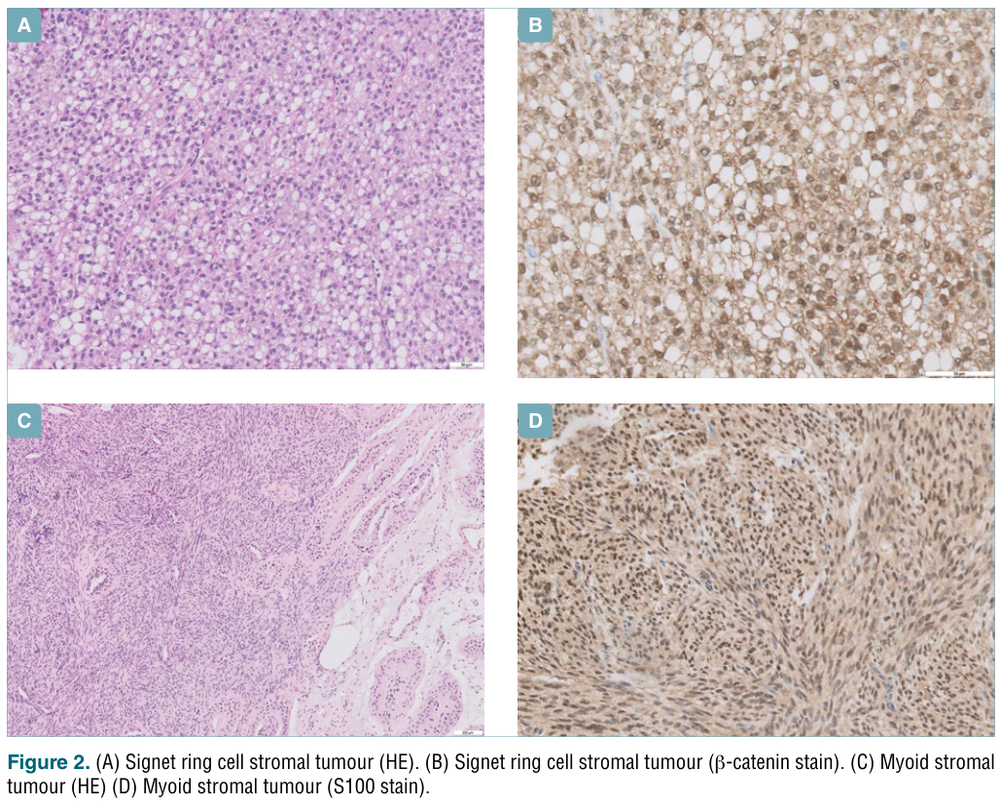

## Question

# Disease Characteristics Research Template

## Target Disease
- **Disease Name:** Testicular Sex Cord-Stromal Neoplasm
- **MONDO ID:**  (if available)
- **Category:** 

## Research Objectives

Please provide a comprehensive research report on **Testicular Sex Cord-Stromal Neoplasm** covering all of the
disease characteristics listed below. This report will be used to populate a disease knowledge
base entry. Be thorough and cite primary literature (PMID preferred) for all claims.

For each section, **suggested databases/resources** are listed. These are the first places
you should search for information on each topic.

---

### 1. Disease Information
> **Search first:** OMIM, Orphanet, ICD-10/ICD-11, MeSH, PubMed

- What is the disease? Provide a concise overview.
- What are the key identifiers? (OMIM, Orphanet, ICD-10/ICD-11, MeSH, Mondo)
- What are the common synonyms and alternative names?
- Is the information derived from individual patients (e.g., EHR) or aggregated disease-level resources?

### 2. Etiology

- **Disease Causal Factors**: What are the primary causes? (genetic, environmental, infectious, mechanistic)
- **Risk Factors**:
  > **Search first:** PubMed, Cochrane Library, UpToDate, clinical guidelines, ClinVar, ClinGen, GWAS Catalog, PheGenI, CTD, CDC, WHO, epidemiological databases
  - Genetic risk factors (causal variants, susceptibility loci, modifier genes)
  - Environmental risk factors (toxins, lifestyle, occupational exposures, age, sex, family history)
- **Protective Factors**:
  > **Search first:** PubMed, Cochrane Library, clinical trial databases, GWAS Catalog, gnomAD, WHO, CDC, nutrition databases
  - Genetic protective factors (protective variants, modifier alleles)
  - Environmental protective factors (diet, lifestyle, exposures that reduce risk)
- **Gene-Environment Interactions**: How do genetic and environmental factors interact to influence disease?
  > **Search first:** CTD, PubMed, PheGenI, GxE databases

### 3. Phenotypes
> **Search first:** HPO (Human Phenotype Ontology), OMIM, Orphanet, PubMed, clinicaltrials.gov, MedDRA, SNOMED CT, DECIPHER, LOINC

For each phenotype, provide:
- **Phenotype type**: symptoms, clinical signs, physical manifestations, behavioral changes, or laboratory abnormalities
  > For symptoms/signs: HPO, OMIM, Orphanet, PubMed
  > For behavioral changes: HPO, DSM, RDoC (Research Domain Criteria), PubMed
  > For laboratory abnormalities: LOINC, SNOMED CT, LabTests Online, PubMed
- **Phenotype characteristics**:
  > **Search first:** OMIM, Orphanet, HPO, PubMed
  - Age of symptom onset (neonatal, childhood, adult-onset, late-onset)
  - Symptom severity (mild, moderate, severe, variable)
  - Symptom progression (stable, progressive, episodic, fluctuating)
  - Frequency among affected individuals (percentage or qualitative)
- **Quality of life impact**: Effects on daily functioning and well-being (per-phenotype when possible)
  > **Search first:** EQ-5D database, SF-36, WHO QOL databases, PubMed
- Suggest HPO (Human Phenotype Ontology) terms for each phenotype

### 4. Genetic/Molecular Information

- **Causal Genes**: Gene mutations or chromosomal abnormalities responsible for disease (gene symbols, OMIM IDs)
  > **Search first:** OMIM, ClinVar, HGMD, Ensembl, NCBI Gene
- **Pathogenic Variants**:
  - Affected genes (gene symbols, HGNC IDs)
    > **Search first:** OMIM, NCBI Gene, Ensembl, HGNC, UniProt, GeneCards
  - Variant classification (pathogenic, likely pathogenic, VUS per ACMG/AMP guidelines)
    > **Search first:** ClinVar, ClinGen, ACMG/AMP guidelines, VarSome
  - Variant type/class (missense, frameshift, nonsense, splice-site, structural)
  - Allele frequency in population databases
    > **Search first:** gnomAD, 1000 Genomes, ExAC, TOPMed, dbSNP
  - Somatic vs germline origin
    > **Search first:** COSMIC (somatic), ClinVar, ICGC, TCGA
  - Functional consequences (loss of function, gain of function, dominant negative)
- **Modifier Genes**: Genes that modify disease severity or expression
- **Epigenetic Information**: DNA methylation, histone modifications, chromatin changes affecting disease
  > **Search first:** ENCODE, Roadmap Epigenomics, MethBase, DiseaseMeth
- **Chromosomal Abnormalities**: Large-scale genetic changes (aneuploidy, translocations, inversions)
  > **Search first:** DECIPHER, ClinVar, ECARUCA, UCSC Genome Browser

### 5. Environmental Information

- **Environmental Factors**: Non-genetic contributing factors (toxins, radiation, pollution, occupational exposure)
  > **Search first:** CTD (Comparative Toxicogenomics Database), TOXNET, PubMed, EPA databases
- **Lifestyle Factors**: Behavioral factors (smoking, diet, exercise, alcohol consumption)
  > **Search first:** CDC databases, WHO, PubMed, NHANES
- **Infectious Agents**: If applicable, pathogens causing or triggering disease (bacteria, viruses, fungi, parasites)
  > **Search first:** NCBI Taxonomy, ViPR, BV-BRC, MicrobeDB, GIDEON

### 6. Mechanism / Pathophysiology

- **Molecular Pathways**: Specific signaling cascades or biochemical pathways involved (Wnt, MAPK, mTOR, PI3K-AKT, etc.)
  > **Search first:** KEGG, Reactome, WikiPathways, PathBank, BioCyc
- **Cellular Processes**: Cell-level mechanisms (apoptosis, autophagy, cell cycle dysregulation, inflammation, etc.)
  > **Search first:** Gene Ontology (GO), Reactome, KEGG, PubMed
- **Protein Dysfunction**: How protein structure or function is altered (misfolding, aggregation, loss of function, gain of function)
  > **Search first:** UniProt, PDB (Protein Data Bank), InterPro, Pfam, AlphaFold
- **Metabolic Changes**: Alterations in metabolic processes (energy metabolism, lipid metabolism, amino acid metabolism)
  > **Search first:** KEGG, BioCyc, HMDB (Human Metabolome Database), BRENDA
- **Immune System Involvement**: Role of immune response (autoimmunity, immunodeficiency, chronic inflammation)
  > **Search first:** ImmPort, Immunome Database, IEDB, Gene Ontology
- **Tissue Damage Mechanisms**: How tissues/ are injured (oxidative stress, ischemia, fibrosis, necrosis)
  > **Search first:** PubMed, Gene Ontology, Reactome
- **Biochemical Abnormalities**: Specific molecular defects (enzyme deficiencies, receptor dysfunction, ion channel defects)
  > **Search first:** BRENDA, UniProt, KEGG, OMIM, PubMed
- **Epigenetic Changes**: DNA methylation, histone modifications affecting gene expression in disease
  > **Search first:** ENCODE, Roadmap Epigenomics, MethBase, DiseaseMeth
- **Molecular Profiling** (if available):
  - Transcriptomics/gene expression changes
    > **Search first:** GEO (Gene Expression Omnibus), ArrayExpress, GTEx, Human Cell Atlas, SRA
  - Proteomics findings
    > **Search first:** PRIDE, ProteomeXchange, Human Protein Atlas, STRING, BioGRID
  - Metabolomics signatures
    > **Search first:** MetaboLights, Metabolomics Workbench, HMDB, METLIN
  - Lipidomics alterations
    > **Search first:** LIPID MAPS, SwissLipids, LipidHome, Metabolomics Workbench
  - Genomic structural features
    > **Search first:** UCSC Genome Browser, Ensembl, NCBI, dbVar, DGV
- **Advanced Technologies** (if applicable):
  - Single-cell analysis findings (cell-type specific mechanisms, cellular heterogeneity)
    > **Search first:** Human Cell Atlas, Single Cell Portal, GEO, CELLxGENE
  - Spatial transcriptomics findings
    > **Search first:** GEO, Spatial Research, Vizgen, 10x Genomics data
  - Multi-omics integration results
    > **Search first:** TCGA, ICGC, cBioPortal, LinkedOmics, PubMed
  - Functional genomics screens (CRISPR, RNAi)
    > **Search first:** DepMap, GenomeRNAi, PubMed, BioGRID ORCS

For each mechanism, describe:
- The causal chain from initial trigger to clinical manifestation
- Which mechanisms are upstream vs downstream
- What cell types and biological processes are involved
- Suggest GO terms for biological processes and CL terms for cell types

### 7. Anatomical Structures Affected

- **Organ Level**:
  - Primary organs directly affected
  - Secondary organ involvement (complications, secondary effects)
  - Body systems involved (cardiovascular, nervous, digestive, respiratory, endocrine, etc.)
  > **Search first:** Uberon, FMA (Foundational Model of Anatomy), OMIM, HPO, ICD-11, MeSH, SNOMED CT
- **Tissue and Cell Level**:
  - Specific tissue types affected (epithelial, connective, muscle, nervous)
  - Specific cell populations targeted (with Cell Ontology terms)
  > **Search first:** Uberon, Human Protein Atlas, Cell Ontology, Human Cell Atlas, CellMarker, PanglaoDB
- **Subcellular Level**:
  - Cellular compartments involved (mitochondria, nucleus, ER, lysosomes) (with GO Cellular Component terms)
  > **Search first:** Gene Ontology (Cellular Component), UniProt, Human Protein Atlas
- **Localization**:
  - Specific anatomical sites (with UBERON terms)
    > **Search first:** FMA, Uberon, NeuroNames (for brain), SNOMED CT
  - Lateralization (unilateral, bilateral, asymmetric)
    > **Search first:** HPO, clinical literature, imaging databases

### 8. Temporal Development

- **Onset**:
  - Typical age of onset (congenital, pediatric, adult, geriatric)
  - Onset pattern (acute, subacute, chronic, insidious)
  > **Search first:** OMIM, Orphanet, HPO, PubMed
- **Progression**:
  - Disease stages (early, intermediate, advanced, end-stage)
    > **Search first:** Cancer Staging Manual (AJCC), WHO classifications, PubMed
  - Progression rate (rapid, slow, variable)
  - Disease course pattern (episodic, relapsing-remitting, progressive, stable)
  - Disease duration (self-limited, chronic lifelong)
  > **Search first:** Disease registries, longitudinal cohort databases, natural history studies, PubMed, Orphanet, OMIM
- **Patterns**:
  - Remission patterns (spontaneous, treatment-induced)
    > **Search first:** Clinical trial databases, disease registries, PubMed
  - Critical periods (time windows of vulnerability or opportunity for intervention)
    > **Search first:** PubMed, developmental biology databases, clinical guidelines

### 9. Inheritance and Population

- **Epidemiology**:
  - Prevalence (cases per 100,000 at given time)
  - Incidence (new cases per 100,000 per year)
  > **Search first:** Orphanet, CDC, WHO, GBD (Global Burden of Disease), national registries, SEER, disease registries
- **For Genetic Etiology**:
  - Inheritance pattern (AD, AR, X-linked, mitochondrial, multifactorial, polygenic)
    > **Search first:** OMIM, Orphanet, ClinVar, GTR (Genetic Testing Registry)
  - Penetrance (complete, incomplete, age-dependent)
    > **Search first:** ClinVar, OMIM, PubMed, ClinGen
  - Expressivity (variable, consistent)
    > **Search first:** OMIM, ClinVar, PubMed
  - Genetic anticipation (increasing severity in successive generations)
    > **Search first:** OMIM, PubMed (especially for repeat expansion disorders)
  - Germline mosaicism
    > **Search first:** ClinVar, OMIM, genetic counseling literature, PubMed
  - Founder effects (population-specific mutations)
    > **Search first:** gnomAD, population genetics databases, PubMed
  - Consanguinity role
    > **Search first:** OMIM, population studies, genetic counseling resources
  - Carrier frequency
    > **Search first:** gnomAD, carrier screening databases, GeneReviews, GTR
- **Population Demographics**:
  - Affected populations (ethnic or demographic groups with higher prevalence)
    > **Search first:** gnomAD, 1000 Genomes, PAGE Study, PubMed, population registries
  - Geographic distribution (endemic areas, regional variation)
    > **Search first:** WHO, CDC, GBD, Orphanet, geographic epidemiology databases
  - Geographic distribution of specific variants
  - Sex ratio (male:female)
    > **Search first:** Disease registries, OMIM, PubMed, epidemiological databases
  - Age distribution of affected individuals
    > **Search first:** CDC, disease registries, SEER, Orphanet

### 10. Diagnostics

- **Clinical Tests**:
  - Laboratory tests (blood, urine, tissue chemistry, specific enzyme assays)
    > **Search first:** LOINC, LabTests Online, PubMed
  - Biomarkers (proteins, metabolites, genetic markers, circulating biomarkers)
    > **Search first:** FDA Biomarker List, BEST (Biomarkers, EndpointS, and other Tools), PubMed
  - Imaging studies (X-ray, CT, MRI, PET, ultrasound)
    > **Search first:** RadLex, DICOM, Radiopaedia, imaging databases
  - Functional tests (pulmonary function, cardiac stress tests)
    > **Search first:** LOINC, clinical guidelines, PubMed
  - Electrophysiology (EEG, EMG, ECG, nerve conduction studies)
    > **Search first:** LOINC, clinical neurophysiology databases, PubMed
  - Biopsy findings (histopathology, immunohistochemistry)
    > **Search first:** SNOMED CT, College of American Pathologists resources, PubMed
  - Pathology findings (microscopic examination)
    > **Search first:** SNOMED CT, Digital Pathology databases, PubMed
- **Genetic Testing**:
  > **Search first:** GTR (Genetic Testing Registry), GeneReviews, ClinGen
  - Overview of recommended genetic testing approach
  - Whole genome sequencing (WGS) utility
    > **Search first:** GTR, ClinVar, GEL (Genomics England), gnomAD
  - Whole exome sequencing (WES) utility
    > **Search first:** GTR, ClinVar, OMIM, GeneMatcher
  - Gene panels (which panels, which genes)
    > **Search first:** GTR, ClinVar, laboratory-specific databases
  - Single gene testing
    > **Search first:** GTR, ClinVar, OMIM, GeneReviews
  - Chromosomal microarray (CMA)
    > **Search first:** DECIPHER, ClinVar, dbVar, ECARUCA
  - Karyotyping
    > **Search first:** Chromosome Abnormality Database, ClinVar, cytogenetics resources
  - FISH
    > **Search first:** ClinVar, cytogenetics databases, PubMed
  - Mitochondrial DNA testing
    > **Search first:** MITOMAP, MSeqDR, ClinVar, GTR
  - Repeat expansion testing
    > **Search first:** GTR, ClinVar, repeat expansion databases, PubMed
- **Omics-Based Diagnostics** (if applicable):
  - RNA sequencing / transcriptomics
    > **Search first:** GEO, ArrayExpress, GTEx, RNA-seq databases
  - Proteomics
    > **Search first:** PRIDE, ProteomeXchange, FDA Biomarker database
  - Metabolomics
    > **Search first:** MetaboLights, Metabolomics Workbench, HMDB
  - Epigenomics
    > **Search first:** GEO, ENCODE, Roadmap Epigenomics, MethBase
  - Liquid biopsy
    > **Search first:** COSMIC, ClinVar, liquid biopsy databases, PubMed
- **Clinical Criteria**:
  - Standardized diagnostic criteria (DSM, ICD, society guidelines)
    > **Search first:** DSM-5, ICD-11, clinical society guidelines, UpToDate
  - Differential diagnosis (other conditions to rule out, with distinguishing features)
    > **Search first:** DynaMed, UpToDate, clinical decision support systems
- **Screening**:
  - Screening methods for asymptomatic individuals (newborn screening, carrier screening, cascade screening)
    > **Search first:** ACMG recommendations, CDC newborn screening, GTR

### 11. Outcome/Prognosis

- **Survival and Mortality**:
  - Survival rate (5-year, 10-year, overall)
    > **Search first:** SEER, cancer registries, disease-specific registries, PubMed
  - Life expectancy (with and without treatment if applicable)
    > **Search first:** Orphanet, disease registries, actuarial databases, PubMed
  - Mortality rate
    > **Search first:** CDC, WHO, GBD, national mortality databases
  - Disease-specific mortality (deaths directly attributable to disease)
    > **Search first:** Disease registries, CDC Wonder, GBD, PubMed
- **Morbidity and Function**:
  - Morbidity (disease-related disability and health impacts)
    > **Search first:** GBD, WHO, disability databases, PubMed
  - Disability outcomes (long-term functional impairments)
    > **Search first:** ICF (International Classification of Functioning), disability registries
  - Quality of life measures (EQ-5D, SF-36, PROMIS, disease-specific tools)
    > **Search first:** EQ-5D database, SF-36, PROMIS, PubMed
- **Disease Course**:
  - Complications (secondary problems: infections, organ failure, etc.)
    > **Search first:** ICD codes, disease registries, clinical databases, PubMed
  - Recovery potential (likelihood and extent of recovery, with vs without treatment)
    > **Search first:** Natural history studies, rehabilitation databases, PubMed
- **Prediction**:
  - Prognostic factors (age, disease severity, biomarkers, treatment response)
    > **Search first:** Prognostic models databases, clinical calculators, PubMed
  - Prognostic biomarkers (molecular markers predicting disease course)
    > **Search first:** FDA Biomarker database, PubMed, cancer prognostic databases

### 12. Treatment

- **Pharmacotherapy**:
  - Pharmacological treatments (drug names, drug classes, mechanisms of action)
    > **Search first:** DrugBank, RxNorm, ATC classification, DailyMed, FDA databases
  - Pharmacogenomics (how genetic variants affect drug metabolism, efficacy, toxicity)
    > **Search first:** PharmGKB, CPIC (Clinical Pharmacogenetics), FDA Table of PGx Biomarkers
- **Advanced Therapeutics**:
  - Gene therapy (viral vectors, CRISPR, gene replacement, gene editing)
    > **Search first:** ClinicalTrials.gov, FDA gene therapy database, ASGCT resources
  - Cell therapy (stem cell transplant, CAR-T, cellular therapeutics)
    > **Search first:** ClinicalTrials.gov, FDA cell therapy database, FACT standards
  - RNA-based therapies (ASOs, siRNA, mRNA therapies)
    > **Search first:** ClinicalTrials.gov, FDA approvals, PubMed
  - Targeted therapies (treatments directed at specific molecular targets)
    > **Search first:** My Cancer Genome, OncoKB, ClinicalTrials.gov, FDA approvals
  - Immunotherapies (checkpoint inhibitors, monoclonal antibodies)
    > **Search first:** Cancer Immunotherapy Database, FDA approvals, ClinicalTrials.gov
- **Surgical and Interventional**:
  - Surgical interventions (types of surgery, timing, outcomes)
    > **Search first:** CPT codes, surgical registries, clinical guidelines, PubMed
- **Supportive and Rehabilitative**:
  - Supportive care (symptom management, pain control, nutrition)
    > **Search first:** Clinical guidelines, Cochrane Library, PubMed
  - Rehabilitation (physical therapy, occupational therapy, speech therapy)
    > **Search first:** Rehabilitation medicine databases, clinical guidelines, PubMed
- **Experimental**:
  - Experimental treatments in clinical trials (with NCT identifiers if available)
    > **Search first:** ClinicalTrials.gov, EU Clinical Trials Register, WHO ICTRP
- **Treatment Outcomes**:
  - Treatment response rates
    > **Search first:** Clinical trial databases, FDA reviews, systematic reviews, PubMed
  - Side effects and adverse events
    > **Search first:** FDA Adverse Event Reporting System (FAERS), MedWatch, PubMed
- **Treatment Strategy**:
  - Treatment algorithms (clinical pathways, decision trees)
    > **Search first:** Clinical practice guidelines, NCCN Guidelines, UpToDate
  - Combination therapies
    > **Search first:** ClinicalTrials.gov, treatment guidelines, PubMed
  - Personalized medicine approaches (genotype-guided treatment)
    > **Search first:** My Cancer Genome, CIViC, PharmGKB, precision medicine databases

For each treatment, suggest MAXO (Medical Action Ontology) terms where applicable.

### 13. Prevention

- **Prevention Levels**:
  - Primary prevention (preventing disease occurrence: vaccination, risk factor modification)
    > **Search first:** CDC, WHO, USPSTF recommendations, Cochrane Library
  - Secondary prevention (early detection and treatment: screening programs, early intervention)
    > **Search first:** USPSTF, CDC screening guidelines, WHO
  - Tertiary prevention (preventing complications in those with disease)
    > **Search first:** Clinical guidelines, disease management protocols, PubMed
- **Immunization**: Vaccine strategies (if applicable)
  > **Search first:** CDC vaccine schedules, WHO immunization, FDA vaccine database
- **Screening and Early Detection**:
  - Screening programs (population-based: newborn screening, cancer screening)
    > **Search first:** CDC screening programs, USPSTF, cancer screening databases
  - Genetic screening (carrier screening, preimplantation genetic diagnosis, prenatal testing)
    > **Search first:** ACMG recommendations, ACOG guidelines, GTR
  - Risk stratification (identifying high-risk individuals for targeted prevention)
    > **Search first:** Risk prediction models, clinical calculators, PubMed
- **Behavioral Interventions**: Lifestyle modifications to reduce risk
  > **Search first:** CDC, WHO, behavioral intervention databases, Cochrane Library
- **Counseling**: Genetic counseling (risk assessment, family planning guidance)
  > **Search first:** NSGC resources, ACMG guidelines, GeneReviews
- **Public Health**:
  - Public health interventions (sanitation, vector control, health education)
    > **Search first:** CDC, WHO, public health databases, PubMed
  - Environmental interventions (reducing environmental risk factors)
    > **Search first:** EPA databases, WHO environmental health, PubMed
- **Prophylaxis**: Preventive medications or procedures
  > **Search first:** Clinical guidelines, FDA approvals, PubMed

### 14. Other Species / Natural Disease

- **Taxonomy**: Species affected (with NCBI Taxon identifiers)
  > **Search first:** NCBI Taxonomy
- **Breed**: Specific breeds affected (with VBO identifiers if applicable)
  > **Search first:** VBO (Vertebrate Breed Ontology)
- **Gene**: Orthologous genes in other species (with NCBI Gene IDs)
  > **Search first:** NCBI Gene
- **Natural Disease**:
  - Naturally occurring disease in other species (companion animals, wildlife)
    > **Search first:** OMIA (Online Mendelian Inheritance in Animals), VetCompass, PubMed
  - Veterinary relevance and importance in animal health
    > **Search first:** OMIA, veterinary databases, PubMed
- **Comparative Biology**:
  - Comparative pathology (similarities and differences across species)
    > **Search first:** OMIA, comparative pathology databases, PubMed
  - Evolutionary conservation of disease mechanisms
    > **Search first:** HomoloGene, OrthoMCL, Alliance of Genome Resources
- **Transmission** (if applicable):
  - Zoonotic potential
    > **Search first:** CDC zoonotic diseases, WHO zoonoses, GIDEON
  - Cross-species susceptibility
    > **Search first:** NCBI Taxonomy, veterinary databases, PubMed

### 15. Model Organisms

- **Model Types**:
  - Model organism type (mammalian, invertebrate, cellular, in vitro)
    > **Search first:** Alliance of Genome Resources, model organism databases
  - Specific model systems (mouse, rat, zebrafish, Drosophila, C. elegans, yeast, cell lines, organoids, iPSCs)
    > **Search first:** MGI, RGD, ZFIN, FlyBase, WormBase, SGD, ATCC, Cellosaurus
  - Induced models (drug treatment, surgical intervention, environmental manipulation)
    > **Search first:** MGI, model organism databases, PubMed
- **Genetic Models**:
  - Types available (knockout, knock-in, transgenic, conditional, humanized)
    > **Search first:** MGI, IMPC, KOMP, EuMMCR, IMSR
- **Model Characteristics**:
  - Phenotype recapitulation (how well model reproduces human disease features)
    > **Search first:** Model organism databases, comparative studies, PubMed
  - Model limitations (aspects of human disease not captured)
    > **Search first:** Model organism databases, PubMed, review articles
- **Applications**:
  - Research applications (what aspects of disease can be studied)
    > **Search first:** Model organism databases, PubMed
- **Resources**:
  - Model databases
    > **Search first:** MGI, RGD, ZFIN, FlyBase, WormBase, IMSR, EMMA, MMRRC

---

## Citation Requirements

- Cite primary literature (PMID preferred) for all mechanistic and clinical claims
- Prioritize recent reviews and landmark papers
- Include direct quotes from abstracts where possible to support key statements
- Distinguish evidence source types: human clinical, model organism, in vitro, computational

## Output Format

Structure your response as a comprehensive narrative organized by the sections above.
For each section, provide:
- Factual content with specific details (numbers, percentages, gene names, variant nomenclature)
- Ontology term suggestions (HPO, GO, CL, UBERON, CHEBI, MAXO, MONDO) where applicable
- Evidence citations with PMIDs
- Direct quotes from abstracts to support key claims
- Clear indication when information is not available or not applicable for this disease

This report will be used to populate a disease knowledge base entry with:
- Pathophysiology descriptions with causal chains
- Gene/protein annotations (HGNC, GO terms)
- Phenotype associations (HP terms) with frequencies
- Cell type involvement (CL terms)
- Anatomical locations (UBERON terms)
- Chemical entities (CHEBI terms)
- Treatment annotations (MAXO terms)
- Evidence items with PMIDs and exact abstract quotes
- Epidemiology, prognosis, diagnostic, and prevention information
- Animal model descriptions with phenotype recapitulation details

## Output

Question: You are an expert researcher providing comprehensive, well-cited information.

Provide detailed information focusing on:
1. Key concepts and definitions with current understanding
2. Recent developments and latest research (prioritize 2023-2024 sources)
3. Current applications and real-world implementations
4. Expert opinions and analysis from authoritative sources
5. Relevant statistics and data from recent studies

Format as a comprehensive research report with proper citations. Include URLs and publication dates where available.
Always prioritize recent, authoritative sources and provide specific citations for all major claims.

# Disease Characteristics Research Template

## Target Disease
- **Disease Name:** Testicular Sex Cord-Stromal Neoplasm
- **MONDO ID:**  (if available)
- **Category:** 

## Research Objectives

Please provide a comprehensive research report on **Testicular Sex Cord-Stromal Neoplasm** covering all of the
disease characteristics listed below. This report will be used to populate a disease knowledge
base entry. Be thorough and cite primary literature (PMID preferred) for all claims.

For each section, **suggested databases/resources** are listed. These are the first places
you should search for information on each topic.

---

### 1. Disease Information
> **Search first:** OMIM, Orphanet, ICD-10/ICD-11, MeSH, PubMed

- What is the disease? Provide a concise overview.
- What are the key identifiers? (OMIM, Orphanet, ICD-10/ICD-11, MeSH, Mondo)
- What are the common synonyms and alternative names?
- Is the information derived from individual patients (e.g., EHR) or aggregated disease-level resources?

### 2. Etiology

- **Disease Causal Factors**: What are the primary causes? (genetic, environmental, infectious, mechanistic)
- **Risk Factors**:
  > **Search first:** PubMed, Cochrane Library, UpToDate, clinical guidelines, ClinVar, ClinGen, GWAS Catalog, PheGenI, CTD, CDC, WHO, epidemiological databases
  - Genetic risk factors (causal variants, susceptibility loci, modifier genes)
  - Environmental risk factors (toxins, lifestyle, occupational exposures, age, sex, family history)
- **Protective Factors**:
  > **Search first:** PubMed, Cochrane Library, clinical trial databases, GWAS Catalog, gnomAD, WHO, CDC, nutrition databases
  - Genetic protective factors (protective variants, modifier alleles)
  - Environmental protective factors (diet, lifestyle, exposures that reduce risk)
- **Gene-Environment Interactions**: How do genetic and environmental factors interact to influence disease?
  > **Search first:** CTD, PubMed, PheGenI, GxE databases

### 3. Phenotypes
> **Search first:** HPO (Human Phenotype Ontology), OMIM, Orphanet, PubMed, clinicaltrials.gov, MedDRA, SNOMED CT, DECIPHER, LOINC

For each phenotype, provide:
- **Phenotype type**: symptoms, clinical signs, physical manifestations, behavioral changes, or laboratory abnormalities
  > For symptoms/signs: HPO, OMIM, Orphanet, PubMed
  > For behavioral changes: HPO, DSM, RDoC (Research Domain Criteria), PubMed
  > For laboratory abnormalities: LOINC, SNOMED CT, LabTests Online, PubMed
- **Phenotype characteristics**:
  > **Search first:** OMIM, Orphanet, HPO, PubMed
  - Age of symptom onset (neonatal, childhood, adult-onset, late-onset)
  - Symptom severity (mild, moderate, severe, variable)
  - Symptom progression (stable, progressive, episodic, fluctuating)
  - Frequency among affected individuals (percentage or qualitative)
- **Quality of life impact**: Effects on daily functioning and well-being (per-phenotype when possible)
  > **Search first:** EQ-5D database, SF-36, WHO QOL databases, PubMed
- Suggest HPO (Human Phenotype Ontology) terms for each phenotype

### 4. Genetic/Molecular Information

- **Causal Genes**: Gene mutations or chromosomal abnormalities responsible for disease (gene symbols, OMIM IDs)
  > **Search first:** OMIM, ClinVar, HGMD, Ensembl, NCBI Gene
- **Pathogenic Variants**:
  - Affected genes (gene symbols, HGNC IDs)
    > **Search first:** OMIM, NCBI Gene, Ensembl, HGNC, UniProt, GeneCards
  - Variant classification (pathogenic, likely pathogenic, VUS per ACMG/AMP guidelines)
    > **Search first:** ClinVar, ClinGen, ACMG/AMP guidelines, VarSome
  - Variant type/class (missense, frameshift, nonsense, splice-site, structural)
  - Allele frequency in population databases
    > **Search first:** gnomAD, 1000 Genomes, ExAC, TOPMed, dbSNP
  - Somatic vs germline origin
    > **Search first:** COSMIC (somatic), ClinVar, ICGC, TCGA
  - Functional consequences (loss of function, gain of function, dominant negative)
- **Modifier Genes**: Genes that modify disease severity or expression
- **Epigenetic Information**: DNA methylation, histone modifications, chromatin changes affecting disease
  > **Search first:** ENCODE, Roadmap Epigenomics, MethBase, DiseaseMeth
- **Chromosomal Abnormalities**: Large-scale genetic changes (aneuploidy, translocations, inversions)
  > **Search first:** DECIPHER, ClinVar, ECARUCA, UCSC Genome Browser

### 5. Environmental Information

- **Environmental Factors**: Non-genetic contributing factors (toxins, radiation, pollution, occupational exposure)
  > **Search first:** CTD (Comparative Toxicogenomics Database), TOXNET, PubMed, EPA databases
- **Lifestyle Factors**: Behavioral factors (smoking, diet, exercise, alcohol consumption)
  > **Search first:** CDC databases, WHO, PubMed, NHANES
- **Infectious Agents**: If applicable, pathogens causing or triggering disease (bacteria, viruses, fungi, parasites)
  > **Search first:** NCBI Taxonomy, ViPR, BV-BRC, MicrobeDB, GIDEON

### 6. Mechanism / Pathophysiology

- **Molecular Pathways**: Specific signaling cascades or biochemical pathways involved (Wnt, MAPK, mTOR, PI3K-AKT, etc.)
  > **Search first:** KEGG, Reactome, WikiPathways, PathBank, BioCyc
- **Cellular Processes**: Cell-level mechanisms (apoptosis, autophagy, cell cycle dysregulation, inflammation, etc.)
  > **Search first:** Gene Ontology (GO), Reactome, KEGG, PubMed
- **Protein Dysfunction**: How protein structure or function is altered (misfolding, aggregation, loss of function, gain of function)
  > **Search first:** UniProt, PDB (Protein Data Bank), InterPro, Pfam, AlphaFold
- **Metabolic Changes**: Alterations in metabolic processes (energy metabolism, lipid metabolism, amino acid metabolism)
  > **Search first:** KEGG, BioCyc, HMDB (Human Metabolome Database), BRENDA
- **Immune System Involvement**: Role of immune response (autoimmunity, immunodeficiency, chronic inflammation)
  > **Search first:** ImmPort, Immunome Database, IEDB, Gene Ontology
- **Tissue Damage Mechanisms**: How tissues/ are injured (oxidative stress, ischemia, fibrosis, necrosis)
  > **Search first:** PubMed, Gene Ontology, Reactome
- **Biochemical Abnormalities**: Specific molecular defects (enzyme deficiencies, receptor dysfunction, ion channel defects)
  > **Search first:** BRENDA, UniProt, KEGG, OMIM, PubMed
- **Epigenetic Changes**: DNA methylation, histone modifications affecting gene expression in disease
  > **Search first:** ENCODE, Roadmap Epigenomics, MethBase, DiseaseMeth
- **Molecular Profiling** (if available):
  - Transcriptomics/gene expression changes
    > **Search first:** GEO (Gene Expression Omnibus), ArrayExpress, GTEx, Human Cell Atlas, SRA
  - Proteomics findings
    > **Search first:** PRIDE, ProteomeXchange, Human Protein Atlas, STRING, BioGRID
  - Metabolomics signatures
    > **Search first:** MetaboLights, Metabolomics Workbench, HMDB, METLIN
  - Lipidomics alterations
    > **Search first:** LIPID MAPS, SwissLipids, LipidHome, Metabolomics Workbench
  - Genomic structural features
    > **Search first:** UCSC Genome Browser, Ensembl, NCBI, dbVar, DGV
- **Advanced Technologies** (if applicable):
  - Single-cell analysis findings (cell-type specific mechanisms, cellular heterogeneity)
    > **Search first:** Human Cell Atlas, Single Cell Portal, GEO, CELLxGENE
  - Spatial transcriptomics findings
    > **Search first:** GEO, Spatial Research, Vizgen, 10x Genomics data
  - Multi-omics integration results
    > **Search first:** TCGA, ICGC, cBioPortal, LinkedOmics, PubMed
  - Functional genomics screens (CRISPR, RNAi)
    > **Search first:** DepMap, GenomeRNAi, PubMed, BioGRID ORCS

For each mechanism, describe:
- The causal chain from initial trigger to clinical manifestation
- Which mechanisms are upstream vs downstream
- What cell types and biological processes are involved
- Suggest GO terms for biological processes and CL terms for cell types

### 7. Anatomical Structures Affected

- **Organ Level**:
  - Primary organs directly affected
  - Secondary organ involvement (complications, secondary effects)
  - Body systems involved (cardiovascular, nervous, digestive, respiratory, endocrine, etc.)
  > **Search first:** Uberon, FMA (Foundational Model of Anatomy), OMIM, HPO, ICD-11, MeSH, SNOMED CT
- **Tissue and Cell Level**:
  - Specific tissue types affected (epithelial, connective, muscle, nervous)
  - Specific cell populations targeted (with Cell Ontology terms)
  > **Search first:** Uberon, Human Protein Atlas, Cell Ontology, Human Cell Atlas, CellMarker, PanglaoDB
- **Subcellular Level**:
  - Cellular compartments involved (mitochondria, nucleus, ER, lysosomes) (with GO Cellular Component terms)
  > **Search first:** Gene Ontology (Cellular Component), UniProt, Human Protein Atlas
- **Localization**:
  - Specific anatomical sites (with UBERON terms)
    > **Search first:** FMA, Uberon, NeuroNames (for brain), SNOMED CT
  - Lateralization (unilateral, bilateral, asymmetric)
    > **Search first:** HPO, clinical literature, imaging databases

### 8. Temporal Development

- **Onset**:
  - Typical age of onset (congenital, pediatric, adult, geriatric)
  - Onset pattern (acute, subacute, chronic, insidious)
  > **Search first:** OMIM, Orphanet, HPO, PubMed
- **Progression**:
  - Disease stages (early, intermediate, advanced, end-stage)
    > **Search first:** Cancer Staging Manual (AJCC), WHO classifications, PubMed
  - Progression rate (rapid, slow, variable)
  - Disease course pattern (episodic, relapsing-remitting, progressive, stable)
  - Disease duration (self-limited, chronic lifelong)
  > **Search first:** Disease registries, longitudinal cohort databases, natural history studies, PubMed, Orphanet, OMIM
- **Patterns**:
  - Remission patterns (spontaneous, treatment-induced)
    > **Search first:** Clinical trial databases, disease registries, PubMed
  - Critical periods (time windows of vulnerability or opportunity for intervention)
    > **Search first:** PubMed, developmental biology databases, clinical guidelines

### 9. Inheritance and Population

- **Epidemiology**:
  - Prevalence (cases per 100,000 at given time)
  - Incidence (new cases per 100,000 per year)
  > **Search first:** Orphanet, CDC, WHO, GBD (Global Burden of Disease), national registries, SEER, disease registries
- **For Genetic Etiology**:
  - Inheritance pattern (AD, AR, X-linked, mitochondrial, multifactorial, polygenic)
    > **Search first:** OMIM, Orphanet, ClinVar, GTR (Genetic Testing Registry)
  - Penetrance (complete, incomplete, age-dependent)
    > **Search first:** ClinVar, OMIM, PubMed, ClinGen
  - Expressivity (variable, consistent)
    > **Search first:** OMIM, ClinVar, PubMed
  - Genetic anticipation (increasing severity in successive generations)
    > **Search first:** OMIM, PubMed (especially for repeat expansion disorders)
  - Germline mosaicism
    > **Search first:** ClinVar, OMIM, genetic counseling literature, PubMed
  - Founder effects (population-specific mutations)
    > **Search first:** gnomAD, population genetics databases, PubMed
  - Consanguinity role
    > **Search first:** OMIM, population studies, genetic counseling resources
  - Carrier frequency
    > **Search first:** gnomAD, carrier screening databases, GeneReviews, GTR
- **Population Demographics**:
  - Affected populations (ethnic or demographic groups with higher prevalence)
    > **Search first:** gnomAD, 1000 Genomes, PAGE Study, PubMed, population registries
  - Geographic distribution (endemic areas, regional variation)
    > **Search first:** WHO, CDC, GBD, Orphanet, geographic epidemiology databases
  - Geographic distribution of specific variants
  - Sex ratio (male:female)
    > **Search first:** Disease registries, OMIM, PubMed, epidemiological databases
  - Age distribution of affected individuals
    > **Search first:** CDC, disease registries, SEER, Orphanet

### 10. Diagnostics

- **Clinical Tests**:
  - Laboratory tests (blood, urine, tissue chemistry, specific enzyme assays)
    > **Search first:** LOINC, LabTests Online, PubMed
  - Biomarkers (proteins, metabolites, genetic markers, circulating biomarkers)
    > **Search first:** FDA Biomarker List, BEST (Biomarkers, EndpointS, and other Tools), PubMed
  - Imaging studies (X-ray, CT, MRI, PET, ultrasound)
    > **Search first:** RadLex, DICOM, Radiopaedia, imaging databases
  - Functional tests (pulmonary function, cardiac stress tests)
    > **Search first:** LOINC, clinical guidelines, PubMed
  - Electrophysiology (EEG, EMG, ECG, nerve conduction studies)
    > **Search first:** LOINC, clinical neurophysiology databases, PubMed
  - Biopsy findings (histopathology, immunohistochemistry)
    > **Search first:** SNOMED CT, College of American Pathologists resources, PubMed
  - Pathology findings (microscopic examination)
    > **Search first:** SNOMED CT, Digital Pathology databases, PubMed
- **Genetic Testing**:
  > **Search first:** GTR (Genetic Testing Registry), GeneReviews, ClinGen
  - Overview of recommended genetic testing approach
  - Whole genome sequencing (WGS) utility
    > **Search first:** GTR, ClinVar, GEL (Genomics England), gnomAD
  - Whole exome sequencing (WES) utility
    > **Search first:** GTR, ClinVar, OMIM, GeneMatcher
  - Gene panels (which panels, which genes)
    > **Search first:** GTR, ClinVar, laboratory-specific databases
  - Single gene testing
    > **Search first:** GTR, ClinVar, OMIM, GeneReviews
  - Chromosomal microarray (CMA)
    > **Search first:** DECIPHER, ClinVar, dbVar, ECARUCA
  - Karyotyping
    > **Search first:** Chromosome Abnormality Database, ClinVar, cytogenetics resources
  - FISH
    > **Search first:** ClinVar, cytogenetics databases, PubMed
  - Mitochondrial DNA testing
    > **Search first:** MITOMAP, MSeqDR, ClinVar, GTR
  - Repeat expansion testing
    > **Search first:** GTR, ClinVar, repeat expansion databases, PubMed
- **Omics-Based Diagnostics** (if applicable):
  - RNA sequencing / transcriptomics
    > **Search first:** GEO, ArrayExpress, GTEx, RNA-seq databases
  - Proteomics
    > **Search first:** PRIDE, ProteomeXchange, FDA Biomarker database
  - Metabolomics
    > **Search first:** MetaboLights, Metabolomics Workbench, HMDB
  - Epigenomics
    > **Search first:** GEO, ENCODE, Roadmap Epigenomics, MethBase
  - Liquid biopsy
    > **Search first:** COSMIC, ClinVar, liquid biopsy databases, PubMed
- **Clinical Criteria**:
  - Standardized diagnostic criteria (DSM, ICD, society guidelines)
    > **Search first:** DSM-5, ICD-11, clinical society guidelines, UpToDate
  - Differential diagnosis (other conditions to rule out, with distinguishing features)
    > **Search first:** DynaMed, UpToDate, clinical decision support systems
- **Screening**:
  - Screening methods for asymptomatic individuals (newborn screening, carrier screening, cascade screening)
    > **Search first:** ACMG recommendations, CDC newborn screening, GTR

### 11. Outcome/Prognosis

- **Survival and Mortality**:
  - Survival rate (5-year, 10-year, overall)
    > **Search first:** SEER, cancer registries, disease-specific registries, PubMed
  - Life expectancy (with and without treatment if applicable)
    > **Search first:** Orphanet, disease registries, actuarial databases, PubMed
  - Mortality rate
    > **Search first:** CDC, WHO, GBD, national mortality databases
  - Disease-specific mortality (deaths directly attributable to disease)
    > **Search first:** Disease registries, CDC Wonder, GBD, PubMed
- **Morbidity and Function**:
  - Morbidity (disease-related disability and health impacts)
    > **Search first:** GBD, WHO, disability databases, PubMed
  - Disability outcomes (long-term functional impairments)
    > **Search first:** ICF (International Classification of Functioning), disability registries
  - Quality of life measures (EQ-5D, SF-36, PROMIS, disease-specific tools)
    > **Search first:** EQ-5D database, SF-36, PROMIS, PubMed
- **Disease Course**:
  - Complications (secondary problems: infections, organ failure, etc.)
    > **Search first:** ICD codes, disease registries, clinical databases, PubMed
  - Recovery potential (likelihood and extent of recovery, with vs without treatment)
    > **Search first:** Natural history studies, rehabilitation databases, PubMed
- **Prediction**:
  - Prognostic factors (age, disease severity, biomarkers, treatment response)
    > **Search first:** Prognostic models databases, clinical calculators, PubMed
  - Prognostic biomarkers (molecular markers predicting disease course)
    > **Search first:** FDA Biomarker database, PubMed, cancer prognostic databases

### 12. Treatment

- **Pharmacotherapy**:
  - Pharmacological treatments (drug names, drug classes, mechanisms of action)
    > **Search first:** DrugBank, RxNorm, ATC classification, DailyMed, FDA databases
  - Pharmacogenomics (how genetic variants affect drug metabolism, efficacy, toxicity)
    > **Search first:** PharmGKB, CPIC (Clinical Pharmacogenetics), FDA Table of PGx Biomarkers
- **Advanced Therapeutics**:
  - Gene therapy (viral vectors, CRISPR, gene replacement, gene editing)
    > **Search first:** ClinicalTrials.gov, FDA gene therapy database, ASGCT resources
  - Cell therapy (stem cell transplant, CAR-T, cellular therapeutics)
    > **Search first:** ClinicalTrials.gov, FDA cell therapy database, FACT standards
  - RNA-based therapies (ASOs, siRNA, mRNA therapies)
    > **Search first:** ClinicalTrials.gov, FDA approvals, PubMed
  - Targeted therapies (treatments directed at specific molecular targets)
    > **Search first:** My Cancer Genome, OncoKB, ClinicalTrials.gov, FDA approvals
  - Immunotherapies (checkpoint inhibitors, monoclonal antibodies)
    > **Search first:** Cancer Immunotherapy Database, FDA approvals, ClinicalTrials.gov
- **Surgical and Interventional**:
  - Surgical interventions (types of surgery, timing, outcomes)
    > **Search first:** CPT codes, surgical registries, clinical guidelines, PubMed
- **Supportive and Rehabilitative**:
  - Supportive care (symptom management, pain control, nutrition)
    > **Search first:** Clinical guidelines, Cochrane Library, PubMed
  - Rehabilitation (physical therapy, occupational therapy, speech therapy)
    > **Search first:** Rehabilitation medicine databases, clinical guidelines, PubMed
- **Experimental**:
  - Experimental treatments in clinical trials (with NCT identifiers if available)
    > **Search first:** ClinicalTrials.gov, EU Clinical Trials Register, WHO ICTRP
- **Treatment Outcomes**:
  - Treatment response rates
    > **Search first:** Clinical trial databases, FDA reviews, systematic reviews, PubMed
  - Side effects and adverse events
    > **Search first:** FDA Adverse Event Reporting System (FAERS), MedWatch, PubMed
- **Treatment Strategy**:
  - Treatment algorithms (clinical pathways, decision trees)
    > **Search first:** Clinical practice guidelines, NCCN Guidelines, UpToDate
  - Combination therapies
    > **Search first:** ClinicalTrials.gov, treatment guidelines, PubMed
  - Personalized medicine approaches (genotype-guided treatment)
    > **Search first:** My Cancer Genome, CIViC, PharmGKB, precision medicine databases

For each treatment, suggest MAXO (Medical Action Ontology) terms where applicable.

### 13. Prevention

- **Prevention Levels**:
  - Primary prevention (preventing disease occurrence: vaccination, risk factor modification)
    > **Search first:** CDC, WHO, USPSTF recommendations, Cochrane Library
  - Secondary prevention (early detection and treatment: screening programs, early intervention)
    > **Search first:** USPSTF, CDC screening guidelines, WHO
  - Tertiary prevention (preventing complications in those with disease)
    > **Search first:** Clinical guidelines, disease management protocols, PubMed
- **Immunization**: Vaccine strategies (if applicable)
  > **Search first:** CDC vaccine schedules, WHO immunization, FDA vaccine database
- **Screening and Early Detection**:
  - Screening programs (population-based: newborn screening, cancer screening)
    > **Search first:** CDC screening programs, USPSTF, cancer screening databases
  - Genetic screening (carrier screening, preimplantation genetic diagnosis, prenatal testing)
    > **Search first:** ACMG recommendations, ACOG guidelines, GTR
  - Risk stratification (identifying high-risk individuals for targeted prevention)
    > **Search first:** Risk prediction models, clinical calculators, PubMed
- **Behavioral Interventions**: Lifestyle modifications to reduce risk
  > **Search first:** CDC, WHO, behavioral intervention databases, Cochrane Library
- **Counseling**: Genetic counseling (risk assessment, family planning guidance)
  > **Search first:** NSGC resources, ACMG guidelines, GeneReviews
- **Public Health**:
  - Public health interventions (sanitation, vector control, health education)
    > **Search first:** CDC, WHO, public health databases, PubMed
  - Environmental interventions (reducing environmental risk factors)
    > **Search first:** EPA databases, WHO environmental health, PubMed
- **Prophylaxis**: Preventive medications or procedures
  > **Search first:** Clinical guidelines, FDA approvals, PubMed

### 14. Other Species / Natural Disease

- **Taxonomy**: Species affected (with NCBI Taxon identifiers)
  > **Search first:** NCBI Taxonomy
- **Breed**: Specific breeds affected (with VBO identifiers if applicable)
  > **Search first:** VBO (Vertebrate Breed Ontology)
- **Gene**: Orthologous genes in other species (with NCBI Gene IDs)
  > **Search first:** NCBI Gene
- **Natural Disease**:
  - Naturally occurring disease in other species (companion animals, wildlife)
    > **Search first:** OMIA (Online Mendelian Inheritance in Animals), VetCompass, PubMed
  - Veterinary relevance and importance in animal health
    > **Search first:** OMIA, veterinary databases, PubMed
- **Comparative Biology**:
  - Comparative pathology (similarities and differences across species)
    > **Search first:** OMIA, comparative pathology databases, PubMed
  - Evolutionary conservation of disease mechanisms
    > **Search first:** HomoloGene, OrthoMCL, Alliance of Genome Resources
- **Transmission** (if applicable):
  - Zoonotic potential
    > **Search first:** CDC zoonotic diseases, WHO zoonoses, GIDEON
  - Cross-species susceptibility
    > **Search first:** NCBI Taxonomy, veterinary databases, PubMed

### 15. Model Organisms

- **Model Types**:
  - Model organism type (mammalian, invertebrate, cellular, in vitro)
    > **Search first:** Alliance of Genome Resources, model organism databases
  - Specific model systems (mouse, rat, zebrafish, Drosophila, C. elegans, yeast, cell lines, organoids, iPSCs)
    > **Search first:** MGI, RGD, ZFIN, FlyBase, WormBase, SGD, ATCC, Cellosaurus
  - Induced models (drug treatment, surgical intervention, environmental manipulation)
    > **Search first:** MGI, model organism databases, PubMed
- **Genetic Models**:
  - Types available (knockout, knock-in, transgenic, conditional, humanized)
    > **Search first:** MGI, IMPC, KOMP, EuMMCR, IMSR
- **Model Characteristics**:
  - Phenotype recapitulation (how well model reproduces human disease features)
    > **Search first:** Model organism databases, comparative studies, PubMed
  - Model limitations (aspects of human disease not captured)
    > **Search first:** Model organism databases, PubMed, review articles
- **Applications**:
  - Research applications (what aspects of disease can be studied)
    > **Search first:** Model organism databases, PubMed
- **Resources**:
  - Model databases
    > **Search first:** MGI, RGD, ZFIN, FlyBase, WormBase, IMSR, EMMA, MMRRC

---

## Citation Requirements

- Cite primary literature (PMID preferred) for all mechanistic and clinical claims
- Prioritize recent reviews and landmark papers
- Include direct quotes from abstracts where possible to support key statements
- Distinguish evidence source types: human clinical, model organism, in vitro, computational

## Output Format

Structure your response as a comprehensive narrative organized by the sections above.
For each section, provide:
- Factual content with specific details (numbers, percentages, gene names, variant nomenclature)
- Ontology term suggestions (HPO, GO, CL, UBERON, CHEBI, MAXO, MONDO) where applicable
- Evidence citations with PMIDs
- Direct quotes from abstracts to support key claims
- Clear indication when information is not available or not applicable for this disease

This report will be used to populate a disease knowledge base entry with:
- Pathophysiology descriptions with causal chains
- Gene/protein annotations (HGNC, GO terms)
- Phenotype associations (HP terms) with frequencies
- Cell type involvement (CL terms)
- Anatomical locations (UBERON terms)
- Chemical entities (CHEBI terms)
- Treatment annotations (MAXO terms)
- Evidence items with PMIDs and exact abstract quotes
- Epidemiology, prognosis, diagnostic, and prevention information
- Animal model descriptions with phenotype recapitulation details

# Disease Characteristics Research Report: Testicular Sex Cord–Stromal Neoplasm

## Target Disease
- **Disease name:** Testicular Sex Cord–Stromal Neoplasm (umbrella group; includes Leydig cell tumor, Sertoli cell tumor, granulosa cell tumor, and related mixed/other entities)
- **MONDO ID:** Not retrieved from the available evidence set in this run (evidence gap)
- **Category:** Non–germ cell testicular tumors; gonadal sex cord–stromal tumors (SCSTs)

**Scope note:** The available 2023–2024 evidence retrieved here focuses on *testicular sex cord–stromal tumors as a group* and on major recognized subtypes. The user-specified term “Testicular Sex Cord-Stromal Neoplasm” maps naturally to this WHO/EAU umbrella. (kowalik2024sexcordstromaltumors pages 1-2, colecchia2023newsinthe pages 1-2)

---

## 1. Disease Information

### 1.1 Overview / definition (current understanding)
Testicular sex cord–stromal tumors (SCSTs) are a rare category of primary non-germ cell testicular neoplasms derived from sex cord elements and/or gonadal stromal elements. They are typically indolent with a tendency toward benign behavior but can metastasize, and metastatic cases often have poor response to chemotherapy. (colecchia2023newsinthe pages 2-4, kowalik2024sexcordstromaltumors pages 1-2)

A 2024 literature review summarizes this group as including **androblastoma (Leydig cell tumor and Sertoli cell tumor)**, **fibroma–thecoma group tumors**, **stromal tumors**, and **sex cord tumors** (with WHO/EAU-based classification tables). (kowalik2024sexcordstromaltumors pages 1-2)

### 1.2 Key identifiers (ICD-10/ICD-11, MeSH, Orphanet, MONDO)
- **WHO/IARC classification anchor:** WHO Classification of Tumours of the Urinary System and Male Genital Tumours, **5th edition (published June 2022)** is explicitly referenced as the current standard classification source. (colecchia2023newsinthe pages 1-2, colecchia2023newsinthe pages 4-5)
- **ICD / MeSH / Orphanet / MONDO identifiers:** Not retrievable from the current evidence set/tools invoked in this run (evidence gap). 

### 1.3 Synonyms / alternative names
Commonly used names and umbrella terms in the retrieved sources include:
- “**Sex cord-stromal tumors of the testis**” (review title/term) (kowalik2024sexcordstromaltumors pages 1-2)
- “**Sex-cord stromal tumours (SCSTs)**” (WHO classification update article) (colecchia2023newsinthe pages 1-2)
- “**Gonadal stromal tumors**” (used alongside SCSTs in review abstract) (kowalik2024sexcordstromaltumors pages 1-2)
- Historical/variant terminology and reclassifications noted in WHO updates:
  - “**Signet ring stromal tumour**” (new entity) (colecchia2023newsinthe pages 1-2)
  - “**Myoid gonadal stromal tumour**” (new entity) (colecchia2023newsinthe pages 1-2)
  - “**Sertoliform cystadenoma**” moved into Sertoli cell tumors (WHO change) (colecchia2023newsinthe pages 1-2)
  - Mixed vs SCST-NOS definitions (WHO change): mixed SCSTs vs “SCST NOS reserved for SCSTs made up of undifferentiated/immature sex cord stromal cells” (colecchia2023newsinthe pages 2-4)

### 1.4 Source type (individual vs aggregated)
Evidence in this report comes from:
- **Aggregated disease-level resources/reviews** (WHO classification summary; literature reviews) (colecchia2023newsinthe pages 1-2, kowalik2024sexcordstromaltumors pages 1-2)
- **Registry/real-world aggregated cohorts** (National Cancer Database analysis) (zuniga2020acomparisonof pages 2-3, zuniga2020acomparisonof pages 3-5)
- **Individual patient reports** (testicular adult granulosa cell tumor case with NGS) (deng2023adultgranulosacell pages 1-2)
- **Model organism studies** (mouse Sertoli-cell TGFBR1 activation model) (fang2023sertolicellspecificactivation pages 1-2)

---

## 2. Etiology

### 2.1 Disease causal factors (mechanistic/genetic)
**Most SCSTs are sporadic**, but multiple lines of evidence implicate genetic drivers/syndromic associations and pathway dysregulation.

**Key molecular/driver associations supported by retrieved evidence:**
- **CTNNB1 / β-catenin (Sertoli-pattern tumors):** A WHO classification update summarizes that a “large percentage” of Sertoli cell tumors show **CTNNB1 mutation with diagnostic nuclear β-catenin staining**. (colecchia2023newsinthe pages 1-2)
- **FOXL2 and granulosa cell tumors:** A 2024 review notes adult-type granulosa cell tumor is associated “with a **FOXL2 gene mutation**.” (kowalik2024sexcordstromaltumors pages 2-3)
- **TGFβ pathway activation as a mechanistic driver in a mouse model:** Sertoli-cell-specific activation of **TGFBR1** leads to testicular granulosa-cell-tumor-like neoplasms and Sertoli-to-granulosa transdifferentiation (mechanistic evidence, model organism). (fang2023sertolicellspecificactivation pages 1-2)

**Direct abstract quote (model organism mechanistic statement):**
- “**Sertoli cell-specific activation of TGFBR1 led to the development of neoplasms resembling granulosa cell tumors**…” (fang2023sertolicellspecificactivation pages 1-2)

### 2.2 Risk factors
- **Precocious puberty (epidemiologic association):** The 2024 review states: “**boys with precocious puberty have an increased risk of developing sex cord-stromal tumors**.” (kowalik2024sexcordstromaltumors pages 1-2)
- **Syndromic predisposition:** Large cell calcifying Sertoli cell tumor is described as associated with **Carney complex** and **Peutz–Jeghers syndrome**, and the WHO update notes the **intratubular large cell hyalinising Sertoli cell neoplasia** is only described in Peutz–Jeghers syndrome (syndromic context). (kowalik2024sexcordstromaltumors pages 2-3, colecchia2023newsinthe pages 2-4)
- **Cryptorchidism:** Unlike germ cell tumors, the review notes there is “**no substantial correlation observed with undescended testes**” for SCSTs overall; however, juvenile granulosa cell tumor is described as more common in children with cryptorchidism or karyotypic abnormalities. (kowalik2024sexcordstromaltumors pages 1-2, kowalik2024sexcordstromaltumors pages 2-3)

### 2.3 Protective factors
No protective factors were identified in the retrieved evidence set (evidence gap).

### 2.4 Gene–environment interactions
No specific gene–environment interaction evidence was identified in the retrieved evidence set (evidence gap).

---

## 3. Phenotypes

### 3.1 Core clinical presentation
- Many lesions are asymptomatic and discovered as a **painless testicular mass**; endocrine manifestations are particularly relevant for hormone-producing subtypes. (kowalik2024sexcordstromaltumors pages 2-3, kowalik2024sexcordstromaltumors pages 3-4)

### 3.2 Endocrine manifestations (notably Leydig cell tumor)
Leydig cell tumors can produce sex steroids and cause:
- **Gynecomastia** (HP:0000788)
- **Decreased libido** (HP:0000810)
- **Erectile dysfunction** (HP:0100639)
- **Testicular atrophy** (HP:0000029)
These symptoms are attributed to production of estradiol/progesterone/testosterone in the review. (kowalik2024sexcordstromaltumors pages 2-3)

Pediatric manifestations include:
- **Precocious puberty** (HP:0000826) (kowalik2024sexcordstromaltumors pages 2-3)

### 3.3 Granulosa cell tumor phenotypes
- Adult-type testicular granulosa cell tumors: the review reports **gynecomastia in 50% of cases**, and describes characteristic “coffee bean nuclei” histology. (kowalik2024sexcordstromaltumors pages 3-4)
- Juvenile granulosa cell tumors: usually occur **in infants up to 6 months**, often present as painless mass; AFP within normal range; benign behavior. (kowalik2024sexcordstromaltumors pages 2-3, kowalik2024sexcordstromaltumors pages 3-4)

### 3.4 Suggested HPO terms (non-exhaustive)
- Painless testicular mass: Testicular mass (HP:0100633)
- Gynecomastia (HP:0000788)
- Precocious puberty (HP:0000826)
- Testicular atrophy (HP:0000029)
- Erectile dysfunction (HP:0100639)
- Azoospermia (HP:0000027) — described as “exceptionally rare” for Leydig cell tumor (kowalik2024sexcordstromaltumors pages 2-3)

### 3.5 Quality-of-life impact
Direct QoL instruments (EQ-5D/SF-36/PROMIS) specific to testicular SCSTs were not identified in the retrieved evidence set (evidence gap). However, endocrine and sexual symptoms (gynecomastia, libido/ED) plausibly impact QoL. (kowalik2024sexcordstromaltumors pages 2-3)

---

## 4. Genetic / Molecular Information

### 4.1 Causal genes / recurrent alterations (somatic; evidence-supported)
- **CTNNB1 (β-catenin pathway)**: frequent in Sertoli cell tumors; nuclear β-catenin can be used diagnostically. (colecchia2023newsinthe pages 1-2)
- **FOXL2**: adult-type granulosa cell tumor association. (kowalik2024sexcordstromaltumors pages 2-3)

### 4.2 Pathogenic variants (examples)
**Testicular adult granulosa cell tumor case (NGS panel; 520 genes):**
- FOXL2 **C134W**
- CDKN2A **E87Gfs*24**
- TP53 **S183***
- TERT promoter **c.-124C>T**
- H3F3A **K28R**
Direct abstract quote: “A high-throughput sequencing… revealed **FOXL2 C134W, CDKN2A… TP53… TERT… and H3F3A… mutations**…” (deng2023adultgranulosacell pages 1-2)

**Variant interpretation notes:** The evidence set does not provide ACMG/AMP classifications, allele frequencies (gnomAD), or systematic somatic frequency estimates for these variants in testicular SCSTs (evidence gap).

### 4.3 Modifier genes / epigenetics
No direct modifier-gene or epigenetic profiling results for testicular SCSTs were retrieved in this run. (evidence gap)

### 4.4 Mechanistic chain (from model organism evidence)
In a genetically engineered mouse model, **constitutive activation of TGFBR1 in Sertoli cells** produced disorganized seminiferous tubules and tumor nodules; tumors expressed granulosa cell markers (FOXL2, FOXO1, INHA) and lineage tracing supported Sertoli-to-granulosa transdifferentiation. (fang2023sertolicellspecificactivation pages 1-2)

**Suggested GO biological process terms** (conceptual mapping to the model evidence):
- TGF-beta receptor signaling pathway (GO:0007179)
- Cell fate commitment / transdifferentiation (general concept; specific GO term selection would require ontology lookup beyond current evidence)
- Regulation of spermatogenesis (GO:0007283)

**Suggested Cell Ontology (CL) terms** (conceptual):
- Sertoli cell (CL:0000212)
- Leydig cell (CL:0000174)
- Granulosa cell (CL:0000501)

---

## 5. Environmental Information
No toxin/lifestyle/infectious drivers were identified in the retrieved evidence set for testicular SCSTs. (evidence gap)

---

## 6. Mechanism / Pathophysiology

### 6.1 Molecular pathways implicated (from retrieved evidence)
- **Wnt/β-catenin pathway (CTNNB1)** in Sertoli-pattern tumors (diagnostic and likely oncogenic role). (colecchia2023newsinthe pages 1-2)
- **TGFβ signaling dysregulation** as sufficient to drive granulosa-like testicular tumorigenesis in a mouse model via Sertoli cell reprogramming. (fang2023sertolicellspecificactivation pages 1-2)

### 6.2 Cellular processes
- Sertoli cell reprogramming/transdifferentiation toward granulosa-like fate during tumorigenesis (model organism). (fang2023sertolicellspecificactivation pages 1-2)

---

## 7. Anatomical Structures Affected

### 7.1 Primary organ
- **Testis** (UBERON:0000473; ontology ID suggested conceptually)

### 7.2 Tissue/cell level
- Neoplastic processes involve **sex cord elements** (Sertoli-like / granulosa-like) and **stromal components** including Leydig cells depending on subtype. (colecchia2023newsinthe pages 1-2, fang2023sertolicellspecificactivation pages 1-2)

### 7.3 Localization and laterality
- Leydig cell tumors are typically unilateral; bilateral reported ~3%. (kowalik2024sexcordstromaltumors pages 1-2)
- Multiple described entities are “unilateral” and “solitary” in reported series (e.g., signet ring stromal tumor “always benign and unilateral”). (kowalik2024sexcordstromaltumors pages 3-4)

---

## 8. Temporal Development

### 8.1 Onset
- SCSTs occur across age groups depending on subtype: Leydig tumors mainly adults 20–60 with pediatric cases; juvenile granulosa tumors typically infants ≤6 months; adult-type granulosa mean ~42 years (review). (kowalik2024sexcordstromaltumors pages 1-2, kowalik2024sexcordstromaltumors pages 3-4)

### 8.2 Progression
- Although “usually indolent,” SCSTs can metastasize; advanced disease has poor outcomes and poor response to chemotherapy. (colecchia2023newsinthe pages 2-4, zuniga2020acomparisonof pages 3-5)
- Adult-type granulosa cell tumor of the testis: described as having “potentiality for late recurrence and metastasis.” (deng2023adultgranulosacell pages 1-2)

---

## 9. Inheritance and Population

### 9.1 Epidemiology and demographics (recently emphasized with registry data)
- **Overall rarity:** SCSTs represent about **5% of all testicular tumors**. (colecchia2023newsinthe pages 1-2)
- **Subtypes:** Leydig cell tumors are the most common SCST subtype (~75% of SCSTs), followed by Sertoli cell tumors. (colecchia2023newsinthe pages 1-2)

**NCDB (2004–2013) registry study—population and stage distribution:**
- 42,192 testicular cancers: 280 SCSTs, 41,912 GCTs. (zuniga2020acomparisonof pages 2-3)
- SCST median age 45 (IQR 34–59) vs GCT 34 (IQR 27–43). (zuniga2020acomparisonof pages 2-3)
- Stage: SCSTs were mostly stage I (93% in NCDB comparison). (zuniga2020acomparisonof pages 2-3)

### 9.2 Inheritance patterns
The evidence set includes syndromic associations (Carney complex; Peutz–Jeghers), but does not provide structured inheritance penetrance/expressivity data for testicular SCSTs (evidence gap). (kowalik2024sexcordstromaltumors pages 2-3, colecchia2023newsinthe pages 2-4)

---

## 10. Diagnostics

### 10.1 Laboratory markers
- Classic testicular tumor markers (AFP, β-hCG, LDH) are often normal in SCSTs and in multiple specific subtypes (e.g., large cell calcifying Sertoli cell tumor; juvenile granulosa cell tumor). (kowalik2024sexcordstromaltumors pages 2-3, kowalik2024sexcordstromaltumors pages 3-4)

### 10.2 Imaging
- Leydig cell tumor: typically **hypoechoic** on ultrasound; MRI is described as “particularly significant” and improves preoperative diagnostic accuracy for Leydig tumors. (kowalik2024sexcordstromaltumors pages 2-3)

### 10.3 Histopathology and immunohistochemistry (IHC)
Key IHC markers used in practice across SCSTs (subtype dependent):
- **Inhibin / inhibin A** (common across sex cord-stromal tumors; e.g., juvenile granulosa “positive reactivity for inhibin alpha like all sex cord-stromal tumors”) (kowalik2024sexcordstromaltumors pages 3-4)
- **SF1** and **Melan-A** profiles for Leydig (noted in review table summary) (kowalik2024sexcordstromaltumors pages 4-6)
- Large cell calcifying Sertoli: alpha-inhibin (≈90%), pan-cytokeratin, EMA, S-100, desmin, vimentin, NSE, chromogranin; negative OCT4/CD10/CD99/Melan-A (kowalik2024sexcordstromaltumors pages 2-3)
- **PRKAR1A IHC** can aid diagnosis for large cell calcifying Sertoli cell tumor. (colecchia2023newsinthe pages 4-5)
- **Nuclear β-catenin staining** supports CTNNB1-mutant Sertoli-pattern tumors and is diagnostically useful. (colecchia2023newsinthe pages 1-2)

**Direct quote (WHO update; classification definitions):**
- “**SCST NOS is instead reserved for SCSTs made up of undifferentiated/immature sex cord stromal cells which cannot be subtyped precisely.**” (colecchia2023newsinthe pages 2-4)

### 10.4 Differential diagnosis
- Juvenile granulosa cell tumor vs yolk sac tumor: differential emphasized; juvenile granulosa typically has normal AFP and inhibin positivity. (kowalik2024sexcordstromaltumors pages 3-4)

---

## 11. Outcome / Prognosis

### 11.1 Registry-level survival statistics (real-world evidence)
**NCDB analysis (Zuniga et al., BMC Urology; publication date Apr 2020; URL in paper record):**
- Stage I SCST: **1-, 2-, 5-year OS 99%, 96%, 94%**. (zuniga2020acomparisonof pages 3-5)
- Stage II/III SCST: **1-, 2-, 5-year OS 60%, 44%, 25%**; adjusted mortality vs GCTs HR **3.28** (95% CI 1.88–5.73). (zuniga2020acomparisonof pages 3-5)
- Overall SCST vs GCT adjusted HR for all-cause mortality: **1.68** (95% CI 1.13–2.49). (zuniga2020acomparisonof pages 2-3)

### 11.2 Subtype-level survival (from 2024 review synthesis)
- Malignant Leydig cell tumor: **5-year survival ~91%**. (kowalik2024sexcordstromaltumors pages 1-2)
- Malignant Sertoli cell tumor stage I: **5-year survival ~77%**. (kowalik2024sexcordstromaltumors pages 2-3)

### 11.3 Individual-level outcomes
- Adult testicular granulosa cell tumor case: no recurrence/metastasis at 6 years after orchiectomy + adjuvant BEP. (deng2023adultgranulosacell pages 1-2)

---

## 12. Treatment

### 12.1 Surgical management (standard of care)
- **Inguinal radical orchiectomy** is described as “gold standard” for multiple SCST subtypes in the 2024 review, especially when malignancy is suspected. (kowalik2024sexcordstromaltumors pages 2-3)
- **Testis-sparing surgery (TSS)** is recommended/considered for peripheral/small lesions and in scenarios such as solitary testis; however, “observation… below 1 cm is currently not recommended” in the review. (kowalik2024sexcordstromaltumors pages 1-2)

### 12.2 Lymph node surgery
- For malignant Sertoli tumors stage I, the review recommends **retroperitoneal lymph node dissection (RPLND)** even for stage I disease. (kowalik2024sexcordstromaltumors pages 2-3)

### 12.3 Systemic therapy and radiosensitivity
- The review notes SCSTs are “considered insensitive to chemotherapy and radiotherapy,” with scattered use of BEP/EP and other agents in advanced settings; residual masses after chemotherapy should be surgically removed (limited evidence base). (kowalik2024sexcordstromaltumors pages 4-6)

### 12.4 Example real-world regimen use
- Testicular adult granulosa cell tumor case: received **4 cycles of BEP** as adjuvant therapy due to follow-up constraints, with 6-year disease-free status. (deng2023adultgranulosacell pages 1-2)

### 12.5 Clinical trials / registries relevant to testicular SCSTs (real-world implementations)
High-value implementations for rare tumor evidence generation are **registries and natural history protocols**:
- **NCT01970696 (International Ovarian & Testicular Stromal Tumor Registry; 2011; recruiting)**: collects clinical/pathologic/family history and biospecimens; explicitly focuses on ovarian/testicular stromal tumors, with emphasis on **DICER1** and miRNA analyses. (NCT01970696 chunk 1)
  - URL: https://clinicaltrials.gov/study/NCT01970696 (registry entry)
- **NCT01572467 (COG; “DICER1 Mutations and miRNA in Ovarian and Testicular Sex Cord Stromal Tumors of Childhood”; 2012; completed)**: archived tissues, DICER1/miRNA analyses with clinical correlation; includes testicular sex cord–stromal tumor subtypes. (NCT01572467 chunk 1)
  - URL: https://clinicaltrials.gov/study/NCT01572467 (registry entry)
- **NCT03382158 (International PPB/DICER1 Registry; 2016; recruiting)**: includes sex-cord stromal tumor eligibility language; focuses on incidence and outcomes among **germline DICER1** carriers. (NCT03382158 chunk 2)
  - URL: https://clinicaltrials.gov/study/NCT03382158 (registry entry)

### 12.6 Suggested MAXO terms (conceptual mapping)
- Radical orchiectomy (MAXO term suggestion; requires MAXO lookup outside current evidence)
- Testis-sparing surgery / partial orchiectomy (MAXO suggestion)
- Retroperitoneal lymph node dissection (MAXO suggestion)
- Platinum-based combination chemotherapy (e.g., BEP) (MAXO suggestion)

---

## 13. Prevention
No primary prevention measures were identified in the retrieved evidence set. Secondary prevention via screening is not standardized; however, registries aim to inform risk stratification and screening in genetically predisposed patients (e.g., DICER1-related). (NCT01970696 chunk 1, NCT03382158 chunk 2)

---

## 14. Other Species / Natural Disease
No naturally occurring veterinary/other-species evidence for testicular SCSTs was retrieved in this run (evidence gap).

---

## 15. Model Organisms
A mechanistic **mouse model** supports a causative role for TGFβ signaling activation in testicular granulosa-like tumor formation:
- Sertoli-cell-specific TGFBR1 activation (Amh-Cre) → disorganized seminiferous tubules, tumor nodules, granulosa-marker expression (FOXL2/FOXO1/INHA), Sertoli-to-granulosa transdifferentiation evidence (lineage tracing). (fang2023sertolicellspecificactivation pages 1-2)

---

## Recent developments and latest research emphasis (2023–2024)

### WHO classification updates (2022 WHO; summarized in 2023)
A 2023 editorial summarizing WHO 5th edition updates highlights the introduction of **new entities** (signet ring stromal tumour; myoid gonadal stromal tumour) and reclassification moves (e.g., sertoliform cystadenoma). (colecchia2023newsinthe pages 1-2)

### 2024 synthesis in clinical literature
A 2024 review consolidates real-world management patterns (orchiectomy vs TSS), endocrine presentations, and rare subtype statistics (e.g., calcifying Sertoli tumor case counts; adult granulosa case counts). (kowalik2024sexcordstromaltumors pages 1-2, kowalik2024sexcordstromaltumors pages 3-4)

---

## Visual evidence (classification/pathology figures)
- Representative micrographs of **signet ring stromal tumour**, **myoid stromal tumour**, and **large cell calcifying Sertoli cell tumour with inhibin stain** were extracted from the WHO classification update paper. (colecchia2023newsinthe media f299a589, colecchia2023newsinthe media 5201accc)

---

## Summary Table of Major Subtypes
The following table consolidates subtype-level clinical, diagnostic, molecular, and outcome features from the retrieved sources.

| Entity/subtype | Typical age | Frequency/rarity stats | Key clinical/endocrine features | Key diagnostic IHC markers | Key molecular/genetic associations | Typical management | Prognosis/outcome stats | Key sources (citation IDs) |
|---|---|---|---|---|---|---|---|---|
| Leydig cell tumor | Mostly adults 20–60 years; ~20% in children | ~1% of all testicular tumors; most common SCST; bilateral in ~3%; benign in ~80–90%, malignant in 10–20% | Adults: gynecomastia, testicular atrophy, decreased libido, erectile dysfunction, prostate atrophy; due to estradiol/progesterone/testosterone production. Children: precocious puberty, gynecomastia. Tumor markers usually normal; US typically hypoechoic; MRI useful | Reinke crystals on histology; table in review lists inhibin+, SF1+, MelanA+ for Leydig cell tumor | Sporadic FH mutation association reported with RCC; beta-catenin alterations reported in some Leydig tumors | Inguinal orchiectomy standard; testis-sparing surgery (TSS) for peripheral/small lesions; low sensitivity to chemo/radiotherapy | Malignant LCT 5-year survival ~91% | (kowalik2024sexcordstromaltumors pages 1-2, kowalik2024sexcordstromaltumors pages 2-3, kowalik2024sexcordstromaltumors pages 4-6, colecchia2023newsinthe pages 4-5) |
| Sertoli cell tumor (classic) | Not clearly specified in provided context; generally adult | <1% of all testicular tumors; second most common SCST after Leydig; usually benign and unilateral | Tumor markers usually normal; slight AFP elevation reported in some cases | WHO-recognized classic SCT; beta-catenin nuclear staining can be diagnostically useful in many Sertoli-pattern tumors | Large percentage show CTNNB1 mutation with nuclear β-catenin staining | Inguinal orchiectomy if malignancy suspected | Malignant stage I Sertoli tumor 5-year survival ~77%; RPLND recommended even for stage I malignant disease in cited review | (kowalik2024sexcordstromaltumors pages 2-3, colecchia2023newsinthe pages 1-2, colecchia2023newsinthe pages 4-5) |
| Large cell calcifying Sertoli cell tumor | Not clearly specified; can occur in syndromic settings | ~90 cases reported in literature; 16 malignant; ~17% may show malignancy/local invasion | Usually palpable hard painless testicular mass; often unilateral/single; may show skin involvement; US with calcifications and central vascularity; tumor markers may be normal | Alpha-inhibin positive in ~90%; also pan-cytokeratin, EMA, S100, desmin, vimentin, NSE, chromogranin positive; OCT4, CD10, CD99, Melan-A negative; PRKAR1A IHC may aid diagnosis | Associated with Carney complex; large cell calcifying SCT included among sporadic tumors and genetic syndromes; PRKAR1A diagnostically useful | Radical inguinal orchiectomy if suspected; RPLND if retroperitoneal nodes involved; TSS may be considered for superficial/peripheral/small/bilateral tumors given predominantly benign behavior | Predominantly benign; malignancy defined by adverse histologic criteria such as size >4 cm, vascular invasion, atypia, necrosis, increased mitoses | (kowalik2024sexcordstromaltumors pages 2-3, colecchia2023newsinthe pages 1-2, colecchia2023newsinthe pages 4-5) |
| Adult-type granulosa cell tumor | Average onset ~42 years; oldest reported 87 years | Extremely rare; 73 cases reported in review; usually large (10–14 cm) and unilateral | Gynecomastia in ~50%; often large masses with possible cystic components; microscopic “coffee-bean nuclei” | Inhibin A positive; in case report: inhibin+, vimentin+, CD117-, CD30-, CK/CK8-, EMA-, PLAP-, S100- | Associated with FOXL2 mutation; testicular frequency lower than ovarian counterpart; one sequenced case had FOXL2 C134W plus CDKN2A, TP53, TERT promoter, H3F3A mutations; recent work suggests testicular AGCTs differ molecularly from ovarian tumors | Inguinal orchiectomy is gold standard; TSS considered for atrophic/single testis; one case used adjuvant BEP after orchiectomy | Potential for late recurrence/metastasis; case report disease-free at 6 years after orchiectomy + BEP | (kowalik2024sexcordstromaltumors pages 3-4, deng2023adultgranulosacell pages 1-2, fang2023sertolicellspecificactivation pages 1-2) |
| Juvenile granulosa cell tumor | Primarily infants up to 6 months; rarely adults | Extremely rare | Usually painless testicular mass; often firm/cystic; associated with cryptorchidism or karyotypic abnormalities; AFP remains normal; lacks adult-type “coffee-bean nuclei” | Inhibin alpha positive like other SCSTs | Potential link to chromosomal abnormalities/aberrant gonadal development noted in review of testicular GCTs | TSS considered sufficient | No malignant cases reported in the cited literature; benign behavior | (kowalik2024sexcordstromaltumors pages 2-3, kowalik2024sexcordstromaltumors pages 3-4, fang2023sertolicellspecificactivation pages 1-2) |
| Signet ring stromal tumor | Not clearly specified in provided context | Exceptionally rare; testicular tumors usually 0.5–2.8 cm (average 0.9 cm) | Usually solitary, unilateral; no recurrences reported | Positive mainly for beta-keratin and vimentin; occasional CD99; resembles Sertoli tumor immunophenotypically; lacks Reinke crystals | Added as new WHO 5th edition entity; debate whether within Sertoli spectrum because of shared β-catenin profile | No official recommendations due to rarity; TSS appears appropriate | Reported as always benign in experts’ view; no malignant cases or recurrences reported | (kowalik2024sexcordstromaltumors pages 3-4, colecchia2023newsinthe pages 1-2, colecchia2023newsinthe pages 2-4) |
| Myoid gonadal stromal tumor | Adult men, around 40 years | Rare; usually ≤3 cm; largest reported 4.3 cm | Tumor markers usually normal; recent literature suggests benign behavior | Positive for FOXL2, S100, SF1, inhibin | New WHO 5th edition entity; listed separately because morphologically/IHC distinct from other sex-cord tumors | Not standardized; conservative/testis-sparing approach often favored for presumed benign lesions | Appears benign in available literature | (kowalik2024sexcordstromaltumors pages 3-4, kowalik2024sexcordstromaltumors pages 4-6, colecchia2023newsinthe pages 1-2) |
| SCST-NOS / mixed sex cord-stromal tumor | Not clearly specified in provided context | Rare; SCST-NOS reserved for undifferentiated/immature cells that cannot be precisely subtyped | Mixed tumors may present as gelatinous testicular masses; tumor markers usually normal; may show cystic/hemorrhagic areas; histology can include spindle, Sertoli, and granulosa-like elements | No single defining panel provided in context; diagnosis relies on mixed/undifferentiated morphology; SCST-NOS used when precise subtype not possible | WHO 2022 separates mixed SCSTs from SCST-NOS; mixed tumors contain variable sex-cord/stromal elements | Orchiectomy often performed because of diagnostic uncertainty; TSS may be considered if benign features suspected | SCSTs usually indolent overall, but metastases can occur even in morphologically typical tumors; advanced SCSTs have poor outcomes compared with GCTs | (colecchia2023newsinthe pages 2-4, kowalik2024sexcordstromaltumors pages 3-4, zuniga2020acomparisonof pages 3-5) |

*Table: This table summarizes the major recognized subtypes of testicular sex cord-stromal tumors using only the provided context. It compares rarity, phenotype, diagnostic markers, molecular associations, management, and outcome data to support disease knowledge-base curation.*

---

## Key evidence gaps (for knowledge-base completion)
Within the tool-retrieved corpus for this run, the following could not be populated with primary sources:
- MONDO/Orphanet/MeSH/ICD identifiers for the umbrella disease entity
- Population incidence/prevalence per 100,000 specific to SCSTs (as opposed to the general testicular cancer incidence statement)
- Systematic somatic mutation frequencies for FOXL2/CTNNB1/other genes across subtypes
- QoL instrument data for testicular SCSTs specifically
- Environmental/lifestyle protective factors and gene–environment interactions

These gaps are resolvable with targeted retrieval from ontologies (MONDO/MeSH/ICD) and additional subtype-specific genomic series (e.g., Modern Pathology/Histopathology cohorts) not accessible in the current evidence set.

References

1. (kowalik2024sexcordstromaltumors pages 1-2): Krzysztof Kowalik, Katarzyna Hetman, Krystian Kasperowicz, and Andrzej Modrzejewski. Sex cord-stromal tumors of the testis—a rare group of benign and malignant gonadal neoplasms. literature review. Oncology in Clinical Practice, 20:343-350, Oct 2024. URL: https://doi.org/10.5603/ocp.97184, doi:10.5603/ocp.97184. This article has 1 citations.

2. (colecchia2023newsinthe pages 1-2): Maurizio Colecchia, Felix Bremmer, and Giacomo Maria Pini. News in the classification of who 2022 testicular tumours. Pathologica, 115:3-7, Jan 2023. URL: https://doi.org/10.32074/1591-951x-825, doi:10.32074/1591-951x-825. This article has 6 citations.

3. (colecchia2023newsinthe pages 2-4): Maurizio Colecchia, Felix Bremmer, and Giacomo Maria Pini. News in the classification of who 2022 testicular tumours. Pathologica, 115:3-7, Jan 2023. URL: https://doi.org/10.32074/1591-951x-825, doi:10.32074/1591-951x-825. This article has 6 citations.

4. (colecchia2023newsinthe pages 4-5): Maurizio Colecchia, Felix Bremmer, and Giacomo Maria Pini. News in the classification of who 2022 testicular tumours. Pathologica, 115:3-7, Jan 2023. URL: https://doi.org/10.32074/1591-951x-825, doi:10.32074/1591-951x-825. This article has 6 citations.

5. (zuniga2020acomparisonof pages 2-3): Kyle B. Zuniga, Samuel L. Washington, Sima P. Porten, and Maxwell V. Meng. A comparison of stage-specific all-cause mortality between testicular sex cord stromal tumors and germ cell tumors: results from the national cancer database. BMC Urology, Apr 2020. URL: https://doi.org/10.1186/s12894-020-00609-2, doi:10.1186/s12894-020-00609-2. This article has 5 citations and is from a peer-reviewed journal.

6. (zuniga2020acomparisonof pages 3-5): Kyle B. Zuniga, Samuel L. Washington, Sima P. Porten, and Maxwell V. Meng. A comparison of stage-specific all-cause mortality between testicular sex cord stromal tumors and germ cell tumors: results from the national cancer database. BMC Urology, Apr 2020. URL: https://doi.org/10.1186/s12894-020-00609-2, doi:10.1186/s12894-020-00609-2. This article has 5 citations and is from a peer-reviewed journal.

7. (deng2023adultgranulosacell pages 1-2): Lili Deng, Jingjing Zeng, Jin Feng Qiu, Li Hua Yang, and Jie Ma. Adult granulosa cell tumor of the testis with malignant tendency: a case report with genetic analysis using high-throughput sequencing. Medicine, 102:e34523, Aug 2023. URL: https://doi.org/10.1097/md.0000000000034523, doi:10.1097/md.0000000000034523. This article has 1 citations and is from a peer-reviewed journal.

8. (fang2023sertolicellspecificactivation pages 1-2): Xin Fang, Linfeng Nie, Satwikreddy Putluri, Nan Ni, Laurent Bartholin, and Qinglei Li. Sertoli cell-specific activation of transforming growth factor beta receptor 1 leads to testicular granulosa cell tumor formation. Cells, 12:2717, Nov 2023. URL: https://doi.org/10.3390/cells12232717, doi:10.3390/cells12232717. This article has 5 citations.

9. (kowalik2024sexcordstromaltumors pages 2-3): Krzysztof Kowalik, Katarzyna Hetman, Krystian Kasperowicz, and Andrzej Modrzejewski. Sex cord-stromal tumors of the testis—a rare group of benign and malignant gonadal neoplasms. literature review. Oncology in Clinical Practice, 20:343-350, Oct 2024. URL: https://doi.org/10.5603/ocp.97184, doi:10.5603/ocp.97184. This article has 1 citations.

10. (kowalik2024sexcordstromaltumors pages 3-4): Krzysztof Kowalik, Katarzyna Hetman, Krystian Kasperowicz, and Andrzej Modrzejewski. Sex cord-stromal tumors of the testis—a rare group of benign and malignant gonadal neoplasms. literature review. Oncology in Clinical Practice, 20:343-350, Oct 2024. URL: https://doi.org/10.5603/ocp.97184, doi:10.5603/ocp.97184. This article has 1 citations.

11. (kowalik2024sexcordstromaltumors pages 4-6): Krzysztof Kowalik, Katarzyna Hetman, Krystian Kasperowicz, and Andrzej Modrzejewski. Sex cord-stromal tumors of the testis—a rare group of benign and malignant gonadal neoplasms. literature review. Oncology in Clinical Practice, 20:343-350, Oct 2024. URL: https://doi.org/10.5603/ocp.97184, doi:10.5603/ocp.97184. This article has 1 citations.

12. (NCT01970696 chunk 1): Kris Ann Schultz. International Ovarian & Testicular Stromal Tumor Registry. Children's Hospitals and Clinics of Minnesota. 2011. ClinicalTrials.gov Identifier: NCT01970696

13. (NCT01572467 chunk 1):  Studying Genes in Samples From Younger Patients With Ovarian or Testicular Sex Cord Stromal Tumors. Children's Oncology Group. 2012. ClinicalTrials.gov Identifier: NCT01572467

14. (NCT03382158 chunk 2):  International PPB/DICER1 Registry. Children's Hospitals and Clinics of Minnesota. 2016. ClinicalTrials.gov Identifier: NCT03382158

15. (colecchia2023newsinthe media f299a589): Maurizio Colecchia, Felix Bremmer, and Giacomo Maria Pini. News in the classification of who 2022 testicular tumours. Pathologica, 115:3-7, Jan 2023. URL: https://doi.org/10.32074/1591-951x-825, doi:10.32074/1591-951x-825. This article has 6 citations.

16. (colecchia2023newsinthe media 5201accc): Maurizio Colecchia, Felix Bremmer, and Giacomo Maria Pini. News in the classification of who 2022 testicular tumours. Pathologica, 115:3-7, Jan 2023. URL: https://doi.org/10.32074/1591-951x-825, doi:10.32074/1591-951x-825. This article has 6 citations.

## Artifacts

- [Edison artifact artifact-00](Testicular Sex Cord Stromal Tumor-deep-research-falcon_artifacts/artifact-00.md)
