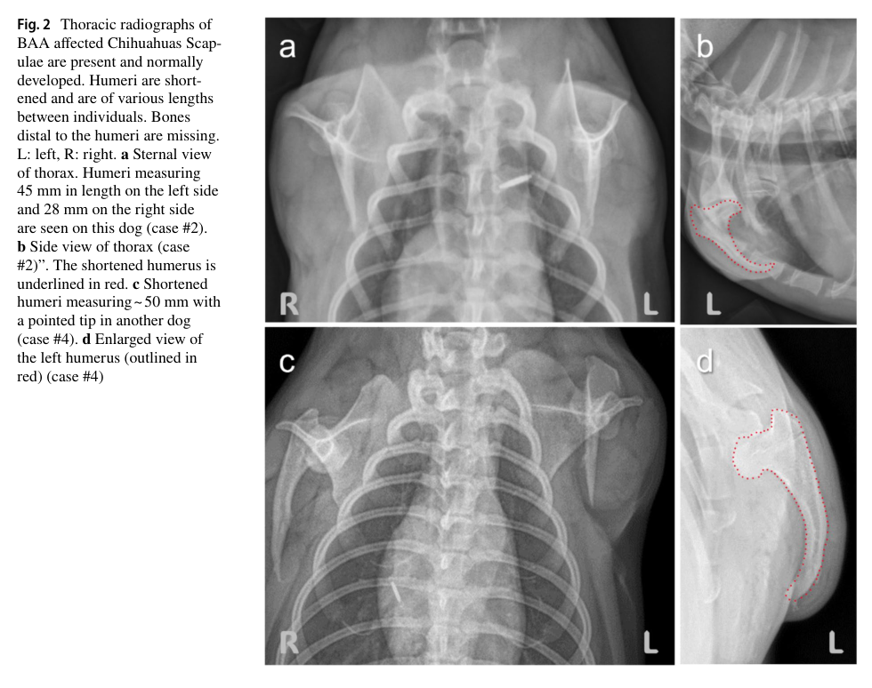

## Question

# Disease Characteristics Research Template

## Target Disease
- **Disease Name:** Tetraamelia Syndrome 2
- **MONDO ID:** MONDO:0060732 (if available)
- **Category:** Mendelian

## Research Objectives

Please provide a comprehensive research report on **Tetraamelia Syndrome 2** covering all of the
disease characteristics listed below. This report will be used to populate a disease knowledge
base entry. Be thorough and cite primary literature (PMID preferred) for all claims.

For each section, **suggested databases/resources** are listed. These are the first places
you should search for information on each topic.

---

### 1. Disease Information
> **Search first:** OMIM, Orphanet, ICD-10/ICD-11, MeSH, PubMed

- What is the disease? Provide a concise overview.
- What are the key identifiers? (OMIM, Orphanet, ICD-10/ICD-11, MeSH, Mondo)
- What are the common synonyms and alternative names?
- Is the information derived from individual patients (e.g., EHR) or aggregated disease-level resources?

### 2. Etiology

- **Disease Causal Factors**: What are the primary causes? (genetic, environmental, infectious, mechanistic)
- **Risk Factors**:
  > **Search first:** PubMed, Cochrane Library, UpToDate, clinical guidelines, ClinVar, ClinGen, GWAS Catalog, PheGenI, CTD, CDC, WHO, epidemiological databases
  - Genetic risk factors (causal variants, susceptibility loci, modifier genes)
  - Environmental risk factors (toxins, lifestyle, occupational exposures, age, sex, family history)
- **Protective Factors**:
  > **Search first:** PubMed, Cochrane Library, clinical trial databases, GWAS Catalog, gnomAD, WHO, CDC, nutrition databases
  - Genetic protective factors (protective variants, modifier alleles)
  - Environmental protective factors (diet, lifestyle, exposures that reduce risk)
- **Gene-Environment Interactions**: How do genetic and environmental factors interact to influence disease?
  > **Search first:** CTD, PubMed, PheGenI, GxE databases

### 3. Phenotypes
> **Search first:** HPO (Human Phenotype Ontology), OMIM, Orphanet, PubMed, clinicaltrials.gov, MedDRA, SNOMED CT, DECIPHER, LOINC

For each phenotype, provide:
- **Phenotype type**: symptoms, clinical signs, physical manifestations, behavioral changes, or laboratory abnormalities
  > For symptoms/signs: HPO, OMIM, Orphanet, PubMed
  > For behavioral changes: HPO, DSM, RDoC (Research Domain Criteria), PubMed
  > For laboratory abnormalities: LOINC, SNOMED CT, LabTests Online, PubMed
- **Phenotype characteristics**:
  > **Search first:** OMIM, Orphanet, HPO, PubMed
  - Age of symptom onset (neonatal, childhood, adult-onset, late-onset)
  - Symptom severity (mild, moderate, severe, variable)
  - Symptom progression (stable, progressive, episodic, fluctuating)
  - Frequency among affected individuals (percentage or qualitative)
- **Quality of life impact**: Effects on daily functioning and well-being (per-phenotype when possible)
  > **Search first:** EQ-5D database, SF-36, WHO QOL databases, PubMed
- Suggest HPO (Human Phenotype Ontology) terms for each phenotype

### 4. Genetic/Molecular Information

- **Causal Genes**: Gene mutations or chromosomal abnormalities responsible for disease (gene symbols, OMIM IDs)
  > **Search first:** OMIM, ClinVar, HGMD, Ensembl, NCBI Gene
- **Pathogenic Variants**:
  - Affected genes (gene symbols, HGNC IDs)
    > **Search first:** OMIM, NCBI Gene, Ensembl, HGNC, UniProt, GeneCards
  - Variant classification (pathogenic, likely pathogenic, VUS per ACMG/AMP guidelines)
    > **Search first:** ClinVar, ClinGen, ACMG/AMP guidelines, VarSome
  - Variant type/class (missense, frameshift, nonsense, splice-site, structural)
  - Allele frequency in population databases
    > **Search first:** gnomAD, 1000 Genomes, ExAC, TOPMed, dbSNP
  - Somatic vs germline origin
    > **Search first:** COSMIC (somatic), ClinVar, ICGC, TCGA
  - Functional consequences (loss of function, gain of function, dominant negative)
- **Modifier Genes**: Genes that modify disease severity or expression
- **Epigenetic Information**: DNA methylation, histone modifications, chromatin changes affecting disease
  > **Search first:** ENCODE, Roadmap Epigenomics, MethBase, DiseaseMeth
- **Chromosomal Abnormalities**: Large-scale genetic changes (aneuploidy, translocations, inversions)
  > **Search first:** DECIPHER, ClinVar, ECARUCA, UCSC Genome Browser

### 5. Environmental Information

- **Environmental Factors**: Non-genetic contributing factors (toxins, radiation, pollution, occupational exposure)
  > **Search first:** CTD (Comparative Toxicogenomics Database), TOXNET, PubMed, EPA databases
- **Lifestyle Factors**: Behavioral factors (smoking, diet, exercise, alcohol consumption)
  > **Search first:** CDC databases, WHO, PubMed, NHANES
- **Infectious Agents**: If applicable, pathogens causing or triggering disease (bacteria, viruses, fungi, parasites)
  > **Search first:** NCBI Taxonomy, ViPR, BV-BRC, MicrobeDB, GIDEON

### 6. Mechanism / Pathophysiology

**Present this section as an ordered causal chain first, then the detail below.**
Open with a numbered sequence of mechanistic steps running from the initiating
lesion (mutation, exposure, infection) to the clinical manifestation, one step per
line, each naming what it causes next. State the causal verb explicitly ("leads
to", "results in") and say where a step is inferred rather than demonstrated.
Where the mechanism branches, show the branch. The categories below are a
checklist of what to cover within those steps, not the organizing structure —
a step may draw on several of them, and a category may contribute to several
steps.

- **Molecular Pathways**: Specific signaling cascades or biochemical pathways involved (Wnt, MAPK, mTOR, PI3K-AKT, etc.)
  > **Search first:** KEGG, Reactome, WikiPathways, PathBank, BioCyc
- **Cellular Processes**: Cell-level mechanisms (apoptosis, autophagy, cell cycle dysregulation, inflammation, etc.)
  > **Search first:** Gene Ontology (GO), Reactome, KEGG, PubMed
- **Protein Dysfunction**: How protein structure or function is altered (misfolding, aggregation, loss of function, gain of function)
  > **Search first:** UniProt, PDB (Protein Data Bank), InterPro, Pfam, AlphaFold
- **Metabolic Changes**: Alterations in metabolic processes (energy metabolism, lipid metabolism, amino acid metabolism)
  > **Search first:** KEGG, BioCyc, HMDB (Human Metabolome Database), BRENDA
- **Immune System Involvement**: Role of immune response (autoimmunity, immunodeficiency, chronic inflammation)
  > **Search first:** ImmPort, Immunome Database, IEDB, Gene Ontology
- **Tissue Damage Mechanisms**: How tissues/ are injured (oxidative stress, ischemia, fibrosis, necrosis)
  > **Search first:** PubMed, Gene Ontology, Reactome
- **Biochemical Abnormalities**: Specific molecular defects (enzyme deficiencies, receptor dysfunction, ion channel defects)
  > **Search first:** BRENDA, UniProt, KEGG, OMIM, PubMed
- **Epigenetic Changes**: DNA methylation, histone modifications affecting gene expression in disease
  > **Search first:** ENCODE, Roadmap Epigenomics, MethBase, DiseaseMeth
- **Molecular Profiling** (if available):
  - Transcriptomics/gene expression changes
    > **Search first:** GEO (Gene Expression Omnibus), ArrayExpress, GTEx, Human Cell Atlas, SRA
  - Proteomics findings
    > **Search first:** PRIDE, ProteomeXchange, Human Protein Atlas, STRING, BioGRID
  - Metabolomics signatures
    > **Search first:** MetaboLights, Metabolomics Workbench, HMDB, METLIN
  - Lipidomics alterations
    > **Search first:** LIPID MAPS, SwissLipids, LipidHome, Metabolomics Workbench
  - Genomic structural features
    > **Search first:** UCSC Genome Browser, Ensembl, NCBI, dbVar, DGV
- **Advanced Technologies** (if applicable):
  - Single-cell analysis findings (cell-type specific mechanisms, cellular heterogeneity)
    > **Search first:** Human Cell Atlas, Single Cell Portal, GEO, CELLxGENE
  - Spatial transcriptomics findings
    > **Search first:** GEO, Spatial Research, Vizgen, 10x Genomics data
  - Multi-omics integration results
    > **Search first:** TCGA, ICGC, cBioPortal, LinkedOmics, PubMed
  - Functional genomics screens (CRISPR, RNAi)
    > **Search first:** DepMap, GenomeRNAi, PubMed, BioGRID ORCS

For each mechanism, describe:
- The causal chain from initial trigger to clinical manifestation
- Which mechanisms are upstream vs downstream
- What cell types and biological processes are involved
- Suggest GO terms for biological processes and CL terms for cell types

### 7. Anatomical Structures Affected

- **Organ Level**:
  - Primary organs directly affected
  - Secondary organ involvement (complications, secondary effects)
  - Body systems involved (cardiovascular, nervous, digestive, respiratory, endocrine, etc.)
  > **Search first:** Uberon, FMA (Foundational Model of Anatomy), OMIM, HPO, ICD-11, MeSH, SNOMED CT
- **Tissue and Cell Level**:
  - Specific tissue types affected (epithelial, connective, muscle, nervous)
  - Specific cell populations targeted (with Cell Ontology terms)
  > **Search first:** Uberon, Human Protein Atlas, Cell Ontology, Human Cell Atlas, CellMarker, PanglaoDB
- **Subcellular Level**:
  - Cellular compartments involved (mitochondria, nucleus, ER, lysosomes) (with GO Cellular Component terms)
  > **Search first:** Gene Ontology (Cellular Component), UniProt, Human Protein Atlas
- **Localization**:
  - Specific anatomical sites (with UBERON terms)
    > **Search first:** FMA, Uberon, NeuroNames (for brain), SNOMED CT
  - Lateralization (unilateral, bilateral, asymmetric)
    > **Search first:** HPO, clinical literature, imaging databases

### 8. Temporal Development

- **Onset**:
  - Typical age of onset (congenital, pediatric, adult, geriatric)
  - Onset pattern (acute, subacute, chronic, insidious)
  > **Search first:** OMIM, Orphanet, HPO, PubMed
- **Progression**:
  - Disease stages (early, intermediate, advanced, end-stage)
    > **Search first:** Cancer Staging Manual (AJCC), WHO classifications, PubMed
  - Progression rate (rapid, slow, variable)
  - Disease course pattern (episodic, relapsing-remitting, progressive, stable)
  - Disease duration (self-limited, chronic lifelong)
  > **Search first:** Disease registries, longitudinal cohort databases, natural history studies, PubMed, Orphanet, OMIM
- **Patterns**:
  - Remission patterns (spontaneous, treatment-induced)
    > **Search first:** Clinical trial databases, disease registries, PubMed
  - Critical periods (time windows of vulnerability or opportunity for intervention)
    > **Search first:** PubMed, developmental biology databases, clinical guidelines

### 9. Inheritance and Population

- **Epidemiology**:
  - Prevalence (cases per 100,000 at given time)
  - Incidence (new cases per 100,000 per year)
  > **Search first:** Orphanet, CDC, WHO, GBD (Global Burden of Disease), national registries, SEER, disease registries
- **For Genetic Etiology**:
  - Inheritance pattern (AD, AR, X-linked, mitochondrial, multifactorial, polygenic)
    > **Search first:** OMIM, Orphanet, ClinVar, GTR (Genetic Testing Registry)
  - Penetrance (complete, incomplete, age-dependent)
    > **Search first:** ClinVar, OMIM, PubMed, ClinGen
  - Expressivity (variable, consistent)
    > **Search first:** OMIM, ClinVar, PubMed
  - Genetic anticipation (increasing severity in successive generations)
    > **Search first:** OMIM, PubMed (especially for repeat expansion disorders)
  - Germline mosaicism
    > **Search first:** ClinVar, OMIM, genetic counseling literature, PubMed
  - Founder effects (population-specific mutations)
    > **Search first:** gnomAD, population genetics databases, PubMed
  - Consanguinity role
    > **Search first:** OMIM, population studies, genetic counseling resources
  - Carrier frequency
    > **Search first:** gnomAD, carrier screening databases, GeneReviews, GTR
- **Population Demographics**:
  - Affected populations (ethnic or demographic groups with higher prevalence)
    > **Search first:** gnomAD, 1000 Genomes, PAGE Study, PubMed, population registries
  - Geographic distribution (endemic areas, regional variation)
    > **Search first:** WHO, CDC, GBD, Orphanet, geographic epidemiology databases
  - Geographic distribution of specific variants
  - Sex ratio (male:female)
    > **Search first:** Disease registries, OMIM, PubMed, epidemiological databases
  - Age distribution of affected individuals
    > **Search first:** CDC, disease registries, SEER, Orphanet

### 10. Diagnostics

- **Clinical Tests**:
  - Laboratory tests (blood, urine, tissue chemistry, specific enzyme assays)
    > **Search first:** LOINC, LabTests Online, PubMed
  - Biomarkers (proteins, metabolites, genetic markers, circulating biomarkers)
    > **Search first:** FDA Biomarker List, BEST (Biomarkers, EndpointS, and other Tools), PubMed
  - Imaging studies (X-ray, CT, MRI, PET, ultrasound)
    > **Search first:** RadLex, DICOM, Radiopaedia, imaging databases
  - Functional tests (pulmonary function, cardiac stress tests)
    > **Search first:** LOINC, clinical guidelines, PubMed
  - Electrophysiology (EEG, EMG, ECG, nerve conduction studies)
    > **Search first:** LOINC, clinical neurophysiology databases, PubMed
  - Biopsy findings (histopathology, immunohistochemistry)
    > **Search first:** SNOMED CT, College of American Pathologists resources, PubMed
  - Pathology findings (microscopic examination)
    > **Search first:** SNOMED CT, Digital Pathology databases, PubMed
- **Genetic Testing**:
  > **Search first:** GTR (Genetic Testing Registry), GeneReviews, ClinGen
  - Overview of recommended genetic testing approach
  - Whole genome sequencing (WGS) utility
    > **Search first:** GTR, ClinVar, GEL (Genomics England), gnomAD
  - Whole exome sequencing (WES) utility
    > **Search first:** GTR, ClinVar, OMIM, GeneMatcher
  - Gene panels (which panels, which genes)
    > **Search first:** GTR, ClinVar, laboratory-specific databases
  - Single gene testing
    > **Search first:** GTR, ClinVar, OMIM, GeneReviews
  - Chromosomal microarray (CMA)
    > **Search first:** DECIPHER, ClinVar, dbVar, ECARUCA
  - Karyotyping
    > **Search first:** Chromosome Abnormality Database, ClinVar, cytogenetics resources
  - FISH
    > **Search first:** ClinVar, cytogenetics databases, PubMed
  - Mitochondrial DNA testing
    > **Search first:** MITOMAP, MSeqDR, ClinVar, GTR
  - Repeat expansion testing
    > **Search first:** GTR, ClinVar, repeat expansion databases, PubMed
- **Omics-Based Diagnostics** (if applicable):
  - RNA sequencing / transcriptomics
    > **Search first:** GEO, ArrayExpress, GTEx, RNA-seq databases
  - Proteomics
    > **Search first:** PRIDE, ProteomeXchange, FDA Biomarker database
  - Metabolomics
    > **Search first:** MetaboLights, Metabolomics Workbench, HMDB
  - Epigenomics
    > **Search first:** GEO, ENCODE, Roadmap Epigenomics, MethBase
  - Liquid biopsy
    > **Search first:** COSMIC, ClinVar, liquid biopsy databases, PubMed
- **Clinical Criteria**:
  - Standardized diagnostic criteria (DSM, ICD, society guidelines)
    > **Search first:** DSM-5, ICD-11, clinical society guidelines, UpToDate
  - Differential diagnosis (other conditions to rule out, with distinguishing features)
    > **Search first:** DynaMed, UpToDate, clinical decision support systems
- **Screening**:
  - Screening methods for asymptomatic individuals (newborn screening, carrier screening, cascade screening)
    > **Search first:** ACMG recommendations, CDC newborn screening, GTR

### 11. Outcome/Prognosis

- **Survival and Mortality**:
  - Survival rate (5-year, 10-year, overall)
    > **Search first:** SEER, cancer registries, disease-specific registries, PubMed
  - Life expectancy (with and without treatment if applicable)
    > **Search first:** Orphanet, disease registries, actuarial databases, PubMed
  - Mortality rate
    > **Search first:** CDC, WHO, GBD, national mortality databases
  - Disease-specific mortality (deaths directly attributable to disease)
    > **Search first:** Disease registries, CDC Wonder, GBD, PubMed
- **Morbidity and Function**:
  - Morbidity (disease-related disability and health impacts)
    > **Search first:** GBD, WHO, disability databases, PubMed
  - Disability outcomes (long-term functional impairments)
    > **Search first:** ICF (International Classification of Functioning), disability registries
  - Quality of life measures (EQ-5D, SF-36, PROMIS, disease-specific tools)
    > **Search first:** EQ-5D database, SF-36, PROMIS, PubMed
- **Disease Course**:
  - Complications (secondary problems: infections, organ failure, etc.)
    > **Search first:** ICD codes, disease registries, clinical databases, PubMed
  - Recovery potential (likelihood and extent of recovery, with vs without treatment)
    > **Search first:** Natural history studies, rehabilitation databases, PubMed
- **Prediction**:
  - Prognostic factors (age, disease severity, biomarkers, treatment response)
    > **Search first:** Prognostic models databases, clinical calculators, PubMed
  - Prognostic biomarkers (molecular markers predicting disease course)
    > **Search first:** FDA Biomarker database, PubMed, cancer prognostic databases

### 12. Treatment

- **Pharmacotherapy**:
  - Pharmacological treatments (drug names, drug classes, mechanisms of action)
    > **Search first:** DrugBank, RxNorm, ATC classification, DailyMed, FDA databases
  - Pharmacogenomics (how genetic variants affect drug metabolism, efficacy, toxicity)
    > **Search first:** PharmGKB, CPIC (Clinical Pharmacogenetics), FDA Table of PGx Biomarkers
- **Advanced Therapeutics**:
  - Gene therapy (viral vectors, CRISPR, gene replacement, gene editing)
    > **Search first:** ClinicalTrials.gov, FDA gene therapy database, ASGCT resources
  - Cell therapy (stem cell transplant, CAR-T, cellular therapeutics)
    > **Search first:** ClinicalTrials.gov, FDA cell therapy database, FACT standards
  - RNA-based therapies (ASOs, siRNA, mRNA therapies)
    > **Search first:** ClinicalTrials.gov, FDA approvals, PubMed
  - Targeted therapies (treatments directed at specific molecular targets)
    > **Search first:** My Cancer Genome, OncoKB, ClinicalTrials.gov, FDA approvals
  - Immunotherapies (checkpoint inhibitors, monoclonal antibodies)
    > **Search first:** Cancer Immunotherapy Database, FDA approvals, ClinicalTrials.gov
- **Surgical and Interventional**:
  - Surgical interventions (types of surgery, timing, outcomes)
    > **Search first:** CPT codes, surgical registries, clinical guidelines, PubMed
- **Supportive and Rehabilitative**:
  - Supportive care (symptom management, pain control, nutrition)
    > **Search first:** Clinical guidelines, Cochrane Library, PubMed
  - Rehabilitation (physical therapy, occupational therapy, speech therapy)
    > **Search first:** Rehabilitation medicine databases, clinical guidelines, PubMed
- **Experimental**:
  - Experimental treatments in clinical trials (with NCT identifiers if available)
    > **Search first:** ClinicalTrials.gov, EU Clinical Trials Register, WHO ICTRP
- **Treatment Outcomes**:
  - Treatment response rates
    > **Search first:** Clinical trial databases, FDA reviews, systematic reviews, PubMed
  - Side effects and adverse events
    > **Search first:** FDA Adverse Event Reporting System (FAERS), MedWatch, PubMed
- **Treatment Strategy**:
  - Treatment algorithms (clinical pathways, decision trees)
    > **Search first:** Clinical practice guidelines, NCCN Guidelines, UpToDate
  - Combination therapies
    > **Search first:** ClinicalTrials.gov, treatment guidelines, PubMed
  - Personalized medicine approaches (genotype-guided treatment)
    > **Search first:** My Cancer Genome, CIViC, PharmGKB, precision medicine databases

For each treatment, suggest NCIT (NCI Thesaurus) clinical-intervention terms where applicable.

### 13. Prevention

- **Prevention Levels**:
  - Primary prevention (preventing disease occurrence: vaccination, risk factor modification)
    > **Search first:** CDC, WHO, USPSTF recommendations, Cochrane Library
  - Secondary prevention (early detection and treatment: screening programs, early intervention)
    > **Search first:** USPSTF, CDC screening guidelines, WHO
  - Tertiary prevention (preventing complications in those with disease)
    > **Search first:** Clinical guidelines, disease management protocols, PubMed
- **Immunization**: Vaccine strategies (if applicable)
  > **Search first:** CDC vaccine schedules, WHO immunization, FDA vaccine database
- **Screening and Early Detection**:
  - Screening programs (population-based: newborn screening, cancer screening)
    > **Search first:** CDC screening programs, USPSTF, cancer screening databases
  - Genetic screening (carrier screening, preimplantation genetic diagnosis, prenatal testing)
    > **Search first:** ACMG recommendations, ACOG guidelines, GTR
  - Risk stratification (identifying high-risk individuals for targeted prevention)
    > **Search first:** Risk prediction models, clinical calculators, PubMed
- **Behavioral Interventions**: Lifestyle modifications to reduce risk
  > **Search first:** CDC, WHO, behavioral intervention databases, Cochrane Library
- **Counseling**: Genetic counseling (risk assessment, family planning guidance)
  > **Search first:** NSGC resources, ACMG guidelines, GeneReviews
- **Public Health**:
  - Public health interventions (sanitation, vector control, health education)
    > **Search first:** CDC, WHO, public health databases, PubMed
  - Environmental interventions (reducing environmental risk factors)
    > **Search first:** EPA databases, WHO environmental health, PubMed
- **Prophylaxis**: Preventive medications or procedures
  > **Search first:** Clinical guidelines, FDA approvals, PubMed

### 14. Other Species / Natural Disease

- **Taxonomy**: Species affected (with NCBI Taxon identifiers)
  > **Search first:** NCBI Taxonomy
- **Breed**: Specific breeds affected (with VBO identifiers if applicable)
  > **Search first:** VBO (Vertebrate Breed Ontology)
- **Gene**: Orthologous genes in other species (with NCBI Gene IDs)
  > **Search first:** NCBI Gene
- **Natural Disease**:
  - Naturally occurring disease in other species (companion animals, wildlife)
    > **Search first:** OMIA (Online Mendelian Inheritance in Animals), VetCompass, PubMed
  - Veterinary relevance and importance in animal health
    > **Search first:** OMIA, veterinary databases, PubMed
- **Comparative Biology**:
  - Comparative pathology (similarities and differences across species)
    > **Search first:** OMIA, comparative pathology databases, PubMed
  - Evolutionary conservation of disease mechanisms
    > **Search first:** HomoloGene, OrthoMCL, Alliance of Genome Resources
- **Transmission** (if applicable):
  - Zoonotic potential
    > **Search first:** CDC zoonotic diseases, WHO zoonoses, GIDEON
  - Cross-species susceptibility
    > **Search first:** NCBI Taxonomy, veterinary databases, PubMed

### 15. Model Organisms

- **Model Types**:
  - Model organism type (mammalian, invertebrate, cellular, in vitro)
    > **Search first:** Alliance of Genome Resources, model organism databases
  - Specific model systems (mouse, rat, zebrafish, Drosophila, C. elegans, yeast, cell lines, organoids, iPSCs)
    > **Search first:** MGI, RGD, ZFIN, FlyBase, WormBase, SGD, ATCC, Cellosaurus
  - Induced models (drug treatment, surgical intervention, environmental manipulation)
    > **Search first:** MGI, model organism databases, PubMed
- **Genetic Models**:
  - Types available (knockout, knock-in, transgenic, conditional, humanized)
    > **Search first:** MGI, IMPC, KOMP, EuMMCR, IMSR
- **Model Characteristics**:
  - Phenotype recapitulation (how well model reproduces human disease features)
    > **Search first:** Model organism databases, comparative studies, PubMed
  - Model limitations (aspects of human disease not captured)
    > **Search first:** Model organism databases, PubMed, review articles
- **Applications**:
  - Research applications (what aspects of disease can be studied)
    > **Search first:** Model organism databases, PubMed
- **Resources**:
  - Model databases
    > **Search first:** MGI, RGD, ZFIN, FlyBase, WormBase, IMSR, EMMA, MMRRC

---

## Citation Requirements

- Cite primary literature (PMID preferred) for all mechanistic and clinical claims
- Prioritize recent reviews and landmark papers
- Include direct quotes from abstracts where possible to support key statements
- Distinguish evidence source types: human clinical, model organism, in vitro, computational

## Output Format

Structure your response as a comprehensive narrative organized by the sections above.
For each section, provide:
- Factual content with specific details (numbers, percentages, gene names, variant nomenclature)
- Ontology term suggestions (HPO, GO, CL, UBERON, CHEBI, NCIT, MONDO) where applicable
- Evidence citations with PMIDs
- Direct quotes from abstracts to support key claims
- Clear indication when information is not available or not applicable for this disease

This report will be used to populate a disease knowledge base entry with:
- Pathophysiology descriptions with causal chains
- Gene/protein annotations (HGNC, GO terms)
- Phenotype associations (HP terms) with frequencies
- Cell type involvement (CL terms)
- Anatomical locations (UBERON terms)
- Chemical entities (CHEBI terms)
- Treatment annotations (NCIT terms)
- Evidence items with PMIDs and exact abstract quotes
- Epidemiology, prognosis, diagnostic, and prevention information
- Animal model descriptions with phenotype recapitulation details

## Output

Question: You are an expert researcher providing comprehensive, well-cited information.

Provide detailed information focusing on:
1. Key concepts and definitions with current understanding
2. Recent developments and latest research (prioritize 2023-2024 sources)
3. Current applications and real-world implementations
4. Expert opinions and analysis from authoritative sources
5. Relevant statistics and data from recent studies

Format as a comprehensive research report with proper citations. Include URLs and publication dates where available.
Always prioritize recent, authoritative sources and provide specific citations for all major claims.

# Disease Characteristics Research Template

## Target Disease
- **Disease Name:** Tetraamelia Syndrome 2
- **MONDO ID:** MONDO:0060732 (if available)
- **Category:** Mendelian

## Research Objectives

Please provide a comprehensive research report on **Tetraamelia Syndrome 2** covering all of the
disease characteristics listed below. This report will be used to populate a disease knowledge
base entry. Be thorough and cite primary literature (PMID preferred) for all claims.

For each section, **suggested databases/resources** are listed. These are the first places
you should search for information on each topic.

---

### 1. Disease Information
> **Search first:** OMIM, Orphanet, ICD-10/ICD-11, MeSH, PubMed

- What is the disease? Provide a concise overview.
- What are the key identifiers? (OMIM, Orphanet, ICD-10/ICD-11, MeSH, Mondo)
- What are the common synonyms and alternative names?
- Is the information derived from individual patients (e.g., EHR) or aggregated disease-level resources?

### 2. Etiology

- **Disease Causal Factors**: What are the primary causes? (genetic, environmental, infectious, mechanistic)
- **Risk Factors**:
  > **Search first:** PubMed, Cochrane Library, UpToDate, clinical guidelines, ClinVar, ClinGen, GWAS Catalog, PheGenI, CTD, CDC, WHO, epidemiological databases
  - Genetic risk factors (causal variants, susceptibility loci, modifier genes)
  - Environmental risk factors (toxins, lifestyle, occupational exposures, age, sex, family history)
- **Protective Factors**:
  > **Search first:** PubMed, Cochrane Library, clinical trial databases, GWAS Catalog, gnomAD, WHO, CDC, nutrition databases
  - Genetic protective factors (protective variants, modifier alleles)
  - Environmental protective factors (diet, lifestyle, exposures that reduce risk)
- **Gene-Environment Interactions**: How do genetic and environmental factors interact to influence disease?
  > **Search first:** CTD, PubMed, PheGenI, GxE databases

### 3. Phenotypes
> **Search first:** HPO (Human Phenotype Ontology), OMIM, Orphanet, PubMed, clinicaltrials.gov, MedDRA, SNOMED CT, DECIPHER, LOINC

For each phenotype, provide:
- **Phenotype type**: symptoms, clinical signs, physical manifestations, behavioral changes, or laboratory abnormalities
  > For symptoms/signs: HPO, OMIM, Orphanet, PubMed
  > For behavioral changes: HPO, DSM, RDoC (Research Domain Criteria), PubMed
  > For laboratory abnormalities: LOINC, SNOMED CT, LabTests Online, PubMed
- **Phenotype characteristics**:
  > **Search first:** OMIM, Orphanet, HPO, PubMed
  - Age of symptom onset (neonatal, childhood, adult-onset, late-onset)
  - Symptom severity (mild, moderate, severe, variable)
  - Symptom progression (stable, progressive, episodic, fluctuating)
  - Frequency among affected individuals (percentage or qualitative)
- **Quality of life impact**: Effects on daily functioning and well-being (per-phenotype when possible)
  > **Search first:** EQ-5D database, SF-36, WHO QOL databases, PubMed
- Suggest HPO (Human Phenotype Ontology) terms for each phenotype

### 4. Genetic/Molecular Information

- **Causal Genes**: Gene mutations or chromosomal abnormalities responsible for disease (gene symbols, OMIM IDs)
  > **Search first:** OMIM, ClinVar, HGMD, Ensembl, NCBI Gene
- **Pathogenic Variants**:
  - Affected genes (gene symbols, HGNC IDs)
    > **Search first:** OMIM, NCBI Gene, Ensembl, HGNC, UniProt, GeneCards
  - Variant classification (pathogenic, likely pathogenic, VUS per ACMG/AMP guidelines)
    > **Search first:** ClinVar, ClinGen, ACMG/AMP guidelines, VarSome
  - Variant type/class (missense, frameshift, nonsense, splice-site, structural)
  - Allele frequency in population databases
    > **Search first:** gnomAD, 1000 Genomes, ExAC, TOPMed, dbSNP
  - Somatic vs germline origin
    > **Search first:** COSMIC (somatic), ClinVar, ICGC, TCGA
  - Functional consequences (loss of function, gain of function, dominant negative)
- **Modifier Genes**: Genes that modify disease severity or expression
- **Epigenetic Information**: DNA methylation, histone modifications, chromatin changes affecting disease
  > **Search first:** ENCODE, Roadmap Epigenomics, MethBase, DiseaseMeth
- **Chromosomal Abnormalities**: Large-scale genetic changes (aneuploidy, translocations, inversions)
  > **Search first:** DECIPHER, ClinVar, ECARUCA, UCSC Genome Browser

### 5. Environmental Information

- **Environmental Factors**: Non-genetic contributing factors (toxins, radiation, pollution, occupational exposure)
  > **Search first:** CTD (Comparative Toxicogenomics Database), TOXNET, PubMed, EPA databases
- **Lifestyle Factors**: Behavioral factors (smoking, diet, exercise, alcohol consumption)
  > **Search first:** CDC databases, WHO, PubMed, NHANES
- **Infectious Agents**: If applicable, pathogens causing or triggering disease (bacteria, viruses, fungi, parasites)
  > **Search first:** NCBI Taxonomy, ViPR, BV-BRC, MicrobeDB, GIDEON

### 6. Mechanism / Pathophysiology

**Present this section as an ordered causal chain first, then the detail below.**
Open with a numbered sequence of mechanistic steps running from the initiating
lesion (mutation, exposure, infection) to the clinical manifestation, one step per
line, each naming what it causes next. State the causal verb explicitly ("leads
to", "results in") and say where a step is inferred rather than demonstrated.
Where the mechanism branches, show the branch. The categories below are a
checklist of what to cover within those steps, not the organizing structure —
a step may draw on several of them, and a category may contribute to several
steps.

- **Molecular Pathways**: Specific signaling cascades or biochemical pathways involved (Wnt, MAPK, mTOR, PI3K-AKT, etc.)
  > **Search first:** KEGG, Reactome, WikiPathways, PathBank, BioCyc
- **Cellular Processes**: Cell-level mechanisms (apoptosis, autophagy, cell cycle dysregulation, inflammation, etc.)
  > **Search first:** Gene Ontology (GO), Reactome, KEGG, PubMed
- **Protein Dysfunction**: How protein structure or function is altered (misfolding, aggregation, loss of function, gain of function)
  > **Search first:** UniProt, PDB (Protein Data Bank), InterPro, Pfam, AlphaFold
- **Metabolic Changes**: Alterations in metabolic processes (energy metabolism, lipid metabolism, amino acid metabolism)
  > **Search first:** KEGG, BioCyc, HMDB (Human Metabolome Database), BRENDA
- **Immune System Involvement**: Role of immune response (autoimmunity, immunodeficiency, chronic inflammation)
  > **Search first:** ImmPort, Immunome Database, IEDB, Gene Ontology
- **Tissue Damage Mechanisms**: How tissues/ are injured (oxidative stress, ischemia, fibrosis, necrosis)
  > **Search first:** PubMed, Gene Ontology, Reactome
- **Biochemical Abnormalities**: Specific molecular defects (enzyme deficiencies, receptor dysfunction, ion channel defects)
  > **Search first:** BRENDA, UniProt, KEGG, OMIM, PubMed
- **Epigenetic Changes**: DNA methylation, histone modifications affecting gene expression in disease
  > **Search first:** ENCODE, Roadmap Epigenomics, MethBase, DiseaseMeth
- **Molecular Profiling** (if available):
  - Transcriptomics/gene expression changes
    > **Search first:** GEO (Gene Expression Omnibus), ArrayExpress, GTEx, Human Cell Atlas, SRA
  - Proteomics findings
    > **Search first:** PRIDE, ProteomeXchange, Human Protein Atlas, STRING, BioGRID
  - Metabolomics signatures
    > **Search first:** MetaboLights, Metabolomics Workbench, HMDB, METLIN
  - Lipidomics alterations
    > **Search first:** LIPID MAPS, SwissLipids, LipidHome, Metabolomics Workbench
  - Genomic structural features
    > **Search first:** UCSC Genome Browser, Ensembl, NCBI, dbVar, DGV
- **Advanced Technologies** (if applicable):
  - Single-cell analysis findings (cell-type specific mechanisms, cellular heterogeneity)
    > **Search first:** Human Cell Atlas, Single Cell Portal, GEO, CELLxGENE
  - Spatial transcriptomics findings
    > **Search first:** GEO, Spatial Research, Vizgen, 10x Genomics data
  - Multi-omics integration results
    > **Search first:** TCGA, ICGC, cBioPortal, LinkedOmics, PubMed
  - Functional genomics screens (CRISPR, RNAi)
    > **Search first:** DepMap, GenomeRNAi, PubMed, BioGRID ORCS

For each mechanism, describe:
- The causal chain from initial trigger to clinical manifestation
- Which mechanisms are upstream vs downstream
- What cell types and biological processes are involved
- Suggest GO terms for biological processes and CL terms for cell types

### 7. Anatomical Structures Affected

- **Organ Level**:
  - Primary organs directly affected
  - Secondary organ involvement (complications, secondary effects)
  - Body systems involved (cardiovascular, nervous, digestive, respiratory, endocrine, etc.)
  > **Search first:** Uberon, FMA (Foundational Model of Anatomy), OMIM, HPO, ICD-11, MeSH, SNOMED CT
- **Tissue and Cell Level**:
  - Specific tissue types affected (epithelial, connective, muscle, nervous)
  - Specific cell populations targeted (with Cell Ontology terms)
  > **Search first:** Uberon, Human Protein Atlas, Cell Ontology, Human Cell Atlas, CellMarker, PanglaoDB
- **Subcellular Level**:
  - Cellular compartments involved (mitochondria, nucleus, ER, lysosomes) (with GO Cellular Component terms)
  > **Search first:** Gene Ontology (Cellular Component), UniProt, Human Protein Atlas
- **Localization**:
  - Specific anatomical sites (with UBERON terms)
    > **Search first:** FMA, Uberon, NeuroNames (for brain), SNOMED CT
  - Lateralization (unilateral, bilateral, asymmetric)
    > **Search first:** HPO, clinical literature, imaging databases

### 8. Temporal Development

- **Onset**:
  - Typical age of onset (congenital, pediatric, adult, geriatric)
  - Onset pattern (acute, subacute, chronic, insidious)
  > **Search first:** OMIM, Orphanet, HPO, PubMed
- **Progression**:
  - Disease stages (early, intermediate, advanced, end-stage)
    > **Search first:** Cancer Staging Manual (AJCC), WHO classifications, PubMed
  - Progression rate (rapid, slow, variable)
  - Disease course pattern (episodic, relapsing-remitting, progressive, stable)
  - Disease duration (self-limited, chronic lifelong)
  > **Search first:** Disease registries, longitudinal cohort databases, natural history studies, PubMed, Orphanet, OMIM
- **Patterns**:
  - Remission patterns (spontaneous, treatment-induced)
    > **Search first:** Clinical trial databases, disease registries, PubMed
  - Critical periods (time windows of vulnerability or opportunity for intervention)
    > **Search first:** PubMed, developmental biology databases, clinical guidelines

### 9. Inheritance and Population

- **Epidemiology**:
  - Prevalence (cases per 100,000 at given time)
  - Incidence (new cases per 100,000 per year)
  > **Search first:** Orphanet, CDC, WHO, GBD (Global Burden of Disease), national registries, SEER, disease registries
- **For Genetic Etiology**:
  - Inheritance pattern (AD, AR, X-linked, mitochondrial, multifactorial, polygenic)
    > **Search first:** OMIM, Orphanet, ClinVar, GTR (Genetic Testing Registry)
  - Penetrance (complete, incomplete, age-dependent)
    > **Search first:** ClinVar, OMIM, PubMed, ClinGen
  - Expressivity (variable, consistent)
    > **Search first:** OMIM, ClinVar, PubMed
  - Genetic anticipation (increasing severity in successive generations)
    > **Search first:** OMIM, PubMed (especially for repeat expansion disorders)
  - Germline mosaicism
    > **Search first:** ClinVar, OMIM, genetic counseling literature, PubMed
  - Founder effects (population-specific mutations)
    > **Search first:** gnomAD, population genetics databases, PubMed
  - Consanguinity role
    > **Search first:** OMIM, population studies, genetic counseling resources
  - Carrier frequency
    > **Search first:** gnomAD, carrier screening databases, GeneReviews, GTR
- **Population Demographics**:
  - Affected populations (ethnic or demographic groups with higher prevalence)
    > **Search first:** gnomAD, 1000 Genomes, PAGE Study, PubMed, population registries
  - Geographic distribution (endemic areas, regional variation)
    > **Search first:** WHO, CDC, GBD, Orphanet, geographic epidemiology databases
  - Geographic distribution of specific variants
  - Sex ratio (male:female)
    > **Search first:** Disease registries, OMIM, PubMed, epidemiological databases
  - Age distribution of affected individuals
    > **Search first:** CDC, disease registries, SEER, Orphanet

### 10. Diagnostics

- **Clinical Tests**:
  - Laboratory tests (blood, urine, tissue chemistry, specific enzyme assays)
    > **Search first:** LOINC, LabTests Online, PubMed
  - Biomarkers (proteins, metabolites, genetic markers, circulating biomarkers)
    > **Search first:** FDA Biomarker List, BEST (Biomarkers, EndpointS, and other Tools), PubMed
  - Imaging studies (X-ray, CT, MRI, PET, ultrasound)
    > **Search first:** RadLex, DICOM, Radiopaedia, imaging databases
  - Functional tests (pulmonary function, cardiac stress tests)
    > **Search first:** LOINC, clinical guidelines, PubMed
  - Electrophysiology (EEG, EMG, ECG, nerve conduction studies)
    > **Search first:** LOINC, clinical neurophysiology databases, PubMed
  - Biopsy findings (histopathology, immunohistochemistry)
    > **Search first:** SNOMED CT, College of American Pathologists resources, PubMed
  - Pathology findings (microscopic examination)
    > **Search first:** SNOMED CT, Digital Pathology databases, PubMed
- **Genetic Testing**:
  > **Search first:** GTR (Genetic Testing Registry), GeneReviews, ClinGen
  - Overview of recommended genetic testing approach
  - Whole genome sequencing (WGS) utility
    > **Search first:** GTR, ClinVar, GEL (Genomics England), gnomAD
  - Whole exome sequencing (WES) utility
    > **Search first:** GTR, ClinVar, OMIM, GeneMatcher
  - Gene panels (which panels, which genes)
    > **Search first:** GTR, ClinVar, laboratory-specific databases
  - Single gene testing
    > **Search first:** GTR, ClinVar, OMIM, GeneReviews
  - Chromosomal microarray (CMA)
    > **Search first:** DECIPHER, ClinVar, dbVar, ECARUCA
  - Karyotyping
    > **Search first:** Chromosome Abnormality Database, ClinVar, cytogenetics resources
  - FISH
    > **Search first:** ClinVar, cytogenetics databases, PubMed
  - Mitochondrial DNA testing
    > **Search first:** MITOMAP, MSeqDR, ClinVar, GTR
  - Repeat expansion testing
    > **Search first:** GTR, ClinVar, repeat expansion databases, PubMed
- **Omics-Based Diagnostics** (if applicable):
  - RNA sequencing / transcriptomics
    > **Search first:** GEO, ArrayExpress, GTEx, RNA-seq databases
  - Proteomics
    > **Search first:** PRIDE, ProteomeXchange, FDA Biomarker database
  - Metabolomics
    > **Search first:** MetaboLights, Metabolomics Workbench, HMDB
  - Epigenomics
    > **Search first:** GEO, ENCODE, Roadmap Epigenomics, MethBase
  - Liquid biopsy
    > **Search first:** COSMIC, ClinVar, liquid biopsy databases, PubMed
- **Clinical Criteria**:
  - Standardized diagnostic criteria (DSM, ICD, society guidelines)
    > **Search first:** DSM-5, ICD-11, clinical society guidelines, UpToDate
  - Differential diagnosis (other conditions to rule out, with distinguishing features)
    > **Search first:** DynaMed, UpToDate, clinical decision support systems
- **Screening**:
  - Screening methods for asymptomatic individuals (newborn screening, carrier screening, cascade screening)
    > **Search first:** ACMG recommendations, CDC newborn screening, GTR

### 11. Outcome/Prognosis

- **Survival and Mortality**:
  - Survival rate (5-year, 10-year, overall)
    > **Search first:** SEER, cancer registries, disease-specific registries, PubMed
  - Life expectancy (with and without treatment if applicable)
    > **Search first:** Orphanet, disease registries, actuarial databases, PubMed
  - Mortality rate
    > **Search first:** CDC, WHO, GBD, national mortality databases
  - Disease-specific mortality (deaths directly attributable to disease)
    > **Search first:** Disease registries, CDC Wonder, GBD, PubMed
- **Morbidity and Function**:
  - Morbidity (disease-related disability and health impacts)
    > **Search first:** GBD, WHO, disability databases, PubMed
  - Disability outcomes (long-term functional impairments)
    > **Search first:** ICF (International Classification of Functioning), disability registries
  - Quality of life measures (EQ-5D, SF-36, PROMIS, disease-specific tools)
    > **Search first:** EQ-5D database, SF-36, PROMIS, PubMed
- **Disease Course**:
  - Complications (secondary problems: infections, organ failure, etc.)
    > **Search first:** ICD codes, disease registries, clinical databases, PubMed
  - Recovery potential (likelihood and extent of recovery, with vs without treatment)
    > **Search first:** Natural history studies, rehabilitation databases, PubMed
- **Prediction**:
  - Prognostic factors (age, disease severity, biomarkers, treatment response)
    > **Search first:** Prognostic models databases, clinical calculators, PubMed
  - Prognostic biomarkers (molecular markers predicting disease course)
    > **Search first:** FDA Biomarker database, PubMed, cancer prognostic databases

### 12. Treatment

- **Pharmacotherapy**:
  - Pharmacological treatments (drug names, drug classes, mechanisms of action)
    > **Search first:** DrugBank, RxNorm, ATC classification, DailyMed, FDA databases
  - Pharmacogenomics (how genetic variants affect drug metabolism, efficacy, toxicity)
    > **Search first:** PharmGKB, CPIC (Clinical Pharmacogenetics), FDA Table of PGx Biomarkers
- **Advanced Therapeutics**:
  - Gene therapy (viral vectors, CRISPR, gene replacement, gene editing)
    > **Search first:** ClinicalTrials.gov, FDA gene therapy database, ASGCT resources
  - Cell therapy (stem cell transplant, CAR-T, cellular therapeutics)
    > **Search first:** ClinicalTrials.gov, FDA cell therapy database, FACT standards
  - RNA-based therapies (ASOs, siRNA, mRNA therapies)
    > **Search first:** ClinicalTrials.gov, FDA approvals, PubMed
  - Targeted therapies (treatments directed at specific molecular targets)
    > **Search first:** My Cancer Genome, OncoKB, ClinicalTrials.gov, FDA approvals
  - Immunotherapies (checkpoint inhibitors, monoclonal antibodies)
    > **Search first:** Cancer Immunotherapy Database, FDA approvals, ClinicalTrials.gov
- **Surgical and Interventional**:
  - Surgical interventions (types of surgery, timing, outcomes)
    > **Search first:** CPT codes, surgical registries, clinical guidelines, PubMed
- **Supportive and Rehabilitative**:
  - Supportive care (symptom management, pain control, nutrition)
    > **Search first:** Clinical guidelines, Cochrane Library, PubMed
  - Rehabilitation (physical therapy, occupational therapy, speech therapy)
    > **Search first:** Rehabilitation medicine databases, clinical guidelines, PubMed
- **Experimental**:
  - Experimental treatments in clinical trials (with NCT identifiers if available)
    > **Search first:** ClinicalTrials.gov, EU Clinical Trials Register, WHO ICTRP
- **Treatment Outcomes**:
  - Treatment response rates
    > **Search first:** Clinical trial databases, FDA reviews, systematic reviews, PubMed
  - Side effects and adverse events
    > **Search first:** FDA Adverse Event Reporting System (FAERS), MedWatch, PubMed
- **Treatment Strategy**:
  - Treatment algorithms (clinical pathways, decision trees)
    > **Search first:** Clinical practice guidelines, NCCN Guidelines, UpToDate
  - Combination therapies
    > **Search first:** ClinicalTrials.gov, treatment guidelines, PubMed
  - Personalized medicine approaches (genotype-guided treatment)
    > **Search first:** My Cancer Genome, CIViC, PharmGKB, precision medicine databases

For each treatment, suggest NCIT (NCI Thesaurus) clinical-intervention terms where applicable.

### 13. Prevention

- **Prevention Levels**:
  - Primary prevention (preventing disease occurrence: vaccination, risk factor modification)
    > **Search first:** CDC, WHO, USPSTF recommendations, Cochrane Library
  - Secondary prevention (early detection and treatment: screening programs, early intervention)
    > **Search first:** USPSTF, CDC screening guidelines, WHO
  - Tertiary prevention (preventing complications in those with disease)
    > **Search first:** Clinical guidelines, disease management protocols, PubMed
- **Immunization**: Vaccine strategies (if applicable)
  > **Search first:** CDC vaccine schedules, WHO immunization, FDA vaccine database
- **Screening and Early Detection**:
  - Screening programs (population-based: newborn screening, cancer screening)
    > **Search first:** CDC screening programs, USPSTF, cancer screening databases
  - Genetic screening (carrier screening, preimplantation genetic diagnosis, prenatal testing)
    > **Search first:** ACMG recommendations, ACOG guidelines, GTR
  - Risk stratification (identifying high-risk individuals for targeted prevention)
    > **Search first:** Risk prediction models, clinical calculators, PubMed
- **Behavioral Interventions**: Lifestyle modifications to reduce risk
  > **Search first:** CDC, WHO, behavioral intervention databases, Cochrane Library
- **Counseling**: Genetic counseling (risk assessment, family planning guidance)
  > **Search first:** NSGC resources, ACMG guidelines, GeneReviews
- **Public Health**:
  - Public health interventions (sanitation, vector control, health education)
    > **Search first:** CDC, WHO, public health databases, PubMed
  - Environmental interventions (reducing environmental risk factors)
    > **Search first:** EPA databases, WHO environmental health, PubMed
- **Prophylaxis**: Preventive medications or procedures
  > **Search first:** Clinical guidelines, FDA approvals, PubMed

### 14. Other Species / Natural Disease

- **Taxonomy**: Species affected (with NCBI Taxon identifiers)
  > **Search first:** NCBI Taxonomy
- **Breed**: Specific breeds affected (with VBO identifiers if applicable)
  > **Search first:** VBO (Vertebrate Breed Ontology)
- **Gene**: Orthologous genes in other species (with NCBI Gene IDs)
  > **Search first:** NCBI Gene
- **Natural Disease**:
  - Naturally occurring disease in other species (companion animals, wildlife)
    > **Search first:** OMIA (Online Mendelian Inheritance in Animals), VetCompass, PubMed
  - Veterinary relevance and importance in animal health
    > **Search first:** OMIA, veterinary databases, PubMed
- **Comparative Biology**:
  - Comparative pathology (similarities and differences across species)
    > **Search first:** OMIA, comparative pathology databases, PubMed
  - Evolutionary conservation of disease mechanisms
    > **Search first:** HomoloGene, OrthoMCL, Alliance of Genome Resources
- **Transmission** (if applicable):
  - Zoonotic potential
    > **Search first:** CDC zoonotic diseases, WHO zoonoses, GIDEON
  - Cross-species susceptibility
    > **Search first:** NCBI Taxonomy, veterinary databases, PubMed

### 15. Model Organisms

- **Model Types**:
  - Model organism type (mammalian, invertebrate, cellular, in vitro)
    > **Search first:** Alliance of Genome Resources, model organism databases
  - Specific model systems (mouse, rat, zebrafish, Drosophila, C. elegans, yeast, cell lines, organoids, iPSCs)
    > **Search first:** MGI, RGD, ZFIN, FlyBase, WormBase, SGD, ATCC, Cellosaurus
  - Induced models (drug treatment, surgical intervention, environmental manipulation)
    > **Search first:** MGI, model organism databases, PubMed
- **Genetic Models**:
  - Types available (knockout, knock-in, transgenic, conditional, humanized)
    > **Search first:** MGI, IMPC, KOMP, EuMMCR, IMSR
- **Model Characteristics**:
  - Phenotype recapitulation (how well model reproduces human disease features)
    > **Search first:** Model organism databases, comparative studies, PubMed
  - Model limitations (aspects of human disease not captured)
    > **Search first:** Model organism databases, PubMed, review articles
- **Applications**:
  - Research applications (what aspects of disease can be studied)
    > **Search first:** Model organism databases, PubMed
- **Resources**:
  - Model databases
    > **Search first:** MGI, RGD, ZFIN, FlyBase, WormBase, IMSR, EMMA, MMRRC

---

## Citation Requirements

- Cite primary literature (PMID preferred) for all mechanistic and clinical claims
- Prioritize recent reviews and landmark papers
- Include direct quotes from abstracts where possible to support key statements
- Distinguish evidence source types: human clinical, model organism, in vitro, computational

## Output Format

Structure your response as a comprehensive narrative organized by the sections above.
For each section, provide:
- Factual content with specific details (numbers, percentages, gene names, variant nomenclature)
- Ontology term suggestions (HPO, GO, CL, UBERON, CHEBI, NCIT, MONDO) where applicable
- Evidence citations with PMIDs
- Direct quotes from abstracts to support key claims
- Clear indication when information is not available or not applicable for this disease

This report will be used to populate a disease knowledge base entry with:
- Pathophysiology descriptions with causal chains
- Gene/protein annotations (HGNC, GO terms)
- Phenotype associations (HP terms) with frequencies
- Cell type involvement (CL terms)
- Anatomical locations (UBERON terms)
- Chemical entities (CHEBI terms)
- Treatment annotations (NCIT terms)
- Evidence items with PMIDs and exact abstract quotes
- Epidemiology, prognosis, diagnostic, and prevention information
- Animal model descriptions with phenotype recapitulation details

# Tetra-amelia syndrome 2: disease-characteristics research report

**Scope and evidence standard.** This entry concerns the *RSPO2*-associated disorder, not every condition described as tetra-amelia. The principal human evidence is a 2018 study of **11 affected fetuses in five families**; consequently, observations from those families are not population prevalence estimates or validated clinical criteria. The best-characterized subsequent evidence is comparative animal work, not a large human natural-history series. The gene–disease relationship is supported by human segregation, functional experiments and animal models. (szenkerravi2018rspo2inhibitionof pages 1-2, becker2020a50kbdeletion pages 6-9)

## 1. Disease information

Tetra-amelia syndrome 2 (TETAMS2) is a rare, congenital, autosomal-recessive developmental disorder caused by biallelic damaging *RSPO2* variants. Its severe presentation includes absence of all four limbs and profoundly abnormal lung development, often with craniofacial and genital malformations. *RSPO2* also causes a less severe, related phenotype called **humerofemoral hypoplasia with radiotibial ray deficiency** (HFH-RTRD); this phenotypic spectrum must not be collapsed into a single assertion that every person with biallelic *RSPO2* variants has tetra-amelia. (szenkerravi2018rspo2inhibitionof pages 1-2)

**Identifiers and terminology:** the supplied target identifier is **MONDO:0060732**; the tetra-amelia syndrome 2 identifier cited in the literature is **OMIM 618021**. Open Targets additionally indexes *RSPO2* against the broader “tetraamelia-multiple malformations syndrome,” **MONDO:0010110**, and HFH-RTRD, **MONDO:0060733**. These broader and related terms are not interchangeable with the requested subtype. Synonyms encountered include *tetra-amelia syndrome type 2*, *RSPO2-related tetra-amelia* and *tetra-amelia with pulmonary aplasia*. A subtype-specific Orphanet number, ICD-10/ICD-11 code and MeSH identifier were **not independently verified** in the retrieved evidence; do not substitute codes for the general limb defect without checking the relevant terminology release. The underlying observations are published, aggregated disease-level and familial fetal data, **not** a queried patient EHR. (OpenTargets Search: -RSPO2, szenkerravi2018rspo2inhibitionof pages 1-2, becker2020a50kbdeletion pages 2-4)

**Defining primary source:** Szenker-Ravi E, et al. “RSPO2 inhibition of RNF43 and ZNRF3 governs limb development independently of LGR4/5/6.” *Nature*. **May 2018**;557:564–569. **PMID: [29769720](https://pubmed.ncbi.nlm.nih.gov/29769720/); DOI: [10.1038/s41586-018-0118-y](https://doi.org/10.1038/s41586-018-0118-y).** Its abstract states: “**Here we report an allelic series of recessive RSPO2 mutations in humans that cause tetra-amelia syndrome, which is characterized by lung aplasia and a total absence of the four limbs.**” (szenkerravi2018rspo2inhibitionof pages 1-2)

## 2. Etiology: causes, risk, protection and gene–environment interaction

**Established causal factor:** inherited biallelic, function-reducing *RSPO2* variants impair an extracellular amplifier of embryonic WNT signaling. In the discovery series, a hypomorphic missense variant was associated with HFH-RTRD, whereas more disruptive truncating or deletion alleles were associated with the severe tetra-amelia presentation. Parental carrier status and consanguinity in some families support recessive inheritance; family history of an affected pregnancy raises recurrence risk. These are Mendelian reproductive risks, not environmental exposure risks. (szenkerravi2018rspo2inhibitionof pages 1-2, szenkerravi2018rspo2inhibitionof pages 2-2)

**Not established for this subtype:** a specific toxin, maternal behavior, pathogen, occupational exposure, sex-specific susceptibility, protective allele, dietary intervention or clinically demonstrated *RSPO2*–environment interaction. Teratogens and amniotic bands can cause superficially similar limb defects, but that does **not** establish that they cause *RSPO2*-related TETAMS2. Mouse ozone-injury research nominated *Rspo2* among candidates at a lung-response locus but favored other genes; it is not evidence for an ozone interaction in the congenital human syndrome. The absence of identified protective factors should not be interpreted as proof that none exist. (chevallier2025therspo2gene pages 2-4, szenkerravi2018rspo2inhibitionof pages 1-2, tovar2022alocuson pages 11-11)

## 3. Phenotypes and ontology suggestions

All reported defining abnormalities originate **prenatally** and are structural clinical signs rather than acquired symptoms. No reliable population-based phenotype frequencies, severity scale, patient-reported quality-of-life scores or postnatal progression series were identified. In the **ascertained 2018 series only**, family 1 contained **four affected fetuses with HFH-RTRD**; families 2–5 together contained **seven with the severe tetra-amelia phenotype**. These fractions must not be presented as frequencies among all patients with TETAMS2. (szenkerravi2018rspo2inhibitionof pages 1-2, szenkerravi2018rspo2inhibitionof pages 17-17)

| Manifestation and suggested HPO search term | Disease-specific description; onset, course, frequency and functional impact |
|---|---|
| **Amelia / tetra-amelia** — *Amelia*; check the current HPO entry for absence of all four limbs | Severe fetal manifestation; complete four-limb absence in the seven severe fetuses **as a group**. Congenital and anatomically fixed. Expected profound dependence for mobility and self-care **if survival is possible**; no TETAMS2-specific quality-of-life measurements. (szenkerravi2018rspo2inhibitionof pages 1-2) |
| **Humerofemoral hypoplasia, radial-ray and tibial deficiencies** — *Humeral hypoplasia*, *Femoral hypoplasia*, *Radial ray deficiency*, *Tibial aplasia*, *Preaxial polydactyly/digit absence only where documented* | Alternative, comparatively less severe *RSPO2* phenotype in four family-1 fetuses; includes absent tibiae with or without femoral deficiency and preaxial digit loss. Do **not** assign these as universal findings of the severe subtype. (szenkerravi2018rspo2inhibitionof pages 1-2, szenkerravi2018rspo2inhibitionof pages 17-17) |
| **Pulmonary agenesis or hypoplasia** — *Pulmonary agenesis*, *Pulmonary hypoplasia* | Severe congenital respiratory-organ abnormality; lung absence is directly documented in at least one illustrated tetra-amelia fetus. The precise number with agenesis versus hypoplasia cannot be read reliably from the available fetal table. Bilateral agenesis is incompatible with sustained postnatal respiration; avoid asserting a numerical survival probability. (szenkerravi2018rspo2inhibitionof pages 2-2, szenkerravi2018rspo2inhibitionof pages 17-17, szenkerravi2018rspo2inhibitionof pages 1-2) |
| **Cleft lip and/or palate** — *Cleft lip*, *Cleft palate* | Prenatal structural sign reported among severe fetuses; severity and later feeding implications are case-dependent; no trustworthy per-feature proportion. (szenkerravi2018rspo2inhibitionof pages 17-17, szenkerravi2018rspo2inhibitionof pages 1-2) |
| **Micrognathia/retrognathia and ankyloglossia** — *Micrognathia*, *Retrognathia*, *Ankyloglossia* | Reported in individual clinical descriptions; congenital, variable and potentially relevant to airway or feeding if a child survives. Not established as invariably present. (szenkerravi2018rspo2inhibitionof pages 17-17) |
| **Labioscrotal-fold aplasia / genital malformation** — use the HPO term for the precisely documented external-genital defect after ontology verification | Described in the severe syndrome; individual frequencies and sex-specific expression cannot be established from the retrieved table. (szenkerravi2018rspo2inhibitionof pages 1-2) |

These are **term-label suggestions**, not claims that a particular HPO accession or an ontology-listed frequency has been validated. More variable skeletal, facial and other fetal anomalies occur in clinical descriptions; the damaged supplementary table does not support defensible case-by-case rates for renal, cardiac or other visceral findings. (szenkerravi2018rspo2inhibitionof pages 17-17, szenkerravi2018rspo2inhibitionof pages 11-17)

## 4. Genetic and molecular information

The causal gene is ***RSPO2***, encoding the secreted protein R-spondin 2; **Ensembl ENSG00000147655** is confirmed by Open Targets. The retrieved material does not independently confirm its **HGNC accession**, so the accession should be populated from HGNC rather than guessed. The primary study described the following germline *RSPO2* allelic series; HGVS descriptions should be reconciled with a specified transcript and genome assembly before import into a variant registry. (OpenTargets Search: -RSPO2, szenkerravi2018rspo2inhibitionof pages 2-2)

| Family / reported phenotype | Human *RSPO2* variant (HGVS as reported) | Variant type | Functional / phenotype inference |
|---|---|---|---|
| F1 — HFH-RTRD; **4 affected fetuses** | c.205C>T; p.Arg69Cys | Homozygous missense | Hypomorphic allele: reduced receptor/ligase binding and reduced WNT potentiation; associated with the comparatively milder humerofemoral hypoplasia with radiotibial ray deficiency phenotype. (szenkerravi2018rspo2inhibitionof pages 1-2) |
| F2 — TETAMS | c.208C>T; p.Gln70* | Homozygous nonsense | Functionally null-like in the reported assays; associated with severe tetra-amelia syndrome. F2–F5 together comprised **7 affected fetuses**; the publication does not support assigning that combined count to this family individually. (szenkerravi2018rspo2inhibitionof pages 1-2) |
| F3 — TETAMS | ~154-kb homozygous deletion involving intron 5 and exon 6; reported coordinate chr8:108,809,266–108,963,256 (**genome build unspecified here**) | Structural deletion / predicted loss of function | Exon-disrupting biallelic deletion associated with severe tetra-amelia syndrome; identified by SNP array/array-CGH. F2–F5 collectively had 7 affected fetuses. (szenkerravi2018rspo2inhibitionof pages 2-2, szenkerravi2018rspo2inhibitionof pages 8-11, szenkerravi2018rspo2inhibitionof pages 1-2) |
| F4 — TETAMS | c.409G>T; p.Glu137* | Homozygous nonsense | Predicted truncating loss-of-function allele associated with severe tetra-amelia syndrome; no independent family-specific affected count should be inferred from the combined F2–F5 total. (szenkerravi2018rspo2inhibitionof pages 1-2, szenkerravi2018rspo2inhibitionof pages 2-2) |
| F5 — TETAMS | c.123delG; p.Gly42Valfs*49 | Homozygous frameshift | Predicted early truncating loss of function associated with severe tetra-amelia syndrome; F2–F5 together comprised 7 affected fetuses. (szenkerravi2018rspo2inhibitionof pages 1-2, szenkerravi2018rspo2inhibitionof pages 2-2) |
| Evidence boundary | Primary report: Szenker-Ravi et al., *Nature* (May 2018), DOI [10.1038/s41586-018-0118-y](https://doi.org/10.1038/s41586-018-0118-y), PMID [29769720](https://pubmed.ncbi.nlm.nih.gov/29769720/) | Five-family allelic series | Case counts are **ascertained-cohort observations, not population frequencies**. Variant descriptions and functional interpretations are from the primary publication; this table does **not** assert independently verified ClinVar classifications or formal variant-by-variant ACMG/AMP classifications. (szenkerravi2018rspo2inhibitionof pages 1-2, szenkerravi2018rspo2inhibitionof pages 2-2) |

*Table: Evidence-checked summary of the five-family 2018 RSPO2 allelic series, separating the four milder F1 cases from the seven severe TETAMS fetuses distributed collectively across F2–F5. Counts are cohort observations, and no independent ClinVar or ACMG/AMP classifications are asserted.*

**Interpretation:** the p.Arg69Cys protein retains reduced activity—a **hypomorphic** allele—whereas p.Gln70* showed null-like activity in the reported WNT-potentiation assay. The other premature-stop and frameshift variants are predicted loss-of-function alleles; the 154-kb exon-disrupting deletion demonstrates that copy-number analysis is necessary. The authors provide compelling clinical/experimental pathogenicity evidence, but independently audited **ClinVar variant-level assertions, formal ACMG/AMP classifications and exact gnomAD allele frequencies were not retrieved**. None of these congenital variants should be labeled somatic. No confirmed disease-specific modifier locus, epigenetic signature, balanced rearrangement or aneuploidy was established; the reported chromosomal abnormality is a structural deletion **within *RSPO2***, not a newly identified chromosome syndrome. (szenkerravi2018rspo2inhibitionof pages 1-2, szenkerravi2018rspo2inhibitionof pages 2-2, szenkerravi2018rspo2inhibitionof pages 8-11)

## 5. Environmental information

There is **no established toxin, radiation, pollution, smoking, alcohol, diet, infectious-agent or lifestyle cause** of the defined biallelic *RSPO2* disorder in the retrieved clinical series. Such factors remain relevant to the *differential diagnosis of congenital limb reduction*, not as proven contributors to TETAMS2. A specific CHEBI term for an etiologic chemical is therefore **not applicable**; the experimental WNT inhibitor Wnt-C59 is a laboratory perturbation, not a documented patient exposure or therapy. (szenkerravi2018rspo2inhibitionof pages 1-2, szenkerravi2018rspo2inhibitionof pages 2-3)

## 6. Mechanism and pathophysiology

**Ordered causal chain.** Human observation and experimental support are distinguished where needed:

1. **Biallelic damaging germline *RSPO2* variants lead to** reduced amount or activity of secreted R-spondin 2; missense p.Arg69Cys leaves partial activity, while stronger alleles markedly reduce function. **Human genetics plus in-vitro assays.** (szenkerravi2018rspo2inhibitionof pages 1-2)
2. **Reduced functional RSPO2 leads to** insufficient antagonism of the membrane E3 ligases **RNF43 and ZNRF3**. The requirement of those ligases for the developmental switch is supported experimentally; the exact binding consequences differ between mutant proteins. **In vitro and model-organism evidence.** (szenkerravi2018rspo2inhibitionof pages 1-2, szenkerravi2018rspo2inhibitionof pages 5-6)
3. **Insufficient RNF43/ZNRF3 antagonism results in** reduced WNT-receptor responsiveness and WNT/β-catenin pathway potentiation. This step is experimentally supported by ligand-interaction and WNT3A-responsive reporter assays; its complete quantitative trajectory in an affected human embryo is **inferred**. (szenkerravi2018rspo2inhibitionof pages 1-2, szenkerravi2018rspo2inhibitionof pages 2-2)
4. **Reduced developmental WNT signaling leads to** failure of normal limb-bud signaling and apical ectodermal ridge maintenance/outgrowth, **resulting in** profound limb reduction or four-limb absence. The ridge-to-specific-human-fetal-defect linkage is **inferred from animal and expression studies** rather than serial measurement of affected human embryos. **Branch A: limb phenotype.** (szenkerravi2018rspo2inhibitionof pages 2-3, szenkerravi2018rspo2inhibitionof pages 3-4, szenkerravi2018rspo2inhibitionof pages 6-7, chevallier2025therspo2gene pages 10-12)
5. **Disrupted RSPO2-dependent signaling in developing lung tissues leads to** pulmonary hypoplasia or aplasia, **resulting in** potentially lethal respiratory incapacity. The tissue association and human fetal findings are demonstrated; the exact human cell-by-cell sequence is **inferred**. **Branch B: lung phenotype.** (szenkerravi2018rspo2inhibitionof pages 2-3, szenkerravi2018rspo2inhibitionof pages 3-4, szenkerravi2018rspo2inhibitionof pages 1-2)
6. **Perturbed early embryonic patterning additionally leads to** some craniofacial and genital anomalies; attribution of each non-limb abnormality to a defined *RSPO2* target cell, versus secondary developmental consequences, remains **inferred**. **Branch C: associated malformations.** (szenkerravi2018rspo2inhibitionof pages 17-17, szenkerravi2018rspo2inhibitionof pages 1-2)

**Important mechanistic qualification:** RSPO2 can act without obligatory **LGR4/5/6** receptors in the examined developmental context: Lgr4/5/6 triple-null mouse embryos retained limbs and lungs, and RSPO2/3 still altered WNT responsiveness in receptor-null cells. This does **not** mean the human mutants retain normal binding; p.Arg69Cys and p.Gln70* showed impaired detectable binding in the tested constructs. Concurrent *rnf43/znrf3* loss in *Xenopus* produced ectopic limbs, including **61 double-mutant froglets with polymelia** in the reported experiments—the opposite-direction perturbation supporting pathway causality, **not** a faithful model of human limb absence. The study’s abstract concludes: “**RSPO2, without the LGR4/5/6 receptors, serves as a direct antagonistic ligand to RNF43 and ZNRF3**.” (szenkerravi2018rspo2inhibitionof pages 1-2, szenkerravi2018rspo2inhibitionof pages 5-6, szenkerravi2018rspo2inhibitionof pages 2-3)

**Biological annotation proposals:** GO biological processes *canonical Wnt signaling pathway*, *limb development*, *limb bud formation/outgrowth*, *apical ectodermal ridge development* and *lung development*; GO cellular components *extracellular space* for secreted RSPO2 and *plasma membrane* for RNF43/ZNRF3 and WNT receptors. Relevant proposed Cell Ontology labels are **limb-bud ectodermal epithelial cell**, **limb-bud mesenchymal cell**, **lung epithelial cell** and **lung mesenchymal cell**; verify exact CL IDs before import because expression domains, not subtype-resolved human single-cell profiles, underlie these suggestions. Expression analysis reported *Rspo2*, *Wnt3*, *Lgr6* and *Znrf3* in relevant developing-limb regions and *Rspo2* and *Znrf3* overlap in lung mesenchyme. No TETAMS2-specific human transcriptome, proteome, metabolome, lipidome, methylome, spatial transcriptome or CRISPR-screen signature was found; generalized RSPO2 studies in cancer or ovarian follicles must **not** be imported as fetal disease signatures. (szenkerravi2018rspo2inhibitionof pages 2-3, szenkerravi2018rspo2inhibitionof pages 3-4, chevallier2025therspo2gene pages 10-12)

## 7. Anatomical structures affected

**Primary structures** are bilateral upper- and lower-limb buds and the developing lungs. Associated sites include the lip/palate, mandible and external genital structures. In the milder *RSPO2* phenotype, defects may preferentially involve humerus, femur, radius and tibia; in the severe phenotype, all four limbs can be absent. Lung epithelial and mesenchymal developmental compartments and the limb-bud ectodermal ridge/mesenchyme are implicated; these are developmental tissues, **not** proven selectively damaged adult cell populations. Proposed UBERON labels to map and verify are *upper limb*, *lower limb*, *limb bud*, *apical ectodermal ridge*, *lung*, *lung mesenchyme*, *lip*, *palate*, *mandible* and *external genitalia*. Bilaterality is intrinsic to documented four-limb absence, but other associated defects can vary in laterality. Protein-level localization is extracellular ligand versus membrane signaling machinery; nuclear β-catenin-dependent transcription is downstream rather than a demonstrated RSPO2 nuclear localization. (szenkerravi2018rspo2inhibitionof pages 1-2, szenkerravi2018rspo2inhibitionof pages 3-4, szenkerravi2018rspo2inhibitionof pages 17-17)

## 8. Temporal development

**Onset:** embryonic, detectable as fetal structural abnormalities; illustrated affected fetuses were examined at approximately **20 and 26 gestational weeks**. The clinical table includes terminations at different gestational ages and stillbirth; these dates are observation times, **not** the timing when the causal developmental defect began. **Course:** congenital anatomic malformations persist rather than follow a relapsing/remitting disease cycle. There are no validated early/intermediate/end stages, remission pattern, longitudinal progression rate or adult natural-history series for severe TETAMS2. The critical window is **early limb and lung organogenesis**, inferred from developmental experiments; prenatal detection creates an opportunity for diagnostic confirmation and counseling, not reversal of already absent organs. (szenkerravi2018rspo2inhibitionof pages 2-2, szenkerravi2018rspo2inhibitionof pages 17-17, szenkerravi2018rspo2inhibitionof pages 2-3, szenkerravi2018rspo2inhibitionof pages 6-7)

## 9. Inheritance, epidemiology and population

**Inheritance is autosomal recessive** in the reported human families, with biallelic/homozygous variants and clinically unaffected carrier parents. For two established carriers of the same recessive disorder, conventional Mendelian counseling gives a **25% affected conception risk**, assuming both variants are disease-causing and no unusual reproductive mechanisms; this is a theoretical recurrence probability, not a measured population incidence. Affected fetuses included both sexes; the small ascertained sample cannot establish a sex ratio. Multiple families reported consanguinity, which increases the chance of homozygosity but is neither necessary nor sufficient for disease. Penetrance for a defined severe biallelic genotype, carrier frequency, founder effect, germline mosaicism rate, anticipation and geographic/ethnic prevalence are **not quantified**. The observation that different alleles produced different severity supports **allele-dependent expressivity** rather than a proven numerical penetrance estimate. (szenkerravi2018rspo2inhibitionof pages 1-2, szenkerravi2018rspo2inhibitionof pages 17-17, szenkerravi2018rspo2inhibitionof pages 11-17)

**No reliable subtype-specific prevalence or annual incidence per 100,000 was located.** Published figures for *all forms of amelia* or *all congenital upper-limb malformations* cannot be assigned to molecularly confirmed TETAMS2. No validated geographic distribution or age pyramid is available; the documented severe cases are predominantly fetuses. (szenkerravi2018rspo2inhibitionof pages 17-17, chevallier2025therspo2gene pages 1-2)

## 10. Diagnostics

**Clinical recognition:** detailed prenatal ultrasound can identify markedly reduced or absent limbs and investigate thoracic/lung anatomy, face, genitals and other structural anomalies; targeted fetal imaging and postmortem examination, when available, can refine classification. In an affected liveborn infant, radiographs and respiratory assessment would define extent and urgent clinical needs. The discovery study used fetal clinical assessment, **exome sequencing** in one family, and **SNP-array/array-CGH** for a homozygous *RSPO2* deletion in another. These methods are documented applications; a universally validated TETAMS2-specific imaging or diagnostic guideline was **not** found. No distinctive blood, urine, enzyme, electrophysiological, biopsy, metabolomic or circulating-protein biomarker was established. (szenkerravi2018rspo2inhibitionof pages 2-2, szenkerravi2018rspo2inhibitionof pages 8-11, szenkerravi2018rspo2inhibitionof pages 11-17)

**Recommended molecular workflow, as an evidence-informed approach rather than a formal syndrome guideline:** (1) review three-generation family history and fetal phenotype; (2) sequence *RSPO2* with segregation testing of both parents, using a severe limb-malformation panel, trio WES or WGS as indicated; (3) perform **copy-number/structural-variant assessment** capable of detecting exon-level and approximately 154-kb deletions, especially if sequence testing is negative; (4) interpret variants against an explicit transcript, current population controls and functional/segregation evidence; (5) broaden the assessment when *RSPO2* testing is nondiagnostic. WGS could help resolve structural or noncoding lesions, but its syndrome-specific incremental diagnostic yield has **not** been quantified. CMA can identify large deletions; karyotyping or FISH should be reserved for an independently suspected rearrangement, not used as substitutes for sequence/CNV analysis. Mitochondrial-DNA, repeat-expansion and liquid-biopsy testing have no established role. (szenkerravi2018rspo2inhibitionof pages 2-2, szenkerravi2018rspo2inhibitionof pages 8-11, szenkerravi2018rspo2inhibitionof pages 1-2)

**Differential:** *WNT3*-related tetra-amelia is a distinct molecular condition: Niemann S, et al. “Homozygous WNT3 mutation causes tetra-amelia in a large consanguineous family.” *Am J Hum Genet*. **2004**;74:558–563. [DOI:10.1086/382196](https://doi.org/10.1086/382196). Consider other genetic limb-patterning disorders and non-genetic disruption, including amniotic-band defects, where morphology and evidence of constriction bands differ. Neither the shared word “tetra-amelia” nor four-limb involvement alone identifies the causal gene. There are no retrieved formally validated, subtype-specific clinical criteria or universal newborn screening program. Targeted familial prenatal and carrier testing become possible once pathogenic familial variants are established. (chevallier2025therspo2gene pages 14-15, chevallier2025therspo2gene pages 2-4, szenkerravi2018rspo2inhibitionof pages 1-2)

## 11. Outcomes and prognosis

The seven severe published human cases were described as affected fetuses, with terminations and stillbirth represented in the clinical table. Profound pulmonary aplasia—particularly complete bilateral absence—would prevent sustained unaided respiration; this is an anatomical inference, **not** a disease-specific survival curve. No verified TETAMS2 5-year or 10-year survival rate, life expectancy, cause-specific mortality rate, functional outcome score, EQ-5D/SF-36 estimate or prognostic model is available. Severity of lung formation is the most obvious *anatomical* prognostic consideration, but no validated threshold or prognostic biomarker has been measured. The potential life-long functional burden of limb absence must be distinguished from the severe subtype’s lack of documented survivor follow-up. Surgical or rehabilitation interventions cannot restore missing lung parenchyma or embryonic limb formation. (szenkerravi2018rspo2inhibitionof pages 17-17, szenkerravi2018rspo2inhibitionof pages 11-17, szenkerravi2018rspo2inhibitionof pages 1-2)

## 12. Treatment and current implementation

**No disease-modifying pharmacotherapy, licensed genotype-directed treatment, gene therapy, cell therapy, RNA therapy, immunotherapy or validated WNT-pathway rescue was identified.** A ClinicalTrials.gov search for tetra-amelia/tetraamelia produced **no relevant syndrome-specific interventional trial or NCT identifier**; this is a search result, not proof that no patient can ever enroll in broader supportive-care studies. Experimentally inhibiting WNT with Wnt-C59 worsened developmental limb/lung phenotypes in the model and is **not treatment**. (szenkerravi2018rspo2inhibitionof pages 2-3, szenkerravi2018rspo2inhibitionof pages 1-2)

**Practical care is phenotype-directed and conditional on viability:** prenatal maternal–fetal medicine and clinical genetics consultation; birth planning and respiratory assessment if live birth is anticipated; specialist evaluation of cleft/airway/feeding problems; and, for any surviving person with limb deficiency, individualized mobility aids, prosthetics, occupational/physical therapy and reconstructive procedures where anatomically feasible. These are **general multidisciplinary principles**, not efficacy-tested TETAMS2 regimens, and no disease-specific response rates or adverse-event rates are available. Suggested **NCIT intervention concepts for later terminology mapping**, not verified accessions, are *genetic counseling*, *prenatal ultrasonography*, *prosthetic device*, *occupational therapy*, *physical therapy* and *cleft-palate repair*. No TETAMS2-specific pharmacogenomic marker is reported. (szenkerravi2018rspo2inhibitionof pages 2-2, szenkerravi2018rspo2inhibitionof pages 11-17, szenkerravi2018rspo2inhibitionof pages 1-2)

## 13. Prevention

**Primary prevention of the molecular defect** cannot be achieved through vaccination, infection control, diet or avoidance of a proven syndrome-specific toxin: none has been identified. In families with established pathogenic *RSPO2* variants, **reproductive genetic counseling**, molecular carrier testing of relatives as appropriate, and discussion of preimplantation or prenatal testing can reduce recurrence of an *affected birth* according to family preferences; they do not alter Mendelian transmission. **Secondary prevention** consists of identifying fetal malformations early enough for diagnostic clarification and informed obstetric planning. **Tertiary prevention**, where postnatal survival is possible, focuses on complications and functional support. No universal newborn screening, prophylactic medication or public-health environmental intervention has demonstrated syndrome-specific benefit. (szenkerravi2018rspo2inhibitionof pages 1-2, szenkerravi2018rspo2inhibitionof pages 2-2, szenkerravi2018rspo2inhibitionof pages 8-11)

## 14. Naturally occurring disease in other species

**Cattle — *Bos taurus*; proposed NCBI Taxon 9913; Holstein Friesian.** Becker D, et al. “A 50-kb deletion disrupting the RSPO2 gene is associated with tetradysmelia in Holstein Friesian cattle.” *Genetics Selection Evolution*. **November 2020**. [DOI:10.1186/s12711-020-00586-y](https://doi.org/10.1186/s12711-020-00586-y). In a backcross family of **24 offspring, six were affected**; a homozygous approximately **50-kb deletion affecting three *RSPO2* exons** segregated with severe four-limb reduction. The bovine phenotype resembles the human limb phenotype, but examined cattle lacked the gross lung malformations described in severe human fetuses. This is a **naturally occurring comparative genetic disorder**, not evidence of cross-species transmission. (becker2020a50kbdeletion pages 6-9, becker2020a50kbdeletion pages 9-11, becker2020a50kbdeletion pages 1-2, becker2020a50kbdeletion pages 4-5)

**Dog — *Canis lupus familiaris*, NCBI Taxon [9615](https://www.ncbi.nlm.nih.gov/Taxonomy/Browser/wwwtax.cgi?id=9615); Chihuahua.** Chevallier L, et al. “The RSPO2 gene is associated with bilateral anterior amelia in Chihuahuas.” *Mammalian Genome*. **March 2025**. [DOI:10.1007/s00335-025-10123-1](https://doi.org/10.1007/s00335-025-10123-1). Among **13 affected dogs**, **12** were homozygous for three associated candidate SNVs and **one** was heterozygous; **97/100 controls** were reference homozygotes and **3/100** heterozygotes. The affected dogs chiefly lacked forelimb structures, with hindlimbs generally spared. The candidate SNVs are **not proven causal**; the authors discuss unobserved *RSPO2* regulatory variation and cannot exclude a more complex inheritance model. A cropped thoracic-radiograph panel illustrates scapulae/short humeri and absence of more distal forelimb bones; this image is **veterinary comparative evidence**, not a human patient image. No verified VBO breed accession is supplied. These dog data **must not** be used to estimate human carrier frequency or penetrance. (chevallier2025therspo2gene pages 12-13, chevallier2025therspo2gene pages 1-2, chevallier2025therspo2gene media 4b7e9d18, chevallier2025therspo2gene pages 10-12)

The orthologs are bovine and canine *RSPO2*; the retrieved sources explicitly identify **dog gene ID 482004**, but no independently checked bovine or mouse ortholog Gene ID is provided. No zoonotic potential or infectious transmission exists for an inherited developmental phenotype. (chevallier2025therspo2gene pages 1-2, becker2020a50kbdeletion pages 1-2)

## 15. Experimental model organisms and resources

**Mouse, *Mus musculus*:** *Rspo2* loss-of-function models show abnormal limb outgrowth/apical ectodermal ridge maintenance and lung, laryngeal–tracheal or craniofacial development, depending on the model and study; this supports organ-level causality without reproducing every human variant. In contrast, **Lgr4/5/6 triple-knockout mice retain limbs and lungs**, an important mechanistic negative control. The cited primary model literature includes Nam et al., *Developmental Biology* (**2007**), [DOI:10.1016/j.ydbio.2007.08.023](https://doi.org/10.1016/j.ydbio.2007.08.023), and Yamada et al., *Biochemical and Biophysical Research Communications* (**2009**), [DOI:10.1016/j.bbrc.2009.02.066](https://doi.org/10.1016/j.bbrc.2009.02.066). MGI and IMPC are appropriate resources for checking exact alleles and phenotypes; no particular stock number was verified. (szenkerravi2018rspo2inhibitionof pages 5-6, szenkerravi2018rspo2inhibitionof pages 2-3, szenkerravi2018rspo2inhibitionof pages 6-7, chevallier2025therspo2gene pages 14-15, chevallier2025therspo2gene pages 13-14)

**Frog, *Xenopus tropicalis*:** *rnf43/znrf3* double mutants developed **supernumerary**, rather than absent, limbs; this is a **pathway-mechanism model**, not a direct phenocopy. Additional *rspo2* disruption experiments produced limb-loss phenotypes in *Xenopus*. **Human cell assays:** HEK293T WNT3A-responsive SUPERTOPFLASH reporter testing and protein-interaction assays measured variant-specific functional effects; their limitation is that they do not recreate the whole human fetal limb and lung environment. No disease-specific patient-derived organoid, iPSC rescue, spatial transcriptomic atlas or multi-omics disease model was identified. Appropriate databases for future model curation are **MGI, IMPC, Xenbase** and the **Alliance of Genome Resources**; a verified strain/stock accession should be required before entry. (szenkerravi2018rspo2inhibitionof pages 1-2, szenkerravi2018rspo2inhibitionof pages 2-2, szenkerravi2018rspo2inhibitionof pages 5-6, chevallier2025therspo2gene pages 10-12)

### Evidence and knowledge-base curation priorities

The strongest claim is the **human recessive *RSPO2* allelic series linked to an experimentally supported WNT-signaling mechanism** (PMID **29769720**). More recent **2025** papers extend comparative canine genetics and historical fetal anatomy but do **not** establish a new 2023–2024 human TETAMS2 cohort or a treatment. Before machine-readable import, independently verify the exact MONDO subtype mapping, OMIM cross-references, HGNC and ontology accessions, transcript/build-specific HGVS coordinates, ClinVar assertions and any HPO phenotype frequencies; retain explicit **unknown/not measured** values for epidemiology, survival and quality of life rather than substituting statistics for generic amelia. (OpenTargets Search: -RSPO2, szenkerravi2018rspo2inhibitionof pages 1-2, behunova2025facialbonedefects pages 1-2, chevallier2025therspo2gene pages 1-2)

References

1. (szenkerravi2018rspo2inhibitionof pages 1-2): Emmanuelle Szenker-Ravi, Umut Altunoglu, Marc Leushacke, Célia Bosso-Lefèvre, Muznah Khatoo, Hong Thi Tran, Thomas Naert, Rivka Noelanders, Amin Hajamohideen, Claire Beneteau, Sergio B. de Sousa, Birsen Karaman, Xenia Latypova, Seher Başaran, Esra Börklü Yücel, Thong Teck Tan, Lena Vlaminck, Shalini S. Nayak, Anju Shukla, Katta Mohan Girisha, Cédric Le Caignec, Natalia Soshnikova, Zehra Oya Uyguner, Kris Vleminckx, Nick Barker, Hülya Kayserili, and Bruno Reversade. Rspo2 inhibition of rnf43 and znrf3 governs limb development independently of lgr4/5/6. Nature, 557:564-569, May 2018. URL: https://doi.org/10.1038/s41586-018-0118-y, doi:10.1038/s41586-018-0118-y. This article has 212 citations and is from a highest quality peer-reviewed journal.

2. (becker2020a50kbdeletion pages 6-9): Doreen Becker, Rosemarie Weikard, Christoph Schulze, Peter Wohlsein, and Christa Kühn. A 50-kb deletion disrupting the rspo2 gene is associated with tetradysmelia in holstein friesian cattle. Genetics, Selection, Evolution : GSE, Nov 2020. URL: https://doi.org/10.1186/s12711-020-00586-y, doi:10.1186/s12711-020-00586-y. This article has 15 citations.

3. (OpenTargets Search: -RSPO2): Open Targets Query (-RSPO2, 5 results). Buniello, A. et al. (2025). Open Targets Platform: facilitating therapeutic hypotheses building in drug discovery. Nucleic Acids Research.

4. (becker2020a50kbdeletion pages 2-4): Doreen Becker, Rosemarie Weikard, Christoph Schulze, Peter Wohlsein, and Christa Kühn. A 50-kb deletion disrupting the rspo2 gene is associated with tetradysmelia in holstein friesian cattle. Genetics, Selection, Evolution : GSE, Nov 2020. URL: https://doi.org/10.1186/s12711-020-00586-y, doi:10.1186/s12711-020-00586-y. This article has 15 citations.

5. (szenkerravi2018rspo2inhibitionof pages 2-2): Emmanuelle Szenker-Ravi, Umut Altunoglu, Marc Leushacke, Célia Bosso-Lefèvre, Muznah Khatoo, Hong Thi Tran, Thomas Naert, Rivka Noelanders, Amin Hajamohideen, Claire Beneteau, Sergio B. de Sousa, Birsen Karaman, Xenia Latypova, Seher Başaran, Esra Börklü Yücel, Thong Teck Tan, Lena Vlaminck, Shalini S. Nayak, Anju Shukla, Katta Mohan Girisha, Cédric Le Caignec, Natalia Soshnikova, Zehra Oya Uyguner, Kris Vleminckx, Nick Barker, Hülya Kayserili, and Bruno Reversade. Rspo2 inhibition of rnf43 and znrf3 governs limb development independently of lgr4/5/6. Nature, 557:564-569, May 2018. URL: https://doi.org/10.1038/s41586-018-0118-y, doi:10.1038/s41586-018-0118-y. This article has 212 citations and is from a highest quality peer-reviewed journal.

6. (chevallier2025therspo2gene pages 2-4): Lucie Chevallier, Marin Green, Julia Vo, Karen Vernau, Denis J. Marcellin-Little, Vidhya Jagannathan, Tosso Leeb, and Danika Bannasch. The rspo2 gene is associated with bilateral anterior amelia in chihuahuas. Mammalian genome : official journal of the International Mammalian Genome Society, Mar 2025. URL: https://doi.org/10.1007/s00335-025-10123-1, doi:10.1007/s00335-025-10123-1. This article has 3 citations.

7. (tovar2022alocuson pages 11-11): Adelaide Tovar, Gregory J. Smith, Morgan B. Nalesnik, Joseph M. Thomas, Kathryn M. McFadden, Jack R. Harkema, and Samir N. P. Kelada. A locus on chromosome 15 contributes to acute ozone-induced lung injury in collaborative cross mice. American Journal of Respiratory Cell and Molecular Biology, 67:528-538, Nov 2022. URL: https://doi.org/10.1165/rcmb.2021-0326oc, doi:10.1165/rcmb.2021-0326oc. This article has 10 citations and is from a peer-reviewed journal.

8. (szenkerravi2018rspo2inhibitionof pages 17-17): Emmanuelle Szenker-Ravi, Umut Altunoglu, Marc Leushacke, Célia Bosso-Lefèvre, Muznah Khatoo, Hong Thi Tran, Thomas Naert, Rivka Noelanders, Amin Hajamohideen, Claire Beneteau, Sergio B. de Sousa, Birsen Karaman, Xenia Latypova, Seher Başaran, Esra Börklü Yücel, Thong Teck Tan, Lena Vlaminck, Shalini S. Nayak, Anju Shukla, Katta Mohan Girisha, Cédric Le Caignec, Natalia Soshnikova, Zehra Oya Uyguner, Kris Vleminckx, Nick Barker, Hülya Kayserili, and Bruno Reversade. Rspo2 inhibition of rnf43 and znrf3 governs limb development independently of lgr4/5/6. Nature, 557:564-569, May 2018. URL: https://doi.org/10.1038/s41586-018-0118-y, doi:10.1038/s41586-018-0118-y. This article has 212 citations and is from a highest quality peer-reviewed journal.

9. (szenkerravi2018rspo2inhibitionof pages 11-17): Emmanuelle Szenker-Ravi, Umut Altunoglu, Marc Leushacke, Célia Bosso-Lefèvre, Muznah Khatoo, Hong Thi Tran, Thomas Naert, Rivka Noelanders, Amin Hajamohideen, Claire Beneteau, Sergio B. de Sousa, Birsen Karaman, Xenia Latypova, Seher Başaran, Esra Börklü Yücel, Thong Teck Tan, Lena Vlaminck, Shalini S. Nayak, Anju Shukla, Katta Mohan Girisha, Cédric Le Caignec, Natalia Soshnikova, Zehra Oya Uyguner, Kris Vleminckx, Nick Barker, Hülya Kayserili, and Bruno Reversade. Rspo2 inhibition of rnf43 and znrf3 governs limb development independently of lgr4/5/6. Nature, 557:564-569, May 2018. URL: https://doi.org/10.1038/s41586-018-0118-y, doi:10.1038/s41586-018-0118-y. This article has 212 citations and is from a highest quality peer-reviewed journal.

10. (szenkerravi2018rspo2inhibitionof pages 8-11): Emmanuelle Szenker-Ravi, Umut Altunoglu, Marc Leushacke, Célia Bosso-Lefèvre, Muznah Khatoo, Hong Thi Tran, Thomas Naert, Rivka Noelanders, Amin Hajamohideen, Claire Beneteau, Sergio B. de Sousa, Birsen Karaman, Xenia Latypova, Seher Başaran, Esra Börklü Yücel, Thong Teck Tan, Lena Vlaminck, Shalini S. Nayak, Anju Shukla, Katta Mohan Girisha, Cédric Le Caignec, Natalia Soshnikova, Zehra Oya Uyguner, Kris Vleminckx, Nick Barker, Hülya Kayserili, and Bruno Reversade. Rspo2 inhibition of rnf43 and znrf3 governs limb development independently of lgr4/5/6. Nature, 557:564-569, May 2018. URL: https://doi.org/10.1038/s41586-018-0118-y, doi:10.1038/s41586-018-0118-y. This article has 212 citations and is from a highest quality peer-reviewed journal.

11. (szenkerravi2018rspo2inhibitionof pages 2-3): Emmanuelle Szenker-Ravi, Umut Altunoglu, Marc Leushacke, Célia Bosso-Lefèvre, Muznah Khatoo, Hong Thi Tran, Thomas Naert, Rivka Noelanders, Amin Hajamohideen, Claire Beneteau, Sergio B. de Sousa, Birsen Karaman, Xenia Latypova, Seher Başaran, Esra Börklü Yücel, Thong Teck Tan, Lena Vlaminck, Shalini S. Nayak, Anju Shukla, Katta Mohan Girisha, Cédric Le Caignec, Natalia Soshnikova, Zehra Oya Uyguner, Kris Vleminckx, Nick Barker, Hülya Kayserili, and Bruno Reversade. Rspo2 inhibition of rnf43 and znrf3 governs limb development independently of lgr4/5/6. Nature, 557:564-569, May 2018. URL: https://doi.org/10.1038/s41586-018-0118-y, doi:10.1038/s41586-018-0118-y. This article has 212 citations and is from a highest quality peer-reviewed journal.

12. (szenkerravi2018rspo2inhibitionof pages 5-6): Emmanuelle Szenker-Ravi, Umut Altunoglu, Marc Leushacke, Célia Bosso-Lefèvre, Muznah Khatoo, Hong Thi Tran, Thomas Naert, Rivka Noelanders, Amin Hajamohideen, Claire Beneteau, Sergio B. de Sousa, Birsen Karaman, Xenia Latypova, Seher Başaran, Esra Börklü Yücel, Thong Teck Tan, Lena Vlaminck, Shalini S. Nayak, Anju Shukla, Katta Mohan Girisha, Cédric Le Caignec, Natalia Soshnikova, Zehra Oya Uyguner, Kris Vleminckx, Nick Barker, Hülya Kayserili, and Bruno Reversade. Rspo2 inhibition of rnf43 and znrf3 governs limb development independently of lgr4/5/6. Nature, 557:564-569, May 2018. URL: https://doi.org/10.1038/s41586-018-0118-y, doi:10.1038/s41586-018-0118-y. This article has 212 citations and is from a highest quality peer-reviewed journal.

13. (szenkerravi2018rspo2inhibitionof pages 3-4): Emmanuelle Szenker-Ravi, Umut Altunoglu, Marc Leushacke, Célia Bosso-Lefèvre, Muznah Khatoo, Hong Thi Tran, Thomas Naert, Rivka Noelanders, Amin Hajamohideen, Claire Beneteau, Sergio B. de Sousa, Birsen Karaman, Xenia Latypova, Seher Başaran, Esra Börklü Yücel, Thong Teck Tan, Lena Vlaminck, Shalini S. Nayak, Anju Shukla, Katta Mohan Girisha, Cédric Le Caignec, Natalia Soshnikova, Zehra Oya Uyguner, Kris Vleminckx, Nick Barker, Hülya Kayserili, and Bruno Reversade. Rspo2 inhibition of rnf43 and znrf3 governs limb development independently of lgr4/5/6. Nature, 557:564-569, May 2018. URL: https://doi.org/10.1038/s41586-018-0118-y, doi:10.1038/s41586-018-0118-y. This article has 212 citations and is from a highest quality peer-reviewed journal.

14. (szenkerravi2018rspo2inhibitionof pages 6-7): Emmanuelle Szenker-Ravi, Umut Altunoglu, Marc Leushacke, Célia Bosso-Lefèvre, Muznah Khatoo, Hong Thi Tran, Thomas Naert, Rivka Noelanders, Amin Hajamohideen, Claire Beneteau, Sergio B. de Sousa, Birsen Karaman, Xenia Latypova, Seher Başaran, Esra Börklü Yücel, Thong Teck Tan, Lena Vlaminck, Shalini S. Nayak, Anju Shukla, Katta Mohan Girisha, Cédric Le Caignec, Natalia Soshnikova, Zehra Oya Uyguner, Kris Vleminckx, Nick Barker, Hülya Kayserili, and Bruno Reversade. Rspo2 inhibition of rnf43 and znrf3 governs limb development independently of lgr4/5/6. Nature, 557:564-569, May 2018. URL: https://doi.org/10.1038/s41586-018-0118-y, doi:10.1038/s41586-018-0118-y. This article has 212 citations and is from a highest quality peer-reviewed journal.

15. (chevallier2025therspo2gene pages 10-12): Lucie Chevallier, Marin Green, Julia Vo, Karen Vernau, Denis J. Marcellin-Little, Vidhya Jagannathan, Tosso Leeb, and Danika Bannasch. The rspo2 gene is associated with bilateral anterior amelia in chihuahuas. Mammalian genome : official journal of the International Mammalian Genome Society, Mar 2025. URL: https://doi.org/10.1007/s00335-025-10123-1, doi:10.1007/s00335-025-10123-1. This article has 3 citations.

16. (chevallier2025therspo2gene pages 1-2): Lucie Chevallier, Marin Green, Julia Vo, Karen Vernau, Denis J. Marcellin-Little, Vidhya Jagannathan, Tosso Leeb, and Danika Bannasch. The rspo2 gene is associated with bilateral anterior amelia in chihuahuas. Mammalian genome : official journal of the International Mammalian Genome Society, Mar 2025. URL: https://doi.org/10.1007/s00335-025-10123-1, doi:10.1007/s00335-025-10123-1. This article has 3 citations.

17. (chevallier2025therspo2gene pages 14-15): Lucie Chevallier, Marin Green, Julia Vo, Karen Vernau, Denis J. Marcellin-Little, Vidhya Jagannathan, Tosso Leeb, and Danika Bannasch. The rspo2 gene is associated with bilateral anterior amelia in chihuahuas. Mammalian genome : official journal of the International Mammalian Genome Society, Mar 2025. URL: https://doi.org/10.1007/s00335-025-10123-1, doi:10.1007/s00335-025-10123-1. This article has 3 citations.

18. (becker2020a50kbdeletion pages 9-11): Doreen Becker, Rosemarie Weikard, Christoph Schulze, Peter Wohlsein, and Christa Kühn. A 50-kb deletion disrupting the rspo2 gene is associated with tetradysmelia in holstein friesian cattle. Genetics, Selection, Evolution : GSE, Nov 2020. URL: https://doi.org/10.1186/s12711-020-00586-y, doi:10.1186/s12711-020-00586-y. This article has 15 citations.

19. (becker2020a50kbdeletion pages 1-2): Doreen Becker, Rosemarie Weikard, Christoph Schulze, Peter Wohlsein, and Christa Kühn. A 50-kb deletion disrupting the rspo2 gene is associated with tetradysmelia in holstein friesian cattle. Genetics, Selection, Evolution : GSE, Nov 2020. URL: https://doi.org/10.1186/s12711-020-00586-y, doi:10.1186/s12711-020-00586-y. This article has 15 citations.

20. (becker2020a50kbdeletion pages 4-5): Doreen Becker, Rosemarie Weikard, Christoph Schulze, Peter Wohlsein, and Christa Kühn. A 50-kb deletion disrupting the rspo2 gene is associated with tetradysmelia in holstein friesian cattle. Genetics, Selection, Evolution : GSE, Nov 2020. URL: https://doi.org/10.1186/s12711-020-00586-y, doi:10.1186/s12711-020-00586-y. This article has 15 citations.

21. (chevallier2025therspo2gene pages 12-13): Lucie Chevallier, Marin Green, Julia Vo, Karen Vernau, Denis J. Marcellin-Little, Vidhya Jagannathan, Tosso Leeb, and Danika Bannasch. The rspo2 gene is associated with bilateral anterior amelia in chihuahuas. Mammalian genome : official journal of the International Mammalian Genome Society, Mar 2025. URL: https://doi.org/10.1007/s00335-025-10123-1, doi:10.1007/s00335-025-10123-1. This article has 3 citations.

22. (chevallier2025therspo2gene media 4b7e9d18): Lucie Chevallier, Marin Green, Julia Vo, Karen Vernau, Denis J. Marcellin-Little, Vidhya Jagannathan, Tosso Leeb, and Danika Bannasch. The rspo2 gene is associated with bilateral anterior amelia in chihuahuas. Mammalian genome : official journal of the International Mammalian Genome Society, Mar 2025. URL: https://doi.org/10.1007/s00335-025-10123-1, doi:10.1007/s00335-025-10123-1. This article has 3 citations.

23. (chevallier2025therspo2gene pages 13-14): Lucie Chevallier, Marin Green, Julia Vo, Karen Vernau, Denis J. Marcellin-Little, Vidhya Jagannathan, Tosso Leeb, and Danika Bannasch. The rspo2 gene is associated with bilateral anterior amelia in chihuahuas. Mammalian genome : official journal of the International Mammalian Genome Society, Mar 2025. URL: https://doi.org/10.1007/s00335-025-10123-1, doi:10.1007/s00335-025-10123-1. This article has 3 citations.

24. (behunova2025facialbonedefects pages 1-2): Jana Behunova, Helga Rehder, Anton Dobsak, Susanne G. Kircher, Lucas L. Boer, Andreas A. Mueller, Janina M. Patsch, Eduard Winter, Roelof-Jan Oostra, Eva Piehslinger, and Karoline M. Reich. Facial bone defects associated with lateral facial clefts tessier type 6, 7 and 8 in syndromic neurocristopathies: a detailed micro-ct analysis on historical museum specimens. Biology, 14:872, Jul 2025. URL: https://doi.org/10.3390/biology14070872, doi:10.3390/biology14070872. This article has 1 citations.

## Artifacts

- [Edison artifact artifact-00](Tetraamelia_Syndrome_2-deep-research-falcon_artifacts/artifact-00.md)

## Reference Validation

Checked with `linkml-reference-validator` 0.3.0.

| Outcome | Count |
| --- | --- |
| References checked | 9 |
| Resolved | 9 |
| Unresolved (possible confabulation) | 0 |
| Unverifiable | 0 |
| References weighed for topical relevance | 9 |
| On topic | 4 |
| Off topic | 0 |

All extracted references resolved successfully.

## Term Validation

Checked with `linkml-term-validator` 0.4.5, through the `ols:` adapter.

| Outcome | Count |
| --- | --- |
| Terms checked | 3 |
| Resolved | 3 |
| Unresolved (possible confabulation) | 0 |
| Obsolete | 0 |
| Unverifiable | 0 |
| Terms whose name was checked | 1 |
| Terms named correctly | 0 |
| Terms named as a **different** term | 1 |

### Terms the report names something else

These identifiers resolve, so nothing about them looks wrong, and the ontology calls them something unrelated to what the report calls them. That usually means the identifier is not the one the sentence needs:

- `MONDO:0060732` (2 mentions) - the report calls it "if available"; MONDO calls it **tetraamelia syndrome 2**