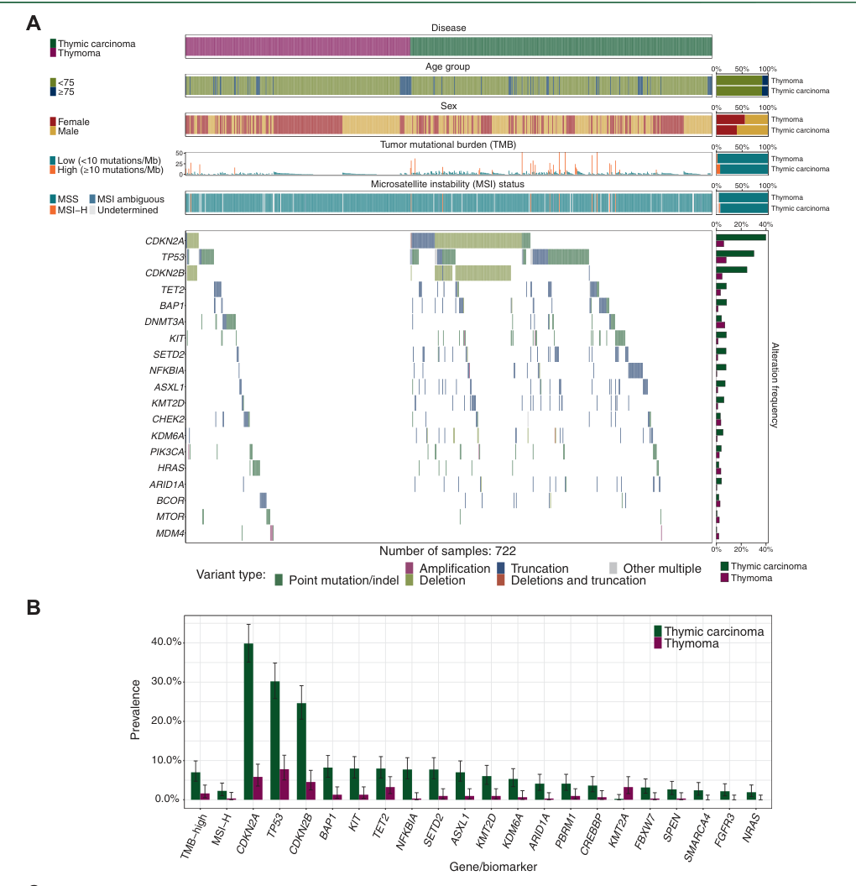

## Question

# Disease Characteristics Research Template

## Target Disease
- **Disease Name:** Thymic Carcinoma
- **MONDO ID:**  (if available)
- **Category:** Neoplastic

## Research Objectives

Please provide a comprehensive research report on **Thymic Carcinoma** covering all of the
disease characteristics listed below. This report will be used to populate a disease knowledge
base entry. Be thorough and cite primary literature (PMID preferred) for all claims.

For each section, **suggested databases/resources** are listed. These are the first places
you should search for information on each topic.

---

### 1. Disease Information
> **Search first:** OMIM, Orphanet, ICD-10/ICD-11, MeSH, PubMed

- What is the disease? Provide a concise overview.
- What are the key identifiers? (OMIM, Orphanet, ICD-10/ICD-11, MeSH, Mondo)
- What are the common synonyms and alternative names?
- Is the information derived from individual patients (e.g., EHR) or aggregated disease-level resources?

### 2. Etiology

- **Disease Causal Factors**: What are the primary causes? (genetic, environmental, infectious, mechanistic)
- **Risk Factors**:
  > **Search first:** PubMed, Cochrane Library, UpToDate, clinical guidelines, ClinVar, ClinGen, GWAS Catalog, PheGenI, CTD, CDC, WHO, epidemiological databases
  - Genetic risk factors (causal variants, susceptibility loci, modifier genes)
  - Environmental risk factors (toxins, lifestyle, occupational exposures, age, sex, family history)
- **Protective Factors**:
  > **Search first:** PubMed, Cochrane Library, clinical trial databases, GWAS Catalog, gnomAD, WHO, CDC, nutrition databases
  - Genetic protective factors (protective variants, modifier alleles)
  - Environmental protective factors (diet, lifestyle, exposures that reduce risk)
- **Gene-Environment Interactions**: How do genetic and environmental factors interact to influence disease?
  > **Search first:** CTD, PubMed, PheGenI, GxE databases

### 3. Phenotypes
> **Search first:** HPO (Human Phenotype Ontology), OMIM, Orphanet, PubMed, clinicaltrials.gov, MedDRA, SNOMED CT, DECIPHER, LOINC

For each phenotype, provide:
- **Phenotype type**: symptoms, clinical signs, physical manifestations, behavioral changes, or laboratory abnormalities
  > For symptoms/signs: HPO, OMIM, Orphanet, PubMed
  > For behavioral changes: HPO, DSM, RDoC (Research Domain Criteria), PubMed
  > For laboratory abnormalities: LOINC, SNOMED CT, LabTests Online, PubMed
- **Phenotype characteristics**:
  > **Search first:** OMIM, Orphanet, HPO, PubMed
  - Age of symptom onset (neonatal, childhood, adult-onset, late-onset)
  - Symptom severity (mild, moderate, severe, variable)
  - Symptom progression (stable, progressive, episodic, fluctuating)
  - Frequency among affected individuals (percentage or qualitative)
- **Quality of life impact**: Effects on daily functioning and well-being (per-phenotype when possible)
  > **Search first:** EQ-5D database, SF-36, WHO QOL databases, PubMed
- Suggest HPO (Human Phenotype Ontology) terms for each phenotype

### 4. Genetic/Molecular Information

- **Causal Genes**: Gene mutations or chromosomal abnormalities responsible for disease (gene symbols, OMIM IDs)
  > **Search first:** OMIM, ClinVar, HGMD, Ensembl, NCBI Gene
- **Pathogenic Variants**:
  - Affected genes (gene symbols, HGNC IDs)
    > **Search first:** OMIM, NCBI Gene, Ensembl, HGNC, UniProt, GeneCards
  - Variant classification (pathogenic, likely pathogenic, VUS per ACMG/AMP guidelines)
    > **Search first:** ClinVar, ClinGen, ACMG/AMP guidelines, VarSome
  - Variant type/class (missense, frameshift, nonsense, splice-site, structural)
  - Allele frequency in population databases
    > **Search first:** gnomAD, 1000 Genomes, ExAC, TOPMed, dbSNP
  - Somatic vs germline origin
    > **Search first:** COSMIC (somatic), ClinVar, ICGC, TCGA
  - Functional consequences (loss of function, gain of function, dominant negative)
- **Modifier Genes**: Genes that modify disease severity or expression
- **Epigenetic Information**: DNA methylation, histone modifications, chromatin changes affecting disease
  > **Search first:** ENCODE, Roadmap Epigenomics, MethBase, DiseaseMeth
- **Chromosomal Abnormalities**: Large-scale genetic changes (aneuploidy, translocations, inversions)
  > **Search first:** DECIPHER, ClinVar, ECARUCA, UCSC Genome Browser

### 5. Environmental Information

- **Environmental Factors**: Non-genetic contributing factors (toxins, radiation, pollution, occupational exposure)
  > **Search first:** CTD (Comparative Toxicogenomics Database), TOXNET, PubMed, EPA databases
- **Lifestyle Factors**: Behavioral factors (smoking, diet, exercise, alcohol consumption)
  > **Search first:** CDC databases, WHO, PubMed, NHANES
- **Infectious Agents**: If applicable, pathogens causing or triggering disease (bacteria, viruses, fungi, parasites)
  > **Search first:** NCBI Taxonomy, ViPR, BV-BRC, MicrobeDB, GIDEON

### 6. Mechanism / Pathophysiology

- **Molecular Pathways**: Specific signaling cascades or biochemical pathways involved (Wnt, MAPK, mTOR, PI3K-AKT, etc.)
  > **Search first:** KEGG, Reactome, WikiPathways, PathBank, BioCyc
- **Cellular Processes**: Cell-level mechanisms (apoptosis, autophagy, cell cycle dysregulation, inflammation, etc.)
  > **Search first:** Gene Ontology (GO), Reactome, KEGG, PubMed
- **Protein Dysfunction**: How protein structure or function is altered (misfolding, aggregation, loss of function, gain of function)
  > **Search first:** UniProt, PDB (Protein Data Bank), InterPro, Pfam, AlphaFold
- **Metabolic Changes**: Alterations in metabolic processes (energy metabolism, lipid metabolism, amino acid metabolism)
  > **Search first:** KEGG, BioCyc, HMDB (Human Metabolome Database), BRENDA
- **Immune System Involvement**: Role of immune response (autoimmunity, immunodeficiency, chronic inflammation)
  > **Search first:** ImmPort, Immunome Database, IEDB, Gene Ontology
- **Tissue Damage Mechanisms**: How tissues/ are injured (oxidative stress, ischemia, fibrosis, necrosis)
  > **Search first:** PubMed, Gene Ontology, Reactome
- **Biochemical Abnormalities**: Specific molecular defects (enzyme deficiencies, receptor dysfunction, ion channel defects)
  > **Search first:** BRENDA, UniProt, KEGG, OMIM, PubMed
- **Epigenetic Changes**: DNA methylation, histone modifications affecting gene expression in disease
  > **Search first:** ENCODE, Roadmap Epigenomics, MethBase, DiseaseMeth
- **Molecular Profiling** (if available):
  - Transcriptomics/gene expression changes
    > **Search first:** GEO (Gene Expression Omnibus), ArrayExpress, GTEx, Human Cell Atlas, SRA
  - Proteomics findings
    > **Search first:** PRIDE, ProteomeXchange, Human Protein Atlas, STRING, BioGRID
  - Metabolomics signatures
    > **Search first:** MetaboLights, Metabolomics Workbench, HMDB, METLIN
  - Lipidomics alterations
    > **Search first:** LIPID MAPS, SwissLipids, LipidHome, Metabolomics Workbench
  - Genomic structural features
    > **Search first:** UCSC Genome Browser, Ensembl, NCBI, dbVar, DGV
- **Advanced Technologies** (if applicable):
  - Single-cell analysis findings (cell-type specific mechanisms, cellular heterogeneity)
    > **Search first:** Human Cell Atlas, Single Cell Portal, GEO, CELLxGENE
  - Spatial transcriptomics findings
    > **Search first:** GEO, Spatial Research, Vizgen, 10x Genomics data
  - Multi-omics integration results
    > **Search first:** TCGA, ICGC, cBioPortal, LinkedOmics, PubMed
  - Functional genomics screens (CRISPR, RNAi)
    > **Search first:** DepMap, GenomeRNAi, PubMed, BioGRID ORCS

For each mechanism, describe:
- The causal chain from initial trigger to clinical manifestation
- Which mechanisms are upstream vs downstream
- What cell types and biological processes are involved
- Suggest GO terms for biological processes and CL terms for cell types

### 7. Anatomical Structures Affected

- **Organ Level**:
  - Primary organs directly affected
  - Secondary organ involvement (complications, secondary effects)
  - Body systems involved (cardiovascular, nervous, digestive, respiratory, endocrine, etc.)
  > **Search first:** Uberon, FMA (Foundational Model of Anatomy), OMIM, HPO, ICD-11, MeSH, SNOMED CT
- **Tissue and Cell Level**:
  - Specific tissue types affected (epithelial, connective, muscle, nervous)
  - Specific cell populations targeted (with Cell Ontology terms)
  > **Search first:** Uberon, Human Protein Atlas, Cell Ontology, Human Cell Atlas, CellMarker, PanglaoDB
- **Subcellular Level**:
  - Cellular compartments involved (mitochondria, nucleus, ER, lysosomes) (with GO Cellular Component terms)
  > **Search first:** Gene Ontology (Cellular Component), UniProt, Human Protein Atlas
- **Localization**:
  - Specific anatomical sites (with UBERON terms)
    > **Search first:** FMA, Uberon, NeuroNames (for brain), SNOMED CT
  - Lateralization (unilateral, bilateral, asymmetric)
    > **Search first:** HPO, clinical literature, imaging databases

### 8. Temporal Development

- **Onset**:
  - Typical age of onset (congenital, pediatric, adult, geriatric)
  - Onset pattern (acute, subacute, chronic, insidious)
  > **Search first:** OMIM, Orphanet, HPO, PubMed
- **Progression**:
  - Disease stages (early, intermediate, advanced, end-stage)
    > **Search first:** Cancer Staging Manual (AJCC), WHO classifications, PubMed
  - Progression rate (rapid, slow, variable)
  - Disease course pattern (episodic, relapsing-remitting, progressive, stable)
  - Disease duration (self-limited, chronic lifelong)
  > **Search first:** Disease registries, longitudinal cohort databases, natural history studies, PubMed, Orphanet, OMIM
- **Patterns**:
  - Remission patterns (spontaneous, treatment-induced)
    > **Search first:** Clinical trial databases, disease registries, PubMed
  - Critical periods (time windows of vulnerability or opportunity for intervention)
    > **Search first:** PubMed, developmental biology databases, clinical guidelines

### 9. Inheritance and Population

- **Epidemiology**:
  - Prevalence (cases per 100,000 at given time)
  - Incidence (new cases per 100,000 per year)
  > **Search first:** Orphanet, CDC, WHO, GBD (Global Burden of Disease), national registries, SEER, disease registries
- **For Genetic Etiology**:
  - Inheritance pattern (AD, AR, X-linked, mitochondrial, multifactorial, polygenic)
    > **Search first:** OMIM, Orphanet, ClinVar, GTR (Genetic Testing Registry)
  - Penetrance (complete, incomplete, age-dependent)
    > **Search first:** ClinVar, OMIM, PubMed, ClinGen
  - Expressivity (variable, consistent)
    > **Search first:** OMIM, ClinVar, PubMed
  - Genetic anticipation (increasing severity in successive generations)
    > **Search first:** OMIM, PubMed (especially for repeat expansion disorders)
  - Germline mosaicism
    > **Search first:** ClinVar, OMIM, genetic counseling literature, PubMed
  - Founder effects (population-specific mutations)
    > **Search first:** gnomAD, population genetics databases, PubMed
  - Consanguinity role
    > **Search first:** OMIM, population studies, genetic counseling resources
  - Carrier frequency
    > **Search first:** gnomAD, carrier screening databases, GeneReviews, GTR
- **Population Demographics**:
  - Affected populations (ethnic or demographic groups with higher prevalence)
    > **Search first:** gnomAD, 1000 Genomes, PAGE Study, PubMed, population registries
  - Geographic distribution (endemic areas, regional variation)
    > **Search first:** WHO, CDC, GBD, Orphanet, geographic epidemiology databases
  - Geographic distribution of specific variants
  - Sex ratio (male:female)
    > **Search first:** Disease registries, OMIM, PubMed, epidemiological databases
  - Age distribution of affected individuals
    > **Search first:** CDC, disease registries, SEER, Orphanet

### 10. Diagnostics

- **Clinical Tests**:
  - Laboratory tests (blood, urine, tissue chemistry, specific enzyme assays)
    > **Search first:** LOINC, LabTests Online, PubMed
  - Biomarkers (proteins, metabolites, genetic markers, circulating biomarkers)
    > **Search first:** FDA Biomarker List, BEST (Biomarkers, EndpointS, and other Tools), PubMed
  - Imaging studies (X-ray, CT, MRI, PET, ultrasound)
    > **Search first:** RadLex, DICOM, Radiopaedia, imaging databases
  - Functional tests (pulmonary function, cardiac stress tests)
    > **Search first:** LOINC, clinical guidelines, PubMed
  - Electrophysiology (EEG, EMG, ECG, nerve conduction studies)
    > **Search first:** LOINC, clinical neurophysiology databases, PubMed
  - Biopsy findings (histopathology, immunohistochemistry)
    > **Search first:** SNOMED CT, College of American Pathologists resources, PubMed
  - Pathology findings (microscopic examination)
    > **Search first:** SNOMED CT, Digital Pathology databases, PubMed
- **Genetic Testing**:
  > **Search first:** GTR (Genetic Testing Registry), GeneReviews, ClinGen
  - Overview of recommended genetic testing approach
  - Whole genome sequencing (WGS) utility
    > **Search first:** GTR, ClinVar, GEL (Genomics England), gnomAD
  - Whole exome sequencing (WES) utility
    > **Search first:** GTR, ClinVar, OMIM, GeneMatcher
  - Gene panels (which panels, which genes)
    > **Search first:** GTR, ClinVar, laboratory-specific databases
  - Single gene testing
    > **Search first:** GTR, ClinVar, OMIM, GeneReviews
  - Chromosomal microarray (CMA)
    > **Search first:** DECIPHER, ClinVar, dbVar, ECARUCA
  - Karyotyping
    > **Search first:** Chromosome Abnormality Database, ClinVar, cytogenetics resources
  - FISH
    > **Search first:** ClinVar, cytogenetics databases, PubMed
  - Mitochondrial DNA testing
    > **Search first:** MITOMAP, MSeqDR, ClinVar, GTR
  - Repeat expansion testing
    > **Search first:** GTR, ClinVar, repeat expansion databases, PubMed
- **Omics-Based Diagnostics** (if applicable):
  - RNA sequencing / transcriptomics
    > **Search first:** GEO, ArrayExpress, GTEx, RNA-seq databases
  - Proteomics
    > **Search first:** PRIDE, ProteomeXchange, FDA Biomarker database
  - Metabolomics
    > **Search first:** MetaboLights, Metabolomics Workbench, HMDB
  - Epigenomics
    > **Search first:** GEO, ENCODE, Roadmap Epigenomics, MethBase
  - Liquid biopsy
    > **Search first:** COSMIC, ClinVar, liquid biopsy databases, PubMed
- **Clinical Criteria**:
  - Standardized diagnostic criteria (DSM, ICD, society guidelines)
    > **Search first:** DSM-5, ICD-11, clinical society guidelines, UpToDate
  - Differential diagnosis (other conditions to rule out, with distinguishing features)
    > **Search first:** DynaMed, UpToDate, clinical decision support systems
- **Screening**:
  - Screening methods for asymptomatic individuals (newborn screening, carrier screening, cascade screening)
    > **Search first:** ACMG recommendations, CDC newborn screening, GTR

### 11. Outcome/Prognosis

- **Survival and Mortality**:
  - Survival rate (5-year, 10-year, overall)
    > **Search first:** SEER, cancer registries, disease-specific registries, PubMed
  - Life expectancy (with and without treatment if applicable)
    > **Search first:** Orphanet, disease registries, actuarial databases, PubMed
  - Mortality rate
    > **Search first:** CDC, WHO, GBD, national mortality databases
  - Disease-specific mortality (deaths directly attributable to disease)
    > **Search first:** Disease registries, CDC Wonder, GBD, PubMed
- **Morbidity and Function**:
  - Morbidity (disease-related disability and health impacts)
    > **Search first:** GBD, WHO, disability databases, PubMed
  - Disability outcomes (long-term functional impairments)
    > **Search first:** ICF (International Classification of Functioning), disability registries
  - Quality of life measures (EQ-5D, SF-36, PROMIS, disease-specific tools)
    > **Search first:** EQ-5D database, SF-36, PROMIS, PubMed
- **Disease Course**:
  - Complications (secondary problems: infections, organ failure, etc.)
    > **Search first:** ICD codes, disease registries, clinical databases, PubMed
  - Recovery potential (likelihood and extent of recovery, with vs without treatment)
    > **Search first:** Natural history studies, rehabilitation databases, PubMed
- **Prediction**:
  - Prognostic factors (age, disease severity, biomarkers, treatment response)
    > **Search first:** Prognostic models databases, clinical calculators, PubMed
  - Prognostic biomarkers (molecular markers predicting disease course)
    > **Search first:** FDA Biomarker database, PubMed, cancer prognostic databases

### 12. Treatment

- **Pharmacotherapy**:
  - Pharmacological treatments (drug names, drug classes, mechanisms of action)
    > **Search first:** DrugBank, RxNorm, ATC classification, DailyMed, FDA databases
  - Pharmacogenomics (how genetic variants affect drug metabolism, efficacy, toxicity)
    > **Search first:** PharmGKB, CPIC (Clinical Pharmacogenetics), FDA Table of PGx Biomarkers
- **Advanced Therapeutics**:
  - Gene therapy (viral vectors, CRISPR, gene replacement, gene editing)
    > **Search first:** ClinicalTrials.gov, FDA gene therapy database, ASGCT resources
  - Cell therapy (stem cell transplant, CAR-T, cellular therapeutics)
    > **Search first:** ClinicalTrials.gov, FDA cell therapy database, FACT standards
  - RNA-based therapies (ASOs, siRNA, mRNA therapies)
    > **Search first:** ClinicalTrials.gov, FDA approvals, PubMed
  - Targeted therapies (treatments directed at specific molecular targets)
    > **Search first:** My Cancer Genome, OncoKB, ClinicalTrials.gov, FDA approvals
  - Immunotherapies (checkpoint inhibitors, monoclonal antibodies)
    > **Search first:** Cancer Immunotherapy Database, FDA approvals, ClinicalTrials.gov
- **Surgical and Interventional**:
  - Surgical interventions (types of surgery, timing, outcomes)
    > **Search first:** CPT codes, surgical registries, clinical guidelines, PubMed
- **Supportive and Rehabilitative**:
  - Supportive care (symptom management, pain control, nutrition)
    > **Search first:** Clinical guidelines, Cochrane Library, PubMed
  - Rehabilitation (physical therapy, occupational therapy, speech therapy)
    > **Search first:** Rehabilitation medicine databases, clinical guidelines, PubMed
- **Experimental**:
  - Experimental treatments in clinical trials (with NCT identifiers if available)
    > **Search first:** ClinicalTrials.gov, EU Clinical Trials Register, WHO ICTRP
- **Treatment Outcomes**:
  - Treatment response rates
    > **Search first:** Clinical trial databases, FDA reviews, systematic reviews, PubMed
  - Side effects and adverse events
    > **Search first:** FDA Adverse Event Reporting System (FAERS), MedWatch, PubMed
- **Treatment Strategy**:
  - Treatment algorithms (clinical pathways, decision trees)
    > **Search first:** Clinical practice guidelines, NCCN Guidelines, UpToDate
  - Combination therapies
    > **Search first:** ClinicalTrials.gov, treatment guidelines, PubMed
  - Personalized medicine approaches (genotype-guided treatment)
    > **Search first:** My Cancer Genome, CIViC, PharmGKB, precision medicine databases

For each treatment, suggest MAXO (Medical Action Ontology) terms where applicable.

### 13. Prevention

- **Prevention Levels**:
  - Primary prevention (preventing disease occurrence: vaccination, risk factor modification)
    > **Search first:** CDC, WHO, USPSTF recommendations, Cochrane Library
  - Secondary prevention (early detection and treatment: screening programs, early intervention)
    > **Search first:** USPSTF, CDC screening guidelines, WHO
  - Tertiary prevention (preventing complications in those with disease)
    > **Search first:** Clinical guidelines, disease management protocols, PubMed
- **Immunization**: Vaccine strategies (if applicable)
  > **Search first:** CDC vaccine schedules, WHO immunization, FDA vaccine database
- **Screening and Early Detection**:
  - Screening programs (population-based: newborn screening, cancer screening)
    > **Search first:** CDC screening programs, USPSTF, cancer screening databases
  - Genetic screening (carrier screening, preimplantation genetic diagnosis, prenatal testing)
    > **Search first:** ACMG recommendations, ACOG guidelines, GTR
  - Risk stratification (identifying high-risk individuals for targeted prevention)
    > **Search first:** Risk prediction models, clinical calculators, PubMed
- **Behavioral Interventions**: Lifestyle modifications to reduce risk
  > **Search first:** CDC, WHO, behavioral intervention databases, Cochrane Library
- **Counseling**: Genetic counseling (risk assessment, family planning guidance)
  > **Search first:** NSGC resources, ACMG guidelines, GeneReviews
- **Public Health**:
  - Public health interventions (sanitation, vector control, health education)
    > **Search first:** CDC, WHO, public health databases, PubMed
  - Environmental interventions (reducing environmental risk factors)
    > **Search first:** EPA databases, WHO environmental health, PubMed
- **Prophylaxis**: Preventive medications or procedures
  > **Search first:** Clinical guidelines, FDA approvals, PubMed

### 14. Other Species / Natural Disease

- **Taxonomy**: Species affected (with NCBI Taxon identifiers)
  > **Search first:** NCBI Taxonomy
- **Breed**: Specific breeds affected (with VBO identifiers if applicable)
  > **Search first:** VBO (Vertebrate Breed Ontology)
- **Gene**: Orthologous genes in other species (with NCBI Gene IDs)
  > **Search first:** NCBI Gene
- **Natural Disease**:
  - Naturally occurring disease in other species (companion animals, wildlife)
    > **Search first:** OMIA (Online Mendelian Inheritance in Animals), VetCompass, PubMed
  - Veterinary relevance and importance in animal health
    > **Search first:** OMIA, veterinary databases, PubMed
- **Comparative Biology**:
  - Comparative pathology (similarities and differences across species)
    > **Search first:** OMIA, comparative pathology databases, PubMed
  - Evolutionary conservation of disease mechanisms
    > **Search first:** HomoloGene, OrthoMCL, Alliance of Genome Resources
- **Transmission** (if applicable):
  - Zoonotic potential
    > **Search first:** CDC zoonotic diseases, WHO zoonoses, GIDEON
  - Cross-species susceptibility
    > **Search first:** NCBI Taxonomy, veterinary databases, PubMed

### 15. Model Organisms

- **Model Types**:
  - Model organism type (mammalian, invertebrate, cellular, in vitro)
    > **Search first:** Alliance of Genome Resources, model organism databases
  - Specific model systems (mouse, rat, zebrafish, Drosophila, C. elegans, yeast, cell lines, organoids, iPSCs)
    > **Search first:** MGI, RGD, ZFIN, FlyBase, WormBase, SGD, ATCC, Cellosaurus
  - Induced models (drug treatment, surgical intervention, environmental manipulation)
    > **Search first:** MGI, model organism databases, PubMed
- **Genetic Models**:
  - Types available (knockout, knock-in, transgenic, conditional, humanized)
    > **Search first:** MGI, IMPC, KOMP, EuMMCR, IMSR
- **Model Characteristics**:
  - Phenotype recapitulation (how well model reproduces human disease features)
    > **Search first:** Model organism databases, comparative studies, PubMed
  - Model limitations (aspects of human disease not captured)
    > **Search first:** Model organism databases, PubMed, review articles
- **Applications**:
  - Research applications (what aspects of disease can be studied)
    > **Search first:** Model organism databases, PubMed
- **Resources**:
  - Model databases
    > **Search first:** MGI, RGD, ZFIN, FlyBase, WormBase, IMSR, EMMA, MMRRC

---

## Citation Requirements

- Cite primary literature (PMID preferred) for all mechanistic and clinical claims
- Prioritize recent reviews and landmark papers
- Include direct quotes from abstracts where possible to support key statements
- Distinguish evidence source types: human clinical, model organism, in vitro, computational

## Output Format

Structure your response as a comprehensive narrative organized by the sections above.
For each section, provide:
- Factual content with specific details (numbers, percentages, gene names, variant nomenclature)
- Ontology term suggestions (HPO, GO, CL, UBERON, CHEBI, MAXO, MONDO) where applicable
- Evidence citations with PMIDs
- Direct quotes from abstracts to support key claims
- Clear indication when information is not available or not applicable for this disease

This report will be used to populate a disease knowledge base entry with:
- Pathophysiology descriptions with causal chains
- Gene/protein annotations (HGNC, GO terms)
- Phenotype associations (HP terms) with frequencies
- Cell type involvement (CL terms)
- Anatomical locations (UBERON terms)
- Chemical entities (CHEBI terms)
- Treatment annotations (MAXO terms)
- Evidence items with PMIDs and exact abstract quotes
- Epidemiology, prognosis, diagnostic, and prevention information
- Animal model descriptions with phenotype recapitulation details

## Output

Question: You are an expert researcher providing comprehensive, well-cited information.

Provide detailed information focusing on:
1. Key concepts and definitions with current understanding
2. Recent developments and latest research (prioritize 2023-2024 sources)
3. Current applications and real-world implementations
4. Expert opinions and analysis from authoritative sources
5. Relevant statistics and data from recent studies

Format as a comprehensive research report with proper citations. Include URLs and publication dates where available.
Always prioritize recent, authoritative sources and provide specific citations for all major claims.

# Disease Characteristics Research Template

## Target Disease
- **Disease Name:** Thymic Carcinoma
- **MONDO ID:**  (if available)
- **Category:** Neoplastic

## Research Objectives

Please provide a comprehensive research report on **Thymic Carcinoma** covering all of the
disease characteristics listed below. This report will be used to populate a disease knowledge
base entry. Be thorough and cite primary literature (PMID preferred) for all claims.

For each section, **suggested databases/resources** are listed. These are the first places
you should search for information on each topic.

---

### 1. Disease Information
> **Search first:** OMIM, Orphanet, ICD-10/ICD-11, MeSH, PubMed

- What is the disease? Provide a concise overview.
- What are the key identifiers? (OMIM, Orphanet, ICD-10/ICD-11, MeSH, Mondo)
- What are the common synonyms and alternative names?
- Is the information derived from individual patients (e.g., EHR) or aggregated disease-level resources?

### 2. Etiology

- **Disease Causal Factors**: What are the primary causes? (genetic, environmental, infectious, mechanistic)
- **Risk Factors**:
  > **Search first:** PubMed, Cochrane Library, UpToDate, clinical guidelines, ClinVar, ClinGen, GWAS Catalog, PheGenI, CTD, CDC, WHO, epidemiological databases
  - Genetic risk factors (causal variants, susceptibility loci, modifier genes)
  - Environmental risk factors (toxins, lifestyle, occupational exposures, age, sex, family history)
- **Protective Factors**:
  > **Search first:** PubMed, Cochrane Library, clinical trial databases, GWAS Catalog, gnomAD, WHO, CDC, nutrition databases
  - Genetic protective factors (protective variants, modifier alleles)
  - Environmental protective factors (diet, lifestyle, exposures that reduce risk)
- **Gene-Environment Interactions**: How do genetic and environmental factors interact to influence disease?
  > **Search first:** CTD, PubMed, PheGenI, GxE databases

### 3. Phenotypes
> **Search first:** HPO (Human Phenotype Ontology), OMIM, Orphanet, PubMed, clinicaltrials.gov, MedDRA, SNOMED CT, DECIPHER, LOINC

For each phenotype, provide:
- **Phenotype type**: symptoms, clinical signs, physical manifestations, behavioral changes, or laboratory abnormalities
  > For symptoms/signs: HPO, OMIM, Orphanet, PubMed
  > For behavioral changes: HPO, DSM, RDoC (Research Domain Criteria), PubMed
  > For laboratory abnormalities: LOINC, SNOMED CT, LabTests Online, PubMed
- **Phenotype characteristics**:
  > **Search first:** OMIM, Orphanet, HPO, PubMed
  - Age of symptom onset (neonatal, childhood, adult-onset, late-onset)
  - Symptom severity (mild, moderate, severe, variable)
  - Symptom progression (stable, progressive, episodic, fluctuating)
  - Frequency among affected individuals (percentage or qualitative)
- **Quality of life impact**: Effects on daily functioning and well-being (per-phenotype when possible)
  > **Search first:** EQ-5D database, SF-36, WHO QOL databases, PubMed
- Suggest HPO (Human Phenotype Ontology) terms for each phenotype

### 4. Genetic/Molecular Information

- **Causal Genes**: Gene mutations or chromosomal abnormalities responsible for disease (gene symbols, OMIM IDs)
  > **Search first:** OMIM, ClinVar, HGMD, Ensembl, NCBI Gene
- **Pathogenic Variants**:
  - Affected genes (gene symbols, HGNC IDs)
    > **Search first:** OMIM, NCBI Gene, Ensembl, HGNC, UniProt, GeneCards
  - Variant classification (pathogenic, likely pathogenic, VUS per ACMG/AMP guidelines)
    > **Search first:** ClinVar, ClinGen, ACMG/AMP guidelines, VarSome
  - Variant type/class (missense, frameshift, nonsense, splice-site, structural)
  - Allele frequency in population databases
    > **Search first:** gnomAD, 1000 Genomes, ExAC, TOPMed, dbSNP
  - Somatic vs germline origin
    > **Search first:** COSMIC (somatic), ClinVar, ICGC, TCGA
  - Functional consequences (loss of function, gain of function, dominant negative)
- **Modifier Genes**: Genes that modify disease severity or expression
- **Epigenetic Information**: DNA methylation, histone modifications, chromatin changes affecting disease
  > **Search first:** ENCODE, Roadmap Epigenomics, MethBase, DiseaseMeth
- **Chromosomal Abnormalities**: Large-scale genetic changes (aneuploidy, translocations, inversions)
  > **Search first:** DECIPHER, ClinVar, ECARUCA, UCSC Genome Browser

### 5. Environmental Information

- **Environmental Factors**: Non-genetic contributing factors (toxins, radiation, pollution, occupational exposure)
  > **Search first:** CTD (Comparative Toxicogenomics Database), TOXNET, PubMed, EPA databases
- **Lifestyle Factors**: Behavioral factors (smoking, diet, exercise, alcohol consumption)
  > **Search first:** CDC databases, WHO, PubMed, NHANES
- **Infectious Agents**: If applicable, pathogens causing or triggering disease (bacteria, viruses, fungi, parasites)
  > **Search first:** NCBI Taxonomy, ViPR, BV-BRC, MicrobeDB, GIDEON

### 6. Mechanism / Pathophysiology

- **Molecular Pathways**: Specific signaling cascades or biochemical pathways involved (Wnt, MAPK, mTOR, PI3K-AKT, etc.)
  > **Search first:** KEGG, Reactome, WikiPathways, PathBank, BioCyc
- **Cellular Processes**: Cell-level mechanisms (apoptosis, autophagy, cell cycle dysregulation, inflammation, etc.)
  > **Search first:** Gene Ontology (GO), Reactome, KEGG, PubMed
- **Protein Dysfunction**: How protein structure or function is altered (misfolding, aggregation, loss of function, gain of function)
  > **Search first:** UniProt, PDB (Protein Data Bank), InterPro, Pfam, AlphaFold
- **Metabolic Changes**: Alterations in metabolic processes (energy metabolism, lipid metabolism, amino acid metabolism)
  > **Search first:** KEGG, BioCyc, HMDB (Human Metabolome Database), BRENDA
- **Immune System Involvement**: Role of immune response (autoimmunity, immunodeficiency, chronic inflammation)
  > **Search first:** ImmPort, Immunome Database, IEDB, Gene Ontology
- **Tissue Damage Mechanisms**: How tissues/ are injured (oxidative stress, ischemia, fibrosis, necrosis)
  > **Search first:** PubMed, Gene Ontology, Reactome
- **Biochemical Abnormalities**: Specific molecular defects (enzyme deficiencies, receptor dysfunction, ion channel defects)
  > **Search first:** BRENDA, UniProt, KEGG, OMIM, PubMed
- **Epigenetic Changes**: DNA methylation, histone modifications affecting gene expression in disease
  > **Search first:** ENCODE, Roadmap Epigenomics, MethBase, DiseaseMeth
- **Molecular Profiling** (if available):
  - Transcriptomics/gene expression changes
    > **Search first:** GEO (Gene Expression Omnibus), ArrayExpress, GTEx, Human Cell Atlas, SRA
  - Proteomics findings
    > **Search first:** PRIDE, ProteomeXchange, Human Protein Atlas, STRING, BioGRID
  - Metabolomics signatures
    > **Search first:** MetaboLights, Metabolomics Workbench, HMDB, METLIN
  - Lipidomics alterations
    > **Search first:** LIPID MAPS, SwissLipids, LipidHome, Metabolomics Workbench
  - Genomic structural features
    > **Search first:** UCSC Genome Browser, Ensembl, NCBI, dbVar, DGV
- **Advanced Technologies** (if applicable):
  - Single-cell analysis findings (cell-type specific mechanisms, cellular heterogeneity)
    > **Search first:** Human Cell Atlas, Single Cell Portal, GEO, CELLxGENE
  - Spatial transcriptomics findings
    > **Search first:** GEO, Spatial Research, Vizgen, 10x Genomics data
  - Multi-omics integration results
    > **Search first:** TCGA, ICGC, cBioPortal, LinkedOmics, PubMed
  - Functional genomics screens (CRISPR, RNAi)
    > **Search first:** DepMap, GenomeRNAi, PubMed, BioGRID ORCS

For each mechanism, describe:
- The causal chain from initial trigger to clinical manifestation
- Which mechanisms are upstream vs downstream
- What cell types and biological processes are involved
- Suggest GO terms for biological processes and CL terms for cell types

### 7. Anatomical Structures Affected

- **Organ Level**:
  - Primary organs directly affected
  - Secondary organ involvement (complications, secondary effects)
  - Body systems involved (cardiovascular, nervous, digestive, respiratory, endocrine, etc.)
  > **Search first:** Uberon, FMA (Foundational Model of Anatomy), OMIM, HPO, ICD-11, MeSH, SNOMED CT
- **Tissue and Cell Level**:
  - Specific tissue types affected (epithelial, connective, muscle, nervous)
  - Specific cell populations targeted (with Cell Ontology terms)
  > **Search first:** Uberon, Human Protein Atlas, Cell Ontology, Human Cell Atlas, CellMarker, PanglaoDB
- **Subcellular Level**:
  - Cellular compartments involved (mitochondria, nucleus, ER, lysosomes) (with GO Cellular Component terms)
  > **Search first:** Gene Ontology (Cellular Component), UniProt, Human Protein Atlas
- **Localization**:
  - Specific anatomical sites (with UBERON terms)
    > **Search first:** FMA, Uberon, NeuroNames (for brain), SNOMED CT
  - Lateralization (unilateral, bilateral, asymmetric)
    > **Search first:** HPO, clinical literature, imaging databases

### 8. Temporal Development

- **Onset**:
  - Typical age of onset (congenital, pediatric, adult, geriatric)
  - Onset pattern (acute, subacute, chronic, insidious)
  > **Search first:** OMIM, Orphanet, HPO, PubMed
- **Progression**:
  - Disease stages (early, intermediate, advanced, end-stage)
    > **Search first:** Cancer Staging Manual (AJCC), WHO classifications, PubMed
  - Progression rate (rapid, slow, variable)
  - Disease course pattern (episodic, relapsing-remitting, progressive, stable)
  - Disease duration (self-limited, chronic lifelong)
  > **Search first:** Disease registries, longitudinal cohort databases, natural history studies, PubMed, Orphanet, OMIM
- **Patterns**:
  - Remission patterns (spontaneous, treatment-induced)
    > **Search first:** Clinical trial databases, disease registries, PubMed
  - Critical periods (time windows of vulnerability or opportunity for intervention)
    > **Search first:** PubMed, developmental biology databases, clinical guidelines

### 9. Inheritance and Population

- **Epidemiology**:
  - Prevalence (cases per 100,000 at given time)
  - Incidence (new cases per 100,000 per year)
  > **Search first:** Orphanet, CDC, WHO, GBD (Global Burden of Disease), national registries, SEER, disease registries
- **For Genetic Etiology**:
  - Inheritance pattern (AD, AR, X-linked, mitochondrial, multifactorial, polygenic)
    > **Search first:** OMIM, Orphanet, ClinVar, GTR (Genetic Testing Registry)
  - Penetrance (complete, incomplete, age-dependent)
    > **Search first:** ClinVar, OMIM, PubMed, ClinGen
  - Expressivity (variable, consistent)
    > **Search first:** OMIM, ClinVar, PubMed
  - Genetic anticipation (increasing severity in successive generations)
    > **Search first:** OMIM, PubMed (especially for repeat expansion disorders)
  - Germline mosaicism
    > **Search first:** ClinVar, OMIM, genetic counseling literature, PubMed
  - Founder effects (population-specific mutations)
    > **Search first:** gnomAD, population genetics databases, PubMed
  - Consanguinity role
    > **Search first:** OMIM, population studies, genetic counseling resources
  - Carrier frequency
    > **Search first:** gnomAD, carrier screening databases, GeneReviews, GTR
- **Population Demographics**:
  - Affected populations (ethnic or demographic groups with higher prevalence)
    > **Search first:** gnomAD, 1000 Genomes, PAGE Study, PubMed, population registries
  - Geographic distribution (endemic areas, regional variation)
    > **Search first:** WHO, CDC, GBD, Orphanet, geographic epidemiology databases
  - Geographic distribution of specific variants
  - Sex ratio (male:female)
    > **Search first:** Disease registries, OMIM, PubMed, epidemiological databases
  - Age distribution of affected individuals
    > **Search first:** CDC, disease registries, SEER, Orphanet

### 10. Diagnostics

- **Clinical Tests**:
  - Laboratory tests (blood, urine, tissue chemistry, specific enzyme assays)
    > **Search first:** LOINC, LabTests Online, PubMed
  - Biomarkers (proteins, metabolites, genetic markers, circulating biomarkers)
    > **Search first:** FDA Biomarker List, BEST (Biomarkers, EndpointS, and other Tools), PubMed
  - Imaging studies (X-ray, CT, MRI, PET, ultrasound)
    > **Search first:** RadLex, DICOM, Radiopaedia, imaging databases
  - Functional tests (pulmonary function, cardiac stress tests)
    > **Search first:** LOINC, clinical guidelines, PubMed
  - Electrophysiology (EEG, EMG, ECG, nerve conduction studies)
    > **Search first:** LOINC, clinical neurophysiology databases, PubMed
  - Biopsy findings (histopathology, immunohistochemistry)
    > **Search first:** SNOMED CT, College of American Pathologists resources, PubMed
  - Pathology findings (microscopic examination)
    > **Search first:** SNOMED CT, Digital Pathology databases, PubMed
- **Genetic Testing**:
  > **Search first:** GTR (Genetic Testing Registry), GeneReviews, ClinGen
  - Overview of recommended genetic testing approach
  - Whole genome sequencing (WGS) utility
    > **Search first:** GTR, ClinVar, GEL (Genomics England), gnomAD
  - Whole exome sequencing (WES) utility
    > **Search first:** GTR, ClinVar, OMIM, GeneMatcher
  - Gene panels (which panels, which genes)
    > **Search first:** GTR, ClinVar, laboratory-specific databases
  - Single gene testing
    > **Search first:** GTR, ClinVar, OMIM, GeneReviews
  - Chromosomal microarray (CMA)
    > **Search first:** DECIPHER, ClinVar, dbVar, ECARUCA
  - Karyotyping
    > **Search first:** Chromosome Abnormality Database, ClinVar, cytogenetics resources
  - FISH
    > **Search first:** ClinVar, cytogenetics databases, PubMed
  - Mitochondrial DNA testing
    > **Search first:** MITOMAP, MSeqDR, ClinVar, GTR
  - Repeat expansion testing
    > **Search first:** GTR, ClinVar, repeat expansion databases, PubMed
- **Omics-Based Diagnostics** (if applicable):
  - RNA sequencing / transcriptomics
    > **Search first:** GEO, ArrayExpress, GTEx, RNA-seq databases
  - Proteomics
    > **Search first:** PRIDE, ProteomeXchange, FDA Biomarker database
  - Metabolomics
    > **Search first:** MetaboLights, Metabolomics Workbench, HMDB
  - Epigenomics
    > **Search first:** GEO, ENCODE, Roadmap Epigenomics, MethBase
  - Liquid biopsy
    > **Search first:** COSMIC, ClinVar, liquid biopsy databases, PubMed
- **Clinical Criteria**:
  - Standardized diagnostic criteria (DSM, ICD, society guidelines)
    > **Search first:** DSM-5, ICD-11, clinical society guidelines, UpToDate
  - Differential diagnosis (other conditions to rule out, with distinguishing features)
    > **Search first:** DynaMed, UpToDate, clinical decision support systems
- **Screening**:
  - Screening methods for asymptomatic individuals (newborn screening, carrier screening, cascade screening)
    > **Search first:** ACMG recommendations, CDC newborn screening, GTR

### 11. Outcome/Prognosis

- **Survival and Mortality**:
  - Survival rate (5-year, 10-year, overall)
    > **Search first:** SEER, cancer registries, disease-specific registries, PubMed
  - Life expectancy (with and without treatment if applicable)
    > **Search first:** Orphanet, disease registries, actuarial databases, PubMed
  - Mortality rate
    > **Search first:** CDC, WHO, GBD, national mortality databases
  - Disease-specific mortality (deaths directly attributable to disease)
    > **Search first:** Disease registries, CDC Wonder, GBD, PubMed
- **Morbidity and Function**:
  - Morbidity (disease-related disability and health impacts)
    > **Search first:** GBD, WHO, disability databases, PubMed
  - Disability outcomes (long-term functional impairments)
    > **Search first:** ICF (International Classification of Functioning), disability registries
  - Quality of life measures (EQ-5D, SF-36, PROMIS, disease-specific tools)
    > **Search first:** EQ-5D database, SF-36, PROMIS, PubMed
- **Disease Course**:
  - Complications (secondary problems: infections, organ failure, etc.)
    > **Search first:** ICD codes, disease registries, clinical databases, PubMed
  - Recovery potential (likelihood and extent of recovery, with vs without treatment)
    > **Search first:** Natural history studies, rehabilitation databases, PubMed
- **Prediction**:
  - Prognostic factors (age, disease severity, biomarkers, treatment response)
    > **Search first:** Prognostic models databases, clinical calculators, PubMed
  - Prognostic biomarkers (molecular markers predicting disease course)
    > **Search first:** FDA Biomarker database, PubMed, cancer prognostic databases

### 12. Treatment

- **Pharmacotherapy**:
  - Pharmacological treatments (drug names, drug classes, mechanisms of action)
    > **Search first:** DrugBank, RxNorm, ATC classification, DailyMed, FDA databases
  - Pharmacogenomics (how genetic variants affect drug metabolism, efficacy, toxicity)
    > **Search first:** PharmGKB, CPIC (Clinical Pharmacogenetics), FDA Table of PGx Biomarkers
- **Advanced Therapeutics**:
  - Gene therapy (viral vectors, CRISPR, gene replacement, gene editing)
    > **Search first:** ClinicalTrials.gov, FDA gene therapy database, ASGCT resources
  - Cell therapy (stem cell transplant, CAR-T, cellular therapeutics)
    > **Search first:** ClinicalTrials.gov, FDA cell therapy database, FACT standards
  - RNA-based therapies (ASOs, siRNA, mRNA therapies)
    > **Search first:** ClinicalTrials.gov, FDA approvals, PubMed
  - Targeted therapies (treatments directed at specific molecular targets)
    > **Search first:** My Cancer Genome, OncoKB, ClinicalTrials.gov, FDA approvals
  - Immunotherapies (checkpoint inhibitors, monoclonal antibodies)
    > **Search first:** Cancer Immunotherapy Database, FDA approvals, ClinicalTrials.gov
- **Surgical and Interventional**:
  - Surgical interventions (types of surgery, timing, outcomes)
    > **Search first:** CPT codes, surgical registries, clinical guidelines, PubMed
- **Supportive and Rehabilitative**:
  - Supportive care (symptom management, pain control, nutrition)
    > **Search first:** Clinical guidelines, Cochrane Library, PubMed
  - Rehabilitation (physical therapy, occupational therapy, speech therapy)
    > **Search first:** Rehabilitation medicine databases, clinical guidelines, PubMed
- **Experimental**:
  - Experimental treatments in clinical trials (with NCT identifiers if available)
    > **Search first:** ClinicalTrials.gov, EU Clinical Trials Register, WHO ICTRP
- **Treatment Outcomes**:
  - Treatment response rates
    > **Search first:** Clinical trial databases, FDA reviews, systematic reviews, PubMed
  - Side effects and adverse events
    > **Search first:** FDA Adverse Event Reporting System (FAERS), MedWatch, PubMed
- **Treatment Strategy**:
  - Treatment algorithms (clinical pathways, decision trees)
    > **Search first:** Clinical practice guidelines, NCCN Guidelines, UpToDate
  - Combination therapies
    > **Search first:** ClinicalTrials.gov, treatment guidelines, PubMed
  - Personalized medicine approaches (genotype-guided treatment)
    > **Search first:** My Cancer Genome, CIViC, PharmGKB, precision medicine databases

For each treatment, suggest MAXO (Medical Action Ontology) terms where applicable.

### 13. Prevention

- **Prevention Levels**:
  - Primary prevention (preventing disease occurrence: vaccination, risk factor modification)
    > **Search first:** CDC, WHO, USPSTF recommendations, Cochrane Library
  - Secondary prevention (early detection and treatment: screening programs, early intervention)
    > **Search first:** USPSTF, CDC screening guidelines, WHO
  - Tertiary prevention (preventing complications in those with disease)
    > **Search first:** Clinical guidelines, disease management protocols, PubMed
- **Immunization**: Vaccine strategies (if applicable)
  > **Search first:** CDC vaccine schedules, WHO immunization, FDA vaccine database
- **Screening and Early Detection**:
  - Screening programs (population-based: newborn screening, cancer screening)
    > **Search first:** CDC screening programs, USPSTF, cancer screening databases
  - Genetic screening (carrier screening, preimplantation genetic diagnosis, prenatal testing)
    > **Search first:** ACMG recommendations, ACOG guidelines, GTR
  - Risk stratification (identifying high-risk individuals for targeted prevention)
    > **Search first:** Risk prediction models, clinical calculators, PubMed
- **Behavioral Interventions**: Lifestyle modifications to reduce risk
  > **Search first:** CDC, WHO, behavioral intervention databases, Cochrane Library
- **Counseling**: Genetic counseling (risk assessment, family planning guidance)
  > **Search first:** NSGC resources, ACMG guidelines, GeneReviews
- **Public Health**:
  - Public health interventions (sanitation, vector control, health education)
    > **Search first:** CDC, WHO, public health databases, PubMed
  - Environmental interventions (reducing environmental risk factors)
    > **Search first:** EPA databases, WHO environmental health, PubMed
- **Prophylaxis**: Preventive medications or procedures
  > **Search first:** Clinical guidelines, FDA approvals, PubMed

### 14. Other Species / Natural Disease

- **Taxonomy**: Species affected (with NCBI Taxon identifiers)
  > **Search first:** NCBI Taxonomy
- **Breed**: Specific breeds affected (with VBO identifiers if applicable)
  > **Search first:** VBO (Vertebrate Breed Ontology)
- **Gene**: Orthologous genes in other species (with NCBI Gene IDs)
  > **Search first:** NCBI Gene
- **Natural Disease**:
  - Naturally occurring disease in other species (companion animals, wildlife)
    > **Search first:** OMIA (Online Mendelian Inheritance in Animals), VetCompass, PubMed
  - Veterinary relevance and importance in animal health
    > **Search first:** OMIA, veterinary databases, PubMed
- **Comparative Biology**:
  - Comparative pathology (similarities and differences across species)
    > **Search first:** OMIA, comparative pathology databases, PubMed
  - Evolutionary conservation of disease mechanisms
    > **Search first:** HomoloGene, OrthoMCL, Alliance of Genome Resources
- **Transmission** (if applicable):
  - Zoonotic potential
    > **Search first:** CDC zoonotic diseases, WHO zoonoses, GIDEON
  - Cross-species susceptibility
    > **Search first:** NCBI Taxonomy, veterinary databases, PubMed

### 15. Model Organisms

- **Model Types**:
  - Model organism type (mammalian, invertebrate, cellular, in vitro)
    > **Search first:** Alliance of Genome Resources, model organism databases
  - Specific model systems (mouse, rat, zebrafish, Drosophila, C. elegans, yeast, cell lines, organoids, iPSCs)
    > **Search first:** MGI, RGD, ZFIN, FlyBase, WormBase, SGD, ATCC, Cellosaurus
  - Induced models (drug treatment, surgical intervention, environmental manipulation)
    > **Search first:** MGI, model organism databases, PubMed
- **Genetic Models**:
  - Types available (knockout, knock-in, transgenic, conditional, humanized)
    > **Search first:** MGI, IMPC, KOMP, EuMMCR, IMSR
- **Model Characteristics**:
  - Phenotype recapitulation (how well model reproduces human disease features)
    > **Search first:** Model organism databases, comparative studies, PubMed
  - Model limitations (aspects of human disease not captured)
    > **Search first:** Model organism databases, PubMed, review articles
- **Applications**:
  - Research applications (what aspects of disease can be studied)
    > **Search first:** Model organism databases, PubMed
- **Resources**:
  - Model databases
    > **Search first:** MGI, RGD, ZFIN, FlyBase, WormBase, IMSR, EMMA, MMRRC

---

## Citation Requirements

- Cite primary literature (PMID preferred) for all mechanistic and clinical claims
- Prioritize recent reviews and landmark papers
- Include direct quotes from abstracts where possible to support key statements
- Distinguish evidence source types: human clinical, model organism, in vitro, computational

## Output Format

Structure your response as a comprehensive narrative organized by the sections above.
For each section, provide:
- Factual content with specific details (numbers, percentages, gene names, variant nomenclature)
- Ontology term suggestions (HPO, GO, CL, UBERON, CHEBI, MAXO, MONDO) where applicable
- Evidence citations with PMIDs
- Direct quotes from abstracts to support key claims
- Clear indication when information is not available or not applicable for this disease

This report will be used to populate a disease knowledge base entry with:
- Pathophysiology descriptions with causal chains
- Gene/protein annotations (HGNC, GO terms)
- Phenotype associations (HP terms) with frequencies
- Cell type involvement (CL terms)
- Anatomical locations (UBERON terms)
- Chemical entities (CHEBI terms)
- Treatment annotations (MAXO terms)
- Evidence items with PMIDs and exact abstract quotes
- Epidemiology, prognosis, diagnostic, and prevention information
- Animal model descriptions with phenotype recapitulation details

# Thymic Carcinoma (Thymic Cancer) — Disease Characteristics Research Report (Neoplastic)

## Executive summary (current understanding; 2023–2024 emphasis)
Thymic carcinoma (TC) is a rare, aggressive thymic epithelial tumor (TET) distinct from thymoma, with frequent presentation at locally advanced/metastatic stage and a predominance of squamous histology. Contemporary registry epidemiology (US/Germany, 1999–2019) estimates an annual incidence of ~0.42–0.48 per million inhabitants. (gerber2024epidemiologyofthymomas pages 1-2) Large real‑world tumor sequencing cohorts (US/Japan; 2023) show recurrent cell-cycle/tumor suppressor pathway alterations (CDKN2A, TP53, CDKN2B) and a clinically relevant subset with TMB‑high (≥10 mut/Mb, ~7%) and MSI (~2.3%), supporting precision-oncology testing in advanced disease. (kurokawa2023genomiccharacterizationof pages 1-2, kurokawa2023genomiccharacterizationof media 3c301c4f) In real-world metastatic care (Japan, 2006–2023; published 2024), carboplatin+paclitaxel is the dominant first-line regimen with median PFS 6.8 months and ORR 41.6%, while lenvatinib is associated with median PFS 9.4 months. (tateishi2024keytherapeuticagents pages 1-2)

## 1. Disease Information
### 1.1 What is the disease?
Thymic carcinoma is a malignant epithelial tumor arising in the thymus/anterior mediastinum and is recognized as a distinct entity from thymoma in WHO tumor classifications. (gerber2024epidemiologyofthymomas pages 1-2, kuhn2023thymicepithelialtumors pages 1-2) Its biological behavior differs from thymoma; thymic carcinoma shows “clear malignant potential with often locally advanced or metastatic disease at the time of diagnosis” in contemporary epidemiology-focused reviews. (gerber2024epidemiologyofthymomas pages 1-2)

### 1.2 Key identifiers (available from retrieved evidence)
| Item type (Ontology/classification) | Identifier/code | Label | Notes (e.g., scope) |
|---|---|---|---|
| Disease classification | — | Thymic carcinoma | Rare malignant epithelial tumor of the thymus; recognized as distinct from thymoma and typically shows more aggressive behavior and malignant potential at diagnosis (gerber2024epidemiologyofthymomas pages 1-2, kuhn2023thymicepithelialtumors pages 1-2) |
| WHO classification | WHO thymic epithelial tumor category | Thymic carcinoma | WHO classifies thymic epithelial tumors into type A, AB, B1-B3 thymomas and thymic carcinomas; thymic carcinoma is the most aggressive major subtype within TETs (kuhn2023thymicepithelialtumors pages 1-2) |
| Histologic subtype note | — | Squamous cell carcinoma (common histology) | Thymic carcinomas are pathologically similar to extrathymic carcinomas and commonly show squamous differentiation; squamous histology accounts for ~70-80% in reviews (gerber2024epidemiologyofthymomas pages 1-2, barachini2023molecularandfunctional pages 2-4) |
| ICD-10 | C37 | Malignant neoplasm of thymus | Broad site-based code covering malignant thymic neoplasms; useful for registry/claims coding but not specific to histologic subtype (supported indirectly by use in thymic malignancy coding and current evidence request) (gerber2024epidemiologyofthymomas pages 1-2) |
| ICD-O-3 topography | C370 | Thymus | Topography code used in Gerber et al. to retrieve anterior mediastinal/thymic tumor registry data (gerber2024epidemiologyofthymomas pages 1-2) |
| ICD-O-3 topography | C379 | Thymus, NOS / unspecified thymic site | Included in registry case retrieval for thymic tumors in epidemiologic analysis (gerber2024epidemiologyofthymomas pages 1-2) |
| ICD-O-3 topography | C381 | Anterior mediastinum | Included in registry retrieval because thymic epithelial tumors arise in the anterior mediastinum (gerber2024epidemiologyofthymomas pages 1-2) |
| Synonym / alternate label | — | Thymic cancer | Common umbrella/clinical term used in epidemiology and review literature; may be less specific than “thymic carcinoma” and can sometimes be used loosely in clinical discourse (gerber2024epidemiologyofthymomas pages 1-2, perrino2023thymicepithelialtumor pages 1-2) |
| Synonym / broader group | — | Thymic epithelial tumor (TET) | Broader category that includes thymomas and thymic carcinomas; thymic carcinoma should not be conflated with thymoma (gerber2024epidemiologyofthymomas pages 1-2, kuhn2023thymicepithelialtumors pages 1-2) |
| Differential classification note | — | Distinct from thymoma | Reviews emphasize that thymic carcinoma differs from thymoma in pathology, prognosis, autoimmune association, and molecular profile (e.g., frequent CDKN2A/TP53 alterations rather than classic thymoma-associated GTF2I pattern) (barachini2023molecularandfunctional pages 1-2, kuhn2023thymicepithelialtumors pages 1-2) |
| MONDO | not retrieved in current evidence | — | No MONDO identifier was retrieved in the available evidence/context set (kuhn2023thymicepithelialtumors pages 1-2, gerber2024epidemiologyofthymomas pages 1-2) |
| Orphanet | not retrieved in current evidence | — | No Orphanet identifier was retrieved in the available evidence/context set (kuhn2023thymicepithelialtumors pages 1-2, gerber2024epidemiologyofthymomas pages 1-2) |
| MeSH | not retrieved in current evidence | — | No MeSH identifier was retrieved in the available evidence/context set (kuhn2023thymicepithelialtumors pages 1-2, gerber2024epidemiologyofthymomas pages 1-2) |

*Table: This table summarizes key identifier, synonym, and classification fields for thymic carcinoma using the retrieved evidence. It is useful for normalizing disease labels in a knowledge base while distinguishing thymic carcinoma from broader thymic epithelial tumor categories and from thymoma.*

**Notes on missing identifiers:** MONDO, Orphanet, and MeSH identifiers were not retrievable from the current evidence set and are explicitly flagged as such in the table. (gerber2024epidemiologyofthymomas pages 1-2, kuhn2023thymicepithelialtumors pages 1-2)

### 1.3 Synonyms / alternative names
Common synonyms include “thymic cancer” and “thymic epithelial tumor (TET)” (the latter as a broader group that includes thymoma and thymic carcinoma). (gerber2024epidemiologyofthymomas pages 1-2, perrino2023thymicepithelialtumor pages 1-2)

### 1.4 Evidence source type
Key information in this report is derived from: (i) population registries (SEER; German registries), (ii) multicenter/real-world genomics datasets, (iii) single-arm phase II trials and retrospective clinical series, and (iv) society guideline documents (China Anti-Cancer Association). (gerber2024epidemiologyofthymomas pages 1-2, kurokawa2023genomiccharacterizationof pages 1-2, tateishi2024keytherapeuticagents pages 1-2, fang2024chinaanticancerassociation pages 1-2)

## 2. Etiology
### 2.1 Disease causal factors
No single specific causal gene or environmental exposure is established as a primary cause for thymic carcinoma; contemporary disease reviews emphasize that thymic carcinomas “do not have a single specific cause” and instead show recurrent somatic alterations and pathway dysregulation typical of carcinogenesis. (barachini2023molecularandfunctional pages 1-2)

### 2.2 Risk factors
**Age/sex (epidemiologic correlates):** In a US/Germany registry comparison (1999–2019), mean age at diagnosis for anterior mediastinal tumors including TETs was ~59–61 years, and sex ratios were near‑balanced. (gerber2024epidemiologyofthymomas pages 1-2) SEER-based analysis of thymic carcinoma (2000–2018) reported mean age at thymic carcinoma diagnosis 59.57 ± 13.72 years (median 61). (qiu2024incidenceofsecond pages 1-2)

**Autoimmune syndromes:** The CACA guideline emphasizes that paraneoplastic syndromes (including myasthenia gravis) are *very rare* in thymic carcinoma and that if myasthenia gravis is established, the diagnosis should be re-evaluated because the patient may actually have thymoma. (fang2024chinaanticancerassociation pages 2-4)

### 2.3 Protective factors
No specific protective genetic or environmental factors were identified in the retrieved evidence.

### 2.4 Gene–environment interactions
No gene–environment interaction evidence specific to thymic carcinoma was identified in the retrieved evidence.

## 3. Phenotypes
### 3.1 Common phenotypes and clinical presentation
Thymic carcinoma typically presents as an anterior mediastinal mass with invasive growth; compared with thymoma it more often has locally advanced or metastatic disease at diagnosis. (gerber2024epidemiologyofthymomas pages 1-2, barachini2023molecularandfunctional pages 1-2)

**Metastatic pattern (real-world cohort):** In a Japanese real-world metastatic thymic carcinoma cohort (n=178), liver metastases were present in 21.9%. (tateishi2024keytherapeuticagents pages 1-2)

### 3.2 Phenotype characteristics (age of onset, severity, progression, frequency)
- **Onset:** adult-onset predominance with typical diagnosis around the sixth decade in registry and SEER analyses. (gerber2024epidemiologyofthymomas pages 1-2, qiu2024incidenceofsecond pages 1-2)
- **Severity/progression:** aggressive course relative to thymoma; CACA guideline describes thymic carcinomas as “rare, aggressive, with worse prognosis than thymomas.” (fang2024chinaanticancerassociation pages 1-2)

### 3.3 Quality-of-life impact
Direct QoL instrumented measures (EQ‑5D/SF‑36/PROMIS) specific to thymic carcinoma were not identified in the retrieved evidence. Clinically meaningful QoL impact is implied by advanced/metastatic presentations and toxicity risks of systemic therapy. (tateishi2024keytherapeuticagents pages 1-2, thomas2015sunitinibinpatients pages 1-2)

### 3.4 Suggested HPO terms (non-exhaustive)
- Anterior mediastinal mass (HP:0006714)
- Chest pain (HP:0100749)
- Dyspnea (HP:0002094)
- Cough (HP:0012735)
- Weight loss (HP:0001824)
- Pleural effusion (HP:0002202)
- Lymphadenopathy (HP:0002716)
- Liver metastasis (HP:0031011)
- Bone metastasis (HP:0002667)

(These are ontology term suggestions; frequencies depend on cohort/stage.)

## 4. Genetic/Molecular Information
### 4.1 Causal genes
Thymic carcinoma is generally driven by *somatic* alterations rather than a single causal germline gene in current clinical practice; no established germline causal gene was identified in the retrieved evidence. (barachini2023molecularandfunctional pages 1-2, kurokawa2023genomiccharacterizationof pages 1-2)

### 4.2 Pathogenic/driver alterations (somatic) and frequencies
**Large real-world genomic profiling (2023):** In a 794-sample real-world dataset, thymic carcinoma most frequently harbored CDKN2A (39.9%), TP53 (30.2%), and CDKN2B (24.6%) alterations in the US cohort, with similar frequencies in Japan (CDKN2A 38.5%, TP53 36.5%, CDKN2B 30.8%). (kurokawa2023genomiccharacterizationof pages 1-2)

**Immuno-oncology genomic biomarkers:** TMB‑high (≥10 mutations/Mb) occurred in 7.0% and MSI in 2.3% of thymic carcinomas. (kurokawa2023genomiccharacterizationof pages 1-2) Figure-based visualization of these comparative frequencies versus thymoma is provided in Kurokawa et al. (2023). (kurokawa2023genomiccharacterizationof media 3c301c4f)

**Actionable oncogene subset:** KIT mutations are described as the most common actionable oncogene but still “only ~10%” in thymic carcinomas in a 2023/2024 review synthesis. (barachini2023molecularandfunctional pages 1-2)

**Histotype-associated fusions:** Reviews summarize rare subtype-defining fusions including NUT‑BRD4 (NUT carcinoma) and EWSR1‑ATF1 and CRTC1‑MAML2 in selected carcinoma subtypes. (barachini2023molecularandfunctional pages 2-4)

### 4.3 Modifier genes
No validated modifier genes for thymic carcinoma severity were identified in the retrieved evidence.

### 4.4 Epigenetic information
Advanced thymic carcinoma may acquire mutations in chromatin/epigenetic regulators per recent reviews, but specific methylation markers were not quantified in retrieved primary datasets. (barachini2023molecularandfunctional pages 1-2)

### 4.5 Chromosomal abnormalities
Thymic carcinoma shows high molecular complexity among TETs; review-level summaries note genomic complexity and recurrent pathway disruptions but do not provide a single diagnostic chromosomal rearrangement for typical TC. (kuhn2023thymicepithelialtumors pages 1-2)

## 5. Environmental Information
No specific environmental toxin, occupational exposure, lifestyle factor, or infectious agent was identified as a consistent trigger for thymic carcinoma in the retrieved evidence.

## 6. Mechanism / Pathophysiology
### 6.1 Mechanistic overview (causal chain)
A synthesis of contemporary real-world genomics and molecular reviews supports the following chain:
1) **Initiating somatic alterations** in tumor suppressor/cell-cycle control (notably CDKN2A/CDKN2B loss and TP53 alteration) are common in thymic carcinoma. (kurokawa2023genomiccharacterizationof pages 1-2)
2) These alterations promote **cell-cycle dysregulation and genomic instability**, consistent with higher relative TMB in thymic carcinoma compared with thymoma and with a subset meeting TMB-high criteria. (kurokawa2023genomiccharacterizationof pages 1-2)
3) Downstream, tumors display **invasive growth and metastasis** (e.g., liver metastases in ~22% of a metastatic real-world cohort). (tateishi2024keytherapeuticagents pages 1-2)
4) Clinically, this manifests as an **aggressive mediastinal malignancy** often requiring multimodal therapy and systemic treatment for advanced disease. (gerber2024epidemiologyofthymomas pages 1-2, tateishi2024keytherapeuticagents pages 1-2)

### 6.2 Key pathways/processes implicated
From metastatic TET sequencing, enriched pathway-level alterations include TP53/CDK, EGFR/RAS, and PI3K/mTOR pathways. (kurokawa2023genomiccharacterizationof pages 1-2)

### 6.3 Immune system involvement
Thymus biology and immune tolerance raise concerns for immune-related adverse events with immune checkpoint inhibitors (ICIs) in TETs; however, thymic carcinoma appears to have lower severe irAE rates than thymoma in pembrolizumab trials (e.g., grade ≥3 irAEs 15.4% in TC subset in an open-label phase II study). (perrino2023thymicepithelialtumor pages 1-2, silva2025currentclinicalparadigm pages 11-13)

### 6.4 Suggested ontology terms
**GO biological processes (examples):**
- Cell cycle regulation (GO:0051726)
- DNA damage response (GO:0006974)
- Angiogenesis (GO:0001525)
- Immune evasion / regulation of immune response (e.g., GO:0050776)

**Cell Ontology (examples):**
- Thymic epithelial cell (CL:0002370)
- Endothelial cell (CL:0000115) (angiogenesis-targeted therapy context)
- T cell (CL:0000084) (tumor immune microenvironment context)

## 7. Anatomical Structures Affected
### 7.1 Primary and secondary organs
- **Primary site:** thymus/anterior mediastinum. (gerber2024epidemiologyofthymomas pages 1-2)
- **Common metastatic/secondary sites in advanced disease:** pleura/lymph nodes/lung/liver are frequently involved in advanced TET cohorts, and liver metastases are a clinically important subgroup in thymic carcinoma. (cho2019pembrolizumabforpatients pages 2-3, tateishi2024keytherapeuticagents pages 1-2)

### 7.2 Tissue/cell level
Epithelial malignancy arising from thymic epithelial cells; squamous differentiation is common. (gerber2024epidemiologyofthymomas pages 1-2)

### 7.3 Suggested UBERON terms
- Thymus (UBERON:0002370)
- Anterior mediastinum (UBERON:0008816)
- Pleura (UBERON:0000977)
- Liver (UBERON:0002107)
- Lymph node (UBERON:0000029)

## 8. Temporal Development
### 8.1 Onset
Adult onset predominates; mean/median diagnosis ages are ~59–61 years in registry/SEER analyses. (gerber2024epidemiologyofthymomas pages 1-2, qiu2024incidenceofsecond pages 1-2)

### 8.2 Progression and staging
Staging is central to prognosis and management. The CACA guideline uses Masaoka–Koga staging in combination with TNM for clinical staging. (tateishi2024keytherapeuticagents pages 1-2)

## 9. Inheritance and Population
### 9.1 Epidemiology (recent statistics)
| Domain | Measure | Value | Population/Context | Source (PMID/DOI) | Publication date | URL | Evidence type |
|---|---|---|---|---|---|---|---|
| Epidemiology | Annual incidence, thymic carcinoma | US: 0.48 per million; Germany: 0.42 per million | Population-based registry analysis, 1999-2019 | DOI: 10.3389/fonc.2023.1308989 | 2024-01-09 | https://doi.org/10.3389/fonc.2023.1308989 | Registry epidemiology (gerber2024epidemiologyofthymomas pages 1-2) |
| Epidemiology | Sex ratio and mean age | Male:female ratio 1:1.09/1.03 (US/GER); mean age 59.48 ± 14.89 / 61.33 ± 13.94 years | Adults with thymic carcinoma/thymoma in US and Germany registries | DOI: 10.3389/fonc.2023.1308989 | 2024-01-09 | https://doi.org/10.3389/fonc.2023.1308989 | Registry epidemiology (gerber2024epidemiologyofthymomas pages 1-2) |
| Second malignancy risk | Cohort size | 1,130 thymic carcinoma patients; 73 developed second malignancies | SEER 2000-2018 | DOI: 10.1007/s00432-023-05522-3 | 2024-01 | https://doi.org/10.1007/s00432-023-05522-3 | Registry retrospective (qiu2024incidenceofsecond pages 1-2) |
| Second malignancy risk | Standardized incidence ratio (SIR) | 1.36 (95% CI 1.08-1.69) | Thymic carcinoma patients vs general population | DOI: 10.1007/s00432-023-05522-3 | 2024-01 | https://doi.org/10.1007/s00432-023-05522-3 | Registry retrospective (qiu2024incidenceofsecond pages 1-2) |
| Second malignancy risk | Age-adjusted incidence of second malignancies | 3058.48 per 100,000 persons | Thymic carcinoma patients in SEER | DOI: 10.1007/s00432-023-05522-3 | 2024-01 | https://doi.org/10.1007/s00432-023-05522-3 | Registry retrospective (qiu2024incidenceofsecond pages 1-2) |
| Second malignancy risk | Age at thymic carcinoma diagnosis | Mean 59.57 ± 13.72 years; median 61 years | Thymic carcinoma patients in SEER | DOI: 10.1007/s00432-023-05522-3 | 2024-01 | https://doi.org/10.1007/s00432-023-05522-3 | Registry retrospective (qiu2024incidenceofsecond pages 1-2) |
| Real-world therapy | Carboplatin + paclitaxel (CP) use | Most frequent 1st-line regimen: 85.5% | 178 metastatic thymic carcinoma patients; National Cancer Center Hospital, 2006-2023 | DOI: 10.21873/anticanres.17376 | 2024-12 | https://doi.org/10.21873/anticanres.17376 | Real-world retrospective (tateishi2024keytherapeuticagents pages 1-2) |
| Real-world therapy | CP efficacy | Median PFS 6.8 months; ORR 41.6%; liver metastasis response rate 40.9% | Metastatic thymic carcinoma | DOI: 10.21873/anticanres.17376 | 2024-12 | https://doi.org/10.21873/anticanres.17376 | Real-world retrospective (tateishi2024keytherapeuticagents pages 1-2) |
| Real-world therapy | Lenvatinib efficacy | Median PFS 9.4 months | Metastatic thymic carcinoma | DOI: 10.21873/anticanres.17376 | 2024-12 | https://doi.org/10.21873/anticanres.17376 | Real-world retrospective (tateishi2024keytherapeuticagents pages 1-2) |
| Real-world therapy | Lenvatinib special pattern | Reverse response in liver metastases: 20% | Only liver metastasis increased despite shrinkage elsewhere | DOI: 10.21873/anticanres.17376 | 2024-12 | https://doi.org/10.21873/anticanres.17376 | Real-world retrospective (tateishi2024keytherapeuticagents pages 1-2) |
| Real-world therapy | S-1 use | Most frequent 2nd-line regimen: 58.3% | Metastatic thymic carcinoma | DOI: 10.21873/anticanres.17376 | 2024-12 | https://doi.org/10.21873/anticanres.17376 | Real-world retrospective (tateishi2024keytherapeuticagents pages 1-2) |
| Real-world therapy | S-1 efficacy | Median PFS 4.5 months | Metastatic thymic carcinoma | DOI: 10.21873/anticanres.17376 | 2024-12 | https://doi.org/10.21873/anticanres.17376 | Real-world retrospective (tateishi2024keytherapeuticagents pages 1-2) |
| Real-world therapy | S-1 special pattern | Reverse response in liver metastases: 3.4% | Only liver metastasis increased despite shrinkage elsewhere | DOI: 10.21873/anticanres.17376 | 2024-12 | https://doi.org/10.21873/anticanres.17376 | Real-world retrospective (tateishi2024keytherapeuticagents pages 1-2) |
| Real-world therapy | Sunitinib use | Most frequent 3rd-line regimen: 28.4% | Metastatic thymic carcinoma | DOI: 10.21873/anticanres.17376 | 2024-12 | https://doi.org/10.21873/anticanres.17376 | Real-world retrospective (tateishi2024keytherapeuticagents pages 1-2) |
| Real-world therapy | Sunitinib efficacy | Median PFS 3.4 months | Metastatic thymic carcinoma | DOI: 10.21873/anticanres.17376 | 2024-12 | https://doi.org/10.21873/anticanres.17376 | Real-world retrospective (tateishi2024keytherapeuticagents pages 1-2) |
| Real-world therapy | Sunitinib special pattern | Reverse response in liver metastases: 8.3% | Only liver metastasis increased despite shrinkage elsewhere | DOI: 10.21873/anticanres.17376 | 2024-12 | https://doi.org/10.21873/anticanres.17376 | Real-world retrospective (tateishi2024keytherapeuticagents pages 1-2) |
| Real-world therapy | Cohort characteristics | 78.1% stage IV; 85.4% squamous histology; 21.9% liver metastases | 178 metastatic thymic carcinoma patients | DOI: 10.21873/anticanres.17376 | 2024-12 | https://doi.org/10.21873/anticanres.17376 | Real-world retrospective (tateishi2024keytherapeuticagents pages 1-2) |
| Genomics | Common alterations in thymic carcinoma (FMI cohort) | CDKN2A 39.9%; TP53 30.2%; CDKN2B 24.6% | 794 TET samples overall; FMI real-world cohort | DOI: 10.1016/j.esmoop.2023.101627 | 2023-09-12 (online) | https://doi.org/10.1016/j.esmoop.2023.101627 | Real-world genomics (kurokawa2023genomiccharacterizationof pages 1-2) |
| Genomics | Common alterations in thymic carcinoma (C-CAT cohort) | CDKN2A 38.5%; TP53 36.5%; CDKN2B 30.8% | Japanese C-CAT cohort | DOI: 10.1016/j.esmoop.2023.101627 | 2023-09-12 (online) | https://doi.org/10.1016/j.esmoop.2023.101627 | Real-world genomics (kurokawa2023genomiccharacterizationof pages 1-2) |
| Genomics | TMB-high prevalence | 7.0% | Thymic carcinoma; threshold >=10 mutations/Mb | DOI: 10.1016/j.esmoop.2023.101627 | 2023-09-12 (online) | https://doi.org/10.1016/j.esmoop.2023.101627 | Real-world genomics (kurokawa2023genomiccharacterizationof pages 1-2) |
| Genomics | MSI prevalence | 2.3% | Thymic carcinoma | DOI: 10.1016/j.esmoop.2023.101627 | 2023-09-12 (online) | https://doi.org/10.1016/j.esmoop.2023.101627 | Real-world genomics (kurokawa2023genomiccharacterizationof pages 1-2) |
| Phase II therapy | Sunitinib ORR | 6/23 partial responses = 26% (90% CI 12.1-45.3; 95% CI 10.2-48.4) | Chemotherapy-refractory thymic carcinoma; assessable treated patients | DOI: 10.1016/S1470-2045(14)71181-7 | 2015-02 | https://doi.org/10.1016/S1470-2045(14)71181-7 | Phase II trial (thomas2015sunitinibinpatients pages 4-6, thomas2015sunitinibinpatients pages 1-2) |
| Phase II therapy | Sunitinib additional activity | 9/23 (39%) had tumor shrinkage of 10-30%; median time to response 5.6 months; median response duration 16.4 months | Chemotherapy-refractory thymic carcinoma | DOI: 10.1016/S1470-2045(14)71181-7 | 2015-02 | https://doi.org/10.1016/S1470-2045(14)71181-7 | Phase II trial (thomas2015sunitinibinpatients pages 4-6) |
| Phase II therapy | Sunitinib toxicity | Grade 3/4 lymphocytopenia 20%; fatigue 20%; oral mucositis 20%; LVEF decrease 13% overall, grade 3 in 8%; 1 possible treatment-related cardiac arrest death | 40 treated patients across thymoma + thymic carcinoma cohorts | DOI: 10.1016/S1470-2045(14)71181-7 | 2015-02 | https://doi.org/10.1016/S1470-2045(14)71181-7 | Phase II trial (thomas2015sunitinibinpatients pages 1-2) |
| Phase II / retrospective therapy | S-1 ORR | 42.9% partial response (95% CI 21.4-67.4); DCR 85.7% (60.0-96.0%) | 14 consecutive refractory thymic carcinoma patients | DOI: 10.1186/s12885-016-2159-7 | 2016-02 | https://doi.org/10.1186/s12885-016-2159-7 | Retrospective clinical study (okuma2016correlationbetweens1 pages 1-2) |
| Phase II / retrospective therapy | S-1 survival outcomes | Median PFS 8.1 months (range 2.6-12.2); median OS 30.0 months (range 6.2-41.9) | Refractory thymic carcinoma | DOI: 10.1186/s12885-016-2159-7 | 2016-02 | https://doi.org/10.1186/s12885-016-2159-7 | Retrospective clinical study (okuma2016correlationbetweens1 pages 1-2) |

*Table: This table compiles recent high-value quantitative findings for thymic carcinoma across epidemiology, second malignancy risk, real-world treatment outcomes, genomics, and landmark therapeutic studies. It is designed as a compact evidence summary for rapid incorporation into a disease knowledge base.*

Key quote (registry abstract): “The overall annual incidence of thymoma was 2.2/2.64 (US/GER) per million inhabitants and for thymic carcinomas 0.48/0.42.” (Gerber et al., published 09 Jan 2024; https://doi.org/10.3389/fonc.2023.1308989). (gerber2024epidemiologyofthymomas pages 1-2)

### 9.2 Inheritance
No Mendelian inheritance pattern is established for thymic carcinoma in the retrieved evidence; disease is largely sporadic with somatic alterations. (kurokawa2023genomiccharacterizationof pages 1-2, barachini2023molecularandfunctional pages 1-2)

### 9.3 Population demographics
Gerber et al. report male-to-female ratios close to parity and mean ages around 60 in the US and Germany datasets. (gerber2024epidemiologyofthymomas pages 1-2)

## 10. Diagnostics
### 10.1 Clinical tests and imaging
The CACA guideline provides a structured differential diagnostic workflow for anterior mediastinal lesions including enhanced chest CT, MRI, PET/CT, tumor markers (e.g., AFP/β‑HCG), and selected labs (e.g., LDH/CRP/ESR) to distinguish TETs from other mediastinal diseases. (fang2024chinaanticancerassociation pages 2-4)

Key quote (guideline): “PET/CT can be used to evaluate clinical staging of aggressive or locally advanced tumors.” (Fang et al., published Jun 2024; https://doi.org/10.21037/med-23-54). (fang2024chinaanticancerassociation pages 2-4)

### 10.2 Pathology and immunohistochemistry
- Reviews highlight CD5 and CD117 (KIT) immunohistochemistry as useful markers in thymic carcinoma diagnosis. (barachini2023molecularandfunctional pages 1-2)
- A refractory thymic carcinoma chemotherapy series explicitly notes confirming diagnosis with IHC using CD5 and/or c‑KIT (and TdT to distinguish from thymoma). (okuma2016correlationbetweens1 pages 1-2)

### 10.3 Molecular testing (omics)
Given frequent alterations in CDKN2A/TP53/CDKN2B and a TMB-high/MSI subset, comprehensive genomic profiling (including TMB/MSI where feasible) is supported for advanced disease to identify therapeutic opportunities. (kurokawa2023genomiccharacterizationof pages 1-2)

### 10.4 Screening
The CACA guideline states: “CT screening for TETs is not recommended at present” (Recommendation 1B) due to low incidence and lack of evidence of prognostic benefit, but targeted screening by chest CT may be appropriate in selected high-risk contexts (e.g., autoimmune disease such as myasthenia gravis, MEN1). (fang2024chinaanticancerassociation pages 2-4)

## 11. Outcome/Prognosis
### 11.1 Survival and mortality
- A thymus/immune-focused review summarizes that thymic carcinoma has worse long-term survival than thymoma and reports 10-year OS ~27% for thymic carcinoma. (perrino2023thymicepithelialtumor pages 1-2)
- The CACA guideline provides stage-stratified survival estimates for thymic carcinoma (stage I–II: 91%; stage III–IV: 31%). (fang2024chinaanticancerassociation pages 1-2)

### 11.2 Prognostic factors
Stage is consistently emphasized as a dominant prognostic factor. (fang2024chinaanticancerassociation pages 1-2)

### 11.3 Second malignancies
SEER-based analysis shows elevated risk of second cancers after thymic carcinoma (SIR 1.36) and an age-adjusted second malignancy incidence of 3058.48 per 100,000 persons, supporting survivorship surveillance considerations. (qiu2024incidenceofsecond pages 1-2)

## 12. Treatment
### 12.1 Surgery and radiotherapy (real-world implementation)
Resection is standard for resectable disease, with multimodal strategies and adjuvant approaches determined by stage/resection status in guideline frameworks. (tateishi2024keytherapeuticagents pages 1-2, fang2024chinaanticancerassociation pages 1-2)

### 12.2 Systemic therapy — real-world outcomes (2024)
A large single-center real-world analysis (Japan; metastatic thymic carcinoma; n=178; published Dec 2024) provides practice-facing outcomes:
- **Carboplatin + paclitaxel (CP):** median PFS 6.8 months; ORR 41.6%; liver metastasis response rate 40.9%. (tateishi2024keytherapeuticagents pages 1-2)
- **Lenvatinib:** median PFS 9.4 months; “reverse response” (isolated growth of liver metastases) in 20%. (tateishi2024keytherapeuticagents pages 1-2)
- **S‑1:** median PFS 4.5 months; reverse response 3.4%. (tateishi2024keytherapeuticagents pages 1-2)
- **Sunitinib:** median PFS 3.4 months; reverse response 8.3%. (tateishi2024keytherapeuticagents pages 1-2)

Key quote (abstract): “The median PFS was 6.8, 9.4, 4.5, and 3.4 months in CP, lenvatinib, S‑1, and sunitinib. CP showed an ORR of 41.6%…” (Tateishi et al., 2024; https://doi.org/10.21873/anticanres.17376). (tateishi2024keytherapeuticagents pages 1-2)

### 12.3 Targeted therapy — authoritative trial evidence
**Sunitinib (phase II; Lancet Oncology 2015):** In chemotherapy-refractory thymic carcinoma, 6/23 assessable patients achieved partial responses (26%). (thomas2015sunitinibinpatients pages 4-6, thomas2015sunitinibinpatients pages 1-2) The abstract states: “The most common grade 3 and 4 treatment-related adverse events were lymphocytopenia (eight [20%] of 40 patients), fatigue (eight [20%]), and oral mucositis (eight [20%]).” (Thomas et al., 2015; https://doi.org/10.1016/S1470-2045(14)71181-7). (thomas2015sunitinibinpatients pages 1-2)

**S‑1 (retrospective series; BMC Cancer 2016):** Abstract-reported outcomes include ORR 42.9%, DCR 85.7%, median PFS 8.1 months, and median OS 30.0 months in refractory thymic carcinoma. (Okuma et al., 2016; https://doi.org/10.1186/s12885-016-2159-7). (okuma2016correlationbetweens1 pages 1-2)

### 12.4 Immunotherapy (ICIs)
While this report prioritized 2023–2024 sources, ICI efficacy/toxicity benchmarks come from phase II studies and are summarized in recent reviews:
- Pembrolizumab has reported ORR ~19–23% in previously treated thymic carcinoma cohorts, with lower—but clinically meaningful—grade ≥3 immune-related adverse event rates in thymic carcinoma vs thymoma in a mixed TET phase II trial (15.4% for TC subset). (silva2025currentclinicalparadigm pages 11-13, perrino2023thymicepithelialtumor pages 1-2)

### 12.5 Current clinical trials (examples; real-world implementation of latest research)
- **NCT05832827 (Artemis; first-line):** carboplatin/paclitaxel/lenvatinib/pembrolizumab in “previously untreated advanced or recurrent thymic carcinomas” (National Cancer Center, Japan; recruiting). (NCT05832827 chunk 2)
  - URL: https://clinicaltrials.gov/study/NCT05832827 (trial registry; 2023). (NCT05832827 chunk 2)
- **NCT04710628 (PECATI; pretreated):** pembrolizumab + lenvatinib in pre-treated thymic carcinoma patients (MedSIR; phase II record; completed). (NCT04710628 chunk 2)
  - URL: https://clinicaltrials.gov/study/NCT04710628 (trial registry; 2021). (NCT04710628 chunk 2)

### 12.6 Suggested MAXO terms (examples)
- Surgical excision / thymectomy (MAXO:0001174)
- Radiotherapy (MAXO:0000014)
- Platinum-based chemotherapy (MAXO:0000085)
- Tyrosine kinase inhibitor therapy (MAXO:0000757)
- Immune checkpoint inhibitor therapy (MAXO:0000915)

## 13. Prevention
The CACA guideline states there are no established preventive strategies for mediastinal lesions/TETs and recommends against low-dose CT screening for TETs due to low incidence and lack of evidence of improved prognosis. (fang2024chinaanticancerassociation pages 2-4)

## 14. Other Species / Natural Disease
No naturally occurring thymic carcinoma evidence in other species, zoonotic considerations, or comparative pathology resources were identified in the retrieved evidence set.

## 15. Model Organisms
No thymic carcinoma-specific model organism systems (e.g., genetically engineered mouse models, organoids, or canonical cell lines) were identified in the retrieved evidence set.

## Visual evidence (genomic landscape)
Kurokawa et al. (ESMO Open, online 12 Sep 2023) provide a figure comparing alteration prevalence and immune-genomic biomarkers between thymic carcinoma and thymoma, supporting the high prevalence of CDKN2A/TP53/CDKN2B alterations and higher TMB-high/MSI frequencies in thymic carcinoma. (kurokawa2023genomiccharacterizationof media 3c301c4f)

## Expert opinion and analysis (authoritative sources; integration)
1) **Guideline-driven practice is shaped by rarity and differential diagnosis needs:** The CACA guideline emphasizes a structured differential diagnostic pathway and cautions against unnecessary surgery for benign incidental lesions, while recommending upfront surgery when high-grade TET (including TC) is suspected. (fang2024chinaanticancerassociation pages 2-4)
2) **Precision oncology is increasingly practical:** Real-world comprehensive genomic profiling shows reproducible high-frequency alterations (CDKN2A/TP53/CDKN2B) across continents and identifies a non-trivial TMB-high/MSI subset, supporting routine testing when systemic therapy is planned. (kurokawa2023genomiccharacterizationof pages 1-2, kurokawa2023genomiccharacterizationof media 3c301c4f)
3) **Real-world outcomes are now quantifiable:** Large institutional series (2024) provide regimen-level PFS/ORR benchmarks that complement small single-arm trials and can inform real-world decision-making and trial design. (tateishi2024keytherapeuticagents pages 1-2)

## Key data sources (URLs; publication dates)
- Gerber et al. *Frontiers in Oncology* (Published 09 Jan 2024). https://doi.org/10.3389/fonc.2023.1308989 (gerber2024epidemiologyofthymomas pages 1-2)
- Qiu et al. *J Cancer Res Clin Oncol* (Jan 2024). https://doi.org/10.1007/s00432-023-05522-3 (qiu2024incidenceofsecond pages 1-2)
- Tateishi et al. *Anticancer Research* (Dec 2024). https://doi.org/10.21873/anticanres.17376 (tateishi2024keytherapeuticagents pages 1-2)
- Kurokawa et al. *ESMO Open* (Available online 12 Sep 2023). https://doi.org/10.1016/j.esmoop.2023.101627 (kurokawa2023genomiccharacterizationof pages 1-2)
- Fang et al. *Mediastinum* (Jun 2024). https://doi.org/10.21037/med-23-54 (fang2024chinaanticancerassociation pages 1-2)
- Thomas et al. *Lancet Oncology* (Feb 2015). https://doi.org/10.1016/S1470-2045(14)71181-7 (thomas2015sunitinibinpatients pages 1-2)
- Okuma et al. *BMC Cancer* (2016). https://doi.org/10.1186/s12885-016-2159-7 (okuma2016correlationbetweens1 pages 1-2)

References

1. (gerber2024epidemiologyofthymomas pages 1-2): Tiemo Sven Gerber, Stephanie Strobl, Alexander Marx, Wilfried Roth, and Stefan Porubsky. Epidemiology of thymomas and thymic carcinomas in the united states and germany, 1999-2019. Frontiers in Oncology, Jan 2024. URL: https://doi.org/10.3389/fonc.2023.1308989, doi:10.3389/fonc.2023.1308989. This article has 39 citations.

2. (kurokawa2023genomiccharacterizationof pages 1-2): K. Kurokawa, T. Shukuya, R. Greenstein, B. Kaplan, H. Wakelee, Jonathan J Ross, K. Miura, K. Furuta, S. Kato, J. Suh, S. Sivakumar, E. Sokol, D. P. Carbone, and K. Takahashi. Genomic characterization of thymic epithelial tumors in a real-world dataset. ESMO Open, 8:101627, Oct 2023. URL: https://doi.org/10.1016/j.esmoop.2023.101627, doi:10.1016/j.esmoop.2023.101627. This article has 36 citations and is from a domain leading peer-reviewed journal.

3. (kurokawa2023genomiccharacterizationof media 3c301c4f): K. Kurokawa, T. Shukuya, R. Greenstein, B. Kaplan, H. Wakelee, Jonathan J Ross, K. Miura, K. Furuta, S. Kato, J. Suh, S. Sivakumar, E. Sokol, D. P. Carbone, and K. Takahashi. Genomic characterization of thymic epithelial tumors in a real-world dataset. ESMO Open, 8:101627, Oct 2023. URL: https://doi.org/10.1016/j.esmoop.2023.101627, doi:10.1016/j.esmoop.2023.101627. This article has 36 citations and is from a domain leading peer-reviewed journal.

4. (tateishi2024keytherapeuticagents pages 1-2): AKIKO TATEISHI, YUSUKE OKUMA, YASUSHI GOTO, MOTOKO ARAKAKI, YUKIKO SHIMODA IGAWA, MASAHIRO TORASAWA, YUKI SHINNO, TATSUYA YOSHIDA, HIDEHITO HORINOUCHI, NOBORU YAMAMOTO, and YUICHIRO OHE. Key therapeutic agents for thymic carcinoma in real-world clinical practice. AntiCancer Research, 44:5501-5513, Dec 2024. URL: https://doi.org/10.21873/anticanres.17376, doi:10.21873/anticanres.17376. This article has 2 citations and is from a peer-reviewed journal.

5. (kuhn2023thymicepithelialtumors pages 1-2): Elisabetta Kuhn, Carlo Pescia, Paolo Mendogni, Mario Nosotti, and Stefano Ferrero. Thymic epithelial tumors: an evolving field. Life, 13:314, Jan 2023. URL: https://doi.org/10.3390/life13020314, doi:10.3390/life13020314. This article has 17 citations.

6. (barachini2023molecularandfunctional pages 2-4): Serena Barachini, Eleonora Pardini, Irene Sofia Burzi, Gisella Sardo Infirri, Marina Montali, and Iacopo Petrini. Molecular and functional key features and oncogenic drivers in thymic carcinomas. Cancers, 16:166, Dec 2023. URL: https://doi.org/10.3390/cancers16010166, doi:10.3390/cancers16010166. This article has 7 citations.

7. (perrino2023thymicepithelialtumor pages 1-2): Matteo Perrino, Nadia Cordua, Fabio De Vincenzo, Federica Borea, Marta Aliprandi, Luigi Giovanni Cecchi, Roberta Fazio, Marco Airoldi, Armando Santoro, and Paolo Andrea Zucali. Thymic epithelial tumor and immune system: the role of immunotherapy. Cancers, 15:5574, Nov 2023. URL: https://doi.org/10.3390/cancers15235574, doi:10.3390/cancers15235574. This article has 16 citations.

8. (barachini2023molecularandfunctional pages 1-2): Serena Barachini, Eleonora Pardini, Irene Sofia Burzi, Gisella Sardo Infirri, Marina Montali, and Iacopo Petrini. Molecular and functional key features and oncogenic drivers in thymic carcinomas. Cancers, 16:166, Dec 2023. URL: https://doi.org/10.3390/cancers16010166, doi:10.3390/cancers16010166. This article has 7 citations.

9. (fang2024chinaanticancerassociation pages 1-2): Wentao Fang, Zhentao Yu, Chun Chen, Gang Chen, Keneng Chen, Jianhua Fu, Yongtao Han, Xiaolong Fu, Jie Wang, Teng Mao, Zhitao Gu, and Ning Xu. China anti-cancer association guidelines for the diagnosis, treatment, and follow-up of thymic epithelial tumors (2023). Jun 2024. URL: https://doi.org/10.21037/med-23-54, doi:10.21037/med-23-54. This article has 6 citations.

10. (qiu2024incidenceofsecond pages 1-2): Guanghao Qiu, Fuqiang Wang, and Yun Wang. Incidence of second malignancies in patients with thymic carcinoma and thymic neuroendocrine tumor. Journal of Cancer Research and Clinical Oncology, Jan 2024. URL: https://doi.org/10.1007/s00432-023-05522-3, doi:10.1007/s00432-023-05522-3. This article has 6 citations and is from a peer-reviewed journal.

11. (fang2024chinaanticancerassociation pages 2-4): Wentao Fang, Zhentao Yu, Chun Chen, Gang Chen, Keneng Chen, Jianhua Fu, Yongtao Han, Xiaolong Fu, Jie Wang, Teng Mao, Zhitao Gu, and Ning Xu. China anti-cancer association guidelines for the diagnosis, treatment, and follow-up of thymic epithelial tumors (2023). Jun 2024. URL: https://doi.org/10.21037/med-23-54, doi:10.21037/med-23-54. This article has 6 citations.

12. (thomas2015sunitinibinpatients pages 1-2): Anish Thomas, Arun Rajan, Arlene Berman, Yusuke Tomita, Christina Brzezniak, Min-Jung Lee, Sunmin Lee, Alexander Ling, Aaron J Spittler, Corey A Carter, Udayan Guha, Yisong Wang, Eva Szabo, Paul Meltzer, Seth M Steinberg, Jane B Trepel, Patrick J Loehrer, and Giuseppe Giaccone. Sunitinib in patients with chemotherapy-refractory thymoma and thymic carcinoma: an open-label phase 2 trial. The Lancet. Oncology, 16 2:177-86, Feb 2015. URL: https://doi.org/10.1016/s1470-2045(14)71181-7, doi:10.1016/s1470-2045(14)71181-7. This article has 352 citations.

13. (silva2025currentclinicalparadigm pages 11-13): Douglas Dias e Silva, Beatriz Viesser Miyamura, Isa Mambetsariev, Jeremy Fricke, Javier Arias-Romero, Amit A. Kulkarni, Ajaz Khan, Debora S. Bruno, Jyoti Malhotra, Abigail Fong, Jae Kim, Colton Ladbury, Arya Amini, Gustavo Schvartsman, and Ravi Salgia. Current clinical paradigm and therapeutic advancements in thymic malignancies: a narrative review. Cancers, 17:3622, Nov 2025. URL: https://doi.org/10.3390/cancers17223622, doi:10.3390/cancers17223622. This article has 1 citations.

14. (cho2019pembrolizumabforpatients pages 2-3): Jinhyun Cho, Hae Su Kim, Bo Mi Ku, Yoon-La Choi, Razvan Cristescu, Joungho Han, Jong-Mu Sun, Se-Hoon Lee, Jin Seok Ahn, Keunchil Park, and Myung-Ju Ahn. Pembrolizumab for patients with refractory or relapsed thymic epithelial tumor: an open-label phase ii trial. Journal of clinical oncology : official journal of the American Society of Clinical Oncology, 37:JCO2017773184, Aug 2019. URL: https://doi.org/10.1200/jco.2017.77.3184, doi:10.1200/jco.2017.77.3184. This article has 374 citations.

15. (thomas2015sunitinibinpatients pages 4-6): Anish Thomas, Arun Rajan, Arlene Berman, Yusuke Tomita, Christina Brzezniak, Min-Jung Lee, Sunmin Lee, Alexander Ling, Aaron J Spittler, Corey A Carter, Udayan Guha, Yisong Wang, Eva Szabo, Paul Meltzer, Seth M Steinberg, Jane B Trepel, Patrick J Loehrer, and Giuseppe Giaccone. Sunitinib in patients with chemotherapy-refractory thymoma and thymic carcinoma: an open-label phase 2 trial. The Lancet. Oncology, 16 2:177-86, Feb 2015. URL: https://doi.org/10.1016/s1470-2045(14)71181-7, doi:10.1016/s1470-2045(14)71181-7. This article has 352 citations.

16. (okuma2016correlationbetweens1 pages 1-2): Yusuke Okuma, Yukio Hosomi, Shingo Miyamoto, Masahiko Shibuya, Tatsuru Okamura, and Tsunekazu Hishima. Correlation between s-1 treatment outcome and expression of biomarkers for refractory thymic carcinoma. BMC Cancer, Feb 2016. URL: https://doi.org/10.1186/s12885-016-2159-7, doi:10.1186/s12885-016-2159-7. This article has 15 citations and is from a peer-reviewed journal.

17. (NCT05832827 chunk 2):  First-line CBDCA/PTX/LEN/Pembrolizumab Combination for Previously Untreated Advanced or Recurrent Thymic Carcinomas (Artemis). National Cancer Center, Japan. 2023. ClinicalTrials.gov Identifier: NCT05832827

18. (NCT04710628 chunk 2):  Combination of Pembrolizumab and Lenvatinib, in Pre-treated Thymic CArcinoma paTIents. MedSIR. 2021. ClinicalTrials.gov Identifier: NCT04710628

## Artifacts

- [Edison artifact artifact-00](Thymic_Carcinoma-deep-research-falcon_artifacts/artifact-00.md)
- [Edison artifact artifact-01](Thymic_Carcinoma-deep-research-falcon_artifacts/artifact-01.md)
