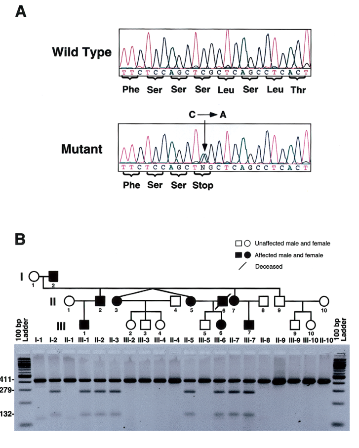

## Question

You are an expert researcher providing comprehensive, well-cited information.

Provide detailed information focusing on:
1. Key concepts and definitions with current understanding
2. Recent developments and latest research (prioritize 2023-2024 sources)
3. Current applications and real-world implementations
4. Expert opinions and analysis from authoritative sources
5. Relevant statistics and data from recent studies

Format as a comprehensive research report with proper citations. Include URLs and publication dates where available.
Always prioritize recent, authoritative sources and provide specific citations for all major claims.

# Disease Characteristics Research Template

## Target Disease
- **Disease Name:** Tooth and Nail Syndrome
- **MONDO ID:**  (if available)
- **Category:** Genetic

## Research Objectives

Please provide a comprehensive research report on **Tooth and Nail Syndrome** covering all of the
disease characteristics listed below. This report will be used to populate a disease knowledge
base entry. Be thorough and cite primary literature (PMID preferred) for all claims.

For each section, **suggested databases/resources** are listed. These are the first places
you should search for information on each topic.

---

### 1. Disease Information
> **Search first:** OMIM, Orphanet, ICD-10/ICD-11, MeSH, PubMed

- What is the disease? Provide a concise overview.
- What are the key identifiers? (OMIM, Orphanet, ICD-10/ICD-11, MeSH, Mondo)
- What are the common synonyms and alternative names?
- Is the information derived from individual patients (e.g., EHR) or aggregated disease-level resources?

### 2. Etiology

- **Disease Causal Factors**: What are the primary causes? (genetic, environmental, infectious, mechanistic)
- **Risk Factors**:
  > **Search first:** PubMed, Cochrane Library, UpToDate, clinical guidelines, ClinVar, ClinGen, GWAS Catalog, PheGenI, CTD, CDC, WHO, epidemiological databases
  - Genetic risk factors (causal variants, susceptibility loci, modifier genes)
  - Environmental risk factors (toxins, lifestyle, occupational exposures, age, sex, family history)
- **Protective Factors**:
  > **Search first:** PubMed, Cochrane Library, clinical trial databases, GWAS Catalog, gnomAD, WHO, CDC, nutrition databases
  - Genetic protective factors (protective variants, modifier alleles)
  - Environmental protective factors (diet, lifestyle, exposures that reduce risk)
- **Gene-Environment Interactions**: How do genetic and environmental factors interact to influence disease?
  > **Search first:** CTD, PubMed, PheGenI, GxE databases

### 3. Phenotypes
> **Search first:** HPO (Human Phenotype Ontology), OMIM, Orphanet, PubMed, clinicaltrials.gov, MedDRA, SNOMED CT, DECIPHER, LOINC

For each phenotype, provide:
- **Phenotype type**: symptoms, clinical signs, physical manifestations, behavioral changes, or laboratory abnormalities
  > For symptoms/signs: HPO, OMIM, Orphanet, PubMed
  > For behavioral changes: HPO, DSM, RDoC (Research Domain Criteria), PubMed
  > For laboratory abnormalities: LOINC, SNOMED CT, LabTests Online, PubMed
- **Phenotype characteristics**:
  > **Search first:** OMIM, Orphanet, HPO, PubMed
  - Age of symptom onset (neonatal, childhood, adult-onset, late-onset)
  - Symptom severity (mild, moderate, severe, variable)
  - Symptom progression (stable, progressive, episodic, fluctuating)
  - Frequency among affected individuals (percentage or qualitative)
- **Quality of life impact**: Effects on daily functioning and well-being (per-phenotype when possible)
  > **Search first:** EQ-5D database, SF-36, WHO QOL databases, PubMed
- Suggest HPO (Human Phenotype Ontology) terms for each phenotype

### 4. Genetic/Molecular Information

- **Causal Genes**: Gene mutations or chromosomal abnormalities responsible for disease (gene symbols, OMIM IDs)
  > **Search first:** OMIM, ClinVar, HGMD, Ensembl, NCBI Gene
- **Pathogenic Variants**:
  - Affected genes (gene symbols, HGNC IDs)
    > **Search first:** OMIM, NCBI Gene, Ensembl, HGNC, UniProt, GeneCards
  - Variant classification (pathogenic, likely pathogenic, VUS per ACMG/AMP guidelines)
    > **Search first:** ClinVar, ClinGen, ACMG/AMP guidelines, VarSome
  - Variant type/class (missense, frameshift, nonsense, splice-site, structural)
  - Allele frequency in population databases
    > **Search first:** gnomAD, 1000 Genomes, ExAC, TOPMed, dbSNP
  - Somatic vs germline origin
    > **Search first:** COSMIC (somatic), ClinVar, ICGC, TCGA
  - Functional consequences (loss of function, gain of function, dominant negative)
- **Modifier Genes**: Genes that modify disease severity or expression
- **Epigenetic Information**: DNA methylation, histone modifications, chromatin changes affecting disease
  > **Search first:** ENCODE, Roadmap Epigenomics, MethBase, DiseaseMeth
- **Chromosomal Abnormalities**: Large-scale genetic changes (aneuploidy, translocations, inversions)
  > **Search first:** DECIPHER, ClinVar, ECARUCA, UCSC Genome Browser

### 5. Environmental Information

- **Environmental Factors**: Non-genetic contributing factors (toxins, radiation, pollution, occupational exposure)
  > **Search first:** CTD (Comparative Toxicogenomics Database), TOXNET, PubMed, EPA databases
- **Lifestyle Factors**: Behavioral factors (smoking, diet, exercise, alcohol consumption)
  > **Search first:** CDC databases, WHO, PubMed, NHANES
- **Infectious Agents**: If applicable, pathogens causing or triggering disease (bacteria, viruses, fungi, parasites)
  > **Search first:** NCBI Taxonomy, ViPR, BV-BRC, MicrobeDB, GIDEON

### 6. Mechanism / Pathophysiology

- **Molecular Pathways**: Specific signaling cascades or biochemical pathways involved (Wnt, MAPK, mTOR, PI3K-AKT, etc.)
  > **Search first:** KEGG, Reactome, WikiPathways, PathBank, BioCyc
- **Cellular Processes**: Cell-level mechanisms (apoptosis, autophagy, cell cycle dysregulation, inflammation, etc.)
  > **Search first:** Gene Ontology (GO), Reactome, KEGG, PubMed
- **Protein Dysfunction**: How protein structure or function is altered (misfolding, aggregation, loss of function, gain of function)
  > **Search first:** UniProt, PDB (Protein Data Bank), InterPro, Pfam, AlphaFold
- **Metabolic Changes**: Alterations in metabolic processes (energy metabolism, lipid metabolism, amino acid metabolism)
  > **Search first:** KEGG, BioCyc, HMDB (Human Metabolome Database), BRENDA
- **Immune System Involvement**: Role of immune response (autoimmunity, immunodeficiency, chronic inflammation)
  > **Search first:** ImmPort, Immunome Database, IEDB, Gene Ontology
- **Tissue Damage Mechanisms**: How tissues/ are injured (oxidative stress, ischemia, fibrosis, necrosis)
  > **Search first:** PubMed, Gene Ontology, Reactome
- **Biochemical Abnormalities**: Specific molecular defects (enzyme deficiencies, receptor dysfunction, ion channel defects)
  > **Search first:** BRENDA, UniProt, KEGG, OMIM, PubMed
- **Epigenetic Changes**: DNA methylation, histone modifications affecting gene expression in disease
  > **Search first:** ENCODE, Roadmap Epigenomics, MethBase, DiseaseMeth
- **Molecular Profiling** (if available):
  - Transcriptomics/gene expression changes
    > **Search first:** GEO (Gene Expression Omnibus), ArrayExpress, GTEx, Human Cell Atlas, SRA
  - Proteomics findings
    > **Search first:** PRIDE, ProteomeXchange, Human Protein Atlas, STRING, BioGRID
  - Metabolomics signatures
    > **Search first:** MetaboLights, Metabolomics Workbench, HMDB, METLIN
  - Lipidomics alterations
    > **Search first:** LIPID MAPS, SwissLipids, LipidHome, Metabolomics Workbench
  - Genomic structural features
    > **Search first:** UCSC Genome Browser, Ensembl, NCBI, dbVar, DGV
- **Advanced Technologies** (if applicable):
  - Single-cell analysis findings (cell-type specific mechanisms, cellular heterogeneity)
    > **Search first:** Human Cell Atlas, Single Cell Portal, GEO, CELLxGENE
  - Spatial transcriptomics findings
    > **Search first:** GEO, Spatial Research, Vizgen, 10x Genomics data
  - Multi-omics integration results
    > **Search first:** TCGA, ICGC, cBioPortal, LinkedOmics, PubMed
  - Functional genomics screens (CRISPR, RNAi)
    > **Search first:** DepMap, GenomeRNAi, PubMed, BioGRID ORCS

For each mechanism, describe:
- The causal chain from initial trigger to clinical manifestation
- Which mechanisms are upstream vs downstream
- What cell types and biological processes are involved
- Suggest GO terms for biological processes and CL terms for cell types

### 7. Anatomical Structures Affected

- **Organ Level**:
  - Primary organs directly affected
  - Secondary organ involvement (complications, secondary effects)
  - Body systems involved (cardiovascular, nervous, digestive, respiratory, endocrine, etc.)
  > **Search first:** Uberon, FMA (Foundational Model of Anatomy), OMIM, HPO, ICD-11, MeSH, SNOMED CT
- **Tissue and Cell Level**:
  - Specific tissue types affected (epithelial, connective, muscle, nervous)
  - Specific cell populations targeted (with Cell Ontology terms)
  > **Search first:** Uberon, Human Protein Atlas, Cell Ontology, Human Cell Atlas, CellMarker, PanglaoDB
- **Subcellular Level**:
  - Cellular compartments involved (mitochondria, nucleus, ER, lysosomes) (with GO Cellular Component terms)
  > **Search first:** Gene Ontology (Cellular Component), UniProt, Human Protein Atlas
- **Localization**:
  - Specific anatomical sites (with UBERON terms)
    > **Search first:** FMA, Uberon, NeuroNames (for brain), SNOMED CT
  - Lateralization (unilateral, bilateral, asymmetric)
    > **Search first:** HPO, clinical literature, imaging databases

### 8. Temporal Development

- **Onset**:
  - Typical age of onset (congenital, pediatric, adult, geriatric)
  - Onset pattern (acute, subacute, chronic, insidious)
  > **Search first:** OMIM, Orphanet, HPO, PubMed
- **Progression**:
  - Disease stages (early, intermediate, advanced, end-stage)
    > **Search first:** Cancer Staging Manual (AJCC), WHO classifications, PubMed
  - Progression rate (rapid, slow, variable)
  - Disease course pattern (episodic, relapsing-remitting, progressive, stable)
  - Disease duration (self-limited, chronic lifelong)
  > **Search first:** Disease registries, longitudinal cohort databases, natural history studies, PubMed, Orphanet, OMIM
- **Patterns**:
  - Remission patterns (spontaneous, treatment-induced)
    > **Search first:** Clinical trial databases, disease registries, PubMed
  - Critical periods (time windows of vulnerability or opportunity for intervention)
    > **Search first:** PubMed, developmental biology databases, clinical guidelines

### 9. Inheritance and Population

- **Epidemiology**:
  - Prevalence (cases per 100,000 at given time)
  - Incidence (new cases per 100,000 per year)
  > **Search first:** Orphanet, CDC, WHO, GBD (Global Burden of Disease), national registries, SEER, disease registries
- **For Genetic Etiology**:
  - Inheritance pattern (AD, AR, X-linked, mitochondrial, multifactorial, polygenic)
    > **Search first:** OMIM, Orphanet, ClinVar, GTR (Genetic Testing Registry)
  - Penetrance (complete, incomplete, age-dependent)
    > **Search first:** ClinVar, OMIM, PubMed, ClinGen
  - Expressivity (variable, consistent)
    > **Search first:** OMIM, ClinVar, PubMed
  - Genetic anticipation (increasing severity in successive generations)
    > **Search first:** OMIM, PubMed (especially for repeat expansion disorders)
  - Germline mosaicism
    > **Search first:** ClinVar, OMIM, genetic counseling literature, PubMed
  - Founder effects (population-specific mutations)
    > **Search first:** gnomAD, population genetics databases, PubMed
  - Consanguinity role
    > **Search first:** OMIM, population studies, genetic counseling resources
  - Carrier frequency
    > **Search first:** gnomAD, carrier screening databases, GeneReviews, GTR
- **Population Demographics**:
  - Affected populations (ethnic or demographic groups with higher prevalence)
    > **Search first:** gnomAD, 1000 Genomes, PAGE Study, PubMed, population registries
  - Geographic distribution (endemic areas, regional variation)
    > **Search first:** WHO, CDC, GBD, Orphanet, geographic epidemiology databases
  - Geographic distribution of specific variants
  - Sex ratio (male:female)
    > **Search first:** Disease registries, OMIM, PubMed, epidemiological databases
  - Age distribution of affected individuals
    > **Search first:** CDC, disease registries, SEER, Orphanet

### 10. Diagnostics

- **Clinical Tests**:
  - Laboratory tests (blood, urine, tissue chemistry, specific enzyme assays)
    > **Search first:** LOINC, LabTests Online, PubMed
  - Biomarkers (proteins, metabolites, genetic markers, circulating biomarkers)
    > **Search first:** FDA Biomarker List, BEST (Biomarkers, EndpointS, and other Tools), PubMed
  - Imaging studies (X-ray, CT, MRI, PET, ultrasound)
    > **Search first:** RadLex, DICOM, Radiopaedia, imaging databases
  - Functional tests (pulmonary function, cardiac stress tests)
    > **Search first:** LOINC, clinical guidelines, PubMed
  - Electrophysiology (EEG, EMG, ECG, nerve conduction studies)
    > **Search first:** LOINC, clinical neurophysiology databases, PubMed
  - Biopsy findings (histopathology, immunohistochemistry)
    > **Search first:** SNOMED CT, College of American Pathologists resources, PubMed
  - Pathology findings (microscopic examination)
    > **Search first:** SNOMED CT, Digital Pathology databases, PubMed
- **Genetic Testing**:
  > **Search first:** GTR (Genetic Testing Registry), GeneReviews, ClinGen
  - Overview of recommended genetic testing approach
  - Whole genome sequencing (WGS) utility
    > **Search first:** GTR, ClinVar, GEL (Genomics England), gnomAD
  - Whole exome sequencing (WES) utility
    > **Search first:** GTR, ClinVar, OMIM, GeneMatcher
  - Gene panels (which panels, which genes)
    > **Search first:** GTR, ClinVar, laboratory-specific databases
  - Single gene testing
    > **Search first:** GTR, ClinVar, OMIM, GeneReviews
  - Chromosomal microarray (CMA)
    > **Search first:** DECIPHER, ClinVar, dbVar, ECARUCA
  - Karyotyping
    > **Search first:** Chromosome Abnormality Database, ClinVar, cytogenetics resources
  - FISH
    > **Search first:** ClinVar, cytogenetics databases, PubMed
  - Mitochondrial DNA testing
    > **Search first:** MITOMAP, MSeqDR, ClinVar, GTR
  - Repeat expansion testing
    > **Search first:** GTR, ClinVar, repeat expansion databases, PubMed
- **Omics-Based Diagnostics** (if applicable):
  - RNA sequencing / transcriptomics
    > **Search first:** GEO, ArrayExpress, GTEx, RNA-seq databases
  - Proteomics
    > **Search first:** PRIDE, ProteomeXchange, FDA Biomarker database
  - Metabolomics
    > **Search first:** MetaboLights, Metabolomics Workbench, HMDB
  - Epigenomics
    > **Search first:** GEO, ENCODE, Roadmap Epigenomics, MethBase
  - Liquid biopsy
    > **Search first:** COSMIC, ClinVar, liquid biopsy databases, PubMed
- **Clinical Criteria**:
  - Standardized diagnostic criteria (DSM, ICD, society guidelines)
    > **Search first:** DSM-5, ICD-11, clinical society guidelines, UpToDate
  - Differential diagnosis (other conditions to rule out, with distinguishing features)
    > **Search first:** DynaMed, UpToDate, clinical decision support systems
- **Screening**:
  - Screening methods for asymptomatic individuals (newborn screening, carrier screening, cascade screening)
    > **Search first:** ACMG recommendations, CDC newborn screening, GTR

### 11. Outcome/Prognosis

- **Survival and Mortality**:
  - Survival rate (5-year, 10-year, overall)
    > **Search first:** SEER, cancer registries, disease-specific registries, PubMed
  - Life expectancy (with and without treatment if applicable)
    > **Search first:** Orphanet, disease registries, actuarial databases, PubMed
  - Mortality rate
    > **Search first:** CDC, WHO, GBD, national mortality databases
  - Disease-specific mortality (deaths directly attributable to disease)
    > **Search first:** Disease registries, CDC Wonder, GBD, PubMed
- **Morbidity and Function**:
  - Morbidity (disease-related disability and health impacts)
    > **Search first:** GBD, WHO, disability databases, PubMed
  - Disability outcomes (long-term functional impairments)
    > **Search first:** ICF (International Classification of Functioning), disability registries
  - Quality of life measures (EQ-5D, SF-36, PROMIS, disease-specific tools)
    > **Search first:** EQ-5D database, SF-36, PROMIS, PubMed
- **Disease Course**:
  - Complications (secondary problems: infections, organ failure, etc.)
    > **Search first:** ICD codes, disease registries, clinical databases, PubMed
  - Recovery potential (likelihood and extent of recovery, with vs without treatment)
    > **Search first:** Natural history studies, rehabilitation databases, PubMed
- **Prediction**:
  - Prognostic factors (age, disease severity, biomarkers, treatment response)
    > **Search first:** Prognostic models databases, clinical calculators, PubMed
  - Prognostic biomarkers (molecular markers predicting disease course)
    > **Search first:** FDA Biomarker database, PubMed, cancer prognostic databases

### 12. Treatment

- **Pharmacotherapy**:
  - Pharmacological treatments (drug names, drug classes, mechanisms of action)
    > **Search first:** DrugBank, RxNorm, ATC classification, DailyMed, FDA databases
  - Pharmacogenomics (how genetic variants affect drug metabolism, efficacy, toxicity)
    > **Search first:** PharmGKB, CPIC (Clinical Pharmacogenetics), FDA Table of PGx Biomarkers
- **Advanced Therapeutics**:
  - Gene therapy (viral vectors, CRISPR, gene replacement, gene editing)
    > **Search first:** ClinicalTrials.gov, FDA gene therapy database, ASGCT resources
  - Cell therapy (stem cell transplant, CAR-T, cellular therapeutics)
    > **Search first:** ClinicalTrials.gov, FDA cell therapy database, FACT standards
  - RNA-based therapies (ASOs, siRNA, mRNA therapies)
    > **Search first:** ClinicalTrials.gov, FDA approvals, PubMed
  - Targeted therapies (treatments directed at specific molecular targets)
    > **Search first:** My Cancer Genome, OncoKB, ClinicalTrials.gov, FDA approvals
  - Immunotherapies (checkpoint inhibitors, monoclonal antibodies)
    > **Search first:** Cancer Immunotherapy Database, FDA approvals, ClinicalTrials.gov
- **Surgical and Interventional**:
  - Surgical interventions (types of surgery, timing, outcomes)
    > **Search first:** CPT codes, surgical registries, clinical guidelines, PubMed
- **Supportive and Rehabilitative**:
  - Supportive care (symptom management, pain control, nutrition)
    > **Search first:** Clinical guidelines, Cochrane Library, PubMed
  - Rehabilitation (physical therapy, occupational therapy, speech therapy)
    > **Search first:** Rehabilitation medicine databases, clinical guidelines, PubMed
- **Experimental**:
  - Experimental treatments in clinical trials (with NCT identifiers if available)
    > **Search first:** ClinicalTrials.gov, EU Clinical Trials Register, WHO ICTRP
- **Treatment Outcomes**:
  - Treatment response rates
    > **Search first:** Clinical trial databases, FDA reviews, systematic reviews, PubMed
  - Side effects and adverse events
    > **Search first:** FDA Adverse Event Reporting System (FAERS), MedWatch, PubMed
- **Treatment Strategy**:
  - Treatment algorithms (clinical pathways, decision trees)
    > **Search first:** Clinical practice guidelines, NCCN Guidelines, UpToDate
  - Combination therapies
    > **Search first:** ClinicalTrials.gov, treatment guidelines, PubMed
  - Personalized medicine approaches (genotype-guided treatment)
    > **Search first:** My Cancer Genome, CIViC, PharmGKB, precision medicine databases

For each treatment, suggest MAXO (Medical Action Ontology) terms where applicable.

### 13. Prevention

- **Prevention Levels**:
  - Primary prevention (preventing disease occurrence: vaccination, risk factor modification)
    > **Search first:** CDC, WHO, USPSTF recommendations, Cochrane Library
  - Secondary prevention (early detection and treatment: screening programs, early intervention)
    > **Search first:** USPSTF, CDC screening guidelines, WHO
  - Tertiary prevention (preventing complications in those with disease)
    > **Search first:** Clinical guidelines, disease management protocols, PubMed
- **Immunization**: Vaccine strategies (if applicable)
  > **Search first:** CDC vaccine schedules, WHO immunization, FDA vaccine database
- **Screening and Early Detection**:
  - Screening programs (population-based: newborn screening, cancer screening)
    > **Search first:** CDC screening programs, USPSTF, cancer screening databases
  - Genetic screening (carrier screening, preimplantation genetic diagnosis, prenatal testing)
    > **Search first:** ACMG recommendations, ACOG guidelines, GTR
  - Risk stratification (identifying high-risk individuals for targeted prevention)
    > **Search first:** Risk prediction models, clinical calculators, PubMed
- **Behavioral Interventions**: Lifestyle modifications to reduce risk
  > **Search first:** CDC, WHO, behavioral intervention databases, Cochrane Library
- **Counseling**: Genetic counseling (risk assessment, family planning guidance)
  > **Search first:** NSGC resources, ACMG guidelines, GeneReviews
- **Public Health**:
  - Public health interventions (sanitation, vector control, health education)
    > **Search first:** CDC, WHO, public health databases, PubMed
  - Environmental interventions (reducing environmental risk factors)
    > **Search first:** EPA databases, WHO environmental health, PubMed
- **Prophylaxis**: Preventive medications or procedures
  > **Search first:** Clinical guidelines, FDA approvals, PubMed

### 14. Other Species / Natural Disease

- **Taxonomy**: Species affected (with NCBI Taxon identifiers)
  > **Search first:** NCBI Taxonomy
- **Breed**: Specific breeds affected (with VBO identifiers if applicable)
  > **Search first:** VBO (Vertebrate Breed Ontology)
- **Gene**: Orthologous genes in other species (with NCBI Gene IDs)
  > **Search first:** NCBI Gene
- **Natural Disease**:
  - Naturally occurring disease in other species (companion animals, wildlife)
    > **Search first:** OMIA (Online Mendelian Inheritance in Animals), VetCompass, PubMed
  - Veterinary relevance and importance in animal health
    > **Search first:** OMIA, veterinary databases, PubMed
- **Comparative Biology**:
  - Comparative pathology (similarities and differences across species)
    > **Search first:** OMIA, comparative pathology databases, PubMed
  - Evolutionary conservation of disease mechanisms
    > **Search first:** HomoloGene, OrthoMCL, Alliance of Genome Resources
- **Transmission** (if applicable):
  - Zoonotic potential
    > **Search first:** CDC zoonotic diseases, WHO zoonoses, GIDEON
  - Cross-species susceptibility
    > **Search first:** NCBI Taxonomy, veterinary databases, PubMed

### 15. Model Organisms

- **Model Types**:
  - Model organism type (mammalian, invertebrate, cellular, in vitro)
    > **Search first:** Alliance of Genome Resources, model organism databases
  - Specific model systems (mouse, rat, zebrafish, Drosophila, C. elegans, yeast, cell lines, organoids, iPSCs)
    > **Search first:** MGI, RGD, ZFIN, FlyBase, WormBase, SGD, ATCC, Cellosaurus
  - Induced models (drug treatment, surgical intervention, environmental manipulation)
    > **Search first:** MGI, model organism databases, PubMed
- **Genetic Models**:
  - Types available (knockout, knock-in, transgenic, conditional, humanized)
    > **Search first:** MGI, IMPC, KOMP, EuMMCR, IMSR
- **Model Characteristics**:
  - Phenotype recapitulation (how well model reproduces human disease features)
    > **Search first:** Model organism databases, comparative studies, PubMed
  - Model limitations (aspects of human disease not captured)
    > **Search first:** Model organism databases, PubMed, review articles
- **Applications**:
  - Research applications (what aspects of disease can be studied)
    > **Search first:** Model organism databases, PubMed
- **Resources**:
  - Model databases
    > **Search first:** MGI, RGD, ZFIN, FlyBase, WormBase, IMSR, EMMA, MMRRC

---

## Citation Requirements

- Cite primary literature (PMID preferred) for all mechanistic and clinical claims
- Prioritize recent reviews and landmark papers
- Include direct quotes from abstracts where possible to support key statements
- Distinguish evidence source types: human clinical, model organism, in vitro, computational

## Output Format

Structure your response as a comprehensive narrative organized by the sections above.
For each section, provide:
- Factual content with specific details (numbers, percentages, gene names, variant nomenclature)
- Ontology term suggestions (HPO, GO, CL, UBERON, CHEBI, MAXO, MONDO) where applicable
- Evidence citations with PMIDs
- Direct quotes from abstracts to support key claims
- Clear indication when information is not available or not applicable for this disease

This report will be used to populate a disease knowledge base entry with:
- Pathophysiology descriptions with causal chains
- Gene/protein annotations (HGNC, GO terms)
- Phenotype associations (HP terms) with frequencies
- Cell type involvement (CL terms)
- Anatomical locations (UBERON terms)
- Chemical entities (CHEBI terms)
- Treatment annotations (MAXO terms)
- Evidence items with PMIDs and exact abstract quotes
- Epidemiology, prognosis, diagnostic, and prevention information
- Animal model descriptions with phenotype recapitulation details

## Output

Question: You are an expert researcher providing comprehensive, well-cited information.

Provide detailed information focusing on:
1. Key concepts and definitions with current understanding
2. Recent developments and latest research (prioritize 2023-2024 sources)
3. Current applications and real-world implementations
4. Expert opinions and analysis from authoritative sources
5. Relevant statistics and data from recent studies

Format as a comprehensive research report with proper citations. Include URLs and publication dates where available.
Always prioritize recent, authoritative sources and provide specific citations for all major claims.

# Disease Characteristics Research Template

## Target Disease
- **Disease Name:** Tooth and Nail Syndrome
- **MONDO ID:**  (if available)
- **Category:** Genetic

## Research Objectives

Please provide a comprehensive research report on **Tooth and Nail Syndrome** covering all of the
disease characteristics listed below. This report will be used to populate a disease knowledge
base entry. Be thorough and cite primary literature (PMID preferred) for all claims.

For each section, **suggested databases/resources** are listed. These are the first places
you should search for information on each topic.

---

### 1. Disease Information
> **Search first:** OMIM, Orphanet, ICD-10/ICD-11, MeSH, PubMed

- What is the disease? Provide a concise overview.
- What are the key identifiers? (OMIM, Orphanet, ICD-10/ICD-11, MeSH, Mondo)
- What are the common synonyms and alternative names?
- Is the information derived from individual patients (e.g., EHR) or aggregated disease-level resources?

### 2. Etiology

- **Disease Causal Factors**: What are the primary causes? (genetic, environmental, infectious, mechanistic)
- **Risk Factors**:
  > **Search first:** PubMed, Cochrane Library, UpToDate, clinical guidelines, ClinVar, ClinGen, GWAS Catalog, PheGenI, CTD, CDC, WHO, epidemiological databases
  - Genetic risk factors (causal variants, susceptibility loci, modifier genes)
  - Environmental risk factors (toxins, lifestyle, occupational exposures, age, sex, family history)
- **Protective Factors**:
  > **Search first:** PubMed, Cochrane Library, clinical trial databases, GWAS Catalog, gnomAD, WHO, CDC, nutrition databases
  - Genetic protective factors (protective variants, modifier alleles)
  - Environmental protective factors (diet, lifestyle, exposures that reduce risk)
- **Gene-Environment Interactions**: How do genetic and environmental factors interact to influence disease?
  > **Search first:** CTD, PubMed, PheGenI, GxE databases

### 3. Phenotypes
> **Search first:** HPO (Human Phenotype Ontology), OMIM, Orphanet, PubMed, clinicaltrials.gov, MedDRA, SNOMED CT, DECIPHER, LOINC

For each phenotype, provide:
- **Phenotype type**: symptoms, clinical signs, physical manifestations, behavioral changes, or laboratory abnormalities
  > For symptoms/signs: HPO, OMIM, Orphanet, PubMed
  > For behavioral changes: HPO, DSM, RDoC (Research Domain Criteria), PubMed
  > For laboratory abnormalities: LOINC, SNOMED CT, LabTests Online, PubMed
- **Phenotype characteristics**:
  > **Search first:** OMIM, Orphanet, HPO, PubMed
  - Age of symptom onset (neonatal, childhood, adult-onset, late-onset)
  - Symptom severity (mild, moderate, severe, variable)
  - Symptom progression (stable, progressive, episodic, fluctuating)
  - Frequency among affected individuals (percentage or qualitative)
- **Quality of life impact**: Effects on daily functioning and well-being (per-phenotype when possible)
  > **Search first:** EQ-5D database, SF-36, WHO QOL databases, PubMed
- Suggest HPO (Human Phenotype Ontology) terms for each phenotype

### 4. Genetic/Molecular Information

- **Causal Genes**: Gene mutations or chromosomal abnormalities responsible for disease (gene symbols, OMIM IDs)
  > **Search first:** OMIM, ClinVar, HGMD, Ensembl, NCBI Gene
- **Pathogenic Variants**:
  - Affected genes (gene symbols, HGNC IDs)
    > **Search first:** OMIM, NCBI Gene, Ensembl, HGNC, UniProt, GeneCards
  - Variant classification (pathogenic, likely pathogenic, VUS per ACMG/AMP guidelines)
    > **Search first:** ClinVar, ClinGen, ACMG/AMP guidelines, VarSome
  - Variant type/class (missense, frameshift, nonsense, splice-site, structural)
  - Allele frequency in population databases
    > **Search first:** gnomAD, 1000 Genomes, ExAC, TOPMed, dbSNP
  - Somatic vs germline origin
    > **Search first:** COSMIC (somatic), ClinVar, ICGC, TCGA
  - Functional consequences (loss of function, gain of function, dominant negative)
- **Modifier Genes**: Genes that modify disease severity or expression
- **Epigenetic Information**: DNA methylation, histone modifications, chromatin changes affecting disease
  > **Search first:** ENCODE, Roadmap Epigenomics, MethBase, DiseaseMeth
- **Chromosomal Abnormalities**: Large-scale genetic changes (aneuploidy, translocations, inversions)
  > **Search first:** DECIPHER, ClinVar, ECARUCA, UCSC Genome Browser

### 5. Environmental Information

- **Environmental Factors**: Non-genetic contributing factors (toxins, radiation, pollution, occupational exposure)
  > **Search first:** CTD (Comparative Toxicogenomics Database), TOXNET, PubMed, EPA databases
- **Lifestyle Factors**: Behavioral factors (smoking, diet, exercise, alcohol consumption)
  > **Search first:** CDC databases, WHO, PubMed, NHANES
- **Infectious Agents**: If applicable, pathogens causing or triggering disease (bacteria, viruses, fungi, parasites)
  > **Search first:** NCBI Taxonomy, ViPR, BV-BRC, MicrobeDB, GIDEON

### 6. Mechanism / Pathophysiology

- **Molecular Pathways**: Specific signaling cascades or biochemical pathways involved (Wnt, MAPK, mTOR, PI3K-AKT, etc.)
  > **Search first:** KEGG, Reactome, WikiPathways, PathBank, BioCyc
- **Cellular Processes**: Cell-level mechanisms (apoptosis, autophagy, cell cycle dysregulation, inflammation, etc.)
  > **Search first:** Gene Ontology (GO), Reactome, KEGG, PubMed
- **Protein Dysfunction**: How protein structure or function is altered (misfolding, aggregation, loss of function, gain of function)
  > **Search first:** UniProt, PDB (Protein Data Bank), InterPro, Pfam, AlphaFold
- **Metabolic Changes**: Alterations in metabolic processes (energy metabolism, lipid metabolism, amino acid metabolism)
  > **Search first:** KEGG, BioCyc, HMDB (Human Metabolome Database), BRENDA
- **Immune System Involvement**: Role of immune response (autoimmunity, immunodeficiency, chronic inflammation)
  > **Search first:** ImmPort, Immunome Database, IEDB, Gene Ontology
- **Tissue Damage Mechanisms**: How tissues/ are injured (oxidative stress, ischemia, fibrosis, necrosis)
  > **Search first:** PubMed, Gene Ontology, Reactome
- **Biochemical Abnormalities**: Specific molecular defects (enzyme deficiencies, receptor dysfunction, ion channel defects)
  > **Search first:** BRENDA, UniProt, KEGG, OMIM, PubMed
- **Epigenetic Changes**: DNA methylation, histone modifications affecting gene expression in disease
  > **Search first:** ENCODE, Roadmap Epigenomics, MethBase, DiseaseMeth
- **Molecular Profiling** (if available):
  - Transcriptomics/gene expression changes
    > **Search first:** GEO (Gene Expression Omnibus), ArrayExpress, GTEx, Human Cell Atlas, SRA
  - Proteomics findings
    > **Search first:** PRIDE, ProteomeXchange, Human Protein Atlas, STRING, BioGRID
  - Metabolomics signatures
    > **Search first:** MetaboLights, Metabolomics Workbench, HMDB, METLIN
  - Lipidomics alterations
    > **Search first:** LIPID MAPS, SwissLipids, LipidHome, Metabolomics Workbench
  - Genomic structural features
    > **Search first:** UCSC Genome Browser, Ensembl, NCBI, dbVar, DGV
- **Advanced Technologies** (if applicable):
  - Single-cell analysis findings (cell-type specific mechanisms, cellular heterogeneity)
    > **Search first:** Human Cell Atlas, Single Cell Portal, GEO, CELLxGENE
  - Spatial transcriptomics findings
    > **Search first:** GEO, Spatial Research, Vizgen, 10x Genomics data
  - Multi-omics integration results
    > **Search first:** TCGA, ICGC, cBioPortal, LinkedOmics, PubMed
  - Functional genomics screens (CRISPR, RNAi)
    > **Search first:** DepMap, GenomeRNAi, PubMed, BioGRID ORCS

For each mechanism, describe:
- The causal chain from initial trigger to clinical manifestation
- Which mechanisms are upstream vs downstream
- What cell types and biological processes are involved
- Suggest GO terms for biological processes and CL terms for cell types

### 7. Anatomical Structures Affected

- **Organ Level**:
  - Primary organs directly affected
  - Secondary organ involvement (complications, secondary effects)
  - Body systems involved (cardiovascular, nervous, digestive, respiratory, endocrine, etc.)
  > **Search first:** Uberon, FMA (Foundational Model of Anatomy), OMIM, HPO, ICD-11, MeSH, SNOMED CT
- **Tissue and Cell Level**:
  - Specific tissue types affected (epithelial, connective, muscle, nervous)
  - Specific cell populations targeted (with Cell Ontology terms)
  > **Search first:** Uberon, Human Protein Atlas, Cell Ontology, Human Cell Atlas, CellMarker, PanglaoDB
- **Subcellular Level**:
  - Cellular compartments involved (mitochondria, nucleus, ER, lysosomes) (with GO Cellular Component terms)
  > **Search first:** Gene Ontology (Cellular Component), UniProt, Human Protein Atlas
- **Localization**:
  - Specific anatomical sites (with UBERON terms)
    > **Search first:** FMA, Uberon, NeuroNames (for brain), SNOMED CT
  - Lateralization (unilateral, bilateral, asymmetric)
    > **Search first:** HPO, clinical literature, imaging databases

### 8. Temporal Development

- **Onset**:
  - Typical age of onset (congenital, pediatric, adult, geriatric)
  - Onset pattern (acute, subacute, chronic, insidious)
  > **Search first:** OMIM, Orphanet, HPO, PubMed
- **Progression**:
  - Disease stages (early, intermediate, advanced, end-stage)
    > **Search first:** Cancer Staging Manual (AJCC), WHO classifications, PubMed
  - Progression rate (rapid, slow, variable)
  - Disease course pattern (episodic, relapsing-remitting, progressive, stable)
  - Disease duration (self-limited, chronic lifelong)
  > **Search first:** Disease registries, longitudinal cohort databases, natural history studies, PubMed, Orphanet, OMIM
- **Patterns**:
  - Remission patterns (spontaneous, treatment-induced)
    > **Search first:** Clinical trial databases, disease registries, PubMed
  - Critical periods (time windows of vulnerability or opportunity for intervention)
    > **Search first:** PubMed, developmental biology databases, clinical guidelines

### 9. Inheritance and Population

- **Epidemiology**:
  - Prevalence (cases per 100,000 at given time)
  - Incidence (new cases per 100,000 per year)
  > **Search first:** Orphanet, CDC, WHO, GBD (Global Burden of Disease), national registries, SEER, disease registries
- **For Genetic Etiology**:
  - Inheritance pattern (AD, AR, X-linked, mitochondrial, multifactorial, polygenic)
    > **Search first:** OMIM, Orphanet, ClinVar, GTR (Genetic Testing Registry)
  - Penetrance (complete, incomplete, age-dependent)
    > **Search first:** ClinVar, OMIM, PubMed, ClinGen
  - Expressivity (variable, consistent)
    > **Search first:** OMIM, ClinVar, PubMed
  - Genetic anticipation (increasing severity in successive generations)
    > **Search first:** OMIM, PubMed (especially for repeat expansion disorders)
  - Germline mosaicism
    > **Search first:** ClinVar, OMIM, genetic counseling literature, PubMed
  - Founder effects (population-specific mutations)
    > **Search first:** gnomAD, population genetics databases, PubMed
  - Consanguinity role
    > **Search first:** OMIM, population studies, genetic counseling resources
  - Carrier frequency
    > **Search first:** gnomAD, carrier screening databases, GeneReviews, GTR
- **Population Demographics**:
  - Affected populations (ethnic or demographic groups with higher prevalence)
    > **Search first:** gnomAD, 1000 Genomes, PAGE Study, PubMed, population registries
  - Geographic distribution (endemic areas, regional variation)
    > **Search first:** WHO, CDC, GBD, Orphanet, geographic epidemiology databases
  - Geographic distribution of specific variants
  - Sex ratio (male:female)
    > **Search first:** Disease registries, OMIM, PubMed, epidemiological databases
  - Age distribution of affected individuals
    > **Search first:** CDC, disease registries, SEER, Orphanet

### 10. Diagnostics

- **Clinical Tests**:
  - Laboratory tests (blood, urine, tissue chemistry, specific enzyme assays)
    > **Search first:** LOINC, LabTests Online, PubMed
  - Biomarkers (proteins, metabolites, genetic markers, circulating biomarkers)
    > **Search first:** FDA Biomarker List, BEST (Biomarkers, EndpointS, and other Tools), PubMed
  - Imaging studies (X-ray, CT, MRI, PET, ultrasound)
    > **Search first:** RadLex, DICOM, Radiopaedia, imaging databases
  - Functional tests (pulmonary function, cardiac stress tests)
    > **Search first:** LOINC, clinical guidelines, PubMed
  - Electrophysiology (EEG, EMG, ECG, nerve conduction studies)
    > **Search first:** LOINC, clinical neurophysiology databases, PubMed
  - Biopsy findings (histopathology, immunohistochemistry)
    > **Search first:** SNOMED CT, College of American Pathologists resources, PubMed
  - Pathology findings (microscopic examination)
    > **Search first:** SNOMED CT, Digital Pathology databases, PubMed
- **Genetic Testing**:
  > **Search first:** GTR (Genetic Testing Registry), GeneReviews, ClinGen
  - Overview of recommended genetic testing approach
  - Whole genome sequencing (WGS) utility
    > **Search first:** GTR, ClinVar, GEL (Genomics England), gnomAD
  - Whole exome sequencing (WES) utility
    > **Search first:** GTR, ClinVar, OMIM, GeneMatcher
  - Gene panels (which panels, which genes)
    > **Search first:** GTR, ClinVar, laboratory-specific databases
  - Single gene testing
    > **Search first:** GTR, ClinVar, OMIM, GeneReviews
  - Chromosomal microarray (CMA)
    > **Search first:** DECIPHER, ClinVar, dbVar, ECARUCA
  - Karyotyping
    > **Search first:** Chromosome Abnormality Database, ClinVar, cytogenetics resources
  - FISH
    > **Search first:** ClinVar, cytogenetics databases, PubMed
  - Mitochondrial DNA testing
    > **Search first:** MITOMAP, MSeqDR, ClinVar, GTR
  - Repeat expansion testing
    > **Search first:** GTR, ClinVar, repeat expansion databases, PubMed
- **Omics-Based Diagnostics** (if applicable):
  - RNA sequencing / transcriptomics
    > **Search first:** GEO, ArrayExpress, GTEx, RNA-seq databases
  - Proteomics
    > **Search first:** PRIDE, ProteomeXchange, FDA Biomarker database
  - Metabolomics
    > **Search first:** MetaboLights, Metabolomics Workbench, HMDB
  - Epigenomics
    > **Search first:** GEO, ENCODE, Roadmap Epigenomics, MethBase
  - Liquid biopsy
    > **Search first:** COSMIC, ClinVar, liquid biopsy databases, PubMed
- **Clinical Criteria**:
  - Standardized diagnostic criteria (DSM, ICD, society guidelines)
    > **Search first:** DSM-5, ICD-11, clinical society guidelines, UpToDate
  - Differential diagnosis (other conditions to rule out, with distinguishing features)
    > **Search first:** DynaMed, UpToDate, clinical decision support systems
- **Screening**:
  - Screening methods for asymptomatic individuals (newborn screening, carrier screening, cascade screening)
    > **Search first:** ACMG recommendations, CDC newborn screening, GTR

### 11. Outcome/Prognosis

- **Survival and Mortality**:
  - Survival rate (5-year, 10-year, overall)
    > **Search first:** SEER, cancer registries, disease-specific registries, PubMed
  - Life expectancy (with and without treatment if applicable)
    > **Search first:** Orphanet, disease registries, actuarial databases, PubMed
  - Mortality rate
    > **Search first:** CDC, WHO, GBD, national mortality databases
  - Disease-specific mortality (deaths directly attributable to disease)
    > **Search first:** Disease registries, CDC Wonder, GBD, PubMed
- **Morbidity and Function**:
  - Morbidity (disease-related disability and health impacts)
    > **Search first:** GBD, WHO, disability databases, PubMed
  - Disability outcomes (long-term functional impairments)
    > **Search first:** ICF (International Classification of Functioning), disability registries
  - Quality of life measures (EQ-5D, SF-36, PROMIS, disease-specific tools)
    > **Search first:** EQ-5D database, SF-36, PROMIS, PubMed
- **Disease Course**:
  - Complications (secondary problems: infections, organ failure, etc.)
    > **Search first:** ICD codes, disease registries, clinical databases, PubMed
  - Recovery potential (likelihood and extent of recovery, with vs without treatment)
    > **Search first:** Natural history studies, rehabilitation databases, PubMed
- **Prediction**:
  - Prognostic factors (age, disease severity, biomarkers, treatment response)
    > **Search first:** Prognostic models databases, clinical calculators, PubMed
  - Prognostic biomarkers (molecular markers predicting disease course)
    > **Search first:** FDA Biomarker database, PubMed, cancer prognostic databases

### 12. Treatment

- **Pharmacotherapy**:
  - Pharmacological treatments (drug names, drug classes, mechanisms of action)
    > **Search first:** DrugBank, RxNorm, ATC classification, DailyMed, FDA databases
  - Pharmacogenomics (how genetic variants affect drug metabolism, efficacy, toxicity)
    > **Search first:** PharmGKB, CPIC (Clinical Pharmacogenetics), FDA Table of PGx Biomarkers
- **Advanced Therapeutics**:
  - Gene therapy (viral vectors, CRISPR, gene replacement, gene editing)
    > **Search first:** ClinicalTrials.gov, FDA gene therapy database, ASGCT resources
  - Cell therapy (stem cell transplant, CAR-T, cellular therapeutics)
    > **Search first:** ClinicalTrials.gov, FDA cell therapy database, FACT standards
  - RNA-based therapies (ASOs, siRNA, mRNA therapies)
    > **Search first:** ClinicalTrials.gov, FDA approvals, PubMed
  - Targeted therapies (treatments directed at specific molecular targets)
    > **Search first:** My Cancer Genome, OncoKB, ClinicalTrials.gov, FDA approvals
  - Immunotherapies (checkpoint inhibitors, monoclonal antibodies)
    > **Search first:** Cancer Immunotherapy Database, FDA approvals, ClinicalTrials.gov
- **Surgical and Interventional**:
  - Surgical interventions (types of surgery, timing, outcomes)
    > **Search first:** CPT codes, surgical registries, clinical guidelines, PubMed
- **Supportive and Rehabilitative**:
  - Supportive care (symptom management, pain control, nutrition)
    > **Search first:** Clinical guidelines, Cochrane Library, PubMed
  - Rehabilitation (physical therapy, occupational therapy, speech therapy)
    > **Search first:** Rehabilitation medicine databases, clinical guidelines, PubMed
- **Experimental**:
  - Experimental treatments in clinical trials (with NCT identifiers if available)
    > **Search first:** ClinicalTrials.gov, EU Clinical Trials Register, WHO ICTRP
- **Treatment Outcomes**:
  - Treatment response rates
    > **Search first:** Clinical trial databases, FDA reviews, systematic reviews, PubMed
  - Side effects and adverse events
    > **Search first:** FDA Adverse Event Reporting System (FAERS), MedWatch, PubMed
- **Treatment Strategy**:
  - Treatment algorithms (clinical pathways, decision trees)
    > **Search first:** Clinical practice guidelines, NCCN Guidelines, UpToDate
  - Combination therapies
    > **Search first:** ClinicalTrials.gov, treatment guidelines, PubMed
  - Personalized medicine approaches (genotype-guided treatment)
    > **Search first:** My Cancer Genome, CIViC, PharmGKB, precision medicine databases

For each treatment, suggest MAXO (Medical Action Ontology) terms where applicable.

### 13. Prevention

- **Prevention Levels**:
  - Primary prevention (preventing disease occurrence: vaccination, risk factor modification)
    > **Search first:** CDC, WHO, USPSTF recommendations, Cochrane Library
  - Secondary prevention (early detection and treatment: screening programs, early intervention)
    > **Search first:** USPSTF, CDC screening guidelines, WHO
  - Tertiary prevention (preventing complications in those with disease)
    > **Search first:** Clinical guidelines, disease management protocols, PubMed
- **Immunization**: Vaccine strategies (if applicable)
  > **Search first:** CDC vaccine schedules, WHO immunization, FDA vaccine database
- **Screening and Early Detection**:
  - Screening programs (population-based: newborn screening, cancer screening)
    > **Search first:** CDC screening programs, USPSTF, cancer screening databases
  - Genetic screening (carrier screening, preimplantation genetic diagnosis, prenatal testing)
    > **Search first:** ACMG recommendations, ACOG guidelines, GTR
  - Risk stratification (identifying high-risk individuals for targeted prevention)
    > **Search first:** Risk prediction models, clinical calculators, PubMed
- **Behavioral Interventions**: Lifestyle modifications to reduce risk
  > **Search first:** CDC, WHO, behavioral intervention databases, Cochrane Library
- **Counseling**: Genetic counseling (risk assessment, family planning guidance)
  > **Search first:** NSGC resources, ACMG guidelines, GeneReviews
- **Public Health**:
  - Public health interventions (sanitation, vector control, health education)
    > **Search first:** CDC, WHO, public health databases, PubMed
  - Environmental interventions (reducing environmental risk factors)
    > **Search first:** EPA databases, WHO environmental health, PubMed
- **Prophylaxis**: Preventive medications or procedures
  > **Search first:** Clinical guidelines, FDA approvals, PubMed

### 14. Other Species / Natural Disease

- **Taxonomy**: Species affected (with NCBI Taxon identifiers)
  > **Search first:** NCBI Taxonomy
- **Breed**: Specific breeds affected (with VBO identifiers if applicable)
  > **Search first:** VBO (Vertebrate Breed Ontology)
- **Gene**: Orthologous genes in other species (with NCBI Gene IDs)
  > **Search first:** NCBI Gene
- **Natural Disease**:
  - Naturally occurring disease in other species (companion animals, wildlife)
    > **Search first:** OMIA (Online Mendelian Inheritance in Animals), VetCompass, PubMed
  - Veterinary relevance and importance in animal health
    > **Search first:** OMIA, veterinary databases, PubMed
- **Comparative Biology**:
  - Comparative pathology (similarities and differences across species)
    > **Search first:** OMIA, comparative pathology databases, PubMed
  - Evolutionary conservation of disease mechanisms
    > **Search first:** HomoloGene, OrthoMCL, Alliance of Genome Resources
- **Transmission** (if applicable):
  - Zoonotic potential
    > **Search first:** CDC zoonotic diseases, WHO zoonoses, GIDEON
  - Cross-species susceptibility
    > **Search first:** NCBI Taxonomy, veterinary databases, PubMed

### 15. Model Organisms

- **Model Types**:
  - Model organism type (mammalian, invertebrate, cellular, in vitro)
    > **Search first:** Alliance of Genome Resources, model organism databases
  - Specific model systems (mouse, rat, zebrafish, Drosophila, C. elegans, yeast, cell lines, organoids, iPSCs)
    > **Search first:** MGI, RGD, ZFIN, FlyBase, WormBase, SGD, ATCC, Cellosaurus
  - Induced models (drug treatment, surgical intervention, environmental manipulation)
    > **Search first:** MGI, model organism databases, PubMed
- **Genetic Models**:
  - Types available (knockout, knock-in, transgenic, conditional, humanized)
    > **Search first:** MGI, IMPC, KOMP, EuMMCR, IMSR
- **Model Characteristics**:
  - Phenotype recapitulation (how well model reproduces human disease features)
    > **Search first:** Model organism databases, comparative studies, PubMed
  - Model limitations (aspects of human disease not captured)
    > **Search first:** Model organism databases, PubMed, review articles
- **Applications**:
  - Research applications (what aspects of disease can be studied)
    > **Search first:** Model organism databases, PubMed
- **Resources**:
  - Model databases
    > **Search first:** MGI, RGD, ZFIN, FlyBase, WormBase, IMSR, EMMA, MMRRC

---

## Citation Requirements

- Cite primary literature (PMID preferred) for all mechanistic and clinical claims
- Prioritize recent reviews and landmark papers
- Include direct quotes from abstracts where possible to support key statements
- Distinguish evidence source types: human clinical, model organism, in vitro, computational

## Output Format

Structure your response as a comprehensive narrative organized by the sections above.
For each section, provide:
- Factual content with specific details (numbers, percentages, gene names, variant nomenclature)
- Ontology term suggestions (HPO, GO, CL, UBERON, CHEBI, MAXO, MONDO) where applicable
- Evidence citations with PMIDs
- Direct quotes from abstracts to support key claims
- Clear indication when information is not available or not applicable for this disease

This report will be used to populate a disease knowledge base entry with:
- Pathophysiology descriptions with causal chains
- Gene/protein annotations (HGNC, GO terms)
- Phenotype associations (HP terms) with frequencies
- Cell type involvement (CL terms)
- Anatomical locations (UBERON terms)
- Chemical entities (CHEBI terms)
- Treatment annotations (MAXO terms)
- Evidence items with PMIDs and exact abstract quotes
- Epidemiology, prognosis, diagnostic, and prevention information
- Animal model descriptions with phenotype recapitulation details

# Tooth and Nail Syndrome (Witkop Syndrome; Hypodontia–Nail Dysplasia) — Disease Characteristics Research Report

## Executive summary
Tooth and Nail Syndrome (TNS), also called **Witkop syndrome**, is a rare, primarily **autosomal dominant** ectodermal dysplasia characterized by **congenital tooth agenesis (hypodontia/oligodontia)** and **nail dysplasia**, with typically **normal sweating** and minimal hair involvement. The strongest primary molecular evidence links TNS to **heterozygous loss-of-function variants in MSX1**, including a canonical nonsense variant **MSX1 c.605C>A (p.Ser202Ter; “S202X”)** that cosegregates with disease in a multigeneration pedigree and is supported by developmental biology and mouse model parallels. (jumlongras2001anonsensemutation pages 4-7, jumlongras2001anonsensemutation pages 1-2, jumlongras2001anonsensemutation media 0569dd8f)

A 2024 narrative review of tooth agenesis reiterates **MSX1** as a principal gene and explicitly maps **Witkop-type ectodermal dysplasia (OMIM 189500)** to **autosomal dominant MSX1**. (cammaratascalisi2024maingeneticentities pages 1-2)

| Topic | Key facts | Suggested ontology terms | Key references / evidence |
|---|---|---|---|
| Disease definition & synonyms | Rare hereditary ectodermal dysplasia primarily affecting teeth and nails; characterized by congenital tooth agenesis/hypodontia or oligodontia plus nail dysplasia. Common synonyms: **Witkop syndrome**, **tooth-and-nail syndrome (TNS)**, **hypodontia–nail dysplasia syndrome**, **Witkop tooth-and-nail syndrome**. Disease-level information is derived mainly from aggregated case reports/families and review resources, not EHR-scale datasets. (altugatac2008witkoptoothand pages 1-2, memarpour2011witkoptoothand pages 1-3, devadas2005witkoptoothand pages 1-3) | MONDO: not confidently identified from available context; HPO candidates include **Hypodontia** HP:0000677, **Oligodontia** HP:0000676, **Abnormality of nails** HP:0001597 | Altug-Atac & Iseri 2008, *Angle Orthod* 78:370-380, DOI: 10.2319/100406-403.1, https://doi.org/10.2319/100406-403.1 (altugatac2008witkoptoothand pages 1-2); Memarpour & Shafiei 2011, *Pediatr Dermatol* 28:281-285, DOI: 10.1111/j.1525-1470.2010.01198.x, https://doi.org/10.1111/j.1525-1470.2010.01198.x (memarpour2011witkoptoothand pages 1-3) |
| Inheritance | Usually **autosomal dominant** with **variable expressivity**; family pedigrees show vertical transmission across generations. (altugatac2008witkoptoothand pages 1-2, memarpour2011witkoptoothand pages 1-3, jumlongras2001anonsensemutation pages 1-2, cammaratascalisi2024maingeneticentities pages 1-2, jumlongras2001anonsensemutation media 0569dd8f) | HPO: **Autosomal dominant inheritance** HP:0000006; **Variable expressivity** HP:0003828 | Jumlongras et al. 2001, *Am J Hum Genet* 69:67-74, DOI: 10.1086/321271, https://doi.org/10.1086/321271 (jumlongras2001anonsensemutation pages 1-2, jumlongras2001anonsensemutation media 0569dd8f); Cammarata-Scalisi et al. 2024, *Clin Oral Investig* 29:9, DOI: 10.1007/s00784-024-05941-7, https://doi.org/10.1007/s00784-024-05941-7 (cammaratascalisi2024maingeneticentities pages 1-2) |
| Causal gene & key pathogenic variant | Canonical causal gene from primary evidence: **MSX1** (OMIM gene cited in review context as 142983). Landmark family study identified heterozygous **c.605C>A, p.Ser202Ter (S202X)** nonsense variant in exon 2/homeodomain; variant cosegregated with disease and was absent from 132 control chromosomes. Evidence type: **human familial linkage + segregation + sequencing**, supported by **mouse model** phenotype parallels. (jumlongras2001anonsensemutation pages 7-8, jumlongras2001anonsensemutation pages 4-7, jumlongras2001anonsensemutation pages 1-2, cammaratascalisi2024maingeneticentities pages 1-2) | HGNC gene: **MSX1**; Sequence ontology idea: **nonsense_variant**; HPO: **Abnormality of the dentition** HP:0000164 | Jumlongras et al. 2001, *Am J Hum Genet* 69:67-74, DOI: 10.1086/321271, https://doi.org/10.1086/321271 (jumlongras2001anonsensemutation pages 7-8, jumlongras2001anonsensemutation pages 4-7); 2024 summary review confirms **MSX1 → Witkop type ED3 (AD)** (cammaratascalisi2024maingeneticentities pages 1-2) |
| Core phenotype: teeth | Congenitally missing primary and/or permanent teeth; reported range in one pedigree **11-28 missing permanent teeth**. Frequently absent teeth reported across case literature include **mandibular incisors, second molars, maxillary canines/incisors**. Remaining teeth may be **small, widely spaced, conical/narrow-crowned**; retained primary teeth are common. (altugatac2008witkoptoothand pages 1-2, memarpour2011witkoptoothand pages 1-3, devadas2005witkoptoothand pages 1-3, jumlongras2001anonsensemutation pages 2-4, jumlongras2001anonsensemutation media 0569dd8f) | HPO: **Hypodontia** HP:0000677; **Oligodontia** HP:0000676; **Conical tooth** HP:0000698; **Widely spaced teeth** HP:0000687; **Retained primary teeth** HP:0006335 | Devadas et al. 2005, *Int J Paediatr Dent* 15:364-369, DOI: 10.1111/j.1365-263x.2005.00647.x, https://doi.org/10.1111/j.1365-263x.2005.00647.x (devadas2005witkoptoothand pages 1-3); Memarpour & Shafiei 2011 (memarpour2011witkoptoothand pages 1-3); Jumlongras et al. 2001 (jumlongras2001anonsensemutation pages 2-4) |
| Core phenotype: nails | Fingernail and toenail dysplasia, often **more severe in toenails**; nails may be **thin, brittle, slow-growing, spoon-shaped (koilonychia), rigid**, with **onychorrhexis/longitudinal ridging**. Nail findings are often most obvious in childhood and may **improve with age**. (altugatac2008witkoptoothand pages 1-2, memarpour2011witkoptoothand pages 1-3, devadas2005witkoptoothand pages 1-3, arora2016witkopssyndromea pages 1-3, jumlongras2001anonsensemutation pages 1-2, jumlongras2001anonsensemutation media 0569dd8f) | HPO: **Nail dysplasia** HP:0002164; **Koilonychia** HP:0001802; **Onychorrhexis** HP:0033863; **Slow-growing nails** HP:0008388 | Altug-Atac & Iseri 2008 (altugatac2008witkoptoothand pages 1-2); Arora et al. 2016, *J Oral Biol Craniofac Res* 6:79-81, DOI: 10.1016/j.jobcr.2015.07.003, https://doi.org/10.1016/j.jobcr.2015.07.003 (arora2016witkopssyndromea pages 1-3) |
| Other ectodermal features | Hair is usually **normal or only mildly affected** (fine/thin hair may occur); **sweat gland function is typically normal**, helping distinguish TNS from hypohidrotic ectodermal dysplasia. (altugatac2008witkoptoothand pages 1-2, memarpour2011witkoptoothand pages 1-3, devadas2005witkoptoothand pages 1-3, jumlongras2001anonsensemutation pages 2-4) | HPO: **Normal sweating** not usually encoded; possible phenotype if present: **Sparse hair** HP:0008070 | Memarpour & Shafiei 2011 (memarpour2011witkoptoothand pages 1-3); Devadas et al. 2005 (devadas2005witkoptoothand pages 1-3) |
| Onset & course | Congenital/developmental disorder. Nail abnormalities may be noticed at birth or early childhood; diagnosis often becomes clearer around **4-5 years** when missing primary/permanent teeth are recognized radiographically/clinically. Course is **lifelong**, but nail severity may lessen with age; dental agenesis is non-progressive once established. (memarpour2011witkoptoothand pages 1-3, devadas2005witkoptoothand pages 1-3, jumlongras2001anonsensemutation pages 1-2) | HPO: **Congenital onset** HP:0003577; **Childhood onset** HP:0011463 | Devadas et al. 2005 (devadas2005witkoptoothand pages 1-3); Jumlongras et al. 2001 (jumlongras2001anonsensemutation pages 1-2) |
| Prevalence estimates reported | Published estimates in case/review literature vary: commonly cited **~1-2 per 10,000 births/newborns**; one case report cites **~1 in 100,000 live births**. These figures appear to be literature-derived estimates rather than registry-based epidemiology, so precision is uncertain. (altugatac2008witkoptoothand pages 1-2, memarpour2011witkoptoothand pages 1-3, devadas2005witkoptoothand pages 1-3, arora2016witkopssyndromea pages 1-3) | No specific ontology term | Altug-Atac & Iseri 2008 (1-2/10,000) (altugatac2008witkoptoothand pages 1-2); Memarpour & Shafiei 2011 (1-2/10,000) (memarpour2011witkoptoothand pages 1-3); Arora et al. 2016 (1/100,000) (arora2016witkopssyndromea pages 1-3) |
| Diagnostic approach | Diagnosis is primarily **clinical + dental radiography + family history**, with confirmation by **molecular testing of MSX1** when available. Panoramic radiography/OPG documents tooth agenesis; pedigree analysis supports AD inheritance. Differential diagnosis includes **Fried tooth-and-nail syndrome**, **trichoonychodental syndrome**, and **Clouston syndrome**. (bhardwaj2023toothandnail pages 1-2, altugatac2008witkoptoothand pages 1-2, bhardwaj2023toothandnail pages 2-3, jumlongras2001anonsensemutation media 0569dd8f) | HPO: **Family history** not a phenotype; possible MAXO ideas for downstream curation: genetic counseling/testing terms | Bhardwaj 2023 case report (clinical exam + OPG) (bhardwaj2023toothandnail pages 1-2, bhardwaj2023toothandnail pages 2-3); Altug-Atac & Iseri 2008 (altugatac2008witkoptoothand pages 1-2) |
| Management / real-world implementation | No disease-specific pharmacotherapy. Real-world care is **multidisciplinary dental rehabilitation**: preventive dental care, space management/orthodontics, prosthodontics, retention of primary teeth when useful to preserve alveolar bone, and implants after growth completion in selected patients; simple nail care and psychosocial support are recommended. A 2023 familial case series reported **surgical/prosthetic rehabilitation using zygomatic implants with up to 15-year follow-up** (identified in search results, full text not retrieved here). (bhardwaj2023toothandnail pages 1-2, devadas2005witkoptoothand pages 5-6, bhardwaj2023toothandnail pages 2-3) | MAXO suggestions for downstream use: dental prosthesis placement, orthodontic treatment, genetic counseling; HPO impact terms may include **Abnormality of dental occlusion** HP:0000689 | Devadas et al. 2005 (preventive/prosthetic strategy) (devadas2005witkoptoothand pages 5-6); Bhardwaj 2023 (multidisciplinary care, nail care, counseling) (bhardwaj2023toothandnail pages 2-3) |
| Recent developments / latest research | Disease-specific 2023-2024 primary TNS literature appears sparse. A **2024 review on tooth agenesis** reaffirms **MSX1** as the gene for **Witkop-type ectodermal dysplasia (AD)**. Broader mechanistic work remains relevant: MSX1 developmental role and earlier molecular proof remain the main authoritative evidence base. (cammaratascalisi2024maingeneticentities pages 1-2) | HGNC: MSX1; MONDO placeholder pending confirmation | Cammarata-Scalisi et al. 2024, *Clin Oral Investig* 29:9, DOI: 10.1007/s00784-024-05941-7, https://doi.org/10.1007/s00784-024-05941-7 (cammaratascalisi2024maingeneticentities pages 1-2) |

*Table: This table compiles the core disease facts for Tooth and Nail Syndrome (Witkop syndrome), including inheritance, MSX1 molecular evidence, key phenotypes, onset, prevalence estimates, and practical diagnostic/management points. It is designed as a compact reference for knowledge-base curation and evidence mapping.*

## 1. Disease information
### 1.1 Overview (what is the disease?)
TNS/Witkop syndrome is an ectodermal dysplasia phenotype dominated by two organ systems: (i) **dentition** (congenitally missing teeth, often with microdontia and conical crowns) and (ii) **nails** (thin/brittle/slow-growing and sometimes spoon-shaped). It is typically **non–life-limiting** but has substantial functional, esthetic, and psychosocial impact because oligodontia affects chewing, speech, and facial/dental appearance. (devadas2005witkoptoothand pages 5-6, memarpour2011witkoptoothand pages 1-3)

### 1.2 Key identifiers
* **OMIM (disease):** Tooth and Nail Syndrome / Witkop syndrome **MIM 189500** (reported in the primary genetics paper context and reiterated in the 2024 review). (jumlongras2001anonsensemutation pages 7-8, cammaratascalisi2024maingeneticentities pages 1-2)
* **OMIM (gene):** **MSX1** **OMIM 142983** (from 2024 review excerpt). (cammaratascalisi2024maingeneticentities pages 1-2)
* **MONDO / Orphanet / ICD / MeSH:** Not retrievable from the provided full-text context in this run (should be added via direct OMIM/Orphanet/MONDO lookups in a subsequent curation pass).

### 1.3 Synonyms and alternative names
* Witkop syndrome; Witkop tooth-and-nail syndrome (altugatac2008witkoptoothand pages 1-2, memarpour2011witkoptoothand pages 1-3)
* Tooth and nail syndrome (TNS) (altugatac2008witkoptoothand pages 1-2, jumlongras2001anonsensemutation pages 1-2)
* Hypodontia–nail dysplasia / hypodontia with nail dysgenesis (memarpour2011witkoptoothand pages 5-5, devadas2005witkoptoothand pages 1-3)

### 1.4 Evidence type (individual patients vs aggregated)
Most knowledge is derived from **family studies and case reports**, supplemented by targeted reviews of tooth agenesis genetics. (devadas2005witkoptoothand pages 5-6, memarpour2011witkoptoothand pages 1-3, cammaratascalisi2024maingeneticentities pages 1-2)

## 2. Etiology
### 2.1 Disease causal factors
**Primary causal factor:** germline genetic variants in **MSX1**, a homeobox transcription factor required for normal ectodermal appendage development. (jumlongras2001anonsensemutation pages 4-7, jumlongras2001anonsensemutation pages 1-2)

### 2.2 Genetic risk factors (causal variants)
**MSX1 (HGNC: MSX1)** is the canonical causal gene for dominantly inherited TNS.

**Key pathogenic variant (landmark):**
* **MSX1 c.605C>A (exon 2) → p.Ser202Ter (S202X)**, a **heterozygous nonsense** variant in the MSX1 homeodomain.
  * Evidence: linkage to the MSX1 locus and cosegregation with the phenotype across a three-generation pedigree; absent in 132 control chromosomes (allele frequency <0.01 in that screen). (jumlongras2001anonsensemutation pages 4-7, jumlongras2001anonsensemutation media 0569dd8f)

**Inheritance:** autosomal dominant with variable expressivity; a large pedigree is shown with molecular cosegregation, and an accompanying table summarizes affected individuals’ missing tooth counts and nail features. (jumlongras2001anonsensemutation pages 1-2, jumlongras2001anonsensemutation media 0569dd8f, jumlongras2001anonsensemutation media 40a94f6c)

### 2.3 Environmental risk factors / protective factors
No environmental risk or protective factors were supported by the retrieved evidence; TNS is treated as a developmental genetic disorder. (jumlongras2001anonsensemutation pages 1-2)

### 2.4 Gene–environment interactions
No gene–environment interaction evidence was identified in the retrieved corpus.

## 3. Phenotypes
### 3.1 Core phenotypes and suggested HPO terms
**A. Dental phenotypes (symptoms/signs/physical manifestations)**
* **Hypodontia / oligodontia** (HP:0000677 / HP:0000676): congenitally missing teeth; in one molecularly confirmed family study, affected individuals had **11–28 missing permanent teeth**. (jumlongras2001anonsensemutation pages 2-4, jumlongras2001anonsensemutation media 40a94f6c)
* **Conical tooth** (HP:0000698) and **microdontia/narrow crowns**: frequently described in clinical case series. (memarpour2011witkoptoothand pages 1-3, devadas2005witkoptoothand pages 1-3)
* **Widely spaced teeth** (HP:0000687) and **retained primary teeth** (HP:0006335): commonly noted, with retained deciduous teeth often functioning long-term. (altugatac2008witkoptoothand pages 1-2, devadas2005witkoptoothand pages 1-3)
* Teeth most frequently absent in case literature: **mandibular incisors, second molars, and maxillary canines/incisors** (pattern-level statements across case reports). (altugatac2008witkoptoothand pages 1-2, memarpour2011witkoptoothand pages 1-3, devadas2005witkoptoothand pages 1-3)

**B. Nail phenotypes (clinical signs)**
* **Nail dysplasia** (HP:0002164): thin, brittle, slow-growing nails; often more severe in toenails. (memarpour2011witkoptoothand pages 1-3, devadas2005witkoptoothand pages 1-3)
* **Koilonychia** (HP:0001802): spoon-shaped nails commonly described. (altugatac2008witkoptoothand pages 1-2, memarpour2011witkoptoothand pages 1-3)
* **Onychorrhexis** (HP:0033863) and longitudinal ridging: reported in case literature. (arora2016witkopssyndromea pages 1-3)

**C. Other ectodermal features**
* **Sweating typically normal** and hair often normal or minimally affected; this helps distinguish TNS from hypohidrotic ectodermal dysplasia. (memarpour2011witkoptoothand pages 1-3, jumlongras2001anonsensemutation pages 2-4)

### 3.2 Age of onset, progression, frequency
* **Onset:** congenital/developmental. Nail findings can be noticeable early; dental agenesis becomes clinically evident as dentition develops and is confirmed radiographically. (devadas2005witkoptoothand pages 1-3)
* **Course:** tooth agenesis is static after development; nail abnormalities may be more evident in childhood and can improve with age. (altugatac2008witkoptoothand pages 1-2, jumlongras2001anonsensemutation pages 1-2)
* **Frequency:** quantitative phenotype frequencies across cohorts are not available; evidence is case- and pedigree-based. (devadas2005witkoptoothand pages 5-6, memarpour2011witkoptoothand pages 1-3)

### 3.3 Quality of life impact
While no standardized QoL instrument data were found, multiple reports emphasize functional/esthetic and psychosocial burden and the importance of multidisciplinary rehabilitation to improve quality of life. (altugatac2008witkoptoothand pages 1-2, devadas2005witkoptoothand pages 5-6)

## 4. Genetic / molecular information
### 4.1 Causal gene(s)
* **MSX1** is the primary causal gene for **autosomal dominant** TNS/Witkop syndrome. (jumlongras2001anonsensemutation pages 1-2, cammaratascalisi2024maingeneticentities pages 1-2)

### 4.2 Pathogenic variant(s)
* **MSX1 c.605C>A (p.Ser202Ter; S202X)** (nonsense; truncating) in exon 2/homeodomain; cosegregation and control-screen absence support pathogenicity. (jumlongras2001anonsensemutation pages 4-7, jumlongras2001anonsensemutation media 0569dd8f)

**Variant class and predicted functional consequence:** loss of function via truncation within the DNA-binding homeodomain; authors interpret the phenotype as consistent with **haploinsufficiency**. (jumlongras2001anonsensemutation pages 7-8, jumlongras2001anonsensemutation pages 4-7)

**Population frequency:** specific population database frequencies (e.g., gnomAD) were not available in the retrieved text; the original study reports absence in 132 control chromosomes. (jumlongras2001anonsensemutation pages 4-7)

### 4.3 Modifier genes, epigenetics, chromosomal abnormalities
No validated modifier genes or epigenetic findings specific to TNS were identified in the retrieved evidence.

## 5. Environmental information
No supported non-genetic environmental contributors were identified.

## 6. Mechanism / pathophysiology
### 6.1 Causal chain (current understanding)
1. **Germline heterozygous MSX1 loss-of-function** (e.g., p.Ser202Ter) reduces functional MSX1 transcription factor dosage. (jumlongras2001anonsensemutation pages 4-7)
2. MSX1 is a developmental regulator in craniofacial/dental mesenchyme; disruption impairs epithelial–mesenchymal interactions required for **tooth development**, producing **congenital tooth agenesis**. (altugatac2008witkoptoothand pages 1-2, jumlongras2001anonsensemutation pages 1-2)
3. MSX1 is also implicated in nail unit development; in supporting mouse genetic evidence discussed by the authors, **Msx1 knockout mice** show tooth agenesis and **defective/thinner nail plates**, paralleling the human combined tooth–nail phenotype. (jumlongras2001anonsensemutation pages 1-2)

### 6.2 Pathways and processes
Direct pathway-level annotations (e.g., specific signaling cascades) were not provided in the TNS-focused clinical genetics excerpts; the mechanistic evidence in this corpus is primarily developmental-genetic (transcription factor dosage affecting organogenesis). (jumlongras2001anonsensemutation pages 1-2)

**Suggested GO biological process terms (inference-level, not directly asserted in text):** tooth development/odontogenesis; epithelial–mesenchymal signaling.

**Cell types (suggested CL terms, inference-level):** neural crest–derived craniofacial mesenchyme; dental mesenchyme; nail bed mesenchyme.

## 7. Anatomical structures affected
### 7.1 Organ/tissue level
* **Teeth (dentition; jaw/oral cavity)** and **nails (nail unit of fingers/toes)** are the primary affected structures. (memarpour2011witkoptoothand pages 1-3, devadas2005witkoptoothand pages 1-3)

**Suggested UBERON terms (curation suggestions):** tooth; nail; oral cavity.

## 8. Temporal development
* **Onset:** congenital; often recognized in early childhood when dentition anomalies become apparent. (devadas2005witkoptoothand pages 1-3)
* **Course:** lifelong; nails may improve; dentition anomalies require staged long-term dental management. (altugatac2008witkoptoothand pages 1-2, devadas2005witkoptoothand pages 5-6)

## 9. Inheritance and population
### 9.1 Inheritance pattern
* **Autosomal dominant**, variable expressivity; demonstrated in multigeneration pedigrees and supported by the MSX1 S202X family study. (jumlongras2001anonsensemutation pages 1-2, jumlongras2001anonsensemutation media 0569dd8f)

### 9.2 Epidemiology (statistics)
Robust registry-based prevalence/incidence data were not identified. Available figures are literature estimates from case reports:
* **~1–2 per 10,000 births/newborns** (reported in multiple case-based sources). (altugatac2008witkoptoothand pages 1-2, memarpour2011witkoptoothand pages 1-3, devadas2005witkoptoothand pages 1-3)
* **~1 per 100,000 live births** (reported in one case report; demonstrates uncertainty/heterogeneity in published estimates). (arora2016witkopssyndromea pages 1-3)

## 10. Diagnostics
### 10.1 Clinical tests
* **Dental clinical exam + panoramic radiography (OPG)** to document agenesis patterns. (bhardwaj2023toothandnail pages 1-2, devadas2005witkoptoothand pages 1-3)
* Nail physical examination (thin/brittle/koilonychia). (altugatac2008witkoptoothand pages 1-2, memarpour2011witkoptoothand pages 1-3)

### 10.2 Genetic testing
* **Targeted sequencing of MSX1** (or broader tooth agenesis/ectodermal dysplasia panels; not explicitly enumerated in retrieved texts) can confirm diagnosis in families consistent with AD TNS. Molecular confirmation with segregation is exemplified by MSX1 S202X testing in the landmark pedigree. (jumlongras2001anonsensemutation pages 4-7, jumlongras2001anonsensemutation media 0569dd8f)

### 10.3 Differential diagnosis
Reported differentials include:
* **Fried tooth-and-nail syndrome** (noted as clinically similar in dental literature) (arora2016witkopssyndromea pages 1-3)
* **Trichoonychodental (TOD) syndrome** and **Clouston syndrome** (distinguished by hair/palmoplantar findings). (altugatac2008witkoptoothand pages 1-2, bhardwaj2023toothandnail pages 2-3)

## 11. Outcome / prognosis
TNS is generally compatible with normal lifespan. The dominant morbidity is dental functional impairment and esthetic/psychosocial burden; hence, long-term outcomes depend on access to coordinated dental and prosthetic care. (devadas2005witkoptoothand pages 5-6, altugatac2008witkoptoothand pages 1-2)

## 12. Treatment
### 12.1 Pharmacotherapy
No disease-modifying pharmacotherapy is supported by the retrieved evidence.

### 12.2 Dental and interventional management (real-world implementation)
Evidence-supported management principles include:
* **Preventive dental care** and early care planning. (devadas2005witkoptoothand pages 5-6)
* **Orthodontic/space management** and staged rehabilitation for function/esthetics. (altugatac2008witkoptoothand pages 1-2, devadas2005witkoptoothand pages 5-6)
* **Retention of primary teeth** when permanent successors are absent to preserve alveolar bone height for later rehabilitation. (bhardwaj2023toothandnail pages 1-2, arora2016witkopssyndromea pages 1-3)
* **Prosthodontics** (e.g., fixed partial dentures) and consideration of **implants after growth completion** to reduce need for bone augmentation. (devadas2005witkoptoothand pages 5-6)
* **Nail care** (lubrication, trimming/smoothing to reduce breakage/fungal complications) and **genetic counseling**. (bhardwaj2023toothandnail pages 2-3)

**MAXO term suggestions (curation):** orthodontic treatment; dental prosthesis placement; dental implant placement; genetic counseling.

### 12.3 Clinical trials
No interventional clinical trials specific to TNS/MSX1 were identified in the retrieved clinical trials search.

## 13. Prevention
Because TNS is genetic/developmental, prevention is primarily:
* **Genetic counseling** and family-based risk assessment (implied by management recommendations). (bhardwaj2023toothandnail pages 2-3)
No environmental primary prevention or vaccination is applicable.

## 14. Other species / natural disease
No naturally occurring veterinary analogs were identified in the retrieved evidence.

## 15. Model organisms
The TNS molecular genetics paper discusses **mouse Msx1 knockout** phenotypes as supportive evidence for shared tooth and nail developmental requirements (tooth agenesis and thinner/defective nail plates). (jumlongras2001anonsensemutation pages 1-2)

## Recent developments (prioritized 2023–2024)
### 2023: clinical reporting and management emphasis
A 2023 case report reiterates the clinical picture (tooth agenesis and nail dysplasia, minimal sweating/hair involvement) and emphasizes multidisciplinary management and dental radiographic confirmation; it also reports extreme oligodontia (example: 18 missing permanent teeth) as part of the phenotypic range. (bhardwaj2023toothandnail pages 1-2, bhardwaj2023toothandnail pages 2-3)

### 2024: genetics of tooth agenesis review consolidation
A 2024 review on tooth agenesis genetics explicitly lists **MSX1** as associated with “ED 3, Witkop type” (OMIM 189500) and **autosomal dominant inheritance**, reflecting ongoing consensus in the field regarding the MSX1–Witkop/TNS relationship. (cammaratascalisi2024maingeneticentities pages 1-2)

## Expert opinion / analysis (evidence-grounded)
Across authoritative dental/dermatologic case literature, there is consistent emphasis that TNS care is **not drug-based** but relies on **early, staged, multidisciplinary rehabilitation** to address function, esthetics, and psychosocial outcomes (orthodontics + prosthodontics, with implant timing aligned to growth). (altugatac2008witkoptoothand pages 1-2, devadas2005witkoptoothand pages 5-6)

## Key data extracted from primary study figure/table evidence
The pedigree and clinical feature table from the landmark MSX1 study provide patient-level structured evidence for:
* **Autosomal dominant segregation** of tooth agenesis and nail dysplasia with a truncating MSX1 variant (pedigree + restriction analysis). (jumlongras2001anonsensemutation media 0569dd8f)
* Individual-level counts of congenitally missing permanent teeth and nail involvement across family members (table). (jumlongras2001anonsensemutation media 40a94f6c)

## Notable limitations of this report (due to available full-text evidence)
* **MONDO/Orphanet/MeSH/ICD identifiers** could not be confirmed from the retrieved full texts.
* **2023–2024 primary research** specifically on TNS is sparse in the retrieved set; the main 2024 contribution captured here is a genetics review consolidation rather than new variant discovery.
* No robust population epidemiology (registry-based prevalence/incidence) or standardized QoL metrics were found.

## References (with publication dates and URLs where available)
* Jumlongras D et al. **Jul 2001**. *American Journal of Human Genetics* 69(1):67–74. “A nonsense mutation in msx1 causes witkop syndrome.” DOI/URL: https://doi.org/10.1086/321271 (jumlongras2001anonsensemutation pages 4-7, jumlongras2001anonsensemutation pages 1-2)
* Altug-Atac AT, Iseri H. **Mar 2008**. *The Angle Orthodontist* 78(2):370–380. DOI/URL: https://doi.org/10.2319/100406-403.1 (altugatac2008witkoptoothand pages 1-2)
* Devadas S et al. **Sep 2005**. *International Journal of Paediatric Dentistry* 15(5):364–369. DOI/URL: https://doi.org/10.1111/j.1365-263x.2005.00647.x (devadas2005witkoptoothand pages 5-6, devadas2005witkoptoothand pages 1-3)
* Memarpour M, Shafiei F. **May 2011**. *Pediatric Dermatology* 28(3):281–285. DOI/URL: https://doi.org/10.1111/j.1525-1470.2010.01198.x (memarpour2011witkoptoothand pages 1-3)
* Arora V et al. **Jan 2016**. *Journal of Oral Biology and Craniofacial Research* 6(1):79–81. DOI/URL: https://doi.org/10.1016/j.jobcr.2015.07.003 (arora2016witkopssyndromea pages 1-3)
* Cammarata-Scalisi F et al. **Dec 2024**. *Clinical Oral Investigations* 29(1):9. DOI/URL: https://doi.org/10.1007/s00784-024-05941-7 (cammaratascalisi2024maingeneticentities pages 1-2)
* Bhardwaj S. **2023**. Tooth and nail syndrome—rare case report (journal metadata incomplete in retrieved text). (bhardwaj2023toothandnail pages 1-2, bhardwaj2023toothandnail pages 2-3)

References

1. (jumlongras2001anonsensemutation pages 4-7): Dolrudee Jumlongras, Marianna Bei, Jean M. Stimson, Wen-Fang Wang, Steven R. DePalma, Christine E. Seidman, Ute Felbor, Richard Maas, Jonathan G. Seidman, and Bjorn R. Olsen. A nonsense mutation in msx1 causes witkop syndrome. American journal of human genetics, 69 1:67-74, Jul 2001. URL: https://doi.org/10.1086/321271, doi:10.1086/321271. This article has 346 citations and is from a highest quality peer-reviewed journal.

2. (jumlongras2001anonsensemutation pages 1-2): Dolrudee Jumlongras, Marianna Bei, Jean M. Stimson, Wen-Fang Wang, Steven R. DePalma, Christine E. Seidman, Ute Felbor, Richard Maas, Jonathan G. Seidman, and Bjorn R. Olsen. A nonsense mutation in msx1 causes witkop syndrome. American journal of human genetics, 69 1:67-74, Jul 2001. URL: https://doi.org/10.1086/321271, doi:10.1086/321271. This article has 346 citations and is from a highest quality peer-reviewed journal.

3. (jumlongras2001anonsensemutation media 0569dd8f): Dolrudee Jumlongras, Marianna Bei, Jean M. Stimson, Wen-Fang Wang, Steven R. DePalma, Christine E. Seidman, Ute Felbor, Richard Maas, Jonathan G. Seidman, and Bjorn R. Olsen. A nonsense mutation in msx1 causes witkop syndrome. American journal of human genetics, 69 1:67-74, Jul 2001. URL: https://doi.org/10.1086/321271, doi:10.1086/321271. This article has 346 citations and is from a highest quality peer-reviewed journal.

4. (cammaratascalisi2024maingeneticentities pages 1-2): Francisco Cammarata-Scalisi, Colin E. Willoughby, Jinia R. El-Feghaly, Antonio Cárdenas Tadich, Maykol Araya Castillo, Shadi Alkhatib, Marwa Abd Elsalam Elsherif, Rabab K. El-Ghandour, Riccardo Coletta, Antonino Morabito, and Michele Callea. Main genetic entities associated with tooth agenesis. Clinical oral investigations, 29 1:9, Dec 2024. URL: https://doi.org/10.1007/s00784-024-05941-7, doi:10.1007/s00784-024-05941-7. This article has 8 citations and is from a domain leading peer-reviewed journal.

5. (altugatac2008witkoptoothand pages 1-2): Ayse T. Altug-Atac and Haluk Iseri. Witkop tooth and nail syndrome and orthodontics. The Angle orthodontist, 78 2:370-80, Mar 2008. URL: https://doi.org/10.2319/100406-403.1, doi:10.2319/100406-403.1. This article has 19 citations.

6. (memarpour2011witkoptoothand pages 1-3): Mahtab Memarpour and Fereshteh Shafiei. Witkop tooth and nail syndrome: a report of three cases in a family. Pediatric Dermatology, 28:281-285, May 2011. URL: https://doi.org/10.1111/j.1525-1470.2010.01198.x, doi:10.1111/j.1525-1470.2010.01198.x. This article has 21 citations and is from a peer-reviewed journal.

7. (devadas2005witkoptoothand pages 1-3): S. DEVADAS, B. VARMA, J. MUNGARA, T. JOSEPH, and T. R. SARASWATHI. Witkop tooth and nail syndrome: a case report. International journal of paediatric dentistry, 15 5:364-9, Sep 2005. URL: https://doi.org/10.1111/j.1365-263x.2005.00647.x, doi:10.1111/j.1365-263x.2005.00647.x. This article has 15 citations and is from a domain leading peer-reviewed journal.

8. (jumlongras2001anonsensemutation pages 7-8): Dolrudee Jumlongras, Marianna Bei, Jean M. Stimson, Wen-Fang Wang, Steven R. DePalma, Christine E. Seidman, Ute Felbor, Richard Maas, Jonathan G. Seidman, and Bjorn R. Olsen. A nonsense mutation in msx1 causes witkop syndrome. American journal of human genetics, 69 1:67-74, Jul 2001. URL: https://doi.org/10.1086/321271, doi:10.1086/321271. This article has 346 citations and is from a highest quality peer-reviewed journal.

9. (jumlongras2001anonsensemutation pages 2-4): Dolrudee Jumlongras, Marianna Bei, Jean M. Stimson, Wen-Fang Wang, Steven R. DePalma, Christine E. Seidman, Ute Felbor, Richard Maas, Jonathan G. Seidman, and Bjorn R. Olsen. A nonsense mutation in msx1 causes witkop syndrome. American journal of human genetics, 69 1:67-74, Jul 2001. URL: https://doi.org/10.1086/321271, doi:10.1086/321271. This article has 346 citations and is from a highest quality peer-reviewed journal.

10. (arora2016witkopssyndromea pages 1-3): Varuni Arora, Kaushal Kishor Agrawal, Apurva Mishra, and Anil Chandra. Witkop's syndrome: a case report. Journal of oral biology and craniofacial research, 6 1:79-81, Jan 2016. URL: https://doi.org/10.1016/j.jobcr.2015.07.003, doi:10.1016/j.jobcr.2015.07.003. This article has 10 citations.

11. (bhardwaj2023toothandnail pages 1-2): S Bhardwaj. Tooth and nail syndrome-a rare case report. Unknown journal, 2023.

12. (bhardwaj2023toothandnail pages 2-3): S Bhardwaj. Tooth and nail syndrome-a rare case report. Unknown journal, 2023.

13. (devadas2005witkoptoothand pages 5-6): S. DEVADAS, B. VARMA, J. MUNGARA, T. JOSEPH, and T. R. SARASWATHI. Witkop tooth and nail syndrome: a case report. International journal of paediatric dentistry, 15 5:364-9, Sep 2005. URL: https://doi.org/10.1111/j.1365-263x.2005.00647.x, doi:10.1111/j.1365-263x.2005.00647.x. This article has 15 citations and is from a domain leading peer-reviewed journal.

14. (memarpour2011witkoptoothand pages 5-5): Mahtab Memarpour and Fereshteh Shafiei. Witkop tooth and nail syndrome: a report of three cases in a family. Pediatric Dermatology, 28:281-285, May 2011. URL: https://doi.org/10.1111/j.1525-1470.2010.01198.x, doi:10.1111/j.1525-1470.2010.01198.x. This article has 21 citations and is from a peer-reviewed journal.

15. (jumlongras2001anonsensemutation media 40a94f6c): Dolrudee Jumlongras, Marianna Bei, Jean M. Stimson, Wen-Fang Wang, Steven R. DePalma, Christine E. Seidman, Ute Felbor, Richard Maas, Jonathan G. Seidman, and Bjorn R. Olsen. A nonsense mutation in msx1 causes witkop syndrome. American journal of human genetics, 69 1:67-74, Jul 2001. URL: https://doi.org/10.1086/321271, doi:10.1086/321271. This article has 346 citations and is from a highest quality peer-reviewed journal.

## Artifacts

- [Edison artifact artifact-00](Tooth_and_Nail_Syndrome-deep-research-falcon_artifacts/artifact-00.md)
