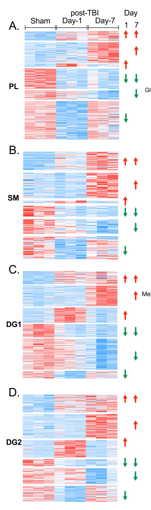

## Question

# Disease Characteristics Research Template

## Target Disease
- **Disease Name:** Traumatic Brain Injury
- **MONDO ID:** MONDO:0858950 (if available)
- **Category:** Complex

## Research Objectives

Please provide a comprehensive research report on **Traumatic Brain Injury** covering all of the
disease characteristics listed below. This report will be used to populate a disease knowledge
base entry. Be thorough and cite primary literature (PMID preferred) for all claims.

For each section, **suggested databases/resources** are listed. These are the first places
you should search for information on each topic.

---

### 1. Disease Information
> **Search first:** OMIM, Orphanet, ICD-10/ICD-11, MeSH, PubMed

- What is the disease? Provide a concise overview.
- What are the key identifiers? (OMIM, Orphanet, ICD-10/ICD-11, MeSH, Mondo)
- What are the common synonyms and alternative names?
- Is the information derived from individual patients (e.g., EHR) or aggregated disease-level resources?

### 2. Etiology

- **Disease Causal Factors**: What are the primary causes? (genetic, environmental, infectious, mechanistic)
- **Risk Factors**:
  > **Search first:** PubMed, Cochrane Library, UpToDate, clinical guidelines, ClinVar, ClinGen, GWAS Catalog, PheGenI, CTD, CDC, WHO, epidemiological databases
  - Genetic risk factors (causal variants, susceptibility loci, modifier genes)
  - Environmental risk factors (toxins, lifestyle, occupational exposures, age, sex, family history)
- **Protective Factors**:
  > **Search first:** PubMed, Cochrane Library, clinical trial databases, GWAS Catalog, gnomAD, WHO, CDC, nutrition databases
  - Genetic protective factors (protective variants, modifier alleles)
  - Environmental protective factors (diet, lifestyle, exposures that reduce risk)
- **Gene-Environment Interactions**: How do genetic and environmental factors interact to influence disease?
  > **Search first:** CTD, PubMed, PheGenI, GxE databases

### 3. Phenotypes
> **Search first:** HPO (Human Phenotype Ontology), OMIM, Orphanet, PubMed, clinicaltrials.gov, MedDRA, SNOMED CT, DECIPHER, LOINC

For each phenotype, provide:
- **Phenotype type**: symptoms, clinical signs, physical manifestations, behavioral changes, or laboratory abnormalities
  > For symptoms/signs: HPO, OMIM, Orphanet, PubMed
  > For behavioral changes: HPO, DSM, RDoC (Research Domain Criteria), PubMed
  > For laboratory abnormalities: LOINC, SNOMED CT, LabTests Online, PubMed
- **Phenotype characteristics**:
  > **Search first:** OMIM, Orphanet, HPO, PubMed
  - Age of symptom onset (neonatal, childhood, adult-onset, late-onset)
  - Symptom severity (mild, moderate, severe, variable)
  - Symptom progression (stable, progressive, episodic, fluctuating)
  - Frequency among affected individuals (percentage or qualitative)
- **Quality of life impact**: Effects on daily functioning and well-being (per-phenotype when possible)
  > **Search first:** EQ-5D database, SF-36, WHO QOL databases, PubMed
- Suggest HPO (Human Phenotype Ontology) terms for each phenotype

### 4. Genetic/Molecular Information

- **Causal Genes**: Gene mutations or chromosomal abnormalities responsible for disease (gene symbols, OMIM IDs)
  > **Search first:** OMIM, ClinVar, HGMD, Ensembl, NCBI Gene
- **Pathogenic Variants**:
  - Affected genes (gene symbols, HGNC IDs)
    > **Search first:** OMIM, NCBI Gene, Ensembl, HGNC, UniProt, GeneCards
  - Variant classification (pathogenic, likely pathogenic, VUS per ACMG/AMP guidelines)
    > **Search first:** ClinVar, ClinGen, ACMG/AMP guidelines, VarSome
  - Variant type/class (missense, frameshift, nonsense, splice-site, structural)
  - Allele frequency in population databases
    > **Search first:** gnomAD, 1000 Genomes, ExAC, TOPMed, dbSNP
  - Somatic vs germline origin
    > **Search first:** COSMIC (somatic), ClinVar, ICGC, TCGA
  - Functional consequences (loss of function, gain of function, dominant negative)
- **Modifier Genes**: Genes that modify disease severity or expression
- **Epigenetic Information**: DNA methylation, histone modifications, chromatin changes affecting disease
  > **Search first:** ENCODE, Roadmap Epigenomics, MethBase, DiseaseMeth
- **Chromosomal Abnormalities**: Large-scale genetic changes (aneuploidy, translocations, inversions)
  > **Search first:** DECIPHER, ClinVar, ECARUCA, UCSC Genome Browser

### 5. Environmental Information

- **Environmental Factors**: Non-genetic contributing factors (toxins, radiation, pollution, occupational exposure)
  > **Search first:** CTD (Comparative Toxicogenomics Database), TOXNET, PubMed, EPA databases
- **Lifestyle Factors**: Behavioral factors (smoking, diet, exercise, alcohol consumption)
  > **Search first:** CDC databases, WHO, PubMed, NHANES
- **Infectious Agents**: If applicable, pathogens causing or triggering disease (bacteria, viruses, fungi, parasites)
  > **Search first:** NCBI Taxonomy, ViPR, BV-BRC, MicrobeDB, GIDEON

### 6. Mechanism / Pathophysiology

**Present this section as an ordered causal chain first, then the detail below.**
Open with a numbered sequence of mechanistic steps running from the initiating
lesion (mutation, exposure, infection) to the clinical manifestation, one step per
line, each naming what it causes next. State the causal verb explicitly ("leads
to", "results in") and say where a step is inferred rather than demonstrated.
Where the mechanism branches, show the branch. The categories below are a
checklist of what to cover within those steps, not the organizing structure —
a step may draw on several of them, and a category may contribute to several
steps.

- **Molecular Pathways**: Specific signaling cascades or biochemical pathways involved (Wnt, MAPK, mTOR, PI3K-AKT, etc.)
  > **Search first:** KEGG, Reactome, WikiPathways, PathBank, BioCyc
- **Cellular Processes**: Cell-level mechanisms (apoptosis, autophagy, cell cycle dysregulation, inflammation, etc.)
  > **Search first:** Gene Ontology (GO), Reactome, KEGG, PubMed
- **Protein Dysfunction**: How protein structure or function is altered (misfolding, aggregation, loss of function, gain of function)
  > **Search first:** UniProt, PDB (Protein Data Bank), InterPro, Pfam, AlphaFold
- **Metabolic Changes**: Alterations in metabolic processes (energy metabolism, lipid metabolism, amino acid metabolism)
  > **Search first:** KEGG, BioCyc, HMDB (Human Metabolome Database), BRENDA
- **Immune System Involvement**: Role of immune response (autoimmunity, immunodeficiency, chronic inflammation)
  > **Search first:** ImmPort, Immunome Database, IEDB, Gene Ontology
- **Tissue Damage Mechanisms**: How tissues/ are injured (oxidative stress, ischemia, fibrosis, necrosis)
  > **Search first:** PubMed, Gene Ontology, Reactome
- **Biochemical Abnormalities**: Specific molecular defects (enzyme deficiencies, receptor dysfunction, ion channel defects)
  > **Search first:** BRENDA, UniProt, KEGG, OMIM, PubMed
- **Epigenetic Changes**: DNA methylation, histone modifications affecting gene expression in disease
  > **Search first:** ENCODE, Roadmap Epigenomics, MethBase, DiseaseMeth
- **Molecular Profiling** (if available):
  - Transcriptomics/gene expression changes
    > **Search first:** GEO (Gene Expression Omnibus), ArrayExpress, GTEx, Human Cell Atlas, SRA
  - Proteomics findings
    > **Search first:** PRIDE, ProteomeXchange, Human Protein Atlas, STRING, BioGRID
  - Metabolomics signatures
    > **Search first:** MetaboLights, Metabolomics Workbench, HMDB, METLIN
  - Lipidomics alterations
    > **Search first:** LIPID MAPS, SwissLipids, LipidHome, Metabolomics Workbench
  - Genomic structural features
    > **Search first:** UCSC Genome Browser, Ensembl, NCBI, dbVar, DGV
- **Advanced Technologies** (if applicable):
  - Single-cell analysis findings (cell-type specific mechanisms, cellular heterogeneity)
    > **Search first:** Human Cell Atlas, Single Cell Portal, GEO, CELLxGENE
  - Spatial transcriptomics findings
    > **Search first:** GEO, Spatial Research, Vizgen, 10x Genomics data
  - Multi-omics integration results
    > **Search first:** TCGA, ICGC, cBioPortal, LinkedOmics, PubMed
  - Functional genomics screens (CRISPR, RNAi)
    > **Search first:** DepMap, GenomeRNAi, PubMed, BioGRID ORCS

For each mechanism, describe:
- The causal chain from initial trigger to clinical manifestation
- Which mechanisms are upstream vs downstream
- What cell types and biological processes are involved
- Suggest GO terms for biological processes and CL terms for cell types

### 7. Anatomical Structures Affected

- **Organ Level**:
  - Primary organs directly affected
  - Secondary organ involvement (complications, secondary effects)
  - Body systems involved (cardiovascular, nervous, digestive, respiratory, endocrine, etc.)
  > **Search first:** Uberon, FMA (Foundational Model of Anatomy), OMIM, HPO, ICD-11, MeSH, SNOMED CT
- **Tissue and Cell Level**:
  - Specific tissue types affected (epithelial, connective, muscle, nervous)
  - Specific cell populations targeted (with Cell Ontology terms)
  > **Search first:** Uberon, Human Protein Atlas, Cell Ontology, Human Cell Atlas, CellMarker, PanglaoDB
- **Subcellular Level**:
  - Cellular compartments involved (mitochondria, nucleus, ER, lysosomes) (with GO Cellular Component terms)
  > **Search first:** Gene Ontology (Cellular Component), UniProt, Human Protein Atlas
- **Localization**:
  - Specific anatomical sites (with UBERON terms)
    > **Search first:** FMA, Uberon, NeuroNames (for brain), SNOMED CT
  - Lateralization (unilateral, bilateral, asymmetric)
    > **Search first:** HPO, clinical literature, imaging databases

### 8. Temporal Development

- **Onset**:
  - Typical age of onset (congenital, pediatric, adult, geriatric)
  - Onset pattern (acute, subacute, chronic, insidious)
  > **Search first:** OMIM, Orphanet, HPO, PubMed
- **Progression**:
  - Disease stages (early, intermediate, advanced, end-stage)
    > **Search first:** Cancer Staging Manual (AJCC), WHO classifications, PubMed
  - Progression rate (rapid, slow, variable)
  - Disease course pattern (episodic, relapsing-remitting, progressive, stable)
  - Disease duration (self-limited, chronic lifelong)
  > **Search first:** Disease registries, longitudinal cohort databases, natural history studies, PubMed, Orphanet, OMIM
- **Patterns**:
  - Remission patterns (spontaneous, treatment-induced)
    > **Search first:** Clinical trial databases, disease registries, PubMed
  - Critical periods (time windows of vulnerability or opportunity for intervention)
    > **Search first:** PubMed, developmental biology databases, clinical guidelines

### 9. Inheritance and Population

- **Epidemiology**:
  - Prevalence (cases per 100,000 at given time)
  - Incidence (new cases per 100,000 per year)
  > **Search first:** Orphanet, CDC, WHO, GBD (Global Burden of Disease), national registries, SEER, disease registries
- **For Genetic Etiology**:
  - Inheritance pattern (AD, AR, X-linked, mitochondrial, multifactorial, polygenic)
    > **Search first:** OMIM, Orphanet, ClinVar, GTR (Genetic Testing Registry)
  - Penetrance (complete, incomplete, age-dependent)
    > **Search first:** ClinVar, OMIM, PubMed, ClinGen
  - Expressivity (variable, consistent)
    > **Search first:** OMIM, ClinVar, PubMed
  - Genetic anticipation (increasing severity in successive generations)
    > **Search first:** OMIM, PubMed (especially for repeat expansion disorders)
  - Germline mosaicism
    > **Search first:** ClinVar, OMIM, genetic counseling literature, PubMed
  - Founder effects (population-specific mutations)
    > **Search first:** gnomAD, population genetics databases, PubMed
  - Consanguinity role
    > **Search first:** OMIM, population studies, genetic counseling resources
  - Carrier frequency
    > **Search first:** gnomAD, carrier screening databases, GeneReviews, GTR
- **Population Demographics**:
  - Affected populations (ethnic or demographic groups with higher prevalence)
    > **Search first:** gnomAD, 1000 Genomes, PAGE Study, PubMed, population registries
  - Geographic distribution (endemic areas, regional variation)
    > **Search first:** WHO, CDC, GBD, Orphanet, geographic epidemiology databases
  - Geographic distribution of specific variants
  - Sex ratio (male:female)
    > **Search first:** Disease registries, OMIM, PubMed, epidemiological databases
  - Age distribution of affected individuals
    > **Search first:** CDC, disease registries, SEER, Orphanet

### 10. Diagnostics

- **Clinical Tests**:
  - Laboratory tests (blood, urine, tissue chemistry, specific enzyme assays)
    > **Search first:** LOINC, LabTests Online, PubMed
  - Biomarkers (proteins, metabolites, genetic markers, circulating biomarkers)
    > **Search first:** FDA Biomarker List, BEST (Biomarkers, EndpointS, and other Tools), PubMed
  - Imaging studies (X-ray, CT, MRI, PET, ultrasound)
    > **Search first:** RadLex, DICOM, Radiopaedia, imaging databases
  - Functional tests (pulmonary function, cardiac stress tests)
    > **Search first:** LOINC, clinical guidelines, PubMed
  - Electrophysiology (EEG, EMG, ECG, nerve conduction studies)
    > **Search first:** LOINC, clinical neurophysiology databases, PubMed
  - Biopsy findings (histopathology, immunohistochemistry)
    > **Search first:** SNOMED CT, College of American Pathologists resources, PubMed
  - Pathology findings (microscopic examination)
    > **Search first:** SNOMED CT, Digital Pathology databases, PubMed
- **Genetic Testing**:
  > **Search first:** GTR (Genetic Testing Registry), GeneReviews, ClinGen
  - Overview of recommended genetic testing approach
  - Whole genome sequencing (WGS) utility
    > **Search first:** GTR, ClinVar, GEL (Genomics England), gnomAD
  - Whole exome sequencing (WES) utility
    > **Search first:** GTR, ClinVar, OMIM, GeneMatcher
  - Gene panels (which panels, which genes)
    > **Search first:** GTR, ClinVar, laboratory-specific databases
  - Single gene testing
    > **Search first:** GTR, ClinVar, OMIM, GeneReviews
  - Chromosomal microarray (CMA)
    > **Search first:** DECIPHER, ClinVar, dbVar, ECARUCA
  - Karyotyping
    > **Search first:** Chromosome Abnormality Database, ClinVar, cytogenetics resources
  - FISH
    > **Search first:** ClinVar, cytogenetics databases, PubMed
  - Mitochondrial DNA testing
    > **Search first:** MITOMAP, MSeqDR, ClinVar, GTR
  - Repeat expansion testing
    > **Search first:** GTR, ClinVar, repeat expansion databases, PubMed
- **Omics-Based Diagnostics** (if applicable):
  - RNA sequencing / transcriptomics
    > **Search first:** GEO, ArrayExpress, GTEx, RNA-seq databases
  - Proteomics
    > **Search first:** PRIDE, ProteomeXchange, FDA Biomarker database
  - Metabolomics
    > **Search first:** MetaboLights, Metabolomics Workbench, HMDB
  - Epigenomics
    > **Search first:** GEO, ENCODE, Roadmap Epigenomics, MethBase
  - Liquid biopsy
    > **Search first:** COSMIC, ClinVar, liquid biopsy databases, PubMed
- **Clinical Criteria**:
  - Standardized diagnostic criteria (DSM, ICD, society guidelines)
    > **Search first:** DSM-5, ICD-11, clinical society guidelines, UpToDate
  - Differential diagnosis (other conditions to rule out, with distinguishing features)
    > **Search first:** DynaMed, UpToDate, clinical decision support systems
- **Screening**:
  - Screening methods for asymptomatic individuals (newborn screening, carrier screening, cascade screening)
    > **Search first:** ACMG recommendations, CDC newborn screening, GTR

### 11. Outcome/Prognosis

- **Survival and Mortality**:
  - Survival rate (5-year, 10-year, overall)
    > **Search first:** SEER, cancer registries, disease-specific registries, PubMed
  - Life expectancy (with and without treatment if applicable)
    > **Search first:** Orphanet, disease registries, actuarial databases, PubMed
  - Mortality rate
    > **Search first:** CDC, WHO, GBD, national mortality databases
  - Disease-specific mortality (deaths directly attributable to disease)
    > **Search first:** Disease registries, CDC Wonder, GBD, PubMed
- **Morbidity and Function**:
  - Morbidity (disease-related disability and health impacts)
    > **Search first:** GBD, WHO, disability databases, PubMed
  - Disability outcomes (long-term functional impairments)
    > **Search first:** ICF (International Classification of Functioning), disability registries
  - Quality of life measures (EQ-5D, SF-36, PROMIS, disease-specific tools)
    > **Search first:** EQ-5D database, SF-36, PROMIS, PubMed
- **Disease Course**:
  - Complications (secondary problems: infections, organ failure, etc.)
    > **Search first:** ICD codes, disease registries, clinical databases, PubMed
  - Recovery potential (likelihood and extent of recovery, with vs without treatment)
    > **Search first:** Natural history studies, rehabilitation databases, PubMed
- **Prediction**:
  - Prognostic factors (age, disease severity, biomarkers, treatment response)
    > **Search first:** Prognostic models databases, clinical calculators, PubMed
  - Prognostic biomarkers (molecular markers predicting disease course)
    > **Search first:** FDA Biomarker database, PubMed, cancer prognostic databases

### 12. Treatment

- **Pharmacotherapy**:
  - Pharmacological treatments (drug names, drug classes, mechanisms of action)
    > **Search first:** DrugBank, RxNorm, ATC classification, DailyMed, FDA databases
  - Pharmacogenomics (how genetic variants affect drug metabolism, efficacy, toxicity)
    > **Search first:** PharmGKB, CPIC (Clinical Pharmacogenetics), FDA Table of PGx Biomarkers
- **Advanced Therapeutics**:
  - Gene therapy (viral vectors, CRISPR, gene replacement, gene editing)
    > **Search first:** ClinicalTrials.gov, FDA gene therapy database, ASGCT resources
  - Cell therapy (stem cell transplant, CAR-T, cellular therapeutics)
    > **Search first:** ClinicalTrials.gov, FDA cell therapy database, FACT standards
  - RNA-based therapies (ASOs, siRNA, mRNA therapies)
    > **Search first:** ClinicalTrials.gov, FDA approvals, PubMed
  - Targeted therapies (treatments directed at specific molecular targets)
    > **Search first:** My Cancer Genome, OncoKB, ClinicalTrials.gov, FDA approvals
  - Immunotherapies (checkpoint inhibitors, monoclonal antibodies)
    > **Search first:** Cancer Immunotherapy Database, FDA approvals, ClinicalTrials.gov
- **Surgical and Interventional**:
  - Surgical interventions (types of surgery, timing, outcomes)
    > **Search first:** CPT codes, surgical registries, clinical guidelines, PubMed
- **Supportive and Rehabilitative**:
  - Supportive care (symptom management, pain control, nutrition)
    > **Search first:** Clinical guidelines, Cochrane Library, PubMed
  - Rehabilitation (physical therapy, occupational therapy, speech therapy)
    > **Search first:** Rehabilitation medicine databases, clinical guidelines, PubMed
- **Experimental**:
  - Experimental treatments in clinical trials (with NCT identifiers if available)
    > **Search first:** ClinicalTrials.gov, EU Clinical Trials Register, WHO ICTRP
- **Treatment Outcomes**:
  - Treatment response rates
    > **Search first:** Clinical trial databases, FDA reviews, systematic reviews, PubMed
  - Side effects and adverse events
    > **Search first:** FDA Adverse Event Reporting System (FAERS), MedWatch, PubMed
- **Treatment Strategy**:
  - Treatment algorithms (clinical pathways, decision trees)
    > **Search first:** Clinical practice guidelines, NCCN Guidelines, UpToDate
  - Combination therapies
    > **Search first:** ClinicalTrials.gov, treatment guidelines, PubMed
  - Personalized medicine approaches (genotype-guided treatment)
    > **Search first:** My Cancer Genome, CIViC, PharmGKB, precision medicine databases

For each treatment, suggest NCIT (NCI Thesaurus) clinical-intervention terms where applicable.

### 13. Prevention

- **Prevention Levels**:
  - Primary prevention (preventing disease occurrence: vaccination, risk factor modification)
    > **Search first:** CDC, WHO, USPSTF recommendations, Cochrane Library
  - Secondary prevention (early detection and treatment: screening programs, early intervention)
    > **Search first:** USPSTF, CDC screening guidelines, WHO
  - Tertiary prevention (preventing complications in those with disease)
    > **Search first:** Clinical guidelines, disease management protocols, PubMed
- **Immunization**: Vaccine strategies (if applicable)
  > **Search first:** CDC vaccine schedules, WHO immunization, FDA vaccine database
- **Screening and Early Detection**:
  - Screening programs (population-based: newborn screening, cancer screening)
    > **Search first:** CDC screening programs, USPSTF, cancer screening databases
  - Genetic screening (carrier screening, preimplantation genetic diagnosis, prenatal testing)
    > **Search first:** ACMG recommendations, ACOG guidelines, GTR
  - Risk stratification (identifying high-risk individuals for targeted prevention)
    > **Search first:** Risk prediction models, clinical calculators, PubMed
- **Behavioral Interventions**: Lifestyle modifications to reduce risk
  > **Search first:** CDC, WHO, behavioral intervention databases, Cochrane Library
- **Counseling**: Genetic counseling (risk assessment, family planning guidance)
  > **Search first:** NSGC resources, ACMG guidelines, GeneReviews
- **Public Health**:
  - Public health interventions (sanitation, vector control, health education)
    > **Search first:** CDC, WHO, public health databases, PubMed
  - Environmental interventions (reducing environmental risk factors)
    > **Search first:** EPA databases, WHO environmental health, PubMed
- **Prophylaxis**: Preventive medications or procedures
  > **Search first:** Clinical guidelines, FDA approvals, PubMed

### 14. Other Species / Natural Disease

- **Taxonomy**: Species affected (with NCBI Taxon identifiers)
  > **Search first:** NCBI Taxonomy
- **Breed**: Specific breeds affected (with VBO identifiers if applicable)
  > **Search first:** VBO (Vertebrate Breed Ontology)
- **Gene**: Orthologous genes in other species (with NCBI Gene IDs)
  > **Search first:** NCBI Gene
- **Natural Disease**:
  - Naturally occurring disease in other species (companion animals, wildlife)
    > **Search first:** OMIA (Online Mendelian Inheritance in Animals), VetCompass, PubMed
  - Veterinary relevance and importance in animal health
    > **Search first:** OMIA, veterinary databases, PubMed
- **Comparative Biology**:
  - Comparative pathology (similarities and differences across species)
    > **Search first:** OMIA, comparative pathology databases, PubMed
  - Evolutionary conservation of disease mechanisms
    > **Search first:** HomoloGene, OrthoMCL, Alliance of Genome Resources
- **Transmission** (if applicable):
  - Zoonotic potential
    > **Search first:** CDC zoonotic diseases, WHO zoonoses, GIDEON
  - Cross-species susceptibility
    > **Search first:** NCBI Taxonomy, veterinary databases, PubMed

### 15. Model Organisms

- **Model Types**:
  - Model organism type (mammalian, invertebrate, cellular, in vitro)
    > **Search first:** Alliance of Genome Resources, model organism databases
  - Specific model systems (mouse, rat, zebrafish, Drosophila, C. elegans, yeast, cell lines, organoids, iPSCs)
    > **Search first:** MGI, RGD, ZFIN, FlyBase, WormBase, SGD, ATCC, Cellosaurus
  - Induced models (drug treatment, surgical intervention, environmental manipulation)
    > **Search first:** MGI, model organism databases, PubMed
- **Genetic Models**:
  - Types available (knockout, knock-in, transgenic, conditional, humanized)
    > **Search first:** MGI, IMPC, KOMP, EuMMCR, IMSR
- **Model Characteristics**:
  - Phenotype recapitulation (how well model reproduces human disease features)
    > **Search first:** Model organism databases, comparative studies, PubMed
  - Model limitations (aspects of human disease not captured)
    > **Search first:** Model organism databases, PubMed, review articles
- **Applications**:
  - Research applications (what aspects of disease can be studied)
    > **Search first:** Model organism databases, PubMed
- **Resources**:
  - Model databases
    > **Search first:** MGI, RGD, ZFIN, FlyBase, WormBase, IMSR, EMMA, MMRRC

---

## Citation Requirements

- Cite primary literature (PMID preferred) for all mechanistic and clinical claims
- Prioritize recent reviews and landmark papers
- Include direct quotes from abstracts where possible to support key statements
- Distinguish evidence source types: human clinical, model organism, in vitro, computational

## Output Format

Structure your response as a comprehensive narrative organized by the sections above.
For each section, provide:
- Factual content with specific details (numbers, percentages, gene names, variant nomenclature)
- Ontology term suggestions (HPO, GO, CL, UBERON, CHEBI, NCIT, MONDO) where applicable
- Evidence citations with PMIDs
- Direct quotes from abstracts to support key claims
- Clear indication when information is not available or not applicable for this disease

This report will be used to populate a disease knowledge base entry with:
- Pathophysiology descriptions with causal chains
- Gene/protein annotations (HGNC, GO terms)
- Phenotype associations (HP terms) with frequencies
- Cell type involvement (CL terms)
- Anatomical locations (UBERON terms)
- Chemical entities (CHEBI terms)
- Treatment annotations (NCIT terms)
- Evidence items with PMIDs and exact abstract quotes
- Epidemiology, prognosis, diagnostic, and prevention information
- Animal model descriptions with phenotype recapitulation details

## Output

Question: You are an expert researcher providing comprehensive, well-cited information.

Provide detailed information focusing on:
1. Key concepts and definitions with current understanding
2. Recent developments and latest research (prioritize 2023-2024 sources)
3. Current applications and real-world implementations
4. Expert opinions and analysis from authoritative sources
5. Relevant statistics and data from recent studies

Format as a comprehensive research report with proper citations. Include URLs and publication dates where available.
Always prioritize recent, authoritative sources and provide specific citations for all major claims.

# Disease Characteristics Research Template

## Target Disease
- **Disease Name:** Traumatic Brain Injury
- **MONDO ID:** MONDO:0858950 (if available)
- **Category:** Complex

## Research Objectives

Please provide a comprehensive research report on **Traumatic Brain Injury** covering all of the
disease characteristics listed below. This report will be used to populate a disease knowledge
base entry. Be thorough and cite primary literature (PMID preferred) for all claims.

For each section, **suggested databases/resources** are listed. These are the first places
you should search for information on each topic.

---

### 1. Disease Information
> **Search first:** OMIM, Orphanet, ICD-10/ICD-11, MeSH, PubMed

- What is the disease? Provide a concise overview.
- What are the key identifiers? (OMIM, Orphanet, ICD-10/ICD-11, MeSH, Mondo)
- What are the common synonyms and alternative names?
- Is the information derived from individual patients (e.g., EHR) or aggregated disease-level resources?

### 2. Etiology

- **Disease Causal Factors**: What are the primary causes? (genetic, environmental, infectious, mechanistic)
- **Risk Factors**:
  > **Search first:** PubMed, Cochrane Library, UpToDate, clinical guidelines, ClinVar, ClinGen, GWAS Catalog, PheGenI, CTD, CDC, WHO, epidemiological databases
  - Genetic risk factors (causal variants, susceptibility loci, modifier genes)
  - Environmental risk factors (toxins, lifestyle, occupational exposures, age, sex, family history)
- **Protective Factors**:
  > **Search first:** PubMed, Cochrane Library, clinical trial databases, GWAS Catalog, gnomAD, WHO, CDC, nutrition databases
  - Genetic protective factors (protective variants, modifier alleles)
  - Environmental protective factors (diet, lifestyle, exposures that reduce risk)
- **Gene-Environment Interactions**: How do genetic and environmental factors interact to influence disease?
  > **Search first:** CTD, PubMed, PheGenI, GxE databases

### 3. Phenotypes
> **Search first:** HPO (Human Phenotype Ontology), OMIM, Orphanet, PubMed, clinicaltrials.gov, MedDRA, SNOMED CT, DECIPHER, LOINC

For each phenotype, provide:
- **Phenotype type**: symptoms, clinical signs, physical manifestations, behavioral changes, or laboratory abnormalities
  > For symptoms/signs: HPO, OMIM, Orphanet, PubMed
  > For behavioral changes: HPO, DSM, RDoC (Research Domain Criteria), PubMed
  > For laboratory abnormalities: LOINC, SNOMED CT, LabTests Online, PubMed
- **Phenotype characteristics**:
  > **Search first:** OMIM, Orphanet, HPO, PubMed
  - Age of symptom onset (neonatal, childhood, adult-onset, late-onset)
  - Symptom severity (mild, moderate, severe, variable)
  - Symptom progression (stable, progressive, episodic, fluctuating)
  - Frequency among affected individuals (percentage or qualitative)
- **Quality of life impact**: Effects on daily functioning and well-being (per-phenotype when possible)
  > **Search first:** EQ-5D database, SF-36, WHO QOL databases, PubMed
- Suggest HPO (Human Phenotype Ontology) terms for each phenotype

### 4. Genetic/Molecular Information

- **Causal Genes**: Gene mutations or chromosomal abnormalities responsible for disease (gene symbols, OMIM IDs)
  > **Search first:** OMIM, ClinVar, HGMD, Ensembl, NCBI Gene
- **Pathogenic Variants**:
  - Affected genes (gene symbols, HGNC IDs)
    > **Search first:** OMIM, NCBI Gene, Ensembl, HGNC, UniProt, GeneCards
  - Variant classification (pathogenic, likely pathogenic, VUS per ACMG/AMP guidelines)
    > **Search first:** ClinVar, ClinGen, ACMG/AMP guidelines, VarSome
  - Variant type/class (missense, frameshift, nonsense, splice-site, structural)
  - Allele frequency in population databases
    > **Search first:** gnomAD, 1000 Genomes, ExAC, TOPMed, dbSNP
  - Somatic vs germline origin
    > **Search first:** COSMIC (somatic), ClinVar, ICGC, TCGA
  - Functional consequences (loss of function, gain of function, dominant negative)
- **Modifier Genes**: Genes that modify disease severity or expression
- **Epigenetic Information**: DNA methylation, histone modifications, chromatin changes affecting disease
  > **Search first:** ENCODE, Roadmap Epigenomics, MethBase, DiseaseMeth
- **Chromosomal Abnormalities**: Large-scale genetic changes (aneuploidy, translocations, inversions)
  > **Search first:** DECIPHER, ClinVar, ECARUCA, UCSC Genome Browser

### 5. Environmental Information

- **Environmental Factors**: Non-genetic contributing factors (toxins, radiation, pollution, occupational exposure)
  > **Search first:** CTD (Comparative Toxicogenomics Database), TOXNET, PubMed, EPA databases
- **Lifestyle Factors**: Behavioral factors (smoking, diet, exercise, alcohol consumption)
  > **Search first:** CDC databases, WHO, PubMed, NHANES
- **Infectious Agents**: If applicable, pathogens causing or triggering disease (bacteria, viruses, fungi, parasites)
  > **Search first:** NCBI Taxonomy, ViPR, BV-BRC, MicrobeDB, GIDEON

### 6. Mechanism / Pathophysiology

**Present this section as an ordered causal chain first, then the detail below.**
Open with a numbered sequence of mechanistic steps running from the initiating
lesion (mutation, exposure, infection) to the clinical manifestation, one step per
line, each naming what it causes next. State the causal verb explicitly ("leads
to", "results in") and say where a step is inferred rather than demonstrated.
Where the mechanism branches, show the branch. The categories below are a
checklist of what to cover within those steps, not the organizing structure —
a step may draw on several of them, and a category may contribute to several
steps.

- **Molecular Pathways**: Specific signaling cascades or biochemical pathways involved (Wnt, MAPK, mTOR, PI3K-AKT, etc.)
  > **Search first:** KEGG, Reactome, WikiPathways, PathBank, BioCyc
- **Cellular Processes**: Cell-level mechanisms (apoptosis, autophagy, cell cycle dysregulation, inflammation, etc.)
  > **Search first:** Gene Ontology (GO), Reactome, KEGG, PubMed
- **Protein Dysfunction**: How protein structure or function is altered (misfolding, aggregation, loss of function, gain of function)
  > **Search first:** UniProt, PDB (Protein Data Bank), InterPro, Pfam, AlphaFold
- **Metabolic Changes**: Alterations in metabolic processes (energy metabolism, lipid metabolism, amino acid metabolism)
  > **Search first:** KEGG, BioCyc, HMDB (Human Metabolome Database), BRENDA
- **Immune System Involvement**: Role of immune response (autoimmunity, immunodeficiency, chronic inflammation)
  > **Search first:** ImmPort, Immunome Database, IEDB, Gene Ontology
- **Tissue Damage Mechanisms**: How tissues/ are injured (oxidative stress, ischemia, fibrosis, necrosis)
  > **Search first:** PubMed, Gene Ontology, Reactome
- **Biochemical Abnormalities**: Specific molecular defects (enzyme deficiencies, receptor dysfunction, ion channel defects)
  > **Search first:** BRENDA, UniProt, KEGG, OMIM, PubMed
- **Epigenetic Changes**: DNA methylation, histone modifications affecting gene expression in disease
  > **Search first:** ENCODE, Roadmap Epigenomics, MethBase, DiseaseMeth
- **Molecular Profiling** (if available):
  - Transcriptomics/gene expression changes
    > **Search first:** GEO (Gene Expression Omnibus), ArrayExpress, GTEx, Human Cell Atlas, SRA
  - Proteomics findings
    > **Search first:** PRIDE, ProteomeXchange, Human Protein Atlas, STRING, BioGRID
  - Metabolomics signatures
    > **Search first:** MetaboLights, Metabolomics Workbench, HMDB, METLIN
  - Lipidomics alterations
    > **Search first:** LIPID MAPS, SwissLipids, LipidHome, Metabolomics Workbench
  - Genomic structural features
    > **Search first:** UCSC Genome Browser, Ensembl, NCBI, dbVar, DGV
- **Advanced Technologies** (if applicable):
  - Single-cell analysis findings (cell-type specific mechanisms, cellular heterogeneity)
    > **Search first:** Human Cell Atlas, Single Cell Portal, GEO, CELLxGENE
  - Spatial transcriptomics findings
    > **Search first:** GEO, Spatial Research, Vizgen, 10x Genomics data
  - Multi-omics integration results
    > **Search first:** TCGA, ICGC, cBioPortal, LinkedOmics, PubMed
  - Functional genomics screens (CRISPR, RNAi)
    > **Search first:** DepMap, GenomeRNAi, PubMed, BioGRID ORCS

For each mechanism, describe:
- The causal chain from initial trigger to clinical manifestation
- Which mechanisms are upstream vs downstream
- What cell types and biological processes are involved
- Suggest GO terms for biological processes and CL terms for cell types

### 7. Anatomical Structures Affected

- **Organ Level**:
  - Primary organs directly affected
  - Secondary organ involvement (complications, secondary effects)
  - Body systems involved (cardiovascular, nervous, digestive, respiratory, endocrine, etc.)
  > **Search first:** Uberon, FMA (Foundational Model of Anatomy), OMIM, HPO, ICD-11, MeSH, SNOMED CT
- **Tissue and Cell Level**:
  - Specific tissue types affected (epithelial, connective, muscle, nervous)
  - Specific cell populations targeted (with Cell Ontology terms)
  > **Search first:** Uberon, Human Protein Atlas, Cell Ontology, Human Cell Atlas, CellMarker, PanglaoDB
- **Subcellular Level**:
  - Cellular compartments involved (mitochondria, nucleus, ER, lysosomes) (with GO Cellular Component terms)
  > **Search first:** Gene Ontology (Cellular Component), UniProt, Human Protein Atlas
- **Localization**:
  - Specific anatomical sites (with UBERON terms)
    > **Search first:** FMA, Uberon, NeuroNames (for brain), SNOMED CT
  - Lateralization (unilateral, bilateral, asymmetric)
    > **Search first:** HPO, clinical literature, imaging databases

### 8. Temporal Development

- **Onset**:
  - Typical age of onset (congenital, pediatric, adult, geriatric)
  - Onset pattern (acute, subacute, chronic, insidious)
  > **Search first:** OMIM, Orphanet, HPO, PubMed
- **Progression**:
  - Disease stages (early, intermediate, advanced, end-stage)
    > **Search first:** Cancer Staging Manual (AJCC), WHO classifications, PubMed
  - Progression rate (rapid, slow, variable)
  - Disease course pattern (episodic, relapsing-remitting, progressive, stable)
  - Disease duration (self-limited, chronic lifelong)
  > **Search first:** Disease registries, longitudinal cohort databases, natural history studies, PubMed, Orphanet, OMIM
- **Patterns**:
  - Remission patterns (spontaneous, treatment-induced)
    > **Search first:** Clinical trial databases, disease registries, PubMed
  - Critical periods (time windows of vulnerability or opportunity for intervention)
    > **Search first:** PubMed, developmental biology databases, clinical guidelines

### 9. Inheritance and Population

- **Epidemiology**:
  - Prevalence (cases per 100,000 at given time)
  - Incidence (new cases per 100,000 per year)
  > **Search first:** Orphanet, CDC, WHO, GBD (Global Burden of Disease), national registries, SEER, disease registries
- **For Genetic Etiology**:
  - Inheritance pattern (AD, AR, X-linked, mitochondrial, multifactorial, polygenic)
    > **Search first:** OMIM, Orphanet, ClinVar, GTR (Genetic Testing Registry)
  - Penetrance (complete, incomplete, age-dependent)
    > **Search first:** ClinVar, OMIM, PubMed, ClinGen
  - Expressivity (variable, consistent)
    > **Search first:** OMIM, ClinVar, PubMed
  - Genetic anticipation (increasing severity in successive generations)
    > **Search first:** OMIM, PubMed (especially for repeat expansion disorders)
  - Germline mosaicism
    > **Search first:** ClinVar, OMIM, genetic counseling literature, PubMed
  - Founder effects (population-specific mutations)
    > **Search first:** gnomAD, population genetics databases, PubMed
  - Consanguinity role
    > **Search first:** OMIM, population studies, genetic counseling resources
  - Carrier frequency
    > **Search first:** gnomAD, carrier screening databases, GeneReviews, GTR
- **Population Demographics**:
  - Affected populations (ethnic or demographic groups with higher prevalence)
    > **Search first:** gnomAD, 1000 Genomes, PAGE Study, PubMed, population registries
  - Geographic distribution (endemic areas, regional variation)
    > **Search first:** WHO, CDC, GBD, Orphanet, geographic epidemiology databases
  - Geographic distribution of specific variants
  - Sex ratio (male:female)
    > **Search first:** Disease registries, OMIM, PubMed, epidemiological databases
  - Age distribution of affected individuals
    > **Search first:** CDC, disease registries, SEER, Orphanet

### 10. Diagnostics

- **Clinical Tests**:
  - Laboratory tests (blood, urine, tissue chemistry, specific enzyme assays)
    > **Search first:** LOINC, LabTests Online, PubMed
  - Biomarkers (proteins, metabolites, genetic markers, circulating biomarkers)
    > **Search first:** FDA Biomarker List, BEST (Biomarkers, EndpointS, and other Tools), PubMed
  - Imaging studies (X-ray, CT, MRI, PET, ultrasound)
    > **Search first:** RadLex, DICOM, Radiopaedia, imaging databases
  - Functional tests (pulmonary function, cardiac stress tests)
    > **Search first:** LOINC, clinical guidelines, PubMed
  - Electrophysiology (EEG, EMG, ECG, nerve conduction studies)
    > **Search first:** LOINC, clinical neurophysiology databases, PubMed
  - Biopsy findings (histopathology, immunohistochemistry)
    > **Search first:** SNOMED CT, College of American Pathologists resources, PubMed
  - Pathology findings (microscopic examination)
    > **Search first:** SNOMED CT, Digital Pathology databases, PubMed
- **Genetic Testing**:
  > **Search first:** GTR (Genetic Testing Registry), GeneReviews, ClinGen
  - Overview of recommended genetic testing approach
  - Whole genome sequencing (WGS) utility
    > **Search first:** GTR, ClinVar, GEL (Genomics England), gnomAD
  - Whole exome sequencing (WES) utility
    > **Search first:** GTR, ClinVar, OMIM, GeneMatcher
  - Gene panels (which panels, which genes)
    > **Search first:** GTR, ClinVar, laboratory-specific databases
  - Single gene testing
    > **Search first:** GTR, ClinVar, OMIM, GeneReviews
  - Chromosomal microarray (CMA)
    > **Search first:** DECIPHER, ClinVar, dbVar, ECARUCA
  - Karyotyping
    > **Search first:** Chromosome Abnormality Database, ClinVar, cytogenetics resources
  - FISH
    > **Search first:** ClinVar, cytogenetics databases, PubMed
  - Mitochondrial DNA testing
    > **Search first:** MITOMAP, MSeqDR, ClinVar, GTR
  - Repeat expansion testing
    > **Search first:** GTR, ClinVar, repeat expansion databases, PubMed
- **Omics-Based Diagnostics** (if applicable):
  - RNA sequencing / transcriptomics
    > **Search first:** GEO, ArrayExpress, GTEx, RNA-seq databases
  - Proteomics
    > **Search first:** PRIDE, ProteomeXchange, FDA Biomarker database
  - Metabolomics
    > **Search first:** MetaboLights, Metabolomics Workbench, HMDB
  - Epigenomics
    > **Search first:** GEO, ENCODE, Roadmap Epigenomics, MethBase
  - Liquid biopsy
    > **Search first:** COSMIC, ClinVar, liquid biopsy databases, PubMed
- **Clinical Criteria**:
  - Standardized diagnostic criteria (DSM, ICD, society guidelines)
    > **Search first:** DSM-5, ICD-11, clinical society guidelines, UpToDate
  - Differential diagnosis (other conditions to rule out, with distinguishing features)
    > **Search first:** DynaMed, UpToDate, clinical decision support systems
- **Screening**:
  - Screening methods for asymptomatic individuals (newborn screening, carrier screening, cascade screening)
    > **Search first:** ACMG recommendations, CDC newborn screening, GTR

### 11. Outcome/Prognosis

- **Survival and Mortality**:
  - Survival rate (5-year, 10-year, overall)
    > **Search first:** SEER, cancer registries, disease-specific registries, PubMed
  - Life expectancy (with and without treatment if applicable)
    > **Search first:** Orphanet, disease registries, actuarial databases, PubMed
  - Mortality rate
    > **Search first:** CDC, WHO, GBD, national mortality databases
  - Disease-specific mortality (deaths directly attributable to disease)
    > **Search first:** Disease registries, CDC Wonder, GBD, PubMed
- **Morbidity and Function**:
  - Morbidity (disease-related disability and health impacts)
    > **Search first:** GBD, WHO, disability databases, PubMed
  - Disability outcomes (long-term functional impairments)
    > **Search first:** ICF (International Classification of Functioning), disability registries
  - Quality of life measures (EQ-5D, SF-36, PROMIS, disease-specific tools)
    > **Search first:** EQ-5D database, SF-36, PROMIS, PubMed
- **Disease Course**:
  - Complications (secondary problems: infections, organ failure, etc.)
    > **Search first:** ICD codes, disease registries, clinical databases, PubMed
  - Recovery potential (likelihood and extent of recovery, with vs without treatment)
    > **Search first:** Natural history studies, rehabilitation databases, PubMed
- **Prediction**:
  - Prognostic factors (age, disease severity, biomarkers, treatment response)
    > **Search first:** Prognostic models databases, clinical calculators, PubMed
  - Prognostic biomarkers (molecular markers predicting disease course)
    > **Search first:** FDA Biomarker database, PubMed, cancer prognostic databases

### 12. Treatment

- **Pharmacotherapy**:
  - Pharmacological treatments (drug names, drug classes, mechanisms of action)
    > **Search first:** DrugBank, RxNorm, ATC classification, DailyMed, FDA databases
  - Pharmacogenomics (how genetic variants affect drug metabolism, efficacy, toxicity)
    > **Search first:** PharmGKB, CPIC (Clinical Pharmacogenetics), FDA Table of PGx Biomarkers
- **Advanced Therapeutics**:
  - Gene therapy (viral vectors, CRISPR, gene replacement, gene editing)
    > **Search first:** ClinicalTrials.gov, FDA gene therapy database, ASGCT resources
  - Cell therapy (stem cell transplant, CAR-T, cellular therapeutics)
    > **Search first:** ClinicalTrials.gov, FDA cell therapy database, FACT standards
  - RNA-based therapies (ASOs, siRNA, mRNA therapies)
    > **Search first:** ClinicalTrials.gov, FDA approvals, PubMed
  - Targeted therapies (treatments directed at specific molecular targets)
    > **Search first:** My Cancer Genome, OncoKB, ClinicalTrials.gov, FDA approvals
  - Immunotherapies (checkpoint inhibitors, monoclonal antibodies)
    > **Search first:** Cancer Immunotherapy Database, FDA approvals, ClinicalTrials.gov
- **Surgical and Interventional**:
  - Surgical interventions (types of surgery, timing, outcomes)
    > **Search first:** CPT codes, surgical registries, clinical guidelines, PubMed
- **Supportive and Rehabilitative**:
  - Supportive care (symptom management, pain control, nutrition)
    > **Search first:** Clinical guidelines, Cochrane Library, PubMed
  - Rehabilitation (physical therapy, occupational therapy, speech therapy)
    > **Search first:** Rehabilitation medicine databases, clinical guidelines, PubMed
- **Experimental**:
  - Experimental treatments in clinical trials (with NCT identifiers if available)
    > **Search first:** ClinicalTrials.gov, EU Clinical Trials Register, WHO ICTRP
- **Treatment Outcomes**:
  - Treatment response rates
    > **Search first:** Clinical trial databases, FDA reviews, systematic reviews, PubMed
  - Side effects and adverse events
    > **Search first:** FDA Adverse Event Reporting System (FAERS), MedWatch, PubMed
- **Treatment Strategy**:
  - Treatment algorithms (clinical pathways, decision trees)
    > **Search first:** Clinical practice guidelines, NCCN Guidelines, UpToDate
  - Combination therapies
    > **Search first:** ClinicalTrials.gov, treatment guidelines, PubMed
  - Personalized medicine approaches (genotype-guided treatment)
    > **Search first:** My Cancer Genome, CIViC, PharmGKB, precision medicine databases

For each treatment, suggest NCIT (NCI Thesaurus) clinical-intervention terms where applicable.

### 13. Prevention

- **Prevention Levels**:
  - Primary prevention (preventing disease occurrence: vaccination, risk factor modification)
    > **Search first:** CDC, WHO, USPSTF recommendations, Cochrane Library
  - Secondary prevention (early detection and treatment: screening programs, early intervention)
    > **Search first:** USPSTF, CDC screening guidelines, WHO
  - Tertiary prevention (preventing complications in those with disease)
    > **Search first:** Clinical guidelines, disease management protocols, PubMed
- **Immunization**: Vaccine strategies (if applicable)
  > **Search first:** CDC vaccine schedules, WHO immunization, FDA vaccine database
- **Screening and Early Detection**:
  - Screening programs (population-based: newborn screening, cancer screening)
    > **Search first:** CDC screening programs, USPSTF, cancer screening databases
  - Genetic screening (carrier screening, preimplantation genetic diagnosis, prenatal testing)
    > **Search first:** ACMG recommendations, ACOG guidelines, GTR
  - Risk stratification (identifying high-risk individuals for targeted prevention)
    > **Search first:** Risk prediction models, clinical calculators, PubMed
- **Behavioral Interventions**: Lifestyle modifications to reduce risk
  > **Search first:** CDC, WHO, behavioral intervention databases, Cochrane Library
- **Counseling**: Genetic counseling (risk assessment, family planning guidance)
  > **Search first:** NSGC resources, ACMG guidelines, GeneReviews
- **Public Health**:
  - Public health interventions (sanitation, vector control, health education)
    > **Search first:** CDC, WHO, public health databases, PubMed
  - Environmental interventions (reducing environmental risk factors)
    > **Search first:** EPA databases, WHO environmental health, PubMed
- **Prophylaxis**: Preventive medications or procedures
  > **Search first:** Clinical guidelines, FDA approvals, PubMed

### 14. Other Species / Natural Disease

- **Taxonomy**: Species affected (with NCBI Taxon identifiers)
  > **Search first:** NCBI Taxonomy
- **Breed**: Specific breeds affected (with VBO identifiers if applicable)
  > **Search first:** VBO (Vertebrate Breed Ontology)
- **Gene**: Orthologous genes in other species (with NCBI Gene IDs)
  > **Search first:** NCBI Gene
- **Natural Disease**:
  - Naturally occurring disease in other species (companion animals, wildlife)
    > **Search first:** OMIA (Online Mendelian Inheritance in Animals), VetCompass, PubMed
  - Veterinary relevance and importance in animal health
    > **Search first:** OMIA, veterinary databases, PubMed
- **Comparative Biology**:
  - Comparative pathology (similarities and differences across species)
    > **Search first:** OMIA, comparative pathology databases, PubMed
  - Evolutionary conservation of disease mechanisms
    > **Search first:** HomoloGene, OrthoMCL, Alliance of Genome Resources
- **Transmission** (if applicable):
  - Zoonotic potential
    > **Search first:** CDC zoonotic diseases, WHO zoonoses, GIDEON
  - Cross-species susceptibility
    > **Search first:** NCBI Taxonomy, veterinary databases, PubMed

### 15. Model Organisms

- **Model Types**:
  - Model organism type (mammalian, invertebrate, cellular, in vitro)
    > **Search first:** Alliance of Genome Resources, model organism databases
  - Specific model systems (mouse, rat, zebrafish, Drosophila, C. elegans, yeast, cell lines, organoids, iPSCs)
    > **Search first:** MGI, RGD, ZFIN, FlyBase, WormBase, SGD, ATCC, Cellosaurus
  - Induced models (drug treatment, surgical intervention, environmental manipulation)
    > **Search first:** MGI, model organism databases, PubMed
- **Genetic Models**:
  - Types available (knockout, knock-in, transgenic, conditional, humanized)
    > **Search first:** MGI, IMPC, KOMP, EuMMCR, IMSR
- **Model Characteristics**:
  - Phenotype recapitulation (how well model reproduces human disease features)
    > **Search first:** Model organism databases, comparative studies, PubMed
  - Model limitations (aspects of human disease not captured)
    > **Search first:** Model organism databases, PubMed, review articles
- **Applications**:
  - Research applications (what aspects of disease can be studied)
    > **Search first:** Model organism databases, PubMed
- **Resources**:
  - Model databases
    > **Search first:** MGI, RGD, ZFIN, FlyBase, WormBase, IMSR, EMMA, MMRRC

---

## Citation Requirements

- Cite primary literature (PMID preferred) for all mechanistic and clinical claims
- Prioritize recent reviews and landmark papers
- Include direct quotes from abstracts where possible to support key statements
- Distinguish evidence source types: human clinical, model organism, in vitro, computational

## Output Format

Structure your response as a comprehensive narrative organized by the sections above.
For each section, provide:
- Factual content with specific details (numbers, percentages, gene names, variant nomenclature)
- Ontology term suggestions (HPO, GO, CL, UBERON, CHEBI, NCIT, MONDO) where applicable
- Evidence citations with PMIDs
- Direct quotes from abstracts to support key claims
- Clear indication when information is not available or not applicable for this disease

This report will be used to populate a disease knowledge base entry with:
- Pathophysiology descriptions with causal chains
- Gene/protein annotations (HGNC, GO terms)
- Phenotype associations (HP terms) with frequencies
- Cell type involvement (CL terms)
- Anatomical locations (UBERON terms)
- Chemical entities (CHEBI terms)
- Treatment annotations (NCIT terms)
- Evidence items with PMIDs and exact abstract quotes
- Epidemiology, prognosis, diagnostic, and prevention information
- Animal model descriptions with phenotype recapitulation details

# Traumatic brain injury: disease-characteristics report

**Scope and evidence convention.** Traumatic brain injury (TBI) is an **acquired injury caused by external mechanical force**, not a Mendelian disease. This report distinguishes population estimates, human clinical studies, expert guidance, animal experiments, cell experiments, and trial registrations. It emphasizes research published in 2023–2024 while retaining older randomized trials when they remain decisive. DOI links and publication dates are supplied where established. **PMIDs and exact ontology accession numbers not verified in the retrieved sources are deliberately not invented**; proposed ontology labels require database reconciliation before ingestion. (jha2024asinglecellatlas pages 1-3, valente2023clinicalpolicycritical pages 1-2)

A compact set of evidence-graded knowledge-base annotations precedes the detailed report. (huang2024causesandglobal pages 1-2, machamer2022symptomfrequencyand pages 1-3, jha2024asinglecellatlas pages 1-3, legramante2024evaluationofgfapuchl1 pages 1-2, giacino2012placebocontrolledtrialof pages 1-2, hutchinson2016trialofdecompressive pages 1-2)

| Domain | Validated data or candidate annotation | Evidence tier | Caveat |
|---|---|---|---|
| Disease model / genetics | TBI is externally acquired, not Mendelian. **No monogenic etiology, causal pathogenic variant, inheritance pattern, carrier frequency, or clinically indicated TBI genetic test is established.** Lipsky et al., 2024; DOI: [10.3389/fnins.2024.1446076](https://doi.org/10.3389/fnins.2024.1446076). (lipsky2024traumaticbraininjury pages 2-3, lipsky2024traumaticbraininjury pages 3-4) | **Established disease-level conclusion** | Do not populate causal-gene or pathogenic-variant fields. *APOE*, *BDNF*, *COMT*, and *GRIN2A* are possible modifiers or exploratory candidates, not diagnostic genes. |
| Epidemiology | GBD 2019 estimated **27.16 million incident cases**, age-standardized incidence of **346 per 100,000**, prevalence of **599 per 100,000**, and 7.08 million YLDs in 2019. Huang et al., published 18 March 2024; DOI: [10.1016/j.cjtee.2024.03.007](https://doi.org/10.1016/j.cjtee.2024.03.007). (huang2024causesandglobal pages 1-2) | **Modeled global population evidence** | GBD estimates are modeled rather than directly enumerated and depend on source coverage, case definitions, and statistical assumptions. |
| Persistent phenotype | In TRACK-TBI, **53%** of participants with TBI reported at least three symptoms at 12 months versus **24%** of orthopedic-trauma controls; the prospective analysis included 2,039 participants with TBI. Machamer et al., 2022; DOI: [10.1089/neu.2021.0348](https://doi.org/10.1089/neu.2021.0348). (machamer2022symptomfrequencyand pages 1-3) | **Prospective multicenter human cohort** | Participants were treated at level-1 trauma centers and had CT ordered. Symptom endorsement is not TBI-specific and may not generalize to community mTBI. |
| Single-cell transcriptomics | A murine atlas profiled **334,376 cells** and identified **23 transcriptionally distinct populations** across repetitive closed-head injury, controlled cortical impact, and controlled cortical impact with hemorrhagic shock. Jha et al., 2024; DOI: [10.1016/j.neuron.2024.06.021](https://doi.org/10.1016/j.neuron.2024.06.021). (jha2024asinglecellatlas pages 1-3, jha2024asinglecellatlas pages 3-5) | **High-quality preclinical discovery evidence** | Mouse models do not reproduce the full heterogeneity of human TBI. Cell states and candidate targets require spatial, functional, and human validation. |
| Blood biomarkers | Among **130 adults** with nonpenetrating mTBI and GCS 13–15 tested within 12 hours, CT identified injury in only **7 patients (5%)**. Combined GFAP/UCH-L1 had sensitivity 1.00 and NPV 1.00; 96 tests were positive and 34 negative. Legramante et al., 2024; DOI: [10.1186/s12245-024-00708-z](https://doi.org/10.1186/s12245-024-00708-z). (legramante2024evaluationofgfapuchl1 pages 1-2) | **Single-center retrospective diagnostic study** | Seven CT-positive cases yielded wide sensitivity uncertainty (95% CI 0.64–1.00). The test supports CT triage but does not independently diagnose or exclude every form of TBI. |
| Surgery | RESCUEicp randomized 408 patients with refractory ICP above 25 mm Hg. Six-month mortality was **26.9% with decompressive craniectomy versus 48.9% with medical care**, but surgery increased survival with vegetative state or severe disability; adverse events were 16.3% versus 9.2%. Hutchinson et al., 2016; DOI: [10.1056/NEJMoa1605215](https://doi.org/10.1056/NEJMoa1605215). (hutchinson2016trialofdecompressive pages 1-2) | **Multicenter randomized controlled trial** | This was rescue treatment for selected refractory intracranial hypertension, not routine care. Survival benefit must be weighed against disability, complications, and patient goals. |
| Pharmacotherapy / disorders of consciousness | In **184 patients** in a vegetative or minimally conscious state 4–16 weeks after TBI, amantadine accelerated recovery during four weeks of treatment: Disability Rating Scale slope difference **0.24 points per week** versus placebo (*P*=0.007). Giacino et al., 2012; DOI: [10.1056/NEJMoa1102609](https://doi.org/10.1056/NEJMoa1102609). (giacino2012placebocontrolledtrialof pages 1-2) | **Multicenter double-blind randomized controlled trial** | Benefit concerned recovery rate during active treatment; overall improvement was similar by week 6 after washout. Results apply to prolonged traumatic disorders of consciousness, not uncomplicated mTBI. |
| Genetic susceptibility | A veteran GWAS included 111,494 TBI cases and 192,991 controls and reported 15 genome-wide significant loci and 14 gene-level signals, including *NCAM1*, *APOE*, *FTO*, and *FOXP2*. Merritt et al., summarized by Lipsky et al., 2024; DOI: [10.3389/fnins.2024.1446076](https://doi.org/10.3389/fnins.2024.1446076). (lipsky2024traumaticbraininjury pages 2-3) | **Large human association study; candidate annotation** | Signals may reflect exposure propensity or risk-taking rather than biological susceptibility to tissue injury. Significant SNP findings were confined to European-ancestry participants and require diverse replication. |

*Table: Concise knowledge-base annotations spanning epidemiology, phenotypes, biomarkers, omics, genetics, surgery, and pharmacotherapy. Evidence tiers and caveats distinguish validated clinical findings from modeled estimates and candidate associations.*

## 1. Disease information

TBI comprises an alteration of brain function or evidence of brain pathology after an external force transmitted to the head or body, including impact, acceleration–deceleration, blast, or penetration. It encompasses concussion/mild TBI, focal contusion or hemorrhage, and diffuse axonal injury. A useful **initial severity description**, not a complete prognostic classification, is Glasgow Coma Scale (GCS) 13–15 for mild, 9–12 for moderate, and 3–8 for severe TBI. The 2025 NIH–NINDS expert initiative proposes supplementing GCS with **Clinical, Biomarker, Imaging, and Modifier** information; this framework still requires validation and implementation research. (yan2024clinicalmanagementin pages 1-2, manley2025anewcharacterisation pages 1-4)

**Identifiers and synonyms.** Preserve the supplied identifier **MONDO:0858950 as unverified**, pending a live MONDO lookup. Relevant coding families are ICD-10 **S06.-, intracranial injury** and ICD-10-CM injury-specific descendants; selecting an individual code requires documenting hemorrhage type, consciousness status and encounter. Suggested MeSH label: *Brain Injuries, Traumatic*; independently verify its accession, ICD-11 mapping, and any OMIM or Orphanet cross-reference before database entry. Common names include *TBI*, *traumatic intracranial injury*, *head injury* when brain involvement is established, and *concussion* for a subset of mild injuries. Head trauma alone does **not** establish brain injury. No disease-specific OMIM inheritance entry should be assumed. This report synthesizes **aggregated studies and guidance**, not an individual patient’s electronic health record; one cited comorbidity study derives aggregated estimates from de-identified clinical administrative data. (valente2023clinicalpolicycritical pages 2-4, halabi2024traumaticbraininjury pages 1-2)

## 2. Etiology, risk and protection

**Cause versus modifier.** The necessary initiating cause is **mechanical energy**: falls, road crashes, interpersonal violence, sport, occupational incidents, blasts or penetrating injuries. Falls and road injuries dominate many global settings; the 2024 GBD analysis found higher age-standardized incidence in males, with mechanisms varying across age and geography. An open skull injury can additionally introduce infectious complications, but pathogens do not ordinarily *cause* TBI. (huang2024causesandglobal pages 1-2, yan2024clinicalmanagementin pages 1-2)

**Exposure-related risks** include hazardous roads and collision exposure, contact sports, and falls in older adults; anticoagulant treatment principally modifies concern about post-traumatic hemorrhage and clinical assessment rather than constituting a genetic cause. Rural location, socioeconomic disadvantage, prior health, access to trauma care, and other psychosocial factors may modify exposure, care and outcome. In a 2024 Ethiopian trauma-center cohort, road traffic injury and assault were associated with higher odds of head injury than reference mechanisms, but this selected hospital sample cannot supply population-wide risk ratios. The 2023 ACEP policy identifies disproportionate TBI burdens in people experiencing homelessness, incarceration, intimate-partner violence, and rural barriers to care. (huang2024causesandglobal pages 1-2, valente2023clinicalpolicycritical pages 1-2, lipsky2024traumaticbraininjury pages 2-3)

**Genetics and gene–environment interaction.** There are **no established causal TBI genes or genetically protective alleles against experiencing a mechanical injury**. A large veteran GWAS, summarized in a 2024 review, analyzed 111,494 TBI cases and 192,991 controls and reported 15 genome-wide-significant loci; gene-based signals included *NCAM1, APOE, FTO,* and *FOXP2*. Associations with risk-taking make **exposure propensity** a plausible contributor; significant findings were predominantly from European-ancestry analyses and do not establish a neuronal injury mechanism. *APOE* ε4, *BDNF* rs6265/Val66Met and *COMT* have been investigated as **post-injury outcome modifiers**, but replication and effect directions vary. A reported *GRIN2A* rs11074504–post-traumatic-epilepsy association did not survive multiple-testing correction and must **not** become a pathogenic-variant annotation. A 2025 pediatric gene-by-injury analysis identified mitochondrial/synaptic hypotheses, but it is a **preprint** with limited clinical predictive utility. (lipsky2024traumaticbraininjury pages 2-3, lipsky2024traumaticbraininjury pages 3-4, cheng2025interactionsbetweenmild pages 17-20)

**Protection.** Seat belts, traffic safety, appropriately fitted helmets, reduced collision exposure, fall-risk assessment, and sport-specific rule changes aim to reduce the likelihood or severity of the *injury event*, not provide biological immunity. The 2023 international concussion consensus supports collision-reducing rules, rugby neuromuscular warm-ups, mouthguards in ice hockey, and removal/clearance protocols to limit repeat injury; effectiveness should not be generalized to every sport or setting. No specific diet, supplement, vaccine, or protective genotype is established as preventing TBI. (patricios2023consensusstatementon pages 1-2, patricios2023consensusstatementon pages 5-6, valente2023clinicalpolicycritical pages 11-13)

## 3. Phenotypes and quality of life

Phenotypes can begin **immediately or after a delay**, occur at any age, and range from short-lived to chronic. Frequencies below describe the **specified cohort and time point**, not universal rates; an unquantified entry should remain *frequency unknown* in the knowledge base. (machamer2022symptomfrequencyand pages 1-3, valente2023clinicalpolicycritical pages 2-4)

| Phenotype and type | Typical course, function and suggested HPO **label** | Supported frequency |
|---|---|---|
| Headache, dizziness/imbalance, fatigue, light or sound sensitivity; **symptoms** | Acute to persistent; disrupt school, work, mobility and sleep. Suggested HPO labels: *Headache*, *Dizziness*, *Fatigue*, *Photophobia*, *Abnormality of vestibular function*. | Individual percentages **not established** by the retrieved abstracts. (machamer2022symptomfrequencyand pages 1-3, lipsky2024traumaticbraininjury pages 1-2) |
| Confusion, disorientation, amnesia, loss of consciousness; **signs/symptoms** | Acute diagnostic indicators, severity variable. Suggested HPO labels: *Confusion*, *Amnesia*, *Loss of consciousness*. | Not quantified across all TBIs. (valente2023clinicalpolicycritical pages 2-4) |
| Memory/attention deficits and impaired executive function; **cognitive manifestations** | May improve, persist or change years later; affect independence and employment. Suggested labels: *Memory impairment*, *Attention deficit*, *Executive dysfunction*. | No defensible pooled phenotype-specific percentage identified. (brett2023longtermmultidomainpatterns pages 1-2, valente2023clinicalpolicycritical pages 2-4) |
| Irritability, depression, anxiety, sleep disturbance; **behavioral/psychiatric symptoms** | Variable, sometimes persistent; impair relationships and well-being. Suggested labels: *Irritability*, *Depression*, *Anxiety*, *Sleep disturbance*. | Cohort-dependent; not all symptoms are injury-specific. (machamer2022symptomfrequencyand pages 1-3, halabi2024traumaticbraininjury pages 1-2) |
| Focal weakness, speech impairment, seizures or impaired consciousness; **neurologic signs** | Especially important with focal lesions and severe TBI; seizures may recur later. Suggested labels: *Hemiparesis*, *Aphasia*, *Seizure*, *Coma*. | Frequencies depend strongly on injury subtype; do not propagate a single value. (yan2024clinicalmanagementin pages 1-2, giacino2012placebocontrolledtrialof pages 1-2) |
| CT hemorrhage/contusion, blood **GFAP/UCH-L1** elevation; **imaging/laboratory findings**, not symptoms | Indicate structural injury or support selected CT-triage pathways; neither alone defines every TBI. | In one selected 2024 mild-TBI study, **7/130 (5%)** had CT-visible injury; not a general population frequency. (legramante2024evaluationofgfapuchl1 pages 1-2) |

In **TRACK-TBI**, 2,039 TBI participants, 257 orthopedic-trauma controls and 300 friend controls were assessed repeatedly: more than half the TBI sample reported at least **three symptoms worse than before injury at 12 months**; the paper describes **53% versus 24%** for TBI versus orthopedic-trauma controls. This is a Level-I-trauma-center, CT-ordered cohort, and symptoms also occurred in controls. Authors’ abstract: “More than 50% of the TBI sample ... continued to endorse three or more symptoms as worse than pre-injury through 12 months post-injury.” Patient-reported outcomes should include Rivermead symptoms, GOSE, **EQ-5D**, SF-36 and participation measures rather than equating a normal CT with normal quality of life. Study: Machamer *et al.*, March **2022**, https://doi.org/10.1089/neu.2021.0348. (machamer2022symptomfrequencyand pages 1-3, brett2023longtermmultidomainpatterns pages 1-2)

## 4. Genetic and molecular information

**Causal genes/variants/chromosomes:** *not applicable* to the initiating injury. Consequently, do not assign ACMG/AMP pathogenicity, germline-versus-somatic causal status, gnomAD carrier frequency, penetrance, copy-number disease lesion, WGS/WES diagnostic yield, or a TBI-specific HGNC causal-gene relationship. Gene annotations should instead be explicitly typed **exposure association**, **response modifier**, **pathway component**, or **measured biomarker**. Candidate modifiers include *APOE* (lipid transport/repair), *BDNF* (activity-dependent trophic signaling; rs6265), and exploratory *GRIN2A/GAD2* epilepsy associations; the latter findings are insufficient for clinical prediction. No established genotype-guided TBI pharmacotherapy or protective variant was identified. (lipsky2024traumaticbraininjury pages 2-3, lipsky2024traumaticbraininjury pages 3-4)

**Protein and epigenetic signals:** astrocytic **GFAP** and neuron-enriched **UCHL1** are injury-associated blood proteins, not mutated causal proteins; axonal **APP** accumulation can signal interrupted transport, while tau and neurofilament changes are candidate indicators of axonal injury. DNA methylation, histone/RNA modification and microRNAs are research topics, **not clinically validated TBI epigenetic tests**. A reported human study examined methylation at *APP, MAPT* and neurofilament genes, but its full primary data were not retrievable here; no locus, effect size or causal conclusion is asserted. (legramante2024evaluationofgfapuchl1 pages 1-2, lipsky2024traumaticbraininjury pages 3-4)

## 5. Environmental information

Environmental entries should describe **exposure to mechanical hazards**—traffic, occupational falls, unsafe sporting collisions, blast and interpersonal violence—rather than incorrectly assigning an infectious or toxic etiology. Alcohol intoxication can both contribute to hazardous exposure and confound acute assessment; anticoagulants may alter hemorrhage-management decisions. Infection is chiefly a **secondary complication** of open injuries or intensive care, not the initiating cause. No zoonotic transmission or vaccination mechanism applies. (yan2024clinicalmanagementin pages 1-2, valente2023clinicalpolicycritical pages 1-2, valente2023clinicalpolicycritical pages 11-13)

## 6. Mechanism and pathophysiology

**Ordered causal chain**—“demonstrated” refers to the indicated clinical/imaging or experimental observation; connecting distinct experiments into an individual patient’s full trajectory remains an **inference**.

1. **Impact, penetration, acceleration–deceleration or blast leads to** focal deformation, vascular tearing and/or axonal stretch; these cause contusion, intracranial bleeding or diffuse axonal dysfunction. **Demonstrated** pathoanatomically and clinically. (yan2024clinicalmanagementin pages 1-2, valente2023clinicalpolicycritical pages 2-4)
2. **Axonal and membrane deformation leads to** impaired axonal transport, altered ion flux, glutamate signaling and calcium loading; these **result in** increased energy demand and synaptic disruption. The exact sequence in an individual human is **partly inferred** from experimental injury biology. (yan2024clinicalmanagementin pages 1-2, jha2024asinglecellatlas pages 3-5)
3. **Energy–perfusion mismatch and calcium stress lead to** mitochondrial impairment, oxidative damage and cell death; **in parallel**, torn vessels and endothelial injury **lead to** barrier leakage, hemorrhage and cerebral edema. These interacting branches amplify secondary injury; links to specific bedside symptoms remain **partly inferred**. (yan2024clinicalmanagementin pages 1-2, lotze2024poloxamer188exerts pages 1-5)
4. **Edema and hematoma lead to** raised intracranial pressure (ICP), which **reduces** cerebral perfusion and **results in** ischemia or herniation when severe. This link is supported by human physiology and rescue-surgery trials. (hutchinson2016trialofdecompressive pages 1-2, brenner2020understandingtheneuroprotective pages 1-2)
5. **Tissue injury and barrier dysfunction lead to** activation of resident microglia and astrocytes plus recruitment of circulating immune cells; their inflammatory signals **can result in** additional damage **or** debris clearance and repair. Mouse single-cell data demonstrate cell-state heterogeneity, **not** one uniformly harmful immune pathway in all patients. (jha2024asinglecellatlas pages 1-3, jha2024asinglecellatlas pages 3-5)
6. **Axonal, cortical and network damage plus variable repair lead to** altered consciousness, seizures, focal deficits, cognitive and behavioral symptoms; persistent immune/metabolic changes **may contribute to** chronic deficits or later neurodegeneration. The last step is an **inference at the individual level**: observational associations cannot prove that a given late disorder was caused by a particular earlier TBI. (brett2023longtermmultidomainpatterns pages 1-2, halabi2024traumaticbraininjury pages 1-2, jha2024asinglecellatlas pages 1-3)

**Upstream versus downstream; cells and pathways.** Mechanical disruption is upstream. Glutamatergic excitotoxicity, calcium homeostasis, mitochondrial respiration, reactive oxygen species, neurovascular permeability and cell death bridge the acute insult to downstream edema, ischemia and network failure. Candidate inflammatory circuits include **IL1B/TLR** and chemokine signaling; **RHO-GTPase, MAPK, CREB** and lipid/cholesterol pathways were among *inferred pathway enrichments* in mouse hippocampal proteomics, not clinically established drivers or approved targets. The 2024 *Neuron* atlas measured **334,376 mouse cells**, resolving **23 populations** across repetitive closed-head injury, controlled cortical impact (CCI), and CCI plus hemorrhagic shock. Its abstract describes “persistent gene-expression changes in microglia-4 even 6-months after contusional-TBI”; it also identifies an ependymal inflammatory-signaling population. Single-cell expression does not by itself establish intervention efficacy. Jha *et al.*, September **2024**, https://doi.org/10.1016/j.neuron.2024.06.021. (jha2024asinglecellatlas pages 1-3, jha2024asinglecellatlas pages 3-5)

**Spatial profiling and data visualization.** In **nine mice**, hippocampal laser-microdissection proteomics compared sham, one-day and seven-day injury across CA1/pyramidal layer, stratum moleculare and two dentate-gyrus regions. It found region-specific inflammatory proteins, glucose/lipid-metabolic disturbances and cholesterol-synthesis enrichment. These are **mouse molecular signatures, not human diagnostic thresholds**. Figure 2’s cropped panels show distinct one- versus seven-day protein changes by hippocampal subregion; the panel supports **spatial heterogeneity**, not a claim that any depicted protein causes dementia. Maity *et al.*, May **2024**, https://doi.org/10.1186/s12014-024-09485-6. (maity2024mappingdynamicmolecular pages 1-2, maity2024mappingdynamicmolecular pages 5-8, maity2024mappingdynamicmolecular media 666596e2)

**Suggested ontology mappings, labels only pending accession checks:** GO biological processes *response to mechanical stimulus*, *glutamate receptor signaling pathway*, *calcium ion homeostasis*, *mitochondrial ATP synthesis*, *reactive oxygen species metabolic process*, *inflammatory response*, *apoptotic process*, *axon regeneration*; GO cellular components *axon*, *synapse*, *mitochondrion*, *plasma membrane*, *nucleus*, *endoplasmic reticulum*, *lysosome*. Suggested Cell Ontology labels are *neuron*, *astrocyte*, *microglial cell*, *oligodendrocyte*, *brain microvascular endothelial cell*, *ependymal cell*, *neutrophil* and *macrophage*. These are candidate annotations, **not validated accession-level assertions**. (yan2024clinicalmanagementin pages 1-2, jha2024asinglecellatlas pages 3-5, maity2024mappingdynamicmolecular pages 5-8)

## 7. Anatomical structures

The **brain** is directly affected: cerebral cortex and subcortical white-matter axons; frontal/temporal regions where impacted; hippocampal circuits relevant to memory; brainstem when struck or compressed; meninges, cerebral vessels and ventricles when hemorrhage, hydrocephalus or raised ICP occur. Injuries may be unilateral, bilateral, focal or diffuse; lateralization **must come from the actual imaging report** rather than the diagnosis TBI. At tissue scale, neurons, oligodendrocytes/myelin, astrocytes, microglia, vascular endothelium and infiltrating leukocytes may be involved. Secondary systemic effects may involve respiratory, cardiovascular and endocrine systems; associations with incident disorders do not establish identical organ damage in every patient. Suggested **UBERON labels**: *brain*, *cerebral cortex*, *corpus callosum*, *hippocampus*, *brainstem*, *cerebral blood vessel*, *meninx*. Suggested GO compartments are listed in §6; accession numbers need verification. (yan2024clinicalmanagementin pages 1-2, halabi2024traumaticbraininjury pages 1-2, maity2024mappingdynamicmolecular pages 5-8, jha2024asinglecellatlas pages 3-5)

## 8. Temporal development

**Onset is acute** at any age, including childhood and late life. Initial bleeding and cerebral swelling can worsen over hours; secondary metabolic and inflammatory processes evolve over hours to days. Improvement is common during the first months, but symptom and function trajectories are heterogeneous rather than obligatorily progressive. TRACK-TBI symptom scores declined faster between two weeks and three months—approximately **1.7 points/month**—than afterward, approximately **0.2 points/month**, in its selected cohort. In TRACK-TBI LONG, outcomes 2–7 years after injury were most often stable, yet **29%** of mild and **23%** of moderate/severe participants experienced functional decline under the study’s GOSE-based definition; worsening was not universal and occurred in orthopedic controls too. The clinical time windows requiring prompt attention include initial resuscitation/hemorrhage control, evolving intracranial hypertension, and planned rehabilitation/follow-up. There is **no cancer-like stage or predictable end-stage sequence** for all TBI. (machamer2022symptomfrequencyand pages 1-3, brett2023longtermmultidomainpatterns pages 1-2, brenner2020understandingtheneuroprotective pages 1-2)

## 9. Inheritance and population epidemiology

The **2024 publication of GBD-2019 estimates** reported **27.16 million incident TBIs worldwide in 2019** (95% uncertainty interval [UI] 23.36–31.42 million), age-standardized incidence **346/100,000/year** (95% UI 298–401), age-standardized prevalence **599/100,000** (95% UI 573–627), and **7.08 million years lived with disability**. A later **2025 publication analyzing GBD-2021** estimated **20.84 million incident TBIs in 2021**, with incidence **259/100,000** (95% UI 226–296). **Do not interpret the difference between these modeled publications as a measured two-year fall** without reconciling their methods, definitions and revisions. Males generally have higher incidence; falls are prominent across age groups, with risk also concentrated in younger crash-exposed and older fall-exposed populations. Regional estimates and apparent sex ratios depend on case ascertainment, injury mechanism and health-care access. Huang *et al.*, online March **2024**, https://doi.org/10.1016/j.cjtee.2024.03.007; Yan *et al.*, April **2025**, https://doi.org/10.3389/fpubh.2025.1556147. (huang2024causesandglobal pages 1-2, yan2025globalregionaland pages 1-2)

**Inheritance, penetrance, expressivity, anticipation, germline mosaicism, founder effects, consanguinity, and carrier frequencies: not applicable to TBI as an acquired mechanical injury.** A susceptibility GWAS must not be reclassified as a Mendelian cause; no validated geographic distribution of a *TBI-causing* variant exists. (jha2024asinglecellatlas pages 1-3, lipsky2024traumaticbraininjury pages 2-3)

## 10. Diagnostics and differential diagnosis

**Clinical assessment.** Establish a plausible injury event and a contemporaneous change in consciousness, orientation, memory, neurological function or imaging; document GCS **components**, pupils, serial neurological examinations, post-traumatic amnesia and competing explanations such as intoxication or medication effects. The 2023 ACEP policy describes mild-TBI indicators including confusion/disorientation, loss of consciousness **≤30 minutes** or amnesia **<24 hours**, with GCS **13–15** after 30 minutes or later presentation; newer ACRM criteria are also referenced by the 2024 TBI literature. A normal CT does **not** exclude uncomplicated concussion. Exclude primary stroke, spontaneous intracranial hemorrhage, seizure/postictal state, intoxication, hypoglycemia and other non-traumatic causes according to presentation. (valente2023clinicalpolicycritical pages 2-4, lipsky2024traumaticbraininjury pages 2-3)

**Imaging and function.** Noncontrast head **CT** is first-line to detect clinically important acute hemorrhage, fracture or mass effect when indicated; the 2023 ACEP policy favors the **Canadian CT Head Rule** for eligible adults to help avoid unnecessary CT, while cautioning against extrapolating decision-rule exclusions to anticoagulated or otherwise ineligible patients. **MRI** can characterize selected persistent or diffuse lesions; neither MRI nor PET is a universal diagnostic requirement. For sport concussion, the 2023 Amsterdam statement places **SCAT6/Child SCAT6** primarily in the first **72 hours**, and **SCOAT6/Child SCOAT6** in subacute office assessment. Neurocognitive tests, vestibular/ocular examination, balance assessment and symptom inventories complement rather than replace clinical judgment. EEG is used when seizures or otherwise unexplained impaired consciousness warrant it; biopsy is **not routine**. (valente2023clinicalpolicycritical pages 1-2, patricios2023consensusstatementon pages 5-6, patricios2023consensusstatementon pages 6-7, yan2024clinicalmanagementin pages 1-2)

**Blood and bedside biomarkers.** Serum/plasma **GFAP** and **UCH-L1** can help predict CT-visible injury in **specified adult mild-TBI pathways**, rather than prove or exclude all TBI. In a small 2024 retrospective study of **130 adults sampled within 12 hours**, only **seven CTs were positive**; combined-marker sensitivity was **1.00**, with wide **95% CI 0.64–1.00**, illustrating why apparent perfect performance must not be generalized. In a separate 2024 polytrauma/shock analysis, an arrival GFAP cut point **>286 pg/mL** gave AUC **0.77** for CT-diagnosed injury; **3094 pg/mL** was an analysis-derived threshold for more severe CT features/progression, **not a universal approved cutoff**. Legramante *et al.*, October **2024**, https://doi.org/10.1186/s12245-024-00708-z; Sperry *et al.*, online May **2024**, https://doi.org/10.3171/2024.1.JNS232569. (legramante2024evaluationofgfapuchl1 pages 1-2, sperry2024earlygfapand pages 1-2)

**Other tests and screening.** Severe injury may require serial CT, invasive ICP monitoring and selected cerebral oxygen or metabolic monitoring; routine electrolytes, blood counts, coagulation studies and glucose evaluate complications and alternative explanations, not a disease-specific metabolic defect. **WGS, WES, genetic panels, CMA, karyotyping, FISH, mitochondrial sequencing, repeat-expansion testing, and omics-based diagnostic tests are not standard TBI diagnostics.** Genetic work-up is appropriate only for an independently suspected inherited differential diagnosis. There is no asymptomatic newborn/carrier/cascade genetic screening program for TBI; screening instead concerns **injury exposure and fall risk**. (yan2024clinicalmanagementin pages 1-2, valente2023clinicalpolicycritical pages 11-13, lipsky2024traumaticbraininjury pages 2-3)

## 11. Outcome and prognosis

TBI outcomes range from complete functional recovery to persistent disability or death. Prognostic descriptors include age, baseline health, initial GCS **and pupils**, CT abnormalities, hypoxia/hypotension, secondary insults and post-injury function. In the 2023 TRACK-TBI LONG sample of **1,264** including orthopedic controls, functional decline over later follow-up occurred in **29%** of mild and **23%** of moderate/severe cases; risk of decline after mild TBI rose with age and nonemployment before injury. This observational finding is not a fixed lifetime probability. Brett *et al.*, August **2023**, https://doi.org/10.1212/WNL.0000000000207501. (brett2023longtermmultidomainpatterns pages 1-2)

A 2024 US health-system cohort compared **10,200 people with TBI** against **10,200 matched unexposed individuals**: later recorded comorbidity hazards ranged from **HR 1.30** for hypothyroidism to **4.06** for dementia after mild TBI; middle-aged participants had elevated recorded suicidality risk. These are **adjusted associations**, susceptible to residual confounding and surveillance differences, not proof that every late condition was caused by TBI. Halabi *et al.*, December **2024**, https://doi.org/10.1001/jamanetworkopen.2024.50499. A **2024 systematic review** found reduced life expectancy after severe TBI, but heterogeneous cohorts preclude assigning one universal five-/ten-year survival rate or lifespan loss to the entire TBI population. https://doi.org/10.23736/S1973-9087.24.08461-2. (halabi2024traumaticbraininjury pages 1-2, brett2023longtermmultidomainpatterns pages 1-2)

## 12. Treatment and real-world implementation

**Algorithm, adapted to severity:** stabilize airway, breathing and circulation; prevent hypoxemia and hypotension; assess neurologic status and urgent CT indications; evacuate indicated mass lesions; manage ICP/cerebral perfusion and complications in severe cases; provide individualized symptom treatment, early supported activity when safe and multidisciplinary rehabilitation. The **2024** clinical management review identifies oxygenation, hemodynamics, ICP-directed care, selected hyperosmolar therapy, nutrition and seizure prevention as severe-TBI management components. Suggested **NCIT intervention labels**—*computed tomography*, *craniotomy*, *decompressive craniectomy*, *ventricular drainage*, *rehabilitation*, *physical therapy*, *occupational therapy*, *speech therapy* and *drug therapy*—need formal NCIT code verification. (yan2024clinicalmanagementin pages 1-2)

* **Acute medication/support:** hypertonic saline or mannitol treats selected raised-ICP states; analgesics and rehabilitation-focused symptom management address pain and associated problems; antiseizure medications are used when indicated to prevent **early** post-traumatic seizures in selected high-risk cases, not as proven prevention of lifelong epilepsy. **Tranexamic acid** is an antifibrinolytic candidate for appropriately selected, **early** bleeding-related TBI: a CRASH-3 secondary analysis of patients treated within **three hours** and excluding moribund cases found 24-hour deaths **2.9% versus 3.9%** with placebo (**RR 0.74**, 95% CI 0.58–0.94), whereas its 28-day all-cause result **14.0% versus 15.1%** had a CI crossing no effect. This is a **secondary analysis**, not proof of benefit for every severity or delayed presentation. Suggested ChEBI labels: *tranexamic acid*, *mannitol*, *sodium chloride*; verify accessions. Brenner *et al.*, **2020**, https://doi.org/10.1186/s13054-020-03243-4. (yan2024clinicalmanagementin pages 1-2, brenner2020understandingtheneuroprotective pages 1-2)
* **Neurosurgery:** hematoma evacuation and, for selected refractory intracranial hypertension, decompressive craniectomy. In **RESCUEicp**, randomized patients with ICP **>25 mm Hg** had six-month mortality **26.9%** after surgery versus **48.9%** under continued medical care, but survivors more often had vegetative state or severe disability; adverse events were **16.3% versus 9.2%**. This is a values-sensitive survival/disability trade-off, **not** an indication for routine craniectomy in mild TBI. Hutchinson *et al.*, September **2016**, https://doi.org/10.1056/NEJMoa1605215. In a **2024** economic evaluation nested in the randomized RESCUE-ASDH trial, craniotomy rather than leaving the bone flap out after subdural-hematoma evacuation had an estimated **0.093 QALY** advantage in its UK subset; this economic result does not imply a universal operative choice. https://doi.org/10.1136/bmjopen-2024-085084. (hutchinson2016trialofdecompressive pages 1-2, pyne2024costeffectivenessofcraniotomy pages 1-2)
* **Disorders of consciousness:** a double-blind trial of **184** rehabilitating patients in vegetative or minimally conscious states **4–16 weeks** after TBI found that **amantadine** accelerated improvement *during* four weeks of treatment: Disability Rating Scale slope difference **0.24 points/week**, **P=0.007**. Overall improvement was similar by week six after washout, and serious adverse-event rates did not significantly differ. This result does **not** justify treating all acute TBI or uncomplicated concussion with amantadine. Giacino *et al.*, March **2012**, https://doi.org/10.1056/NEJMoa1102609. (giacino2012placebocontrolledtrialof pages 1-2)
* **Mild TBI and rehabilitation:** give return precautions and tailored follow-up; for sport concussion, use **24–48 hours of relative rather than strict rest**, then symptom-limited activity and staged school/sport return. Prescribed sub-symptom aerobic exercise can be considered within **2–10 days** where assessment and supervision are available. Persistent vestibular, mood, sleep, cognitive, communication and functional problems warrant targeted physical, occupational, speech-language and psychological input. These sports recommendations must not be substituted for severe-injury resuscitation. (patricios2023consensusstatementon pages 1-2, patricios2023consensusstatementon pages 6-7)
* **Experimental versus established:** hyperbaric oxygen, stem-cell/extracellular-vesicle approaches, anti-inflammatory biologics, gene editing, ASOs, RNA drugs and precision-genotype therapies are **not established disease-modifying TBI treatments**. ClinicalTrials.gov lists phase-2 intravenous amantadine safety trial **[NCT06253923](https://clinicaltrials.gov/study/NCT06253923)**, first posted February **2024**, and the phase-2 HOBIT hyperbaric-oxygen optimization trial **[NCT02407028](https://clinicaltrials.gov/study/NCT02407028)**. Trial **registration, recruitment, or an estimated enrollment is not an efficacy result**; registry status and dates should be refreshed before implementation. (NCT06253923 chunk 1, NCT02407028 chunk 1)

No reliable universal treatment **response rate**, genotype-guided algorithm or validated TBI pharmacogenomic recommendation can be assigned across this heterogeneous injury; use the indication-specific effect estimates above. (jha2024asinglecellatlas pages 1-3, lipsky2024traumaticbraininjury pages 2-3)

## 13. Prevention

**Primary:** reduce traumatic exposure through road design, seat belts/appropriate helmets, collision-limiting sport rules, occupational protections, violence prevention and fall-risk interventions. The Amsterdam sport consensus additionally recommends removal from play after suspected concussion and medically supervised return; policies and mechanism-specific interventions have stronger support than an unspecified anti-TBI supplement. **Secondary:** promptly recognize injury, provide appropriately indicated CT and serial reassessment when symptoms evolve, and prevent avoidable hypoxia/hypotension or expanding hemorrhage. **Tertiary:** mitigate raised ICP and seizures when indicated; offer rehabilitation, follow-up and social support to reduce disability and repeat injury. Fall-risk reassessment is explicitly recommended for suitable emergency-department patients. **No vaccine, infectious prophylaxis, newborn genetic screen or carrier counseling prevents mechanically initiated TBI.** (patricios2023consensusstatementon pages 1-2, patricios2023consensusstatementon pages 5-6, valente2023clinicalpolicycritical pages 11-13, yan2024clinicalmanagementin pages 1-2)

## 14. Other species and naturally occurring injury

Natural mechanical brain/head injuries occur in companion animals and wildlife; this is **cross-species susceptibility to trauma**, not an inherited or transmissible disease. A **2024 naturally injured tawny owl** (*Strix aluco*; **NCBI Taxon ID not independently verified**) had lethargy, anisocoria, retinal injury, right-hemisphere CT abnormality and abnormal auditory/visual evoked responses. A single case demonstrates feasibility of veterinary neurological, imaging and electrophysiologic assessment, **not incidence or breed susceptibility**. Veterinary experts describe spontaneously injured dogs and cats as potentially useful complementary translational cohorts, while noting differences in anatomy, treatment context and ascertainment. **No breed-specific VBO term, TBI-causal ortholog, animal founder allele or zoonotic route is applicable on this evidence.** Vetere *et al.*, August **2024**, https://doi.org/10.3389/fvets.2024.1439432; Hall *et al.*, April **2024**, https://doi.org/10.1017/cts.2024.513. (vetere2024casereportevaluation pages 1-2, hall2024breakingbarriersin pages 1-2)

## 15. Model organisms and experimental systems

**Mouse (*Mus musculus*; suggested NCBI Taxon 10090, accession to verify)** CCI models a focal cortical contusion; fluid percussion and repetitive closed-head impacts sample different deformation patterns; blast paradigms examine a distinct exposure. Wild-type, genetically modified, aged and sex-comparison cohorts can interrogate immune signaling, axon injury and recovery, but **no knockout alone is a model of genetically caused TBI**. A mouse blast hippocampus data resource sequenced **17,278 nuclei**; the 2024 multi-model mouse atlas found pronounced dependence of cellular states on injury model, region, time and sex. In-vitro brain microvascular endothelial compression/hypoxia systems isolate membrane and barrier processes but omit intact brain circuits, circulation and behavior. Organoids or iPSC systems can be useful research platforms, but clinical phenotype equivalence or a validated TBI diagnostic use was not established in the retrieved evidence. Model resources for follow-up curation include **MGI, RGD, ZFIN, GEO and PRIDE**; dataset identifiers and alleles must be individually verified. Zhang *et al.*, September **2023**, https://doi.org/10.1038/s41597-023-02552-x; Jha *et al.*, September **2024**, https://doi.org/10.1016/j.neuron.2024.06.021. (jha2024asinglecellatlas pages 1-3, jha2024asinglecellatlas pages 3-5, lotze2024poloxamer188exerts pages 1-5)

**Knowledge-base integrity rule.** Record the **injury exposure**, **severity and lesion anatomy**, **time since injury**, **population sampled**, and **evidence type** alongside each phenotype or molecular observation. Do not promote injury-associated protein expression, GWAS exposure associations, preclinical pathway enrichment, or a trial-registration intervention to a **causal pathogenic variant, universal phenotype frequency or approved targeted therapy**. (huang2024causesandglobal pages 1-2, machamer2022symptomfrequencyand pages 1-3, jha2024asinglecellatlas pages 1-3, legramante2024evaluationofgfapuchl1 pages 1-2, lipsky2024traumaticbraininjury pages 2-3, NCT06253923 chunk 1)

References

1. (jha2024asinglecellatlas pages 1-3): Ruchira M. Jha, Dhivyaa Rajasundaram, Chaim Sneiderman, Brent T. Schlegel, Casey O’Brien, Zujian Xiong, Keri Janesko-Feldman, Ria Trivedi, Vincent Vagni, Benjamin E. Zusman, Joshua S. Catapano, Adam Eberle, Shashvat M. Desai, Ashutosh P. Jadhav, Sandra Mihaljevic, Margaux Miller, Sudhanshu Raikwar, Anupama Rani, Jarrod Rulney, Shima Shahjouie, Itay Raphael, Aditya Kumar, Chia-Ling Phuah, Ethan A. Winkler, Dennis W. Simon, Patrick M. Kochanek, and Gary Kohanbash. A single-cell atlas deconstructs heterogeneity across multiple models in murine traumatic brain injury and identifies novel cell-specific targets. Sep 2024. URL: https://doi.org/10.1016/j.neuron.2024.06.021, doi:10.1016/j.neuron.2024.06.021. This article has 84 citations and is from a highest quality peer-reviewed journal.

2. (valente2023clinicalpolicycritical pages 1-2): Jonathan H. Valente, John D. Anderson, William F. Paolo, Kelly Sarmiento, Christian A. Tomaszewski, Jason S. Haukoos, Deborah B. Diercks, Deborah B. Diercks, John D. Anderson, Richard Byyny, Christopher R. Carpenter, Benjamin Friedman, Seth R. Gemme, Charles J. Gerardo, Steven A. Godwin, Sigrid A. Hahn, Benjamin W. Hatten, Jason S. Haukoos, Amy Kaji, Heemun Kwok, Bruce M. Lo, Sharon E. Mace, Maggie Moran, Susan B. Promes, Kaushal H. Shah, Richard D. Shih, Scott M. Silvers, Andrea Slivinski, Michael D. Smith, Molly E.W. Thiessen, Christian A. Tomaszewski, Stacy Trent, Jonathan H. Valente, Stephen P. Wall, Lauren M. Westafer, Yanling Yu, Stephen V. Cantrill, John T. Finnell, Travis Schulz, and Kaeli Vandertulip. Clinical policy: critical issues in the management of adult patients presenting to the emergency department with mild traumatic brain injury: approved by acep board of directors, february 1, 2023 clinical policy endorsed by the emergency nurses association (april 5, 2023). Annals of emergency medicine, 81 5:e63-e105, May 2023. URL: https://doi.org/10.1016/j.annemergmed.2023.01.014, doi:10.1016/j.annemergmed.2023.01.014. This article has 12 citations and is from a domain leading peer-reviewed journal.

3. (huang2024causesandglobal pages 1-2): Xiao-Fei Huang, Shuai-Feng Ma, Xu-Heng Jiang, Ren-Jie Song, Mo Li, Ji Zhang, Tian-Jing Sun, Quan Hu, Wen-Rui Wang, An-Yong Yu, and He Li. Causes and global, regional, and national burdens of traumatic brain injury from 1990 to 2019. Dec 2024. URL: https://doi.org/10.1016/j.cjtee.2024.03.007, doi:10.1016/j.cjtee.2024.03.007. This article has 69 citations.

4. (machamer2022symptomfrequencyand pages 1-3): Joan Machamer, Nancy Temkin, Sureyya Dikmen, Lindsay D. Nelson, Jason Barber, Phillip Hwang, Kim Boase, Murray B. Stein, Xiaoying Sun, Joseph Giacino, Michael A. McCrea, Sabrina R. Taylor, Sonia Jain, Geoff Manley, Neeraj Badjatia, Yelena Bodien, Ramon Diaz-Arrastia, Ann-Christine Duhaime, V. Ramana Feeser, Adam R. Ferguson, Brandon Foreman, Etienne Gaudette, Shankar Gopinath, Frederick K. Korley, Christopher Madden, Pratik Mukherjee, Laura B. Ngwenya, David Okonkwo, Ava Puccio, Claudia Robertson, Jonathan Rosand, David Schnyer, Mary Vassar, John K. Yue, and Ross Zafonte. Symptom frequency and persistence in the first year after traumatic brain injury: a track-tbi study. Mar 2022. URL: https://doi.org/10.1089/neu.2021.0348, doi:10.1089/neu.2021.0348. This article has 167 citations and is from a domain leading peer-reviewed journal.

5. (legramante2024evaluationofgfapuchl1 pages 1-2): Jacopo M. Legramante, Marilena Minieri, Marzia Belli, Alfredo Giovannelli, Alessia Agnoli, Daniela Bajo, Lorenza Bellincampi, Anna Maria De Angelis, Alessandro Terrinoni, Massimo Pieri, Eleonora Nicolai, Vito N. Di Lecce, Carla Paganelli, Gianluigi Ferrazza, Susanna Longo, Marco Ciotti, and Sergio Bernardini. Evaluation of gfap/uch-l1 biomarkers for computed tomography exclusion in mild traumatic brain injury (mtbi). International Journal of Emergency Medicine, Oct 2024. URL: https://doi.org/10.1186/s12245-024-00708-z, doi:10.1186/s12245-024-00708-z. This article has 22 citations and is from a peer-reviewed journal.

6. (giacino2012placebocontrolledtrialof pages 1-2): Joseph T. Giacino, John Whyte, Emilia Bagiella, Kathleen Kalmar, Nancy Childs, Allen Khademi, Bernd Eifert, David Long, Douglas I. Katz, Sooja Cho, Stuart A. Yablon, Marianne Luther, Flora M. Hammond, Annette Nordenbo, Paul Novak, Walt Mercer, Petra Maurer-Karattup, and Mark Sherer. Placebo-controlled trial of amantadine for severe traumatic brain injury. New England Journal of Medicine, 366:819-826, Mar 2012. URL: https://doi.org/10.1056/nejmoa1102609, doi:10.1056/nejmoa1102609. This article has 1023 citations and is from a highest quality peer-reviewed journal.

7. (hutchinson2016trialofdecompressive pages 1-2): Peter J. Hutchinson, Angelos G. Kolias, Ivan S. Timofeev, Elizabeth A. Corteen, Marek Czosnyka, Jake Timothy, Ian Anderson, Diederik O. Bulters, Antonio Belli, C. Andrew Eynon, John Wadley, A. David Mendelow, Patrick M. Mitchell, Mark H. Wilson, Giles Critchley, Juan Sahuquillo, Andreas Unterberg, Franco Servadei, Graham M. Teasdale, John D. Pickard, David K. Menon, Gordon D. Murray, and Peter J. Kirkpatrick. Trial of decompressive craniectomy for traumatic intracranial hypertension. New England Journal of Medicine, 375:1119-1130, Sep 2016. URL: https://doi.org/10.1056/nejmoa1605215, doi:10.1056/nejmoa1605215. This article has 1645 citations and is from a highest quality peer-reviewed journal.

8. (lipsky2024traumaticbraininjury pages 2-3): Robert H. Lipsky, Jeffrey M. Witkin, Hana Shafique, Jodi L. Smith, Rok Cerne, and Ann M. Marini. Traumatic brain injury: molecular biomarkers, genetics, secondary consequences, and medical management. Frontiers in Neuroscience, Oct 2024. URL: https://doi.org/10.3389/fnins.2024.1446076, doi:10.3389/fnins.2024.1446076. This article has 17 citations and is from a peer-reviewed journal.

9. (lipsky2024traumaticbraininjury pages 3-4): Robert H. Lipsky, Jeffrey M. Witkin, Hana Shafique, Jodi L. Smith, Rok Cerne, and Ann M. Marini. Traumatic brain injury: molecular biomarkers, genetics, secondary consequences, and medical management. Frontiers in Neuroscience, Oct 2024. URL: https://doi.org/10.3389/fnins.2024.1446076, doi:10.3389/fnins.2024.1446076. This article has 17 citations and is from a peer-reviewed journal.

10. (jha2024asinglecellatlas pages 3-5): Ruchira M. Jha, Dhivyaa Rajasundaram, Chaim Sneiderman, Brent T. Schlegel, Casey O’Brien, Zujian Xiong, Keri Janesko-Feldman, Ria Trivedi, Vincent Vagni, Benjamin E. Zusman, Joshua S. Catapano, Adam Eberle, Shashvat M. Desai, Ashutosh P. Jadhav, Sandra Mihaljevic, Margaux Miller, Sudhanshu Raikwar, Anupama Rani, Jarrod Rulney, Shima Shahjouie, Itay Raphael, Aditya Kumar, Chia-Ling Phuah, Ethan A. Winkler, Dennis W. Simon, Patrick M. Kochanek, and Gary Kohanbash. A single-cell atlas deconstructs heterogeneity across multiple models in murine traumatic brain injury and identifies novel cell-specific targets. Sep 2024. URL: https://doi.org/10.1016/j.neuron.2024.06.021, doi:10.1016/j.neuron.2024.06.021. This article has 84 citations and is from a highest quality peer-reviewed journal.

11. (yan2024clinicalmanagementin pages 1-2): Amy Yan, Andrew Torpey, Erin Morrisroe, Wesam Andraous, Ana Costa, and Sergio D. Bergese. Clinical management in traumatic brain injury. Biomedicines, 12:781, Apr 2024. URL: https://doi.org/10.3390/biomedicines12040781, doi:10.3390/biomedicines12040781. This article has 53 citations.

12. (manley2025anewcharacterisation pages 1-4): Geoffrey T Manley, Kristen Dams-O’Connor, Michael L Alosco, Hibah O Awwad, Jeffery J Bazarian, Peter Bragge, John D Corrigan, Adele Doperalski, Adam R Ferguson, Christine L Mac Donald, David K Menon, Molly M McNett, Joukje van der Naalt, Lindsay D Nelson, Dana Pisică, Noah D Silverberg, Nsini Umoh, Lindsay Wilson, Esther L Yuh, Henrik Zetterberg, Andrew I R Maas, Michael A McCrea, Rachel Syako Adams, Jennifer S Albrecht, David B Arciniegas, Breton M Asken, Ernest J Barthelemy, Mark Bayley, Thomas J Bayuk, Patrick Bellgowan, Shubhayu Bhattacharyay, Tricia Booker, David L Brody, Andras Buki, Heather Cameron, Lindsay Caron Epstein, Todd Cesar, Scott A Cota, Jill Daugherty, John Del Cecato, Bradley A Dengler, Ramon Diaz-Arrastia, Alicia Diggs, Maureen Dobbins, Ann-Christine Duhaime, Brian L Edlow, Ari Ercole, Anthony Figaji, Sarah N Fontaine, Guoyi Gao, Raquel C Gardner, Jessica Gill, Christopher C Giza, Juliet Haarbauer-Krupa, Scott Hamilton, Sidney Hinds, Lyn Jakeman, Shannon B Juengst, Inga K Koerte, Frederick K Korley, Walter Koroshetz, Rachel Lazarus, Fiona Lecky, Anthony H Lequerica, Lucia M Li, Rebekah Mannix, Stephanie Maxfield Panker, Andrew R Mayer, Gary McKinney, Timothy B Meier, Ana Mikolic, ACate Miller, Stefania Mondello, Kasey E Moritz, Pratik Mukherjee, Risa Nakase-Richardson, Virginia F J Newcombe, David O Okonkwo, Linda Papa, Monique R Pappadis, Corrine Peek-Asa, JB Phillips, Jennie Ponsford, Jussi P Posti, Ava M Puccio, Claudia S Roberston, Maya Sapiurka, Lindsay Simpson, Stephanie Sloley, Ewout Steyerberg, James Sulzer, Dwayne L Taliaferro, Olli Tenovuo, Danny G Thomas, Charlene Thomas, Abel Torres-Espin, Spyridoula Tsetsou, Alexis F Turgeon, Nancy Tuvesson, Eve Valera, Thijs Vande Vyvere, Claudio Villalobos Dintrans, Kevin K Wang, Melanie Wienhoven, Elisabeth A Wilde, Yu-Chien Wu, Keith Owen Yeates, John K Yue, and Deborah Yurgelun-Todd. A new characterisation of acute traumatic brain injury: the nih-ninds tbi classification and nomenclature initiative. The Lancet Neurology, 24:512-523, Jun 2025. URL: https://doi.org/10.1016/s1474-4422(25)00154-1, doi:10.1016/s1474-4422(25)00154-1. This article has 238 citations and is from a highest quality peer-reviewed journal.

13. (valente2023clinicalpolicycritical pages 2-4): Jonathan H. Valente, John D. Anderson, William F. Paolo, Kelly Sarmiento, Christian A. Tomaszewski, Jason S. Haukoos, Deborah B. Diercks, Deborah B. Diercks, John D. Anderson, Richard Byyny, Christopher R. Carpenter, Benjamin Friedman, Seth R. Gemme, Charles J. Gerardo, Steven A. Godwin, Sigrid A. Hahn, Benjamin W. Hatten, Jason S. Haukoos, Amy Kaji, Heemun Kwok, Bruce M. Lo, Sharon E. Mace, Maggie Moran, Susan B. Promes, Kaushal H. Shah, Richard D. Shih, Scott M. Silvers, Andrea Slivinski, Michael D. Smith, Molly E.W. Thiessen, Christian A. Tomaszewski, Stacy Trent, Jonathan H. Valente, Stephen P. Wall, Lauren M. Westafer, Yanling Yu, Stephen V. Cantrill, John T. Finnell, Travis Schulz, and Kaeli Vandertulip. Clinical policy: critical issues in the management of adult patients presenting to the emergency department with mild traumatic brain injury: approved by acep board of directors, february 1, 2023 clinical policy endorsed by the emergency nurses association (april 5, 2023). Annals of emergency medicine, 81 5:e63-e105, May 2023. URL: https://doi.org/10.1016/j.annemergmed.2023.01.014, doi:10.1016/j.annemergmed.2023.01.014. This article has 12 citations and is from a domain leading peer-reviewed journal.

14. (halabi2024traumaticbraininjury pages 1-2): Cathra Halabi, Saef Izzy, Anthony M. DiGiorgio, Hunter Mills, Farid Radmanesh, John K. Yue, Habibeh Ashouri Choshali, Gundolf Schenk, Sharat Israni, Ross Zafonte, and Geoffrey T. Manley. Traumatic brain injury and risk of incident comorbidities. JAMA Network Open, 7:e2450499, Dec 2024. URL: https://doi.org/10.1001/jamanetworkopen.2024.50499, doi:10.1001/jamanetworkopen.2024.50499. This article has 34 citations and is from a peer-reviewed journal.

15. (cheng2025interactionsbetweenmild pages 17-20): Michael Cheng, Melody Mao, Wenjing Meng, Florin Vaida, Joanna Jacobus, Emily A Troyer, Everett L. Delfel, Emily L. Dennis, Elisabeth A Wilde, Tracy Abildskov, Nicola L. de Souza, Jeffrey E. Max, and Xia Yang. Interactions between mild traumatic brain injury and genetics perturb neuronal and glial pathways and networks relevant to learning and memory in abcd study. MedRxiv, Mar 2025. URL: https://doi.org/10.1101/2025.03.11.25323465, doi:10.1101/2025.03.11.25323465. This article has 0 citations.

16. (patricios2023consensusstatementon pages 1-2): Jon S Patricios, Kathryn J Schneider, Jiri Dvorak, Osman Hassan Ahmed, Cheri Blauwet, Robert C Cantu, Gavin A Davis, Ruben J Echemendia, Michael Makdissi, Michael McNamee, Steven Broglio, Carolyn A Emery, Nina Feddermann-Demont, Gordon Ward Fuller, Christopher C Giza, Kevin M Guskiewicz, Brian Hainline, Grant L Iverson, Jeffrey S Kutcher, John J Leddy, David Maddocks, Geoff Manley, Michael McCrea, Laura K Purcell, Margot Putukian, Haruhiko Sato, Markku P Tuominen, Michael Turner, Keith Owen Yeates, Stanley A Herring, and Willem Meeuwisse. Consensus statement on concussion in sport: the 6th international conference on concussion in sport–amsterdam, october 2022. British Journal of Sports Medicine, 57:695-711, Jun 2023. URL: https://doi.org/10.1136/bjsports-2023-106898, doi:10.1136/bjsports-2023-106898. This article has 1660 citations and is from a highest quality peer-reviewed journal.

17. (patricios2023consensusstatementon pages 5-6): Jon S Patricios, Kathryn J Schneider, Jiri Dvorak, Osman Hassan Ahmed, Cheri Blauwet, Robert C Cantu, Gavin A Davis, Ruben J Echemendia, Michael Makdissi, Michael McNamee, Steven Broglio, Carolyn A Emery, Nina Feddermann-Demont, Gordon Ward Fuller, Christopher C Giza, Kevin M Guskiewicz, Brian Hainline, Grant L Iverson, Jeffrey S Kutcher, John J Leddy, David Maddocks, Geoff Manley, Michael McCrea, Laura K Purcell, Margot Putukian, Haruhiko Sato, Markku P Tuominen, Michael Turner, Keith Owen Yeates, Stanley A Herring, and Willem Meeuwisse. Consensus statement on concussion in sport: the 6th international conference on concussion in sport–amsterdam, october 2022. British Journal of Sports Medicine, 57:695-711, Jun 2023. URL: https://doi.org/10.1136/bjsports-2023-106898, doi:10.1136/bjsports-2023-106898. This article has 1660 citations and is from a highest quality peer-reviewed journal.

18. (valente2023clinicalpolicycritical pages 11-13): Jonathan H. Valente, John D. Anderson, William F. Paolo, Kelly Sarmiento, Christian A. Tomaszewski, Jason S. Haukoos, Deborah B. Diercks, Deborah B. Diercks, John D. Anderson, Richard Byyny, Christopher R. Carpenter, Benjamin Friedman, Seth R. Gemme, Charles J. Gerardo, Steven A. Godwin, Sigrid A. Hahn, Benjamin W. Hatten, Jason S. Haukoos, Amy Kaji, Heemun Kwok, Bruce M. Lo, Sharon E. Mace, Maggie Moran, Susan B. Promes, Kaushal H. Shah, Richard D. Shih, Scott M. Silvers, Andrea Slivinski, Michael D. Smith, Molly E.W. Thiessen, Christian A. Tomaszewski, Stacy Trent, Jonathan H. Valente, Stephen P. Wall, Lauren M. Westafer, Yanling Yu, Stephen V. Cantrill, John T. Finnell, Travis Schulz, and Kaeli Vandertulip. Clinical policy: critical issues in the management of adult patients presenting to the emergency department with mild traumatic brain injury: approved by acep board of directors, february 1, 2023 clinical policy endorsed by the emergency nurses association (april 5, 2023). Annals of emergency medicine, 81 5:e63-e105, May 2023. URL: https://doi.org/10.1016/j.annemergmed.2023.01.014, doi:10.1016/j.annemergmed.2023.01.014. This article has 12 citations and is from a domain leading peer-reviewed journal.

19. (lipsky2024traumaticbraininjury pages 1-2): Robert H. Lipsky, Jeffrey M. Witkin, Hana Shafique, Jodi L. Smith, Rok Cerne, and Ann M. Marini. Traumatic brain injury: molecular biomarkers, genetics, secondary consequences, and medical management. Frontiers in Neuroscience, Oct 2024. URL: https://doi.org/10.3389/fnins.2024.1446076, doi:10.3389/fnins.2024.1446076. This article has 17 citations and is from a peer-reviewed journal.

20. (brett2023longtermmultidomainpatterns pages 1-2): Benjamin L. Brett, Nancy Temkin, Jason K. Barber, David O. Okonkwo, Murray Stein, Yelena G. Bodien, John Corrigan, Ramon Diaz-Arrastia, Joseph T. Giacino, Michael A. McCrea, Geoffrey T. Manley, and Lindsay D. Nelson. Long-term multidomain patterns of change after traumatic brain injury. Neurology, Aug 2023. URL: https://doi.org/10.1212/wnl.0000000000207501, doi:10.1212/wnl.0000000000207501. This article has 66 citations and is from a highest quality peer-reviewed journal.

21. (lotze2024poloxamer188exerts pages 1-5): Felicia P. Lotze and Matthias L. Riess. Poloxamer 188 exerts direct protective effects on mouse brain microvascular endothelial cells in an in vitro traumatic brain injury model. Biomedicines, 9:1043, Aug 2024. URL: https://doi.org/10.3390/biomedicines9081043, doi:10.3390/biomedicines9081043. This article has 13 citations.

22. (brenner2020understandingtheneuroprotective pages 1-2): Amy Brenner, Antonio Belli, Rizwana Chaudhri, Timothy Coats, Lauren Frimley, Sabariah Faizah Jamaluddin, Rashid Jooma, Raoul Mansukhani, Peter Sandercock, Haleema Shakur-Still, Temitayo Shokunbi, and Ian Roberts. Understanding the neuroprotective effect of tranexamic acid: an exploratory analysis of the crash-3 randomised trial. Critical Care, Nov 2020. URL: https://doi.org/10.1186/s13054-020-03243-4, doi:10.1186/s13054-020-03243-4. This article has 48 citations and is from a highest quality peer-reviewed journal.

23. (maity2024mappingdynamicmolecular pages 1-2): Sudipa Maity, Yuanyu Huang, Mitchell D. Kilgore, Abbigail N. Thurmon, Lee O. Vaasjo, Maria J. Galazo, Xiaojiang Xu, Jing Cao, Xiaoying Wang, Bo Ning, Ning Liu, and Jia Fan. Mapping dynamic molecular changes in hippocampal subregions after traumatic brain injury through spatial proteomics. Clinical Proteomics, May 2024. URL: https://doi.org/10.1186/s12014-024-09485-6, doi:10.1186/s12014-024-09485-6. This article has 20 citations and is from a peer-reviewed journal.

24. (maity2024mappingdynamicmolecular pages 5-8): Sudipa Maity, Yuanyu Huang, Mitchell D. Kilgore, Abbigail N. Thurmon, Lee O. Vaasjo, Maria J. Galazo, Xiaojiang Xu, Jing Cao, Xiaoying Wang, Bo Ning, Ning Liu, and Jia Fan. Mapping dynamic molecular changes in hippocampal subregions after traumatic brain injury through spatial proteomics. Clinical Proteomics, May 2024. URL: https://doi.org/10.1186/s12014-024-09485-6, doi:10.1186/s12014-024-09485-6. This article has 20 citations and is from a peer-reviewed journal.

25. (maity2024mappingdynamicmolecular media 666596e2): Sudipa Maity, Yuanyu Huang, Mitchell D. Kilgore, Abbigail N. Thurmon, Lee O. Vaasjo, Maria J. Galazo, Xiaojiang Xu, Jing Cao, Xiaoying Wang, Bo Ning, Ning Liu, and Jia Fan. Mapping dynamic molecular changes in hippocampal subregions after traumatic brain injury through spatial proteomics. Clinical Proteomics, May 2024. URL: https://doi.org/10.1186/s12014-024-09485-6, doi:10.1186/s12014-024-09485-6. This article has 20 citations and is from a peer-reviewed journal.

26. (yan2025globalregionaland pages 1-2): Junqing Yan, Chao Wang, and Bangqing Sun. Global, regional, and national burdens of traumatic brain injury from 1990 to 2021. Frontiers in Public Health, Apr 2025. URL: https://doi.org/10.3389/fpubh.2025.1556147, doi:10.3389/fpubh.2025.1556147. This article has 112 citations.

27. (patricios2023consensusstatementon pages 6-7): Jon S Patricios, Kathryn J Schneider, Jiri Dvorak, Osman Hassan Ahmed, Cheri Blauwet, Robert C Cantu, Gavin A Davis, Ruben J Echemendia, Michael Makdissi, Michael McNamee, Steven Broglio, Carolyn A Emery, Nina Feddermann-Demont, Gordon Ward Fuller, Christopher C Giza, Kevin M Guskiewicz, Brian Hainline, Grant L Iverson, Jeffrey S Kutcher, John J Leddy, David Maddocks, Geoff Manley, Michael McCrea, Laura K Purcell, Margot Putukian, Haruhiko Sato, Markku P Tuominen, Michael Turner, Keith Owen Yeates, Stanley A Herring, and Willem Meeuwisse. Consensus statement on concussion in sport: the 6th international conference on concussion in sport–amsterdam, october 2022. British Journal of Sports Medicine, 57:695-711, Jun 2023. URL: https://doi.org/10.1136/bjsports-2023-106898, doi:10.1136/bjsports-2023-106898. This article has 1660 citations and is from a highest quality peer-reviewed journal.

28. (sperry2024earlygfapand pages 1-2): Jason L. Sperry, James F. Luther, David O. Okonkwo, Laura E. Vincent, Vikas Agarwal, Bryan A. Cotton, Jeremy W. Cannon, Martin A. Schreiber, Ernest E. Moore, Nicholas Namias, Joseph P. Minei, Kelly L. Urbanek, Mark H. Yazer, Ava M. Puccio, Erin E. Fox, Joshua B. Brown, Matthew D. Neal, Frank X. Guyette, Stephen R. Wisniewski, _ _, Barbara J. Early-Young, Meghan L. Buck, Peter W. Adams, Rachel L. Molinaro, Alexandra Merti, Ashely M. Harner, Elizabeth A. Gimbel, Logan Owens, Hannah Hayes, Alan Jackson, Laurie Silfies, Lisa Over, Steve Knopf, Melody Macey-Kalcevic, Angela Pattison, Megan E. Buhay, Brianna J. Higginbottom, Marissa L. Marcin, _ _, _ _, Cara Battistella, Yu Bai, Kandice L. Motley, Yao-Wei Wang, Victoria Herrick, Garrett Woodruff, Veda Pa, Rhonda Hobbs, Jeanette Podbielski, Laura Vincent, Christy Allen, Subin Alexander, Natolie Hamilton, Symantha Lopez, Selina Hernandez Gonzalez, Jason Rashall, James Seymour, Nicole Zarate, Alea Zone, Sarah Joergensen, Liam Forsythe, Daria Zaitseva, Paul Callahan, Komal Khan, Olivia Doran, Sarah Gamblin, Lydia Fisher, Daniela Schmulevich, Steve Balian, Carrie Diamond, Jonathan Kolansky, Dena Torrente, Sean Van Walchren, Diane Lape, Angela Sauaia, Jason Haukoos, Lee Anne Ammons, James Chandler, Marcela Fitzpatrick, Emmalee Vittatoe, Nick Brant, Stephanie Kennedy, Megan Swope, Ronald Manning, Cristina Botero Fonnegra, Sebastian Brito, Vivian Calderon, Majid Chammas, Anthony Dure, Chelsea Ferreira, Allison Ferreira, Richard Guerra, Ivonne Guzman, Aaliyah Jolly, Rajan Ramdev, Shreedhar Reddy, and Nadia Nassaj. Early gfap and uch-l1 point-of-care biomarker measurements for the prediction of traumatic brain injury and progression in patients with polytrauma and hemorrhagic shock. Journal of Neurosurgery, 141(4):917-926, Oct 2024. URL: https://doi.org/10.3171/2024.1.jns232569, doi:10.3171/2024.1.jns232569. This article has 26 citations and is from a domain leading peer-reviewed journal.

29. (pyne2024costeffectivenessofcraniotomy pages 1-2): Sarah Pyne, Garry Barton, David Turner, Harry Mee, Barbara A Gregson, Angelos G Kolias, Carole Turner, Hadie Adams, Midhun Mohan, Christopher Uff, Shumaila Hasan, Mark Wilson, Diederik Oliver Bulters, Ardalan Zolnourian, Catherine McMahon, Matthew G Stovell, Yahia Al-Tamimi, Simon Thomson, Edoardo Viaroli, Antonio Belli, Andrew King, Adel E Helmy, Ivan Timofeev, David Menon, and Peter John Hutchinson. Cost-effectiveness of craniotomy versus decompressive craniectomy for uk patients with traumatic acute subdural haematoma. Jun 2024. URL: https://doi.org/10.1136/bmjopen-2024-085084, doi:10.1136/bmjopen-2024-085084. This article has 10 citations and is from a peer-reviewed journal.

30. (NCT06253923 chunk 1):  Study to Assess the Safety of Amantadine Hydrochloride (HCl) Intravenous (IV) Solution (MR-301) in Patients With Severe Traumatic Brain Injury (TBI).. SHINKEI Therapeutics, Inc. 2024. ClinicalTrials.gov Identifier: NCT06253923

31. (NCT02407028 chunk 1): Gaylan Rockswold. Hyperbaric Oxygen Brain Injury Treatment Trial. Gaylan Rockswold. 2018. ClinicalTrials.gov Identifier: NCT02407028

32. (vetere2024casereportevaluation pages 1-2): Alessandro Vetere, Nicola Della Camera, Ciro Cococcetta, Carlo Paoletti, Maurizio Dondi, Fabio Biaggi, and Francesco Di Ianni. Case report: evaluation of head trauma in a tawny owl (strix aluco) with advanced imaging diagnostic, fvep and baer test. Frontiers in Veterinary Science, Aug 2024. URL: https://doi.org/10.3389/fvets.2024.1439432, doi:10.3389/fvets.2024.1439432. This article has 1 citations and is from a peer-reviewed journal.

33. (hall2024breakingbarriersin pages 1-2): Kelly E. Hall, Claire Tucker, Julie A. Dunn, Tracy Webb, Sarah A. Watts, Emrys Kirkman, Julien Guillaumin, Guillaume L. Hoareau, and Heather F. Pidcoke. Breaking barriers in trauma research: a narrative review of opportunities to leverage veterinary trauma for accelerated translation to clinical solutions for pets and people. Journal of Clinical and Translational Science, Apr 2024. URL: https://doi.org/10.1017/cts.2024.513, doi:10.1017/cts.2024.513. This article has 0 citations.

## Artifacts

- [Edison artifact artifact-00](Traumatic_Brain_Injury-deep-research-falcon_artifacts/artifact-00.md)

## Reference Validation

Checked with `linkml-reference-validator` 0.3.0rc3.

| Outcome | Count |
| --- | --- |
| References checked | 29 |
| Resolved | 28 |
| Unresolved (possible confabulation) | 0 |
| Unverifiable | 1 |
| References weighed for topical relevance | 28 |
| On topic | 8 |
| Off topic | 0 |

28 of 29 references resolved; the rest could not be looked up either way.

## Term Validation

Checked with `linkml-term-validator` 0.4.5, through the `ols:` adapter.

| Outcome | Count |
| --- | --- |
| Terms checked | 1 |
| Resolved | 1 |
| Unresolved (possible confabulation) | 0 |
| Obsolete | 0 |
| Unverifiable | 0 |
| Terms whose name was checked | 1 |
| Terms named correctly | 0 |
| Terms named as a **different** term | 1 |

### Terms the report names something else

These identifiers resolve, so nothing about them looks wrong, and the ontology calls them something unrelated to what the report calls them. That usually means the identifier is not the one the sentence needs:

- `MONDO:0858950` (2 mentions) - the report calls it "if available"; MONDO calls it **traumatic brain injury**