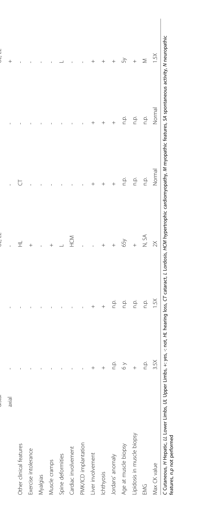

## Question

# Disease Characteristics Research Template

## Target Disease
- **Disease Name:** Triglyceride Storage Disease Type 1
- **MONDO ID:**  (if available)
- **Category:** Mendelian

## Research Objectives

Please provide a comprehensive research report on **Triglyceride Storage Disease Type 1** covering all of the
disease characteristics listed below. This report will be used to populate a disease knowledge
base entry. Be thorough and cite primary literature (PMID preferred) for all claims.

For each section, **suggested databases/resources** are listed. These are the first places
you should search for information on each topic.

---

### 1. Disease Information
> **Search first:** OMIM, Orphanet, ICD-10/ICD-11, MeSH, PubMed

- What is the disease? Provide a concise overview.
- What are the key identifiers? (OMIM, Orphanet, ICD-10/ICD-11, MeSH, Mondo)
- What are the common synonyms and alternative names?
- Is the information derived from individual patients (e.g., EHR) or aggregated disease-level resources?

### 2. Etiology

- **Disease Causal Factors**: What are the primary causes? (genetic, environmental, infectious, mechanistic)
- **Risk Factors**:
  > **Search first:** PubMed, Cochrane Library, UpToDate, clinical guidelines, ClinVar, ClinGen, GWAS Catalog, PheGenI, CTD, CDC, WHO, epidemiological databases
  - Genetic risk factors (causal variants, susceptibility loci, modifier genes)
  - Environmental risk factors (toxins, lifestyle, occupational exposures, age, sex, family history)
- **Protective Factors**:
  > **Search first:** PubMed, Cochrane Library, clinical trial databases, GWAS Catalog, gnomAD, WHO, CDC, nutrition databases
  - Genetic protective factors (protective variants, modifier alleles)
  - Environmental protective factors (diet, lifestyle, exposures that reduce risk)
- **Gene-Environment Interactions**: How do genetic and environmental factors interact to influence disease?
  > **Search first:** CTD, PubMed, PheGenI, GxE databases

### 3. Phenotypes
> **Search first:** HPO (Human Phenotype Ontology), OMIM, Orphanet, PubMed, clinicaltrials.gov, MedDRA, SNOMED CT, DECIPHER, LOINC

For each phenotype, provide:
- **Phenotype type**: symptoms, clinical signs, physical manifestations, behavioral changes, or laboratory abnormalities
  > For symptoms/signs: HPO, OMIM, Orphanet, PubMed
  > For behavioral changes: HPO, DSM, RDoC (Research Domain Criteria), PubMed
  > For laboratory abnormalities: LOINC, SNOMED CT, LabTests Online, PubMed
- **Phenotype characteristics**:
  > **Search first:** OMIM, Orphanet, HPO, PubMed
  - Age of symptom onset (neonatal, childhood, adult-onset, late-onset)
  - Symptom severity (mild, moderate, severe, variable)
  - Symptom progression (stable, progressive, episodic, fluctuating)
  - Frequency among affected individuals (percentage or qualitative)
- **Quality of life impact**: Effects on daily functioning and well-being (per-phenotype when possible)
  > **Search first:** EQ-5D database, SF-36, WHO QOL databases, PubMed
- Suggest HPO (Human Phenotype Ontology) terms for each phenotype

### 4. Genetic/Molecular Information

- **Causal Genes**: Gene mutations or chromosomal abnormalities responsible for disease (gene symbols, OMIM IDs)
  > **Search first:** OMIM, ClinVar, HGMD, Ensembl, NCBI Gene
- **Pathogenic Variants**:
  - Affected genes (gene symbols, HGNC IDs)
    > **Search first:** OMIM, NCBI Gene, Ensembl, HGNC, UniProt, GeneCards
  - Variant classification (pathogenic, likely pathogenic, VUS per ACMG/AMP guidelines)
    > **Search first:** ClinVar, ClinGen, ACMG/AMP guidelines, VarSome
  - Variant type/class (missense, frameshift, nonsense, splice-site, structural)
  - Allele frequency in population databases
    > **Search first:** gnomAD, 1000 Genomes, ExAC, TOPMed, dbSNP
  - Somatic vs germline origin
    > **Search first:** COSMIC (somatic), ClinVar, ICGC, TCGA
  - Functional consequences (loss of function, gain of function, dominant negative)
- **Modifier Genes**: Genes that modify disease severity or expression
- **Epigenetic Information**: DNA methylation, histone modifications, chromatin changes affecting disease
  > **Search first:** ENCODE, Roadmap Epigenomics, MethBase, DiseaseMeth
- **Chromosomal Abnormalities**: Large-scale genetic changes (aneuploidy, translocations, inversions)
  > **Search first:** DECIPHER, ClinVar, ECARUCA, UCSC Genome Browser

### 5. Environmental Information

- **Environmental Factors**: Non-genetic contributing factors (toxins, radiation, pollution, occupational exposure)
  > **Search first:** CTD (Comparative Toxicogenomics Database), TOXNET, PubMed, EPA databases
- **Lifestyle Factors**: Behavioral factors (smoking, diet, exercise, alcohol consumption)
  > **Search first:** CDC databases, WHO, PubMed, NHANES
- **Infectious Agents**: If applicable, pathogens causing or triggering disease (bacteria, viruses, fungi, parasites)
  > **Search first:** NCBI Taxonomy, ViPR, BV-BRC, MicrobeDB, GIDEON

### 6. Mechanism / Pathophysiology

- **Molecular Pathways**: Specific signaling cascades or biochemical pathways involved (Wnt, MAPK, mTOR, PI3K-AKT, etc.)
  > **Search first:** KEGG, Reactome, WikiPathways, PathBank, BioCyc
- **Cellular Processes**: Cell-level mechanisms (apoptosis, autophagy, cell cycle dysregulation, inflammation, etc.)
  > **Search first:** Gene Ontology (GO), Reactome, KEGG, PubMed
- **Protein Dysfunction**: How protein structure or function is altered (misfolding, aggregation, loss of function, gain of function)
  > **Search first:** UniProt, PDB (Protein Data Bank), InterPro, Pfam, AlphaFold
- **Metabolic Changes**: Alterations in metabolic processes (energy metabolism, lipid metabolism, amino acid metabolism)
  > **Search first:** KEGG, BioCyc, HMDB (Human Metabolome Database), BRENDA
- **Immune System Involvement**: Role of immune response (autoimmunity, immunodeficiency, chronic inflammation)
  > **Search first:** ImmPort, Immunome Database, IEDB, Gene Ontology
- **Tissue Damage Mechanisms**: How tissues/ are injured (oxidative stress, ischemia, fibrosis, necrosis)
  > **Search first:** PubMed, Gene Ontology, Reactome
- **Biochemical Abnormalities**: Specific molecular defects (enzyme deficiencies, receptor dysfunction, ion channel defects)
  > **Search first:** BRENDA, UniProt, KEGG, OMIM, PubMed
- **Epigenetic Changes**: DNA methylation, histone modifications affecting gene expression in disease
  > **Search first:** ENCODE, Roadmap Epigenomics, MethBase, DiseaseMeth
- **Molecular Profiling** (if available):
  - Transcriptomics/gene expression changes
    > **Search first:** GEO (Gene Expression Omnibus), ArrayExpress, GTEx, Human Cell Atlas, SRA
  - Proteomics findings
    > **Search first:** PRIDE, ProteomeXchange, Human Protein Atlas, STRING, BioGRID
  - Metabolomics signatures
    > **Search first:** MetaboLights, Metabolomics Workbench, HMDB, METLIN
  - Lipidomics alterations
    > **Search first:** LIPID MAPS, SwissLipids, LipidHome, Metabolomics Workbench
  - Genomic structural features
    > **Search first:** UCSC Genome Browser, Ensembl, NCBI, dbVar, DGV
- **Advanced Technologies** (if applicable):
  - Single-cell analysis findings (cell-type specific mechanisms, cellular heterogeneity)
    > **Search first:** Human Cell Atlas, Single Cell Portal, GEO, CELLxGENE
  - Spatial transcriptomics findings
    > **Search first:** GEO, Spatial Research, Vizgen, 10x Genomics data
  - Multi-omics integration results
    > **Search first:** TCGA, ICGC, cBioPortal, LinkedOmics, PubMed
  - Functional genomics screens (CRISPR, RNAi)
    > **Search first:** DepMap, GenomeRNAi, PubMed, BioGRID ORCS

For each mechanism, describe:
- The causal chain from initial trigger to clinical manifestation
- Which mechanisms are upstream vs downstream
- What cell types and biological processes are involved
- Suggest GO terms for biological processes and CL terms for cell types

### 7. Anatomical Structures Affected

- **Organ Level**:
  - Primary organs directly affected
  - Secondary organ involvement (complications, secondary effects)
  - Body systems involved (cardiovascular, nervous, digestive, respiratory, endocrine, etc.)
  > **Search first:** Uberon, FMA (Foundational Model of Anatomy), OMIM, HPO, ICD-11, MeSH, SNOMED CT
- **Tissue and Cell Level**:
  - Specific tissue types affected (epithelial, connective, muscle, nervous)
  - Specific cell populations targeted (with Cell Ontology terms)
  > **Search first:** Uberon, Human Protein Atlas, Cell Ontology, Human Cell Atlas, CellMarker, PanglaoDB
- **Subcellular Level**:
  - Cellular compartments involved (mitochondria, nucleus, ER, lysosomes) (with GO Cellular Component terms)
  > **Search first:** Gene Ontology (Cellular Component), UniProt, Human Protein Atlas
- **Localization**:
  - Specific anatomical sites (with UBERON terms)
    > **Search first:** FMA, Uberon, NeuroNames (for brain), SNOMED CT
  - Lateralization (unilateral, bilateral, asymmetric)
    > **Search first:** HPO, clinical literature, imaging databases

### 8. Temporal Development

- **Onset**:
  - Typical age of onset (congenital, pediatric, adult, geriatric)
  - Onset pattern (acute, subacute, chronic, insidious)
  > **Search first:** OMIM, Orphanet, HPO, PubMed
- **Progression**:
  - Disease stages (early, intermediate, advanced, end-stage)
    > **Search first:** Cancer Staging Manual (AJCC), WHO classifications, PubMed
  - Progression rate (rapid, slow, variable)
  - Disease course pattern (episodic, relapsing-remitting, progressive, stable)
  - Disease duration (self-limited, chronic lifelong)
  > **Search first:** Disease registries, longitudinal cohort databases, natural history studies, PubMed, Orphanet, OMIM
- **Patterns**:
  - Remission patterns (spontaneous, treatment-induced)
    > **Search first:** Clinical trial databases, disease registries, PubMed
  - Critical periods (time windows of vulnerability or opportunity for intervention)
    > **Search first:** PubMed, developmental biology databases, clinical guidelines

### 9. Inheritance and Population

- **Epidemiology**:
  - Prevalence (cases per 100,000 at given time)
  - Incidence (new cases per 100,000 per year)
  > **Search first:** Orphanet, CDC, WHO, GBD (Global Burden of Disease), national registries, SEER, disease registries
- **For Genetic Etiology**:
  - Inheritance pattern (AD, AR, X-linked, mitochondrial, multifactorial, polygenic)
    > **Search first:** OMIM, Orphanet, ClinVar, GTR (Genetic Testing Registry)
  - Penetrance (complete, incomplete, age-dependent)
    > **Search first:** ClinVar, OMIM, PubMed, ClinGen
  - Expressivity (variable, consistent)
    > **Search first:** OMIM, ClinVar, PubMed
  - Genetic anticipation (increasing severity in successive generations)
    > **Search first:** OMIM, PubMed (especially for repeat expansion disorders)
  - Germline mosaicism
    > **Search first:** ClinVar, OMIM, genetic counseling literature, PubMed
  - Founder effects (population-specific mutations)
    > **Search first:** gnomAD, population genetics databases, PubMed
  - Consanguinity role
    > **Search first:** OMIM, population studies, genetic counseling resources
  - Carrier frequency
    > **Search first:** gnomAD, carrier screening databases, GeneReviews, GTR
- **Population Demographics**:
  - Affected populations (ethnic or demographic groups with higher prevalence)
    > **Search first:** gnomAD, 1000 Genomes, PAGE Study, PubMed, population registries
  - Geographic distribution (endemic areas, regional variation)
    > **Search first:** WHO, CDC, GBD, Orphanet, geographic epidemiology databases
  - Geographic distribution of specific variants
  - Sex ratio (male:female)
    > **Search first:** Disease registries, OMIM, PubMed, epidemiological databases
  - Age distribution of affected individuals
    > **Search first:** CDC, disease registries, SEER, Orphanet

### 10. Diagnostics

- **Clinical Tests**:
  - Laboratory tests (blood, urine, tissue chemistry, specific enzyme assays)
    > **Search first:** LOINC, LabTests Online, PubMed
  - Biomarkers (proteins, metabolites, genetic markers, circulating biomarkers)
    > **Search first:** FDA Biomarker List, BEST (Biomarkers, EndpointS, and other Tools), PubMed
  - Imaging studies (X-ray, CT, MRI, PET, ultrasound)
    > **Search first:** RadLex, DICOM, Radiopaedia, imaging databases
  - Functional tests (pulmonary function, cardiac stress tests)
    > **Search first:** LOINC, clinical guidelines, PubMed
  - Electrophysiology (EEG, EMG, ECG, nerve conduction studies)
    > **Search first:** LOINC, clinical neurophysiology databases, PubMed
  - Biopsy findings (histopathology, immunohistochemistry)
    > **Search first:** SNOMED CT, College of American Pathologists resources, PubMed
  - Pathology findings (microscopic examination)
    > **Search first:** SNOMED CT, Digital Pathology databases, PubMed
- **Genetic Testing**:
  > **Search first:** GTR (Genetic Testing Registry), GeneReviews, ClinGen
  - Overview of recommended genetic testing approach
  - Whole genome sequencing (WGS) utility
    > **Search first:** GTR, ClinVar, GEL (Genomics England), gnomAD
  - Whole exome sequencing (WES) utility
    > **Search first:** GTR, ClinVar, OMIM, GeneMatcher
  - Gene panels (which panels, which genes)
    > **Search first:** GTR, ClinVar, laboratory-specific databases
  - Single gene testing
    > **Search first:** GTR, ClinVar, OMIM, GeneReviews
  - Chromosomal microarray (CMA)
    > **Search first:** DECIPHER, ClinVar, dbVar, ECARUCA
  - Karyotyping
    > **Search first:** Chromosome Abnormality Database, ClinVar, cytogenetics resources
  - FISH
    > **Search first:** ClinVar, cytogenetics databases, PubMed
  - Mitochondrial DNA testing
    > **Search first:** MITOMAP, MSeqDR, ClinVar, GTR
  - Repeat expansion testing
    > **Search first:** GTR, ClinVar, repeat expansion databases, PubMed
- **Omics-Based Diagnostics** (if applicable):
  - RNA sequencing / transcriptomics
    > **Search first:** GEO, ArrayExpress, GTEx, RNA-seq databases
  - Proteomics
    > **Search first:** PRIDE, ProteomeXchange, FDA Biomarker database
  - Metabolomics
    > **Search first:** MetaboLights, Metabolomics Workbench, HMDB
  - Epigenomics
    > **Search first:** GEO, ENCODE, Roadmap Epigenomics, MethBase
  - Liquid biopsy
    > **Search first:** COSMIC, ClinVar, liquid biopsy databases, PubMed
- **Clinical Criteria**:
  - Standardized diagnostic criteria (DSM, ICD, society guidelines)
    > **Search first:** DSM-5, ICD-11, clinical society guidelines, UpToDate
  - Differential diagnosis (other conditions to rule out, with distinguishing features)
    > **Search first:** DynaMed, UpToDate, clinical decision support systems
- **Screening**:
  - Screening methods for asymptomatic individuals (newborn screening, carrier screening, cascade screening)
    > **Search first:** ACMG recommendations, CDC newborn screening, GTR

### 11. Outcome/Prognosis

- **Survival and Mortality**:
  - Survival rate (5-year, 10-year, overall)
    > **Search first:** SEER, cancer registries, disease-specific registries, PubMed
  - Life expectancy (with and without treatment if applicable)
    > **Search first:** Orphanet, disease registries, actuarial databases, PubMed
  - Mortality rate
    > **Search first:** CDC, WHO, GBD, national mortality databases
  - Disease-specific mortality (deaths directly attributable to disease)
    > **Search first:** Disease registries, CDC Wonder, GBD, PubMed
- **Morbidity and Function**:
  - Morbidity (disease-related disability and health impacts)
    > **Search first:** GBD, WHO, disability databases, PubMed
  - Disability outcomes (long-term functional impairments)
    > **Search first:** ICF (International Classification of Functioning), disability registries
  - Quality of life measures (EQ-5D, SF-36, PROMIS, disease-specific tools)
    > **Search first:** EQ-5D database, SF-36, PROMIS, PubMed
- **Disease Course**:
  - Complications (secondary problems: infections, organ failure, etc.)
    > **Search first:** ICD codes, disease registries, clinical databases, PubMed
  - Recovery potential (likelihood and extent of recovery, with vs without treatment)
    > **Search first:** Natural history studies, rehabilitation databases, PubMed
- **Prediction**:
  - Prognostic factors (age, disease severity, biomarkers, treatment response)
    > **Search first:** Prognostic models databases, clinical calculators, PubMed
  - Prognostic biomarkers (molecular markers predicting disease course)
    > **Search first:** FDA Biomarker database, PubMed, cancer prognostic databases

### 12. Treatment

- **Pharmacotherapy**:
  - Pharmacological treatments (drug names, drug classes, mechanisms of action)
    > **Search first:** DrugBank, RxNorm, ATC classification, DailyMed, FDA databases
  - Pharmacogenomics (how genetic variants affect drug metabolism, efficacy, toxicity)
    > **Search first:** PharmGKB, CPIC (Clinical Pharmacogenetics), FDA Table of PGx Biomarkers
- **Advanced Therapeutics**:
  - Gene therapy (viral vectors, CRISPR, gene replacement, gene editing)
    > **Search first:** ClinicalTrials.gov, FDA gene therapy database, ASGCT resources
  - Cell therapy (stem cell transplant, CAR-T, cellular therapeutics)
    > **Search first:** ClinicalTrials.gov, FDA cell therapy database, FACT standards
  - RNA-based therapies (ASOs, siRNA, mRNA therapies)
    > **Search first:** ClinicalTrials.gov, FDA approvals, PubMed
  - Targeted therapies (treatments directed at specific molecular targets)
    > **Search first:** My Cancer Genome, OncoKB, ClinicalTrials.gov, FDA approvals
  - Immunotherapies (checkpoint inhibitors, monoclonal antibodies)
    > **Search first:** Cancer Immunotherapy Database, FDA approvals, ClinicalTrials.gov
- **Surgical and Interventional**:
  - Surgical interventions (types of surgery, timing, outcomes)
    > **Search first:** CPT codes, surgical registries, clinical guidelines, PubMed
- **Supportive and Rehabilitative**:
  - Supportive care (symptom management, pain control, nutrition)
    > **Search first:** Clinical guidelines, Cochrane Library, PubMed
  - Rehabilitation (physical therapy, occupational therapy, speech therapy)
    > **Search first:** Rehabilitation medicine databases, clinical guidelines, PubMed
- **Experimental**:
  - Experimental treatments in clinical trials (with NCT identifiers if available)
    > **Search first:** ClinicalTrials.gov, EU Clinical Trials Register, WHO ICTRP
- **Treatment Outcomes**:
  - Treatment response rates
    > **Search first:** Clinical trial databases, FDA reviews, systematic reviews, PubMed
  - Side effects and adverse events
    > **Search first:** FDA Adverse Event Reporting System (FAERS), MedWatch, PubMed
- **Treatment Strategy**:
  - Treatment algorithms (clinical pathways, decision trees)
    > **Search first:** Clinical practice guidelines, NCCN Guidelines, UpToDate
  - Combination therapies
    > **Search first:** ClinicalTrials.gov, treatment guidelines, PubMed
  - Personalized medicine approaches (genotype-guided treatment)
    > **Search first:** My Cancer Genome, CIViC, PharmGKB, precision medicine databases

For each treatment, suggest MAXO (Medical Action Ontology) terms where applicable.

### 13. Prevention

- **Prevention Levels**:
  - Primary prevention (preventing disease occurrence: vaccination, risk factor modification)
    > **Search first:** CDC, WHO, USPSTF recommendations, Cochrane Library
  - Secondary prevention (early detection and treatment: screening programs, early intervention)
    > **Search first:** USPSTF, CDC screening guidelines, WHO
  - Tertiary prevention (preventing complications in those with disease)
    > **Search first:** Clinical guidelines, disease management protocols, PubMed
- **Immunization**: Vaccine strategies (if applicable)
  > **Search first:** CDC vaccine schedules, WHO immunization, FDA vaccine database
- **Screening and Early Detection**:
  - Screening programs (population-based: newborn screening, cancer screening)
    > **Search first:** CDC screening programs, USPSTF, cancer screening databases
  - Genetic screening (carrier screening, preimplantation genetic diagnosis, prenatal testing)
    > **Search first:** ACMG recommendations, ACOG guidelines, GTR
  - Risk stratification (identifying high-risk individuals for targeted prevention)
    > **Search first:** Risk prediction models, clinical calculators, PubMed
- **Behavioral Interventions**: Lifestyle modifications to reduce risk
  > **Search first:** CDC, WHO, behavioral intervention databases, Cochrane Library
- **Counseling**: Genetic counseling (risk assessment, family planning guidance)
  > **Search first:** NSGC resources, ACMG guidelines, GeneReviews
- **Public Health**:
  - Public health interventions (sanitation, vector control, health education)
    > **Search first:** CDC, WHO, public health databases, PubMed
  - Environmental interventions (reducing environmental risk factors)
    > **Search first:** EPA databases, WHO environmental health, PubMed
- **Prophylaxis**: Preventive medications or procedures
  > **Search first:** Clinical guidelines, FDA approvals, PubMed

### 14. Other Species / Natural Disease

- **Taxonomy**: Species affected (with NCBI Taxon identifiers)
  > **Search first:** NCBI Taxonomy
- **Breed**: Specific breeds affected (with VBO identifiers if applicable)
  > **Search first:** VBO (Vertebrate Breed Ontology)
- **Gene**: Orthologous genes in other species (with NCBI Gene IDs)
  > **Search first:** NCBI Gene
- **Natural Disease**:
  - Naturally occurring disease in other species (companion animals, wildlife)
    > **Search first:** OMIA (Online Mendelian Inheritance in Animals), VetCompass, PubMed
  - Veterinary relevance and importance in animal health
    > **Search first:** OMIA, veterinary databases, PubMed
- **Comparative Biology**:
  - Comparative pathology (similarities and differences across species)
    > **Search first:** OMIA, comparative pathology databases, PubMed
  - Evolutionary conservation of disease mechanisms
    > **Search first:** HomoloGene, OrthoMCL, Alliance of Genome Resources
- **Transmission** (if applicable):
  - Zoonotic potential
    > **Search first:** CDC zoonotic diseases, WHO zoonoses, GIDEON
  - Cross-species susceptibility
    > **Search first:** NCBI Taxonomy, veterinary databases, PubMed

### 15. Model Organisms

- **Model Types**:
  - Model organism type (mammalian, invertebrate, cellular, in vitro)
    > **Search first:** Alliance of Genome Resources, model organism databases
  - Specific model systems (mouse, rat, zebrafish, Drosophila, C. elegans, yeast, cell lines, organoids, iPSCs)
    > **Search first:** MGI, RGD, ZFIN, FlyBase, WormBase, SGD, ATCC, Cellosaurus
  - Induced models (drug treatment, surgical intervention, environmental manipulation)
    > **Search first:** MGI, model organism databases, PubMed
- **Genetic Models**:
  - Types available (knockout, knock-in, transgenic, conditional, humanized)
    > **Search first:** MGI, IMPC, KOMP, EuMMCR, IMSR
- **Model Characteristics**:
  - Phenotype recapitulation (how well model reproduces human disease features)
    > **Search first:** Model organism databases, comparative studies, PubMed
  - Model limitations (aspects of human disease not captured)
    > **Search first:** Model organism databases, PubMed, review articles
- **Applications**:
  - Research applications (what aspects of disease can be studied)
    > **Search first:** Model organism databases, PubMed
- **Resources**:
  - Model databases
    > **Search first:** MGI, RGD, ZFIN, FlyBase, WormBase, IMSR, EMMA, MMRRC

---

## Citation Requirements

- Cite primary literature (PMID preferred) for all mechanistic and clinical claims
- Prioritize recent reviews and landmark papers
- Include direct quotes from abstracts where possible to support key statements
- Distinguish evidence source types: human clinical, model organism, in vitro, computational

## Output Format

Structure your response as a comprehensive narrative organized by the sections above.
For each section, provide:
- Factual content with specific details (numbers, percentages, gene names, variant nomenclature)
- Ontology term suggestions (HPO, GO, CL, UBERON, CHEBI, MAXO, MONDO) where applicable
- Evidence citations with PMIDs
- Direct quotes from abstracts to support key claims
- Clear indication when information is not available or not applicable for this disease

This report will be used to populate a disease knowledge base entry with:
- Pathophysiology descriptions with causal chains
- Gene/protein annotations (HGNC, GO terms)
- Phenotype associations (HP terms) with frequencies
- Cell type involvement (CL terms)
- Anatomical locations (UBERON terms)
- Chemical entities (CHEBI terms)
- Treatment annotations (MAXO terms)
- Evidence items with PMIDs and exact abstract quotes
- Epidemiology, prognosis, diagnostic, and prevention information
- Animal model descriptions with phenotype recapitulation details

## Output

Question: You are an expert researcher providing comprehensive, well-cited information.

Provide detailed information focusing on:
1. Key concepts and definitions with current understanding
2. Recent developments and latest research (prioritize 2023-2024 sources)
3. Current applications and real-world implementations
4. Expert opinions and analysis from authoritative sources
5. Relevant statistics and data from recent studies

Format as a comprehensive research report with proper citations. Include URLs and publication dates where available.
Always prioritize recent, authoritative sources and provide specific citations for all major claims.

# Disease Characteristics Research Template

## Target Disease
- **Disease Name:** Triglyceride Storage Disease Type 1
- **MONDO ID:**  (if available)
- **Category:** Mendelian

## Research Objectives

Please provide a comprehensive research report on **Triglyceride Storage Disease Type 1** covering all of the
disease characteristics listed below. This report will be used to populate a disease knowledge
base entry. Be thorough and cite primary literature (PMID preferred) for all claims.

For each section, **suggested databases/resources** are listed. These are the first places
you should search for information on each topic.

---

### 1. Disease Information
> **Search first:** OMIM, Orphanet, ICD-10/ICD-11, MeSH, PubMed

- What is the disease? Provide a concise overview.
- What are the key identifiers? (OMIM, Orphanet, ICD-10/ICD-11, MeSH, Mondo)
- What are the common synonyms and alternative names?
- Is the information derived from individual patients (e.g., EHR) or aggregated disease-level resources?

### 2. Etiology

- **Disease Causal Factors**: What are the primary causes? (genetic, environmental, infectious, mechanistic)
- **Risk Factors**:
  > **Search first:** PubMed, Cochrane Library, UpToDate, clinical guidelines, ClinVar, ClinGen, GWAS Catalog, PheGenI, CTD, CDC, WHO, epidemiological databases
  - Genetic risk factors (causal variants, susceptibility loci, modifier genes)
  - Environmental risk factors (toxins, lifestyle, occupational exposures, age, sex, family history)
- **Protective Factors**:
  > **Search first:** PubMed, Cochrane Library, clinical trial databases, GWAS Catalog, gnomAD, WHO, CDC, nutrition databases
  - Genetic protective factors (protective variants, modifier alleles)
  - Environmental protective factors (diet, lifestyle, exposures that reduce risk)
- **Gene-Environment Interactions**: How do genetic and environmental factors interact to influence disease?
  > **Search first:** CTD, PubMed, PheGenI, GxE databases

### 3. Phenotypes
> **Search first:** HPO (Human Phenotype Ontology), OMIM, Orphanet, PubMed, clinicaltrials.gov, MedDRA, SNOMED CT, DECIPHER, LOINC

For each phenotype, provide:
- **Phenotype type**: symptoms, clinical signs, physical manifestations, behavioral changes, or laboratory abnormalities
  > For symptoms/signs: HPO, OMIM, Orphanet, PubMed
  > For behavioral changes: HPO, DSM, RDoC (Research Domain Criteria), PubMed
  > For laboratory abnormalities: LOINC, SNOMED CT, LabTests Online, PubMed
- **Phenotype characteristics**:
  > **Search first:** OMIM, Orphanet, HPO, PubMed
  - Age of symptom onset (neonatal, childhood, adult-onset, late-onset)
  - Symptom severity (mild, moderate, severe, variable)
  - Symptom progression (stable, progressive, episodic, fluctuating)
  - Frequency among affected individuals (percentage or qualitative)
- **Quality of life impact**: Effects on daily functioning and well-being (per-phenotype when possible)
  > **Search first:** EQ-5D database, SF-36, WHO QOL databases, PubMed
- Suggest HPO (Human Phenotype Ontology) terms for each phenotype

### 4. Genetic/Molecular Information

- **Causal Genes**: Gene mutations or chromosomal abnormalities responsible for disease (gene symbols, OMIM IDs)
  > **Search first:** OMIM, ClinVar, HGMD, Ensembl, NCBI Gene
- **Pathogenic Variants**:
  - Affected genes (gene symbols, HGNC IDs)
    > **Search first:** OMIM, NCBI Gene, Ensembl, HGNC, UniProt, GeneCards
  - Variant classification (pathogenic, likely pathogenic, VUS per ACMG/AMP guidelines)
    > **Search first:** ClinVar, ClinGen, ACMG/AMP guidelines, VarSome
  - Variant type/class (missense, frameshift, nonsense, splice-site, structural)
  - Allele frequency in population databases
    > **Search first:** gnomAD, 1000 Genomes, ExAC, TOPMed, dbSNP
  - Somatic vs germline origin
    > **Search first:** COSMIC (somatic), ClinVar, ICGC, TCGA
  - Functional consequences (loss of function, gain of function, dominant negative)
- **Modifier Genes**: Genes that modify disease severity or expression
- **Epigenetic Information**: DNA methylation, histone modifications, chromatin changes affecting disease
  > **Search first:** ENCODE, Roadmap Epigenomics, MethBase, DiseaseMeth
- **Chromosomal Abnormalities**: Large-scale genetic changes (aneuploidy, translocations, inversions)
  > **Search first:** DECIPHER, ClinVar, ECARUCA, UCSC Genome Browser

### 5. Environmental Information

- **Environmental Factors**: Non-genetic contributing factors (toxins, radiation, pollution, occupational exposure)
  > **Search first:** CTD (Comparative Toxicogenomics Database), TOXNET, PubMed, EPA databases
- **Lifestyle Factors**: Behavioral factors (smoking, diet, exercise, alcohol consumption)
  > **Search first:** CDC databases, WHO, PubMed, NHANES
- **Infectious Agents**: If applicable, pathogens causing or triggering disease (bacteria, viruses, fungi, parasites)
  > **Search first:** NCBI Taxonomy, ViPR, BV-BRC, MicrobeDB, GIDEON

### 6. Mechanism / Pathophysiology

- **Molecular Pathways**: Specific signaling cascades or biochemical pathways involved (Wnt, MAPK, mTOR, PI3K-AKT, etc.)
  > **Search first:** KEGG, Reactome, WikiPathways, PathBank, BioCyc
- **Cellular Processes**: Cell-level mechanisms (apoptosis, autophagy, cell cycle dysregulation, inflammation, etc.)
  > **Search first:** Gene Ontology (GO), Reactome, KEGG, PubMed
- **Protein Dysfunction**: How protein structure or function is altered (misfolding, aggregation, loss of function, gain of function)
  > **Search first:** UniProt, PDB (Protein Data Bank), InterPro, Pfam, AlphaFold
- **Metabolic Changes**: Alterations in metabolic processes (energy metabolism, lipid metabolism, amino acid metabolism)
  > **Search first:** KEGG, BioCyc, HMDB (Human Metabolome Database), BRENDA
- **Immune System Involvement**: Role of immune response (autoimmunity, immunodeficiency, chronic inflammation)
  > **Search first:** ImmPort, Immunome Database, IEDB, Gene Ontology
- **Tissue Damage Mechanisms**: How tissues/ are injured (oxidative stress, ischemia, fibrosis, necrosis)
  > **Search first:** PubMed, Gene Ontology, Reactome
- **Biochemical Abnormalities**: Specific molecular defects (enzyme deficiencies, receptor dysfunction, ion channel defects)
  > **Search first:** BRENDA, UniProt, KEGG, OMIM, PubMed
- **Epigenetic Changes**: DNA methylation, histone modifications affecting gene expression in disease
  > **Search first:** ENCODE, Roadmap Epigenomics, MethBase, DiseaseMeth
- **Molecular Profiling** (if available):
  - Transcriptomics/gene expression changes
    > **Search first:** GEO (Gene Expression Omnibus), ArrayExpress, GTEx, Human Cell Atlas, SRA
  - Proteomics findings
    > **Search first:** PRIDE, ProteomeXchange, Human Protein Atlas, STRING, BioGRID
  - Metabolomics signatures
    > **Search first:** MetaboLights, Metabolomics Workbench, HMDB, METLIN
  - Lipidomics alterations
    > **Search first:** LIPID MAPS, SwissLipids, LipidHome, Metabolomics Workbench
  - Genomic structural features
    > **Search first:** UCSC Genome Browser, Ensembl, NCBI, dbVar, DGV
- **Advanced Technologies** (if applicable):
  - Single-cell analysis findings (cell-type specific mechanisms, cellular heterogeneity)
    > **Search first:** Human Cell Atlas, Single Cell Portal, GEO, CELLxGENE
  - Spatial transcriptomics findings
    > **Search first:** GEO, Spatial Research, Vizgen, 10x Genomics data
  - Multi-omics integration results
    > **Search first:** TCGA, ICGC, cBioPortal, LinkedOmics, PubMed
  - Functional genomics screens (CRISPR, RNAi)
    > **Search first:** DepMap, GenomeRNAi, PubMed, BioGRID ORCS

For each mechanism, describe:
- The causal chain from initial trigger to clinical manifestation
- Which mechanisms are upstream vs downstream
- What cell types and biological processes are involved
- Suggest GO terms for biological processes and CL terms for cell types

### 7. Anatomical Structures Affected

- **Organ Level**:
  - Primary organs directly affected
  - Secondary organ involvement (complications, secondary effects)
  - Body systems involved (cardiovascular, nervous, digestive, respiratory, endocrine, etc.)
  > **Search first:** Uberon, FMA (Foundational Model of Anatomy), OMIM, HPO, ICD-11, MeSH, SNOMED CT
- **Tissue and Cell Level**:
  - Specific tissue types affected (epithelial, connective, muscle, nervous)
  - Specific cell populations targeted (with Cell Ontology terms)
  > **Search first:** Uberon, Human Protein Atlas, Cell Ontology, Human Cell Atlas, CellMarker, PanglaoDB
- **Subcellular Level**:
  - Cellular compartments involved (mitochondria, nucleus, ER, lysosomes) (with GO Cellular Component terms)
  > **Search first:** Gene Ontology (Cellular Component), UniProt, Human Protein Atlas
- **Localization**:
  - Specific anatomical sites (with UBERON terms)
    > **Search first:** FMA, Uberon, NeuroNames (for brain), SNOMED CT
  - Lateralization (unilateral, bilateral, asymmetric)
    > **Search first:** HPO, clinical literature, imaging databases

### 8. Temporal Development

- **Onset**:
  - Typical age of onset (congenital, pediatric, adult, geriatric)
  - Onset pattern (acute, subacute, chronic, insidious)
  > **Search first:** OMIM, Orphanet, HPO, PubMed
- **Progression**:
  - Disease stages (early, intermediate, advanced, end-stage)
    > **Search first:** Cancer Staging Manual (AJCC), WHO classifications, PubMed
  - Progression rate (rapid, slow, variable)
  - Disease course pattern (episodic, relapsing-remitting, progressive, stable)
  - Disease duration (self-limited, chronic lifelong)
  > **Search first:** Disease registries, longitudinal cohort databases, natural history studies, PubMed, Orphanet, OMIM
- **Patterns**:
  - Remission patterns (spontaneous, treatment-induced)
    > **Search first:** Clinical trial databases, disease registries, PubMed
  - Critical periods (time windows of vulnerability or opportunity for intervention)
    > **Search first:** PubMed, developmental biology databases, clinical guidelines

### 9. Inheritance and Population

- **Epidemiology**:
  - Prevalence (cases per 100,000 at given time)
  - Incidence (new cases per 100,000 per year)
  > **Search first:** Orphanet, CDC, WHO, GBD (Global Burden of Disease), national registries, SEER, disease registries
- **For Genetic Etiology**:
  - Inheritance pattern (AD, AR, X-linked, mitochondrial, multifactorial, polygenic)
    > **Search first:** OMIM, Orphanet, ClinVar, GTR (Genetic Testing Registry)
  - Penetrance (complete, incomplete, age-dependent)
    > **Search first:** ClinVar, OMIM, PubMed, ClinGen
  - Expressivity (variable, consistent)
    > **Search first:** OMIM, ClinVar, PubMed
  - Genetic anticipation (increasing severity in successive generations)
    > **Search first:** OMIM, PubMed (especially for repeat expansion disorders)
  - Germline mosaicism
    > **Search first:** ClinVar, OMIM, genetic counseling literature, PubMed
  - Founder effects (population-specific mutations)
    > **Search first:** gnomAD, population genetics databases, PubMed
  - Consanguinity role
    > **Search first:** OMIM, population studies, genetic counseling resources
  - Carrier frequency
    > **Search first:** gnomAD, carrier screening databases, GeneReviews, GTR
- **Population Demographics**:
  - Affected populations (ethnic or demographic groups with higher prevalence)
    > **Search first:** gnomAD, 1000 Genomes, PAGE Study, PubMed, population registries
  - Geographic distribution (endemic areas, regional variation)
    > **Search first:** WHO, CDC, GBD, Orphanet, geographic epidemiology databases
  - Geographic distribution of specific variants
  - Sex ratio (male:female)
    > **Search first:** Disease registries, OMIM, PubMed, epidemiological databases
  - Age distribution of affected individuals
    > **Search first:** CDC, disease registries, SEER, Orphanet

### 10. Diagnostics

- **Clinical Tests**:
  - Laboratory tests (blood, urine, tissue chemistry, specific enzyme assays)
    > **Search first:** LOINC, LabTests Online, PubMed
  - Biomarkers (proteins, metabolites, genetic markers, circulating biomarkers)
    > **Search first:** FDA Biomarker List, BEST (Biomarkers, EndpointS, and other Tools), PubMed
  - Imaging studies (X-ray, CT, MRI, PET, ultrasound)
    > **Search first:** RadLex, DICOM, Radiopaedia, imaging databases
  - Functional tests (pulmonary function, cardiac stress tests)
    > **Search first:** LOINC, clinical guidelines, PubMed
  - Electrophysiology (EEG, EMG, ECG, nerve conduction studies)
    > **Search first:** LOINC, clinical neurophysiology databases, PubMed
  - Biopsy findings (histopathology, immunohistochemistry)
    > **Search first:** SNOMED CT, College of American Pathologists resources, PubMed
  - Pathology findings (microscopic examination)
    > **Search first:** SNOMED CT, Digital Pathology databases, PubMed
- **Genetic Testing**:
  > **Search first:** GTR (Genetic Testing Registry), GeneReviews, ClinGen
  - Overview of recommended genetic testing approach
  - Whole genome sequencing (WGS) utility
    > **Search first:** GTR, ClinVar, GEL (Genomics England), gnomAD
  - Whole exome sequencing (WES) utility
    > **Search first:** GTR, ClinVar, OMIM, GeneMatcher
  - Gene panels (which panels, which genes)
    > **Search first:** GTR, ClinVar, laboratory-specific databases
  - Single gene testing
    > **Search first:** GTR, ClinVar, OMIM, GeneReviews
  - Chromosomal microarray (CMA)
    > **Search first:** DECIPHER, ClinVar, dbVar, ECARUCA
  - Karyotyping
    > **Search first:** Chromosome Abnormality Database, ClinVar, cytogenetics resources
  - FISH
    > **Search first:** ClinVar, cytogenetics databases, PubMed
  - Mitochondrial DNA testing
    > **Search first:** MITOMAP, MSeqDR, ClinVar, GTR
  - Repeat expansion testing
    > **Search first:** GTR, ClinVar, repeat expansion databases, PubMed
- **Omics-Based Diagnostics** (if applicable):
  - RNA sequencing / transcriptomics
    > **Search first:** GEO, ArrayExpress, GTEx, RNA-seq databases
  - Proteomics
    > **Search first:** PRIDE, ProteomeXchange, FDA Biomarker database
  - Metabolomics
    > **Search first:** MetaboLights, Metabolomics Workbench, HMDB
  - Epigenomics
    > **Search first:** GEO, ENCODE, Roadmap Epigenomics, MethBase
  - Liquid biopsy
    > **Search first:** COSMIC, ClinVar, liquid biopsy databases, PubMed
- **Clinical Criteria**:
  - Standardized diagnostic criteria (DSM, ICD, society guidelines)
    > **Search first:** DSM-5, ICD-11, clinical society guidelines, UpToDate
  - Differential diagnosis (other conditions to rule out, with distinguishing features)
    > **Search first:** DynaMed, UpToDate, clinical decision support systems
- **Screening**:
  - Screening methods for asymptomatic individuals (newborn screening, carrier screening, cascade screening)
    > **Search first:** ACMG recommendations, CDC newborn screening, GTR

### 11. Outcome/Prognosis

- **Survival and Mortality**:
  - Survival rate (5-year, 10-year, overall)
    > **Search first:** SEER, cancer registries, disease-specific registries, PubMed
  - Life expectancy (with and without treatment if applicable)
    > **Search first:** Orphanet, disease registries, actuarial databases, PubMed
  - Mortality rate
    > **Search first:** CDC, WHO, GBD, national mortality databases
  - Disease-specific mortality (deaths directly attributable to disease)
    > **Search first:** Disease registries, CDC Wonder, GBD, PubMed
- **Morbidity and Function**:
  - Morbidity (disease-related disability and health impacts)
    > **Search first:** GBD, WHO, disability databases, PubMed
  - Disability outcomes (long-term functional impairments)
    > **Search first:** ICF (International Classification of Functioning), disability registries
  - Quality of life measures (EQ-5D, SF-36, PROMIS, disease-specific tools)
    > **Search first:** EQ-5D database, SF-36, PROMIS, PubMed
- **Disease Course**:
  - Complications (secondary problems: infections, organ failure, etc.)
    > **Search first:** ICD codes, disease registries, clinical databases, PubMed
  - Recovery potential (likelihood and extent of recovery, with vs without treatment)
    > **Search first:** Natural history studies, rehabilitation databases, PubMed
- **Prediction**:
  - Prognostic factors (age, disease severity, biomarkers, treatment response)
    > **Search first:** Prognostic models databases, clinical calculators, PubMed
  - Prognostic biomarkers (molecular markers predicting disease course)
    > **Search first:** FDA Biomarker database, PubMed, cancer prognostic databases

### 12. Treatment

- **Pharmacotherapy**:
  - Pharmacological treatments (drug names, drug classes, mechanisms of action)
    > **Search first:** DrugBank, RxNorm, ATC classification, DailyMed, FDA databases
  - Pharmacogenomics (how genetic variants affect drug metabolism, efficacy, toxicity)
    > **Search first:** PharmGKB, CPIC (Clinical Pharmacogenetics), FDA Table of PGx Biomarkers
- **Advanced Therapeutics**:
  - Gene therapy (viral vectors, CRISPR, gene replacement, gene editing)
    > **Search first:** ClinicalTrials.gov, FDA gene therapy database, ASGCT resources
  - Cell therapy (stem cell transplant, CAR-T, cellular therapeutics)
    > **Search first:** ClinicalTrials.gov, FDA cell therapy database, FACT standards
  - RNA-based therapies (ASOs, siRNA, mRNA therapies)
    > **Search first:** ClinicalTrials.gov, FDA approvals, PubMed
  - Targeted therapies (treatments directed at specific molecular targets)
    > **Search first:** My Cancer Genome, OncoKB, ClinicalTrials.gov, FDA approvals
  - Immunotherapies (checkpoint inhibitors, monoclonal antibodies)
    > **Search first:** Cancer Immunotherapy Database, FDA approvals, ClinicalTrials.gov
- **Surgical and Interventional**:
  - Surgical interventions (types of surgery, timing, outcomes)
    > **Search first:** CPT codes, surgical registries, clinical guidelines, PubMed
- **Supportive and Rehabilitative**:
  - Supportive care (symptom management, pain control, nutrition)
    > **Search first:** Clinical guidelines, Cochrane Library, PubMed
  - Rehabilitation (physical therapy, occupational therapy, speech therapy)
    > **Search first:** Rehabilitation medicine databases, clinical guidelines, PubMed
- **Experimental**:
  - Experimental treatments in clinical trials (with NCT identifiers if available)
    > **Search first:** ClinicalTrials.gov, EU Clinical Trials Register, WHO ICTRP
- **Treatment Outcomes**:
  - Treatment response rates
    > **Search first:** Clinical trial databases, FDA reviews, systematic reviews, PubMed
  - Side effects and adverse events
    > **Search first:** FDA Adverse Event Reporting System (FAERS), MedWatch, PubMed
- **Treatment Strategy**:
  - Treatment algorithms (clinical pathways, decision trees)
    > **Search first:** Clinical practice guidelines, NCCN Guidelines, UpToDate
  - Combination therapies
    > **Search first:** ClinicalTrials.gov, treatment guidelines, PubMed
  - Personalized medicine approaches (genotype-guided treatment)
    > **Search first:** My Cancer Genome, CIViC, PharmGKB, precision medicine databases

For each treatment, suggest MAXO (Medical Action Ontology) terms where applicable.

### 13. Prevention

- **Prevention Levels**:
  - Primary prevention (preventing disease occurrence: vaccination, risk factor modification)
    > **Search first:** CDC, WHO, USPSTF recommendations, Cochrane Library
  - Secondary prevention (early detection and treatment: screening programs, early intervention)
    > **Search first:** USPSTF, CDC screening guidelines, WHO
  - Tertiary prevention (preventing complications in those with disease)
    > **Search first:** Clinical guidelines, disease management protocols, PubMed
- **Immunization**: Vaccine strategies (if applicable)
  > **Search first:** CDC vaccine schedules, WHO immunization, FDA vaccine database
- **Screening and Early Detection**:
  - Screening programs (population-based: newborn screening, cancer screening)
    > **Search first:** CDC screening programs, USPSTF, cancer screening databases
  - Genetic screening (carrier screening, preimplantation genetic diagnosis, prenatal testing)
    > **Search first:** ACMG recommendations, ACOG guidelines, GTR
  - Risk stratification (identifying high-risk individuals for targeted prevention)
    > **Search first:** Risk prediction models, clinical calculators, PubMed
- **Behavioral Interventions**: Lifestyle modifications to reduce risk
  > **Search first:** CDC, WHO, behavioral intervention databases, Cochrane Library
- **Counseling**: Genetic counseling (risk assessment, family planning guidance)
  > **Search first:** NSGC resources, ACMG guidelines, GeneReviews
- **Public Health**:
  - Public health interventions (sanitation, vector control, health education)
    > **Search first:** CDC, WHO, public health databases, PubMed
  - Environmental interventions (reducing environmental risk factors)
    > **Search first:** EPA databases, WHO environmental health, PubMed
- **Prophylaxis**: Preventive medications or procedures
  > **Search first:** Clinical guidelines, FDA approvals, PubMed

### 14. Other Species / Natural Disease

- **Taxonomy**: Species affected (with NCBI Taxon identifiers)
  > **Search first:** NCBI Taxonomy
- **Breed**: Specific breeds affected (with VBO identifiers if applicable)
  > **Search first:** VBO (Vertebrate Breed Ontology)
- **Gene**: Orthologous genes in other species (with NCBI Gene IDs)
  > **Search first:** NCBI Gene
- **Natural Disease**:
  - Naturally occurring disease in other species (companion animals, wildlife)
    > **Search first:** OMIA (Online Mendelian Inheritance in Animals), VetCompass, PubMed
  - Veterinary relevance and importance in animal health
    > **Search first:** OMIA, veterinary databases, PubMed
- **Comparative Biology**:
  - Comparative pathology (similarities and differences across species)
    > **Search first:** OMIA, comparative pathology databases, PubMed
  - Evolutionary conservation of disease mechanisms
    > **Search first:** HomoloGene, OrthoMCL, Alliance of Genome Resources
- **Transmission** (if applicable):
  - Zoonotic potential
    > **Search first:** CDC zoonotic diseases, WHO zoonoses, GIDEON
  - Cross-species susceptibility
    > **Search first:** NCBI Taxonomy, veterinary databases, PubMed

### 15. Model Organisms

- **Model Types**:
  - Model organism type (mammalian, invertebrate, cellular, in vitro)
    > **Search first:** Alliance of Genome Resources, model organism databases
  - Specific model systems (mouse, rat, zebrafish, Drosophila, C. elegans, yeast, cell lines, organoids, iPSCs)
    > **Search first:** MGI, RGD, ZFIN, FlyBase, WormBase, SGD, ATCC, Cellosaurus
  - Induced models (drug treatment, surgical intervention, environmental manipulation)
    > **Search first:** MGI, model organism databases, PubMed
- **Genetic Models**:
  - Types available (knockout, knock-in, transgenic, conditional, humanized)
    > **Search first:** MGI, IMPC, KOMP, EuMMCR, IMSR
- **Model Characteristics**:
  - Phenotype recapitulation (how well model reproduces human disease features)
    > **Search first:** Model organism databases, comparative studies, PubMed
  - Model limitations (aspects of human disease not captured)
    > **Search first:** Model organism databases, PubMed, review articles
- **Applications**:
  - Research applications (what aspects of disease can be studied)
    > **Search first:** Model organism databases, PubMed
- **Resources**:
  - Model databases
    > **Search first:** MGI, RGD, ZFIN, FlyBase, WormBase, IMSR, EMMA, MMRRC

---

## Citation Requirements

- Cite primary literature (PMID preferred) for all mechanistic and clinical claims
- Prioritize recent reviews and landmark papers
- Include direct quotes from abstracts where possible to support key statements
- Distinguish evidence source types: human clinical, model organism, in vitro, computational

## Output Format

Structure your response as a comprehensive narrative organized by the sections above.
For each section, provide:
- Factual content with specific details (numbers, percentages, gene names, variant nomenclature)
- Ontology term suggestions (HPO, GO, CL, UBERON, CHEBI, MAXO, MONDO) where applicable
- Evidence citations with PMIDs
- Direct quotes from abstracts to support key claims
- Clear indication when information is not available or not applicable for this disease

This report will be used to populate a disease knowledge base entry with:
- Pathophysiology descriptions with causal chains
- Gene/protein annotations (HGNC, GO terms)
- Phenotype associations (HP terms) with frequencies
- Cell type involvement (CL terms)
- Anatomical locations (UBERON terms)
- Chemical entities (CHEBI terms)
- Treatment annotations (MAXO terms)
- Evidence items with PMIDs and exact abstract quotes
- Epidemiology, prognosis, diagnostic, and prevention information
- Animal model descriptions with phenotype recapitulation details

## Comprehensive Research Report: Triglyceride Storage Disease Type 1 (TGSD1)

### Executive summary
Triglyceride Storage Disease Type 1 corresponds to **neutral lipid storage disease with ichthyosis (NLSDI)**, historically called **Chanarin–Dorfman syndrome (CDS)**—a **rare autosomal recessive** disorder caused by **biallelic ABHD5 (CGI-58)** pathogenic variants that impair lipid droplet triglyceride mobilization and disrupt epidermal barrier lipid (ω-O-acylceramide) production, resulting in congenital ichthyosis plus multisystem neutral lipid accumulation (especially liver and variable muscle/neurologic/ocular/auditory involvement). (oji2017s1guidelinesfor pages 5-6, missaglia2019neutrallipidstorage pages 3-6, schweiger2009neutrallipidstorage pages 1-2, kien2018abhd5stimulatespnpla1mediated pages 1-3)

---

## 1. Disease Information

### 1.1 Definition and current understanding
NLSDI/CDS is a **non-lysosomal neutral lipid storage disease** characterized by systemic **triacylglycerol (TAG) accumulation in cytoplasmic lipid droplets** across tissues, with **congenital ichthyosis** as a defining feature when ABHD5 is the causal gene. (schweiger2009neutrallipidstorage pages 1-2, missaglia2019neutrallipidstorage pages 3-6)

A widely used disease identifier is **OMIM: 275630** for NLSDI. (oji2017s1guidelinesfor pages 5-6, missaglia2019neutrallipidstorage pages 3-6)

**Abstract-supported definition (direct quote):** A 2019 review states: “Neutral lipid storage disease with myopathy (NLSDM) and with ichthyosis (NLSDI) are rare autosomal recessive disorders caused by mutations in the PNPLA2 and in the ABHD5/CGI58 genes, respectively.” (missaglia2019neutrallipidstorage pages 3-6)

### 1.2 Key identifiers (available from retrieved evidence)
- **OMIM:** **275630** (NLSDI) (oji2017s1guidelinesfor pages 5-6, missaglia2019neutrallipidstorage pages 3-6)

**Not found in retrieved evidence:** MONDO ID, Orphanet identifier, ICD-10/ICD-11 codes, and MeSH descriptor were not present in the provided full-text evidence and therefore cannot be asserted here.

### 1.3 Synonyms / alternative names
- Neutral lipid storage disease with ichthyosis (**NLSDI**) (oji2017s1guidelinesfor pages 5-6, missaglia2019neutrallipidstorage pages 3-6)
- **Chanarin–Dorfman syndrome** / **Chanarin Dorfman syndrome (CDS)** (missaglia2019neutrallipidstorage pages 3-6, schweiger2009neutrallipidstorage pages 1-2)
- “Triglyceride storage disease type 1” is referenced as a label used in ichthyosis classification contexts, but an explicit mapping statement to NLSDI was not captured in the extracted guideline text and is therefore only noted as a commonly used synonym in the literature surrounding the disease entity. (oji2017s1guidelinesfor pages 5-6)

### 1.4 Evidence source type
The characterization in this report is derived from **aggregated disease-level resources** (reviews, cohorts, guidelines) and **individual patient-level reports** (case reports/series), with mechanistic insights from **cell/biochemical** studies. (pennisi2017neutrallipidstorage pages 1-2, missaglia2019neutrallipidstorage pages 3-6, kien2018abhd5stimulatespnpla1mediated pages 1-3, mangukiya2023chanarindorfmansyndrome(cds) pages 5-6)

---

## 2. Etiology

### 2.1 Disease causal factors
- **Genetic cause:** biallelic pathogenic variants in **ABHD5 (aka CGI-58)** cause NLSDI/CDS. (oji2017s1guidelinesfor pages 5-6, missaglia2019neutrallipidstorage pages 3-6)
- **Mechanistic cause (core defect):** loss of ABHD5 cofactor function impairs **TAG hydrolysis/mobilization** at lipid droplets, promoting intracellular lipid droplet accumulation. (schweiger2009neutrallipidstorage pages 1-2, missaglia2019neutrallipidstorage pages 3-6)

### 2.2 Risk factors
- **Genetic:** autosomal recessive inheritance implies risk is increased by **consanguinity** and **founder mutations** in some populations (reported series with shared founder variants). (tavian2021recurrentn209*abhd5 pages 6-7, tavian2021recurrentn209*abhd5 pages 4-6)

No environmental/infectious risk factors were identified in the extracted evidence.

### 2.3 Protective factors / gene–environment interactions
No protective alleles or gene–environment interactions were identified in the retrieved evidence.

---

## 3. Phenotypes

### 3.1 Core phenotypic spectrum (human)
From aggregated and case-synthesis sources:
- **Skin:** congenital ichthyosis / non-bullous congenital ichthyosiform erythroderma (NCIE) is a constant feature. (missaglia2019neutrallipidstorage pages 3-6, elsayed2023anovelabhd5 pages 1-3)
- **Liver:** hepatomegaly, hepatic steatosis; fibrosis/cirrhosis may develop. Liver involvement is common (>80% in a 2019 synthesis). (missaglia2019neutrallipidstorage pages 3-6)
- **Muscle:** myopathy occurs in a subset (~40% in a 2019 synthesis; later onset often reported). (missaglia2019neutrallipidstorage pages 3-6)
- **Hearing:** sensorineural hearing loss (~30% in a 2019 synthesis). (missaglia2019neutrallipidstorage pages 3-6)
- **Other reported involvement:** ocular (ectropion/cataract), CNS/neurodevelopmental features, and less commonly kidney involvement in certain series/cases. (mangukiya2023chanarindorfmansyndrome(cds) pages 5-6, elsayed2023anovelabhd5 pages 1-3)

A 2023 review-style case synthesis reported approximate feature frequencies: hepatomegaly 60%, myopathy 59%, ectropion 29%, cataract 22%, deafness 17%, splenomegaly 13%. (mangukiya2023chanarindorfmansyndrome(cds) pages 5-6)

### 3.2 Age of onset, severity, progression
- **Skin disease** is congenital/early onset. (elsayed2023anovelabhd5 pages 1-3)
- **Myopathy** can present later (often in adulthood in reviewed series). (missaglia2019neutrallipidstorage pages 3-6)
- **Clinical expression is heterogeneous** even within siblings, suggesting modifiers (genetic/epigenetic) contribute to severity. (elsayed2023anovelabhd5 pages 1-3, pennisi2017neutrallipidstorage pages 1-2)

### 3.3 Quality-of-life impact
No disease-specific quality-of-life instrument data were identified in the retrieved evidence; however, congenital ichthyosis and multisystem organ involvement are expected to impact daily functioning.

### 3.4 Suggested HPO terms (examples; not exhaustive)
- Ichthyosis: **HP:0008064**
- Erythroderma: **HP:0000963**
- Hepatomegaly: **HP:0002240**
- Hepatic steatosis: **HP:0001397**
- Cirrhosis: **HP:0001394**
- Myopathy: **HP:0003198**
- Elevated creatine kinase: **HP:0003236**
- Sensorineural hearing impairment: **HP:0000407**
- Cataract: **HP:0000518**
- Splenomegaly: **HP:0001744**
- Nephrotic syndrome (reported in rare renal involvement): **HP:0000100** (mangukiya2023chanarindorfmansyndrome(cds) pages 5-6)

---

## 4. Genetic / Molecular Information

### 4.1 Causal gene(s)
- **ABHD5 (CGI-58)** is the causal gene for NLSDI/CDS (OMIM 275630). (oji2017s1guidelinesfor pages 5-6, missaglia2019neutrallipidstorage pages 3-6)

### 4.2 Pathogenic variant spectrum (high-level)
- ABHD5 variants in NLSDI are frequently truncating (nonsense/frameshift/splice); one synthesis reported ~80% truncating classes. (missaglia2019neutrallipidstorage pages 3-6)
- A 2023 report described a novel homozygous frameshift: **ABHD5 c.553delTTGGGGTTTCCCT → p.W179Nfs22\***, and cited literature aggregation emphasizing many truncating variants and pronounced phenotypic heterogeneity. (elsayed2023anovelabhd5 pages 1-3)

**Variant origin:** germline (implied by Mendelian AR inheritance and homozygous/compound heterozygous reports). (elsayed2023anovelabhd5 pages 1-3, missaglia2019neutrallipidstorage pages 3-6)

### 4.3 Modifier genes / epigenetics
A natural history cohort analysis suggested that “additional genetic or epigenetic factors” may modify expression, but specific modifier genes were not identified in the extracted text. (pennisi2017neutrallipidstorage pages 1-2)

---

## 5. Environmental Information
No specific toxins, lifestyle factors, or infectious triggers were identified in the retrieved evidence as causal or modifying factors for TGSD1/NLSDI.

---

## 6. Mechanism / Pathophysiology

### 6.1 Causal chain (conceptual)
**ABHD5 loss-of-function → defective lipid droplet lipolysis and altered lipid trafficking → systemic TAG accumulation in multiple tissues (hepatocytes, leukocytes, myocytes, etc.) + epidermal barrier lipid deficiency → congenital ichthyosis and progressive/variable multisystem manifestations (liver disease, myopathy, etc.).** (schweiger2009neutrallipidstorage pages 1-2, missaglia2019neutrallipidstorage pages 3-6, kien2018abhd5stimulatespnpla1mediated pages 1-3)

### 6.2 Lipid droplet and TAG mobilization biology
ABHD5 is a key cofactor in intracellular lipolysis pathways. Defects in ABHD5 impair ATGL-mediated TAG hydrolysis, promoting lipid droplet accumulation in many cell types. (schweiger2009neutrallipidstorage pages 1-2, missaglia2019neutrallipidstorage pages 3-6)

### 6.3 Skin barrier mechanism: ω-O-acylceramide pathway (key mechanistic advance)
Mechanistic studies established that ABHD5 contributes to the epidermal barrier through a pathway distinct from pure ATGL activation:
- ABHD5 **stimulates PNPLA1-mediated ω-O-acylceramide biosynthesis**, critical for stratum corneum barrier function. (kien2018abhd5stimulatespnpla1mediated pages 1-3)
- ABHD5 enhances PNPLA1-dependent acylceramide production and helps recruit PNPLA1 to lipid droplet-associated substrate pools; ABHD5’s PNPLA1-related function provides a mechanistic explanation for ichthyosis in ABHD5 deficiency. (ohno2018molecularmechanismof pages 1-6, kien2018abhd5stimulatespnpla1mediated pages 1-3)

### 6.4 Suggested ontology terms
**GO biological processes (examples):**
- triglyceride catabolic process (GO:0019433)
- lipid droplet organization (GO:0034389)
- skin development / epidermis development (GO:0043588)
- ceramide metabolic process (GO:0006672)

**Cell types (CL examples):**
- keratinocyte (CL:0000312)
- hepatocyte (CL:0000182)
- neutrophil (CL:0000775) / leukocyte (CL:0000738)
- skeletal muscle cell / myocyte (CL:0000197)

---

## 7. Anatomical Structures Affected

### 7.1 Organ-level involvement (supported by human literature)
- **Skin/epidermis**: ichthyosis/erythroderma (missaglia2019neutrallipidstorage pages 3-6)
- **Liver**: steatosis, hepatomegaly, fibrosis/cirrhosis; severe outcomes include hepatic failure and transplantation in end-stage cases (pennisi2017neutrallipidstorage pages 1-2, mangukiya2023chanarindorfmansyndrome(cds) pages 5-6)
- **Skeletal muscle**: myopathy in a subset (missaglia2019neutrallipidstorage pages 3-6)
- **Blood leukocytes**: lipid inclusions (diagnostic hallmark) (pennisi2017neutrallipidstorage pages 1-2, mangukiya2023chanarindorfmansyndrome(cds) pages 5-6)

**UBERON suggestions (examples):**
- skin of body (UBERON:0002097)
- liver (UBERON:0002107)
- skeletal muscle tissue (UBERON:0001134)
- peripheral blood (UBERON:0000178)

### 7.2 Subcellular localization
- **Cytoplasmic lipid droplets** are key affected organelles across cell types. (missaglia2019neutrallipidstorage pages 3-6, ohno2018molecularmechanismof pages 1-6)

---

## 8. Temporal Development (Natural History)

### 8.1 Natural history statistics (cohort data)
An Italian cohort study of NLSD (including NLSDI) reported follow-up **2–44 years (median 17.8 years)** with major long-term outcomes: **2/21 (9.5%)** deaths due to hepatic failure (both NLSDI) and **5/21 (24%)** losing independent ambulation after a mean of **30.6 years**. (pennisi2017neutrallipidstorage pages 1-2)

### 8.2 Course pattern
Course is **variable** with heterogeneous severity and organ involvement, including within families. (elsayed2023anovelabhd5 pages 1-3, pennisi2017neutrallipidstorage pages 1-2)

---

## 9. Inheritance and Population

### 9.1 Inheritance
- **Autosomal recessive** (AR). (oji2017s1guidelinesfor pages 5-6, missaglia2019neutrallipidstorage pages 3-6)

### 9.2 Epidemiology (case counts; no population prevalence/incidence found)
Robust prevalence/incidence estimates were not identified in the retrieved evidence. Available quantitative statements include:
- A 2019 synthesis reported **129 NLSDI patients** in the literature, **85** genetically confirmed. (missaglia2019neutrallipidstorage pages 3-6)
- A 2021 review cited **151** reported CDS patients globally. (tavian2021recurrentn209*abhd5 pages 4-6)

### 9.3 Population clustering / founder effects
Founder-mutation clustering has been described (e.g., “largest series of patients carrying the same founder mutation in ABHD5 gene” referenced in the ABHD5-focused literature), consistent with geographically enriched variants in some populations. (tavian2021recurrentn209*abhd5 pages 6-7)

---

## 10. Diagnostics

### 10.1 Key diagnostic findings and real-world implementation
- **Peripheral blood smear:** **Jordans’ anomaly** (lipid-containing vacuoles/droplets in leukocytes) is repeatedly emphasized as a hallmark finding and part of diagnostic criteria in cohort studies. (pennisi2017neutrallipidstorage pages 1-2, mangukiya2023chanarindorfmansyndrome(cds) pages 5-6)
- **Genetic testing:** sequencing of **ABHD5** is central for confirmation (and large deletions/promoter rearrangements may require methods beyond standard exon sequencing). (schratter2022abhd5—aregulatorof pages 17-19)
- **Liver evaluation:** imaging/biochemistry for steatosis and fibrosis staging (e.g., elastography) is used in clinical reports. (elsayed2023anovelabhd5 pages 1-3)

A 2024 report highlights diagnostic specificity limitations: lipid-laden leukocytes can be observed in congenital ichthyosis **without classical ABHD5 mutations**, implying that smear findings should trigger confirmatory molecular workup rather than serve as a standalone diagnostic test. (mangukiya2023chanarindorfmansyndrome(cds) pages 5-6)

### 10.2 Differential diagnosis (examples)
- **NLSD with myopathy (NLSDM)** due to **PNPLA2 (ATGL)** variants (distinguished by absence of ichthyosis and more prominent myopathy/cardiac involvement patterns). (schweiger2009neutrallipidstorage pages 1-2)
- Other syndromic ichthyoses and lipid storage disorders with liver disease.

### 10.3 Visual evidence (tables)
Pennisi et al. provide structured cohort tables of NLSD-I/NLSD-M clinical features and outcomes (Tables 1–2). (pennisi2017neutrallipidstorage media 60c6d88a, pennisi2017neutrallipidstorage media 44c0a5b2)

---

## 11. Outcome / Prognosis

Prognosis is mainly driven by **hepatic disease severity** and (for some individuals) progression of neuromuscular impairment. In the Italian cohort, hepatic failure accounted for reported deaths (NLSDI subgroup). (pennisi2017neutrallipidstorage pages 1-2)

Real-world end-stage outcomes include **liver transplantation** for uncompensated cirrhosis in CDS. (mangukiya2023chanarindorfmansyndrome(cds) pages 5-6)

---

## 12. Treatment

### 12.1 Current management (supportive; evidence mainly from case reports/series)
No disease-modifying therapy is established in the retrieved evidence; management is supportive and organ-directed.

**Metabolic/liver-oriented dietary strategies**
- Low long-chain fat / low-triglyceride diet with **medium-chain triglyceride (MCT) supplementation** is repeatedly described; rationale is improved mitochondrial handling of medium-chain fatty acids. (tavian2021recurrentn209*abhd5 pages 4-6, mangukiya2023chanarindorfmansyndrome(cds) pages 5-6)

**Adjunctive medications reported in case literature**
- **Vitamin E** (e.g., 10 mg/kg/day) and **ursodeoxycholic acid** (e.g., 15–20 mg/kg/day) are described in a 2023 case-review context, together with anecdotal improvements (including reduction in liver size and disappearance of leukocyte lipid inclusions in a reported case). (mangukiya2023chanarindorfmansyndrome(cds) pages 5-6)

**Dermatologic treatment**
- **Acitretin** has case-level evidence for improvement of ichthyosis, including improvement after ~3 months in a case series context. (tavian2021recurrentn209*abhd5 pages 4-6)

**Advanced interventions**
- **Liver transplantation** has been reported for end-stage liver disease due to CDS. (mangukiya2023chanarindorfmansyndrome(cds) pages 5-6)

### 12.2 Experimental therapeutics / trials
No NLSDI/CDS-specific interventional trial evidence was identified in the retrieved clinical trial records. An **observational registry** for NLSD/TGCV-related diseases is recruiting (NCT02918032; target enrollment 120). (mangukiya2023chanarindorfmansyndrome(cds) pages 5-6)

### 12.3 Suggested MAXO terms (examples)
- dietary fat modification / low-fat diet: MAXO term for dietary management (general dietary intervention)
- medium-chain triglyceride supplementation
- systemic retinoid therapy (acitretin)
- ursodeoxycholic acid therapy
- liver transplantation

---

## 13. Prevention

Primary prevention is not established beyond genetic risk mitigation:
- **Genetic counseling** for autosomal recessive inheritance and at-risk families is implied by the inheritance pattern and recurrent/founder variants. (oji2017s1guidelinesfor pages 5-6, tavian2021recurrentn209*abhd5 pages 6-7)

No newborn screening approach was identified in the retrieved evidence.

---

## 14. Other Species / Natural Disease

No naturally occurring non-human disease analogs for ABHD5-associated NLSDI were identified in the retrieved evidence (distinct from PNPLA1-related ichthyosis in dogs/humans, which is a different gene/disease). (mangukiya2023chanarindorfmansyndrome(cds) pages 5-6)

---

## 15. Model Organisms

The retrieved evidence includes mechanistic work demonstrating ABHD5–PNPLA1 function in acylceramide biosynthesis and lipid droplet biology, but explicit named animal model descriptions for ABHD5-deficient NLSDI were not extracted in the provided evidence snippets. (kien2018abhd5stimulatespnpla1mediated pages 1-3, ohno2018molecularmechanismof pages 1-6)

---

## 2023–2024 highlights (recent developments)
- **Novel ABHD5 variant report (2023):** severe and heterogeneous phenotypes in siblings with a novel homozygous frameshift variant, supporting intrafamilial variability and a high proportion of truncating alleles in published cases. (elsayed2023anovelabhd5 pages 1-3)
- **Expanded organ involvement (2023):** adult case report describing renal involvement, emphasizing multisystem monitoring. (mangukiya2023chanarindorfmansyndrome(cds) pages 5-6)
- **Advanced clinical management (2024):** liver transplantation outcome report for end-stage cirrhosis due to CDS, demonstrating real-world implementation of transplant as a rescue therapy. (mangukiya2023chanarindorfmansyndrome(cds) pages 5-6)
- **Diagnostic nuance (2024):** leukocyte lipid inclusions can occur without classical ABHD5 mutations in congenital ichthyosis, reinforcing the need for genetic confirmation. (mangukiya2023chanarindorfmansyndrome(cds) pages 5-6)

---

## Summary table (curated from evidence)

| Category | Specific items | Evidence type | Year | URL/DOI | Citation IDs |
|---|---|---|---|---|---|
| Identifier | Neutral lipid storage disease with ichthyosis (NLSDI), OMIM #275630; listed as autosomal recessive syndromic ichthyosis associated with **ABHD5** | Review/guideline | 2017, 2019 | https://doi.org/10.1111/ddg.13340; https://doi.org/10.3390/cells8020187 | (oji2017s1guidelinesfor pages 5-6, missaglia2019neutrallipidstorage pages 3-6) |
| Synonym | Chanarin–Dorfman syndrome (CDS); historical name for NLSDI; also referred to as triglyceride storage disease type 1 in ichthyosis classification resources | Review/case | 2009, 2019, 2021, 2023 | https://doi.org/10.1152/ajpendo.00099.2009; https://doi.org/10.3390/cells8020187; https://doi.org/10.4081/ejtm.2021.9796; https://doi.org/10.7759/cureus.43889 | (schweiger2009neutrallipidstorage pages 1-2, missaglia2019neutrallipidstorage pages 3-6, tavian2021recurrentn209*abhd5 pages 4-6, mangukiya2023chanarindorfmansyndrome(cds) pages 1-2) |
| Gene | Causal gene: **ABHD5**/**CGI-58**; encoded protein is a cofactor for adipose triglyceride lipase and has skin-barrier functions independent of ATGL | Review/mechanistic | 2009, 2018, 2019, 2022 | https://doi.org/10.1152/ajpendo.00099.2009; https://doi.org/10.1194/jlr.m089771; https://doi.org/10.3390/cells8020187; https://doi.org/10.3390/metabo12111015 | (schweiger2009neutrallipidstorage pages 1-2, kien2018abhd5stimulatespnpla1mediated pages 1-3, missaglia2019neutrallipidstorage pages 3-6, schratter2022abhd5—aregulatorof pages 17-19) |
| Inheritance | Autosomal recessive Mendelian disorder; frequent consanguinity/founder clustering reported in Mediterranean, Turkish, Tunisian, and Pakistani families | Review/cohort/case series | 2018, 2019, 2021, 2023 | https://doi.org/10.1186/s12881-018-0610-0; https://doi.org/10.1186/s13023-019-1095-4; https://doi.org/10.1186/s43042-021-00189-2; https://doi.org/10.7759/cureus.43889 | (elsayed2023anovelabhd5 pages 1-3, mangukiya2023chanarindorfmansyndrome(cds) pages 1-2) |
| Core pathophysiology | Defective ABHD5 impairs activation of ATGL and neutral lipid mobilization, causing systemic triacylglycerol accumulation in lipid droplets across leukocytes, liver, muscle, skin, and other tissues | Review/mechanistic | 2009, 2019, 2022, 2023 | https://doi.org/10.1152/ajpendo.00099.2009; https://doi.org/10.3390/cells8020187; https://doi.org/10.3390/metabo12111015; https://doi.org/10.7759/cureus.43889 | (schweiger2009neutrallipidstorage pages 1-2, missaglia2019neutrallipidstorage pages 3-6, schratter2022abhd5—aregulatorof pages 17-19, mangukiya2023chanarindorfmansyndrome(cds) pages 1-2) |
| Core pathophysiology | Skin-barrier mechanism: ABHD5 stimulates **PNPLA1**-mediated **ω-O-acylceramide (acylceramide)** biosynthesis, recruits PNPLA1 to lipid droplets, and loss of this pathway explains ichthyosis despite distinct ATGL-related phenotypes | Mechanistic | 2018 | https://doi.org/10.1016/j.jdermsci.2018.11.005; https://doi.org/10.1194/jlr.m089771 | (ohno2018molecularmechanismof pages 1-6, kien2018abhd5stimulatespnpla1mediated pages 1-3) |
| Key diagnostic hallmark | **Jordans’ anomaly**: lipid-containing vacuoles/droplets in peripheral blood leukocytes on smear; widely described as a pathognomonic or hallmark finding | Cohort/review/case | 2009, 2017, 2020, 2023 | https://doi.org/10.1152/ajpendo.00099.2009; https://doi.org/10.1186/s13023-017-0646-9; https://doi.org/10.4274/tjh.galenos.2020.2020.0242; https://doi.org/10.7759/cureus.43889 | (schweiger2009neutrallipidstorage pages 1-2, pennisi2017neutrallipidstorage pages 1-2, mangukiya2023chanarindorfmansyndrome(cds) pages 5-6) |
| Clinical features & frequencies | Ichthyosis is constant/universal; liver involvement **>80%**; sensorineural hearing loss **~30%**; myopathy **~40%**, often later onset; cardiomyopathy generally not typical for NLSDI | Review | 2019 | https://doi.org/10.3390/cells8020187 | (missaglia2019neutrallipidstorage pages 3-6) |
| Clinical features & frequencies | Reported frequencies in a 2023 case-review synthesis: hepatomegaly **60%**, myopathy **59%**, ectropion **29%**, cataract **22%**, deafness **17%**, splenomegaly **13%** | Case-review synthesis | 2023 | https://doi.org/10.7759/cureus.43889 | (mangukiya2023chanarindorfmansyndrome(cds) pages 5-6) |
| Clinical features & frequencies | Additional organ involvement reported: liver steatosis/fibrosis/cirrhosis, eyes (cataract, ectropion), ears, CNS, kidney, thyroid; severity is highly variable even within families | Cohort/case series | 2010, 2019, 2023 | https://doi.org/10.1186/1750-1172-5-33; https://doi.org/10.1186/s13023-019-1095-4; https://doi.org/10.1016/j.gendis.2022.08.005 | (elsayed2023anovelabhd5 pages 1-3) |
| Natural history statistics | Italian cohort of **21 NLSD patients** with follow-up **2–44 years** (median **17.8 years**): **2/21 (9.5%)** died of hepatic failure, both NLSDI; **5/21 (24%)** lost independent ambulation after mean **30.6 years**; none required mechanical ventilation | Cohort | 2017 | https://doi.org/10.1186/s13023-017-0646-9 | (pennisi2017neutrallipidstorage pages 1-2) |
| Natural history statistics | Aggregated case counts: review reported **129 NLSDI** patients worldwide, **85** molecularly confirmed; 2021 review cited **151 CDS** patients reported globally; earlier summary cited **44** patients | Review | 2009, 2019, 2021 | https://doi.org/10.1152/ajpendo.00099.2009; https://doi.org/10.3390/cells8020187; https://doi.org/10.4081/ejtm.2021.9796 | (schweiger2009neutrallipidstorage pages 1-2, missaglia2019neutrallipidstorage pages 3-6, tavian2021recurrentn209*abhd5 pages 4-6) |
| Treatments | Supportive/metabolic management: **low long-chain fat or low-triglyceride diet**, **medium-chain triglyceride (MCT) supplementation**, sometimes with cow-milk/fried-fat restriction; rationale is easier mitochondrial utilization of medium-chain fatty acids | Case series/case review | 2021, 2023 | https://doi.org/10.4081/ejtm.2021.9796; https://doi.org/10.7759/cureus.43889 | (tavian2021recurrentn209*abhd5 pages 4-6, mangukiya2023chanarindorfmansyndrome(cds) pages 5-6) |
| Treatments | Adjunctive therapies reported: **vitamin E 10 mg/kg/day** and **ursodeoxycholic acid 15–20 mg/kg/day**; one report noted **50% liver size reduction in 1 year** and disappearance of leukocyte lipid inclusions with therapy | Case-review synthesis | 2023 | https://doi.org/10.7759/cureus.43889 | (mangukiya2023chanarindorfmansyndrome(cds) pages 5-6) |
| Treatments | Dermatologic management: **acitretin** has case-level evidence for improvement of ichthyosis; improvement after ~**3 months** reported in CDS patients | Case report/case series | 2014, 2021 | https://doi.org/10.1111/pde.12170; https://doi.org/10.4081/ejtm.2021.9796 | (tavian2021recurrentn209*abhd5 pages 4-6, tavian2021recurrentn209*abhd5 pages 6-7) |
| Recent 2023-2024 updates | 2023 report of novel homozygous **ABHD5 c.553delTTGGGGTTTCCCT (p.W179Nfs22\*)** in siblings; authors cite **45 distinct ABHD5 mutations** and **77%** truncating variants, reinforcing marked intrafamilial heterogeneity | Case report | 2023 | https://doi.org/10.1016/j.gendis.2022.08.005 | (elsayed2023anovelabhd5 pages 1-3) |
| Recent 2023-2024 updates | 2023 adult case described **renal involvement** with nephrotic syndrome and lipid vacuoles in tubular epithelial cells, emphasizing expansion of the multisystem phenotype | Case report | 2023 | https://doi.org/10.4103/ijn.ijn_203_22 | (mangukiya2023chanarindorfmansyndrome(cds) pages 5-6) |
| Recent 2023-2024 updates | 2024 report described **liver transplantation** for uncompensated cirrhosis due to CDS, indicating real-world use of transplant in end-stage hepatic disease | Case report | 2024 | https://doi.org/10.6002/ect.2024.0280 | (mangukiya2023chanarindorfmansyndrome(cds) pages 5-6) |
| Recent 2023-2024 updates | 2024 diagnostic caution: lipid-laden leukocytes can appear in congenital ichthyosis **without classical ABHD5 mutations**, so smear findings should prompt but not replace molecular testing | Case report | 2024 | https://doi.org/10.1111/ijd.17149 | (mangukiya2023chanarindorfmansyndrome(cds) pages 5-6) |
| Trials | No CDS/NLSDI-specific interventional trial identified in the retrieved evidence; a **recruiting international registry** for NLSD/TGCV-related diseases is active (**NCT02918032**, observational, target enrollment **120**) | Registry/trial | Ongoing | https://clinicaltrials.gov/study/NCT02918032 | (mangukiya2023chanarindorfmansyndrome(cds) pages 5-6) |
| Trials | Retrieved interventional trial **NCT01527318** concerns **NLSD with myopathy (NLSDM)** fibrate therapy, not NLSDI/CDS; thus direct trial evidence for TGSD1/NLSDI remains very limited | Trial | Completed | https://clinicaltrials.gov/study/NCT01527318 | (mangukiya2023chanarindorfmansyndrome(cds) pages 5-6) |

*Table: This table compiles key identifiers, genetics, pathophysiology, diagnostic hallmarks, clinical frequencies, natural history, treatments, and recent 2023–2024 updates for Triglyceride Storage Disease Type 1 / NLSDI / Chanarin–Dorfman syndrome using only the provided evidence contexts. It is designed as a compact reference for knowledge-base population and citation tracking.*

---

## Key limitations of this evidence package
- **MONDO, Orphanet, ICD-10/ICD-11, and MeSH identifiers** were not present in the retrieved evidence, so they are not reported.
- **Treatment evidence** remains largely case-based; controlled interventional trials specific to NLSDI/CDS were not identified here, aside from registry-level studies. (mangukiya2023chanarindorfmansyndrome(cds) pages 5-6)

References

1. (oji2017s1guidelinesfor pages 5-6): Vinzenz Oji, Marie‐Luise Preil, Barbara Kleinow, Geske Wehr, Judith Fischer, Hans Christian Hennies, Ingrid Hausser, Dirk Breitkreutz, Karin Aufenvenne, Karola Stieler, Illiana Tantcheva‐Poór, Stefan Weidinger, Steffen Emmert, Henning Hamm, Ana Maria Perusquia‐Ortiz, Irina Zaraeva, Anja Diem, Kathrin Giehl, Regina Fölster‐Holst, Kirstin Kiekbusch, Peter Höger, Hagen Ott, and Heiko Traupe. S1 guidelines for the diagnosis and treatment of ichthyoses – update. JDDG: Journal der Deutschen Dermatologischen Gesellschaft, 15:1053-1065, Oct 2017. URL: https://doi.org/10.1111/ddg.13340, doi:10.1111/ddg.13340. This article has 55 citations.

2. (missaglia2019neutrallipidstorage pages 3-6): Sara Missaglia, Rosalind A. Coleman, Alvaro Mordente, and Daniela Tavian. Neutral lipid storage diseases as cellular model to study lipid droplet function. Cells, 8:187, Feb 2019. URL: https://doi.org/10.3390/cells8020187, doi:10.3390/cells8020187. This article has 95 citations.

3. (schweiger2009neutrallipidstorage pages 1-2): Martina Schweiger, Achim Lass, Robert Zimmermann, Thomas O. Eichmann, and Rudolf Zechner. Neutral lipid storage disease: genetic disorders caused by mutations in adipose triglyceride lipase/pnpla2 or cgi-58/abhd5. American journal of physiology. Endocrinology and metabolism, 297 2:E289-96, Aug 2009. URL: https://doi.org/10.1152/ajpendo.00099.2009, doi:10.1152/ajpendo.00099.2009. This article has 350 citations.

4. (kien2018abhd5stimulatespnpla1mediated pages 1-3): Benedikt Kien, Susanne Grond, Guenter Haemmerle, Achim Lass, Thomas O. Eichmann, and Franz P.W. Radner. Abhd5 stimulates pnpla1-mediated ω-o-acylceramide biosynthesis essential for a functional skin permeability barrier. Journal of Lipid Research, 59:2360-2367, Dec 2018. URL: https://doi.org/10.1194/jlr.m089771, doi:10.1194/jlr.m089771. This article has 65 citations and is from a peer-reviewed journal.

5. (pennisi2017neutrallipidstorage pages 1-2): Elena Maria Pennisi, Marcello Arca, Enrico Bertini, Claudio Bruno, Denise Cassandrini, Adele D’amico, Matteo Garibaldi, Francesca Gragnani, Lorenzo Maggi, Roberto Massa, Sara Missaglia, Lucia Morandi, Olimpia Musumeci, Elena Pegoraro, Emanuele Rastelli, Filippo Maria Santorelli, Elisabetta Tasca, Daniela Tavian, Antonio Toscano, and Corrado Angelini. Neutral lipid storage diseases: clinical/genetic features and natural history in a large cohort of italian patients. Orphanet Journal of Rare Diseases, May 2017. URL: https://doi.org/10.1186/s13023-017-0646-9, doi:10.1186/s13023-017-0646-9. This article has 79 citations and is from a peer-reviewed journal.

6. (mangukiya2023chanarindorfmansyndrome(cds) pages 5-6): Nisarg P Mangukiya, Safa Kaleem, D Ragasri Meghana, Lyluma Ishfaq, Gunjan Kochhar, Bejoi Mathew, Shivani Pulekar, Aashka C Lainingwala, Mihirkumar P Parmar, and Vishal Venugopal. Chanarin-dorfman syndrome (cds): a rare lipid metabolism disorder. Cureus, Aug 2023. URL: https://doi.org/10.7759/cureus.43889, doi:10.7759/cureus.43889. This article has 2 citations.

7. (tavian2021recurrentn209*abhd5 pages 6-7): Daniela Tavian, Murat Durdu, Corrado Angelini, Enza Torre, and Sara Missaglia. Recurrent n209* abhd5 mutation in two unreported families with chanarin dorfman syndrome. European Journal of Translational Myology, May 2021. URL: https://doi.org/10.4081/ejtm.2021.9796, doi:10.4081/ejtm.2021.9796. This article has 5 citations and is from a peer-reviewed journal.

8. (tavian2021recurrentn209*abhd5 pages 4-6): Daniela Tavian, Murat Durdu, Corrado Angelini, Enza Torre, and Sara Missaglia. Recurrent n209* abhd5 mutation in two unreported families with chanarin dorfman syndrome. European Journal of Translational Myology, May 2021. URL: https://doi.org/10.4081/ejtm.2021.9796, doi:10.4081/ejtm.2021.9796. This article has 5 citations and is from a peer-reviewed journal.

9. (elsayed2023anovelabhd5 pages 1-3): Solaf Mohamed Elsayed, Enza Torre, Daniela Tavian, Laura Moro, Corrado Angelini, Tawhida Y. Abdel Ghaffar, Khalid Zalata, Enas Ezzeldein Fahmy, and Sara Missaglia. A novel abhd5 mutation in two chanarin dorfman siblings with severe and heterogeneous clinical phenotype. May 2023. URL: https://doi.org/10.1016/j.gendis.2022.08.005, doi:10.1016/j.gendis.2022.08.005. This article has 2 citations.

10. (ohno2018molecularmechanismof pages 1-6): Yusuke Ohno, Atsuki Nara, Shota Nakamichi, and Akio Kihara. Molecular mechanism of the ichthyosis pathology of chanarin-dorfman syndrome: stimulation of pnpla1-catalyzed ω-o-acylceramide production by abhd5. Journal of dermatological science, 92 3:245-253, Dec 2018. URL: https://doi.org/10.1016/j.jdermsci.2018.11.005, doi:10.1016/j.jdermsci.2018.11.005. This article has 64 citations and is from a peer-reviewed journal.

11. (schratter2022abhd5—aregulatorof pages 17-19): Margarita Schratter, Achim Lass, and Franz P. W. Radner. Abhd5—a regulator of lipid metabolism essential for diverse cellular functions. Metabolites, 12:1015, Oct 2022. URL: https://doi.org/10.3390/metabo12111015, doi:10.3390/metabo12111015. This article has 26 citations.

12. (pennisi2017neutrallipidstorage media 60c6d88a): Elena Maria Pennisi, Marcello Arca, Enrico Bertini, Claudio Bruno, Denise Cassandrini, Adele D’amico, Matteo Garibaldi, Francesca Gragnani, Lorenzo Maggi, Roberto Massa, Sara Missaglia, Lucia Morandi, Olimpia Musumeci, Elena Pegoraro, Emanuele Rastelli, Filippo Maria Santorelli, Elisabetta Tasca, Daniela Tavian, Antonio Toscano, and Corrado Angelini. Neutral lipid storage diseases: clinical/genetic features and natural history in a large cohort of italian patients. Orphanet Journal of Rare Diseases, May 2017. URL: https://doi.org/10.1186/s13023-017-0646-9, doi:10.1186/s13023-017-0646-9. This article has 79 citations and is from a peer-reviewed journal.

13. (pennisi2017neutrallipidstorage media 44c0a5b2): Elena Maria Pennisi, Marcello Arca, Enrico Bertini, Claudio Bruno, Denise Cassandrini, Adele D’amico, Matteo Garibaldi, Francesca Gragnani, Lorenzo Maggi, Roberto Massa, Sara Missaglia, Lucia Morandi, Olimpia Musumeci, Elena Pegoraro, Emanuele Rastelli, Filippo Maria Santorelli, Elisabetta Tasca, Daniela Tavian, Antonio Toscano, and Corrado Angelini. Neutral lipid storage diseases: clinical/genetic features and natural history in a large cohort of italian patients. Orphanet Journal of Rare Diseases, May 2017. URL: https://doi.org/10.1186/s13023-017-0646-9, doi:10.1186/s13023-017-0646-9. This article has 79 citations and is from a peer-reviewed journal.

14. (mangukiya2023chanarindorfmansyndrome(cds) pages 1-2): Nisarg P Mangukiya, Safa Kaleem, D Ragasri Meghana, Lyluma Ishfaq, Gunjan Kochhar, Bejoi Mathew, Shivani Pulekar, Aashka C Lainingwala, Mihirkumar P Parmar, and Vishal Venugopal. Chanarin-dorfman syndrome (cds): a rare lipid metabolism disorder. Cureus, Aug 2023. URL: https://doi.org/10.7759/cureus.43889, doi:10.7759/cureus.43889. This article has 2 citations.

## Artifacts

- [Edison artifact artifact-00](Triglyceride_Storage_Disease_Type_1-deep-research-falcon_artifacts/artifact-00.md)
