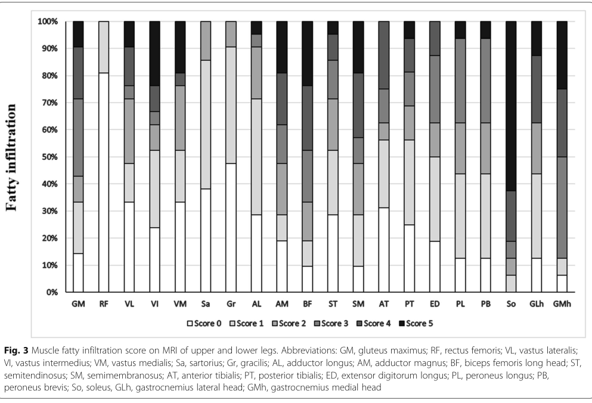

## Question

# Disease Characteristics Research Template

## Target Disease
- **Disease Name:** Triglyceride Storage Disease Type 2
- **MONDO ID:**  (if available)
- **Category:** Mendelian

## Research Objectives

Please provide a comprehensive research report on **Triglyceride Storage Disease Type 2** covering all of the
disease characteristics listed below. This report will be used to populate a disease knowledge
base entry. Be thorough and cite primary literature (PMID preferred) for all claims.

For each section, **suggested databases/resources** are listed. These are the first places
you should search for information on each topic.

---

### 1. Disease Information
> **Search first:** OMIM, Orphanet, ICD-10/ICD-11, MeSH, PubMed

- What is the disease? Provide a concise overview.
- What are the key identifiers? (OMIM, Orphanet, ICD-10/ICD-11, MeSH, Mondo)
- What are the common synonyms and alternative names?
- Is the information derived from individual patients (e.g., EHR) or aggregated disease-level resources?

### 2. Etiology

- **Disease Causal Factors**: What are the primary causes? (genetic, environmental, infectious, mechanistic)
- **Risk Factors**:
  > **Search first:** PubMed, Cochrane Library, UpToDate, clinical guidelines, ClinVar, ClinGen, GWAS Catalog, PheGenI, CTD, CDC, WHO, epidemiological databases
  - Genetic risk factors (causal variants, susceptibility loci, modifier genes)
  - Environmental risk factors (toxins, lifestyle, occupational exposures, age, sex, family history)
- **Protective Factors**:
  > **Search first:** PubMed, Cochrane Library, clinical trial databases, GWAS Catalog, gnomAD, WHO, CDC, nutrition databases
  - Genetic protective factors (protective variants, modifier alleles)
  - Environmental protective factors (diet, lifestyle, exposures that reduce risk)
- **Gene-Environment Interactions**: How do genetic and environmental factors interact to influence disease?
  > **Search first:** CTD, PubMed, PheGenI, GxE databases

### 3. Phenotypes
> **Search first:** HPO (Human Phenotype Ontology), OMIM, Orphanet, PubMed, clinicaltrials.gov, MedDRA, SNOMED CT, DECIPHER, LOINC

For each phenotype, provide:
- **Phenotype type**: symptoms, clinical signs, physical manifestations, behavioral changes, or laboratory abnormalities
  > For symptoms/signs: HPO, OMIM, Orphanet, PubMed
  > For behavioral changes: HPO, DSM, RDoC (Research Domain Criteria), PubMed
  > For laboratory abnormalities: LOINC, SNOMED CT, LabTests Online, PubMed
- **Phenotype characteristics**:
  > **Search first:** OMIM, Orphanet, HPO, PubMed
  - Age of symptom onset (neonatal, childhood, adult-onset, late-onset)
  - Symptom severity (mild, moderate, severe, variable)
  - Symptom progression (stable, progressive, episodic, fluctuating)
  - Frequency among affected individuals (percentage or qualitative)
- **Quality of life impact**: Effects on daily functioning and well-being (per-phenotype when possible)
  > **Search first:** EQ-5D database, SF-36, WHO QOL databases, PubMed
- Suggest HPO (Human Phenotype Ontology) terms for each phenotype

### 4. Genetic/Molecular Information

- **Causal Genes**: Gene mutations or chromosomal abnormalities responsible for disease (gene symbols, OMIM IDs)
  > **Search first:** OMIM, ClinVar, HGMD, Ensembl, NCBI Gene
- **Pathogenic Variants**:
  - Affected genes (gene symbols, HGNC IDs)
    > **Search first:** OMIM, NCBI Gene, Ensembl, HGNC, UniProt, GeneCards
  - Variant classification (pathogenic, likely pathogenic, VUS per ACMG/AMP guidelines)
    > **Search first:** ClinVar, ClinGen, ACMG/AMP guidelines, VarSome
  - Variant type/class (missense, frameshift, nonsense, splice-site, structural)
  - Allele frequency in population databases
    > **Search first:** gnomAD, 1000 Genomes, ExAC, TOPMed, dbSNP
  - Somatic vs germline origin
    > **Search first:** COSMIC (somatic), ClinVar, ICGC, TCGA
  - Functional consequences (loss of function, gain of function, dominant negative)
- **Modifier Genes**: Genes that modify disease severity or expression
- **Epigenetic Information**: DNA methylation, histone modifications, chromatin changes affecting disease
  > **Search first:** ENCODE, Roadmap Epigenomics, MethBase, DiseaseMeth
- **Chromosomal Abnormalities**: Large-scale genetic changes (aneuploidy, translocations, inversions)
  > **Search first:** DECIPHER, ClinVar, ECARUCA, UCSC Genome Browser

### 5. Environmental Information

- **Environmental Factors**: Non-genetic contributing factors (toxins, radiation, pollution, occupational exposure)
  > **Search first:** CTD (Comparative Toxicogenomics Database), TOXNET, PubMed, EPA databases
- **Lifestyle Factors**: Behavioral factors (smoking, diet, exercise, alcohol consumption)
  > **Search first:** CDC databases, WHO, PubMed, NHANES
- **Infectious Agents**: If applicable, pathogens causing or triggering disease (bacteria, viruses, fungi, parasites)
  > **Search first:** NCBI Taxonomy, ViPR, BV-BRC, MicrobeDB, GIDEON

### 6. Mechanism / Pathophysiology

- **Molecular Pathways**: Specific signaling cascades or biochemical pathways involved (Wnt, MAPK, mTOR, PI3K-AKT, etc.)
  > **Search first:** KEGG, Reactome, WikiPathways, PathBank, BioCyc
- **Cellular Processes**: Cell-level mechanisms (apoptosis, autophagy, cell cycle dysregulation, inflammation, etc.)
  > **Search first:** Gene Ontology (GO), Reactome, KEGG, PubMed
- **Protein Dysfunction**: How protein structure or function is altered (misfolding, aggregation, loss of function, gain of function)
  > **Search first:** UniProt, PDB (Protein Data Bank), InterPro, Pfam, AlphaFold
- **Metabolic Changes**: Alterations in metabolic processes (energy metabolism, lipid metabolism, amino acid metabolism)
  > **Search first:** KEGG, BioCyc, HMDB (Human Metabolome Database), BRENDA
- **Immune System Involvement**: Role of immune response (autoimmunity, immunodeficiency, chronic inflammation)
  > **Search first:** ImmPort, Immunome Database, IEDB, Gene Ontology
- **Tissue Damage Mechanisms**: How tissues/ are injured (oxidative stress, ischemia, fibrosis, necrosis)
  > **Search first:** PubMed, Gene Ontology, Reactome
- **Biochemical Abnormalities**: Specific molecular defects (enzyme deficiencies, receptor dysfunction, ion channel defects)
  > **Search first:** BRENDA, UniProt, KEGG, OMIM, PubMed
- **Epigenetic Changes**: DNA methylation, histone modifications affecting gene expression in disease
  > **Search first:** ENCODE, Roadmap Epigenomics, MethBase, DiseaseMeth
- **Molecular Profiling** (if available):
  - Transcriptomics/gene expression changes
    > **Search first:** GEO (Gene Expression Omnibus), ArrayExpress, GTEx, Human Cell Atlas, SRA
  - Proteomics findings
    > **Search first:** PRIDE, ProteomeXchange, Human Protein Atlas, STRING, BioGRID
  - Metabolomics signatures
    > **Search first:** MetaboLights, Metabolomics Workbench, HMDB, METLIN
  - Lipidomics alterations
    > **Search first:** LIPID MAPS, SwissLipids, LipidHome, Metabolomics Workbench
  - Genomic structural features
    > **Search first:** UCSC Genome Browser, Ensembl, NCBI, dbVar, DGV
- **Advanced Technologies** (if applicable):
  - Single-cell analysis findings (cell-type specific mechanisms, cellular heterogeneity)
    > **Search first:** Human Cell Atlas, Single Cell Portal, GEO, CELLxGENE
  - Spatial transcriptomics findings
    > **Search first:** GEO, Spatial Research, Vizgen, 10x Genomics data
  - Multi-omics integration results
    > **Search first:** TCGA, ICGC, cBioPortal, LinkedOmics, PubMed
  - Functional genomics screens (CRISPR, RNAi)
    > **Search first:** DepMap, GenomeRNAi, PubMed, BioGRID ORCS

For each mechanism, describe:
- The causal chain from initial trigger to clinical manifestation
- Which mechanisms are upstream vs downstream
- What cell types and biological processes are involved
- Suggest GO terms for biological processes and CL terms for cell types

### 7. Anatomical Structures Affected

- **Organ Level**:
  - Primary organs directly affected
  - Secondary organ involvement (complications, secondary effects)
  - Body systems involved (cardiovascular, nervous, digestive, respiratory, endocrine, etc.)
  > **Search first:** Uberon, FMA (Foundational Model of Anatomy), OMIM, HPO, ICD-11, MeSH, SNOMED CT
- **Tissue and Cell Level**:
  - Specific tissue types affected (epithelial, connective, muscle, nervous)
  - Specific cell populations targeted (with Cell Ontology terms)
  > **Search first:** Uberon, Human Protein Atlas, Cell Ontology, Human Cell Atlas, CellMarker, PanglaoDB
- **Subcellular Level**:
  - Cellular compartments involved (mitochondria, nucleus, ER, lysosomes) (with GO Cellular Component terms)
  > **Search first:** Gene Ontology (Cellular Component), UniProt, Human Protein Atlas
- **Localization**:
  - Specific anatomical sites (with UBERON terms)
    > **Search first:** FMA, Uberon, NeuroNames (for brain), SNOMED CT
  - Lateralization (unilateral, bilateral, asymmetric)
    > **Search first:** HPO, clinical literature, imaging databases

### 8. Temporal Development

- **Onset**:
  - Typical age of onset (congenital, pediatric, adult, geriatric)
  - Onset pattern (acute, subacute, chronic, insidious)
  > **Search first:** OMIM, Orphanet, HPO, PubMed
- **Progression**:
  - Disease stages (early, intermediate, advanced, end-stage)
    > **Search first:** Cancer Staging Manual (AJCC), WHO classifications, PubMed
  - Progression rate (rapid, slow, variable)
  - Disease course pattern (episodic, relapsing-remitting, progressive, stable)
  - Disease duration (self-limited, chronic lifelong)
  > **Search first:** Disease registries, longitudinal cohort databases, natural history studies, PubMed, Orphanet, OMIM
- **Patterns**:
  - Remission patterns (spontaneous, treatment-induced)
    > **Search first:** Clinical trial databases, disease registries, PubMed
  - Critical periods (time windows of vulnerability or opportunity for intervention)
    > **Search first:** PubMed, developmental biology databases, clinical guidelines

### 9. Inheritance and Population

- **Epidemiology**:
  - Prevalence (cases per 100,000 at given time)
  - Incidence (new cases per 100,000 per year)
  > **Search first:** Orphanet, CDC, WHO, GBD (Global Burden of Disease), national registries, SEER, disease registries
- **For Genetic Etiology**:
  - Inheritance pattern (AD, AR, X-linked, mitochondrial, multifactorial, polygenic)
    > **Search first:** OMIM, Orphanet, ClinVar, GTR (Genetic Testing Registry)
  - Penetrance (complete, incomplete, age-dependent)
    > **Search first:** ClinVar, OMIM, PubMed, ClinGen
  - Expressivity (variable, consistent)
    > **Search first:** OMIM, ClinVar, PubMed
  - Genetic anticipation (increasing severity in successive generations)
    > **Search first:** OMIM, PubMed (especially for repeat expansion disorders)
  - Germline mosaicism
    > **Search first:** ClinVar, OMIM, genetic counseling literature, PubMed
  - Founder effects (population-specific mutations)
    > **Search first:** gnomAD, population genetics databases, PubMed
  - Consanguinity role
    > **Search first:** OMIM, population studies, genetic counseling resources
  - Carrier frequency
    > **Search first:** gnomAD, carrier screening databases, GeneReviews, GTR
- **Population Demographics**:
  - Affected populations (ethnic or demographic groups with higher prevalence)
    > **Search first:** gnomAD, 1000 Genomes, PAGE Study, PubMed, population registries
  - Geographic distribution (endemic areas, regional variation)
    > **Search first:** WHO, CDC, GBD, Orphanet, geographic epidemiology databases
  - Geographic distribution of specific variants
  - Sex ratio (male:female)
    > **Search first:** Disease registries, OMIM, PubMed, epidemiological databases
  - Age distribution of affected individuals
    > **Search first:** CDC, disease registries, SEER, Orphanet

### 10. Diagnostics

- **Clinical Tests**:
  - Laboratory tests (blood, urine, tissue chemistry, specific enzyme assays)
    > **Search first:** LOINC, LabTests Online, PubMed
  - Biomarkers (proteins, metabolites, genetic markers, circulating biomarkers)
    > **Search first:** FDA Biomarker List, BEST (Biomarkers, EndpointS, and other Tools), PubMed
  - Imaging studies (X-ray, CT, MRI, PET, ultrasound)
    > **Search first:** RadLex, DICOM, Radiopaedia, imaging databases
  - Functional tests (pulmonary function, cardiac stress tests)
    > **Search first:** LOINC, clinical guidelines, PubMed
  - Electrophysiology (EEG, EMG, ECG, nerve conduction studies)
    > **Search first:** LOINC, clinical neurophysiology databases, PubMed
  - Biopsy findings (histopathology, immunohistochemistry)
    > **Search first:** SNOMED CT, College of American Pathologists resources, PubMed
  - Pathology findings (microscopic examination)
    > **Search first:** SNOMED CT, Digital Pathology databases, PubMed
- **Genetic Testing**:
  > **Search first:** GTR (Genetic Testing Registry), GeneReviews, ClinGen
  - Overview of recommended genetic testing approach
  - Whole genome sequencing (WGS) utility
    > **Search first:** GTR, ClinVar, GEL (Genomics England), gnomAD
  - Whole exome sequencing (WES) utility
    > **Search first:** GTR, ClinVar, OMIM, GeneMatcher
  - Gene panels (which panels, which genes)
    > **Search first:** GTR, ClinVar, laboratory-specific databases
  - Single gene testing
    > **Search first:** GTR, ClinVar, OMIM, GeneReviews
  - Chromosomal microarray (CMA)
    > **Search first:** DECIPHER, ClinVar, dbVar, ECARUCA
  - Karyotyping
    > **Search first:** Chromosome Abnormality Database, ClinVar, cytogenetics resources
  - FISH
    > **Search first:** ClinVar, cytogenetics databases, PubMed
  - Mitochondrial DNA testing
    > **Search first:** MITOMAP, MSeqDR, ClinVar, GTR
  - Repeat expansion testing
    > **Search first:** GTR, ClinVar, repeat expansion databases, PubMed
- **Omics-Based Diagnostics** (if applicable):
  - RNA sequencing / transcriptomics
    > **Search first:** GEO, ArrayExpress, GTEx, RNA-seq databases
  - Proteomics
    > **Search first:** PRIDE, ProteomeXchange, FDA Biomarker database
  - Metabolomics
    > **Search first:** MetaboLights, Metabolomics Workbench, HMDB
  - Epigenomics
    > **Search first:** GEO, ENCODE, Roadmap Epigenomics, MethBase
  - Liquid biopsy
    > **Search first:** COSMIC, ClinVar, liquid biopsy databases, PubMed
- **Clinical Criteria**:
  - Standardized diagnostic criteria (DSM, ICD, society guidelines)
    > **Search first:** DSM-5, ICD-11, clinical society guidelines, UpToDate
  - Differential diagnosis (other conditions to rule out, with distinguishing features)
    > **Search first:** DynaMed, UpToDate, clinical decision support systems
- **Screening**:
  - Screening methods for asymptomatic individuals (newborn screening, carrier screening, cascade screening)
    > **Search first:** ACMG recommendations, CDC newborn screening, GTR

### 11. Outcome/Prognosis

- **Survival and Mortality**:
  - Survival rate (5-year, 10-year, overall)
    > **Search first:** SEER, cancer registries, disease-specific registries, PubMed
  - Life expectancy (with and without treatment if applicable)
    > **Search first:** Orphanet, disease registries, actuarial databases, PubMed
  - Mortality rate
    > **Search first:** CDC, WHO, GBD, national mortality databases
  - Disease-specific mortality (deaths directly attributable to disease)
    > **Search first:** Disease registries, CDC Wonder, GBD, PubMed
- **Morbidity and Function**:
  - Morbidity (disease-related disability and health impacts)
    > **Search first:** GBD, WHO, disability databases, PubMed
  - Disability outcomes (long-term functional impairments)
    > **Search first:** ICF (International Classification of Functioning), disability registries
  - Quality of life measures (EQ-5D, SF-36, PROMIS, disease-specific tools)
    > **Search first:** EQ-5D database, SF-36, PROMIS, PubMed
- **Disease Course**:
  - Complications (secondary problems: infections, organ failure, etc.)
    > **Search first:** ICD codes, disease registries, clinical databases, PubMed
  - Recovery potential (likelihood and extent of recovery, with vs without treatment)
    > **Search first:** Natural history studies, rehabilitation databases, PubMed
- **Prediction**:
  - Prognostic factors (age, disease severity, biomarkers, treatment response)
    > **Search first:** Prognostic models databases, clinical calculators, PubMed
  - Prognostic biomarkers (molecular markers predicting disease course)
    > **Search first:** FDA Biomarker database, PubMed, cancer prognostic databases

### 12. Treatment

- **Pharmacotherapy**:
  - Pharmacological treatments (drug names, drug classes, mechanisms of action)
    > **Search first:** DrugBank, RxNorm, ATC classification, DailyMed, FDA databases
  - Pharmacogenomics (how genetic variants affect drug metabolism, efficacy, toxicity)
    > **Search first:** PharmGKB, CPIC (Clinical Pharmacogenetics), FDA Table of PGx Biomarkers
- **Advanced Therapeutics**:
  - Gene therapy (viral vectors, CRISPR, gene replacement, gene editing)
    > **Search first:** ClinicalTrials.gov, FDA gene therapy database, ASGCT resources
  - Cell therapy (stem cell transplant, CAR-T, cellular therapeutics)
    > **Search first:** ClinicalTrials.gov, FDA cell therapy database, FACT standards
  - RNA-based therapies (ASOs, siRNA, mRNA therapies)
    > **Search first:** ClinicalTrials.gov, FDA approvals, PubMed
  - Targeted therapies (treatments directed at specific molecular targets)
    > **Search first:** My Cancer Genome, OncoKB, ClinicalTrials.gov, FDA approvals
  - Immunotherapies (checkpoint inhibitors, monoclonal antibodies)
    > **Search first:** Cancer Immunotherapy Database, FDA approvals, ClinicalTrials.gov
- **Surgical and Interventional**:
  - Surgical interventions (types of surgery, timing, outcomes)
    > **Search first:** CPT codes, surgical registries, clinical guidelines, PubMed
- **Supportive and Rehabilitative**:
  - Supportive care (symptom management, pain control, nutrition)
    > **Search first:** Clinical guidelines, Cochrane Library, PubMed
  - Rehabilitation (physical therapy, occupational therapy, speech therapy)
    > **Search first:** Rehabilitation medicine databases, clinical guidelines, PubMed
- **Experimental**:
  - Experimental treatments in clinical trials (with NCT identifiers if available)
    > **Search first:** ClinicalTrials.gov, EU Clinical Trials Register, WHO ICTRP
- **Treatment Outcomes**:
  - Treatment response rates
    > **Search first:** Clinical trial databases, FDA reviews, systematic reviews, PubMed
  - Side effects and adverse events
    > **Search first:** FDA Adverse Event Reporting System (FAERS), MedWatch, PubMed
- **Treatment Strategy**:
  - Treatment algorithms (clinical pathways, decision trees)
    > **Search first:** Clinical practice guidelines, NCCN Guidelines, UpToDate
  - Combination therapies
    > **Search first:** ClinicalTrials.gov, treatment guidelines, PubMed
  - Personalized medicine approaches (genotype-guided treatment)
    > **Search first:** My Cancer Genome, CIViC, PharmGKB, precision medicine databases

For each treatment, suggest MAXO (Medical Action Ontology) terms where applicable.

### 13. Prevention

- **Prevention Levels**:
  - Primary prevention (preventing disease occurrence: vaccination, risk factor modification)
    > **Search first:** CDC, WHO, USPSTF recommendations, Cochrane Library
  - Secondary prevention (early detection and treatment: screening programs, early intervention)
    > **Search first:** USPSTF, CDC screening guidelines, WHO
  - Tertiary prevention (preventing complications in those with disease)
    > **Search first:** Clinical guidelines, disease management protocols, PubMed
- **Immunization**: Vaccine strategies (if applicable)
  > **Search first:** CDC vaccine schedules, WHO immunization, FDA vaccine database
- **Screening and Early Detection**:
  - Screening programs (population-based: newborn screening, cancer screening)
    > **Search first:** CDC screening programs, USPSTF, cancer screening databases
  - Genetic screening (carrier screening, preimplantation genetic diagnosis, prenatal testing)
    > **Search first:** ACMG recommendations, ACOG guidelines, GTR
  - Risk stratification (identifying high-risk individuals for targeted prevention)
    > **Search first:** Risk prediction models, clinical calculators, PubMed
- **Behavioral Interventions**: Lifestyle modifications to reduce risk
  > **Search first:** CDC, WHO, behavioral intervention databases, Cochrane Library
- **Counseling**: Genetic counseling (risk assessment, family planning guidance)
  > **Search first:** NSGC resources, ACMG guidelines, GeneReviews
- **Public Health**:
  - Public health interventions (sanitation, vector control, health education)
    > **Search first:** CDC, WHO, public health databases, PubMed
  - Environmental interventions (reducing environmental risk factors)
    > **Search first:** EPA databases, WHO environmental health, PubMed
- **Prophylaxis**: Preventive medications or procedures
  > **Search first:** Clinical guidelines, FDA approvals, PubMed

### 14. Other Species / Natural Disease

- **Taxonomy**: Species affected (with NCBI Taxon identifiers)
  > **Search first:** NCBI Taxonomy
- **Breed**: Specific breeds affected (with VBO identifiers if applicable)
  > **Search first:** VBO (Vertebrate Breed Ontology)
- **Gene**: Orthologous genes in other species (with NCBI Gene IDs)
  > **Search first:** NCBI Gene
- **Natural Disease**:
  - Naturally occurring disease in other species (companion animals, wildlife)
    > **Search first:** OMIA (Online Mendelian Inheritance in Animals), VetCompass, PubMed
  - Veterinary relevance and importance in animal health
    > **Search first:** OMIA, veterinary databases, PubMed
- **Comparative Biology**:
  - Comparative pathology (similarities and differences across species)
    > **Search first:** OMIA, comparative pathology databases, PubMed
  - Evolutionary conservation of disease mechanisms
    > **Search first:** HomoloGene, OrthoMCL, Alliance of Genome Resources
- **Transmission** (if applicable):
  - Zoonotic potential
    > **Search first:** CDC zoonotic diseases, WHO zoonoses, GIDEON
  - Cross-species susceptibility
    > **Search first:** NCBI Taxonomy, veterinary databases, PubMed

### 15. Model Organisms

- **Model Types**:
  - Model organism type (mammalian, invertebrate, cellular, in vitro)
    > **Search first:** Alliance of Genome Resources, model organism databases
  - Specific model systems (mouse, rat, zebrafish, Drosophila, C. elegans, yeast, cell lines, organoids, iPSCs)
    > **Search first:** MGI, RGD, ZFIN, FlyBase, WormBase, SGD, ATCC, Cellosaurus
  - Induced models (drug treatment, surgical intervention, environmental manipulation)
    > **Search first:** MGI, model organism databases, PubMed
- **Genetic Models**:
  - Types available (knockout, knock-in, transgenic, conditional, humanized)
    > **Search first:** MGI, IMPC, KOMP, EuMMCR, IMSR
- **Model Characteristics**:
  - Phenotype recapitulation (how well model reproduces human disease features)
    > **Search first:** Model organism databases, comparative studies, PubMed
  - Model limitations (aspects of human disease not captured)
    > **Search first:** Model organism databases, PubMed, review articles
- **Applications**:
  - Research applications (what aspects of disease can be studied)
    > **Search first:** Model organism databases, PubMed
- **Resources**:
  - Model databases
    > **Search first:** MGI, RGD, ZFIN, FlyBase, WormBase, IMSR, EMMA, MMRRC

---

## Citation Requirements

- Cite primary literature (PMID preferred) for all mechanistic and clinical claims
- Prioritize recent reviews and landmark papers
- Include direct quotes from abstracts where possible to support key statements
- Distinguish evidence source types: human clinical, model organism, in vitro, computational

## Output Format

Structure your response as a comprehensive narrative organized by the sections above.
For each section, provide:
- Factual content with specific details (numbers, percentages, gene names, variant nomenclature)
- Ontology term suggestions (HPO, GO, CL, UBERON, CHEBI, MAXO, MONDO) where applicable
- Evidence citations with PMIDs
- Direct quotes from abstracts to support key claims
- Clear indication when information is not available or not applicable for this disease

This report will be used to populate a disease knowledge base entry with:
- Pathophysiology descriptions with causal chains
- Gene/protein annotations (HGNC, GO terms)
- Phenotype associations (HP terms) with frequencies
- Cell type involvement (CL terms)
- Anatomical locations (UBERON terms)
- Chemical entities (CHEBI terms)
- Treatment annotations (MAXO terms)
- Evidence items with PMIDs and exact abstract quotes
- Epidemiology, prognosis, diagnostic, and prevention information
- Animal model descriptions with phenotype recapitulation details

## Output

Question: You are an expert researcher providing comprehensive, well-cited information.

Provide detailed information focusing on:
1. Key concepts and definitions with current understanding
2. Recent developments and latest research (prioritize 2023-2024 sources)
3. Current applications and real-world implementations
4. Expert opinions and analysis from authoritative sources
5. Relevant statistics and data from recent studies

Format as a comprehensive research report with proper citations. Include URLs and publication dates where available.
Always prioritize recent, authoritative sources and provide specific citations for all major claims.

# Disease Characteristics Research Template

## Target Disease
- **Disease Name:** Triglyceride Storage Disease Type 2
- **MONDO ID:**  (if available)
- **Category:** Mendelian

## Research Objectives

Please provide a comprehensive research report on **Triglyceride Storage Disease Type 2** covering all of the
disease characteristics listed below. This report will be used to populate a disease knowledge
base entry. Be thorough and cite primary literature (PMID preferred) for all claims.

For each section, **suggested databases/resources** are listed. These are the first places
you should search for information on each topic.

---

### 1. Disease Information
> **Search first:** OMIM, Orphanet, ICD-10/ICD-11, MeSH, PubMed

- What is the disease? Provide a concise overview.
- What are the key identifiers? (OMIM, Orphanet, ICD-10/ICD-11, MeSH, Mondo)
- What are the common synonyms and alternative names?
- Is the information derived from individual patients (e.g., EHR) or aggregated disease-level resources?

### 2. Etiology

- **Disease Causal Factors**: What are the primary causes? (genetic, environmental, infectious, mechanistic)
- **Risk Factors**:
  > **Search first:** PubMed, Cochrane Library, UpToDate, clinical guidelines, ClinVar, ClinGen, GWAS Catalog, PheGenI, CTD, CDC, WHO, epidemiological databases
  - Genetic risk factors (causal variants, susceptibility loci, modifier genes)
  - Environmental risk factors (toxins, lifestyle, occupational exposures, age, sex, family history)
- **Protective Factors**:
  > **Search first:** PubMed, Cochrane Library, clinical trial databases, GWAS Catalog, gnomAD, WHO, CDC, nutrition databases
  - Genetic protective factors (protective variants, modifier alleles)
  - Environmental protective factors (diet, lifestyle, exposures that reduce risk)
- **Gene-Environment Interactions**: How do genetic and environmental factors interact to influence disease?
  > **Search first:** CTD, PubMed, PheGenI, GxE databases

### 3. Phenotypes
> **Search first:** HPO (Human Phenotype Ontology), OMIM, Orphanet, PubMed, clinicaltrials.gov, MedDRA, SNOMED CT, DECIPHER, LOINC

For each phenotype, provide:
- **Phenotype type**: symptoms, clinical signs, physical manifestations, behavioral changes, or laboratory abnormalities
  > For symptoms/signs: HPO, OMIM, Orphanet, PubMed
  > For behavioral changes: HPO, DSM, RDoC (Research Domain Criteria), PubMed
  > For laboratory abnormalities: LOINC, SNOMED CT, LabTests Online, PubMed
- **Phenotype characteristics**:
  > **Search first:** OMIM, Orphanet, HPO, PubMed
  - Age of symptom onset (neonatal, childhood, adult-onset, late-onset)
  - Symptom severity (mild, moderate, severe, variable)
  - Symptom progression (stable, progressive, episodic, fluctuating)
  - Frequency among affected individuals (percentage or qualitative)
- **Quality of life impact**: Effects on daily functioning and well-being (per-phenotype when possible)
  > **Search first:** EQ-5D database, SF-36, WHO QOL databases, PubMed
- Suggest HPO (Human Phenotype Ontology) terms for each phenotype

### 4. Genetic/Molecular Information

- **Causal Genes**: Gene mutations or chromosomal abnormalities responsible for disease (gene symbols, OMIM IDs)
  > **Search first:** OMIM, ClinVar, HGMD, Ensembl, NCBI Gene
- **Pathogenic Variants**:
  - Affected genes (gene symbols, HGNC IDs)
    > **Search first:** OMIM, NCBI Gene, Ensembl, HGNC, UniProt, GeneCards
  - Variant classification (pathogenic, likely pathogenic, VUS per ACMG/AMP guidelines)
    > **Search first:** ClinVar, ClinGen, ACMG/AMP guidelines, VarSome
  - Variant type/class (missense, frameshift, nonsense, splice-site, structural)
  - Allele frequency in population databases
    > **Search first:** gnomAD, 1000 Genomes, ExAC, TOPMed, dbSNP
  - Somatic vs germline origin
    > **Search first:** COSMIC (somatic), ClinVar, ICGC, TCGA
  - Functional consequences (loss of function, gain of function, dominant negative)
- **Modifier Genes**: Genes that modify disease severity or expression
- **Epigenetic Information**: DNA methylation, histone modifications, chromatin changes affecting disease
  > **Search first:** ENCODE, Roadmap Epigenomics, MethBase, DiseaseMeth
- **Chromosomal Abnormalities**: Large-scale genetic changes (aneuploidy, translocations, inversions)
  > **Search first:** DECIPHER, ClinVar, ECARUCA, UCSC Genome Browser

### 5. Environmental Information

- **Environmental Factors**: Non-genetic contributing factors (toxins, radiation, pollution, occupational exposure)
  > **Search first:** CTD (Comparative Toxicogenomics Database), TOXNET, PubMed, EPA databases
- **Lifestyle Factors**: Behavioral factors (smoking, diet, exercise, alcohol consumption)
  > **Search first:** CDC databases, WHO, PubMed, NHANES
- **Infectious Agents**: If applicable, pathogens causing or triggering disease (bacteria, viruses, fungi, parasites)
  > **Search first:** NCBI Taxonomy, ViPR, BV-BRC, MicrobeDB, GIDEON

### 6. Mechanism / Pathophysiology

- **Molecular Pathways**: Specific signaling cascades or biochemical pathways involved (Wnt, MAPK, mTOR, PI3K-AKT, etc.)
  > **Search first:** KEGG, Reactome, WikiPathways, PathBank, BioCyc
- **Cellular Processes**: Cell-level mechanisms (apoptosis, autophagy, cell cycle dysregulation, inflammation, etc.)
  > **Search first:** Gene Ontology (GO), Reactome, KEGG, PubMed
- **Protein Dysfunction**: How protein structure or function is altered (misfolding, aggregation, loss of function, gain of function)
  > **Search first:** UniProt, PDB (Protein Data Bank), InterPro, Pfam, AlphaFold
- **Metabolic Changes**: Alterations in metabolic processes (energy metabolism, lipid metabolism, amino acid metabolism)
  > **Search first:** KEGG, BioCyc, HMDB (Human Metabolome Database), BRENDA
- **Immune System Involvement**: Role of immune response (autoimmunity, immunodeficiency, chronic inflammation)
  > **Search first:** ImmPort, Immunome Database, IEDB, Gene Ontology
- **Tissue Damage Mechanisms**: How tissues/ are injured (oxidative stress, ischemia, fibrosis, necrosis)
  > **Search first:** PubMed, Gene Ontology, Reactome
- **Biochemical Abnormalities**: Specific molecular defects (enzyme deficiencies, receptor dysfunction, ion channel defects)
  > **Search first:** BRENDA, UniProt, KEGG, OMIM, PubMed
- **Epigenetic Changes**: DNA methylation, histone modifications affecting gene expression in disease
  > **Search first:** ENCODE, Roadmap Epigenomics, MethBase, DiseaseMeth
- **Molecular Profiling** (if available):
  - Transcriptomics/gene expression changes
    > **Search first:** GEO (Gene Expression Omnibus), ArrayExpress, GTEx, Human Cell Atlas, SRA
  - Proteomics findings
    > **Search first:** PRIDE, ProteomeXchange, Human Protein Atlas, STRING, BioGRID
  - Metabolomics signatures
    > **Search first:** MetaboLights, Metabolomics Workbench, HMDB, METLIN
  - Lipidomics alterations
    > **Search first:** LIPID MAPS, SwissLipids, LipidHome, Metabolomics Workbench
  - Genomic structural features
    > **Search first:** UCSC Genome Browser, Ensembl, NCBI, dbVar, DGV
- **Advanced Technologies** (if applicable):
  - Single-cell analysis findings (cell-type specific mechanisms, cellular heterogeneity)
    > **Search first:** Human Cell Atlas, Single Cell Portal, GEO, CELLxGENE
  - Spatial transcriptomics findings
    > **Search first:** GEO, Spatial Research, Vizgen, 10x Genomics data
  - Multi-omics integration results
    > **Search first:** TCGA, ICGC, cBioPortal, LinkedOmics, PubMed
  - Functional genomics screens (CRISPR, RNAi)
    > **Search first:** DepMap, GenomeRNAi, PubMed, BioGRID ORCS

For each mechanism, describe:
- The causal chain from initial trigger to clinical manifestation
- Which mechanisms are upstream vs downstream
- What cell types and biological processes are involved
- Suggest GO terms for biological processes and CL terms for cell types

### 7. Anatomical Structures Affected

- **Organ Level**:
  - Primary organs directly affected
  - Secondary organ involvement (complications, secondary effects)
  - Body systems involved (cardiovascular, nervous, digestive, respiratory, endocrine, etc.)
  > **Search first:** Uberon, FMA (Foundational Model of Anatomy), OMIM, HPO, ICD-11, MeSH, SNOMED CT
- **Tissue and Cell Level**:
  - Specific tissue types affected (epithelial, connective, muscle, nervous)
  - Specific cell populations targeted (with Cell Ontology terms)
  > **Search first:** Uberon, Human Protein Atlas, Cell Ontology, Human Cell Atlas, CellMarker, PanglaoDB
- **Subcellular Level**:
  - Cellular compartments involved (mitochondria, nucleus, ER, lysosomes) (with GO Cellular Component terms)
  > **Search first:** Gene Ontology (Cellular Component), UniProt, Human Protein Atlas
- **Localization**:
  - Specific anatomical sites (with UBERON terms)
    > **Search first:** FMA, Uberon, NeuroNames (for brain), SNOMED CT
  - Lateralization (unilateral, bilateral, asymmetric)
    > **Search first:** HPO, clinical literature, imaging databases

### 8. Temporal Development

- **Onset**:
  - Typical age of onset (congenital, pediatric, adult, geriatric)
  - Onset pattern (acute, subacute, chronic, insidious)
  > **Search first:** OMIM, Orphanet, HPO, PubMed
- **Progression**:
  - Disease stages (early, intermediate, advanced, end-stage)
    > **Search first:** Cancer Staging Manual (AJCC), WHO classifications, PubMed
  - Progression rate (rapid, slow, variable)
  - Disease course pattern (episodic, relapsing-remitting, progressive, stable)
  - Disease duration (self-limited, chronic lifelong)
  > **Search first:** Disease registries, longitudinal cohort databases, natural history studies, PubMed, Orphanet, OMIM
- **Patterns**:
  - Remission patterns (spontaneous, treatment-induced)
    > **Search first:** Clinical trial databases, disease registries, PubMed
  - Critical periods (time windows of vulnerability or opportunity for intervention)
    > **Search first:** PubMed, developmental biology databases, clinical guidelines

### 9. Inheritance and Population

- **Epidemiology**:
  - Prevalence (cases per 100,000 at given time)
  - Incidence (new cases per 100,000 per year)
  > **Search first:** Orphanet, CDC, WHO, GBD (Global Burden of Disease), national registries, SEER, disease registries
- **For Genetic Etiology**:
  - Inheritance pattern (AD, AR, X-linked, mitochondrial, multifactorial, polygenic)
    > **Search first:** OMIM, Orphanet, ClinVar, GTR (Genetic Testing Registry)
  - Penetrance (complete, incomplete, age-dependent)
    > **Search first:** ClinVar, OMIM, PubMed, ClinGen
  - Expressivity (variable, consistent)
    > **Search first:** OMIM, ClinVar, PubMed
  - Genetic anticipation (increasing severity in successive generations)
    > **Search first:** OMIM, PubMed (especially for repeat expansion disorders)
  - Germline mosaicism
    > **Search first:** ClinVar, OMIM, genetic counseling literature, PubMed
  - Founder effects (population-specific mutations)
    > **Search first:** gnomAD, population genetics databases, PubMed
  - Consanguinity role
    > **Search first:** OMIM, population studies, genetic counseling resources
  - Carrier frequency
    > **Search first:** gnomAD, carrier screening databases, GeneReviews, GTR
- **Population Demographics**:
  - Affected populations (ethnic or demographic groups with higher prevalence)
    > **Search first:** gnomAD, 1000 Genomes, PAGE Study, PubMed, population registries
  - Geographic distribution (endemic areas, regional variation)
    > **Search first:** WHO, CDC, GBD, Orphanet, geographic epidemiology databases
  - Geographic distribution of specific variants
  - Sex ratio (male:female)
    > **Search first:** Disease registries, OMIM, PubMed, epidemiological databases
  - Age distribution of affected individuals
    > **Search first:** CDC, disease registries, SEER, Orphanet

### 10. Diagnostics

- **Clinical Tests**:
  - Laboratory tests (blood, urine, tissue chemistry, specific enzyme assays)
    > **Search first:** LOINC, LabTests Online, PubMed
  - Biomarkers (proteins, metabolites, genetic markers, circulating biomarkers)
    > **Search first:** FDA Biomarker List, BEST (Biomarkers, EndpointS, and other Tools), PubMed
  - Imaging studies (X-ray, CT, MRI, PET, ultrasound)
    > **Search first:** RadLex, DICOM, Radiopaedia, imaging databases
  - Functional tests (pulmonary function, cardiac stress tests)
    > **Search first:** LOINC, clinical guidelines, PubMed
  - Electrophysiology (EEG, EMG, ECG, nerve conduction studies)
    > **Search first:** LOINC, clinical neurophysiology databases, PubMed
  - Biopsy findings (histopathology, immunohistochemistry)
    > **Search first:** SNOMED CT, College of American Pathologists resources, PubMed
  - Pathology findings (microscopic examination)
    > **Search first:** SNOMED CT, Digital Pathology databases, PubMed
- **Genetic Testing**:
  > **Search first:** GTR (Genetic Testing Registry), GeneReviews, ClinGen
  - Overview of recommended genetic testing approach
  - Whole genome sequencing (WGS) utility
    > **Search first:** GTR, ClinVar, GEL (Genomics England), gnomAD
  - Whole exome sequencing (WES) utility
    > **Search first:** GTR, ClinVar, OMIM, GeneMatcher
  - Gene panels (which panels, which genes)
    > **Search first:** GTR, ClinVar, laboratory-specific databases
  - Single gene testing
    > **Search first:** GTR, ClinVar, OMIM, GeneReviews
  - Chromosomal microarray (CMA)
    > **Search first:** DECIPHER, ClinVar, dbVar, ECARUCA
  - Karyotyping
    > **Search first:** Chromosome Abnormality Database, ClinVar, cytogenetics resources
  - FISH
    > **Search first:** ClinVar, cytogenetics databases, PubMed
  - Mitochondrial DNA testing
    > **Search first:** MITOMAP, MSeqDR, ClinVar, GTR
  - Repeat expansion testing
    > **Search first:** GTR, ClinVar, repeat expansion databases, PubMed
- **Omics-Based Diagnostics** (if applicable):
  - RNA sequencing / transcriptomics
    > **Search first:** GEO, ArrayExpress, GTEx, RNA-seq databases
  - Proteomics
    > **Search first:** PRIDE, ProteomeXchange, FDA Biomarker database
  - Metabolomics
    > **Search first:** MetaboLights, Metabolomics Workbench, HMDB
  - Epigenomics
    > **Search first:** GEO, ENCODE, Roadmap Epigenomics, MethBase
  - Liquid biopsy
    > **Search first:** COSMIC, ClinVar, liquid biopsy databases, PubMed
- **Clinical Criteria**:
  - Standardized diagnostic criteria (DSM, ICD, society guidelines)
    > **Search first:** DSM-5, ICD-11, clinical society guidelines, UpToDate
  - Differential diagnosis (other conditions to rule out, with distinguishing features)
    > **Search first:** DynaMed, UpToDate, clinical decision support systems
- **Screening**:
  - Screening methods for asymptomatic individuals (newborn screening, carrier screening, cascade screening)
    > **Search first:** ACMG recommendations, CDC newborn screening, GTR

### 11. Outcome/Prognosis

- **Survival and Mortality**:
  - Survival rate (5-year, 10-year, overall)
    > **Search first:** SEER, cancer registries, disease-specific registries, PubMed
  - Life expectancy (with and without treatment if applicable)
    > **Search first:** Orphanet, disease registries, actuarial databases, PubMed
  - Mortality rate
    > **Search first:** CDC, WHO, GBD, national mortality databases
  - Disease-specific mortality (deaths directly attributable to disease)
    > **Search first:** Disease registries, CDC Wonder, GBD, PubMed
- **Morbidity and Function**:
  - Morbidity (disease-related disability and health impacts)
    > **Search first:** GBD, WHO, disability databases, PubMed
  - Disability outcomes (long-term functional impairments)
    > **Search first:** ICF (International Classification of Functioning), disability registries
  - Quality of life measures (EQ-5D, SF-36, PROMIS, disease-specific tools)
    > **Search first:** EQ-5D database, SF-36, PROMIS, PubMed
- **Disease Course**:
  - Complications (secondary problems: infections, organ failure, etc.)
    > **Search first:** ICD codes, disease registries, clinical databases, PubMed
  - Recovery potential (likelihood and extent of recovery, with vs without treatment)
    > **Search first:** Natural history studies, rehabilitation databases, PubMed
- **Prediction**:
  - Prognostic factors (age, disease severity, biomarkers, treatment response)
    > **Search first:** Prognostic models databases, clinical calculators, PubMed
  - Prognostic biomarkers (molecular markers predicting disease course)
    > **Search first:** FDA Biomarker database, PubMed, cancer prognostic databases

### 12. Treatment

- **Pharmacotherapy**:
  - Pharmacological treatments (drug names, drug classes, mechanisms of action)
    > **Search first:** DrugBank, RxNorm, ATC classification, DailyMed, FDA databases
  - Pharmacogenomics (how genetic variants affect drug metabolism, efficacy, toxicity)
    > **Search first:** PharmGKB, CPIC (Clinical Pharmacogenetics), FDA Table of PGx Biomarkers
- **Advanced Therapeutics**:
  - Gene therapy (viral vectors, CRISPR, gene replacement, gene editing)
    > **Search first:** ClinicalTrials.gov, FDA gene therapy database, ASGCT resources
  - Cell therapy (stem cell transplant, CAR-T, cellular therapeutics)
    > **Search first:** ClinicalTrials.gov, FDA cell therapy database, FACT standards
  - RNA-based therapies (ASOs, siRNA, mRNA therapies)
    > **Search first:** ClinicalTrials.gov, FDA approvals, PubMed
  - Targeted therapies (treatments directed at specific molecular targets)
    > **Search first:** My Cancer Genome, OncoKB, ClinicalTrials.gov, FDA approvals
  - Immunotherapies (checkpoint inhibitors, monoclonal antibodies)
    > **Search first:** Cancer Immunotherapy Database, FDA approvals, ClinicalTrials.gov
- **Surgical and Interventional**:
  - Surgical interventions (types of surgery, timing, outcomes)
    > **Search first:** CPT codes, surgical registries, clinical guidelines, PubMed
- **Supportive and Rehabilitative**:
  - Supportive care (symptom management, pain control, nutrition)
    > **Search first:** Clinical guidelines, Cochrane Library, PubMed
  - Rehabilitation (physical therapy, occupational therapy, speech therapy)
    > **Search first:** Rehabilitation medicine databases, clinical guidelines, PubMed
- **Experimental**:
  - Experimental treatments in clinical trials (with NCT identifiers if available)
    > **Search first:** ClinicalTrials.gov, EU Clinical Trials Register, WHO ICTRP
- **Treatment Outcomes**:
  - Treatment response rates
    > **Search first:** Clinical trial databases, FDA reviews, systematic reviews, PubMed
  - Side effects and adverse events
    > **Search first:** FDA Adverse Event Reporting System (FAERS), MedWatch, PubMed
- **Treatment Strategy**:
  - Treatment algorithms (clinical pathways, decision trees)
    > **Search first:** Clinical practice guidelines, NCCN Guidelines, UpToDate
  - Combination therapies
    > **Search first:** ClinicalTrials.gov, treatment guidelines, PubMed
  - Personalized medicine approaches (genotype-guided treatment)
    > **Search first:** My Cancer Genome, CIViC, PharmGKB, precision medicine databases

For each treatment, suggest MAXO (Medical Action Ontology) terms where applicable.

### 13. Prevention

- **Prevention Levels**:
  - Primary prevention (preventing disease occurrence: vaccination, risk factor modification)
    > **Search first:** CDC, WHO, USPSTF recommendations, Cochrane Library
  - Secondary prevention (early detection and treatment: screening programs, early intervention)
    > **Search first:** USPSTF, CDC screening guidelines, WHO
  - Tertiary prevention (preventing complications in those with disease)
    > **Search first:** Clinical guidelines, disease management protocols, PubMed
- **Immunization**: Vaccine strategies (if applicable)
  > **Search first:** CDC vaccine schedules, WHO immunization, FDA vaccine database
- **Screening and Early Detection**:
  - Screening programs (population-based: newborn screening, cancer screening)
    > **Search first:** CDC screening programs, USPSTF, cancer screening databases
  - Genetic screening (carrier screening, preimplantation genetic diagnosis, prenatal testing)
    > **Search first:** ACMG recommendations, ACOG guidelines, GTR
  - Risk stratification (identifying high-risk individuals for targeted prevention)
    > **Search first:** Risk prediction models, clinical calculators, PubMed
- **Behavioral Interventions**: Lifestyle modifications to reduce risk
  > **Search first:** CDC, WHO, behavioral intervention databases, Cochrane Library
- **Counseling**: Genetic counseling (risk assessment, family planning guidance)
  > **Search first:** NSGC resources, ACMG guidelines, GeneReviews
- **Public Health**:
  - Public health interventions (sanitation, vector control, health education)
    > **Search first:** CDC, WHO, public health databases, PubMed
  - Environmental interventions (reducing environmental risk factors)
    > **Search first:** EPA databases, WHO environmental health, PubMed
- **Prophylaxis**: Preventive medications or procedures
  > **Search first:** Clinical guidelines, FDA approvals, PubMed

### 14. Other Species / Natural Disease

- **Taxonomy**: Species affected (with NCBI Taxon identifiers)
  > **Search first:** NCBI Taxonomy
- **Breed**: Specific breeds affected (with VBO identifiers if applicable)
  > **Search first:** VBO (Vertebrate Breed Ontology)
- **Gene**: Orthologous genes in other species (with NCBI Gene IDs)
  > **Search first:** NCBI Gene
- **Natural Disease**:
  - Naturally occurring disease in other species (companion animals, wildlife)
    > **Search first:** OMIA (Online Mendelian Inheritance in Animals), VetCompass, PubMed
  - Veterinary relevance and importance in animal health
    > **Search first:** OMIA, veterinary databases, PubMed
- **Comparative Biology**:
  - Comparative pathology (similarities and differences across species)
    > **Search first:** OMIA, comparative pathology databases, PubMed
  - Evolutionary conservation of disease mechanisms
    > **Search first:** HomoloGene, OrthoMCL, Alliance of Genome Resources
- **Transmission** (if applicable):
  - Zoonotic potential
    > **Search first:** CDC zoonotic diseases, WHO zoonoses, GIDEON
  - Cross-species susceptibility
    > **Search first:** NCBI Taxonomy, veterinary databases, PubMed

### 15. Model Organisms

- **Model Types**:
  - Model organism type (mammalian, invertebrate, cellular, in vitro)
    > **Search first:** Alliance of Genome Resources, model organism databases
  - Specific model systems (mouse, rat, zebrafish, Drosophila, C. elegans, yeast, cell lines, organoids, iPSCs)
    > **Search first:** MGI, RGD, ZFIN, FlyBase, WormBase, SGD, ATCC, Cellosaurus
  - Induced models (drug treatment, surgical intervention, environmental manipulation)
    > **Search first:** MGI, model organism databases, PubMed
- **Genetic Models**:
  - Types available (knockout, knock-in, transgenic, conditional, humanized)
    > **Search first:** MGI, IMPC, KOMP, EuMMCR, IMSR
- **Model Characteristics**:
  - Phenotype recapitulation (how well model reproduces human disease features)
    > **Search first:** Model organism databases, comparative studies, PubMed
  - Model limitations (aspects of human disease not captured)
    > **Search first:** Model organism databases, PubMed, review articles
- **Applications**:
  - Research applications (what aspects of disease can be studied)
    > **Search first:** Model organism databases, PubMed
- **Resources**:
  - Model databases
    > **Search first:** MGI, RGD, ZFIN, FlyBase, WormBase, IMSR, EMMA, MMRRC

---

## Citation Requirements

- Cite primary literature (PMID preferred) for all mechanistic and clinical claims
- Prioritize recent reviews and landmark papers
- Include direct quotes from abstracts where possible to support key statements
- Distinguish evidence source types: human clinical, model organism, in vitro, computational

## Output Format

Structure your response as a comprehensive narrative organized by the sections above.
For each section, provide:
- Factual content with specific details (numbers, percentages, gene names, variant nomenclature)
- Ontology term suggestions (HPO, GO, CL, UBERON, CHEBI, MAXO, MONDO) where applicable
- Evidence citations with PMIDs
- Direct quotes from abstracts to support key claims
- Clear indication when information is not available or not applicable for this disease

This report will be used to populate a disease knowledge base entry with:
- Pathophysiology descriptions with causal chains
- Gene/protein annotations (HGNC, GO terms)
- Phenotype associations (HP terms) with frequencies
- Cell type involvement (CL terms)
- Anatomical locations (UBERON terms)
- Chemical entities (CHEBI terms)
- Treatment annotations (MAXO terms)
- Evidence items with PMIDs and exact abstract quotes
- Epidemiology, prognosis, diagnostic, and prevention information
- Animal model descriptions with phenotype recapitulation details

# Triglyceride Storage Disease Type 2 (TSD2) / Neutral Lipid Storage Disease with Myopathy (NLSDM) — Research Report

## Executive summary
Triglyceride Storage Disease Type 2 corresponds in current usage to **PNPLA2 (ATGL) deficiency**, most commonly referred to in the clinical genetics/neuromuscular literature as **Neutral Lipid Storage Disease with Myopathy (NLSDM)** (OMIM/MIM **#610717**). It is an **autosomal recessive** lipid-droplet neutral lipid storage disorder characterized by **skeletal myopathy** with variable **cardiomyopathy** and **multisystem lipid accumulation**. Recent research (2024) has strengthened mechanistic understanding of ATGL regulation by lipid-droplet proteins and has clarified clinical cardiomyopathy features and outcomes in compiled case series.

| Concept | Key data points |
|---|---|
| Identifier | Neutral lipid storage disease with myopathy (NLSDM); Triglyceride storage disease type 2; OMIM/MIM #610717 (missaglia2025casereportpathogenic pages 1-2, missaglia2022neutrallipidstorage pages 1-2) |
| Synonym | PNPLA2-related neutral lipid storage disease; ATGL deficiency; disease associated with PNPLA2 mutations can also overlap conceptually with triglyceride deposit cardiomyovasculopathy in cardiac-predominant cases (missaglia2025casereportpathogenic pages 1-2, samukawa2020neutrallipidstorage pages 3-4, hirano2025longtermsurvivaland pages 7-9) |
| Inheritance | Autosomal recessive; homozygous or compound heterozygous PNPLA2 variants reported (33 homozygous families and 7 compound heterozygous families in Chinese cohort) (missaglia2025casereportpathogenic pages 1-2, zhang2019neutrallipidstorage pages 1-2) |
| Gene | PNPLA2 encodes adipose triglyceride lipase (ATGL), the key enzyme initiating intracellular triglyceride hydrolysis (missaglia2025casereportpathogenic pages 1-2, luan2025clinicopathologicalgeneticfeaturesof pages 1-2) |
| Pathogenesis | Impaired ATGL activity causes defective lipid-droplet triglyceride breakdown and neutral lipid accumulation in skeletal muscle, heart, liver, leukocytes, and other tissues; complete loss of ATGL protein documented in severe cases (missaglia2022neutrallipidstorage pages 1-2, missaglia2025casereportpathogenic pages 1-2) |
| Key phenotypes | In Chinese cohort: pure skeletal myopathy 18/45, skeletal myopathy + cardiomyopathy 21/45, pure cardiomyopathy 4/45, asymptomatic hyperCKemia 2/45; right upper limb weakness was early/prominent in 61.5% (zhang2019neutrallipidstorage pages 1-2) |
| Key diagnostic hallmarks | Jordan anomaly in all 31/31 tested in Chinese cohort; myopathic EMG in 39/43 (90.7%); elevated CK common (zhang2019neutrallipidstorage pages 4-6, luan2025clinicopathologicalgeneticfeaturesof pages 1-2) |
| MRI pattern | Selective fatty infiltration of long head of biceps femoris, semimembranosus, adductor magnus, soleus, and medial gastrocnemius; rectus femoris, gracilis, sartorius, anterior/posterior tibialis relatively spared (zhang2019neutrallipidstorage pages 6-9, zhang2019neutrallipidstorage pages 2-4) |
| Pathology stats | Lipid droplet accumulation in all biopsied patients in Chinese cohort; rimmed vacuoles in 21/42 (50.0%) in that cohort; literature summary found muscle lipid accumulation in 52/53 (98%) and rimmed vacuoles in 11/53 (21%) (zhang2019neutrallipidstorage pages 4-6, samukawa2020neutrallipidstorage pages 3-4) |
| Variant spectrum hotspot | Chinese cohort: 23 distinct PNPLA2 mutations; c.757+1G>T hotspot 24/80 alleles (30.0%); c.245G>A 9/80, c.187+1G>A 8/80; missense variants mostly in patatin domain (zhang2019neutrallipidstorage pages 6-9, zhang2019neutrallipidstorage pages 1-2) |
| Treatment evidence | No established disease-specific therapy; low-fat + MCT diet lowered CPK from 2640 to 1424 U/L in one long-term case but myopathy still progressed; another 2024 case reported improved limb strength and resolution of dysarthria after medium-chain fatty acid diet (missaglia2022neutrallipidstorage pages 1-2, yang2024twopnpla2heterozygous pages 1-3) |
| Clinical trials | Bezafibrate phase 4 trial NCT01527318: 400 mg/day for 28 weeks, completed, focused on muscle/cardiac/insulin-sensitivity outcomes; CNT-02 open-label study NCT02830763: 2.0 g orally three times daily up to 6 months, terminated; international registry NCT02918032 recruiting, target enrollment 120, primary outcome all-cause mortality from diagnosis (NCT01527318 chunk 1, NCT02830763 chunk 1, NCT02918032 chunk 1) |

*Table: This table condenses the most actionable disease knowledge for Triglyceride Storage Disease Type 2 / NLSDM, including identifiers, genetics, hallmark findings, cohort statistics, and current trial activity. It is useful as a quick-reference artifact for building a disease knowledge base entry.*

**Note on PMIDs:** The retrieved full-text snippets used by the tools did not include PubMed identifiers; therefore **PMIDs cannot be reliably provided** from tool-supported evidence in this run. Where possible, **DOIs/URLs and publication months/years** are provided.

---

## 1. Disease information
### 1.1 What is the disease?
NLSDM is an **inborn error of neutral lipid metabolism** caused by deficient intracellular triglyceride hydrolysis due to loss of function of **adipose triglyceride lipase (ATGL)** encoded by **PNPLA2**, leading to **neutral lipid (triacylglycerol) accumulation** in multiple tissues (skeletal muscle prominently). (missaglia2022neutrallipidstorage pages 1-2, missaglia2025casereportpathogenic pages 1-2)

### 1.2 Key identifiers
- **OMIM/MIM:** **610717** (explicitly stated as OMIM #610717 in a 2025 Frontiers in Genetics case report; also cited as MIM 610717 in a 2022 case report/follow-up). (missaglia2025casereportpathogenic pages 1-2, missaglia2022neutrallipidstorage pages 1-2)
- **Other identifiers (Orphanet / MeSH / ICD / MONDO):** not explicitly present in the retrieved evidence snippets and therefore **not asserted here**.

### 1.3 Synonyms / alternative names
Commonly used names in retrieved sources include:
- **Neutral lipid storage disease with myopathy (NLSDM)** (missaglia2025casereportpathogenic pages 1-2, missaglia2022neutrallipidstorage pages 1-2)
- **ATGL deficiency** / **PNPLA2 deficiency** (missaglia2025casereportpathogenic pages 1-2, boutagy2024dynamicmetabolismof pages 1-2)
- Conceptual overlap with **triglyceride deposit cardiomyovasculopathy (TGCV)** for cardiac-predominant PNPLA2 deficiency presentations. (samukawa2020neutrallipidstorage pages 3-4, hirano2025longtermsurvivaland pages 7-9)

### 1.4 Evidence source type
The clinical disease characterization in this report is based on **aggregated disease-level resources derived from case reports, cohort studies, and literature reviews**, notably:
- A **multicenter cohort of 45 patients** (China) (Orphanet J Rare Dis, Oct 2019). (zhang2019neutrallipidstorage pages 1-2, zhang2019neutrallipidstorage pages 2-4)
- A **literature summary of 56 patients** in a case report/review (European Neurology, Jun 2020). (samukawa2020neutrallipidstorage pages 3-4)
- Multiple recent case reports/reviews (2022–2025). (missaglia2022neutrallipidstorage pages 1-2, yang2024twopnpla2heterozygous pages 1-3, wang2024dilatedcardiomyopathycaused pages 1-2)

---

## 2. Etiology
### 2.1 Primary causal factors
- **Genetic:** biallelic pathogenic variants in **PNPLA2** causing **loss or severe impairment of ATGL** activity are the established cause. (missaglia2025casereportpathogenic pages 1-2, missaglia2022neutrallipidstorage pages 1-2)

### 2.2 Risk factors
- **Genetic risk factors:** being homozygous or compound heterozygous for pathogenic PNPLA2 variants. In a Chinese cohort, most families had homozygous variants (33 families) and the remainder compound heterozygous (7 families). (zhang2019neutrallipidstorage pages 1-2)
- **Consanguinity:** 13/45 patients in the Chinese cohort were born to consanguineous parents, consistent with increased risk for autosomal recessive disorders. (zhang2019neutrallipidstorage pages 1-2)

### 2.3 Protective factors
No specific protective genetic or environmental factors were identified in the retrieved clinical evidence.

### 2.4 Gene–environment interactions
A multicenter cohort explicitly noted weak genotype–phenotype correlation and suggested that **environmental factors may contribute** to phenotypic variability, but specific GxE factors were not enumerated in the retrieved snippets. (zhang2019neutrallipidstorage pages 1-2)

---

## 3. Phenotypes
### 3.1 Core phenotype spectrum (with statistics)
**Large multicenter Chinese cohort (n=45):**
- Limb weakness at presentation: **36/45 (80%)**. (zhang2019neutrallipidstorage pages 2-4)
- Phenotype distribution at diagnosis:
  - **Pure skeletal myopathy:** **18/45 (40.0%)**
  - **Skeletal myopathy + cardiomyopathy:** **21/45 (46.7%)**
  - **Pure cardiomyopathy:** **4/45 (8.9%)**
  - **Asymptomatic hyperCKemia:** **2/45 (4.4%)** (zhang2019neutrallipidstorage pages 2-4)
- “Right upper limb weakness” was an early prominent feature in **61.5%**. (zhang2019neutrallipidstorage pages 1-2)
- Median age at onset: **33 years (IQR 26–40)**; onset <20 years in **5 patients**. Median time to diagnosis: **6 years (IQR 3–9)**. (zhang2019neutrallipidstorage pages 2-4)

**Literature summary within a case report/review (compiled series):**
- Proximal-predominant weakness: **31/44 (70%)**
- Asymmetric involvement: **30/38 (79%)**, often right>left (**25/30; 83%**) (samukawa2020neutrallipidstorage pages 3-4)
- Cardiomyopathy: **30/56 (54%)**
- Diabetes: **13/44 (30%)**
- Hyperlipidemia: **17/47 (36%)**
- Hearing impairment: **9/53 (17%)**
- Acute pancreatitis: **6/36 (17%)** (samukawa2020neutrallipidstorage pages 3-4)

### 3.2 Cardiomyopathy-specific phenotype (recent synthesis, 2024)
A 2024 cardiomyopathy-focused case report/review states cardiac involvement in **~40–50%** of NLSDM patients, usually adult-onset progressive heart failure mimicking dilated or hypertrophic cardiomyopathy. (wang2024dilatedcardiomyopathycaused pages 1-2)

In a compiled set of cardiomyopathy cases, severe outcomes were reported, including cardiac death/transplant in **~21.6% (11/51)** (reported in the review’s summarized cohort). (wang2024dilatedcardiomyopathycaused pages 4-5)

### 3.3 Disease course and progression
Longitudinal follow-up suggests progressive skeletal myopathy may continue despite dietary interventions; in one patient, CK decreased with diet but weakness progressed over years. (missaglia2022neutrallipidstorage pages 1-2)

### 3.4 Quality of life impact
Formal QoL instruments (e.g., SF-36, EQ-5D) were not reported in retrieved snippets. Functional impacts inferred from progressive weakness, atrophy, and heart failure outcomes in cohorts/reviews. (zhang2019neutrallipidstorage pages 2-4, wang2024dilatedcardiomyopathycaused pages 4-5)

### 3.5 Suggested HPO terms (non-exhaustive)
Based on described phenotypes:
- **Muscle weakness** (proximal/distal), **muscle atrophy**, **scapular winging**, **neck flexor weakness**, **hyperCKemia**, **myopathic EMG**, **cardiomyopathy** (dilated/hypertrophic), **heart failure**, **hepatic steatosis/hepatomegaly**, **sensorineural hearing loss**, **diabetes mellitus**, **rhabdomyolysis** (episodic in some lipid myopathies; less directly quantified here). (zhang2019neutrallipidstorage pages 2-4, samukawa2020neutrallipidstorage pages 3-4, wang2024dilatedcardiomyopathycaused pages 1-2, missaglia2022neutrallipidstorage pages 1-2)

---

## 4. Genetic / molecular information
### 4.1 Causal gene
- **PNPLA2** encodes **ATGL**, the key intracellular TAG lipase initiating TAG→DAG + free fatty acids. (missaglia2025casereportpathogenic pages 1-2, kohlmayr2024mutationalscanningpinpoints pages 1-2)

### 4.2 Pathogenic variant classes and hotspot data
In a Chinese cohort (80 alleles across 45 patients):
- 23 distinct PNPLA2 mutations; variant classes included missense, frameshift, splicing, in-frame deletion and synonymous. (zhang2019neutrallipidstorage pages 6-9)
- Most frequent/hotspot alleles:
  - **c.757+1G>T:** **24/80 alleles (30.0%)**
  - **c.245G>A:** **9/80 (11.3%)**
  - **c.187+1G>A:** **8/80 (10.0%)** (zhang2019neutrallipidstorage pages 6-9)

Missense variants predominantly localize to the **N-terminal patatin domain** (amino acids ~10–179), which contains the catalytic residues **Ser47** and **Asp166**. (zhang2019neutrallipidstorage pages 6-9, kohlmayr2024mutationalscanningpinpoints pages 7-8)

### 4.3 Genotype–phenotype correlation
The 2019 multicenter cohort did not find strong phenotype–genotype correlations by mutational type or “severity” classification. (zhang2019neutrallipidstorage pages 9-10)

Nevertheless, allele-specific summaries exist; for example, for **homozygous c.757+1G>T**, one cardiomyopathy-focused 2024 review reports cardiomyopathy in **45.8% (11/24)** of homozygous cases. (wang2024dilatedcardiomyopathycaused pages 5-6)

### 4.4 Modifier genes / epigenetics
No specific human modifier genes or epigenetic signatures were identified in retrieved evidence.

---

## 5. Environmental information
No specific environmental triggers are required for disease occurrence (Mendelian). Environmental factors may influence phenotype variability per cohort discussion, but the retrieved evidence did not specify concrete exposures. (zhang2019neutrallipidstorage pages 1-2)

---

## 6. Mechanism / pathophysiology
### 6.1 Current understanding (including 2024 mechanistic advances)
**Upstream molecular defect:** loss of ATGL function on lipid droplets leads to impaired intracellular TAG hydrolysis and tissue TAG accumulation. (missaglia2025casereportpathogenic pages 1-2, boutagy2024dynamicmetabolismof pages 1-2)

**Key regulatory network (2024):** A 2024 deep mutational scanning study mapped how ATGL function depends not only on catalysis but on interactions with key regulators:
- **ABHD5/CGI-58** is an essential cofactor required for full ATGL activity. (kohlmayr2024mutationalscanningpinpoints pages 2-3)
- **G0S2** is a potent endogenous inhibitor. (kohlmayr2024mutationalscanningpinpoints pages 2-3)
- **Perilipins (PLIN1/PLIN5)** regulate access of ATGL/CGI-58 to lipid droplets and can inhibit basal lipolysis; PLIN5 also links lipid droplets to mitochondrial fatty acid oxidation. (kohlmayr2024mutationalscanningpinpoints pages 2-3)
- **CIDEC/FSP27** can inhibit ATGL-mediated lipolysis via binding without directly altering ATGL catalytic activity. (kohlmayr2024mutationalscanningpinpoints pages 2-3)

These findings inform how **missense variants** may cause disease by disrupting protein–protein interactions (activation/inhibition/localization) rather than the catalytic site alone. (kohlmayr2024mutationalscanningpinpoints pages 7-8)

**Downstream cellular injury pathways:** In an endothelial ATGL knockout mouse model (JCI, Jan 2024), ATGL loss caused lipid droplet accumulation and was linked to **ER stress/unfolded protein response** and **pro-inflammatory signaling**, with functional impairment of nitric oxide pathways and worsened atherosclerosis in a mouse model. (boutagy2024dynamicmetabolismof pages 8-9)

**Organ-level consequences in NLSDM:** Clinical reviews attribute cardiac disease to **myocardial triglyceride accumulation and lipotoxicity**, with disrupted PPARα signaling and mitochondrial consequences cited as contributing mechanisms. (wang2024dilatedcardiomyopathycaused pages 2-4)

### 6.2 Suggested GO biological process terms (examples)
- Triacylglycerol catabolic process; lipid droplet organization; regulation of lipolysis; fatty acid beta-oxidation; ER stress response / unfolded protein response; inflammatory response; mitochondrial organization/biogenesis. (kohlmayr2024mutationalscanningpinpoints pages 1-2, boutagy2024dynamicmetabolismof pages 8-9, wang2024dilatedcardiomyopathycaused pages 2-4)

### 6.3 Suggested CL cell types (examples)
- Skeletal muscle fiber (type I oxidative fibers emphasized pathologically), cardiomyocyte, vascular endothelial cell. (luan2025clinicopathologicalgeneticfeaturesof pages 1-2, boutagy2024dynamicmetabolismof pages 8-9)

---

## 7. Anatomical structures affected
**Primary organs/tissues:**
- **Skeletal muscle** (myopathy; lipid droplet accumulation). (zhang2019neutrallipidstorage pages 2-4, zhang2019neutrallipidstorage pages 4-6)
- **Heart** (dilated/hypertrophic cardiomyopathy; heart failure). (wang2024dilatedcardiomyopathycaused pages 1-2, wang2024dilatedcardiomyopathycaused pages 4-5)

**Secondary/multisystem:**
- **Liver** (steatosis/elevated enzymes in subsets). (missaglia2022neutrallipidstorage pages 1-2, missaglia2025casereportpathogenic pages 1-2)
- **Peripheral blood leukocytes** (Jordan anomaly). (zhang2019neutrallipidstorage pages 4-6, luan2025clinicopathologicalgeneticfeaturesof pages 1-2)

**UBERON suggestions (examples):** skeletal muscle organ; heart; liver; peripheral blood; vascular endothelium. (Supported in principle by clinical and mechanistic evidence above.)

---

## 8. Temporal development
- **Onset:** commonly adult (3rd–4th decade), but pediatric onset occurs (e.g., onset at age six in a 2025 case report; onset range 3.5–48 years in the 2019 cohort). (missaglia2025casereportpathogenic pages 1-2, zhang2019neutrallipidstorage pages 6-9)
- **Course:** generally **progressive**, with delayed diagnosis common (median 6 years delay in 2019 cohort). (zhang2019neutrallipidstorage pages 2-4)

---

## 9. Inheritance and population
- **Inheritance:** autosomal recessive. (missaglia2025casereportpathogenic pages 1-2, zhang2019neutrallipidstorage pages 1-2)

### 9.1 Epidemiology
Population prevalence/incidence estimates were not present in retrieved snippets. Rarity is supported indirectly by:
- Case report/review stating “to date” ~107 reported patients and ~60 PNPLA2 mutations (as of 2022). (missaglia2022neutrallipidstorage pages 1-2)
- Case report noting “fewer than 150 cases” (2026; included for context but outside requested 2023–2024 focus). (faedo2026casereporta pages 1-2)

### 9.2 Population genetics
- In a Chinese cohort, specific alleles were enriched (notably c.757+1G>T at 30% of alleles), consistent with population-specific hotspots. (zhang2019neutrallipidstorage pages 6-9)

---

## 10. Diagnostics
### 10.1 Clinical and laboratory testing
- **Creatine kinase (CK):** hyperCKemia common; used as a clue even when weakness is mild/absent in cardiomyopathy presentations. (wang2024dilatedcardiomyopathycaused pages 1-2)
- **Electromyography:** myopathic changes in **39/43 (90.7%)** in the Chinese cohort. (zhang2019neutrallipidstorage pages 4-6)

### 10.2 Pathognomonic / hallmark findings
- **Jordan anomaly** (lipid vacuoles/droplets in leukocytes) was present in **31/31 tested** in the Chinese cohort; also described as the most consistent finding in literature summaries. (zhang2019neutrallipidstorage pages 4-6, samukawa2020neutrallipidstorage pages 3-4)

### 10.3 Imaging
**Muscle MRI pattern (cohort-level):**
- Severe involvement: long head of biceps femoris, semimembranosus, adductor magnus; soleus and medial gastrocnemius.
- Relative sparing: rectus femoris, gracilis, sartorius; anterior/posterior tibialis. (zhang2019neutrallipidstorage pages 6-9, zhang2019neutrallipidstorage pages 2-4)

The cohort paper includes quantitative visual summaries of this pattern (Figure/Table crops retrieved). (zhang2019neutrallipidstorage media e3bc3a1e, zhang2019neutrallipidstorage media b6d8a5f8)

### 10.4 Histopathology
- Lipid droplet accumulation in muscle fibers was present in all biopsied patients in the Chinese cohort; rimmed vacuoles were seen in **21/42 (50%)**. (zhang2019neutrallipidstorage pages 4-6)

### 10.5 Genetic testing
- Confirmatory diagnosis is by sequencing **PNPLA2** and demonstrating biallelic pathogenic variants. (luan2025clinicopathologicalgeneticfeaturesof pages 1-2, zhang2019neutrallipidstorage pages 1-2)

### 10.6 Differential diagnosis (important 2024 update)
A 2024 Acta Neuropathologica study describes an **acquired lipid storage myopathy associated with sertraline** that can mimic inborn fatty-acid oxidation disorders (MADD-like acylcarnitine profile) but has **negative WES/WGS** and shows **mitochondrial respiratory chain deficiency** (notably complex I loss) on proteomics/histochemistry. This is a key real-world differential diagnosis when a lipid storage myopathy is present but genetics are unrevealing. (hedbergoldfors2024lipidstoragemyopathy pages 1-3, hedbergoldfors2024lipidstoragemyopathy pages 3-5)

---

## 11. Outcome / prognosis
- **Cardiac prognosis can be severe** in PNPLA2-related cardiomyopathy; a 2024 review compiling cardiomyopathy cases reports cardiac death or transplant in **~21.6% (11/51)**, with sex differences suggested (higher HF rates in males). (wang2024dilatedcardiomyopathycaused pages 4-5)
- Skeletal myopathy may progress over years even with attempted dietary modification in some patients. (missaglia2022neutrallipidstorage pages 1-2)

---

## 12. Treatment
### 12.1 Current standard of care
No established disease-modifying therapy is identified in retrieved clinical evidence; care is largely supportive with monitoring for cardiac and systemic complications. (missaglia2022neutrallipidstorage pages 4-5, faedo2026casereporta pages 3-4)

### 12.2 Dietary interventions (real-world use)
- **Low-fat diet + MCT oil supplementation:** in one long follow-up case, CPK decreased from **2640 to 1424 U/L**, but myopathy progressed. (missaglia2022neutrallipidstorage pages 1-2)
- A 2022 follow-up notes that “no positive effect” had been described with MCT treatment in NLSDM, providing mechanistic speculation related to ATGL–PPARα axis. (missaglia2022neutrallipidstorage pages 4-5)
- By contrast, a 2024 case report described improved limb strength and resolution of dysarthria after a **medium-chain fatty acids diet**, illustrating variability and the low level of evidence (single patient). (yang2024twopnpla2heterozygous pages 1-3)

**Suggested MAXO terms (examples):** dietary modification; medium-chain triglyceride supplementation; cardiac monitoring; heart failure therapy (supportive). (missaglia2022neutrallipidstorage pages 1-2, yang2024twopnpla2heterozygous pages 1-3, wang2024dilatedcardiomyopathycaused pages 1-2)

### 12.3 Pharmacotherapy and trials
**Bezafibrate trial (ClinicalTrials.gov):**
- **NCT01527318** “The Effect of Fibrate Therapy…” (Phase 4; completed).
- Intervention: **bezafibrate 400 mg daily for 28 weeks**.
- Outcomes included muscle mitochondrial function (MRS pCr recovery, ex vivo respirometry), muscle lipid accumulation (MRS and Oil Red O), echocardiography, and insulin sensitivity (clamp). (NCT01527318 chunk 1)

**CNT-02 trial (ClinicalTrials.gov):**
- **NCT02830763** CNT-02 (food-grade medium-chain fatty acid capsules) for TGCV and NLSD-M.
- Dose: **2.0 g orally three times daily after meals** for up to 6 months; **terminated**.
- Outcomes included 6-minute walk distance and secondary measures such as MRC score, CT skeletal muscle fat deposition, LVEF, and serum free fatty acids. (NCT02830763 chunk 1)

**Registry infrastructure:**
- **NCT02918032** international NLSD/TGCV registry (recruiting), primary outcome time from diagnosis to death from any cause, with extensive clinical/imaging/biomarker follow-up. (NCT02918032 chunk 1)

---

## 13. Prevention
Primary prevention is not applicable beyond genetic risk reduction (family planning) for an autosomal recessive disorder.

**Secondary/tertiary prevention strategies (practical):**
- Early recognition of hyperCKemia + characteristic MRI and/or Jordan anomaly to reduce diagnostic delay. (zhang2019neutrallipidstorage pages 2-4, zhang2019neutrallipidstorage pages 4-6)
- Cardiac surveillance given 40–50% cardiac involvement estimates. (wang2024dilatedcardiomyopathycaused pages 1-2)

---

## 14. Other species / natural disease
No naturally occurring veterinary counterpart specific to PNPLA2-deficient NLSDM was identified in retrieved evidence.

---

## 15. Model organisms
### 15.1 Mouse genetic models (mechanistic anchoring)
A 2024 mechanistic review of ATGL regulation summarizes that:
- **Global ATGL-deficient mice** develop widespread TAG accumulation and die prematurely from **cardiomyopathy**.
- **Cardiac-specific ATGL re-expression** prevents cardiomyopathy (genetic rescue).
- **Adipocyte-specific ATGL deletion** yields systemic metabolic phenotypes (with differing cardiac consequences than global loss). (kohlmayr2024mutationalscanningpinpoints pages 1-2)

A 2024 JCI study provides an additional tissue-specific model:
- **Endothelial-specific Atgl knockout** causes vascular lipid droplet accumulation, ER stress/inflammation, impaired NO biology, and worsened atherosclerosis in a mouse model. (boutagy2024dynamicmetabolismof pages 8-9)

### 15.2 Cell-based / interaction mapping models (2024)
A 2024 Nature Communications study used deep mutational scanning (Y2H + validation) to map ATGL interaction sites with regulators (ABHD5/CGI-58, G0S2, PLIN1/PLIN5, CIDEC), providing a platform to interpret PNPLA2 missense variants and their likely mechanism (catalytic vs interaction defect). (kohlmayr2024mutationalscanningpinpoints pages 7-8, kohlmayr2024mutationalscanningpinpoints pages 4-5)

---

## Recent developments and “latest research” highlights (prioritizing 2023–2024)
1. **Mechanistic regulation of ATGL at amino-acid resolution (2024):** deep mutational scanning identified “switch” mutations that selectively disrupt individual ATGL–regulator interactions, improving interpretability of human PNPLA2 variants and suggesting targeted strategies to modulate lipolysis. (Kohlmayr et al., Nature Communications, Mar 2024; https://doi.org/10.1038/s41467-024-46937-x) (kohlmayr2024mutationalscanningpinpoints pages 7-8)
2. **Clinical cardiomyopathy synthesis (2024):** cardiomyopathy secondary to PNPLA2/NLSDM is increasingly recognized as a cause of DCM; the 2024 review provides compiled imaging features and adverse outcome rates that can inform clinical suspicion and monitoring. (Wang et al., Frontiers in Genetics, Jul 2024; https://doi.org/10.3389/fgene.2024.1415156) (wang2024dilatedcardiomyopathycaused pages 4-5, wang2024dilatedcardiomyopathycaused pages 1-2)
3. **Differential diagnosis expansion (2024):** sertraline-associated acquired lipid storage myopathy is now characterized as an acquired mitochondrial disorder with complex I deficiency, important to distinguish from genetic lipid storage myopathies when genetic testing is negative. (Hedberg-Oldfors et al., Acta Neuropathologica, Nov 2024; https://doi.org/10.1007/s00401-024-02830-x) (hedbergoldfors2024lipidstoragemyopathy pages 1-3, hedbergoldfors2024lipidstoragemyopathy pages 3-5)

---

## Expert opinion / analysis (evidence-grounded)
- **Why diagnosis is often delayed:** the 2019 cohort reported a median **6-year** diagnostic delay and highlighted a recognizable MRI pattern plus Jordan anomaly as actionable diagnostic clues—indicating that increased awareness and systematic screening (blood smear, CK, targeted MRI patterns, and PNPLA2 sequencing) could shorten time-to-diagnosis. (zhang2019neutrallipidstorage pages 2-4, zhang2019neutrallipidstorage pages 4-6)
- **Why phenotype is heterogeneous:** lack of strong genotype–phenotype correlation in a large cohort suggests additional modifiers (environmental, metabolic state, tissue-specific lipid handling) influence clinical expression, consistent with the complex regulatory network around ATGL described in 2024 mechanistic studies. (zhang2019neutrallipidstorage pages 9-10, kohlmayr2024mutationalscanningpinpoints pages 7-8)

---

## URLs and publication dates for key sources used
- Zhang et al. *Orphanet Journal of Rare Diseases* (Oct 2019): https://doi.org/10.1186/s13023-019-1209-z (zhang2019neutrallipidstorage pages 2-4)
- Samukawa et al. *European Neurology* (Jun 2020): https://doi.org/10.1159/000508346 (samukawa2020neutrallipidstorage pages 3-4)
- Missaglia et al. *European Journal of Translational Myology* (Jun 2022): https://doi.org/10.4081/ejtm.2022.10645 (missaglia2022neutrallipidstorage pages 1-2)
- Kohlmayr et al. *Nature Communications* (Mar 2024): https://doi.org/10.1038/s41467-024-46937-x (kohlmayr2024mutationalscanningpinpoints pages 7-8)
- Boutagy et al. *Journal of Clinical Investigation* (Jan 2024): https://doi.org/10.1172/jci170453 (boutagy2024dynamicmetabolismof pages 8-9)
- Wang et al. *Frontiers in Genetics* (Jul 2024): https://doi.org/10.3389/fgene.2024.1415156 (wang2024dilatedcardiomyopathycaused pages 1-2)
- Hedberg-Oldfors et al. *Acta Neuropathologica* (Nov 2024): https://doi.org/10.1007/s00401-024-02830-x (hedbergoldfors2024lipidstoragemyopathy pages 1-3)
- ClinicalTrials.gov: NCT01527318 (Aug 2011–Dec 2012) (NCT01527318 chunk 1); NCT02830763 (start Sep 2016; completed Jan 2019; terminated) (NCT02830763 chunk 1); NCT02918032 (started Jan 2014; recruiting; completion 2028-03-31) (NCT02918032 chunk 1)

References

1. (missaglia2025casereportpathogenic pages 1-2): Sara Missaglia, Eleonora Martegani, Corrado Angelini, Rita Horvath, Veronika Karcagi, Endre Pal, and Daniela Tavian. Case report: pathogenic pnpla2 variants and nonsense-mediated mrna decay result in an early-onset neutral lipid storage disease with myopathy. Frontiers in Genetics, Aug 2025. URL: https://doi.org/10.3389/fgene.2025.1642442, doi:10.3389/fgene.2025.1642442. This article has 1 citations and is from a peer-reviewed journal.

2. (missaglia2022neutrallipidstorage pages 1-2): Sara Missaglia, Daniela Tavian, and Corrado Angelini. Neutral lipid storage disease with myopathy: a 10-year follow-up case report. European Journal of Translational Myology, Jun 2022. URL: https://doi.org/10.4081/ejtm.2022.10645, doi:10.4081/ejtm.2022.10645. This article has 13 citations and is from a peer-reviewed journal.

3. (samukawa2020neutrallipidstorage pages 3-4): Makoto Samukawa, Naoko Nakamura, Makito Hirano, Miyuki Morikawa, Hanami Sakata, Ichizo Nishino, Rumiko Izumi, Naoki Suzuki, Hiroshi Kuroda, Kensuke Shiga, Kazumasa Saigoh, Masashi Aoki, and Susumu Kusunoki. Neutral lipid storage disease associated with the pnpla2 gene: case report and literature review. European Neurology, 83:317-322, Jun 2020. URL: https://doi.org/10.1159/000508346, doi:10.1159/000508346. This article has 15 citations and is from a peer-reviewed journal.

4. (hirano2025longtermsurvivaland pages 7-9): Ken-ichi Hirano, Satomi Okamura, Koichiro Sugimura, Hideyuki Miyauchi, Yusuke Nakano, Kotaro Nochioka, Chikako Hashimoto, Yoshitaka Iwanaga, Kenichi Nakajima, Satoshi Yamaguchi, Yoko Yasui, Shinsaku Shimamoto, Makito Hirano, Mana Okune, Yuki Nishimura, Hisashi Shimoyama, Yasuyuki Nagasawa, Tetsuya Amano, Shimpei Kuniyoshi, Shu-Ping Hui, Nobuhiro Zaima, Yoshihiko Ikeda, Tomomi Yamada, Shinichiro Fujimoto, Yasuhiko Sakata, and Kunihisa Kobayashi. Long-term survival and durable recovery of heart failure in patients with triglyceride deposit cardiomyovasculopathy treated with tricaprin. Nature cardiovascular research, Feb 2025. URL: https://doi.org/10.1038/s44161-025-00611-7, doi:10.1038/s44161-025-00611-7. This article has 8 citations and is from a peer-reviewed journal.

5. (zhang2019neutrallipidstorage pages 1-2): Wei Zhang, Bing Wen, Jun Lu, Yawen Zhao, Daojun Hong, Zhe Zhao, Cheng Zhang, Yuebei Luo, Xueliang Qi, Yingshuang Zhang, Xueqin Song, Yuying Zhao, Chongbo Zhao, Jing Hu, Huan Yang, Zhaoxia Wang, Chuanzhu Yan, and Yun Yuan. Neutral lipid storage disease with myopathy in china: a large multicentric cohort study. Orphanet Journal of Rare Diseases, Oct 2019. URL: https://doi.org/10.1186/s13023-019-1209-z, doi:10.1186/s13023-019-1209-z. This article has 30 citations and is from a peer-reviewed journal.

6. (luan2025clinicopathologicalgeneticfeaturesof pages 1-2): Yi-Ning Luan, Guan-Zhong Shi, Qiuxiang Li, Kun-yun Huang, and Huan Yang. Clinicopathological-genetic features of neutral lipid storage disease with myopathy from a chinese neuromuscular center. Orphanet Journal of Rare Diseases, Jul 2025. URL: https://doi.org/10.1186/s13023-025-03861-7, doi:10.1186/s13023-025-03861-7. This article has 2 citations and is from a peer-reviewed journal.

7. (zhang2019neutrallipidstorage pages 4-6): Wei Zhang, Bing Wen, Jun Lu, Yawen Zhao, Daojun Hong, Zhe Zhao, Cheng Zhang, Yuebei Luo, Xueliang Qi, Yingshuang Zhang, Xueqin Song, Yuying Zhao, Chongbo Zhao, Jing Hu, Huan Yang, Zhaoxia Wang, Chuanzhu Yan, and Yun Yuan. Neutral lipid storage disease with myopathy in china: a large multicentric cohort study. Orphanet Journal of Rare Diseases, Oct 2019. URL: https://doi.org/10.1186/s13023-019-1209-z, doi:10.1186/s13023-019-1209-z. This article has 30 citations and is from a peer-reviewed journal.

8. (zhang2019neutrallipidstorage pages 6-9): Wei Zhang, Bing Wen, Jun Lu, Yawen Zhao, Daojun Hong, Zhe Zhao, Cheng Zhang, Yuebei Luo, Xueliang Qi, Yingshuang Zhang, Xueqin Song, Yuying Zhao, Chongbo Zhao, Jing Hu, Huan Yang, Zhaoxia Wang, Chuanzhu Yan, and Yun Yuan. Neutral lipid storage disease with myopathy in china: a large multicentric cohort study. Orphanet Journal of Rare Diseases, Oct 2019. URL: https://doi.org/10.1186/s13023-019-1209-z, doi:10.1186/s13023-019-1209-z. This article has 30 citations and is from a peer-reviewed journal.

9. (zhang2019neutrallipidstorage pages 2-4): Wei Zhang, Bing Wen, Jun Lu, Yawen Zhao, Daojun Hong, Zhe Zhao, Cheng Zhang, Yuebei Luo, Xueliang Qi, Yingshuang Zhang, Xueqin Song, Yuying Zhao, Chongbo Zhao, Jing Hu, Huan Yang, Zhaoxia Wang, Chuanzhu Yan, and Yun Yuan. Neutral lipid storage disease with myopathy in china: a large multicentric cohort study. Orphanet Journal of Rare Diseases, Oct 2019. URL: https://doi.org/10.1186/s13023-019-1209-z, doi:10.1186/s13023-019-1209-z. This article has 30 citations and is from a peer-reviewed journal.

10. (yang2024twopnpla2heterozygous pages 1-3): Tong Yang, Jie Zhu, Yulai Kang, Chunhua Tang, Lili Zhang, and Lu Guo. Two pnpla2 heterozygous mutations result in neutral lipid storage disease with myopathy: a case report. BMC Musculoskeletal Disorders, Aug 2024. URL: https://doi.org/10.1186/s12891-024-07772-9, doi:10.1186/s12891-024-07772-9. This article has 2 citations and is from a peer-reviewed journal.

11. (NCT01527318 chunk 1):  The Effect of Fibrate Therapy in Two Patients With Neutral Lipid Storage Disease With Myopathy (NLSDM). Maastricht University Medical Center. 2011. ClinicalTrials.gov Identifier: NCT01527318

12. (NCT02830763 chunk 1):  Clinical Study on the Safety of CNT-02 for TGCV and NLSD-M. Translational Research Center for Medical Innovation, Kobe, Hyogo, Japan. 2016. ClinicalTrials.gov Identifier: NCT02830763

13. (NCT02918032 chunk 1):  International Registry Study of Neutral Lipid Storage Disease (NLSD) / Triglyceride Deposit Cardiomyovasculopathy (TGCV) and Related Diseases. Translational Research Center for Medical Innovation, Kobe, Hyogo, Japan. 2014. ClinicalTrials.gov Identifier: NCT02918032

14. (boutagy2024dynamicmetabolismof pages 1-2): Nabil E. Boutagy, Ana Gamez-Mendez, Joseph W.M. Fowler, Hanming Zhang, Bal K. Chaube, Enric Esplugues, Andrew Kuo, Sungwoon Lee, Daiki Horikami, Jiasheng Zhang, Kathryn M. Citrin, Abhishek K. Singh, Brian G. Coon, Monica Y. Lee, Yajaira Suarez, Carlos Fernandez-Hernando, and William C. Sessa. Dynamic metabolism of endothelial triglycerides protects against atherosclerosis in mice. The Journal of Clinical Investigation, Jan 2024. URL: https://doi.org/10.1172/jci170453, doi:10.1172/jci170453. This article has 57 citations.

15. (wang2024dilatedcardiomyopathycaused pages 1-2): Shuai Wang, Sha Wu, and Daoquan Peng. Dilated cardiomyopathy caused by mutation of the pnpla2 gene: a case report and literature review. Frontiers in Genetics, Jul 2024. URL: https://doi.org/10.3389/fgene.2024.1415156, doi:10.3389/fgene.2024.1415156. This article has 5 citations and is from a peer-reviewed journal.

16. (wang2024dilatedcardiomyopathycaused pages 4-5): Shuai Wang, Sha Wu, and Daoquan Peng. Dilated cardiomyopathy caused by mutation of the pnpla2 gene: a case report and literature review. Frontiers in Genetics, Jul 2024. URL: https://doi.org/10.3389/fgene.2024.1415156, doi:10.3389/fgene.2024.1415156. This article has 5 citations and is from a peer-reviewed journal.

17. (kohlmayr2024mutationalscanningpinpoints pages 1-2): Johanna M. Kohlmayr, Gernot F. Grabner, Anna Nusser, Anna Höll, Verina Manojlović, Bettina Halwachs, Sarah Masser, Evelyne Jany-Luig, Hanna Engelke, Robert Zimmermann, and Ulrich Stelzl. Mutational scanning pinpoints distinct binding sites of key atgl regulators in lipolysis. Nature Communications, Mar 2024. URL: https://doi.org/10.1038/s41467-024-46937-x, doi:10.1038/s41467-024-46937-x. This article has 22 citations and is from a highest quality peer-reviewed journal.

18. (kohlmayr2024mutationalscanningpinpoints pages 7-8): Johanna M. Kohlmayr, Gernot F. Grabner, Anna Nusser, Anna Höll, Verina Manojlović, Bettina Halwachs, Sarah Masser, Evelyne Jany-Luig, Hanna Engelke, Robert Zimmermann, and Ulrich Stelzl. Mutational scanning pinpoints distinct binding sites of key atgl regulators in lipolysis. Nature Communications, Mar 2024. URL: https://doi.org/10.1038/s41467-024-46937-x, doi:10.1038/s41467-024-46937-x. This article has 22 citations and is from a highest quality peer-reviewed journal.

19. (zhang2019neutrallipidstorage pages 9-10): Wei Zhang, Bing Wen, Jun Lu, Yawen Zhao, Daojun Hong, Zhe Zhao, Cheng Zhang, Yuebei Luo, Xueliang Qi, Yingshuang Zhang, Xueqin Song, Yuying Zhao, Chongbo Zhao, Jing Hu, Huan Yang, Zhaoxia Wang, Chuanzhu Yan, and Yun Yuan. Neutral lipid storage disease with myopathy in china: a large multicentric cohort study. Orphanet Journal of Rare Diseases, Oct 2019. URL: https://doi.org/10.1186/s13023-019-1209-z, doi:10.1186/s13023-019-1209-z. This article has 30 citations and is from a peer-reviewed journal.

20. (wang2024dilatedcardiomyopathycaused pages 5-6): Shuai Wang, Sha Wu, and Daoquan Peng. Dilated cardiomyopathy caused by mutation of the pnpla2 gene: a case report and literature review. Frontiers in Genetics, Jul 2024. URL: https://doi.org/10.3389/fgene.2024.1415156, doi:10.3389/fgene.2024.1415156. This article has 5 citations and is from a peer-reviewed journal.

21. (kohlmayr2024mutationalscanningpinpoints pages 2-3): Johanna M. Kohlmayr, Gernot F. Grabner, Anna Nusser, Anna Höll, Verina Manojlović, Bettina Halwachs, Sarah Masser, Evelyne Jany-Luig, Hanna Engelke, Robert Zimmermann, and Ulrich Stelzl. Mutational scanning pinpoints distinct binding sites of key atgl regulators in lipolysis. Nature Communications, Mar 2024. URL: https://doi.org/10.1038/s41467-024-46937-x, doi:10.1038/s41467-024-46937-x. This article has 22 citations and is from a highest quality peer-reviewed journal.

22. (boutagy2024dynamicmetabolismof pages 8-9): Nabil E. Boutagy, Ana Gamez-Mendez, Joseph W.M. Fowler, Hanming Zhang, Bal K. Chaube, Enric Esplugues, Andrew Kuo, Sungwoon Lee, Daiki Horikami, Jiasheng Zhang, Kathryn M. Citrin, Abhishek K. Singh, Brian G. Coon, Monica Y. Lee, Yajaira Suarez, Carlos Fernandez-Hernando, and William C. Sessa. Dynamic metabolism of endothelial triglycerides protects against atherosclerosis in mice. The Journal of Clinical Investigation, Jan 2024. URL: https://doi.org/10.1172/jci170453, doi:10.1172/jci170453. This article has 57 citations.

23. (wang2024dilatedcardiomyopathycaused pages 2-4): Shuai Wang, Sha Wu, and Daoquan Peng. Dilated cardiomyopathy caused by mutation of the pnpla2 gene: a case report and literature review. Frontiers in Genetics, Jul 2024. URL: https://doi.org/10.3389/fgene.2024.1415156, doi:10.3389/fgene.2024.1415156. This article has 5 citations and is from a peer-reviewed journal.

24. (faedo2026casereporta pages 1-2): Elena Faedo, Mary Marcela Araujo Chumacero, Sara Missaglia, Ariane Lunati-Rozie, Gianmarco Severa, Marion Onnée, Bornale Das, Eleonora Martegani, Noemie Lafage, Lina El Bejjani, Ines Barka, Stéphanie Gobin-Limballe, Bouchra Badaoui, Jean-Pascal Lefaucheur, Daniela Tavian, and Edoardo Malfatti. Case report: a novel pnpla2 homozygous frameshift variant causing severe neutral lipid storage disease with myopathy (nlsdm) in a moroccan patient. Frontiers in Genetics, May 2026. URL: https://doi.org/10.3389/fgene.2026.1701218, doi:10.3389/fgene.2026.1701218. This article has 0 citations and is from a peer-reviewed journal.

25. (zhang2019neutrallipidstorage media e3bc3a1e): Wei Zhang, Bing Wen, Jun Lu, Yawen Zhao, Daojun Hong, Zhe Zhao, Cheng Zhang, Yuebei Luo, Xueliang Qi, Yingshuang Zhang, Xueqin Song, Yuying Zhao, Chongbo Zhao, Jing Hu, Huan Yang, Zhaoxia Wang, Chuanzhu Yan, and Yun Yuan. Neutral lipid storage disease with myopathy in china: a large multicentric cohort study. Orphanet Journal of Rare Diseases, Oct 2019. URL: https://doi.org/10.1186/s13023-019-1209-z, doi:10.1186/s13023-019-1209-z. This article has 30 citations and is from a peer-reviewed journal.

26. (zhang2019neutrallipidstorage media b6d8a5f8): Wei Zhang, Bing Wen, Jun Lu, Yawen Zhao, Daojun Hong, Zhe Zhao, Cheng Zhang, Yuebei Luo, Xueliang Qi, Yingshuang Zhang, Xueqin Song, Yuying Zhao, Chongbo Zhao, Jing Hu, Huan Yang, Zhaoxia Wang, Chuanzhu Yan, and Yun Yuan. Neutral lipid storage disease with myopathy in china: a large multicentric cohort study. Orphanet Journal of Rare Diseases, Oct 2019. URL: https://doi.org/10.1186/s13023-019-1209-z, doi:10.1186/s13023-019-1209-z. This article has 30 citations and is from a peer-reviewed journal.

27. (hedbergoldfors2024lipidstoragemyopathy pages 1-3): Carola Hedberg-Oldfors, Ulrika Lindgren, Kittichate Visuttijai, Yan Shen, Andreea Ilinca, Sara Nordström, Christopher Lindberg, and Anders Oldfors. Lipid storage myopathy associated with sertraline treatment is an acquired mitochondrial disorder with respiratory chain deficiency. Acta Neuropathologica, Nov 2024. URL: https://doi.org/10.1007/s00401-024-02830-x, doi:10.1007/s00401-024-02830-x. This article has 15 citations and is from a highest quality peer-reviewed journal.

28. (hedbergoldfors2024lipidstoragemyopathy pages 3-5): Carola Hedberg-Oldfors, Ulrika Lindgren, Kittichate Visuttijai, Yan Shen, Andreea Ilinca, Sara Nordström, Christopher Lindberg, and Anders Oldfors. Lipid storage myopathy associated with sertraline treatment is an acquired mitochondrial disorder with respiratory chain deficiency. Acta Neuropathologica, Nov 2024. URL: https://doi.org/10.1007/s00401-024-02830-x, doi:10.1007/s00401-024-02830-x. This article has 15 citations and is from a highest quality peer-reviewed journal.

29. (missaglia2022neutrallipidstorage pages 4-5): Sara Missaglia, Daniela Tavian, and Corrado Angelini. Neutral lipid storage disease with myopathy: a 10-year follow-up case report. European Journal of Translational Myology, Jun 2022. URL: https://doi.org/10.4081/ejtm.2022.10645, doi:10.4081/ejtm.2022.10645. This article has 13 citations and is from a peer-reviewed journal.

30. (faedo2026casereporta pages 3-4): Elena Faedo, Mary Marcela Araujo Chumacero, Sara Missaglia, Ariane Lunati-Rozie, Gianmarco Severa, Marion Onnée, Bornale Das, Eleonora Martegani, Noemie Lafage, Lina El Bejjani, Ines Barka, Stéphanie Gobin-Limballe, Bouchra Badaoui, Jean-Pascal Lefaucheur, Daniela Tavian, and Edoardo Malfatti. Case report: a novel pnpla2 homozygous frameshift variant causing severe neutral lipid storage disease with myopathy (nlsdm) in a moroccan patient. Frontiers in Genetics, May 2026. URL: https://doi.org/10.3389/fgene.2026.1701218, doi:10.3389/fgene.2026.1701218. This article has 0 citations and is from a peer-reviewed journal.

31. (kohlmayr2024mutationalscanningpinpoints pages 4-5): Johanna M. Kohlmayr, Gernot F. Grabner, Anna Nusser, Anna Höll, Verina Manojlović, Bettina Halwachs, Sarah Masser, Evelyne Jany-Luig, Hanna Engelke, Robert Zimmermann, and Ulrich Stelzl. Mutational scanning pinpoints distinct binding sites of key atgl regulators in lipolysis. Nature Communications, Mar 2024. URL: https://doi.org/10.1038/s41467-024-46937-x, doi:10.1038/s41467-024-46937-x. This article has 22 citations and is from a highest quality peer-reviewed journal.

## Artifacts

- [Edison artifact artifact-00](Triglyceride_Storage_Disease_Type_2-deep-research-falcon_artifacts/artifact-00.md)
