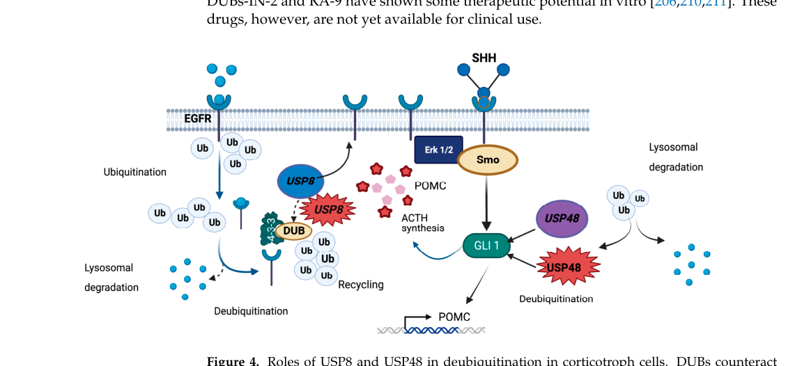

## Question

# Disease Characteristics Research Template

## Target Disease
- **Disease Name:** USP8-related pituitary adenoma 4
- **MONDO ID:**  (if available)
- **Category:** Neoplastic

## Research Objectives

Please provide a comprehensive research report on **USP8-related pituitary adenoma 4** covering all of the
disease characteristics listed below. This report will be used to populate a disease knowledge
base entry. Be thorough and cite primary literature (PMID preferred) for all claims.

For each section, **suggested databases/resources** are listed. These are the first places
you should search for information on each topic.

---

### 1. Disease Information
> **Search first:** OMIM, Orphanet, ICD-10/ICD-11, MeSH, PubMed

- What is the disease? Provide a concise overview.
- What are the key identifiers? (OMIM, Orphanet, ICD-10/ICD-11, MeSH, Mondo)
- What are the common synonyms and alternative names?
- Is the information derived from individual patients (e.g., EHR) or aggregated disease-level resources?

### 2. Etiology

- **Disease Causal Factors**: What are the primary causes? (genetic, environmental, infectious, mechanistic)
- **Risk Factors**:
  > **Search first:** PubMed, Cochrane Library, UpToDate, clinical guidelines, ClinVar, ClinGen, GWAS Catalog, PheGenI, CTD, CDC, WHO, epidemiological databases
  - Genetic risk factors (causal variants, susceptibility loci, modifier genes)
  - Environmental risk factors (toxins, lifestyle, occupational exposures, age, sex, family history)
- **Protective Factors**:
  > **Search first:** PubMed, Cochrane Library, clinical trial databases, GWAS Catalog, gnomAD, WHO, CDC, nutrition databases
  - Genetic protective factors (protective variants, modifier alleles)
  - Environmental protective factors (diet, lifestyle, exposures that reduce risk)
- **Gene-Environment Interactions**: How do genetic and environmental factors interact to influence disease?
  > **Search first:** CTD, PubMed, PheGenI, GxE databases

### 3. Phenotypes
> **Search first:** HPO (Human Phenotype Ontology), OMIM, Orphanet, PubMed, clinicaltrials.gov, MedDRA, SNOMED CT, DECIPHER, LOINC

For each phenotype, provide:
- **Phenotype type**: symptoms, clinical signs, physical manifestations, behavioral changes, or laboratory abnormalities
  > For symptoms/signs: HPO, OMIM, Orphanet, PubMed
  > For behavioral changes: HPO, DSM, RDoC (Research Domain Criteria), PubMed
  > For laboratory abnormalities: LOINC, SNOMED CT, LabTests Online, PubMed
- **Phenotype characteristics**:
  > **Search first:** OMIM, Orphanet, HPO, PubMed
  - Age of symptom onset (neonatal, childhood, adult-onset, late-onset)
  - Symptom severity (mild, moderate, severe, variable)
  - Symptom progression (stable, progressive, episodic, fluctuating)
  - Frequency among affected individuals (percentage or qualitative)
- **Quality of life impact**: Effects on daily functioning and well-being (per-phenotype when possible)
  > **Search first:** EQ-5D database, SF-36, WHO QOL databases, PubMed
- Suggest HPO (Human Phenotype Ontology) terms for each phenotype

### 4. Genetic/Molecular Information

- **Causal Genes**: Gene mutations or chromosomal abnormalities responsible for disease (gene symbols, OMIM IDs)
  > **Search first:** OMIM, ClinVar, HGMD, Ensembl, NCBI Gene
- **Pathogenic Variants**:
  - Affected genes (gene symbols, HGNC IDs)
    > **Search first:** OMIM, NCBI Gene, Ensembl, HGNC, UniProt, GeneCards
  - Variant classification (pathogenic, likely pathogenic, VUS per ACMG/AMP guidelines)
    > **Search first:** ClinVar, ClinGen, ACMG/AMP guidelines, VarSome
  - Variant type/class (missense, frameshift, nonsense, splice-site, structural)
  - Allele frequency in population databases
    > **Search first:** gnomAD, 1000 Genomes, ExAC, TOPMed, dbSNP
  - Somatic vs germline origin
    > **Search first:** COSMIC (somatic), ClinVar, ICGC, TCGA
  - Functional consequences (loss of function, gain of function, dominant negative)
- **Modifier Genes**: Genes that modify disease severity or expression
- **Epigenetic Information**: DNA methylation, histone modifications, chromatin changes affecting disease
  > **Search first:** ENCODE, Roadmap Epigenomics, MethBase, DiseaseMeth
- **Chromosomal Abnormalities**: Large-scale genetic changes (aneuploidy, translocations, inversions)
  > **Search first:** DECIPHER, ClinVar, ECARUCA, UCSC Genome Browser

### 5. Environmental Information

- **Environmental Factors**: Non-genetic contributing factors (toxins, radiation, pollution, occupational exposure)
  > **Search first:** CTD (Comparative Toxicogenomics Database), TOXNET, PubMed, EPA databases
- **Lifestyle Factors**: Behavioral factors (smoking, diet, exercise, alcohol consumption)
  > **Search first:** CDC databases, WHO, PubMed, NHANES
- **Infectious Agents**: If applicable, pathogens causing or triggering disease (bacteria, viruses, fungi, parasites)
  > **Search first:** NCBI Taxonomy, ViPR, BV-BRC, MicrobeDB, GIDEON

### 6. Mechanism / Pathophysiology

- **Molecular Pathways**: Specific signaling cascades or biochemical pathways involved (Wnt, MAPK, mTOR, PI3K-AKT, etc.)
  > **Search first:** KEGG, Reactome, WikiPathways, PathBank, BioCyc
- **Cellular Processes**: Cell-level mechanisms (apoptosis, autophagy, cell cycle dysregulation, inflammation, etc.)
  > **Search first:** Gene Ontology (GO), Reactome, KEGG, PubMed
- **Protein Dysfunction**: How protein structure or function is altered (misfolding, aggregation, loss of function, gain of function)
  > **Search first:** UniProt, PDB (Protein Data Bank), InterPro, Pfam, AlphaFold
- **Metabolic Changes**: Alterations in metabolic processes (energy metabolism, lipid metabolism, amino acid metabolism)
  > **Search first:** KEGG, BioCyc, HMDB (Human Metabolome Database), BRENDA
- **Immune System Involvement**: Role of immune response (autoimmunity, immunodeficiency, chronic inflammation)
  > **Search first:** ImmPort, Immunome Database, IEDB, Gene Ontology
- **Tissue Damage Mechanisms**: How tissues/ are injured (oxidative stress, ischemia, fibrosis, necrosis)
  > **Search first:** PubMed, Gene Ontology, Reactome
- **Biochemical Abnormalities**: Specific molecular defects (enzyme deficiencies, receptor dysfunction, ion channel defects)
  > **Search first:** BRENDA, UniProt, KEGG, OMIM, PubMed
- **Epigenetic Changes**: DNA methylation, histone modifications affecting gene expression in disease
  > **Search first:** ENCODE, Roadmap Epigenomics, MethBase, DiseaseMeth
- **Molecular Profiling** (if available):
  - Transcriptomics/gene expression changes
    > **Search first:** GEO (Gene Expression Omnibus), ArrayExpress, GTEx, Human Cell Atlas, SRA
  - Proteomics findings
    > **Search first:** PRIDE, ProteomeXchange, Human Protein Atlas, STRING, BioGRID
  - Metabolomics signatures
    > **Search first:** MetaboLights, Metabolomics Workbench, HMDB, METLIN
  - Lipidomics alterations
    > **Search first:** LIPID MAPS, SwissLipids, LipidHome, Metabolomics Workbench
  - Genomic structural features
    > **Search first:** UCSC Genome Browser, Ensembl, NCBI, dbVar, DGV
- **Advanced Technologies** (if applicable):
  - Single-cell analysis findings (cell-type specific mechanisms, cellular heterogeneity)
    > **Search first:** Human Cell Atlas, Single Cell Portal, GEO, CELLxGENE
  - Spatial transcriptomics findings
    > **Search first:** GEO, Spatial Research, Vizgen, 10x Genomics data
  - Multi-omics integration results
    > **Search first:** TCGA, ICGC, cBioPortal, LinkedOmics, PubMed
  - Functional genomics screens (CRISPR, RNAi)
    > **Search first:** DepMap, GenomeRNAi, PubMed, BioGRID ORCS

For each mechanism, describe:
- The causal chain from initial trigger to clinical manifestation
- Which mechanisms are upstream vs downstream
- What cell types and biological processes are involved
- Suggest GO terms for biological processes and CL terms for cell types

### 7. Anatomical Structures Affected

- **Organ Level**:
  - Primary organs directly affected
  - Secondary organ involvement (complications, secondary effects)
  - Body systems involved (cardiovascular, nervous, digestive, respiratory, endocrine, etc.)
  > **Search first:** Uberon, FMA (Foundational Model of Anatomy), OMIM, HPO, ICD-11, MeSH, SNOMED CT
- **Tissue and Cell Level**:
  - Specific tissue types affected (epithelial, connective, muscle, nervous)
  - Specific cell populations targeted (with Cell Ontology terms)
  > **Search first:** Uberon, Human Protein Atlas, Cell Ontology, Human Cell Atlas, CellMarker, PanglaoDB
- **Subcellular Level**:
  - Cellular compartments involved (mitochondria, nucleus, ER, lysosomes) (with GO Cellular Component terms)
  > **Search first:** Gene Ontology (Cellular Component), UniProt, Human Protein Atlas
- **Localization**:
  - Specific anatomical sites (with UBERON terms)
    > **Search first:** FMA, Uberon, NeuroNames (for brain), SNOMED CT
  - Lateralization (unilateral, bilateral, asymmetric)
    > **Search first:** HPO, clinical literature, imaging databases

### 8. Temporal Development

- **Onset**:
  - Typical age of onset (congenital, pediatric, adult, geriatric)
  - Onset pattern (acute, subacute, chronic, insidious)
  > **Search first:** OMIM, Orphanet, HPO, PubMed
- **Progression**:
  - Disease stages (early, intermediate, advanced, end-stage)
    > **Search first:** Cancer Staging Manual (AJCC), WHO classifications, PubMed
  - Progression rate (rapid, slow, variable)
  - Disease course pattern (episodic, relapsing-remitting, progressive, stable)
  - Disease duration (self-limited, chronic lifelong)
  > **Search first:** Disease registries, longitudinal cohort databases, natural history studies, PubMed, Orphanet, OMIM
- **Patterns**:
  - Remission patterns (spontaneous, treatment-induced)
    > **Search first:** Clinical trial databases, disease registries, PubMed
  - Critical periods (time windows of vulnerability or opportunity for intervention)
    > **Search first:** PubMed, developmental biology databases, clinical guidelines

### 9. Inheritance and Population

- **Epidemiology**:
  - Prevalence (cases per 100,000 at given time)
  - Incidence (new cases per 100,000 per year)
  > **Search first:** Orphanet, CDC, WHO, GBD (Global Burden of Disease), national registries, SEER, disease registries
- **For Genetic Etiology**:
  - Inheritance pattern (AD, AR, X-linked, mitochondrial, multifactorial, polygenic)
    > **Search first:** OMIM, Orphanet, ClinVar, GTR (Genetic Testing Registry)
  - Penetrance (complete, incomplete, age-dependent)
    > **Search first:** ClinVar, OMIM, PubMed, ClinGen
  - Expressivity (variable, consistent)
    > **Search first:** OMIM, ClinVar, PubMed
  - Genetic anticipation (increasing severity in successive generations)
    > **Search first:** OMIM, PubMed (especially for repeat expansion disorders)
  - Germline mosaicism
    > **Search first:** ClinVar, OMIM, genetic counseling literature, PubMed
  - Founder effects (population-specific mutations)
    > **Search first:** gnomAD, population genetics databases, PubMed
  - Consanguinity role
    > **Search first:** OMIM, population studies, genetic counseling resources
  - Carrier frequency
    > **Search first:** gnomAD, carrier screening databases, GeneReviews, GTR
- **Population Demographics**:
  - Affected populations (ethnic or demographic groups with higher prevalence)
    > **Search first:** gnomAD, 1000 Genomes, PAGE Study, PubMed, population registries
  - Geographic distribution (endemic areas, regional variation)
    > **Search first:** WHO, CDC, GBD, Orphanet, geographic epidemiology databases
  - Geographic distribution of specific variants
  - Sex ratio (male:female)
    > **Search first:** Disease registries, OMIM, PubMed, epidemiological databases
  - Age distribution of affected individuals
    > **Search first:** CDC, disease registries, SEER, Orphanet

### 10. Diagnostics

- **Clinical Tests**:
  - Laboratory tests (blood, urine, tissue chemistry, specific enzyme assays)
    > **Search first:** LOINC, LabTests Online, PubMed
  - Biomarkers (proteins, metabolites, genetic markers, circulating biomarkers)
    > **Search first:** FDA Biomarker List, BEST (Biomarkers, EndpointS, and other Tools), PubMed
  - Imaging studies (X-ray, CT, MRI, PET, ultrasound)
    > **Search first:** RadLex, DICOM, Radiopaedia, imaging databases
  - Functional tests (pulmonary function, cardiac stress tests)
    > **Search first:** LOINC, clinical guidelines, PubMed
  - Electrophysiology (EEG, EMG, ECG, nerve conduction studies)
    > **Search first:** LOINC, clinical neurophysiology databases, PubMed
  - Biopsy findings (histopathology, immunohistochemistry)
    > **Search first:** SNOMED CT, College of American Pathologists resources, PubMed
  - Pathology findings (microscopic examination)
    > **Search first:** SNOMED CT, Digital Pathology databases, PubMed
- **Genetic Testing**:
  > **Search first:** GTR (Genetic Testing Registry), GeneReviews, ClinGen
  - Overview of recommended genetic testing approach
  - Whole genome sequencing (WGS) utility
    > **Search first:** GTR, ClinVar, GEL (Genomics England), gnomAD
  - Whole exome sequencing (WES) utility
    > **Search first:** GTR, ClinVar, OMIM, GeneMatcher
  - Gene panels (which panels, which genes)
    > **Search first:** GTR, ClinVar, laboratory-specific databases
  - Single gene testing
    > **Search first:** GTR, ClinVar, OMIM, GeneReviews
  - Chromosomal microarray (CMA)
    > **Search first:** DECIPHER, ClinVar, dbVar, ECARUCA
  - Karyotyping
    > **Search first:** Chromosome Abnormality Database, ClinVar, cytogenetics resources
  - FISH
    > **Search first:** ClinVar, cytogenetics databases, PubMed
  - Mitochondrial DNA testing
    > **Search first:** MITOMAP, MSeqDR, ClinVar, GTR
  - Repeat expansion testing
    > **Search first:** GTR, ClinVar, repeat expansion databases, PubMed
- **Omics-Based Diagnostics** (if applicable):
  - RNA sequencing / transcriptomics
    > **Search first:** GEO, ArrayExpress, GTEx, RNA-seq databases
  - Proteomics
    > **Search first:** PRIDE, ProteomeXchange, FDA Biomarker database
  - Metabolomics
    > **Search first:** MetaboLights, Metabolomics Workbench, HMDB
  - Epigenomics
    > **Search first:** GEO, ENCODE, Roadmap Epigenomics, MethBase
  - Liquid biopsy
    > **Search first:** COSMIC, ClinVar, liquid biopsy databases, PubMed
- **Clinical Criteria**:
  - Standardized diagnostic criteria (DSM, ICD, society guidelines)
    > **Search first:** DSM-5, ICD-11, clinical society guidelines, UpToDate
  - Differential diagnosis (other conditions to rule out, with distinguishing features)
    > **Search first:** DynaMed, UpToDate, clinical decision support systems
- **Screening**:
  - Screening methods for asymptomatic individuals (newborn screening, carrier screening, cascade screening)
    > **Search first:** ACMG recommendations, CDC newborn screening, GTR

### 11. Outcome/Prognosis

- **Survival and Mortality**:
  - Survival rate (5-year, 10-year, overall)
    > **Search first:** SEER, cancer registries, disease-specific registries, PubMed
  - Life expectancy (with and without treatment if applicable)
    > **Search first:** Orphanet, disease registries, actuarial databases, PubMed
  - Mortality rate
    > **Search first:** CDC, WHO, GBD, national mortality databases
  - Disease-specific mortality (deaths directly attributable to disease)
    > **Search first:** Disease registries, CDC Wonder, GBD, PubMed
- **Morbidity and Function**:
  - Morbidity (disease-related disability and health impacts)
    > **Search first:** GBD, WHO, disability databases, PubMed
  - Disability outcomes (long-term functional impairments)
    > **Search first:** ICF (International Classification of Functioning), disability registries
  - Quality of life measures (EQ-5D, SF-36, PROMIS, disease-specific tools)
    > **Search first:** EQ-5D database, SF-36, PROMIS, PubMed
- **Disease Course**:
  - Complications (secondary problems: infections, organ failure, etc.)
    > **Search first:** ICD codes, disease registries, clinical databases, PubMed
  - Recovery potential (likelihood and extent of recovery, with vs without treatment)
    > **Search first:** Natural history studies, rehabilitation databases, PubMed
- **Prediction**:
  - Prognostic factors (age, disease severity, biomarkers, treatment response)
    > **Search first:** Prognostic models databases, clinical calculators, PubMed
  - Prognostic biomarkers (molecular markers predicting disease course)
    > **Search first:** FDA Biomarker database, PubMed, cancer prognostic databases

### 12. Treatment

- **Pharmacotherapy**:
  - Pharmacological treatments (drug names, drug classes, mechanisms of action)
    > **Search first:** DrugBank, RxNorm, ATC classification, DailyMed, FDA databases
  - Pharmacogenomics (how genetic variants affect drug metabolism, efficacy, toxicity)
    > **Search first:** PharmGKB, CPIC (Clinical Pharmacogenetics), FDA Table of PGx Biomarkers
- **Advanced Therapeutics**:
  - Gene therapy (viral vectors, CRISPR, gene replacement, gene editing)
    > **Search first:** ClinicalTrials.gov, FDA gene therapy database, ASGCT resources
  - Cell therapy (stem cell transplant, CAR-T, cellular therapeutics)
    > **Search first:** ClinicalTrials.gov, FDA cell therapy database, FACT standards
  - RNA-based therapies (ASOs, siRNA, mRNA therapies)
    > **Search first:** ClinicalTrials.gov, FDA approvals, PubMed
  - Targeted therapies (treatments directed at specific molecular targets)
    > **Search first:** My Cancer Genome, OncoKB, ClinicalTrials.gov, FDA approvals
  - Immunotherapies (checkpoint inhibitors, monoclonal antibodies)
    > **Search first:** Cancer Immunotherapy Database, FDA approvals, ClinicalTrials.gov
- **Surgical and Interventional**:
  - Surgical interventions (types of surgery, timing, outcomes)
    > **Search first:** CPT codes, surgical registries, clinical guidelines, PubMed
- **Supportive and Rehabilitative**:
  - Supportive care (symptom management, pain control, nutrition)
    > **Search first:** Clinical guidelines, Cochrane Library, PubMed
  - Rehabilitation (physical therapy, occupational therapy, speech therapy)
    > **Search first:** Rehabilitation medicine databases, clinical guidelines, PubMed
- **Experimental**:
  - Experimental treatments in clinical trials (with NCT identifiers if available)
    > **Search first:** ClinicalTrials.gov, EU Clinical Trials Register, WHO ICTRP
- **Treatment Outcomes**:
  - Treatment response rates
    > **Search first:** Clinical trial databases, FDA reviews, systematic reviews, PubMed
  - Side effects and adverse events
    > **Search first:** FDA Adverse Event Reporting System (FAERS), MedWatch, PubMed
- **Treatment Strategy**:
  - Treatment algorithms (clinical pathways, decision trees)
    > **Search first:** Clinical practice guidelines, NCCN Guidelines, UpToDate
  - Combination therapies
    > **Search first:** ClinicalTrials.gov, treatment guidelines, PubMed
  - Personalized medicine approaches (genotype-guided treatment)
    > **Search first:** My Cancer Genome, CIViC, PharmGKB, precision medicine databases

For each treatment, suggest MAXO (Medical Action Ontology) terms where applicable.

### 13. Prevention

- **Prevention Levels**:
  - Primary prevention (preventing disease occurrence: vaccination, risk factor modification)
    > **Search first:** CDC, WHO, USPSTF recommendations, Cochrane Library
  - Secondary prevention (early detection and treatment: screening programs, early intervention)
    > **Search first:** USPSTF, CDC screening guidelines, WHO
  - Tertiary prevention (preventing complications in those with disease)
    > **Search first:** Clinical guidelines, disease management protocols, PubMed
- **Immunization**: Vaccine strategies (if applicable)
  > **Search first:** CDC vaccine schedules, WHO immunization, FDA vaccine database
- **Screening and Early Detection**:
  - Screening programs (population-based: newborn screening, cancer screening)
    > **Search first:** CDC screening programs, USPSTF, cancer screening databases
  - Genetic screening (carrier screening, preimplantation genetic diagnosis, prenatal testing)
    > **Search first:** ACMG recommendations, ACOG guidelines, GTR
  - Risk stratification (identifying high-risk individuals for targeted prevention)
    > **Search first:** Risk prediction models, clinical calculators, PubMed
- **Behavioral Interventions**: Lifestyle modifications to reduce risk
  > **Search first:** CDC, WHO, behavioral intervention databases, Cochrane Library
- **Counseling**: Genetic counseling (risk assessment, family planning guidance)
  > **Search first:** NSGC resources, ACMG guidelines, GeneReviews
- **Public Health**:
  - Public health interventions (sanitation, vector control, health education)
    > **Search first:** CDC, WHO, public health databases, PubMed
  - Environmental interventions (reducing environmental risk factors)
    > **Search first:** EPA databases, WHO environmental health, PubMed
- **Prophylaxis**: Preventive medications or procedures
  > **Search first:** Clinical guidelines, FDA approvals, PubMed

### 14. Other Species / Natural Disease

- **Taxonomy**: Species affected (with NCBI Taxon identifiers)
  > **Search first:** NCBI Taxonomy
- **Breed**: Specific breeds affected (with VBO identifiers if applicable)
  > **Search first:** VBO (Vertebrate Breed Ontology)
- **Gene**: Orthologous genes in other species (with NCBI Gene IDs)
  > **Search first:** NCBI Gene
- **Natural Disease**:
  - Naturally occurring disease in other species (companion animals, wildlife)
    > **Search first:** OMIA (Online Mendelian Inheritance in Animals), VetCompass, PubMed
  - Veterinary relevance and importance in animal health
    > **Search first:** OMIA, veterinary databases, PubMed
- **Comparative Biology**:
  - Comparative pathology (similarities and differences across species)
    > **Search first:** OMIA, comparative pathology databases, PubMed
  - Evolutionary conservation of disease mechanisms
    > **Search first:** HomoloGene, OrthoMCL, Alliance of Genome Resources
- **Transmission** (if applicable):
  - Zoonotic potential
    > **Search first:** CDC zoonotic diseases, WHO zoonoses, GIDEON
  - Cross-species susceptibility
    > **Search first:** NCBI Taxonomy, veterinary databases, PubMed

### 15. Model Organisms

- **Model Types**:
  - Model organism type (mammalian, invertebrate, cellular, in vitro)
    > **Search first:** Alliance of Genome Resources, model organism databases
  - Specific model systems (mouse, rat, zebrafish, Drosophila, C. elegans, yeast, cell lines, organoids, iPSCs)
    > **Search first:** MGI, RGD, ZFIN, FlyBase, WormBase, SGD, ATCC, Cellosaurus
  - Induced models (drug treatment, surgical intervention, environmental manipulation)
    > **Search first:** MGI, model organism databases, PubMed
- **Genetic Models**:
  - Types available (knockout, knock-in, transgenic, conditional, humanized)
    > **Search first:** MGI, IMPC, KOMP, EuMMCR, IMSR
- **Model Characteristics**:
  - Phenotype recapitulation (how well model reproduces human disease features)
    > **Search first:** Model organism databases, comparative studies, PubMed
  - Model limitations (aspects of human disease not captured)
    > **Search first:** Model organism databases, PubMed, review articles
- **Applications**:
  - Research applications (what aspects of disease can be studied)
    > **Search first:** Model organism databases, PubMed
- **Resources**:
  - Model databases
    > **Search first:** MGI, RGD, ZFIN, FlyBase, WormBase, IMSR, EMMA, MMRRC

---

## Citation Requirements

- Cite primary literature (PMID preferred) for all mechanistic and clinical claims
- Prioritize recent reviews and landmark papers
- Include direct quotes from abstracts where possible to support key statements
- Distinguish evidence source types: human clinical, model organism, in vitro, computational

## Output Format

Structure your response as a comprehensive narrative organized by the sections above.
For each section, provide:
- Factual content with specific details (numbers, percentages, gene names, variant nomenclature)
- Ontology term suggestions (HPO, GO, CL, UBERON, CHEBI, MAXO, MONDO) where applicable
- Evidence citations with PMIDs
- Direct quotes from abstracts to support key claims
- Clear indication when information is not available or not applicable for this disease

This report will be used to populate a disease knowledge base entry with:
- Pathophysiology descriptions with causal chains
- Gene/protein annotations (HGNC, GO terms)
- Phenotype associations (HP terms) with frequencies
- Cell type involvement (CL terms)
- Anatomical locations (UBERON terms)
- Chemical entities (CHEBI terms)
- Treatment annotations (MAXO terms)
- Evidence items with PMIDs and exact abstract quotes
- Epidemiology, prognosis, diagnostic, and prevention information
- Animal model descriptions with phenotype recapitulation details

## Output

Question: You are an expert researcher providing comprehensive, well-cited information.

Provide detailed information focusing on:
1. Key concepts and definitions with current understanding
2. Recent developments and latest research (prioritize 2023-2024 sources)
3. Current applications and real-world implementations
4. Expert opinions and analysis from authoritative sources
5. Relevant statistics and data from recent studies

Format as a comprehensive research report with proper citations. Include URLs and publication dates where available.
Always prioritize recent, authoritative sources and provide specific citations for all major claims.

# Disease Characteristics Research Template

## Target Disease
- **Disease Name:** USP8-related pituitary adenoma 4
- **MONDO ID:**  (if available)
- **Category:** Neoplastic

## Research Objectives

Please provide a comprehensive research report on **USP8-related pituitary adenoma 4** covering all of the
disease characteristics listed below. This report will be used to populate a disease knowledge
base entry. Be thorough and cite primary literature (PMID preferred) for all claims.

For each section, **suggested databases/resources** are listed. These are the first places
you should search for information on each topic.

---

### 1. Disease Information
> **Search first:** OMIM, Orphanet, ICD-10/ICD-11, MeSH, PubMed

- What is the disease? Provide a concise overview.
- What are the key identifiers? (OMIM, Orphanet, ICD-10/ICD-11, MeSH, Mondo)
- What are the common synonyms and alternative names?
- Is the information derived from individual patients (e.g., EHR) or aggregated disease-level resources?

### 2. Etiology

- **Disease Causal Factors**: What are the primary causes? (genetic, environmental, infectious, mechanistic)
- **Risk Factors**:
  > **Search first:** PubMed, Cochrane Library, UpToDate, clinical guidelines, ClinVar, ClinGen, GWAS Catalog, PheGenI, CTD, CDC, WHO, epidemiological databases
  - Genetic risk factors (causal variants, susceptibility loci, modifier genes)
  - Environmental risk factors (toxins, lifestyle, occupational exposures, age, sex, family history)
- **Protective Factors**:
  > **Search first:** PubMed, Cochrane Library, clinical trial databases, GWAS Catalog, gnomAD, WHO, CDC, nutrition databases
  - Genetic protective factors (protective variants, modifier alleles)
  - Environmental protective factors (diet, lifestyle, exposures that reduce risk)
- **Gene-Environment Interactions**: How do genetic and environmental factors interact to influence disease?
  > **Search first:** CTD, PubMed, PheGenI, GxE databases

### 3. Phenotypes
> **Search first:** HPO (Human Phenotype Ontology), OMIM, Orphanet, PubMed, clinicaltrials.gov, MedDRA, SNOMED CT, DECIPHER, LOINC

For each phenotype, provide:
- **Phenotype type**: symptoms, clinical signs, physical manifestations, behavioral changes, or laboratory abnormalities
  > For symptoms/signs: HPO, OMIM, Orphanet, PubMed
  > For behavioral changes: HPO, DSM, RDoC (Research Domain Criteria), PubMed
  > For laboratory abnormalities: LOINC, SNOMED CT, LabTests Online, PubMed
- **Phenotype characteristics**:
  > **Search first:** OMIM, Orphanet, HPO, PubMed
  - Age of symptom onset (neonatal, childhood, adult-onset, late-onset)
  - Symptom severity (mild, moderate, severe, variable)
  - Symptom progression (stable, progressive, episodic, fluctuating)
  - Frequency among affected individuals (percentage or qualitative)
- **Quality of life impact**: Effects on daily functioning and well-being (per-phenotype when possible)
  > **Search first:** EQ-5D database, SF-36, WHO QOL databases, PubMed
- Suggest HPO (Human Phenotype Ontology) terms for each phenotype

### 4. Genetic/Molecular Information

- **Causal Genes**: Gene mutations or chromosomal abnormalities responsible for disease (gene symbols, OMIM IDs)
  > **Search first:** OMIM, ClinVar, HGMD, Ensembl, NCBI Gene
- **Pathogenic Variants**:
  - Affected genes (gene symbols, HGNC IDs)
    > **Search first:** OMIM, NCBI Gene, Ensembl, HGNC, UniProt, GeneCards
  - Variant classification (pathogenic, likely pathogenic, VUS per ACMG/AMP guidelines)
    > **Search first:** ClinVar, ClinGen, ACMG/AMP guidelines, VarSome
  - Variant type/class (missense, frameshift, nonsense, splice-site, structural)
  - Allele frequency in population databases
    > **Search first:** gnomAD, 1000 Genomes, ExAC, TOPMed, dbSNP
  - Somatic vs germline origin
    > **Search first:** COSMIC (somatic), ClinVar, ICGC, TCGA
  - Functional consequences (loss of function, gain of function, dominant negative)
- **Modifier Genes**: Genes that modify disease severity or expression
- **Epigenetic Information**: DNA methylation, histone modifications, chromatin changes affecting disease
  > **Search first:** ENCODE, Roadmap Epigenomics, MethBase, DiseaseMeth
- **Chromosomal Abnormalities**: Large-scale genetic changes (aneuploidy, translocations, inversions)
  > **Search first:** DECIPHER, ClinVar, ECARUCA, UCSC Genome Browser

### 5. Environmental Information

- **Environmental Factors**: Non-genetic contributing factors (toxins, radiation, pollution, occupational exposure)
  > **Search first:** CTD (Comparative Toxicogenomics Database), TOXNET, PubMed, EPA databases
- **Lifestyle Factors**: Behavioral factors (smoking, diet, exercise, alcohol consumption)
  > **Search first:** CDC databases, WHO, PubMed, NHANES
- **Infectious Agents**: If applicable, pathogens causing or triggering disease (bacteria, viruses, fungi, parasites)
  > **Search first:** NCBI Taxonomy, ViPR, BV-BRC, MicrobeDB, GIDEON

### 6. Mechanism / Pathophysiology

- **Molecular Pathways**: Specific signaling cascades or biochemical pathways involved (Wnt, MAPK, mTOR, PI3K-AKT, etc.)
  > **Search first:** KEGG, Reactome, WikiPathways, PathBank, BioCyc
- **Cellular Processes**: Cell-level mechanisms (apoptosis, autophagy, cell cycle dysregulation, inflammation, etc.)
  > **Search first:** Gene Ontology (GO), Reactome, KEGG, PubMed
- **Protein Dysfunction**: How protein structure or function is altered (misfolding, aggregation, loss of function, gain of function)
  > **Search first:** UniProt, PDB (Protein Data Bank), InterPro, Pfam, AlphaFold
- **Metabolic Changes**: Alterations in metabolic processes (energy metabolism, lipid metabolism, amino acid metabolism)
  > **Search first:** KEGG, BioCyc, HMDB (Human Metabolome Database), BRENDA
- **Immune System Involvement**: Role of immune response (autoimmunity, immunodeficiency, chronic inflammation)
  > **Search first:** ImmPort, Immunome Database, IEDB, Gene Ontology
- **Tissue Damage Mechanisms**: How tissues/ are injured (oxidative stress, ischemia, fibrosis, necrosis)
  > **Search first:** PubMed, Gene Ontology, Reactome
- **Biochemical Abnormalities**: Specific molecular defects (enzyme deficiencies, receptor dysfunction, ion channel defects)
  > **Search first:** BRENDA, UniProt, KEGG, OMIM, PubMed
- **Epigenetic Changes**: DNA methylation, histone modifications affecting gene expression in disease
  > **Search first:** ENCODE, Roadmap Epigenomics, MethBase, DiseaseMeth
- **Molecular Profiling** (if available):
  - Transcriptomics/gene expression changes
    > **Search first:** GEO (Gene Expression Omnibus), ArrayExpress, GTEx, Human Cell Atlas, SRA
  - Proteomics findings
    > **Search first:** PRIDE, ProteomeXchange, Human Protein Atlas, STRING, BioGRID
  - Metabolomics signatures
    > **Search first:** MetaboLights, Metabolomics Workbench, HMDB, METLIN
  - Lipidomics alterations
    > **Search first:** LIPID MAPS, SwissLipids, LipidHome, Metabolomics Workbench
  - Genomic structural features
    > **Search first:** UCSC Genome Browser, Ensembl, NCBI, dbVar, DGV
- **Advanced Technologies** (if applicable):
  - Single-cell analysis findings (cell-type specific mechanisms, cellular heterogeneity)
    > **Search first:** Human Cell Atlas, Single Cell Portal, GEO, CELLxGENE
  - Spatial transcriptomics findings
    > **Search first:** GEO, Spatial Research, Vizgen, 10x Genomics data
  - Multi-omics integration results
    > **Search first:** TCGA, ICGC, cBioPortal, LinkedOmics, PubMed
  - Functional genomics screens (CRISPR, RNAi)
    > **Search first:** DepMap, GenomeRNAi, PubMed, BioGRID ORCS

For each mechanism, describe:
- The causal chain from initial trigger to clinical manifestation
- Which mechanisms are upstream vs downstream
- What cell types and biological processes are involved
- Suggest GO terms for biological processes and CL terms for cell types

### 7. Anatomical Structures Affected

- **Organ Level**:
  - Primary organs directly affected
  - Secondary organ involvement (complications, secondary effects)
  - Body systems involved (cardiovascular, nervous, digestive, respiratory, endocrine, etc.)
  > **Search first:** Uberon, FMA (Foundational Model of Anatomy), OMIM, HPO, ICD-11, MeSH, SNOMED CT
- **Tissue and Cell Level**:
  - Specific tissue types affected (epithelial, connective, muscle, nervous)
  - Specific cell populations targeted (with Cell Ontology terms)
  > **Search first:** Uberon, Human Protein Atlas, Cell Ontology, Human Cell Atlas, CellMarker, PanglaoDB
- **Subcellular Level**:
  - Cellular compartments involved (mitochondria, nucleus, ER, lysosomes) (with GO Cellular Component terms)
  > **Search first:** Gene Ontology (Cellular Component), UniProt, Human Protein Atlas
- **Localization**:
  - Specific anatomical sites (with UBERON terms)
    > **Search first:** FMA, Uberon, NeuroNames (for brain), SNOMED CT
  - Lateralization (unilateral, bilateral, asymmetric)
    > **Search first:** HPO, clinical literature, imaging databases

### 8. Temporal Development

- **Onset**:
  - Typical age of onset (congenital, pediatric, adult, geriatric)
  - Onset pattern (acute, subacute, chronic, insidious)
  > **Search first:** OMIM, Orphanet, HPO, PubMed
- **Progression**:
  - Disease stages (early, intermediate, advanced, end-stage)
    > **Search first:** Cancer Staging Manual (AJCC), WHO classifications, PubMed
  - Progression rate (rapid, slow, variable)
  - Disease course pattern (episodic, relapsing-remitting, progressive, stable)
  - Disease duration (self-limited, chronic lifelong)
  > **Search first:** Disease registries, longitudinal cohort databases, natural history studies, PubMed, Orphanet, OMIM
- **Patterns**:
  - Remission patterns (spontaneous, treatment-induced)
    > **Search first:** Clinical trial databases, disease registries, PubMed
  - Critical periods (time windows of vulnerability or opportunity for intervention)
    > **Search first:** PubMed, developmental biology databases, clinical guidelines

### 9. Inheritance and Population

- **Epidemiology**:
  - Prevalence (cases per 100,000 at given time)
  - Incidence (new cases per 100,000 per year)
  > **Search first:** Orphanet, CDC, WHO, GBD (Global Burden of Disease), national registries, SEER, disease registries
- **For Genetic Etiology**:
  - Inheritance pattern (AD, AR, X-linked, mitochondrial, multifactorial, polygenic)
    > **Search first:** OMIM, Orphanet, ClinVar, GTR (Genetic Testing Registry)
  - Penetrance (complete, incomplete, age-dependent)
    > **Search first:** ClinVar, OMIM, PubMed, ClinGen
  - Expressivity (variable, consistent)
    > **Search first:** OMIM, ClinVar, PubMed
  - Genetic anticipation (increasing severity in successive generations)
    > **Search first:** OMIM, PubMed (especially for repeat expansion disorders)
  - Germline mosaicism
    > **Search first:** ClinVar, OMIM, genetic counseling literature, PubMed
  - Founder effects (population-specific mutations)
    > **Search first:** gnomAD, population genetics databases, PubMed
  - Consanguinity role
    > **Search first:** OMIM, population studies, genetic counseling resources
  - Carrier frequency
    > **Search first:** gnomAD, carrier screening databases, GeneReviews, GTR
- **Population Demographics**:
  - Affected populations (ethnic or demographic groups with higher prevalence)
    > **Search first:** gnomAD, 1000 Genomes, PAGE Study, PubMed, population registries
  - Geographic distribution (endemic areas, regional variation)
    > **Search first:** WHO, CDC, GBD, Orphanet, geographic epidemiology databases
  - Geographic distribution of specific variants
  - Sex ratio (male:female)
    > **Search first:** Disease registries, OMIM, PubMed, epidemiological databases
  - Age distribution of affected individuals
    > **Search first:** CDC, disease registries, SEER, Orphanet

### 10. Diagnostics

- **Clinical Tests**:
  - Laboratory tests (blood, urine, tissue chemistry, specific enzyme assays)
    > **Search first:** LOINC, LabTests Online, PubMed
  - Biomarkers (proteins, metabolites, genetic markers, circulating biomarkers)
    > **Search first:** FDA Biomarker List, BEST (Biomarkers, EndpointS, and other Tools), PubMed
  - Imaging studies (X-ray, CT, MRI, PET, ultrasound)
    > **Search first:** RadLex, DICOM, Radiopaedia, imaging databases
  - Functional tests (pulmonary function, cardiac stress tests)
    > **Search first:** LOINC, clinical guidelines, PubMed
  - Electrophysiology (EEG, EMG, ECG, nerve conduction studies)
    > **Search first:** LOINC, clinical neurophysiology databases, PubMed
  - Biopsy findings (histopathology, immunohistochemistry)
    > **Search first:** SNOMED CT, College of American Pathologists resources, PubMed
  - Pathology findings (microscopic examination)
    > **Search first:** SNOMED CT, Digital Pathology databases, PubMed
- **Genetic Testing**:
  > **Search first:** GTR (Genetic Testing Registry), GeneReviews, ClinGen
  - Overview of recommended genetic testing approach
  - Whole genome sequencing (WGS) utility
    > **Search first:** GTR, ClinVar, GEL (Genomics England), gnomAD
  - Whole exome sequencing (WES) utility
    > **Search first:** GTR, ClinVar, OMIM, GeneMatcher
  - Gene panels (which panels, which genes)
    > **Search first:** GTR, ClinVar, laboratory-specific databases
  - Single gene testing
    > **Search first:** GTR, ClinVar, OMIM, GeneReviews
  - Chromosomal microarray (CMA)
    > **Search first:** DECIPHER, ClinVar, dbVar, ECARUCA
  - Karyotyping
    > **Search first:** Chromosome Abnormality Database, ClinVar, cytogenetics resources
  - FISH
    > **Search first:** ClinVar, cytogenetics databases, PubMed
  - Mitochondrial DNA testing
    > **Search first:** MITOMAP, MSeqDR, ClinVar, GTR
  - Repeat expansion testing
    > **Search first:** GTR, ClinVar, repeat expansion databases, PubMed
- **Omics-Based Diagnostics** (if applicable):
  - RNA sequencing / transcriptomics
    > **Search first:** GEO, ArrayExpress, GTEx, RNA-seq databases
  - Proteomics
    > **Search first:** PRIDE, ProteomeXchange, FDA Biomarker database
  - Metabolomics
    > **Search first:** MetaboLights, Metabolomics Workbench, HMDB
  - Epigenomics
    > **Search first:** GEO, ENCODE, Roadmap Epigenomics, MethBase
  - Liquid biopsy
    > **Search first:** COSMIC, ClinVar, liquid biopsy databases, PubMed
- **Clinical Criteria**:
  - Standardized diagnostic criteria (DSM, ICD, society guidelines)
    > **Search first:** DSM-5, ICD-11, clinical society guidelines, UpToDate
  - Differential diagnosis (other conditions to rule out, with distinguishing features)
    > **Search first:** DynaMed, UpToDate, clinical decision support systems
- **Screening**:
  - Screening methods for asymptomatic individuals (newborn screening, carrier screening, cascade screening)
    > **Search first:** ACMG recommendations, CDC newborn screening, GTR

### 11. Outcome/Prognosis

- **Survival and Mortality**:
  - Survival rate (5-year, 10-year, overall)
    > **Search first:** SEER, cancer registries, disease-specific registries, PubMed
  - Life expectancy (with and without treatment if applicable)
    > **Search first:** Orphanet, disease registries, actuarial databases, PubMed
  - Mortality rate
    > **Search first:** CDC, WHO, GBD, national mortality databases
  - Disease-specific mortality (deaths directly attributable to disease)
    > **Search first:** Disease registries, CDC Wonder, GBD, PubMed
- **Morbidity and Function**:
  - Morbidity (disease-related disability and health impacts)
    > **Search first:** GBD, WHO, disability databases, PubMed
  - Disability outcomes (long-term functional impairments)
    > **Search first:** ICF (International Classification of Functioning), disability registries
  - Quality of life measures (EQ-5D, SF-36, PROMIS, disease-specific tools)
    > **Search first:** EQ-5D database, SF-36, PROMIS, PubMed
- **Disease Course**:
  - Complications (secondary problems: infections, organ failure, etc.)
    > **Search first:** ICD codes, disease registries, clinical databases, PubMed
  - Recovery potential (likelihood and extent of recovery, with vs without treatment)
    > **Search first:** Natural history studies, rehabilitation databases, PubMed
- **Prediction**:
  - Prognostic factors (age, disease severity, biomarkers, treatment response)
    > **Search first:** Prognostic models databases, clinical calculators, PubMed
  - Prognostic biomarkers (molecular markers predicting disease course)
    > **Search first:** FDA Biomarker database, PubMed, cancer prognostic databases

### 12. Treatment

- **Pharmacotherapy**:
  - Pharmacological treatments (drug names, drug classes, mechanisms of action)
    > **Search first:** DrugBank, RxNorm, ATC classification, DailyMed, FDA databases
  - Pharmacogenomics (how genetic variants affect drug metabolism, efficacy, toxicity)
    > **Search first:** PharmGKB, CPIC (Clinical Pharmacogenetics), FDA Table of PGx Biomarkers
- **Advanced Therapeutics**:
  - Gene therapy (viral vectors, CRISPR, gene replacement, gene editing)
    > **Search first:** ClinicalTrials.gov, FDA gene therapy database, ASGCT resources
  - Cell therapy (stem cell transplant, CAR-T, cellular therapeutics)
    > **Search first:** ClinicalTrials.gov, FDA cell therapy database, FACT standards
  - RNA-based therapies (ASOs, siRNA, mRNA therapies)
    > **Search first:** ClinicalTrials.gov, FDA approvals, PubMed
  - Targeted therapies (treatments directed at specific molecular targets)
    > **Search first:** My Cancer Genome, OncoKB, ClinicalTrials.gov, FDA approvals
  - Immunotherapies (checkpoint inhibitors, monoclonal antibodies)
    > **Search first:** Cancer Immunotherapy Database, FDA approvals, ClinicalTrials.gov
- **Surgical and Interventional**:
  - Surgical interventions (types of surgery, timing, outcomes)
    > **Search first:** CPT codes, surgical registries, clinical guidelines, PubMed
- **Supportive and Rehabilitative**:
  - Supportive care (symptom management, pain control, nutrition)
    > **Search first:** Clinical guidelines, Cochrane Library, PubMed
  - Rehabilitation (physical therapy, occupational therapy, speech therapy)
    > **Search first:** Rehabilitation medicine databases, clinical guidelines, PubMed
- **Experimental**:
  - Experimental treatments in clinical trials (with NCT identifiers if available)
    > **Search first:** ClinicalTrials.gov, EU Clinical Trials Register, WHO ICTRP
- **Treatment Outcomes**:
  - Treatment response rates
    > **Search first:** Clinical trial databases, FDA reviews, systematic reviews, PubMed
  - Side effects and adverse events
    > **Search first:** FDA Adverse Event Reporting System (FAERS), MedWatch, PubMed
- **Treatment Strategy**:
  - Treatment algorithms (clinical pathways, decision trees)
    > **Search first:** Clinical practice guidelines, NCCN Guidelines, UpToDate
  - Combination therapies
    > **Search first:** ClinicalTrials.gov, treatment guidelines, PubMed
  - Personalized medicine approaches (genotype-guided treatment)
    > **Search first:** My Cancer Genome, CIViC, PharmGKB, precision medicine databases

For each treatment, suggest MAXO (Medical Action Ontology) terms where applicable.

### 13. Prevention

- **Prevention Levels**:
  - Primary prevention (preventing disease occurrence: vaccination, risk factor modification)
    > **Search first:** CDC, WHO, USPSTF recommendations, Cochrane Library
  - Secondary prevention (early detection and treatment: screening programs, early intervention)
    > **Search first:** USPSTF, CDC screening guidelines, WHO
  - Tertiary prevention (preventing complications in those with disease)
    > **Search first:** Clinical guidelines, disease management protocols, PubMed
- **Immunization**: Vaccine strategies (if applicable)
  > **Search first:** CDC vaccine schedules, WHO immunization, FDA vaccine database
- **Screening and Early Detection**:
  - Screening programs (population-based: newborn screening, cancer screening)
    > **Search first:** CDC screening programs, USPSTF, cancer screening databases
  - Genetic screening (carrier screening, preimplantation genetic diagnosis, prenatal testing)
    > **Search first:** ACMG recommendations, ACOG guidelines, GTR
  - Risk stratification (identifying high-risk individuals for targeted prevention)
    > **Search first:** Risk prediction models, clinical calculators, PubMed
- **Behavioral Interventions**: Lifestyle modifications to reduce risk
  > **Search first:** CDC, WHO, behavioral intervention databases, Cochrane Library
- **Counseling**: Genetic counseling (risk assessment, family planning guidance)
  > **Search first:** NSGC resources, ACMG guidelines, GeneReviews
- **Public Health**:
  - Public health interventions (sanitation, vector control, health education)
    > **Search first:** CDC, WHO, public health databases, PubMed
  - Environmental interventions (reducing environmental risk factors)
    > **Search first:** EPA databases, WHO environmental health, PubMed
- **Prophylaxis**: Preventive medications or procedures
  > **Search first:** Clinical guidelines, FDA approvals, PubMed

### 14. Other Species / Natural Disease

- **Taxonomy**: Species affected (with NCBI Taxon identifiers)
  > **Search first:** NCBI Taxonomy
- **Breed**: Specific breeds affected (with VBO identifiers if applicable)
  > **Search first:** VBO (Vertebrate Breed Ontology)
- **Gene**: Orthologous genes in other species (with NCBI Gene IDs)
  > **Search first:** NCBI Gene
- **Natural Disease**:
  - Naturally occurring disease in other species (companion animals, wildlife)
    > **Search first:** OMIA (Online Mendelian Inheritance in Animals), VetCompass, PubMed
  - Veterinary relevance and importance in animal health
    > **Search first:** OMIA, veterinary databases, PubMed
- **Comparative Biology**:
  - Comparative pathology (similarities and differences across species)
    > **Search first:** OMIA, comparative pathology databases, PubMed
  - Evolutionary conservation of disease mechanisms
    > **Search first:** HomoloGene, OrthoMCL, Alliance of Genome Resources
- **Transmission** (if applicable):
  - Zoonotic potential
    > **Search first:** CDC zoonotic diseases, WHO zoonoses, GIDEON
  - Cross-species susceptibility
    > **Search first:** NCBI Taxonomy, veterinary databases, PubMed

### 15. Model Organisms

- **Model Types**:
  - Model organism type (mammalian, invertebrate, cellular, in vitro)
    > **Search first:** Alliance of Genome Resources, model organism databases
  - Specific model systems (mouse, rat, zebrafish, Drosophila, C. elegans, yeast, cell lines, organoids, iPSCs)
    > **Search first:** MGI, RGD, ZFIN, FlyBase, WormBase, SGD, ATCC, Cellosaurus
  - Induced models (drug treatment, surgical intervention, environmental manipulation)
    > **Search first:** MGI, model organism databases, PubMed
- **Genetic Models**:
  - Types available (knockout, knock-in, transgenic, conditional, humanized)
    > **Search first:** MGI, IMPC, KOMP, EuMMCR, IMSR
- **Model Characteristics**:
  - Phenotype recapitulation (how well model reproduces human disease features)
    > **Search first:** Model organism databases, comparative studies, PubMed
  - Model limitations (aspects of human disease not captured)
    > **Search first:** Model organism databases, PubMed, review articles
- **Applications**:
  - Research applications (what aspects of disease can be studied)
    > **Search first:** Model organism databases, PubMed
- **Resources**:
  - Model databases
    > **Search first:** MGI, RGD, ZFIN, FlyBase, WormBase, IMSR, EMMA, MMRRC

---

## Citation Requirements

- Cite primary literature (PMID preferred) for all mechanistic and clinical claims
- Prioritize recent reviews and landmark papers
- Include direct quotes from abstracts where possible to support key statements
- Distinguish evidence source types: human clinical, model organism, in vitro, computational

## Output Format

Structure your response as a comprehensive narrative organized by the sections above.
For each section, provide:
- Factual content with specific details (numbers, percentages, gene names, variant nomenclature)
- Ontology term suggestions (HPO, GO, CL, UBERON, CHEBI, MAXO, MONDO) where applicable
- Evidence citations with PMIDs
- Direct quotes from abstracts to support key claims
- Clear indication when information is not available or not applicable for this disease

This report will be used to populate a disease knowledge base entry with:
- Pathophysiology descriptions with causal chains
- Gene/protein annotations (HGNC, GO terms)
- Phenotype associations (HP terms) with frequencies
- Cell type involvement (CL terms)
- Anatomical locations (UBERON terms)
- Chemical entities (CHEBI terms)
- Treatment annotations (MAXO terms)
- Evidence items with PMIDs and exact abstract quotes
- Epidemiology, prognosis, diagnostic, and prevention information
- Animal model descriptions with phenotype recapitulation details

## Comprehensive Disease Characteristics Report: USP8-related pituitary adenoma 4 (Neoplastic)

### Executive summary (current understanding)
USP8-related pituitary adenoma 4 is an ACTH-secreting corticotroph pituitary neuroendocrine tumor (PitNET; historically “pituitary adenoma”) characterized in most cases by *somatic* activating (gain-of-function) USP8 variants clustered in exon 14 at the 14-3-3 binding motif (codons ~718–720). These variants increase USP8 deubiquitinase activity, enhance EGFR recycling/signaling, and increase POMC transcription and ACTH secretion, producing pituitary-dependent Cushing’s disease (hypercortisolism). Across cohorts, USP8 variants are frequently reported in women and in younger adults, but genotype–phenotype and prognostic correlations (tumor size, invasiveness, recurrence) are inconsistent between studies. (torresmoran2023hotspotsofsomatic pages 11-12, perezrivas2015thegeneof pages 1-2, ma2015recurrentgainoffunctionusp8 pages 1-2)

---

## 1. Disease information

### 1.1 What is the disease?
GeneReviews lists **“Pituitary adenoma 4 (OMIM 219090)”** under genetic syndromes associated with pituitary tumors, describing it as a **small corticotropinoma with high ACTH secretion** and noting it occurs **predominantly in young females** and is **most often due to somatic pathogenic variants** (with **one germline de novo** pathogenic variant reported). (korbonits2025aipfamilialisolateda pages 10-11)

In practice, the clinical presentation corresponds to **pituitary-dependent Cushing’s disease** due to an **ACTH-secreting corticotroph PitNET**. Open Targets likewise tracks the disease concept **“pituitary-dependent Cushing’s disease”** (EFO_1001110) as associated with **USP8**. (OpenTargets Search: Cushing disease,Pituitary adenoma-USP8)

### 1.2 Key identifiers (available in retrieved evidence)
- **OMIM:** Pituitary adenoma 4 = **OMIM 219090** (GeneReviews table). (korbonits2025aipfamilialisolateda pages 10-11)
- **EFO:** pituitary-dependent Cushing’s disease = **EFO_1001110** (Open Targets). (OpenTargets Search: Cushing disease,Pituitary adenoma-USP8)
- **MONDO:** A MONDO ID was present in retrieved Open Targets output (**MONDO_0020529**, ACTH-independent Cushing syndrome) but this is a *different* disease entity and is not the pituitary-dependent condition. (OpenTargets Search: Cushing disease,Pituitary adenoma-USP8)

**Not found in the retrieved corpus:** Orphanet ID, ICD-10/ICD-11 codes, MeSH ID for “USP8-related pituitary adenoma 4” specifically.

### 1.3 Synonyms / alternative names
Based on the accessed sources, common equivalent clinical/disease terms include:
- Pituitary-dependent Cushing’s disease / Cushing’s disease (ACTH-secreting pituitary tumor) (OpenTargets Search: Cushing disease,Pituitary adenoma-USP8, perezrivas2015thegeneof pages 1-2)
- ACTH-secreting pituitary adenoma; corticotroph pituitary adenoma; corticotropinoma; corticotroph PitNET (perezrivas2015thegeneof pages 1-2, torresmoran2023hotspotsofsomatic pages 11-12)

### 1.4 Evidence source type
The retrieved disease information is derived mainly from:
- Aggregated resources (GeneReviews; Open Targets) (korbonits2025aipfamilialisolateda pages 10-11, OpenTargets Search: Cushing disease,Pituitary adenoma-USP8)
- Multicenter and single-center human surgical tumor cohorts (perezrivas2015thegeneof pages 1-2, nerubenko2024cushing’sdiseasemanifestation pages 2-4)
- Preclinical in vitro/in vivo studies and translational models (cell lines, primary cultures, organoids) (hashemimadani2024targetedanalysisof pages 8-10, mallick2023geneticallyengineeredhuman pages 1-2)

---

## 2. Etiology

### 2.1 Disease causal factors
**Primary causal factor:** activating **USP8** variants (typically *somatic*, exon 14 hotspot in 14-3-3 binding motif). Somatic defects at **codons 718–720** are described as the most common genetic cause of Cushing disease, found across series in roughly **21–62%** of corticotropinomas. (torresmoran2023hotspotsofsomatic pages 11-12)

**Cohort examples (human):**
- Multicenter cohort: USP8 somatic mutations in **48/145 (36%)**, none in 11 silent corticotropinomas. (perezrivas2015thegeneof pages 1-2)
- Large ACTH-adenoma cohort: **67/108 (62.04%)** ACTH-secreting pituitary adenomas had USP8 variants, none in 150 non-ACTH pituitary adenomas. (ma2015recurrentgainoffunctionusp8 pages 1-2)
- 2024 cohort: **18/35 (51%)** had USP8 variants. (nerubenko2024cushing’sdiseasemanifestation pages 2-4)

### 2.2 Risk factors
**Genetic risk:** presence of a USP8 hotspot variant in the tumor (somatic driver). Female sex and younger age are repeatedly noted to be enriched among USP8-mutant cases, though this is best viewed as an association rather than a proven causal risk factor. For example, in one multicenter cohort, mutation prevalence differed by sex (female **43%** vs male **17%**) and by age group (adults **41%** vs pediatric **17%**). (perezrivas2015thegeneof pages 1-2)

**Environmental, infectious, lifestyle risk factors:** Not identified in the retrieved evidence excerpts. (torresmoran2023hotspotsofsomatic pages 11-12, vamvoukaki2023pituitarytumorigenesis—implicationsfor pages 15-16)

### 2.3 Protective factors
Not identified in the retrieved evidence corpus.

### 2.4 Gene–environment interactions
No explicit gene–environment interaction evidence was found in retrieved excerpts. (torresmoran2023hotspotsofsomatic pages 11-12, vamvoukaki2023pituitarytumorigenesis—implicationsfor pages 15-16, mallick2023geneticallyengineeredhuman pages 1-2)

---

## 3. Phenotypes (clinical spectrum)

### 3.1 Key clinical phenotypes
In a human cohort study of Cushing’s disease adenomas, typical manifestations of chronic hypercortisolism included: **central obesity, moon face, buffalo hump, muscle weakness, easy bruising, striae, acne, low-impact fractures, mood changes, and reproductive dysfunction**. (perezrivas2015thegeneof pages 1-2)

**Phenotype type:** symptoms/signs; laboratory abnormalities (hypercortisolism, ACTH dependence). (perezrivas2015thegeneof pages 1-2)

### 3.2 Suggested HPO terms (examples for knowledge base)
*(HPO IDs not provided in the retrieved texts; suggestions below are standard mappings based on described features and should be validated against the HPO database)*
- Central obesity (HP:0001956)
- Moon face (Cushingoid facies) (HP:0000280 or related)
- Buffalo hump / dorsocervical fat pad (HP:0001243 not correct; likely HP term exists; requires lookup)
- Muscle weakness (HP:0001324)
- Easy bruising (HP:0000978)
- Striae distensae (HP:0001065)
- Acne (HP:0001061)
- Depression / mood changes (HP:0000716)
- Hypogonadism / menstrual irregularity / infertility (multiple HPO terms; requires selection)
- Hypercortisolism (HPO term exists; requires lookup)

### 3.3 Phenotype characteristics (onset, severity, progression)
- **Age distribution:** Adults with USP8-mutant tumors were diagnosed younger in one multicenter cohort (**36 vs 44 years**). (perezrivas2015thegeneof pages 1-2)
- **Sex ratio:** USP8 variants more common in women (example: **94% vs 76%** women in mutant vs WT groups in a cohort; and female predominance repeatedly noted). (nerubenko2024cushing’sdiseasemanifestation pages 2-4, torresmoran2023hotspotsofsomatic pages 11-12)
- **Tumor size:** Some series report smaller tumors/microadenomas; in a 2024 cohort microadenomas were more common in mutants (**44% vs 29%**) and all tumors ≥20 mm were wild type. (nerubenko2024cushing’sdiseasemanifestation pages 2-4)

### 3.4 Quality-of-life impact
Explicit QOL instruments (EQ-5D/SF-36) were not reported in the retrieved excerpts. However, prolonged high cortisol exposure is noted to cause “long-term complications, impaired quality of life, and increased mortality” in a 2024 systematic review context. (hashemimadani2024targetedanalysisof pages 1-2)

---

## 4. Genetic / molecular information

### 4.1 Causal gene
- **USP8** (ubiquitin specific peptidase 8). (torresmoran2023hotspotsofsomatic pages 11-12, perezrivas2015thegeneof pages 1-2)

### 4.2 Pathogenic variant profile
- **Origin:** predominantly **somatic** (GeneReviews: “most often due to somatic pathogenic variants”; one germline de novo report). (korbonits2025aipfamilialisolateda pages 10-11)
- **Hotspot location:** **exon 14**, 14-3-3 binding motif; codons **718–720**. (torresmoran2023hotspotsofsomatic pages 11-12, perezrivas2015thegeneof pages 1-2)
- **Variant types:** multiple missense and small deletions/in-frame changes are reported; one review notes **17 distinct** protein variants described. (torresmoran2023hotspotsofsomatic pages 11-12)
- **Functional class:** **gain-of-function** USP8 activity due to loss of 14-3-3 interaction and enhanced DUB activity. (torresmoran2023hotspotsofsomatic pages 11-12)

### 4.3 Mechanistic consequence (functional chain)
A synthesized mechanistic model supported by multiple sources:
1) USP8 hotspot variants impair 14-3-3 binding, increase USP8 cleavage and DUB activity. (torresmoran2023hotspotsofsomatic pages 11-12)
2) Enhanced DUB activity increases **EGFR recycling** and sustained EGFR signaling. (torresmoran2023hotspotsofsomatic pages 11-12)
3) EGFR pathway activation increases **POMC transcription** and ACTH secretion, producing hypercortisolism. (torresmoran2023hotspotsofsomatic pages 11-12, ma2015recurrentgainoffunctionusp8 pages 1-2)

**Suggested GO biological process terms (examples):**
- EGFR signaling pathway (GO:0007173)
- Protein deubiquitination (GO:0016579)
- Regulation of peptide hormone secretion (GO term requires lookup)
- Proopiomelanocortin biosynthetic process (requires lookup)

**Suggested Cell Ontology (CL) cell types:**
- Pituitary corticotroph (CL term exists; requires lookup)

### 4.4 Modifier genes / additional biomarkers (prognosis/aggressiveness)
In a 2024 cohort study, **TP53 mutations** were rare but associated with larger/invasive tumors and poor prognosis in Cushing’s disease by uni-/multivariate analyses. (pekul2024relevanceofmutations pages 1-2)
A 2025 biomarker-focused review states TP53 mutations are linked to macroadenomas, invasive growth, high Ki-67, and worse prognosis, and notes additional markers (e.g., ATRX loss) in aggressive pituitary tumors; however, quantitative validation remains limited in that excerpt. (chinezu2025clinicalimplicationsof pages 7-8)

---

## 5. Environmental information
No explicit environmental, lifestyle, or infectious contributors were identified in the retrieved excerpts for USP8-related pituitary adenoma 4 / USP8-mutant corticotroph PitNETs. (torresmoran2023hotspotsofsomatic pages 11-12, vamvoukaki2023pituitarytumorigenesis—implicationsfor pages 15-16, mallick2023geneticallyengineeredhuman pages 1-2)

---

## 6. Mechanism / pathophysiology (expanded)

### 6.1 Core pathway: USP8–EGFR–POMC/ACTH axis
- USP8 hotspot variants (718–720) are highlighted as the dominant driver and lead to increased EGFR recycling and increased POMC transcription. (torresmoran2023hotspotsofsomatic pages 11-12)

### 6.2 Somatostatin receptor trafficking and WNT signaling (recent 2024 development)
A 2024 cohort integrating clinical data and transcriptomics reported that USP8-mutant tumors were SST5-positive and frequently SST5+/SST2+, with transcriptomic findings consistent with dysregulation of Wnt signaling and a proposed interaction among USP8 activity, Wnt signaling, EGFR signaling and somatostatin receptor trafficking. (nerubenko2024cushing’sdiseasemanifestation pages 2-4)

---

## 7. Anatomical structures affected

### 7.1 Organ/tissue
- **Pituitary gland (anterior pituitary)**: corticotroph lineage tumor (corticotroph PitNET). (perezrivas2015thegeneof pages 1-2)

**Suggested UBERON term:** pituitary gland (UBERON:0000007) and anterior pituitary (requires verification).

### 7.2 Secondary systemic effects
- Hypercortisolism affects multiple systems (metabolic, cardiovascular, musculoskeletal, psychiatric, reproductive), reflected by the phenotype list in clinical cohorts. (perezrivas2015thegeneof pages 1-2)

---

## 8. Temporal development
- **Onset pattern:** typically insidious onset of Cushingoid features; age at diagnosis tends to be younger in USP8-mutant cases in some cohorts (e.g., 36 vs 44 years). (perezrivas2015thegeneof pages 1-2)
- **Course:** chronic unless cured; recurrence can occur after initial remission, with some studies suggesting earlier recurrence in USP8-mutant disease (e.g., recurrence 58% vs 18% after remission reported in the cited literature summarized in one multicenter analysis excerpt). (nusser2021somaticcandidategene pages 64-68)

---

## 9. Inheritance and population

### 9.1 Inheritance
- Predominantly **somatic** driver mutations (non-inherited) with rare germline de novo report. (korbonits2025aipfamilialisolateda pages 10-11)

### 9.2 Epidemiology
Population incidence/prevalence for USP8-related pituitary adenoma 4 specifically was not found in retrieved evidence. One excerpt notes corticotroph adenoma accounts for **68% of endogenous hypercortisolism**. (hashemimadani2024targetedanalysisof pages 1-2)

---

## 10. Diagnostics

### 10.1 Clinical and biochemical testing
A multicenter cohort described diagnosis using:
- Increased urinary free cortisol; elevated late-night serum or salivary cortisol; nonsuppression after dexamethasone (1 mg overnight or 2 mg/day for 48 h). (perezrivas2015thegeneof pages 1-2)
- ACTH dependency confirmation included basal plasma ACTH and dynamic testing (high-dose dexamethasone suppression and CRH stimulation). (perezrivas2015thegeneof pages 1-2)

### 10.2 Imaging and pathology
- Tumor localization by pituitary MRI and/or IPSS (described in clinical trial eligibility language). (NCT02484755 chunk 1)
- Histologic confirmation after transsphenoidal resection. (perezrivas2015thegeneof pages 1-2)

### 10.3 Genetic testing (tumor)
- Sequencing of **USP8 exon 14 hotspot** (Sanger or NGS panels) is a practical approach given clustering at codons 718–720. (torresmoran2023hotspotsofsomatic pages 11-12, perezrivas2015thegeneof pages 1-2)

---

## 11. Outcome / prognosis

### 11.1 Surgical outcomes
Transsphenoidal surgery is the treatment of choice; one 2024 systematic review context cites **initial remission rate 65–85%** with “high recurrence rate.” (hashemimadani2024targetedanalysisof pages 1-2)

### 11.2 Recurrence and remission stratified by USP8 status
- In a 2024 cohort (n=35), remission occurred in **55% (10/18)** USP8-mutant vs **60% (6/9)** WT, while recurrence was **44% (8/18)** mutant vs **22% (2/9)** WT during ~2-year follow-up. (nerubenko2024cushing’sdiseasemanifestation pages 2-4)
- A multicentric analysis excerpt summarizing prior literature reported higher recurrence risk and earlier recurrence timing in USP8-mutant tumors (e.g., recurrence **58% vs 18%** after initial remission; and median recurrence ~**70 vs 102 months** in one cited study). (nusser2021somaticcandidategene pages 64-68)
- Conversely, another 2024 cohort study found USP8 variants associated with favorable features (higher remission; non-invasive growth; densely granulated histology), but multivariate survival analysis did not confirm independent prognostic value. (pekul2024relevanceofmutations pages 1-2)

**Interpretation:** Current evidence supports USP8 as a major molecular subtype marker, but its *prognostic* direction is inconsistent across cohorts and may depend on cohort composition, follow-up duration, and definitions of remission/recurrence. (pekul2024relevanceofmutations pages 1-2, torresmoran2023hotspotsofsomatic pages 11-12)

### 11.3 Prognostic biomarkers (authoritative synthesis)
- TP53 mutations: rare but associated with larger/invasive tumors and poor prognosis in Cushing’s disease cohorts. (pekul2024relevanceofmutations pages 1-2)
- Ki-67: in one 2024 cohort Ki-67 did not differ by USP8 status. (nerubenko2024cushing’sdiseasemanifestation pages 2-4)

---

## 12. Treatment

### 12.1 Standard of care (real-world implementation)
**First-line:** transsphenoidal pituitary surgery. (hashemimadani2024targetedanalysisof pages 1-2, perezrivas2015thegeneof pages 1-2)

**Real-world medical therapy patterns (PTCOEs; 2018–2020 audit):** median **13.3%** of patients received medical therapy across nine Pituitary Tumor Centers of Excellence. Drug utilization among medically treated patients (median across centers): ketoconazole **26.5%**, metyrapone **17.2%**, pasireotide **9.3%**, cabergoline **2.8%**, osilodrostat **1.7%**; combination therapy median **13.6%**. Overall median biochemical control on medical therapy **75%** (range 10–100). (giustina2025medicalmanagementpathways pages 1-2)

**MAXO suggestions (examples):**
- Transsphenoidal hypophysectomy / pituitary tumor resection
- Adrenal steroidogenesis inhibitor therapy (ketoconazole, metyrapone, osilodrostat)
- Somatostatin analog therapy (pasireotide)
- Dopamine agonist therapy (cabergoline)
- Glucocorticoid receptor antagonist therapy (mifepristone)

### 12.2 Pasireotide: effectiveness and adverse events
- Real-life cohort (n=18) reported UFC normalization in **59%** on pasireotide monotherapy; combination therapy increased overall UFC normalization to **67%**; hyperglycemia occurred in **61%**. (mondin2025reallifedataon pages 1-2)

### 12.3 Precision/targeted approaches linked to USP8 biology
**EGFR inhibitors (precision rationale):**
- Preclinical: EGFR inhibition (gefitinib) suppresses POMC in primary cultures and reduces ACTH production (in vitro/in vivo statements). (hashemimadani2024targetedanalysisof pages 8-10, NCT02484755 chunk 1)
- Clinical trial: **gefitinib** Phase 2 study in USP8-mutated Cushing’s disease (**NCT02484755**). Regimen: 250 mg orally daily × 4 weeks. Primary endpoint: change in 24h urinary free cortisol at 4 weeks; “full response” defined as **>50% reduction or normalized** UFC. (NCT02484755 chunk 1)

**USP8/DUB inhibitors (preclinical):** DUBs-IN-2 and RA-9 reduce POMC/ACTH and inhibit proliferation/induce apoptosis in AtT-20 and other experimental settings; not clinical standard. (hashemimadani2024targetedanalysisof pages 8-10, torresmoran2023hotspotsofsomatic pages 2-3)

**Somatostatin receptor (SSTR5) as a biomarker of response:** USP8-mutant tumors show increased SST5 immunoreactivity in multiple reports, supporting a rationale for pasireotide responsiveness in some molecular subtypes. (nerubenko2024cushing’sdiseasemanifestation pages 2-4, torresmoran2023hotspotsofsomatic pages 11-12)

**Organoid-based personalized medicine (2022–2023 developments):**
- Patient-derived pituitary tumor organoids enable high-throughput drug screening with patient-specific response patterns. (chakrabarti2022developmentofhuman pages 9-12)
- iPSC-derived organoids engineered with somatic USP8 mutations (iPSCUSP8) allow functional testing of glucocorticoid receptor modulators and combined regimens (e.g., relacorilant with somatostatin analogs). (mallick2023geneticallyengineeredhuman pages 1-2)

---

## 13. Prevention
No primary prevention strategies specific to USP8-related pituitary adenoma 4 were identified in the retrieved evidence. Secondary prevention is effectively “early detection” of hypercortisolism and tumor localization; no screening programs were described in the retrieved excerpts.

---

## 14. Other species / natural disease
A review excerpt cites EGFR as a therapeutic target across **human, canine, and mouse ACTH-secreting pituitary adenomas**, implying naturally occurring relevant disease in canine contexts used for primary culture studies. (torresmoran2023hotspotsofsomatic pages 22-23)

No additional veterinary epidemiology (species prevalence, breeds) was available in the retrieved excerpts.

---

## 15. Model organisms / model systems
Key model systems used for mechanism and drug-response studies include:
- **AtT-20** mouse corticotroph tumor cell line (corticotropinoma-derived) (torresmoran2023hotspotsofsomatic pages 11-12, vamvoukaki2023pituitarytumorigenesis—implicationsfor pages 15-16)
- **Primary human and mouse corticotroph cultures** (vamvoukaki2023pituitarytumorigenesis—implicationsfor pages 15-16)
- **Patient-derived pituitary tumor organoids (hPITOs)** used for drug screening (chakrabarti2022developmentofhuman pages 9-12)
- **Genetically engineered iPSC-derived pituitary organoids** harboring somatic **USP8** mutations for testing GR modulators and somatostatin analog combinations (mallick2023geneticallyengineeredhuman pages 1-2)

---

## Visual evidence (figure/table)
A 2023 review provides a table/figure summarizing the USP8 hotspot (residues 718–720) and a mechanistic schematic linking hotspot variants to increased deubiquitinase activity, EGFR recycling, and POMC transcription. (torresmoran2023hotspotsofsomatic media 734faaab, torresmoran2023hotspotsofsomatic media 3b7611d3)

---

## Evidence excerpts (direct quotes from accessible abstracts)
- **Ma et al., Cell Research (Feb 2015)**: “*Targeted sequencing further identified a total of 17 types of USP8 variants in 67 of 108 ACTH-secreting PAs (62.04%).*” (ma2015recurrentgainoffunctionusp8 pages 1-2)
- **Ma et al., Cell Research (Feb 2015)**: “*Taken together, somatic gain-of-function USP8 mutations are common and contribute to ACTH overproduction in Cushing's disease.*” (ma2015recurrentgainoffunctionusp8 pages 1-2)
- **Hashemi-Madani et al., BMC Endocrine Disorders (Jun 2024)**: “*The Systematic review indicated USP8 variant in 35% of corticotroph adenomas, with the highest frequency (25%) in 720 code regions, p. Pro720Arg.*” (hashemimadani2024targetedanalysisof pages 1-2)
- **Giustina et al., Pituitary (Jan 2025)**: “*The median percentage of patients with CD receiving medical treatment was 13.3% (4.8–82.9).*” and “*Overall, the median control rate in patients with CD receiving medical treatment was 75% (10–100).*” (giustina2025medicalmanagementpathways pages 1-2)

---

## Key gaps / limitations of this report (based on retrieved evidence)
- Orphanet/ICD/MeSH identifiers for USP8-related pituitary adenoma 4 were not present in the retrieved texts.
- Incidence/prevalence of USP8-related pituitary adenoma 4 (or pituitary-dependent Cushing’s disease) at the population level was not available in the retrieved excerpts.
- Environmental/lifestyle and infectious etiologies and gene–environment interactions were not discussed in the retrieved excerpts.

---

## Summary table (identifiers and key cohort statistics)
| Section | Disease / Study | Year | Design / Source | n | Identifier / USP8 prevalence | Key findings | URL / DOI | Citation |
|---|---|---:|---|---:|---|---|---|---|
| Nomenclature / identifiers | Pituitary adenoma 4 | 2025 | GeneReviews table of genetic syndromes associated with pituitary tumors | NR | **OMIM 219090** | Listed as **“Pituitary adenoma 4 (OMIM 219090)”**; described as “most often due to somatic pathogenic variants; one germline de novo pathogenic variant reported”; phenotype noted as “small corticotropinoma with high ACTH secretion, USP8 predominantly occurring in young females.” | https://www.ncbi.nlm.nih.gov/books/ | (korbonits2025aipfamilialisolateda pages 10-11) |
| Nomenclature / identifiers | Pituitary-dependent Cushing’s disease | 2025 | Open Targets disease-target association | NR | **EFO_1001110** | Open Targets identifies USP8 association with **“pituitary-dependent Cushing’s disease”** under EFO_1001110. | https://platform.opentargets.org/ | (OpenTargets Search: Cushing disease,Pituitary adenoma-USP8) |
| Nomenclature / identifiers | ACTH-independent Cushing syndrome | 2025 | Open Targets disease listing | NR | **MONDO_0020529** | Seen in Open Targets results as a separate MONDO entity; included here because it was one of the only explicit MONDO IDs present in the retrieved evidence, but it is **not** the target disease equivalent of pituitary-dependent Cushing’s disease. | https://platform.opentargets.org/ | (OpenTargets Search: Cushing disease,Pituitary adenoma-USP8) |
| Nomenclature / identifiers | Cushing syndrome due to macronodular adrenal hyperplasia | 2025 | Open Targets disease listing | NR | **EFO_0009041** | Additional controlled-vocabulary disease ID present in the retrieved evidence; distinct from USP8-related pituitary disease. | https://platform.opentargets.org/ | (OpenTargets Search: Cushing disease,Pituitary adenoma-USP8) |
| Nomenclature / identifiers | Pituitary adenoma / corticotroph adenoma causing Cushing’s disease | 2015 | Multicenter genetic study | 145 | USP8-mutated corticotroph adenomas described as adenomas “causing Cushing’s disease” | Provides disease framing and phenotype spectrum (central obesity, moon face, buffalo hump, muscle weakness, easy bruising, depression, reproductive disorders) for ACTH-secreting pituitary adenomas harboring USP8 variants. | https://doi.org/10.1210/jc.2015-1453 | (perezrivas2015thegeneof pages 1-2) |
| Cohort statistics | Perez-Rivas et al., JCEM | 2015 | Multicenter retrospective genetic analysis of functioning and silent corticotroph adenomas | 145 (134 functioning, 11 silent) | **36%** overall (48/145); **41%** adults vs **17%** pediatric; **43%** females vs **17%** males | All mutations affected **Ser718 or Pro720**; mutations absent in 11 silent corticotropinomas; adults with mutated tumors were younger at diagnosis (**36 vs 44 years**); inversely associated with postoperative adrenal insufficiency. | https://doi.org/10.1210/jc.2015-1453 | (perezrivas2015thegeneof pages 1-2) |
| Cohort statistics | Ma et al., Cell Research | 2015 | Discovery whole-exome + targeted sequencing cohort | 108 ACTH-secreting PAs (plus 150 non-ACTH PAs screened) | **62.04%** (67/108) | **17 distinct USP8 variants**; all in **exon 14 / 14-3-3 binding motif**; none in **150 non-ACTH PAs**; mutated tumors were **smaller** and had **higher ACTH production**, **higher EGFR expression**, and **higher POMC mRNA**; EGFR blockade reduced ACTH secretion in primary USP8-mutant cells. | https://doi.org/10.1038/cr.2015.20 | (ma2015recurrentgainoffunctionusp8 pages 1-2) |
| Cohort statistics | Pękul et al., Frontiers in Endocrinology | 2024 | Retrospective cohort of corticotroph PitNETs | 147 (100 CD, 47 silent) | **41%** in Cushing’s disease; **8.5%** in silent tumors | USP8 mutations were more prevalent in women and associated with **higher biochemical remission**, **non-invasive growth**, **smaller size**, and **densely granulated histology**; multivariable survival analyses did **not** confirm independent prognostic value. | https://doi.org/10.3389/fendo.2024.1302667 | (pekul2024relevanceofmutations pages 1-2) |
| Cohort statistics | Nerubenko et al., IJMS | 2024 | Single-cohort sequencing + transcriptomic/clinical correlation study | 35 | **51%** (18/35) | USP8 variants more common in women (**94% vs 76%**, p=0.001); **microadenomas 44% vs 29%** (mutant vs WT, p=0.04); all tumors **≥20 mm were WT**; **recurrence 44% vs 22%**; **remission 55% vs 60%**; all USP8-mutant tumors were **SST5-positive**, and **73%** were **SST5+/SST2+**; 50% of WT tumors were double-negative. | https://doi.org/10.3390/ijms252312886 | (nerubenko2024cushing’sdiseasemanifestation pages 1-2, nerubenko2024cushing’sdiseasemanifestation pages 2-4) |
| Cohort statistics | Hashemi-Madani et al., BMC Endocrine Disorders | 2024 | Iranian case series + systematic review | 20 samples from 19 patients; systematic review size NR in excerpt | **35%** pooled prevalence in systematic review; reported literature range **11–62%** | Most frequent hotspot at **codon 720 / p.Pro720Arg (~25%)**; authors identified two somatic exon-14 variants including **p.Pro720Arg** and **p.Ser718GlnfsTer3**; EGFR overexpression/signaling positively associated with ACTH/cortisol levels and recurrence; genotype-phenotype correlations remain inconsistent. | https://doi.org/10.1186/s12902-024-01619-z | (hashemimadani2024targetedanalysisof pages 1-2, hashemimadani2024targetedanalysisof pages 6-7) |
| Cohort statistics | Torres-Morán et al., Cancers | 2023 | Review of hotspot somatic variants in PitNETs | NR | **21–62%** across corticotropinomas | Summarizes USP8 as the **most common genetic cause** of Cushing disease; hotspot at **codons 718–720** in **exon 14**; reports mixed clinical associations across studies, including female predominance, smaller tumors and higher remission in some cohorts, but larger size or earlier recurrence in others; increased **SST5** and **MGMT** immunoreactivity noted in mutant tumors. | https://doi.org/10.3390/cancers15235685 | (torresmoran2023hotspotsofsomatic pages 11-12, torresmoran2023hotspotsofsomatic media 734faaab) |

*Table: This table consolidates the disease naming/identifier evidence retrieved for USP8-related pituitary adenoma 4 and pituitary-dependent Cushing’s disease, then summarizes the main cohort-level statistics on USP8 mutation prevalence and genotype-phenotype correlations. It is useful for mapping the disease concept and for comparing how different cohorts report sex bias, tumor size, recurrence/remission, and receptor-expression patterns.*

References

1. (torresmoran2023hotspotsofsomatic pages 11-12): Mariana Torres-Morán, Alexa L. Franco-Álvarez, Rosa G. Rebollar-Vega, and Laura C. Hernández-Ramírez. Hotspots of somatic genetic variation in pituitary neuroendocrine tumors. Cancers, 15:5685, Dec 2023. URL: https://doi.org/10.3390/cancers15235685, doi:10.3390/cancers15235685. This article has 9 citations.

2. (perezrivas2015thegeneof pages 1-2): Luis G. Perez-Rivas, Marily Theodoropoulou, Francesco Ferraù, Clara Nusser, Kohei Kawaguchi, Constantine A. Stratakis, Fabio Rueda Faucz, Luiz E. Wildemberg, Guillaume Assié, Rudi Beschorner, Christina Dimopoulou, Michael Buchfelder, Vera Popovic, Christina M. Berr, Miklós Tóth, Arif Ibrahim Ardisasmita, Jürgen Honegger, Jerôme Bertherat, Monica R. Gadelha, Felix Beuschlein, Günter Stalla, Masayuki Komada, Márta Korbonits, and Martin Reincke. The gene of the ubiquitin-specific protease 8 is frequently mutated in adenomas causing cushing's disease. The Journal of Clinical Endocrinology &amp; Metabolism, 100:E997-E1004, Jul 2015. URL: https://doi.org/10.1210/jc.2015-1453, doi:10.1210/jc.2015-1453. This article has 245 citations.

3. (ma2015recurrentgainoffunctionusp8 pages 1-2): Zeng-Yi Ma, Zhi-Jian Song, Jian-Hua Chen, Yong-Fei Wang, Shi-Qi Li, Liang-Fu Zhou, Ying Mao, Yi-Ming Li, Rong-Gui Hu, Zhao-Yun Zhang, Hong-Ying Ye, Ming Shen, Xue-Fei Shou, Zhi-Qiang Li, Hong Peng, Qing-Zhong Wang, Dai-Zhan Zhou, Xiao-Lan Qin, Jue Ji, Jie Zheng, Hong Chen, Yin Wang, Dao-Ying Geng, Wei-Jun Tang, Chao-Wei Fu, Zhi-Feng Shi, Yi-Chao Zhang, Zhao Ye, Wen-Qiang He, Qi-Lin Zhang, Qi-Sheng Tang, Rong Xie, Jia-Wei Shen, Zu-Jia Wen, Juan Zhou, Tao Wang, Shan Huang, Hui-Jia Qiu, Ni-Dan Qiao, Yi Zhang, Li Pan, Wei-Min Bao, Ying-Chao Liu, Chuan-Xin Huang, Yong-Yong Shi, and Yao Zhao. Recurrent gain-of-function usp8 mutations in cushing's disease. Cell Research, 25:306-317, Feb 2015. URL: https://doi.org/10.1038/cr.2015.20, doi:10.1038/cr.2015.20. This article has 401 citations and is from a domain leading peer-reviewed journal.

4. (korbonits2025aipfamilialisolateda pages 10-11): M Korbonits and LC Hernández-Ramírez. Aip familial isolated pituitary adenomas. Unknown journal, 2025.

5. (OpenTargets Search: Cushing disease,Pituitary adenoma-USP8): Open Targets Query (Cushing disease,Pituitary adenoma-USP8, 1 results). Buniello, A. et al. (2025). Open Targets Platform: facilitating therapeutic hypotheses building in drug discovery. Nucleic Acids Research.

6. (nerubenko2024cushing’sdiseasemanifestation pages 2-4): Elena Nerubenko, Pavel Ryazanov, Natalia Kuritsyna, Artem Paltsev, Oksana Ivanova, Elena Grineva, Anna Kostareva, Renata Dmitrieva, and Uliana Tsoy. Cushing’s disease manifestation in usp8-mutated corticotropinoma may be mediated by interactions between wnt signaling and sst trafficking. International Journal of Molecular Sciences, 25:12886, Nov 2024. URL: https://doi.org/10.3390/ijms252312886, doi:10.3390/ijms252312886. This article has 5 citations.

7. (hashemimadani2024targetedanalysisof pages 8-10): Nahid Hashemi-Madani, Sara Cheraghi, Zahra Emami, Ali Zare Mehrjardi, Mahmoud Reza Kaynama, and Mohammad E. Khamseh. Targeted analysis of ubiquitin-specific peptidase (usp8) in a population of iranian people with cushing’s disease and a systematic review of the literature. BMC Endocrine Disorders, Jun 2024. URL: https://doi.org/10.1186/s12902-024-01619-z, doi:10.1186/s12902-024-01619-z. This article has 4 citations and is from a peer-reviewed journal.

8. (mallick2023geneticallyengineeredhuman pages 1-2): Saptarshi Mallick, Jayati Chakrabarti, Jennifer Eschbacher, Andreas G. Moraitis, Andrew E. Greenstein, Jared Churko, Kelvin W. Pond, Antonia Livolsi, Curtis Thorne, Andrew S. Little, Kevin C.J. Yuen, and Yana Zavros. Genetically engineered human pituitary corticotroph tumor organoids exhibit divergent responses to glucocorticoid receptor modulators. Translational research : the journal of laboratory and clinical medicine, 256:56-72, Jan 2023. URL: https://doi.org/10.1016/j.trsl.2023.01.002, doi:10.1016/j.trsl.2023.01.002. This article has 24 citations.

9. (vamvoukaki2023pituitarytumorigenesis—implicationsfor pages 15-16): Rodanthi Vamvoukaki, Maria Chrysoulaki, Grigoria Betsi, and Paraskevi Xekouki. Pituitary tumorigenesis—implications for management. Medicina, 59:812, Apr 2023. URL: https://doi.org/10.3390/medicina59040812, doi:10.3390/medicina59040812. This article has 15 citations.

10. (hashemimadani2024targetedanalysisof pages 1-2): Nahid Hashemi-Madani, Sara Cheraghi, Zahra Emami, Ali Zare Mehrjardi, Mahmoud Reza Kaynama, and Mohammad E. Khamseh. Targeted analysis of ubiquitin-specific peptidase (usp8) in a population of iranian people with cushing’s disease and a systematic review of the literature. BMC Endocrine Disorders, Jun 2024. URL: https://doi.org/10.1186/s12902-024-01619-z, doi:10.1186/s12902-024-01619-z. This article has 4 citations and is from a peer-reviewed journal.

11. (pekul2024relevanceofmutations pages 1-2): Monika Pękul, Magdalena Szczepaniak, Paulina Kober, Natalia Rusetska, Beata J. Mossakowska, Szymon Baluszek, Artur Kowalik, Maria Maksymowicz, Grzegorz Zieliński, Jacek Kunicki, Przemysław Witek, and Mateusz Bujko. Relevance of mutations in protein deubiquitinases genes and tp53 in corticotroph pituitary tumors. Frontiers in Endocrinology, Feb 2024. URL: https://doi.org/10.3389/fendo.2024.1302667, doi:10.3389/fendo.2024.1302667. This article has 19 citations.

12. (chinezu2025clinicalimplicationsof pages 7-8): Laura Chinezu, Maximilian Cosma Gliga, Mihnea Bogdan Borz, Camelia Gliga, and Ionela Maria Pascanu. Clinical implications of molecular and genetic biomarkers in cushing’s disease: a literature review. Journal of Clinical Medicine, 14:3000, Apr 2025. URL: https://doi.org/10.3390/jcm14093000, doi:10.3390/jcm14093000. This article has 1 citations.

13. (nusser2021somaticcandidategene pages 64-68): C Nusser. Somatic candidate gene mutations in the ubiquitin system as a cause of cushing's disease–a multicentric study. Unknown journal, 2021.

14. (NCT02484755 chunk 1): Zhaoyun Zhang. Targeted Therapy With Gefitinib in Patients With USP8-mutated Cushing's Disease. Huashan Hospital. 2015. ClinicalTrials.gov Identifier: NCT02484755

15. (giustina2025medicalmanagementpathways pages 1-2): A. Giustina, M. M. Uygur, S. Frara, A. Barkan, N. R. Biermasz, P. Chanson, P. Freda, M. Gadelha, L. Haberbosch, U. B. Kaiser, S. Lamberts, E. Laws, L. B. Nachtigall, V. Popovic, K. Schilbach, A. J. van der Lely, J. A. H. Wass, S. Melmed, and F. F. Casanueva. Medical management pathways for cushing’s disease in pituitary tumors centers of excellence (ptcoes). Pituitary, Jan 2025. URL: https://doi.org/10.1007/s11102-024-01485-x, doi:10.1007/s11102-024-01485-x. This article has 9 citations and is from a peer-reviewed journal.

16. (mondin2025reallifedataon pages 1-2): Alessandro Mondin, Filippo Ceccato, Carla Scaroni, Luca Denaro, Renzo Manara, Umberto Maria Robertazzo, and Mattia Barbot. Real-life data on pasireotide in monotherapy or combined in active cushing’s disease. Frontiers in Endocrinology, Nov 2025. URL: https://doi.org/10.3389/fendo.2025.1695342, doi:10.3389/fendo.2025.1695342. This article has 1 citations.

17. (torresmoran2023hotspotsofsomatic pages 2-3): Mariana Torres-Morán, Alexa L. Franco-Álvarez, Rosa G. Rebollar-Vega, and Laura C. Hernández-Ramírez. Hotspots of somatic genetic variation in pituitary neuroendocrine tumors. Cancers, 15:5685, Dec 2023. URL: https://doi.org/10.3390/cancers15235685, doi:10.3390/cancers15235685. This article has 9 citations.

18. (chakrabarti2022developmentofhuman pages 9-12): Jayati Chakrabarti, Ritu Pandey, Jared M. Churko, Jennifer Eschbacher, Saptarshi Mallick, Yuliang Chen, Beth Hermes, Palash Mallick, Ben N. Stansfield, Kelvin W. Pond, Curtis A. Thorne, Kevin C. J. Yuen, Andrew S. Little, and Yana Zavros. Development of human pituitary neuroendocrine tumor organoids to facilitate effective targeted treatments of cushing’s disease. Cells, 11:3344, Oct 2022. URL: https://doi.org/10.3390/cells11213344, doi:10.3390/cells11213344. This article has 22 citations.

19. (torresmoran2023hotspotsofsomatic pages 22-23): Mariana Torres-Morán, Alexa L. Franco-Álvarez, Rosa G. Rebollar-Vega, and Laura C. Hernández-Ramírez. Hotspots of somatic genetic variation in pituitary neuroendocrine tumors. Cancers, 15:5685, Dec 2023. URL: https://doi.org/10.3390/cancers15235685, doi:10.3390/cancers15235685. This article has 9 citations.

20. (torresmoran2023hotspotsofsomatic media 734faaab): Mariana Torres-Morán, Alexa L. Franco-Álvarez, Rosa G. Rebollar-Vega, and Laura C. Hernández-Ramírez. Hotspots of somatic genetic variation in pituitary neuroendocrine tumors. Cancers, 15:5685, Dec 2023. URL: https://doi.org/10.3390/cancers15235685, doi:10.3390/cancers15235685. This article has 9 citations.

21. (torresmoran2023hotspotsofsomatic media 3b7611d3): Mariana Torres-Morán, Alexa L. Franco-Álvarez, Rosa G. Rebollar-Vega, and Laura C. Hernández-Ramírez. Hotspots of somatic genetic variation in pituitary neuroendocrine tumors. Cancers, 15:5685, Dec 2023. URL: https://doi.org/10.3390/cancers15235685, doi:10.3390/cancers15235685. This article has 9 citations.

22. (nerubenko2024cushing’sdiseasemanifestation pages 1-2): Elena Nerubenko, Pavel Ryazanov, Natalia Kuritsyna, Artem Paltsev, Oksana Ivanova, Elena Grineva, Anna Kostareva, Renata Dmitrieva, and Uliana Tsoy. Cushing’s disease manifestation in usp8-mutated corticotropinoma may be mediated by interactions between wnt signaling and sst trafficking. International Journal of Molecular Sciences, 25:12886, Nov 2024. URL: https://doi.org/10.3390/ijms252312886, doi:10.3390/ijms252312886. This article has 5 citations.

23. (hashemimadani2024targetedanalysisof pages 6-7): Nahid Hashemi-Madani, Sara Cheraghi, Zahra Emami, Ali Zare Mehrjardi, Mahmoud Reza Kaynama, and Mohammad E. Khamseh. Targeted analysis of ubiquitin-specific peptidase (usp8) in a population of iranian people with cushing’s disease and a systematic review of the literature. BMC Endocrine Disorders, Jun 2024. URL: https://doi.org/10.1186/s12902-024-01619-z, doi:10.1186/s12902-024-01619-z. This article has 4 citations and is from a peer-reviewed journal.

## Artifacts

- [Edison artifact artifact-00](USP8-related_pituitary_adenoma_4-deep-research-falcon_artifacts/artifact-00.md)

