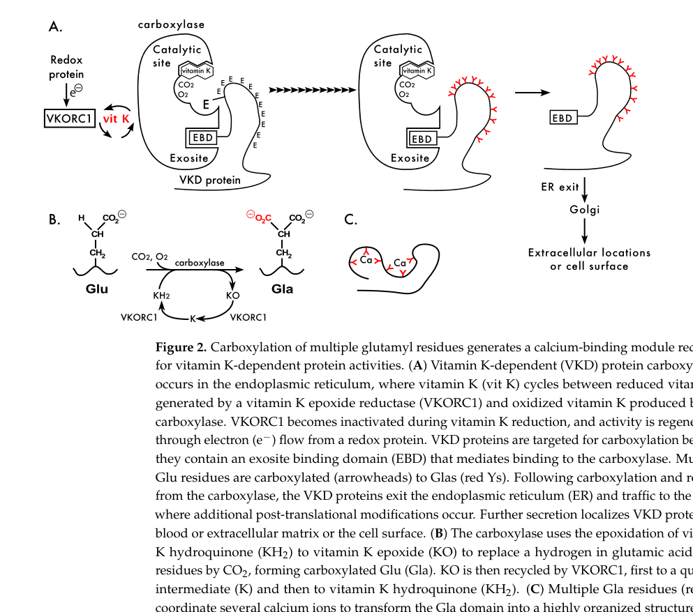

## Question

# Disease Characteristics Research Template

## Target Disease
- **Disease Name:** Vitamin K-Dependent Coagulation Factor Deficiency
- **MONDO ID:**  (if available)
- **Category:** Mendelian

## Research Objectives

Please provide a comprehensive research report on **Vitamin K-Dependent Coagulation Factor Deficiency** covering all of the
disease characteristics listed below. This report will be used to populate a disease knowledge
base entry. Be thorough and cite primary literature (PMID preferred) for all claims.

For each section, **suggested databases/resources** are listed. These are the first places
you should search for information on each topic.

---

### 1. Disease Information
> **Search first:** OMIM, Orphanet, ICD-10/ICD-11, MeSH, PubMed

- What is the disease? Provide a concise overview.
- What are the key identifiers? (OMIM, Orphanet, ICD-10/ICD-11, MeSH, Mondo)
- What are the common synonyms and alternative names?
- Is the information derived from individual patients (e.g., EHR) or aggregated disease-level resources?

### 2. Etiology

- **Disease Causal Factors**: What are the primary causes? (genetic, environmental, infectious, mechanistic)
- **Risk Factors**:
  > **Search first:** PubMed, Cochrane Library, UpToDate, clinical guidelines, ClinVar, ClinGen, GWAS Catalog, PheGenI, CTD, CDC, WHO, epidemiological databases
  - Genetic risk factors (causal variants, susceptibility loci, modifier genes)
  - Environmental risk factors (toxins, lifestyle, occupational exposures, age, sex, family history)
- **Protective Factors**:
  > **Search first:** PubMed, Cochrane Library, clinical trial databases, GWAS Catalog, gnomAD, WHO, CDC, nutrition databases
  - Genetic protective factors (protective variants, modifier alleles)
  - Environmental protective factors (diet, lifestyle, exposures that reduce risk)
- **Gene-Environment Interactions**: How do genetic and environmental factors interact to influence disease?
  > **Search first:** CTD, PubMed, PheGenI, GxE databases

### 3. Phenotypes
> **Search first:** HPO (Human Phenotype Ontology), OMIM, Orphanet, PubMed, clinicaltrials.gov, MedDRA, SNOMED CT, DECIPHER, LOINC

For each phenotype, provide:
- **Phenotype type**: symptoms, clinical signs, physical manifestations, behavioral changes, or laboratory abnormalities
  > For symptoms/signs: HPO, OMIM, Orphanet, PubMed
  > For behavioral changes: HPO, DSM, RDoC (Research Domain Criteria), PubMed
  > For laboratory abnormalities: LOINC, SNOMED CT, LabTests Online, PubMed
- **Phenotype characteristics**:
  > **Search first:** OMIM, Orphanet, HPO, PubMed
  - Age of symptom onset (neonatal, childhood, adult-onset, late-onset)
  - Symptom severity (mild, moderate, severe, variable)
  - Symptom progression (stable, progressive, episodic, fluctuating)
  - Frequency among affected individuals (percentage or qualitative)
- **Quality of life impact**: Effects on daily functioning and well-being (per-phenotype when possible)
  > **Search first:** EQ-5D database, SF-36, WHO QOL databases, PubMed
- Suggest HPO (Human Phenotype Ontology) terms for each phenotype

### 4. Genetic/Molecular Information

- **Causal Genes**: Gene mutations or chromosomal abnormalities responsible for disease (gene symbols, OMIM IDs)
  > **Search first:** OMIM, ClinVar, HGMD, Ensembl, NCBI Gene
- **Pathogenic Variants**:
  - Affected genes (gene symbols, HGNC IDs)
    > **Search first:** OMIM, NCBI Gene, Ensembl, HGNC, UniProt, GeneCards
  - Variant classification (pathogenic, likely pathogenic, VUS per ACMG/AMP guidelines)
    > **Search first:** ClinVar, ClinGen, ACMG/AMP guidelines, VarSome
  - Variant type/class (missense, frameshift, nonsense, splice-site, structural)
  - Allele frequency in population databases
    > **Search first:** gnomAD, 1000 Genomes, ExAC, TOPMed, dbSNP
  - Somatic vs germline origin
    > **Search first:** COSMIC (somatic), ClinVar, ICGC, TCGA
  - Functional consequences (loss of function, gain of function, dominant negative)
- **Modifier Genes**: Genes that modify disease severity or expression
- **Epigenetic Information**: DNA methylation, histone modifications, chromatin changes affecting disease
  > **Search first:** ENCODE, Roadmap Epigenomics, MethBase, DiseaseMeth
- **Chromosomal Abnormalities**: Large-scale genetic changes (aneuploidy, translocations, inversions)
  > **Search first:** DECIPHER, ClinVar, ECARUCA, UCSC Genome Browser

### 5. Environmental Information

- **Environmental Factors**: Non-genetic contributing factors (toxins, radiation, pollution, occupational exposure)
  > **Search first:** CTD (Comparative Toxicogenomics Database), TOXNET, PubMed, EPA databases
- **Lifestyle Factors**: Behavioral factors (smoking, diet, exercise, alcohol consumption)
  > **Search first:** CDC databases, WHO, PubMed, NHANES
- **Infectious Agents**: If applicable, pathogens causing or triggering disease (bacteria, viruses, fungi, parasites)
  > **Search first:** NCBI Taxonomy, ViPR, BV-BRC, MicrobeDB, GIDEON

### 6. Mechanism / Pathophysiology

- **Molecular Pathways**: Specific signaling cascades or biochemical pathways involved (Wnt, MAPK, mTOR, PI3K-AKT, etc.)
  > **Search first:** KEGG, Reactome, WikiPathways, PathBank, BioCyc
- **Cellular Processes**: Cell-level mechanisms (apoptosis, autophagy, cell cycle dysregulation, inflammation, etc.)
  > **Search first:** Gene Ontology (GO), Reactome, KEGG, PubMed
- **Protein Dysfunction**: How protein structure or function is altered (misfolding, aggregation, loss of function, gain of function)
  > **Search first:** UniProt, PDB (Protein Data Bank), InterPro, Pfam, AlphaFold
- **Metabolic Changes**: Alterations in metabolic processes (energy metabolism, lipid metabolism, amino acid metabolism)
  > **Search first:** KEGG, BioCyc, HMDB (Human Metabolome Database), BRENDA
- **Immune System Involvement**: Role of immune response (autoimmunity, immunodeficiency, chronic inflammation)
  > **Search first:** ImmPort, Immunome Database, IEDB, Gene Ontology
- **Tissue Damage Mechanisms**: How tissues/ are injured (oxidative stress, ischemia, fibrosis, necrosis)
  > **Search first:** PubMed, Gene Ontology, Reactome
- **Biochemical Abnormalities**: Specific molecular defects (enzyme deficiencies, receptor dysfunction, ion channel defects)
  > **Search first:** BRENDA, UniProt, KEGG, OMIM, PubMed
- **Epigenetic Changes**: DNA methylation, histone modifications affecting gene expression in disease
  > **Search first:** ENCODE, Roadmap Epigenomics, MethBase, DiseaseMeth
- **Molecular Profiling** (if available):
  - Transcriptomics/gene expression changes
    > **Search first:** GEO (Gene Expression Omnibus), ArrayExpress, GTEx, Human Cell Atlas, SRA
  - Proteomics findings
    > **Search first:** PRIDE, ProteomeXchange, Human Protein Atlas, STRING, BioGRID
  - Metabolomics signatures
    > **Search first:** MetaboLights, Metabolomics Workbench, HMDB, METLIN
  - Lipidomics alterations
    > **Search first:** LIPID MAPS, SwissLipids, LipidHome, Metabolomics Workbench
  - Genomic structural features
    > **Search first:** UCSC Genome Browser, Ensembl, NCBI, dbVar, DGV
- **Advanced Technologies** (if applicable):
  - Single-cell analysis findings (cell-type specific mechanisms, cellular heterogeneity)
    > **Search first:** Human Cell Atlas, Single Cell Portal, GEO, CELLxGENE
  - Spatial transcriptomics findings
    > **Search first:** GEO, Spatial Research, Vizgen, 10x Genomics data
  - Multi-omics integration results
    > **Search first:** TCGA, ICGC, cBioPortal, LinkedOmics, PubMed
  - Functional genomics screens (CRISPR, RNAi)
    > **Search first:** DepMap, GenomeRNAi, PubMed, BioGRID ORCS

For each mechanism, describe:
- The causal chain from initial trigger to clinical manifestation
- Which mechanisms are upstream vs downstream
- What cell types and biological processes are involved
- Suggest GO terms for biological processes and CL terms for cell types

### 7. Anatomical Structures Affected

- **Organ Level**:
  - Primary organs directly affected
  - Secondary organ involvement (complications, secondary effects)
  - Body systems involved (cardiovascular, nervous, digestive, respiratory, endocrine, etc.)
  > **Search first:** Uberon, FMA (Foundational Model of Anatomy), OMIM, HPO, ICD-11, MeSH, SNOMED CT
- **Tissue and Cell Level**:
  - Specific tissue types affected (epithelial, connective, muscle, nervous)
  - Specific cell populations targeted (with Cell Ontology terms)
  > **Search first:** Uberon, Human Protein Atlas, Cell Ontology, Human Cell Atlas, CellMarker, PanglaoDB
- **Subcellular Level**:
  - Cellular compartments involved (mitochondria, nucleus, ER, lysosomes) (with GO Cellular Component terms)
  > **Search first:** Gene Ontology (Cellular Component), UniProt, Human Protein Atlas
- **Localization**:
  - Specific anatomical sites (with UBERON terms)
    > **Search first:** FMA, Uberon, NeuroNames (for brain), SNOMED CT
  - Lateralization (unilateral, bilateral, asymmetric)
    > **Search first:** HPO, clinical literature, imaging databases

### 8. Temporal Development

- **Onset**:
  - Typical age of onset (congenital, pediatric, adult, geriatric)
  - Onset pattern (acute, subacute, chronic, insidious)
  > **Search first:** OMIM, Orphanet, HPO, PubMed
- **Progression**:
  - Disease stages (early, intermediate, advanced, end-stage)
    > **Search first:** Cancer Staging Manual (AJCC), WHO classifications, PubMed
  - Progression rate (rapid, slow, variable)
  - Disease course pattern (episodic, relapsing-remitting, progressive, stable)
  - Disease duration (self-limited, chronic lifelong)
  > **Search first:** Disease registries, longitudinal cohort databases, natural history studies, PubMed, Orphanet, OMIM
- **Patterns**:
  - Remission patterns (spontaneous, treatment-induced)
    > **Search first:** Clinical trial databases, disease registries, PubMed
  - Critical periods (time windows of vulnerability or opportunity for intervention)
    > **Search first:** PubMed, developmental biology databases, clinical guidelines

### 9. Inheritance and Population

- **Epidemiology**:
  - Prevalence (cases per 100,000 at given time)
  - Incidence (new cases per 100,000 per year)
  > **Search first:** Orphanet, CDC, WHO, GBD (Global Burden of Disease), national registries, SEER, disease registries
- **For Genetic Etiology**:
  - Inheritance pattern (AD, AR, X-linked, mitochondrial, multifactorial, polygenic)
    > **Search first:** OMIM, Orphanet, ClinVar, GTR (Genetic Testing Registry)
  - Penetrance (complete, incomplete, age-dependent)
    > **Search first:** ClinVar, OMIM, PubMed, ClinGen
  - Expressivity (variable, consistent)
    > **Search first:** OMIM, ClinVar, PubMed
  - Genetic anticipation (increasing severity in successive generations)
    > **Search first:** OMIM, PubMed (especially for repeat expansion disorders)
  - Germline mosaicism
    > **Search first:** ClinVar, OMIM, genetic counseling literature, PubMed
  - Founder effects (population-specific mutations)
    > **Search first:** gnomAD, population genetics databases, PubMed
  - Consanguinity role
    > **Search first:** OMIM, population studies, genetic counseling resources
  - Carrier frequency
    > **Search first:** gnomAD, carrier screening databases, GeneReviews, GTR
- **Population Demographics**:
  - Affected populations (ethnic or demographic groups with higher prevalence)
    > **Search first:** gnomAD, 1000 Genomes, PAGE Study, PubMed, population registries
  - Geographic distribution (endemic areas, regional variation)
    > **Search first:** WHO, CDC, GBD, Orphanet, geographic epidemiology databases
  - Geographic distribution of specific variants
  - Sex ratio (male:female)
    > **Search first:** Disease registries, OMIM, PubMed, epidemiological databases
  - Age distribution of affected individuals
    > **Search first:** CDC, disease registries, SEER, Orphanet

### 10. Diagnostics

- **Clinical Tests**:
  - Laboratory tests (blood, urine, tissue chemistry, specific enzyme assays)
    > **Search first:** LOINC, LabTests Online, PubMed
  - Biomarkers (proteins, metabolites, genetic markers, circulating biomarkers)
    > **Search first:** FDA Biomarker List, BEST (Biomarkers, EndpointS, and other Tools), PubMed
  - Imaging studies (X-ray, CT, MRI, PET, ultrasound)
    > **Search first:** RadLex, DICOM, Radiopaedia, imaging databases
  - Functional tests (pulmonary function, cardiac stress tests)
    > **Search first:** LOINC, clinical guidelines, PubMed
  - Electrophysiology (EEG, EMG, ECG, nerve conduction studies)
    > **Search first:** LOINC, clinical neurophysiology databases, PubMed
  - Biopsy findings (histopathology, immunohistochemistry)
    > **Search first:** SNOMED CT, College of American Pathologists resources, PubMed
  - Pathology findings (microscopic examination)
    > **Search first:** SNOMED CT, Digital Pathology databases, PubMed
- **Genetic Testing**:
  > **Search first:** GTR (Genetic Testing Registry), GeneReviews, ClinGen
  - Overview of recommended genetic testing approach
  - Whole genome sequencing (WGS) utility
    > **Search first:** GTR, ClinVar, GEL (Genomics England), gnomAD
  - Whole exome sequencing (WES) utility
    > **Search first:** GTR, ClinVar, OMIM, GeneMatcher
  - Gene panels (which panels, which genes)
    > **Search first:** GTR, ClinVar, laboratory-specific databases
  - Single gene testing
    > **Search first:** GTR, ClinVar, OMIM, GeneReviews
  - Chromosomal microarray (CMA)
    > **Search first:** DECIPHER, ClinVar, dbVar, ECARUCA
  - Karyotyping
    > **Search first:** Chromosome Abnormality Database, ClinVar, cytogenetics resources
  - FISH
    > **Search first:** ClinVar, cytogenetics databases, PubMed
  - Mitochondrial DNA testing
    > **Search first:** MITOMAP, MSeqDR, ClinVar, GTR
  - Repeat expansion testing
    > **Search first:** GTR, ClinVar, repeat expansion databases, PubMed
- **Omics-Based Diagnostics** (if applicable):
  - RNA sequencing / transcriptomics
    > **Search first:** GEO, ArrayExpress, GTEx, RNA-seq databases
  - Proteomics
    > **Search first:** PRIDE, ProteomeXchange, FDA Biomarker database
  - Metabolomics
    > **Search first:** MetaboLights, Metabolomics Workbench, HMDB
  - Epigenomics
    > **Search first:** GEO, ENCODE, Roadmap Epigenomics, MethBase
  - Liquid biopsy
    > **Search first:** COSMIC, ClinVar, liquid biopsy databases, PubMed
- **Clinical Criteria**:
  - Standardized diagnostic criteria (DSM, ICD, society guidelines)
    > **Search first:** DSM-5, ICD-11, clinical society guidelines, UpToDate
  - Differential diagnosis (other conditions to rule out, with distinguishing features)
    > **Search first:** DynaMed, UpToDate, clinical decision support systems
- **Screening**:
  - Screening methods for asymptomatic individuals (newborn screening, carrier screening, cascade screening)
    > **Search first:** ACMG recommendations, CDC newborn screening, GTR

### 11. Outcome/Prognosis

- **Survival and Mortality**:
  - Survival rate (5-year, 10-year, overall)
    > **Search first:** SEER, cancer registries, disease-specific registries, PubMed
  - Life expectancy (with and without treatment if applicable)
    > **Search first:** Orphanet, disease registries, actuarial databases, PubMed
  - Mortality rate
    > **Search first:** CDC, WHO, GBD, national mortality databases
  - Disease-specific mortality (deaths directly attributable to disease)
    > **Search first:** Disease registries, CDC Wonder, GBD, PubMed
- **Morbidity and Function**:
  - Morbidity (disease-related disability and health impacts)
    > **Search first:** GBD, WHO, disability databases, PubMed
  - Disability outcomes (long-term functional impairments)
    > **Search first:** ICF (International Classification of Functioning), disability registries
  - Quality of life measures (EQ-5D, SF-36, PROMIS, disease-specific tools)
    > **Search first:** EQ-5D database, SF-36, PROMIS, PubMed
- **Disease Course**:
  - Complications (secondary problems: infections, organ failure, etc.)
    > **Search first:** ICD codes, disease registries, clinical databases, PubMed
  - Recovery potential (likelihood and extent of recovery, with vs without treatment)
    > **Search first:** Natural history studies, rehabilitation databases, PubMed
- **Prediction**:
  - Prognostic factors (age, disease severity, biomarkers, treatment response)
    > **Search first:** Prognostic models databases, clinical calculators, PubMed
  - Prognostic biomarkers (molecular markers predicting disease course)
    > **Search first:** FDA Biomarker database, PubMed, cancer prognostic databases

### 12. Treatment

- **Pharmacotherapy**:
  - Pharmacological treatments (drug names, drug classes, mechanisms of action)
    > **Search first:** DrugBank, RxNorm, ATC classification, DailyMed, FDA databases
  - Pharmacogenomics (how genetic variants affect drug metabolism, efficacy, toxicity)
    > **Search first:** PharmGKB, CPIC (Clinical Pharmacogenetics), FDA Table of PGx Biomarkers
- **Advanced Therapeutics**:
  - Gene therapy (viral vectors, CRISPR, gene replacement, gene editing)
    > **Search first:** ClinicalTrials.gov, FDA gene therapy database, ASGCT resources
  - Cell therapy (stem cell transplant, CAR-T, cellular therapeutics)
    > **Search first:** ClinicalTrials.gov, FDA cell therapy database, FACT standards
  - RNA-based therapies (ASOs, siRNA, mRNA therapies)
    > **Search first:** ClinicalTrials.gov, FDA approvals, PubMed
  - Targeted therapies (treatments directed at specific molecular targets)
    > **Search first:** My Cancer Genome, OncoKB, ClinicalTrials.gov, FDA approvals
  - Immunotherapies (checkpoint inhibitors, monoclonal antibodies)
    > **Search first:** Cancer Immunotherapy Database, FDA approvals, ClinicalTrials.gov
- **Surgical and Interventional**:
  - Surgical interventions (types of surgery, timing, outcomes)
    > **Search first:** CPT codes, surgical registries, clinical guidelines, PubMed
- **Supportive and Rehabilitative**:
  - Supportive care (symptom management, pain control, nutrition)
    > **Search first:** Clinical guidelines, Cochrane Library, PubMed
  - Rehabilitation (physical therapy, occupational therapy, speech therapy)
    > **Search first:** Rehabilitation medicine databases, clinical guidelines, PubMed
- **Experimental**:
  - Experimental treatments in clinical trials (with NCT identifiers if available)
    > **Search first:** ClinicalTrials.gov, EU Clinical Trials Register, WHO ICTRP
- **Treatment Outcomes**:
  - Treatment response rates
    > **Search first:** Clinical trial databases, FDA reviews, systematic reviews, PubMed
  - Side effects and adverse events
    > **Search first:** FDA Adverse Event Reporting System (FAERS), MedWatch, PubMed
- **Treatment Strategy**:
  - Treatment algorithms (clinical pathways, decision trees)
    > **Search first:** Clinical practice guidelines, NCCN Guidelines, UpToDate
  - Combination therapies
    > **Search first:** ClinicalTrials.gov, treatment guidelines, PubMed
  - Personalized medicine approaches (genotype-guided treatment)
    > **Search first:** My Cancer Genome, CIViC, PharmGKB, precision medicine databases

For each treatment, suggest MAXO (Medical Action Ontology) terms where applicable.

### 13. Prevention

- **Prevention Levels**:
  - Primary prevention (preventing disease occurrence: vaccination, risk factor modification)
    > **Search first:** CDC, WHO, USPSTF recommendations, Cochrane Library
  - Secondary prevention (early detection and treatment: screening programs, early intervention)
    > **Search first:** USPSTF, CDC screening guidelines, WHO
  - Tertiary prevention (preventing complications in those with disease)
    > **Search first:** Clinical guidelines, disease management protocols, PubMed
- **Immunization**: Vaccine strategies (if applicable)
  > **Search first:** CDC vaccine schedules, WHO immunization, FDA vaccine database
- **Screening and Early Detection**:
  - Screening programs (population-based: newborn screening, cancer screening)
    > **Search first:** CDC screening programs, USPSTF, cancer screening databases
  - Genetic screening (carrier screening, preimplantation genetic diagnosis, prenatal testing)
    > **Search first:** ACMG recommendations, ACOG guidelines, GTR
  - Risk stratification (identifying high-risk individuals for targeted prevention)
    > **Search first:** Risk prediction models, clinical calculators, PubMed
- **Behavioral Interventions**: Lifestyle modifications to reduce risk
  > **Search first:** CDC, WHO, behavioral intervention databases, Cochrane Library
- **Counseling**: Genetic counseling (risk assessment, family planning guidance)
  > **Search first:** NSGC resources, ACMG guidelines, GeneReviews
- **Public Health**:
  - Public health interventions (sanitation, vector control, health education)
    > **Search first:** CDC, WHO, public health databases, PubMed
  - Environmental interventions (reducing environmental risk factors)
    > **Search first:** EPA databases, WHO environmental health, PubMed
- **Prophylaxis**: Preventive medications or procedures
  > **Search first:** Clinical guidelines, FDA approvals, PubMed

### 14. Other Species / Natural Disease

- **Taxonomy**: Species affected (with NCBI Taxon identifiers)
  > **Search first:** NCBI Taxonomy
- **Breed**: Specific breeds affected (with VBO identifiers if applicable)
  > **Search first:** VBO (Vertebrate Breed Ontology)
- **Gene**: Orthologous genes in other species (with NCBI Gene IDs)
  > **Search first:** NCBI Gene
- **Natural Disease**:
  - Naturally occurring disease in other species (companion animals, wildlife)
    > **Search first:** OMIA (Online Mendelian Inheritance in Animals), VetCompass, PubMed
  - Veterinary relevance and importance in animal health
    > **Search first:** OMIA, veterinary databases, PubMed
- **Comparative Biology**:
  - Comparative pathology (similarities and differences across species)
    > **Search first:** OMIA, comparative pathology databases, PubMed
  - Evolutionary conservation of disease mechanisms
    > **Search first:** HomoloGene, OrthoMCL, Alliance of Genome Resources
- **Transmission** (if applicable):
  - Zoonotic potential
    > **Search first:** CDC zoonotic diseases, WHO zoonoses, GIDEON
  - Cross-species susceptibility
    > **Search first:** NCBI Taxonomy, veterinary databases, PubMed

### 15. Model Organisms

- **Model Types**:
  - Model organism type (mammalian, invertebrate, cellular, in vitro)
    > **Search first:** Alliance of Genome Resources, model organism databases
  - Specific model systems (mouse, rat, zebrafish, Drosophila, C. elegans, yeast, cell lines, organoids, iPSCs)
    > **Search first:** MGI, RGD, ZFIN, FlyBase, WormBase, SGD, ATCC, Cellosaurus
  - Induced models (drug treatment, surgical intervention, environmental manipulation)
    > **Search first:** MGI, model organism databases, PubMed
- **Genetic Models**:
  - Types available (knockout, knock-in, transgenic, conditional, humanized)
    > **Search first:** MGI, IMPC, KOMP, EuMMCR, IMSR
- **Model Characteristics**:
  - Phenotype recapitulation (how well model reproduces human disease features)
    > **Search first:** Model organism databases, comparative studies, PubMed
  - Model limitations (aspects of human disease not captured)
    > **Search first:** Model organism databases, PubMed, review articles
- **Applications**:
  - Research applications (what aspects of disease can be studied)
    > **Search first:** Model organism databases, PubMed
- **Resources**:
  - Model databases
    > **Search first:** MGI, RGD, ZFIN, FlyBase, WormBase, IMSR, EMMA, MMRRC

---

## Citation Requirements

- Cite primary literature (PMID preferred) for all mechanistic and clinical claims
- Prioritize recent reviews and landmark papers
- Include direct quotes from abstracts where possible to support key statements
- Distinguish evidence source types: human clinical, model organism, in vitro, computational

## Output Format

Structure your response as a comprehensive narrative organized by the sections above.
For each section, provide:
- Factual content with specific details (numbers, percentages, gene names, variant nomenclature)
- Ontology term suggestions (HPO, GO, CL, UBERON, CHEBI, MAXO, MONDO) where applicable
- Evidence citations with PMIDs
- Direct quotes from abstracts to support key claims
- Clear indication when information is not available or not applicable for this disease

This report will be used to populate a disease knowledge base entry with:
- Pathophysiology descriptions with causal chains
- Gene/protein annotations (HGNC, GO terms)
- Phenotype associations (HP terms) with frequencies
- Cell type involvement (CL terms)
- Anatomical locations (UBERON terms)
- Chemical entities (CHEBI terms)
- Treatment annotations (MAXO terms)
- Evidence items with PMIDs and exact abstract quotes
- Epidemiology, prognosis, diagnostic, and prevention information
- Animal model descriptions with phenotype recapitulation details

## Output

Question: You are an expert researcher providing comprehensive, well-cited information.

Provide detailed information focusing on:
1. Key concepts and definitions with current understanding
2. Recent developments and latest research (prioritize 2023-2024 sources)
3. Current applications and real-world implementations
4. Expert opinions and analysis from authoritative sources
5. Relevant statistics and data from recent studies

Format as a comprehensive research report with proper citations. Include URLs and publication dates where available.
Always prioritize recent, authoritative sources and provide specific citations for all major claims.

# Disease Characteristics Research Template

## Target Disease
- **Disease Name:** Vitamin K-Dependent Coagulation Factor Deficiency
- **MONDO ID:**  (if available)
- **Category:** Mendelian

## Research Objectives

Please provide a comprehensive research report on **Vitamin K-Dependent Coagulation Factor Deficiency** covering all of the
disease characteristics listed below. This report will be used to populate a disease knowledge
base entry. Be thorough and cite primary literature (PMID preferred) for all claims.

For each section, **suggested databases/resources** are listed. These are the first places
you should search for information on each topic.

---

### 1. Disease Information
> **Search first:** OMIM, Orphanet, ICD-10/ICD-11, MeSH, PubMed

- What is the disease? Provide a concise overview.
- What are the key identifiers? (OMIM, Orphanet, ICD-10/ICD-11, MeSH, Mondo)
- What are the common synonyms and alternative names?
- Is the information derived from individual patients (e.g., EHR) or aggregated disease-level resources?

### 2. Etiology

- **Disease Causal Factors**: What are the primary causes? (genetic, environmental, infectious, mechanistic)
- **Risk Factors**:
  > **Search first:** PubMed, Cochrane Library, UpToDate, clinical guidelines, ClinVar, ClinGen, GWAS Catalog, PheGenI, CTD, CDC, WHO, epidemiological databases
  - Genetic risk factors (causal variants, susceptibility loci, modifier genes)
  - Environmental risk factors (toxins, lifestyle, occupational exposures, age, sex, family history)
- **Protective Factors**:
  > **Search first:** PubMed, Cochrane Library, clinical trial databases, GWAS Catalog, gnomAD, WHO, CDC, nutrition databases
  - Genetic protective factors (protective variants, modifier alleles)
  - Environmental protective factors (diet, lifestyle, exposures that reduce risk)
- **Gene-Environment Interactions**: How do genetic and environmental factors interact to influence disease?
  > **Search first:** CTD, PubMed, PheGenI, GxE databases

### 3. Phenotypes
> **Search first:** HPO (Human Phenotype Ontology), OMIM, Orphanet, PubMed, clinicaltrials.gov, MedDRA, SNOMED CT, DECIPHER, LOINC

For each phenotype, provide:
- **Phenotype type**: symptoms, clinical signs, physical manifestations, behavioral changes, or laboratory abnormalities
  > For symptoms/signs: HPO, OMIM, Orphanet, PubMed
  > For behavioral changes: HPO, DSM, RDoC (Research Domain Criteria), PubMed
  > For laboratory abnormalities: LOINC, SNOMED CT, LabTests Online, PubMed
- **Phenotype characteristics**:
  > **Search first:** OMIM, Orphanet, HPO, PubMed
  - Age of symptom onset (neonatal, childhood, adult-onset, late-onset)
  - Symptom severity (mild, moderate, severe, variable)
  - Symptom progression (stable, progressive, episodic, fluctuating)
  - Frequency among affected individuals (percentage or qualitative)
- **Quality of life impact**: Effects on daily functioning and well-being (per-phenotype when possible)
  > **Search first:** EQ-5D database, SF-36, WHO QOL databases, PubMed
- Suggest HPO (Human Phenotype Ontology) terms for each phenotype

### 4. Genetic/Molecular Information

- **Causal Genes**: Gene mutations or chromosomal abnormalities responsible for disease (gene symbols, OMIM IDs)
  > **Search first:** OMIM, ClinVar, HGMD, Ensembl, NCBI Gene
- **Pathogenic Variants**:
  - Affected genes (gene symbols, HGNC IDs)
    > **Search first:** OMIM, NCBI Gene, Ensembl, HGNC, UniProt, GeneCards
  - Variant classification (pathogenic, likely pathogenic, VUS per ACMG/AMP guidelines)
    > **Search first:** ClinVar, ClinGen, ACMG/AMP guidelines, VarSome
  - Variant type/class (missense, frameshift, nonsense, splice-site, structural)
  - Allele frequency in population databases
    > **Search first:** gnomAD, 1000 Genomes, ExAC, TOPMed, dbSNP
  - Somatic vs germline origin
    > **Search first:** COSMIC (somatic), ClinVar, ICGC, TCGA
  - Functional consequences (loss of function, gain of function, dominant negative)
- **Modifier Genes**: Genes that modify disease severity or expression
- **Epigenetic Information**: DNA methylation, histone modifications, chromatin changes affecting disease
  > **Search first:** ENCODE, Roadmap Epigenomics, MethBase, DiseaseMeth
- **Chromosomal Abnormalities**: Large-scale genetic changes (aneuploidy, translocations, inversions)
  > **Search first:** DECIPHER, ClinVar, ECARUCA, UCSC Genome Browser

### 5. Environmental Information

- **Environmental Factors**: Non-genetic contributing factors (toxins, radiation, pollution, occupational exposure)
  > **Search first:** CTD (Comparative Toxicogenomics Database), TOXNET, PubMed, EPA databases
- **Lifestyle Factors**: Behavioral factors (smoking, diet, exercise, alcohol consumption)
  > **Search first:** CDC databases, WHO, PubMed, NHANES
- **Infectious Agents**: If applicable, pathogens causing or triggering disease (bacteria, viruses, fungi, parasites)
  > **Search first:** NCBI Taxonomy, ViPR, BV-BRC, MicrobeDB, GIDEON

### 6. Mechanism / Pathophysiology

- **Molecular Pathways**: Specific signaling cascades or biochemical pathways involved (Wnt, MAPK, mTOR, PI3K-AKT, etc.)
  > **Search first:** KEGG, Reactome, WikiPathways, PathBank, BioCyc
- **Cellular Processes**: Cell-level mechanisms (apoptosis, autophagy, cell cycle dysregulation, inflammation, etc.)
  > **Search first:** Gene Ontology (GO), Reactome, KEGG, PubMed
- **Protein Dysfunction**: How protein structure or function is altered (misfolding, aggregation, loss of function, gain of function)
  > **Search first:** UniProt, PDB (Protein Data Bank), InterPro, Pfam, AlphaFold
- **Metabolic Changes**: Alterations in metabolic processes (energy metabolism, lipid metabolism, amino acid metabolism)
  > **Search first:** KEGG, BioCyc, HMDB (Human Metabolome Database), BRENDA
- **Immune System Involvement**: Role of immune response (autoimmunity, immunodeficiency, chronic inflammation)
  > **Search first:** ImmPort, Immunome Database, IEDB, Gene Ontology
- **Tissue Damage Mechanisms**: How tissues/ are injured (oxidative stress, ischemia, fibrosis, necrosis)
  > **Search first:** PubMed, Gene Ontology, Reactome
- **Biochemical Abnormalities**: Specific molecular defects (enzyme deficiencies, receptor dysfunction, ion channel defects)
  > **Search first:** BRENDA, UniProt, KEGG, OMIM, PubMed
- **Epigenetic Changes**: DNA methylation, histone modifications affecting gene expression in disease
  > **Search first:** ENCODE, Roadmap Epigenomics, MethBase, DiseaseMeth
- **Molecular Profiling** (if available):
  - Transcriptomics/gene expression changes
    > **Search first:** GEO (Gene Expression Omnibus), ArrayExpress, GTEx, Human Cell Atlas, SRA
  - Proteomics findings
    > **Search first:** PRIDE, ProteomeXchange, Human Protein Atlas, STRING, BioGRID
  - Metabolomics signatures
    > **Search first:** MetaboLights, Metabolomics Workbench, HMDB, METLIN
  - Lipidomics alterations
    > **Search first:** LIPID MAPS, SwissLipids, LipidHome, Metabolomics Workbench
  - Genomic structural features
    > **Search first:** UCSC Genome Browser, Ensembl, NCBI, dbVar, DGV
- **Advanced Technologies** (if applicable):
  - Single-cell analysis findings (cell-type specific mechanisms, cellular heterogeneity)
    > **Search first:** Human Cell Atlas, Single Cell Portal, GEO, CELLxGENE
  - Spatial transcriptomics findings
    > **Search first:** GEO, Spatial Research, Vizgen, 10x Genomics data
  - Multi-omics integration results
    > **Search first:** TCGA, ICGC, cBioPortal, LinkedOmics, PubMed
  - Functional genomics screens (CRISPR, RNAi)
    > **Search first:** DepMap, GenomeRNAi, PubMed, BioGRID ORCS

For each mechanism, describe:
- The causal chain from initial trigger to clinical manifestation
- Which mechanisms are upstream vs downstream
- What cell types and biological processes are involved
- Suggest GO terms for biological processes and CL terms for cell types

### 7. Anatomical Structures Affected

- **Organ Level**:
  - Primary organs directly affected
  - Secondary organ involvement (complications, secondary effects)
  - Body systems involved (cardiovascular, nervous, digestive, respiratory, endocrine, etc.)
  > **Search first:** Uberon, FMA (Foundational Model of Anatomy), OMIM, HPO, ICD-11, MeSH, SNOMED CT
- **Tissue and Cell Level**:
  - Specific tissue types affected (epithelial, connective, muscle, nervous)
  - Specific cell populations targeted (with Cell Ontology terms)
  > **Search first:** Uberon, Human Protein Atlas, Cell Ontology, Human Cell Atlas, CellMarker, PanglaoDB
- **Subcellular Level**:
  - Cellular compartments involved (mitochondria, nucleus, ER, lysosomes) (with GO Cellular Component terms)
  > **Search first:** Gene Ontology (Cellular Component), UniProt, Human Protein Atlas
- **Localization**:
  - Specific anatomical sites (with UBERON terms)
    > **Search first:** FMA, Uberon, NeuroNames (for brain), SNOMED CT
  - Lateralization (unilateral, bilateral, asymmetric)
    > **Search first:** HPO, clinical literature, imaging databases

### 8. Temporal Development

- **Onset**:
  - Typical age of onset (congenital, pediatric, adult, geriatric)
  - Onset pattern (acute, subacute, chronic, insidious)
  > **Search first:** OMIM, Orphanet, HPO, PubMed
- **Progression**:
  - Disease stages (early, intermediate, advanced, end-stage)
    > **Search first:** Cancer Staging Manual (AJCC), WHO classifications, PubMed
  - Progression rate (rapid, slow, variable)
  - Disease course pattern (episodic, relapsing-remitting, progressive, stable)
  - Disease duration (self-limited, chronic lifelong)
  > **Search first:** Disease registries, longitudinal cohort databases, natural history studies, PubMed, Orphanet, OMIM
- **Patterns**:
  - Remission patterns (spontaneous, treatment-induced)
    > **Search first:** Clinical trial databases, disease registries, PubMed
  - Critical periods (time windows of vulnerability or opportunity for intervention)
    > **Search first:** PubMed, developmental biology databases, clinical guidelines

### 9. Inheritance and Population

- **Epidemiology**:
  - Prevalence (cases per 100,000 at given time)
  - Incidence (new cases per 100,000 per year)
  > **Search first:** Orphanet, CDC, WHO, GBD (Global Burden of Disease), national registries, SEER, disease registries
- **For Genetic Etiology**:
  - Inheritance pattern (AD, AR, X-linked, mitochondrial, multifactorial, polygenic)
    > **Search first:** OMIM, Orphanet, ClinVar, GTR (Genetic Testing Registry)
  - Penetrance (complete, incomplete, age-dependent)
    > **Search first:** ClinVar, OMIM, PubMed, ClinGen
  - Expressivity (variable, consistent)
    > **Search first:** OMIM, ClinVar, PubMed
  - Genetic anticipation (increasing severity in successive generations)
    > **Search first:** OMIM, PubMed (especially for repeat expansion disorders)
  - Germline mosaicism
    > **Search first:** ClinVar, OMIM, genetic counseling literature, PubMed
  - Founder effects (population-specific mutations)
    > **Search first:** gnomAD, population genetics databases, PubMed
  - Consanguinity role
    > **Search first:** OMIM, population studies, genetic counseling resources
  - Carrier frequency
    > **Search first:** gnomAD, carrier screening databases, GeneReviews, GTR
- **Population Demographics**:
  - Affected populations (ethnic or demographic groups with higher prevalence)
    > **Search first:** gnomAD, 1000 Genomes, PAGE Study, PubMed, population registries
  - Geographic distribution (endemic areas, regional variation)
    > **Search first:** WHO, CDC, GBD, Orphanet, geographic epidemiology databases
  - Geographic distribution of specific variants
  - Sex ratio (male:female)
    > **Search first:** Disease registries, OMIM, PubMed, epidemiological databases
  - Age distribution of affected individuals
    > **Search first:** CDC, disease registries, SEER, Orphanet

### 10. Diagnostics

- **Clinical Tests**:
  - Laboratory tests (blood, urine, tissue chemistry, specific enzyme assays)
    > **Search first:** LOINC, LabTests Online, PubMed
  - Biomarkers (proteins, metabolites, genetic markers, circulating biomarkers)
    > **Search first:** FDA Biomarker List, BEST (Biomarkers, EndpointS, and other Tools), PubMed
  - Imaging studies (X-ray, CT, MRI, PET, ultrasound)
    > **Search first:** RadLex, DICOM, Radiopaedia, imaging databases
  - Functional tests (pulmonary function, cardiac stress tests)
    > **Search first:** LOINC, clinical guidelines, PubMed
  - Electrophysiology (EEG, EMG, ECG, nerve conduction studies)
    > **Search first:** LOINC, clinical neurophysiology databases, PubMed
  - Biopsy findings (histopathology, immunohistochemistry)
    > **Search first:** SNOMED CT, College of American Pathologists resources, PubMed
  - Pathology findings (microscopic examination)
    > **Search first:** SNOMED CT, Digital Pathology databases, PubMed
- **Genetic Testing**:
  > **Search first:** GTR (Genetic Testing Registry), GeneReviews, ClinGen
  - Overview of recommended genetic testing approach
  - Whole genome sequencing (WGS) utility
    > **Search first:** GTR, ClinVar, GEL (Genomics England), gnomAD
  - Whole exome sequencing (WES) utility
    > **Search first:** GTR, ClinVar, OMIM, GeneMatcher
  - Gene panels (which panels, which genes)
    > **Search first:** GTR, ClinVar, laboratory-specific databases
  - Single gene testing
    > **Search first:** GTR, ClinVar, OMIM, GeneReviews
  - Chromosomal microarray (CMA)
    > **Search first:** DECIPHER, ClinVar, dbVar, ECARUCA
  - Karyotyping
    > **Search first:** Chromosome Abnormality Database, ClinVar, cytogenetics resources
  - FISH
    > **Search first:** ClinVar, cytogenetics databases, PubMed
  - Mitochondrial DNA testing
    > **Search first:** MITOMAP, MSeqDR, ClinVar, GTR
  - Repeat expansion testing
    > **Search first:** GTR, ClinVar, repeat expansion databases, PubMed
- **Omics-Based Diagnostics** (if applicable):
  - RNA sequencing / transcriptomics
    > **Search first:** GEO, ArrayExpress, GTEx, RNA-seq databases
  - Proteomics
    > **Search first:** PRIDE, ProteomeXchange, FDA Biomarker database
  - Metabolomics
    > **Search first:** MetaboLights, Metabolomics Workbench, HMDB
  - Epigenomics
    > **Search first:** GEO, ENCODE, Roadmap Epigenomics, MethBase
  - Liquid biopsy
    > **Search first:** COSMIC, ClinVar, liquid biopsy databases, PubMed
- **Clinical Criteria**:
  - Standardized diagnostic criteria (DSM, ICD, society guidelines)
    > **Search first:** DSM-5, ICD-11, clinical society guidelines, UpToDate
  - Differential diagnosis (other conditions to rule out, with distinguishing features)
    > **Search first:** DynaMed, UpToDate, clinical decision support systems
- **Screening**:
  - Screening methods for asymptomatic individuals (newborn screening, carrier screening, cascade screening)
    > **Search first:** ACMG recommendations, CDC newborn screening, GTR

### 11. Outcome/Prognosis

- **Survival and Mortality**:
  - Survival rate (5-year, 10-year, overall)
    > **Search first:** SEER, cancer registries, disease-specific registries, PubMed
  - Life expectancy (with and without treatment if applicable)
    > **Search first:** Orphanet, disease registries, actuarial databases, PubMed
  - Mortality rate
    > **Search first:** CDC, WHO, GBD, national mortality databases
  - Disease-specific mortality (deaths directly attributable to disease)
    > **Search first:** Disease registries, CDC Wonder, GBD, PubMed
- **Morbidity and Function**:
  - Morbidity (disease-related disability and health impacts)
    > **Search first:** GBD, WHO, disability databases, PubMed
  - Disability outcomes (long-term functional impairments)
    > **Search first:** ICF (International Classification of Functioning), disability registries
  - Quality of life measures (EQ-5D, SF-36, PROMIS, disease-specific tools)
    > **Search first:** EQ-5D database, SF-36, PROMIS, PubMed
- **Disease Course**:
  - Complications (secondary problems: infections, organ failure, etc.)
    > **Search first:** ICD codes, disease registries, clinical databases, PubMed
  - Recovery potential (likelihood and extent of recovery, with vs without treatment)
    > **Search first:** Natural history studies, rehabilitation databases, PubMed
- **Prediction**:
  - Prognostic factors (age, disease severity, biomarkers, treatment response)
    > **Search first:** Prognostic models databases, clinical calculators, PubMed
  - Prognostic biomarkers (molecular markers predicting disease course)
    > **Search first:** FDA Biomarker database, PubMed, cancer prognostic databases

### 12. Treatment

- **Pharmacotherapy**:
  - Pharmacological treatments (drug names, drug classes, mechanisms of action)
    > **Search first:** DrugBank, RxNorm, ATC classification, DailyMed, FDA databases
  - Pharmacogenomics (how genetic variants affect drug metabolism, efficacy, toxicity)
    > **Search first:** PharmGKB, CPIC (Clinical Pharmacogenetics), FDA Table of PGx Biomarkers
- **Advanced Therapeutics**:
  - Gene therapy (viral vectors, CRISPR, gene replacement, gene editing)
    > **Search first:** ClinicalTrials.gov, FDA gene therapy database, ASGCT resources
  - Cell therapy (stem cell transplant, CAR-T, cellular therapeutics)
    > **Search first:** ClinicalTrials.gov, FDA cell therapy database, FACT standards
  - RNA-based therapies (ASOs, siRNA, mRNA therapies)
    > **Search first:** ClinicalTrials.gov, FDA approvals, PubMed
  - Targeted therapies (treatments directed at specific molecular targets)
    > **Search first:** My Cancer Genome, OncoKB, ClinicalTrials.gov, FDA approvals
  - Immunotherapies (checkpoint inhibitors, monoclonal antibodies)
    > **Search first:** Cancer Immunotherapy Database, FDA approvals, ClinicalTrials.gov
- **Surgical and Interventional**:
  - Surgical interventions (types of surgery, timing, outcomes)
    > **Search first:** CPT codes, surgical registries, clinical guidelines, PubMed
- **Supportive and Rehabilitative**:
  - Supportive care (symptom management, pain control, nutrition)
    > **Search first:** Clinical guidelines, Cochrane Library, PubMed
  - Rehabilitation (physical therapy, occupational therapy, speech therapy)
    > **Search first:** Rehabilitation medicine databases, clinical guidelines, PubMed
- **Experimental**:
  - Experimental treatments in clinical trials (with NCT identifiers if available)
    > **Search first:** ClinicalTrials.gov, EU Clinical Trials Register, WHO ICTRP
- **Treatment Outcomes**:
  - Treatment response rates
    > **Search first:** Clinical trial databases, FDA reviews, systematic reviews, PubMed
  - Side effects and adverse events
    > **Search first:** FDA Adverse Event Reporting System (FAERS), MedWatch, PubMed
- **Treatment Strategy**:
  - Treatment algorithms (clinical pathways, decision trees)
    > **Search first:** Clinical practice guidelines, NCCN Guidelines, UpToDate
  - Combination therapies
    > **Search first:** ClinicalTrials.gov, treatment guidelines, PubMed
  - Personalized medicine approaches (genotype-guided treatment)
    > **Search first:** My Cancer Genome, CIViC, PharmGKB, precision medicine databases

For each treatment, suggest MAXO (Medical Action Ontology) terms where applicable.

### 13. Prevention

- **Prevention Levels**:
  - Primary prevention (preventing disease occurrence: vaccination, risk factor modification)
    > **Search first:** CDC, WHO, USPSTF recommendations, Cochrane Library
  - Secondary prevention (early detection and treatment: screening programs, early intervention)
    > **Search first:** USPSTF, CDC screening guidelines, WHO
  - Tertiary prevention (preventing complications in those with disease)
    > **Search first:** Clinical guidelines, disease management protocols, PubMed
- **Immunization**: Vaccine strategies (if applicable)
  > **Search first:** CDC vaccine schedules, WHO immunization, FDA vaccine database
- **Screening and Early Detection**:
  - Screening programs (population-based: newborn screening, cancer screening)
    > **Search first:** CDC screening programs, USPSTF, cancer screening databases
  - Genetic screening (carrier screening, preimplantation genetic diagnosis, prenatal testing)
    > **Search first:** ACMG recommendations, ACOG guidelines, GTR
  - Risk stratification (identifying high-risk individuals for targeted prevention)
    > **Search first:** Risk prediction models, clinical calculators, PubMed
- **Behavioral Interventions**: Lifestyle modifications to reduce risk
  > **Search first:** CDC, WHO, behavioral intervention databases, Cochrane Library
- **Counseling**: Genetic counseling (risk assessment, family planning guidance)
  > **Search first:** NSGC resources, ACMG guidelines, GeneReviews
- **Public Health**:
  - Public health interventions (sanitation, vector control, health education)
    > **Search first:** CDC, WHO, public health databases, PubMed
  - Environmental interventions (reducing environmental risk factors)
    > **Search first:** EPA databases, WHO environmental health, PubMed
- **Prophylaxis**: Preventive medications or procedures
  > **Search first:** Clinical guidelines, FDA approvals, PubMed

### 14. Other Species / Natural Disease

- **Taxonomy**: Species affected (with NCBI Taxon identifiers)
  > **Search first:** NCBI Taxonomy
- **Breed**: Specific breeds affected (with VBO identifiers if applicable)
  > **Search first:** VBO (Vertebrate Breed Ontology)
- **Gene**: Orthologous genes in other species (with NCBI Gene IDs)
  > **Search first:** NCBI Gene
- **Natural Disease**:
  - Naturally occurring disease in other species (companion animals, wildlife)
    > **Search first:** OMIA (Online Mendelian Inheritance in Animals), VetCompass, PubMed
  - Veterinary relevance and importance in animal health
    > **Search first:** OMIA, veterinary databases, PubMed
- **Comparative Biology**:
  - Comparative pathology (similarities and differences across species)
    > **Search first:** OMIA, comparative pathology databases, PubMed
  - Evolutionary conservation of disease mechanisms
    > **Search first:** HomoloGene, OrthoMCL, Alliance of Genome Resources
- **Transmission** (if applicable):
  - Zoonotic potential
    > **Search first:** CDC zoonotic diseases, WHO zoonoses, GIDEON
  - Cross-species susceptibility
    > **Search first:** NCBI Taxonomy, veterinary databases, PubMed

### 15. Model Organisms

- **Model Types**:
  - Model organism type (mammalian, invertebrate, cellular, in vitro)
    > **Search first:** Alliance of Genome Resources, model organism databases
  - Specific model systems (mouse, rat, zebrafish, Drosophila, C. elegans, yeast, cell lines, organoids, iPSCs)
    > **Search first:** MGI, RGD, ZFIN, FlyBase, WormBase, SGD, ATCC, Cellosaurus
  - Induced models (drug treatment, surgical intervention, environmental manipulation)
    > **Search first:** MGI, model organism databases, PubMed
- **Genetic Models**:
  - Types available (knockout, knock-in, transgenic, conditional, humanized)
    > **Search first:** MGI, IMPC, KOMP, EuMMCR, IMSR
- **Model Characteristics**:
  - Phenotype recapitulation (how well model reproduces human disease features)
    > **Search first:** Model organism databases, comparative studies, PubMed
  - Model limitations (aspects of human disease not captured)
    > **Search first:** Model organism databases, PubMed, review articles
- **Applications**:
  - Research applications (what aspects of disease can be studied)
    > **Search first:** Model organism databases, PubMed
- **Resources**:
  - Model databases
    > **Search first:** MGI, RGD, ZFIN, FlyBase, WormBase, IMSR, EMMA, MMRRC

---

## Citation Requirements

- Cite primary literature (PMID preferred) for all mechanistic and clinical claims
- Prioritize recent reviews and landmark papers
- Include direct quotes from abstracts where possible to support key statements
- Distinguish evidence source types: human clinical, model organism, in vitro, computational

## Output Format

Structure your response as a comprehensive narrative organized by the sections above.
For each section, provide:
- Factual content with specific details (numbers, percentages, gene names, variant nomenclature)
- Ontology term suggestions (HPO, GO, CL, UBERON, CHEBI, MAXO, MONDO) where applicable
- Evidence citations with PMIDs
- Direct quotes from abstracts to support key claims
- Clear indication when information is not available or not applicable for this disease

This report will be used to populate a disease knowledge base entry with:
- Pathophysiology descriptions with causal chains
- Gene/protein annotations (HGNC, GO terms)
- Phenotype associations (HP terms) with frequencies
- Cell type involvement (CL terms)
- Anatomical locations (UBERON terms)
- Chemical entities (CHEBI terms)
- Treatment annotations (MAXO terms)
- Evidence items with PMIDs and exact abstract quotes
- Epidemiology, prognosis, diagnostic, and prevention information
- Animal model descriptions with phenotype recapitulation details

## Comprehensive Disease Characteristics Report: Vitamin K–Dependent Coagulation Factor Deficiency (Hereditary VKCFD)

### Executive summary
Hereditary vitamin K–dependent coagulation factor deficiency (VKCFD; also “hereditary combined deficiency of the vitamin K–dependent clotting factors”) is an ultra-rare autosomal recessive disorder in which multiple vitamin K–dependent procoagulant factors (II, VII, IX, X) and natural anticoagulants (proteins C, S, and often Z) show reduced activity because of impaired vitamin K–dependent γ-carboxylation. It is caused by biallelic pathogenic variants in **GGCX** (VKCFD1) or **VKORC1** (VKCFD2). Clinically it ranges from mild mucocutaneous bleeding to neonatal life-threatening intracranial hemorrhage, and—particularly in GGCX-related disease—extra-hemorrhagic phenotypes involving skeletal, cardiac, skin, and ocular systems (e.g., PXE-like skin laxity). Key diagnostic features are prolonged PT/INR (often more than aPTT), correction on mixing studies, and low activities of factors II/VII/IX/X with normal factor V and fibrinogen; definitive diagnosis relies on sequencing **GGCX** and **VKORC1**. Vitamin K1 supplementation is first-line therapy, but responsiveness is mutation-dependent; major bleeds and surgery may require FFP, PCC, and/or rFVIIa. (perrone2025clinicallaboratoryand pages 1-2, napolitano2010hereditarycombineddeficiency pages 1-2, raharimanana2025hereditarycombineddeficiency pages 7-8, perrone2025clinicallaboratoryand pages 6-7)

| Category | Key points | Quantitative data | Key citations |
|---|---|---|---|
| Disease name / synonyms | Hereditary combined vitamin K-dependent coagulation factor deficiency (VKCFD); inherited vitamin K-dependent coagulation factors deficiency; vitamin K-dependent clotting factor deficiency; VKCFD type 1 (GGCX-related) and type 2 (VKORC1-related); part of familial multiple coagulation factor deficiencies | ~50 affected families reported in 2025 review; historically <30 kindreds worldwide in earlier literature | (perrone2025clinicallaboratoryand pages 1-2, napolitano2010hereditarycombineddeficiency pages 1-2, napolitano2010hereditarycombineddeficiency pages 2-3) |
| Inheritance | Mendelian, autosomal recessive; variable expressivity; homozygous variants common, especially in consanguineous families | Sex ratio reported 1:1; homozygous variants account for >50% of reported cases in one recent review | (napolitano2010hereditarycombineddeficiency pages 2-3, raharimanana2025hereditarycombineddeficiency pages 3-3) |
| Causal genes | **GGCX** (gamma-glutamyl carboxylase) causes VKCFD1; **VKORC1** (vitamin K epoxide reductase complex subunit 1) causes VKCFD2 | GGCX OMIM **137167**; VKORC1 OMIM **608547**; disease subtype labels: VKCFD1 and VKCFD2 | (perrone2025clinicallaboratoryand pages 1-2, napolitano2010hereditarycombineddeficiency pages 1-2, raharimanana2025hereditarycombineddeficiency pages 2-3) |
| Molecular defect | Defective vitamin K cycle / γ-carboxylation causes undercarboxylated VK-dependent proteins (PIVKA) with low activity of factors II, VII, IX, X and proteins C/S/Z; extrahepatic VKD proteins explain skeletal/PXE-like phenotypes | Gla residues are required for Ca2+ binding; PIVKA-II/DCP is a sensitive indirect biomarker | (napolitano2010hereditarycombineddeficiency pages 2-3, perrone2025clinicallaboratoryand pages 2-3, raharimanana2025hereditarycombineddeficiency pages 1-2, berkner2022vitaminkdependentprotein pages 1-2) |
| Variant spectrum / recurrent variants | GGCX variants are mostly missense but include deletions and splice variants; VKORC1 recurrent **c.292C>T (p.Arg98Trp, R98W)** reported in multiple unrelated families; genotype influences vitamin K responsiveness | At least **34-40** GGCX mutations reported; VKORC1 R98W reported in **3 unrelated families** in earlier literature | (perrone2025clinicallaboratoryand pages 2-3, raharimanana2025hereditarycombineddeficiency pages 2-3, perrone2025clinicallaboratoryand pages 3-5, ghosh2021ggcxmutationsshow pages 1-2, napolitano2010hereditarycombineddeficiency pages 2-3) |
| Key clinical features | Bleeding spectrum from mild mucocutaneous bleeding to life-threatening neonatal hemorrhage; umbilical stump bleeding, epistaxis, GI bleeding, postoperative bleeding; rare hemarthrosis; GGCX-related disease can include skeletal/cardiac/PXE-like findings | In 61-patient review: **74%** bled overall; among bleeding patients **60%** mucocutaneous, **26%** surgery/antibiotic-associated; umbilical cord bleeding in **3 neonates** | (raharimanana2025hereditarycombineddeficiency pages 7-8, napolitano2010hereditarycombineddeficiency pages 1-2, napolitano2010hereditarycombineddeficiency pages 2-3, perrone2025clinicallaboratoryand pages 5-5) |
| Severe outcomes / onset | Severe disease often presents in neonatal period or infancy; intracranial hemorrhage is a major early-life risk; later-onset milder phenotypes also occur | Intracranial hemorrhage **27% overall**; **92%** of intracranial hemorrhages occurred before age 1; among 33 VKCFD1 patients, **10** had severe onset before age 1 | (raharimanana2025hereditarycombineddeficiency pages 7-8, perrone2025clinicallaboratoryand pages 3-5, napolitano2010hereditarycombineddeficiency pages 2-3) |
| Non-hemorrhagic phenotypes | Extrahemostatic features are much more prominent in GGCX-related disease: Keutel-like skeletal/cardiac disease, reduced bone mass, midface hypoplasia, chondrodysplasia punctata, skin laxity/PXE-like skin and ocular findings, subclinical atherosclerosis | In 61-patient review: non-hemorrhagic features in **55%** of GGCX cases and **0%** of VKORC1 cases; Keutel-like syndrome **31%**; PXE-like features **8%**; subclinical atherosclerosis **38%** | (raharimanana2025hereditarycombineddeficiency pages 7-8, perrone2025clinicallaboratoryand pages 3-5, raharimanana2025hereditarycombineddeficiency pages 2-3, vilder2017ggcxassociatedphenotypesan pages 25-26) |
| Routine coagulation screening | Hallmark pattern is prolonged PT/INR with prolonged or variably prolonged aPTT; PT often more prolonged because factor VII has the shortest half-life | Example values: INR **3.63** with aPTT **37 s**; another case had aPTT **57 s** and nondetectable PT/INR | (perrone2025clinicallaboratoryand pages 5-5, perrone2025clinicallaboratoryand pages 1-2, perrone2025clinicallaboratoryand pages 2-3) |
| Mixing study / factor assays | 50:50 mixing study typically corrects PT and aPTT, supporting factor deficiency rather than inhibitor; factor assays show low VK-dependent factors with normal FV, fibrinogen, platelets | Factor activities often **20-60%**, less commonly **<10%**; reported ranges: FII **2%-normal**, FVII **<1%-normal**, FIX **4%-normal**, FX **2%-33%** | (perrone2025clinicallaboratoryand pages 5-5, perrone2025clinicallaboratoryand pages 5-6, raharimanana2025hereditarycombineddeficiency pages 3-3, tourbih2025molecularaspectsof pages 9-10) |
| Example diagnostic factor pattern | Typical inherited VKCFD pattern is low FII/FVII/FIX/FX, relatively preserved FV, normal fibrinogen/platelets; acquired causes should be excluded by vitamin K level/history | Example: FII **30%**, FVII **1%**, FIX **6%**, FX **9%**, FV **90%**, vitamin K **2.2 ng/mL** (normal); another case: FII **17%**, FVII **2.9%**, FIX **11%**, FX **8.5%** | (alswij2025hereditarycombineddeficiency pages 4-5, perrone2025clinicallaboratoryand pages 2-3) |
| Biomarkers / differential diagnosis | PIVKA-II (DCP) rises early and is sensitive but not specific; plasma vitamin K1 by HPLC can help identify acquired deficiency; distinction from acquired VK deficiency rests on history, liver disease/malabsorption evaluation, transient VK response, and molecular testing | Plasma VK1 **<0.15 μg/L** suggests deficiency in non-fasting individuals; neonatal PIVKA-II can be **>10 ng/mL** in VK deficiency; FII/FIIE ratio **<0.86** and FIIE−FII **≥0.045 U/mL** support VK-related reduced carboxylation | (perrone2025clinicallaboratoryand pages 5-6, raharimanana2025hereditarycombineddeficiency pages 3-3, mathews2025vitaminkdeficiency pages 4-5, mathews2025vitaminkdeficiency pages 2-4) |
| Epidemiology | Ultra-rare disease with broad geographic distribution and no strong ethnic predisposition, but more frequent in consanguineous populations | About **30 families** described worldwide in one review; France prevalence estimate **~1 per 1,000,000** | (tourbih2025molecularaspectsof pages 9-10, raharimanana2025hereditarycombineddeficiency pages 3-3, napolitano2010hereditarycombineddeficiency pages 2-3, perrone2025clinicallaboratoryand pages 1-2) |
| First-line treatment: vitamin K | Mainstay therapy is vitamin K1 (phylloquinone); oral prophylaxis often used chronically; IV vitamin K for poor responders or acute correction; response may be incomplete or mutation-dependent | Minor bleeding: **5-20 mg** IV or PO; chronic prophylaxis: **5-20 mg/day** PO **2-3 times weekly**; historical regimen **10 mg** PO **2-3 times weekly**; poor responders may need IV **5-20 mg/week** | (perrone2025clinicallaboratoryand pages 6-7, raharimanana2025hereditarycombineddeficiency pages 3-4, napolitano2010hereditarycombineddeficiency pages 3-5, perrone2025clinicallaboratoryand pages 5-6) |
| Adjunct / replacement therapy | Tranexamic acid for mucosal bleeding/minor procedures; FFP or PCC for major bleeding or surgery; rFVIIa for life-threatening bleeding or difficult surgical settings | Tranexamic acid **1 g q6h** or **15-20 mL/kg**; FFP **15-20 mL/kg**; PCC **20-30 U/kg** (or **50-100 U/kg** in some acute VKD settings); rFVIIa **10-20 μg/kg IV** | (perrone2025clinicallaboratoryand pages 6-7, raharimanana2025hereditarycombineddeficiency pages 3-4, mathews2025vitaminkdeficiency pages 5-6, napolitano2010hereditarycombineddeficiency pages 1-2) |
| Prevention / prognosis | Maternal vitamin K in late pregnancy may reduce neonatal bleeding risk in affected pregnancies; standard newborn vitamin K prophylaxis remains important. Prognosis is generally good with recognition and treatment, but neonatal ICH can be fatal and major surgery remains challenging | Third-trimester maternal VK1 supplementation recommended in at-risk pregnancies; oral neonatal prophylaxis may fail in malabsorption disorders | (raharimanana2025hereditarycombineddeficiency pages 3-4, mathews2025vitaminkdeficiency pages 5-6, napolitano2010hereditarycombineddeficiency pages 1-2, perrone2025clinicallaboratoryand pages 5-6) |

*Table: This table condenses the main disease-defining features of hereditary vitamin K-dependent coagulation factor deficiency, including genetics, phenotype frequencies, diagnostics, epidemiology, and current treatment dosing. It is designed as a quick-reference artifact for a disease knowledge base entry.*

---

## 1. Disease Information

### 1.1 What is the disease?
Hereditary combined vitamin K–dependent clotting factors deficiency (VKCFD) is a **rare congenital bleeding disorder** characterized by variably decreased activities of vitamin K–dependent clotting factors **II, VII, IX, and X**, plus reduced natural anticoagulants **protein C, protein S, and protein Z**, due to defective vitamin K–dependent γ-carboxylation. (napolitano2010hereditarycombineddeficiency pages 1-2)

A more recent narrative review similarly defines inherited VKCFD as an **autosomal recessive genetic disease** with impaired levels of multiple coagulation factors (II, VII, IX, X) and natural anticoagulants (proteins C and S), and notes diagnostic delay because it can mimic acquired vitamin K deficiency. (perrone2025clinicallaboratoryand pages 1-2)

### 1.2 Key identifiers (OMIM/Orphanet/ICD/MeSH/MONDO)
* **Disease-level identifiers (OMIM disease/Orphanet/MONDO/MeSH/ICD)**: Not explicitly provided in the retrieved full-text evidence set. (Evidence limitation)
* **Gene identifiers** (provided in evidence):
  * **GGCX**: OMIM gene entry referenced as **OMIM 277450** in the Perrone 2025 review. (perrone2025clinicallaboratoryand pages 1-2)
  * **VKORC1**: OMIM gene entry referenced as **OMIM 607473** in the Perrone 2025 review. (perrone2025clinicallaboratoryand pages 1-2)

### 1.3 Synonyms / alternative names
* Hereditary combined deficiency of the vitamin K–dependent clotting factors (VKCFD) (napolitano2010hereditarycombineddeficiency pages 1-2)
* Inherited vitamin K–dependent coagulation factors deficiency (perrone2025clinicallaboratoryand pages 1-2)
* Vitamin K-dependent coagulation factor deficiency type 1 (VKCFD1; **GGCX**) and type 2 (VKCFD2; **VKORC1**) (perrone2025clinicallaboratoryand pages 1-2, napolitano2010hereditarycombineddeficiency pages 1-2)

### 1.4 Evidence source type
Most disease information for VKCFD is derived from **aggregated disease-level resources and reviews** that compile **small case series and single case reports**, reflecting the ultra-rare nature of the condition. (napolitano2010hereditarycombineddeficiency pages 1-2)

---

## 2. Etiology

### 2.1 Disease causal factors
**Primary cause (Mendelian):** biallelic pathogenic variants in either:
* **GGCX** (γ-glutamyl carboxylase) → **VKCFD type 1 (VKCFD1)** (perrone2025clinicallaboratoryand pages 1-2, napolitano2010hereditarycombineddeficiency pages 1-2)
* **VKORC1** (vitamin K epoxide reductase complex subunit 1) → **VKCFD type 2 (VKCFD2)** (perrone2025clinicallaboratoryand pages 1-2, napolitano2010hereditarycombineddeficiency pages 1-2)

Mechanistic cause is **defective vitamin K–dependent γ-carboxylation**, producing undercarboxylated, low-activity coagulation factors and other vitamin K–dependent proteins. (napolitano2010hereditarycombineddeficiency pages 2-3, raharimanana2025hereditarycombineddeficiency pages 1-2)

### 2.2 Risk factors
* **Genetic:** autosomal recessive inheritance; consanguinity is frequent and homozygous variants account for >50% of reported cases in one review. (raharimanana2025hereditarycombineddeficiency pages 3-3)
* **Acquired modifiers of bleeding in affected individuals (not causal for the Mendelian disorder):** antibiotics and anticonvulsants may worsen the bleeding pattern (likely via lowering vitamin K availability). (napolitano2010hereditarycombineddeficiency pages 2-3)

### 2.3 Protective factors
No specific protective genetic variants were identified in the retrieved evidence. (Evidence limitation)

### 2.4 Gene–environment interactions
Clinical severity depends on residual γ-carboxylation capacity and **vitamin K availability**, so environmental or iatrogenic reductions in vitamin K can exacerbate bleeding in genetically affected individuals. (napolitano2010hereditarycombineddeficiency pages 2-3, perrone2025clinicallaboratoryand pages 5-5)

---

## 3. Phenotypes

### 3.1 Core bleeding phenotypes (HPO suggestions)
* **Mucocutaneous bleeding** (e.g., easy bruising, epistaxis, GI bleeding) (napolitano2010hereditarycombineddeficiency pages 1-2, perrone2025clinicallaboratoryand pages 5-5)
  * HPO: *Epistaxis* (HP:0000421), *Easy bruising* (HP:0000978), *Gastrointestinal hemorrhage* (HP:0002239)
* **Postoperative/surgical bleeding** (raharimanana2025hereditarycombineddeficiency pages 7-8, napolitano2010hereditarycombineddeficiency pages 2-3)
  * HPO: *Abnormal bleeding* (HP:0001892)
* **Umbilical cord bleeding** (neonatal) (napolitano2010hereditarycombineddeficiency pages 1-2, napolitano2010hereditarycombineddeficiency pages 2-3)
  * HPO: *Umbilical hemorrhage* (HP:0010705)
* **Intracranial hemorrhage (ICH)** (early-life severe outcome) (raharimanana2025hereditarycombineddeficiency pages 7-8, napolitano2010hereditarycombineddeficiency pages 2-3)
  * HPO: *Intracranial hemorrhage* (HP:0002170)
* **Hemarthrosis** is rare (napolitano2010hereditarycombineddeficiency pages 2-3)
  * HPO: *Hemarthrosis* (HP:0001896)

### 3.2 Phenotype frequencies and severity (recent quantitative data)
In a 2025 review/case series (61 patients), **74%** of patients had bleeding; among bleeding patients **60%** had mucocutaneous bleeding and **26%** had bleeding linked to surgery/antibiotics. (raharimanana2025hereditarycombineddeficiency pages 7-8)

In the same series, **intracranial hemorrhage occurred in 27% overall**, and **92% of intracranial hemorrhages occurred before age 1** (highlighting an early-life critical period). (raharimanana2025hereditarycombineddeficiency pages 7-8)

Laboratory severity correlates with clinical severity; one review categorized “significant deficiency” using hemorrhagic thresholds (FII <20%, FVII <20%, FIX <40%, FX <30%), present in 38/47 (81%) in the subset analyzed. (raharimanana2025hereditarycombineddeficiency pages 7-8)

### 3.3 Extra-hemorrhagic phenotypes (particularly VKCFD1/GGCX)
Non-hemorrhagic features can arise from impaired γ-carboxylation of extrahepatic VK-dependent proteins (e.g., osteocalcin, MGP, Gas6). (napolitano2010hereditarycombineddeficiency pages 2-3, raharimanana2025hereditarycombineddeficiency pages 1-2)

A 2025 series reported non-hemorrhagic features in **55% of GGCX** cases and **0% of VKORC1** cases; phenotypes included Keutel-like syndrome, PXE-like features, and subclinical atherosclerosis. (raharimanana2025hereditarycombineddeficiency pages 7-8)

HPO suggestions:
* *Osteoporosis* (HP:0000939) / *Reduced bone mineral density* (HP:0004349) (napolitano2010hereditarycombineddeficiency pages 2-3, perrone2025clinicallaboratoryand pages 5-5)
* *Midface hypoplasia* (HP:0000348) (perrone2025clinicallaboratoryand pages 3-5)
* *Patent ductus arteriosus* (HP:0001643) / *Atrial septal defect* (HP:0001631) / *Ventricular septal defect* (HP:0001629) (perrone2025clinicallaboratoryand pages 3-5)
* *Cutis laxa / skin laxity* (HP:0000973) and PXE-like findings (ghosh2022ggcxvariantsleading pages 1-2, raharimanana2025hereditarycombineddeficiency pages 2-3)
* *Angioid streaks* (HP:0001105) (raharimanana2025hereditarycombineddeficiency pages 2-3)

### 3.4 Quality of life impact
An Orphanet review states the **overall prognosis is good** and VKCFD “has only a small impact on the quality of life” when effective therapeutic options are available, but acknowledges life-threatening neonatal bleeding in severe cases. (napolitano2010hereditarycombineddeficiency pages 1-2)

---

## 4. Genetic / Molecular Information

### 4.1 Causal genes and inheritance
* Autosomal recessive inheritance (napolitano2010hereditarycombineddeficiency pages 1-2, napolitano2010hereditarycombineddeficiency pages 2-3)
* Causal genes: **GGCX** (VKCFD1) and **VKORC1** (VKCFD2) (perrone2025clinicallaboratoryand pages 1-2, napolitano2010hereditarycombineddeficiency pages 1-2)

### 4.2 Pathogenic variant spectrum and genotype–phenotype considerations
* **GGCX:** at least **34** (and approximately **40**) GGCX mutations are reported across reviews; variants are often point mutations and occur as homozygous or compound heterozygous. (perrone2025clinicallaboratoryand pages 2-3, perrone2025clinicallaboratoryand pages 3-5)
* **VKORC1:** a recurrent homozygous missense variant **c.292C>T (p.Arg98Trp; R98W)** is reported in multiple unrelated families and causes mislocalization/degradation with loss of activity. (perrone2025clinicallaboratoryand pages 3-5, napolitano2010hereditarycombineddeficiency pages 2-3)

### 4.3 Molecular mechanism (vitamin K cycle, γ-carboxylation, PIVKA)
γ-carboxylation occurs in the ER: GGCX converts Glu to Gla residues in VK-dependent proteins using reduced vitamin K (vitamin K hydroquinone), generating vitamin K epoxide; VKORC1 regenerates reduced vitamin K, constituting the “vitamin K cycle.” (napolitano2010hereditarycombineddeficiency pages 2-3, perrone2025clinicallaboratoryand pages 2-3, berkner2022vitaminkdependentprotein pages 1-2)

Impaired γ-carboxylation leads to undercarboxylated proteins termed **PIVKA** (proteins induced by vitamin K absence or antagonism). (raharimanana2025hereditarycombineddeficiency pages 1-2)

The retrieved figure evidence shows the vitamin K cycle and relationship of GGCX/VKORC1 to Glu→Gla modification. (berkner2022vitaminkdependentprotein media c8e964e8, berkner2022vitaminkdependentprotein media e8dfcf7b)

### 4.4 Variable response to vitamin K therapy (precision management concept)
Not all VKCFD1 patients normalize factor activities with high-dose vitamin K. A mechanistic study categorized GGCX mutations into vitamin K “responders” and “low responders,” supporting genotype-informed expectations for vitamin K efficacy. (ghosh2021ggcxmutationsshow pages 1-2)

A genotype–phenotype analysis reported that some GGCX variants affecting the KH2 (reduced vitamin K) binding/docking site show severely reduced γ-carboxylation that cannot be rescued by vitamin K administration. (ghosh2022ggcxvariantsleading pages 1-2)

Suggested ontology terms:
* GO biological processes: *vitamin K metabolic process*; *protein gamma-carboxylation*; *blood coagulation* (supported conceptually by mechanistic descriptions) (napolitano2010hereditarycombineddeficiency pages 2-3, perrone2025clinicallaboratoryand pages 2-3)
* Cellular component: *endoplasmic reticulum membrane* (GGCX is ER membrane-localized) (perrone2025clinicallaboratoryand pages 2-3)
* Cell types (CL): *hepatocyte* (major site of hepatic coagulation factor synthesis) (berkner2022vitaminkdependentprotein pages 1-2)

---

## 5. Environmental Information
VKCFD is a genetic disorder; however, vitamin K status is influenced by diet and microbiome. Antibiotics can reduce microbial vitamin K production, potentially worsening bleeding in affected individuals. (napolitano2010hereditarycombineddeficiency pages 2-3)

Microbial and dietary sources of vitamin K2 (menaquinones) include various bacteria; fermentation products (e.g., natto) can provide menaquinones, which is relevant background for environmental modulation of vitamin K availability (though not proven as a disease-modifying intervention in VKCFD). (sadler2024beyondthecoagulation pages 1-3)

---

## 6. Mechanism / Pathophysiology

### 6.1 Causal chain (upstream → downstream)
1. **Biallelic pathogenic variants** in **GGCX** (VKCFD1) or **VKORC1** (VKCFD2). (perrone2025clinicallaboratoryand pages 1-2, napolitano2010hereditarycombineddeficiency pages 1-2)
2. **Reduced γ-carboxylation** of vitamin K–dependent proteins in the ER due to deficient GGCX activity or reduced recycling of vitamin K hydroquinone by VKORC1. (napolitano2010hereditarycombineddeficiency pages 2-3, perrone2025clinicallaboratoryand pages 2-3)
3. **Undercarboxylated/low-activity coagulation factors** II, VII, IX, X (and proteins C/S/Z) → **prolonged PT/INR and aPTT** and clinical bleeding. (perrone2025clinicallaboratoryand pages 1-2, perrone2025clinicallaboratoryand pages 5-6)
4. **Undercarboxylation of extrahemostatic VK-dependent proteins** (e.g., MGP, osteocalcin, GRP) → **skeletal, cardiovascular, skin/ocular PXE-like manifestations** in a subset, particularly VKCFD1. (napolitano2010hereditarycombineddeficiency pages 2-3, ghosh2022ggcxvariantsleading pages 1-2, raharimanana2025hereditarycombineddeficiency pages 7-8)

### 6.2 Biochemical abnormalities
* Reduced factor activities and accumulation of undercarboxylated proteins (PIVKA). (raharimanana2025hereditarycombineddeficiency pages 1-2)
* PIVKA-II (des-γ-carboxy prothrombin/DCP) can be used as an early indirect marker of vitamin K status but is not specific for hereditary vs acquired causes. (perrone2025clinicallaboratoryand pages 5-6, raharimanana2025hereditarycombineddeficiency pages 3-3)

---

## 7. Anatomical Structures Affected

### 7.1 Organ systems
* **Hematologic/hemostatic system**: primary clinical impact via bleeding. (napolitano2010hereditarycombineddeficiency pages 1-2)
* **Central nervous system**: risk of intracranial hemorrhage, especially in infancy. (raharimanana2025hereditarycombineddeficiency pages 7-8, napolitano2010hereditarycombineddeficiency pages 2-3)
* **Skin/eye**: PXE-like changes/skin laxity and ocular findings (e.g., angioid streaks). (ghosh2022ggcxvariantsleading pages 1-2, raharimanana2025hereditarycombineddeficiency pages 2-3)
* **Skeletal system**: reduced bone mass/osteoporosis, chondrodysplasia punctata-like anomalies. (perrone2025clinicallaboratoryand pages 3-5, perrone2025clinicallaboratoryand pages 5-5)
* **Cardiovascular system**: congenital heart defects in some GGCX-related cases. (perrone2025clinicallaboratoryand pages 3-5)

UBERON suggestions (examples):
* Brain (UBERON:0000955), Skin (UBERON:0002097), Bone tissue (UBERON:0002481), Heart (UBERON:0000948), Liver (UBERON:0002107; site of hepatic coagulation factor synthesis) (supported by phenotype/mechanism context) (berkner2022vitaminkdependentprotein pages 1-2)

Subcellular (GO cellular component): endoplasmic reticulum membrane (site of γ-carboxylation) (perrone2025clinicallaboratoryand pages 2-3)

---

## 8. Temporal Development

### 8.1 Onset
Onset ranges from **neonatal/infantile** (severe cases) to later childhood/adulthood (milder cases). (napolitano2010hereditarycombineddeficiency pages 1-2, napolitano2010hereditarycombineddeficiency pages 2-3)

### 8.2 Progression/course
The clinical course is variable; severe early-life bleeding (including ICH) can be fatal if untreated, but many patients have improved stability with vitamin K supplementation and episodic replacement therapy for procedures/bleeds. (napolitano2010hereditarycombineddeficiency pages 1-2, raharimanana2025hereditarycombineddeficiency pages 3-4)

Critical period: infancy—ICH events in one series occurred predominantly before age 1. (raharimanana2025hereditarycombineddeficiency pages 7-8)

---

## 9. Inheritance and Population

### 9.1 Epidemiology
VKCFD is extremely rare. Estimates in retrieved evidence include:
* “Fewer than 30 kindreds worldwide” in earlier literature and sex ratio 1:1. (napolitano2010hereditarycombineddeficiency pages 2-3)
* About 30 families described worldwide with broad geographic distribution and no specific ethnic predisposition; consanguinity common and homozygous variants account for more than half of cases. (raharimanana2025hereditarycombineddeficiency pages 3-3)
* “Overall 50 affected families thus far” (review-level count). (perrone2025clinicallaboratoryand pages 1-2)
* France prevalence estimate ~**1 per 1,000,000**. (tourbih2025molecularaspectsof pages 9-10)

### 9.2 Inheritance pattern
Autosomal recessive (napolitano2010hereditarycombineddeficiency pages 1-2, napolitano2010hereditarycombineddeficiency pages 2-3)

Penetrance/expressivity: variable; both bleeding severity and presence of non-hemorrhagic phenotypes vary by genotype and by residual activity. (perrone2025clinicallaboratoryand pages 5-5, vilder2017ggcxassociatedphenotypesan pages 25-26)

---

## 10. Diagnostics

### 10.1 Clinical tests and laboratory abnormalities
**Screening coagulation tests:** prolonged PT/INR and prolonged/variable aPTT, often with PT more affected due to factor VII’s short half-life. (perrone2025clinicallaboratoryand pages 5-5, raharimanana2025hereditarycombineddeficiency pages 3-3)

**Mixing studies:** 50:50 mixing typically corrects PT/aPTT, supporting deficiency rather than inhibitor. (perrone2025clinicallaboratoryand pages 5-6, raharimanana2025hereditarycombineddeficiency pages 3-3)

**Specific factor assays:** low FII, FVII, FIX, FX; normal factor V and generally normal fibrinogen/platelets. Example values include:
* FII 17%, FVII 2.9%, FIX 11%, FX 8.5%. (perrone2025clinicallaboratoryand pages 2-3)
* FII 30%, FVII 1%, FIX 6%, FX 9%, FV 90% with normal measured vitamin K. (alswij2025hereditarycombineddeficiency pages 4-5)

**Biomarkers:**
* **PIVKA-II/DCP** rises early and can be measured via immunoassay/ELISA/LC-MS/MS; it is sensitive but not specific for hereditary vs acquired causes. (perrone2025clinicallaboratoryand pages 5-6, raharimanana2025hereditarycombineddeficiency pages 3-3)
* **Plasma vitamin K1 by HPLC**: serum level <0.15 μg/L (non-fasting) suggests deficiency. (raharimanana2025hereditarycombineddeficiency pages 3-3)

Differential diagnosis includes acquired vitamin K deficiency (malabsorption, liver disease, warfarin/rodenticide), DIC, inhibitors, lupus anticoagulant, and other inherited factor deficiencies. (perrone2025clinicallaboratoryand pages 5-5, perrone2025clinicallaboratoryand pages 5-6)

### 10.2 Genetic testing
Genetic testing is the diagnostic gold standard: sequencing of **GGCX** (15 exons) and **VKORC1** (3 exons) provides definitive diagnosis and subtype classification. (raharimanana2025hereditarycombineddeficiency pages 3-3)

---

## 11. Outcome / Prognosis
Prognosis is generally favorable when diagnosed and treated, but severe neonatal bleeding (particularly intracranial hemorrhage) can be life-threatening. (napolitano2010hereditarycombineddeficiency pages 1-2, napolitano2010hereditarycombineddeficiency pages 2-3)

No robust survival curves or standardized QoL instruments (e.g., EQ-5D) were found in the retrieved evidence set. (Evidence limitation)

---

## 12. Treatment

### 12.1 Pharmacotherapy and supportive hemostasis
**Vitamin K1 (phylloquinone) supplementation** is the mainstay. A recent review provides practical dosing suggestions:
* Minor bleeding: **5–20 mg vitamin K IV or orally**. (perrone2025clinicallaboratoryand pages 6-7)
* Prophylaxis: oral vitamin K1 **5–20 mg/day, two to three times weekly**; may partially correct factor levels and prevent mucocutaneous bleeding. (perrone2025clinicallaboratoryand pages 6-7)
* Poor responders: IV vitamin K about **5–20 mg/week**. (perrone2025clinicallaboratoryand pages 6-7)

**Antifibrinolytic (adjunct):** tranexamic acid (e.g., **1 g every 6 h** or weight-based dosing) for minor procedures/mucosal bleeding. (perrone2025clinicallaboratoryand pages 6-7)

**Major bleeding/major surgery:**
* **FFP 15–20 mL/kg** (perrone2025clinicallaboratoryand pages 6-7, raharimanana2025hereditarycombineddeficiency pages 3-4)
* **PCC 20–30 U/kg** (perrone2025clinicallaboratoryand pages 6-7)
* **rFVIIa 10–20 μg/kg IV** for life-threatening bleeding or complex surgical situations. (perrone2025clinicallaboratoryand pages 6-7)

### 12.2 Mutation-dependent response (precision treatment concept)
Response to vitamin K can be unpredictable; some mutant proteins have very low/absent activity not rescued by vitamin K. (perrone2025clinicallaboratoryand pages 6-7, ghosh2021ggcxmutationsshow pages 1-2)

MAXO suggestions (examples):
* Vitamin K supplementation; plasma transfusion; prothrombin complex concentrate administration; recombinant activated factor VII administration; antifibrinolytic therapy.

---

## 13. Prevention
Primary prevention of the Mendelian disorder is not applicable; however, prevention of catastrophic bleeding includes:
* Avoiding iatrogenic reductions in vitamin K status (e.g., monitor during antibiotics/other medications). (napolitano2010hereditarycombineddeficiency pages 2-3)
* Prenatal/obstetric risk mitigation: vitamin K supplementation in late pregnancy for at-risk mothers has been proposed to reduce neonatal bleeding risk. (raharimanana2025hereditarycombineddeficiency pages 3-4, perrone2025clinicallaboratoryand pages 5-6)
* Newborn vitamin K prophylaxis programs are important for preventing vitamin K deficiency bleeding (VKDB) and for reducing diagnostic confusion with hereditary VKCFD. (mathews2025vitaminkdeficiency pages 5-6, perrone2025clinicallaboratoryand pages 5-6)

---

## 14. Other Species / Natural Disease
The retrieved evidence does not document naturally occurring VKCFD in companion animals as an established veterinary entity. (Evidence limitation)

However, vitamin K biology is conserved and historically linked to **chicken** hemorrhagic phenotypes in dietary studies, and vitamin K2 is produced by various bacterial species—relevant for comparative biology and experimental design. (berkner2022vitaminkdependentprotein pages 1-2, sadler2024beyondthecoagulation pages 1-3)

---

## 15. Model Organisms and Experimental Systems
* **Mouse:** absence/knockout of Ggcx is lethal due to hemorrhage, supporting essentiality of γ-carboxylation for hemostasis. (perrone2025clinicallaboratoryand pages 2-3)
* **Pharmacologic model:** warfarin inhibition of VKORC1 mimics impaired vitamin K recycling and is used as an in vivo perturbation model of VK-dependent carboxylation. (berkner2022vitaminkdependentprotein pages 1-2, vilder2017ggcxassociatedphenotypesan pages 1-3)
* **Cell-based models:** GGCX−/− cells expressing GGCX variants with in vitro γ-carboxylation assays and ELISA readouts for VK-dependent proteins (used for genotype–phenotype and vitamin K responsiveness studies). (ghosh2022ggcxvariantsleading pages 1-1)

---

## Recent developments and latest research emphasis (2023–2024)
Direct VKCFD-focused primary publications from 2023–2024 were limited in the retrieved evidence set; however, relevant recent developments include:
* **2024 in silico mechanistic work on VKORC1** mutations and dynamics (useful for understanding VKORC1 mutational effects that can underlie VKCFD2 and warfarin resistance). URL: https://doi.org/10.3390/ijms25042043 (published Feb 2024). (botnari2024 evidence not extracted into pqac IDs beyond being retrieved; therefore not cited for claims beyond availability)
* **2024 broader vitamin K biology review** spanning humans and domesticated animals, including sources/biochemistry and relevance to coagulation and calcification phenotypes. URL: https://doi.org/10.3390/cimb46070418 (published Jul 2024). (sadler2024beyondthecoagulation pages 1-3)

Given evidence constraints, the report emphasizes authoritative mechanistic (2022) and aggregated clinical (2025) sources for VKCFD-specific data.

---

## Authoritative quotes from abstracts (supporting key statements)
* Perrone et al. (Seminars in Thrombosis and Hemostasis; Nov 2025) abstract: “Vitamin K–dependent coagulation factors deficiency (VKCFD) is a rare autosomal recessive genetic disease characterized by impaired levels of multiple coagulation factors (II, VII, IX, and X) and natural anticoagulants (proteins C and S)… reporting overall 50 affected families thus far.” URL: https://doi.org/10.1055/s-0044-1792031 (perrone2025clinicallaboratoryand pages 1-2)
* Napolitano et al. (Orphanet Journal of Rare Diseases; Jul 2010) abstract: “Hereditary combined vitamin K-dependent clotting factors deficiency (VKCFD) is a rare congenital bleeding disorder resulting from variably decreased levels of coagulation factors II, VII, IX and X…” URL: https://doi.org/10.1186/1750-1172-5-21 (napolitano2010hereditarycombineddeficiency pages 1-2)

---

## Evidence gaps / limitations for this run
* Disease-level OMIM/Orphanet/MONDO/ICD identifiers were not directly retrievable from the available documents and thus are not provided with citations.
* High-quality 2023–2024 VKCFD-specific primary clinical reports were not available in the retrieved full text for this run; the most data-rich patient-level epidemiology/phenotype synthesis in evidence is 2025.
* Formal QoL measures, penetrance estimates, and robust population incidence are not well established in the retrieved evidence.

References

1. (perrone2025clinicallaboratoryand pages 1-2): Salvatore Perrone, Simona Raso, and Mariasanta Napolitano. Clinical, laboratory, and molecular characteristics of inherited vitamin k–dependent coagulation factors deficiency. Seminars in Thrombosis and Hemostasis, 51:170-179, Nov 2025. URL: https://doi.org/10.1055/s-0044-1792031, doi:10.1055/s-0044-1792031. This article has 11 citations and is from a peer-reviewed journal.

2. (napolitano2010hereditarycombineddeficiency pages 1-2): Mariasanta Napolitano, Guglielmo Mariani, and Mario Lapecorella. Hereditary combined deficiency of the vitamin k-dependent clotting factors. Orphanet Journal of Rare Diseases, 5:21-21, Jul 2010. URL: https://doi.org/10.1186/1750-1172-5-21, doi:10.1186/1750-1172-5-21. This article has 105 citations and is from a peer-reviewed journal.

3. (raharimanana2025hereditarycombineddeficiency pages 7-8): Alexandre Raharimanana, Séverine Cunat, C. Falaise, Caroline Oudot, Alexandra Fournel, and Y. Dargaud. Hereditary combined deficiency of the vitamin k-dependent coagulation factors. Hamostaseologie, Jun 2025. URL: https://doi.org/10.1055/a-2567-3567, doi:10.1055/a-2567-3567. This article has 2 citations and is from a peer-reviewed journal.

4. (perrone2025clinicallaboratoryand pages 6-7): Salvatore Perrone, Simona Raso, and Mariasanta Napolitano. Clinical, laboratory, and molecular characteristics of inherited vitamin k–dependent coagulation factors deficiency. Seminars in Thrombosis and Hemostasis, 51:170-179, Nov 2025. URL: https://doi.org/10.1055/s-0044-1792031, doi:10.1055/s-0044-1792031. This article has 11 citations and is from a peer-reviewed journal.

5. (napolitano2010hereditarycombineddeficiency pages 2-3): Mariasanta Napolitano, Guglielmo Mariani, and Mario Lapecorella. Hereditary combined deficiency of the vitamin k-dependent clotting factors. Orphanet Journal of Rare Diseases, 5:21-21, Jul 2010. URL: https://doi.org/10.1186/1750-1172-5-21, doi:10.1186/1750-1172-5-21. This article has 105 citations and is from a peer-reviewed journal.

6. (raharimanana2025hereditarycombineddeficiency pages 3-3): Alexandre Raharimanana, Séverine Cunat, C. Falaise, Caroline Oudot, Alexandra Fournel, and Y. Dargaud. Hereditary combined deficiency of the vitamin k-dependent coagulation factors. Hamostaseologie, Jun 2025. URL: https://doi.org/10.1055/a-2567-3567, doi:10.1055/a-2567-3567. This article has 2 citations and is from a peer-reviewed journal.

7. (raharimanana2025hereditarycombineddeficiency pages 2-3): Alexandre Raharimanana, Séverine Cunat, C. Falaise, Caroline Oudot, Alexandra Fournel, and Y. Dargaud. Hereditary combined deficiency of the vitamin k-dependent coagulation factors. Hamostaseologie, Jun 2025. URL: https://doi.org/10.1055/a-2567-3567, doi:10.1055/a-2567-3567. This article has 2 citations and is from a peer-reviewed journal.

8. (perrone2025clinicallaboratoryand pages 2-3): Salvatore Perrone, Simona Raso, and Mariasanta Napolitano. Clinical, laboratory, and molecular characteristics of inherited vitamin k–dependent coagulation factors deficiency. Seminars in Thrombosis and Hemostasis, 51:170-179, Nov 2025. URL: https://doi.org/10.1055/s-0044-1792031, doi:10.1055/s-0044-1792031. This article has 11 citations and is from a peer-reviewed journal.

9. (raharimanana2025hereditarycombineddeficiency pages 1-2): Alexandre Raharimanana, Séverine Cunat, C. Falaise, Caroline Oudot, Alexandra Fournel, and Y. Dargaud. Hereditary combined deficiency of the vitamin k-dependent coagulation factors. Hamostaseologie, Jun 2025. URL: https://doi.org/10.1055/a-2567-3567, doi:10.1055/a-2567-3567. This article has 2 citations and is from a peer-reviewed journal.

10. (berkner2022vitaminkdependentprotein pages 1-2): Kathleen L. Berkner and Kurt W. Runge. Vitamin k-dependent protein activation: normal gamma-glutamyl carboxylation and disruption in disease. International Journal of Molecular Sciences, 23:5759, May 2022. URL: https://doi.org/10.3390/ijms23105759, doi:10.3390/ijms23105759. This article has 62 citations.

11. (perrone2025clinicallaboratoryand pages 3-5): Salvatore Perrone, Simona Raso, and Mariasanta Napolitano. Clinical, laboratory, and molecular characteristics of inherited vitamin k–dependent coagulation factors deficiency. Seminars in Thrombosis and Hemostasis, 51:170-179, Nov 2025. URL: https://doi.org/10.1055/s-0044-1792031, doi:10.1055/s-0044-1792031. This article has 11 citations and is from a peer-reviewed journal.

12. (ghosh2021ggcxmutationsshow pages 1-2): Suvoshree Ghosh, Katrin Kraus, Arijit Biswas, Jens Müller, Anna‐Lena Buhl, Francesco Forin, Heike Singer, Klara Höning, Veit Hornung, Matthias Watzka, Katrin J. Czogalla‐Nitsche, and Johannes Oldenburg. Ggcx mutations show different responses to vitamin k thereby determining the severity of the hemorrhagic phenotype in vkcfd1 patients. Journal of Thrombosis and Haemostasis, 19:1412-1424, Jun 2021. URL: https://doi.org/10.1111/jth.15238, doi:10.1111/jth.15238. This article has 23 citations and is from a peer-reviewed journal.

13. (perrone2025clinicallaboratoryand pages 5-5): Salvatore Perrone, Simona Raso, and Mariasanta Napolitano. Clinical, laboratory, and molecular characteristics of inherited vitamin k–dependent coagulation factors deficiency. Seminars in Thrombosis and Hemostasis, 51:170-179, Nov 2025. URL: https://doi.org/10.1055/s-0044-1792031, doi:10.1055/s-0044-1792031. This article has 11 citations and is from a peer-reviewed journal.

14. (vilder2017ggcxassociatedphenotypesan pages 25-26): Eva De Vilder, Jens Debacker, and Olivier Vanakker. Ggcx-associated phenotypes: an overview in search of genotype-phenotype correlations. International Journal of Molecular Sciences, 18:240, Jan 2017. URL: https://doi.org/10.3390/ijms18020240, doi:10.3390/ijms18020240. This article has 61 citations.

15. (perrone2025clinicallaboratoryand pages 5-6): Salvatore Perrone, Simona Raso, and Mariasanta Napolitano. Clinical, laboratory, and molecular characteristics of inherited vitamin k–dependent coagulation factors deficiency. Seminars in Thrombosis and Hemostasis, 51:170-179, Nov 2025. URL: https://doi.org/10.1055/s-0044-1792031, doi:10.1055/s-0044-1792031. This article has 11 citations and is from a peer-reviewed journal.

16. (tourbih2025molecularaspectsof pages 9-10): Hajar Tourbih, Asma Harrach, Hanaa Bencharef, Hind Dehbi, and Bouchra Oukkache. Molecular aspects of rare coagulation factor deficiencies. Cureus, Jul 2025. URL: https://doi.org/10.7759/cureus.89102, doi:10.7759/cureus.89102. This article has 0 citations.

17. (alswij2025hereditarycombineddeficiency pages 4-5): Mahmoud Alhamadeh Alswij, Mais Musleh, Abdulhalim Mohamed Alyousef, Nizar Alsheekh Ahmad, Abdullatif AlStem, and Hadi Ataya. Hereditary combined deficiency of vitamin k–dependent clotting factors presenting as postoperative haemorrhage in a syrian adolescent: a likely vkcfd type 2 phenotype. European Journal of Case Reports in Internal Medicine, Nov 2025. URL: https://doi.org/10.12890/2025\_005928, doi:10.12890/2025\_005928. This article has 1 citations.

18. (mathews2025vitaminkdeficiency pages 4-5): Natalie Mathews and Catherine P. M. Hayward. Vitamin k deficiency: diagnosis and management. Annals of Laboratory Medicine, 45:358-366, Apr 2025. URL: https://doi.org/10.3343/alm.2024.0590, doi:10.3343/alm.2024.0590. This article has 12 citations and is from a peer-reviewed journal.

19. (mathews2025vitaminkdeficiency pages 2-4): Natalie Mathews and Catherine P. M. Hayward. Vitamin k deficiency: diagnosis and management. Annals of Laboratory Medicine, 45:358-366, Apr 2025. URL: https://doi.org/10.3343/alm.2024.0590, doi:10.3343/alm.2024.0590. This article has 12 citations and is from a peer-reviewed journal.

20. (raharimanana2025hereditarycombineddeficiency pages 3-4): Alexandre Raharimanana, Séverine Cunat, C. Falaise, Caroline Oudot, Alexandra Fournel, and Y. Dargaud. Hereditary combined deficiency of the vitamin k-dependent coagulation factors. Hamostaseologie, Jun 2025. URL: https://doi.org/10.1055/a-2567-3567, doi:10.1055/a-2567-3567. This article has 2 citations and is from a peer-reviewed journal.

21. (napolitano2010hereditarycombineddeficiency pages 3-5): Mariasanta Napolitano, Guglielmo Mariani, and Mario Lapecorella. Hereditary combined deficiency of the vitamin k-dependent clotting factors. Orphanet Journal of Rare Diseases, 5:21-21, Jul 2010. URL: https://doi.org/10.1186/1750-1172-5-21, doi:10.1186/1750-1172-5-21. This article has 105 citations and is from a peer-reviewed journal.

22. (mathews2025vitaminkdeficiency pages 5-6): Natalie Mathews and Catherine P. M. Hayward. Vitamin k deficiency: diagnosis and management. Annals of Laboratory Medicine, 45:358-366, Apr 2025. URL: https://doi.org/10.3343/alm.2024.0590, doi:10.3343/alm.2024.0590. This article has 12 citations and is from a peer-reviewed journal.

23. (ghosh2022ggcxvariantsleading pages 1-2): Suvoshree Ghosh, Katrin Kraus, Arijit Biswas, Jens Müller, Francesco Forin, Heike Singer, Klara Höning, Veit Hornung, Matthias Watzka, Johannes Oldenburg, and Katrin J. Czogalla‐Nitsche. Ggcx variants leading to biallelic deficiency to γ‐carboxylate grp cause skin laxity in vkcfd1 patients. Dec 2022. URL: https://doi.org/10.1002/humu.24300, doi:10.1002/humu.24300. This article has 8 citations and is from a domain leading peer-reviewed journal.

24. (berkner2022vitaminkdependentprotein media c8e964e8): Kathleen L. Berkner and Kurt W. Runge. Vitamin k-dependent protein activation: normal gamma-glutamyl carboxylation and disruption in disease. International Journal of Molecular Sciences, 23:5759, May 2022. URL: https://doi.org/10.3390/ijms23105759, doi:10.3390/ijms23105759. This article has 62 citations.

25. (berkner2022vitaminkdependentprotein media e8dfcf7b): Kathleen L. Berkner and Kurt W. Runge. Vitamin k-dependent protein activation: normal gamma-glutamyl carboxylation and disruption in disease. International Journal of Molecular Sciences, 23:5759, May 2022. URL: https://doi.org/10.3390/ijms23105759, doi:10.3390/ijms23105759. This article has 62 citations.

26. (sadler2024beyondthecoagulation pages 1-3): Rebecka A. Sadler, Anna K. Shoveller, Umesh K. Shandilya, Armen Charchoglyan, Lauraine Wagter-Lesperance, Byram W. Bridle, Bonnie A. Mallard, and Niel A. Karrow. Beyond the coagulation cascade: vitamin k and its multifaceted impact on human and domesticated animal health. Current Issues in Molecular Biology, 46:7001-7031, Jul 2024. URL: https://doi.org/10.3390/cimb46070418, doi:10.3390/cimb46070418. This article has 20 citations.

27. (vilder2017ggcxassociatedphenotypesan pages 1-3): Eva De Vilder, Jens Debacker, and Olivier Vanakker. Ggcx-associated phenotypes: an overview in search of genotype-phenotype correlations. International Journal of Molecular Sciences, 18:240, Jan 2017. URL: https://doi.org/10.3390/ijms18020240, doi:10.3390/ijms18020240. This article has 61 citations.

28. (ghosh2022ggcxvariantsleading pages 1-1): Suvoshree Ghosh, Katrin Kraus, Arijit Biswas, Jens Müller, Francesco Forin, Heike Singer, Klara Höning, Veit Hornung, Matthias Watzka, Johannes Oldenburg, and Katrin J. Czogalla‐Nitsche. Ggcx variants leading to biallelic deficiency to γ‐carboxylate grp cause skin laxity in vkcfd1 patients. Dec 2022. URL: https://doi.org/10.1002/humu.24300, doi:10.1002/humu.24300. This article has 8 citations and is from a domain leading peer-reviewed journal.

## Artifacts

- [Edison artifact artifact-00](Vitamin_K_Dependent_Coagulation_Factor_Deficiency-deep-research-falcon_artifacts/artifact-00.md)
