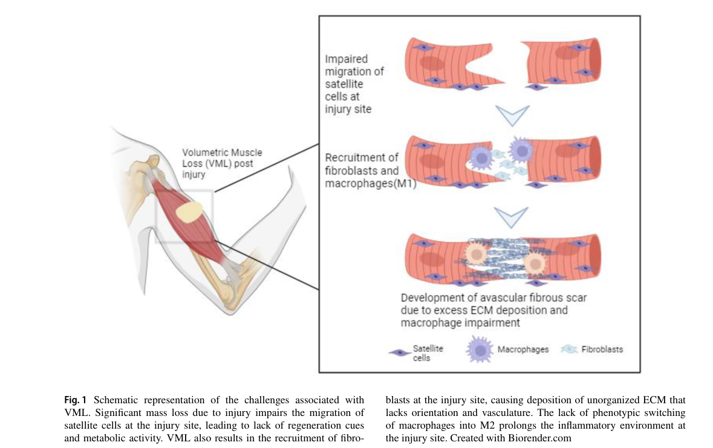

## Question

# Disease Characteristics Research Template

## Target Disease
- **Disease Name:** Volumetric Muscle Loss
- **MONDO ID:**  (if available)
- **Category:** Traumatic Injury

## Research Objectives

Please provide a comprehensive research report on **Volumetric Muscle Loss** covering all of the
disease characteristics listed below. This report will be used to populate a disease knowledge
base entry. Be thorough and cite primary literature (PMID preferred) for all claims.

For each section, **suggested databases/resources** are listed. These are the first places
you should search for information on each topic.

---

### 1. Disease Information
> **Search first:** OMIM, Orphanet, ICD-10/ICD-11, MeSH, PubMed

- What is the disease? Provide a concise overview.
- What are the key identifiers? (OMIM, Orphanet, ICD-10/ICD-11, MeSH, Mondo)
- What are the common synonyms and alternative names?
- Is the information derived from individual patients (e.g., EHR) or aggregated disease-level resources?

### 2. Etiology

- **Disease Causal Factors**: What are the primary causes? (genetic, environmental, infectious, mechanistic)
- **Risk Factors**:
  > **Search first:** PubMed, Cochrane Library, UpToDate, clinical guidelines, ClinVar, ClinGen, GWAS Catalog, PheGenI, CTD, CDC, WHO, epidemiological databases
  - Genetic risk factors (causal variants, susceptibility loci, modifier genes)
  - Environmental risk factors (toxins, lifestyle, occupational exposures, age, sex, family history)
- **Protective Factors**:
  > **Search first:** PubMed, Cochrane Library, clinical trial databases, GWAS Catalog, gnomAD, WHO, CDC, nutrition databases
  - Genetic protective factors (protective variants, modifier alleles)
  - Environmental protective factors (diet, lifestyle, exposures that reduce risk)
- **Gene-Environment Interactions**: How do genetic and environmental factors interact to influence disease?
  > **Search first:** CTD, PubMed, PheGenI, GxE databases

### 3. Phenotypes
> **Search first:** HPO (Human Phenotype Ontology), OMIM, Orphanet, PubMed, clinicaltrials.gov, MedDRA, SNOMED CT, DECIPHER, LOINC

For each phenotype, provide:
- **Phenotype type**: symptoms, clinical signs, physical manifestations, behavioral changes, or laboratory abnormalities
  > For symptoms/signs: HPO, OMIM, Orphanet, PubMed
  > For behavioral changes: HPO, DSM, RDoC (Research Domain Criteria), PubMed
  > For laboratory abnormalities: LOINC, SNOMED CT, LabTests Online, PubMed
- **Phenotype characteristics**:
  > **Search first:** OMIM, Orphanet, HPO, PubMed
  - Age of symptom onset (neonatal, childhood, adult-onset, late-onset)
  - Symptom severity (mild, moderate, severe, variable)
  - Symptom progression (stable, progressive, episodic, fluctuating)
  - Frequency among affected individuals (percentage or qualitative)
- **Quality of life impact**: Effects on daily functioning and well-being (per-phenotype when possible)
  > **Search first:** EQ-5D database, SF-36, WHO QOL databases, PubMed
- Suggest HPO (Human Phenotype Ontology) terms for each phenotype

### 4. Genetic/Molecular Information

- **Causal Genes**: Gene mutations or chromosomal abnormalities responsible for disease (gene symbols, OMIM IDs)
  > **Search first:** OMIM, ClinVar, HGMD, Ensembl, NCBI Gene
- **Pathogenic Variants**:
  - Affected genes (gene symbols, HGNC IDs)
    > **Search first:** OMIM, NCBI Gene, Ensembl, HGNC, UniProt, GeneCards
  - Variant classification (pathogenic, likely pathogenic, VUS per ACMG/AMP guidelines)
    > **Search first:** ClinVar, ClinGen, ACMG/AMP guidelines, VarSome
  - Variant type/class (missense, frameshift, nonsense, splice-site, structural)
  - Allele frequency in population databases
    > **Search first:** gnomAD, 1000 Genomes, ExAC, TOPMed, dbSNP
  - Somatic vs germline origin
    > **Search first:** COSMIC (somatic), ClinVar, ICGC, TCGA
  - Functional consequences (loss of function, gain of function, dominant negative)
- **Modifier Genes**: Genes that modify disease severity or expression
- **Epigenetic Information**: DNA methylation, histone modifications, chromatin changes affecting disease
  > **Search first:** ENCODE, Roadmap Epigenomics, MethBase, DiseaseMeth
- **Chromosomal Abnormalities**: Large-scale genetic changes (aneuploidy, translocations, inversions)
  > **Search first:** DECIPHER, ClinVar, ECARUCA, UCSC Genome Browser

### 5. Environmental Information

- **Environmental Factors**: Non-genetic contributing factors (toxins, radiation, pollution, occupational exposure)
  > **Search first:** CTD (Comparative Toxicogenomics Database), TOXNET, PubMed, EPA databases
- **Lifestyle Factors**: Behavioral factors (smoking, diet, exercise, alcohol consumption)
  > **Search first:** CDC databases, WHO, PubMed, NHANES
- **Infectious Agents**: If applicable, pathogens causing or triggering disease (bacteria, viruses, fungi, parasites)
  > **Search first:** NCBI Taxonomy, ViPR, BV-BRC, MicrobeDB, GIDEON

### 6. Mechanism / Pathophysiology

- **Molecular Pathways**: Specific signaling cascades or biochemical pathways involved (Wnt, MAPK, mTOR, PI3K-AKT, etc.)
  > **Search first:** KEGG, Reactome, WikiPathways, PathBank, BioCyc
- **Cellular Processes**: Cell-level mechanisms (apoptosis, autophagy, cell cycle dysregulation, inflammation, etc.)
  > **Search first:** Gene Ontology (GO), Reactome, KEGG, PubMed
- **Protein Dysfunction**: How protein structure or function is altered (misfolding, aggregation, loss of function, gain of function)
  > **Search first:** UniProt, PDB (Protein Data Bank), InterPro, Pfam, AlphaFold
- **Metabolic Changes**: Alterations in metabolic processes (energy metabolism, lipid metabolism, amino acid metabolism)
  > **Search first:** KEGG, BioCyc, HMDB (Human Metabolome Database), BRENDA
- **Immune System Involvement**: Role of immune response (autoimmunity, immunodeficiency, chronic inflammation)
  > **Search first:** ImmPort, Immunome Database, IEDB, Gene Ontology
- **Tissue Damage Mechanisms**: How tissues/ are injured (oxidative stress, ischemia, fibrosis, necrosis)
  > **Search first:** PubMed, Gene Ontology, Reactome
- **Biochemical Abnormalities**: Specific molecular defects (enzyme deficiencies, receptor dysfunction, ion channel defects)
  > **Search first:** BRENDA, UniProt, KEGG, OMIM, PubMed
- **Epigenetic Changes**: DNA methylation, histone modifications affecting gene expression in disease
  > **Search first:** ENCODE, Roadmap Epigenomics, MethBase, DiseaseMeth
- **Molecular Profiling** (if available):
  - Transcriptomics/gene expression changes
    > **Search first:** GEO (Gene Expression Omnibus), ArrayExpress, GTEx, Human Cell Atlas, SRA
  - Proteomics findings
    > **Search first:** PRIDE, ProteomeXchange, Human Protein Atlas, STRING, BioGRID
  - Metabolomics signatures
    > **Search first:** MetaboLights, Metabolomics Workbench, HMDB, METLIN
  - Lipidomics alterations
    > **Search first:** LIPID MAPS, SwissLipids, LipidHome, Metabolomics Workbench
  - Genomic structural features
    > **Search first:** UCSC Genome Browser, Ensembl, NCBI, dbVar, DGV
- **Advanced Technologies** (if applicable):
  - Single-cell analysis findings (cell-type specific mechanisms, cellular heterogeneity)
    > **Search first:** Human Cell Atlas, Single Cell Portal, GEO, CELLxGENE
  - Spatial transcriptomics findings
    > **Search first:** GEO, Spatial Research, Vizgen, 10x Genomics data
  - Multi-omics integration results
    > **Search first:** TCGA, ICGC, cBioPortal, LinkedOmics, PubMed
  - Functional genomics screens (CRISPR, RNAi)
    > **Search first:** DepMap, GenomeRNAi, PubMed, BioGRID ORCS

For each mechanism, describe:
- The causal chain from initial trigger to clinical manifestation
- Which mechanisms are upstream vs downstream
- What cell types and biological processes are involved
- Suggest GO terms for biological processes and CL terms for cell types

### 7. Anatomical Structures Affected

- **Organ Level**:
  - Primary organs directly affected
  - Secondary organ involvement (complications, secondary effects)
  - Body systems involved (cardiovascular, nervous, digestive, respiratory, endocrine, etc.)
  > **Search first:** Uberon, FMA (Foundational Model of Anatomy), OMIM, HPO, ICD-11, MeSH, SNOMED CT
- **Tissue and Cell Level**:
  - Specific tissue types affected (epithelial, connective, muscle, nervous)
  - Specific cell populations targeted (with Cell Ontology terms)
  > **Search first:** Uberon, Human Protein Atlas, Cell Ontology, Human Cell Atlas, CellMarker, PanglaoDB
- **Subcellular Level**:
  - Cellular compartments involved (mitochondria, nucleus, ER, lysosomes) (with GO Cellular Component terms)
  > **Search first:** Gene Ontology (Cellular Component), UniProt, Human Protein Atlas
- **Localization**:
  - Specific anatomical sites (with UBERON terms)
    > **Search first:** FMA, Uberon, NeuroNames (for brain), SNOMED CT
  - Lateralization (unilateral, bilateral, asymmetric)
    > **Search first:** HPO, clinical literature, imaging databases

### 8. Temporal Development

- **Onset**:
  - Typical age of onset (congenital, pediatric, adult, geriatric)
  - Onset pattern (acute, subacute, chronic, insidious)
  > **Search first:** OMIM, Orphanet, HPO, PubMed
- **Progression**:
  - Disease stages (early, intermediate, advanced, end-stage)
    > **Search first:** Cancer Staging Manual (AJCC), WHO classifications, PubMed
  - Progression rate (rapid, slow, variable)
  - Disease course pattern (episodic, relapsing-remitting, progressive, stable)
  - Disease duration (self-limited, chronic lifelong)
  > **Search first:** Disease registries, longitudinal cohort databases, natural history studies, PubMed, Orphanet, OMIM
- **Patterns**:
  - Remission patterns (spontaneous, treatment-induced)
    > **Search first:** Clinical trial databases, disease registries, PubMed
  - Critical periods (time windows of vulnerability or opportunity for intervention)
    > **Search first:** PubMed, developmental biology databases, clinical guidelines

### 9. Inheritance and Population

- **Epidemiology**:
  - Prevalence (cases per 100,000 at given time)
  - Incidence (new cases per 100,000 per year)
  > **Search first:** Orphanet, CDC, WHO, GBD (Global Burden of Disease), national registries, SEER, disease registries
- **For Genetic Etiology**:
  - Inheritance pattern (AD, AR, X-linked, mitochondrial, multifactorial, polygenic)
    > **Search first:** OMIM, Orphanet, ClinVar, GTR (Genetic Testing Registry)
  - Penetrance (complete, incomplete, age-dependent)
    > **Search first:** ClinVar, OMIM, PubMed, ClinGen
  - Expressivity (variable, consistent)
    > **Search first:** OMIM, ClinVar, PubMed
  - Genetic anticipation (increasing severity in successive generations)
    > **Search first:** OMIM, PubMed (especially for repeat expansion disorders)
  - Germline mosaicism
    > **Search first:** ClinVar, OMIM, genetic counseling literature, PubMed
  - Founder effects (population-specific mutations)
    > **Search first:** gnomAD, population genetics databases, PubMed
  - Consanguinity role
    > **Search first:** OMIM, population studies, genetic counseling resources
  - Carrier frequency
    > **Search first:** gnomAD, carrier screening databases, GeneReviews, GTR
- **Population Demographics**:
  - Affected populations (ethnic or demographic groups with higher prevalence)
    > **Search first:** gnomAD, 1000 Genomes, PAGE Study, PubMed, population registries
  - Geographic distribution (endemic areas, regional variation)
    > **Search first:** WHO, CDC, GBD, Orphanet, geographic epidemiology databases
  - Geographic distribution of specific variants
  - Sex ratio (male:female)
    > **Search first:** Disease registries, OMIM, PubMed, epidemiological databases
  - Age distribution of affected individuals
    > **Search first:** CDC, disease registries, SEER, Orphanet

### 10. Diagnostics

- **Clinical Tests**:
  - Laboratory tests (blood, urine, tissue chemistry, specific enzyme assays)
    > **Search first:** LOINC, LabTests Online, PubMed
  - Biomarkers (proteins, metabolites, genetic markers, circulating biomarkers)
    > **Search first:** FDA Biomarker List, BEST (Biomarkers, EndpointS, and other Tools), PubMed
  - Imaging studies (X-ray, CT, MRI, PET, ultrasound)
    > **Search first:** RadLex, DICOM, Radiopaedia, imaging databases
  - Functional tests (pulmonary function, cardiac stress tests)
    > **Search first:** LOINC, clinical guidelines, PubMed
  - Electrophysiology (EEG, EMG, ECG, nerve conduction studies)
    > **Search first:** LOINC, clinical neurophysiology databases, PubMed
  - Biopsy findings (histopathology, immunohistochemistry)
    > **Search first:** SNOMED CT, College of American Pathologists resources, PubMed
  - Pathology findings (microscopic examination)
    > **Search first:** SNOMED CT, Digital Pathology databases, PubMed
- **Genetic Testing**:
  > **Search first:** GTR (Genetic Testing Registry), GeneReviews, ClinGen
  - Overview of recommended genetic testing approach
  - Whole genome sequencing (WGS) utility
    > **Search first:** GTR, ClinVar, GEL (Genomics England), gnomAD
  - Whole exome sequencing (WES) utility
    > **Search first:** GTR, ClinVar, OMIM, GeneMatcher
  - Gene panels (which panels, which genes)
    > **Search first:** GTR, ClinVar, laboratory-specific databases
  - Single gene testing
    > **Search first:** GTR, ClinVar, OMIM, GeneReviews
  - Chromosomal microarray (CMA)
    > **Search first:** DECIPHER, ClinVar, dbVar, ECARUCA
  - Karyotyping
    > **Search first:** Chromosome Abnormality Database, ClinVar, cytogenetics resources
  - FISH
    > **Search first:** ClinVar, cytogenetics databases, PubMed
  - Mitochondrial DNA testing
    > **Search first:** MITOMAP, MSeqDR, ClinVar, GTR
  - Repeat expansion testing
    > **Search first:** GTR, ClinVar, repeat expansion databases, PubMed
- **Omics-Based Diagnostics** (if applicable):
  - RNA sequencing / transcriptomics
    > **Search first:** GEO, ArrayExpress, GTEx, RNA-seq databases
  - Proteomics
    > **Search first:** PRIDE, ProteomeXchange, FDA Biomarker database
  - Metabolomics
    > **Search first:** MetaboLights, Metabolomics Workbench, HMDB
  - Epigenomics
    > **Search first:** GEO, ENCODE, Roadmap Epigenomics, MethBase
  - Liquid biopsy
    > **Search first:** COSMIC, ClinVar, liquid biopsy databases, PubMed
- **Clinical Criteria**:
  - Standardized diagnostic criteria (DSM, ICD, society guidelines)
    > **Search first:** DSM-5, ICD-11, clinical society guidelines, UpToDate
  - Differential diagnosis (other conditions to rule out, with distinguishing features)
    > **Search first:** DynaMed, UpToDate, clinical decision support systems
- **Screening**:
  - Screening methods for asymptomatic individuals (newborn screening, carrier screening, cascade screening)
    > **Search first:** ACMG recommendations, CDC newborn screening, GTR

### 11. Outcome/Prognosis

- **Survival and Mortality**:
  - Survival rate (5-year, 10-year, overall)
    > **Search first:** SEER, cancer registries, disease-specific registries, PubMed
  - Life expectancy (with and without treatment if applicable)
    > **Search first:** Orphanet, disease registries, actuarial databases, PubMed
  - Mortality rate
    > **Search first:** CDC, WHO, GBD, national mortality databases
  - Disease-specific mortality (deaths directly attributable to disease)
    > **Search first:** Disease registries, CDC Wonder, GBD, PubMed
- **Morbidity and Function**:
  - Morbidity (disease-related disability and health impacts)
    > **Search first:** GBD, WHO, disability databases, PubMed
  - Disability outcomes (long-term functional impairments)
    > **Search first:** ICF (International Classification of Functioning), disability registries
  - Quality of life measures (EQ-5D, SF-36, PROMIS, disease-specific tools)
    > **Search first:** EQ-5D database, SF-36, PROMIS, PubMed
- **Disease Course**:
  - Complications (secondary problems: infections, organ failure, etc.)
    > **Search first:** ICD codes, disease registries, clinical databases, PubMed
  - Recovery potential (likelihood and extent of recovery, with vs without treatment)
    > **Search first:** Natural history studies, rehabilitation databases, PubMed
- **Prediction**:
  - Prognostic factors (age, disease severity, biomarkers, treatment response)
    > **Search first:** Prognostic models databases, clinical calculators, PubMed
  - Prognostic biomarkers (molecular markers predicting disease course)
    > **Search first:** FDA Biomarker database, PubMed, cancer prognostic databases

### 12. Treatment

- **Pharmacotherapy**:
  - Pharmacological treatments (drug names, drug classes, mechanisms of action)
    > **Search first:** DrugBank, RxNorm, ATC classification, DailyMed, FDA databases
  - Pharmacogenomics (how genetic variants affect drug metabolism, efficacy, toxicity)
    > **Search first:** PharmGKB, CPIC (Clinical Pharmacogenetics), FDA Table of PGx Biomarkers
- **Advanced Therapeutics**:
  - Gene therapy (viral vectors, CRISPR, gene replacement, gene editing)
    > **Search first:** ClinicalTrials.gov, FDA gene therapy database, ASGCT resources
  - Cell therapy (stem cell transplant, CAR-T, cellular therapeutics)
    > **Search first:** ClinicalTrials.gov, FDA cell therapy database, FACT standards
  - RNA-based therapies (ASOs, siRNA, mRNA therapies)
    > **Search first:** ClinicalTrials.gov, FDA approvals, PubMed
  - Targeted therapies (treatments directed at specific molecular targets)
    > **Search first:** My Cancer Genome, OncoKB, ClinicalTrials.gov, FDA approvals
  - Immunotherapies (checkpoint inhibitors, monoclonal antibodies)
    > **Search first:** Cancer Immunotherapy Database, FDA approvals, ClinicalTrials.gov
- **Surgical and Interventional**:
  - Surgical interventions (types of surgery, timing, outcomes)
    > **Search first:** CPT codes, surgical registries, clinical guidelines, PubMed
- **Supportive and Rehabilitative**:
  - Supportive care (symptom management, pain control, nutrition)
    > **Search first:** Clinical guidelines, Cochrane Library, PubMed
  - Rehabilitation (physical therapy, occupational therapy, speech therapy)
    > **Search first:** Rehabilitation medicine databases, clinical guidelines, PubMed
- **Experimental**:
  - Experimental treatments in clinical trials (with NCT identifiers if available)
    > **Search first:** ClinicalTrials.gov, EU Clinical Trials Register, WHO ICTRP
- **Treatment Outcomes**:
  - Treatment response rates
    > **Search first:** Clinical trial databases, FDA reviews, systematic reviews, PubMed
  - Side effects and adverse events
    > **Search first:** FDA Adverse Event Reporting System (FAERS), MedWatch, PubMed
- **Treatment Strategy**:
  - Treatment algorithms (clinical pathways, decision trees)
    > **Search first:** Clinical practice guidelines, NCCN Guidelines, UpToDate
  - Combination therapies
    > **Search first:** ClinicalTrials.gov, treatment guidelines, PubMed
  - Personalized medicine approaches (genotype-guided treatment)
    > **Search first:** My Cancer Genome, CIViC, PharmGKB, precision medicine databases

For each treatment, suggest MAXO (Medical Action Ontology) terms where applicable.

### 13. Prevention

- **Prevention Levels**:
  - Primary prevention (preventing disease occurrence: vaccination, risk factor modification)
    > **Search first:** CDC, WHO, USPSTF recommendations, Cochrane Library
  - Secondary prevention (early detection and treatment: screening programs, early intervention)
    > **Search first:** USPSTF, CDC screening guidelines, WHO
  - Tertiary prevention (preventing complications in those with disease)
    > **Search first:** Clinical guidelines, disease management protocols, PubMed
- **Immunization**: Vaccine strategies (if applicable)
  > **Search first:** CDC vaccine schedules, WHO immunization, FDA vaccine database
- **Screening and Early Detection**:
  - Screening programs (population-based: newborn screening, cancer screening)
    > **Search first:** CDC screening programs, USPSTF, cancer screening databases
  - Genetic screening (carrier screening, preimplantation genetic diagnosis, prenatal testing)
    > **Search first:** ACMG recommendations, ACOG guidelines, GTR
  - Risk stratification (identifying high-risk individuals for targeted prevention)
    > **Search first:** Risk prediction models, clinical calculators, PubMed
- **Behavioral Interventions**: Lifestyle modifications to reduce risk
  > **Search first:** CDC, WHO, behavioral intervention databases, Cochrane Library
- **Counseling**: Genetic counseling (risk assessment, family planning guidance)
  > **Search first:** NSGC resources, ACMG guidelines, GeneReviews
- **Public Health**:
  - Public health interventions (sanitation, vector control, health education)
    > **Search first:** CDC, WHO, public health databases, PubMed
  - Environmental interventions (reducing environmental risk factors)
    > **Search first:** EPA databases, WHO environmental health, PubMed
- **Prophylaxis**: Preventive medications or procedures
  > **Search first:** Clinical guidelines, FDA approvals, PubMed

### 14. Other Species / Natural Disease

- **Taxonomy**: Species affected (with NCBI Taxon identifiers)
  > **Search first:** NCBI Taxonomy
- **Breed**: Specific breeds affected (with VBO identifiers if applicable)
  > **Search first:** VBO (Vertebrate Breed Ontology)
- **Gene**: Orthologous genes in other species (with NCBI Gene IDs)
  > **Search first:** NCBI Gene
- **Natural Disease**:
  - Naturally occurring disease in other species (companion animals, wildlife)
    > **Search first:** OMIA (Online Mendelian Inheritance in Animals), VetCompass, PubMed
  - Veterinary relevance and importance in animal health
    > **Search first:** OMIA, veterinary databases, PubMed
- **Comparative Biology**:
  - Comparative pathology (similarities and differences across species)
    > **Search first:** OMIA, comparative pathology databases, PubMed
  - Evolutionary conservation of disease mechanisms
    > **Search first:** HomoloGene, OrthoMCL, Alliance of Genome Resources
- **Transmission** (if applicable):
  - Zoonotic potential
    > **Search first:** CDC zoonotic diseases, WHO zoonoses, GIDEON
  - Cross-species susceptibility
    > **Search first:** NCBI Taxonomy, veterinary databases, PubMed

### 15. Model Organisms

- **Model Types**:
  - Model organism type (mammalian, invertebrate, cellular, in vitro)
    > **Search first:** Alliance of Genome Resources, model organism databases
  - Specific model systems (mouse, rat, zebrafish, Drosophila, C. elegans, yeast, cell lines, organoids, iPSCs)
    > **Search first:** MGI, RGD, ZFIN, FlyBase, WormBase, SGD, ATCC, Cellosaurus
  - Induced models (drug treatment, surgical intervention, environmental manipulation)
    > **Search first:** MGI, model organism databases, PubMed
- **Genetic Models**:
  - Types available (knockout, knock-in, transgenic, conditional, humanized)
    > **Search first:** MGI, IMPC, KOMP, EuMMCR, IMSR
- **Model Characteristics**:
  - Phenotype recapitulation (how well model reproduces human disease features)
    > **Search first:** Model organism databases, comparative studies, PubMed
  - Model limitations (aspects of human disease not captured)
    > **Search first:** Model organism databases, PubMed, review articles
- **Applications**:
  - Research applications (what aspects of disease can be studied)
    > **Search first:** Model organism databases, PubMed
- **Resources**:
  - Model databases
    > **Search first:** MGI, RGD, ZFIN, FlyBase, WormBase, IMSR, EMMA, MMRRC

---

## Citation Requirements

- Cite primary literature (PMID preferred) for all mechanistic and clinical claims
- Prioritize recent reviews and landmark papers
- Include direct quotes from abstracts where possible to support key statements
- Distinguish evidence source types: human clinical, model organism, in vitro, computational

## Output Format

Structure your response as a comprehensive narrative organized by the sections above.
For each section, provide:
- Factual content with specific details (numbers, percentages, gene names, variant nomenclature)
- Ontology term suggestions (HPO, GO, CL, UBERON, CHEBI, MAXO, MONDO) where applicable
- Evidence citations with PMIDs
- Direct quotes from abstracts to support key claims
- Clear indication when information is not available or not applicable for this disease

This report will be used to populate a disease knowledge base entry with:
- Pathophysiology descriptions with causal chains
- Gene/protein annotations (HGNC, GO terms)
- Phenotype associations (HP terms) with frequencies
- Cell type involvement (CL terms)
- Anatomical locations (UBERON terms)
- Chemical entities (CHEBI terms)
- Treatment annotations (MAXO terms)
- Evidence items with PMIDs and exact abstract quotes
- Epidemiology, prognosis, diagnostic, and prevention information
- Animal model descriptions with phenotype recapitulation details

## Output

Question: You are an expert researcher providing comprehensive, well-cited information.

Provide detailed information focusing on:
1. Key concepts and definitions with current understanding
2. Recent developments and latest research (prioritize 2023-2024 sources)
3. Current applications and real-world implementations
4. Expert opinions and analysis from authoritative sources
5. Relevant statistics and data from recent studies

Format as a comprehensive research report with proper citations. Include URLs and publication dates where available.
Always prioritize recent, authoritative sources and provide specific citations for all major claims.

# Disease Characteristics Research Template

## Target Disease
- **Disease Name:** Volumetric Muscle Loss
- **MONDO ID:**  (if available)
- **Category:** Traumatic Injury

## Research Objectives

Please provide a comprehensive research report on **Volumetric Muscle Loss** covering all of the
disease characteristics listed below. This report will be used to populate a disease knowledge
base entry. Be thorough and cite primary literature (PMID preferred) for all claims.

For each section, **suggested databases/resources** are listed. These are the first places
you should search for information on each topic.

---

### 1. Disease Information
> **Search first:** OMIM, Orphanet, ICD-10/ICD-11, MeSH, PubMed

- What is the disease? Provide a concise overview.
- What are the key identifiers? (OMIM, Orphanet, ICD-10/ICD-11, MeSH, Mondo)
- What are the common synonyms and alternative names?
- Is the information derived from individual patients (e.g., EHR) or aggregated disease-level resources?

### 2. Etiology

- **Disease Causal Factors**: What are the primary causes? (genetic, environmental, infectious, mechanistic)
- **Risk Factors**:
  > **Search first:** PubMed, Cochrane Library, UpToDate, clinical guidelines, ClinVar, ClinGen, GWAS Catalog, PheGenI, CTD, CDC, WHO, epidemiological databases
  - Genetic risk factors (causal variants, susceptibility loci, modifier genes)
  - Environmental risk factors (toxins, lifestyle, occupational exposures, age, sex, family history)
- **Protective Factors**:
  > **Search first:** PubMed, Cochrane Library, clinical trial databases, GWAS Catalog, gnomAD, WHO, CDC, nutrition databases
  - Genetic protective factors (protective variants, modifier alleles)
  - Environmental protective factors (diet, lifestyle, exposures that reduce risk)
- **Gene-Environment Interactions**: How do genetic and environmental factors interact to influence disease?
  > **Search first:** CTD, PubMed, PheGenI, GxE databases

### 3. Phenotypes
> **Search first:** HPO (Human Phenotype Ontology), OMIM, Orphanet, PubMed, clinicaltrials.gov, MedDRA, SNOMED CT, DECIPHER, LOINC

For each phenotype, provide:
- **Phenotype type**: symptoms, clinical signs, physical manifestations, behavioral changes, or laboratory abnormalities
  > For symptoms/signs: HPO, OMIM, Orphanet, PubMed
  > For behavioral changes: HPO, DSM, RDoC (Research Domain Criteria), PubMed
  > For laboratory abnormalities: LOINC, SNOMED CT, LabTests Online, PubMed
- **Phenotype characteristics**:
  > **Search first:** OMIM, Orphanet, HPO, PubMed
  - Age of symptom onset (neonatal, childhood, adult-onset, late-onset)
  - Symptom severity (mild, moderate, severe, variable)
  - Symptom progression (stable, progressive, episodic, fluctuating)
  - Frequency among affected individuals (percentage or qualitative)
- **Quality of life impact**: Effects on daily functioning and well-being (per-phenotype when possible)
  > **Search first:** EQ-5D database, SF-36, WHO QOL databases, PubMed
- Suggest HPO (Human Phenotype Ontology) terms for each phenotype

### 4. Genetic/Molecular Information

- **Causal Genes**: Gene mutations or chromosomal abnormalities responsible for disease (gene symbols, OMIM IDs)
  > **Search first:** OMIM, ClinVar, HGMD, Ensembl, NCBI Gene
- **Pathogenic Variants**:
  - Affected genes (gene symbols, HGNC IDs)
    > **Search first:** OMIM, NCBI Gene, Ensembl, HGNC, UniProt, GeneCards
  - Variant classification (pathogenic, likely pathogenic, VUS per ACMG/AMP guidelines)
    > **Search first:** ClinVar, ClinGen, ACMG/AMP guidelines, VarSome
  - Variant type/class (missense, frameshift, nonsense, splice-site, structural)
  - Allele frequency in population databases
    > **Search first:** gnomAD, 1000 Genomes, ExAC, TOPMed, dbSNP
  - Somatic vs germline origin
    > **Search first:** COSMIC (somatic), ClinVar, ICGC, TCGA
  - Functional consequences (loss of function, gain of function, dominant negative)
- **Modifier Genes**: Genes that modify disease severity or expression
- **Epigenetic Information**: DNA methylation, histone modifications, chromatin changes affecting disease
  > **Search first:** ENCODE, Roadmap Epigenomics, MethBase, DiseaseMeth
- **Chromosomal Abnormalities**: Large-scale genetic changes (aneuploidy, translocations, inversions)
  > **Search first:** DECIPHER, ClinVar, ECARUCA, UCSC Genome Browser

### 5. Environmental Information

- **Environmental Factors**: Non-genetic contributing factors (toxins, radiation, pollution, occupational exposure)
  > **Search first:** CTD (Comparative Toxicogenomics Database), TOXNET, PubMed, EPA databases
- **Lifestyle Factors**: Behavioral factors (smoking, diet, exercise, alcohol consumption)
  > **Search first:** CDC databases, WHO, PubMed, NHANES
- **Infectious Agents**: If applicable, pathogens causing or triggering disease (bacteria, viruses, fungi, parasites)
  > **Search first:** NCBI Taxonomy, ViPR, BV-BRC, MicrobeDB, GIDEON

### 6. Mechanism / Pathophysiology

- **Molecular Pathways**: Specific signaling cascades or biochemical pathways involved (Wnt, MAPK, mTOR, PI3K-AKT, etc.)
  > **Search first:** KEGG, Reactome, WikiPathways, PathBank, BioCyc
- **Cellular Processes**: Cell-level mechanisms (apoptosis, autophagy, cell cycle dysregulation, inflammation, etc.)
  > **Search first:** Gene Ontology (GO), Reactome, KEGG, PubMed
- **Protein Dysfunction**: How protein structure or function is altered (misfolding, aggregation, loss of function, gain of function)
  > **Search first:** UniProt, PDB (Protein Data Bank), InterPro, Pfam, AlphaFold
- **Metabolic Changes**: Alterations in metabolic processes (energy metabolism, lipid metabolism, amino acid metabolism)
  > **Search first:** KEGG, BioCyc, HMDB (Human Metabolome Database), BRENDA
- **Immune System Involvement**: Role of immune response (autoimmunity, immunodeficiency, chronic inflammation)
  > **Search first:** ImmPort, Immunome Database, IEDB, Gene Ontology
- **Tissue Damage Mechanisms**: How tissues/ are injured (oxidative stress, ischemia, fibrosis, necrosis)
  > **Search first:** PubMed, Gene Ontology, Reactome
- **Biochemical Abnormalities**: Specific molecular defects (enzyme deficiencies, receptor dysfunction, ion channel defects)
  > **Search first:** BRENDA, UniProt, KEGG, OMIM, PubMed
- **Epigenetic Changes**: DNA methylation, histone modifications affecting gene expression in disease
  > **Search first:** ENCODE, Roadmap Epigenomics, MethBase, DiseaseMeth
- **Molecular Profiling** (if available):
  - Transcriptomics/gene expression changes
    > **Search first:** GEO (Gene Expression Omnibus), ArrayExpress, GTEx, Human Cell Atlas, SRA
  - Proteomics findings
    > **Search first:** PRIDE, ProteomeXchange, Human Protein Atlas, STRING, BioGRID
  - Metabolomics signatures
    > **Search first:** MetaboLights, Metabolomics Workbench, HMDB, METLIN
  - Lipidomics alterations
    > **Search first:** LIPID MAPS, SwissLipids, LipidHome, Metabolomics Workbench
  - Genomic structural features
    > **Search first:** UCSC Genome Browser, Ensembl, NCBI, dbVar, DGV
- **Advanced Technologies** (if applicable):
  - Single-cell analysis findings (cell-type specific mechanisms, cellular heterogeneity)
    > **Search first:** Human Cell Atlas, Single Cell Portal, GEO, CELLxGENE
  - Spatial transcriptomics findings
    > **Search first:** GEO, Spatial Research, Vizgen, 10x Genomics data
  - Multi-omics integration results
    > **Search first:** TCGA, ICGC, cBioPortal, LinkedOmics, PubMed
  - Functional genomics screens (CRISPR, RNAi)
    > **Search first:** DepMap, GenomeRNAi, PubMed, BioGRID ORCS

For each mechanism, describe:
- The causal chain from initial trigger to clinical manifestation
- Which mechanisms are upstream vs downstream
- What cell types and biological processes are involved
- Suggest GO terms for biological processes and CL terms for cell types

### 7. Anatomical Structures Affected

- **Organ Level**:
  - Primary organs directly affected
  - Secondary organ involvement (complications, secondary effects)
  - Body systems involved (cardiovascular, nervous, digestive, respiratory, endocrine, etc.)
  > **Search first:** Uberon, FMA (Foundational Model of Anatomy), OMIM, HPO, ICD-11, MeSH, SNOMED CT
- **Tissue and Cell Level**:
  - Specific tissue types affected (epithelial, connective, muscle, nervous)
  - Specific cell populations targeted (with Cell Ontology terms)
  > **Search first:** Uberon, Human Protein Atlas, Cell Ontology, Human Cell Atlas, CellMarker, PanglaoDB
- **Subcellular Level**:
  - Cellular compartments involved (mitochondria, nucleus, ER, lysosomes) (with GO Cellular Component terms)
  > **Search first:** Gene Ontology (Cellular Component), UniProt, Human Protein Atlas
- **Localization**:
  - Specific anatomical sites (with UBERON terms)
    > **Search first:** FMA, Uberon, NeuroNames (for brain), SNOMED CT
  - Lateralization (unilateral, bilateral, asymmetric)
    > **Search first:** HPO, clinical literature, imaging databases

### 8. Temporal Development

- **Onset**:
  - Typical age of onset (congenital, pediatric, adult, geriatric)
  - Onset pattern (acute, subacute, chronic, insidious)
  > **Search first:** OMIM, Orphanet, HPO, PubMed
- **Progression**:
  - Disease stages (early, intermediate, advanced, end-stage)
    > **Search first:** Cancer Staging Manual (AJCC), WHO classifications, PubMed
  - Progression rate (rapid, slow, variable)
  - Disease course pattern (episodic, relapsing-remitting, progressive, stable)
  - Disease duration (self-limited, chronic lifelong)
  > **Search first:** Disease registries, longitudinal cohort databases, natural history studies, PubMed, Orphanet, OMIM
- **Patterns**:
  - Remission patterns (spontaneous, treatment-induced)
    > **Search first:** Clinical trial databases, disease registries, PubMed
  - Critical periods (time windows of vulnerability or opportunity for intervention)
    > **Search first:** PubMed, developmental biology databases, clinical guidelines

### 9. Inheritance and Population

- **Epidemiology**:
  - Prevalence (cases per 100,000 at given time)
  - Incidence (new cases per 100,000 per year)
  > **Search first:** Orphanet, CDC, WHO, GBD (Global Burden of Disease), national registries, SEER, disease registries
- **For Genetic Etiology**:
  - Inheritance pattern (AD, AR, X-linked, mitochondrial, multifactorial, polygenic)
    > **Search first:** OMIM, Orphanet, ClinVar, GTR (Genetic Testing Registry)
  - Penetrance (complete, incomplete, age-dependent)
    > **Search first:** ClinVar, OMIM, PubMed, ClinGen
  - Expressivity (variable, consistent)
    > **Search first:** OMIM, ClinVar, PubMed
  - Genetic anticipation (increasing severity in successive generations)
    > **Search first:** OMIM, PubMed (especially for repeat expansion disorders)
  - Germline mosaicism
    > **Search first:** ClinVar, OMIM, genetic counseling literature, PubMed
  - Founder effects (population-specific mutations)
    > **Search first:** gnomAD, population genetics databases, PubMed
  - Consanguinity role
    > **Search first:** OMIM, population studies, genetic counseling resources
  - Carrier frequency
    > **Search first:** gnomAD, carrier screening databases, GeneReviews, GTR
- **Population Demographics**:
  - Affected populations (ethnic or demographic groups with higher prevalence)
    > **Search first:** gnomAD, 1000 Genomes, PAGE Study, PubMed, population registries
  - Geographic distribution (endemic areas, regional variation)
    > **Search first:** WHO, CDC, GBD, Orphanet, geographic epidemiology databases
  - Geographic distribution of specific variants
  - Sex ratio (male:female)
    > **Search first:** Disease registries, OMIM, PubMed, epidemiological databases
  - Age distribution of affected individuals
    > **Search first:** CDC, disease registries, SEER, Orphanet

### 10. Diagnostics

- **Clinical Tests**:
  - Laboratory tests (blood, urine, tissue chemistry, specific enzyme assays)
    > **Search first:** LOINC, LabTests Online, PubMed
  - Biomarkers (proteins, metabolites, genetic markers, circulating biomarkers)
    > **Search first:** FDA Biomarker List, BEST (Biomarkers, EndpointS, and other Tools), PubMed
  - Imaging studies (X-ray, CT, MRI, PET, ultrasound)
    > **Search first:** RadLex, DICOM, Radiopaedia, imaging databases
  - Functional tests (pulmonary function, cardiac stress tests)
    > **Search first:** LOINC, clinical guidelines, PubMed
  - Electrophysiology (EEG, EMG, ECG, nerve conduction studies)
    > **Search first:** LOINC, clinical neurophysiology databases, PubMed
  - Biopsy findings (histopathology, immunohistochemistry)
    > **Search first:** SNOMED CT, College of American Pathologists resources, PubMed
  - Pathology findings (microscopic examination)
    > **Search first:** SNOMED CT, Digital Pathology databases, PubMed
- **Genetic Testing**:
  > **Search first:** GTR (Genetic Testing Registry), GeneReviews, ClinGen
  - Overview of recommended genetic testing approach
  - Whole genome sequencing (WGS) utility
    > **Search first:** GTR, ClinVar, GEL (Genomics England), gnomAD
  - Whole exome sequencing (WES) utility
    > **Search first:** GTR, ClinVar, OMIM, GeneMatcher
  - Gene panels (which panels, which genes)
    > **Search first:** GTR, ClinVar, laboratory-specific databases
  - Single gene testing
    > **Search first:** GTR, ClinVar, OMIM, GeneReviews
  - Chromosomal microarray (CMA)
    > **Search first:** DECIPHER, ClinVar, dbVar, ECARUCA
  - Karyotyping
    > **Search first:** Chromosome Abnormality Database, ClinVar, cytogenetics resources
  - FISH
    > **Search first:** ClinVar, cytogenetics databases, PubMed
  - Mitochondrial DNA testing
    > **Search first:** MITOMAP, MSeqDR, ClinVar, GTR
  - Repeat expansion testing
    > **Search first:** GTR, ClinVar, repeat expansion databases, PubMed
- **Omics-Based Diagnostics** (if applicable):
  - RNA sequencing / transcriptomics
    > **Search first:** GEO, ArrayExpress, GTEx, RNA-seq databases
  - Proteomics
    > **Search first:** PRIDE, ProteomeXchange, FDA Biomarker database
  - Metabolomics
    > **Search first:** MetaboLights, Metabolomics Workbench, HMDB
  - Epigenomics
    > **Search first:** GEO, ENCODE, Roadmap Epigenomics, MethBase
  - Liquid biopsy
    > **Search first:** COSMIC, ClinVar, liquid biopsy databases, PubMed
- **Clinical Criteria**:
  - Standardized diagnostic criteria (DSM, ICD, society guidelines)
    > **Search first:** DSM-5, ICD-11, clinical society guidelines, UpToDate
  - Differential diagnosis (other conditions to rule out, with distinguishing features)
    > **Search first:** DynaMed, UpToDate, clinical decision support systems
- **Screening**:
  - Screening methods for asymptomatic individuals (newborn screening, carrier screening, cascade screening)
    > **Search first:** ACMG recommendations, CDC newborn screening, GTR

### 11. Outcome/Prognosis

- **Survival and Mortality**:
  - Survival rate (5-year, 10-year, overall)
    > **Search first:** SEER, cancer registries, disease-specific registries, PubMed
  - Life expectancy (with and without treatment if applicable)
    > **Search first:** Orphanet, disease registries, actuarial databases, PubMed
  - Mortality rate
    > **Search first:** CDC, WHO, GBD, national mortality databases
  - Disease-specific mortality (deaths directly attributable to disease)
    > **Search first:** Disease registries, CDC Wonder, GBD, PubMed
- **Morbidity and Function**:
  - Morbidity (disease-related disability and health impacts)
    > **Search first:** GBD, WHO, disability databases, PubMed
  - Disability outcomes (long-term functional impairments)
    > **Search first:** ICF (International Classification of Functioning), disability registries
  - Quality of life measures (EQ-5D, SF-36, PROMIS, disease-specific tools)
    > **Search first:** EQ-5D database, SF-36, PROMIS, PubMed
- **Disease Course**:
  - Complications (secondary problems: infections, organ failure, etc.)
    > **Search first:** ICD codes, disease registries, clinical databases, PubMed
  - Recovery potential (likelihood and extent of recovery, with vs without treatment)
    > **Search first:** Natural history studies, rehabilitation databases, PubMed
- **Prediction**:
  - Prognostic factors (age, disease severity, biomarkers, treatment response)
    > **Search first:** Prognostic models databases, clinical calculators, PubMed
  - Prognostic biomarkers (molecular markers predicting disease course)
    > **Search first:** FDA Biomarker database, PubMed, cancer prognostic databases

### 12. Treatment

- **Pharmacotherapy**:
  - Pharmacological treatments (drug names, drug classes, mechanisms of action)
    > **Search first:** DrugBank, RxNorm, ATC classification, DailyMed, FDA databases
  - Pharmacogenomics (how genetic variants affect drug metabolism, efficacy, toxicity)
    > **Search first:** PharmGKB, CPIC (Clinical Pharmacogenetics), FDA Table of PGx Biomarkers
- **Advanced Therapeutics**:
  - Gene therapy (viral vectors, CRISPR, gene replacement, gene editing)
    > **Search first:** ClinicalTrials.gov, FDA gene therapy database, ASGCT resources
  - Cell therapy (stem cell transplant, CAR-T, cellular therapeutics)
    > **Search first:** ClinicalTrials.gov, FDA cell therapy database, FACT standards
  - RNA-based therapies (ASOs, siRNA, mRNA therapies)
    > **Search first:** ClinicalTrials.gov, FDA approvals, PubMed
  - Targeted therapies (treatments directed at specific molecular targets)
    > **Search first:** My Cancer Genome, OncoKB, ClinicalTrials.gov, FDA approvals
  - Immunotherapies (checkpoint inhibitors, monoclonal antibodies)
    > **Search first:** Cancer Immunotherapy Database, FDA approvals, ClinicalTrials.gov
- **Surgical and Interventional**:
  - Surgical interventions (types of surgery, timing, outcomes)
    > **Search first:** CPT codes, surgical registries, clinical guidelines, PubMed
- **Supportive and Rehabilitative**:
  - Supportive care (symptom management, pain control, nutrition)
    > **Search first:** Clinical guidelines, Cochrane Library, PubMed
  - Rehabilitation (physical therapy, occupational therapy, speech therapy)
    > **Search first:** Rehabilitation medicine databases, clinical guidelines, PubMed
- **Experimental**:
  - Experimental treatments in clinical trials (with NCT identifiers if available)
    > **Search first:** ClinicalTrials.gov, EU Clinical Trials Register, WHO ICTRP
- **Treatment Outcomes**:
  - Treatment response rates
    > **Search first:** Clinical trial databases, FDA reviews, systematic reviews, PubMed
  - Side effects and adverse events
    > **Search first:** FDA Adverse Event Reporting System (FAERS), MedWatch, PubMed
- **Treatment Strategy**:
  - Treatment algorithms (clinical pathways, decision trees)
    > **Search first:** Clinical practice guidelines, NCCN Guidelines, UpToDate
  - Combination therapies
    > **Search first:** ClinicalTrials.gov, treatment guidelines, PubMed
  - Personalized medicine approaches (genotype-guided treatment)
    > **Search first:** My Cancer Genome, CIViC, PharmGKB, precision medicine databases

For each treatment, suggest MAXO (Medical Action Ontology) terms where applicable.

### 13. Prevention

- **Prevention Levels**:
  - Primary prevention (preventing disease occurrence: vaccination, risk factor modification)
    > **Search first:** CDC, WHO, USPSTF recommendations, Cochrane Library
  - Secondary prevention (early detection and treatment: screening programs, early intervention)
    > **Search first:** USPSTF, CDC screening guidelines, WHO
  - Tertiary prevention (preventing complications in those with disease)
    > **Search first:** Clinical guidelines, disease management protocols, PubMed
- **Immunization**: Vaccine strategies (if applicable)
  > **Search first:** CDC vaccine schedules, WHO immunization, FDA vaccine database
- **Screening and Early Detection**:
  - Screening programs (population-based: newborn screening, cancer screening)
    > **Search first:** CDC screening programs, USPSTF, cancer screening databases
  - Genetic screening (carrier screening, preimplantation genetic diagnosis, prenatal testing)
    > **Search first:** ACMG recommendations, ACOG guidelines, GTR
  - Risk stratification (identifying high-risk individuals for targeted prevention)
    > **Search first:** Risk prediction models, clinical calculators, PubMed
- **Behavioral Interventions**: Lifestyle modifications to reduce risk
  > **Search first:** CDC, WHO, behavioral intervention databases, Cochrane Library
- **Counseling**: Genetic counseling (risk assessment, family planning guidance)
  > **Search first:** NSGC resources, ACMG guidelines, GeneReviews
- **Public Health**:
  - Public health interventions (sanitation, vector control, health education)
    > **Search first:** CDC, WHO, public health databases, PubMed
  - Environmental interventions (reducing environmental risk factors)
    > **Search first:** EPA databases, WHO environmental health, PubMed
- **Prophylaxis**: Preventive medications or procedures
  > **Search first:** Clinical guidelines, FDA approvals, PubMed

### 14. Other Species / Natural Disease

- **Taxonomy**: Species affected (with NCBI Taxon identifiers)
  > **Search first:** NCBI Taxonomy
- **Breed**: Specific breeds affected (with VBO identifiers if applicable)
  > **Search first:** VBO (Vertebrate Breed Ontology)
- **Gene**: Orthologous genes in other species (with NCBI Gene IDs)
  > **Search first:** NCBI Gene
- **Natural Disease**:
  - Naturally occurring disease in other species (companion animals, wildlife)
    > **Search first:** OMIA (Online Mendelian Inheritance in Animals), VetCompass, PubMed
  - Veterinary relevance and importance in animal health
    > **Search first:** OMIA, veterinary databases, PubMed
- **Comparative Biology**:
  - Comparative pathology (similarities and differences across species)
    > **Search first:** OMIA, comparative pathology databases, PubMed
  - Evolutionary conservation of disease mechanisms
    > **Search first:** HomoloGene, OrthoMCL, Alliance of Genome Resources
- **Transmission** (if applicable):
  - Zoonotic potential
    > **Search first:** CDC zoonotic diseases, WHO zoonoses, GIDEON
  - Cross-species susceptibility
    > **Search first:** NCBI Taxonomy, veterinary databases, PubMed

### 15. Model Organisms

- **Model Types**:
  - Model organism type (mammalian, invertebrate, cellular, in vitro)
    > **Search first:** Alliance of Genome Resources, model organism databases
  - Specific model systems (mouse, rat, zebrafish, Drosophila, C. elegans, yeast, cell lines, organoids, iPSCs)
    > **Search first:** MGI, RGD, ZFIN, FlyBase, WormBase, SGD, ATCC, Cellosaurus
  - Induced models (drug treatment, surgical intervention, environmental manipulation)
    > **Search first:** MGI, model organism databases, PubMed
- **Genetic Models**:
  - Types available (knockout, knock-in, transgenic, conditional, humanized)
    > **Search first:** MGI, IMPC, KOMP, EuMMCR, IMSR
- **Model Characteristics**:
  - Phenotype recapitulation (how well model reproduces human disease features)
    > **Search first:** Model organism databases, comparative studies, PubMed
  - Model limitations (aspects of human disease not captured)
    > **Search first:** Model organism databases, PubMed, review articles
- **Applications**:
  - Research applications (what aspects of disease can be studied)
    > **Search first:** Model organism databases, PubMed
- **Resources**:
  - Model databases
    > **Search first:** MGI, RGD, ZFIN, FlyBase, WormBase, IMSR, EMMA, MMRRC

---

## Citation Requirements

- Cite primary literature (PMID preferred) for all mechanistic and clinical claims
- Prioritize recent reviews and landmark papers
- Include direct quotes from abstracts where possible to support key statements
- Distinguish evidence source types: human clinical, model organism, in vitro, computational

## Output Format

Structure your response as a comprehensive narrative organized by the sections above.
For each section, provide:
- Factual content with specific details (numbers, percentages, gene names, variant nomenclature)
- Ontology term suggestions (HPO, GO, CL, UBERON, CHEBI, MAXO, MONDO) where applicable
- Evidence citations with PMIDs
- Direct quotes from abstracts to support key claims
- Clear indication when information is not available or not applicable for this disease

This report will be used to populate a disease knowledge base entry with:
- Pathophysiology descriptions with causal chains
- Gene/protein annotations (HGNC, GO terms)
- Phenotype associations (HP terms) with frequencies
- Cell type involvement (CL terms)
- Anatomical locations (UBERON terms)
- Chemical entities (CHEBI terms)
- Treatment annotations (MAXO terms)
- Evidence items with PMIDs and exact abstract quotes
- Epidemiology, prognosis, diagnostic, and prevention information
- Animal model descriptions with phenotype recapitulation details

## Volumetric Muscle Loss (VML) — Disease Characteristics Research Report

### Target Disease
- **Disease name:** Volumetric Muscle Loss (VML)
- **Category:** Traumatic injury (acute extremity trauma / surgical resection)
- **MONDO / MeSH / ICD identifiers:** Not reliably retrievable with available tools and retrieved sources in this run; therefore **not asserted** here.

---

## 1. Disease Information

### 1.1 Concise overview (current understanding)
Volumetric muscle loss (VML) is most commonly defined clinically as **“the traumatic or surgical loss of skeletal muscle with resultant functional impairment.”** (grogan2011volumetricmuscleloss pages 1-3, greising2019therapeuticapproachesfor pages 6-8). A key distinguishing feature is that VML represents tissue loss beyond typical skeletal muscle regenerative capacity, producing chronic functional deficits and disability (greising2019therapeuticapproachesfor pages 3-5, gahlawat2024tissueengineered3d pages 1-3).

Operational definitions vary across publications and settings:
- A biomaterials paper describes VML as **“a loss of over ~10% of muscle mass that results in functional impairment.”** (Patel 2019; publication date Apr 2019; https://doi.org/10.1088/1748-605x/ab0b06) (patel2019alignednanofibersof pages 1-5).
- A 2024 review cites a frequently used translational threshold: **“When the loss of skeletal muscle exceeds 20%, the innate capacity for repair and regeneration is permanently compromised.”** (Gahlawat 2024; publication date Jul 2024; https://doi.org/10.1007/s10439-024-03541-w) (gahlawat2024tissueengineered3d pages 1-3).
- A ClinicalTrials.gov protocol (NCT04051242; 2020 posting) required **both**: structural deficit ≥20% of muscle-group mass **and** functional deficit ≥25% versus contralateral limb (NCT04051242 chunk 2).

### 1.2 Synonyms / alternative names
The dominant term in the retrieved literature is “volumetric muscle loss” / “VML.” Many sources also frame it as **critical-sized skeletal muscle defect** or **critical VML** versus subcritical defects that can regenerate (e.g., size-threshold models) (hymel2023identifyingdysregulatedimmune pages 1-2, chowdary2023macrophagemediatedpdgfactivation pages 1-3).

### 1.3 Data provenance
Most mechanistic knowledge is derived from **aggregated preclinical models** (murine/rat VML defects with defined sizes) and **integrated -omics** studies, with limited but important **human cohort** evidence for certain scaffold-based approaches (greising2019therapeuticapproachesfor pages 1-3, larouche2023spatiotemporalmappingof pages 1-3, dziki2016anacellularbiologic pages 1-2).

---

## 2. Etiology

### 2.1 Disease causal factors (primary causes)
VML arises from **severe trauma** (e.g., blast or crush injury) and/or **surgical removal of skeletal muscle** (e.g., resection after injury or oncologic surgery), producing large, abrupt loss of muscle tissue and architectural cues (gahlawat2024tissueengineered3d pages 1-3, grogan2011volumetricmuscleloss pages 1-3, greising2019therapeuticapproachesfor pages 3-5).

### 2.2 Risk factors
The key “risk factor” for VML is exposure to injury mechanisms that create large muscle voids (e.g., combat blast trauma, high-energy extremity injuries, complex open fractures with soft-tissue loss) (gahlawat2024tissueengineered3d pages 1-3, grogan2011volumetricmuscleloss pages 1-3).

- **Military context:** VML is described as disproportionately common among military personnel and estimated to comprise ~50% of combat-related injuries in one 2024 review synthesis (Gahlawat 2024; Jul 2024; https://doi.org/10.1007/s10439-024-03541-w) (gahlawat2024tissueengineered3d pages 1-3).
- **Explosion-related extremity wounds:** In OEF/OIF, extremity wounds were the majority of injuries, and **“more than 75%”** were due to explosions (Grogan & Hsu 2011; Feb 2011; https://doi.org/10.5435/00124635-201102001-00007) (grogan2011volumetricmuscleloss pages 1-3).

### 2.3 Protective factors / gene–environment interactions
No protective genetic variants or gene–environment interactions were identified in the retrieved VML-focused sources for this run. This aligns with VML being primarily a trauma phenotype rather than an inherited disease entity.

---

## 3. Phenotypes

### 3.1 Core phenotypes (symptoms/signs)
Commonly reported clinical and biological manifestations include:
- Persistent muscle weakness / reduced force generation, chronic functional deficit (greising2019therapeuticapproachesfor pages 3-5, gahlawat2024tissueengineered3d pages 1-3).
- Structural muscle void with replacement by fibrotic tissue / scar, impaired range of motion and task performance (dziki2016anacellularbiologic pages 1-2, larouche2023spatiotemporalmappingof pages 1-3).
- Chronic inflammation and fibrosis, with regenerative failure (greising2019therapeuticapproachesfor pages 3-5, hymel2023identifyingdysregulatedimmune pages 1-2, larouche2023spatiotemporalmappingof pages 1-3).

### 3.2 Severity, progression, frequency
- **Onset pattern:** Typically **acute** at injury/surgery.
- **Course:** Often chronic deficits due to incomplete restoration of contractile tissue and persistent fibrosis (greising2019therapeuticapproachesfor pages 3-5, larouche2023spatiotemporalmappingof pages 1-3).
- **Severity thresholding:** Animal and translational literature uses size/percent-loss thresholds (e.g., >~10%, >20%, or millimeter-scale defects) to define subcritical vs critical, nonhealing VML (patel2019alignednanofibersof pages 1-5, gahlawat2024tissueengineered3d pages 1-3, chowdary2023macrophagemediatedpdgfactivation pages 1-3).

### 3.3 Quality of life impact
VML is framed as causing long-term disability and loss of function, with significant impact in civilian and military trauma populations (patel2019alignednanofibersof pages 1-5, grogan2011volumetricmuscleloss pages 1-3).

### 3.4 Suggested HPO terms (examples)
(Recommendations based on phenotype descriptions in retrieved sources)
- Muscle weakness: **HP:0001324**
- Abnormal muscle morphology (muscle tissue loss/atrophy): **HP:0003202** (Muscular atrophy)
- Decreased joint range of motion: **HP:0001376**
- Fibrosis (muscle): may map to broader fibrosis phenotypes such as **HP:0002206** (Pulmonary fibrosis is organ-specific; HPO fibrosis terms vary by tissue—use tissue-specific fibrosis term if available).

---

## 4. Genetic / Molecular Information

### 4.1 Causal genes / variants
VML is not primarily a Mendelian genetic disease; **no causal genes/variants** were identified in the retrieved sources.

### 4.2 Molecular mediators implicated (not inherited “causal genes”)
Recent mechanistic studies emphasize signaling axes that shape regenerative vs fibrotic outcomes:
- **TGF-β signaling / TGFBR2**: spatial transcriptomics + scRNA-seq indicated a pro-fibrotic program; pharmacologic inhibition of **TGFBR2** increased MuSC infiltration into the defect and reduced inflammatory/fibrotic transcripts, improving regeneration (Larouche 2023; Jun 2023; https://doi.org/10.1101/2022.06.03.494707) (larouche2023spatiotemporalmappingof pages 1-3).
- **PDGF vs TGF-β as regenerative vs fibrotic correlates:** single-cell analysis across injury models found enhanced **TGF-β** signaling in fibrotic conditions and enhanced **PDGF** signaling in regenerative conditions, with macrophage subtypes (fibrotic-like vs regenerative-like) better predicting outcome than classic M1/M2 polarization (Chowdary 2023; Sep 2023; https://doi.org/10.1097/SLA.0000000000005704) (chowdary2023macrophagemediatedpdgfactivation pages 1-3).
- **IL-10 signaling / Treg axis:** delayed local IL-10 delivery after VML repair improved torque and increased ST2 (Treg receptor) expression at repair site (Huynh 2023; Feb 2023; https://doi.org/10.1038/s41598-023-27981-x) (huynh2023localil10delivery pages 1-2).

---

## 5. Environmental Information
VML is primarily driven by **external injury mechanisms** (blast, crush, complex open fractures, surgical resection). No toxin/radiation/pollution-specific environmental etiologies were identified in the retrieved VML-focused sources.

---

## 6. Mechanism / Pathophysiology

### 6.1 High-level causal chain
**Trigger:** acute traumatic/surgical excision of skeletal muscle → **loss of myofibers, satellite cells, and native ECM scaffolding** → altered immune dynamics and impaired structural guidance for regeneration → **persistent inflammation and macrophage–mesenchymal progenitor crosstalk** → **excess collagen deposition/fibrosis** and reduced vascular/nerve integration → chronic weakness and functional impairment (greising2019therapeuticapproachesfor pages 3-5, larouche2023spatiotemporalmappingof pages 1-3, hymel2023identifyingdysregulatedimmune pages 1-2).

A 2019 systematic review summarizes key mechanisms for failure of regeneration after VML: loss of resident satellite cells, loss of native extracellular matrix organization cues, and dysregulated/prolonged pro-inflammatory programs promoting fibrous tissue accumulation (greising2019therapeuticapproachesfor pages 3-5).

### 6.2 Immune dysregulation and fibrosis (2023–2024 advances)
**Macrophage–FAP/MDC circuit and spatial restriction**
- In murine + canine VML, spatial transcriptomics integrated with scRNA-seq showed the defect zone enriched for inflammatory and collagen genes (e.g., Ctss/S100a8/S100a9 and Col1a1/Col1a2), while myogenic developmental genes were localized to a transition zone; MuSCs were largely confined to transition zone rather than infiltrating the defect, consistent with spatially restricted regeneration (larouche2023spatiotemporalmappingof pages 1-3).
- A 2023 Communications Biology study found critical VML (3 mm) displayed sustained **M2-like** and **CD206hiLy6Chi hybrid macrophages** with aberrant cytokine production that co-localized with **fibroadipogenic progenitors (FAPs)** in collagen deposition regions; multiple T-cell subpopulations were elevated and the immune response failed to resolve into a pro-regenerative microenvironment within the first week (hymel2023identifyingdysregulatedimmune pages 1-2).

**Defect-size thresholds and immune programs**
- Cross-study scRNA-seq analysis across musculoskeletal injuries identified that smaller VML defects regenerate while larger defects fibrose (size thresholds reported as <2 mm regenerative vs >3 mm fibrotic in that analysis framework) (chowdary2023macrophagemediatedpdgfactivation pages 1-3).

**Lipid mediator imbalance and pro-resolving therapeutics**
- A 2023 eLife study profiled lipid mediators and found degenerative VML showed increased pro-inflammatory eicosanoids (e.g., LTB4, PGE2, PGF2α) with insufficient increases in pro-resolving mediators; replenishing **Maresin 1** reduced neutrophils/macrophages, attenuated fibrosis, increased MuSC activation, and improved force recovery (Castor-Macias 2023; Dec 2023; https://doi.org/10.7554/eLife.86437) (castormacias2023maresin1repletion pages 9-11, castormacias2023maresin1repletion pages 2-5).

**Immunotherapy: IL-10**
- In a rat VML model repaired with minced muscle, delayed local recombinant IL-10 dosing from 7–14 days post-injury improved contractile outcomes at 56 days (torque 82% of uninjured; 170% of PBS controls) and induced IL-10 signaling and lymphocyte pathway signatures at 14 days (huynh2023localil10delivery pages 1-2).

### 6.3 Suggested GO biological process terms (examples)
- **Muscle tissue regeneration** (GO:0055001)
- **Skeletal muscle satellite cell activation / myoblast differentiation** (e.g., myoblast differentiation GO:0045445)
- **Inflammatory response** (GO:0006954)
- **Macrophage activation** (GO:0042116)
- **Extracellular matrix organization** (GO:0030198)
- **Collagen fibril organization / fibrosis-related processes** (e.g., collagen fibril organization GO:0030199)
- **Transforming growth factor beta receptor signaling pathway** (GO:0007179)
- **Platelet-derived growth factor receptor signaling pathway** (GO:0048008)

### 6.4 Suggested Cell Ontology (CL) terms (examples)
- **Skeletal muscle satellite cell / muscle stem cell (MuSC):** skeletal muscle satellite cell (CL term; commonly used)
- **Macrophage:** macrophage (CL:0000235)
- **Neutrophil:** neutrophil (CL:0000775)
- **T cell / regulatory T cell:** T cell (CL:0000084), regulatory T cell (CL:0000815)
- **Fibro-adipogenic progenitor / mesenchymal stromal progenitor:** map to mesenchymal stromal cell / fibroblast progenitor terms depending on ontology availability

---

## 7. Anatomical Structures Affected

### 7.1 Organ/tissue
Primary tissue: **skeletal muscle** (e.g., extremity muscle compartments such as quadriceps, tibialis anterior, posterior compartment muscles) (hymel2023identifyingdysregulatedimmune pages 1-2, huynh2023localil10delivery pages 1-2).

### 7.2 Suggested UBERON terms (examples)
- **Skeletal muscle tissue:** UBERON:0001134
- **Lower limb muscle / hindlimb muscle:** appropriate limb-region UBERON terms depending on injury site

---

## 8. Temporal Development

### 8.1 Onset
Typically immediate/acute at the time of trauma or surgery (grogan2011volumetricmuscleloss pages 1-3).

### 8.2 Progression
- Early inflammatory phase that fails to resolve in critical VML, evolving into chronic fibrosis with persistent functional deficits (hymel2023identifyingdysregulatedimmune pages 1-2, larouche2023spatiotemporalmappingof pages 1-3).

---

## 9. Inheritance and Population

### 9.1 Epidemiology / burden (available quantitative statistics)
Quantitative population incidence/prevalence per 100,000 was not found in the retrieved sources for this run (and may be difficult to quantify due to underreporting and coding/billing limitations) (gahlawat2024tissueengineered3d pages 1-3).

However, burden statistics in authoritative reviews include:
- ~50% of combat-related injuries in military populations (review synthesis) (gahlawat2024tissueengineered3d pages 1-3).
- In OEF/OIF, extremity wounds were the majority of soldier injuries and >75% were due to explosions (grogan2011volumetricmuscleloss pages 1-3).
- Type-III open tibia fractures (with severe bone and soft tissue injury context) were associated with a reported 65% incidence of permanent disability/medical retirement (gahlawat2024tissueengineered3d pages 1-3).

### 9.2 Genetics / inheritance
Not applicable as a primary disease mechanism.

---

## 10. Diagnostics

### 10.1 Clinical assessment and outcome measures
There is no standardized protocol for characterizing/quantifying VML; recommended clinical documentation includes photographs/video, range-of-motion measurements, manual muscle strength testing, and isokinetic muscle function testing (Grogan & Hsu 2011; Feb 2011; https://doi.org/10.5435/00124635-201102001-00007) (grogan2011volumetricmuscleloss pages 1-3).

### 10.2 Imaging and tissue assessment (human cohort/trials)
In the 13-patient cohort using ECM scaffolds, imaging (CT/MRI pre-op and ~7 months post-op) assessed volumetric loss and fatty infiltration; ultrasound-guided biopsies were sampled at ~6 and 26 weeks; electrodiagnostics were performed in 8/13 subjects (Dziki 2016; Jul 2016; https://doi.org/10.1038/npjregenmed.2016.8) (dziki2016anacellularbiologic pages 10-10).

### 10.3 Trial-based operational diagnostic thresholds
NCT04051242 used: structural deficit ≥20% muscle-group mass and functional deficit ≥25% vs contralateral limb (ClinicalTrials.gov; 2020; https://clinicaltrials.gov/study/NCT04051242) (NCT04051242 chunk 2).

---

## 11. Outcome / Prognosis

### 11.1 Functional prognosis
VML is associated with persistent functional deficits because ablated myofibers do not regenerate and fibrosis replaces contractile tissue in critical injuries (greising2019therapeuticapproachesfor pages 3-5, larouche2023spatiotemporalmappingof pages 1-3). Functional deficits may exceed those predicted by mass loss alone (gahlawat2024tissueengineered3d pages 1-3).

### 11.2 Human outcome data (ECM scaffold cohort)
Dziki et al. reported that by 6 months after ECM implantation with aggressive physical therapy, patients showed average improvements vs pre-operative performance of **37.3% in strength** and **27.1% in range-of-motion tasks** (both P<0.05) (Dziki 2016; Jul 2016; https://doi.org/10.1038/npjregenmed.2016.8; NCT01292876) (dziki2016anacellularbiologic pages 1-2).

### 11.3 Evidence caveats
A 2019 systematic review noted limited human evidence and reported case reports with minimal net strength deficit improvement after acellular biomaterial repair in two service members (72%→~68% deficit at 4 months; 89%→~87% deficit at ~6 months), emphasizing that some “functional gains” may not reflect true muscle regeneration (greising2019therapeuticapproachesfor pages 14-16).

---

## 12. Treatment

### 12.1 Current applications / real-world implementations (standard of care)
Clinical management frequently includes:
- **Soft-tissue reconstruction** (clinical gold standard): functional free muscle transfer and/or fasciocutaneous flaps, with limitations including donor-site morbidity and incomplete functional restoration (gahlawat2024tissueengineered3d pages 1-3).
- **Orthotics/bracing** (including advanced bracing designs; carbon fiber-based braces described in 2024 review) and **physical therapy** as supportive care, though not correcting underlying strength deficits in many cases (grogan2011volumetricmuscleloss pages 1-3, gahlawat2024tissueengineered3d pages 1-3).

### 12.2 Regenerative medicine / advanced therapeutics (current state)
**Acellular ECM bioscaffolds (human evidence)**
- Dziki et al. (2016) described a 13-patient cohort receiving ECM bioscaffolds plus aggressive early physical therapy with improved strength and ROM at 6 months and evidence of vascularized/innervated islands of skeletal muscle (dziki2016anacellularbiologic pages 1-2).

**Clinical trials**
- **NCT01292876**: registered for the 13-patient ECM cohort described by Dziki et al. (2016) (dziki2016anacellularbiologic pages 1-2).
- **NCT04051242**: “Enhanced Bioscaffold for Volumetric Muscle Loss” testing XENMATRIX AB™; includes explicit structural/functional inclusion criteria; status terminated; record notes two participants received the graft (ClinicalTrials.gov; 2020; https://clinicaltrials.gov/study/NCT04051242) (NCT04051242 chunk 2).

**Immunomodulatory / immuno-regenerative strategies (preclinical, 2023)**
- **IL-10 therapy** improved contractile torque to 82% of uninjured values (and 170% of PBS controls) in a rat VML model (Huynh 2023; Feb 2023; https://doi.org/10.1038/s41598-023-27981-x) (huynh2023localil10delivery pages 1-2).
- **Maresin 1** (DHA-derived pro-resolving mediator) reduced fibrosis and improved strength after degenerative VML in mice (Castor-Macias 2023; Dec 2023; https://doi.org/10.7554/eLife.86437) (castormacias2023maresin1repletion pages 9-11).
- **Anti-fibrotic pathway targeting:** inhibition of **TGFBR2** increased MuSC infiltration and reduced inflammatory/fibrotic signatures (Larouche 2023; Jun 2023; https://doi.org/10.1101/2022.06.03.494707) (larouche2023spatiotemporalmappingof pages 1-3).

**Expert synthesis / meta-analysis (animal evidence)**
A systematic review/meta-analysis found that in animal models, treatments improved functional capacity versus untreated controls with pooled effect size **Hedges’ g = 0.75 (95% CI 0.53–0.96; p<1e-7)**, but authors emphasized the ~16% average beneficial effect was small and current paradigms require maturation; network meta-analysis suggested **acellular biomaterial + stem/progenitor cells** as the most effective tested class (Greising 2019; Dec 2019; https://doi.org/10.1089/ten.teb.2019.0207) (greising2019therapeuticapproachesfor pages 1-3).

### 12.3 MAXO term suggestions (examples)
- Surgical tissue transfer / reconstruction (e.g., free functional muscle transfer): **MAXO:0000004** (surgical procedure; use more specific MAXO if available)
- Physical therapy / rehabilitation: **MAXO term for rehabilitation therapy** (ontology-dependent)
- Orthotic device use/bracing: **MAXO term for orthotic intervention**
- Implantation of biological scaffold / biomaterial implant: **MAXO term for implantation of medical device/biomaterial**
- Cytokine therapy (IL-10): **MAXO term for cytokine therapy**

---

## 13. Prevention
Primary prevention is mainly trauma prevention (combat injury mitigation, occupational/vehicular safety). No specific biomedical prophylaxis is established in the retrieved VML-focused sources.

---

## 14. Other Species / Natural Disease
Not applicable as a naturally occurring transmissible disease; however, mechanistic and translational studies include **canine VML models** in addition to murine models, indicating cross-species conservation of immune–progenitor crosstalk with kinetic differences (larouche2023spatiotemporalmappingof pages 1-3).

---

## 15. Model Organisms
Commonly used experimental systems include:
- **Mouse models** with standardized defect sizes (e.g., subcritical vs critical millimeter-scale injuries) enabling immune/omics comparisons (hymel2023identifyingdysregulatedimmune pages 1-2, chowdary2023macrophagemediatedpdgfactivation pages 1-3).
- **Rat tibialis anterior VML** models used for minced muscle repair and cytokine delivery studies (huynh2023localil10delivery pages 1-2).
- **Canine models** used in spatial transcriptomic analyses alongside mouse, supporting translational relevance (larouche2023spatiotemporalmappingof pages 1-3).

---

## Key Quantitative Evidence Map (summary table)
The following table consolidates major quantitative thresholds, burden statistics, human clinical outcomes, and key mechanistic findings across the retrieved literature.

| Topic | Key data/claim | Evidence type (human/animal/in vitro/trial protocol) | Source (first author, year) | PMID if known | URL | Citation context ID |
|---|---|---|---|---|---|---|
| Definition | VML is the traumatic or surgical loss of skeletal muscle resulting in functional impairment. | Human/clinical review | Grogan, 2011 |  | https://doi.org/10.5435/00124635-201102001-00007 | (grogan2011volumetricmuscleloss pages 1-3) |
| Quantitative threshold | Loss of skeletal muscle exceeding 20% is cited as a threshold beyond which innate repair/regeneration is permanently compromised. | Review/synthesized clinical-preclinical | Gahlawat, 2024 |  | https://doi.org/10.1007/s10439-024-03541-w | (gahlawat2024tissueengineered3d pages 1-3) |
| Alternative threshold | VML has also been described as loss of over ~10% of muscle mass causing functional impairment. | In vitro/review context | Patel, 2019 |  | https://doi.org/10.1088/1748-605x/ab0b06 | (patel2019alignednanofibersof pages 1-5) |
| Trial enrollment definition | Human VML trial protocol required both a structural deficit ≥20% of the muscle group mass and a functional deficit ≥25% versus the contralateral limb. | Trial protocol | Rubin/NCT04051242, 2020 |  | https://clinicaltrials.gov/study/NCT04051242 | (NCT04051242 chunk 2) |
| Epidemiology/burden | VML is disproportionately common in military populations, comprising ~50% of combat-related injuries. | Review | Gahlawat, 2024 |  | https://doi.org/10.1007/s10439-024-03541-w | (gahlawat2024tissueengineered3d pages 1-3) |
| Extremity trauma burden | Extremity wounds are the majority of soldier injuries in OEF/OIF, and >75% are due to explosions. | Human clinical review | Grogan, 2011 |  | https://doi.org/10.5435/00124635-201102001-00007 | (grogan2011volumetricmuscleloss pages 1-3) |
| Disability burden | Severe extremity injuries such as type-III open tibia fractures with major soft-tissue loss are associated with a 65% incidence of permanent disability/medical retirement. | Review | Gahlawat, 2024 |  | https://doi.org/10.1007/s10439-024-03541-w | (gahlawat2024tissueengineered3d pages 1-3) |
| Human cohort outcomes | In a 13-patient ECM bioscaffold cohort, mean improvement at 6 months was 37.3% in strength and 27.1% in range-of-motion versus pre-op. | Human cohort | Dziki, 2016 |  | https://doi.org/10.1038/npjregenmed.2016.8 | (dziki2016anacellularbiologic pages 1-2) |
| Human cohort baseline severity | In the same 13-patient cohort, mean estimated tissue deficit was ~66.2% (individual deficits ~25% to 90%). | Human cohort | Dziki, 2016 |  | https://doi.org/10.1038/npjregenmed.2016.8 | (dziki2016anacellularbiologic pages 1-2) |
| Human evidence caveat | Case reports of quadriceps acellular biomaterial repair showed minimal net recovery: 72%→~68% deficit at 4 months in one patient and 89%→~87% deficit at ~6 months in another. | Human case reports/review | Greising, 2019 |  | https://doi.org/10.1089/ten.teb.2019.0207 | (greising2019therapeuticapproachesfor pages 14-16) |
| Meta-analysis efficacy | Across 44 animal studies, pooled functional benefit of VML treatments was Hedges’ g 0.75 (95% CI 0.53–0.96; p<0.0000001), corresponding to ~16% average beneficial effect. | Animal systematic review/meta-analysis | Greising, 2019 |  | https://doi.org/10.1089/ten.teb.2019.0207 | (greising2019therapeuticapproachesfor pages 1-3) |
| Best-performing treatment class | Network meta-analysis suggested acellular biomaterial combined with stem/progenitor cells was the most effective experimental strategy. | Animal systematic review/meta-analysis | Greising, 2019 |  | https://doi.org/10.1089/ten.teb.2019.0207 | (greising2019therapeuticapproachesfor pages 1-3) |
| Critical vs subcritical injury | In murine quadriceps, 2 mm defects regenerated while 3 mm defects produced persistent fibrotic scarring and chronic inflammation through 4 weeks. | Animal primary study | Hymel, 2023 |  | https://doi.org/10.1038/s42003-023-04790-6 | (hymel2023identifyingdysregulatedimmune pages 1-2) |
| Mechanism: immune dysregulation | Critical VML showed sustained M2-like and CD206hiLy6Chi hybrid macrophages co-localized with FAPs in collagen-rich regions, implicating macrophage–FAP crosstalk in fibrosis. | Animal primary study | Hymel, 2023 |  | https://doi.org/10.1038/s42003-023-04790-6 | (hymel2023identifyingdysregulatedimmune pages 1-2) |
| Mechanism: spatial fibrosis program | Spatial transcriptomics/scRNA-seq showed macrophages concentrated in the defect zone, MDCs/FAPs in defect/transition zones, and MuSCs largely restricted to transition zones; TGFBR2 inhibition improved MuSC infiltration and reduced fibrosis. | Animal primary study/omics | Larouche, 2023 |  | https://doi.org/10.1101/2022.06.03.494707 | (larouche2023spatiotemporalmappingof pages 1-3) |
| Mechanism: lipid mediators | Degenerative VML showed increased pro-inflammatory eicosanoids (e.g., LTB4, PGE2, PGF2α) with insufficient rise in pro-resolving mediators (e.g., MaR1, PD1, RvD6). | Animal primary study/metabolipidomics | Castor-Macias, 2023 |  | https://doi.org/10.7554/elife.86437 | (castormacias2023maresin1repletion pages 9-11, castormacias2023maresin1repletion pages 2-5) |
| Immunotherapy result | Delayed local IL-10 delivery after minced-muscle repair improved contractile torque to 82% of uninjured values and 170% of PBS controls at 56 days. | Animal primary study | Huynh, 2023 |  | https://doi.org/10.1038/s41598-023-27981-x | (huynh2023localil10delivery pages 1-2) |
| Pro-resolving mediator result | Maresin 1 repletion reduced neutrophils/macrophages, attenuated fibrosis, increased MuSC activation, and partially restored force after degenerative VML. | Animal primary study | Castor-Macias, 2023 |  | https://doi.org/10.7554/elife.86437 | (castormacias2023maresin1repletion pages 9-11, castormacias2023maresin1repletion pages 1-2) |
| Standard of care | Current clinical management includes physical therapy/orthotics and soft-tissue reconstruction such as functional free muscle transfer; these approaches have donor-site morbidity and limited restoration of function. | Human clinical review | Grogan, 2011 |  | https://doi.org/10.5435/00124635-201102001-00007 | (grogan2011volumetricmuscleloss pages 1-3) |

*Table: This table summarizes the most actionable quantitative definitions, burden statistics, human clinical results, and recent mechanistic findings for volumetric muscle loss. It is useful as a compact evidence map spanning disease characterization, translational thresholds, and therapeutic implications.*

---

## Visual Evidence (figures/tables)
A 2024 review provides schematic summaries of (i) VML pathophysiology (immune infiltration → impaired satellite cell migration → avascular fibrous scar) and (ii) tissue engineering strategies (in situ / in vivo / in vitro TE), plus tables of biomaterials and growth factors used in TE constructs (gahlawat2024tissueengineered3d media 816f8097, gahlawat2024tissueengineered3d media 4d3d8f7b, gahlawat2024tissueengineered3d media a8bea718, gahlawat2024tissueengineered3d media 26d381a5).

---

## Notes on evidence limitations for knowledge-base population
- Robust registry-style epidemiology (incidence/prevalence per 100,000) and standardized ICD/MeSH/MONDO identifiers were **not available in retrieved sources** using the tools in this run; the report therefore emphasizes well-supported operational definitions, burden statistics in military trauma, and translational thresholds used in trials and preclinical modeling.

References

1. (grogan2011volumetricmuscleloss pages 1-3): Brian F. Grogan and Joseph R. Hsu. Volumetric muscle loss. American Academy of Orthopaedic Surgeon, 19:S35–S37, Feb 2011. URL: https://doi.org/10.5435/00124635-201102001-00007, doi:10.5435/00124635-201102001-00007. This article has 475 citations.

2. (greising2019therapeuticapproachesfor pages 6-8): Sarah M. Greising, Benjamin T. Corona, Christopher McGann, Jeremy K. Frankum, and Gordon L. Warren. Therapeutic approaches for volumetric muscle loss injury: a systematic review and meta-analysis. Tissue engineering. Part B, Reviews, 25:510-525, Dec 2019. URL: https://doi.org/10.1089/ten.teb.2019.0207, doi:10.1089/ten.teb.2019.0207. This article has 130 citations.

3. (greising2019therapeuticapproachesfor pages 3-5): Sarah M. Greising, Benjamin T. Corona, Christopher McGann, Jeremy K. Frankum, and Gordon L. Warren. Therapeutic approaches for volumetric muscle loss injury: a systematic review and meta-analysis. Tissue engineering. Part B, Reviews, 25:510-525, Dec 2019. URL: https://doi.org/10.1089/ten.teb.2019.0207, doi:10.1089/ten.teb.2019.0207. This article has 130 citations.

4. (gahlawat2024tissueengineered3d pages 1-3): Sonal Gahlawat, Doga Oruc, Nikhil Paul, Mark Ragheb, Swati Patel, Oyinkansola Fasasi, Peeyush Sharma, David I. Shreiber, and Joseph W. Freeman. Tissue engineered 3d constructs for volumetric muscle loss. Annals of Biomedical Engineering, 52:2325-2347, Jul 2024. URL: https://doi.org/10.1007/s10439-024-03541-w, doi:10.1007/s10439-024-03541-w. This article has 30 citations and is from a domain leading peer-reviewed journal.

5. (patel2019alignednanofibersof pages 1-5): Krishna H Patel, Andrew J Dunn, Muhamed Talovic, Gabriel J Haas, Madison Marcinczyk, Hady Elmashhady, Emily Growney Kalaf, Scott A Sell, and Koyal Garg. Aligned nanofibers of decellularized muscle ecm support myogenic activity in primary satellite cells in vitro. Biomedical Materials, 14:035010, Apr 2019. URL: https://doi.org/10.1088/1748-605x/ab0b06, doi:10.1088/1748-605x/ab0b06. This article has 88 citations and is from a peer-reviewed journal.

6. (NCT04051242 chunk 2): J. Peter Rubin, MD. Enhanced Bioscaffold for Volumetric Muscle Loss. J. Peter Rubin, MD. 2020. ClinicalTrials.gov Identifier: NCT04051242

7. (hymel2023identifyingdysregulatedimmune pages 1-2): Lauren A. Hymel, Shannon E. Anderson, Thomas C. Turner, William Y. York, Hongmanlin Zhang, Adrian R. Liversage, Hong Seo Lim, Peng Qiu, Luke J. Mortensen, Young C. Jang, Nick J. Willett, and Edward A. Botchwey. Identifying dysregulated immune cell subsets following volumetric muscle loss with pseudo-time trajectories. Communications Biology, Jul 2023. URL: https://doi.org/10.1038/s42003-023-04790-6, doi:10.1038/s42003-023-04790-6. This article has 20 citations and is from a peer-reviewed journal.

8. (chowdary2023macrophagemediatedpdgfactivation pages 1-3): Ashish R. Chowdary, Tristan Maerz, Dominic Henn, Kurt D. Hankenson, Chase A. Pagani, Simone Marini, Katherine Gallagher, Carlos A. Aguilar, Robert J. Tower, and Benjamin Levi. Macrophage-mediated pdgf activation correlates with regenerative outcomes following musculoskeletal trauma. Annals of Surgery, 278:e349-e359, Sep 2023. URL: https://doi.org/10.1097/sla.0000000000005704, doi:10.1097/sla.0000000000005704. This article has 17 citations and is from a highest quality peer-reviewed journal.

9. (greising2019therapeuticapproachesfor pages 1-3): Sarah M. Greising, Benjamin T. Corona, Christopher McGann, Jeremy K. Frankum, and Gordon L. Warren. Therapeutic approaches for volumetric muscle loss injury: a systematic review and meta-analysis. Tissue engineering. Part B, Reviews, 25:510-525, Dec 2019. URL: https://doi.org/10.1089/ten.teb.2019.0207, doi:10.1089/ten.teb.2019.0207. This article has 130 citations.

10. (larouche2023spatiotemporalmappingof pages 1-3): Jacqueline A. Larouche, Emily C. Wallace, Bonnie D. Spence, Scott A. Johnson, Mangesh Kulkarni, Eric Buras, Bryan N. Brown, Stephen F. Badylak, and Carlos A. Aguilar. Spatiotemporal mapping of immune and stem cell dysregulation after volumetric muscle loss. JCI Insight, Jun 2023. URL: https://doi.org/10.1101/2022.06.03.494707, doi:10.1101/2022.06.03.494707. This article has 53 citations and is from a domain leading peer-reviewed journal.

11. (dziki2016anacellularbiologic pages 1-2): Jenna Dziki, Stephen Badylak, Mohammad Yabroudi, Brian Sicari, Fabrisia Ambrosio, Kristen Stearns, Neill Turner, Aaron Wyse, Michael L Boninger, Elke H P Brown, and J Peter Rubin. An acellular biologic scaffold treatment for volumetric muscle loss: results of a 13-patient cohort study. NPJ Regenerative Medicine, Jul 2016. URL: https://doi.org/10.1038/npjregenmed.2016.8, doi:10.1038/npjregenmed.2016.8. This article has 248 citations and is from a peer-reviewed journal.

12. (huynh2023localil10delivery pages 1-2): tai huynh, Cassandra Reed, Zain Blackwell, Payton Phelps, Luis C. Pinzon Herrera, Jorge Almodovar, David A. Zaharoff, and Jeffrey C Wolchok. Local il-10 delivery modulates the immune response and enhances repair of volumetric muscle loss muscle injury. Scientific Reports, Feb 2023. URL: https://doi.org/10.1038/s41598-023-27981-x, doi:10.1038/s41598-023-27981-x. This article has 43 citations and is from a peer-reviewed journal.

13. (castormacias2023maresin1repletion pages 9-11): Jesus A Castor-Macias, Jacqueline A Larouche, Emily C Wallace, Bonnie D Spence, Alec Eames, Pamela Duran, Benjamin A Yang, Paula M Fraczek, Carol A Davis, Susan V Brooks, Krishna Rao Maddipati, James F Markworth, and Carlos A Aguilar. Maresin 1 repletion improves muscle regeneration after volumetric muscle loss. eLife, Dec 2023. URL: https://doi.org/10.7554/elife.86437, doi:10.7554/elife.86437. This article has 22 citations and is from a domain leading peer-reviewed journal.

14. (castormacias2023maresin1repletion pages 2-5): Jesus A Castor-Macias, Jacqueline A Larouche, Emily C Wallace, Bonnie D Spence, Alec Eames, Pamela Duran, Benjamin A Yang, Paula M Fraczek, Carol A Davis, Susan V Brooks, Krishna Rao Maddipati, James F Markworth, and Carlos A Aguilar. Maresin 1 repletion improves muscle regeneration after volumetric muscle loss. eLife, Dec 2023. URL: https://doi.org/10.7554/elife.86437, doi:10.7554/elife.86437. This article has 22 citations and is from a domain leading peer-reviewed journal.

15. (dziki2016anacellularbiologic pages 10-10): Jenna Dziki, Stephen Badylak, Mohammad Yabroudi, Brian Sicari, Fabrisia Ambrosio, Kristen Stearns, Neill Turner, Aaron Wyse, Michael L Boninger, Elke H P Brown, and J Peter Rubin. An acellular biologic scaffold treatment for volumetric muscle loss: results of a 13-patient cohort study. NPJ Regenerative Medicine, Jul 2016. URL: https://doi.org/10.1038/npjregenmed.2016.8, doi:10.1038/npjregenmed.2016.8. This article has 248 citations and is from a peer-reviewed journal.

16. (greising2019therapeuticapproachesfor pages 14-16): Sarah M. Greising, Benjamin T. Corona, Christopher McGann, Jeremy K. Frankum, and Gordon L. Warren. Therapeutic approaches for volumetric muscle loss injury: a systematic review and meta-analysis. Tissue engineering. Part B, Reviews, 25:510-525, Dec 2019. URL: https://doi.org/10.1089/ten.teb.2019.0207, doi:10.1089/ten.teb.2019.0207. This article has 130 citations.

17. (castormacias2023maresin1repletion pages 1-2): Jesus A Castor-Macias, Jacqueline A Larouche, Emily C Wallace, Bonnie D Spence, Alec Eames, Pamela Duran, Benjamin A Yang, Paula M Fraczek, Carol A Davis, Susan V Brooks, Krishna Rao Maddipati, James F Markworth, and Carlos A Aguilar. Maresin 1 repletion improves muscle regeneration after volumetric muscle loss. eLife, Dec 2023. URL: https://doi.org/10.7554/elife.86437, doi:10.7554/elife.86437. This article has 22 citations and is from a domain leading peer-reviewed journal.

18. (gahlawat2024tissueengineered3d media 816f8097): Sonal Gahlawat, Doga Oruc, Nikhil Paul, Mark Ragheb, Swati Patel, Oyinkansola Fasasi, Peeyush Sharma, David I. Shreiber, and Joseph W. Freeman. Tissue engineered 3d constructs for volumetric muscle loss. Annals of Biomedical Engineering, 52:2325-2347, Jul 2024. URL: https://doi.org/10.1007/s10439-024-03541-w, doi:10.1007/s10439-024-03541-w. This article has 30 citations and is from a domain leading peer-reviewed journal.

19. (gahlawat2024tissueengineered3d media 4d3d8f7b): Sonal Gahlawat, Doga Oruc, Nikhil Paul, Mark Ragheb, Swati Patel, Oyinkansola Fasasi, Peeyush Sharma, David I. Shreiber, and Joseph W. Freeman. Tissue engineered 3d constructs for volumetric muscle loss. Annals of Biomedical Engineering, 52:2325-2347, Jul 2024. URL: https://doi.org/10.1007/s10439-024-03541-w, doi:10.1007/s10439-024-03541-w. This article has 30 citations and is from a domain leading peer-reviewed journal.

20. (gahlawat2024tissueengineered3d media a8bea718): Sonal Gahlawat, Doga Oruc, Nikhil Paul, Mark Ragheb, Swati Patel, Oyinkansola Fasasi, Peeyush Sharma, David I. Shreiber, and Joseph W. Freeman. Tissue engineered 3d constructs for volumetric muscle loss. Annals of Biomedical Engineering, 52:2325-2347, Jul 2024. URL: https://doi.org/10.1007/s10439-024-03541-w, doi:10.1007/s10439-024-03541-w. This article has 30 citations and is from a domain leading peer-reviewed journal.

21. (gahlawat2024tissueengineered3d media 26d381a5): Sonal Gahlawat, Doga Oruc, Nikhil Paul, Mark Ragheb, Swati Patel, Oyinkansola Fasasi, Peeyush Sharma, David I. Shreiber, and Joseph W. Freeman. Tissue engineered 3d constructs for volumetric muscle loss. Annals of Biomedical Engineering, 52:2325-2347, Jul 2024. URL: https://doi.org/10.1007/s10439-024-03541-w, doi:10.1007/s10439-024-03541-w. This article has 30 citations and is from a domain leading peer-reviewed journal.

## Artifacts

- [Edison artifact artifact-00](Volumetric_Muscle_Loss-deep-research-falcon_artifacts/artifact-00.md)
