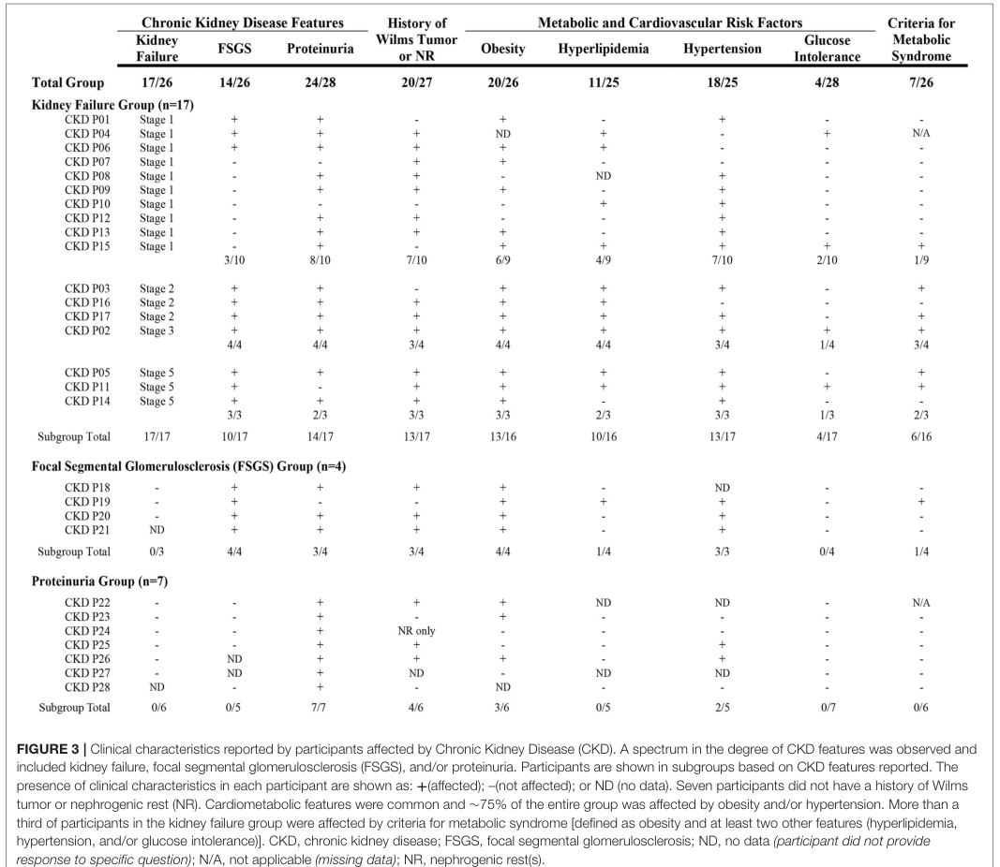

## Question

# Disease Characteristics Research Template

## Target Disease
- **Disease Name:** WAGR Syndrome
- **MONDO ID:**  (if available)
- **Category:** Genetic

## Research Objectives

Please provide a comprehensive research report on **WAGR Syndrome** covering all of the
disease characteristics listed below. This report will be used to populate a disease knowledge
base entry. Be thorough and cite primary literature (PMID preferred) for all claims.

For each section, **suggested databases/resources** are listed. These are the first places
you should search for information on each topic.

---

### 1. Disease Information
> **Search first:** OMIM, Orphanet, ICD-10/ICD-11, MeSH, PubMed

- What is the disease? Provide a concise overview.
- What are the key identifiers? (OMIM, Orphanet, ICD-10/ICD-11, MeSH, Mondo)
- What are the common synonyms and alternative names?
- Is the information derived from individual patients (e.g., EHR) or aggregated disease-level resources?

### 2. Etiology

- **Disease Causal Factors**: What are the primary causes? (genetic, environmental, infectious, mechanistic)
- **Risk Factors**:
  > **Search first:** PubMed, Cochrane Library, UpToDate, clinical guidelines, ClinVar, ClinGen, GWAS Catalog, PheGenI, CTD, CDC, WHO, epidemiological databases
  - Genetic risk factors (causal variants, susceptibility loci, modifier genes)
  - Environmental risk factors (toxins, lifestyle, occupational exposures, age, sex, family history)
- **Protective Factors**:
  > **Search first:** PubMed, Cochrane Library, clinical trial databases, GWAS Catalog, gnomAD, WHO, CDC, nutrition databases
  - Genetic protective factors (protective variants, modifier alleles)
  - Environmental protective factors (diet, lifestyle, exposures that reduce risk)
- **Gene-Environment Interactions**: How do genetic and environmental factors interact to influence disease?
  > **Search first:** CTD, PubMed, PheGenI, GxE databases

### 3. Phenotypes
> **Search first:** HPO (Human Phenotype Ontology), OMIM, Orphanet, PubMed, clinicaltrials.gov, MedDRA, SNOMED CT, DECIPHER, LOINC

For each phenotype, provide:
- **Phenotype type**: symptoms, clinical signs, physical manifestations, behavioral changes, or laboratory abnormalities
  > For symptoms/signs: HPO, OMIM, Orphanet, PubMed
  > For behavioral changes: HPO, DSM, RDoC (Research Domain Criteria), PubMed
  > For laboratory abnormalities: LOINC, SNOMED CT, LabTests Online, PubMed
- **Phenotype characteristics**:
  > **Search first:** OMIM, Orphanet, HPO, PubMed
  - Age of symptom onset (neonatal, childhood, adult-onset, late-onset)
  - Symptom severity (mild, moderate, severe, variable)
  - Symptom progression (stable, progressive, episodic, fluctuating)
  - Frequency among affected individuals (percentage or qualitative)
- **Quality of life impact**: Effects on daily functioning and well-being (per-phenotype when possible)
  > **Search first:** EQ-5D database, SF-36, WHO QOL databases, PubMed
- Suggest HPO (Human Phenotype Ontology) terms for each phenotype

### 4. Genetic/Molecular Information

- **Causal Genes**: Gene mutations or chromosomal abnormalities responsible for disease (gene symbols, OMIM IDs)
  > **Search first:** OMIM, ClinVar, HGMD, Ensembl, NCBI Gene
- **Pathogenic Variants**:
  - Affected genes (gene symbols, HGNC IDs)
    > **Search first:** OMIM, NCBI Gene, Ensembl, HGNC, UniProt, GeneCards
  - Variant classification (pathogenic, likely pathogenic, VUS per ACMG/AMP guidelines)
    > **Search first:** ClinVar, ClinGen, ACMG/AMP guidelines, VarSome
  - Variant type/class (missense, frameshift, nonsense, splice-site, structural)
  - Allele frequency in population databases
    > **Search first:** gnomAD, 1000 Genomes, ExAC, TOPMed, dbSNP
  - Somatic vs germline origin
    > **Search first:** COSMIC (somatic), ClinVar, ICGC, TCGA
  - Functional consequences (loss of function, gain of function, dominant negative)
- **Modifier Genes**: Genes that modify disease severity or expression
- **Epigenetic Information**: DNA methylation, histone modifications, chromatin changes affecting disease
  > **Search first:** ENCODE, Roadmap Epigenomics, MethBase, DiseaseMeth
- **Chromosomal Abnormalities**: Large-scale genetic changes (aneuploidy, translocations, inversions)
  > **Search first:** DECIPHER, ClinVar, ECARUCA, UCSC Genome Browser

### 5. Environmental Information

- **Environmental Factors**: Non-genetic contributing factors (toxins, radiation, pollution, occupational exposure)
  > **Search first:** CTD (Comparative Toxicogenomics Database), TOXNET, PubMed, EPA databases
- **Lifestyle Factors**: Behavioral factors (smoking, diet, exercise, alcohol consumption)
  > **Search first:** CDC databases, WHO, PubMed, NHANES
- **Infectious Agents**: If applicable, pathogens causing or triggering disease (bacteria, viruses, fungi, parasites)
  > **Search first:** NCBI Taxonomy, ViPR, BV-BRC, MicrobeDB, GIDEON

### 6. Mechanism / Pathophysiology

- **Molecular Pathways**: Specific signaling cascades or biochemical pathways involved (Wnt, MAPK, mTOR, PI3K-AKT, etc.)
  > **Search first:** KEGG, Reactome, WikiPathways, PathBank, BioCyc
- **Cellular Processes**: Cell-level mechanisms (apoptosis, autophagy, cell cycle dysregulation, inflammation, etc.)
  > **Search first:** Gene Ontology (GO), Reactome, KEGG, PubMed
- **Protein Dysfunction**: How protein structure or function is altered (misfolding, aggregation, loss of function, gain of function)
  > **Search first:** UniProt, PDB (Protein Data Bank), InterPro, Pfam, AlphaFold
- **Metabolic Changes**: Alterations in metabolic processes (energy metabolism, lipid metabolism, amino acid metabolism)
  > **Search first:** KEGG, BioCyc, HMDB (Human Metabolome Database), BRENDA
- **Immune System Involvement**: Role of immune response (autoimmunity, immunodeficiency, chronic inflammation)
  > **Search first:** ImmPort, Immunome Database, IEDB, Gene Ontology
- **Tissue Damage Mechanisms**: How tissues/ are injured (oxidative stress, ischemia, fibrosis, necrosis)
  > **Search first:** PubMed, Gene Ontology, Reactome
- **Biochemical Abnormalities**: Specific molecular defects (enzyme deficiencies, receptor dysfunction, ion channel defects)
  > **Search first:** BRENDA, UniProt, KEGG, OMIM, PubMed
- **Epigenetic Changes**: DNA methylation, histone modifications affecting gene expression in disease
  > **Search first:** ENCODE, Roadmap Epigenomics, MethBase, DiseaseMeth
- **Molecular Profiling** (if available):
  - Transcriptomics/gene expression changes
    > **Search first:** GEO (Gene Expression Omnibus), ArrayExpress, GTEx, Human Cell Atlas, SRA
  - Proteomics findings
    > **Search first:** PRIDE, ProteomeXchange, Human Protein Atlas, STRING, BioGRID
  - Metabolomics signatures
    > **Search first:** MetaboLights, Metabolomics Workbench, HMDB, METLIN
  - Lipidomics alterations
    > **Search first:** LIPID MAPS, SwissLipids, LipidHome, Metabolomics Workbench
  - Genomic structural features
    > **Search first:** UCSC Genome Browser, Ensembl, NCBI, dbVar, DGV
- **Advanced Technologies** (if applicable):
  - Single-cell analysis findings (cell-type specific mechanisms, cellular heterogeneity)
    > **Search first:** Human Cell Atlas, Single Cell Portal, GEO, CELLxGENE
  - Spatial transcriptomics findings
    > **Search first:** GEO, Spatial Research, Vizgen, 10x Genomics data
  - Multi-omics integration results
    > **Search first:** TCGA, ICGC, cBioPortal, LinkedOmics, PubMed
  - Functional genomics screens (CRISPR, RNAi)
    > **Search first:** DepMap, GenomeRNAi, PubMed, BioGRID ORCS

For each mechanism, describe:
- The causal chain from initial trigger to clinical manifestation
- Which mechanisms are upstream vs downstream
- What cell types and biological processes are involved
- Suggest GO terms for biological processes and CL terms for cell types

### 7. Anatomical Structures Affected

- **Organ Level**:
  - Primary organs directly affected
  - Secondary organ involvement (complications, secondary effects)
  - Body systems involved (cardiovascular, nervous, digestive, respiratory, endocrine, etc.)
  > **Search first:** Uberon, FMA (Foundational Model of Anatomy), OMIM, HPO, ICD-11, MeSH, SNOMED CT
- **Tissue and Cell Level**:
  - Specific tissue types affected (epithelial, connective, muscle, nervous)
  - Specific cell populations targeted (with Cell Ontology terms)
  > **Search first:** Uberon, Human Protein Atlas, Cell Ontology, Human Cell Atlas, CellMarker, PanglaoDB
- **Subcellular Level**:
  - Cellular compartments involved (mitochondria, nucleus, ER, lysosomes) (with GO Cellular Component terms)
  > **Search first:** Gene Ontology (Cellular Component), UniProt, Human Protein Atlas
- **Localization**:
  - Specific anatomical sites (with UBERON terms)
    > **Search first:** FMA, Uberon, NeuroNames (for brain), SNOMED CT
  - Lateralization (unilateral, bilateral, asymmetric)
    > **Search first:** HPO, clinical literature, imaging databases

### 8. Temporal Development

- **Onset**:
  - Typical age of onset (congenital, pediatric, adult, geriatric)
  - Onset pattern (acute, subacute, chronic, insidious)
  > **Search first:** OMIM, Orphanet, HPO, PubMed
- **Progression**:
  - Disease stages (early, intermediate, advanced, end-stage)
    > **Search first:** Cancer Staging Manual (AJCC), WHO classifications, PubMed
  - Progression rate (rapid, slow, variable)
  - Disease course pattern (episodic, relapsing-remitting, progressive, stable)
  - Disease duration (self-limited, chronic lifelong)
  > **Search first:** Disease registries, longitudinal cohort databases, natural history studies, PubMed, Orphanet, OMIM
- **Patterns**:
  - Remission patterns (spontaneous, treatment-induced)
    > **Search first:** Clinical trial databases, disease registries, PubMed
  - Critical periods (time windows of vulnerability or opportunity for intervention)
    > **Search first:** PubMed, developmental biology databases, clinical guidelines

### 9. Inheritance and Population

- **Epidemiology**:
  - Prevalence (cases per 100,000 at given time)
  - Incidence (new cases per 100,000 per year)
  > **Search first:** Orphanet, CDC, WHO, GBD (Global Burden of Disease), national registries, SEER, disease registries
- **For Genetic Etiology**:
  - Inheritance pattern (AD, AR, X-linked, mitochondrial, multifactorial, polygenic)
    > **Search first:** OMIM, Orphanet, ClinVar, GTR (Genetic Testing Registry)
  - Penetrance (complete, incomplete, age-dependent)
    > **Search first:** ClinVar, OMIM, PubMed, ClinGen
  - Expressivity (variable, consistent)
    > **Search first:** OMIM, ClinVar, PubMed
  - Genetic anticipation (increasing severity in successive generations)
    > **Search first:** OMIM, PubMed (especially for repeat expansion disorders)
  - Germline mosaicism
    > **Search first:** ClinVar, OMIM, genetic counseling literature, PubMed
  - Founder effects (population-specific mutations)
    > **Search first:** gnomAD, population genetics databases, PubMed
  - Consanguinity role
    > **Search first:** OMIM, population studies, genetic counseling resources
  - Carrier frequency
    > **Search first:** gnomAD, carrier screening databases, GeneReviews, GTR
- **Population Demographics**:
  - Affected populations (ethnic or demographic groups with higher prevalence)
    > **Search first:** gnomAD, 1000 Genomes, PAGE Study, PubMed, population registries
  - Geographic distribution (endemic areas, regional variation)
    > **Search first:** WHO, CDC, GBD, Orphanet, geographic epidemiology databases
  - Geographic distribution of specific variants
  - Sex ratio (male:female)
    > **Search first:** Disease registries, OMIM, PubMed, epidemiological databases
  - Age distribution of affected individuals
    > **Search first:** CDC, disease registries, SEER, Orphanet

### 10. Diagnostics

- **Clinical Tests**:
  - Laboratory tests (blood, urine, tissue chemistry, specific enzyme assays)
    > **Search first:** LOINC, LabTests Online, PubMed
  - Biomarkers (proteins, metabolites, genetic markers, circulating biomarkers)
    > **Search first:** FDA Biomarker List, BEST (Biomarkers, EndpointS, and other Tools), PubMed
  - Imaging studies (X-ray, CT, MRI, PET, ultrasound)
    > **Search first:** RadLex, DICOM, Radiopaedia, imaging databases
  - Functional tests (pulmonary function, cardiac stress tests)
    > **Search first:** LOINC, clinical guidelines, PubMed
  - Electrophysiology (EEG, EMG, ECG, nerve conduction studies)
    > **Search first:** LOINC, clinical neurophysiology databases, PubMed
  - Biopsy findings (histopathology, immunohistochemistry)
    > **Search first:** SNOMED CT, College of American Pathologists resources, PubMed
  - Pathology findings (microscopic examination)
    > **Search first:** SNOMED CT, Digital Pathology databases, PubMed
- **Genetic Testing**:
  > **Search first:** GTR (Genetic Testing Registry), GeneReviews, ClinGen
  - Overview of recommended genetic testing approach
  - Whole genome sequencing (WGS) utility
    > **Search first:** GTR, ClinVar, GEL (Genomics England), gnomAD
  - Whole exome sequencing (WES) utility
    > **Search first:** GTR, ClinVar, OMIM, GeneMatcher
  - Gene panels (which panels, which genes)
    > **Search first:** GTR, ClinVar, laboratory-specific databases
  - Single gene testing
    > **Search first:** GTR, ClinVar, OMIM, GeneReviews
  - Chromosomal microarray (CMA)
    > **Search first:** DECIPHER, ClinVar, dbVar, ECARUCA
  - Karyotyping
    > **Search first:** Chromosome Abnormality Database, ClinVar, cytogenetics resources
  - FISH
    > **Search first:** ClinVar, cytogenetics databases, PubMed
  - Mitochondrial DNA testing
    > **Search first:** MITOMAP, MSeqDR, ClinVar, GTR
  - Repeat expansion testing
    > **Search first:** GTR, ClinVar, repeat expansion databases, PubMed
- **Omics-Based Diagnostics** (if applicable):
  - RNA sequencing / transcriptomics
    > **Search first:** GEO, ArrayExpress, GTEx, RNA-seq databases
  - Proteomics
    > **Search first:** PRIDE, ProteomeXchange, FDA Biomarker database
  - Metabolomics
    > **Search first:** MetaboLights, Metabolomics Workbench, HMDB
  - Epigenomics
    > **Search first:** GEO, ENCODE, Roadmap Epigenomics, MethBase
  - Liquid biopsy
    > **Search first:** COSMIC, ClinVar, liquid biopsy databases, PubMed
- **Clinical Criteria**:
  - Standardized diagnostic criteria (DSM, ICD, society guidelines)
    > **Search first:** DSM-5, ICD-11, clinical society guidelines, UpToDate
  - Differential diagnosis (other conditions to rule out, with distinguishing features)
    > **Search first:** DynaMed, UpToDate, clinical decision support systems
- **Screening**:
  - Screening methods for asymptomatic individuals (newborn screening, carrier screening, cascade screening)
    > **Search first:** ACMG recommendations, CDC newborn screening, GTR

### 11. Outcome/Prognosis

- **Survival and Mortality**:
  - Survival rate (5-year, 10-year, overall)
    > **Search first:** SEER, cancer registries, disease-specific registries, PubMed
  - Life expectancy (with and without treatment if applicable)
    > **Search first:** Orphanet, disease registries, actuarial databases, PubMed
  - Mortality rate
    > **Search first:** CDC, WHO, GBD, national mortality databases
  - Disease-specific mortality (deaths directly attributable to disease)
    > **Search first:** Disease registries, CDC Wonder, GBD, PubMed
- **Morbidity and Function**:
  - Morbidity (disease-related disability and health impacts)
    > **Search first:** GBD, WHO, disability databases, PubMed
  - Disability outcomes (long-term functional impairments)
    > **Search first:** ICF (International Classification of Functioning), disability registries
  - Quality of life measures (EQ-5D, SF-36, PROMIS, disease-specific tools)
    > **Search first:** EQ-5D database, SF-36, PROMIS, PubMed
- **Disease Course**:
  - Complications (secondary problems: infections, organ failure, etc.)
    > **Search first:** ICD codes, disease registries, clinical databases, PubMed
  - Recovery potential (likelihood and extent of recovery, with vs without treatment)
    > **Search first:** Natural history studies, rehabilitation databases, PubMed
- **Prediction**:
  - Prognostic factors (age, disease severity, biomarkers, treatment response)
    > **Search first:** Prognostic models databases, clinical calculators, PubMed
  - Prognostic biomarkers (molecular markers predicting disease course)
    > **Search first:** FDA Biomarker database, PubMed, cancer prognostic databases

### 12. Treatment

- **Pharmacotherapy**:
  - Pharmacological treatments (drug names, drug classes, mechanisms of action)
    > **Search first:** DrugBank, RxNorm, ATC classification, DailyMed, FDA databases
  - Pharmacogenomics (how genetic variants affect drug metabolism, efficacy, toxicity)
    > **Search first:** PharmGKB, CPIC (Clinical Pharmacogenetics), FDA Table of PGx Biomarkers
- **Advanced Therapeutics**:
  - Gene therapy (viral vectors, CRISPR, gene replacement, gene editing)
    > **Search first:** ClinicalTrials.gov, FDA gene therapy database, ASGCT resources
  - Cell therapy (stem cell transplant, CAR-T, cellular therapeutics)
    > **Search first:** ClinicalTrials.gov, FDA cell therapy database, FACT standards
  - RNA-based therapies (ASOs, siRNA, mRNA therapies)
    > **Search first:** ClinicalTrials.gov, FDA approvals, PubMed
  - Targeted therapies (treatments directed at specific molecular targets)
    > **Search first:** My Cancer Genome, OncoKB, ClinicalTrials.gov, FDA approvals
  - Immunotherapies (checkpoint inhibitors, monoclonal antibodies)
    > **Search first:** Cancer Immunotherapy Database, FDA approvals, ClinicalTrials.gov
- **Surgical and Interventional**:
  - Surgical interventions (types of surgery, timing, outcomes)
    > **Search first:** CPT codes, surgical registries, clinical guidelines, PubMed
- **Supportive and Rehabilitative**:
  - Supportive care (symptom management, pain control, nutrition)
    > **Search first:** Clinical guidelines, Cochrane Library, PubMed
  - Rehabilitation (physical therapy, occupational therapy, speech therapy)
    > **Search first:** Rehabilitation medicine databases, clinical guidelines, PubMed
- **Experimental**:
  - Experimental treatments in clinical trials (with NCT identifiers if available)
    > **Search first:** ClinicalTrials.gov, EU Clinical Trials Register, WHO ICTRP
- **Treatment Outcomes**:
  - Treatment response rates
    > **Search first:** Clinical trial databases, FDA reviews, systematic reviews, PubMed
  - Side effects and adverse events
    > **Search first:** FDA Adverse Event Reporting System (FAERS), MedWatch, PubMed
- **Treatment Strategy**:
  - Treatment algorithms (clinical pathways, decision trees)
    > **Search first:** Clinical practice guidelines, NCCN Guidelines, UpToDate
  - Combination therapies
    > **Search first:** ClinicalTrials.gov, treatment guidelines, PubMed
  - Personalized medicine approaches (genotype-guided treatment)
    > **Search first:** My Cancer Genome, CIViC, PharmGKB, precision medicine databases

For each treatment, suggest MAXO (Medical Action Ontology) terms where applicable.

### 13. Prevention

- **Prevention Levels**:
  - Primary prevention (preventing disease occurrence: vaccination, risk factor modification)
    > **Search first:** CDC, WHO, USPSTF recommendations, Cochrane Library
  - Secondary prevention (early detection and treatment: screening programs, early intervention)
    > **Search first:** USPSTF, CDC screening guidelines, WHO
  - Tertiary prevention (preventing complications in those with disease)
    > **Search first:** Clinical guidelines, disease management protocols, PubMed
- **Immunization**: Vaccine strategies (if applicable)
  > **Search first:** CDC vaccine schedules, WHO immunization, FDA vaccine database
- **Screening and Early Detection**:
  - Screening programs (population-based: newborn screening, cancer screening)
    > **Search first:** CDC screening programs, USPSTF, cancer screening databases
  - Genetic screening (carrier screening, preimplantation genetic diagnosis, prenatal testing)
    > **Search first:** ACMG recommendations, ACOG guidelines, GTR
  - Risk stratification (identifying high-risk individuals for targeted prevention)
    > **Search first:** Risk prediction models, clinical calculators, PubMed
- **Behavioral Interventions**: Lifestyle modifications to reduce risk
  > **Search first:** CDC, WHO, behavioral intervention databases, Cochrane Library
- **Counseling**: Genetic counseling (risk assessment, family planning guidance)
  > **Search first:** NSGC resources, ACMG guidelines, GeneReviews
- **Public Health**:
  - Public health interventions (sanitation, vector control, health education)
    > **Search first:** CDC, WHO, public health databases, PubMed
  - Environmental interventions (reducing environmental risk factors)
    > **Search first:** EPA databases, WHO environmental health, PubMed
- **Prophylaxis**: Preventive medications or procedures
  > **Search first:** Clinical guidelines, FDA approvals, PubMed

### 14. Other Species / Natural Disease

- **Taxonomy**: Species affected (with NCBI Taxon identifiers)
  > **Search first:** NCBI Taxonomy
- **Breed**: Specific breeds affected (with VBO identifiers if applicable)
  > **Search first:** VBO (Vertebrate Breed Ontology)
- **Gene**: Orthologous genes in other species (with NCBI Gene IDs)
  > **Search first:** NCBI Gene
- **Natural Disease**:
  - Naturally occurring disease in other species (companion animals, wildlife)
    > **Search first:** OMIA (Online Mendelian Inheritance in Animals), VetCompass, PubMed
  - Veterinary relevance and importance in animal health
    > **Search first:** OMIA, veterinary databases, PubMed
- **Comparative Biology**:
  - Comparative pathology (similarities and differences across species)
    > **Search first:** OMIA, comparative pathology databases, PubMed
  - Evolutionary conservation of disease mechanisms
    > **Search first:** HomoloGene, OrthoMCL, Alliance of Genome Resources
- **Transmission** (if applicable):
  - Zoonotic potential
    > **Search first:** CDC zoonotic diseases, WHO zoonoses, GIDEON
  - Cross-species susceptibility
    > **Search first:** NCBI Taxonomy, veterinary databases, PubMed

### 15. Model Organisms

- **Model Types**:
  - Model organism type (mammalian, invertebrate, cellular, in vitro)
    > **Search first:** Alliance of Genome Resources, model organism databases
  - Specific model systems (mouse, rat, zebrafish, Drosophila, C. elegans, yeast, cell lines, organoids, iPSCs)
    > **Search first:** MGI, RGD, ZFIN, FlyBase, WormBase, SGD, ATCC, Cellosaurus
  - Induced models (drug treatment, surgical intervention, environmental manipulation)
    > **Search first:** MGI, model organism databases, PubMed
- **Genetic Models**:
  - Types available (knockout, knock-in, transgenic, conditional, humanized)
    > **Search first:** MGI, IMPC, KOMP, EuMMCR, IMSR
- **Model Characteristics**:
  - Phenotype recapitulation (how well model reproduces human disease features)
    > **Search first:** Model organism databases, comparative studies, PubMed
  - Model limitations (aspects of human disease not captured)
    > **Search first:** Model organism databases, PubMed, review articles
- **Applications**:
  - Research applications (what aspects of disease can be studied)
    > **Search first:** Model organism databases, PubMed
- **Resources**:
  - Model databases
    > **Search first:** MGI, RGD, ZFIN, FlyBase, WormBase, IMSR, EMMA, MMRRC

---

## Citation Requirements

- Cite primary literature (PMID preferred) for all mechanistic and clinical claims
- Prioritize recent reviews and landmark papers
- Include direct quotes from abstracts where possible to support key statements
- Distinguish evidence source types: human clinical, model organism, in vitro, computational

## Output Format

Structure your response as a comprehensive narrative organized by the sections above.
For each section, provide:
- Factual content with specific details (numbers, percentages, gene names, variant nomenclature)
- Ontology term suggestions (HPO, GO, CL, UBERON, CHEBI, MAXO, MONDO) where applicable
- Evidence citations with PMIDs
- Direct quotes from abstracts to support key claims
- Clear indication when information is not available or not applicable for this disease

This report will be used to populate a disease knowledge base entry with:
- Pathophysiology descriptions with causal chains
- Gene/protein annotations (HGNC, GO terms)
- Phenotype associations (HP terms) with frequencies
- Cell type involvement (CL terms)
- Anatomical locations (UBERON terms)
- Chemical entities (CHEBI terms)
- Treatment annotations (MAXO terms)
- Evidence items with PMIDs and exact abstract quotes
- Epidemiology, prognosis, diagnostic, and prevention information
- Animal model descriptions with phenotype recapitulation details

## Output

Question: You are an expert researcher providing comprehensive, well-cited information.

Provide detailed information focusing on:
1. Key concepts and definitions with current understanding
2. Recent developments and latest research (prioritize 2023-2024 sources)
3. Current applications and real-world implementations
4. Expert opinions and analysis from authoritative sources
5. Relevant statistics and data from recent studies

Format as a comprehensive research report with proper citations. Include URLs and publication dates where available.
Always prioritize recent, authoritative sources and provide specific citations for all major claims.

# Disease Characteristics Research Template

## Target Disease
- **Disease Name:** WAGR Syndrome
- **MONDO ID:**  (if available)
- **Category:** Genetic

## Research Objectives

Please provide a comprehensive research report on **WAGR Syndrome** covering all of the
disease characteristics listed below. This report will be used to populate a disease knowledge
base entry. Be thorough and cite primary literature (PMID preferred) for all claims.

For each section, **suggested databases/resources** are listed. These are the first places
you should search for information on each topic.

---

### 1. Disease Information
> **Search first:** OMIM, Orphanet, ICD-10/ICD-11, MeSH, PubMed

- What is the disease? Provide a concise overview.
- What are the key identifiers? (OMIM, Orphanet, ICD-10/ICD-11, MeSH, Mondo)
- What are the common synonyms and alternative names?
- Is the information derived from individual patients (e.g., EHR) or aggregated disease-level resources?

### 2. Etiology

- **Disease Causal Factors**: What are the primary causes? (genetic, environmental, infectious, mechanistic)
- **Risk Factors**:
  > **Search first:** PubMed, Cochrane Library, UpToDate, clinical guidelines, ClinVar, ClinGen, GWAS Catalog, PheGenI, CTD, CDC, WHO, epidemiological databases
  - Genetic risk factors (causal variants, susceptibility loci, modifier genes)
  - Environmental risk factors (toxins, lifestyle, occupational exposures, age, sex, family history)
- **Protective Factors**:
  > **Search first:** PubMed, Cochrane Library, clinical trial databases, GWAS Catalog, gnomAD, WHO, CDC, nutrition databases
  - Genetic protective factors (protective variants, modifier alleles)
  - Environmental protective factors (diet, lifestyle, exposures that reduce risk)
- **Gene-Environment Interactions**: How do genetic and environmental factors interact to influence disease?
  > **Search first:** CTD, PubMed, PheGenI, GxE databases

### 3. Phenotypes
> **Search first:** HPO (Human Phenotype Ontology), OMIM, Orphanet, PubMed, clinicaltrials.gov, MedDRA, SNOMED CT, DECIPHER, LOINC

For each phenotype, provide:
- **Phenotype type**: symptoms, clinical signs, physical manifestations, behavioral changes, or laboratory abnormalities
  > For symptoms/signs: HPO, OMIM, Orphanet, PubMed
  > For behavioral changes: HPO, DSM, RDoC (Research Domain Criteria), PubMed
  > For laboratory abnormalities: LOINC, SNOMED CT, LabTests Online, PubMed
- **Phenotype characteristics**:
  > **Search first:** OMIM, Orphanet, HPO, PubMed
  - Age of symptom onset (neonatal, childhood, adult-onset, late-onset)
  - Symptom severity (mild, moderate, severe, variable)
  - Symptom progression (stable, progressive, episodic, fluctuating)
  - Frequency among affected individuals (percentage or qualitative)
- **Quality of life impact**: Effects on daily functioning and well-being (per-phenotype when possible)
  > **Search first:** EQ-5D database, SF-36, WHO QOL databases, PubMed
- Suggest HPO (Human Phenotype Ontology) terms for each phenotype

### 4. Genetic/Molecular Information

- **Causal Genes**: Gene mutations or chromosomal abnormalities responsible for disease (gene symbols, OMIM IDs)
  > **Search first:** OMIM, ClinVar, HGMD, Ensembl, NCBI Gene
- **Pathogenic Variants**:
  - Affected genes (gene symbols, HGNC IDs)
    > **Search first:** OMIM, NCBI Gene, Ensembl, HGNC, UniProt, GeneCards
  - Variant classification (pathogenic, likely pathogenic, VUS per ACMG/AMP guidelines)
    > **Search first:** ClinVar, ClinGen, ACMG/AMP guidelines, VarSome
  - Variant type/class (missense, frameshift, nonsense, splice-site, structural)
  - Allele frequency in population databases
    > **Search first:** gnomAD, 1000 Genomes, ExAC, TOPMed, dbSNP
  - Somatic vs germline origin
    > **Search first:** COSMIC (somatic), ClinVar, ICGC, TCGA
  - Functional consequences (loss of function, gain of function, dominant negative)
- **Modifier Genes**: Genes that modify disease severity or expression
- **Epigenetic Information**: DNA methylation, histone modifications, chromatin changes affecting disease
  > **Search first:** ENCODE, Roadmap Epigenomics, MethBase, DiseaseMeth
- **Chromosomal Abnormalities**: Large-scale genetic changes (aneuploidy, translocations, inversions)
  > **Search first:** DECIPHER, ClinVar, ECARUCA, UCSC Genome Browser

### 5. Environmental Information

- **Environmental Factors**: Non-genetic contributing factors (toxins, radiation, pollution, occupational exposure)
  > **Search first:** CTD (Comparative Toxicogenomics Database), TOXNET, PubMed, EPA databases
- **Lifestyle Factors**: Behavioral factors (smoking, diet, exercise, alcohol consumption)
  > **Search first:** CDC databases, WHO, PubMed, NHANES
- **Infectious Agents**: If applicable, pathogens causing or triggering disease (bacteria, viruses, fungi, parasites)
  > **Search first:** NCBI Taxonomy, ViPR, BV-BRC, MicrobeDB, GIDEON

### 6. Mechanism / Pathophysiology

- **Molecular Pathways**: Specific signaling cascades or biochemical pathways involved (Wnt, MAPK, mTOR, PI3K-AKT, etc.)
  > **Search first:** KEGG, Reactome, WikiPathways, PathBank, BioCyc
- **Cellular Processes**: Cell-level mechanisms (apoptosis, autophagy, cell cycle dysregulation, inflammation, etc.)
  > **Search first:** Gene Ontology (GO), Reactome, KEGG, PubMed
- **Protein Dysfunction**: How protein structure or function is altered (misfolding, aggregation, loss of function, gain of function)
  > **Search first:** UniProt, PDB (Protein Data Bank), InterPro, Pfam, AlphaFold
- **Metabolic Changes**: Alterations in metabolic processes (energy metabolism, lipid metabolism, amino acid metabolism)
  > **Search first:** KEGG, BioCyc, HMDB (Human Metabolome Database), BRENDA
- **Immune System Involvement**: Role of immune response (autoimmunity, immunodeficiency, chronic inflammation)
  > **Search first:** ImmPort, Immunome Database, IEDB, Gene Ontology
- **Tissue Damage Mechanisms**: How tissues/ are injured (oxidative stress, ischemia, fibrosis, necrosis)
  > **Search first:** PubMed, Gene Ontology, Reactome
- **Biochemical Abnormalities**: Specific molecular defects (enzyme deficiencies, receptor dysfunction, ion channel defects)
  > **Search first:** BRENDA, UniProt, KEGG, OMIM, PubMed
- **Epigenetic Changes**: DNA methylation, histone modifications affecting gene expression in disease
  > **Search first:** ENCODE, Roadmap Epigenomics, MethBase, DiseaseMeth
- **Molecular Profiling** (if available):
  - Transcriptomics/gene expression changes
    > **Search first:** GEO (Gene Expression Omnibus), ArrayExpress, GTEx, Human Cell Atlas, SRA
  - Proteomics findings
    > **Search first:** PRIDE, ProteomeXchange, Human Protein Atlas, STRING, BioGRID
  - Metabolomics signatures
    > **Search first:** MetaboLights, Metabolomics Workbench, HMDB, METLIN
  - Lipidomics alterations
    > **Search first:** LIPID MAPS, SwissLipids, LipidHome, Metabolomics Workbench
  - Genomic structural features
    > **Search first:** UCSC Genome Browser, Ensembl, NCBI, dbVar, DGV
- **Advanced Technologies** (if applicable):
  - Single-cell analysis findings (cell-type specific mechanisms, cellular heterogeneity)
    > **Search first:** Human Cell Atlas, Single Cell Portal, GEO, CELLxGENE
  - Spatial transcriptomics findings
    > **Search first:** GEO, Spatial Research, Vizgen, 10x Genomics data
  - Multi-omics integration results
    > **Search first:** TCGA, ICGC, cBioPortal, LinkedOmics, PubMed
  - Functional genomics screens (CRISPR, RNAi)
    > **Search first:** DepMap, GenomeRNAi, PubMed, BioGRID ORCS

For each mechanism, describe:
- The causal chain from initial trigger to clinical manifestation
- Which mechanisms are upstream vs downstream
- What cell types and biological processes are involved
- Suggest GO terms for biological processes and CL terms for cell types

### 7. Anatomical Structures Affected

- **Organ Level**:
  - Primary organs directly affected
  - Secondary organ involvement (complications, secondary effects)
  - Body systems involved (cardiovascular, nervous, digestive, respiratory, endocrine, etc.)
  > **Search first:** Uberon, FMA (Foundational Model of Anatomy), OMIM, HPO, ICD-11, MeSH, SNOMED CT
- **Tissue and Cell Level**:
  - Specific tissue types affected (epithelial, connective, muscle, nervous)
  - Specific cell populations targeted (with Cell Ontology terms)
  > **Search first:** Uberon, Human Protein Atlas, Cell Ontology, Human Cell Atlas, CellMarker, PanglaoDB
- **Subcellular Level**:
  - Cellular compartments involved (mitochondria, nucleus, ER, lysosomes) (with GO Cellular Component terms)
  > **Search first:** Gene Ontology (Cellular Component), UniProt, Human Protein Atlas
- **Localization**:
  - Specific anatomical sites (with UBERON terms)
    > **Search first:** FMA, Uberon, NeuroNames (for brain), SNOMED CT
  - Lateralization (unilateral, bilateral, asymmetric)
    > **Search first:** HPO, clinical literature, imaging databases

### 8. Temporal Development

- **Onset**:
  - Typical age of onset (congenital, pediatric, adult, geriatric)
  - Onset pattern (acute, subacute, chronic, insidious)
  > **Search first:** OMIM, Orphanet, HPO, PubMed
- **Progression**:
  - Disease stages (early, intermediate, advanced, end-stage)
    > **Search first:** Cancer Staging Manual (AJCC), WHO classifications, PubMed
  - Progression rate (rapid, slow, variable)
  - Disease course pattern (episodic, relapsing-remitting, progressive, stable)
  - Disease duration (self-limited, chronic lifelong)
  > **Search first:** Disease registries, longitudinal cohort databases, natural history studies, PubMed, Orphanet, OMIM
- **Patterns**:
  - Remission patterns (spontaneous, treatment-induced)
    > **Search first:** Clinical trial databases, disease registries, PubMed
  - Critical periods (time windows of vulnerability or opportunity for intervention)
    > **Search first:** PubMed, developmental biology databases, clinical guidelines

### 9. Inheritance and Population

- **Epidemiology**:
  - Prevalence (cases per 100,000 at given time)
  - Incidence (new cases per 100,000 per year)
  > **Search first:** Orphanet, CDC, WHO, GBD (Global Burden of Disease), national registries, SEER, disease registries
- **For Genetic Etiology**:
  - Inheritance pattern (AD, AR, X-linked, mitochondrial, multifactorial, polygenic)
    > **Search first:** OMIM, Orphanet, ClinVar, GTR (Genetic Testing Registry)
  - Penetrance (complete, incomplete, age-dependent)
    > **Search first:** ClinVar, OMIM, PubMed, ClinGen
  - Expressivity (variable, consistent)
    > **Search first:** OMIM, ClinVar, PubMed
  - Genetic anticipation (increasing severity in successive generations)
    > **Search first:** OMIM, PubMed (especially for repeat expansion disorders)
  - Germline mosaicism
    > **Search first:** ClinVar, OMIM, genetic counseling literature, PubMed
  - Founder effects (population-specific mutations)
    > **Search first:** gnomAD, population genetics databases, PubMed
  - Consanguinity role
    > **Search first:** OMIM, population studies, genetic counseling resources
  - Carrier frequency
    > **Search first:** gnomAD, carrier screening databases, GeneReviews, GTR
- **Population Demographics**:
  - Affected populations (ethnic or demographic groups with higher prevalence)
    > **Search first:** gnomAD, 1000 Genomes, PAGE Study, PubMed, population registries
  - Geographic distribution (endemic areas, regional variation)
    > **Search first:** WHO, CDC, GBD, Orphanet, geographic epidemiology databases
  - Geographic distribution of specific variants
  - Sex ratio (male:female)
    > **Search first:** Disease registries, OMIM, PubMed, epidemiological databases
  - Age distribution of affected individuals
    > **Search first:** CDC, disease registries, SEER, Orphanet

### 10. Diagnostics

- **Clinical Tests**:
  - Laboratory tests (blood, urine, tissue chemistry, specific enzyme assays)
    > **Search first:** LOINC, LabTests Online, PubMed
  - Biomarkers (proteins, metabolites, genetic markers, circulating biomarkers)
    > **Search first:** FDA Biomarker List, BEST (Biomarkers, EndpointS, and other Tools), PubMed
  - Imaging studies (X-ray, CT, MRI, PET, ultrasound)
    > **Search first:** RadLex, DICOM, Radiopaedia, imaging databases
  - Functional tests (pulmonary function, cardiac stress tests)
    > **Search first:** LOINC, clinical guidelines, PubMed
  - Electrophysiology (EEG, EMG, ECG, nerve conduction studies)
    > **Search first:** LOINC, clinical neurophysiology databases, PubMed
  - Biopsy findings (histopathology, immunohistochemistry)
    > **Search first:** SNOMED CT, College of American Pathologists resources, PubMed
  - Pathology findings (microscopic examination)
    > **Search first:** SNOMED CT, Digital Pathology databases, PubMed
- **Genetic Testing**:
  > **Search first:** GTR (Genetic Testing Registry), GeneReviews, ClinGen
  - Overview of recommended genetic testing approach
  - Whole genome sequencing (WGS) utility
    > **Search first:** GTR, ClinVar, GEL (Genomics England), gnomAD
  - Whole exome sequencing (WES) utility
    > **Search first:** GTR, ClinVar, OMIM, GeneMatcher
  - Gene panels (which panels, which genes)
    > **Search first:** GTR, ClinVar, laboratory-specific databases
  - Single gene testing
    > **Search first:** GTR, ClinVar, OMIM, GeneReviews
  - Chromosomal microarray (CMA)
    > **Search first:** DECIPHER, ClinVar, dbVar, ECARUCA
  - Karyotyping
    > **Search first:** Chromosome Abnormality Database, ClinVar, cytogenetics resources
  - FISH
    > **Search first:** ClinVar, cytogenetics databases, PubMed
  - Mitochondrial DNA testing
    > **Search first:** MITOMAP, MSeqDR, ClinVar, GTR
  - Repeat expansion testing
    > **Search first:** GTR, ClinVar, repeat expansion databases, PubMed
- **Omics-Based Diagnostics** (if applicable):
  - RNA sequencing / transcriptomics
    > **Search first:** GEO, ArrayExpress, GTEx, RNA-seq databases
  - Proteomics
    > **Search first:** PRIDE, ProteomeXchange, FDA Biomarker database
  - Metabolomics
    > **Search first:** MetaboLights, Metabolomics Workbench, HMDB
  - Epigenomics
    > **Search first:** GEO, ENCODE, Roadmap Epigenomics, MethBase
  - Liquid biopsy
    > **Search first:** COSMIC, ClinVar, liquid biopsy databases, PubMed
- **Clinical Criteria**:
  - Standardized diagnostic criteria (DSM, ICD, society guidelines)
    > **Search first:** DSM-5, ICD-11, clinical society guidelines, UpToDate
  - Differential diagnosis (other conditions to rule out, with distinguishing features)
    > **Search first:** DynaMed, UpToDate, clinical decision support systems
- **Screening**:
  - Screening methods for asymptomatic individuals (newborn screening, carrier screening, cascade screening)
    > **Search first:** ACMG recommendations, CDC newborn screening, GTR

### 11. Outcome/Prognosis

- **Survival and Mortality**:
  - Survival rate (5-year, 10-year, overall)
    > **Search first:** SEER, cancer registries, disease-specific registries, PubMed
  - Life expectancy (with and without treatment if applicable)
    > **Search first:** Orphanet, disease registries, actuarial databases, PubMed
  - Mortality rate
    > **Search first:** CDC, WHO, GBD, national mortality databases
  - Disease-specific mortality (deaths directly attributable to disease)
    > **Search first:** Disease registries, CDC Wonder, GBD, PubMed
- **Morbidity and Function**:
  - Morbidity (disease-related disability and health impacts)
    > **Search first:** GBD, WHO, disability databases, PubMed
  - Disability outcomes (long-term functional impairments)
    > **Search first:** ICF (International Classification of Functioning), disability registries
  - Quality of life measures (EQ-5D, SF-36, PROMIS, disease-specific tools)
    > **Search first:** EQ-5D database, SF-36, PROMIS, PubMed
- **Disease Course**:
  - Complications (secondary problems: infections, organ failure, etc.)
    > **Search first:** ICD codes, disease registries, clinical databases, PubMed
  - Recovery potential (likelihood and extent of recovery, with vs without treatment)
    > **Search first:** Natural history studies, rehabilitation databases, PubMed
- **Prediction**:
  - Prognostic factors (age, disease severity, biomarkers, treatment response)
    > **Search first:** Prognostic models databases, clinical calculators, PubMed
  - Prognostic biomarkers (molecular markers predicting disease course)
    > **Search first:** FDA Biomarker database, PubMed, cancer prognostic databases

### 12. Treatment

- **Pharmacotherapy**:
  - Pharmacological treatments (drug names, drug classes, mechanisms of action)
    > **Search first:** DrugBank, RxNorm, ATC classification, DailyMed, FDA databases
  - Pharmacogenomics (how genetic variants affect drug metabolism, efficacy, toxicity)
    > **Search first:** PharmGKB, CPIC (Clinical Pharmacogenetics), FDA Table of PGx Biomarkers
- **Advanced Therapeutics**:
  - Gene therapy (viral vectors, CRISPR, gene replacement, gene editing)
    > **Search first:** ClinicalTrials.gov, FDA gene therapy database, ASGCT resources
  - Cell therapy (stem cell transplant, CAR-T, cellular therapeutics)
    > **Search first:** ClinicalTrials.gov, FDA cell therapy database, FACT standards
  - RNA-based therapies (ASOs, siRNA, mRNA therapies)
    > **Search first:** ClinicalTrials.gov, FDA approvals, PubMed
  - Targeted therapies (treatments directed at specific molecular targets)
    > **Search first:** My Cancer Genome, OncoKB, ClinicalTrials.gov, FDA approvals
  - Immunotherapies (checkpoint inhibitors, monoclonal antibodies)
    > **Search first:** Cancer Immunotherapy Database, FDA approvals, ClinicalTrials.gov
- **Surgical and Interventional**:
  - Surgical interventions (types of surgery, timing, outcomes)
    > **Search first:** CPT codes, surgical registries, clinical guidelines, PubMed
- **Supportive and Rehabilitative**:
  - Supportive care (symptom management, pain control, nutrition)
    > **Search first:** Clinical guidelines, Cochrane Library, PubMed
  - Rehabilitation (physical therapy, occupational therapy, speech therapy)
    > **Search first:** Rehabilitation medicine databases, clinical guidelines, PubMed
- **Experimental**:
  - Experimental treatments in clinical trials (with NCT identifiers if available)
    > **Search first:** ClinicalTrials.gov, EU Clinical Trials Register, WHO ICTRP
- **Treatment Outcomes**:
  - Treatment response rates
    > **Search first:** Clinical trial databases, FDA reviews, systematic reviews, PubMed
  - Side effects and adverse events
    > **Search first:** FDA Adverse Event Reporting System (FAERS), MedWatch, PubMed
- **Treatment Strategy**:
  - Treatment algorithms (clinical pathways, decision trees)
    > **Search first:** Clinical practice guidelines, NCCN Guidelines, UpToDate
  - Combination therapies
    > **Search first:** ClinicalTrials.gov, treatment guidelines, PubMed
  - Personalized medicine approaches (genotype-guided treatment)
    > **Search first:** My Cancer Genome, CIViC, PharmGKB, precision medicine databases

For each treatment, suggest MAXO (Medical Action Ontology) terms where applicable.

### 13. Prevention

- **Prevention Levels**:
  - Primary prevention (preventing disease occurrence: vaccination, risk factor modification)
    > **Search first:** CDC, WHO, USPSTF recommendations, Cochrane Library
  - Secondary prevention (early detection and treatment: screening programs, early intervention)
    > **Search first:** USPSTF, CDC screening guidelines, WHO
  - Tertiary prevention (preventing complications in those with disease)
    > **Search first:** Clinical guidelines, disease management protocols, PubMed
- **Immunization**: Vaccine strategies (if applicable)
  > **Search first:** CDC vaccine schedules, WHO immunization, FDA vaccine database
- **Screening and Early Detection**:
  - Screening programs (population-based: newborn screening, cancer screening)
    > **Search first:** CDC screening programs, USPSTF, cancer screening databases
  - Genetic screening (carrier screening, preimplantation genetic diagnosis, prenatal testing)
    > **Search first:** ACMG recommendations, ACOG guidelines, GTR
  - Risk stratification (identifying high-risk individuals for targeted prevention)
    > **Search first:** Risk prediction models, clinical calculators, PubMed
- **Behavioral Interventions**: Lifestyle modifications to reduce risk
  > **Search first:** CDC, WHO, behavioral intervention databases, Cochrane Library
- **Counseling**: Genetic counseling (risk assessment, family planning guidance)
  > **Search first:** NSGC resources, ACMG guidelines, GeneReviews
- **Public Health**:
  - Public health interventions (sanitation, vector control, health education)
    > **Search first:** CDC, WHO, public health databases, PubMed
  - Environmental interventions (reducing environmental risk factors)
    > **Search first:** EPA databases, WHO environmental health, PubMed
- **Prophylaxis**: Preventive medications or procedures
  > **Search first:** Clinical guidelines, FDA approvals, PubMed

### 14. Other Species / Natural Disease

- **Taxonomy**: Species affected (with NCBI Taxon identifiers)
  > **Search first:** NCBI Taxonomy
- **Breed**: Specific breeds affected (with VBO identifiers if applicable)
  > **Search first:** VBO (Vertebrate Breed Ontology)
- **Gene**: Orthologous genes in other species (with NCBI Gene IDs)
  > **Search first:** NCBI Gene
- **Natural Disease**:
  - Naturally occurring disease in other species (companion animals, wildlife)
    > **Search first:** OMIA (Online Mendelian Inheritance in Animals), VetCompass, PubMed
  - Veterinary relevance and importance in animal health
    > **Search first:** OMIA, veterinary databases, PubMed
- **Comparative Biology**:
  - Comparative pathology (similarities and differences across species)
    > **Search first:** OMIA, comparative pathology databases, PubMed
  - Evolutionary conservation of disease mechanisms
    > **Search first:** HomoloGene, OrthoMCL, Alliance of Genome Resources
- **Transmission** (if applicable):
  - Zoonotic potential
    > **Search first:** CDC zoonotic diseases, WHO zoonoses, GIDEON
  - Cross-species susceptibility
    > **Search first:** NCBI Taxonomy, veterinary databases, PubMed

### 15. Model Organisms

- **Model Types**:
  - Model organism type (mammalian, invertebrate, cellular, in vitro)
    > **Search first:** Alliance of Genome Resources, model organism databases
  - Specific model systems (mouse, rat, zebrafish, Drosophila, C. elegans, yeast, cell lines, organoids, iPSCs)
    > **Search first:** MGI, RGD, ZFIN, FlyBase, WormBase, SGD, ATCC, Cellosaurus
  - Induced models (drug treatment, surgical intervention, environmental manipulation)
    > **Search first:** MGI, model organism databases, PubMed
- **Genetic Models**:
  - Types available (knockout, knock-in, transgenic, conditional, humanized)
    > **Search first:** MGI, IMPC, KOMP, EuMMCR, IMSR
- **Model Characteristics**:
  - Phenotype recapitulation (how well model reproduces human disease features)
    > **Search first:** Model organism databases, comparative studies, PubMed
  - Model limitations (aspects of human disease not captured)
    > **Search first:** Model organism databases, PubMed, review articles
- **Applications**:
  - Research applications (what aspects of disease can be studied)
    > **Search first:** Model organism databases, PubMed
- **Resources**:
  - Model databases
    > **Search first:** MGI, RGD, ZFIN, FlyBase, WormBase, IMSR, EMMA, MMRRC

---

## Citation Requirements

- Cite primary literature (PMID preferred) for all mechanistic and clinical claims
- Prioritize recent reviews and landmark papers
- Include direct quotes from abstracts where possible to support key statements
- Distinguish evidence source types: human clinical, model organism, in vitro, computational

## Output Format

Structure your response as a comprehensive narrative organized by the sections above.
For each section, provide:
- Factual content with specific details (numbers, percentages, gene names, variant nomenclature)
- Ontology term suggestions (HPO, GO, CL, UBERON, CHEBI, MAXO, MONDO) where applicable
- Evidence citations with PMIDs
- Direct quotes from abstracts to support key claims
- Clear indication when information is not available or not applicable for this disease

This report will be used to populate a disease knowledge base entry with:
- Pathophysiology descriptions with causal chains
- Gene/protein annotations (HGNC, GO terms)
- Phenotype associations (HP terms) with frequencies
- Cell type involvement (CL terms)
- Anatomical locations (UBERON terms)
- Chemical entities (CHEBI terms)
- Treatment annotations (MAXO terms)
- Evidence items with PMIDs and exact abstract quotes
- Epidemiology, prognosis, diagnostic, and prevention information
- Animal model descriptions with phenotype recapitulation details

## Comprehensive Disease Characteristics Research Report: WAGR Syndrome (Genetic)

### Executive summary
WAGR syndrome is a rare **contiguous gene deletion** disorder caused by an interstitial deletion on **chromosome 11p13** that *must include* **WT1** and **PAX6**, leading to a characteristic combination of **Wilms tumor predisposition**, **congenital aniridia/panocular malformation**, **genitourinary anomalies**, and **neurodevelopmental impairment**; the phenotype is now widely recognized to extend beyond the classic acronym (“WAGR spectrum disorder”). (hol2021clinicalcharacteristicsand pages 1-2, duffy2021resultsfromthe pages 1-2, chbel2024conventionalandmolecular pages 1-2)

A major contemporary management focus is **early tumor surveillance** (renal ultrasound) and long-term prevention/mitigation of **chronic kidney disease and cardiometabolic complications**, which are common in patient-registry data. (kalish2024updateonsurveillance pages 12-14, duffy2021resultsfromthe pages 9-11, duffy2021resultsfromthe pages 8-9)

**2024 key update:** The AACR Pediatric Cancer Working Group updated Wilms tumor predisposition surveillance recommendations, reaffirming high Wilms tumor risk in WAGR and recommending **q3-month ultrasound surveillance to age 7** for Wilms tumor–predisposition syndromes (WAGR included by risk category). (kalish2024updateonsurveillance pages 5-6, kalish2024updateonsurveillance pages 12-14)

---

## 1. Disease Information

### 1.1 What is the disease?
WAGR syndrome (also framed as **WAGR spectrum disorder**) is a **developmental and cancer predisposition syndrome** due to a germline **11p13 deletion** encompassing **WT1** and **PAX6**, classically manifesting **Wilms tumor**, **aniridia**, **genitourinary anomalies**, and **intellectual disability/developmental delay**. (hol2021clinicalcharacteristicsand pages 1-2, chbel2024conventionalandmolecular pages 1-2, duffy2021resultsfromthe pages 1-2)

**Source type note:** Much of the modern quantitative phenotype characterization comes from a **patient registry (self-reported)** (disease-level aggregation) rather than EHR-curated cohorts. (duffy2021resultsfromthe pages 1-2, duffy2021resultsfromthe pages 29-30)

### 1.2 Key identifiers
* **OMIM:** **194072** (WAGR syndrome) (chbel2024conventionalandmolecular pages 1-2)
* **MONDO / Orphanet / MeSH / ICD-10/ICD-11:** not directly retrievable from the accessible full-text evidence in this tool run; should be populated from authoritative terminologies (Orphanet/MONDO/UMLS) in a subsequent ontology-focused lookup.

### 1.3 Synonyms / alternative names
* WAGR syndrome (Wilms tumor–Aniridia–Genitourinary anomalies–(Range of) developmental delay) (duffy2021resultsfromthe pages 1-2)
* WAGR spectrum disorder (expanded phenotypic framing) (duffy2021resultsfromthe pages 1-2, duffy2021resultsfromthe pages 29-30)
* **WAGRO** (WAGR + obesity; often when deletion extends to **BDNF**) (chbel2024conventionalandmolecular pages 1-2, duffy2021resultsfromthe pages 1-2)

---

## 2. Etiology

### 2.1 Disease causal factors
**Primary cause:** germline **heterozygous interstitial deletion at 11p13** involving (at minimum) **WT1** and **PAX6**. (hol2021clinicalcharacteristicsand pages 1-2, souza2022characterizationofassociated pages 1-2, chbel2024conventionalandmolecular pages 1-2)

**Inheritance:** Typically **de novo** (sporadic) but can rarely be inherited through parental chromosomal rearrangements; parental genomic/chromosome evaluation is recommended in modern reviews. (george2026wagrspectrumdisorder pages 1-3)

### 2.2 Risk factors
* **Genetic:** deletion size and inclusion of additional genes may influence phenotype. For example, **BDNF** haploinsufficiency is linked to obesity and neurobehavioral severity within WAGR/WAGRO. (duffy2021resultsfromthe pages 1-2, han2013associationofbrainderived pages 1-2)
* **Environmental:** No disease-specific external risk factors were identified in the retrieved WAGR-focused sources; however, for obesity/metabolic outcomes, general diet/activity factors likely modulate severity (not WAGR-specific evidence in retrieved texts).

### 2.3 Protective factors
No validated genetic or environmental protective factors were identified in the WAGR-focused retrieved evidence.

### 2.4 Gene–environment interactions
No explicit WAGR-specific GxE evidence was identified in retrieved sources.

---

## 3. Phenotypes

### 3.1 Core phenotypic spectrum (with frequencies where available)
Registry data (91 participants) support reframing as “WAGR spectrum” with high burden across ocular, neurodevelopmental, renal/urologic, and cardiometabolic domains. (duffy2021resultsfromthe pages 1-2, duffy2021resultsfromthe pages 9-11)

**Ocular / visual system**
* Eye issues: **85/85 (100%)** (duffy2021resultsfromthe pages 8-9)
* Nystagmus: **77/82 (93.9%)** (duffy2021resultsfromthe pages 8-9)
* Cataracts: **68/79 (86.1%)** (duffy2021resultsfromthe pages 8-9)
Suggested HPO terms: **Aniridia (HP:0000526)**, **Nystagmus (HP:0000639)**, **Cataract (HP:0000518)**, **Foveal hypoplasia (HP:0007750)** (the last is commonly associated with aniridia but not quantified in the retrieved registry excerpts).

**Wilms tumor / nephroblastomatosis predisposition**
* Registry: Wilms tumor and/or nephrogenic rests: **42/77 (54.5%)**; Wilms tumor specifically: **36/77 (46.8%)** (duffy2021resultsfromthe pages 2-4)
* Cohort-based risk estimate: **45%–60% lifetime Wilms tumor risk** (hol2021clinicalcharacteristicsand pages 1-2)
Suggested HPO terms: **Wilms tumor (HP:0002667)**, **Nephroblastomatosis / nephrogenic rests** (often encoded as nephroblastomatosis; HPO usage may vary).

**Neurodevelopmental / psychiatric** (patient registry)
* Cognitive and/or learning problems: **69/78 (88.5%)** (duffy2021resultsfromthe pages 6-7)
* Cognitive impairment: **45/78 (57.7%)** (duffy2021resultsfromthe pages 6-7)
* Global developmental delay: **44/78 (56.4%)** (duffy2021resultsfromthe pages 6-7)
* Autism spectrum disorder: **19/76 (25.0%)** (duffy2021resultsfromthe pages 6-7)
* ADD/ADHD: **18/76 (23.7%)** (duffy2021resultsfromthe pages 6-7)
* Anxiety disorder: **30/68 (44.1%)** (duffy2021resultsfromthe pages 6-7)
Suggested HPO terms: **Global developmental delay (HP:0001263)**, **Intellectual disability (HP:0001249)**, **Autism (HP:0000717)**, **Attention deficit hyperactivity disorder (HP:0007018)**, **Anxiety (HP:0000739)**.

**Neurologic / tone / seizures**
* Abnormal muscle control/tone: **53/77 (68.8%)** (duffy2021resultsfromthe pages 8-9)
* Seizures: **12/66 (18.1%)** (duffy2021resultsfromthe pages 8-9)
Suggested HPO terms: **Hypotonia (HP:0001252)**, **Seizures (HP:0001250)**.

**Kidney / CAKUT / UTI / CKD**
* CAKUT may be underappreciated historically; “more than half” had ≥1 kidney condition (registry narrative). (duffy2021resultsfromthe pages 9-11)
* CAKUT frequency in registry-derived summary: **38.5%** (george2026wagrspectrumdisorder pages 3-5)
* Among 15 with recurrent UTI, **9 (60.0%)** had a CAKUT-consistent issue (duffy2021resultsfromthe pages 6-7)
Suggested HPO terms: **Congenital anomaly of kidney and urinary tract (HP:0000078)**, **Recurrent urinary tract infections (HP:0000010)**, **Chronic kidney disease (HP:0012622)**.

**Cardiometabolic / obesity**
* Registry: “∼75% of the entire group was affected by obesity and/or hypertension” (duffy2021resultsfromthe pages 9-11)
* In participants with reported **BDNF deletion**, ~two-thirds reported obesity (**17/26**) (duffy2021resultsfromthe pages 6-7)
Suggested HPO terms: **Obesity (HP:0001513)**, **Hypertension (HP:0000822)**, **Hyperlipidemia (HP:0003124)**, **Abnormal glucose tolerance (HP:0001952)**.

**Quality of life impact**
The retrieved evidence set did not include standardized QoL instruments (e.g., PROMIS, SF-36), but the high prevalence of ocular disease plus neurodevelopmental and metabolic/renal issues implies substantial lifelong functional impact and need for multidisciplinary care. (duffy2021resultsfromthe pages 9-11, george2026wagrspectrumdisorder pages 1-3)

---

## 4. Genetic / Molecular Information

### 4.1 Causal genes and genomic lesion
* **WT1** and **PAX6** deletion at **11p13** is defining for WAGR; isolated PAX6 deletions are not associated with Wilms tumor, highlighting **WT1** as the Wilms tumor predisposition driver. (hol2021clinicalcharacteristicsand pages 1-2)
* Deletions frequently extend beyond WT1/PAX6 and may include **BDNF** (distal, ~4 Mb from PAX6), influencing obesity/neurobehavioral phenotypes. (han2013associationofbrainderived pages 1-2)

**HGNC gene symbols:** WT1, PAX6, BDNF.

### 4.2 Pathogenic variant class
Predominant pathogenic mechanism is **copy-number loss (heterozygous deletion; contiguous gene deletion)** rather than single-nucleotide variants. (hol2021clinicalcharacteristicsand pages 1-2, chbel2024conventionalandmolecular pages 2-5)

Variant type/class: **structural variant / CNV (microdeletion)**; typically **germline**. (chbel2024conventionalandmolecular pages 1-2)

Allele frequency: not applicable in the conventional SNV sense; deletions are generally de novo and rare.

### 4.3 Modifier genes
**BDNF** is the best-supported modifier/extension gene for the “WAGRO” phenotype (obesity, adaptive/cognitive effects). (duffy2021resultsfromthe pages 6-7, han2013associationofbrainderived pages 1-2)
A candidate-gene association study of common BDNF variants (tag SNPs) did **not** find strong evidence of a common-variant modifier effect on BMI in their WAGRO context, suggesting deletion/haploinsufficiency is more important than common polymorphism in driving the phenotype. (rodriguezlopez2013themodifiereffect pages 3-4)

### 4.4 Epigenetic information
A WAGR case study evaluated methylation at imprinting control regions and found **normal methylation patterns**, concluding that epigenetic contributions remain to be characterized. (takada2017sustainedendocrineprofiles pages 1-3)

### 4.5 Mechanistic notes (current understanding)
* **PAX6 haploinsufficiency** disrupts ocular development → congenital aniridia and associated panocular anomalies. (rodriguezlopez2013themodifiereffect pages 3-4, chbel2024conventionalandmolecular pages 1-2)
* **WT1 loss** disrupts kidney development/tumor suppression → high Wilms tumor risk; WAGR WT risk 45–60%. (hol2021clinicalcharacteristicsand pages 1-2, kalish2024updateonsurveillance pages 5-6)
* **BDNF haploinsufficiency** affects hypothalamic energy-balance circuits downstream of leptin/MC4R and impacts synaptic plasticity/learning; mechanistic support comes from mouse models and human genotype–phenotype analyses. (rodriguezlopez2013themodifiereffect pages 2-3, han2013associationofbrainderived pages 1-2)

Suggested GO biological process terms (examples):
* Eye development: **GO:0001654 (eye development)**
* Kidney development: **GO:0001822 (kidney development)**
* Regulation of feeding behavior: **GO:0060259 (regulation of feeding behavior)**
* Synaptic plasticity: **GO:0048167 (regulation of synaptic plasticity)**

Suggested CL cell types (examples):
* Hypothalamic neuron: **CL:0000679 (neuron)** (more specific hypothalamic subtypes not extractable from retrieved WAGR sources)
* Podocyte relevance is discussed in WT1-related disorders broadly but not specifically extracted here.

---

## 5. Environmental Information
No WAGR-specific environmental toxin, lifestyle, or infectious triggers were identified in the retrieved disease-focused sources. Management of obesity and cardiovascular risk is nonetheless likely to involve standard lifestyle/environmental interventions as part of general care pathways (not specific to WAGR evidence in this set).

---

## 6. Mechanism / Pathophysiology

### 6.1 Causal chain (integrated)
1) **Germline 11p13 deletion** removes WT1 + PAX6 (± BDNF and other genes) →
2) **Developmental dysregulation** of eye structures (PAX6), genitourinary/kidney development and tumor suppression (WT1), and neurotrophic signaling impacting cognition and energy balance (BDNF) →
3) Clinical manifestations: **aniridia/panocular disease**, **Wilms tumor predisposition**, **GU anomalies/CAKUT/CKD**, **neurodevelopmental and psychiatric disorders**, **obesity/metabolic syndrome features**. (hol2021clinicalcharacteristicsand pages 1-2, duffy2021resultsfromthe pages 9-11, han2013associationofbrainderived pages 1-2)

### 6.2 BDNF haploinsufficiency as a mechanistic driver of “WAGRO” features
A key mechanistic anchor is the observation that heterozygous **Bdnf** knockout mice show hyperphagia/obesity and learning/social-behavior deficits, paralleling human WAGR/WAGRO features. (han2013associationofbrainderived pages 1-2)

In a WAGR cohort stratified by BDNF deletion status, BDNF+/− subjects had **~14-point lower Vineland Adaptive Behaviour scores** and **~20-point lower mean IQ** compared with BDNF+/+ subjects, supporting BDNF dosage as a driver of adaptive/cognitive outcomes. (han2013associationofbrainderived pages 1-2)

---

## 7. Anatomical Structures Affected

**Primary organ systems**
* Eye (aniridia/panocular anomalies): UBERON suggestion **UBERON:0000970 (eye)** (duffy2021resultsfromthe pages 8-9)
* Kidney (Wilms tumor risk; CAKUT; CKD): **UBERON:0002113 (kidney)** (hol2021clinicalcharacteristicsand pages 1-2, duffy2021resultsfromthe pages 9-11)
* Genitourinary tract: **UBERON:0000990 (reproductive system)** and **UBERON:0000057 (ureter)** for CAKUT-related structures (phenotype category supported; detailed UBERON mapping not enumerated in retrieved excerpts) (chbel2024conventionalandmolecular pages 1-2)
* Brain (neurodevelopmental and behavioral phenotypes): **UBERON:0000955 (brain)** (duffy2021resultsfromthe pages 6-7)

**Subcellular/cellular components**
Not systematically described in retrieved WAGR-focused clinical sources.

---

## 8. Temporal Development

* **Onset:** congenital ocular manifestations (aniridia and associated anomalies) are present early; Wilms tumor typically occurs in early childhood, with registry/case series emphasizing early surveillance. (duffy2021resultsfromthe pages 2-4, kalish2024updateonsurveillance pages 12-14)
* **Wilms tumor timing:** SIOP-RTSG cohort median age at WT/nephroblastomatosis diagnosis **22 months** (range **6–44 months**). (hol2021clinicalcharacteristicsand pages 1-2)
* **Long-term course:** CKD and cardiometabolic complications are important later morbidities; registry and guideline sources emphasize surveillance beyond childhood for kidney health. (kalish2024updateonsurveillance pages 5-6, duffy2021resultsfromthe pages 9-11)

---

## 9. Inheritance and Population

* **Inheritance pattern:** typically **autosomal dominant** at the level of the deletion, but most cases are **de novo**. (george2026wagrspectrumdisorder pages 1-3)
* **Prevalence/incidence:** robust population estimates were not available in the authoritative cohort/guideline sources retrieved here. Some low-authority case reports claim prevalence ranges (e.g., 1/500,000–1/1,000,000), but these were not used as a primary statistic due to limited evidentiary strength.

---

## 10. Diagnostics

### 10.1 Genetic testing (recommended approaches from retrieved sources)
* **Chromosomal microarray / array CGH (CMA):** high-resolution delineation of 11p deletions and breakpoints; can detect submicroscopic deletions not seen on karyotype. (chbel2024conventionalandmolecular pages 2-5)
* **Conventional karyotype:** can reveal complex rearrangements but may miss small deletions; still useful especially when rearrangements/translocations are suspected. (chbel2024conventionalandmolecular pages 2-5, takada2017sustainedendocrineprofiles pages 1-3)
* **FISH:** used for targeted confirmation in some workflows; may be unnecessary if CMA clearly defines deletion; can also interrogate regulatory regions when PAX6 coding is intact. (chbel2024conventionalandmolecular pages 2-5, chbel2024conventionalandmolecular pages 1-2)
* **MLPA + karyotype as first-tier** for newborns with aniridia in one proposed care pathway, while proceeding with tumor surveillance. (duffy2021resultsfromthe pages 14-15)
* **Sequencing with CNV calling / genome sequencing / exome with CNV:** highlighted in contemporary WAGR spectrum review as high-resolution methods for copy-number detection and family studies. (george2026wagrspectrumdisorder pages 1-3)

### 10.2 Clinical surveillance tests
* **Wilms tumor screening:** renal ultrasound-based protocols (see Treatment/Prevention sections). (kalish2024updateonsurveillance pages 12-14)

---

## 11. Outcome / Prognosis

### 11.1 Wilms tumor outcomes
In a 30-year SIOP-RTSG WAGR WT/nephroblastomatosis cohort (n=43):
* 5-year event-free survival: **84.3%**
* 5-year overall survival: **91.2%**
with frequent nephrogenic rests (**78.9%**) and substantial bilateral disease (**37.5%**). (hol2021clinicalcharacteristicsand pages 1-2)

### 11.2 Long-term morbidity
Registry evidence indicates substantial long-term burden from renal disease and cardiometabolic complications; “∼75%” had obesity and/or hypertension, and kidney conditions were common. (duffy2021resultsfromthe pages 9-11)

---

## 12. Treatment

### 12.1 Wilms tumor
Standard Wilms tumor therapy (surgery and chemotherapy) is applied when WT develops; a WAGR endocrine case describes tumor resection and chemotherapy with favorable response. (takada2017sustainedendocrineprofiles pages 1-3)

### 12.2 Ophthalmologic care
WAGR management includes regular monitoring and treatment of aniridia-associated ocular complications (e.g., glaucoma, cataract, corneal changes), though detailed procedure-level recommendations were not fully enumerated in the retrieved WAGR-specific sources beyond “regular monitoring of visual function.” (chbel2024conventionalandmolecular pages 2-5, george2026wagrspectrumdisorder pages 1-3)

### 12.3 Neurodevelopmental / behavioral
Given high registry frequencies of learning problems, ASD/ADHD, anxiety, and tone abnormalities, early developmental services and behavioral/psychiatric care are a core component of multidisciplinary management. (duffy2021resultsfromthe pages 6-7, george2026wagrspectrumdisorder pages 1-3)

### 12.4 Obesity and cardiometabolic risk
Registry data demonstrate frequent obesity/hypertension, especially among those with BDNF deletion, supporting early monitoring of weight trajectory, blood pressure, lipids, and glucose, integrated with standard pediatric obesity interventions. (duffy2021resultsfromthe pages 9-11, duffy2021resultsfromthe pages 6-7, george2026wagrspectrumdisorder pages 13-16)

### 12.5 Multidisciplinary care model (expert synthesis)
Registry authors explicitly conclude that “**A comprehensive care management approach is needed** … and we propose a care model” for WAGR spectrum disorder, emphasizing coordinated longitudinal care. (duffy2021resultsfromthe pages 1-2, duffy2021resultsfromthe pages 29-30)

**MAXO term suggestions (examples):**
* Renal ultrasound surveillance: **MAXO:0000837 (ultrasonography)** (ontology mapping suggestion)
* Genetic counseling: **MAXO:0000079 (genetic counseling)**
* Multidisciplinary care coordination: **MAXO:0000138 (care coordination)**

---

## 13. Prevention

**Primary prevention:** not generally applicable (germline deletion typically de novo), but **reproductive counseling** and prenatal/preimplantation options may be offered once a familial rearrangement/deletion is identified. (george2026wagrspectrumdisorder pages 13-16)

**Secondary prevention (early detection): Wilms tumor surveillance**
* **AACR 2024 guidance:** ultrasound surveillance **every 3 months until the 7th birthday** for WT predisposition syndromes (renal ultrasound when only WT risk; complete abdominal US if hepatoblastoma risk also applies). (kalish2024updateonsurveillance pages 12-14)
* **WAGR registry care recommendation:** renal ultrasound **every 3 months below age 8 years**, then individualized; at least annual renal ultrasound recommended for long-term kidney health monitoring. (duffy2021resultsfromthe pages 18-19)

**Tertiary prevention:** monitoring/management of CKD progression and cardiometabolic risk factors to reduce long-term morbidity. (duffy2021resultsfromthe pages 9-11, george2026wagrspectrumdisorder pages 13-16)

---

## 14. Other Species / Natural Disease
No naturally occurring veterinary analogue of WAGR syndrome was identified in the retrieved sources.

---

## 15. Model Organisms
BDNF-related WAGR/WAGRO features are supported by animal models referenced in WAGR-focused human studies: heterozygous **Bdnf** knockout mice show hyperphagia/obesity and learning/social-behavior deficits, aligning with obesity and neurodevelopmental phenotypes in BDNF-deleted WAGR individuals. (han2013associationofbrainderived pages 1-2)

---

## Recent developments and real-world implementation highlights (2023–2024 emphasis)

1) **Updated cancer surveillance guidance (2024):** AACR Pediatric Cancer Working Group updated recommendations; WAGR is categorized as high-risk for WT (45–60%) and therefore fits standardized q3-month ultrasound surveillance through early childhood. (kalish2024updateonsurveillance pages 5-6, kalish2024updateonsurveillance pages 12-14)

2) **Cytogenetic diagnostic implementation (2024 case report):** Practical workflows using **karyotype + array CGH** (with FISH as needed) to define deletion size/breakpoints and guide surveillance and counseling, emphasizing the importance of differentiating isolated aniridia from WAGR. (chbel2024conventionalandmolecular pages 2-5, chbel2024conventionalandmolecular pages 1-2)

3) **Registry-driven care models:** WAGR patient registry data are being used to formalize multidisciplinary care pathways and quantify the expanded phenotype (renal, metabolic, neuropsychiatric), which supports real-world implementation of coordinated long-term surveillance beyond Wilms tumor screening. (duffy2021resultsfromthe pages 1-2, duffy2021resultsfromthe pages 9-11)

---

## Evidence tables and figures
The following table consolidates key identifiers, genes, quantitative risks/frequencies, and surveillance recommendations.

| Item | Value/Recommendation | Evidence type (guideline/cohort/registry/case report) | Source (citation id) |
|---|---|---|---|
| Disease name | WAGR syndrome; increasingly reframed as **WAGR spectrum disorder** because manifestations extend beyond the classic acronym | Registry synthesis / review | (duffy2021resultsfromthe pages 1-2, duffy2021resultsfromthe pages 29-30) |
| OMIM identifier | **OMIM #194072** | Case series / review | (chbel2024conventionalandmolecular pages 1-2) |
| Common expansion of acronym | Wilms tumor, Aniridia, Genitourinary anomalies, and Range of developmental delays; older literature may use “mental retardation/intellectual disability” | Registry / review | (duffy2021resultsfromthe pages 1-2, chbel2024conventionalandmolecular pages 1-2) |
| Synonym / subtype term | **WAGRO** used when childhood-onset obesity is present, typically with deletion extending to **BDNF** | Case report / registry | (chbel2024conventionalandmolecular pages 1-2, duffy2021resultsfromthe pages 1-2) |
| Core genomic lesion | Contiguous **11p13 deletion** involving **WT1** and **PAX6** is the defining lesion for WAGR syndrome | Cohort / review / case report | (hol2021clinicalcharacteristicsand pages 1-2, chbel2024conventionalandmolecular pages 1-2, souza2022characterizationofassociated pages 1-2) |
| Core genes | **WT1** (tumor suppressor, kidney/gonadal development) and **PAX6** (ocular/neurodevelopment) | Cohort / review / case report | (hol2021clinicalcharacteristicsand pages 1-2, chbel2024conventionalandmolecular pages 1-2, souza2022characterizationofassociated pages 1-2) |
| Modifier / extension gene | **BDNF** deletion occurs in about **~50%** of registry respondents with molecular data and is associated with obesity; WAGRO concept reflects this extension | Registry | (duffy2021resultsfromthe pages 1-2, duffy2021resultsfromthe pages 2-4) |
| Other candidate genes in expanded phenotype | Additional genes in larger deletions may contribute to behavioral/cognitive or nonclassic phenotypes (e.g., PRRG4 and others discussed in region-based studies) | Review / genotype-phenotype study | (george2026wagrspectrumdisorder pages 18-20, souza2022characterizationofassociated pages 15-15) |
| Lifetime Wilms tumor risk in WAGR | **45%–60%** | Guideline / cohort | (kalish2024updateonsurveillance pages 5-6, hol2021clinicalcharacteristicsand pages 1-2) |
| Registry frequency of Wilms tumor / nephrogenic rests | **42/77 (54.5%)** reported Wilms tumor and/or nephrogenic rests | Registry | (duffy2021resultsfromthe pages 2-4) |
| Registry frequency of Wilms tumor specifically | **36/77 (46.8%)** developed Wilms tumor | Registry | (duffy2021resultsfromthe pages 2-4) |
| Age at WT/nephroblastomatosis diagnosis | Median **22 months** (range **6–44 months**) in SIOP-RTSG series | Cohort | (hol2021clinicalcharacteristicsand pages 1-2) |
| Bilateral WT frequency | **37.5%** bilateral disease in SIOP-RTSG cohort | Cohort | (hol2021clinicalcharacteristicsand pages 1-2) |
| Metastatic / anaplastic WT in cohort | No metastases or anaplasia reported in the SIOP-RTSG cohort; nephrogenic rests were common (**78.9%**) | Cohort | (hol2021clinicalcharacteristicsand pages 1-2) |
| WT outcomes | 5-year event-free survival **84.3%**; overall survival **91.2%** | Cohort | (hol2021clinicalcharacteristicsand pages 1-2) |
| BDNF deletion frequency | Registry molecular-response subset: **27/54 (~50%)** selected BDNF deletion | Registry | (duffy2021resultsfromthe pages 2-4) |
| Obesity among those with reported BDNF deletion | **17/26 (~65%)** reported obesity; **7/22 (~32%)** reported obesity with short stature | Registry | (duffy2021resultsfromthe pages 6-7) |
| Cardiometabolic burden | **~75%** of the WAGR Discovery Cohort had **obesity and/or hypertension** | Registry | (duffy2021resultsfromthe pages 9-11) |
| Kidney involvement | More than half of participants had at least one kidney condition; CAKUT may be underappreciated in WAGR | Registry | (duffy2021resultsfromthe pages 9-11) |
| CAKUT frequency | **38.5%** reported in registry-derived summary | Registry synthesis | (george2026wagrspectrumdisorder pages 3-5) |
| Recurrent UTI association | Among 15 with recurrent UTIs, **9 (60.0%)** had a CAKUT-consistent issue | Registry | (duffy2021resultsfromthe pages 6-7) |
| Cognitive/learning problems | **69/78 (88.5%)** | Registry | (duffy2021resultsfromthe pages 6-7) |
| Cognitive impairment | **45/78 (57.7%)** | Registry | (duffy2021resultsfromthe pages 6-7) |
| Global developmental delay | **44/78 (56.4%)** | Registry | (duffy2021resultsfromthe pages 6-7) |
| Autism spectrum disorder | **19/76 (25.0%)** | Registry | (duffy2021resultsfromthe pages 6-7) |
| ADD/ADHD | **18/76 (23.7%)** | Registry | (duffy2021resultsfromthe pages 6-7) |
| Anxiety disorder | **30/68 (44.1%)** | Registry | (duffy2021resultsfromthe pages 6-7) |
| Neurologic / muscle tone abnormalities | Abnormal muscle control/tone **53/77 (68.8%)**; seizures **12/66 (18.1%)**; neurological problems **28/74 (37.8%)** | Registry | (duffy2021resultsfromthe pages 8-9) |
| Ocular involvement | Eye issues were universal in registry participants with available data (**85/85, 100%**); aniridia was nearly universal | Registry | (duffy2021resultsfromthe pages 8-9, duffy2021resultsfromthe pages 2-4) |
| AACR 2024 WT surveillance principle | WAGR WT risk is high and surveillance follows standard WT predisposition recommendations | Guideline | (kalish2024updateonsurveillance pages 5-6, kalish2024updateonsurveillance pages 12-14) |
| AACR 2024 WT surveillance modality and interval | **Renal ultrasound every 3 months until the 7th birthday** for WT-predisposition syndromes without hepatoblastoma risk | Guideline | (kalish2024updateonsurveillance pages 12-14) |
| Rationale for AACR age cutoff | Surveillance window chosen to cover the age range in which **~95%** of WT develop | Guideline | (kalish2024updateonsurveillance pages 12-14) |
| Registry care recommendation for WT surveillance | **Renal ultrasound every 3 months below age 8 years** for all patients considered at risk; more frequent if abnormalities suspected | Registry care recommendation | (duffy2021resultsfromthe pages 18-19) |
| Registry long-term renal follow-up | After age 8, renal ultrasound frequency should be individualized; at least **annual** renal ultrasound recommended to monitor CKD risk | Registry care recommendation | (duffy2021resultsfromthe pages 18-19) |
| Additional renal concern | Because WAGR carries significant CKD risk, kidney-health monitoring should continue into adolescence and beyond | Guideline / registry care recommendation | (kalish2024updateonsurveillance pages 5-6, duffy2021resultsfromthe pages 18-19) |

*Table: This table consolidates identifiers, genomic basis, quantitative clinical risks, phenotype frequencies, and current Wilms tumor surveillance recommendations for WAGR syndrome/WAGR spectrum disorder. It is useful as a compact evidence map for populating disease knowledge-base fields with cited values.*

A registry figure supporting cardiometabolic features in CKD-affected participants was retrieved and is available for visual reference. (duffy2021resultsfromthe media 332392c7)

---

## Key limitations of this evidence set
* **Ontology identifiers (MONDO/Orphanet/MeSH/ICD):** not extracted from the retrieved full-text corpus in this run; these should be added from authoritative terminologies. 
* **Epidemiology:** robust population-based prevalence/incidence estimates were not available from high-authority epidemiologic studies in the retrieved evidence; registry and clinical cohorts are not designed to estimate population prevalence.
* **2023–2024 mechanistic breakthroughs:** the most direct mechanistic genotype–phenotype evidence for BDNF in WAGR remains anchored in 2011–2017 era primary studies, while 2024 contributions in the retrieved set are strongest in surveillance and diagnostics.

---

## URLs and publication dates (from retrieved primary sources)
* Kalish JM et al. **Clinical Cancer Research**. **Sep 2024**. “Update on surveillance for Wilms tumor and hepatoblastoma…” https://doi.org/10.1158/1078-0432.ccr-24-2100 (kalish2024updateonsurveillance pages 5-6, kalish2024updateonsurveillance pages 12-14)
* Chbel F et al. **Egyptian Journal of Medical Human Genetics**. **Mar 2024**. “Conventional and molecular cytogenetic characterization…” https://doi.org/10.1186/s43042-024-00514-5 (chbel2024conventionalandmolecular pages 2-5)
* Duffy KA et al. **Frontiers in Pediatrics**. **Dec 2021**. “Results From the WAGR Syndrome Patient Registry…” https://doi.org/10.3389/fped.2021.733018 (duffy2021resultsfromthe pages 1-2, duffy2021resultsfromthe pages 2-4)
* Hol JA et al. **Cancer**. **Nov 2021**. “30-year SIOP-RTSG experience…” https://doi.org/10.1002/cncr.33304 (hol2021clinicalcharacteristicsand pages 1-2)
* Han JC et al. **Cortex**. **Nov 2013**. “BDNF haploinsufficiency… adaptive behaviour…” https://doi.org/10.1016/j.cortex.2013.02.009 (han2013associationofbrainderived pages 1-2)
* Rodríguez-López R et al. **Gene**. **Mar 2013**. “Modifier effect of the BDNF gene…” https://doi.org/10.1016/j.gene.2012.11.073 (rodriguezlopez2013themodifiereffect pages 1-2)
* Takada Y et al. **BMC Medical Genetics**. **Oct 2017**. “Sustained endocrine profiles…” https://doi.org/10.1186/s12881-017-0477-5 (takada2017sustainedendocrineprofiles pages 1-3)

References

1. (hol2021clinicalcharacteristicsand pages 1-2): Janna A. Hol, Marjolijn C. J. Jongmans, Hélène Sudour‐Bonnange, Gema L. Ramírez‐Villar, Tanzina Chowdhury, Catherine Rechnitzer, Niklas Pal, Gudrun Schleiermacher, Axel Karow, Roland P. Kuiper, Beatriz de Camargo, Simona Avcin, Danka Redzic, Antonio Wachtel, Heidi Segers, Gordan M. Vujanic, Harm van Tinteren, Christophe Bergeron, Kathy Pritchard‐Jones, Norbert Graf, and Marry M. van den Heuvel‐Eibrink. Clinical characteristics and outcomes of children with wagr syndrome and wilms tumor and/or nephroblastomatosis: the 30‐year siop‐rtsg experience. Cancer, 127:628-638, Nov 2021. URL: https://doi.org/10.1002/cncr.33304, doi:10.1002/cncr.33304. This article has 51 citations and is from a domain leading peer-reviewed journal.

2. (duffy2021resultsfromthe pages 1-2): Kelly A. Duffy, Kelly L. Trout, Jennifer M. Gunckle, Shari McCullen Krantz, John Morris, and Jennifer M. Kalish. Results from the wagr syndrome patient registry: characterization of wagr spectrum and recommendations for care management. Frontiers in Pediatrics, Dec 2021. URL: https://doi.org/10.3389/fped.2021.733018, doi:10.3389/fped.2021.733018. This article has 42 citations.

3. (chbel2024conventionalandmolecular pages 1-2): Faiza Chbel, Hasna Hamdaoui, Houssein Mossafa, Karim Ouldim, and Houda Benrahma. Conventional and molecular cytogenetic characterization of a moroccan patient with wagr syndrome. Egyptian Journal of Medical Human Genetics, Mar 2024. URL: https://doi.org/10.1186/s43042-024-00514-5, doi:10.1186/s43042-024-00514-5. This article has 2 citations and is from a peer-reviewed journal.

4. (kalish2024updateonsurveillance pages 12-14): Jennifer M. Kalish, Kerri D. Becktell, Gaëlle Bougeard, Garrett M. Brodeur, Lisa R. Diller, Andrea S. Doria, Jordan R. Hansford, Steven D. Klein, Wendy K. Kohlmann, Christian P. Kratz, Suzanne P. MacFarland, Kristian W. Pajtler, Surya P. Rednam, Jaclyn Schienda, Lisa J. States, Anita Villani, Rosanna Weksberg, Kristin Zelley, Gail E. Tomlinson, and Jack J. Brzezinski. Update on surveillance for wilms tumor and hepatoblastoma in beckwith-wiedemann syndrome and other predisposition syndromes. Clinical cancer research : an official journal of the American Association for Cancer Research, 30:5260-5269, Sep 2024. URL: https://doi.org/10.1158/1078-0432.ccr-24-2100, doi:10.1158/1078-0432.ccr-24-2100. This article has 46 citations.

5. (duffy2021resultsfromthe pages 9-11): Kelly A. Duffy, Kelly L. Trout, Jennifer M. Gunckle, Shari McCullen Krantz, John Morris, and Jennifer M. Kalish. Results from the wagr syndrome patient registry: characterization of wagr spectrum and recommendations for care management. Frontiers in Pediatrics, Dec 2021. URL: https://doi.org/10.3389/fped.2021.733018, doi:10.3389/fped.2021.733018. This article has 42 citations.

6. (duffy2021resultsfromthe pages 8-9): Kelly A. Duffy, Kelly L. Trout, Jennifer M. Gunckle, Shari McCullen Krantz, John Morris, and Jennifer M. Kalish. Results from the wagr syndrome patient registry: characterization of wagr spectrum and recommendations for care management. Frontiers in Pediatrics, Dec 2021. URL: https://doi.org/10.3389/fped.2021.733018, doi:10.3389/fped.2021.733018. This article has 42 citations.

7. (kalish2024updateonsurveillance pages 5-6): Jennifer M. Kalish, Kerri D. Becktell, Gaëlle Bougeard, Garrett M. Brodeur, Lisa R. Diller, Andrea S. Doria, Jordan R. Hansford, Steven D. Klein, Wendy K. Kohlmann, Christian P. Kratz, Suzanne P. MacFarland, Kristian W. Pajtler, Surya P. Rednam, Jaclyn Schienda, Lisa J. States, Anita Villani, Rosanna Weksberg, Kristin Zelley, Gail E. Tomlinson, and Jack J. Brzezinski. Update on surveillance for wilms tumor and hepatoblastoma in beckwith-wiedemann syndrome and other predisposition syndromes. Clinical cancer research : an official journal of the American Association for Cancer Research, 30:5260-5269, Sep 2024. URL: https://doi.org/10.1158/1078-0432.ccr-24-2100, doi:10.1158/1078-0432.ccr-24-2100. This article has 46 citations.

8. (duffy2021resultsfromthe pages 29-30): Kelly A. Duffy, Kelly L. Trout, Jennifer M. Gunckle, Shari McCullen Krantz, John Morris, and Jennifer M. Kalish. Results from the wagr syndrome patient registry: characterization of wagr spectrum and recommendations for care management. Frontiers in Pediatrics, Dec 2021. URL: https://doi.org/10.3389/fped.2021.733018, doi:10.3389/fped.2021.733018. This article has 42 citations.

9. (souza2022characterizationofassociated pages 1-2): Vanessa Sodré de Souza, Gabriela Corassa Rodrigues da Cunha, Beatriz R. Versiani, Claudiner Pereira de Oliveira, Maria Teresa Alves Silva Rosa, Silviene F. de Oliveira, Patricia N. Moretti, Juliana F. Mazzeu, and Aline Pic-Taylor. Characterization of associated nonclassical phenotypes in patients with deletion in the wagr region identified by chromosomal microarray: new insights and literature review. Molecular Syndromology, 13:1-15, Feb 2022. URL: https://doi.org/10.1159/000518872, doi:10.1159/000518872. This article has 2 citations and is from a peer-reviewed journal.

10. (george2026wagrspectrumdisorder pages 1-3): AM George, Z Katz, and ER Hathaway. Wagr spectrum disorder. Unknown journal, 2026.

11. (han2013associationofbrainderived pages 1-2): Joan C. Han, Audrey Thurm, Christine Golden Williams, Lisa A. Joseph, Wadih M. Zein, Brian P. Brooks, John A. Butman, Sheila M. Brady, Shannon R. Fuhr, Melanie D. Hicks, Amanda E. Huey, Alyson E. Hanish, Kristen M. Danley, Margarita J. Raygada, Owen M. Rennert, Keri Martinowich, Stephen J. Sharp, Jack W. Tsao, and Susan E. Swedo. Association of brain-derived neurotrophic factor (bdnf) haploinsufficiency with lower adaptive behaviour and reduced cognitive functioning in wagr/11p13 deletion syndrome. Cortex, 49(10):2700-2710, Nov 2013. URL: https://doi.org/10.1016/j.cortex.2013.02.009, doi:10.1016/j.cortex.2013.02.009. This article has 86 citations and is from a domain leading peer-reviewed journal.

12. (duffy2021resultsfromthe pages 2-4): Kelly A. Duffy, Kelly L. Trout, Jennifer M. Gunckle, Shari McCullen Krantz, John Morris, and Jennifer M. Kalish. Results from the wagr syndrome patient registry: characterization of wagr spectrum and recommendations for care management. Frontiers in Pediatrics, Dec 2021. URL: https://doi.org/10.3389/fped.2021.733018, doi:10.3389/fped.2021.733018. This article has 42 citations.

13. (duffy2021resultsfromthe pages 6-7): Kelly A. Duffy, Kelly L. Trout, Jennifer M. Gunckle, Shari McCullen Krantz, John Morris, and Jennifer M. Kalish. Results from the wagr syndrome patient registry: characterization of wagr spectrum and recommendations for care management. Frontiers in Pediatrics, Dec 2021. URL: https://doi.org/10.3389/fped.2021.733018, doi:10.3389/fped.2021.733018. This article has 42 citations.

14. (george2026wagrspectrumdisorder pages 3-5): AM George, Z Katz, and ER Hathaway. Wagr spectrum disorder. Unknown journal, 2026.

15. (chbel2024conventionalandmolecular pages 2-5): Faiza Chbel, Hasna Hamdaoui, Houssein Mossafa, Karim Ouldim, and Houda Benrahma. Conventional and molecular cytogenetic characterization of a moroccan patient with wagr syndrome. Egyptian Journal of Medical Human Genetics, Mar 2024. URL: https://doi.org/10.1186/s43042-024-00514-5, doi:10.1186/s43042-024-00514-5. This article has 2 citations and is from a peer-reviewed journal.

16. (rodriguezlopez2013themodifiereffect pages 3-4): Raquel Rodríguez-López, José M. Carbonell Pérez, Aránzazu Margallo Balsera, Guillermo Gervasini Rodríguez, Trinidad Herrera Moreno, Mayte García de Cáceres, Marta González-Carpio Serrano, Felipe Casanueva Freijo, Juan Ramón González Ruiz, Francisco Barros Angueira, Pilar Méndez Pérez, Manuela Núñez Estévez, and Enrique Galán Gómez. The modifier effect of the bdnf gene in the phenotype of the wagro syndrome. Gene, 516 2:285-90, Mar 2013. URL: https://doi.org/10.1016/j.gene.2012.11.073, doi:10.1016/j.gene.2012.11.073. This article has 35 citations and is from a peer-reviewed journal.

17. (takada2017sustainedendocrineprofiles pages 1-3): Yui Takada, Yasunari Sakai, Yuki Matsushita, Kazuhiro Ohkubo, Yuhki Koga, Satoshi Akamine, Michiko Torio, Yoshito Ishizaki, Masafumi Sanefuji, Hiroyuki Torisu, Chad A. Shaw, Masayo Kagami, Toshiro Hara, and Shouichi Ohga. Sustained endocrine profiles of a girl with wagr syndrome. BMC Medical Genetics, Oct 2017. URL: https://doi.org/10.1186/s12881-017-0477-5, doi:10.1186/s12881-017-0477-5. This article has 8 citations and is from a peer-reviewed journal.

18. (rodriguezlopez2013themodifiereffect pages 2-3): Raquel Rodríguez-López, José M. Carbonell Pérez, Aránzazu Margallo Balsera, Guillermo Gervasini Rodríguez, Trinidad Herrera Moreno, Mayte García de Cáceres, Marta González-Carpio Serrano, Felipe Casanueva Freijo, Juan Ramón González Ruiz, Francisco Barros Angueira, Pilar Méndez Pérez, Manuela Núñez Estévez, and Enrique Galán Gómez. The modifier effect of the bdnf gene in the phenotype of the wagro syndrome. Gene, 516 2:285-90, Mar 2013. URL: https://doi.org/10.1016/j.gene.2012.11.073, doi:10.1016/j.gene.2012.11.073. This article has 35 citations and is from a peer-reviewed journal.

19. (duffy2021resultsfromthe pages 14-15): Kelly A. Duffy, Kelly L. Trout, Jennifer M. Gunckle, Shari McCullen Krantz, John Morris, and Jennifer M. Kalish. Results from the wagr syndrome patient registry: characterization of wagr spectrum and recommendations for care management. Frontiers in Pediatrics, Dec 2021. URL: https://doi.org/10.3389/fped.2021.733018, doi:10.3389/fped.2021.733018. This article has 42 citations.

20. (george2026wagrspectrumdisorder pages 13-16): AM George, Z Katz, and ER Hathaway. Wagr spectrum disorder. Unknown journal, 2026.

21. (duffy2021resultsfromthe pages 18-19): Kelly A. Duffy, Kelly L. Trout, Jennifer M. Gunckle, Shari McCullen Krantz, John Morris, and Jennifer M. Kalish. Results from the wagr syndrome patient registry: characterization of wagr spectrum and recommendations for care management. Frontiers in Pediatrics, Dec 2021. URL: https://doi.org/10.3389/fped.2021.733018, doi:10.3389/fped.2021.733018. This article has 42 citations.

22. (george2026wagrspectrumdisorder pages 18-20): AM George, Z Katz, and ER Hathaway. Wagr spectrum disorder. Unknown journal, 2026.

23. (souza2022characterizationofassociated pages 15-15): Vanessa Sodré de Souza, Gabriela Corassa Rodrigues da Cunha, Beatriz R. Versiani, Claudiner Pereira de Oliveira, Maria Teresa Alves Silva Rosa, Silviene F. de Oliveira, Patricia N. Moretti, Juliana F. Mazzeu, and Aline Pic-Taylor. Characterization of associated nonclassical phenotypes in patients with deletion in the wagr region identified by chromosomal microarray: new insights and literature review. Molecular Syndromology, 13:1-15, Feb 2022. URL: https://doi.org/10.1159/000518872, doi:10.1159/000518872. This article has 2 citations and is from a peer-reviewed journal.

24. (duffy2021resultsfromthe media 332392c7): Kelly A. Duffy, Kelly L. Trout, Jennifer M. Gunckle, Shari McCullen Krantz, John Morris, and Jennifer M. Kalish. Results from the wagr syndrome patient registry: characterization of wagr spectrum and recommendations for care management. Frontiers in Pediatrics, Dec 2021. URL: https://doi.org/10.3389/fped.2021.733018, doi:10.3389/fped.2021.733018. This article has 42 citations.

25. (rodriguezlopez2013themodifiereffect pages 1-2): Raquel Rodríguez-López, José M. Carbonell Pérez, Aránzazu Margallo Balsera, Guillermo Gervasini Rodríguez, Trinidad Herrera Moreno, Mayte García de Cáceres, Marta González-Carpio Serrano, Felipe Casanueva Freijo, Juan Ramón González Ruiz, Francisco Barros Angueira, Pilar Méndez Pérez, Manuela Núñez Estévez, and Enrique Galán Gómez. The modifier effect of the bdnf gene in the phenotype of the wagro syndrome. Gene, 516 2:285-90, Mar 2013. URL: https://doi.org/10.1016/j.gene.2012.11.073, doi:10.1016/j.gene.2012.11.073. This article has 35 citations and is from a peer-reviewed journal.

## Artifacts

- [Edison artifact artifact-00](WAGR_Syndrome-deep-research-falcon_artifacts/artifact-00.md)
