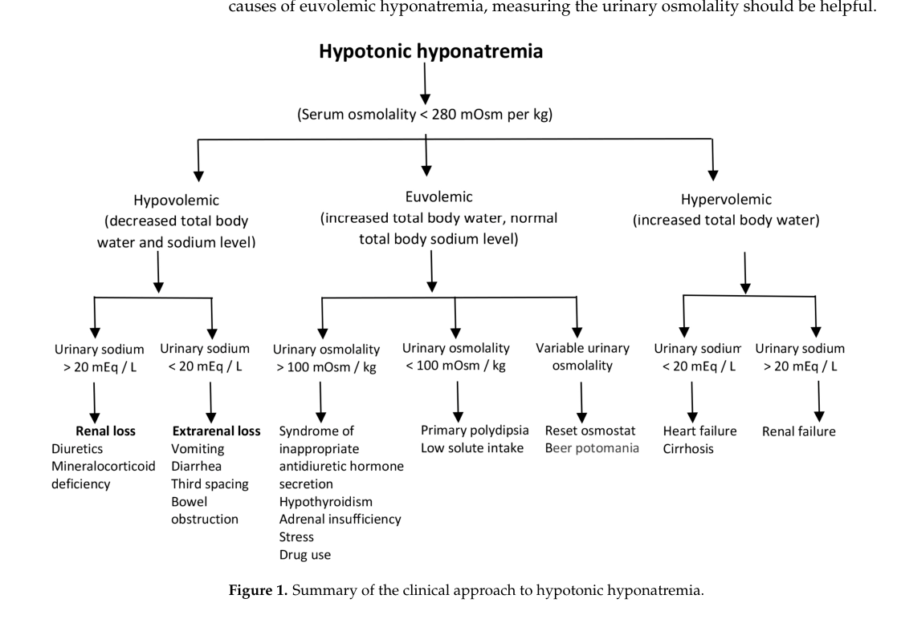

## Question

# Disease Characteristics Research Template

## Target Disease
- **Disease Name:** Water Intoxication
- **MONDO ID:** MONDO:0022007 (if available)
- **Category:** Environmental

## Research Objectives

Please provide a comprehensive research report on **Water Intoxication** covering all of the
disease characteristics listed below. This report will be used to populate a disease knowledge
base entry. Be thorough and cite primary literature (PMID preferred) for all claims.

For each section, **suggested databases/resources** are listed. These are the first places
you should search for information on each topic.

---

### 1. Disease Information
> **Search first:** OMIM, Orphanet, ICD-10/ICD-11, MeSH, PubMed

- What is the disease? Provide a concise overview.
- What are the key identifiers? (OMIM, Orphanet, ICD-10/ICD-11, MeSH, Mondo)
- What are the common synonyms and alternative names?
- Is the information derived from individual patients (e.g., EHR) or aggregated disease-level resources?

### 2. Etiology

- **Disease Causal Factors**: What are the primary causes? (genetic, environmental, infectious, mechanistic)
- **Risk Factors**:
  > **Search first:** PubMed, Cochrane Library, UpToDate, clinical guidelines, ClinVar, ClinGen, GWAS Catalog, PheGenI, CTD, CDC, WHO, epidemiological databases
  - Genetic risk factors (causal variants, susceptibility loci, modifier genes)
  - Environmental risk factors (toxins, lifestyle, occupational exposures, age, sex, family history)
- **Protective Factors**:
  > **Search first:** PubMed, Cochrane Library, clinical trial databases, GWAS Catalog, gnomAD, WHO, CDC, nutrition databases
  - Genetic protective factors (protective variants, modifier alleles)
  - Environmental protective factors (diet, lifestyle, exposures that reduce risk)
- **Gene-Environment Interactions**: How do genetic and environmental factors interact to influence disease?
  > **Search first:** CTD, PubMed, PheGenI, GxE databases

### 3. Phenotypes
> **Search first:** HPO (Human Phenotype Ontology), OMIM, Orphanet, PubMed, clinicaltrials.gov, MedDRA, SNOMED CT, DECIPHER, LOINC

For each phenotype, provide:
- **Phenotype type**: symptoms, clinical signs, physical manifestations, behavioral changes, or laboratory abnormalities
  > For symptoms/signs: HPO, OMIM, Orphanet, PubMed
  > For behavioral changes: HPO, DSM, RDoC (Research Domain Criteria), PubMed
  > For laboratory abnormalities: LOINC, SNOMED CT, LabTests Online, PubMed
- **Phenotype characteristics**:
  > **Search first:** OMIM, Orphanet, HPO, PubMed
  - Age of symptom onset (neonatal, childhood, adult-onset, late-onset)
  - Symptom severity (mild, moderate, severe, variable)
  - Symptom progression (stable, progressive, episodic, fluctuating)
  - Frequency among affected individuals (percentage or qualitative)
- **Quality of life impact**: Effects on daily functioning and well-being (per-phenotype when possible)
  > **Search first:** EQ-5D database, SF-36, WHO QOL databases, PubMed
- Suggest HPO (Human Phenotype Ontology) terms for each phenotype

### 4. Genetic/Molecular Information

- **Causal Genes**: Gene mutations or chromosomal abnormalities responsible for disease (gene symbols, OMIM IDs)
  > **Search first:** OMIM, ClinVar, HGMD, Ensembl, NCBI Gene
- **Pathogenic Variants**:
  - Affected genes (gene symbols, HGNC IDs)
    > **Search first:** OMIM, NCBI Gene, Ensembl, HGNC, UniProt, GeneCards
  - Variant classification (pathogenic, likely pathogenic, VUS per ACMG/AMP guidelines)
    > **Search first:** ClinVar, ClinGen, ACMG/AMP guidelines, VarSome
  - Variant type/class (missense, frameshift, nonsense, splice-site, structural)
  - Allele frequency in population databases
    > **Search first:** gnomAD, 1000 Genomes, ExAC, TOPMed, dbSNP
  - Somatic vs germline origin
    > **Search first:** COSMIC (somatic), ClinVar, ICGC, TCGA
  - Functional consequences (loss of function, gain of function, dominant negative)
- **Modifier Genes**: Genes that modify disease severity or expression
- **Epigenetic Information**: DNA methylation, histone modifications, chromatin changes affecting disease
  > **Search first:** ENCODE, Roadmap Epigenomics, MethBase, DiseaseMeth
- **Chromosomal Abnormalities**: Large-scale genetic changes (aneuploidy, translocations, inversions)
  > **Search first:** DECIPHER, ClinVar, ECARUCA, UCSC Genome Browser

### 5. Environmental Information

- **Environmental Factors**: Non-genetic contributing factors (toxins, radiation, pollution, occupational exposure)
  > **Search first:** CTD (Comparative Toxicogenomics Database), TOXNET, PubMed, EPA databases
- **Lifestyle Factors**: Behavioral factors (smoking, diet, exercise, alcohol consumption)
  > **Search first:** CDC databases, WHO, PubMed, NHANES
- **Infectious Agents**: If applicable, pathogens causing or triggering disease (bacteria, viruses, fungi, parasites)
  > **Search first:** NCBI Taxonomy, ViPR, BV-BRC, MicrobeDB, GIDEON

### 6. Mechanism / Pathophysiology

**Present this section as an ordered causal chain first, then the detail below.**
Open with a numbered sequence of mechanistic steps running from the initiating
lesion (mutation, exposure, infection) to the clinical manifestation, one step per
line, each naming what it causes next. State the causal verb explicitly ("leads
to", "results in") and say where a step is inferred rather than demonstrated.
Where the mechanism branches, show the branch. The categories below are a
checklist of what to cover within those steps, not the organizing structure —
a step may draw on several of them, and a category may contribute to several
steps.

- **Molecular Pathways**: Specific signaling cascades or biochemical pathways involved (Wnt, MAPK, mTOR, PI3K-AKT, etc.)
  > **Search first:** KEGG, Reactome, WikiPathways, PathBank, BioCyc
- **Cellular Processes**: Cell-level mechanisms (apoptosis, autophagy, cell cycle dysregulation, inflammation, etc.)
  > **Search first:** Gene Ontology (GO), Reactome, KEGG, PubMed
- **Protein Dysfunction**: How protein structure or function is altered (misfolding, aggregation, loss of function, gain of function)
  > **Search first:** UniProt, PDB (Protein Data Bank), InterPro, Pfam, AlphaFold
- **Metabolic Changes**: Alterations in metabolic processes (energy metabolism, lipid metabolism, amino acid metabolism)
  > **Search first:** KEGG, BioCyc, HMDB (Human Metabolome Database), BRENDA
- **Immune System Involvement**: Role of immune response (autoimmunity, immunodeficiency, chronic inflammation)
  > **Search first:** ImmPort, Immunome Database, IEDB, Gene Ontology
- **Tissue Damage Mechanisms**: How tissues/ are injured (oxidative stress, ischemia, fibrosis, necrosis)
  > **Search first:** PubMed, Gene Ontology, Reactome
- **Biochemical Abnormalities**: Specific molecular defects (enzyme deficiencies, receptor dysfunction, ion channel defects)
  > **Search first:** BRENDA, UniProt, KEGG, OMIM, PubMed
- **Epigenetic Changes**: DNA methylation, histone modifications affecting gene expression in disease
  > **Search first:** ENCODE, Roadmap Epigenomics, MethBase, DiseaseMeth
- **Molecular Profiling** (if available):
  - Transcriptomics/gene expression changes
    > **Search first:** GEO (Gene Expression Omnibus), ArrayExpress, GTEx, Human Cell Atlas, SRA
  - Proteomics findings
    > **Search first:** PRIDE, ProteomeXchange, Human Protein Atlas, STRING, BioGRID
  - Metabolomics signatures
    > **Search first:** MetaboLights, Metabolomics Workbench, HMDB, METLIN
  - Lipidomics alterations
    > **Search first:** LIPID MAPS, SwissLipids, LipidHome, Metabolomics Workbench
  - Genomic structural features
    > **Search first:** UCSC Genome Browser, Ensembl, NCBI, dbVar, DGV
- **Advanced Technologies** (if applicable):
  - Single-cell analysis findings (cell-type specific mechanisms, cellular heterogeneity)
    > **Search first:** Human Cell Atlas, Single Cell Portal, GEO, CELLxGENE
  - Spatial transcriptomics findings
    > **Search first:** GEO, Spatial Research, Vizgen, 10x Genomics data
  - Multi-omics integration results
    > **Search first:** TCGA, ICGC, cBioPortal, LinkedOmics, PubMed
  - Functional genomics screens (CRISPR, RNAi)
    > **Search first:** DepMap, GenomeRNAi, PubMed, BioGRID ORCS

For each mechanism, describe:
- The causal chain from initial trigger to clinical manifestation
- Which mechanisms are upstream vs downstream
- What cell types and biological processes are involved
- Suggest GO terms for biological processes and CL terms for cell types

### 7. Anatomical Structures Affected

- **Organ Level**:
  - Primary organs directly affected
  - Secondary organ involvement (complications, secondary effects)
  - Body systems involved (cardiovascular, nervous, digestive, respiratory, endocrine, etc.)
  > **Search first:** Uberon, FMA (Foundational Model of Anatomy), OMIM, HPO, ICD-11, MeSH, SNOMED CT
- **Tissue and Cell Level**:
  - Specific tissue types affected (epithelial, connective, muscle, nervous)
  - Specific cell populations targeted (with Cell Ontology terms)
  > **Search first:** Uberon, Human Protein Atlas, Cell Ontology, Human Cell Atlas, CellMarker, PanglaoDB
- **Subcellular Level**:
  - Cellular compartments involved (mitochondria, nucleus, ER, lysosomes) (with GO Cellular Component terms)
  > **Search first:** Gene Ontology (Cellular Component), UniProt, Human Protein Atlas
- **Localization**:
  - Specific anatomical sites (with UBERON terms)
    > **Search first:** FMA, Uberon, NeuroNames (for brain), SNOMED CT
  - Lateralization (unilateral, bilateral, asymmetric)
    > **Search first:** HPO, clinical literature, imaging databases

### 8. Temporal Development

- **Onset**:
  - Typical age of onset (congenital, pediatric, adult, geriatric)
  - Onset pattern (acute, subacute, chronic, insidious)
  > **Search first:** OMIM, Orphanet, HPO, PubMed
- **Progression**:
  - Disease stages (early, intermediate, advanced, end-stage)
    > **Search first:** Cancer Staging Manual (AJCC), WHO classifications, PubMed
  - Progression rate (rapid, slow, variable)
  - Disease course pattern (episodic, relapsing-remitting, progressive, stable)
  - Disease duration (self-limited, chronic lifelong)
  > **Search first:** Disease registries, longitudinal cohort databases, natural history studies, PubMed, Orphanet, OMIM
- **Patterns**:
  - Remission patterns (spontaneous, treatment-induced)
    > **Search first:** Clinical trial databases, disease registries, PubMed
  - Critical periods (time windows of vulnerability or opportunity for intervention)
    > **Search first:** PubMed, developmental biology databases, clinical guidelines

### 9. Inheritance and Population

- **Epidemiology**:
  - Prevalence (cases per 100,000 at given time)
  - Incidence (new cases per 100,000 per year)
  > **Search first:** Orphanet, CDC, WHO, GBD (Global Burden of Disease), national registries, SEER, disease registries
- **For Genetic Etiology**:
  - Inheritance pattern (AD, AR, X-linked, mitochondrial, multifactorial, polygenic)
    > **Search first:** OMIM, Orphanet, ClinVar, GTR (Genetic Testing Registry)
  - Penetrance (complete, incomplete, age-dependent)
    > **Search first:** ClinVar, OMIM, PubMed, ClinGen
  - Expressivity (variable, consistent)
    > **Search first:** OMIM, ClinVar, PubMed
  - Genetic anticipation (increasing severity in successive generations)
    > **Search first:** OMIM, PubMed (especially for repeat expansion disorders)
  - Germline mosaicism
    > **Search first:** ClinVar, OMIM, genetic counseling literature, PubMed
  - Founder effects (population-specific mutations)
    > **Search first:** gnomAD, population genetics databases, PubMed
  - Consanguinity role
    > **Search first:** OMIM, population studies, genetic counseling resources
  - Carrier frequency
    > **Search first:** gnomAD, carrier screening databases, GeneReviews, GTR
- **Population Demographics**:
  - Affected populations (ethnic or demographic groups with higher prevalence)
    > **Search first:** gnomAD, 1000 Genomes, PAGE Study, PubMed, population registries
  - Geographic distribution (endemic areas, regional variation)
    > **Search first:** WHO, CDC, GBD, Orphanet, geographic epidemiology databases
  - Geographic distribution of specific variants
  - Sex ratio (male:female)
    > **Search first:** Disease registries, OMIM, PubMed, epidemiological databases
  - Age distribution of affected individuals
    > **Search first:** CDC, disease registries, SEER, Orphanet

### 10. Diagnostics

- **Clinical Tests**:
  - Laboratory tests (blood, urine, tissue chemistry, specific enzyme assays)
    > **Search first:** LOINC, LabTests Online, PubMed
  - Biomarkers (proteins, metabolites, genetic markers, circulating biomarkers)
    > **Search first:** FDA Biomarker List, BEST (Biomarkers, EndpointS, and other Tools), PubMed
  - Imaging studies (X-ray, CT, MRI, PET, ultrasound)
    > **Search first:** RadLex, DICOM, Radiopaedia, imaging databases
  - Functional tests (pulmonary function, cardiac stress tests)
    > **Search first:** LOINC, clinical guidelines, PubMed
  - Electrophysiology (EEG, EMG, ECG, nerve conduction studies)
    > **Search first:** LOINC, clinical neurophysiology databases, PubMed
  - Biopsy findings (histopathology, immunohistochemistry)
    > **Search first:** SNOMED CT, College of American Pathologists resources, PubMed
  - Pathology findings (microscopic examination)
    > **Search first:** SNOMED CT, Digital Pathology databases, PubMed
- **Genetic Testing**:
  > **Search first:** GTR (Genetic Testing Registry), GeneReviews, ClinGen
  - Overview of recommended genetic testing approach
  - Whole genome sequencing (WGS) utility
    > **Search first:** GTR, ClinVar, GEL (Genomics England), gnomAD
  - Whole exome sequencing (WES) utility
    > **Search first:** GTR, ClinVar, OMIM, GeneMatcher
  - Gene panels (which panels, which genes)
    > **Search first:** GTR, ClinVar, laboratory-specific databases
  - Single gene testing
    > **Search first:** GTR, ClinVar, OMIM, GeneReviews
  - Chromosomal microarray (CMA)
    > **Search first:** DECIPHER, ClinVar, dbVar, ECARUCA
  - Karyotyping
    > **Search first:** Chromosome Abnormality Database, ClinVar, cytogenetics resources
  - FISH
    > **Search first:** ClinVar, cytogenetics databases, PubMed
  - Mitochondrial DNA testing
    > **Search first:** MITOMAP, MSeqDR, ClinVar, GTR
  - Repeat expansion testing
    > **Search first:** GTR, ClinVar, repeat expansion databases, PubMed
- **Omics-Based Diagnostics** (if applicable):
  - RNA sequencing / transcriptomics
    > **Search first:** GEO, ArrayExpress, GTEx, RNA-seq databases
  - Proteomics
    > **Search first:** PRIDE, ProteomeXchange, FDA Biomarker database
  - Metabolomics
    > **Search first:** MetaboLights, Metabolomics Workbench, HMDB
  - Epigenomics
    > **Search first:** GEO, ENCODE, Roadmap Epigenomics, MethBase
  - Liquid biopsy
    > **Search first:** COSMIC, ClinVar, liquid biopsy databases, PubMed
- **Clinical Criteria**:
  - Standardized diagnostic criteria (DSM, ICD, society guidelines)
    > **Search first:** DSM-5, ICD-11, clinical society guidelines, UpToDate
  - Differential diagnosis (other conditions to rule out, with distinguishing features)
    > **Search first:** DynaMed, UpToDate, clinical decision support systems
- **Screening**:
  - Screening methods for asymptomatic individuals (newborn screening, carrier screening, cascade screening)
    > **Search first:** ACMG recommendations, CDC newborn screening, GTR

### 11. Outcome/Prognosis

- **Survival and Mortality**:
  - Survival rate (5-year, 10-year, overall)
    > **Search first:** SEER, cancer registries, disease-specific registries, PubMed
  - Life expectancy (with and without treatment if applicable)
    > **Search first:** Orphanet, disease registries, actuarial databases, PubMed
  - Mortality rate
    > **Search first:** CDC, WHO, GBD, national mortality databases
  - Disease-specific mortality (deaths directly attributable to disease)
    > **Search first:** Disease registries, CDC Wonder, GBD, PubMed
- **Morbidity and Function**:
  - Morbidity (disease-related disability and health impacts)
    > **Search first:** GBD, WHO, disability databases, PubMed
  - Disability outcomes (long-term functional impairments)
    > **Search first:** ICF (International Classification of Functioning), disability registries
  - Quality of life measures (EQ-5D, SF-36, PROMIS, disease-specific tools)
    > **Search first:** EQ-5D database, SF-36, PROMIS, PubMed
- **Disease Course**:
  - Complications (secondary problems: infections, organ failure, etc.)
    > **Search first:** ICD codes, disease registries, clinical databases, PubMed
  - Recovery potential (likelihood and extent of recovery, with vs without treatment)
    > **Search first:** Natural history studies, rehabilitation databases, PubMed
- **Prediction**:
  - Prognostic factors (age, disease severity, biomarkers, treatment response)
    > **Search first:** Prognostic models databases, clinical calculators, PubMed
  - Prognostic biomarkers (molecular markers predicting disease course)
    > **Search first:** FDA Biomarker database, PubMed, cancer prognostic databases

### 12. Treatment

- **Pharmacotherapy**:
  - Pharmacological treatments (drug names, drug classes, mechanisms of action)
    > **Search first:** DrugBank, RxNorm, ATC classification, DailyMed, FDA databases
  - Pharmacogenomics (how genetic variants affect drug metabolism, efficacy, toxicity)
    > **Search first:** PharmGKB, CPIC (Clinical Pharmacogenetics), FDA Table of PGx Biomarkers
- **Advanced Therapeutics**:
  - Gene therapy (viral vectors, CRISPR, gene replacement, gene editing)
    > **Search first:** ClinicalTrials.gov, FDA gene therapy database, ASGCT resources
  - Cell therapy (stem cell transplant, CAR-T, cellular therapeutics)
    > **Search first:** ClinicalTrials.gov, FDA cell therapy database, FACT standards
  - RNA-based therapies (ASOs, siRNA, mRNA therapies)
    > **Search first:** ClinicalTrials.gov, FDA approvals, PubMed
  - Targeted therapies (treatments directed at specific molecular targets)
    > **Search first:** My Cancer Genome, OncoKB, ClinicalTrials.gov, FDA approvals
  - Immunotherapies (checkpoint inhibitors, monoclonal antibodies)
    > **Search first:** Cancer Immunotherapy Database, FDA approvals, ClinicalTrials.gov
- **Surgical and Interventional**:
  - Surgical interventions (types of surgery, timing, outcomes)
    > **Search first:** CPT codes, surgical registries, clinical guidelines, PubMed
- **Supportive and Rehabilitative**:
  - Supportive care (symptom management, pain control, nutrition)
    > **Search first:** Clinical guidelines, Cochrane Library, PubMed
  - Rehabilitation (physical therapy, occupational therapy, speech therapy)
    > **Search first:** Rehabilitation medicine databases, clinical guidelines, PubMed
- **Experimental**:
  - Experimental treatments in clinical trials (with NCT identifiers if available)
    > **Search first:** ClinicalTrials.gov, EU Clinical Trials Register, WHO ICTRP
- **Treatment Outcomes**:
  - Treatment response rates
    > **Search first:** Clinical trial databases, FDA reviews, systematic reviews, PubMed
  - Side effects and adverse events
    > **Search first:** FDA Adverse Event Reporting System (FAERS), MedWatch, PubMed
- **Treatment Strategy**:
  - Treatment algorithms (clinical pathways, decision trees)
    > **Search first:** Clinical practice guidelines, NCCN Guidelines, UpToDate
  - Combination therapies
    > **Search first:** ClinicalTrials.gov, treatment guidelines, PubMed
  - Personalized medicine approaches (genotype-guided treatment)
    > **Search first:** My Cancer Genome, CIViC, PharmGKB, precision medicine databases

For each treatment, suggest NCIT (NCI Thesaurus) clinical-intervention terms where applicable.

### 13. Prevention

- **Prevention Levels**:
  - Primary prevention (preventing disease occurrence: vaccination, risk factor modification)
    > **Search first:** CDC, WHO, USPSTF recommendations, Cochrane Library
  - Secondary prevention (early detection and treatment: screening programs, early intervention)
    > **Search first:** USPSTF, CDC screening guidelines, WHO
  - Tertiary prevention (preventing complications in those with disease)
    > **Search first:** Clinical guidelines, disease management protocols, PubMed
- **Immunization**: Vaccine strategies (if applicable)
  > **Search first:** CDC vaccine schedules, WHO immunization, FDA vaccine database
- **Screening and Early Detection**:
  - Screening programs (population-based: newborn screening, cancer screening)
    > **Search first:** CDC screening programs, USPSTF, cancer screening databases
  - Genetic screening (carrier screening, preimplantation genetic diagnosis, prenatal testing)
    > **Search first:** ACMG recommendations, ACOG guidelines, GTR
  - Risk stratification (identifying high-risk individuals for targeted prevention)
    > **Search first:** Risk prediction models, clinical calculators, PubMed
- **Behavioral Interventions**: Lifestyle modifications to reduce risk
  > **Search first:** CDC, WHO, behavioral intervention databases, Cochrane Library
- **Counseling**: Genetic counseling (risk assessment, family planning guidance)
  > **Search first:** NSGC resources, ACMG guidelines, GeneReviews
- **Public Health**:
  - Public health interventions (sanitation, vector control, health education)
    > **Search first:** CDC, WHO, public health databases, PubMed
  - Environmental interventions (reducing environmental risk factors)
    > **Search first:** EPA databases, WHO environmental health, PubMed
- **Prophylaxis**: Preventive medications or procedures
  > **Search first:** Clinical guidelines, FDA approvals, PubMed

### 14. Other Species / Natural Disease

- **Taxonomy**: Species affected (with NCBI Taxon identifiers)
  > **Search first:** NCBI Taxonomy
- **Breed**: Specific breeds affected (with VBO identifiers if applicable)
  > **Search first:** VBO (Vertebrate Breed Ontology)
- **Gene**: Orthologous genes in other species (with NCBI Gene IDs)
  > **Search first:** NCBI Gene
- **Natural Disease**:
  - Naturally occurring disease in other species (companion animals, wildlife)
    > **Search first:** OMIA (Online Mendelian Inheritance in Animals), VetCompass, PubMed
  - Veterinary relevance and importance in animal health
    > **Search first:** OMIA, veterinary databases, PubMed
- **Comparative Biology**:
  - Comparative pathology (similarities and differences across species)
    > **Search first:** OMIA, comparative pathology databases, PubMed
  - Evolutionary conservation of disease mechanisms
    > **Search first:** HomoloGene, OrthoMCL, Alliance of Genome Resources
- **Transmission** (if applicable):
  - Zoonotic potential
    > **Search first:** CDC zoonotic diseases, WHO zoonoses, GIDEON
  - Cross-species susceptibility
    > **Search first:** NCBI Taxonomy, veterinary databases, PubMed

### 15. Model Organisms

- **Model Types**:
  - Model organism type (mammalian, invertebrate, cellular, in vitro)
    > **Search first:** Alliance of Genome Resources, model organism databases
  - Specific model systems (mouse, rat, zebrafish, Drosophila, C. elegans, yeast, cell lines, organoids, iPSCs)
    > **Search first:** MGI, RGD, ZFIN, FlyBase, WormBase, SGD, ATCC, Cellosaurus
  - Induced models (drug treatment, surgical intervention, environmental manipulation)
    > **Search first:** MGI, model organism databases, PubMed
- **Genetic Models**:
  - Types available (knockout, knock-in, transgenic, conditional, humanized)
    > **Search first:** MGI, IMPC, KOMP, EuMMCR, IMSR
- **Model Characteristics**:
  - Phenotype recapitulation (how well model reproduces human disease features)
    > **Search first:** Model organism databases, comparative studies, PubMed
  - Model limitations (aspects of human disease not captured)
    > **Search first:** Model organism databases, PubMed, review articles
- **Applications**:
  - Research applications (what aspects of disease can be studied)
    > **Search first:** Model organism databases, PubMed
- **Resources**:
  - Model databases
    > **Search first:** MGI, RGD, ZFIN, FlyBase, WormBase, IMSR, EMMA, MMRRC

---

## Citation Requirements

- Cite primary literature (PMID preferred) for all mechanistic and clinical claims
- Prioritize recent reviews and landmark papers
- Include direct quotes from abstracts where possible to support key statements
- Distinguish evidence source types: human clinical, model organism, in vitro, computational

## Output Format

Structure your response as a comprehensive narrative organized by the sections above.
For each section, provide:
- Factual content with specific details (numbers, percentages, gene names, variant nomenclature)
- Ontology term suggestions (HPO, GO, CL, UBERON, CHEBI, NCIT, MONDO) where applicable
- Evidence citations with PMIDs
- Direct quotes from abstracts to support key claims
- Clear indication when information is not available or not applicable for this disease

This report will be used to populate a disease knowledge base entry with:
- Pathophysiology descriptions with causal chains
- Gene/protein annotations (HGNC, GO terms)
- Phenotype associations (HP terms) with frequencies
- Cell type involvement (CL terms)
- Anatomical locations (UBERON terms)
- Chemical entities (CHEBI terms)
- Treatment annotations (NCIT terms)
- Evidence items with PMIDs and exact abstract quotes
- Epidemiology, prognosis, diagnostic, and prevention information
- Animal model descriptions with phenotype recapitulation details

## Output

Question: You are an expert researcher providing comprehensive, well-cited information.

Provide detailed information focusing on:
1. Key concepts and definitions with current understanding
2. Recent developments and latest research (prioritize 2023-2024 sources)
3. Current applications and real-world implementations
4. Expert opinions and analysis from authoritative sources
5. Relevant statistics and data from recent studies

Format as a comprehensive research report with proper citations. Include URLs and publication dates where available.
Always prioritize recent, authoritative sources and provide specific citations for all major claims.

# Disease Characteristics Research Template

## Target Disease
- **Disease Name:** Water Intoxication
- **MONDO ID:** MONDO:0022007 (if available)
- **Category:** Environmental

## Research Objectives

Please provide a comprehensive research report on **Water Intoxication** covering all of the
disease characteristics listed below. This report will be used to populate a disease knowledge
base entry. Be thorough and cite primary literature (PMID preferred) for all claims.

For each section, **suggested databases/resources** are listed. These are the first places
you should search for information on each topic.

---

### 1. Disease Information
> **Search first:** OMIM, Orphanet, ICD-10/ICD-11, MeSH, PubMed

- What is the disease? Provide a concise overview.
- What are the key identifiers? (OMIM, Orphanet, ICD-10/ICD-11, MeSH, Mondo)
- What are the common synonyms and alternative names?
- Is the information derived from individual patients (e.g., EHR) or aggregated disease-level resources?

### 2. Etiology

- **Disease Causal Factors**: What are the primary causes? (genetic, environmental, infectious, mechanistic)
- **Risk Factors**:
  > **Search first:** PubMed, Cochrane Library, UpToDate, clinical guidelines, ClinVar, ClinGen, GWAS Catalog, PheGenI, CTD, CDC, WHO, epidemiological databases
  - Genetic risk factors (causal variants, susceptibility loci, modifier genes)
  - Environmental risk factors (toxins, lifestyle, occupational exposures, age, sex, family history)
- **Protective Factors**:
  > **Search first:** PubMed, Cochrane Library, clinical trial databases, GWAS Catalog, gnomAD, WHO, CDC, nutrition databases
  - Genetic protective factors (protective variants, modifier alleles)
  - Environmental protective factors (diet, lifestyle, exposures that reduce risk)
- **Gene-Environment Interactions**: How do genetic and environmental factors interact to influence disease?
  > **Search first:** CTD, PubMed, PheGenI, GxE databases

### 3. Phenotypes
> **Search first:** HPO (Human Phenotype Ontology), OMIM, Orphanet, PubMed, clinicaltrials.gov, MedDRA, SNOMED CT, DECIPHER, LOINC

For each phenotype, provide:
- **Phenotype type**: symptoms, clinical signs, physical manifestations, behavioral changes, or laboratory abnormalities
  > For symptoms/signs: HPO, OMIM, Orphanet, PubMed
  > For behavioral changes: HPO, DSM, RDoC (Research Domain Criteria), PubMed
  > For laboratory abnormalities: LOINC, SNOMED CT, LabTests Online, PubMed
- **Phenotype characteristics**:
  > **Search first:** OMIM, Orphanet, HPO, PubMed
  - Age of symptom onset (neonatal, childhood, adult-onset, late-onset)
  - Symptom severity (mild, moderate, severe, variable)
  - Symptom progression (stable, progressive, episodic, fluctuating)
  - Frequency among affected individuals (percentage or qualitative)
- **Quality of life impact**: Effects on daily functioning and well-being (per-phenotype when possible)
  > **Search first:** EQ-5D database, SF-36, WHO QOL databases, PubMed
- Suggest HPO (Human Phenotype Ontology) terms for each phenotype

### 4. Genetic/Molecular Information

- **Causal Genes**: Gene mutations or chromosomal abnormalities responsible for disease (gene symbols, OMIM IDs)
  > **Search first:** OMIM, ClinVar, HGMD, Ensembl, NCBI Gene
- **Pathogenic Variants**:
  - Affected genes (gene symbols, HGNC IDs)
    > **Search first:** OMIM, NCBI Gene, Ensembl, HGNC, UniProt, GeneCards
  - Variant classification (pathogenic, likely pathogenic, VUS per ACMG/AMP guidelines)
    > **Search first:** ClinVar, ClinGen, ACMG/AMP guidelines, VarSome
  - Variant type/class (missense, frameshift, nonsense, splice-site, structural)
  - Allele frequency in population databases
    > **Search first:** gnomAD, 1000 Genomes, ExAC, TOPMed, dbSNP
  - Somatic vs germline origin
    > **Search first:** COSMIC (somatic), ClinVar, ICGC, TCGA
  - Functional consequences (loss of function, gain of function, dominant negative)
- **Modifier Genes**: Genes that modify disease severity or expression
- **Epigenetic Information**: DNA methylation, histone modifications, chromatin changes affecting disease
  > **Search first:** ENCODE, Roadmap Epigenomics, MethBase, DiseaseMeth
- **Chromosomal Abnormalities**: Large-scale genetic changes (aneuploidy, translocations, inversions)
  > **Search first:** DECIPHER, ClinVar, ECARUCA, UCSC Genome Browser

### 5. Environmental Information

- **Environmental Factors**: Non-genetic contributing factors (toxins, radiation, pollution, occupational exposure)
  > **Search first:** CTD (Comparative Toxicogenomics Database), TOXNET, PubMed, EPA databases
- **Lifestyle Factors**: Behavioral factors (smoking, diet, exercise, alcohol consumption)
  > **Search first:** CDC databases, WHO, PubMed, NHANES
- **Infectious Agents**: If applicable, pathogens causing or triggering disease (bacteria, viruses, fungi, parasites)
  > **Search first:** NCBI Taxonomy, ViPR, BV-BRC, MicrobeDB, GIDEON

### 6. Mechanism / Pathophysiology

**Present this section as an ordered causal chain first, then the detail below.**
Open with a numbered sequence of mechanistic steps running from the initiating
lesion (mutation, exposure, infection) to the clinical manifestation, one step per
line, each naming what it causes next. State the causal verb explicitly ("leads
to", "results in") and say where a step is inferred rather than demonstrated.
Where the mechanism branches, show the branch. The categories below are a
checklist of what to cover within those steps, not the organizing structure —
a step may draw on several of them, and a category may contribute to several
steps.

- **Molecular Pathways**: Specific signaling cascades or biochemical pathways involved (Wnt, MAPK, mTOR, PI3K-AKT, etc.)
  > **Search first:** KEGG, Reactome, WikiPathways, PathBank, BioCyc
- **Cellular Processes**: Cell-level mechanisms (apoptosis, autophagy, cell cycle dysregulation, inflammation, etc.)
  > **Search first:** Gene Ontology (GO), Reactome, KEGG, PubMed
- **Protein Dysfunction**: How protein structure or function is altered (misfolding, aggregation, loss of function, gain of function)
  > **Search first:** UniProt, PDB (Protein Data Bank), InterPro, Pfam, AlphaFold
- **Metabolic Changes**: Alterations in metabolic processes (energy metabolism, lipid metabolism, amino acid metabolism)
  > **Search first:** KEGG, BioCyc, HMDB (Human Metabolome Database), BRENDA
- **Immune System Involvement**: Role of immune response (autoimmunity, immunodeficiency, chronic inflammation)
  > **Search first:** ImmPort, Immunome Database, IEDB, Gene Ontology
- **Tissue Damage Mechanisms**: How tissues/ are injured (oxidative stress, ischemia, fibrosis, necrosis)
  > **Search first:** PubMed, Gene Ontology, Reactome
- **Biochemical Abnormalities**: Specific molecular defects (enzyme deficiencies, receptor dysfunction, ion channel defects)
  > **Search first:** BRENDA, UniProt, KEGG, OMIM, PubMed
- **Epigenetic Changes**: DNA methylation, histone modifications affecting gene expression in disease
  > **Search first:** ENCODE, Roadmap Epigenomics, MethBase, DiseaseMeth
- **Molecular Profiling** (if available):
  - Transcriptomics/gene expression changes
    > **Search first:** GEO (Gene Expression Omnibus), ArrayExpress, GTEx, Human Cell Atlas, SRA
  - Proteomics findings
    > **Search first:** PRIDE, ProteomeXchange, Human Protein Atlas, STRING, BioGRID
  - Metabolomics signatures
    > **Search first:** MetaboLights, Metabolomics Workbench, HMDB, METLIN
  - Lipidomics alterations
    > **Search first:** LIPID MAPS, SwissLipids, LipidHome, Metabolomics Workbench
  - Genomic structural features
    > **Search first:** UCSC Genome Browser, Ensembl, NCBI, dbVar, DGV
- **Advanced Technologies** (if applicable):
  - Single-cell analysis findings (cell-type specific mechanisms, cellular heterogeneity)
    > **Search first:** Human Cell Atlas, Single Cell Portal, GEO, CELLxGENE
  - Spatial transcriptomics findings
    > **Search first:** GEO, Spatial Research, Vizgen, 10x Genomics data
  - Multi-omics integration results
    > **Search first:** TCGA, ICGC, cBioPortal, LinkedOmics, PubMed
  - Functional genomics screens (CRISPR, RNAi)
    > **Search first:** DepMap, GenomeRNAi, PubMed, BioGRID ORCS

For each mechanism, describe:
- The causal chain from initial trigger to clinical manifestation
- Which mechanisms are upstream vs downstream
- What cell types and biological processes are involved
- Suggest GO terms for biological processes and CL terms for cell types

### 7. Anatomical Structures Affected

- **Organ Level**:
  - Primary organs directly affected
  - Secondary organ involvement (complications, secondary effects)
  - Body systems involved (cardiovascular, nervous, digestive, respiratory, endocrine, etc.)
  > **Search first:** Uberon, FMA (Foundational Model of Anatomy), OMIM, HPO, ICD-11, MeSH, SNOMED CT
- **Tissue and Cell Level**:
  - Specific tissue types affected (epithelial, connective, muscle, nervous)
  - Specific cell populations targeted (with Cell Ontology terms)
  > **Search first:** Uberon, Human Protein Atlas, Cell Ontology, Human Cell Atlas, CellMarker, PanglaoDB
- **Subcellular Level**:
  - Cellular compartments involved (mitochondria, nucleus, ER, lysosomes) (with GO Cellular Component terms)
  > **Search first:** Gene Ontology (Cellular Component), UniProt, Human Protein Atlas
- **Localization**:
  - Specific anatomical sites (with UBERON terms)
    > **Search first:** FMA, Uberon, NeuroNames (for brain), SNOMED CT
  - Lateralization (unilateral, bilateral, asymmetric)
    > **Search first:** HPO, clinical literature, imaging databases

### 8. Temporal Development

- **Onset**:
  - Typical age of onset (congenital, pediatric, adult, geriatric)
  - Onset pattern (acute, subacute, chronic, insidious)
  > **Search first:** OMIM, Orphanet, HPO, PubMed
- **Progression**:
  - Disease stages (early, intermediate, advanced, end-stage)
    > **Search first:** Cancer Staging Manual (AJCC), WHO classifications, PubMed
  - Progression rate (rapid, slow, variable)
  - Disease course pattern (episodic, relapsing-remitting, progressive, stable)
  - Disease duration (self-limited, chronic lifelong)
  > **Search first:** Disease registries, longitudinal cohort databases, natural history studies, PubMed, Orphanet, OMIM
- **Patterns**:
  - Remission patterns (spontaneous, treatment-induced)
    > **Search first:** Clinical trial databases, disease registries, PubMed
  - Critical periods (time windows of vulnerability or opportunity for intervention)
    > **Search first:** PubMed, developmental biology databases, clinical guidelines

### 9. Inheritance and Population

- **Epidemiology**:
  - Prevalence (cases per 100,000 at given time)
  - Incidence (new cases per 100,000 per year)
  > **Search first:** Orphanet, CDC, WHO, GBD (Global Burden of Disease), national registries, SEER, disease registries
- **For Genetic Etiology**:
  - Inheritance pattern (AD, AR, X-linked, mitochondrial, multifactorial, polygenic)
    > **Search first:** OMIM, Orphanet, ClinVar, GTR (Genetic Testing Registry)
  - Penetrance (complete, incomplete, age-dependent)
    > **Search first:** ClinVar, OMIM, PubMed, ClinGen
  - Expressivity (variable, consistent)
    > **Search first:** OMIM, ClinVar, PubMed
  - Genetic anticipation (increasing severity in successive generations)
    > **Search first:** OMIM, PubMed (especially for repeat expansion disorders)
  - Germline mosaicism
    > **Search first:** ClinVar, OMIM, genetic counseling literature, PubMed
  - Founder effects (population-specific mutations)
    > **Search first:** gnomAD, population genetics databases, PubMed
  - Consanguinity role
    > **Search first:** OMIM, population studies, genetic counseling resources
  - Carrier frequency
    > **Search first:** gnomAD, carrier screening databases, GeneReviews, GTR
- **Population Demographics**:
  - Affected populations (ethnic or demographic groups with higher prevalence)
    > **Search first:** gnomAD, 1000 Genomes, PAGE Study, PubMed, population registries
  - Geographic distribution (endemic areas, regional variation)
    > **Search first:** WHO, CDC, GBD, Orphanet, geographic epidemiology databases
  - Geographic distribution of specific variants
  - Sex ratio (male:female)
    > **Search first:** Disease registries, OMIM, PubMed, epidemiological databases
  - Age distribution of affected individuals
    > **Search first:** CDC, disease registries, SEER, Orphanet

### 10. Diagnostics

- **Clinical Tests**:
  - Laboratory tests (blood, urine, tissue chemistry, specific enzyme assays)
    > **Search first:** LOINC, LabTests Online, PubMed
  - Biomarkers (proteins, metabolites, genetic markers, circulating biomarkers)
    > **Search first:** FDA Biomarker List, BEST (Biomarkers, EndpointS, and other Tools), PubMed
  - Imaging studies (X-ray, CT, MRI, PET, ultrasound)
    > **Search first:** RadLex, DICOM, Radiopaedia, imaging databases
  - Functional tests (pulmonary function, cardiac stress tests)
    > **Search first:** LOINC, clinical guidelines, PubMed
  - Electrophysiology (EEG, EMG, ECG, nerve conduction studies)
    > **Search first:** LOINC, clinical neurophysiology databases, PubMed
  - Biopsy findings (histopathology, immunohistochemistry)
    > **Search first:** SNOMED CT, College of American Pathologists resources, PubMed
  - Pathology findings (microscopic examination)
    > **Search first:** SNOMED CT, Digital Pathology databases, PubMed
- **Genetic Testing**:
  > **Search first:** GTR (Genetic Testing Registry), GeneReviews, ClinGen
  - Overview of recommended genetic testing approach
  - Whole genome sequencing (WGS) utility
    > **Search first:** GTR, ClinVar, GEL (Genomics England), gnomAD
  - Whole exome sequencing (WES) utility
    > **Search first:** GTR, ClinVar, OMIM, GeneMatcher
  - Gene panels (which panels, which genes)
    > **Search first:** GTR, ClinVar, laboratory-specific databases
  - Single gene testing
    > **Search first:** GTR, ClinVar, OMIM, GeneReviews
  - Chromosomal microarray (CMA)
    > **Search first:** DECIPHER, ClinVar, dbVar, ECARUCA
  - Karyotyping
    > **Search first:** Chromosome Abnormality Database, ClinVar, cytogenetics resources
  - FISH
    > **Search first:** ClinVar, cytogenetics databases, PubMed
  - Mitochondrial DNA testing
    > **Search first:** MITOMAP, MSeqDR, ClinVar, GTR
  - Repeat expansion testing
    > **Search first:** GTR, ClinVar, repeat expansion databases, PubMed
- **Omics-Based Diagnostics** (if applicable):
  - RNA sequencing / transcriptomics
    > **Search first:** GEO, ArrayExpress, GTEx, RNA-seq databases
  - Proteomics
    > **Search first:** PRIDE, ProteomeXchange, FDA Biomarker database
  - Metabolomics
    > **Search first:** MetaboLights, Metabolomics Workbench, HMDB
  - Epigenomics
    > **Search first:** GEO, ENCODE, Roadmap Epigenomics, MethBase
  - Liquid biopsy
    > **Search first:** COSMIC, ClinVar, liquid biopsy databases, PubMed
- **Clinical Criteria**:
  - Standardized diagnostic criteria (DSM, ICD, society guidelines)
    > **Search first:** DSM-5, ICD-11, clinical society guidelines, UpToDate
  - Differential diagnosis (other conditions to rule out, with distinguishing features)
    > **Search first:** DynaMed, UpToDate, clinical decision support systems
- **Screening**:
  - Screening methods for asymptomatic individuals (newborn screening, carrier screening, cascade screening)
    > **Search first:** ACMG recommendations, CDC newborn screening, GTR

### 11. Outcome/Prognosis

- **Survival and Mortality**:
  - Survival rate (5-year, 10-year, overall)
    > **Search first:** SEER, cancer registries, disease-specific registries, PubMed
  - Life expectancy (with and without treatment if applicable)
    > **Search first:** Orphanet, disease registries, actuarial databases, PubMed
  - Mortality rate
    > **Search first:** CDC, WHO, GBD, national mortality databases
  - Disease-specific mortality (deaths directly attributable to disease)
    > **Search first:** Disease registries, CDC Wonder, GBD, PubMed
- **Morbidity and Function**:
  - Morbidity (disease-related disability and health impacts)
    > **Search first:** GBD, WHO, disability databases, PubMed
  - Disability outcomes (long-term functional impairments)
    > **Search first:** ICF (International Classification of Functioning), disability registries
  - Quality of life measures (EQ-5D, SF-36, PROMIS, disease-specific tools)
    > **Search first:** EQ-5D database, SF-36, PROMIS, PubMed
- **Disease Course**:
  - Complications (secondary problems: infections, organ failure, etc.)
    > **Search first:** ICD codes, disease registries, clinical databases, PubMed
  - Recovery potential (likelihood and extent of recovery, with vs without treatment)
    > **Search first:** Natural history studies, rehabilitation databases, PubMed
- **Prediction**:
  - Prognostic factors (age, disease severity, biomarkers, treatment response)
    > **Search first:** Prognostic models databases, clinical calculators, PubMed
  - Prognostic biomarkers (molecular markers predicting disease course)
    > **Search first:** FDA Biomarker database, PubMed, cancer prognostic databases

### 12. Treatment

- **Pharmacotherapy**:
  - Pharmacological treatments (drug names, drug classes, mechanisms of action)
    > **Search first:** DrugBank, RxNorm, ATC classification, DailyMed, FDA databases
  - Pharmacogenomics (how genetic variants affect drug metabolism, efficacy, toxicity)
    > **Search first:** PharmGKB, CPIC (Clinical Pharmacogenetics), FDA Table of PGx Biomarkers
- **Advanced Therapeutics**:
  - Gene therapy (viral vectors, CRISPR, gene replacement, gene editing)
    > **Search first:** ClinicalTrials.gov, FDA gene therapy database, ASGCT resources
  - Cell therapy (stem cell transplant, CAR-T, cellular therapeutics)
    > **Search first:** ClinicalTrials.gov, FDA cell therapy database, FACT standards
  - RNA-based therapies (ASOs, siRNA, mRNA therapies)
    > **Search first:** ClinicalTrials.gov, FDA approvals, PubMed
  - Targeted therapies (treatments directed at specific molecular targets)
    > **Search first:** My Cancer Genome, OncoKB, ClinicalTrials.gov, FDA approvals
  - Immunotherapies (checkpoint inhibitors, monoclonal antibodies)
    > **Search first:** Cancer Immunotherapy Database, FDA approvals, ClinicalTrials.gov
- **Surgical and Interventional**:
  - Surgical interventions (types of surgery, timing, outcomes)
    > **Search first:** CPT codes, surgical registries, clinical guidelines, PubMed
- **Supportive and Rehabilitative**:
  - Supportive care (symptom management, pain control, nutrition)
    > **Search first:** Clinical guidelines, Cochrane Library, PubMed
  - Rehabilitation (physical therapy, occupational therapy, speech therapy)
    > **Search first:** Rehabilitation medicine databases, clinical guidelines, PubMed
- **Experimental**:
  - Experimental treatments in clinical trials (with NCT identifiers if available)
    > **Search first:** ClinicalTrials.gov, EU Clinical Trials Register, WHO ICTRP
- **Treatment Outcomes**:
  - Treatment response rates
    > **Search first:** Clinical trial databases, FDA reviews, systematic reviews, PubMed
  - Side effects and adverse events
    > **Search first:** FDA Adverse Event Reporting System (FAERS), MedWatch, PubMed
- **Treatment Strategy**:
  - Treatment algorithms (clinical pathways, decision trees)
    > **Search first:** Clinical practice guidelines, NCCN Guidelines, UpToDate
  - Combination therapies
    > **Search first:** ClinicalTrials.gov, treatment guidelines, PubMed
  - Personalized medicine approaches (genotype-guided treatment)
    > **Search first:** My Cancer Genome, CIViC, PharmGKB, precision medicine databases

For each treatment, suggest NCIT (NCI Thesaurus) clinical-intervention terms where applicable.

### 13. Prevention

- **Prevention Levels**:
  - Primary prevention (preventing disease occurrence: vaccination, risk factor modification)
    > **Search first:** CDC, WHO, USPSTF recommendations, Cochrane Library
  - Secondary prevention (early detection and treatment: screening programs, early intervention)
    > **Search first:** USPSTF, CDC screening guidelines, WHO
  - Tertiary prevention (preventing complications in those with disease)
    > **Search first:** Clinical guidelines, disease management protocols, PubMed
- **Immunization**: Vaccine strategies (if applicable)
  > **Search first:** CDC vaccine schedules, WHO immunization, FDA vaccine database
- **Screening and Early Detection**:
  - Screening programs (population-based: newborn screening, cancer screening)
    > **Search first:** CDC screening programs, USPSTF, cancer screening databases
  - Genetic screening (carrier screening, preimplantation genetic diagnosis, prenatal testing)
    > **Search first:** ACMG recommendations, ACOG guidelines, GTR
  - Risk stratification (identifying high-risk individuals for targeted prevention)
    > **Search first:** Risk prediction models, clinical calculators, PubMed
- **Behavioral Interventions**: Lifestyle modifications to reduce risk
  > **Search first:** CDC, WHO, behavioral intervention databases, Cochrane Library
- **Counseling**: Genetic counseling (risk assessment, family planning guidance)
  > **Search first:** NSGC resources, ACMG guidelines, GeneReviews
- **Public Health**:
  - Public health interventions (sanitation, vector control, health education)
    > **Search first:** CDC, WHO, public health databases, PubMed
  - Environmental interventions (reducing environmental risk factors)
    > **Search first:** EPA databases, WHO environmental health, PubMed
- **Prophylaxis**: Preventive medications or procedures
  > **Search first:** Clinical guidelines, FDA approvals, PubMed

### 14. Other Species / Natural Disease

- **Taxonomy**: Species affected (with NCBI Taxon identifiers)
  > **Search first:** NCBI Taxonomy
- **Breed**: Specific breeds affected (with VBO identifiers if applicable)
  > **Search first:** VBO (Vertebrate Breed Ontology)
- **Gene**: Orthologous genes in other species (with NCBI Gene IDs)
  > **Search first:** NCBI Gene
- **Natural Disease**:
  - Naturally occurring disease in other species (companion animals, wildlife)
    > **Search first:** OMIA (Online Mendelian Inheritance in Animals), VetCompass, PubMed
  - Veterinary relevance and importance in animal health
    > **Search first:** OMIA, veterinary databases, PubMed
- **Comparative Biology**:
  - Comparative pathology (similarities and differences across species)
    > **Search first:** OMIA, comparative pathology databases, PubMed
  - Evolutionary conservation of disease mechanisms
    > **Search first:** HomoloGene, OrthoMCL, Alliance of Genome Resources
- **Transmission** (if applicable):
  - Zoonotic potential
    > **Search first:** CDC zoonotic diseases, WHO zoonoses, GIDEON
  - Cross-species susceptibility
    > **Search first:** NCBI Taxonomy, veterinary databases, PubMed

### 15. Model Organisms

- **Model Types**:
  - Model organism type (mammalian, invertebrate, cellular, in vitro)
    > **Search first:** Alliance of Genome Resources, model organism databases
  - Specific model systems (mouse, rat, zebrafish, Drosophila, C. elegans, yeast, cell lines, organoids, iPSCs)
    > **Search first:** MGI, RGD, ZFIN, FlyBase, WormBase, SGD, ATCC, Cellosaurus
  - Induced models (drug treatment, surgical intervention, environmental manipulation)
    > **Search first:** MGI, model organism databases, PubMed
- **Genetic Models**:
  - Types available (knockout, knock-in, transgenic, conditional, humanized)
    > **Search first:** MGI, IMPC, KOMP, EuMMCR, IMSR
- **Model Characteristics**:
  - Phenotype recapitulation (how well model reproduces human disease features)
    > **Search first:** Model organism databases, comparative studies, PubMed
  - Model limitations (aspects of human disease not captured)
    > **Search first:** Model organism databases, PubMed, review articles
- **Applications**:
  - Research applications (what aspects of disease can be studied)
    > **Search first:** Model organism databases, PubMed
- **Resources**:
  - Model databases
    > **Search first:** MGI, RGD, ZFIN, FlyBase, WormBase, IMSR, EMMA, MMRRC

---

## Citation Requirements

- Cite primary literature (PMID preferred) for all mechanistic and clinical claims
- Prioritize recent reviews and landmark papers
- Include direct quotes from abstracts where possible to support key statements
- Distinguish evidence source types: human clinical, model organism, in vitro, computational

## Output Format

Structure your response as a comprehensive narrative organized by the sections above.
For each section, provide:
- Factual content with specific details (numbers, percentages, gene names, variant nomenclature)
- Ontology term suggestions (HPO, GO, CL, UBERON, CHEBI, NCIT, MONDO) where applicable
- Evidence citations with PMIDs
- Direct quotes from abstracts to support key claims
- Clear indication when information is not available or not applicable for this disease

This report will be used to populate a disease knowledge base entry with:
- Pathophysiology descriptions with causal chains
- Gene/protein annotations (HGNC, GO terms)
- Phenotype associations (HP terms) with frequencies
- Cell type involvement (CL terms)
- Anatomical locations (UBERON terms)
- Chemical entities (CHEBI terms)
- Treatment annotations (NCIT terms)
- Evidence items with PMIDs and exact abstract quotes
- Epidemiology, prognosis, diagnostic, and prevention information
- Animal model descriptions with phenotype recapitulation details

# Water intoxication: disease-characteristics research report

**Scope and evidence standard.** Water intoxication is an acquired syndrome of excess *electrolyte-free water relative to excretory capacity*, producing hypotonic hyponatremia and, when sufficiently rapid or severe, hyponatremic encephalopathy. It is **not synonymous with every case of hyponatremia**: sodium can also fall through sodium loss, organ failure, inappropriate antidiuresis, or non-hypotonic mechanisms. The strongest directly relevant evidence below comes from individual human cases and experimental animals; treatment trials usually enroll patients with **hyponatremia of mixed etiologies**. Publication dates and DOI links are provided where verified. (spasovski2024etiologyclinicalapproach pages 2-4, minhas2024rhabdomyolysissecondaryto pages 1-2, evanson2023thecatastrophiceffects pages 1-3)

## 1. Disease information

Water intoxication, also called **water poisoning**, **acute water intoxication**, or, when neurologically symptomatic, **water-intoxication–associated hyponatremic encephalopathy**, occurs when ingested or administered hypotonic fluid exceeds the kidneys’ ability to eliminate free water. Primary/psychogenic polydipsia is one important *cause*, not an exact synonym; exercise-associated hyponatremia (EAH) is another overlapping clinical category. Operational findings are serum sodium **<135 mmol/L** and, for true hypotonic disease, serum osmolality **<275 mOsm/kg**. The user-supplied **MONDO:0022007** should be treated as *provisional*: an authoritative ontology record, exact MeSH descriptor, ICD-10/ICD-11 mapping, OMIM number, and Orphanet number for this acquired syndrome were **not independently verified** in the retrieved sources. Record hyponatremia separately rather than asserting an unverified one-to-one disease-code mapping. There is no established OMIM-style monogenic entry for ordinary exposure-driven water intoxication. This report aggregates published cases, research cohorts, trials, reviews, and guidelines; it is **not** an individual patient’s EHR entry. (spasovski2024etiologyclinicalapproach pages 2-4, schwarz2024konsensusempfehlungenzurdiagnose pages 5-6, evanson2023thecatastrophiceffects pages 1-3)

## 2. Etiology, risk, and protection

**Causal exposure:** rapid or sustained ingestion of water or other low-solute fluids; iatrogenic hypotonic fluid administration is another route. An intact kidney can normally defend against substantial water intake, but excessive intake, low dietary solute, reduced filtration, or persistent non-osmotic arginine vasopressin (**AVP**) release during exercise, pain, or nausea can overwhelm that defense. Psychiatric compulsive drinking, endurance events, and misleading advice to drink beyond thirst are documented contexts. Medications that promote hyponatremia or impair urinary dilution—including thiazides and some psychotropics—can compound water loading; medication-associated hyponatremia without documented excess intake should **not** automatically be called water intoxication. There is no infectious agent or transmissible toxin intrinsic to this disorder: the harmful exposure is a *water load relative to physiological capacity*. (spasovski2024etiologyclinicalapproach pages 2-4, spasovski2024etiologyclinicalapproach pages 6-7, minhas2024rhabdomyolysissecondaryto pages 1-2, evanson2023thecatastrophiceffects pages 1-3)

**Clinical risk contexts:** prolonged endurance exercise with weight gain, psychiatric polydipsia, low-solute nutrition, kidney impairment, and medications or stressors that maintain antidiuresis. Age, smaller total-body-water reserve, and possibly sex alter susceptibility, but sex-specific risk estimates are uncertain: a 2025 primary study with only nine women explicitly did not compare sexes statistically. **Protective measures** are avoiding forced overdrinking, ensuring appropriate dietary solute when clinically appropriate, reviewing relevant drugs, and detecting abnormal sodium early in high-risk situations. No validated *protective human allele* for ordinary water intoxication was established. (spasovski2024etiologyclinicalapproach pages 2-4, sumi2025treatmentofhyponatremia pages 2-4, chlibkova2025nohyponatremiadespite pages 2-3, chlibkova2025nohyponatremiadespite pages 1-2)

**Gene–environment distinction:** the AVP–**AVPR2**–**AQP2** renal pathway modifies the response to a water load, but ordinary water intoxication is **not caused by a demonstrated pathogenic variant**. Rare inherited **AVPR2** gain-of-function disease produces a separate disorder—nephrogenic syndrome of inappropriate antidiuresis (**NSIAD**)—that can make routine fluid intake dangerous. This is a differential diagnosis and a biologically plausible gene–water-exposure interaction, not proof that AVPR2 variants explain typical psychiatric or exercise-related cases. (OpenTargets Search: nephrogenic syndrome of inappropriate antidiuresis-AVPR2,AQP2, feldman2005nephrogenicsyndromeof pages 1-2, knoers2022inheriteddisordersof pages 1-4)

## 3. Phenotypes and functional impact

Manifestations vary with **rate and magnitude of sodium decline**. Initial nausea, vomiting, headache, weakness, or gait disturbance can progress to confusion, seizures, coma, and brain-stem compromise. Hyponatremia and low serum osmolality are key laboratory abnormalities; urine can be maximally dilute in uncomplicated polydipsia or remain concentrated in antidiuretic or mixed states. Frequency percentages for *individual water-intoxication phenotypes* and validated phenotype-specific EQ-5D/SF-36 outcomes were not found; presenting such percentages would conflate case reports with population studies. Transient confusion or ataxia can impede daily activity, while seizures, intensive-care admission, and coma entail profound short-term disability; sustained long-term quality-of-life estimates are unavailable. (toll1999acutewaterintoxication pages 1-3, minhas2024rhabdomyolysissecondaryto pages 1-2, evanson2023thecatastrophiceffects pages 1-3, evanson2023thecatastrophiceffects pages 3-4)

The following artifact separates symptoms, risk-associated behavior, laboratory findings, and treatment complications. Its suggested **HPO labels are candidates, not verified HP accessions**. (toll1999acutewaterintoxication pages 1-3, minhas2024rhabdomyolysissecondaryto pages 1-2, evanson2023thecatastrophiceffects pages 1-3)

| Phenotype (category) | Onset and course/severity | Frequency / evidence quality | Suggested HPO term label |
|---|---|---|---|
| Excessive thirst / polydipsia (risk-associated behavior) | May precede intoxication for hours to weeks; drives excessive intake but is **not a universal symptom** of water intoxication. A 2023 schizoaffective-disorder case involved 16–17 glasses/day and persistent water seeking (evanson2023thecatastrophiceffects pages 1-3, evanson2023thecatastrophiceffects pages 3-4). | Not quantified for water intoxication overall; supported mainly by psychiatric case reports and subgroup literature. | Polydipsia; Excessive fluid intake |
| Polyuria after water loading (clinical sign) | Usually emerges as AVP is suppressed and excess water is excreted; may be brisk during recovery. The 2023 case produced 4.7 L in 8 hours and later 6 L in 5 hours; a naturally affected dog produced approximately 15 mL/kg/hour (evanson2023thecatastrophiceffects pages 3-4, toll1999acutewaterintoxication pages 1-3). | Not quantified; directly observed in human and canine cases. Polyuria may be absent or delayed when AVP remains active, renal function is impaired, or urinary retention is present. | Polyuria |
| Nausea and vomiting (symptom) | Early, nonspecific manifestations of acute hypotonicity; may progress with falling sodium. Vomiting preceded collapse and coma in the canine case and is reported in psychiatric water intoxication (toll1999acutewaterintoxication pages 1-3, minhas2024rhabdomyolysissecondaryto pages 1-2). | Frequency not quantified specifically for water intoxication; case-based clinical evidence. | Nausea; Vomiting |
| Headache (symptom) | Typically acute and potentially progressive; reflects developing cerebral edema or increased intracranial pressure. | Frequency not quantified specifically for water intoxication; established in clinical reviews rather than dedicated cohorts (darazi2026waterintoxicationhyponatremia pages 7-8). | Headache |
| Confusion / hyponatremic encephalopathy (neurologic symptom/sign) | Acute or fluctuating; ranges from disorientation and delirium to profound encephalopathy. A 2023 patient presented aphasic and unresponsive with Na 115 mmol/L and serum osmolality 246 mOsm/kg (evanson2023thecatastrophiceffects pages 1-3, evanson2023thecatastrophiceffects pages 3-4). | Frequency not quantified; directly documented in human case reports. | Confusion; Encephalopathy; Delirium |
| Ataxia (neurologic sign) | Usually acute and may accompany weakness, vomiting, collapse, or impaired consciousness. The naturally affected dog developed ataxia before coma and residual weakness improved over approximately 33 hours (toll1999acutewaterintoxication pages 1-3, toll1999acutewaterintoxication pages 3-4). | Frequency not quantified; human descriptions and direct veterinary case evidence. | Ataxia |
| Seizures (neurologic manifestation) | Severe, usually acute manifestation of hyponatremic cerebral edema; may rapidly progress to respiratory compromise or coma. | Frequency not quantified specifically for water intoxication; recurrently reported in psychiatric and exercise-associated cases. | Seizure |
| Coma (neurologic manifestation) | Life-threatening acute manifestation. A dog became comatose after prolonged lake play but recovered without specific sodium therapy as brisk diuresis corrected the water excess (toll1999acutewaterintoxication pages 1-3, toll1999acutewaterintoxication pages 3-4). | Frequency not quantified; strong case-level evidence but no population denominator. | Coma |
| Cerebral edema / increased intracranial pressure (pathologic manifestation) | Develops rapidly when acute hypotonicity drives water into brain cells; can progress to herniation. Acute rat hyponatremia increased brain water from 78.3% in sham animals to 79.4–79.5%; severe mouse water loading caused brain-stem herniation after 23 ± 3 minutes (aleksandrowicz2025effectofexperimental pages 7-7, bordoni2020anewexperimental pages 1-2). | Human frequency not quantified; mechanism strongly supported by animal experiments and severe clinical presentations. | Cerebral edema; Increased intracranial pressure |
| Hyponatremia with serum hypo-osmolality (laboratory abnormality) | Cardinal biochemical phenotype, often acute: serum Na <135 mmol/L with measured serum osmolality <275 mOsm/kg. A psychiatric-polydipsia case had Na 111 mmol/L and plasma osmolality 229 mOsm/kg; another mixed case had Na 115 mmol/L and 246 mOsm/kg (minhas2024rhabdomyolysissecondaryto pages 1-2, evanson2023thecatastrophiceffects pages 1-3). | Expected in clinically manifest dilutional water intoxication, but severity varies; no water-intoxication-specific frequency estimate. | Hyponatremia; Decreased serum osmolality |
| Dilute urine or inappropriately concentrated urine (laboratory abnormality) | In pure polydipsia with suppressed AVP, urine osmolality is generally ≤100 mOsm/kg: the 2023 Minhas case measured 55 mOsm/kg. Values >100 suggest AVP activity, impaired dilution, mixed disease, or timing effects; the 2023 Evanson case measured 280 mOsm/kg and had overlapping diagnostic features (minhas2024rhabdomyolysissecondaryto pages 1-2, evanson2023thecatastrophiceffects pages 1-3, evanson2023thecatastrophiceffects pages 3-4). | Pattern is mechanistically informative, not universal. The 2024 diagnostic algorithm supports <100 mOsm/kg for primary polydipsia/low-solute intake and >100 mOsm/kg for AVP-mediated states (schwarz2024konsensusempfehlungenzurdiagnose pages 5-6, spasovski2024etiologyclinicalapproach media 7771e252). | Decreased urine osmolality; Inappropriately concentrated urine |
| Rhabdomyolysis (complication) | Can accompany severe hyponatremia or overly rapid correction. In the Minhas case, Na rose from 111 to 128 mmol/L in 24 hours and creatine kinase increased from 3,356 to 131,072 IU/L; renal function remained preserved and the patient recovered (minhas2024rhabdomyolysissecondaryto pages 1-2). | Rare; frequency not quantified for water intoxication. Evidence consists chiefly of case reports. | Rhabdomyolysis; Increased serum creatine kinase |
| Osmotic demyelination syndrome (treatment complication) | Delayed neurologic complication principally associated with excessive correction of chronic or otherwise high-risk hyponatremia, rather than the untreated water load itself. Correction limits and rescue relowering are used preventively (sumi2025treatmentofhyponatremia pages 2-4, spasovski2024etiologyclinicalapproach pages 6-7). | Rare and not quantified specifically for water intoxication; risk is highest with chronicity, alcoholism, malnutrition, liver disease, hypokalemia, or very low starting sodium. | Osmotic demyelination; Central pontine myelinolysis |

*Table: Phenotypes and complications are separated from predisposing behaviors and treatment-related injury, with onset, severity, and evidence limitations stated explicitly. Suggested ontology mappings are term labels only; no unverified HPO identifiers are assigned.*

**Interpretive caution:** the 2023 Evanson patient had urine osmolality **280 mOsm/kg**, despite a final clinical diagnosis of psychogenic polydipsia; this is not the classic ≤100-mOsm/kg pattern and illustrates possible coexisting antidiuresis, timing effects, or competing diagnoses. The authors explicitly described the initial differential as difficult. The Minhas case more directly demonstrates suppressed antidiuresis: urine osmolality **55 mOsm/kg**. (minhas2024rhabdomyolysissecondaryto pages 1-2, evanson2023thecatastrophiceffects pages 1-3, evanson2023thecatastrophiceffects pages 3-4)

## 4. Genetic and molecular information

**No established causal gene, characteristic somatic mutation, modifier allele, chromosomal abnormality, epigenetic signature, or variant-frequency distribution is known for water intoxication itself.** The relevant normal physiology involves **AVP**, basolateral collecting-duct receptor **AVPR2**, and apical water channel **AQP2**; brain astrocytic **AQP4** facilitates water transport during edema. These are *mechanistic annotations*, not claims of disease-causing water-intoxication mutations. Open Targets associates AVPR2 strongly with the **distinct** NSIAD entry **MONDO:0010356**, not with ordinary water intoxication. (OpenTargets Search: nephrogenic syndrome of inappropriate antidiuresis-AVPR2,AQP2, knoers2022inheriteddisordersof pages 1-4, feldman2005nephrogenicsyndromeof pages 1-2)

**Inherited differential, demonstrated in two infants:** Feldman and colleagues identified activating **AVPR2 p.Arg137Cys** and **p.Arg137Leu** missense substitutions in children with inappropriate urinary concentration despite undetectable AVP. One heterozygous mother was asymptomatic, consistent with the complexity of an X-linked receptor disorder. The retrieved evidence does **not** establish population allele frequencies, penetrance estimates, pathogenicity assertions from ClinVar, or genetic screening criteria for water intoxication. Feldman *et al.*, *New England Journal of Medicine*, **5 May 2005**, DOI: https://doi.org/10.1056/NEJMoa042743; NSIAD association PMID **15872203**. Exact abstract wording: “These novel mutations cause constitutive activation of the receptor.” (OpenTargets Search: nephrogenic syndrome of inappropriate antidiuresis-AVPR2,AQP2, feldman2005nephrogenicsyndromeof pages 2-3, feldman2005nephrogenicsyndromeof pages 5-6, feldman2005nephrogenicsyndromeof pages 1-2)

## 5. Environmental and lifestyle information

Exposure quantity **and speed** matter more than a universally safe or toxic number of litres. A 2023 report describes a 31-year-old man drinking approximately **20 L/day for weeks**, with serum sodium **111 mmol/L**, plasma osmolality **229 mOsm/kg**, and urine osmolality **55 mOsm/kg**. Another 2023 patient reported **16–17 glasses/day**, but also had urine retention and other possible contributors; neither quantity is a general toxicity threshold. Endurance exercise, low-solute eating patterns, and excessive prophylactic drinking are relevant behaviors. Smoking and alcohol can accompany psychiatric polydipsia or increase the risk of *correction injury*, but are not established necessary causes of intoxication. The retrieved primary evidence does not establish an independent role for air pollution, radiation, or a specific infectious pathogen. (spasovski2024etiologyclinicalapproach pages 2-4, minhas2024rhabdomyolysissecondaryto pages 1-2, evanson2023thecatastrophiceffects pages 1-3, evanson2023thecatastrophiceffects pages 3-4)

## 6. Mechanism and pathophysiology

### Ordered causal chain

1. **Excess hypotonic-water intake or administration leads to** a water load greater than available renal free-water clearance. *Exposure is demonstrated in cases; the precise threshold is individualized.* (spasovski2024etiologyclinicalapproach pages 2-4, minhas2024rhabdomyolysissecondaryto pages 1-2)
2. **Exercise, nausea, pain, low solute, impaired renal function, or constitutive AVPR2 activity may reduce clearance and lead to** additional water retention. *The AVPR2-variant branch applies to separate NSIAD, not to most water-intoxication patients.* (feldman2005nephrogenicsyndromeof pages 1-2, knoers2022inheriteddisordersof pages 1-4, spasovski2024etiologyclinicalapproach pages 2-4)
3. **AVP binding to collecting-duct AVPR2 leads to** Gs–adenylyl-cyclase–cAMP signaling, **which leads to** AQP2 insertion at the apical membrane and increased water reabsorption. *In pure polydipsia AVP is normally suppressed; water intake alone can still exceed excretory capacity.* (feldman2005nephrogenicsyndromeof pages 1-2, schwarz2024konsensusempfehlungenzurdiagnose pages 5-6)
4. **Net electrolyte-free-water retention leads to** lower extracellular sodium concentration and effective osmolality, **which results in** water movement into brain tissue; astrocytic AQP4 facilitates part of the water flux. *The AQP4 contribution is experimentally supported, not an approved treatment target in patients.* (aleksandrowicz2025effectofexperimental pages 7-7, bordoni2020anewexperimental pages 1-2, spasovski2024etiologyclinicalapproach pages 2-4)
5. **Rapid cellular swelling leads to** increased brain water and, in severe models, increased intracranial pressure, reduced cerebral perfusion, and brain-stem herniation; **these result in** headache, vomiting, impaired consciousness, seizures, coma, or death. *The exact contribution of blood–brain-barrier leakage is unresolved.* (aleksandrowicz2025effectofexperimental pages 7-7, bordoni2020anewexperimental pages 10-11, bordoni2020anewexperimental pages 1-2, toll1999acutewaterintoxication pages 1-3)
6. **A separate, delayed branch:** prolonged hypotonicity **leads to** brain-cell volume adaptation; subsequently **overly rapid restoration of tonicity can result in** osmotic demyelination. *This is predominantly a treatment/course complication, particularly when chronicity is present or uncertain.* (sumi2025treatmentofhyponatremia pages 2-4, spasovski2024etiologyclinicalapproach pages 6-7)

**Upstream versus downstream evidence.** Kidney collecting-duct **principal cells** mediate the upstream antidiuretic response; brain **astrocytes**, neurons, and blood–brain-barrier endothelium participate downstream. A 2025 experiment in **110 male Wistar rats** induced acute hyponatremia with AVP or desmopressin plus intraperitoneal water equal to **11% of body weight** for **5 hours**. Brain water increased to **79.4–79.5%**, versus **78.3%** in shams, while fluorescein testing showed **no detectable functional barrier leakage**. Cortical *Ocln* and *Tjp1* expression fell after either intervention; *Cldn5* fell after AVP. Four-day hyponatremia did not show the same measured brain-water or junctional-expression changes. Thus decreased tight-junction transcripts are **not proof of a clinically important vasogenic leak**. Aleksandrowicz *et al.*, *Scientific Reports*, **July 2025**, DOI: https://doi.org/10.1038/s41598-025-06320-2. Abstract: “Hypoosmotic acute hyponatremia led to increased brain water content and downregulation of tight junction gene expression, although leakage of the BBB was not observed.” (aleksandrowicz2025effectofexperimental pages 4-7, aleksandrowicz2025effectofexperimental pages 7-7, aleksandrowicz2025effectofexperimental pages 1-2, aleksandrowicz2025effectofexperimental pages 2-4)

**Annotation suggestions, subject to ontology lookup:** GO biological-process labels *water transport*, *regulation of urine volume*, *response to osmotic stress*, *cell volume homeostasis*, and *cAMP-mediated signaling*; cellular-component labels *plasma membrane*, *apical plasma membrane*, and *astrocyte endfoot*. CL labels: *kidney collecting duct principal cell*, *astrocyte*, *neuron*, and *brain microvascular endothelial cell*. Chemical-entity labels for ChEBI lookup: *water*, *sodium ion*, *chloride ion*, *arginine vasopressin*, and *sodium chloride*. Canonical GO, CL, and ChEBI numerical IDs were **not verified**. No specific Wnt/MAPK/mTOR lesion, disease-specific enzyme deficiency, consistent immune pathology, metabolomic/lipidomic signature, epigenetic mechanism, single-cell or spatial-transcriptomic result, or clinically actionable CRISPR-screen finding was established. (aleksandrowicz2025effectofexperimental pages 4-7, aleksandrowicz2025effectofexperimental pages 1-2, feldman2005nephrogenicsyndromeof pages 1-2)

## 7. Anatomical structures affected

**Primary:** kidney collecting ducts determine water excretion, and the **brain** bears the major acute injury from hypotonic swelling. Astrocytic endfeet, neurons, brain microvessels, and potentially the brain stem are relevant compartments; severe presentations can include secondary respiratory or pulmonary effects. No consistent unilateral site or lateralization is expected from this systemic osmotic process. Suggested **UBERON label mappings**, without unverified numeric accessions: *kidney*, *renal collecting duct*, *brain*, *cerebral cortex*, *brainstem*, *blood–brain barrier*, and *lung*. The 2025 rat study analyzed cortical junctional transcripts, while the 2020 mouse model directly observed brain-stem herniation under severe loading. (aleksandrowicz2025effectofexperimental pages 1-2, bordoni2020anewexperimental pages 1-2, feldman2005nephrogenicsyndromeof pages 1-2)

## 8. Temporal development

**Acute water loading** can produce symptoms over hours; hyponatremia acquired in **<48 hours** is conventionally classified acute. Repeated excessive intake may instead cause intermittent or chronic hyponatremia, with different adaptive responses and greater concern about correction-associated demyelination. Early nonspecific symptoms can progress rapidly to neurologic emergency. Recovery can also be rapid once intake ceases and brisk diuresis begins: the naturally affected dog described below was discharged neurologically intact **48 hours** after admission. In humans, delayed water diuresis makes the first **24–48 hours of treatment** a particularly important sodium-monitoring window. There is no validated formal staging system, fixed disease duration, or age-specific onset distribution. (aleksandrowicz2025effectofexperimental pages 7-7, bordoni2020anewexperimental pages 1-2, sumi2025treatmentofhyponatremia pages 2-4, toll1999acutewaterintoxication pages 3-4)

## 9. Inheritance and population epidemiology

**Inheritance:** not applicable to environmental water intoxication. Consequently, disease-level penetrance, anticipation, mosaicism, founder effects, consanguinity contribution, carrier rate, and variant-geography estimates are not meaningful. X-linked **AVPR2-related NSIAD** belongs in a separately coded differential; the observed asymptomatic heterozygous mother cautions against importing its inheritance properties into this entry. (OpenTargets Search: nephrogenic syndrome of inappropriate antidiuresis-AVPR2,AQP2, feldman2005nephrogenicsyndromeof pages 2-3, feldman2005nephrogenicsyndromeof pages 1-2)

**Population data:** no reliable overall incidence or point prevalence *per 100,000* was verified for water intoxication. In the 2002 Boston Marathon cohort, subsequently reported by Almond *et al.* in *NEJM* (**April 2005**, DOI: https://doi.org/10.1056/NEJMoa043901), approximately **13%** of sampled finishers had post-race sodium **<135 mmol/L** and **0.6%** had **<120 mmol/L**. This measures **EAH among sampled marathon runners**, not water-intoxication prevalence among the general public. Reviews estimate **7–15%** EAH across particular marathon studies and **6–20%** psychogenic polydipsia among some institutionalized psychiatric populations; neither is a population rate of clinically manifest water intoxication. A small 2025 seven-day ultramarathon cohort (**19 men, 9 women**) recorded **zero** cases despite declining sodium in women, demonstrating event-to-event heterogeneity and inadequate precision for sex comparisons. (darazi2026waterintoxicationhyponatremia pages 5-6, chlibkova2025nohyponatremiadespite pages 2-3, chlibkova2025nohyponatremiadespite pages 1-2)

## 10. Diagnostics

**Clinical/biochemical approach.** Establish recent water intake or hypotonic infusion, timing, drugs, exercise, mental status, serum sodium and glucose, **measured serum osmolality**, and paired **urine osmolality and sodium**. Hypotonicity is generally serum osmolality **<275 mOsm/kg**. With low serum sodium, urine osmolality **≤100 mOsm/kg** favors suppressed AVP and excessive drinking or low solute; **>100 mOsm/kg** indicates impaired dilution/antidiuretic activity *or a mixed or time-dependent presentation*—not automatically SIADH. Urine sodium and volume assessment help evaluate depletion, renal salt loss, and competing causes; check renal function, potassium, cortisol and thyroid function when indicated. A guideline figure shows the low- versus high-urine-osmolality branches, but does **not** establish a water-intoxication-specific diagnostic test. (spasovski2024etiologyclinicalapproach pages 2-4, schwarz2024konsensusempfehlungenzurdiagnose pages 5-6, spasovski2024etiologyclinicalapproach media 7771e252, evanson2023thecatastrophiceffects pages 1-3)

**Real-world examples.** The Minhas psychiatric-polydipsia case had sodium **111**, serum osmolality **229**, and urine osmolality **55**; the Evanson case had sodium **115**, serum osmolality **246**, and urine osmolality **280**, with acknowledged competing explanations. Both are single-patient observations. Brain CT/MRI can assess suspected stroke, alternative intracranial processes, severe edema, or subsequent demyelination, but imaging is **not required to define uncomplicated water intoxication**; the Evanson patient’s initial CT/MRI was unrevealing despite severe hyponatremia. EEG is appropriate for suspected seizure or persistent encephalopathy; the same patient’s EEG showed generalized slowing without recorded seizures. Creatine kinase and kidney tests are useful when rhabdomyolysis is suspected. Routine biopsy, histology, and population screening have no established role. (minhas2024rhabdomyolysissecondaryto pages 1-2, evanson2023thecatastrophiceffects pages 1-3, evanson2023thecatastrophiceffects pages 3-4)

**Differential diagnosis:** SIADH, glucocorticoid deficiency, hypothyroidism, low dietary solute, thiazide-associated impaired dilution, reduced kidney function, gastrointestinal/renal salt loss, heart or liver failure, hyperglycemic/translocational hyponatremia, and pseudohyponatremia. **NSIAD** merits consideration for otherwise unexplained infantile or familial antidiuresis, especially with low/undetectable AVP and inappropriately concentrated urine. There is no recommended WGS, WES, panel, single-gene, CMA, karyotype, FISH, mitochondrial, repeat-expansion, omics, or liquid-biopsy test for **ordinary water intoxication**. Targeted **AVPR2** testing belongs to the rare *NSIAD differential*, not routine intoxication diagnosis. No population/newborn or carrier screening program was identified. (feldman2005nephrogenicsyndromeof pages 1-2, feldman2005nephrogenicsyndromeof pages 2-3, spasovski2024etiologyclinicalapproach pages 2-4, schwarz2024konsensusempfehlungenzurdiagnose pages 5-6)

## 11. Outcome and prognosis

Outcomes range from complete recovery after excretion of retained water to seizure, coma, herniation, and death. A canine case recovered without specific therapy; human case reports document severe short-term disability and intensive-care care. The 2023 Minhas patient’s sodium rose from **111 to 128 mmol/L in 24 hours**; creatine kinase reached **131,072 IU/L**, then declined, with preserved creatinine and clinical recovery. This is a warning about rapid correction and muscle injury, **not** a disease-specific treatment-response rate. No credible general-population water-intoxication mortality rate, five-/ten-year survival, life-expectancy difference, disability prevalence, or standardized quality-of-life estimate was identified. Do not substitute figures from *all-cause hospitalized hyponatremia* or selected psychiatric institutions. Prognosis depends chiefly on neurological severity, acuity/chronicity, comorbid conditions, and safe management of subsequent water diuresis. (bordoni2020anewexperimental pages 1-2, minhas2024rhabdomyolysissecondaryto pages 1-2, toll1999acutewaterintoxication pages 3-4)

## 12. Treatment and implementation

**Immediate strategy:** stop excess free water and assess airway and neurological severity. **Seizures, coma, or severe hyponatremic encephalopathy require urgent monitored 3% sodium chloride**, typically guideline boluses of **100 mL over 10 minutes** or **150 mL over 20 minutes**, repeated according to symptoms and measured sodium. The *initial goal* is a rise of about **4–6 mmol/L**, sufficient to relieve dangerous cerebral swelling—not immediate normalization. Check sodium after boluses, then frequently, commonly every **4–6 hours**, alongside urine output and neurological status. These are **guideline recommendations for symptomatic hypotonic hyponatremia**, applied according to the individual presentation, not direct water-intoxication-specific RCT findings. (monnerat2025hyponatraemiainageing. pages 8-9, sumi2025treatmentofhyponatremia pages 2-4, spasovski2024etiologyclinicalapproach pages 6-7, adrogue2022diagnosisandmanagement pages 6-7, adrogue2022diagnosisandmanagement pages 6-6)

**Avoiding treatment harm:** if duration is chronic or uncertain, commonly cited upper correction limits are **10 mmol/L in the first 24 hours and 18 mmol/L in 48 hours** for lower-risk patients, and **8 mmol/L per 24 hours** for patients at high osmotic-demyelination risk; protocols vary. The patient may abruptly begin excreting water after the trigger is removed, accelerating sodium correction without further saline. Specialist-directed **desmopressin** can limit aquaresis; **5% dextrose in water** can prevent or reverse excessive correction. Address alcohol use, malnutrition, hypokalemia, liver disease, and very low starting sodium when assessing risk. **Mild, stable cases** may respond to monitored fluid restriction, correction of precipitating medication/behavior, and appropriate solute intake; individualized psychiatric management may be necessary. **Do not equate IV saline, oral saline, fluid restriction, and desmopressin as interchangeable treatments regardless of symptoms or etiology.** Suggested **NCIT intervention labels** for later code verification: *hypertonic saline administration*, *fluid restriction*, *desmopressin administration*, *intravenous dextrose administration*, and *supportive care*. No exact NCIT identifiers or water-intoxication-specific pharmacogenomic rule was verified. (pakchotanon2024safetyandefficacy pages 3-5, sumi2025treatmentofhyponatremia pages 2-4, spasovski2024etiologyclinicalapproach pages 6-7, minhas2024rhabdomyolysissecondaryto pages 1-2)

**Trial evidence and external validity.** SALSA, published online **26 October 2020** (*JAMA Internal Medicine*; DOI: https://doi.org/10.1001/jamainternmed.2020.5519; PMID **33104189**; **NCT02887469**), randomized **178** symptomatic patients to intermittent bolus or continuous 3% saline. Overcorrection was **15/87 (17.2%) versus 22/91 (24.2%)**, **P=.26**; relowering treatment was **41.4% versus 57.1%**. Importantly, its registry **excluded primary polydipsia with urine osmolality ≤100 mOsm/kg**: the trial is not direct evidence for classic pure water intoxication. A **March 2024** single-center RCT of early versus reactive desmopressin (*Scientific Reports*, DOI: https://doi.org/10.1038/s41598-024-57657-z) randomized **49** patients; overcorrection was **4/24 (16.7%) versus 7/25 (28.0%)**, **P=.54**. This did **not** establish a significant superiority advantage, nor was its population restricted to water intoxication. (baek2021riskofovercorrection pages 1-2, pakchotanon2024safetyandefficacy pages 3-5, pakchotanon2024safetyandefficacy pages 2-3, NCT02887469 chunk 2)

**Experimental/registered interventions:** **NCT06020495**, a registered French phase-3 study planning **260** patients, is evaluating proactive desmopressin to prevent severe-hyponatremia overcorrection; the retrieved registry described it as recruiting, **not as having efficacy results**. The exercise-specific **NCT01110655** registry proposed oral versus IV hypertonic saline in **non-neurologically impaired** runners; status was *unknown*, with no verified outcome result. No surgery, gene therapy, cell therapy, RNA therapy, immunotherapy, or licensed AQP4-targeted drug is indicated specifically for water intoxication. (NCT06020495 chunk 1, NCT01110655 chunk 1)

## 13. Prevention

**Primary:** teach athletes not to force fluid beyond thirst; adapt drinking to conditions rather than applying a universal high-volume target, and avoid compulsive water-loading challenges. Maintain clinically appropriate solute intake and review medications that impair water handling. **Secondary:** in people with repeated polydipsia or previous episodes, monitor intake, weight and sodium when risk is high; recognize headache, vomiting, or confusion promptly. **Tertiary:** prevent seizures and cerebral herniation through rapid recognition, then prevent excessive sodium correction with urine-output and serial-sodium monitoring. Structured discussion of water intake is useful in psychiatric practice: the **September 2023** Evanson report explicitly calls for asking patients with schizophrenia about drinking habits. No relevant vaccine, infectious-disease prophylaxis, routine population program, or genetic-carrier intervention exists for this acquired condition. The specific prevention advice is clinical/public-health guidance, not a quantified water-intoxication prevention-trial effect. (darazi2026waterintoxicationhyponatremia pages 5-6, sumi2025treatmentofhyponatremia pages 2-4, darazi2026waterintoxicationhyponatremiaa pages 7-8, evanson2023thecatastrophiceffects pages 1-3)

## 14. Other species and natural disease

**Dogs (*Canis lupus familiaris*; NCBI Taxon **9615**):** Toll and colleagues reported a naturally affected **one-year-old female Labrador Retriever** after hours of lake play. Vomiting, ataxia, collapse, coma, hypothermia, bradycardia, low serum osmolality and sodium, and marked diuresis were observed; the dog recovered and was discharged without apparent disability after **48 hours**. Its estimated excessive exposure and rapid diuresis support the same broad osmotic mechanism as in humans, but a single case cannot establish breed predisposition; a verified **VBO breed accession** was not obtained. Toll *et al.*, *Journal of Veterinary Emergency and Critical Care*, **March 1999**, DOI: https://doi.org/10.1111/j.1476-4431.1999.tb00135.x. Exact report summary: “Recovery was complete and occurred without specific therapy.” Other water-intoxication animal reports are mentioned in experimental literature, but their naturally occurring incidence and breed distributions were not established. This is **not zoonotic** and has no cross-species transmission route. Orthologous AVPR2/AQP2/AQP4 pathways are plausible comparative mechanisms; species-specific NCBI Gene IDs were not verified. (toll1999acutewaterintoxication pages 1-3, toll1999acutewaterintoxication pages 3-4, bordoni2020anewexperimental pages 1-2)

## 15. Model organisms and research applications

**Mouse (*Mus musculus*; NCBI Taxon 10090), induced model:** Bordoni *et al.* used anesthetized C57BL/6 mice. Intraperitoneal water at **20% of body weight**, with or without desmopressin, caused severe hyponatremia and brain-stem herniation after **23 ± 3 minutes**; a **10% body-weight** mildly hypotonic injectate produced sustained pathological intracranial-pressure elevation **without herniation**. These paradigms allow experimental testing of acute pressure and water-transport physiology, but their huge intraperitoneal doses, anesthesia, and minute-scale course do **not** reproduce typical oral human exposure. *Experimental Animals*, **January 2020**, DOI: https://doi.org/10.1538/expanim.19-0040. (bordoni2020anewexperimental pages 10-11, bordoni2020anewexperimental pages 1-2)

**Rat (*Rattus norvegicus*; NCBI Taxon 10116), induced model:** the **2025** Wistar-rat AVP/desmopressin-plus-water study recapitulates acute hypo-osmolality and modest cerebral swelling and compares 5-hour with four-day adaptation; exogenous hormone, intraperitoneal loading, and male-only sampling limit translation. AQP4-null mouse experiments cited in mechanistic reviews show protection against **cytotoxic edema due to water intoxication** but potentially *worse vasogenic edema* in other disease models; **Aqp4 knockout is mechanistic evidence, not an approved human therapy**. Resources for locating or developing model lines include **MGI, RGD, and IMSR**, but no specific repository stock accession, organoid, iPSC line, or disease-specific CRISPR-screen dataset was verified. (aleksandrowicz2025effectofexperimental pages 4-7, aleksandrowicz2025effectofexperimental pages 1-2, bordoni2020anewexperimental pages 1-2, yao2015mildlyreducedbrain pages 12-15)

**Knowledge-base curation priorities:** retain MONDO:0022007 as **unverified pending ontology lookup**; distinguish exposure-driven water intoxication from NSIAD and all-cause hyponatremia; store case observations separately from study prevalence; mark HPO/GO/CL/UBERON/ChEBI/NCIT entries in this report as **term suggestions rather than validated accession mappings**; and avoid inferring variant penetrance or population incidence from case reports. (OpenTargets Search: nephrogenic syndrome of inappropriate antidiuresis-AVPR2,AQP2, NCT02887469 chunk 2, minhas2024rhabdomyolysissecondaryto pages 1-2, evanson2023thecatastrophiceffects pages 1-3)

References

1. (spasovski2024etiologyclinicalapproach pages 2-4): Goce Spasovski and Norbert Lameire. Etiology, clinical approach, and therapeutic consequences of hyponatremia. Kidney and Dialysis, Feb 2024. URL: https://doi.org/10.3390/kidneydial4010004, doi:10.3390/kidneydial4010004. This article has 6 citations.

2. (minhas2024rhabdomyolysissecondaryto pages 1-2): R. Minhas, K. M. Shekhda, M. Palan, K. Anthony, A. Vogazianou, and M. Rossi. Rhabdomyolysis secondary to rapid correction of hyponatremia in a patient with psyhcogenic polydipsia. Acta endocrinologica, 19 3:345-348, Jan 2024. URL: https://doi.org/10.4183/aeb.2023.345, doi:10.4183/aeb.2023.345. This article has 1 citations.

3. (evanson2023thecatastrophiceffects pages 1-3): Davin J Evanson and Eduardo D. Espiridion. The catastrophic effects of psychogenic polydipsia: a case report. Cureus, Sep 2023. URL: https://doi.org/10.7759/cureus.44766, doi:10.7759/cureus.44766. This article has 4 citations.

4. (schwarz2024konsensusempfehlungenzurdiagnose pages 5-6): Christoph Schwarz, Gregor Lindner, Martin Windpessl, Maarten Knechtelsdorfer, and Marcus D. Saemann. Konsensusempfehlungen zur diagnose und therapie der hyponatriämie der österreichischen gesellschaft für nephrologie 2024. Wiener Klinische Wochenschrift, 136:1-33, Feb 2024. URL: https://doi.org/10.1007/s00508-024-02325-5, doi:10.1007/s00508-024-02325-5. This article has 5 citations and is from a peer-reviewed journal.

5. (spasovski2024etiologyclinicalapproach pages 6-7): Goce Spasovski and Norbert Lameire. Etiology, clinical approach, and therapeutic consequences of hyponatremia. Kidney and Dialysis, Feb 2024. URL: https://doi.org/10.3390/kidneydial4010004, doi:10.3390/kidneydial4010004. This article has 6 citations.

6. (sumi2025treatmentofhyponatremia pages 2-4): Hirofumi Sumi, Naoto Tominaga, Yoshiro Fujita, Joseph G. Verbalis, Takuya Fujimaru, Yoshiro Fujita, Kazuhito Hirose, Kyogo Kawada, Toshiaki Monkawa, Masahiko Nagahama, Masatomo Ogata, Akihiro Ryuge, Yugo Shibagaki, Hideaki Shimizu, Hirofumi Sumi, Maho Terashita, Naoto Tominaga, and Masahiko Yazawa. Treatment of hyponatremia: comprehension and best clinical practice. Clinical and Experimental Nephrology, 29:249-258, Jan 2025. URL: https://doi.org/10.1007/s10157-024-02606-3, doi:10.1007/s10157-024-02606-3. This article has 18 citations and is from a peer-reviewed journal.

7. (chlibkova2025nohyponatremiadespite pages 2-3): Daniela Chlibková, Marina Filipenska, Beat Knechtle, Samo Rauter, Martin Trnka, Katja Weiss, and Thomas Rosemann. No hyponatremia despite continuous plasma sodium decline in female runners during a seven stage ultramarathon. Scientific Reports, Apr 2025. URL: https://doi.org/10.1038/s41598-025-90987-0, doi:10.1038/s41598-025-90987-0. This article has 3 citations and is from a peer-reviewed journal.

8. (chlibkova2025nohyponatremiadespite pages 1-2): Daniela Chlibková, Marina Filipenska, Beat Knechtle, Samo Rauter, Martin Trnka, Katja Weiss, and Thomas Rosemann. No hyponatremia despite continuous plasma sodium decline in female runners during a seven stage ultramarathon. Scientific Reports, Apr 2025. URL: https://doi.org/10.1038/s41598-025-90987-0, doi:10.1038/s41598-025-90987-0. This article has 3 citations and is from a peer-reviewed journal.

9. (OpenTargets Search: nephrogenic syndrome of inappropriate antidiuresis-AVPR2,AQP2): Open Targets Query (nephrogenic syndrome of inappropriate antidiuresis-AVPR2,AQP2, 3 results). Buniello, A. et al. (2025). Open Targets Platform: facilitating therapeutic hypotheses building in drug discovery. Nucleic Acids Research.

10. (feldman2005nephrogenicsyndromeof pages 1-2): Brian J. Feldman, Stephen M. Rosenthal, Gabriel A. Vargas, Raymond G. Fenwick, Eric A. Huang, Mina Matsuda-Abedini, Robert H. Lustig, Robert S. Mathias, Anthony A. Portale, Walter L. Miller, and Stephen E. Gitelman. Nephrogenic syndrome of inappropriate antidiuresis. The New England journal of medicine, 352 18:1884-90, May 2005. URL: https://doi.org/10.1056/nejmoa042743, doi:10.1056/nejmoa042743. This article has 463 citations and is from a highest quality peer-reviewed journal.

11. (knoers2022inheriteddisordersof pages 1-4): Nine V. A. M. Knoers, Elena Levtchenko, and Daniel G. Bichet. Inherited disorders of water handling. Pediatric Nephrology, pages 1063-1085, Jan 2022. URL: https://doi.org/10.1007/978-3-030-52719-8\_112, doi:10.1007/978-3-030-52719-8\_112. This article has 1 citations and is from a domain leading peer-reviewed journal.

12. (toll1999acutewaterintoxication pages 1-3): Jeffrey Toll, Stephen C. Barr, and Fiona H. Hickford. Acute water intoxication in a dog. Journal of Veterinary Emergency and Critical Care, 9:19-22, Mar 1999. URL: https://doi.org/10.1111/j.1476-4431.1999.tb00135.x, doi:10.1111/j.1476-4431.1999.tb00135.x. This article has 13 citations and is from a peer-reviewed journal.

13. (evanson2023thecatastrophiceffects pages 3-4): Davin J Evanson and Eduardo D. Espiridion. The catastrophic effects of psychogenic polydipsia: a case report. Cureus, Sep 2023. URL: https://doi.org/10.7759/cureus.44766, doi:10.7759/cureus.44766. This article has 4 citations.

14. (darazi2026waterintoxicationhyponatremia pages 7-8): E El Darazi and E El-Khoury. Water intoxication, hyponatremia, and the rise of digital hydration misinformation: a comprehensive narrative review of physiology. Unknown journal, 2026.

15. (toll1999acutewaterintoxication pages 3-4): Jeffrey Toll, Stephen C. Barr, and Fiona H. Hickford. Acute water intoxication in a dog. Journal of Veterinary Emergency and Critical Care, 9:19-22, Mar 1999. URL: https://doi.org/10.1111/j.1476-4431.1999.tb00135.x, doi:10.1111/j.1476-4431.1999.tb00135.x. This article has 13 citations and is from a peer-reviewed journal.

16. (aleksandrowicz2025effectofexperimental pages 7-7): Marta Aleksandrowicz, Przemysław Wencel, Mateusz Kciuk, Mariusz Popek, and Łukasz Przykaza. Effect of experimental hypoosmolar hyponatremia on the blood brain barrier and brain edema formation. Scientific Reports, Jul 2025. URL: https://doi.org/10.1038/s41598-025-06320-2, doi:10.1038/s41598-025-06320-2. This article has 5 citations and is from a peer-reviewed journal.

17. (bordoni2020anewexperimental pages 1-2): Luca Bordoni, Eugenio Gutiérrez Jiménez, Søren Nielsen, Leif Østergaard, and Sebastian Frische. A new experimental mouse model of water intoxication with sustained increased intracranial pressure and mild hyponatremia without side effects of antidiuretics. Experimental Animals, 69:92-103, Jan 2020. URL: https://doi.org/10.1538/expanim.19-0040, doi:10.1538/expanim.19-0040. This article has 10 citations and is from a peer-reviewed journal.

18. (spasovski2024etiologyclinicalapproach media 7771e252): Goce Spasovski and Norbert Lameire. Etiology, clinical approach, and therapeutic consequences of hyponatremia. Kidney and Dialysis, Feb 2024. URL: https://doi.org/10.3390/kidneydial4010004, doi:10.3390/kidneydial4010004. This article has 6 citations.

19. (feldman2005nephrogenicsyndromeof pages 2-3): Brian J. Feldman, Stephen M. Rosenthal, Gabriel A. Vargas, Raymond G. Fenwick, Eric A. Huang, Mina Matsuda-Abedini, Robert H. Lustig, Robert S. Mathias, Anthony A. Portale, Walter L. Miller, and Stephen E. Gitelman. Nephrogenic syndrome of inappropriate antidiuresis. The New England journal of medicine, 352 18:1884-90, May 2005. URL: https://doi.org/10.1056/nejmoa042743, doi:10.1056/nejmoa042743. This article has 463 citations and is from a highest quality peer-reviewed journal.

20. (feldman2005nephrogenicsyndromeof pages 5-6): Brian J. Feldman, Stephen M. Rosenthal, Gabriel A. Vargas, Raymond G. Fenwick, Eric A. Huang, Mina Matsuda-Abedini, Robert H. Lustig, Robert S. Mathias, Anthony A. Portale, Walter L. Miller, and Stephen E. Gitelman. Nephrogenic syndrome of inappropriate antidiuresis. The New England journal of medicine, 352 18:1884-90, May 2005. URL: https://doi.org/10.1056/nejmoa042743, doi:10.1056/nejmoa042743. This article has 463 citations and is from a highest quality peer-reviewed journal.

21. (bordoni2020anewexperimental pages 10-11): Luca Bordoni, Eugenio Gutiérrez Jiménez, Søren Nielsen, Leif Østergaard, and Sebastian Frische. A new experimental mouse model of water intoxication with sustained increased intracranial pressure and mild hyponatremia without side effects of antidiuretics. Experimental Animals, 69:92-103, Jan 2020. URL: https://doi.org/10.1538/expanim.19-0040, doi:10.1538/expanim.19-0040. This article has 10 citations and is from a peer-reviewed journal.

22. (aleksandrowicz2025effectofexperimental pages 4-7): Marta Aleksandrowicz, Przemysław Wencel, Mateusz Kciuk, Mariusz Popek, and Łukasz Przykaza. Effect of experimental hypoosmolar hyponatremia on the blood brain barrier and brain edema formation. Scientific Reports, Jul 2025. URL: https://doi.org/10.1038/s41598-025-06320-2, doi:10.1038/s41598-025-06320-2. This article has 5 citations and is from a peer-reviewed journal.

23. (aleksandrowicz2025effectofexperimental pages 1-2): Marta Aleksandrowicz, Przemysław Wencel, Mateusz Kciuk, Mariusz Popek, and Łukasz Przykaza. Effect of experimental hypoosmolar hyponatremia on the blood brain barrier and brain edema formation. Scientific Reports, Jul 2025. URL: https://doi.org/10.1038/s41598-025-06320-2, doi:10.1038/s41598-025-06320-2. This article has 5 citations and is from a peer-reviewed journal.

24. (aleksandrowicz2025effectofexperimental pages 2-4): Marta Aleksandrowicz, Przemysław Wencel, Mateusz Kciuk, Mariusz Popek, and Łukasz Przykaza. Effect of experimental hypoosmolar hyponatremia on the blood brain barrier and brain edema formation. Scientific Reports, Jul 2025. URL: https://doi.org/10.1038/s41598-025-06320-2, doi:10.1038/s41598-025-06320-2. This article has 5 citations and is from a peer-reviewed journal.

25. (darazi2026waterintoxicationhyponatremia pages 5-6): E El Darazi and E El-Khoury. Water intoxication, hyponatremia, and the rise of digital hydration misinformation: a comprehensive narrative review of physiology. Unknown journal, 2026.

26. (monnerat2025hyponatraemiainageing. pages 8-9): Sophie Monnerat, Mirjam Christ-Crain, and Julie Refardt. Hyponatraemia in ageing. Nature reviews. Endocrinology, Jun 2025. URL: https://doi.org/10.1038/s41574-025-01138-4, doi:10.1038/s41574-025-01138-4. This article has 18 citations.

27. (adrogue2022diagnosisandmanagement pages 6-7): H. Adrogue, Bryan M. Tucker, and N. Madias. Diagnosis and management of hyponatremia: a review. JAMA, 328 3:280-291, Jul 2022. URL: https://doi.org/10.1001/jama.2022.11176, doi:10.1001/jama.2022.11176. This article has 450 citations.

28. (adrogue2022diagnosisandmanagement pages 6-6): H. Adrogue, Bryan M. Tucker, and N. Madias. Diagnosis and management of hyponatremia: a review. JAMA, 328 3:280-291, Jul 2022. URL: https://doi.org/10.1001/jama.2022.11176, doi:10.1001/jama.2022.11176. This article has 450 citations.

29. (pakchotanon2024safetyandefficacy pages 3-5): Kamolwan Pakchotanon, Nichanone Kanjanasuphak, Anan Chuasuwan, Pongsathorn Gojaseni, and Anutra Chittinandana. Safety and efficacy of proactive versus reactive administration of desmopressin in severe symptomatic hyponatremia: a randomized controlled trial. Scientific Reports, Mar 2024. URL: https://doi.org/10.1038/s41598-024-57657-z, doi:10.1038/s41598-024-57657-z. This article has 19 citations and is from a peer-reviewed journal.

30. (baek2021riskofovercorrection pages 1-2): S. H. Baek, Y. Jo, Soyeon Ahn, K. R. P. Medina-Liabres, Y. Oh, Jungbok Lee, and Sejoong Kim. Risk of overcorrection in rapid intermittent bolus vs slow continuous infusion therapies of hypertonic saline for patients with symptomatic hyponatremia: the salsa randomized clinical trial. JAMA internal medicine, Oct 2021. URL: https://doi.org/10.1001/jamainternmed.2020.5519, doi:10.1001/jamainternmed.2020.5519. This article has 146 citations and is from a highest quality peer-reviewed journal.

31. (pakchotanon2024safetyandefficacy pages 2-3): Kamolwan Pakchotanon, Nichanone Kanjanasuphak, Anan Chuasuwan, Pongsathorn Gojaseni, and Anutra Chittinandana. Safety and efficacy of proactive versus reactive administration of desmopressin in severe symptomatic hyponatremia: a randomized controlled trial. Scientific Reports, Mar 2024. URL: https://doi.org/10.1038/s41598-024-57657-z, doi:10.1038/s41598-024-57657-z. This article has 19 citations and is from a peer-reviewed journal.

32. (NCT02887469 chunk 2): Seon Ha Baek. Efficacy and Safety of Rapid Intermittent Compared With Slow Continuous Correction in Severe Hyponatremia Patients. Seoul National University Hospital. 2016. ClinicalTrials.gov Identifier: NCT02887469

33. (NCT06020495 chunk 1):  Systematic Use of DDAVP to Prevent Serum Sodium Overcorrection in Severe Hyponatremia. Assistance Publique - Hôpitaux de Paris. 2024. ClinicalTrials.gov Identifier: NCT06020495

34. (NCT01110655 chunk 1):  The Efficacy of Oral Versus Intravenous Hypertonic Saline Administration in Runners With Exercise-Associated Hyponatremia. Western States Endurance Run Research Foundation. 2009. ClinicalTrials.gov Identifier: NCT01110655

35. (darazi2026waterintoxicationhyponatremiaa pages 7-8): E El Darazi and E El-Khoury. Water intoxication, hyponatremia, and the rise of digital hydration misinformation: a comprehensive narrative review of physiology. Unknown journal, 2026.

36. (yao2015mildlyreducedbrain pages 12-15): Xiaoming Yao, Kazuyoshi Uchida, Marios C. Papadopoulos, Zsolt Zador, Geoffrey T. Manley, and Alan S. Verkman. Mildly reduced brain swelling and improved neurological outcome in aquaporin-4 knockout mice following controlled cortical impact brain injury. Journal of Neurotrauma, 32:1458-1464, Oct 2015. URL: https://doi.org/10.1089/neu.2014.3675, doi:10.1089/neu.2014.3675. This article has 81 citations and is from a domain leading peer-reviewed journal.

## Artifacts

- [Edison artifact artifact-00](Water_Intoxication-deep-research-falcon_artifacts/artifact-00.md)

## Reference Validation

Checked with `linkml-reference-validator` 0.3.0.

| Outcome | Count |
| --- | --- |
| References checked | 18 |
| Resolved | 18 |
| Unresolved (possible confabulation) | 0 |
| Unverifiable | 0 |
| References weighed for topical relevance | 18 |
| On topic | 1 |
| Off topic | 1 |

### References that may not be about this subject

These identifiers resolve, so they are not fabrications, but the records they resolve to share almost none of this report's vocabulary. That is a clue and not a verdict - a paper can be relevant in ways its title and abstract do not spell out - so read them before deciding:

- `DOI:10.1007/s00508-024-02325-5` (3 mentions) - Konsensusempfehlungen zur Diagnose und Therapie der Hyponatriämie der Österreichischen Gesellschaft für Nephrologie 2024
  - shared terms: none

Weighed against this report's own most characteristic terms: `disease`, `water`, `clinical`, `gene`, `sodium`, `intoxication`, `human`, `treatment`, `hyponatremia`, `patient`, `primary`, `model`, `rapid`, `guideline`, `severe`, `effect`, `polydipsia`, `affected`, `ontology`, `genetic`.

All extracted references resolved successfully.
Resolving is not the same as being relevant, though - see the references listed above as possibly off topic.

## Term Validation

Checked with `linkml-term-validator` 0.4.5, through the `ols:` adapter.

| Outcome | Count |
| --- | --- |
| Terms checked | 2 |
| Resolved | 2 |
| Unresolved (possible confabulation) | 0 |
| Obsolete | 0 |
| Unverifiable | 0 |
| Terms whose name was checked | 1 |
| Terms named correctly | 0 |
| Terms named as a **different** term | 1 |

### Terms the report names something else

These identifiers resolve, so nothing about them looks wrong, and the ontology calls them something unrelated to what the report calls them. That usually means the identifier is not the one the sentence needs:

- `MONDO:0022007` (3 mentions) - the report calls it "if available"; MONDO calls it **water intoxication**