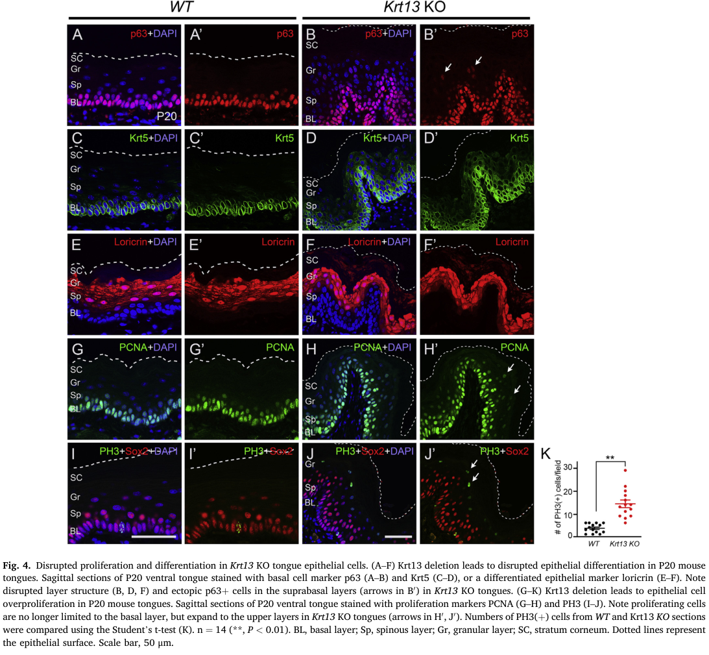

## Question

# Disease Characteristics Research Template

## Target Disease
- **Disease Name:** White Sponge Nevus
- **MONDO ID:** MONDO:0015748 (if available)
- **Category:** Mendelian

## Research Objectives

Please provide a comprehensive research report on **White Sponge Nevus** covering all of the
disease characteristics listed below. This report will be used to populate a disease knowledge
base entry. Be thorough and cite primary literature (PMID preferred) for all claims.

For each section, **suggested databases/resources** are listed. These are the first places
you should search for information on each topic.

---

### 1. Disease Information
> **Search first:** OMIM, Orphanet, ICD-10/ICD-11, MeSH, PubMed

- What is the disease? Provide a concise overview.
- What are the key identifiers? (OMIM, Orphanet, ICD-10/ICD-11, MeSH, Mondo)
- What are the common synonyms and alternative names?
- Is the information derived from individual patients (e.g., EHR) or aggregated disease-level resources?

### 2. Etiology

- **Disease Causal Factors**: What are the primary causes? (genetic, environmental, infectious, mechanistic)
- **Risk Factors**:
  > **Search first:** PubMed, Cochrane Library, UpToDate, clinical guidelines, ClinVar, ClinGen, GWAS Catalog, PheGenI, CTD, CDC, WHO, epidemiological databases
  - Genetic risk factors (causal variants, susceptibility loci, modifier genes)
  - Environmental risk factors (toxins, lifestyle, occupational exposures, age, sex, family history)
- **Protective Factors**:
  > **Search first:** PubMed, Cochrane Library, clinical trial databases, GWAS Catalog, gnomAD, WHO, CDC, nutrition databases
  - Genetic protective factors (protective variants, modifier alleles)
  - Environmental protective factors (diet, lifestyle, exposures that reduce risk)
- **Gene-Environment Interactions**: How do genetic and environmental factors interact to influence disease?
  > **Search first:** CTD, PubMed, PheGenI, GxE databases

### 3. Phenotypes
> **Search first:** HPO (Human Phenotype Ontology), OMIM, Orphanet, PubMed, clinicaltrials.gov, MedDRA, SNOMED CT, DECIPHER, LOINC

For each phenotype, provide:
- **Phenotype type**: symptoms, clinical signs, physical manifestations, behavioral changes, or laboratory abnormalities
  > For symptoms/signs: HPO, OMIM, Orphanet, PubMed
  > For behavioral changes: HPO, DSM, RDoC (Research Domain Criteria), PubMed
  > For laboratory abnormalities: LOINC, SNOMED CT, LabTests Online, PubMed
- **Phenotype characteristics**:
  > **Search first:** OMIM, Orphanet, HPO, PubMed
  - Age of symptom onset (neonatal, childhood, adult-onset, late-onset)
  - Symptom severity (mild, moderate, severe, variable)
  - Symptom progression (stable, progressive, episodic, fluctuating)
  - Frequency among affected individuals (percentage or qualitative)
- **Quality of life impact**: Effects on daily functioning and well-being (per-phenotype when possible)
  > **Search first:** EQ-5D database, SF-36, WHO QOL databases, PubMed
- Suggest HPO (Human Phenotype Ontology) terms for each phenotype

### 4. Genetic/Molecular Information

- **Causal Genes**: Gene mutations or chromosomal abnormalities responsible for disease (gene symbols, OMIM IDs)
  > **Search first:** OMIM, ClinVar, HGMD, Ensembl, NCBI Gene
- **Pathogenic Variants**:
  - Affected genes (gene symbols, HGNC IDs)
    > **Search first:** OMIM, NCBI Gene, Ensembl, HGNC, UniProt, GeneCards
  - Variant classification (pathogenic, likely pathogenic, VUS per ACMG/AMP guidelines)
    > **Search first:** ClinVar, ClinGen, ACMG/AMP guidelines, VarSome
  - Variant type/class (missense, frameshift, nonsense, splice-site, structural)
  - Allele frequency in population databases
    > **Search first:** gnomAD, 1000 Genomes, ExAC, TOPMed, dbSNP
  - Somatic vs germline origin
    > **Search first:** COSMIC (somatic), ClinVar, ICGC, TCGA
  - Functional consequences (loss of function, gain of function, dominant negative)
- **Modifier Genes**: Genes that modify disease severity or expression
- **Epigenetic Information**: DNA methylation, histone modifications, chromatin changes affecting disease
  > **Search first:** ENCODE, Roadmap Epigenomics, MethBase, DiseaseMeth
- **Chromosomal Abnormalities**: Large-scale genetic changes (aneuploidy, translocations, inversions)
  > **Search first:** DECIPHER, ClinVar, ECARUCA, UCSC Genome Browser

### 5. Environmental Information

- **Environmental Factors**: Non-genetic contributing factors (toxins, radiation, pollution, occupational exposure)
  > **Search first:** CTD (Comparative Toxicogenomics Database), TOXNET, PubMed, EPA databases
- **Lifestyle Factors**: Behavioral factors (smoking, diet, exercise, alcohol consumption)
  > **Search first:** CDC databases, WHO, PubMed, NHANES
- **Infectious Agents**: If applicable, pathogens causing or triggering disease (bacteria, viruses, fungi, parasites)
  > **Search first:** NCBI Taxonomy, ViPR, BV-BRC, MicrobeDB, GIDEON

### 6. Mechanism / Pathophysiology

**Present this section as an ordered causal chain first, then the detail below.**
Open with a numbered sequence of mechanistic steps running from the initiating
lesion (mutation, exposure, infection) to the clinical manifestation, one step per
line, each naming what it causes next. State the causal verb explicitly ("leads
to", "results in") and say where a step is inferred rather than demonstrated.
Where the mechanism branches, show the branch. The categories below are a
checklist of what to cover within those steps, not the organizing structure —
a step may draw on several of them, and a category may contribute to several
steps.

- **Molecular Pathways**: Specific signaling cascades or biochemical pathways involved (Wnt, MAPK, mTOR, PI3K-AKT, etc.)
  > **Search first:** KEGG, Reactome, WikiPathways, PathBank, BioCyc
- **Cellular Processes**: Cell-level mechanisms (apoptosis, autophagy, cell cycle dysregulation, inflammation, etc.)
  > **Search first:** Gene Ontology (GO), Reactome, KEGG, PubMed
- **Protein Dysfunction**: How protein structure or function is altered (misfolding, aggregation, loss of function, gain of function)
  > **Search first:** UniProt, PDB (Protein Data Bank), InterPro, Pfam, AlphaFold
- **Metabolic Changes**: Alterations in metabolic processes (energy metabolism, lipid metabolism, amino acid metabolism)
  > **Search first:** KEGG, BioCyc, HMDB (Human Metabolome Database), BRENDA
- **Immune System Involvement**: Role of immune response (autoimmunity, immunodeficiency, chronic inflammation)
  > **Search first:** ImmPort, Immunome Database, IEDB, Gene Ontology
- **Tissue Damage Mechanisms**: How tissues/ are injured (oxidative stress, ischemia, fibrosis, necrosis)
  > **Search first:** PubMed, Gene Ontology, Reactome
- **Biochemical Abnormalities**: Specific molecular defects (enzyme deficiencies, receptor dysfunction, ion channel defects)
  > **Search first:** BRENDA, UniProt, KEGG, OMIM, PubMed
- **Epigenetic Changes**: DNA methylation, histone modifications affecting gene expression in disease
  > **Search first:** ENCODE, Roadmap Epigenomics, MethBase, DiseaseMeth
- **Molecular Profiling** (if available):
  - Transcriptomics/gene expression changes
    > **Search first:** GEO (Gene Expression Omnibus), ArrayExpress, GTEx, Human Cell Atlas, SRA
  - Proteomics findings
    > **Search first:** PRIDE, ProteomeXchange, Human Protein Atlas, STRING, BioGRID
  - Metabolomics signatures
    > **Search first:** MetaboLights, Metabolomics Workbench, HMDB, METLIN
  - Lipidomics alterations
    > **Search first:** LIPID MAPS, SwissLipids, LipidHome, Metabolomics Workbench
  - Genomic structural features
    > **Search first:** UCSC Genome Browser, Ensembl, NCBI, dbVar, DGV
- **Advanced Technologies** (if applicable):
  - Single-cell analysis findings (cell-type specific mechanisms, cellular heterogeneity)
    > **Search first:** Human Cell Atlas, Single Cell Portal, GEO, CELLxGENE
  - Spatial transcriptomics findings
    > **Search first:** GEO, Spatial Research, Vizgen, 10x Genomics data
  - Multi-omics integration results
    > **Search first:** TCGA, ICGC, cBioPortal, LinkedOmics, PubMed
  - Functional genomics screens (CRISPR, RNAi)
    > **Search first:** DepMap, GenomeRNAi, PubMed, BioGRID ORCS

For each mechanism, describe:
- The causal chain from initial trigger to clinical manifestation
- Which mechanisms are upstream vs downstream
- What cell types and biological processes are involved
- Suggest GO terms for biological processes and CL terms for cell types

### 7. Anatomical Structures Affected

- **Organ Level**:
  - Primary organs directly affected
  - Secondary organ involvement (complications, secondary effects)
  - Body systems involved (cardiovascular, nervous, digestive, respiratory, endocrine, etc.)
  > **Search first:** Uberon, FMA (Foundational Model of Anatomy), OMIM, HPO, ICD-11, MeSH, SNOMED CT
- **Tissue and Cell Level**:
  - Specific tissue types affected (epithelial, connective, muscle, nervous)
  - Specific cell populations targeted (with Cell Ontology terms)
  > **Search first:** Uberon, Human Protein Atlas, Cell Ontology, Human Cell Atlas, CellMarker, PanglaoDB
- **Subcellular Level**:
  - Cellular compartments involved (mitochondria, nucleus, ER, lysosomes) (with GO Cellular Component terms)
  > **Search first:** Gene Ontology (Cellular Component), UniProt, Human Protein Atlas
- **Localization**:
  - Specific anatomical sites (with UBERON terms)
    > **Search first:** FMA, Uberon, NeuroNames (for brain), SNOMED CT
  - Lateralization (unilateral, bilateral, asymmetric)
    > **Search first:** HPO, clinical literature, imaging databases

### 8. Temporal Development

- **Onset**:
  - Typical age of onset (congenital, pediatric, adult, geriatric)
  - Onset pattern (acute, subacute, chronic, insidious)
  > **Search first:** OMIM, Orphanet, HPO, PubMed
- **Progression**:
  - Disease stages (early, intermediate, advanced, end-stage)
    > **Search first:** Cancer Staging Manual (AJCC), WHO classifications, PubMed
  - Progression rate (rapid, slow, variable)
  - Disease course pattern (episodic, relapsing-remitting, progressive, stable)
  - Disease duration (self-limited, chronic lifelong)
  > **Search first:** Disease registries, longitudinal cohort databases, natural history studies, PubMed, Orphanet, OMIM
- **Patterns**:
  - Remission patterns (spontaneous, treatment-induced)
    > **Search first:** Clinical trial databases, disease registries, PubMed
  - Critical periods (time windows of vulnerability or opportunity for intervention)
    > **Search first:** PubMed, developmental biology databases, clinical guidelines

### 9. Inheritance and Population

- **Epidemiology**:
  - Prevalence (cases per 100,000 at given time)
  - Incidence (new cases per 100,000 per year)
  > **Search first:** Orphanet, CDC, WHO, GBD (Global Burden of Disease), national registries, SEER, disease registries
- **For Genetic Etiology**:
  - Inheritance pattern (AD, AR, X-linked, mitochondrial, multifactorial, polygenic)
    > **Search first:** OMIM, Orphanet, ClinVar, GTR (Genetic Testing Registry)
  - Penetrance (complete, incomplete, age-dependent)
    > **Search first:** ClinVar, OMIM, PubMed, ClinGen
  - Expressivity (variable, consistent)
    > **Search first:** OMIM, ClinVar, PubMed
  - Genetic anticipation (increasing severity in successive generations)
    > **Search first:** OMIM, PubMed (especially for repeat expansion disorders)
  - Germline mosaicism
    > **Search first:** ClinVar, OMIM, genetic counseling literature, PubMed
  - Founder effects (population-specific mutations)
    > **Search first:** gnomAD, population genetics databases, PubMed
  - Consanguinity role
    > **Search first:** OMIM, population studies, genetic counseling resources
  - Carrier frequency
    > **Search first:** gnomAD, carrier screening databases, GeneReviews, GTR
- **Population Demographics**:
  - Affected populations (ethnic or demographic groups with higher prevalence)
    > **Search first:** gnomAD, 1000 Genomes, PAGE Study, PubMed, population registries
  - Geographic distribution (endemic areas, regional variation)
    > **Search first:** WHO, CDC, GBD, Orphanet, geographic epidemiology databases
  - Geographic distribution of specific variants
  - Sex ratio (male:female)
    > **Search first:** Disease registries, OMIM, PubMed, epidemiological databases
  - Age distribution of affected individuals
    > **Search first:** CDC, disease registries, SEER, Orphanet

### 10. Diagnostics

- **Clinical Tests**:
  - Laboratory tests (blood, urine, tissue chemistry, specific enzyme assays)
    > **Search first:** LOINC, LabTests Online, PubMed
  - Biomarkers (proteins, metabolites, genetic markers, circulating biomarkers)
    > **Search first:** FDA Biomarker List, BEST (Biomarkers, EndpointS, and other Tools), PubMed
  - Imaging studies (X-ray, CT, MRI, PET, ultrasound)
    > **Search first:** RadLex, DICOM, Radiopaedia, imaging databases
  - Functional tests (pulmonary function, cardiac stress tests)
    > **Search first:** LOINC, clinical guidelines, PubMed
  - Electrophysiology (EEG, EMG, ECG, nerve conduction studies)
    > **Search first:** LOINC, clinical neurophysiology databases, PubMed
  - Biopsy findings (histopathology, immunohistochemistry)
    > **Search first:** SNOMED CT, College of American Pathologists resources, PubMed
  - Pathology findings (microscopic examination)
    > **Search first:** SNOMED CT, Digital Pathology databases, PubMed
- **Genetic Testing**:
  > **Search first:** GTR (Genetic Testing Registry), GeneReviews, ClinGen
  - Overview of recommended genetic testing approach
  - Whole genome sequencing (WGS) utility
    > **Search first:** GTR, ClinVar, GEL (Genomics England), gnomAD
  - Whole exome sequencing (WES) utility
    > **Search first:** GTR, ClinVar, OMIM, GeneMatcher
  - Gene panels (which panels, which genes)
    > **Search first:** GTR, ClinVar, laboratory-specific databases
  - Single gene testing
    > **Search first:** GTR, ClinVar, OMIM, GeneReviews
  - Chromosomal microarray (CMA)
    > **Search first:** DECIPHER, ClinVar, dbVar, ECARUCA
  - Karyotyping
    > **Search first:** Chromosome Abnormality Database, ClinVar, cytogenetics resources
  - FISH
    > **Search first:** ClinVar, cytogenetics databases, PubMed
  - Mitochondrial DNA testing
    > **Search first:** MITOMAP, MSeqDR, ClinVar, GTR
  - Repeat expansion testing
    > **Search first:** GTR, ClinVar, repeat expansion databases, PubMed
- **Omics-Based Diagnostics** (if applicable):
  - RNA sequencing / transcriptomics
    > **Search first:** GEO, ArrayExpress, GTEx, RNA-seq databases
  - Proteomics
    > **Search first:** PRIDE, ProteomeXchange, FDA Biomarker database
  - Metabolomics
    > **Search first:** MetaboLights, Metabolomics Workbench, HMDB
  - Epigenomics
    > **Search first:** GEO, ENCODE, Roadmap Epigenomics, MethBase
  - Liquid biopsy
    > **Search first:** COSMIC, ClinVar, liquid biopsy databases, PubMed
- **Clinical Criteria**:
  - Standardized diagnostic criteria (DSM, ICD, society guidelines)
    > **Search first:** DSM-5, ICD-11, clinical society guidelines, UpToDate
  - Differential diagnosis (other conditions to rule out, with distinguishing features)
    > **Search first:** DynaMed, UpToDate, clinical decision support systems
- **Screening**:
  - Screening methods for asymptomatic individuals (newborn screening, carrier screening, cascade screening)
    > **Search first:** ACMG recommendations, CDC newborn screening, GTR

### 11. Outcome/Prognosis

- **Survival and Mortality**:
  - Survival rate (5-year, 10-year, overall)
    > **Search first:** SEER, cancer registries, disease-specific registries, PubMed
  - Life expectancy (with and without treatment if applicable)
    > **Search first:** Orphanet, disease registries, actuarial databases, PubMed
  - Mortality rate
    > **Search first:** CDC, WHO, GBD, national mortality databases
  - Disease-specific mortality (deaths directly attributable to disease)
    > **Search first:** Disease registries, CDC Wonder, GBD, PubMed
- **Morbidity and Function**:
  - Morbidity (disease-related disability and health impacts)
    > **Search first:** GBD, WHO, disability databases, PubMed
  - Disability outcomes (long-term functional impairments)
    > **Search first:** ICF (International Classification of Functioning), disability registries
  - Quality of life measures (EQ-5D, SF-36, PROMIS, disease-specific tools)
    > **Search first:** EQ-5D database, SF-36, PROMIS, PubMed
- **Disease Course**:
  - Complications (secondary problems: infections, organ failure, etc.)
    > **Search first:** ICD codes, disease registries, clinical databases, PubMed
  - Recovery potential (likelihood and extent of recovery, with vs without treatment)
    > **Search first:** Natural history studies, rehabilitation databases, PubMed
- **Prediction**:
  - Prognostic factors (age, disease severity, biomarkers, treatment response)
    > **Search first:** Prognostic models databases, clinical calculators, PubMed
  - Prognostic biomarkers (molecular markers predicting disease course)
    > **Search first:** FDA Biomarker database, PubMed, cancer prognostic databases

### 12. Treatment

- **Pharmacotherapy**:
  - Pharmacological treatments (drug names, drug classes, mechanisms of action)
    > **Search first:** DrugBank, RxNorm, ATC classification, DailyMed, FDA databases
  - Pharmacogenomics (how genetic variants affect drug metabolism, efficacy, toxicity)
    > **Search first:** PharmGKB, CPIC (Clinical Pharmacogenetics), FDA Table of PGx Biomarkers
- **Advanced Therapeutics**:
  - Gene therapy (viral vectors, CRISPR, gene replacement, gene editing)
    > **Search first:** ClinicalTrials.gov, FDA gene therapy database, ASGCT resources
  - Cell therapy (stem cell transplant, CAR-T, cellular therapeutics)
    > **Search first:** ClinicalTrials.gov, FDA cell therapy database, FACT standards
  - RNA-based therapies (ASOs, siRNA, mRNA therapies)
    > **Search first:** ClinicalTrials.gov, FDA approvals, PubMed
  - Targeted therapies (treatments directed at specific molecular targets)
    > **Search first:** My Cancer Genome, OncoKB, ClinicalTrials.gov, FDA approvals
  - Immunotherapies (checkpoint inhibitors, monoclonal antibodies)
    > **Search first:** Cancer Immunotherapy Database, FDA approvals, ClinicalTrials.gov
- **Surgical and Interventional**:
  - Surgical interventions (types of surgery, timing, outcomes)
    > **Search first:** CPT codes, surgical registries, clinical guidelines, PubMed
- **Supportive and Rehabilitative**:
  - Supportive care (symptom management, pain control, nutrition)
    > **Search first:** Clinical guidelines, Cochrane Library, PubMed
  - Rehabilitation (physical therapy, occupational therapy, speech therapy)
    > **Search first:** Rehabilitation medicine databases, clinical guidelines, PubMed
- **Experimental**:
  - Experimental treatments in clinical trials (with NCT identifiers if available)
    > **Search first:** ClinicalTrials.gov, EU Clinical Trials Register, WHO ICTRP
- **Treatment Outcomes**:
  - Treatment response rates
    > **Search first:** Clinical trial databases, FDA reviews, systematic reviews, PubMed
  - Side effects and adverse events
    > **Search first:** FDA Adverse Event Reporting System (FAERS), MedWatch, PubMed
- **Treatment Strategy**:
  - Treatment algorithms (clinical pathways, decision trees)
    > **Search first:** Clinical practice guidelines, NCCN Guidelines, UpToDate
  - Combination therapies
    > **Search first:** ClinicalTrials.gov, treatment guidelines, PubMed
  - Personalized medicine approaches (genotype-guided treatment)
    > **Search first:** My Cancer Genome, CIViC, PharmGKB, precision medicine databases

For each treatment, suggest NCIT (NCI Thesaurus) clinical-intervention terms where applicable.

### 13. Prevention

- **Prevention Levels**:
  - Primary prevention (preventing disease occurrence: vaccination, risk factor modification)
    > **Search first:** CDC, WHO, USPSTF recommendations, Cochrane Library
  - Secondary prevention (early detection and treatment: screening programs, early intervention)
    > **Search first:** USPSTF, CDC screening guidelines, WHO
  - Tertiary prevention (preventing complications in those with disease)
    > **Search first:** Clinical guidelines, disease management protocols, PubMed
- **Immunization**: Vaccine strategies (if applicable)
  > **Search first:** CDC vaccine schedules, WHO immunization, FDA vaccine database
- **Screening and Early Detection**:
  - Screening programs (population-based: newborn screening, cancer screening)
    > **Search first:** CDC screening programs, USPSTF, cancer screening databases
  - Genetic screening (carrier screening, preimplantation genetic diagnosis, prenatal testing)
    > **Search first:** ACMG recommendations, ACOG guidelines, GTR
  - Risk stratification (identifying high-risk individuals for targeted prevention)
    > **Search first:** Risk prediction models, clinical calculators, PubMed
- **Behavioral Interventions**: Lifestyle modifications to reduce risk
  > **Search first:** CDC, WHO, behavioral intervention databases, Cochrane Library
- **Counseling**: Genetic counseling (risk assessment, family planning guidance)
  > **Search first:** NSGC resources, ACMG guidelines, GeneReviews
- **Public Health**:
  - Public health interventions (sanitation, vector control, health education)
    > **Search first:** CDC, WHO, public health databases, PubMed
  - Environmental interventions (reducing environmental risk factors)
    > **Search first:** EPA databases, WHO environmental health, PubMed
- **Prophylaxis**: Preventive medications or procedures
  > **Search first:** Clinical guidelines, FDA approvals, PubMed

### 14. Other Species / Natural Disease

- **Taxonomy**: Species affected (with NCBI Taxon identifiers)
  > **Search first:** NCBI Taxonomy
- **Breed**: Specific breeds affected (with VBO identifiers if applicable)
  > **Search first:** VBO (Vertebrate Breed Ontology)
- **Gene**: Orthologous genes in other species (with NCBI Gene IDs)
  > **Search first:** NCBI Gene
- **Natural Disease**:
  - Naturally occurring disease in other species (companion animals, wildlife)
    > **Search first:** OMIA (Online Mendelian Inheritance in Animals), VetCompass, PubMed
  - Veterinary relevance and importance in animal health
    > **Search first:** OMIA, veterinary databases, PubMed
- **Comparative Biology**:
  - Comparative pathology (similarities and differences across species)
    > **Search first:** OMIA, comparative pathology databases, PubMed
  - Evolutionary conservation of disease mechanisms
    > **Search first:** HomoloGene, OrthoMCL, Alliance of Genome Resources
- **Transmission** (if applicable):
  - Zoonotic potential
    > **Search first:** CDC zoonotic diseases, WHO zoonoses, GIDEON
  - Cross-species susceptibility
    > **Search first:** NCBI Taxonomy, veterinary databases, PubMed

### 15. Model Organisms

- **Model Types**:
  - Model organism type (mammalian, invertebrate, cellular, in vitro)
    > **Search first:** Alliance of Genome Resources, model organism databases
  - Specific model systems (mouse, rat, zebrafish, Drosophila, C. elegans, yeast, cell lines, organoids, iPSCs)
    > **Search first:** MGI, RGD, ZFIN, FlyBase, WormBase, SGD, ATCC, Cellosaurus
  - Induced models (drug treatment, surgical intervention, environmental manipulation)
    > **Search first:** MGI, model organism databases, PubMed
- **Genetic Models**:
  - Types available (knockout, knock-in, transgenic, conditional, humanized)
    > **Search first:** MGI, IMPC, KOMP, EuMMCR, IMSR
- **Model Characteristics**:
  - Phenotype recapitulation (how well model reproduces human disease features)
    > **Search first:** Model organism databases, comparative studies, PubMed
  - Model limitations (aspects of human disease not captured)
    > **Search first:** Model organism databases, PubMed, review articles
- **Applications**:
  - Research applications (what aspects of disease can be studied)
    > **Search first:** Model organism databases, PubMed
- **Resources**:
  - Model databases
    > **Search first:** MGI, RGD, ZFIN, FlyBase, WormBase, IMSR, EMMA, MMRRC

---

## Citation Requirements

- Cite primary literature (PMID preferred) for all mechanistic and clinical claims
- Prioritize recent reviews and landmark papers
- Include direct quotes from abstracts where possible to support key statements
- Distinguish evidence source types: human clinical, model organism, in vitro, computational

## Output Format

Structure your response as a comprehensive narrative organized by the sections above.
For each section, provide:
- Factual content with specific details (numbers, percentages, gene names, variant nomenclature)
- Ontology term suggestions (HPO, GO, CL, UBERON, CHEBI, NCIT, MONDO) where applicable
- Evidence citations with PMIDs
- Direct quotes from abstracts to support key claims
- Clear indication when information is not available or not applicable for this disease

This report will be used to populate a disease knowledge base entry with:
- Pathophysiology descriptions with causal chains
- Gene/protein annotations (HGNC, GO terms)
- Phenotype associations (HP terms) with frequencies
- Cell type involvement (CL terms)
- Anatomical locations (UBERON terms)
- Chemical entities (CHEBI terms)
- Treatment annotations (NCIT terms)
- Evidence items with PMIDs and exact abstract quotes
- Epidemiology, prognosis, diagnostic, and prevention information
- Animal model descriptions with phenotype recapitulation details

## Output

Question: You are an expert researcher providing comprehensive, well-cited information.

Provide detailed information focusing on:
1. Key concepts and definitions with current understanding
2. Recent developments and latest research (prioritize 2023-2024 sources)
3. Current applications and real-world implementations
4. Expert opinions and analysis from authoritative sources
5. Relevant statistics and data from recent studies

Format as a comprehensive research report with proper citations. Include URLs and publication dates where available.
Always prioritize recent, authoritative sources and provide specific citations for all major claims.

# Disease Characteristics Research Template

## Target Disease
- **Disease Name:** White Sponge Nevus
- **MONDO ID:** MONDO:0015748 (if available)
- **Category:** Mendelian

## Research Objectives

Please provide a comprehensive research report on **White Sponge Nevus** covering all of the
disease characteristics listed below. This report will be used to populate a disease knowledge
base entry. Be thorough and cite primary literature (PMID preferred) for all claims.

For each section, **suggested databases/resources** are listed. These are the first places
you should search for information on each topic.

---

### 1. Disease Information
> **Search first:** OMIM, Orphanet, ICD-10/ICD-11, MeSH, PubMed

- What is the disease? Provide a concise overview.
- What are the key identifiers? (OMIM, Orphanet, ICD-10/ICD-11, MeSH, Mondo)
- What are the common synonyms and alternative names?
- Is the information derived from individual patients (e.g., EHR) or aggregated disease-level resources?

### 2. Etiology

- **Disease Causal Factors**: What are the primary causes? (genetic, environmental, infectious, mechanistic)
- **Risk Factors**:
  > **Search first:** PubMed, Cochrane Library, UpToDate, clinical guidelines, ClinVar, ClinGen, GWAS Catalog, PheGenI, CTD, CDC, WHO, epidemiological databases
  - Genetic risk factors (causal variants, susceptibility loci, modifier genes)
  - Environmental risk factors (toxins, lifestyle, occupational exposures, age, sex, family history)
- **Protective Factors**:
  > **Search first:** PubMed, Cochrane Library, clinical trial databases, GWAS Catalog, gnomAD, WHO, CDC, nutrition databases
  - Genetic protective factors (protective variants, modifier alleles)
  - Environmental protective factors (diet, lifestyle, exposures that reduce risk)
- **Gene-Environment Interactions**: How do genetic and environmental factors interact to influence disease?
  > **Search first:** CTD, PubMed, PheGenI, GxE databases

### 3. Phenotypes
> **Search first:** HPO (Human Phenotype Ontology), OMIM, Orphanet, PubMed, clinicaltrials.gov, MedDRA, SNOMED CT, DECIPHER, LOINC

For each phenotype, provide:
- **Phenotype type**: symptoms, clinical signs, physical manifestations, behavioral changes, or laboratory abnormalities
  > For symptoms/signs: HPO, OMIM, Orphanet, PubMed
  > For behavioral changes: HPO, DSM, RDoC (Research Domain Criteria), PubMed
  > For laboratory abnormalities: LOINC, SNOMED CT, LabTests Online, PubMed
- **Phenotype characteristics**:
  > **Search first:** OMIM, Orphanet, HPO, PubMed
  - Age of symptom onset (neonatal, childhood, adult-onset, late-onset)
  - Symptom severity (mild, moderate, severe, variable)
  - Symptom progression (stable, progressive, episodic, fluctuating)
  - Frequency among affected individuals (percentage or qualitative)
- **Quality of life impact**: Effects on daily functioning and well-being (per-phenotype when possible)
  > **Search first:** EQ-5D database, SF-36, WHO QOL databases, PubMed
- Suggest HPO (Human Phenotype Ontology) terms for each phenotype

### 4. Genetic/Molecular Information

- **Causal Genes**: Gene mutations or chromosomal abnormalities responsible for disease (gene symbols, OMIM IDs)
  > **Search first:** OMIM, ClinVar, HGMD, Ensembl, NCBI Gene
- **Pathogenic Variants**:
  - Affected genes (gene symbols, HGNC IDs)
    > **Search first:** OMIM, NCBI Gene, Ensembl, HGNC, UniProt, GeneCards
  - Variant classification (pathogenic, likely pathogenic, VUS per ACMG/AMP guidelines)
    > **Search first:** ClinVar, ClinGen, ACMG/AMP guidelines, VarSome
  - Variant type/class (missense, frameshift, nonsense, splice-site, structural)
  - Allele frequency in population databases
    > **Search first:** gnomAD, 1000 Genomes, ExAC, TOPMed, dbSNP
  - Somatic vs germline origin
    > **Search first:** COSMIC (somatic), ClinVar, ICGC, TCGA
  - Functional consequences (loss of function, gain of function, dominant negative)
- **Modifier Genes**: Genes that modify disease severity or expression
- **Epigenetic Information**: DNA methylation, histone modifications, chromatin changes affecting disease
  > **Search first:** ENCODE, Roadmap Epigenomics, MethBase, DiseaseMeth
- **Chromosomal Abnormalities**: Large-scale genetic changes (aneuploidy, translocations, inversions)
  > **Search first:** DECIPHER, ClinVar, ECARUCA, UCSC Genome Browser

### 5. Environmental Information

- **Environmental Factors**: Non-genetic contributing factors (toxins, radiation, pollution, occupational exposure)
  > **Search first:** CTD (Comparative Toxicogenomics Database), TOXNET, PubMed, EPA databases
- **Lifestyle Factors**: Behavioral factors (smoking, diet, exercise, alcohol consumption)
  > **Search first:** CDC databases, WHO, PubMed, NHANES
- **Infectious Agents**: If applicable, pathogens causing or triggering disease (bacteria, viruses, fungi, parasites)
  > **Search first:** NCBI Taxonomy, ViPR, BV-BRC, MicrobeDB, GIDEON

### 6. Mechanism / Pathophysiology

**Present this section as an ordered causal chain first, then the detail below.**
Open with a numbered sequence of mechanistic steps running from the initiating
lesion (mutation, exposure, infection) to the clinical manifestation, one step per
line, each naming what it causes next. State the causal verb explicitly ("leads
to", "results in") and say where a step is inferred rather than demonstrated.
Where the mechanism branches, show the branch. The categories below are a
checklist of what to cover within those steps, not the organizing structure —
a step may draw on several of them, and a category may contribute to several
steps.

- **Molecular Pathways**: Specific signaling cascades or biochemical pathways involved (Wnt, MAPK, mTOR, PI3K-AKT, etc.)
  > **Search first:** KEGG, Reactome, WikiPathways, PathBank, BioCyc
- **Cellular Processes**: Cell-level mechanisms (apoptosis, autophagy, cell cycle dysregulation, inflammation, etc.)
  > **Search first:** Gene Ontology (GO), Reactome, KEGG, PubMed
- **Protein Dysfunction**: How protein structure or function is altered (misfolding, aggregation, loss of function, gain of function)
  > **Search first:** UniProt, PDB (Protein Data Bank), InterPro, Pfam, AlphaFold
- **Metabolic Changes**: Alterations in metabolic processes (energy metabolism, lipid metabolism, amino acid metabolism)
  > **Search first:** KEGG, BioCyc, HMDB (Human Metabolome Database), BRENDA
- **Immune System Involvement**: Role of immune response (autoimmunity, immunodeficiency, chronic inflammation)
  > **Search first:** ImmPort, Immunome Database, IEDB, Gene Ontology
- **Tissue Damage Mechanisms**: How tissues/ are injured (oxidative stress, ischemia, fibrosis, necrosis)
  > **Search first:** PubMed, Gene Ontology, Reactome
- **Biochemical Abnormalities**: Specific molecular defects (enzyme deficiencies, receptor dysfunction, ion channel defects)
  > **Search first:** BRENDA, UniProt, KEGG, OMIM, PubMed
- **Epigenetic Changes**: DNA methylation, histone modifications affecting gene expression in disease
  > **Search first:** ENCODE, Roadmap Epigenomics, MethBase, DiseaseMeth
- **Molecular Profiling** (if available):
  - Transcriptomics/gene expression changes
    > **Search first:** GEO (Gene Expression Omnibus), ArrayExpress, GTEx, Human Cell Atlas, SRA
  - Proteomics findings
    > **Search first:** PRIDE, ProteomeXchange, Human Protein Atlas, STRING, BioGRID
  - Metabolomics signatures
    > **Search first:** MetaboLights, Metabolomics Workbench, HMDB, METLIN
  - Lipidomics alterations
    > **Search first:** LIPID MAPS, SwissLipids, LipidHome, Metabolomics Workbench
  - Genomic structural features
    > **Search first:** UCSC Genome Browser, Ensembl, NCBI, dbVar, DGV
- **Advanced Technologies** (if applicable):
  - Single-cell analysis findings (cell-type specific mechanisms, cellular heterogeneity)
    > **Search first:** Human Cell Atlas, Single Cell Portal, GEO, CELLxGENE
  - Spatial transcriptomics findings
    > **Search first:** GEO, Spatial Research, Vizgen, 10x Genomics data
  - Multi-omics integration results
    > **Search first:** TCGA, ICGC, cBioPortal, LinkedOmics, PubMed
  - Functional genomics screens (CRISPR, RNAi)
    > **Search first:** DepMap, GenomeRNAi, PubMed, BioGRID ORCS

For each mechanism, describe:
- The causal chain from initial trigger to clinical manifestation
- Which mechanisms are upstream vs downstream
- What cell types and biological processes are involved
- Suggest GO terms for biological processes and CL terms for cell types

### 7. Anatomical Structures Affected

- **Organ Level**:
  - Primary organs directly affected
  - Secondary organ involvement (complications, secondary effects)
  - Body systems involved (cardiovascular, nervous, digestive, respiratory, endocrine, etc.)
  > **Search first:** Uberon, FMA (Foundational Model of Anatomy), OMIM, HPO, ICD-11, MeSH, SNOMED CT
- **Tissue and Cell Level**:
  - Specific tissue types affected (epithelial, connective, muscle, nervous)
  - Specific cell populations targeted (with Cell Ontology terms)
  > **Search first:** Uberon, Human Protein Atlas, Cell Ontology, Human Cell Atlas, CellMarker, PanglaoDB
- **Subcellular Level**:
  - Cellular compartments involved (mitochondria, nucleus, ER, lysosomes) (with GO Cellular Component terms)
  > **Search first:** Gene Ontology (Cellular Component), UniProt, Human Protein Atlas
- **Localization**:
  - Specific anatomical sites (with UBERON terms)
    > **Search first:** FMA, Uberon, NeuroNames (for brain), SNOMED CT
  - Lateralization (unilateral, bilateral, asymmetric)
    > **Search first:** HPO, clinical literature, imaging databases

### 8. Temporal Development

- **Onset**:
  - Typical age of onset (congenital, pediatric, adult, geriatric)
  - Onset pattern (acute, subacute, chronic, insidious)
  > **Search first:** OMIM, Orphanet, HPO, PubMed
- **Progression**:
  - Disease stages (early, intermediate, advanced, end-stage)
    > **Search first:** Cancer Staging Manual (AJCC), WHO classifications, PubMed
  - Progression rate (rapid, slow, variable)
  - Disease course pattern (episodic, relapsing-remitting, progressive, stable)
  - Disease duration (self-limited, chronic lifelong)
  > **Search first:** Disease registries, longitudinal cohort databases, natural history studies, PubMed, Orphanet, OMIM
- **Patterns**:
  - Remission patterns (spontaneous, treatment-induced)
    > **Search first:** Clinical trial databases, disease registries, PubMed
  - Critical periods (time windows of vulnerability or opportunity for intervention)
    > **Search first:** PubMed, developmental biology databases, clinical guidelines

### 9. Inheritance and Population

- **Epidemiology**:
  - Prevalence (cases per 100,000 at given time)
  - Incidence (new cases per 100,000 per year)
  > **Search first:** Orphanet, CDC, WHO, GBD (Global Burden of Disease), national registries, SEER, disease registries
- **For Genetic Etiology**:
  - Inheritance pattern (AD, AR, X-linked, mitochondrial, multifactorial, polygenic)
    > **Search first:** OMIM, Orphanet, ClinVar, GTR (Genetic Testing Registry)
  - Penetrance (complete, incomplete, age-dependent)
    > **Search first:** ClinVar, OMIM, PubMed, ClinGen
  - Expressivity (variable, consistent)
    > **Search first:** OMIM, ClinVar, PubMed
  - Genetic anticipation (increasing severity in successive generations)
    > **Search first:** OMIM, PubMed (especially for repeat expansion disorders)
  - Germline mosaicism
    > **Search first:** ClinVar, OMIM, genetic counseling literature, PubMed
  - Founder effects (population-specific mutations)
    > **Search first:** gnomAD, population genetics databases, PubMed
  - Consanguinity role
    > **Search first:** OMIM, population studies, genetic counseling resources
  - Carrier frequency
    > **Search first:** gnomAD, carrier screening databases, GeneReviews, GTR
- **Population Demographics**:
  - Affected populations (ethnic or demographic groups with higher prevalence)
    > **Search first:** gnomAD, 1000 Genomes, PAGE Study, PubMed, population registries
  - Geographic distribution (endemic areas, regional variation)
    > **Search first:** WHO, CDC, GBD, Orphanet, geographic epidemiology databases
  - Geographic distribution of specific variants
  - Sex ratio (male:female)
    > **Search first:** Disease registries, OMIM, PubMed, epidemiological databases
  - Age distribution of affected individuals
    > **Search first:** CDC, disease registries, SEER, Orphanet

### 10. Diagnostics

- **Clinical Tests**:
  - Laboratory tests (blood, urine, tissue chemistry, specific enzyme assays)
    > **Search first:** LOINC, LabTests Online, PubMed
  - Biomarkers (proteins, metabolites, genetic markers, circulating biomarkers)
    > **Search first:** FDA Biomarker List, BEST (Biomarkers, EndpointS, and other Tools), PubMed
  - Imaging studies (X-ray, CT, MRI, PET, ultrasound)
    > **Search first:** RadLex, DICOM, Radiopaedia, imaging databases
  - Functional tests (pulmonary function, cardiac stress tests)
    > **Search first:** LOINC, clinical guidelines, PubMed
  - Electrophysiology (EEG, EMG, ECG, nerve conduction studies)
    > **Search first:** LOINC, clinical neurophysiology databases, PubMed
  - Biopsy findings (histopathology, immunohistochemistry)
    > **Search first:** SNOMED CT, College of American Pathologists resources, PubMed
  - Pathology findings (microscopic examination)
    > **Search first:** SNOMED CT, Digital Pathology databases, PubMed
- **Genetic Testing**:
  > **Search first:** GTR (Genetic Testing Registry), GeneReviews, ClinGen
  - Overview of recommended genetic testing approach
  - Whole genome sequencing (WGS) utility
    > **Search first:** GTR, ClinVar, GEL (Genomics England), gnomAD
  - Whole exome sequencing (WES) utility
    > **Search first:** GTR, ClinVar, OMIM, GeneMatcher
  - Gene panels (which panels, which genes)
    > **Search first:** GTR, ClinVar, laboratory-specific databases
  - Single gene testing
    > **Search first:** GTR, ClinVar, OMIM, GeneReviews
  - Chromosomal microarray (CMA)
    > **Search first:** DECIPHER, ClinVar, dbVar, ECARUCA
  - Karyotyping
    > **Search first:** Chromosome Abnormality Database, ClinVar, cytogenetics resources
  - FISH
    > **Search first:** ClinVar, cytogenetics databases, PubMed
  - Mitochondrial DNA testing
    > **Search first:** MITOMAP, MSeqDR, ClinVar, GTR
  - Repeat expansion testing
    > **Search first:** GTR, ClinVar, repeat expansion databases, PubMed
- **Omics-Based Diagnostics** (if applicable):
  - RNA sequencing / transcriptomics
    > **Search first:** GEO, ArrayExpress, GTEx, RNA-seq databases
  - Proteomics
    > **Search first:** PRIDE, ProteomeXchange, FDA Biomarker database
  - Metabolomics
    > **Search first:** MetaboLights, Metabolomics Workbench, HMDB
  - Epigenomics
    > **Search first:** GEO, ENCODE, Roadmap Epigenomics, MethBase
  - Liquid biopsy
    > **Search first:** COSMIC, ClinVar, liquid biopsy databases, PubMed
- **Clinical Criteria**:
  - Standardized diagnostic criteria (DSM, ICD, society guidelines)
    > **Search first:** DSM-5, ICD-11, clinical society guidelines, UpToDate
  - Differential diagnosis (other conditions to rule out, with distinguishing features)
    > **Search first:** DynaMed, UpToDate, clinical decision support systems
- **Screening**:
  - Screening methods for asymptomatic individuals (newborn screening, carrier screening, cascade screening)
    > **Search first:** ACMG recommendations, CDC newborn screening, GTR

### 11. Outcome/Prognosis

- **Survival and Mortality**:
  - Survival rate (5-year, 10-year, overall)
    > **Search first:** SEER, cancer registries, disease-specific registries, PubMed
  - Life expectancy (with and without treatment if applicable)
    > **Search first:** Orphanet, disease registries, actuarial databases, PubMed
  - Mortality rate
    > **Search first:** CDC, WHO, GBD, national mortality databases
  - Disease-specific mortality (deaths directly attributable to disease)
    > **Search first:** Disease registries, CDC Wonder, GBD, PubMed
- **Morbidity and Function**:
  - Morbidity (disease-related disability and health impacts)
    > **Search first:** GBD, WHO, disability databases, PubMed
  - Disability outcomes (long-term functional impairments)
    > **Search first:** ICF (International Classification of Functioning), disability registries
  - Quality of life measures (EQ-5D, SF-36, PROMIS, disease-specific tools)
    > **Search first:** EQ-5D database, SF-36, PROMIS, PubMed
- **Disease Course**:
  - Complications (secondary problems: infections, organ failure, etc.)
    > **Search first:** ICD codes, disease registries, clinical databases, PubMed
  - Recovery potential (likelihood and extent of recovery, with vs without treatment)
    > **Search first:** Natural history studies, rehabilitation databases, PubMed
- **Prediction**:
  - Prognostic factors (age, disease severity, biomarkers, treatment response)
    > **Search first:** Prognostic models databases, clinical calculators, PubMed
  - Prognostic biomarkers (molecular markers predicting disease course)
    > **Search first:** FDA Biomarker database, PubMed, cancer prognostic databases

### 12. Treatment

- **Pharmacotherapy**:
  - Pharmacological treatments (drug names, drug classes, mechanisms of action)
    > **Search first:** DrugBank, RxNorm, ATC classification, DailyMed, FDA databases
  - Pharmacogenomics (how genetic variants affect drug metabolism, efficacy, toxicity)
    > **Search first:** PharmGKB, CPIC (Clinical Pharmacogenetics), FDA Table of PGx Biomarkers
- **Advanced Therapeutics**:
  - Gene therapy (viral vectors, CRISPR, gene replacement, gene editing)
    > **Search first:** ClinicalTrials.gov, FDA gene therapy database, ASGCT resources
  - Cell therapy (stem cell transplant, CAR-T, cellular therapeutics)
    > **Search first:** ClinicalTrials.gov, FDA cell therapy database, FACT standards
  - RNA-based therapies (ASOs, siRNA, mRNA therapies)
    > **Search first:** ClinicalTrials.gov, FDA approvals, PubMed
  - Targeted therapies (treatments directed at specific molecular targets)
    > **Search first:** My Cancer Genome, OncoKB, ClinicalTrials.gov, FDA approvals
  - Immunotherapies (checkpoint inhibitors, monoclonal antibodies)
    > **Search first:** Cancer Immunotherapy Database, FDA approvals, ClinicalTrials.gov
- **Surgical and Interventional**:
  - Surgical interventions (types of surgery, timing, outcomes)
    > **Search first:** CPT codes, surgical registries, clinical guidelines, PubMed
- **Supportive and Rehabilitative**:
  - Supportive care (symptom management, pain control, nutrition)
    > **Search first:** Clinical guidelines, Cochrane Library, PubMed
  - Rehabilitation (physical therapy, occupational therapy, speech therapy)
    > **Search first:** Rehabilitation medicine databases, clinical guidelines, PubMed
- **Experimental**:
  - Experimental treatments in clinical trials (with NCT identifiers if available)
    > **Search first:** ClinicalTrials.gov, EU Clinical Trials Register, WHO ICTRP
- **Treatment Outcomes**:
  - Treatment response rates
    > **Search first:** Clinical trial databases, FDA reviews, systematic reviews, PubMed
  - Side effects and adverse events
    > **Search first:** FDA Adverse Event Reporting System (FAERS), MedWatch, PubMed
- **Treatment Strategy**:
  - Treatment algorithms (clinical pathways, decision trees)
    > **Search first:** Clinical practice guidelines, NCCN Guidelines, UpToDate
  - Combination therapies
    > **Search first:** ClinicalTrials.gov, treatment guidelines, PubMed
  - Personalized medicine approaches (genotype-guided treatment)
    > **Search first:** My Cancer Genome, CIViC, PharmGKB, precision medicine databases

For each treatment, suggest NCIT (NCI Thesaurus) clinical-intervention terms where applicable.

### 13. Prevention

- **Prevention Levels**:
  - Primary prevention (preventing disease occurrence: vaccination, risk factor modification)
    > **Search first:** CDC, WHO, USPSTF recommendations, Cochrane Library
  - Secondary prevention (early detection and treatment: screening programs, early intervention)
    > **Search first:** USPSTF, CDC screening guidelines, WHO
  - Tertiary prevention (preventing complications in those with disease)
    > **Search first:** Clinical guidelines, disease management protocols, PubMed
- **Immunization**: Vaccine strategies (if applicable)
  > **Search first:** CDC vaccine schedules, WHO immunization, FDA vaccine database
- **Screening and Early Detection**:
  - Screening programs (population-based: newborn screening, cancer screening)
    > **Search first:** CDC screening programs, USPSTF, cancer screening databases
  - Genetic screening (carrier screening, preimplantation genetic diagnosis, prenatal testing)
    > **Search first:** ACMG recommendations, ACOG guidelines, GTR
  - Risk stratification (identifying high-risk individuals for targeted prevention)
    > **Search first:** Risk prediction models, clinical calculators, PubMed
- **Behavioral Interventions**: Lifestyle modifications to reduce risk
  > **Search first:** CDC, WHO, behavioral intervention databases, Cochrane Library
- **Counseling**: Genetic counseling (risk assessment, family planning guidance)
  > **Search first:** NSGC resources, ACMG guidelines, GeneReviews
- **Public Health**:
  - Public health interventions (sanitation, vector control, health education)
    > **Search first:** CDC, WHO, public health databases, PubMed
  - Environmental interventions (reducing environmental risk factors)
    > **Search first:** EPA databases, WHO environmental health, PubMed
- **Prophylaxis**: Preventive medications or procedures
  > **Search first:** Clinical guidelines, FDA approvals, PubMed

### 14. Other Species / Natural Disease

- **Taxonomy**: Species affected (with NCBI Taxon identifiers)
  > **Search first:** NCBI Taxonomy
- **Breed**: Specific breeds affected (with VBO identifiers if applicable)
  > **Search first:** VBO (Vertebrate Breed Ontology)
- **Gene**: Orthologous genes in other species (with NCBI Gene IDs)
  > **Search first:** NCBI Gene
- **Natural Disease**:
  - Naturally occurring disease in other species (companion animals, wildlife)
    > **Search first:** OMIA (Online Mendelian Inheritance in Animals), VetCompass, PubMed
  - Veterinary relevance and importance in animal health
    > **Search first:** OMIA, veterinary databases, PubMed
- **Comparative Biology**:
  - Comparative pathology (similarities and differences across species)
    > **Search first:** OMIA, comparative pathology databases, PubMed
  - Evolutionary conservation of disease mechanisms
    > **Search first:** HomoloGene, OrthoMCL, Alliance of Genome Resources
- **Transmission** (if applicable):
  - Zoonotic potential
    > **Search first:** CDC zoonotic diseases, WHO zoonoses, GIDEON
  - Cross-species susceptibility
    > **Search first:** NCBI Taxonomy, veterinary databases, PubMed

### 15. Model Organisms

- **Model Types**:
  - Model organism type (mammalian, invertebrate, cellular, in vitro)
    > **Search first:** Alliance of Genome Resources, model organism databases
  - Specific model systems (mouse, rat, zebrafish, Drosophila, C. elegans, yeast, cell lines, organoids, iPSCs)
    > **Search first:** MGI, RGD, ZFIN, FlyBase, WormBase, SGD, ATCC, Cellosaurus
  - Induced models (drug treatment, surgical intervention, environmental manipulation)
    > **Search first:** MGI, model organism databases, PubMed
- **Genetic Models**:
  - Types available (knockout, knock-in, transgenic, conditional, humanized)
    > **Search first:** MGI, IMPC, KOMP, EuMMCR, IMSR
- **Model Characteristics**:
  - Phenotype recapitulation (how well model reproduces human disease features)
    > **Search first:** Model organism databases, comparative studies, PubMed
  - Model limitations (aspects of human disease not captured)
    > **Search first:** Model organism databases, PubMed, review articles
- **Applications**:
  - Research applications (what aspects of disease can be studied)
    > **Search first:** Model organism databases, PubMed
- **Resources**:
  - Model databases
    > **Search first:** MGI, RGD, ZFIN, FlyBase, WormBase, IMSR, EMMA, MMRRC

---

## Citation Requirements

- Cite primary literature (PMID preferred) for all mechanistic and clinical claims
- Prioritize recent reviews and landmark papers
- Include direct quotes from abstracts where possible to support key statements
- Distinguish evidence source types: human clinical, model organism, in vitro, computational

## Output Format

Structure your response as a comprehensive narrative organized by the sections above.
For each section, provide:
- Factual content with specific details (numbers, percentages, gene names, variant nomenclature)
- Ontology term suggestions (HPO, GO, CL, UBERON, CHEBI, NCIT, MONDO) where applicable
- Evidence citations with PMIDs
- Direct quotes from abstracts to support key claims
- Clear indication when information is not available or not applicable for this disease

This report will be used to populate a disease knowledge base entry with:
- Pathophysiology descriptions with causal chains
- Gene/protein annotations (HGNC, GO terms)
- Phenotype associations (HP terms) with frequencies
- Cell type involvement (CL terms)
- Anatomical locations (UBERON terms)
- Chemical entities (CHEBI terms)
- Treatment annotations (NCIT terms)
- Evidence items with PMIDs and exact abstract quotes
- Epidemiology, prognosis, diagnostic, and prevention information
- Animal model descriptions with phenotype recapitulation details

# White sponge nevus: disease-characteristics research report

**Scope and evidence standard.** White sponge nevus (WSN) is a rare, usually asymptomatic, inherited disorder of mucosal epithelium. The strongest disease-specific evidence consists of molecularly investigated families, small diagnostic series, individual clinical reports, and genetically engineered mice—not population registries or randomized treatment trials. The distinction matters particularly for estimates of prevalence, penetrance, treatment response, and cancer risk. This report describes **aggregated published disease-level evidence**, not an individual’s electronic health record. (lajolo2023exfoliativecytologyand pages 1-2, haseth2017anovelkeratin pages 1-2, simonson2020keratin13deficiency pages 1-2)

## 1. Disease information and identifiers

WSN produces soft, thickened, white-to-gray, corrugated or spongy plaques, principally on the **bilateral buccal mucosa** and other nonkeratinizing oral surfaces. It is a *keratinization disorder*, not an infectious nevus or a diagnosis synonymous with oral leukoplakia. A 2024 biopsy-confirmed case illustrates a common real-world presentation: asymptomatic bilateral buccal plaques in a 30-year-old man, managed with counseling rather than medication. (lajolo2023exfoliativecytologyand pages 1-2, batalha2024whitespongenevus pages 1-2)

| Knowledge-base field | Supported designation or qualification |
|---|---|
| Disease | White sponge nevus; **MONDO:0015748** is the identifier supplied in the question and should be verified against the current MONDO release before automated import. |
| Molecular subtypes | **OMIM #193900**, white sponge nevus 1, associated with *KRT4*; **OMIM #615785**, white sponge nevus 2, associated with *KRT13*. Gene entries: *KRT4* **OMIM *123940** and *KRT13* **OMIM *148065**. (lajolo2023exfoliativecytologyand pages 1-2) |
| Other names | White sponge **naevus**, Cannon disease, *naevus spongiosus albus mucosae*, congenital leukokeratosis mucosa oris, and white folded gingivostomatitis; older terms are not necessarily exact modern coding synonyms. (batalha2024whitespongenevus pages 2-4, mahdani2025whitespongenevus pages 1-2) |
| Orphanet, ICD-10/ICD-11, MeSH | An unambiguous, verified disease-specific identifier was **not established from the retrieved primary sources**. Do not substitute a generic oral-lesion code or invent a mapping. |

## 2. Etiology, risk, protection, and gene–environment interplay

**Primary cause:** germline alterations affecting the mucosal intermediate-filament partners keratin 4 and keratin 13. Familial transmission is usually autosomal dominant; sporadic or apparently sporadic presentations also occur. A clinically similar lesion can instead be HPV-associated Heck disease, so appearance alone is not proof of genetic WSN. Family history is informative but a negative history does not rule the condition out. (lajolo2023exfoliativecytologyand pages 1-2, schwartz2019themolecularbaseddifferentiation pages 1-2, lajolo2023exfoliativecytologyand pages 2-4)

**Risk factors:** an affected biological parent or a demonstrably pathogenic *KRT4/KRT13* variant is the principal established risk. Age at recognition is often birth or childhood. There is no established sex predilection. Smoking, alcohol, toxins, occupational exposure, diet, and infections have **not been demonstrated to cause inherited WSN**. They can confound assessment of a new oral white lesion or contribute to oral cancer risk independently: the individual with dysplasia described in 2024 had smoked at least 20 cigarettes daily for 40 years, making attribution of dysplasia to his *KRT4* variant alone unsound. (qiao2022whitespongenevus pages 1-3, liu2024malignanttransformationof pages 1-3, haseth2017anovelkeratin pages 1-2)

**Protective factors:** no validated protective allele, exposure, diet, vaccine, or drug preventing the genetic disorder was identified. **Mechanistic interaction:** postnatal chewing/suckling-type mechanical stresses unmasked epithelial dysfunction in *Krt13*-null mice; scraping isolated neonatal knockout tongues induced *Ccne1/Ccne2* expression whereas wild-type tissue resisted the same challenge. This is experimentally supported **in mice**, not a quantified human exposure–risk interaction. Oral bacterial/fungal overgrowth may add symptoms without causing the germline disorder. (simonson2020keratin13deficiency pages 4-6, simonson2020keratin13deficiency pages 1-2)

## 3. Phenotypes and patient impact

The following are **candidate HPO label mappings**, not asserted database-verified HP identifiers. Case-series fractions are presented only when a defined series supports them; they are **not population phenotype frequencies**. (lajolo2023exfoliativecytologyand pages 2-4, haseth2017anovelkeratin pages 1-2)

| Manifestation; phenotype type | Onset, course, severity, frequency and impact | Candidate HPO term |
|---|---|---|
| Bilateral thick, white, folded/spongy buccal plaques; **physical sign** | Hallmark oral presentation; usually present at birth or develops in childhood, usually painless and persistent, with variable thickness. All **4/4** selected 2023 cases had bilateral cheek plaques, but selection prevents a population-rate interpretation. Cosmetic concern or diagnostic anxiety may occur. (qiao2022whitespongenevus pages 1-3, lajolo2023exfoliativecytologyand pages 2-4) | Oral leukokeratosis / abnormal oral mucosa morphology; verify preferred HPO label. |
| Tongue or floor-of-mouth plaques; **physical sign** | Variable additional oral distribution. The 2023 series describes ventral-tongue involvement in its four selected patients; one 2024 dysplasia case involved the right floor of mouth. Neither supplies an all-patient frequency. (lajolo2023exfoliativecytologyand pages 2-4, liu2024malignanttransformationof pages 1-3) | Abnormality of tongue morphology / abnormality of oral mucosa. |
| Labial, gingival/alveolar or palatal plaques; **physical sign** | Less consistently described sites; extent varies by family and patient. The twins in a 2022 family had upper-lip lesions. (qiao2022whitespongenevus pages 3-7, simonson2020keratin13deficiency pages 1-2) | Oral mucosal abnormality; exact site-specific labels require verification. |
| Genital/vaginal/cervical plaques, and occasional esophageal, nasal, rectal or laryngeal involvement; **physical signs** | Uncommon relative to oral involvement; gynecological lesions can be painless or cause irritation, pruritus or burning. **Four examined adult women in one selected *KRT13* family** had gynecological WSN; this is a within-family observation, not a general frequency. (haseth2017anovelkeratin pages 1-2, haseth2017anovelkeratin pages 2-4) | Abnormal vaginal/cervical mucosa; esophageal mucosal abnormality—verify ontology labels. |
| Discomfort, burning or pain, and secondary infection; **symptoms/complications** | Usually absent; possible with irritation or superinfection. In one 2024 adult case, numbness and mild pain accompanied a **changing dysplastic lesion**, not uncomplicated childhood WSN. No reliable symptom percentages or validated WSN-specific quality-of-life scores were identified. (liu2024malignanttransformationof pages 1-3, simonson2020keratin13deficiency pages 1-2, haseth2017anovelkeratin pages 1-2) | Oral pain / mucosal irritation; symptom should be recorded separately from the plaque. |
| Acanthosis, parakeratosis, suprabasal edema/vacuolation, perinuclear eosinophilic keratin condensation; **tissue pathology findings** | Common diagnostic pattern in sampled lesions, usually without atypia. These are **histology observations**, not routine circulating laboratory abnormalities. A 2023 four-patient series found concordant biopsy and liquid-based cytology showing acanthosis/spongiosis without atypia. (lajolo2023exfoliativecytologyand pages 1-2, bezerra2020whitespongenevus pages 4-5) | Abnormal oral mucosa morphology; record detailed microscopic findings as pathology data rather than inventing HPO terms. |

No established WSN-related behavioral phenotype or characteristic blood, urine, enzyme, or metabolic laboratory abnormality was found. (lajolo2023exfoliativecytologyand pages 1-2, simonson2020keratin13deficiency pages 1-2)

## 4. Genetic and molecular information

* KRT4* encodes the type-II keratin 4 (**OMIM *123940**, 12q13.13); *KRT13* encodes its type-I partner keratin 13 (**OMIM *148065**, 17q21.2). Their expression in mucosal epithelium explains the site selectivity. Most reported disease-associated human alleles are heterozygous missense or small in-frame changes, but a functionally established intronic *KRT13* splice defect shows that disease alleles are not confined to that class. Exact **HGNC identifier numbers** were not verified here; use the approved symbols rather than guessing the IDs. (lajolo2023exfoliativecytologyand pages 1-2, haseth2017anovelkeratin pages 2-4, simonson2020keratin13deficiency pages 6-7)
* A four-generation human family showed a *KRT13* intronic deletion causing an in-frame 18-amino-acid protein deletion; the variant was detected in **9/9 tested affected** and **0/11 tested unaffected** relatives. RNA experiments demonstrated the altered splice product. This is substantially stronger causal evidence than a rare-variant annotation alone. (haseth2017anovelkeratin pages 2-4, haseth2017anovelkeratin pages 4-6)
* In a 2023 four-patient series, many detected variants were **benign population polymorphisms despite co-occurrence with disease**. The authors explicitly caution that most identified variants “do not have a direct pathogenetic effect.” In particular, an apparently rare in-frame *KRT4* insertion is a **VUS**, not a proved causative mutation. Population frequencies below are source-reported historical gnomAD denominators, **not current live frequencies**. (lajolo2023exfoliativecytologyand pages 8-9, lajolo2023exfoliativecytologyand pages 9-10)

The following evidence table preserves reported nomenclature, classification and uncertainty. (qiao2022whitespongenevus pages 1-3, lajolo2023exfoliativecytologyand pages 8-9, haseth2017anovelkeratin pages 2-4, liu2024malignanttransformationof pages 3-6)

| Gene / variant | Evidence type and exact reported observation | Interpretation / limitation | Primary source DOI and publication year |
|---|---|---|---|
| **KRT4** c.438_440delCAA; in-frame deletion of one aspartic-acid residue | Familial human case report: heterozygous variant detected by trio exome sequencing in the affected 2-year-old proband and affected father, confirmed by paternal Sanger sequencing; absent from the unaffected mother. Two monozygotic twin sisters had similar lesions but were not sequenced. (qiao2022whitespongenevus pages 1-3, qiao2022whitespongenevus pages 3-7) | Phenotype co-segregation in the tested father–son pair supports pathogenicity, but the family is small and no functional assay was reported. | [10.3390/genes13122184](https://doi.org/10.3390/genes13122184), **2022** |
| **KRT13** c.1023+23_1024-39del; 32-bp intronic deletion causing aberrant splicing and **p.Lys342_Gln359del** | Four-generation human pedigree: RT-PCR demonstrated deletion of 54 bases from the transcript and an in-frame loss of 18 amino acids. The variant was present in all **9/9 tested affected carriers** and absent from **11/11 tested unaffected relatives**; it arose de novo in the affected ancestral branch. (haseth2017anovelkeratin pages 2-4, haseth2017anovelkeratin pages 4-6) | Strong segregation plus RNA-level functional evidence supports pathogenicity. Full penetrance was observed in this pedigree, but this does not establish universal penetrance or prove that the variant caused the two oral cancers reported in the family. | [10.1002/ccr3.1073](https://doi.org/10.1002/ccr3.1073), **2017** |
| **KRT13** c.340C>T (**p.Arg114Cys**), rs545085703 | Four-patient diagnostic case series: inherited maternally by patient P-2; listed at **1/251,496 alleles** in gnomAD and classified “likely pathogenic” using VarSome. (lajolo2023exfoliativecytologyand pages 8-9, lajolo2023exfoliativecytologyand pages 9-10) | Rare missense candidate, but the transmitting mother was unaffected, no functional assay was reported, and the classification was an author-reported VarSome output rather than an independently curated ClinGen conclusion. Incomplete penetrance or non-causality remains possible. | [10.3390/bioengineering10020154](https://doi.org/10.3390/bioengineering10020154), **2023** |
| **KRT4** c.244_245insTTGGTGGCTTTGGTGCCGGCGGCTTCGGAGCTGGTTTCGGCA; **p.Gly81_Thr82insIleGlyGlyPheGlyAlaGlyGlyPheGlyAlaGlyPheGly** | Diagnostic case series: inherited from an unaffected parent in multiple patients; reported at **2/47,694 alleles** in gnomAD and classified as a variant of uncertain significance. (lajolo2023exfoliativecytologyand pages 8-9, lajolo2023exfoliativecytologyand pages 9-10) | **VUS**: rarity and in-frame location do not establish causality. Presence in unaffected parents and lack of functional evidence require cautious interpretation; common benign variants reported in the same series should not be treated as causal. | [10.3390/bioengineering10020154](https://doi.org/10.3390/bioengineering10020154), **2023** |
| **KRT4** c.259_260insCCGGCGGCTTCGGAGCTGGTTTCGGCACTGGTGGCTTTGGTG; **p.G87delinsAGGFGAGFGTGGFGG** | Single human case: found by exome sequencing in a 70-year-old man whose WSN lesion developed focal moderate-to-severe epithelial dysplasia over one year; absent from his healthy daughter. Single-cell RNA sequencing showed altered epithelial proliferation/differentiation and increased epithelial–fibroblast communication. (liu2024malignanttransformationof pages 3-6, liu2024malignanttransformationof pages 1-3, liu2024malignanttransformationof pages 6-7) | Novel candidate reported in one patient. The study provided no direct variant-specific functional assay; smoking history and single-case observational design confound attribution. Association with dysplasia does **not** prove that the variant causes WSN or malignant transformation. | [10.1186/s12903-024-04300-y](https://doi.org/10.1186/s12903-024-04300-y), **2024** |

*Table: Variant-level evidence for KRT4- and KRT13-associated white sponge nevus, separating segregation and functional observations from uncertain or single-case interpretations. Population frequencies and classification limitations are retained to prevent overcalling causality.*

**Functional classification:** disruption of structural keratin filament assembly and mechanical resilience is supported, but it is not correct to classify **every** human WSN allele uniformly as simple loss-of-function, gain-of-function or dominant-negative without variant-specific assays. Complete *Krt13* loss produces a WSN-like **recessive knockout phenotype in experimental mice**, whereas typical human disease is **heterozygous dominant**. No validated WSN-specific modifier gene, protective allele, disease-specific methylation/histone change, recurrent chromosomal rearrangement, or common susceptibility locus was established. (simonson2020keratin13deficiency pages 1-2, simonson2020keratin13deficiency pages 6-7, haseth2017anovelkeratin pages 2-4)

## 5. Environmental and infectious information

WSN is not a contagious disease and no bacterial, viral, fungal, toxic, radiation, dietary, or occupational exposure is established as its initiating cause. Candida or bacteria may secondarily colonize abnormal mucosal folds. Importantly, a 2019 molecular pathology comparison found **HPV-13 DNA in two lesions clinically called WSN**, supporting diagnostic reclassification of some WSN-like lesions as HPV-driven Heck disease; the HPV observation is **not** evidence that HPV causes genetically confirmed WSN. Smoking and alcohol histories are relevant when assessing **other oral pathologies and malignant-risk confounding**, not established penetrance modifiers. (schwartz2019themolecularbaseddifferentiation pages 1-2, simonson2020keratin13deficiency pages 1-2, liu2024malignanttransformationof pages 1-3)

## 6. Mechanism and pathophysiology

**Ordered causal chain—human genetic observations supplemented with mouse experiments:** 

1. A germline pathogenic **KRT4 or KRT13 alteration** **leads to** an altered mucosal keratin protein or protein availability; an established *KRT13* splice allele deletes 18 amino acids, whereas the precise functional effect of many individual missense/in-frame human variants remains **inferred**. (haseth2017anovelkeratin pages 2-4, haseth2017anovelkeratin pages 4-6)
2. Altered keratin-4/keratin-13 intermediate-filament organization **leads to** diminished epithelial structural resilience and abnormal keratin accumulation. Perinuclear tonofilament condensation is seen in human tissue; the extent to which each patient allele produces the same filament defect is **inferred**. (bezerra2020whitespongenevus pages 4-5, haseth2017anovelkeratin pages 1-2, simonson2020keratin13deficiency pages 6-7)
3. Weakened mucosal keratinocytes exposed to ordinary postnatal mechanical stress **lead to** disrupted epithelial homeostasis; this interaction is **experimentally demonstrated in *Krt13*-null mouse tongue explants**, not prospectively established in human carriers. Electron microscopy in mutant mice found reduced desmosome-associated filaments, damaged desmosomes, gaps and vacuolated cells. (simonson2020keratin13deficiency pages 3-4, simonson2020keratin13deficiency pages 4-6)
4. Loss of homeostasis **leads to** abnormal differentiation **and, in a branch, to** expanded epithelial proliferation. Mouse basal markers p63/Krt5 and proliferative PCNA/PH3 staining extend above the normal basal compartment; *Ccne1/Ccne2* and other cell-cycle genes increase. Direct requirement for cyclin E in producing the plaque remains **unproven**. (simonson2020keratin13deficiency pages 3-4, simonson2020keratin13deficiency pages 4-6, simonson2020keratin13deficiency media 065ab824)
5. **Parallel downstream branches**—stress-activated-kinase/EGFR-associated transcripts, inflammatory/immune-response transcripts, and sphingolipid/threonine-metabolism-associated transcripts—**accompany** the mouse phenotype and may contribute to it. These are **expression/enrichment findings**, not demonstrated primary drivers or proof of a specific MAPK, PI3K–AKT, mTOR, or Wnt signaling dependency in human WSN. (simonson2020keratin13deficiency pages 3-4, simonson2020keratin13deficiency pages 4-6)
6. Epithelial thickening, incomplete surface keratinization, suprabasal vacuolation and keratin aggregation **result in** the clinically visible thick, corrugated white mucosal plaque. A possible later branch to **oral epithelial dysplasia** has been observed in isolated humans, but causation by WSN itself or a particular keratin allele **has not been demonstrated**. (qiao2022whitespongenevus pages 1-3, liu2024malignanttransformationof pages 1-3, haseth2017anovelkeratin pages 2-4)

**Molecular profiling and advanced technologies.** Bulk RNA-seq of *Krt13*-knockout versus wild-type mouse tongue found **125** differentially expressed genes at birth and **2,907** at postnatal day 20 under the authors’ reported analyses; enriched processes included keratinization, inflammatory signaling, cell cycle, stress-response and lipid metabolism. Data are reported as **GEO GSE145215**. These are *mouse tissue* findings and do not establish a validated human transcriptomic, proteomic, metabolomic or lipidomic clinical signature. A **2024 single-patient** human single-cell analysis identified basal, cycling, differentiating and HES1-positive keratinocyte subsets, with altered proliferation/differentiation scores and inferred increased epithelial–fibroblast communication; external healthy-control data and a dysplastic lesion limit causal interpretation. No WSN-specific spatial transcriptomics, integrated multi-omics, or therapeutic CRISPR/RNAi screening result was confirmed. (simonson2020keratin13deficiency pages 3-4, simonson2020keratin13deficiency pages 7-8, liu2024malignanttransformationof pages 3-6)

**Ontology annotations proposed for curation:** GO biological process labels *intermediate filament organization*, *keratinization*, *epithelial cell differentiation*, *epithelial cell proliferation*, *response to mechanical stimulus* and, **mouse-evidence only**, *regulation of inflammatory response*. GO cellular-component labels *keratin filament*, *intermediate filament cytoskeleton*, *cytoplasm* and *desmosome* are anatomically appropriate candidates; precise GO accessions should be verified rather than assigned from memory. CL candidates are **oral mucosal keratinocyte/squamous epithelial cell**, **basal epithelial cell**, **suprabasal differentiating keratinocyte**, and—**single-cell observational data only**—**fibroblast**. No established primary mitochondrial, lysosomal, nuclear or enzyme-deficiency mechanism was identified. (simonson2020keratin13deficiency pages 3-4, liu2024malignanttransformationof pages 3-6, simonson2020keratin13deficiency pages 6-7)

## 7. Anatomical structures affected

The **primary system** is mucosal epithelium of the oral/digestive entrance, especially bilateral buccal lining; tongue, lips, gingival/alveolar lining and floor of mouth may also be affected. Involvement of esophageal, nasal/airway, rectal and anogenital epithelium is reported but not assumed in every patient. The principally affected tissue is stratified squamous epithelial mucosa, especially differentiating suprabasal keratinocytes; basal progenitor behavior may be secondarily altered. Oral lesions are typically **bilateral and roughly symmetrical**, but a unilateral lesion was documented in an older patient later diagnosed with dysplasia, requiring a wider differential. (lajolo2023exfoliativecytologyand pages 1-2, liu2024malignanttransformationof pages 1-3, simonson2020keratin13deficiency pages 1-2, haseth2017anovelkeratin pages 1-2)

**UBERON label suggestions**, pending identifier-level validation: oral mucosa, buccal mucosa, tongue/ventral tongue, floor of mouth, labial mucosa, esophagus, vaginal mucosa, cervix and nasal mucosa. **GO cellular component:** keratin intermediate filament and desmosome-associated cytoskeleton. There is no established primary cardiovascular, neurologic, endocrine, muscle, or bone involvement. (lajolo2023exfoliativecytologyand pages 2-4, haseth2017anovelkeratin pages 1-2, simonson2020keratin13deficiency pages 3-4)

## 8. Temporal development

Onset is usually **congenital or in childhood**, though lesions may become apparent or be diagnosed in adolescence/adulthood; the 2023 diagnostic series included patients aged **14, 19, 22 and 37** at assessment, which are ages **at presentation, not proof of onset**. In a 2022 family, twin sisters reportedly had plaques from birth, whereas their brother’s lesions became apparent by early childhood. The disorder is usually **chronic and relatively stable**, with variable thickness and occasional superficial sloughing. There are no validated early/intermediate/end-stage categories or measured progression rates. Isolated treatment responses may reverse while the underlying germline predisposition persists: a father’s plaques decreased after topical retinoic acid and returned at **three months**. (lajolo2023exfoliativecytologyand pages 2-4, qiao2022whitespongenevus pages 1-3, qiao2022whitespongenevus pages 3-7)

A new adult-onset, unilateral, enlarging, painful, erythematous or ulcerated focus should **not** automatically be assigned the ordinary stable WSN course: the 2024 reported floor-of-mouth lesion enlarged at six months and had focal moderate-to-severe dysplasia at 12 months. No reproducible disease-specific developmental critical period or spontaneous cure rate was identified. (liu2024malignanttransformationof pages 1-3, liu2024malignanttransformationof pages 3-6)

## 9. Inheritance, epidemiology and population

WSN is generally **autosomal dominant**. The 2017 four-generation *KRT13* family demonstrated a de novo ancestral event, subsequent dominant transmission and **9/9 tested variant carriers clinically affected**; that is evidence of **full penetrance in that particular pedigree**, not a universal percentage. Other reports describe incomplete penetrance and variable expressivity. Each child of an affected **heterozygous** parent would conventionally face a **50% transmission probability** for that allele, but the probability and severity of clinical expression remain variant/family dependent. Germline mosaicism, anticipation, consanguinity effects, founder alleles and population carrier frequencies were not established for WSN. (lajolo2023exfoliativecytologyand pages 1-2, haseth2017anovelkeratin pages 2-4, haseth2017anovelkeratin pages 4-6)

Publications frequently repeat an estimate around **one affected person per 200,000**—approximately **0.5 per 100,000**—but sources alternately describe this as prevalence, incidence or occurrence per births. **Do not interpret it as a validated annual incidence or precision prevalence estimate**: an underlying population ascertainment study was not established here. No defensible annual incidence, regional or ancestry-specific prevalence, affected-population age distribution, or numeric male:female ratio was found. Available reports state no established sex predilection; four males in a deliberately selected 2023 series cannot estimate a sex ratio. (qiao2022whitespongenevus pages 1-3, lajolo2023exfoliativecytologyand pages 1-2, liu2024malignanttransformationof pages 1-3, lajolo2023exfoliativecytologyand pages 2-4)

## 10. Diagnosis and differential diagnosis

**Practical clinical approach.** Take age-at-onset, family and exposure history; inspect distribution and whether superficial material versus the underlying plaque can be gently removed; assess other mucosal sites where clinically relevant. Typical bilateral lifelong familial plaques can be recognized clinically. **Biopsy is important** for a new, changing, focal, unilateral, symptomatic or diagnostically uncertain lesion, especially to rule out dysplasia. Histology shows prominent acanthosis, parakeratosis, intracellular edema/vacuolation and sometimes eosinophilic perinuclear keratin condensation, usually without atypia. The 2024 changing lesion required repeat biopsies; its third specimen demonstrated **dysplasia rather than invasive cancer**. (batalha2024whitespongenevus pages 1-2, bezerra2020whitespongenevus pages 4-5, liu2024malignanttransformationof pages 1-3)

**Noninvasive option under evaluation:** in 2023, oral-brush liquid-based cytology/cell block plus buccal-swab *KRT4/KRT13* sequencing gave findings concordant with biopsy in **four selected patients**. This is promising, particularly for children, but **4/4 concordance is not a validated population sensitivity or a blanket reason to forgo biopsy when cancer is a concern**. Positive *KRT4/KRT13* immunostaining shows protein expression, **not** that a detected allele is pathogenic. (lajolo2023exfoliativecytologyand pages 1-2, lajolo2023exfoliativecytologyand pages 8-9, lajolo2023exfoliativecytologyand pages 2-4)

**Genetic testing:** sequence coding and splice regions of **both *KRT4* and *KRT13***, using targeted sequencing/a relevant keratin-disorder panel; confirm segregation in affected and unaffected relatives and interpret under formal variant-classification standards. WES identified an affected father–son *KRT4* deletion in 2022 and a candidate insertion in a 2024 case; WGS might be considered for unresolved atypical families but has no demonstrated WSN-specific diagnostic advantage. Consider RNA analysis for a candidate splice allele, as in the 2017 family. Karyotype, FISH, chromosomal microarray, mitochondrial sequencing and repeat-expansion testing are **not routine tests for isolated WSN**. There is no established WSN-specific circulating biomarker, routine blood assay, CT/MRI, electrophysiologic test, liquid biopsy, omics-based clinical assay, or formal quantitative diagnostic criterion. Narrow-band imaging was used **exploratorily** in one changing lesion and cannot replace tissue diagnosis. (lajolo2023exfoliativecytologyand pages 4-6, haseth2017anovelkeratin pages 2-4, qiao2022whitespongenevus pages 1-3, liu2024malignanttransformationof pages 3-6)

**Exclude mimics:** candidiasis (removable pseudomembrane or fungal evidence; distinguish partial superficial WSN sloughing from removal of an entire plaque); friction/cheek-biting or thermal injury; leukoedema; oral lichen planus/lichenoid reaction; leukoplakia including proliferative verrucous leukoplakia; and inherited conditions including hereditary benign intraepithelial dyskeratosis and pachyonychia congenita. HPV-13-associated **Heck disease** can mimic WSN: a small molecular comparison used viral in-situ testing and KRT4/KRT13 immunohistochemistry to distinguish lesions. The WSN diagnosis must not delay biopsy of a suspicious possible leukoplakia or malignancy. (lajolo2023exfoliativecytologyand pages 2-4, schwartz2019themolecularbaseddifferentiation pages 1-2, bezerra2020whitespongenevus pages 4-5)

There is no established population newborn-screening program. **Cascade examination/testing** can be considered when a pathogenic family variant is established; preimplantation or prenatal testing is technically conceivable after variant confirmation but should not be portrayed as routine for this generally mild condition. (haseth2017anovelkeratin pages 2-4, batalha2024whitespongenevus pages 1-2)

## 11. Outcome and prognosis

Most patients have a benign, longstanding, minimally symptomatic mucosal phenotype; no WSN-attributable survival decrement, disease-specific mortality rate, disability estimate or EQ-5D/SF-36 score was identified. The principal documented burdens are cosmetic concern, occasionally irritation/infection, and diagnostic confusion with conditions demanding different care. There are no validated prognostic biomarkers or published quantitative recovery probabilities. (lajolo2023exfoliativecytologyand pages 1-2, simonson2020keratin13deficiency pages 1-2, batalha2024whitespongenevus pages 1-2)

**Malignancy requires calibrated wording.** In the 2017 report, **2 of 12 oral-WSN-affected family members** developed oral squamous-cell carcinoma and **two of four adult women examined** had premalignant cervical lesions; these figures describe **one selected family**, not WSN-wide cancer incidence. A 2024 single-patient report documented progression to **focal moderate-to-severe dysplasia, not documented invasive carcinoma**, and surgical removal with no recurrence over the following year. Neither a causal oncogenic role for a particular keratin variant nor a general WSN cancer-risk multiplier is established. The proper expert interpretation is neither “WSN inevitably becomes malignant” nor “a changing lesion cannot be malignant”: examine atypical changes on their own merits. (haseth2017anovelkeratin pages 1-2, haseth2017anovelkeratin pages 2-4, liu2024malignanttransformationof pages 3-6)

## 12. Treatment and applications

**First-line strategy is accurate diagnosis, reassurance and observation** for established, asymptomatic disease. The 2024 Portuguese patient was counseled, followed initially at six months and received **no lesion-directed medication**. Treat proven secondary infection, pain or another independently diagnosed lesion according to that condition rather than prescribing an antibiotic for the inherited keratin defect itself. No disease-modifying approved drug, formal WSN treatment algorithm, established pharmacogenomic marker, gene/RNA/cell therapy, or disease-specific randomized efficacy estimate was identified. **NCIT labels below are proposed intervention concepts**, not verified NCIT identifier codes. (batalha2024whitespongenevus pages 1-2, simonson2020keratin13deficiency pages 1-2, qiao2022whitespongenevus pages 1-3)

| Option; suggested NCIT intervention concept | Case-based findings and limitations |
|---|---|
| Observation, oral examination, patient education; *clinical observation* | Standard practical choice when asymptomatic; prevents unnecessary antifungals, surgery or immunosuppression. (batalha2024whitespongenevus pages 1-2, sanjeeta2016whitespongenevus pages 4-4) |
| Topical tetracycline rinse; *tetracycline administration / mouthwash*; chemical entity **tetracycline**, verify ChEBI identifier | Reported lesion/symptom improvement in individual cases, but benefit is inconsistent, can recur, and does not correct the gene defect. No disease-specific controlled response rate or adverse-event denominator is available. (qiao2022whitespongenevus pages 10-11, jinbu2004acaseof pages 3-3) |
| Oral doxycycline or azithromycin; *antibiotic therapy*; ChEBI concepts **doxycycline**, **azithromycin** | Selected reports describe improvement: a 2004 **“WSN-like”**, genetically unconfirmed case cleared after azithromycin and remained clear at one year, which must **not** be generalized to molecularly confirmed WSN. A doxycycline case is cited in treatment literature; controlled comparative efficacy is unavailable. Antibiotic prescribing should account for usual patient-specific risks and stewardship. (jinbu2004acaseof pages 1-3, qiao2022whitespongenevus pages 10-11, mahdani2025whitespongenevus pages 4-4) |
| Topical retinoic acid/tretinoin; *retinoid therapy*; ChEBI concept **tretinoin** | In a molecularly investigated 2022 family, a father improved after **one week** of topical retinoic acid but relapsed by **three months**. This is not durable disease correction or a measured response rate. (qiao2022whitespongenevus pages 1-3, qiao2022whitespongenevus pages 3-7) |
| Antifungal therapy; *antifungal therapy*; ChEBI concept **nystatin** or **clotrimazole** if indicated | Reserved for documented or clinically credible concomitant candidiasis; nystatin did not improve a 2024 patient’s WSN plaques. Do not misclassify genetic WSN as primary candidiasis. (batalha2024whitespongenevus pages 1-2, sanjeeta2016whitespongenevus pages 4-4) |
| Excision/CO₂ laser; *surgical excision / laser therapy* | Consider only an independently suspicious focal lesion or selected persistent symptomatic/cosmetic problems after diagnosis. Published treatment summaries describe post-laser recurrence. The 2024 dysplastic floor-of-mouth lesion was excised and had no recurrence during the reported next year; this supports management of **dysplasia in one patient**, not routine prophylactic removal of WSN. (qiao2022whitespongenevus pages 10-11, liu2024malignanttransformationof pages 3-6) |

A 2024 adolescent report of combined tetracycline rinse and CO₂ laser was identified only **secondarily** in the retrieved sources; without the primary full text, no regimen, benefit or safety rate is asserted. No verifiable WSN-specific interventional **NCT identifier** was obtained from the clinical-trial search. (mahdani2025whitespongenevus pages 4-4)

## 13. Prevention and counseling

**Primary prevention:** there is no vaccine, proven protective lifestyle intervention or preventive medication against a germline WSN allele. Genetic counseling can explain variant-specific uncertainty and the **50% per-pregnancy allele-transmission probability** for a heterozygous affected parent, while avoiding an unjustified promise of identical clinical severity. **Secondary prevention:** recognizing familial mucosal plaques early can prevent mistaken diagnosis and unnecessary treatment; relatives can be examined when a family variant is known. **Tertiary prevention:** relieve verified infection or irritation and reassess any new focal change, rather than automatically treating it as stable WSN. Routine HPV/cervical screening should follow relevant general-population recommendations; the single-family cervical findings do **not** establish a universal WSN-specific screening schedule. There is no validated WSN-specific population screening, environmental control, chemoprophylaxis or immunization strategy. (haseth2017anovelkeratin pages 2-4, haseth2017anovelkeratin pages 4-6, batalha2024whitespongenevus pages 1-2, schwartz2019themolecularbaseddifferentiation pages 1-2)

## 14. Other species and naturally occurring disease

The confirmed naturally affected species in the reviewed evidence is **human (*Homo sapiens*, NCBI Taxon 9606)**. The experimental species is **house mouse (*Mus musculus*, NCBI Taxon 10090)**. Orthologous mouse gene symbols are *Krt4* and *Krt13*; gene **numeric NCBI IDs**, OMIA entries and VBO breed identifiers were not independently validated and are intentionally not fabricated. No verified **naturally occurring**, heritable canine, feline, livestock or wildlife WSN—or disease-specific veterinary breed predisposition—was identified. Human-to-animal transmission and zoonosis are not relevant to a germline keratinopathy; an experimental mouse phenotype is **not** evidence of naturally occurring cross-species infection. (simonson2020keratin13deficiency pages 1-2, simonson2020keratin13deficiency pages 6-7)

## 15. Model organisms and research uses

**Primary model:** Simonson and colleagues’ CRISPR/Cas9 *Krt13* premature-stop **homozygous knockout mouse**, backcrossed onto C57BL/6. At birth the tongue lacked detectable Krt13 but gross morphology and proliferation were largely normal; by **postnatal day 20/approximately three weeks**, the tongue was white and wrinkled and the buccal mucosa and esophagus showed abnormal thickened epithelia. Histology and electron microscopy showed disrupted maturation, vacuolization, loss/reduction of desmosome-associated filaments and altered epithelial structure. PCNA and PH3 staining demonstrated proliferation extending beyond the basal layer; Figure 4 provides primary visual support for this comparison. A controlled tongue-explant scraping experiment links stress susceptibility to increased cyclin-E expression. This model enables tests of barrier integrity, mechanical stress and candidate cell-cycle mechanisms; it does **not** itself establish that a heterozygous human point mutation works identically, nor that cyclin-E inhibition rescues human disease. (simonson2020keratin13deficiency pages 1-2, simonson2020keratin13deficiency pages 2-3, simonson2020keratin13deficiency pages 3-4, simonson2020keratin13deficiency pages 4-6, simonson2020keratin13deficiency media 065ab824, simonson2020keratin13deficiency pages 6-7)

Earlier **targeted *Krt4* deletion** and **ENU-induced *Krt4* point-mutation mice** reportedly exhibited WSN-like lingual/epithelial phenotypes; the source discussing them notes that the knockout tongue phenotype appeared later, around **five months**, than the *Krt13* knockout phenotype. These are mechanistic comparators, **not** naturally affected animal breeds. An established WSN-specific patient iPSC, organoid, zebrafish, fly, rat, genome-wide CRISPR-screen or humanized knock-in platform was not verified in the consulted literature. Candidate model resources for future validation are MGI/IMSR for the engineered mouse lines and GEO **GSE145215** for the mouse bulk-transcriptome dataset; current repository accession details beyond the GEO series were not checked. (simonson2020keratin13deficiency pages 1-2, simonson2020keratin13deficiency pages 6-7, simonson2020keratin13deficiency pages 7-8)

### Selected primary literature: publication date, direct abstract evidence and URL

* **Lajolo et al., published 23 January 2023**, *Bioengineering* 10:154, DOI **[10.3390/bioengineering10020154](https://doi.org/10.3390/bioengineering10020154)**. Four-patient human diagnostic series. Abstract: “**Pathology and cytology showed similar results, leading to the same diagnosis of hyperkeratotic epithelium with acanthosis and spongiosis, without atypia**.” PMID was not verified in the retrieved material. (lajolo2023exfoliativecytologyand pages 1-2)
* **Liu et al., 2024; accepted 26 April 2024**, *BMC Oral Health* 24:588, DOI **[10.1186/s12903-024-04300-y](https://doi.org/10.1186/s12903-024-04300-y)**. Single human longitudinal dysplasia case. Abstract: “**Single-cell RNA sequencing further revealed altered epithelial proliferation and differentiation dynamics within the lesion**”; the authors say further studies are warranted. PMID not verified. (liu2024malignanttransformationof pages 1-3, liu2024malignanttransformationof pages 6-7)
* **Batalha et al., online 11 June 2024**, *Revista Portuguesa de Estomatologia, Medicina Dentária e Cirurgia Maxilofacial* 65:94–98, DOI **[10.24873/j.rpemd.2024.06.1216](https://doi.org/10.24873/j.rpemd.2024.06.1216)**. Biopsy-confirmed clinical case. Abstract: “**No treatment was necessary other than patient counseling and initial 6-month follow-up consultation**.” PMID not verified. (batalha2024whitespongenevus pages 1-2)
* **Qiao et al., published 22 November 2022**, *Genes* 13:2184, DOI **[10.3390/genes13122184](https://doi.org/10.3390/genes13122184)**. Four-member family; abstract reports “**a heterozygous deletion (C. 438_440delCAA) in exon 1 of the K4 gene**.” PMID not verified. (qiao2022whitespongenevus pages 1-3)
* **Simonson et al., 2020**, *Developmental Biology* 468:146–153, DOI **[10.1016/j.ydbio.2020.07.016](https://doi.org/10.1016/j.ydbio.2020.07.016)**. Experimental knockout mouse. Abstract: “**Krt13 knockout mice show a WSN-like phenotype in several tissues, including the tongue, buccal mucosa, and esophagus**.” PMID not verified. (simonson2020keratin13deficiency pages 1-2)
* **de Haseth et al., 2017**, *Clinical Case Reports* 5:1503–1509, DOI **[10.1002/ccr3.1073](https://doi.org/10.1002/ccr3.1073)**. Human four-generation pedigree; article’s key clinical statement: “**Two of the 12 patients with oral WSN developed oral squamous cell carcinoma**.” This is a family observation, not population cancer risk. PMID not verified. (haseth2017anovelkeratin pages 1-2)

**Evidence and ontology-import caution:** The supplied and retrieved primary full texts provided DOIs but did **not reliably provide PMID numbers**. Fabricating PMIDs, unverified ontology accession numbers, current live ClinVar assertions or standardized phenotype frequencies would be less accurate than retaining verified titles, dates, DOI URLs, explicit candidate ontology labels and the evidence-source distinctions above. (lajolo2023exfoliativecytologyand pages 1-2, lajolo2023exfoliativecytologyand pages 8-9, liu2024malignanttransformationof pages 1-3)

References

1. (lajolo2023exfoliativecytologyand pages 1-2): Carlo Lajolo, Concetta Cafiero, Egidio Stigliano, Francesca Romana Grippaudo, Pietro Chiurazzi, and Cristina Grippaudo. Exfoliative cytology and genetic analysis for a non-invasive approach to the diagnosis of white sponge nevus: case series. Bioengineering, 10:154, Jan 2023. URL: https://doi.org/10.3390/bioengineering10020154, doi:10.3390/bioengineering10020154. This article has 8 citations.

2. (haseth2017anovelkeratin pages 1-2): Stephanie B. de Haseth, Egbert Bakker, Maarten H. Vermeer, Hakima el Idrissi, Tjalling Bosse, Vincent T.H.B.M. Smit, Anna Terron‐Kwiatkowski, W.H. Irwin McLean, Alexander A.W. Peters, and Frederik J. Hes. A novel keratin 13 variant in a four‐generation family with white sponge nevus. Clinical Case Reports, 5:1503-1509, Jul 2017. URL: https://doi.org/10.1002/ccr3.1073, doi:10.1002/ccr3.1073. This article has 11 citations.

3. (simonson2020keratin13deficiency pages 1-2): Laura Simonson, Samantha Vold, Colton Mowers, Randall J. Massey, Irene M. Ong, B. Jack Longley, and Hao Chang. Keratin 13 deficiency causes white sponge nevus in mice. Developmental Biology, 468:146-153, Dec 2020. URL: https://doi.org/10.1016/j.ydbio.2020.07.016, doi:10.1016/j.ydbio.2020.07.016. This article has 20 citations and is from a peer-reviewed journal.

4. (batalha2024whitespongenevus pages 1-2): B Batalha, D Abreu, A Moreira, F Freitas, and H Francisco. White sponge nevus of the oral mucosa. Unknown journal, 2024.

5. (batalha2024whitespongenevus pages 2-4): B Batalha, D Abreu, A Moreira, F Freitas, and H Francisco. White sponge nevus of the oral mucosa. Unknown journal, 2024.

6. (mahdani2025whitespongenevus pages 1-2): Fatma Yasmin Mahdani, Karlina Puspasari, Ida Bagus Pramana Putra Manuaba, Salsabila Fitriana Putri, Naqiya Ayunnisa, Diah Savitri Ernawati, and Hening Tuti Hendarti. White sponge nevus as a hereditary disease: a brief narrative review. Indonesian Journal of Dental Medicine, 8:49-52, Mar 2025. URL: https://doi.org/10.20473/ijdm.v8i1.2025.49-52, doi:10.20473/ijdm.v8i1.2025.49-52. This article has 0 citations.

7. (schwartz2019themolecularbaseddifferentiation pages 1-2): Ziv Schwartz, Cynthia Magro, and Gerard Nuovo. The molecular-based differentiation of heck's disease from its mimics including oral condyloma and white sponge nevus. Annals of diagnostic pathology, 43:151402, Dec 2019. URL: https://doi.org/10.1016/j.anndiagpath.2019.151402, doi:10.1016/j.anndiagpath.2019.151402. This article has 18 citations and is from a peer-reviewed journal.

8. (lajolo2023exfoliativecytologyand pages 2-4): Carlo Lajolo, Concetta Cafiero, Egidio Stigliano, Francesca Romana Grippaudo, Pietro Chiurazzi, and Cristina Grippaudo. Exfoliative cytology and genetic analysis for a non-invasive approach to the diagnosis of white sponge nevus: case series. Bioengineering, 10:154, Jan 2023. URL: https://doi.org/10.3390/bioengineering10020154, doi:10.3390/bioengineering10020154. This article has 8 citations.

9. (qiao2022whitespongenevus pages 1-3): Yahui Qiao, Binjie Liu, Ruiqi Bai, Jingwen Cai, and Qian Peng. White sponge nevus caused by keratin 4 gene mutation: a case report. Genes, 13:2184, Nov 2022. URL: https://doi.org/10.3390/genes13122184, doi:10.3390/genes13122184. This article has 13 citations.

10. (liu2024malignanttransformationof pages 1-3): Dan Liu, Tianyu Zhang, Hangfan Zhou, Chuanji Wu, Taiwen Li, and Lu Jiang. Malignant transformation of white sponge nevus: a case report of a novel keratin 4 mutation. BMC Oral Health, May 2024. URL: https://doi.org/10.1186/s12903-024-04300-y, doi:10.1186/s12903-024-04300-y. This article has 6 citations and is from a peer-reviewed journal.

11. (simonson2020keratin13deficiency pages 4-6): Laura Simonson, Samantha Vold, Colton Mowers, Randall J. Massey, Irene M. Ong, B. Jack Longley, and Hao Chang. Keratin 13 deficiency causes white sponge nevus in mice. Developmental Biology, 468:146-153, Dec 2020. URL: https://doi.org/10.1016/j.ydbio.2020.07.016, doi:10.1016/j.ydbio.2020.07.016. This article has 20 citations and is from a peer-reviewed journal.

12. (qiao2022whitespongenevus pages 3-7): Yahui Qiao, Binjie Liu, Ruiqi Bai, Jingwen Cai, and Qian Peng. White sponge nevus caused by keratin 4 gene mutation: a case report. Genes, 13:2184, Nov 2022. URL: https://doi.org/10.3390/genes13122184, doi:10.3390/genes13122184. This article has 13 citations.

13. (haseth2017anovelkeratin pages 2-4): Stephanie B. de Haseth, Egbert Bakker, Maarten H. Vermeer, Hakima el Idrissi, Tjalling Bosse, Vincent T.H.B.M. Smit, Anna Terron‐Kwiatkowski, W.H. Irwin McLean, Alexander A.W. Peters, and Frederik J. Hes. A novel keratin 13 variant in a four‐generation family with white sponge nevus. Clinical Case Reports, 5:1503-1509, Jul 2017. URL: https://doi.org/10.1002/ccr3.1073, doi:10.1002/ccr3.1073. This article has 11 citations.

14. (bezerra2020whitespongenevus pages 4-5): Kelly T. Bezerra, Taiana C. Leite, Ana Luiza O.C. Roza, Rubem Araújo, Mônica S. Israel, Nathalie H.S. Canedo, Michelle Agostini, Bruno Augusto Benevenuto de Andrade, and Mário J. Romañach. White sponge nevus: a condition not always clinically suspected. Journal of Cutaneous Pathology, 47:22-26, Oct 2020. URL: https://doi.org/10.1111/cup.13581, doi:10.1111/cup.13581. This article has 36 citations and is from a peer-reviewed journal.

15. (simonson2020keratin13deficiency pages 6-7): Laura Simonson, Samantha Vold, Colton Mowers, Randall J. Massey, Irene M. Ong, B. Jack Longley, and Hao Chang. Keratin 13 deficiency causes white sponge nevus in mice. Developmental Biology, 468:146-153, Dec 2020. URL: https://doi.org/10.1016/j.ydbio.2020.07.016, doi:10.1016/j.ydbio.2020.07.016. This article has 20 citations and is from a peer-reviewed journal.

16. (haseth2017anovelkeratin pages 4-6): Stephanie B. de Haseth, Egbert Bakker, Maarten H. Vermeer, Hakima el Idrissi, Tjalling Bosse, Vincent T.H.B.M. Smit, Anna Terron‐Kwiatkowski, W.H. Irwin McLean, Alexander A.W. Peters, and Frederik J. Hes. A novel keratin 13 variant in a four‐generation family with white sponge nevus. Clinical Case Reports, 5:1503-1509, Jul 2017. URL: https://doi.org/10.1002/ccr3.1073, doi:10.1002/ccr3.1073. This article has 11 citations.

17. (lajolo2023exfoliativecytologyand pages 8-9): Carlo Lajolo, Concetta Cafiero, Egidio Stigliano, Francesca Romana Grippaudo, Pietro Chiurazzi, and Cristina Grippaudo. Exfoliative cytology and genetic analysis for a non-invasive approach to the diagnosis of white sponge nevus: case series. Bioengineering, 10:154, Jan 2023. URL: https://doi.org/10.3390/bioengineering10020154, doi:10.3390/bioengineering10020154. This article has 8 citations.

18. (lajolo2023exfoliativecytologyand pages 9-10): Carlo Lajolo, Concetta Cafiero, Egidio Stigliano, Francesca Romana Grippaudo, Pietro Chiurazzi, and Cristina Grippaudo. Exfoliative cytology and genetic analysis for a non-invasive approach to the diagnosis of white sponge nevus: case series. Bioengineering, 10:154, Jan 2023. URL: https://doi.org/10.3390/bioengineering10020154, doi:10.3390/bioengineering10020154. This article has 8 citations.

19. (liu2024malignanttransformationof pages 3-6): Dan Liu, Tianyu Zhang, Hangfan Zhou, Chuanji Wu, Taiwen Li, and Lu Jiang. Malignant transformation of white sponge nevus: a case report of a novel keratin 4 mutation. BMC Oral Health, May 2024. URL: https://doi.org/10.1186/s12903-024-04300-y, doi:10.1186/s12903-024-04300-y. This article has 6 citations and is from a peer-reviewed journal.

20. (liu2024malignanttransformationof pages 6-7): Dan Liu, Tianyu Zhang, Hangfan Zhou, Chuanji Wu, Taiwen Li, and Lu Jiang. Malignant transformation of white sponge nevus: a case report of a novel keratin 4 mutation. BMC Oral Health, May 2024. URL: https://doi.org/10.1186/s12903-024-04300-y, doi:10.1186/s12903-024-04300-y. This article has 6 citations and is from a peer-reviewed journal.

21. (simonson2020keratin13deficiency pages 3-4): Laura Simonson, Samantha Vold, Colton Mowers, Randall J. Massey, Irene M. Ong, B. Jack Longley, and Hao Chang. Keratin 13 deficiency causes white sponge nevus in mice. Developmental Biology, 468:146-153, Dec 2020. URL: https://doi.org/10.1016/j.ydbio.2020.07.016, doi:10.1016/j.ydbio.2020.07.016. This article has 20 citations and is from a peer-reviewed journal.

22. (simonson2020keratin13deficiency media 065ab824): Laura Simonson, Samantha Vold, Colton Mowers, Randall J. Massey, Irene M. Ong, B. Jack Longley, and Hao Chang. Keratin 13 deficiency causes white sponge nevus in mice. Developmental Biology, 468:146-153, Dec 2020. URL: https://doi.org/10.1016/j.ydbio.2020.07.016, doi:10.1016/j.ydbio.2020.07.016. This article has 20 citations and is from a peer-reviewed journal.

23. (simonson2020keratin13deficiency pages 7-8): Laura Simonson, Samantha Vold, Colton Mowers, Randall J. Massey, Irene M. Ong, B. Jack Longley, and Hao Chang. Keratin 13 deficiency causes white sponge nevus in mice. Developmental Biology, 468:146-153, Dec 2020. URL: https://doi.org/10.1016/j.ydbio.2020.07.016, doi:10.1016/j.ydbio.2020.07.016. This article has 20 citations and is from a peer-reviewed journal.

24. (lajolo2023exfoliativecytologyand pages 4-6): Carlo Lajolo, Concetta Cafiero, Egidio Stigliano, Francesca Romana Grippaudo, Pietro Chiurazzi, and Cristina Grippaudo. Exfoliative cytology and genetic analysis for a non-invasive approach to the diagnosis of white sponge nevus: case series. Bioengineering, 10:154, Jan 2023. URL: https://doi.org/10.3390/bioengineering10020154, doi:10.3390/bioengineering10020154. This article has 8 citations.

25. (sanjeeta2016whitespongenevus pages 4-4): Ngairangbam Sanjeeta, DB Nandini, Takhellambam Premlata, and Sumita Banerjee. White sponge nevus: report of three cases in a single family. Journal of Oral and Maxillofacial Pathology : JOMFP, 20:300-303, May 2016. URL: https://doi.org/10.4103/0973-029x.185915, doi:10.4103/0973-029x.185915. This article has 28 citations.

26. (qiao2022whitespongenevus pages 10-11): Yahui Qiao, Binjie Liu, Ruiqi Bai, Jingwen Cai, and Qian Peng. White sponge nevus caused by keratin 4 gene mutation: a case report. Genes, 13:2184, Nov 2022. URL: https://doi.org/10.3390/genes13122184, doi:10.3390/genes13122184. This article has 13 citations.

27. (jinbu2004acaseof pages 3-3): Yoshinori Jinbu, Keiichi Tsukinoki, Mayumi Hori, Miki Aoki, Mikio Kusama, and Yoshihisa Watanabe. A case of white sponge nevus-like lesion of the oral mucosa successfully treated with azithromycin. Oral Medicine & Pathology, 9:35-37, Mar 2004. URL: https://doi.org/10.3353/omp.9.35, doi:10.3353/omp.9.35. This article has 15 citations.

28. (jinbu2004acaseof pages 1-3): Yoshinori Jinbu, Keiichi Tsukinoki, Mayumi Hori, Miki Aoki, Mikio Kusama, and Yoshihisa Watanabe. A case of white sponge nevus-like lesion of the oral mucosa successfully treated with azithromycin. Oral Medicine & Pathology, 9:35-37, Mar 2004. URL: https://doi.org/10.3353/omp.9.35, doi:10.3353/omp.9.35. This article has 15 citations.

29. (mahdani2025whitespongenevus pages 4-4): Fatma Yasmin Mahdani, Karlina Puspasari, Ida Bagus Pramana Putra Manuaba, Salsabila Fitriana Putri, Naqiya Ayunnisa, Diah Savitri Ernawati, and Hening Tuti Hendarti. White sponge nevus as a hereditary disease: a brief narrative review. Indonesian Journal of Dental Medicine, 8:49-52, Mar 2025. URL: https://doi.org/10.20473/ijdm.v8i1.2025.49-52, doi:10.20473/ijdm.v8i1.2025.49-52. This article has 0 citations.

30. (simonson2020keratin13deficiency pages 2-3): Laura Simonson, Samantha Vold, Colton Mowers, Randall J. Massey, Irene M. Ong, B. Jack Longley, and Hao Chang. Keratin 13 deficiency causes white sponge nevus in mice. Developmental Biology, 468:146-153, Dec 2020. URL: https://doi.org/10.1016/j.ydbio.2020.07.016, doi:10.1016/j.ydbio.2020.07.016. This article has 20 citations and is from a peer-reviewed journal.

## Artifacts

- [Edison artifact artifact-00](White_Sponge_Nevus-deep-research-falcon_artifacts/artifact-00.md)

## Reference Validation

Checked with `linkml-reference-validator` 0.3.0.

| Outcome | Count |
| --- | --- |
| References checked | 12 |
| Resolved | 12 |
| Unresolved (possible confabulation) | 0 |
| Unverifiable | 0 |
| References weighed for topical relevance | 12 |
| On topic | 6 |
| Off topic | 0 |

All extracted references resolved successfully.

## Term Validation

Checked with `linkml-term-validator` 0.4.5, through the `ols:` adapter.

| Outcome | Count |
| --- | --- |
| Terms checked | 1 |
| Resolved | 1 |
| Unresolved (possible confabulation) | 0 |
| Obsolete | 0 |
| Unverifiable | 0 |
| Terms whose name was checked | 1 |
| Terms named correctly | 0 |
| Terms named as a **different** term | 1 |

### Terms the report names something else

These identifiers resolve, so nothing about them looks wrong, and the ontology calls them something unrelated to what the report calls them. That usually means the identifier is not the one the sentence needs:

- `MONDO:0015748` (2 mentions) - the report calls it "if available"; MONDO calls it **hereditary mucosal leukokeratosis**