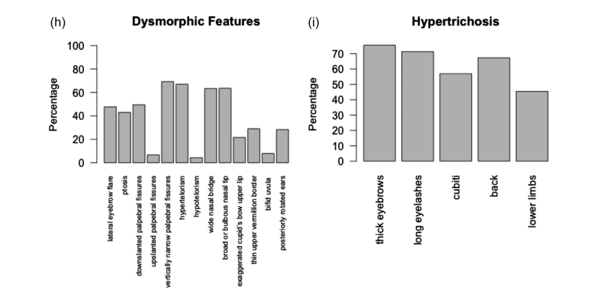

## Question

# Disease Characteristics Research Template

## Target Disease
- **Disease Name:** Wiedemann-Steiner Syndrome
- **MONDO ID:**  (if available)
- **Category:** Mendelian

## Research Objectives

Please provide a comprehensive research report on **Wiedemann-Steiner Syndrome** covering all of the
disease characteristics listed below. This report will be used to populate a disease knowledge
base entry. Be thorough and cite primary literature (PMID preferred) for all claims.

For each section, **suggested databases/resources** are listed. These are the first places
you should search for information on each topic.

---

### 1. Disease Information
> **Search first:** OMIM, Orphanet, ICD-10/ICD-11, MeSH, PubMed

- What is the disease? Provide a concise overview.
- What are the key identifiers? (OMIM, Orphanet, ICD-10/ICD-11, MeSH, Mondo)
- What are the common synonyms and alternative names?
- Is the information derived from individual patients (e.g., EHR) or aggregated disease-level resources?

### 2. Etiology

- **Disease Causal Factors**: What are the primary causes? (genetic, environmental, infectious, mechanistic)
- **Risk Factors**:
  > **Search first:** PubMed, Cochrane Library, UpToDate, clinical guidelines, ClinVar, ClinGen, GWAS Catalog, PheGenI, CTD, CDC, WHO, epidemiological databases
  - Genetic risk factors (causal variants, susceptibility loci, modifier genes)
  - Environmental risk factors (toxins, lifestyle, occupational exposures, age, sex, family history)
- **Protective Factors**:
  > **Search first:** PubMed, Cochrane Library, clinical trial databases, GWAS Catalog, gnomAD, WHO, CDC, nutrition databases
  - Genetic protective factors (protective variants, modifier alleles)
  - Environmental protective factors (diet, lifestyle, exposures that reduce risk)
- **Gene-Environment Interactions**: How do genetic and environmental factors interact to influence disease?
  > **Search first:** CTD, PubMed, PheGenI, GxE databases

### 3. Phenotypes
> **Search first:** HPO (Human Phenotype Ontology), OMIM, Orphanet, PubMed, clinicaltrials.gov, MedDRA, SNOMED CT, DECIPHER, LOINC

For each phenotype, provide:
- **Phenotype type**: symptoms, clinical signs, physical manifestations, behavioral changes, or laboratory abnormalities
  > For symptoms/signs: HPO, OMIM, Orphanet, PubMed
  > For behavioral changes: HPO, DSM, RDoC (Research Domain Criteria), PubMed
  > For laboratory abnormalities: LOINC, SNOMED CT, LabTests Online, PubMed
- **Phenotype characteristics**:
  > **Search first:** OMIM, Orphanet, HPO, PubMed
  - Age of symptom onset (neonatal, childhood, adult-onset, late-onset)
  - Symptom severity (mild, moderate, severe, variable)
  - Symptom progression (stable, progressive, episodic, fluctuating)
  - Frequency among affected individuals (percentage or qualitative)
- **Quality of life impact**: Effects on daily functioning and well-being (per-phenotype when possible)
  > **Search first:** EQ-5D database, SF-36, WHO QOL databases, PubMed
- Suggest HPO (Human Phenotype Ontology) terms for each phenotype

### 4. Genetic/Molecular Information

- **Causal Genes**: Gene mutations or chromosomal abnormalities responsible for disease (gene symbols, OMIM IDs)
  > **Search first:** OMIM, ClinVar, HGMD, Ensembl, NCBI Gene
- **Pathogenic Variants**:
  - Affected genes (gene symbols, HGNC IDs)
    > **Search first:** OMIM, NCBI Gene, Ensembl, HGNC, UniProt, GeneCards
  - Variant classification (pathogenic, likely pathogenic, VUS per ACMG/AMP guidelines)
    > **Search first:** ClinVar, ClinGen, ACMG/AMP guidelines, VarSome
  - Variant type/class (missense, frameshift, nonsense, splice-site, structural)
  - Allele frequency in population databases
    > **Search first:** gnomAD, 1000 Genomes, ExAC, TOPMed, dbSNP
  - Somatic vs germline origin
    > **Search first:** COSMIC (somatic), ClinVar, ICGC, TCGA
  - Functional consequences (loss of function, gain of function, dominant negative)
- **Modifier Genes**: Genes that modify disease severity or expression
- **Epigenetic Information**: DNA methylation, histone modifications, chromatin changes affecting disease
  > **Search first:** ENCODE, Roadmap Epigenomics, MethBase, DiseaseMeth
- **Chromosomal Abnormalities**: Large-scale genetic changes (aneuploidy, translocations, inversions)
  > **Search first:** DECIPHER, ClinVar, ECARUCA, UCSC Genome Browser

### 5. Environmental Information

- **Environmental Factors**: Non-genetic contributing factors (toxins, radiation, pollution, occupational exposure)
  > **Search first:** CTD (Comparative Toxicogenomics Database), TOXNET, PubMed, EPA databases
- **Lifestyle Factors**: Behavioral factors (smoking, diet, exercise, alcohol consumption)
  > **Search first:** CDC databases, WHO, PubMed, NHANES
- **Infectious Agents**: If applicable, pathogens causing or triggering disease (bacteria, viruses, fungi, parasites)
  > **Search first:** NCBI Taxonomy, ViPR, BV-BRC, MicrobeDB, GIDEON

### 6. Mechanism / Pathophysiology

- **Molecular Pathways**: Specific signaling cascades or biochemical pathways involved (Wnt, MAPK, mTOR, PI3K-AKT, etc.)
  > **Search first:** KEGG, Reactome, WikiPathways, PathBank, BioCyc
- **Cellular Processes**: Cell-level mechanisms (apoptosis, autophagy, cell cycle dysregulation, inflammation, etc.)
  > **Search first:** Gene Ontology (GO), Reactome, KEGG, PubMed
- **Protein Dysfunction**: How protein structure or function is altered (misfolding, aggregation, loss of function, gain of function)
  > **Search first:** UniProt, PDB (Protein Data Bank), InterPro, Pfam, AlphaFold
- **Metabolic Changes**: Alterations in metabolic processes (energy metabolism, lipid metabolism, amino acid metabolism)
  > **Search first:** KEGG, BioCyc, HMDB (Human Metabolome Database), BRENDA
- **Immune System Involvement**: Role of immune response (autoimmunity, immunodeficiency, chronic inflammation)
  > **Search first:** ImmPort, Immunome Database, IEDB, Gene Ontology
- **Tissue Damage Mechanisms**: How tissues/ are injured (oxidative stress, ischemia, fibrosis, necrosis)
  > **Search first:** PubMed, Gene Ontology, Reactome
- **Biochemical Abnormalities**: Specific molecular defects (enzyme deficiencies, receptor dysfunction, ion channel defects)
  > **Search first:** BRENDA, UniProt, KEGG, OMIM, PubMed
- **Epigenetic Changes**: DNA methylation, histone modifications affecting gene expression in disease
  > **Search first:** ENCODE, Roadmap Epigenomics, MethBase, DiseaseMeth
- **Molecular Profiling** (if available):
  - Transcriptomics/gene expression changes
    > **Search first:** GEO (Gene Expression Omnibus), ArrayExpress, GTEx, Human Cell Atlas, SRA
  - Proteomics findings
    > **Search first:** PRIDE, ProteomeXchange, Human Protein Atlas, STRING, BioGRID
  - Metabolomics signatures
    > **Search first:** MetaboLights, Metabolomics Workbench, HMDB, METLIN
  - Lipidomics alterations
    > **Search first:** LIPID MAPS, SwissLipids, LipidHome, Metabolomics Workbench
  - Genomic structural features
    > **Search first:** UCSC Genome Browser, Ensembl, NCBI, dbVar, DGV
- **Advanced Technologies** (if applicable):
  - Single-cell analysis findings (cell-type specific mechanisms, cellular heterogeneity)
    > **Search first:** Human Cell Atlas, Single Cell Portal, GEO, CELLxGENE
  - Spatial transcriptomics findings
    > **Search first:** GEO, Spatial Research, Vizgen, 10x Genomics data
  - Multi-omics integration results
    > **Search first:** TCGA, ICGC, cBioPortal, LinkedOmics, PubMed
  - Functional genomics screens (CRISPR, RNAi)
    > **Search first:** DepMap, GenomeRNAi, PubMed, BioGRID ORCS

For each mechanism, describe:
- The causal chain from initial trigger to clinical manifestation
- Which mechanisms are upstream vs downstream
- What cell types and biological processes are involved
- Suggest GO terms for biological processes and CL terms for cell types

### 7. Anatomical Structures Affected

- **Organ Level**:
  - Primary organs directly affected
  - Secondary organ involvement (complications, secondary effects)
  - Body systems involved (cardiovascular, nervous, digestive, respiratory, endocrine, etc.)
  > **Search first:** Uberon, FMA (Foundational Model of Anatomy), OMIM, HPO, ICD-11, MeSH, SNOMED CT
- **Tissue and Cell Level**:
  - Specific tissue types affected (epithelial, connective, muscle, nervous)
  - Specific cell populations targeted (with Cell Ontology terms)
  > **Search first:** Uberon, Human Protein Atlas, Cell Ontology, Human Cell Atlas, CellMarker, PanglaoDB
- **Subcellular Level**:
  - Cellular compartments involved (mitochondria, nucleus, ER, lysosomes) (with GO Cellular Component terms)
  > **Search first:** Gene Ontology (Cellular Component), UniProt, Human Protein Atlas
- **Localization**:
  - Specific anatomical sites (with UBERON terms)
    > **Search first:** FMA, Uberon, NeuroNames (for brain), SNOMED CT
  - Lateralization (unilateral, bilateral, asymmetric)
    > **Search first:** HPO, clinical literature, imaging databases

### 8. Temporal Development

- **Onset**:
  - Typical age of onset (congenital, pediatric, adult, geriatric)
  - Onset pattern (acute, subacute, chronic, insidious)
  > **Search first:** OMIM, Orphanet, HPO, PubMed
- **Progression**:
  - Disease stages (early, intermediate, advanced, end-stage)
    > **Search first:** Cancer Staging Manual (AJCC), WHO classifications, PubMed
  - Progression rate (rapid, slow, variable)
  - Disease course pattern (episodic, relapsing-remitting, progressive, stable)
  - Disease duration (self-limited, chronic lifelong)
  > **Search first:** Disease registries, longitudinal cohort databases, natural history studies, PubMed, Orphanet, OMIM
- **Patterns**:
  - Remission patterns (spontaneous, treatment-induced)
    > **Search first:** Clinical trial databases, disease registries, PubMed
  - Critical periods (time windows of vulnerability or opportunity for intervention)
    > **Search first:** PubMed, developmental biology databases, clinical guidelines

### 9. Inheritance and Population

- **Epidemiology**:
  - Prevalence (cases per 100,000 at given time)
  - Incidence (new cases per 100,000 per year)
  > **Search first:** Orphanet, CDC, WHO, GBD (Global Burden of Disease), national registries, SEER, disease registries
- **For Genetic Etiology**:
  - Inheritance pattern (AD, AR, X-linked, mitochondrial, multifactorial, polygenic)
    > **Search first:** OMIM, Orphanet, ClinVar, GTR (Genetic Testing Registry)
  - Penetrance (complete, incomplete, age-dependent)
    > **Search first:** ClinVar, OMIM, PubMed, ClinGen
  - Expressivity (variable, consistent)
    > **Search first:** OMIM, ClinVar, PubMed
  - Genetic anticipation (increasing severity in successive generations)
    > **Search first:** OMIM, PubMed (especially for repeat expansion disorders)
  - Germline mosaicism
    > **Search first:** ClinVar, OMIM, genetic counseling literature, PubMed
  - Founder effects (population-specific mutations)
    > **Search first:** gnomAD, population genetics databases, PubMed
  - Consanguinity role
    > **Search first:** OMIM, population studies, genetic counseling resources
  - Carrier frequency
    > **Search first:** gnomAD, carrier screening databases, GeneReviews, GTR
- **Population Demographics**:
  - Affected populations (ethnic or demographic groups with higher prevalence)
    > **Search first:** gnomAD, 1000 Genomes, PAGE Study, PubMed, population registries
  - Geographic distribution (endemic areas, regional variation)
    > **Search first:** WHO, CDC, GBD, Orphanet, geographic epidemiology databases
  - Geographic distribution of specific variants
  - Sex ratio (male:female)
    > **Search first:** Disease registries, OMIM, PubMed, epidemiological databases
  - Age distribution of affected individuals
    > **Search first:** CDC, disease registries, SEER, Orphanet

### 10. Diagnostics

- **Clinical Tests**:
  - Laboratory tests (blood, urine, tissue chemistry, specific enzyme assays)
    > **Search first:** LOINC, LabTests Online, PubMed
  - Biomarkers (proteins, metabolites, genetic markers, circulating biomarkers)
    > **Search first:** FDA Biomarker List, BEST (Biomarkers, EndpointS, and other Tools), PubMed
  - Imaging studies (X-ray, CT, MRI, PET, ultrasound)
    > **Search first:** RadLex, DICOM, Radiopaedia, imaging databases
  - Functional tests (pulmonary function, cardiac stress tests)
    > **Search first:** LOINC, clinical guidelines, PubMed
  - Electrophysiology (EEG, EMG, ECG, nerve conduction studies)
    > **Search first:** LOINC, clinical neurophysiology databases, PubMed
  - Biopsy findings (histopathology, immunohistochemistry)
    > **Search first:** SNOMED CT, College of American Pathologists resources, PubMed
  - Pathology findings (microscopic examination)
    > **Search first:** SNOMED CT, Digital Pathology databases, PubMed
- **Genetic Testing**:
  > **Search first:** GTR (Genetic Testing Registry), GeneReviews, ClinGen
  - Overview of recommended genetic testing approach
  - Whole genome sequencing (WGS) utility
    > **Search first:** GTR, ClinVar, GEL (Genomics England), gnomAD
  - Whole exome sequencing (WES) utility
    > **Search first:** GTR, ClinVar, OMIM, GeneMatcher
  - Gene panels (which panels, which genes)
    > **Search first:** GTR, ClinVar, laboratory-specific databases
  - Single gene testing
    > **Search first:** GTR, ClinVar, OMIM, GeneReviews
  - Chromosomal microarray (CMA)
    > **Search first:** DECIPHER, ClinVar, dbVar, ECARUCA
  - Karyotyping
    > **Search first:** Chromosome Abnormality Database, ClinVar, cytogenetics resources
  - FISH
    > **Search first:** ClinVar, cytogenetics databases, PubMed
  - Mitochondrial DNA testing
    > **Search first:** MITOMAP, MSeqDR, ClinVar, GTR
  - Repeat expansion testing
    > **Search first:** GTR, ClinVar, repeat expansion databases, PubMed
- **Omics-Based Diagnostics** (if applicable):
  - RNA sequencing / transcriptomics
    > **Search first:** GEO, ArrayExpress, GTEx, RNA-seq databases
  - Proteomics
    > **Search first:** PRIDE, ProteomeXchange, FDA Biomarker database
  - Metabolomics
    > **Search first:** MetaboLights, Metabolomics Workbench, HMDB
  - Epigenomics
    > **Search first:** GEO, ENCODE, Roadmap Epigenomics, MethBase
  - Liquid biopsy
    > **Search first:** COSMIC, ClinVar, liquid biopsy databases, PubMed
- **Clinical Criteria**:
  - Standardized diagnostic criteria (DSM, ICD, society guidelines)
    > **Search first:** DSM-5, ICD-11, clinical society guidelines, UpToDate
  - Differential diagnosis (other conditions to rule out, with distinguishing features)
    > **Search first:** DynaMed, UpToDate, clinical decision support systems
- **Screening**:
  - Screening methods for asymptomatic individuals (newborn screening, carrier screening, cascade screening)
    > **Search first:** ACMG recommendations, CDC newborn screening, GTR

### 11. Outcome/Prognosis

- **Survival and Mortality**:
  - Survival rate (5-year, 10-year, overall)
    > **Search first:** SEER, cancer registries, disease-specific registries, PubMed
  - Life expectancy (with and without treatment if applicable)
    > **Search first:** Orphanet, disease registries, actuarial databases, PubMed
  - Mortality rate
    > **Search first:** CDC, WHO, GBD, national mortality databases
  - Disease-specific mortality (deaths directly attributable to disease)
    > **Search first:** Disease registries, CDC Wonder, GBD, PubMed
- **Morbidity and Function**:
  - Morbidity (disease-related disability and health impacts)
    > **Search first:** GBD, WHO, disability databases, PubMed
  - Disability outcomes (long-term functional impairments)
    > **Search first:** ICF (International Classification of Functioning), disability registries
  - Quality of life measures (EQ-5D, SF-36, PROMIS, disease-specific tools)
    > **Search first:** EQ-5D database, SF-36, PROMIS, PubMed
- **Disease Course**:
  - Complications (secondary problems: infections, organ failure, etc.)
    > **Search first:** ICD codes, disease registries, clinical databases, PubMed
  - Recovery potential (likelihood and extent of recovery, with vs without treatment)
    > **Search first:** Natural history studies, rehabilitation databases, PubMed
- **Prediction**:
  - Prognostic factors (age, disease severity, biomarkers, treatment response)
    > **Search first:** Prognostic models databases, clinical calculators, PubMed
  - Prognostic biomarkers (molecular markers predicting disease course)
    > **Search first:** FDA Biomarker database, PubMed, cancer prognostic databases

### 12. Treatment

- **Pharmacotherapy**:
  - Pharmacological treatments (drug names, drug classes, mechanisms of action)
    > **Search first:** DrugBank, RxNorm, ATC classification, DailyMed, FDA databases
  - Pharmacogenomics (how genetic variants affect drug metabolism, efficacy, toxicity)
    > **Search first:** PharmGKB, CPIC (Clinical Pharmacogenetics), FDA Table of PGx Biomarkers
- **Advanced Therapeutics**:
  - Gene therapy (viral vectors, CRISPR, gene replacement, gene editing)
    > **Search first:** ClinicalTrials.gov, FDA gene therapy database, ASGCT resources
  - Cell therapy (stem cell transplant, CAR-T, cellular therapeutics)
    > **Search first:** ClinicalTrials.gov, FDA cell therapy database, FACT standards
  - RNA-based therapies (ASOs, siRNA, mRNA therapies)
    > **Search first:** ClinicalTrials.gov, FDA approvals, PubMed
  - Targeted therapies (treatments directed at specific molecular targets)
    > **Search first:** My Cancer Genome, OncoKB, ClinicalTrials.gov, FDA approvals
  - Immunotherapies (checkpoint inhibitors, monoclonal antibodies)
    > **Search first:** Cancer Immunotherapy Database, FDA approvals, ClinicalTrials.gov
- **Surgical and Interventional**:
  - Surgical interventions (types of surgery, timing, outcomes)
    > **Search first:** CPT codes, surgical registries, clinical guidelines, PubMed
- **Supportive and Rehabilitative**:
  - Supportive care (symptom management, pain control, nutrition)
    > **Search first:** Clinical guidelines, Cochrane Library, PubMed
  - Rehabilitation (physical therapy, occupational therapy, speech therapy)
    > **Search first:** Rehabilitation medicine databases, clinical guidelines, PubMed
- **Experimental**:
  - Experimental treatments in clinical trials (with NCT identifiers if available)
    > **Search first:** ClinicalTrials.gov, EU Clinical Trials Register, WHO ICTRP
- **Treatment Outcomes**:
  - Treatment response rates
    > **Search first:** Clinical trial databases, FDA reviews, systematic reviews, PubMed
  - Side effects and adverse events
    > **Search first:** FDA Adverse Event Reporting System (FAERS), MedWatch, PubMed
- **Treatment Strategy**:
  - Treatment algorithms (clinical pathways, decision trees)
    > **Search first:** Clinical practice guidelines, NCCN Guidelines, UpToDate
  - Combination therapies
    > **Search first:** ClinicalTrials.gov, treatment guidelines, PubMed
  - Personalized medicine approaches (genotype-guided treatment)
    > **Search first:** My Cancer Genome, CIViC, PharmGKB, precision medicine databases

For each treatment, suggest MAXO (Medical Action Ontology) terms where applicable.

### 13. Prevention

- **Prevention Levels**:
  - Primary prevention (preventing disease occurrence: vaccination, risk factor modification)
    > **Search first:** CDC, WHO, USPSTF recommendations, Cochrane Library
  - Secondary prevention (early detection and treatment: screening programs, early intervention)
    > **Search first:** USPSTF, CDC screening guidelines, WHO
  - Tertiary prevention (preventing complications in those with disease)
    > **Search first:** Clinical guidelines, disease management protocols, PubMed
- **Immunization**: Vaccine strategies (if applicable)
  > **Search first:** CDC vaccine schedules, WHO immunization, FDA vaccine database
- **Screening and Early Detection**:
  - Screening programs (population-based: newborn screening, cancer screening)
    > **Search first:** CDC screening programs, USPSTF, cancer screening databases
  - Genetic screening (carrier screening, preimplantation genetic diagnosis, prenatal testing)
    > **Search first:** ACMG recommendations, ACOG guidelines, GTR
  - Risk stratification (identifying high-risk individuals for targeted prevention)
    > **Search first:** Risk prediction models, clinical calculators, PubMed
- **Behavioral Interventions**: Lifestyle modifications to reduce risk
  > **Search first:** CDC, WHO, behavioral intervention databases, Cochrane Library
- **Counseling**: Genetic counseling (risk assessment, family planning guidance)
  > **Search first:** NSGC resources, ACMG guidelines, GeneReviews
- **Public Health**:
  - Public health interventions (sanitation, vector control, health education)
    > **Search first:** CDC, WHO, public health databases, PubMed
  - Environmental interventions (reducing environmental risk factors)
    > **Search first:** EPA databases, WHO environmental health, PubMed
- **Prophylaxis**: Preventive medications or procedures
  > **Search first:** Clinical guidelines, FDA approvals, PubMed

### 14. Other Species / Natural Disease

- **Taxonomy**: Species affected (with NCBI Taxon identifiers)
  > **Search first:** NCBI Taxonomy
- **Breed**: Specific breeds affected (with VBO identifiers if applicable)
  > **Search first:** VBO (Vertebrate Breed Ontology)
- **Gene**: Orthologous genes in other species (with NCBI Gene IDs)
  > **Search first:** NCBI Gene
- **Natural Disease**:
  - Naturally occurring disease in other species (companion animals, wildlife)
    > **Search first:** OMIA (Online Mendelian Inheritance in Animals), VetCompass, PubMed
  - Veterinary relevance and importance in animal health
    > **Search first:** OMIA, veterinary databases, PubMed
- **Comparative Biology**:
  - Comparative pathology (similarities and differences across species)
    > **Search first:** OMIA, comparative pathology databases, PubMed
  - Evolutionary conservation of disease mechanisms
    > **Search first:** HomoloGene, OrthoMCL, Alliance of Genome Resources
- **Transmission** (if applicable):
  - Zoonotic potential
    > **Search first:** CDC zoonotic diseases, WHO zoonoses, GIDEON
  - Cross-species susceptibility
    > **Search first:** NCBI Taxonomy, veterinary databases, PubMed

### 15. Model Organisms

- **Model Types**:
  - Model organism type (mammalian, invertebrate, cellular, in vitro)
    > **Search first:** Alliance of Genome Resources, model organism databases
  - Specific model systems (mouse, rat, zebrafish, Drosophila, C. elegans, yeast, cell lines, organoids, iPSCs)
    > **Search first:** MGI, RGD, ZFIN, FlyBase, WormBase, SGD, ATCC, Cellosaurus
  - Induced models (drug treatment, surgical intervention, environmental manipulation)
    > **Search first:** MGI, model organism databases, PubMed
- **Genetic Models**:
  - Types available (knockout, knock-in, transgenic, conditional, humanized)
    > **Search first:** MGI, IMPC, KOMP, EuMMCR, IMSR
- **Model Characteristics**:
  - Phenotype recapitulation (how well model reproduces human disease features)
    > **Search first:** Model organism databases, comparative studies, PubMed
  - Model limitations (aspects of human disease not captured)
    > **Search first:** Model organism databases, PubMed, review articles
- **Applications**:
  - Research applications (what aspects of disease can be studied)
    > **Search first:** Model organism databases, PubMed
- **Resources**:
  - Model databases
    > **Search first:** MGI, RGD, ZFIN, FlyBase, WormBase, IMSR, EMMA, MMRRC

---

## Citation Requirements

- Cite primary literature (PMID preferred) for all mechanistic and clinical claims
- Prioritize recent reviews and landmark papers
- Include direct quotes from abstracts where possible to support key statements
- Distinguish evidence source types: human clinical, model organism, in vitro, computational

## Output Format

Structure your response as a comprehensive narrative organized by the sections above.
For each section, provide:
- Factual content with specific details (numbers, percentages, gene names, variant nomenclature)
- Ontology term suggestions (HPO, GO, CL, UBERON, CHEBI, MAXO, MONDO) where applicable
- Evidence citations with PMIDs
- Direct quotes from abstracts to support key claims
- Clear indication when information is not available or not applicable for this disease

This report will be used to populate a disease knowledge base entry with:
- Pathophysiology descriptions with causal chains
- Gene/protein annotations (HGNC, GO terms)
- Phenotype associations (HP terms) with frequencies
- Cell type involvement (CL terms)
- Anatomical locations (UBERON terms)
- Chemical entities (CHEBI terms)
- Treatment annotations (MAXO terms)
- Evidence items with PMIDs and exact abstract quotes
- Epidemiology, prognosis, diagnostic, and prevention information
- Animal model descriptions with phenotype recapitulation details

## Output

Question: You are an expert researcher providing comprehensive, well-cited information.

Provide detailed information focusing on:
1. Key concepts and definitions with current understanding
2. Recent developments and latest research (prioritize 2023-2024 sources)
3. Current applications and real-world implementations
4. Expert opinions and analysis from authoritative sources
5. Relevant statistics and data from recent studies

Format as a comprehensive research report with proper citations. Include URLs and publication dates where available.
Always prioritize recent, authoritative sources and provide specific citations for all major claims.

# Disease Characteristics Research Template

## Target Disease
- **Disease Name:** Wiedemann-Steiner Syndrome
- **MONDO ID:**  (if available)
- **Category:** Mendelian

## Research Objectives

Please provide a comprehensive research report on **Wiedemann-Steiner Syndrome** covering all of the
disease characteristics listed below. This report will be used to populate a disease knowledge
base entry. Be thorough and cite primary literature (PMID preferred) for all claims.

For each section, **suggested databases/resources** are listed. These are the first places
you should search for information on each topic.

---

### 1. Disease Information
> **Search first:** OMIM, Orphanet, ICD-10/ICD-11, MeSH, PubMed

- What is the disease? Provide a concise overview.
- What are the key identifiers? (OMIM, Orphanet, ICD-10/ICD-11, MeSH, Mondo)
- What are the common synonyms and alternative names?
- Is the information derived from individual patients (e.g., EHR) or aggregated disease-level resources?

### 2. Etiology

- **Disease Causal Factors**: What are the primary causes? (genetic, environmental, infectious, mechanistic)
- **Risk Factors**:
  > **Search first:** PubMed, Cochrane Library, UpToDate, clinical guidelines, ClinVar, ClinGen, GWAS Catalog, PheGenI, CTD, CDC, WHO, epidemiological databases
  - Genetic risk factors (causal variants, susceptibility loci, modifier genes)
  - Environmental risk factors (toxins, lifestyle, occupational exposures, age, sex, family history)
- **Protective Factors**:
  > **Search first:** PubMed, Cochrane Library, clinical trial databases, GWAS Catalog, gnomAD, WHO, CDC, nutrition databases
  - Genetic protective factors (protective variants, modifier alleles)
  - Environmental protective factors (diet, lifestyle, exposures that reduce risk)
- **Gene-Environment Interactions**: How do genetic and environmental factors interact to influence disease?
  > **Search first:** CTD, PubMed, PheGenI, GxE databases

### 3. Phenotypes
> **Search first:** HPO (Human Phenotype Ontology), OMIM, Orphanet, PubMed, clinicaltrials.gov, MedDRA, SNOMED CT, DECIPHER, LOINC

For each phenotype, provide:
- **Phenotype type**: symptoms, clinical signs, physical manifestations, behavioral changes, or laboratory abnormalities
  > For symptoms/signs: HPO, OMIM, Orphanet, PubMed
  > For behavioral changes: HPO, DSM, RDoC (Research Domain Criteria), PubMed
  > For laboratory abnormalities: LOINC, SNOMED CT, LabTests Online, PubMed
- **Phenotype characteristics**:
  > **Search first:** OMIM, Orphanet, HPO, PubMed
  - Age of symptom onset (neonatal, childhood, adult-onset, late-onset)
  - Symptom severity (mild, moderate, severe, variable)
  - Symptom progression (stable, progressive, episodic, fluctuating)
  - Frequency among affected individuals (percentage or qualitative)
- **Quality of life impact**: Effects on daily functioning and well-being (per-phenotype when possible)
  > **Search first:** EQ-5D database, SF-36, WHO QOL databases, PubMed
- Suggest HPO (Human Phenotype Ontology) terms for each phenotype

### 4. Genetic/Molecular Information

- **Causal Genes**: Gene mutations or chromosomal abnormalities responsible for disease (gene symbols, OMIM IDs)
  > **Search first:** OMIM, ClinVar, HGMD, Ensembl, NCBI Gene
- **Pathogenic Variants**:
  - Affected genes (gene symbols, HGNC IDs)
    > **Search first:** OMIM, NCBI Gene, Ensembl, HGNC, UniProt, GeneCards
  - Variant classification (pathogenic, likely pathogenic, VUS per ACMG/AMP guidelines)
    > **Search first:** ClinVar, ClinGen, ACMG/AMP guidelines, VarSome
  - Variant type/class (missense, frameshift, nonsense, splice-site, structural)
  - Allele frequency in population databases
    > **Search first:** gnomAD, 1000 Genomes, ExAC, TOPMed, dbSNP
  - Somatic vs germline origin
    > **Search first:** COSMIC (somatic), ClinVar, ICGC, TCGA
  - Functional consequences (loss of function, gain of function, dominant negative)
- **Modifier Genes**: Genes that modify disease severity or expression
- **Epigenetic Information**: DNA methylation, histone modifications, chromatin changes affecting disease
  > **Search first:** ENCODE, Roadmap Epigenomics, MethBase, DiseaseMeth
- **Chromosomal Abnormalities**: Large-scale genetic changes (aneuploidy, translocations, inversions)
  > **Search first:** DECIPHER, ClinVar, ECARUCA, UCSC Genome Browser

### 5. Environmental Information

- **Environmental Factors**: Non-genetic contributing factors (toxins, radiation, pollution, occupational exposure)
  > **Search first:** CTD (Comparative Toxicogenomics Database), TOXNET, PubMed, EPA databases
- **Lifestyle Factors**: Behavioral factors (smoking, diet, exercise, alcohol consumption)
  > **Search first:** CDC databases, WHO, PubMed, NHANES
- **Infectious Agents**: If applicable, pathogens causing or triggering disease (bacteria, viruses, fungi, parasites)
  > **Search first:** NCBI Taxonomy, ViPR, BV-BRC, MicrobeDB, GIDEON

### 6. Mechanism / Pathophysiology

- **Molecular Pathways**: Specific signaling cascades or biochemical pathways involved (Wnt, MAPK, mTOR, PI3K-AKT, etc.)
  > **Search first:** KEGG, Reactome, WikiPathways, PathBank, BioCyc
- **Cellular Processes**: Cell-level mechanisms (apoptosis, autophagy, cell cycle dysregulation, inflammation, etc.)
  > **Search first:** Gene Ontology (GO), Reactome, KEGG, PubMed
- **Protein Dysfunction**: How protein structure or function is altered (misfolding, aggregation, loss of function, gain of function)
  > **Search first:** UniProt, PDB (Protein Data Bank), InterPro, Pfam, AlphaFold
- **Metabolic Changes**: Alterations in metabolic processes (energy metabolism, lipid metabolism, amino acid metabolism)
  > **Search first:** KEGG, BioCyc, HMDB (Human Metabolome Database), BRENDA
- **Immune System Involvement**: Role of immune response (autoimmunity, immunodeficiency, chronic inflammation)
  > **Search first:** ImmPort, Immunome Database, IEDB, Gene Ontology
- **Tissue Damage Mechanisms**: How tissues/ are injured (oxidative stress, ischemia, fibrosis, necrosis)
  > **Search first:** PubMed, Gene Ontology, Reactome
- **Biochemical Abnormalities**: Specific molecular defects (enzyme deficiencies, receptor dysfunction, ion channel defects)
  > **Search first:** BRENDA, UniProt, KEGG, OMIM, PubMed
- **Epigenetic Changes**: DNA methylation, histone modifications affecting gene expression in disease
  > **Search first:** ENCODE, Roadmap Epigenomics, MethBase, DiseaseMeth
- **Molecular Profiling** (if available):
  - Transcriptomics/gene expression changes
    > **Search first:** GEO (Gene Expression Omnibus), ArrayExpress, GTEx, Human Cell Atlas, SRA
  - Proteomics findings
    > **Search first:** PRIDE, ProteomeXchange, Human Protein Atlas, STRING, BioGRID
  - Metabolomics signatures
    > **Search first:** MetaboLights, Metabolomics Workbench, HMDB, METLIN
  - Lipidomics alterations
    > **Search first:** LIPID MAPS, SwissLipids, LipidHome, Metabolomics Workbench
  - Genomic structural features
    > **Search first:** UCSC Genome Browser, Ensembl, NCBI, dbVar, DGV
- **Advanced Technologies** (if applicable):
  - Single-cell analysis findings (cell-type specific mechanisms, cellular heterogeneity)
    > **Search first:** Human Cell Atlas, Single Cell Portal, GEO, CELLxGENE
  - Spatial transcriptomics findings
    > **Search first:** GEO, Spatial Research, Vizgen, 10x Genomics data
  - Multi-omics integration results
    > **Search first:** TCGA, ICGC, cBioPortal, LinkedOmics, PubMed
  - Functional genomics screens (CRISPR, RNAi)
    > **Search first:** DepMap, GenomeRNAi, PubMed, BioGRID ORCS

For each mechanism, describe:
- The causal chain from initial trigger to clinical manifestation
- Which mechanisms are upstream vs downstream
- What cell types and biological processes are involved
- Suggest GO terms for biological processes and CL terms for cell types

### 7. Anatomical Structures Affected

- **Organ Level**:
  - Primary organs directly affected
  - Secondary organ involvement (complications, secondary effects)
  - Body systems involved (cardiovascular, nervous, digestive, respiratory, endocrine, etc.)
  > **Search first:** Uberon, FMA (Foundational Model of Anatomy), OMIM, HPO, ICD-11, MeSH, SNOMED CT
- **Tissue and Cell Level**:
  - Specific tissue types affected (epithelial, connective, muscle, nervous)
  - Specific cell populations targeted (with Cell Ontology terms)
  > **Search first:** Uberon, Human Protein Atlas, Cell Ontology, Human Cell Atlas, CellMarker, PanglaoDB
- **Subcellular Level**:
  - Cellular compartments involved (mitochondria, nucleus, ER, lysosomes) (with GO Cellular Component terms)
  > **Search first:** Gene Ontology (Cellular Component), UniProt, Human Protein Atlas
- **Localization**:
  - Specific anatomical sites (with UBERON terms)
    > **Search first:** FMA, Uberon, NeuroNames (for brain), SNOMED CT
  - Lateralization (unilateral, bilateral, asymmetric)
    > **Search first:** HPO, clinical literature, imaging databases

### 8. Temporal Development

- **Onset**:
  - Typical age of onset (congenital, pediatric, adult, geriatric)
  - Onset pattern (acute, subacute, chronic, insidious)
  > **Search first:** OMIM, Orphanet, HPO, PubMed
- **Progression**:
  - Disease stages (early, intermediate, advanced, end-stage)
    > **Search first:** Cancer Staging Manual (AJCC), WHO classifications, PubMed
  - Progression rate (rapid, slow, variable)
  - Disease course pattern (episodic, relapsing-remitting, progressive, stable)
  - Disease duration (self-limited, chronic lifelong)
  > **Search first:** Disease registries, longitudinal cohort databases, natural history studies, PubMed, Orphanet, OMIM
- **Patterns**:
  - Remission patterns (spontaneous, treatment-induced)
    > **Search first:** Clinical trial databases, disease registries, PubMed
  - Critical periods (time windows of vulnerability or opportunity for intervention)
    > **Search first:** PubMed, developmental biology databases, clinical guidelines

### 9. Inheritance and Population

- **Epidemiology**:
  - Prevalence (cases per 100,000 at given time)
  - Incidence (new cases per 100,000 per year)
  > **Search first:** Orphanet, CDC, WHO, GBD (Global Burden of Disease), national registries, SEER, disease registries
- **For Genetic Etiology**:
  - Inheritance pattern (AD, AR, X-linked, mitochondrial, multifactorial, polygenic)
    > **Search first:** OMIM, Orphanet, ClinVar, GTR (Genetic Testing Registry)
  - Penetrance (complete, incomplete, age-dependent)
    > **Search first:** ClinVar, OMIM, PubMed, ClinGen
  - Expressivity (variable, consistent)
    > **Search first:** OMIM, ClinVar, PubMed
  - Genetic anticipation (increasing severity in successive generations)
    > **Search first:** OMIM, PubMed (especially for repeat expansion disorders)
  - Germline mosaicism
    > **Search first:** ClinVar, OMIM, genetic counseling literature, PubMed
  - Founder effects (population-specific mutations)
    > **Search first:** gnomAD, population genetics databases, PubMed
  - Consanguinity role
    > **Search first:** OMIM, population studies, genetic counseling resources
  - Carrier frequency
    > **Search first:** gnomAD, carrier screening databases, GeneReviews, GTR
- **Population Demographics**:
  - Affected populations (ethnic or demographic groups with higher prevalence)
    > **Search first:** gnomAD, 1000 Genomes, PAGE Study, PubMed, population registries
  - Geographic distribution (endemic areas, regional variation)
    > **Search first:** WHO, CDC, GBD, Orphanet, geographic epidemiology databases
  - Geographic distribution of specific variants
  - Sex ratio (male:female)
    > **Search first:** Disease registries, OMIM, PubMed, epidemiological databases
  - Age distribution of affected individuals
    > **Search first:** CDC, disease registries, SEER, Orphanet

### 10. Diagnostics

- **Clinical Tests**:
  - Laboratory tests (blood, urine, tissue chemistry, specific enzyme assays)
    > **Search first:** LOINC, LabTests Online, PubMed
  - Biomarkers (proteins, metabolites, genetic markers, circulating biomarkers)
    > **Search first:** FDA Biomarker List, BEST (Biomarkers, EndpointS, and other Tools), PubMed
  - Imaging studies (X-ray, CT, MRI, PET, ultrasound)
    > **Search first:** RadLex, DICOM, Radiopaedia, imaging databases
  - Functional tests (pulmonary function, cardiac stress tests)
    > **Search first:** LOINC, clinical guidelines, PubMed
  - Electrophysiology (EEG, EMG, ECG, nerve conduction studies)
    > **Search first:** LOINC, clinical neurophysiology databases, PubMed
  - Biopsy findings (histopathology, immunohistochemistry)
    > **Search first:** SNOMED CT, College of American Pathologists resources, PubMed
  - Pathology findings (microscopic examination)
    > **Search first:** SNOMED CT, Digital Pathology databases, PubMed
- **Genetic Testing**:
  > **Search first:** GTR (Genetic Testing Registry), GeneReviews, ClinGen
  - Overview of recommended genetic testing approach
  - Whole genome sequencing (WGS) utility
    > **Search first:** GTR, ClinVar, GEL (Genomics England), gnomAD
  - Whole exome sequencing (WES) utility
    > **Search first:** GTR, ClinVar, OMIM, GeneMatcher
  - Gene panels (which panels, which genes)
    > **Search first:** GTR, ClinVar, laboratory-specific databases
  - Single gene testing
    > **Search first:** GTR, ClinVar, OMIM, GeneReviews
  - Chromosomal microarray (CMA)
    > **Search first:** DECIPHER, ClinVar, dbVar, ECARUCA
  - Karyotyping
    > **Search first:** Chromosome Abnormality Database, ClinVar, cytogenetics resources
  - FISH
    > **Search first:** ClinVar, cytogenetics databases, PubMed
  - Mitochondrial DNA testing
    > **Search first:** MITOMAP, MSeqDR, ClinVar, GTR
  - Repeat expansion testing
    > **Search first:** GTR, ClinVar, repeat expansion databases, PubMed
- **Omics-Based Diagnostics** (if applicable):
  - RNA sequencing / transcriptomics
    > **Search first:** GEO, ArrayExpress, GTEx, RNA-seq databases
  - Proteomics
    > **Search first:** PRIDE, ProteomeXchange, FDA Biomarker database
  - Metabolomics
    > **Search first:** MetaboLights, Metabolomics Workbench, HMDB
  - Epigenomics
    > **Search first:** GEO, ENCODE, Roadmap Epigenomics, MethBase
  - Liquid biopsy
    > **Search first:** COSMIC, ClinVar, liquid biopsy databases, PubMed
- **Clinical Criteria**:
  - Standardized diagnostic criteria (DSM, ICD, society guidelines)
    > **Search first:** DSM-5, ICD-11, clinical society guidelines, UpToDate
  - Differential diagnosis (other conditions to rule out, with distinguishing features)
    > **Search first:** DynaMed, UpToDate, clinical decision support systems
- **Screening**:
  - Screening methods for asymptomatic individuals (newborn screening, carrier screening, cascade screening)
    > **Search first:** ACMG recommendations, CDC newborn screening, GTR

### 11. Outcome/Prognosis

- **Survival and Mortality**:
  - Survival rate (5-year, 10-year, overall)
    > **Search first:** SEER, cancer registries, disease-specific registries, PubMed
  - Life expectancy (with and without treatment if applicable)
    > **Search first:** Orphanet, disease registries, actuarial databases, PubMed
  - Mortality rate
    > **Search first:** CDC, WHO, GBD, national mortality databases
  - Disease-specific mortality (deaths directly attributable to disease)
    > **Search first:** Disease registries, CDC Wonder, GBD, PubMed
- **Morbidity and Function**:
  - Morbidity (disease-related disability and health impacts)
    > **Search first:** GBD, WHO, disability databases, PubMed
  - Disability outcomes (long-term functional impairments)
    > **Search first:** ICF (International Classification of Functioning), disability registries
  - Quality of life measures (EQ-5D, SF-36, PROMIS, disease-specific tools)
    > **Search first:** EQ-5D database, SF-36, PROMIS, PubMed
- **Disease Course**:
  - Complications (secondary problems: infections, organ failure, etc.)
    > **Search first:** ICD codes, disease registries, clinical databases, PubMed
  - Recovery potential (likelihood and extent of recovery, with vs without treatment)
    > **Search first:** Natural history studies, rehabilitation databases, PubMed
- **Prediction**:
  - Prognostic factors (age, disease severity, biomarkers, treatment response)
    > **Search first:** Prognostic models databases, clinical calculators, PubMed
  - Prognostic biomarkers (molecular markers predicting disease course)
    > **Search first:** FDA Biomarker database, PubMed, cancer prognostic databases

### 12. Treatment

- **Pharmacotherapy**:
  - Pharmacological treatments (drug names, drug classes, mechanisms of action)
    > **Search first:** DrugBank, RxNorm, ATC classification, DailyMed, FDA databases
  - Pharmacogenomics (how genetic variants affect drug metabolism, efficacy, toxicity)
    > **Search first:** PharmGKB, CPIC (Clinical Pharmacogenetics), FDA Table of PGx Biomarkers
- **Advanced Therapeutics**:
  - Gene therapy (viral vectors, CRISPR, gene replacement, gene editing)
    > **Search first:** ClinicalTrials.gov, FDA gene therapy database, ASGCT resources
  - Cell therapy (stem cell transplant, CAR-T, cellular therapeutics)
    > **Search first:** ClinicalTrials.gov, FDA cell therapy database, FACT standards
  - RNA-based therapies (ASOs, siRNA, mRNA therapies)
    > **Search first:** ClinicalTrials.gov, FDA approvals, PubMed
  - Targeted therapies (treatments directed at specific molecular targets)
    > **Search first:** My Cancer Genome, OncoKB, ClinicalTrials.gov, FDA approvals
  - Immunotherapies (checkpoint inhibitors, monoclonal antibodies)
    > **Search first:** Cancer Immunotherapy Database, FDA approvals, ClinicalTrials.gov
- **Surgical and Interventional**:
  - Surgical interventions (types of surgery, timing, outcomes)
    > **Search first:** CPT codes, surgical registries, clinical guidelines, PubMed
- **Supportive and Rehabilitative**:
  - Supportive care (symptom management, pain control, nutrition)
    > **Search first:** Clinical guidelines, Cochrane Library, PubMed
  - Rehabilitation (physical therapy, occupational therapy, speech therapy)
    > **Search first:** Rehabilitation medicine databases, clinical guidelines, PubMed
- **Experimental**:
  - Experimental treatments in clinical trials (with NCT identifiers if available)
    > **Search first:** ClinicalTrials.gov, EU Clinical Trials Register, WHO ICTRP
- **Treatment Outcomes**:
  - Treatment response rates
    > **Search first:** Clinical trial databases, FDA reviews, systematic reviews, PubMed
  - Side effects and adverse events
    > **Search first:** FDA Adverse Event Reporting System (FAERS), MedWatch, PubMed
- **Treatment Strategy**:
  - Treatment algorithms (clinical pathways, decision trees)
    > **Search first:** Clinical practice guidelines, NCCN Guidelines, UpToDate
  - Combination therapies
    > **Search first:** ClinicalTrials.gov, treatment guidelines, PubMed
  - Personalized medicine approaches (genotype-guided treatment)
    > **Search first:** My Cancer Genome, CIViC, PharmGKB, precision medicine databases

For each treatment, suggest MAXO (Medical Action Ontology) terms where applicable.

### 13. Prevention

- **Prevention Levels**:
  - Primary prevention (preventing disease occurrence: vaccination, risk factor modification)
    > **Search first:** CDC, WHO, USPSTF recommendations, Cochrane Library
  - Secondary prevention (early detection and treatment: screening programs, early intervention)
    > **Search first:** USPSTF, CDC screening guidelines, WHO
  - Tertiary prevention (preventing complications in those with disease)
    > **Search first:** Clinical guidelines, disease management protocols, PubMed
- **Immunization**: Vaccine strategies (if applicable)
  > **Search first:** CDC vaccine schedules, WHO immunization, FDA vaccine database
- **Screening and Early Detection**:
  - Screening programs (population-based: newborn screening, cancer screening)
    > **Search first:** CDC screening programs, USPSTF, cancer screening databases
  - Genetic screening (carrier screening, preimplantation genetic diagnosis, prenatal testing)
    > **Search first:** ACMG recommendations, ACOG guidelines, GTR
  - Risk stratification (identifying high-risk individuals for targeted prevention)
    > **Search first:** Risk prediction models, clinical calculators, PubMed
- **Behavioral Interventions**: Lifestyle modifications to reduce risk
  > **Search first:** CDC, WHO, behavioral intervention databases, Cochrane Library
- **Counseling**: Genetic counseling (risk assessment, family planning guidance)
  > **Search first:** NSGC resources, ACMG guidelines, GeneReviews
- **Public Health**:
  - Public health interventions (sanitation, vector control, health education)
    > **Search first:** CDC, WHO, public health databases, PubMed
  - Environmental interventions (reducing environmental risk factors)
    > **Search first:** EPA databases, WHO environmental health, PubMed
- **Prophylaxis**: Preventive medications or procedures
  > **Search first:** Clinical guidelines, FDA approvals, PubMed

### 14. Other Species / Natural Disease

- **Taxonomy**: Species affected (with NCBI Taxon identifiers)
  > **Search first:** NCBI Taxonomy
- **Breed**: Specific breeds affected (with VBO identifiers if applicable)
  > **Search first:** VBO (Vertebrate Breed Ontology)
- **Gene**: Orthologous genes in other species (with NCBI Gene IDs)
  > **Search first:** NCBI Gene
- **Natural Disease**:
  - Naturally occurring disease in other species (companion animals, wildlife)
    > **Search first:** OMIA (Online Mendelian Inheritance in Animals), VetCompass, PubMed
  - Veterinary relevance and importance in animal health
    > **Search first:** OMIA, veterinary databases, PubMed
- **Comparative Biology**:
  - Comparative pathology (similarities and differences across species)
    > **Search first:** OMIA, comparative pathology databases, PubMed
  - Evolutionary conservation of disease mechanisms
    > **Search first:** HomoloGene, OrthoMCL, Alliance of Genome Resources
- **Transmission** (if applicable):
  - Zoonotic potential
    > **Search first:** CDC zoonotic diseases, WHO zoonoses, GIDEON
  - Cross-species susceptibility
    > **Search first:** NCBI Taxonomy, veterinary databases, PubMed

### 15. Model Organisms

- **Model Types**:
  - Model organism type (mammalian, invertebrate, cellular, in vitro)
    > **Search first:** Alliance of Genome Resources, model organism databases
  - Specific model systems (mouse, rat, zebrafish, Drosophila, C. elegans, yeast, cell lines, organoids, iPSCs)
    > **Search first:** MGI, RGD, ZFIN, FlyBase, WormBase, SGD, ATCC, Cellosaurus
  - Induced models (drug treatment, surgical intervention, environmental manipulation)
    > **Search first:** MGI, model organism databases, PubMed
- **Genetic Models**:
  - Types available (knockout, knock-in, transgenic, conditional, humanized)
    > **Search first:** MGI, IMPC, KOMP, EuMMCR, IMSR
- **Model Characteristics**:
  - Phenotype recapitulation (how well model reproduces human disease features)
    > **Search first:** Model organism databases, comparative studies, PubMed
  - Model limitations (aspects of human disease not captured)
    > **Search first:** Model organism databases, PubMed, review articles
- **Applications**:
  - Research applications (what aspects of disease can be studied)
    > **Search first:** Model organism databases, PubMed
- **Resources**:
  - Model databases
    > **Search first:** MGI, RGD, ZFIN, FlyBase, WormBase, IMSR, EMMA, MMRRC

---

## Citation Requirements

- Cite primary literature (PMID preferred) for all mechanistic and clinical claims
- Prioritize recent reviews and landmark papers
- Include direct quotes from abstracts where possible to support key statements
- Distinguish evidence source types: human clinical, model organism, in vitro, computational

## Output Format

Structure your response as a comprehensive narrative organized by the sections above.
For each section, provide:
- Factual content with specific details (numbers, percentages, gene names, variant nomenclature)
- Ontology term suggestions (HPO, GO, CL, UBERON, CHEBI, MAXO, MONDO) where applicable
- Evidence citations with PMIDs
- Direct quotes from abstracts to support key claims
- Clear indication when information is not available or not applicable for this disease

This report will be used to populate a disease knowledge base entry with:
- Pathophysiology descriptions with causal chains
- Gene/protein annotations (HGNC, GO terms)
- Phenotype associations (HP terms) with frequencies
- Cell type involvement (CL terms)
- Anatomical locations (UBERON terms)
- Chemical entities (CHEBI terms)
- Treatment annotations (MAXO terms)
- Evidence items with PMIDs and exact abstract quotes
- Epidemiology, prognosis, diagnostic, and prevention information
- Animal model descriptions with phenotype recapitulation details

# Wiedemann–Steiner Syndrome (WSS; KMT2A-related) — Disease Characteristics Research Report

## Executive Summary
Wiedemann–Steiner syndrome (WSS; also written WDSTS) is an autosomal-dominant Mendelian neurodevelopmental disorder caused primarily by heterozygous pathogenic variants in **KMT2A** (also known historically as **MLL**), a histone H3 lysine 4 (H3K4) methyltransferase and core component of the epigenetic “writer” machinery. Clinically, WSS features global developmental delay/intellectual disability, postnatal growth deficiency/short stature, hypertrichosis (often including hypertrichosis cubiti), and characteristic craniofacial dysmorphism, with frequent gastrointestinal, skeletal, cardiac, genitourinary, endocrine, and immune comorbidities in cohort studies. The largest multi-continental cohort (n=104) provides robust phenotype frequencies and milestone distributions; recent (2023–2024) advances emphasize neurocognitive profiling, and clinical implementation of **DNA methylation episignatures** as functional biomarkers for variant interpretation.

**Key quantitative points (largest cohort, n=104):** developmental delay/intellectual disability **97%**, hypotonia **72.4%**, failure to thrive **67.7%**, feeding difficulties **66.3%**, constipation **63.8%**, short stature **57.8%**, hypertrichosis cubiti **57%**, seizures **~20%**, cardiac abnormalities **~35.8%** among those evaluated; median milestone ages: first words **18 months**, independent walking **20 months**. (sheppard2021expandingthegenotypic pages 3-4, sheppard2021expandingthegenotypic pages 11-13, sheppard2021expandingthegenotypic pages 6-11)

---

## 1. Disease Information
### 1.1 Concise overview
WSS is a rare autosomal-dominant disorder of the epigenetic machinery (a “chromatinopathy/MDEM”) caused by heterozygous pathogenic variants in **KMT2A**, characterized by neurodevelopmental impairment (developmental delay/intellectual disability), hypertrichosis (often including hypertrichosis cubiti), facial dysmorphism, and growth deficiency with multi-system congenital anomalies. (ng2023individualswithwiedemannsteiner pages 1-2, foroutan2022clinicalutilityof pages 2-3)

**Recent clinical neuropsychology evidence (2023)** indicates a characteristic cognitive pattern with prominent nonverbal/visuospatial weaknesses and relative sparing of some verbal skills in a pediatric series, supporting syndrome-specific educational planning. (ng2023individualswithwiedemannsteiner pages 1-2)

### 1.2 Key identifiers
- **MONDO:** **MONDO_0011518** (OpenTargets disease identifier) (OpenTargets Search: Wiedemann-Steiner syndrome-KMT2A)
- **OMIM (phenotype):** **605130** (explicitly cited in neuropsychology and chromatin clinic literature) (ng2023individualswithwiedemannsteiner pages 1-2, harris2024fiveyearsof pages 7-9)
- **Causal gene:** **KMT2A** (lysine methyltransferase 2A; H3K4 methyltransferase; 11q23 locus referenced across studies) (foroutan2022clinicalutilityof pages 2-3, lin2023novelvariantsand pages 2-3)

**Not available in retrieved evidence (tool-limited):** Orphanet ID, MeSH descriptor ID, ICD-10/ICD-11 mappings. These should be added from OMIM/Orphanet/ICD resources directly.

### 1.3 Synonyms / alternative names
- Wiedemann–Steiner syndrome (WSS)
- Wiedemann-Steiner syndrome (WDSTS)
- KMT2A-related syndrome (often used in epigenetic/episignature literature) (foroutan2022clinicalutilityof pages 2-3)

### 1.4 Evidence provenance
The report draws primarily from:
- **Aggregated cohort studies** (e.g., Sheppard et al. multicenter cohort of 104 individuals) (sheppard2021expandingthegenotypic pages 3-4, sheppard2021expandingthegenotypic pages 11-13, sheppard2021expandingthegenotypic pages 6-11)
- **Disease-focused reviews/case series** (e.g., Yu et al. 2022 review; Ng et al. 2023 neuropsychology case series) (yu2022wiedemann–steinersyndromecase pages 7-8, ng2023individualswithwiedemannsteiner pages 1-2)
- **Clinical diagnostic-method studies** (e.g., DNA methylation episignature validation papers) (foroutan2022clinicalutilityof pages 2-3, husson2024episignaturesinpractice pages 1-2)
- **Real-world specialized clinic cohort** (Johns Hopkins Epigenetics and Chromatin Clinic experience) (harris2024fiveyearsof pages 7-9, harris2024fiveyearsof pages 5-7)

---

## 2. Etiology
### 2.1 Disease causal factors
**Primary cause:** Germline heterozygous pathogenic variants in **KMT2A** leading predominantly to **haploinsufficiency** (loss-of-function via premature stop codons and/or nonsense-mediated decay is emphasized in reviews and cohort studies). (yu2022wiedemann–steinersyndromecase pages 1-2, sheppard2021expandingthegenotypic pages 4-6)

**Direct abstract quote (diagnostic episignature paper):** “Wiedemann–Steiner syndrome (WDSTS) is a Mendelian syndromic intellectual disability (ID) condition… caused by pathogenic variants in the KMT2A gene.” (foroutan2022clinicalutilityof pages 2-3)

### 2.2 Risk factors
For a monogenic, typically de novo disorder, “risk factors” are primarily genetic and reproductive:
- **De novo occurrence is common.** In the 104-person cohort, **55.8%** were confirmed de novo (likely an underestimate due to incomplete parental testing). (sheppard2021expandingthegenotypic pages 6-11)
- **Familial transmission and mosaicism occur but are uncommon.** Baer et al. reported autosomal-dominant transmission in three families and mosaicism in one family. (baer2018wiedemann‐steinersyndromeas pages 1-2)

Environmental risk factors are not established in the retrieved literature.

### 2.3 Protective factors / gene–environment interactions
No validated protective variants or gene–environment interactions specific to WSS were identified in the retrieved evidence. 

---

## 3. Phenotypes
### 3.1 Core phenotype spectrum and frequencies
The largest available cohort data (n=104) provide the most stable frequency estimates:
- **Neurodevelopmental:** developmental delay/intellectual disability **97%**; hypotonia **72.4%**; autism spectrum disorder **21.3%**; seizures **20.0%** (surveyed subset). (sheppard2021expandingthegenotypic pages 3-4, sheppard2021expandingthegenotypic pages 6-11)
- **Growth/nutrition:** failure to thrive **67.7%**; feeding difficulties **66.3%**; tube feeds **25.5%**. (sheppard2021expandingthegenotypic pages 3-4, sheppard2021expandingthegenotypic pages 11-13)
- **Gastrointestinal:** constipation **63.8%**. (sheppard2021expandingthegenotypic pages 3-4)
- **Growth:** short stature **57.8%**. (sheppard2021expandingthegenotypic pages 3-4)
- **Hair/skin:** hypertrichosis cubiti **57%**; additional hypertrichosis patterns summarized visually in cohort figures. (sheppard2021expandingthegenotypic pages 3-4, sheppard2021expandingthegenotypic media eacdfc98)
- **Skeletal:** vertebral anomalies **46.9%**; scoliosis **21.3%**. (sheppard2021expandingthegenotypic pages 3-4, sheppard2021expandingthegenotypic pages 11-13)
- **Cardiac:** cardiac abnormalities **35.8%** among those evaluated. (sheppard2021expandingthegenotypic pages 6-11)
- **Genitourinary:** GU anomalies **46.8%**; renal anomalies **28.6%** in cohort subset. (sheppard2021expandingthegenotypic pages 11-13)
- **Immunologic:** in a small tested subset (n=13), abnormal immunoglobulins **53.8%** and insufficient pneumococcal response **30.8%**; recurrent infections **25.7%** overall. (sheppard2021expandingthegenotypic pages 11-13)

**Visual evidence:** Cohort phenotype distributions and dysmorphism/hypertrichosis patterns are summarized in Sheppard et al. Figures 2–3. (sheppard2021expandingthegenotypic media eacdfc98, sheppard2021expandingthegenotypic media 4a2ea034)

**Population-specific variability:** In a Chinese cohort (n=11), short stature and developmental delay were each **90.9%**; PDA **57.1%**, PFO **42.9%**, and abnormal corpus callosum **50%** were frequent imaging findings. (lin2023novelvariantsand pages 1-2)

### 3.2 Neurocognitive and behavioral phenotype (recent, 2023–2024 priority)
**Neuropsychological profile (2023):** Most patients performed in “below average to very low” ranges for nonverbal reasoning, visuospatial skills, attention/working memory, and math; >50% had normal-range receptive vocabulary/verbal memory/word reading; nonverbal reasoning weaker than verbal reasoning (p = .005). (ng2023individualswithwiedemannsteiner pages 1-2)

**Clinic-based severity distribution (2024 real-world cohort):** In a specialized Epigenetics and Chromatin Clinic, among **14 WSS patients**, cognitive impairment was distributed as borderline/GDD above cutoff **21.4%**, mild ID **57.1%**, moderate ID **21.4%**. (harris2024fiveyearsof pages 7-9)

### 3.3 Phenotype characteristics: onset, progression, and severity
- **Onset:** typically congenital/early childhood with early developmental delay and postnatal growth deficiency. (ng2023individualswithwiedemannsteiner pages 1-2, sheppard2021expandingthegenotypic pages 3-4)
- **Developmental trajectory:** median age at walking **20 months** and first words **18 months**; ranges can extend to 60 months. (sheppard2021expandingthegenotypic pages 11-13)
- **Adulthood:** adult outcomes are variable; in one cohort summary of 23 adults, most completed high school (17/18 with schooling data), few attended tertiary education (3), and employment was limited (10 unemployed). (sheppard2021expandingthegenotypic pages 11-13)

### 3.4 HPO term suggestions (non-exhaustive)
(Representative mappings for knowledge-base entry)
- Global developmental delay — **HP:0001263**
- Intellectual disability — **HP:0001249**
- Hypotonia — **HP:0001252**
- Seizures — **HP:0001250**
- Short stature — **HP:0004322**
- Failure to thrive — **HP:0001508**
- Feeding difficulties — **HP:0011968**
- Constipation — **HP:0002019**
- Hypertrichosis cubiti — **HP:0004558** (commonly used clinically for elbow hypertrichosis)
- Abnormal corpus callosum morphology — **HP:0001273**
- Patent ductus arteriosus — **HP:0001643**
- Patent foramen ovale — **HP:0001655**
- Scoliosis — **HP:0002650**
- Strabismus — **HP:0000486**

(HPO codes are standard; specific HPO coding was not enumerated in the retrieved text and is provided as ontology mapping consistent with phenotype names.)

---

## 4. Genetic / Molecular Information
### 4.1 Causal gene
- **KMT2A** (lysine methyltransferase 2A; histone H3K4 methyltransferase; epigenetic “writer”). (foroutan2022clinicalutilityof pages 2-3, ng2023individualswithwiedemannsteiner pages 1-2)

### 4.2 Pathogenic variant classes and frequencies
**Largest cohort variant spectrum (n=104; 82 distinct variants):**
- Frameshift **37.8%**
- Nonsense **29.3%**
- Missense **20.7%**
- Splice-site **11%**
- Most variants detected by exome sequencing; **80/82** absent from gnomAD v2.1.1. (sheppard2021expandingthegenotypic pages 4-6)

**Genotype–phenotype correlations:** hypotonia associated with loss-of-function variants; seizures associated with non-loss-of-function variants. (sheppard2021expandingthegenotypic pages 3-4)

### 4.3 Variant interpretation challenges and epigenetic functional testing
Variant classification can be difficult for rare missense/VUS in KMT2A; a genome-wide **DNA methylation episignature** has been proposed/used as a functional biomarker to classify VUS and confirm diagnoses. (foroutan2022clinicalutilityof pages 2-3)

**Independent validation (2024):** Husson et al. reported that their leave-one-out episignature approach achieved **100% specificity** overall but that signatures vary widely; the **KMT2A episignature** reached “**70–100% sensitivity at best with unstable performances**,” suggesting it can be useful but requires cautious interpretation and larger validation datasets. (husson2024episignaturesinpractice pages 1-2)

---

## 5. Environmental Information
No specific environmental contributors, lifestyle factors, or infectious triggers for disease onset are supported by the retrieved evidence; WSS is primarily a genetic haploinsufficiency syndrome. 

---

## 6. Mechanism / Pathophysiology
### 6.1 Epigenetic/transcriptional dysregulation (upstream mechanism)
KMT2A encodes an H3K4 methyltransferase essential for development; pathogenic variants cause chromatin remodeling defects and dysregulated gene expression. (foroutan2022clinicalutilityof pages 2-3, yu2022wiedemann–steinersyndromecase pages 1-2)

**Methylation biomarker insight:** Foroutan et al. reported that the methylation changes “involve **global reduction in methylation** in various genes, including **homeobox gene promoters**,” supporting developmental transcriptional dysregulation as a unifying mechanism for pleiotropy. (foroutan2022clinicalutilityof pages 2-3)

### 6.2 Centrosome and microtubule nucleation dysfunction (2024 mechanistic advance)
A major recent mechanistic development is the demonstration that KMT2A/MLL1 has a centrosomal function via WDR5 and Cep72:
- The **MLL/KMT2A–WDR5** complex localizes to pericentriolar material and interacts with **Cep72** and **γ-TuRC** components.
- Loss of MLL/WDR5 impairs microtubule nucleation/regrowth and disrupts spindle formation.
- Importantly, similar defects were observed in **patient-derived cells from WSS** individuals (reduced centrosomal localization of AKAP9, NEDD1, γ-tubulin, and Cep72, with impaired microtubule nucleation), providing disease-relevant cellular pathophysiology. (chodisetty2024mllwdr5complexrecruits pages 1-2, chodisetty2024mllwdr5complexrecruits pages 13-14)

### 6.3 Transcriptomic profiling in patient-derived fibroblasts
RNA-seq of fibroblasts from **4 WSS patients** (vs 5 controls) identified **1,181 DEGs** (p<0.05) and **188 DEGs** (p<0.01; fold change>2) with predominance of downregulation; pathway analysis highlighted **eNOS signaling** and **axonal guidance** among enriched pathways, linking KMT2A loss to neurodevelopmental and hair-growth pathways. (mietton2018rnasequencingand pages 4-5)

### 6.4 Model organism evidence (translational mechanisms)
Mouse models demonstrate neurobehavioral and neuronal-structure phenotypes consistent with WSS biology:
- Kmt2a haploinsufficiency and Kdm5c deficiency share reduced dendritic spines and increased aggression; double mutants partially rescue dendritic morphology, behavior, transcriptomes, and H3K4me landscapes—supporting the concept that balancing writer/eraser activity can ameliorate phenotypes in principle. (vallianatos2020mutuallysuppressiveroles pages 1-2)

### 6.5 Suggested ontology terms
**GO Biological Process (examples):**
- Histone H3-K4 methylation — GO:0051568
- Chromatin organization — GO:0006325
- Regulation of transcription, DNA-templated — GO:0006355
- Microtubule nucleation — GO:0007020
- Mitotic spindle organization — GO:0007052

**Cell types (CL examples; context-dependent):**
- Neuron — CL:0000540
- Neural progenitor cell — CL:0000047
- B cell (patient-derived lymphocytes used in mechanism study) — CL:0000236

**Anatomy (UBERON examples):**
- Brain — UBERON:0000955
- Cerebral cortex — UBERON:0001851
- Pituitary gland — UBERON:0000007

(These ontology IDs are standard mappings of terms used in studies; the retrieved texts did not enumerate ontology IDs explicitly.)

---

## 7. Anatomical Structures Affected
Based on phenotype distributions and mechanistic studies, WSS primarily affects:
- **Central nervous system/brain** (neurodevelopmental delay, structural brain abnormalities such as corpus callosum anomalies) (sheppard2021expandingthegenotypic pages 6-11, lin2023novelvariantsand pages 1-2)
- **Endocrine/growth axis** (short stature, GH deficiency, pituitary MRI abnormalities in subset) (sheppard2021expandingthegenotypic pages 11-13)
- **Cardiovascular system** (cardiac anomalies; PDA/PFO in some cohorts) (sheppard2021expandingthegenotypic pages 6-11, lin2023novelvariantsand pages 1-2)
- **GI system** (feeding difficulties, constipation) (sheppard2021expandingthegenotypic pages 3-4)
- **Musculoskeletal system** (vertebral anomalies, scoliosis) (sheppard2021expandingthegenotypic pages 3-4, sheppard2021expandingthegenotypic pages 11-13)
- **Integument/hair** (hypertrichosis patterns) (sheppard2021expandingthegenotypic media eacdfc98)

Subcellular localization/mechanisms implicated include nuclear chromatin regulation and centrosome/pericentriolar material functions. (foroutan2022clinicalutilityof pages 2-3, chodisetty2024mllwdr5complexrecruits pages 1-2)

---

## 8. Temporal Development
- **Typical onset:** congenital/infancy with developmental delay and growth deficiency. (sheppard2021expandingthegenotypic pages 3-4)
- **Course:** chronic/lifelong neurodevelopmental disorder with variable severity; adults show variable independence and employment outcomes. (sheppard2021expandingthegenotypic pages 11-13)

---

## 9. Inheritance and Population
### 9.1 Inheritance
- **Autosomal dominant** with **predominantly de novo** pathogenic variants. (ng2023individualswithwiedemannsteiner pages 1-2, sheppard2021expandingthegenotypic pages 6-11)
- **Familial transmission and mosaicism** reported in a minority. (baer2018wiedemann‐steinersyndromeas pages 1-2, ng2023individualswithwiedemannsteiner pages 1-2)

### 9.2 Epidemiology
Published estimates vary across sources:
- Lin et al. (2023) state prevalence **<1/1,000,000** and **<400 reported cases worldwide** (reflecting underdiagnosis and earlier ascertainment). (lin2023novelvariantsand pages 2-3)
- Yu et al. (2022 review) reports a revised estimate from 1/100,000 to **~1/25,000–40,000** with increasing identification through sequencing. (yu2022wiedemann–steinersyndromecase pages 1-2)

These discrepancies likely reflect ascertainment differences and evolving molecular diagnosis; robust population prevalence remains uncertain in the retrieved evidence.

---

## 10. Diagnostics
### 10.1 Genetic testing (current practice)
- **Exome sequencing (WES)** is heavily utilized in cohorts and case reports and captures diverse variant classes; in one Korean cohort, **9/10** were diagnosed by exome sequencing, with one microdeletion detected by chromosomal microarray. (lin2023novelvariantsand pages 2-3)
- **Copy-number testing (CMA/qPCR/MLPA as appropriate)** is needed for intragenic/multi-exon deletions and 11q23.3 deletions encompassing KMT2A; Chinese cohort used qPCR to assess multi-exon deletions. (lin2023novelvariantsand pages 2-3)

### 10.2 DNA methylation episignature testing (2023–2024 development)
- A KMT2A-related DNA methylation episignature has been proposed as a **molecular biomarker** to confirm diagnosis and classify VUS. (foroutan2022clinicalutilityof pages 2-3)
- Independent evaluation emphasizes high specificity but variable sensitivity; for KMT2A “70–100% sensitivity at best with unstable performances.” (husson2024episignaturesinpractice pages 1-2)

### 10.3 Differential diagnosis
WSS overlaps with other chromatinopathies (e.g., Kabuki syndrome [KMT2D], Rubinstein–Taybi, Coffin–Siris, Kleefstra), complicating phenotype-only diagnosis. (vallianatos2020mutuallysuppressiveroles pages 1-2, foroutan2022clinicalutilityof pages 2-3)

---

## 11. Outcome / Prognosis
- **Survival/life expectancy:** not quantified in retrieved evidence; no cohort-based mortality estimates available here.
- **Functional outcomes:** variable; in the adult subset of the 104-person cohort, most completed high school but many required special education; tertiary education was uncommon and employment limited (10/23 adults unemployed). (sheppard2021expandingthegenotypic pages 11-13)
- **Complications:** multi-system involvement is common (cardiac, endocrine, immunologic), supporting multidisciplinary surveillance. (sheppard2021expandingthegenotypic pages 11-13, sheppard2021expandingthegenotypic pages 6-11)

---

## 12. Treatment
### 12.1 Current standard of care (symptomatic/supportive)
WSS management is typically multidisciplinary and symptom-directed:
- **Developmental interventions:** early intervention, PT/OT/speech therapy; PT case study supports early PT from infancy and goal-based functional outcome tracking. (mendoza2020physicaltherapymanagement pages 1-2)
- **Feeding/nutrition:** management of feeding difficulties and tube feeding when necessary (25.5% in one cohort). (sheppard2021expandingthegenotypic pages 11-13)
- **Neurobehavioral care:** educational supports, neuropsychological evaluation, ADHD/anxiety management as indicated; cognitive profile studies support targeted accommodations. (ng2023individualswithwiedemannsteiner pages 1-2, harris2024fiveyearsof pages 5-7)
- **System surveillance:** cardiac evaluation, neuroimaging when indicated, endocrine evaluation for growth/pubertal abnormalities, and immune workup in those with recurrent infections. (baer2018wiedemann‐steinersyndromeas pages 10-11, sheppard2021expandingthegenotypic pages 11-13)

### 12.2 Recombinant human growth hormone (rhGH) for short stature / GH deficiency
Evidence is largely from case series and observational cohorts:
- In Sheppard et al., GH deficiency was noted in **18.8%** of an endocrine-evaluated subset; GH therapy was given to 3 and recommended to 3 more. (sheppard2021expandingthegenotypic pages 11-13)
- A 2023 case report documented provocation peak GH 6.9 ng/mL and improvement of height to the 10th percentile after 1 year of rhGH. (kim2023growthhormonedeficiency pages 1-2)

(Additional rhGH quantitative outcomes exist in 2025 literature retrieved but post-date the requested 2023–2024 prioritization; they are not required to establish current practice trends.) (wang2025diagnosisandrecombinant pages 1-2)

### 12.3 Experimental / targeted therapeutics
No clinical trials were identified for treating WSS neurodevelopmental features directly in the retrieved evidence. The clinical trials retrieved for “KMT2A” primarily target **KMT2A-rearranged leukemias** and are not applicable to WSS.

### 12.4 MAXO term suggestions (examples)
- Recombinant human growth hormone therapy — **MAXO:0000600** (growth hormone therapy)
- Physical therapy — **MAXO:0000011**
- Occupational therapy — **MAXO:0000012**
- Speech therapy — **MAXO:0000026**
- Genetic counseling — **MAXO:0000079**

(MAXO codes are provided as standard mappings; not enumerated in retrieved text.)

---

## 13. Prevention
Primary prevention of de novo WSS is not established. Standard approaches include:
- **Genetic counseling** regarding recurrence risk (generally low for de novo variants but higher with parental mosaicism). Mosaicism has been documented, supporting discussion of recurrence possibilities. (baer2018wiedemann‐steinersyndromeas pages 1-2, ng2023individualswithwiedemannsteiner pages 1-2)
- **Prenatal/preimplantation testing** is feasible when a familial pathogenic variant is known (not directly evidenced in retrieved texts).

---

## 14. Other Species / Natural Disease
No naturally occurring veterinary WSS analogs were identified in retrieved evidence.

---

## 15. Model Organisms
- **Mouse models:** Kmt2a haploinsufficient mice model aspects of WSS neurobiology, with behavioral and dendritic spine phenotypes; interaction with Kdm5c suggests potential compensatory mechanisms via epigenetic balance. (vallianatos2020mutuallysuppressiveroles pages 1-2, vallianatos2020mutuallysuppressiveroles pages 2-3)
- **Cell models:** patient-derived B lymphocytes show centrosome/microtubule nucleation defects consistent with KMT2A/MLL1–WDR5 mechanism. (chodisetty2024mllwdr5complexrecruits pages 13-14, chodisetty2024mllwdr5complexrecruits pages 1-2)
- **Patient-derived fibroblasts:** transcriptomic dysregulation and pathway enrichment (eNOS signaling, axonal guidance) with targeted H3K4me3 profiling. (mietton2018rnasequencingand pages 4-5)

---

## Recent developments (2023–2024) — Highlights
1. **Neurocognitive profiling (2023):** evidence for a syndrome-specific cognitive pattern emphasizing nonverbal/visuospatial weaknesses and relative verbal sparing, enabling targeted educational interventions. (ng2023individualswithwiedemannsteiner pages 1-2)
2. **Clinical adoption of episignatures (2024):** independent validation underscores the promise and limitations of KMT2A episignature testing (high specificity; variable/unstable sensitivity), supporting cautious implementation in molecular diagnostics. (husson2024episignaturesinpractice pages 1-2)
3. **Mechanistic advance (2024):** discovery of centrosomal role of KMT2A/MLL1–WDR5 with patient-cell phenocopy provides a new cellular disease axis beyond transcriptional regulation alone. (chodisetty2024mllwdr5complexrecruits pages 1-2)

---

## Summary Table (curated)
The following artifact consolidates key quantitative findings (phenotype frequencies, milestones, variant spectrum) from the highest-yield cohort and supporting studies.

| Domain | Feature/Statistic | Value | Study/Population | Notes |
|---|---|---:|---|---|
| Clinical features | Developmental delay and/or intellectual disability | 97% | Sheppard et al. 2021, multicenter cohort (n=104) (sheppard2021expandingthegenotypic pages 3-4) | Core neurodevelopmental feature in the largest cohort |
| Clinical features | Failure to thrive | 67.7% | Sheppard et al. 2021, multicenter cohort (n=104) (sheppard2021expandingthegenotypic pages 3-4) | Common early growth problem |
| Clinical features | Feeding difficulties | 66.3% | Sheppard et al. 2021, multicenter cohort (n=104) (sheppard2021expandingthegenotypic pages 3-4) | Tube feeds reported in 25.5% in extended cohort summary (sheppard2021expandingthegenotypic pages 11-13) |
| Clinical features | Constipation | 63.8% | Sheppard et al. 2021, multicenter cohort (n=104) (sheppard2021expandingthegenotypic pages 3-4) | Frequent gastrointestinal comorbidity |
| Clinical features | Short stature | 57.8% | Sheppard et al. 2021, multicenter cohort (n=104) (sheppard2021expandingthegenotypic pages 3-4) | Postnatal growth deficiency is a hallmark finding |
| Clinical features | Hypertrichosis cubiti | 57.0% | Sheppard et al. 2021, multicenter cohort (n=104) (sheppard2021expandingthegenotypic pages 3-4) | Historically considered highly suggestive, but not universal |
| Clinical features | Vertebral anomalies | 46.9% | Sheppard et al. 2021, multicenter cohort (n=104) (sheppard2021expandingthegenotypic pages 3-4) | Supports skeletal surveillance |
| Clinical features | Hypotonia | 72.4% | Sheppard et al. 2021, multicenter cohort (n=104) (sheppard2021expandingthegenotypic pages 6-11) | Later associated with LoF variants in cohort analysis |
| Clinical features | Hyperactivity | 44.3% | Sheppard et al. 2021, multicenter cohort (n=104) (sheppard2021expandingthegenotypic pages 6-11) | Behavioral/psychiatric burden is substantial |
| Clinical features | Aggressive behavior | 33.0% | Sheppard et al. 2021, multicenter cohort (n=104) (sheppard2021expandingthegenotypic pages 6-11) | Behavioral support often needed |
| Clinical features | Autism spectrum disorder | 21.3% | Sheppard et al. 2021, multicenter cohort (n=104) (sheppard2021expandingthegenotypic pages 6-11) | Not universal but clinically relevant |
| Clinical features | Seizures | 20.0% | Sheppard et al. 2021, surveyed subset of cohort (sheppard2021expandingthegenotypic pages 6-11) | Reported association with non-LoF variants |
| Clinical features | Structural brain abnormality on imaging | 57.5% | Sheppard et al. 2021, imaged subgroup (n=52) (sheppard2021expandingthegenotypic pages 6-11) | Includes corpus callosum and myelination abnormalities |
| Clinical features | Cardiac abnormalities | 35.8% | Sheppard et al. 2021, evaluated subgroup (29/81) (sheppard2021expandingthegenotypic pages 6-11) | Structural anomalies also emphasized in review literature |
| Clinical features | Genitourinary anomalies | 46.8% | Sheppard et al. 2021, multicenter cohort (n=104) (sheppard2021expandingthegenotypic pages 11-13) | Renal anomaly 28.6%; uterine/testicular anomalies 16.9% |
| Clinical features | Recurrent infections | 25.7% | Sheppard et al. 2021, multicenter cohort (n=104) (sheppard2021expandingthegenotypic pages 11-13) | Supports consideration of immune evaluation |
| Clinical features | Abnormal immunoglobulins | 53.8% | Sheppard et al. 2021, tested subgroup (n=13) (sheppard2021expandingthegenotypic pages 11-13) | Small tested subset only |
| Developmental milestones | Sitting independently | Median 10 months (range 6-36) | Sheppard et al. 2021, multicenter cohort (sheppard2021expandingthegenotypic pages 11-13) | Delayed relative to typical development |
| Developmental milestones | Standing independently | Median 17 months (range 8-60) | Sheppard et al. 2021, multicenter cohort (sheppard2021expandingthegenotypic pages 11-13) | Marked gross motor delay |
| Developmental milestones | Walking independently | Median 20 months (range 11-60) | Sheppard et al. 2021, multicenter cohort (sheppard2021expandingthegenotypic pages 3-4, sheppard2021expandingthegenotypic pages 11-13) | Frequently cited milestone delay in WSS |
| Developmental milestones | First words | Median 18 months (range 8-60) | Sheppard et al. 2021, multicenter cohort (sheppard2021expandingthegenotypic pages 3-4, sheppard2021expandingthegenotypic pages 11-13) | Language delay common but variable |
| Clinical features | Short stature | 90.9% | Lin et al. 2023, Chinese cohort (n=11) (lin2023novelvariantsand pages 1-2, lin2023novelvariantsand pages 2-3) | Higher than in Sheppard cohort |
| Clinical features | Developmental delay | 90.9% | Lin et al. 2023, Chinese cohort (n=11) (lin2023novelvariantsand pages 1-2, lin2023novelvariantsand pages 2-3) | Confirms high frequency across populations |
| Clinical features | Intellectual disability | 72.7% | Lin et al. 2023, Chinese cohort (n=11) (lin2023novelvariantsand pages 1-2, lin2023novelvariantsand pages 2-3) | Smaller cohort, likely ascertainment effects |
| Clinical features | Patent ductus arteriosus | 57.1% | Lin et al. 2023, Chinese cohort imaging findings (lin2023novelvariantsand pages 1-2) | Frequent cardiovascular imaging finding in this cohort |
| Clinical features | Patent foramen ovale | 42.9% | Lin et al. 2023, Chinese cohort imaging findings (lin2023novelvariantsand pages 1-2) | Common but potentially incidental in some children |
| Clinical features | Abnormal corpus callosum | 50.0% | Lin et al. 2023, Chinese cohort imaging findings (lin2023novelvariantsand pages 1-2) | Supports neuroimaging when clinically indicated |
| Clinical features | Developmental delay | 84.6% | Lin et al. 2023, combined Chinese cases (n=52) (lin2023novelvariantsand pages 1-2) | Review-level estimate across reported Chinese patients |
| Clinical features | Intellectual disability | 84.6% | Lin et al. 2023, combined Chinese cases (n=52) (lin2023novelvariantsand pages 1-2) | Similar to developmental delay frequency |
| Clinical features | Short stature | 80.8% | Lin et al. 2023, combined Chinese cases (n=52) (lin2023novelvariantsand pages 1-2) | Suggests growth phenotype may be prominent in Chinese reports |
| Clinical features | Delayed bone age | 68.0% | Lin et al. 2023, combined Chinese cases (n=52) (lin2023novelvariantsand pages 1-2) | Bone age may be delayed or, in other reports, advanced |
| Variant spectrum | Distinct KMT2A variants identified | 82 | Sheppard et al. 2021, multicenter cohort (n=104) (sheppard2021expandingthegenotypic pages 3-4, sheppard2021expandingthegenotypic pages 4-6) | 69/82 were novel |
| Variant spectrum | Novel variants among distinct variants | 84% (69/82) | Sheppard et al. 2021, multicenter cohort (sheppard2021expandingthegenotypic pages 3-4, sheppard2021expandingthegenotypic pages 4-6) | Highlights allelic heterogeneity |
| Variant spectrum | De novo variants | 55.8% | Sheppard et al. 2021, cohort summary (sheppard2021expandingthegenotypic pages 6-11) | Likely underestimate due to incomplete parental testing |
| Variant spectrum | Frameshift variants | 37.8% | Sheppard et al. 2021, variant spectrum (sheppard2021expandingthegenotypic pages 4-6) | Largest variant class in this cohort |
| Variant spectrum | Nonsense variants | 29.3% | Sheppard et al. 2021, variant spectrum (sheppard2021expandingthegenotypic pages 4-6) | Supports haploinsufficiency mechanism |
| Variant spectrum | Missense variants | 20.7% | Sheppard et al. 2021, variant spectrum (sheppard2021expandingthegenotypic pages 4-6) | Missense variants often cluster in functional domains |
| Variant spectrum | Splice-site variants | 11.0% | Sheppard et al. 2021, variant spectrum (sheppard2021expandingthegenotypic pages 4-6) | Rounded from reported 11% |
| Variant spectrum | Variants absent from gnomAD v2.1.1 | 80/82 | Sheppard et al. 2021, variant spectrum (sheppard2021expandingthegenotypic pages 4-6) | Consistent with rarity and pathogenic enrichment |
| Variant spectrum | Variants identified | 11 total (3 known, 8 novel) | Lin et al. 2023, Chinese cohort (n=11) (lin2023novelvariantsand pages 1-2) | No hotspot variant detected |
| Variant spectrum | HGMD-listed KMT2A variants | 349 total | Lin et al. 2023 background summary (lin2023novelvariantsand pages 1-2) | 273 disease-causing, 76 possible disease-causing |
| Variant spectrum | Reported KMT2A variants in review | 322 | Yu et al. 2022 review (yu2022wiedemann–steinersyndromecase pages 7-8) | Included missense, nonsense, frameshift, and splicing variants |
| Variant spectrum | Variants in exons 3 and 27 | >50% of pathogenic variants | Yu et al. 2022 review (yu2022wiedemann–steinersyndromecase pages 7-8) | Review-level observation, not cohort-specific |
| Treatment/management | rhGH-treated patients with satisfactory height gain | 2/2 | Lin et al. 2023, Chinese cohort (lin2023novelvariantsand pages 1-2) | One patient developed accelerated bone age |
| Treatment/management | Growth hormone deficiency | 18.8% | Sheppard et al. 2021, endocrine subgroup (sheppard2021expandingthegenotypic pages 11-13) | Supports endocrine assessment in selected patients |
| Treatment/management | Growth hormone deficiency | 18.8%-50% | Yu et al. 2022 review (yu2022wiedemann–steinersyndromecase pages 7-8) | Range reflects literature variability |
| Epidemiology | Estimated prevalence | <1/1,000,000 | Lin et al. 2023 background summary (lin2023novelvariantsand pages 2-3) | Authors also noted <400 reported cases worldwide at that time |
| Epidemiology | Revised prevalence estimate | ~1 in 25,000-40,000 | Yu et al. 2022 review (yu2022wiedemann–steinersyndromecase pages 1-2) | Review noted ascertainment likely increased with sequencing |

*Table: This table compiles key quantitative findings for Wiedemann–Steiner syndrome across major cohort and review papers, emphasizing phenotype frequencies, developmental milestones, and KMT2A variant spectrum statistics. It is useful as a quick-reference evidence summary for clinical and knowledge-base curation.*

---

## Key URLs and publication dates (from retrieved evidence)
- Sheppard et al., *Am J Med Genet A* (2021-03): https://doi.org/10.1002/ajmg.a.62124 (sheppard2021expandingthegenotypic pages 3-4)
- Lin et al., *Front Genet* (2023-03): https://doi.org/10.3389/fgene.2023.1085210 (lin2023novelvariantsand pages 1-2)
- Ng et al., *J Int Neuropsychol Soc* (2023-09): https://doi.org/10.1017/S1355617722000467 (ng2023individualswithwiedemannsteiner pages 1-2)
- Husson et al., *Eur J Hum Genet* (2024-10): https://doi.org/10.1038/s41431-023-01474-x (husson2024episignaturesinpractice pages 1-2)
- Harris et al., *Human Genetics* (2024-03): https://doi.org/10.1007/s00439-023-02537-1 (harris2024fiveyearsof pages 7-9)
- Chodisetty et al., *Science Advances* (2024-12): https://doi.org/10.1126/sciadv.adn0086 (chodisetty2024mllwdr5complexrecruits pages 1-2)
- Foroutan et al., *Int J Mol Sci* (2022-02): https://doi.org/10.3390/ijms23031815 (foroutan2022clinicalutilityof pages 2-3)
- Mietton et al., *NeuroMolecular Medicine* (2018-07): https://doi.org/10.1007/s12017-018-8502-1 (mietton2018rnasequencingand pages 4-5)

---

## Limitations of this tool-based report
- Not all requested identifiers (Orphanet, ICD-10/ICD-11, MeSH) were retrievable with the available tool evidence; they should be added from OMIM/Orphanet/WHO ICD resources.
- Some “expert opinions” (e.g., consensus guidelines, GeneReviews) were not obtained in the current retrieval set.
- Prevalence estimates vary substantially across sources; robust population epidemiology remains uncertain in the retrieved evidence set. (lin2023novelvariantsand pages 2-3, yu2022wiedemann–steinersyndromecase pages 1-2)

References

1. (sheppard2021expandingthegenotypic pages 3-4): Sarah E. Sheppard, Ian M. Campbell, Margaret H. Harr, Nina Gold, Dong Li, Hans T. Bjornsson, Julie S. Cohen, Jill A. Fahrner, Ali Fatemi, Jacqueline R. Harris, Catherine Nowak, Cathy A. Stevens, Katheryn Grand, Margaret Au, John M. Graham, Pedro A. Sanchez‐Lara, Miguel Del Campo, Marilyn C. Jones, Omar Abdul‐Rahman, Fowzan S. Alkuraya, Jennifer A. Bassetti, Katherine Bergstrom, Elizabeth Bhoj, Sarah Dugan, Julie D. Kaplan, Nada Derar, Karen W. Gripp, Natalie Hauser, A. Micheil Innes, Beth Keena, Neslida Kodra, Rebecca Miller, Beverly Nelson, Malgorzata J. Nowaczyk, Zuhair Rahbeeni, Shay Ben‐Shachar, Joseph T. Shieh, Anne Slavotinek, Andrew K. Sobering, Mary‐Alice Abbott, Dawn C. Allain, Louise Amlie‐Wolf, Ping Yee Billie Au, Emma Bedoukian, Geoffrey Beek, James Barry, Janet Berg, Jonathan A. Bernstein, Cheryl Cytrynbaum, Brian Hon‐Yin Chung, Sarah Donoghue, Naghmeh Dorrani, Alison Eaton, Josue A. Flores‐Daboub, Holly Dubbs, Carolyn A. Felix, Chin‐To Fong, Jasmine Lee Fong Fung, Balram Gangaram, Amy Goldstein, Rotem Greenberg, Thoa K. Ha, Joseph Hersh, Kosuke Izumi, Staci Kallish, Elijah Kravets, Pui‐Yan Kwok, Rebekah K. Jobling, Amy E. Knight Johnson, Jessica Kushner, Bo Hoon Lee, Brooke Levin, Kristin Lindstrom, Kandamurugu Manickam, Rebecca Mardach, Elizabeth McCormick, D. Ross McLeod, Frank D. Mentch, Kelly Minks, Colleen Muraresku, Stanley F. Nelson, Patrizia Porazzi, Pavel N. Pichurin, Nina N. Powell‐Hamilton, Zoe Powis, Alyssa Ritter, Caleb Rogers, Luis Rohena, Carey Ronspies, Audrey Schroeder, Zornitza Stark, Lois Starr, Joan Stoler, Pim Suwannarat, Milen Velinov, Rosanna Weksberg, Yael Wilnai, Neda Zadeh, Dina J. Zand, Marni J. Falk, Hakon Hakonarson, Elaine H. Zackai, and Fabiola Quintero‐Rivera. Expanding the genotypic and phenotypic spectrum in a diverse cohort of 104 individuals with wiedemann‐steiner syndrome. American Journal of Medical Genetics Part A, 185:1649-1665, Mar 2021. URL: https://doi.org/10.1002/ajmg.a.62124, doi:10.1002/ajmg.a.62124. This article has 79 citations.

2. (sheppard2021expandingthegenotypic pages 11-13): Sarah E. Sheppard, Ian M. Campbell, Margaret H. Harr, Nina Gold, Dong Li, Hans T. Bjornsson, Julie S. Cohen, Jill A. Fahrner, Ali Fatemi, Jacqueline R. Harris, Catherine Nowak, Cathy A. Stevens, Katheryn Grand, Margaret Au, John M. Graham, Pedro A. Sanchez‐Lara, Miguel Del Campo, Marilyn C. Jones, Omar Abdul‐Rahman, Fowzan S. Alkuraya, Jennifer A. Bassetti, Katherine Bergstrom, Elizabeth Bhoj, Sarah Dugan, Julie D. Kaplan, Nada Derar, Karen W. Gripp, Natalie Hauser, A. Micheil Innes, Beth Keena, Neslida Kodra, Rebecca Miller, Beverly Nelson, Malgorzata J. Nowaczyk, Zuhair Rahbeeni, Shay Ben‐Shachar, Joseph T. Shieh, Anne Slavotinek, Andrew K. Sobering, Mary‐Alice Abbott, Dawn C. Allain, Louise Amlie‐Wolf, Ping Yee Billie Au, Emma Bedoukian, Geoffrey Beek, James Barry, Janet Berg, Jonathan A. Bernstein, Cheryl Cytrynbaum, Brian Hon‐Yin Chung, Sarah Donoghue, Naghmeh Dorrani, Alison Eaton, Josue A. Flores‐Daboub, Holly Dubbs, Carolyn A. Felix, Chin‐To Fong, Jasmine Lee Fong Fung, Balram Gangaram, Amy Goldstein, Rotem Greenberg, Thoa K. Ha, Joseph Hersh, Kosuke Izumi, Staci Kallish, Elijah Kravets, Pui‐Yan Kwok, Rebekah K. Jobling, Amy E. Knight Johnson, Jessica Kushner, Bo Hoon Lee, Brooke Levin, Kristin Lindstrom, Kandamurugu Manickam, Rebecca Mardach, Elizabeth McCormick, D. Ross McLeod, Frank D. Mentch, Kelly Minks, Colleen Muraresku, Stanley F. Nelson, Patrizia Porazzi, Pavel N. Pichurin, Nina N. Powell‐Hamilton, Zoe Powis, Alyssa Ritter, Caleb Rogers, Luis Rohena, Carey Ronspies, Audrey Schroeder, Zornitza Stark, Lois Starr, Joan Stoler, Pim Suwannarat, Milen Velinov, Rosanna Weksberg, Yael Wilnai, Neda Zadeh, Dina J. Zand, Marni J. Falk, Hakon Hakonarson, Elaine H. Zackai, and Fabiola Quintero‐Rivera. Expanding the genotypic and phenotypic spectrum in a diverse cohort of 104 individuals with wiedemann‐steiner syndrome. American Journal of Medical Genetics Part A, 185:1649-1665, Mar 2021. URL: https://doi.org/10.1002/ajmg.a.62124, doi:10.1002/ajmg.a.62124. This article has 79 citations.

3. (sheppard2021expandingthegenotypic pages 6-11): Sarah E. Sheppard, Ian M. Campbell, Margaret H. Harr, Nina Gold, Dong Li, Hans T. Bjornsson, Julie S. Cohen, Jill A. Fahrner, Ali Fatemi, Jacqueline R. Harris, Catherine Nowak, Cathy A. Stevens, Katheryn Grand, Margaret Au, John M. Graham, Pedro A. Sanchez‐Lara, Miguel Del Campo, Marilyn C. Jones, Omar Abdul‐Rahman, Fowzan S. Alkuraya, Jennifer A. Bassetti, Katherine Bergstrom, Elizabeth Bhoj, Sarah Dugan, Julie D. Kaplan, Nada Derar, Karen W. Gripp, Natalie Hauser, A. Micheil Innes, Beth Keena, Neslida Kodra, Rebecca Miller, Beverly Nelson, Malgorzata J. Nowaczyk, Zuhair Rahbeeni, Shay Ben‐Shachar, Joseph T. Shieh, Anne Slavotinek, Andrew K. Sobering, Mary‐Alice Abbott, Dawn C. Allain, Louise Amlie‐Wolf, Ping Yee Billie Au, Emma Bedoukian, Geoffrey Beek, James Barry, Janet Berg, Jonathan A. Bernstein, Cheryl Cytrynbaum, Brian Hon‐Yin Chung, Sarah Donoghue, Naghmeh Dorrani, Alison Eaton, Josue A. Flores‐Daboub, Holly Dubbs, Carolyn A. Felix, Chin‐To Fong, Jasmine Lee Fong Fung, Balram Gangaram, Amy Goldstein, Rotem Greenberg, Thoa K. Ha, Joseph Hersh, Kosuke Izumi, Staci Kallish, Elijah Kravets, Pui‐Yan Kwok, Rebekah K. Jobling, Amy E. Knight Johnson, Jessica Kushner, Bo Hoon Lee, Brooke Levin, Kristin Lindstrom, Kandamurugu Manickam, Rebecca Mardach, Elizabeth McCormick, D. Ross McLeod, Frank D. Mentch, Kelly Minks, Colleen Muraresku, Stanley F. Nelson, Patrizia Porazzi, Pavel N. Pichurin, Nina N. Powell‐Hamilton, Zoe Powis, Alyssa Ritter, Caleb Rogers, Luis Rohena, Carey Ronspies, Audrey Schroeder, Zornitza Stark, Lois Starr, Joan Stoler, Pim Suwannarat, Milen Velinov, Rosanna Weksberg, Yael Wilnai, Neda Zadeh, Dina J. Zand, Marni J. Falk, Hakon Hakonarson, Elaine H. Zackai, and Fabiola Quintero‐Rivera. Expanding the genotypic and phenotypic spectrum in a diverse cohort of 104 individuals with wiedemann‐steiner syndrome. American Journal of Medical Genetics Part A, 185:1649-1665, Mar 2021. URL: https://doi.org/10.1002/ajmg.a.62124, doi:10.1002/ajmg.a.62124. This article has 79 citations.

4. (ng2023individualswithwiedemannsteiner pages 1-2): Rowena Ng, Jacqueline Harris, Jill A. Fahrner, and Hans Tomas Bjornsson. Individuals with wiedemann-steiner syndrome show nonverbal reasoning and visuospatial defects with relative verbal skill sparing. Journal of the International Neuropsychological Society, 29:512-518, Sep 2023. URL: https://doi.org/10.1017/s1355617722000467, doi:10.1017/s1355617722000467. This article has 16 citations and is from a domain leading peer-reviewed journal.

5. (foroutan2022clinicalutilityof pages 2-3): Aidin Foroutan, Sadegheh Haghshenas, Pratibha Bhai, Michael A. Levy, Jennifer Kerkhof, Haley McConkey, Marcello Niceta, Andrea Ciolfi, Lucia Pedace, Evelina Miele, David Genevieve, Solveig Heide, Mariëlle Alders, Giuseppe Zampino, Giuseppe Merla, Mélanie Fradin, Eric Bieth, Dominique Bonneau, Klaus Dieterich, Patricia Fergelot, Elise Schaefer, Laurence Faivre, Antonio Vitobello, Silvia Maitz, Rita Fischetto, Cristina Gervasini, Maria Piccione, Ingrid van de Laar, Marco Tartaglia, Bekim Sadikovic, and Anne-Sophie Lebre. Clinical utility of a unique genome-wide dna methylation signature for kmt2a-related syndrome. International Journal of Molecular Sciences, 23:1815, Feb 2022. URL: https://doi.org/10.3390/ijms23031815, doi:10.3390/ijms23031815. This article has 23 citations.

6. (OpenTargets Search: Wiedemann-Steiner syndrome-KMT2A): Open Targets Query (Wiedemann-Steiner syndrome-KMT2A, 1 results). Buniello, A. et al. (2025). Open Targets Platform: facilitating therapeutic hypotheses building in drug discovery. Nucleic Acids Research.

7. (harris2024fiveyearsof pages 7-9): Jacqueline R. Harris, Christine W. Gao, Jacquelyn F. Britton, Carolyn D. Applegate, Hans T. Bjornsson, and Jill A. Fahrner. Five years of experience in the epigenetics and chromatin clinic: what have we learned and where do we go from here? Human Genetics, 143:1-18, Mar 2024. URL: https://doi.org/10.1007/s00439-023-02537-1, doi:10.1007/s00439-023-02537-1. This article has 40 citations and is from a peer-reviewed journal.

8. (lin2023novelvariantsand pages 2-3): Yunting Lin, Xiaohong Chen, Bobo Xie, Zhihong Guan, Xiaodan Chen, Xiuzhen Li, Peng Yi, Rong Du, Huifen Mei, Li Liu, Wen Zhang, and Chunhua Zeng. Novel variants and phenotypic heterogeneity in a cohort of 11 chinese children with wiedemann-steiner syndrome. Frontiers in Genetics, Mar 2023. URL: https://doi.org/10.3389/fgene.2023.1085210, doi:10.3389/fgene.2023.1085210. This article has 10 citations and is from a peer-reviewed journal.

9. (yu2022wiedemann–steinersyndromecase pages 7-8): Huan Yu, Guijiao Zhang, Shengxu Yu, and Wei Wu. Wiedemann–steiner syndrome: case report and review of literature. Children, 9:1545, Oct 2022. URL: https://doi.org/10.3390/children9101545, doi:10.3390/children9101545. This article has 16 citations.

10. (husson2024episignaturesinpractice pages 1-2): Thomas Husson, François Lecoquierre, Gaël Nicolas, Anne-Claire Richard, Alexandra Afenjar, Séverine AUDEBERT-BELLANGER, Catherine Badens, Frédéric Bilan, Varoona Bizaoui, Anne Boland, Marie-Noelle Bonnet-Dupeyron, Elise Brischoux-Boucher, Céline Bonnet, Marie Bournez, Odile Boute, Perrine Brunelle, Roseline Caumes, Perrine Charles, Nicolas Chassaing, Nicolas Chatron, Benjamin Cogné, Estelle Colin, Valérie Cormier-Daire, Rodolphe Dard, Benjamin Dauriat, Julian Delanne, Jean-François Deleuze, Florence Demurger, Anne-Sophie Denommé-Pichon, Christel Depienne, Anne Dieux Coeslier, Christèle Dubourg, Patrick Edery, salima EL CHEHADEH, Laurence Faivre, Mélanie FRADIN, Aurore Garde, David Geneviève, Brigitte Gilbert-Dussardier, Cyril Goizet, Alice Goldenberg, Evan Gouy, Anne-Marie Guerrot, Anne Guimier, Ines HARZALLAH, Delphine Héron, Bertrand Isidor, Xavier Le Guillou Horn, Boris Keren, Alma Kuechler, Elodie Lacaze, Alinoë Lavillaureix, Daphné Lehalle, Gaetan Lesca, James Lespinasse, Jonathan Levy, Stanislas Lyonnet, Godelieve Morel, Nolwenn Jean Marçais, Sandrine Marlin, Luisa Marsili, Cyril Mignot, Sophie Nambot, Mathilde Nizon, Robert Olaso, Laurent PASQUIER, Laurine Perrin, Florence Petit, Amélie Piton, Fabienne Prieur, Audrey Putoux, Marc Planes, Sylvie Odent, Chloé Quelin, Sylvia Quemener, Mélanie Rama, Marlène RIO, Massimiliano Rossi, Elise Schaefer, Sophie Rondeau, Pascale SAUGIER-VEBER, Thomas Smol, Sabine Sigaudy, Renaud TOURAINE, Frédéric Tran-Mau-Them, Aurélien Trimouille, Clémence Vanlerberghe, Valérie Vantalon, Gabriella Vera, Marie Vincent, Alban Ziegler, Olivier Guillin, Dominique Campion, and Camille Charbonnier. Episignatures in practice: independent evaluation of published episignatures for the molecular diagnostics of ten neurodevelopmental disorders. European Journal of Human Genetics, 32:190-199, Oct 2024. URL: https://doi.org/10.1038/s41431-023-01474-x, doi:10.1038/s41431-023-01474-x. This article has 38 citations and is from a domain leading peer-reviewed journal.

11. (harris2024fiveyearsof pages 5-7): Jacqueline R. Harris, Christine W. Gao, Jacquelyn F. Britton, Carolyn D. Applegate, Hans T. Bjornsson, and Jill A. Fahrner. Five years of experience in the epigenetics and chromatin clinic: what have we learned and where do we go from here? Human Genetics, 143:1-18, Mar 2024. URL: https://doi.org/10.1007/s00439-023-02537-1, doi:10.1007/s00439-023-02537-1. This article has 40 citations and is from a peer-reviewed journal.

12. (yu2022wiedemann–steinersyndromecase pages 1-2): Huan Yu, Guijiao Zhang, Shengxu Yu, and Wei Wu. Wiedemann–steiner syndrome: case report and review of literature. Children, 9:1545, Oct 2022. URL: https://doi.org/10.3390/children9101545, doi:10.3390/children9101545. This article has 16 citations.

13. (sheppard2021expandingthegenotypic pages 4-6): Sarah E. Sheppard, Ian M. Campbell, Margaret H. Harr, Nina Gold, Dong Li, Hans T. Bjornsson, Julie S. Cohen, Jill A. Fahrner, Ali Fatemi, Jacqueline R. Harris, Catherine Nowak, Cathy A. Stevens, Katheryn Grand, Margaret Au, John M. Graham, Pedro A. Sanchez‐Lara, Miguel Del Campo, Marilyn C. Jones, Omar Abdul‐Rahman, Fowzan S. Alkuraya, Jennifer A. Bassetti, Katherine Bergstrom, Elizabeth Bhoj, Sarah Dugan, Julie D. Kaplan, Nada Derar, Karen W. Gripp, Natalie Hauser, A. Micheil Innes, Beth Keena, Neslida Kodra, Rebecca Miller, Beverly Nelson, Malgorzata J. Nowaczyk, Zuhair Rahbeeni, Shay Ben‐Shachar, Joseph T. Shieh, Anne Slavotinek, Andrew K. Sobering, Mary‐Alice Abbott, Dawn C. Allain, Louise Amlie‐Wolf, Ping Yee Billie Au, Emma Bedoukian, Geoffrey Beek, James Barry, Janet Berg, Jonathan A. Bernstein, Cheryl Cytrynbaum, Brian Hon‐Yin Chung, Sarah Donoghue, Naghmeh Dorrani, Alison Eaton, Josue A. Flores‐Daboub, Holly Dubbs, Carolyn A. Felix, Chin‐To Fong, Jasmine Lee Fong Fung, Balram Gangaram, Amy Goldstein, Rotem Greenberg, Thoa K. Ha, Joseph Hersh, Kosuke Izumi, Staci Kallish, Elijah Kravets, Pui‐Yan Kwok, Rebekah K. Jobling, Amy E. Knight Johnson, Jessica Kushner, Bo Hoon Lee, Brooke Levin, Kristin Lindstrom, Kandamurugu Manickam, Rebecca Mardach, Elizabeth McCormick, D. Ross McLeod, Frank D. Mentch, Kelly Minks, Colleen Muraresku, Stanley F. Nelson, Patrizia Porazzi, Pavel N. Pichurin, Nina N. Powell‐Hamilton, Zoe Powis, Alyssa Ritter, Caleb Rogers, Luis Rohena, Carey Ronspies, Audrey Schroeder, Zornitza Stark, Lois Starr, Joan Stoler, Pim Suwannarat, Milen Velinov, Rosanna Weksberg, Yael Wilnai, Neda Zadeh, Dina J. Zand, Marni J. Falk, Hakon Hakonarson, Elaine H. Zackai, and Fabiola Quintero‐Rivera. Expanding the genotypic and phenotypic spectrum in a diverse cohort of 104 individuals with wiedemann‐steiner syndrome. American Journal of Medical Genetics Part A, 185:1649-1665, Mar 2021. URL: https://doi.org/10.1002/ajmg.a.62124, doi:10.1002/ajmg.a.62124. This article has 79 citations.

14. (baer2018wiedemann‐steinersyndromeas pages 1-2): S. Baer, A. Afenjar, T. Smol, A. Piton, B. Gérard, Y. Alembik, T. Bienvenu, G. Boursier, O. Boute, C. Colson, M.‐P. Cordier, V. Cormier‐Daire, B. Delobel, M. Doco‐Fenzy, B. Duban‐Bedu, M. Fradin, D. Geneviève, A. Goldenberg, M. Grelet, D. Haye, D. Heron, B. Isidor, B. Keren, D. Lacombe, A.‐S. Lèbre, G. Lesca, A. Masurel, M. Mathieu‐Dramard, C. Nava, L. Pasquier, A. Petit, N. Philip, J. Piard, S. Rondeau, P. Saugier‐Veber, S. Sukno, J. Thevenon, J. Van‐Gils, C. Vincent‐Delorme, M. Willems, E. Schaefer, and G. Morin. Wiedemann‐steiner syndrome as a major cause of syndromic intellectual disability: a study of 33 french cases. Clinical Genetics, 94:141-152, Jul 2018. URL: https://doi.org/10.1111/cge.13254, doi:10.1111/cge.13254. This article has 92 citations and is from a peer-reviewed journal.

15. (sheppard2021expandingthegenotypic media eacdfc98): Sarah E. Sheppard, Ian M. Campbell, Margaret H. Harr, Nina Gold, Dong Li, Hans T. Bjornsson, Julie S. Cohen, Jill A. Fahrner, Ali Fatemi, Jacqueline R. Harris, Catherine Nowak, Cathy A. Stevens, Katheryn Grand, Margaret Au, John M. Graham, Pedro A. Sanchez‐Lara, Miguel Del Campo, Marilyn C. Jones, Omar Abdul‐Rahman, Fowzan S. Alkuraya, Jennifer A. Bassetti, Katherine Bergstrom, Elizabeth Bhoj, Sarah Dugan, Julie D. Kaplan, Nada Derar, Karen W. Gripp, Natalie Hauser, A. Micheil Innes, Beth Keena, Neslida Kodra, Rebecca Miller, Beverly Nelson, Malgorzata J. Nowaczyk, Zuhair Rahbeeni, Shay Ben‐Shachar, Joseph T. Shieh, Anne Slavotinek, Andrew K. Sobering, Mary‐Alice Abbott, Dawn C. Allain, Louise Amlie‐Wolf, Ping Yee Billie Au, Emma Bedoukian, Geoffrey Beek, James Barry, Janet Berg, Jonathan A. Bernstein, Cheryl Cytrynbaum, Brian Hon‐Yin Chung, Sarah Donoghue, Naghmeh Dorrani, Alison Eaton, Josue A. Flores‐Daboub, Holly Dubbs, Carolyn A. Felix, Chin‐To Fong, Jasmine Lee Fong Fung, Balram Gangaram, Amy Goldstein, Rotem Greenberg, Thoa K. Ha, Joseph Hersh, Kosuke Izumi, Staci Kallish, Elijah Kravets, Pui‐Yan Kwok, Rebekah K. Jobling, Amy E. Knight Johnson, Jessica Kushner, Bo Hoon Lee, Brooke Levin, Kristin Lindstrom, Kandamurugu Manickam, Rebecca Mardach, Elizabeth McCormick, D. Ross McLeod, Frank D. Mentch, Kelly Minks, Colleen Muraresku, Stanley F. Nelson, Patrizia Porazzi, Pavel N. Pichurin, Nina N. Powell‐Hamilton, Zoe Powis, Alyssa Ritter, Caleb Rogers, Luis Rohena, Carey Ronspies, Audrey Schroeder, Zornitza Stark, Lois Starr, Joan Stoler, Pim Suwannarat, Milen Velinov, Rosanna Weksberg, Yael Wilnai, Neda Zadeh, Dina J. Zand, Marni J. Falk, Hakon Hakonarson, Elaine H. Zackai, and Fabiola Quintero‐Rivera. Expanding the genotypic and phenotypic spectrum in a diverse cohort of 104 individuals with wiedemann‐steiner syndrome. American Journal of Medical Genetics Part A, 185:1649-1665, Mar 2021. URL: https://doi.org/10.1002/ajmg.a.62124, doi:10.1002/ajmg.a.62124. This article has 79 citations.

16. (sheppard2021expandingthegenotypic media 4a2ea034): Sarah E. Sheppard, Ian M. Campbell, Margaret H. Harr, Nina Gold, Dong Li, Hans T. Bjornsson, Julie S. Cohen, Jill A. Fahrner, Ali Fatemi, Jacqueline R. Harris, Catherine Nowak, Cathy A. Stevens, Katheryn Grand, Margaret Au, John M. Graham, Pedro A. Sanchez‐Lara, Miguel Del Campo, Marilyn C. Jones, Omar Abdul‐Rahman, Fowzan S. Alkuraya, Jennifer A. Bassetti, Katherine Bergstrom, Elizabeth Bhoj, Sarah Dugan, Julie D. Kaplan, Nada Derar, Karen W. Gripp, Natalie Hauser, A. Micheil Innes, Beth Keena, Neslida Kodra, Rebecca Miller, Beverly Nelson, Malgorzata J. Nowaczyk, Zuhair Rahbeeni, Shay Ben‐Shachar, Joseph T. Shieh, Anne Slavotinek, Andrew K. Sobering, Mary‐Alice Abbott, Dawn C. Allain, Louise Amlie‐Wolf, Ping Yee Billie Au, Emma Bedoukian, Geoffrey Beek, James Barry, Janet Berg, Jonathan A. Bernstein, Cheryl Cytrynbaum, Brian Hon‐Yin Chung, Sarah Donoghue, Naghmeh Dorrani, Alison Eaton, Josue A. Flores‐Daboub, Holly Dubbs, Carolyn A. Felix, Chin‐To Fong, Jasmine Lee Fong Fung, Balram Gangaram, Amy Goldstein, Rotem Greenberg, Thoa K. Ha, Joseph Hersh, Kosuke Izumi, Staci Kallish, Elijah Kravets, Pui‐Yan Kwok, Rebekah K. Jobling, Amy E. Knight Johnson, Jessica Kushner, Bo Hoon Lee, Brooke Levin, Kristin Lindstrom, Kandamurugu Manickam, Rebecca Mardach, Elizabeth McCormick, D. Ross McLeod, Frank D. Mentch, Kelly Minks, Colleen Muraresku, Stanley F. Nelson, Patrizia Porazzi, Pavel N. Pichurin, Nina N. Powell‐Hamilton, Zoe Powis, Alyssa Ritter, Caleb Rogers, Luis Rohena, Carey Ronspies, Audrey Schroeder, Zornitza Stark, Lois Starr, Joan Stoler, Pim Suwannarat, Milen Velinov, Rosanna Weksberg, Yael Wilnai, Neda Zadeh, Dina J. Zand, Marni J. Falk, Hakon Hakonarson, Elaine H. Zackai, and Fabiola Quintero‐Rivera. Expanding the genotypic and phenotypic spectrum in a diverse cohort of 104 individuals with wiedemann‐steiner syndrome. American Journal of Medical Genetics Part A, 185:1649-1665, Mar 2021. URL: https://doi.org/10.1002/ajmg.a.62124, doi:10.1002/ajmg.a.62124. This article has 79 citations.

17. (lin2023novelvariantsand pages 1-2): Yunting Lin, Xiaohong Chen, Bobo Xie, Zhihong Guan, Xiaodan Chen, Xiuzhen Li, Peng Yi, Rong Du, Huifen Mei, Li Liu, Wen Zhang, and Chunhua Zeng. Novel variants and phenotypic heterogeneity in a cohort of 11 chinese children with wiedemann-steiner syndrome. Frontiers in Genetics, Mar 2023. URL: https://doi.org/10.3389/fgene.2023.1085210, doi:10.3389/fgene.2023.1085210. This article has 10 citations and is from a peer-reviewed journal.

18. (chodisetty2024mllwdr5complexrecruits pages 1-2): Swathi Chodisetty, Aditi Arora, Kausika Kumar Malik, Himanshu Goel, and Shweta Tyagi. Mll/wdr5 complex recruits centriolar satellite protein cep72 to regulate microtubule nucleation and spindle formation. Dec 2024. URL: https://doi.org/10.1126/sciadv.adn0086, doi:10.1126/sciadv.adn0086. This article has 5 citations and is from a highest quality peer-reviewed journal.

19. (chodisetty2024mllwdr5complexrecruits pages 13-14): Swathi Chodisetty, Aditi Arora, Kausika Kumar Malik, Himanshu Goel, and Shweta Tyagi. Mll/wdr5 complex recruits centriolar satellite protein cep72 to regulate microtubule nucleation and spindle formation. Dec 2024. URL: https://doi.org/10.1126/sciadv.adn0086, doi:10.1126/sciadv.adn0086. This article has 5 citations and is from a highest quality peer-reviewed journal.

20. (mietton2018rnasequencingand pages 4-5): Léo Mietton, Nicolas Lebrun, Irina Giurgea, Alice Goldenberg, Benjamin Saintpierre, Juliette Hamroune, Alexandra Afenjar, Pierre Billuart, and Thierry Bienvenu. Rna sequencing and pathway analysis identify important pathways involved in hypertrichosis and intellectual disability in patients with wiedemann–steiner syndrome. NeuroMolecular Medicine, 20:409-417, Jul 2018. URL: https://doi.org/10.1007/s12017-018-8502-1, doi:10.1007/s12017-018-8502-1. This article has 9 citations and is from a peer-reviewed journal.

21. (vallianatos2020mutuallysuppressiveroles pages 1-2): Christina N. Vallianatos, Brynne Raines, Robert S. Porter, Katherine M. Bonefas, Michael C. Wu, Patricia M. Garay, Katie M. Collette, Young Ah Seo, Yali Dou, Catherine E. Keegan, Natalie C. Tronson, and Shigeki Iwase. Mutually suppressive roles of kmt2a and kdm5c in behaviour, neuronal structure, and histone h3k4 methylation. Communications Biology, Mar 2020. URL: https://doi.org/10.1038/s42003-020-1001-6, doi:10.1038/s42003-020-1001-6. This article has 61 citations and is from a peer-reviewed journal.

22. (mendoza2020physicaltherapymanagement pages 1-2): Carmel Mendoza. Physical therapy management of wiedemann-steiner syndrome from birth to 3 years. Pediatric Physical Therapy, 32:E64-E69, Jul 2020. URL: https://doi.org/10.1097/pep.0000000000000714, doi:10.1097/pep.0000000000000714. This article has 6 citations and is from a peer-reviewed journal.

23. (baer2018wiedemann‐steinersyndromeas pages 10-11): S. Baer, A. Afenjar, T. Smol, A. Piton, B. Gérard, Y. Alembik, T. Bienvenu, G. Boursier, O. Boute, C. Colson, M.‐P. Cordier, V. Cormier‐Daire, B. Delobel, M. Doco‐Fenzy, B. Duban‐Bedu, M. Fradin, D. Geneviève, A. Goldenberg, M. Grelet, D. Haye, D. Heron, B. Isidor, B. Keren, D. Lacombe, A.‐S. Lèbre, G. Lesca, A. Masurel, M. Mathieu‐Dramard, C. Nava, L. Pasquier, A. Petit, N. Philip, J. Piard, S. Rondeau, P. Saugier‐Veber, S. Sukno, J. Thevenon, J. Van‐Gils, C. Vincent‐Delorme, M. Willems, E. Schaefer, and G. Morin. Wiedemann‐steiner syndrome as a major cause of syndromic intellectual disability: a study of 33 french cases. Clinical Genetics, 94:141-152, Jul 2018. URL: https://doi.org/10.1111/cge.13254, doi:10.1111/cge.13254. This article has 92 citations and is from a peer-reviewed journal.

24. (kim2023growthhormonedeficiency pages 1-2): Mi Ra Kim, Eun-Gyong Yoo, Seonkyeong Rhie, Go Hun Seo, and Mo Kyung Jung. Growth hormone deficiency in a boy with wiedemann-steiner syndrome: a case report and review. Annals of Pediatric Endocrinology &amp; Metabolism, 28:S25-S28, Dec 2023. URL: https://doi.org/10.6065/apem.2244052.026, doi:10.6065/apem.2244052.026. This article has 5 citations.

25. (wang2025diagnosisandrecombinant pages 1-2): Mengqin Wang, Jiaqian Hu, Zixia Zhang, Xi Wang, Shuxian Yuan, Yixuan Zhao, Yingxian Zhang, Haiyan Wei, Jiajia Chen, Yaodong Zhang, and Yongxing Chen. Diagnosis and recombinant human growth hormone treatment of wiedemann–steiner syndrome: discovery of novel kmt2a variants and review of existing literature. BMC Pediatrics, Jul 2025. URL: https://doi.org/10.1186/s12887-025-05751-0, doi:10.1186/s12887-025-05751-0. This article has 3 citations and is from a peer-reviewed journal.

26. (vallianatos2020mutuallysuppressiveroles pages 2-3): Christina N. Vallianatos, Brynne Raines, Robert S. Porter, Katherine M. Bonefas, Michael C. Wu, Patricia M. Garay, Katie M. Collette, Young Ah Seo, Yali Dou, Catherine E. Keegan, Natalie C. Tronson, and Shigeki Iwase. Mutually suppressive roles of kmt2a and kdm5c in behaviour, neuronal structure, and histone h3k4 methylation. Communications Biology, Mar 2020. URL: https://doi.org/10.1038/s42003-020-1001-6, doi:10.1038/s42003-020-1001-6. This article has 61 citations and is from a peer-reviewed journal.

## Artifacts

- [Edison artifact artifact-00](Wiedemann-Steiner_Syndrome-deep-research-falcon_artifacts/artifact-00.md)
