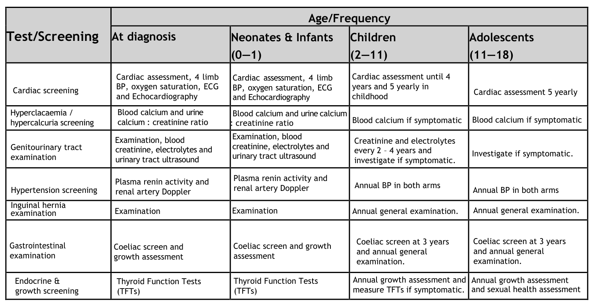

## Question

# Disease Characteristics Research Template

## Target Disease
- **Disease Name:** Williams Syndrome
- **MONDO ID:**  (if available)
- **Category:** Mendelian

## Research Objectives

Please provide a comprehensive research report on **Williams Syndrome** covering all of the
disease characteristics listed below. This report will be used to populate a disease knowledge
base entry. Be thorough and cite primary literature (PMID preferred) for all claims.

For each section, **suggested databases/resources** are listed. These are the first places
you should search for information on each topic.

---

### 1. Disease Information
> **Search first:** OMIM, Orphanet, ICD-10/ICD-11, MeSH, PubMed

- What is the disease? Provide a concise overview.
- What are the key identifiers? (OMIM, Orphanet, ICD-10/ICD-11, MeSH, Mondo)
- What are the common synonyms and alternative names?
- Is the information derived from individual patients (e.g., EHR) or aggregated disease-level resources?

### 2. Etiology

- **Disease Causal Factors**: What are the primary causes? (genetic, environmental, infectious, mechanistic)
- **Risk Factors**:
  > **Search first:** PubMed, Cochrane Library, UpToDate, clinical guidelines, ClinVar, ClinGen, GWAS Catalog, PheGenI, CTD, CDC, WHO, epidemiological databases
  - Genetic risk factors (causal variants, susceptibility loci, modifier genes)
  - Environmental risk factors (toxins, lifestyle, occupational exposures, age, sex, family history)
- **Protective Factors**:
  > **Search first:** PubMed, Cochrane Library, clinical trial databases, GWAS Catalog, gnomAD, WHO, CDC, nutrition databases
  - Genetic protective factors (protective variants, modifier alleles)
  - Environmental protective factors (diet, lifestyle, exposures that reduce risk)
- **Gene-Environment Interactions**: How do genetic and environmental factors interact to influence disease?
  > **Search first:** CTD, PubMed, PheGenI, GxE databases

### 3. Phenotypes
> **Search first:** HPO (Human Phenotype Ontology), OMIM, Orphanet, PubMed, clinicaltrials.gov, MedDRA, SNOMED CT, DECIPHER, LOINC

For each phenotype, provide:
- **Phenotype type**: symptoms, clinical signs, physical manifestations, behavioral changes, or laboratory abnormalities
  > For symptoms/signs: HPO, OMIM, Orphanet, PubMed
  > For behavioral changes: HPO, DSM, RDoC (Research Domain Criteria), PubMed
  > For laboratory abnormalities: LOINC, SNOMED CT, LabTests Online, PubMed
- **Phenotype characteristics**:
  > **Search first:** OMIM, Orphanet, HPO, PubMed
  - Age of symptom onset (neonatal, childhood, adult-onset, late-onset)
  - Symptom severity (mild, moderate, severe, variable)
  - Symptom progression (stable, progressive, episodic, fluctuating)
  - Frequency among affected individuals (percentage or qualitative)
- **Quality of life impact**: Effects on daily functioning and well-being (per-phenotype when possible)
  > **Search first:** EQ-5D database, SF-36, WHO QOL databases, PubMed
- Suggest HPO (Human Phenotype Ontology) terms for each phenotype

### 4. Genetic/Molecular Information

- **Causal Genes**: Gene mutations or chromosomal abnormalities responsible for disease (gene symbols, OMIM IDs)
  > **Search first:** OMIM, ClinVar, HGMD, Ensembl, NCBI Gene
- **Pathogenic Variants**:
  - Affected genes (gene symbols, HGNC IDs)
    > **Search first:** OMIM, NCBI Gene, Ensembl, HGNC, UniProt, GeneCards
  - Variant classification (pathogenic, likely pathogenic, VUS per ACMG/AMP guidelines)
    > **Search first:** ClinVar, ClinGen, ACMG/AMP guidelines, VarSome
  - Variant type/class (missense, frameshift, nonsense, splice-site, structural)
  - Allele frequency in population databases
    > **Search first:** gnomAD, 1000 Genomes, ExAC, TOPMed, dbSNP
  - Somatic vs germline origin
    > **Search first:** COSMIC (somatic), ClinVar, ICGC, TCGA
  - Functional consequences (loss of function, gain of function, dominant negative)
- **Modifier Genes**: Genes that modify disease severity or expression
- **Epigenetic Information**: DNA methylation, histone modifications, chromatin changes affecting disease
  > **Search first:** ENCODE, Roadmap Epigenomics, MethBase, DiseaseMeth
- **Chromosomal Abnormalities**: Large-scale genetic changes (aneuploidy, translocations, inversions)
  > **Search first:** DECIPHER, ClinVar, ECARUCA, UCSC Genome Browser

### 5. Environmental Information

- **Environmental Factors**: Non-genetic contributing factors (toxins, radiation, pollution, occupational exposure)
  > **Search first:** CTD (Comparative Toxicogenomics Database), TOXNET, PubMed, EPA databases
- **Lifestyle Factors**: Behavioral factors (smoking, diet, exercise, alcohol consumption)
  > **Search first:** CDC databases, WHO, PubMed, NHANES
- **Infectious Agents**: If applicable, pathogens causing or triggering disease (bacteria, viruses, fungi, parasites)
  > **Search first:** NCBI Taxonomy, ViPR, BV-BRC, MicrobeDB, GIDEON

### 6. Mechanism / Pathophysiology

- **Molecular Pathways**: Specific signaling cascades or biochemical pathways involved (Wnt, MAPK, mTOR, PI3K-AKT, etc.)
  > **Search first:** KEGG, Reactome, WikiPathways, PathBank, BioCyc
- **Cellular Processes**: Cell-level mechanisms (apoptosis, autophagy, cell cycle dysregulation, inflammation, etc.)
  > **Search first:** Gene Ontology (GO), Reactome, KEGG, PubMed
- **Protein Dysfunction**: How protein structure or function is altered (misfolding, aggregation, loss of function, gain of function)
  > **Search first:** UniProt, PDB (Protein Data Bank), InterPro, Pfam, AlphaFold
- **Metabolic Changes**: Alterations in metabolic processes (energy metabolism, lipid metabolism, amino acid metabolism)
  > **Search first:** KEGG, BioCyc, HMDB (Human Metabolome Database), BRENDA
- **Immune System Involvement**: Role of immune response (autoimmunity, immunodeficiency, chronic inflammation)
  > **Search first:** ImmPort, Immunome Database, IEDB, Gene Ontology
- **Tissue Damage Mechanisms**: How tissues/ are injured (oxidative stress, ischemia, fibrosis, necrosis)
  > **Search first:** PubMed, Gene Ontology, Reactome
- **Biochemical Abnormalities**: Specific molecular defects (enzyme deficiencies, receptor dysfunction, ion channel defects)
  > **Search first:** BRENDA, UniProt, KEGG, OMIM, PubMed
- **Epigenetic Changes**: DNA methylation, histone modifications affecting gene expression in disease
  > **Search first:** ENCODE, Roadmap Epigenomics, MethBase, DiseaseMeth
- **Molecular Profiling** (if available):
  - Transcriptomics/gene expression changes
    > **Search first:** GEO (Gene Expression Omnibus), ArrayExpress, GTEx, Human Cell Atlas, SRA
  - Proteomics findings
    > **Search first:** PRIDE, ProteomeXchange, Human Protein Atlas, STRING, BioGRID
  - Metabolomics signatures
    > **Search first:** MetaboLights, Metabolomics Workbench, HMDB, METLIN
  - Lipidomics alterations
    > **Search first:** LIPID MAPS, SwissLipids, LipidHome, Metabolomics Workbench
  - Genomic structural features
    > **Search first:** UCSC Genome Browser, Ensembl, NCBI, dbVar, DGV
- **Advanced Technologies** (if applicable):
  - Single-cell analysis findings (cell-type specific mechanisms, cellular heterogeneity)
    > **Search first:** Human Cell Atlas, Single Cell Portal, GEO, CELLxGENE
  - Spatial transcriptomics findings
    > **Search first:** GEO, Spatial Research, Vizgen, 10x Genomics data
  - Multi-omics integration results
    > **Search first:** TCGA, ICGC, cBioPortal, LinkedOmics, PubMed
  - Functional genomics screens (CRISPR, RNAi)
    > **Search first:** DepMap, GenomeRNAi, PubMed, BioGRID ORCS

For each mechanism, describe:
- The causal chain from initial trigger to clinical manifestation
- Which mechanisms are upstream vs downstream
- What cell types and biological processes are involved
- Suggest GO terms for biological processes and CL terms for cell types

### 7. Anatomical Structures Affected

- **Organ Level**:
  - Primary organs directly affected
  - Secondary organ involvement (complications, secondary effects)
  - Body systems involved (cardiovascular, nervous, digestive, respiratory, endocrine, etc.)
  > **Search first:** Uberon, FMA (Foundational Model of Anatomy), OMIM, HPO, ICD-11, MeSH, SNOMED CT
- **Tissue and Cell Level**:
  - Specific tissue types affected (epithelial, connective, muscle, nervous)
  - Specific cell populations targeted (with Cell Ontology terms)
  > **Search first:** Uberon, Human Protein Atlas, Cell Ontology, Human Cell Atlas, CellMarker, PanglaoDB
- **Subcellular Level**:
  - Cellular compartments involved (mitochondria, nucleus, ER, lysosomes) (with GO Cellular Component terms)
  > **Search first:** Gene Ontology (Cellular Component), UniProt, Human Protein Atlas
- **Localization**:
  - Specific anatomical sites (with UBERON terms)
    > **Search first:** FMA, Uberon, NeuroNames (for brain), SNOMED CT
  - Lateralization (unilateral, bilateral, asymmetric)
    > **Search first:** HPO, clinical literature, imaging databases

### 8. Temporal Development

- **Onset**:
  - Typical age of onset (congenital, pediatric, adult, geriatric)
  - Onset pattern (acute, subacute, chronic, insidious)
  > **Search first:** OMIM, Orphanet, HPO, PubMed
- **Progression**:
  - Disease stages (early, intermediate, advanced, end-stage)
    > **Search first:** Cancer Staging Manual (AJCC), WHO classifications, PubMed
  - Progression rate (rapid, slow, variable)
  - Disease course pattern (episodic, relapsing-remitting, progressive, stable)
  - Disease duration (self-limited, chronic lifelong)
  > **Search first:** Disease registries, longitudinal cohort databases, natural history studies, PubMed, Orphanet, OMIM
- **Patterns**:
  - Remission patterns (spontaneous, treatment-induced)
    > **Search first:** Clinical trial databases, disease registries, PubMed
  - Critical periods (time windows of vulnerability or opportunity for intervention)
    > **Search first:** PubMed, developmental biology databases, clinical guidelines

### 9. Inheritance and Population

- **Epidemiology**:
  - Prevalence (cases per 100,000 at given time)
  - Incidence (new cases per 100,000 per year)
  > **Search first:** Orphanet, CDC, WHO, GBD (Global Burden of Disease), national registries, SEER, disease registries
- **For Genetic Etiology**:
  - Inheritance pattern (AD, AR, X-linked, mitochondrial, multifactorial, polygenic)
    > **Search first:** OMIM, Orphanet, ClinVar, GTR (Genetic Testing Registry)
  - Penetrance (complete, incomplete, age-dependent)
    > **Search first:** ClinVar, OMIM, PubMed, ClinGen
  - Expressivity (variable, consistent)
    > **Search first:** OMIM, ClinVar, PubMed
  - Genetic anticipation (increasing severity in successive generations)
    > **Search first:** OMIM, PubMed (especially for repeat expansion disorders)
  - Germline mosaicism
    > **Search first:** ClinVar, OMIM, genetic counseling literature, PubMed
  - Founder effects (population-specific mutations)
    > **Search first:** gnomAD, population genetics databases, PubMed
  - Consanguinity role
    > **Search first:** OMIM, population studies, genetic counseling resources
  - Carrier frequency
    > **Search first:** gnomAD, carrier screening databases, GeneReviews, GTR
- **Population Demographics**:
  - Affected populations (ethnic or demographic groups with higher prevalence)
    > **Search first:** gnomAD, 1000 Genomes, PAGE Study, PubMed, population registries
  - Geographic distribution (endemic areas, regional variation)
    > **Search first:** WHO, CDC, GBD, Orphanet, geographic epidemiology databases
  - Geographic distribution of specific variants
  - Sex ratio (male:female)
    > **Search first:** Disease registries, OMIM, PubMed, epidemiological databases
  - Age distribution of affected individuals
    > **Search first:** CDC, disease registries, SEER, Orphanet

### 10. Diagnostics

- **Clinical Tests**:
  - Laboratory tests (blood, urine, tissue chemistry, specific enzyme assays)
    > **Search first:** LOINC, LabTests Online, PubMed
  - Biomarkers (proteins, metabolites, genetic markers, circulating biomarkers)
    > **Search first:** FDA Biomarker List, BEST (Biomarkers, EndpointS, and other Tools), PubMed
  - Imaging studies (X-ray, CT, MRI, PET, ultrasound)
    > **Search first:** RadLex, DICOM, Radiopaedia, imaging databases
  - Functional tests (pulmonary function, cardiac stress tests)
    > **Search first:** LOINC, clinical guidelines, PubMed
  - Electrophysiology (EEG, EMG, ECG, nerve conduction studies)
    > **Search first:** LOINC, clinical neurophysiology databases, PubMed
  - Biopsy findings (histopathology, immunohistochemistry)
    > **Search first:** SNOMED CT, College of American Pathologists resources, PubMed
  - Pathology findings (microscopic examination)
    > **Search first:** SNOMED CT, Digital Pathology databases, PubMed
- **Genetic Testing**:
  > **Search first:** GTR (Genetic Testing Registry), GeneReviews, ClinGen
  - Overview of recommended genetic testing approach
  - Whole genome sequencing (WGS) utility
    > **Search first:** GTR, ClinVar, GEL (Genomics England), gnomAD
  - Whole exome sequencing (WES) utility
    > **Search first:** GTR, ClinVar, OMIM, GeneMatcher
  - Gene panels (which panels, which genes)
    > **Search first:** GTR, ClinVar, laboratory-specific databases
  - Single gene testing
    > **Search first:** GTR, ClinVar, OMIM, GeneReviews
  - Chromosomal microarray (CMA)
    > **Search first:** DECIPHER, ClinVar, dbVar, ECARUCA
  - Karyotyping
    > **Search first:** Chromosome Abnormality Database, ClinVar, cytogenetics resources
  - FISH
    > **Search first:** ClinVar, cytogenetics databases, PubMed
  - Mitochondrial DNA testing
    > **Search first:** MITOMAP, MSeqDR, ClinVar, GTR
  - Repeat expansion testing
    > **Search first:** GTR, ClinVar, repeat expansion databases, PubMed
- **Omics-Based Diagnostics** (if applicable):
  - RNA sequencing / transcriptomics
    > **Search first:** GEO, ArrayExpress, GTEx, RNA-seq databases
  - Proteomics
    > **Search first:** PRIDE, ProteomeXchange, FDA Biomarker database
  - Metabolomics
    > **Search first:** MetaboLights, Metabolomics Workbench, HMDB
  - Epigenomics
    > **Search first:** GEO, ENCODE, Roadmap Epigenomics, MethBase
  - Liquid biopsy
    > **Search first:** COSMIC, ClinVar, liquid biopsy databases, PubMed
- **Clinical Criteria**:
  - Standardized diagnostic criteria (DSM, ICD, society guidelines)
    > **Search first:** DSM-5, ICD-11, clinical society guidelines, UpToDate
  - Differential diagnosis (other conditions to rule out, with distinguishing features)
    > **Search first:** DynaMed, UpToDate, clinical decision support systems
- **Screening**:
  - Screening methods for asymptomatic individuals (newborn screening, carrier screening, cascade screening)
    > **Search first:** ACMG recommendations, CDC newborn screening, GTR

### 11. Outcome/Prognosis

- **Survival and Mortality**:
  - Survival rate (5-year, 10-year, overall)
    > **Search first:** SEER, cancer registries, disease-specific registries, PubMed
  - Life expectancy (with and without treatment if applicable)
    > **Search first:** Orphanet, disease registries, actuarial databases, PubMed
  - Mortality rate
    > **Search first:** CDC, WHO, GBD, national mortality databases
  - Disease-specific mortality (deaths directly attributable to disease)
    > **Search first:** Disease registries, CDC Wonder, GBD, PubMed
- **Morbidity and Function**:
  - Morbidity (disease-related disability and health impacts)
    > **Search first:** GBD, WHO, disability databases, PubMed
  - Disability outcomes (long-term functional impairments)
    > **Search first:** ICF (International Classification of Functioning), disability registries
  - Quality of life measures (EQ-5D, SF-36, PROMIS, disease-specific tools)
    > **Search first:** EQ-5D database, SF-36, PROMIS, PubMed
- **Disease Course**:
  - Complications (secondary problems: infections, organ failure, etc.)
    > **Search first:** ICD codes, disease registries, clinical databases, PubMed
  - Recovery potential (likelihood and extent of recovery, with vs without treatment)
    > **Search first:** Natural history studies, rehabilitation databases, PubMed
- **Prediction**:
  - Prognostic factors (age, disease severity, biomarkers, treatment response)
    > **Search first:** Prognostic models databases, clinical calculators, PubMed
  - Prognostic biomarkers (molecular markers predicting disease course)
    > **Search first:** FDA Biomarker database, PubMed, cancer prognostic databases

### 12. Treatment

- **Pharmacotherapy**:
  - Pharmacological treatments (drug names, drug classes, mechanisms of action)
    > **Search first:** DrugBank, RxNorm, ATC classification, DailyMed, FDA databases
  - Pharmacogenomics (how genetic variants affect drug metabolism, efficacy, toxicity)
    > **Search first:** PharmGKB, CPIC (Clinical Pharmacogenetics), FDA Table of PGx Biomarkers
- **Advanced Therapeutics**:
  - Gene therapy (viral vectors, CRISPR, gene replacement, gene editing)
    > **Search first:** ClinicalTrials.gov, FDA gene therapy database, ASGCT resources
  - Cell therapy (stem cell transplant, CAR-T, cellular therapeutics)
    > **Search first:** ClinicalTrials.gov, FDA cell therapy database, FACT standards
  - RNA-based therapies (ASOs, siRNA, mRNA therapies)
    > **Search first:** ClinicalTrials.gov, FDA approvals, PubMed
  - Targeted therapies (treatments directed at specific molecular targets)
    > **Search first:** My Cancer Genome, OncoKB, ClinicalTrials.gov, FDA approvals
  - Immunotherapies (checkpoint inhibitors, monoclonal antibodies)
    > **Search first:** Cancer Immunotherapy Database, FDA approvals, ClinicalTrials.gov
- **Surgical and Interventional**:
  - Surgical interventions (types of surgery, timing, outcomes)
    > **Search first:** CPT codes, surgical registries, clinical guidelines, PubMed
- **Supportive and Rehabilitative**:
  - Supportive care (symptom management, pain control, nutrition)
    > **Search first:** Clinical guidelines, Cochrane Library, PubMed
  - Rehabilitation (physical therapy, occupational therapy, speech therapy)
    > **Search first:** Rehabilitation medicine databases, clinical guidelines, PubMed
- **Experimental**:
  - Experimental treatments in clinical trials (with NCT identifiers if available)
    > **Search first:** ClinicalTrials.gov, EU Clinical Trials Register, WHO ICTRP
- **Treatment Outcomes**:
  - Treatment response rates
    > **Search first:** Clinical trial databases, FDA reviews, systematic reviews, PubMed
  - Side effects and adverse events
    > **Search first:** FDA Adverse Event Reporting System (FAERS), MedWatch, PubMed
- **Treatment Strategy**:
  - Treatment algorithms (clinical pathways, decision trees)
    > **Search first:** Clinical practice guidelines, NCCN Guidelines, UpToDate
  - Combination therapies
    > **Search first:** ClinicalTrials.gov, treatment guidelines, PubMed
  - Personalized medicine approaches (genotype-guided treatment)
    > **Search first:** My Cancer Genome, CIViC, PharmGKB, precision medicine databases

For each treatment, suggest MAXO (Medical Action Ontology) terms where applicable.

### 13. Prevention

- **Prevention Levels**:
  - Primary prevention (preventing disease occurrence: vaccination, risk factor modification)
    > **Search first:** CDC, WHO, USPSTF recommendations, Cochrane Library
  - Secondary prevention (early detection and treatment: screening programs, early intervention)
    > **Search first:** USPSTF, CDC screening guidelines, WHO
  - Tertiary prevention (preventing complications in those with disease)
    > **Search first:** Clinical guidelines, disease management protocols, PubMed
- **Immunization**: Vaccine strategies (if applicable)
  > **Search first:** CDC vaccine schedules, WHO immunization, FDA vaccine database
- **Screening and Early Detection**:
  - Screening programs (population-based: newborn screening, cancer screening)
    > **Search first:** CDC screening programs, USPSTF, cancer screening databases
  - Genetic screening (carrier screening, preimplantation genetic diagnosis, prenatal testing)
    > **Search first:** ACMG recommendations, ACOG guidelines, GTR
  - Risk stratification (identifying high-risk individuals for targeted prevention)
    > **Search first:** Risk prediction models, clinical calculators, PubMed
- **Behavioral Interventions**: Lifestyle modifications to reduce risk
  > **Search first:** CDC, WHO, behavioral intervention databases, Cochrane Library
- **Counseling**: Genetic counseling (risk assessment, family planning guidance)
  > **Search first:** NSGC resources, ACMG guidelines, GeneReviews
- **Public Health**:
  - Public health interventions (sanitation, vector control, health education)
    > **Search first:** CDC, WHO, public health databases, PubMed
  - Environmental interventions (reducing environmental risk factors)
    > **Search first:** EPA databases, WHO environmental health, PubMed
- **Prophylaxis**: Preventive medications or procedures
  > **Search first:** Clinical guidelines, FDA approvals, PubMed

### 14. Other Species / Natural Disease

- **Taxonomy**: Species affected (with NCBI Taxon identifiers)
  > **Search first:** NCBI Taxonomy
- **Breed**: Specific breeds affected (with VBO identifiers if applicable)
  > **Search first:** VBO (Vertebrate Breed Ontology)
- **Gene**: Orthologous genes in other species (with NCBI Gene IDs)
  > **Search first:** NCBI Gene
- **Natural Disease**:
  - Naturally occurring disease in other species (companion animals, wildlife)
    > **Search first:** OMIA (Online Mendelian Inheritance in Animals), VetCompass, PubMed
  - Veterinary relevance and importance in animal health
    > **Search first:** OMIA, veterinary databases, PubMed
- **Comparative Biology**:
  - Comparative pathology (similarities and differences across species)
    > **Search first:** OMIA, comparative pathology databases, PubMed
  - Evolutionary conservation of disease mechanisms
    > **Search first:** HomoloGene, OrthoMCL, Alliance of Genome Resources
- **Transmission** (if applicable):
  - Zoonotic potential
    > **Search first:** CDC zoonotic diseases, WHO zoonoses, GIDEON
  - Cross-species susceptibility
    > **Search first:** NCBI Taxonomy, veterinary databases, PubMed

### 15. Model Organisms

- **Model Types**:
  - Model organism type (mammalian, invertebrate, cellular, in vitro)
    > **Search first:** Alliance of Genome Resources, model organism databases
  - Specific model systems (mouse, rat, zebrafish, Drosophila, C. elegans, yeast, cell lines, organoids, iPSCs)
    > **Search first:** MGI, RGD, ZFIN, FlyBase, WormBase, SGD, ATCC, Cellosaurus
  - Induced models (drug treatment, surgical intervention, environmental manipulation)
    > **Search first:** MGI, model organism databases, PubMed
- **Genetic Models**:
  - Types available (knockout, knock-in, transgenic, conditional, humanized)
    > **Search first:** MGI, IMPC, KOMP, EuMMCR, IMSR
- **Model Characteristics**:
  - Phenotype recapitulation (how well model reproduces human disease features)
    > **Search first:** Model organism databases, comparative studies, PubMed
  - Model limitations (aspects of human disease not captured)
    > **Search first:** Model organism databases, PubMed, review articles
- **Applications**:
  - Research applications (what aspects of disease can be studied)
    > **Search first:** Model organism databases, PubMed
- **Resources**:
  - Model databases
    > **Search first:** MGI, RGD, ZFIN, FlyBase, WormBase, IMSR, EMMA, MMRRC

---

## Citation Requirements

- Cite primary literature (PMID preferred) for all mechanistic and clinical claims
- Prioritize recent reviews and landmark papers
- Include direct quotes from abstracts where possible to support key statements
- Distinguish evidence source types: human clinical, model organism, in vitro, computational

## Output Format

Structure your response as a comprehensive narrative organized by the sections above.
For each section, provide:
- Factual content with specific details (numbers, percentages, gene names, variant nomenclature)
- Ontology term suggestions (HPO, GO, CL, UBERON, CHEBI, MAXO, MONDO) where applicable
- Evidence citations with PMIDs
- Direct quotes from abstracts to support key claims
- Clear indication when information is not available or not applicable for this disease

This report will be used to populate a disease knowledge base entry with:
- Pathophysiology descriptions with causal chains
- Gene/protein annotations (HGNC, GO terms)
- Phenotype associations (HP terms) with frequencies
- Cell type involvement (CL terms)
- Anatomical locations (UBERON terms)
- Chemical entities (CHEBI terms)
- Treatment annotations (MAXO terms)
- Evidence items with PMIDs and exact abstract quotes
- Epidemiology, prognosis, diagnostic, and prevention information
- Animal model descriptions with phenotype recapitulation details

## Output

Question: You are an expert researcher providing comprehensive, well-cited information.

Provide detailed information focusing on:
1. Key concepts and definitions with current understanding
2. Recent developments and latest research (prioritize 2023-2024 sources)
3. Current applications and real-world implementations
4. Expert opinions and analysis from authoritative sources
5. Relevant statistics and data from recent studies

Format as a comprehensive research report with proper citations. Include URLs and publication dates where available.
Always prioritize recent, authoritative sources and provide specific citations for all major claims.

# Disease Characteristics Research Template

## Target Disease
- **Disease Name:** Williams Syndrome
- **MONDO ID:**  (if available)
- **Category:** Mendelian

## Research Objectives

Please provide a comprehensive research report on **Williams Syndrome** covering all of the
disease characteristics listed below. This report will be used to populate a disease knowledge
base entry. Be thorough and cite primary literature (PMID preferred) for all claims.

For each section, **suggested databases/resources** are listed. These are the first places
you should search for information on each topic.

---

### 1. Disease Information
> **Search first:** OMIM, Orphanet, ICD-10/ICD-11, MeSH, PubMed

- What is the disease? Provide a concise overview.
- What are the key identifiers? (OMIM, Orphanet, ICD-10/ICD-11, MeSH, Mondo)
- What are the common synonyms and alternative names?
- Is the information derived from individual patients (e.g., EHR) or aggregated disease-level resources?

### 2. Etiology

- **Disease Causal Factors**: What are the primary causes? (genetic, environmental, infectious, mechanistic)
- **Risk Factors**:
  > **Search first:** PubMed, Cochrane Library, UpToDate, clinical guidelines, ClinVar, ClinGen, GWAS Catalog, PheGenI, CTD, CDC, WHO, epidemiological databases
  - Genetic risk factors (causal variants, susceptibility loci, modifier genes)
  - Environmental risk factors (toxins, lifestyle, occupational exposures, age, sex, family history)
- **Protective Factors**:
  > **Search first:** PubMed, Cochrane Library, clinical trial databases, GWAS Catalog, gnomAD, WHO, CDC, nutrition databases
  - Genetic protective factors (protective variants, modifier alleles)
  - Environmental protective factors (diet, lifestyle, exposures that reduce risk)
- **Gene-Environment Interactions**: How do genetic and environmental factors interact to influence disease?
  > **Search first:** CTD, PubMed, PheGenI, GxE databases

### 3. Phenotypes
> **Search first:** HPO (Human Phenotype Ontology), OMIM, Orphanet, PubMed, clinicaltrials.gov, MedDRA, SNOMED CT, DECIPHER, LOINC

For each phenotype, provide:
- **Phenotype type**: symptoms, clinical signs, physical manifestations, behavioral changes, or laboratory abnormalities
  > For symptoms/signs: HPO, OMIM, Orphanet, PubMed
  > For behavioral changes: HPO, DSM, RDoC (Research Domain Criteria), PubMed
  > For laboratory abnormalities: LOINC, SNOMED CT, LabTests Online, PubMed
- **Phenotype characteristics**:
  > **Search first:** OMIM, Orphanet, HPO, PubMed
  - Age of symptom onset (neonatal, childhood, adult-onset, late-onset)
  - Symptom severity (mild, moderate, severe, variable)
  - Symptom progression (stable, progressive, episodic, fluctuating)
  - Frequency among affected individuals (percentage or qualitative)
- **Quality of life impact**: Effects on daily functioning and well-being (per-phenotype when possible)
  > **Search first:** EQ-5D database, SF-36, WHO QOL databases, PubMed
- Suggest HPO (Human Phenotype Ontology) terms for each phenotype

### 4. Genetic/Molecular Information

- **Causal Genes**: Gene mutations or chromosomal abnormalities responsible for disease (gene symbols, OMIM IDs)
  > **Search first:** OMIM, ClinVar, HGMD, Ensembl, NCBI Gene
- **Pathogenic Variants**:
  - Affected genes (gene symbols, HGNC IDs)
    > **Search first:** OMIM, NCBI Gene, Ensembl, HGNC, UniProt, GeneCards
  - Variant classification (pathogenic, likely pathogenic, VUS per ACMG/AMP guidelines)
    > **Search first:** ClinVar, ClinGen, ACMG/AMP guidelines, VarSome
  - Variant type/class (missense, frameshift, nonsense, splice-site, structural)
  - Allele frequency in population databases
    > **Search first:** gnomAD, 1000 Genomes, ExAC, TOPMed, dbSNP
  - Somatic vs germline origin
    > **Search first:** COSMIC (somatic), ClinVar, ICGC, TCGA
  - Functional consequences (loss of function, gain of function, dominant negative)
- **Modifier Genes**: Genes that modify disease severity or expression
- **Epigenetic Information**: DNA methylation, histone modifications, chromatin changes affecting disease
  > **Search first:** ENCODE, Roadmap Epigenomics, MethBase, DiseaseMeth
- **Chromosomal Abnormalities**: Large-scale genetic changes (aneuploidy, translocations, inversions)
  > **Search first:** DECIPHER, ClinVar, ECARUCA, UCSC Genome Browser

### 5. Environmental Information

- **Environmental Factors**: Non-genetic contributing factors (toxins, radiation, pollution, occupational exposure)
  > **Search first:** CTD (Comparative Toxicogenomics Database), TOXNET, PubMed, EPA databases
- **Lifestyle Factors**: Behavioral factors (smoking, diet, exercise, alcohol consumption)
  > **Search first:** CDC databases, WHO, PubMed, NHANES
- **Infectious Agents**: If applicable, pathogens causing or triggering disease (bacteria, viruses, fungi, parasites)
  > **Search first:** NCBI Taxonomy, ViPR, BV-BRC, MicrobeDB, GIDEON

### 6. Mechanism / Pathophysiology

- **Molecular Pathways**: Specific signaling cascades or biochemical pathways involved (Wnt, MAPK, mTOR, PI3K-AKT, etc.)
  > **Search first:** KEGG, Reactome, WikiPathways, PathBank, BioCyc
- **Cellular Processes**: Cell-level mechanisms (apoptosis, autophagy, cell cycle dysregulation, inflammation, etc.)
  > **Search first:** Gene Ontology (GO), Reactome, KEGG, PubMed
- **Protein Dysfunction**: How protein structure or function is altered (misfolding, aggregation, loss of function, gain of function)
  > **Search first:** UniProt, PDB (Protein Data Bank), InterPro, Pfam, AlphaFold
- **Metabolic Changes**: Alterations in metabolic processes (energy metabolism, lipid metabolism, amino acid metabolism)
  > **Search first:** KEGG, BioCyc, HMDB (Human Metabolome Database), BRENDA
- **Immune System Involvement**: Role of immune response (autoimmunity, immunodeficiency, chronic inflammation)
  > **Search first:** ImmPort, Immunome Database, IEDB, Gene Ontology
- **Tissue Damage Mechanisms**: How tissues/ are injured (oxidative stress, ischemia, fibrosis, necrosis)
  > **Search first:** PubMed, Gene Ontology, Reactome
- **Biochemical Abnormalities**: Specific molecular defects (enzyme deficiencies, receptor dysfunction, ion channel defects)
  > **Search first:** BRENDA, UniProt, KEGG, OMIM, PubMed
- **Epigenetic Changes**: DNA methylation, histone modifications affecting gene expression in disease
  > **Search first:** ENCODE, Roadmap Epigenomics, MethBase, DiseaseMeth
- **Molecular Profiling** (if available):
  - Transcriptomics/gene expression changes
    > **Search first:** GEO (Gene Expression Omnibus), ArrayExpress, GTEx, Human Cell Atlas, SRA
  - Proteomics findings
    > **Search first:** PRIDE, ProteomeXchange, Human Protein Atlas, STRING, BioGRID
  - Metabolomics signatures
    > **Search first:** MetaboLights, Metabolomics Workbench, HMDB, METLIN
  - Lipidomics alterations
    > **Search first:** LIPID MAPS, SwissLipids, LipidHome, Metabolomics Workbench
  - Genomic structural features
    > **Search first:** UCSC Genome Browser, Ensembl, NCBI, dbVar, DGV
- **Advanced Technologies** (if applicable):
  - Single-cell analysis findings (cell-type specific mechanisms, cellular heterogeneity)
    > **Search first:** Human Cell Atlas, Single Cell Portal, GEO, CELLxGENE
  - Spatial transcriptomics findings
    > **Search first:** GEO, Spatial Research, Vizgen, 10x Genomics data
  - Multi-omics integration results
    > **Search first:** TCGA, ICGC, cBioPortal, LinkedOmics, PubMed
  - Functional genomics screens (CRISPR, RNAi)
    > **Search first:** DepMap, GenomeRNAi, PubMed, BioGRID ORCS

For each mechanism, describe:
- The causal chain from initial trigger to clinical manifestation
- Which mechanisms are upstream vs downstream
- What cell types and biological processes are involved
- Suggest GO terms for biological processes and CL terms for cell types

### 7. Anatomical Structures Affected

- **Organ Level**:
  - Primary organs directly affected
  - Secondary organ involvement (complications, secondary effects)
  - Body systems involved (cardiovascular, nervous, digestive, respiratory, endocrine, etc.)
  > **Search first:** Uberon, FMA (Foundational Model of Anatomy), OMIM, HPO, ICD-11, MeSH, SNOMED CT
- **Tissue and Cell Level**:
  - Specific tissue types affected (epithelial, connective, muscle, nervous)
  - Specific cell populations targeted (with Cell Ontology terms)
  > **Search first:** Uberon, Human Protein Atlas, Cell Ontology, Human Cell Atlas, CellMarker, PanglaoDB
- **Subcellular Level**:
  - Cellular compartments involved (mitochondria, nucleus, ER, lysosomes) (with GO Cellular Component terms)
  > **Search first:** Gene Ontology (Cellular Component), UniProt, Human Protein Atlas
- **Localization**:
  - Specific anatomical sites (with UBERON terms)
    > **Search first:** FMA, Uberon, NeuroNames (for brain), SNOMED CT
  - Lateralization (unilateral, bilateral, asymmetric)
    > **Search first:** HPO, clinical literature, imaging databases

### 8. Temporal Development

- **Onset**:
  - Typical age of onset (congenital, pediatric, adult, geriatric)
  - Onset pattern (acute, subacute, chronic, insidious)
  > **Search first:** OMIM, Orphanet, HPO, PubMed
- **Progression**:
  - Disease stages (early, intermediate, advanced, end-stage)
    > **Search first:** Cancer Staging Manual (AJCC), WHO classifications, PubMed
  - Progression rate (rapid, slow, variable)
  - Disease course pattern (episodic, relapsing-remitting, progressive, stable)
  - Disease duration (self-limited, chronic lifelong)
  > **Search first:** Disease registries, longitudinal cohort databases, natural history studies, PubMed, Orphanet, OMIM
- **Patterns**:
  - Remission patterns (spontaneous, treatment-induced)
    > **Search first:** Clinical trial databases, disease registries, PubMed
  - Critical periods (time windows of vulnerability or opportunity for intervention)
    > **Search first:** PubMed, developmental biology databases, clinical guidelines

### 9. Inheritance and Population

- **Epidemiology**:
  - Prevalence (cases per 100,000 at given time)
  - Incidence (new cases per 100,000 per year)
  > **Search first:** Orphanet, CDC, WHO, GBD (Global Burden of Disease), national registries, SEER, disease registries
- **For Genetic Etiology**:
  - Inheritance pattern (AD, AR, X-linked, mitochondrial, multifactorial, polygenic)
    > **Search first:** OMIM, Orphanet, ClinVar, GTR (Genetic Testing Registry)
  - Penetrance (complete, incomplete, age-dependent)
    > **Search first:** ClinVar, OMIM, PubMed, ClinGen
  - Expressivity (variable, consistent)
    > **Search first:** OMIM, ClinVar, PubMed
  - Genetic anticipation (increasing severity in successive generations)
    > **Search first:** OMIM, PubMed (especially for repeat expansion disorders)
  - Germline mosaicism
    > **Search first:** ClinVar, OMIM, genetic counseling literature, PubMed
  - Founder effects (population-specific mutations)
    > **Search first:** gnomAD, population genetics databases, PubMed
  - Consanguinity role
    > **Search first:** OMIM, population studies, genetic counseling resources
  - Carrier frequency
    > **Search first:** gnomAD, carrier screening databases, GeneReviews, GTR
- **Population Demographics**:
  - Affected populations (ethnic or demographic groups with higher prevalence)
    > **Search first:** gnomAD, 1000 Genomes, PAGE Study, PubMed, population registries
  - Geographic distribution (endemic areas, regional variation)
    > **Search first:** WHO, CDC, GBD, Orphanet, geographic epidemiology databases
  - Geographic distribution of specific variants
  - Sex ratio (male:female)
    > **Search first:** Disease registries, OMIM, PubMed, epidemiological databases
  - Age distribution of affected individuals
    > **Search first:** CDC, disease registries, SEER, Orphanet

### 10. Diagnostics

- **Clinical Tests**:
  - Laboratory tests (blood, urine, tissue chemistry, specific enzyme assays)
    > **Search first:** LOINC, LabTests Online, PubMed
  - Biomarkers (proteins, metabolites, genetic markers, circulating biomarkers)
    > **Search first:** FDA Biomarker List, BEST (Biomarkers, EndpointS, and other Tools), PubMed
  - Imaging studies (X-ray, CT, MRI, PET, ultrasound)
    > **Search first:** RadLex, DICOM, Radiopaedia, imaging databases
  - Functional tests (pulmonary function, cardiac stress tests)
    > **Search first:** LOINC, clinical guidelines, PubMed
  - Electrophysiology (EEG, EMG, ECG, nerve conduction studies)
    > **Search first:** LOINC, clinical neurophysiology databases, PubMed
  - Biopsy findings (histopathology, immunohistochemistry)
    > **Search first:** SNOMED CT, College of American Pathologists resources, PubMed
  - Pathology findings (microscopic examination)
    > **Search first:** SNOMED CT, Digital Pathology databases, PubMed
- **Genetic Testing**:
  > **Search first:** GTR (Genetic Testing Registry), GeneReviews, ClinGen
  - Overview of recommended genetic testing approach
  - Whole genome sequencing (WGS) utility
    > **Search first:** GTR, ClinVar, GEL (Genomics England), gnomAD
  - Whole exome sequencing (WES) utility
    > **Search first:** GTR, ClinVar, OMIM, GeneMatcher
  - Gene panels (which panels, which genes)
    > **Search first:** GTR, ClinVar, laboratory-specific databases
  - Single gene testing
    > **Search first:** GTR, ClinVar, OMIM, GeneReviews
  - Chromosomal microarray (CMA)
    > **Search first:** DECIPHER, ClinVar, dbVar, ECARUCA
  - Karyotyping
    > **Search first:** Chromosome Abnormality Database, ClinVar, cytogenetics resources
  - FISH
    > **Search first:** ClinVar, cytogenetics databases, PubMed
  - Mitochondrial DNA testing
    > **Search first:** MITOMAP, MSeqDR, ClinVar, GTR
  - Repeat expansion testing
    > **Search first:** GTR, ClinVar, repeat expansion databases, PubMed
- **Omics-Based Diagnostics** (if applicable):
  - RNA sequencing / transcriptomics
    > **Search first:** GEO, ArrayExpress, GTEx, RNA-seq databases
  - Proteomics
    > **Search first:** PRIDE, ProteomeXchange, FDA Biomarker database
  - Metabolomics
    > **Search first:** MetaboLights, Metabolomics Workbench, HMDB
  - Epigenomics
    > **Search first:** GEO, ENCODE, Roadmap Epigenomics, MethBase
  - Liquid biopsy
    > **Search first:** COSMIC, ClinVar, liquid biopsy databases, PubMed
- **Clinical Criteria**:
  - Standardized diagnostic criteria (DSM, ICD, society guidelines)
    > **Search first:** DSM-5, ICD-11, clinical society guidelines, UpToDate
  - Differential diagnosis (other conditions to rule out, with distinguishing features)
    > **Search first:** DynaMed, UpToDate, clinical decision support systems
- **Screening**:
  - Screening methods for asymptomatic individuals (newborn screening, carrier screening, cascade screening)
    > **Search first:** ACMG recommendations, CDC newborn screening, GTR

### 11. Outcome/Prognosis

- **Survival and Mortality**:
  - Survival rate (5-year, 10-year, overall)
    > **Search first:** SEER, cancer registries, disease-specific registries, PubMed
  - Life expectancy (with and without treatment if applicable)
    > **Search first:** Orphanet, disease registries, actuarial databases, PubMed
  - Mortality rate
    > **Search first:** CDC, WHO, GBD, national mortality databases
  - Disease-specific mortality (deaths directly attributable to disease)
    > **Search first:** Disease registries, CDC Wonder, GBD, PubMed
- **Morbidity and Function**:
  - Morbidity (disease-related disability and health impacts)
    > **Search first:** GBD, WHO, disability databases, PubMed
  - Disability outcomes (long-term functional impairments)
    > **Search first:** ICF (International Classification of Functioning), disability registries
  - Quality of life measures (EQ-5D, SF-36, PROMIS, disease-specific tools)
    > **Search first:** EQ-5D database, SF-36, PROMIS, PubMed
- **Disease Course**:
  - Complications (secondary problems: infections, organ failure, etc.)
    > **Search first:** ICD codes, disease registries, clinical databases, PubMed
  - Recovery potential (likelihood and extent of recovery, with vs without treatment)
    > **Search first:** Natural history studies, rehabilitation databases, PubMed
- **Prediction**:
  - Prognostic factors (age, disease severity, biomarkers, treatment response)
    > **Search first:** Prognostic models databases, clinical calculators, PubMed
  - Prognostic biomarkers (molecular markers predicting disease course)
    > **Search first:** FDA Biomarker database, PubMed, cancer prognostic databases

### 12. Treatment

- **Pharmacotherapy**:
  - Pharmacological treatments (drug names, drug classes, mechanisms of action)
    > **Search first:** DrugBank, RxNorm, ATC classification, DailyMed, FDA databases
  - Pharmacogenomics (how genetic variants affect drug metabolism, efficacy, toxicity)
    > **Search first:** PharmGKB, CPIC (Clinical Pharmacogenetics), FDA Table of PGx Biomarkers
- **Advanced Therapeutics**:
  - Gene therapy (viral vectors, CRISPR, gene replacement, gene editing)
    > **Search first:** ClinicalTrials.gov, FDA gene therapy database, ASGCT resources
  - Cell therapy (stem cell transplant, CAR-T, cellular therapeutics)
    > **Search first:** ClinicalTrials.gov, FDA cell therapy database, FACT standards
  - RNA-based therapies (ASOs, siRNA, mRNA therapies)
    > **Search first:** ClinicalTrials.gov, FDA approvals, PubMed
  - Targeted therapies (treatments directed at specific molecular targets)
    > **Search first:** My Cancer Genome, OncoKB, ClinicalTrials.gov, FDA approvals
  - Immunotherapies (checkpoint inhibitors, monoclonal antibodies)
    > **Search first:** Cancer Immunotherapy Database, FDA approvals, ClinicalTrials.gov
- **Surgical and Interventional**:
  - Surgical interventions (types of surgery, timing, outcomes)
    > **Search first:** CPT codes, surgical registries, clinical guidelines, PubMed
- **Supportive and Rehabilitative**:
  - Supportive care (symptom management, pain control, nutrition)
    > **Search first:** Clinical guidelines, Cochrane Library, PubMed
  - Rehabilitation (physical therapy, occupational therapy, speech therapy)
    > **Search first:** Rehabilitation medicine databases, clinical guidelines, PubMed
- **Experimental**:
  - Experimental treatments in clinical trials (with NCT identifiers if available)
    > **Search first:** ClinicalTrials.gov, EU Clinical Trials Register, WHO ICTRP
- **Treatment Outcomes**:
  - Treatment response rates
    > **Search first:** Clinical trial databases, FDA reviews, systematic reviews, PubMed
  - Side effects and adverse events
    > **Search first:** FDA Adverse Event Reporting System (FAERS), MedWatch, PubMed
- **Treatment Strategy**:
  - Treatment algorithms (clinical pathways, decision trees)
    > **Search first:** Clinical practice guidelines, NCCN Guidelines, UpToDate
  - Combination therapies
    > **Search first:** ClinicalTrials.gov, treatment guidelines, PubMed
  - Personalized medicine approaches (genotype-guided treatment)
    > **Search first:** My Cancer Genome, CIViC, PharmGKB, precision medicine databases

For each treatment, suggest MAXO (Medical Action Ontology) terms where applicable.

### 13. Prevention

- **Prevention Levels**:
  - Primary prevention (preventing disease occurrence: vaccination, risk factor modification)
    > **Search first:** CDC, WHO, USPSTF recommendations, Cochrane Library
  - Secondary prevention (early detection and treatment: screening programs, early intervention)
    > **Search first:** USPSTF, CDC screening guidelines, WHO
  - Tertiary prevention (preventing complications in those with disease)
    > **Search first:** Clinical guidelines, disease management protocols, PubMed
- **Immunization**: Vaccine strategies (if applicable)
  > **Search first:** CDC vaccine schedules, WHO immunization, FDA vaccine database
- **Screening and Early Detection**:
  - Screening programs (population-based: newborn screening, cancer screening)
    > **Search first:** CDC screening programs, USPSTF, cancer screening databases
  - Genetic screening (carrier screening, preimplantation genetic diagnosis, prenatal testing)
    > **Search first:** ACMG recommendations, ACOG guidelines, GTR
  - Risk stratification (identifying high-risk individuals for targeted prevention)
    > **Search first:** Risk prediction models, clinical calculators, PubMed
- **Behavioral Interventions**: Lifestyle modifications to reduce risk
  > **Search first:** CDC, WHO, behavioral intervention databases, Cochrane Library
- **Counseling**: Genetic counseling (risk assessment, family planning guidance)
  > **Search first:** NSGC resources, ACMG guidelines, GeneReviews
- **Public Health**:
  - Public health interventions (sanitation, vector control, health education)
    > **Search first:** CDC, WHO, public health databases, PubMed
  - Environmental interventions (reducing environmental risk factors)
    > **Search first:** EPA databases, WHO environmental health, PubMed
- **Prophylaxis**: Preventive medications or procedures
  > **Search first:** Clinical guidelines, FDA approvals, PubMed

### 14. Other Species / Natural Disease

- **Taxonomy**: Species affected (with NCBI Taxon identifiers)
  > **Search first:** NCBI Taxonomy
- **Breed**: Specific breeds affected (with VBO identifiers if applicable)
  > **Search first:** VBO (Vertebrate Breed Ontology)
- **Gene**: Orthologous genes in other species (with NCBI Gene IDs)
  > **Search first:** NCBI Gene
- **Natural Disease**:
  - Naturally occurring disease in other species (companion animals, wildlife)
    > **Search first:** OMIA (Online Mendelian Inheritance in Animals), VetCompass, PubMed
  - Veterinary relevance and importance in animal health
    > **Search first:** OMIA, veterinary databases, PubMed
- **Comparative Biology**:
  - Comparative pathology (similarities and differences across species)
    > **Search first:** OMIA, comparative pathology databases, PubMed
  - Evolutionary conservation of disease mechanisms
    > **Search first:** HomoloGene, OrthoMCL, Alliance of Genome Resources
- **Transmission** (if applicable):
  - Zoonotic potential
    > **Search first:** CDC zoonotic diseases, WHO zoonoses, GIDEON
  - Cross-species susceptibility
    > **Search first:** NCBI Taxonomy, veterinary databases, PubMed

### 15. Model Organisms

- **Model Types**:
  - Model organism type (mammalian, invertebrate, cellular, in vitro)
    > **Search first:** Alliance of Genome Resources, model organism databases
  - Specific model systems (mouse, rat, zebrafish, Drosophila, C. elegans, yeast, cell lines, organoids, iPSCs)
    > **Search first:** MGI, RGD, ZFIN, FlyBase, WormBase, SGD, ATCC, Cellosaurus
  - Induced models (drug treatment, surgical intervention, environmental manipulation)
    > **Search first:** MGI, model organism databases, PubMed
- **Genetic Models**:
  - Types available (knockout, knock-in, transgenic, conditional, humanized)
    > **Search first:** MGI, IMPC, KOMP, EuMMCR, IMSR
- **Model Characteristics**:
  - Phenotype recapitulation (how well model reproduces human disease features)
    > **Search first:** Model organism databases, comparative studies, PubMed
  - Model limitations (aspects of human disease not captured)
    > **Search first:** Model organism databases, PubMed, review articles
- **Applications**:
  - Research applications (what aspects of disease can be studied)
    > **Search first:** Model organism databases, PubMed
- **Resources**:
  - Model databases
    > **Search first:** MGI, RGD, ZFIN, FlyBase, WormBase, IMSR, EMMA, MMRRC

---

## Citation Requirements

- Cite primary literature (PMID preferred) for all mechanistic and clinical claims
- Prioritize recent reviews and landmark papers
- Include direct quotes from abstracts where possible to support key statements
- Distinguish evidence source types: human clinical, model organism, in vitro, computational

## Output Format

Structure your response as a comprehensive narrative organized by the sections above.
For each section, provide:
- Factual content with specific details (numbers, percentages, gene names, variant nomenclature)
- Ontology term suggestions (HPO, GO, CL, UBERON, CHEBI, MAXO, MONDO) where applicable
- Evidence citations with PMIDs
- Direct quotes from abstracts to support key claims
- Clear indication when information is not available or not applicable for this disease

This report will be used to populate a disease knowledge base entry with:
- Pathophysiology descriptions with causal chains
- Gene/protein annotations (HGNC, GO terms)
- Phenotype associations (HP terms) with frequencies
- Cell type involvement (CL terms)
- Anatomical locations (UBERON terms)
- Chemical entities (CHEBI terms)
- Treatment annotations (MAXO terms)
- Evidence items with PMIDs and exact abstract quotes
- Epidemiology, prognosis, diagnostic, and prevention information
- Animal model descriptions with phenotype recapitulation details

# Williams Syndrome (Williams–Beuren syndrome) — Disease Characteristics Research Report

**Target disease:** Williams syndrome / Williams–Beuren syndrome (WBS)

**Evidence sources used here:** peer‑reviewed primary studies (2022–2024 prioritized where available), a high‑citation expert disease primer/review (Nature Reviews Disease Primers, 2021), and ClinicalTrials.gov trial records. Evidence is aggregated disease-level literature and clinical-trial registry information rather than individual EHR-derived data.

---

## 1. Disease Information

### 1.1 Concise overview
Williams syndrome (WS; Williams–Beuren syndrome, WBS) is a multisystem neurodevelopmental disorder caused by a recurrent hemizygous microdeletion at **chromosome 7q11.23**, typically ~1.6 Mb, deleting ~25 genes, and associated with characteristic cognitive-behavioral features (notably hypersociability and visuospatial construction deficits) plus cardiovascular disease (classically supravalvar aortic stenosis), endocrine/metabolic issues (including infantile hypercalcemia), and additional multisystem manifestations. (kippenhan2023dorsalvisualstream pages 1-2, kozel2021williamssyndrome pages 4-6)

### 1.2 Key identifiers and codes
* **OMIM (syndrome):** **194050** (Williams syndrome / Williams–Beuren syndrome) (kippenhan2023dorsalvisualstream pages 1-2, luo2024prenataldiagnosisultrasound pages 1-2)
* **OMIM (reciprocal duplication syndrome):** 7q11.23 duplication syndrome **609757** (luo2024prenataldiagnosisultrasound pages 1-2)
* **Orphanet / ICD‑10 / ICD‑11 / MeSH / MONDO:** Not explicitly stated in the retrieved full texts used for this report; therefore, these identifiers cannot be asserted from the current evidence set.

### 1.3 Synonyms and alternative names
* **Williams syndrome** (WS)
* **Williams–Beuren syndrome** (WBS)
* **7q11.23 deletion syndrome** (used in prenatal CNV literature) (luo2024prenataldiagnosisultrasound pages 1-2)

### 1.4 Information provenance
Information is derived from aggregated resources: cohort studies (e.g., 231 children in China; NIH ophthalmic cohort), expert reviews, and trial registries. (li2022clinicalphenotypesstudy pages 1-2, huryn2023novelophthalmicfindings pages 1-1, NCT06087757 chunk 1)

---

## 2. Etiology

### 2.1 Disease causal factors
**Primary cause:** germline **hemizygous microdeletion at 7q11.23** (contiguous gene deletion). Typical sizes reported include **~1.6 Mb** (with ~25 genes) and commonly **~1.5–1.8 Mb** containing ~28 genes (kippenhan2023dorsalvisualstream pages 1-2, carvalho2024diagnosisof7q11.23 pages 1-2).

**Gene content:** representative deleted genes include **ELN** (elastin), **LIMK1**, **GTF2I**, **GTF2IRD1**, **DNAJC30**, **FZD9**, and others. (kippenhan2023dorsalvisualstream pages 1-2, luo2024prenataldiagnosisultrasound pages 1-2)

### 2.2 Risk factors
* **Genetic risk:** the causal lesion is the 7q11.23 deletion itself. No environmental susceptibility loci or polygenic risk factors were explicitly quantified in the retrieved evidence.
* **Clinical risk modifiers (cardiovascular severity):** coronary artery involvement/anomalies are implicated in sudden death risk; coronary anomalies have been reported in ~17% of WBS patients (wessel2004riskofsudden pages 2-3).

### 2.3 Protective factors
No protective genetic or environmental factors were identified in the retrieved evidence.

### 2.4 Gene–environment interactions
No explicit gene–environment interaction studies were identified in the retrieved evidence.

---

## 3. Phenotypes

### 3.1 Phenotype spectrum (with examples and frequencies)
A large pediatric cohort study (China, **n=231**) provides useful frequency estimates:
* **Facial dysmorphism:** **100%**
* **Neurodevelopmental disorder:** **91.8%**
* **Cardiovascular anomalies:** **85.7%**
* **Hoarseness:** **87.4%**
* **Short stature:** **46.9%**
* **Inguinal hernia:** **47.2%**
* **Hypercalciuria:** **29.1%**
* **Hypercalcemia:** **9.1%**
* **Subclinical hypothyroidism:** **26.4%**; **hypothyroidism 7.4%** (li2022clinicalphenotypesstudy pages 1-2)

Ophthalmic deep phenotyping (NIH cohort **n=57 WBS**) provides multisystem detail with explicit rates:
* **Stellate iris:** **52.6% (30/57)**
* **Retinal arteriolar tortuosity:** **89.5% (51/57)**
* **Strabismus:** **29.8% (17/57)**
* Additional quantitative retinal findings: hypopigmented retinal deposits and broad foveal pit contour were frequent (huryn2023novelophthalmicfindings pages 1-1, huryn2023novelophthalmicfindings pages 1-2)

Prenatal phenotype spectrum (small single-center cohort, 7 deletion fetuses):
* **Ultrasound abnormalities:** **6/7**
* **Intrauterine growth restriction:** **3/7**
* **Cardiovascular abnormalities:** **4/7** (including VSD and aortic narrowing) (luo2024prenataldiagnosisultrasound pages 1-2)

### 3.2 Age of onset, severity, progression
WS/WBS is typically congenital/early-onset with developmental manifestations identified in infancy/childhood. Developmental evaluation in a pediatric unit cohort noted that at first assessment, delays were present in motor and/or language domains in most children (6/12 motor delay; 4/12 language delay; 2/12 global delays). (baysal2023developmentalcharacteristicsof pages 1-4)

### 3.3 Neurobehavioral and cognitive phenotype (current understanding)
A 2023 longitudinal neuroimaging study reiterates that WS is “typified by increased social drive (often termed ‘hypersociability’) and severe visuospatial construction deficits,” and shows intraparietal sulcus (IPS) structural and functional anomalies stable across development, supporting enduring gene-driven neurodevelopmental effects. (kippenhan2023dorsalvisualstream pages 1-2)

### 3.4 Suggested HPO terms (examples)
(Representative; not exhaustive)
* **Supravalvular aortic stenosis** (HP:0001671)
* **Peripheral pulmonary artery stenosis** (HP:0004926)
* **Hypertension** (HP:0000822)
* **Hypercalcemia** (HP:0003072)
* **Hypercalciuria** (HP:0003130)
* **Short stature** (HP:0004322)
* **Inguinal hernia** (HP:0000023)
* **Hypothyroidism** (HP:0000821)
* **Intellectual disability / global developmental delay** (HP:0001249 / HP:0001263)
* **Hypersociability / overly friendly behavior** (no single perfect HPO term; can be proxied by **Abnormal social behavior** (HP:0000733))
* **Strabismus** (HP:0000486)

---

## 4. Genetic / Molecular Information

### 4.1 Causal genomic abnormality
* **Type:** recurrent germline **copy-number deletion** at 7q11.23 (contiguous gene syndrome) (kippenhan2023dorsalvisualstream pages 1-2, carvalho2024diagnosisof7q11.23 pages 1-2)
* **Typical size:** ~1.6 Mb; reported ranges in cohorts include **1.43–1.78 Mb** (prenatal SNP-array series) (luo2024prenataldiagnosisultrasound pages 1-2, kippenhan2023dorsalvisualstream pages 1-2)

### 4.2 Key genes within the deleted interval and functional consequences
* **ELN haploinsufficiency:** central to the “elastin arteriopathy” and arterial stenoses typical of WS; dose sensitivity of elastin is emphasized in prenatal and cardiovascular discussions (lv2023prenataldiagnosisof pages 3-4).
* **LIMK1:** implicated in dorsal visual stream/visuospatial deficits; rare shorter deletions including LIMK1 show similar (smaller) IPS deficits (kippenhan2023dorsalvisualstream pages 1-2).
* **GTF2I / GTF2IRD1:** transcription-factor genes within the interval; multi-omics disease modeling notes prior work restoring GTF2I levels to rescue phenotypes, indicating mechanistically relevant transcriptional dysregulation (mihailovich2024multiscalemodelinguncovers pages 1-2).

### 4.3 Variant classification and population frequency
For the canonical syndrome, pathogenicity is usually established at the CNV level (pathogenic recurrent microdeletion). Allele frequencies for the deletion in population databases were not extractable from the retrieved evidence.

### 4.4 Epigenetic information
No WS-specific epigenetic signatures were identified in the retrieved evidence set.

---

## 5. Environmental Information
No consistent non-genetic causal environmental factors are established for WS/WBS in the retrieved evidence; the disorder is primarily genetic (7q11.23 deletion). (kippenhan2023dorsalvisualstream pages 1-2)

---

## 6. Mechanism / Pathophysiology

### 6.1 Cardiovascular / vascular pathophysiology (causal chain)
**Trigger:** ELN-containing 7q11.23 deletion → **elastin (tropoelastin) haploinsufficiency** → impaired arterial wall elastin assembly/remodeling → arterial stiffness and stenoses (e.g., SVAS, peripheral pulmonary stenosis) → morbidity/mortality risks including myocardial ischemia and sudden death risk, especially peri-anesthesia when coronary perfusion is vulnerable. (lv2023prenataldiagnosisof pages 3-4, horowitz2002coronaryarterydisease pages 1-2)

**Suggested GO terms (examples):**
* extracellular matrix organization (GO:0030198)
* elastic fiber assembly (GO:0048251)
* vascular smooth muscle cell proliferation (GO:0048659)

**Suggested CL terms (examples):**
* vascular smooth muscle cell (CL:0000192)
* endothelial cell (CL:0000115)

### 6.2 Neurodevelopmental mechanisms (2023–2024 developments)
**Multi-omics neuronal modeling (2024, JCI):** Using patient-derived and isogenic induced neurons integrating transcriptomics/translatomics/proteomics, investigators report “7q11.23 dosage–dependent symmetrically opposite dynamics in neuronal differentiation and intrinsic excitability,” and identify dosage-sensitive mTOR pathway dysregulation where “phosphorylated RPS6 (p‑RPS6) [is] downregulated in WBS and upregulated in 7Dup,” while p‑4EBP changes in the opposite direction due to changes in total 4EBP, supporting mechanistically actionable relays in NDDs. (mihailovich2024multiscalemodelinguncovers pages 1-2)

**Brain systems / candidate genes:** Longitudinal MRI studies show stable dorsal-stream/IPS anomalies from childhood into adulthood, supporting an enduring genetic mechanism; LIMK1 hemideletion and haplotype effects are associated with IPS structure/function and inferred expression. (kippenhan2023dorsalvisualstream pages 1-2)

**Suggested GO terms (examples):**
* neurogenesis (GO:0022008)
* synaptic signaling (GO:0099536)
* regulation of TOR signaling (GO:0032006)
* ribosome biogenesis (GO:0042254)

**Suggested CL terms (examples):**
* cortical neuron (CL:0000540)
* glutamatergic neuron (CL:0000679)

---

## 7. Anatomical Structures Affected

### 7.1 Organ/system level
* **Cardiovascular system:** aorta (SVAS), pulmonary arteries, coronary arteries, systemic vasculature; hypertension monitoring is recommended as part of care pathways (kozel2021williamssyndrome pages 4-6, wessel2004riskofsudden pages 2-3).
* **Central nervous system:** neurodevelopmental circuitry including dorsal visual stream/intraparietal sulcus (kippenhan2023dorsalvisualstream pages 1-2).
* **Eye/retina:** stellate iris, retinal arteriolar tortuosity, foveal structural differences (huryn2023novelophthalmicfindings pages 1-1).
* **Renal/genitourinary:** nephrocalcinosis risk and urinary tract anomalies are sufficiently common to justify ultrasound screening and nephrology involvement in guidelines (kozel2021williamssyndrome pages 4-6, kozel2021williamssyndrome pages 6-9).

### 7.2 Suggested UBERON terms (examples)
* aorta (UBERON:0000947)
* coronary artery (UBERON:0001621)
* pulmonary artery (UBERON:0002049)
* retina (UBERON:0000966)
* intraparietal sulcus (not always in UBERON; can map to parietal cortex structures)

---

## 8. Temporal Development

* **Onset:** congenital; developmental and cardiovascular features often identified in infancy/early childhood; prenatal ultrasound may show IUGR/cardiac abnormalities in some cases but is nonspecific (luo2024prenataldiagnosisultrasound pages 1-2).
* **Progression/course:** many cardiovascular interventions occur early; one review indicates that among those undergoing first intervention, **75% occur by age 5** (collins2018cardiovasculardiseasein pages 3-5). Neurobehavioral anomalies can be stable across development as shown by longitudinal MRI evidence (kippenhan2023dorsalvisualstream pages 1-2).

---

## 9. Inheritance and Population

* **Inheritance pattern:** WS is typically due to a de novo microdeletion event, but the condition is generally described as autosomal dominant in the sense that the deletion is a dominant pathogenic lesion (case literature uses “autosomal dominant”) (carvalho2024diagnosisof7q11.23 pages 1-2).
* **Epidemiology:** incidence commonly cited as **~1 in 7,500 live births/newborns** (baysal2023developmentalcharacteristicsof pages 1-4, luo2024prenataldiagnosisultrasound pages 1-2).
* **Sex ratio:** not extractable from the retrieved evidence set.

---

## 10. Diagnostics

### 10.1 Clinical recognition
Clinical suspicion often arises from the combination of congenital heart disease (SVAS/PPAS), characteristic facial features, growth/developmental profile, and endocrine/metabolic issues such as hypercalcemia/hypercalciuria. (kozel2021williamssyndrome pages 4-6, li2022clinicalphenotypesstudy pages 1-2)

### 10.2 Genetic testing (recommended approach)
* **Preferred confirmatory test for WS/WBS:** **chromosomal microarray (array CGH / CMA)**; a 2021 expert primer states that FISH “has now been superseded” by microarray for confirmation (kozel2021williamssyndrome pages 4-6).
* **Historical test:** targeted **FISH** detection of the 7q11.23 deletion remains referenced in some clinical cohorts (baysal2023developmentalcharacteristicsof pages 1-4).

### 10.3 Differential diagnosis and “when it is not Williams syndrome” (SVAS workup)
A 2024 JAHA cohort of WS-negative SVAS shows that when WS is excluded:
* **CMA had 0% diagnostic yield** for non-WS SVAS causes.
* **Sequencing had high yield** (overall diagnostic yield ~62% among those sequenced), and **ELN single-gene sequencing** was especially productive (e.g., 17/22 positive in one analysis slice; and 20/39 diagnostic in cohort-wide ELN sequencing). Authors recommend first test after negative WS evaluation should be **ELN sequencing or a panel including ELN**. (stephens2024genetictestingfor pages 4-5, stephens2024genetictestingfor pages 1-2)

### 10.4 “Summary of investigations” visual evidence
A management/surveillance table (“Summary of Investigations for Children with Williams Syndrome”) was retrieved as an image from the 2021 disease primer and can be used as a longitudinal diagnostic/surveillance checklist. (kozel2021williamssyndrome media 780874a7)

---

## 11. Outcome / Prognosis

### 11.1 Sudden death and anesthesia-related risk
A classic cohort study (293 WBS patients; 5,190 patient-years) estimated sudden cardiac death incidence at about **~1 per 1,000 patient-years**, substantially higher than the general population, with coronary artery involvement as a key suspected contributor. (wessel2004riskofsudden pages 2-3, wessel2004riskofsudden pages 1-2)

Case literature documents anesthesia-related deaths during procedures in children with WS/SVAS and emphasizes preoperative evaluation for coronary disease. (horowitz2002coronaryarterydisease pages 1-2)

### 11.2 Outcomes after cardiovascular surgery/interventions
* STS Congenital Heart Surgery Database analysis reports **overall in-hospital mortality 5%** and **major adverse cardiac events 9%** in children with WS undergoing cardiovascular surgery, with higher risk in procedures involving coronary repair and combined outflow tract repairs. (hornik2015adversecardiacevents pages 11-15)
* A cardiovascular review reports survival after SVAS repair of approximately **90% at 5 years** and **~82% at 20 years** (as summarized in that review), and notes peri-anesthetic complication rates in some series (e.g., 11% anesthetic administrations with cardiac complication; mortality reported ~0.9% in one cited study). (collins2018cardiovasculardiseasein pages 3-5)

### 11.3 Quality of life
Direct quantitative QoL instruments (e.g., SF‑36/EQ‑5D) were not extractable from the retrieved evidence set; however, adaptive functioning weaknesses (daily living, motor) and maladaptive behaviors are reported in pediatric cohorts and are relevant to long-term functioning. (baysal2023developmentalcharacteristicsof pages 1-4)

---

## 12. Treatment

### 12.1 Real-world clinical management (expert consensus style)
A 2021 disease primer provides a practical monitoring and treatment approach:
* **Hypercalcemia (infancy):** stepwise therapy including IV fluids, loop diuretics (frusemide), low-calcium diet, avoiding vitamin D supplementation, and IV bisphosphonates (often pamidronate) for resistant cases; **5–10%** of infants may require therapy. (kozel2021williamssyndrome pages 4-6)
* **Hypertension/renovascular disease:** annual BP monitoring; initial management favors medical therapy under nephrology; angioplasty/surgical reconstruction not first-line in this guidance. (kozel2021williamssyndrome pages 6-9)
* **Developmental/behavioral:** early multidisciplinary developmental assessment and therapies (speech/language, OT, physiotherapy, psychology) are recommended. (kozel2021williamssyndrome pages 6-9)
* **Adult surveillance:** periodic cardiac and renal monitoring, and symptom-driven calcium testing. (kozel2021williamssyndrome pages 17-18)

**MAXO term suggestions (examples):**
* antihypertensive therapy (MAXO:0000747)
* echocardiography (MAXO:0000758)
* chromosomal microarray analysis (MAXO:0001226) (term availability may vary)
* physical therapy (MAXO:0000012)
* speech therapy (MAXO:0000010)
* bisphosphonate therapy (MAXO:0000720) (for hypercalcemia; mapping may vary)

### 12.2 Experimental / clinical trials (recent and ongoing)
* **Clemastine (myelination-oriented repurposing):** Phase 2 trial **NCT06087757**, started **2024‑04‑01**, open-label with blinded randomized withdrawal/crossover; aims to assess effects on neurocognitive/motor/behavioral deficits (NCT06087757 chunk 1).
  * URL: https://clinicaltrials.gov/study/NCT06087757
* **Minoxidil for arterial wall hypertrophy:** **NCT00876200** (completed). Trial record links to a placebo-controlled RCT publication (PMID 31138170) (NCT00876200 chunk 2).
  * URL: https://clinicaltrials.gov/study/NCT00876200
* **CBT for anxiety:** **NCT03827525**, small program evaluating anxiety outcomes and QoL proxy measures (NCT03827525 chunk 1).
  * URL: https://clinicaltrials.gov/study/NCT03827525

---

## 13. Prevention

* **Primary prevention:** not generally applicable because WS is primarily caused by a genomic deletion.
* **Secondary prevention:** early diagnosis and systematic surveillance to prevent complications (e.g., hypertension, nephrocalcinosis, cardiac events) is emphasized in expert management guidance (kozel2021williamssyndrome pages 4-6).
* **Tertiary prevention:** multidisciplinary follow-up to mitigate developmental, cardiovascular, endocrine, and renal complications (kozel2021williamssyndrome pages 6-9).

---

## 14. Other Species / Natural Disease
No naturally occurring veterinary Williams syndrome analogs were identified in the retrieved evidence set.

---

## 15. Model Organisms

A 2023 CRISPR/Cas9 mouse model carrying a large Williams-syndrome critical region deletion (including Ncf1) reports cardiovascular and neurobehavioral phenotypes paralleling human disease, including elongated/tortuous aorta and vascular extracellular-matrix disorganization in coronary and brain vessels, plus hypersociability and gait/craniofacial changes. (azzouzi2023vascularabnormalitiesin pages 1-3, azzouzi2023vascularabnormalitiesin pages 3-5)

---

## Key quantitative findings (summary table)

| Domain | Finding (with numbers) | Population/Study | Year | URL |
|---|---|---|---|---|
| Genetic lesion | Canonical WS/WBS lesion is a hemizygous 7q11.23 microdeletion of ~1.6 Mb deleting ~25 genes; representative genes include **ELN, LIMK1, GTF2I, GTF2IRD1, DNAJC30, FZD9, STX1A** (kippenhan2023dorsalvisualstream pages 1-2, carvalho2024diagnosisof7q11.23 pages 1-2) | Neurodevelopmental/imaging and case-report literature on WS/WBS | 2023–2024 | https://doi.org/10.1186/s11689-023-09493-x ; https://doi.org/10.33448/rsd-v13i5.45910 |
| Genetic lesion | Prenatal cohort observed deletion sizes **1.43–1.78 Mb** encompassing **29 OMIM genes**, including **ELN, DNAJC30, GTF2IRD1, GTF2I** (luo2024prenataldiagnosisultrasound pages 1-2) | 7 fetuses with 7q11.23 deletion identified by SNP-array | 2024 | https://doi.org/10.1186/s12884-024-06920-2 |
| Epidemiology / incidence | Frequently cited incidence/prevalence estimate: **~1 in 7,500 live births/newborns** for WS/WBS (baysal2023developmentalcharacteristicsof pages 1-4, luo2024prenataldiagnosisultrasound pages 1-2) | Developmental cohort/review statements and prenatal review | 2023–2024 | https://doi.org/10.55730/1300-0144.5701 ; https://doi.org/10.1186/s12884-024-06920-2 |
| Phenotype frequencies: broad pediatric cohort | In **231 Chinese children**: facial dysmorphism **100.0%**; neurodevelopmental disorder **91.8%**; hoarseness **87.4%**; cardiovascular anomalies **85.7%**; inguinal hernia **47.2%**; short stature **46.9%**; hypercalciuria **29.1%**; subclinical hypothyroidism **26.4%**; hypercalcemia **9.1%**; hypothyroidism **7.4%** (li2022clinicalphenotypesstudy pages 1-2) | Single-center retrospective cohort of 231 children with WS in China | 2022 | https://doi.org/10.1002/mgg3.2069 |
| Phenotype frequencies: adaptive/developmental profile | In **12 genetically confirmed patients**: delayed fine/gross motor domains in **6/12**, language delay in **4/12**, and delays in all domains in **2/12**; mean age at review **54.6 ± 32.5 months**, first developmental clinic presentation **15.0 ± 11.5 months** (baysal2023developmentalcharacteristicsof pages 1-4) | Developmental-behavioral pediatric cohort | 2023 | https://doi.org/10.55730/1300-0144.5701 |
| Phenotype frequencies: ophthalmic | In **57 WBS patients**: stellate iris **30/57 (52.6%)**; retinal arteriolar tortuosity **51/57 (89.5%)**; axial length <20.5 mm in **24 eyes (21.8%)**; axial length 20.5–22.0 mm in **38 eyes (34.5%)**; hypopigmented retinal deposits **OD 29/57, OS 27/57**; broad foveal pit contour **OD 44/55, OS 42/51** (huryn2023novelophthalmicfindings pages 1-1) | NIH deep-phenotyping ophthalmic study | 2023 | https://doi.org/10.1136/bjophthalmol-2022-321103 |
| Phenotype frequencies: ophthalmic (additional quantitative data) | In the same ophthalmic cohort: strabismus **17/57 (29.8%)**; 10 esotropia, 7 exotropia; prior strabismus surgery **15**; amblyopia **8**; BCVA ranged **20/20 to 20/80 OD** and **20/20 to 20/400 OS** (huryn2023novelophthalmicfindings pages 1-2) | NIH deep-phenotyping ophthalmic study | 2023 | https://doi.org/10.1136/bjophthalmol-2022-321103 |
| Phenotype frequencies: prenatal ultrasound | In **7 deletion fetuses**, **6/7** had ultrasound abnormalities; **3/7** had intrauterine growth restriction; **4/7** had cardiovascular abnormalities, including **2 VSD**, **1 aortic narrowing**, **1 supravalvular pulmonary stenosis** (luo2024prenataldiagnosisultrasound pages 1-2) | Single-center prenatal SNP-array cohort | 2024 | https://doi.org/10.1186/s12884-024-06920-2 |
| Diagnostics / confirmation | Historically **FISH** confirmed the 7q11.23 deletion, but expert review notes FISH has been superseded by **chromosomal microarray / array CGH** for routine confirmation of WS (kozel2021williamssyndrome pages 4-6) | Expert disease primer / management review | 2021 | https://doi.org/10.1038/s41572-021-00276-z |
| Diagnostics / confirmation | Developmental cohort states **99% of patients** have a submicroscopic deletion detectable by **FISH** (baysal2023developmentalcharacteristicsof pages 1-4) | Pediatric developmental cohort summary | 2023 | https://doi.org/10.55730/1300-0144.5701 |
| Diagnostics / SVAS when WS excluded | In WS-negative SVAS cohort (**n=61 with testing data available**): **CMA** performed in **44/61** and was nondiagnostic; sequencing performed in **47/61** with overall diagnostic yield **29/47 (62%)**; **ELN sequencing** diagnostic in **20/39 (51%)** (stephens2024genetictestingfor pages 1-2) | Retrospective cohort of patients with SVAS after negative WS evaluation | 2024 | https://doi.org/10.1161/jaha.123.034048 |
| Diagnostics / SVAS algorithmic yield | Same study reports **0% CMA diagnostic yield** and **62% sequencing diagnostic yield**; among **ELN single-gene sequencing**, **17/22 (77%)** were positive, supporting **ELN-first** or multigene panel/exome after negative WS testing (stephens2024genetictestingfor pages 4-5, stephens2024genetictestingfor pages 7-8, stephens2024genetictestingfor pages 5-7) | Retrospective SVAS cohort and proposed testing algorithm | 2024 | https://doi.org/10.1161/jaha.123.034048 |
| Clinical trials | **NCT06087757** clemastine Phase 2 trial: **30 participants**, ages **6–30**, ACTIVE_NOT_RECRUITING; primary completion estimated **May 2026** (NCT06087757 chunk 1) | Clemastine Treatment in Individuals With Williams Syndrome | 2024 | https://clinicaltrials.gov/study/NCT06087757 |
| Clinical trials | **NCT00876200** minoxidil trial: **21 participants**, Phase 2, COMPLETED; targeted arterial wall hypertrophy in children with Williams-Beuren syndrome (NCT00876200 chunk 2) | Efficacy of Minoxidil in Children With Williams-Beuren Syndrome | 2009 / linked publication 2019 | https://clinicaltrials.gov/study/NCT00876200 |
| Clinical trials | **NCT03827525** CBT/anxiety study: estimated enrollment **5 adults**; **9 CBT sessions** over ~**5 months** with follow-up to month **8** (NCT03827525 chunk 1) | Cognitive and Behavioral Therapy of Anxiety in Williams Syndrome | 2019 | https://clinicaltrials.gov/study/NCT03827525 |

*Table: This table compiles key numeric findings for Williams syndrome / Williams-Beuren syndrome across genetics, epidemiology, phenotype frequencies, diagnostic yield, and active or completed clinical trials. It is designed as a quick-reference evidence summary for knowledge-base curation.*

---

## Limitations of this report (evidence availability)
* Orphanet, ICD‑10/ICD‑11, MeSH, and MONDO identifiers were not present in the retrieved full texts; thus they are not provided here.
* Some important 2023–2024 outcomes papers (e.g., long-term post-surgical survival cohorts) were listed as unobtainable by the retrieval system in this run, so prognosis is supported primarily by older cohort data and registry analyses available in full text here.

References

1. (kippenhan2023dorsalvisualstream pages 1-2): J. Shane Kippenhan, Michael D. Gregory, Tiffany Nash, Philip Kohn, Carolyn B. Mervis, Daniel P. Eisenberg, Madeline H. Garvey, Katherine Roe, Colleen A. Morris, Bhaskar Kolachana, Ariel M. Pani, Leah Sorcher, and Karen F. Berman. Dorsal visual stream and limk1: hemideletion, haplotype, and enduring effects in children with williams syndrome. Journal of Neurodevelopmental Disorders, Aug 2023. URL: https://doi.org/10.1186/s11689-023-09493-x, doi:10.1186/s11689-023-09493-x. This article has 4 citations and is from a peer-reviewed journal.

2. (kozel2021williamssyndrome pages 4-6): Beth A. Kozel, Boaz Barak, Chong Ae Kim, Carolyn B. Mervis, Lucy R. Osborne, Melanie Porter, and Barbara R. Pober. Williams syndrome. Nature Reviews Disease Primers, 7:1-22, Jun 2021. URL: https://doi.org/10.1038/s41572-021-00276-z, doi:10.1038/s41572-021-00276-z. This article has 326 citations.

3. (luo2024prenataldiagnosisultrasound pages 1-2): Xiaojin Luo, Hongyan Niu, Fei Zhou, Xiaohang Chen, Yuanyuan Pei, Weiqiang Liu, and Fengxiang Wei. Prenatal diagnosis, ultrasound findings and pregnancy outcome of 7q11.23 deletion and duplication syndromes: what are the fetal features? BMC Pregnancy and Childbirth, Nov 2024. URL: https://doi.org/10.1186/s12884-024-06920-2, doi:10.1186/s12884-024-06920-2. This article has 1 citations and is from a peer-reviewed journal.

4. (li2022clinicalphenotypesstudy pages 1-2): Fang‐fang Li, Wei‐jun Chen, Dan Yao, Lin Xu, Ji‐yang Shen, Yan Zeng, Zhuo Shi, Xiao‐wei Ye, Dao‐huan Kang, Bin Xu, Jie Shao, and Chai Ji. Clinical phenotypes study of 231 children with williams syndrome in china: a single‐center retrospective study. Molecular Genetics & Genomic Medicine, Sep 2022. URL: https://doi.org/10.1002/mgg3.2069, doi:10.1002/mgg3.2069. This article has 19 citations and is from a peer-reviewed journal.

5. (huryn2023novelophthalmicfindings pages 1-1): Laryssa A Huryn, Taylor Flaherty, Rosalie Nolen, Lev Prasov, Wadih M Zein, Catherine A Cukras, Sharon Osgood, Neelam Raja, Mark D Levin, Susan Vitale, Brian P Brooks, Robert B Hufnagel, and Beth A Kozel. Novel ophthalmic findings and deep phenotyping in williams-beuren syndrome. The British Journal of Ophthalmology, 107:1554-1559, Jun 2023. URL: https://doi.org/10.1136/bjophthalmol-2022-321103, doi:10.1136/bjophthalmol-2022-321103. This article has 10 citations.

6. (NCT06087757 chunk 1): Prof. Doron Gothelf MD. Clemastine Treatment in Individuals With Williams Syndrome. Sheba Medical Center. 2024. ClinicalTrials.gov Identifier: NCT06087757

7. (carvalho2024diagnosisof7q11.23 pages 1-2): Natalia Dayane Moura Carvalho, Vania Mesquita Gadelha Prazeres, and Cleiton Fantin Rezende. Diagnosis of 7q11.23 deletion in a patient from manaus, amazonas with williams-beuren syndrome: case report. Research, Society and Development, 13:e14713545910, May 2024. URL: https://doi.org/10.33448/rsd-v13i5.45910, doi:10.33448/rsd-v13i5.45910. This article has 0 citations.

8. (wessel2004riskofsudden pages 2-3): Armin Wessel, Verena Gravenhorst, Reiner Buchhorn, Angela Gosch, Carl‐Joachim Partsch, and Rainer Pankau. Risk of sudden death in the williams–beuren syndrome. American Journal of Medical Genetics Part A, 127A:234-237, Jun 2004. URL: https://doi.org/10.1002/ajmg.a.30012, doi:10.1002/ajmg.a.30012. This article has 186 citations.

9. (huryn2023novelophthalmicfindings pages 1-2): Laryssa A Huryn, Taylor Flaherty, Rosalie Nolen, Lev Prasov, Wadih M Zein, Catherine A Cukras, Sharon Osgood, Neelam Raja, Mark D Levin, Susan Vitale, Brian P Brooks, Robert B Hufnagel, and Beth A Kozel. Novel ophthalmic findings and deep phenotyping in williams-beuren syndrome. The British Journal of Ophthalmology, 107:1554-1559, Jun 2023. URL: https://doi.org/10.1136/bjophthalmol-2022-321103, doi:10.1136/bjophthalmol-2022-321103. This article has 10 citations.

10. (baysal2023developmentalcharacteristicsof pages 1-4): ŞENAY GÜVEN BAYSAL, FEYZULLAH NECATİ ARSLAN, MEHMET AKİF BÜYÜKAVCI, FATMA HİLAL YAĞIN, CEMAL EKİCİ, ZEYNEP ESENER, and DERYA DOĞAN. Developmental characteristics of williams-beuren syndrome and evaluation of adaptive behavioral skills. Turkish Journal of Medical Sciences, 53:1348-1357, Oct 2023. URL: https://doi.org/10.55730/1300-0144.5701, doi:10.55730/1300-0144.5701. This article has 5 citations.

11. (lv2023prenataldiagnosisof pages 3-4): Xin Lv, Xiao Yang, Linlin Li, Fagui Yue, Hongguo Zhang, and Ruixue Wang. Prenatal diagnosis of 7q11.23 microdeletion: two cases report and literature review. Medicine, 102(43):e34852, Oct 2023. URL: https://doi.org/10.1097/md.0000000000034852, doi:10.1097/md.0000000000034852. This article has 9 citations and is from a peer-reviewed journal.

12. (mihailovich2024multiscalemodelinguncovers pages 1-2): Marija Mihailovich, Pierre-Luc Germain, Reinald Shyti, Davide Pozzi, Roberta Noberini, Yansheng Liu, Davide Aprile, Erika Tenderini, Flavia Troglio, Sebastiano Trattaro, Sonia Fabris, Ummi Ciptasari, Marco Tullio Rigoli, Nicolò Caporale, Giuseppe D’Agostino, Filippo Mirabella, Alessandro Vitriolo, Daniele Capocefalo, Adrianos Skaros, Agnese Virginia Franchini, Sara Ricciardi, Ida Biunno, Antonino Neri, Nael Nadif Kasri, Tiziana Bonaldi, Rudolf Aebersold, Michela Matteoli, and Giuseppe Testa. Multiscale modeling uncovers 7q11.23 copy number variation–dependent changes in ribosomal biogenesis and neuronal maturation and excitability. Journal of Clinical Investigation, Jul 2024. URL: https://doi.org/10.1172/jci168982, doi:10.1172/jci168982. This article has 8 citations and is from a highest quality peer-reviewed journal.

13. (horowitz2002coronaryarterydisease pages 1-2): Peter E. Horowitz, Salman Akhtar, John A. Wulff, Fadel Al Fadley, and Zohair Al Halees. Coronary artery disease and anesthesia-related death in children with williams syndrome. Journal of cardiothoracic and vascular anesthesia, 16 6:739-41, Dec 2002. URL: https://doi.org/10.1053/jcan.2002.128407, doi:10.1053/jcan.2002.128407. This article has 72 citations and is from a peer-reviewed journal.

14. (kozel2021williamssyndrome pages 6-9): Beth A. Kozel, Boaz Barak, Chong Ae Kim, Carolyn B. Mervis, Lucy R. Osborne, Melanie Porter, and Barbara R. Pober. Williams syndrome. Nature Reviews Disease Primers, 7:1-22, Jun 2021. URL: https://doi.org/10.1038/s41572-021-00276-z, doi:10.1038/s41572-021-00276-z. This article has 326 citations.

15. (collins2018cardiovasculardiseasein pages 3-5): II R Thomas Collins. Cardiovascular disease in williams syndrome. Current Opinion in Pediatrics, 30:609–615, Oct 2018. URL: https://doi.org/10.1097/mop.0000000000000664, doi:10.1097/mop.0000000000000664. This article has 165 citations and is from a peer-reviewed journal.

16. (stephens2024genetictestingfor pages 4-5): Sara B. Stephens, Tyler Novy, Gabrielle N. Spurzem, Benjamin Jacob, Taylor Beecroft, Emily Soludczyk, Beth A. Kozel, Justin Weigand, and Shaine A. Morris. Genetic testing for supravalvar aortic stenosis: what to do when it is not williams syndrome. Journal of the American Heart Association, Apr 2024. URL: https://doi.org/10.1161/jaha.123.034048, doi:10.1161/jaha.123.034048. This article has 7 citations.

17. (stephens2024genetictestingfor pages 1-2): Sara B. Stephens, Tyler Novy, Gabrielle N. Spurzem, Benjamin Jacob, Taylor Beecroft, Emily Soludczyk, Beth A. Kozel, Justin Weigand, and Shaine A. Morris. Genetic testing for supravalvar aortic stenosis: what to do when it is not williams syndrome. Journal of the American Heart Association, Apr 2024. URL: https://doi.org/10.1161/jaha.123.034048, doi:10.1161/jaha.123.034048. This article has 7 citations.

18. (kozel2021williamssyndrome media 780874a7): Beth A. Kozel, Boaz Barak, Chong Ae Kim, Carolyn B. Mervis, Lucy R. Osborne, Melanie Porter, and Barbara R. Pober. Williams syndrome. Nature Reviews Disease Primers, 7:1-22, Jun 2021. URL: https://doi.org/10.1038/s41572-021-00276-z, doi:10.1038/s41572-021-00276-z. This article has 326 citations.

19. (wessel2004riskofsudden pages 1-2): Armin Wessel, Verena Gravenhorst, Reiner Buchhorn, Angela Gosch, Carl‐Joachim Partsch, and Rainer Pankau. Risk of sudden death in the williams–beuren syndrome. American Journal of Medical Genetics Part A, 127A:234-237, Jun 2004. URL: https://doi.org/10.1002/ajmg.a.30012, doi:10.1002/ajmg.a.30012. This article has 186 citations.

20. (hornik2015adversecardiacevents pages 11-15): Christoph P. Hornik, Ronnie Thomas Collins, Robert D.B. Jaquiss, Jeffrey P. Jacobs, Marshall L. Jacobs, Sara K. Pasquali, Amelia S. Wallace, and Kevin D. Hill. Adverse cardiac events in children with williams syndrome undergoing cardiovascular surgery: an analysis of the society of thoracic surgeons congenital heart surgery database. The Journal of Thoracic and Cardiovascular Surgery, 149:1516-1522.e1, Jun 2015. URL: https://doi.org/10.1016/j.jtcvs.2015.02.016, doi:10.1016/j.jtcvs.2015.02.016. This article has 66 citations.

21. (kozel2021williamssyndrome pages 17-18): Beth A. Kozel, Boaz Barak, Chong Ae Kim, Carolyn B. Mervis, Lucy R. Osborne, Melanie Porter, and Barbara R. Pober. Williams syndrome. Nature Reviews Disease Primers, 7:1-22, Jun 2021. URL: https://doi.org/10.1038/s41572-021-00276-z, doi:10.1038/s41572-021-00276-z. This article has 326 citations.

22. (NCT00876200 chunk 2):  Efficacy of Minoxidil in Children With Williams-Beuren Syndrome. Hospices Civils de Lyon. 2009. ClinicalTrials.gov Identifier: NCT00876200

23. (NCT03827525 chunk 1):  Cognitive and Behavioral Therapy of Anxiety in Williams Syndrome. University Hospital, Montpellier. 2019. ClinicalTrials.gov Identifier: NCT03827525

24. (azzouzi2023vascularabnormalitiesin pages 1-3): Hamid el Azzouzi, Laurens W.J. Bosman, Lieke Kros, Nicole van Vliet, Yanto Ridwan, Stéphanie Dijkhuizen, Erika Sabel-Goedknegt, Bastian S. Generowicz, Manuele Novello, Emma Kretschmann, Morrisen Snoeren, Danique Broere, Rocco Caliandro, Sebastiaan K.E. Koekkoek, Pieter Kruizinga, Vera van Dis, Haibo Zhou, Hui Yang, Changyang Zhou, Ingrid van der Pluijm, Jeroen Essers, and Chris I. De Zeeuw. Vascular abnormalities in heart and brain are associated with cardiovascular and neurological symptoms in a novel mouse model for williams syndrome. bioRxiv, Oct 2023. URL: https://doi.org/10.1101/2023.10.30.564727, doi:10.1101/2023.10.30.564727. This article has 0 citations.

25. (azzouzi2023vascularabnormalitiesin pages 3-5): Hamid el Azzouzi, Laurens W.J. Bosman, Lieke Kros, Nicole van Vliet, Yanto Ridwan, Stéphanie Dijkhuizen, Erika Sabel-Goedknegt, Bastian S. Generowicz, Manuele Novello, Emma Kretschmann, Morrisen Snoeren, Danique Broere, Rocco Caliandro, Sebastiaan K.E. Koekkoek, Pieter Kruizinga, Vera van Dis, Haibo Zhou, Hui Yang, Changyang Zhou, Ingrid van der Pluijm, Jeroen Essers, and Chris I. De Zeeuw. Vascular abnormalities in heart and brain are associated with cardiovascular and neurological symptoms in a novel mouse model for williams syndrome. bioRxiv, Oct 2023. URL: https://doi.org/10.1101/2023.10.30.564727, doi:10.1101/2023.10.30.564727. This article has 0 citations.

26. (stephens2024genetictestingfor pages 7-8): Sara B. Stephens, Tyler Novy, Gabrielle N. Spurzem, Benjamin Jacob, Taylor Beecroft, Emily Soludczyk, Beth A. Kozel, Justin Weigand, and Shaine A. Morris. Genetic testing for supravalvar aortic stenosis: what to do when it is not williams syndrome. Journal of the American Heart Association, Apr 2024. URL: https://doi.org/10.1161/jaha.123.034048, doi:10.1161/jaha.123.034048. This article has 7 citations.

27. (stephens2024genetictestingfor pages 5-7): Sara B. Stephens, Tyler Novy, Gabrielle N. Spurzem, Benjamin Jacob, Taylor Beecroft, Emily Soludczyk, Beth A. Kozel, Justin Weigand, and Shaine A. Morris. Genetic testing for supravalvar aortic stenosis: what to do when it is not williams syndrome. Journal of the American Heart Association, Apr 2024. URL: https://doi.org/10.1161/jaha.123.034048, doi:10.1161/jaha.123.034048. This article has 7 citations.

## Artifacts

- [Edison artifact artifact-00](Williams_Syndrome-deep-research-falcon_artifacts/artifact-00.md)
