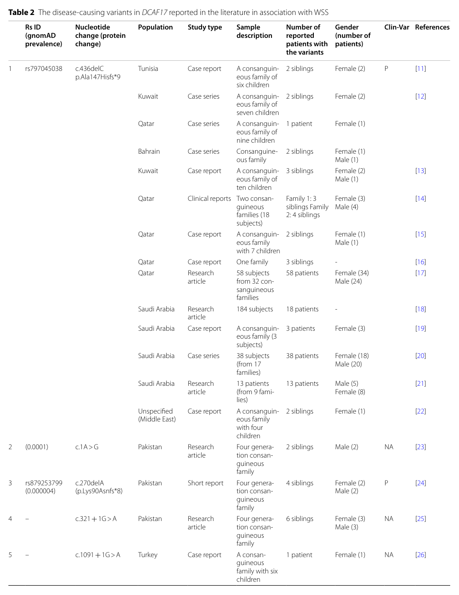

## Question

# Disease Characteristics Research Template

## Target Disease
- **Disease Name:** Woodhouse-Sakati Syndrome
- **MONDO ID:**  (if available)
- **Category:** Mendelian

## Research Objectives

Please provide a comprehensive research report on **Woodhouse-Sakati Syndrome** covering all of the
disease characteristics listed below. This report will be used to populate a disease knowledge
base entry. Be thorough and cite primary literature (PMID preferred) for all claims.

For each section, **suggested databases/resources** are listed. These are the first places
you should search for information on each topic.

---

### 1. Disease Information
> **Search first:** OMIM, Orphanet, ICD-10/ICD-11, MeSH, PubMed

- What is the disease? Provide a concise overview.
- What are the key identifiers? (OMIM, Orphanet, ICD-10/ICD-11, MeSH, Mondo)
- What are the common synonyms and alternative names?
- Is the information derived from individual patients (e.g., EHR) or aggregated disease-level resources?

### 2. Etiology

- **Disease Causal Factors**: What are the primary causes? (genetic, environmental, infectious, mechanistic)
- **Risk Factors**:
  > **Search first:** PubMed, Cochrane Library, UpToDate, clinical guidelines, ClinVar, ClinGen, GWAS Catalog, PheGenI, CTD, CDC, WHO, epidemiological databases
  - Genetic risk factors (causal variants, susceptibility loci, modifier genes)
  - Environmental risk factors (toxins, lifestyle, occupational exposures, age, sex, family history)
- **Protective Factors**:
  > **Search first:** PubMed, Cochrane Library, clinical trial databases, GWAS Catalog, gnomAD, WHO, CDC, nutrition databases
  - Genetic protective factors (protective variants, modifier alleles)
  - Environmental protective factors (diet, lifestyle, exposures that reduce risk)
- **Gene-Environment Interactions**: How do genetic and environmental factors interact to influence disease?
  > **Search first:** CTD, PubMed, PheGenI, GxE databases

### 3. Phenotypes
> **Search first:** HPO (Human Phenotype Ontology), OMIM, Orphanet, PubMed, clinicaltrials.gov, MedDRA, SNOMED CT, DECIPHER, LOINC

For each phenotype, provide:
- **Phenotype type**: symptoms, clinical signs, physical manifestations, behavioral changes, or laboratory abnormalities
  > For symptoms/signs: HPO, OMIM, Orphanet, PubMed
  > For behavioral changes: HPO, DSM, RDoC (Research Domain Criteria), PubMed
  > For laboratory abnormalities: LOINC, SNOMED CT, LabTests Online, PubMed
- **Phenotype characteristics**:
  > **Search first:** OMIM, Orphanet, HPO, PubMed
  - Age of symptom onset (neonatal, childhood, adult-onset, late-onset)
  - Symptom severity (mild, moderate, severe, variable)
  - Symptom progression (stable, progressive, episodic, fluctuating)
  - Frequency among affected individuals (percentage or qualitative)
- **Quality of life impact**: Effects on daily functioning and well-being (per-phenotype when possible)
  > **Search first:** EQ-5D database, SF-36, WHO QOL databases, PubMed
- Suggest HPO (Human Phenotype Ontology) terms for each phenotype

### 4. Genetic/Molecular Information

- **Causal Genes**: Gene mutations or chromosomal abnormalities responsible for disease (gene symbols, OMIM IDs)
  > **Search first:** OMIM, ClinVar, HGMD, Ensembl, NCBI Gene
- **Pathogenic Variants**:
  - Affected genes (gene symbols, HGNC IDs)
    > **Search first:** OMIM, NCBI Gene, Ensembl, HGNC, UniProt, GeneCards
  - Variant classification (pathogenic, likely pathogenic, VUS per ACMG/AMP guidelines)
    > **Search first:** ClinVar, ClinGen, ACMG/AMP guidelines, VarSome
  - Variant type/class (missense, frameshift, nonsense, splice-site, structural)
  - Allele frequency in population databases
    > **Search first:** gnomAD, 1000 Genomes, ExAC, TOPMed, dbSNP
  - Somatic vs germline origin
    > **Search first:** COSMIC (somatic), ClinVar, ICGC, TCGA
  - Functional consequences (loss of function, gain of function, dominant negative)
- **Modifier Genes**: Genes that modify disease severity or expression
- **Epigenetic Information**: DNA methylation, histone modifications, chromatin changes affecting disease
  > **Search first:** ENCODE, Roadmap Epigenomics, MethBase, DiseaseMeth
- **Chromosomal Abnormalities**: Large-scale genetic changes (aneuploidy, translocations, inversions)
  > **Search first:** DECIPHER, ClinVar, ECARUCA, UCSC Genome Browser

### 5. Environmental Information

- **Environmental Factors**: Non-genetic contributing factors (toxins, radiation, pollution, occupational exposure)
  > **Search first:** CTD (Comparative Toxicogenomics Database), TOXNET, PubMed, EPA databases
- **Lifestyle Factors**: Behavioral factors (smoking, diet, exercise, alcohol consumption)
  > **Search first:** CDC databases, WHO, PubMed, NHANES
- **Infectious Agents**: If applicable, pathogens causing or triggering disease (bacteria, viruses, fungi, parasites)
  > **Search first:** NCBI Taxonomy, ViPR, BV-BRC, MicrobeDB, GIDEON

### 6. Mechanism / Pathophysiology

- **Molecular Pathways**: Specific signaling cascades or biochemical pathways involved (Wnt, MAPK, mTOR, PI3K-AKT, etc.)
  > **Search first:** KEGG, Reactome, WikiPathways, PathBank, BioCyc
- **Cellular Processes**: Cell-level mechanisms (apoptosis, autophagy, cell cycle dysregulation, inflammation, etc.)
  > **Search first:** Gene Ontology (GO), Reactome, KEGG, PubMed
- **Protein Dysfunction**: How protein structure or function is altered (misfolding, aggregation, loss of function, gain of function)
  > **Search first:** UniProt, PDB (Protein Data Bank), InterPro, Pfam, AlphaFold
- **Metabolic Changes**: Alterations in metabolic processes (energy metabolism, lipid metabolism, amino acid metabolism)
  > **Search first:** KEGG, BioCyc, HMDB (Human Metabolome Database), BRENDA
- **Immune System Involvement**: Role of immune response (autoimmunity, immunodeficiency, chronic inflammation)
  > **Search first:** ImmPort, Immunome Database, IEDB, Gene Ontology
- **Tissue Damage Mechanisms**: How tissues/ are injured (oxidative stress, ischemia, fibrosis, necrosis)
  > **Search first:** PubMed, Gene Ontology, Reactome
- **Biochemical Abnormalities**: Specific molecular defects (enzyme deficiencies, receptor dysfunction, ion channel defects)
  > **Search first:** BRENDA, UniProt, KEGG, OMIM, PubMed
- **Epigenetic Changes**: DNA methylation, histone modifications affecting gene expression in disease
  > **Search first:** ENCODE, Roadmap Epigenomics, MethBase, DiseaseMeth
- **Molecular Profiling** (if available):
  - Transcriptomics/gene expression changes
    > **Search first:** GEO (Gene Expression Omnibus), ArrayExpress, GTEx, Human Cell Atlas, SRA
  - Proteomics findings
    > **Search first:** PRIDE, ProteomeXchange, Human Protein Atlas, STRING, BioGRID
  - Metabolomics signatures
    > **Search first:** MetaboLights, Metabolomics Workbench, HMDB, METLIN
  - Lipidomics alterations
    > **Search first:** LIPID MAPS, SwissLipids, LipidHome, Metabolomics Workbench
  - Genomic structural features
    > **Search first:** UCSC Genome Browser, Ensembl, NCBI, dbVar, DGV
- **Advanced Technologies** (if applicable):
  - Single-cell analysis findings (cell-type specific mechanisms, cellular heterogeneity)
    > **Search first:** Human Cell Atlas, Single Cell Portal, GEO, CELLxGENE
  - Spatial transcriptomics findings
    > **Search first:** GEO, Spatial Research, Vizgen, 10x Genomics data
  - Multi-omics integration results
    > **Search first:** TCGA, ICGC, cBioPortal, LinkedOmics, PubMed
  - Functional genomics screens (CRISPR, RNAi)
    > **Search first:** DepMap, GenomeRNAi, PubMed, BioGRID ORCS

For each mechanism, describe:
- The causal chain from initial trigger to clinical manifestation
- Which mechanisms are upstream vs downstream
- What cell types and biological processes are involved
- Suggest GO terms for biological processes and CL terms for cell types

### 7. Anatomical Structures Affected

- **Organ Level**:
  - Primary organs directly affected
  - Secondary organ involvement (complications, secondary effects)
  - Body systems involved (cardiovascular, nervous, digestive, respiratory, endocrine, etc.)
  > **Search first:** Uberon, FMA (Foundational Model of Anatomy), OMIM, HPO, ICD-11, MeSH, SNOMED CT
- **Tissue and Cell Level**:
  - Specific tissue types affected (epithelial, connective, muscle, nervous)
  - Specific cell populations targeted (with Cell Ontology terms)
  > **Search first:** Uberon, Human Protein Atlas, Cell Ontology, Human Cell Atlas, CellMarker, PanglaoDB
- **Subcellular Level**:
  - Cellular compartments involved (mitochondria, nucleus, ER, lysosomes) (with GO Cellular Component terms)
  > **Search first:** Gene Ontology (Cellular Component), UniProt, Human Protein Atlas
- **Localization**:
  - Specific anatomical sites (with UBERON terms)
    > **Search first:** FMA, Uberon, NeuroNames (for brain), SNOMED CT
  - Lateralization (unilateral, bilateral, asymmetric)
    > **Search first:** HPO, clinical literature, imaging databases

### 8. Temporal Development

- **Onset**:
  - Typical age of onset (congenital, pediatric, adult, geriatric)
  - Onset pattern (acute, subacute, chronic, insidious)
  > **Search first:** OMIM, Orphanet, HPO, PubMed
- **Progression**:
  - Disease stages (early, intermediate, advanced, end-stage)
    > **Search first:** Cancer Staging Manual (AJCC), WHO classifications, PubMed
  - Progression rate (rapid, slow, variable)
  - Disease course pattern (episodic, relapsing-remitting, progressive, stable)
  - Disease duration (self-limited, chronic lifelong)
  > **Search first:** Disease registries, longitudinal cohort databases, natural history studies, PubMed, Orphanet, OMIM
- **Patterns**:
  - Remission patterns (spontaneous, treatment-induced)
    > **Search first:** Clinical trial databases, disease registries, PubMed
  - Critical periods (time windows of vulnerability or opportunity for intervention)
    > **Search first:** PubMed, developmental biology databases, clinical guidelines

### 9. Inheritance and Population

- **Epidemiology**:
  - Prevalence (cases per 100,000 at given time)
  - Incidence (new cases per 100,000 per year)
  > **Search first:** Orphanet, CDC, WHO, GBD (Global Burden of Disease), national registries, SEER, disease registries
- **For Genetic Etiology**:
  - Inheritance pattern (AD, AR, X-linked, mitochondrial, multifactorial, polygenic)
    > **Search first:** OMIM, Orphanet, ClinVar, GTR (Genetic Testing Registry)
  - Penetrance (complete, incomplete, age-dependent)
    > **Search first:** ClinVar, OMIM, PubMed, ClinGen
  - Expressivity (variable, consistent)
    > **Search first:** OMIM, ClinVar, PubMed
  - Genetic anticipation (increasing severity in successive generations)
    > **Search first:** OMIM, PubMed (especially for repeat expansion disorders)
  - Germline mosaicism
    > **Search first:** ClinVar, OMIM, genetic counseling literature, PubMed
  - Founder effects (population-specific mutations)
    > **Search first:** gnomAD, population genetics databases, PubMed
  - Consanguinity role
    > **Search first:** OMIM, population studies, genetic counseling resources
  - Carrier frequency
    > **Search first:** gnomAD, carrier screening databases, GeneReviews, GTR
- **Population Demographics**:
  - Affected populations (ethnic or demographic groups with higher prevalence)
    > **Search first:** gnomAD, 1000 Genomes, PAGE Study, PubMed, population registries
  - Geographic distribution (endemic areas, regional variation)
    > **Search first:** WHO, CDC, GBD, Orphanet, geographic epidemiology databases
  - Geographic distribution of specific variants
  - Sex ratio (male:female)
    > **Search first:** Disease registries, OMIM, PubMed, epidemiological databases
  - Age distribution of affected individuals
    > **Search first:** CDC, disease registries, SEER, Orphanet

### 10. Diagnostics

- **Clinical Tests**:
  - Laboratory tests (blood, urine, tissue chemistry, specific enzyme assays)
    > **Search first:** LOINC, LabTests Online, PubMed
  - Biomarkers (proteins, metabolites, genetic markers, circulating biomarkers)
    > **Search first:** FDA Biomarker List, BEST (Biomarkers, EndpointS, and other Tools), PubMed
  - Imaging studies (X-ray, CT, MRI, PET, ultrasound)
    > **Search first:** RadLex, DICOM, Radiopaedia, imaging databases
  - Functional tests (pulmonary function, cardiac stress tests)
    > **Search first:** LOINC, clinical guidelines, PubMed
  - Electrophysiology (EEG, EMG, ECG, nerve conduction studies)
    > **Search first:** LOINC, clinical neurophysiology databases, PubMed
  - Biopsy findings (histopathology, immunohistochemistry)
    > **Search first:** SNOMED CT, College of American Pathologists resources, PubMed
  - Pathology findings (microscopic examination)
    > **Search first:** SNOMED CT, Digital Pathology databases, PubMed
- **Genetic Testing**:
  > **Search first:** GTR (Genetic Testing Registry), GeneReviews, ClinGen
  - Overview of recommended genetic testing approach
  - Whole genome sequencing (WGS) utility
    > **Search first:** GTR, ClinVar, GEL (Genomics England), gnomAD
  - Whole exome sequencing (WES) utility
    > **Search first:** GTR, ClinVar, OMIM, GeneMatcher
  - Gene panels (which panels, which genes)
    > **Search first:** GTR, ClinVar, laboratory-specific databases
  - Single gene testing
    > **Search first:** GTR, ClinVar, OMIM, GeneReviews
  - Chromosomal microarray (CMA)
    > **Search first:** DECIPHER, ClinVar, dbVar, ECARUCA
  - Karyotyping
    > **Search first:** Chromosome Abnormality Database, ClinVar, cytogenetics resources
  - FISH
    > **Search first:** ClinVar, cytogenetics databases, PubMed
  - Mitochondrial DNA testing
    > **Search first:** MITOMAP, MSeqDR, ClinVar, GTR
  - Repeat expansion testing
    > **Search first:** GTR, ClinVar, repeat expansion databases, PubMed
- **Omics-Based Diagnostics** (if applicable):
  - RNA sequencing / transcriptomics
    > **Search first:** GEO, ArrayExpress, GTEx, RNA-seq databases
  - Proteomics
    > **Search first:** PRIDE, ProteomeXchange, FDA Biomarker database
  - Metabolomics
    > **Search first:** MetaboLights, Metabolomics Workbench, HMDB
  - Epigenomics
    > **Search first:** GEO, ENCODE, Roadmap Epigenomics, MethBase
  - Liquid biopsy
    > **Search first:** COSMIC, ClinVar, liquid biopsy databases, PubMed
- **Clinical Criteria**:
  - Standardized diagnostic criteria (DSM, ICD, society guidelines)
    > **Search first:** DSM-5, ICD-11, clinical society guidelines, UpToDate
  - Differential diagnosis (other conditions to rule out, with distinguishing features)
    > **Search first:** DynaMed, UpToDate, clinical decision support systems
- **Screening**:
  - Screening methods for asymptomatic individuals (newborn screening, carrier screening, cascade screening)
    > **Search first:** ACMG recommendations, CDC newborn screening, GTR

### 11. Outcome/Prognosis

- **Survival and Mortality**:
  - Survival rate (5-year, 10-year, overall)
    > **Search first:** SEER, cancer registries, disease-specific registries, PubMed
  - Life expectancy (with and without treatment if applicable)
    > **Search first:** Orphanet, disease registries, actuarial databases, PubMed
  - Mortality rate
    > **Search first:** CDC, WHO, GBD, national mortality databases
  - Disease-specific mortality (deaths directly attributable to disease)
    > **Search first:** Disease registries, CDC Wonder, GBD, PubMed
- **Morbidity and Function**:
  - Morbidity (disease-related disability and health impacts)
    > **Search first:** GBD, WHO, disability databases, PubMed
  - Disability outcomes (long-term functional impairments)
    > **Search first:** ICF (International Classification of Functioning), disability registries
  - Quality of life measures (EQ-5D, SF-36, PROMIS, disease-specific tools)
    > **Search first:** EQ-5D database, SF-36, PROMIS, PubMed
- **Disease Course**:
  - Complications (secondary problems: infections, organ failure, etc.)
    > **Search first:** ICD codes, disease registries, clinical databases, PubMed
  - Recovery potential (likelihood and extent of recovery, with vs without treatment)
    > **Search first:** Natural history studies, rehabilitation databases, PubMed
- **Prediction**:
  - Prognostic factors (age, disease severity, biomarkers, treatment response)
    > **Search first:** Prognostic models databases, clinical calculators, PubMed
  - Prognostic biomarkers (molecular markers predicting disease course)
    > **Search first:** FDA Biomarker database, PubMed, cancer prognostic databases

### 12. Treatment

- **Pharmacotherapy**:
  - Pharmacological treatments (drug names, drug classes, mechanisms of action)
    > **Search first:** DrugBank, RxNorm, ATC classification, DailyMed, FDA databases
  - Pharmacogenomics (how genetic variants affect drug metabolism, efficacy, toxicity)
    > **Search first:** PharmGKB, CPIC (Clinical Pharmacogenetics), FDA Table of PGx Biomarkers
- **Advanced Therapeutics**:
  - Gene therapy (viral vectors, CRISPR, gene replacement, gene editing)
    > **Search first:** ClinicalTrials.gov, FDA gene therapy database, ASGCT resources
  - Cell therapy (stem cell transplant, CAR-T, cellular therapeutics)
    > **Search first:** ClinicalTrials.gov, FDA cell therapy database, FACT standards
  - RNA-based therapies (ASOs, siRNA, mRNA therapies)
    > **Search first:** ClinicalTrials.gov, FDA approvals, PubMed
  - Targeted therapies (treatments directed at specific molecular targets)
    > **Search first:** My Cancer Genome, OncoKB, ClinicalTrials.gov, FDA approvals
  - Immunotherapies (checkpoint inhibitors, monoclonal antibodies)
    > **Search first:** Cancer Immunotherapy Database, FDA approvals, ClinicalTrials.gov
- **Surgical and Interventional**:
  - Surgical interventions (types of surgery, timing, outcomes)
    > **Search first:** CPT codes, surgical registries, clinical guidelines, PubMed
- **Supportive and Rehabilitative**:
  - Supportive care (symptom management, pain control, nutrition)
    > **Search first:** Clinical guidelines, Cochrane Library, PubMed
  - Rehabilitation (physical therapy, occupational therapy, speech therapy)
    > **Search first:** Rehabilitation medicine databases, clinical guidelines, PubMed
- **Experimental**:
  - Experimental treatments in clinical trials (with NCT identifiers if available)
    > **Search first:** ClinicalTrials.gov, EU Clinical Trials Register, WHO ICTRP
- **Treatment Outcomes**:
  - Treatment response rates
    > **Search first:** Clinical trial databases, FDA reviews, systematic reviews, PubMed
  - Side effects and adverse events
    > **Search first:** FDA Adverse Event Reporting System (FAERS), MedWatch, PubMed
- **Treatment Strategy**:
  - Treatment algorithms (clinical pathways, decision trees)
    > **Search first:** Clinical practice guidelines, NCCN Guidelines, UpToDate
  - Combination therapies
    > **Search first:** ClinicalTrials.gov, treatment guidelines, PubMed
  - Personalized medicine approaches (genotype-guided treatment)
    > **Search first:** My Cancer Genome, CIViC, PharmGKB, precision medicine databases

For each treatment, suggest MAXO (Medical Action Ontology) terms where applicable.

### 13. Prevention

- **Prevention Levels**:
  - Primary prevention (preventing disease occurrence: vaccination, risk factor modification)
    > **Search first:** CDC, WHO, USPSTF recommendations, Cochrane Library
  - Secondary prevention (early detection and treatment: screening programs, early intervention)
    > **Search first:** USPSTF, CDC screening guidelines, WHO
  - Tertiary prevention (preventing complications in those with disease)
    > **Search first:** Clinical guidelines, disease management protocols, PubMed
- **Immunization**: Vaccine strategies (if applicable)
  > **Search first:** CDC vaccine schedules, WHO immunization, FDA vaccine database
- **Screening and Early Detection**:
  - Screening programs (population-based: newborn screening, cancer screening)
    > **Search first:** CDC screening programs, USPSTF, cancer screening databases
  - Genetic screening (carrier screening, preimplantation genetic diagnosis, prenatal testing)
    > **Search first:** ACMG recommendations, ACOG guidelines, GTR
  - Risk stratification (identifying high-risk individuals for targeted prevention)
    > **Search first:** Risk prediction models, clinical calculators, PubMed
- **Behavioral Interventions**: Lifestyle modifications to reduce risk
  > **Search first:** CDC, WHO, behavioral intervention databases, Cochrane Library
- **Counseling**: Genetic counseling (risk assessment, family planning guidance)
  > **Search first:** NSGC resources, ACMG guidelines, GeneReviews
- **Public Health**:
  - Public health interventions (sanitation, vector control, health education)
    > **Search first:** CDC, WHO, public health databases, PubMed
  - Environmental interventions (reducing environmental risk factors)
    > **Search first:** EPA databases, WHO environmental health, PubMed
- **Prophylaxis**: Preventive medications or procedures
  > **Search first:** Clinical guidelines, FDA approvals, PubMed

### 14. Other Species / Natural Disease

- **Taxonomy**: Species affected (with NCBI Taxon identifiers)
  > **Search first:** NCBI Taxonomy
- **Breed**: Specific breeds affected (with VBO identifiers if applicable)
  > **Search first:** VBO (Vertebrate Breed Ontology)
- **Gene**: Orthologous genes in other species (with NCBI Gene IDs)
  > **Search first:** NCBI Gene
- **Natural Disease**:
  - Naturally occurring disease in other species (companion animals, wildlife)
    > **Search first:** OMIA (Online Mendelian Inheritance in Animals), VetCompass, PubMed
  - Veterinary relevance and importance in animal health
    > **Search first:** OMIA, veterinary databases, PubMed
- **Comparative Biology**:
  - Comparative pathology (similarities and differences across species)
    > **Search first:** OMIA, comparative pathology databases, PubMed
  - Evolutionary conservation of disease mechanisms
    > **Search first:** HomoloGene, OrthoMCL, Alliance of Genome Resources
- **Transmission** (if applicable):
  - Zoonotic potential
    > **Search first:** CDC zoonotic diseases, WHO zoonoses, GIDEON
  - Cross-species susceptibility
    > **Search first:** NCBI Taxonomy, veterinary databases, PubMed

### 15. Model Organisms

- **Model Types**:
  - Model organism type (mammalian, invertebrate, cellular, in vitro)
    > **Search first:** Alliance of Genome Resources, model organism databases
  - Specific model systems (mouse, rat, zebrafish, Drosophila, C. elegans, yeast, cell lines, organoids, iPSCs)
    > **Search first:** MGI, RGD, ZFIN, FlyBase, WormBase, SGD, ATCC, Cellosaurus
  - Induced models (drug treatment, surgical intervention, environmental manipulation)
    > **Search first:** MGI, model organism databases, PubMed
- **Genetic Models**:
  - Types available (knockout, knock-in, transgenic, conditional, humanized)
    > **Search first:** MGI, IMPC, KOMP, EuMMCR, IMSR
- **Model Characteristics**:
  - Phenotype recapitulation (how well model reproduces human disease features)
    > **Search first:** Model organism databases, comparative studies, PubMed
  - Model limitations (aspects of human disease not captured)
    > **Search first:** Model organism databases, PubMed, review articles
- **Applications**:
  - Research applications (what aspects of disease can be studied)
    > **Search first:** Model organism databases, PubMed
- **Resources**:
  - Model databases
    > **Search first:** MGI, RGD, ZFIN, FlyBase, WormBase, IMSR, EMMA, MMRRC

---

## Citation Requirements

- Cite primary literature (PMID preferred) for all mechanistic and clinical claims
- Prioritize recent reviews and landmark papers
- Include direct quotes from abstracts where possible to support key statements
- Distinguish evidence source types: human clinical, model organism, in vitro, computational

## Output Format

Structure your response as a comprehensive narrative organized by the sections above.
For each section, provide:
- Factual content with specific details (numbers, percentages, gene names, variant nomenclature)
- Ontology term suggestions (HPO, GO, CL, UBERON, CHEBI, MAXO, MONDO) where applicable
- Evidence citations with PMIDs
- Direct quotes from abstracts to support key claims
- Clear indication when information is not available or not applicable for this disease

This report will be used to populate a disease knowledge base entry with:
- Pathophysiology descriptions with causal chains
- Gene/protein annotations (HGNC, GO terms)
- Phenotype associations (HP terms) with frequencies
- Cell type involvement (CL terms)
- Anatomical locations (UBERON terms)
- Chemical entities (CHEBI terms)
- Treatment annotations (MAXO terms)
- Evidence items with PMIDs and exact abstract quotes
- Epidemiology, prognosis, diagnostic, and prevention information
- Animal model descriptions with phenotype recapitulation details

## Output

Question: You are an expert researcher providing comprehensive, well-cited information.

Provide detailed information focusing on:
1. Key concepts and definitions with current understanding
2. Recent developments and latest research (prioritize 2023-2024 sources)
3. Current applications and real-world implementations
4. Expert opinions and analysis from authoritative sources
5. Relevant statistics and data from recent studies

Format as a comprehensive research report with proper citations. Include URLs and publication dates where available.
Always prioritize recent, authoritative sources and provide specific citations for all major claims.

# Disease Characteristics Research Template

## Target Disease
- **Disease Name:** Woodhouse-Sakati Syndrome
- **MONDO ID:**  (if available)
- **Category:** Mendelian

## Research Objectives

Please provide a comprehensive research report on **Woodhouse-Sakati Syndrome** covering all of the
disease characteristics listed below. This report will be used to populate a disease knowledge
base entry. Be thorough and cite primary literature (PMID preferred) for all claims.

For each section, **suggested databases/resources** are listed. These are the first places
you should search for information on each topic.

---

### 1. Disease Information
> **Search first:** OMIM, Orphanet, ICD-10/ICD-11, MeSH, PubMed

- What is the disease? Provide a concise overview.
- What are the key identifiers? (OMIM, Orphanet, ICD-10/ICD-11, MeSH, Mondo)
- What are the common synonyms and alternative names?
- Is the information derived from individual patients (e.g., EHR) or aggregated disease-level resources?

### 2. Etiology

- **Disease Causal Factors**: What are the primary causes? (genetic, environmental, infectious, mechanistic)
- **Risk Factors**:
  > **Search first:** PubMed, Cochrane Library, UpToDate, clinical guidelines, ClinVar, ClinGen, GWAS Catalog, PheGenI, CTD, CDC, WHO, epidemiological databases
  - Genetic risk factors (causal variants, susceptibility loci, modifier genes)
  - Environmental risk factors (toxins, lifestyle, occupational exposures, age, sex, family history)
- **Protective Factors**:
  > **Search first:** PubMed, Cochrane Library, clinical trial databases, GWAS Catalog, gnomAD, WHO, CDC, nutrition databases
  - Genetic protective factors (protective variants, modifier alleles)
  - Environmental protective factors (diet, lifestyle, exposures that reduce risk)
- **Gene-Environment Interactions**: How do genetic and environmental factors interact to influence disease?
  > **Search first:** CTD, PubMed, PheGenI, GxE databases

### 3. Phenotypes
> **Search first:** HPO (Human Phenotype Ontology), OMIM, Orphanet, PubMed, clinicaltrials.gov, MedDRA, SNOMED CT, DECIPHER, LOINC

For each phenotype, provide:
- **Phenotype type**: symptoms, clinical signs, physical manifestations, behavioral changes, or laboratory abnormalities
  > For symptoms/signs: HPO, OMIM, Orphanet, PubMed
  > For behavioral changes: HPO, DSM, RDoC (Research Domain Criteria), PubMed
  > For laboratory abnormalities: LOINC, SNOMED CT, LabTests Online, PubMed
- **Phenotype characteristics**:
  > **Search first:** OMIM, Orphanet, HPO, PubMed
  - Age of symptom onset (neonatal, childhood, adult-onset, late-onset)
  - Symptom severity (mild, moderate, severe, variable)
  - Symptom progression (stable, progressive, episodic, fluctuating)
  - Frequency among affected individuals (percentage or qualitative)
- **Quality of life impact**: Effects on daily functioning and well-being (per-phenotype when possible)
  > **Search first:** EQ-5D database, SF-36, WHO QOL databases, PubMed
- Suggest HPO (Human Phenotype Ontology) terms for each phenotype

### 4. Genetic/Molecular Information

- **Causal Genes**: Gene mutations or chromosomal abnormalities responsible for disease (gene symbols, OMIM IDs)
  > **Search first:** OMIM, ClinVar, HGMD, Ensembl, NCBI Gene
- **Pathogenic Variants**:
  - Affected genes (gene symbols, HGNC IDs)
    > **Search first:** OMIM, NCBI Gene, Ensembl, HGNC, UniProt, GeneCards
  - Variant classification (pathogenic, likely pathogenic, VUS per ACMG/AMP guidelines)
    > **Search first:** ClinVar, ClinGen, ACMG/AMP guidelines, VarSome
  - Variant type/class (missense, frameshift, nonsense, splice-site, structural)
  - Allele frequency in population databases
    > **Search first:** gnomAD, 1000 Genomes, ExAC, TOPMed, dbSNP
  - Somatic vs germline origin
    > **Search first:** COSMIC (somatic), ClinVar, ICGC, TCGA
  - Functional consequences (loss of function, gain of function, dominant negative)
- **Modifier Genes**: Genes that modify disease severity or expression
- **Epigenetic Information**: DNA methylation, histone modifications, chromatin changes affecting disease
  > **Search first:** ENCODE, Roadmap Epigenomics, MethBase, DiseaseMeth
- **Chromosomal Abnormalities**: Large-scale genetic changes (aneuploidy, translocations, inversions)
  > **Search first:** DECIPHER, ClinVar, ECARUCA, UCSC Genome Browser

### 5. Environmental Information

- **Environmental Factors**: Non-genetic contributing factors (toxins, radiation, pollution, occupational exposure)
  > **Search first:** CTD (Comparative Toxicogenomics Database), TOXNET, PubMed, EPA databases
- **Lifestyle Factors**: Behavioral factors (smoking, diet, exercise, alcohol consumption)
  > **Search first:** CDC databases, WHO, PubMed, NHANES
- **Infectious Agents**: If applicable, pathogens causing or triggering disease (bacteria, viruses, fungi, parasites)
  > **Search first:** NCBI Taxonomy, ViPR, BV-BRC, MicrobeDB, GIDEON

### 6. Mechanism / Pathophysiology

- **Molecular Pathways**: Specific signaling cascades or biochemical pathways involved (Wnt, MAPK, mTOR, PI3K-AKT, etc.)
  > **Search first:** KEGG, Reactome, WikiPathways, PathBank, BioCyc
- **Cellular Processes**: Cell-level mechanisms (apoptosis, autophagy, cell cycle dysregulation, inflammation, etc.)
  > **Search first:** Gene Ontology (GO), Reactome, KEGG, PubMed
- **Protein Dysfunction**: How protein structure or function is altered (misfolding, aggregation, loss of function, gain of function)
  > **Search first:** UniProt, PDB (Protein Data Bank), InterPro, Pfam, AlphaFold
- **Metabolic Changes**: Alterations in metabolic processes (energy metabolism, lipid metabolism, amino acid metabolism)
  > **Search first:** KEGG, BioCyc, HMDB (Human Metabolome Database), BRENDA
- **Immune System Involvement**: Role of immune response (autoimmunity, immunodeficiency, chronic inflammation)
  > **Search first:** ImmPort, Immunome Database, IEDB, Gene Ontology
- **Tissue Damage Mechanisms**: How tissues/ are injured (oxidative stress, ischemia, fibrosis, necrosis)
  > **Search first:** PubMed, Gene Ontology, Reactome
- **Biochemical Abnormalities**: Specific molecular defects (enzyme deficiencies, receptor dysfunction, ion channel defects)
  > **Search first:** BRENDA, UniProt, KEGG, OMIM, PubMed
- **Epigenetic Changes**: DNA methylation, histone modifications affecting gene expression in disease
  > **Search first:** ENCODE, Roadmap Epigenomics, MethBase, DiseaseMeth
- **Molecular Profiling** (if available):
  - Transcriptomics/gene expression changes
    > **Search first:** GEO (Gene Expression Omnibus), ArrayExpress, GTEx, Human Cell Atlas, SRA
  - Proteomics findings
    > **Search first:** PRIDE, ProteomeXchange, Human Protein Atlas, STRING, BioGRID
  - Metabolomics signatures
    > **Search first:** MetaboLights, Metabolomics Workbench, HMDB, METLIN
  - Lipidomics alterations
    > **Search first:** LIPID MAPS, SwissLipids, LipidHome, Metabolomics Workbench
  - Genomic structural features
    > **Search first:** UCSC Genome Browser, Ensembl, NCBI, dbVar, DGV
- **Advanced Technologies** (if applicable):
  - Single-cell analysis findings (cell-type specific mechanisms, cellular heterogeneity)
    > **Search first:** Human Cell Atlas, Single Cell Portal, GEO, CELLxGENE
  - Spatial transcriptomics findings
    > **Search first:** GEO, Spatial Research, Vizgen, 10x Genomics data
  - Multi-omics integration results
    > **Search first:** TCGA, ICGC, cBioPortal, LinkedOmics, PubMed
  - Functional genomics screens (CRISPR, RNAi)
    > **Search first:** DepMap, GenomeRNAi, PubMed, BioGRID ORCS

For each mechanism, describe:
- The causal chain from initial trigger to clinical manifestation
- Which mechanisms are upstream vs downstream
- What cell types and biological processes are involved
- Suggest GO terms for biological processes and CL terms for cell types

### 7. Anatomical Structures Affected

- **Organ Level**:
  - Primary organs directly affected
  - Secondary organ involvement (complications, secondary effects)
  - Body systems involved (cardiovascular, nervous, digestive, respiratory, endocrine, etc.)
  > **Search first:** Uberon, FMA (Foundational Model of Anatomy), OMIM, HPO, ICD-11, MeSH, SNOMED CT
- **Tissue and Cell Level**:
  - Specific tissue types affected (epithelial, connective, muscle, nervous)
  - Specific cell populations targeted (with Cell Ontology terms)
  > **Search first:** Uberon, Human Protein Atlas, Cell Ontology, Human Cell Atlas, CellMarker, PanglaoDB
- **Subcellular Level**:
  - Cellular compartments involved (mitochondria, nucleus, ER, lysosomes) (with GO Cellular Component terms)
  > **Search first:** Gene Ontology (Cellular Component), UniProt, Human Protein Atlas
- **Localization**:
  - Specific anatomical sites (with UBERON terms)
    > **Search first:** FMA, Uberon, NeuroNames (for brain), SNOMED CT
  - Lateralization (unilateral, bilateral, asymmetric)
    > **Search first:** HPO, clinical literature, imaging databases

### 8. Temporal Development

- **Onset**:
  - Typical age of onset (congenital, pediatric, adult, geriatric)
  - Onset pattern (acute, subacute, chronic, insidious)
  > **Search first:** OMIM, Orphanet, HPO, PubMed
- **Progression**:
  - Disease stages (early, intermediate, advanced, end-stage)
    > **Search first:** Cancer Staging Manual (AJCC), WHO classifications, PubMed
  - Progression rate (rapid, slow, variable)
  - Disease course pattern (episodic, relapsing-remitting, progressive, stable)
  - Disease duration (self-limited, chronic lifelong)
  > **Search first:** Disease registries, longitudinal cohort databases, natural history studies, PubMed, Orphanet, OMIM
- **Patterns**:
  - Remission patterns (spontaneous, treatment-induced)
    > **Search first:** Clinical trial databases, disease registries, PubMed
  - Critical periods (time windows of vulnerability or opportunity for intervention)
    > **Search first:** PubMed, developmental biology databases, clinical guidelines

### 9. Inheritance and Population

- **Epidemiology**:
  - Prevalence (cases per 100,000 at given time)
  - Incidence (new cases per 100,000 per year)
  > **Search first:** Orphanet, CDC, WHO, GBD (Global Burden of Disease), national registries, SEER, disease registries
- **For Genetic Etiology**:
  - Inheritance pattern (AD, AR, X-linked, mitochondrial, multifactorial, polygenic)
    > **Search first:** OMIM, Orphanet, ClinVar, GTR (Genetic Testing Registry)
  - Penetrance (complete, incomplete, age-dependent)
    > **Search first:** ClinVar, OMIM, PubMed, ClinGen
  - Expressivity (variable, consistent)
    > **Search first:** OMIM, ClinVar, PubMed
  - Genetic anticipation (increasing severity in successive generations)
    > **Search first:** OMIM, PubMed (especially for repeat expansion disorders)
  - Germline mosaicism
    > **Search first:** ClinVar, OMIM, genetic counseling literature, PubMed
  - Founder effects (population-specific mutations)
    > **Search first:** gnomAD, population genetics databases, PubMed
  - Consanguinity role
    > **Search first:** OMIM, population studies, genetic counseling resources
  - Carrier frequency
    > **Search first:** gnomAD, carrier screening databases, GeneReviews, GTR
- **Population Demographics**:
  - Affected populations (ethnic or demographic groups with higher prevalence)
    > **Search first:** gnomAD, 1000 Genomes, PAGE Study, PubMed, population registries
  - Geographic distribution (endemic areas, regional variation)
    > **Search first:** WHO, CDC, GBD, Orphanet, geographic epidemiology databases
  - Geographic distribution of specific variants
  - Sex ratio (male:female)
    > **Search first:** Disease registries, OMIM, PubMed, epidemiological databases
  - Age distribution of affected individuals
    > **Search first:** CDC, disease registries, SEER, Orphanet

### 10. Diagnostics

- **Clinical Tests**:
  - Laboratory tests (blood, urine, tissue chemistry, specific enzyme assays)
    > **Search first:** LOINC, LabTests Online, PubMed
  - Biomarkers (proteins, metabolites, genetic markers, circulating biomarkers)
    > **Search first:** FDA Biomarker List, BEST (Biomarkers, EndpointS, and other Tools), PubMed
  - Imaging studies (X-ray, CT, MRI, PET, ultrasound)
    > **Search first:** RadLex, DICOM, Radiopaedia, imaging databases
  - Functional tests (pulmonary function, cardiac stress tests)
    > **Search first:** LOINC, clinical guidelines, PubMed
  - Electrophysiology (EEG, EMG, ECG, nerve conduction studies)
    > **Search first:** LOINC, clinical neurophysiology databases, PubMed
  - Biopsy findings (histopathology, immunohistochemistry)
    > **Search first:** SNOMED CT, College of American Pathologists resources, PubMed
  - Pathology findings (microscopic examination)
    > **Search first:** SNOMED CT, Digital Pathology databases, PubMed
- **Genetic Testing**:
  > **Search first:** GTR (Genetic Testing Registry), GeneReviews, ClinGen
  - Overview of recommended genetic testing approach
  - Whole genome sequencing (WGS) utility
    > **Search first:** GTR, ClinVar, GEL (Genomics England), gnomAD
  - Whole exome sequencing (WES) utility
    > **Search first:** GTR, ClinVar, OMIM, GeneMatcher
  - Gene panels (which panels, which genes)
    > **Search first:** GTR, ClinVar, laboratory-specific databases
  - Single gene testing
    > **Search first:** GTR, ClinVar, OMIM, GeneReviews
  - Chromosomal microarray (CMA)
    > **Search first:** DECIPHER, ClinVar, dbVar, ECARUCA
  - Karyotyping
    > **Search first:** Chromosome Abnormality Database, ClinVar, cytogenetics resources
  - FISH
    > **Search first:** ClinVar, cytogenetics databases, PubMed
  - Mitochondrial DNA testing
    > **Search first:** MITOMAP, MSeqDR, ClinVar, GTR
  - Repeat expansion testing
    > **Search first:** GTR, ClinVar, repeat expansion databases, PubMed
- **Omics-Based Diagnostics** (if applicable):
  - RNA sequencing / transcriptomics
    > **Search first:** GEO, ArrayExpress, GTEx, RNA-seq databases
  - Proteomics
    > **Search first:** PRIDE, ProteomeXchange, FDA Biomarker database
  - Metabolomics
    > **Search first:** MetaboLights, Metabolomics Workbench, HMDB
  - Epigenomics
    > **Search first:** GEO, ENCODE, Roadmap Epigenomics, MethBase
  - Liquid biopsy
    > **Search first:** COSMIC, ClinVar, liquid biopsy databases, PubMed
- **Clinical Criteria**:
  - Standardized diagnostic criteria (DSM, ICD, society guidelines)
    > **Search first:** DSM-5, ICD-11, clinical society guidelines, UpToDate
  - Differential diagnosis (other conditions to rule out, with distinguishing features)
    > **Search first:** DynaMed, UpToDate, clinical decision support systems
- **Screening**:
  - Screening methods for asymptomatic individuals (newborn screening, carrier screening, cascade screening)
    > **Search first:** ACMG recommendations, CDC newborn screening, GTR

### 11. Outcome/Prognosis

- **Survival and Mortality**:
  - Survival rate (5-year, 10-year, overall)
    > **Search first:** SEER, cancer registries, disease-specific registries, PubMed
  - Life expectancy (with and without treatment if applicable)
    > **Search first:** Orphanet, disease registries, actuarial databases, PubMed
  - Mortality rate
    > **Search first:** CDC, WHO, GBD, national mortality databases
  - Disease-specific mortality (deaths directly attributable to disease)
    > **Search first:** Disease registries, CDC Wonder, GBD, PubMed
- **Morbidity and Function**:
  - Morbidity (disease-related disability and health impacts)
    > **Search first:** GBD, WHO, disability databases, PubMed
  - Disability outcomes (long-term functional impairments)
    > **Search first:** ICF (International Classification of Functioning), disability registries
  - Quality of life measures (EQ-5D, SF-36, PROMIS, disease-specific tools)
    > **Search first:** EQ-5D database, SF-36, PROMIS, PubMed
- **Disease Course**:
  - Complications (secondary problems: infections, organ failure, etc.)
    > **Search first:** ICD codes, disease registries, clinical databases, PubMed
  - Recovery potential (likelihood and extent of recovery, with vs without treatment)
    > **Search first:** Natural history studies, rehabilitation databases, PubMed
- **Prediction**:
  - Prognostic factors (age, disease severity, biomarkers, treatment response)
    > **Search first:** Prognostic models databases, clinical calculators, PubMed
  - Prognostic biomarkers (molecular markers predicting disease course)
    > **Search first:** FDA Biomarker database, PubMed, cancer prognostic databases

### 12. Treatment

- **Pharmacotherapy**:
  - Pharmacological treatments (drug names, drug classes, mechanisms of action)
    > **Search first:** DrugBank, RxNorm, ATC classification, DailyMed, FDA databases
  - Pharmacogenomics (how genetic variants affect drug metabolism, efficacy, toxicity)
    > **Search first:** PharmGKB, CPIC (Clinical Pharmacogenetics), FDA Table of PGx Biomarkers
- **Advanced Therapeutics**:
  - Gene therapy (viral vectors, CRISPR, gene replacement, gene editing)
    > **Search first:** ClinicalTrials.gov, FDA gene therapy database, ASGCT resources
  - Cell therapy (stem cell transplant, CAR-T, cellular therapeutics)
    > **Search first:** ClinicalTrials.gov, FDA cell therapy database, FACT standards
  - RNA-based therapies (ASOs, siRNA, mRNA therapies)
    > **Search first:** ClinicalTrials.gov, FDA approvals, PubMed
  - Targeted therapies (treatments directed at specific molecular targets)
    > **Search first:** My Cancer Genome, OncoKB, ClinicalTrials.gov, FDA approvals
  - Immunotherapies (checkpoint inhibitors, monoclonal antibodies)
    > **Search first:** Cancer Immunotherapy Database, FDA approvals, ClinicalTrials.gov
- **Surgical and Interventional**:
  - Surgical interventions (types of surgery, timing, outcomes)
    > **Search first:** CPT codes, surgical registries, clinical guidelines, PubMed
- **Supportive and Rehabilitative**:
  - Supportive care (symptom management, pain control, nutrition)
    > **Search first:** Clinical guidelines, Cochrane Library, PubMed
  - Rehabilitation (physical therapy, occupational therapy, speech therapy)
    > **Search first:** Rehabilitation medicine databases, clinical guidelines, PubMed
- **Experimental**:
  - Experimental treatments in clinical trials (with NCT identifiers if available)
    > **Search first:** ClinicalTrials.gov, EU Clinical Trials Register, WHO ICTRP
- **Treatment Outcomes**:
  - Treatment response rates
    > **Search first:** Clinical trial databases, FDA reviews, systematic reviews, PubMed
  - Side effects and adverse events
    > **Search first:** FDA Adverse Event Reporting System (FAERS), MedWatch, PubMed
- **Treatment Strategy**:
  - Treatment algorithms (clinical pathways, decision trees)
    > **Search first:** Clinical practice guidelines, NCCN Guidelines, UpToDate
  - Combination therapies
    > **Search first:** ClinicalTrials.gov, treatment guidelines, PubMed
  - Personalized medicine approaches (genotype-guided treatment)
    > **Search first:** My Cancer Genome, CIViC, PharmGKB, precision medicine databases

For each treatment, suggest MAXO (Medical Action Ontology) terms where applicable.

### 13. Prevention

- **Prevention Levels**:
  - Primary prevention (preventing disease occurrence: vaccination, risk factor modification)
    > **Search first:** CDC, WHO, USPSTF recommendations, Cochrane Library
  - Secondary prevention (early detection and treatment: screening programs, early intervention)
    > **Search first:** USPSTF, CDC screening guidelines, WHO
  - Tertiary prevention (preventing complications in those with disease)
    > **Search first:** Clinical guidelines, disease management protocols, PubMed
- **Immunization**: Vaccine strategies (if applicable)
  > **Search first:** CDC vaccine schedules, WHO immunization, FDA vaccine database
- **Screening and Early Detection**:
  - Screening programs (population-based: newborn screening, cancer screening)
    > **Search first:** CDC screening programs, USPSTF, cancer screening databases
  - Genetic screening (carrier screening, preimplantation genetic diagnosis, prenatal testing)
    > **Search first:** ACMG recommendations, ACOG guidelines, GTR
  - Risk stratification (identifying high-risk individuals for targeted prevention)
    > **Search first:** Risk prediction models, clinical calculators, PubMed
- **Behavioral Interventions**: Lifestyle modifications to reduce risk
  > **Search first:** CDC, WHO, behavioral intervention databases, Cochrane Library
- **Counseling**: Genetic counseling (risk assessment, family planning guidance)
  > **Search first:** NSGC resources, ACMG guidelines, GeneReviews
- **Public Health**:
  - Public health interventions (sanitation, vector control, health education)
    > **Search first:** CDC, WHO, public health databases, PubMed
  - Environmental interventions (reducing environmental risk factors)
    > **Search first:** EPA databases, WHO environmental health, PubMed
- **Prophylaxis**: Preventive medications or procedures
  > **Search first:** Clinical guidelines, FDA approvals, PubMed

### 14. Other Species / Natural Disease

- **Taxonomy**: Species affected (with NCBI Taxon identifiers)
  > **Search first:** NCBI Taxonomy
- **Breed**: Specific breeds affected (with VBO identifiers if applicable)
  > **Search first:** VBO (Vertebrate Breed Ontology)
- **Gene**: Orthologous genes in other species (with NCBI Gene IDs)
  > **Search first:** NCBI Gene
- **Natural Disease**:
  - Naturally occurring disease in other species (companion animals, wildlife)
    > **Search first:** OMIA (Online Mendelian Inheritance in Animals), VetCompass, PubMed
  - Veterinary relevance and importance in animal health
    > **Search first:** OMIA, veterinary databases, PubMed
- **Comparative Biology**:
  - Comparative pathology (similarities and differences across species)
    > **Search first:** OMIA, comparative pathology databases, PubMed
  - Evolutionary conservation of disease mechanisms
    > **Search first:** HomoloGene, OrthoMCL, Alliance of Genome Resources
- **Transmission** (if applicable):
  - Zoonotic potential
    > **Search first:** CDC zoonotic diseases, WHO zoonoses, GIDEON
  - Cross-species susceptibility
    > **Search first:** NCBI Taxonomy, veterinary databases, PubMed

### 15. Model Organisms

- **Model Types**:
  - Model organism type (mammalian, invertebrate, cellular, in vitro)
    > **Search first:** Alliance of Genome Resources, model organism databases
  - Specific model systems (mouse, rat, zebrafish, Drosophila, C. elegans, yeast, cell lines, organoids, iPSCs)
    > **Search first:** MGI, RGD, ZFIN, FlyBase, WormBase, SGD, ATCC, Cellosaurus
  - Induced models (drug treatment, surgical intervention, environmental manipulation)
    > **Search first:** MGI, model organism databases, PubMed
- **Genetic Models**:
  - Types available (knockout, knock-in, transgenic, conditional, humanized)
    > **Search first:** MGI, IMPC, KOMP, EuMMCR, IMSR
- **Model Characteristics**:
  - Phenotype recapitulation (how well model reproduces human disease features)
    > **Search first:** Model organism databases, comparative studies, PubMed
  - Model limitations (aspects of human disease not captured)
    > **Search first:** Model organism databases, PubMed, review articles
- **Applications**:
  - Research applications (what aspects of disease can be studied)
    > **Search first:** Model organism databases, PubMed
- **Resources**:
  - Model databases
    > **Search first:** MGI, RGD, ZFIN, FlyBase, WormBase, IMSR, EMMA, MMRRC

---

## Citation Requirements

- Cite primary literature (PMID preferred) for all mechanistic and clinical claims
- Prioritize recent reviews and landmark papers
- Include direct quotes from abstracts where possible to support key statements
- Distinguish evidence source types: human clinical, model organism, in vitro, computational

## Output Format

Structure your response as a comprehensive narrative organized by the sections above.
For each section, provide:
- Factual content with specific details (numbers, percentages, gene names, variant nomenclature)
- Ontology term suggestions (HPO, GO, CL, UBERON, CHEBI, MAXO, MONDO) where applicable
- Evidence citations with PMIDs
- Direct quotes from abstracts to support key claims
- Clear indication when information is not available or not applicable for this disease

This report will be used to populate a disease knowledge base entry with:
- Pathophysiology descriptions with causal chains
- Gene/protein annotations (HGNC, GO terms)
- Phenotype associations (HP terms) with frequencies
- Cell type involvement (CL terms)
- Anatomical locations (UBERON terms)
- Chemical entities (CHEBI terms)
- Treatment annotations (MAXO terms)
- Evidence items with PMIDs and exact abstract quotes
- Epidemiology, prognosis, diagnostic, and prevention information
- Animal model descriptions with phenotype recapitulation details

## Comprehensive Research Report: Woodhouse–Sakati Syndrome (WSS)

### Target Disease
- **Disease name:** Woodhouse–Sakati syndrome (WSS)  
- **Category:** Mendelian (autosomal recessive)  
- **MONDO ID:** **MONDO:0009419** (via OpenTargets disease record) (OpenTargets Search: Woodhouse-Sakati syndrome)  
- **OMIM:** **241080** (disease) (louro2019woodhouse–sakatisyndromefirst pages 1-2, zhou2021casereporta pages 1-2)  
- **Causal gene:** **DCAF17** (formerly **C2orf37**); OMIM gene **612515** (wakim2024woodhousesakatisyndromegenotype–phenotype pages 1-2)

---

## 1. Disease Information

### 1.1 Definition and current understanding
Woodhouse–Sakati syndrome is a rare **multisystem neuroendocrine disorder** with core endocrine involvement (hypogonadism, diabetes, thyroid abnormalities) and progressive neurologic manifestations, caused by **biallelic pathogenic variants in DCAF17** and inherited in an **autosomal recessive** pattern. (bakhsh2023thesuccessfulmanagement pages 1-2, louro2019woodhouse–sakatisyndromefirst pages 1-2, wakim2024woodhousesakatisyndromegenotype–phenotype pages 1-2)

**Abstract-supported definition (direct quotes):**
- A 2023 systematic review states: “**Woodhouse-Sakati syndrome (WSS) is a rare, autosomal recessive genetic disorder with variable clinical manifestations mainly affecting the endocrine and nervous systems**.” (Kohil et al., Orphanet J Rare Dis, published Jan 2023; DOI: https://doi.org/10.1186/s13023-023-02614-8) (kohil2023geneticepidemiologyof pages 1-2)
- A 2024 case report states WSS is “**a rare autosomal recessive condition caused by biallelic pathogenic variants in the DCAF17 gene**” with “**fewer than 200 cases reported**” and symptoms that “**first emerge in middle-late adolescence**.” (Irvine & Ahmad, BMC Neurology, published Sep 2024; DOI: https://doi.org/10.1186/s12883-024-03865-z) (irvine2024woodhousesakatisyndromewith pages 1-3)

### 1.2 Synonyms / alternative names
- Woodhouse–Sakati syndrome (WSS) (bakhsh2023thesuccessfulmanagement pages 1-2, louro2019woodhouse–sakatisyndromefirst pages 1-2)
- Sometimes described as a DCAF17-linked **NBIA** (neurodegeneration with brain iron accumulation) phenotype due to basal ganglia iron deposition on MRI in many patients. (louro2019woodhouse–sakatisyndromefirst pages 1-2)

### 1.3 Evidence source types
Evidence in this report is primarily from:
- **Aggregated disease-level resources:** systematic reviews and narrative reviews (2023–2024 prioritized). (kohil2023geneticepidemiologyof pages 1-2, wakim2024woodhousesakatisyndromegenotype–phenotype pages 2-4)
- **Human clinical evidence:** patient cohorts and case reports (including quantified cohort neurologic data). (bohlega2019patternsofneurological pages 2-3, louro2019woodhouse–sakatisyndromefirst pages 1-2, irvine2024woodhousesakatisyndromewith pages 3-5)

---

## 2. Etiology

### 2.1 Disease causal factors
**Primary cause:** Germline **loss-of-function** variants in **DCAF17** (biallelic) with autosomal recessive inheritance. (wakim2024woodhousesakatisyndromegenotype–phenotype pages 1-2, kohil2023geneticepidemiologyof pages 1-2, amalnath2024woodhouse–sakatisyndromein pages 1-3)

DCAF17 is described as encoding nucleolar proteins (two main transcripts) and is implicated (in reviews) in nucleolar functions and possibly ubiquitin-ligase associated biology; truncating variants likely impair function through truncated protein and/or nonsense-mediated decay. (wakim2024woodhousesakatisyndromegenotype–phenotype pages 4-5, kohil2023geneticepidemiologyof pages 6-7)

### 2.2 Risk factors
Because WSS is Mendelian, “risk factors” are primarily genetic and population-structure related.

**Genetic risk factors**
- **Biallelic pathogenic variants in DCAF17** are necessary and sufficient for the disorder in reported families. (wakim2024woodhousesakatisyndromegenotype–phenotype pages 1-2, kohil2023geneticepidemiologyof pages 1-2)

**Population risk factors / epidemiologic correlates**
- **Consanguinity** is common among reported families in high-prevalence regions: the 2023 systematic review found that in the Greater Middle East (GME) region, “**consanguineous marriages were common (67%)**.” (Kohil et al., 2023) (kohil2023geneticepidemiologyof pages 1-2)

### 2.3 Protective factors / gene–environment interactions
No protective genetic variants or environmental protective factors have been established in the retrieved literature for WSS. The intrafamilial phenotypic variability noted in cohorts suggests possible **modifier factors**, but specific genes or environmental interactions are not clearly defined. (bohlega2019patternsofneurological pages 1-2)

---

## 3. Phenotypes

### 3.1 Key phenotypic domains
WSS typically involves:
- **Endocrine/reproductive:** hypogonadism with delayed/absent puberty and primary amenorrhea; diabetes mellitus; hypothyroidism; low IGF-1. (bakhsh2023thesuccessfulmanagement pages 1-2, louro2019woodhouse–sakatisyndromefirst pages 1-2, zhou2021casereporta pages 1-2)
- **Dermatologic:** alopecia (often temporal/frontotemporal), sparse eyebrows; progeroid skin changes. (wakim2024woodhousesakatisyndromegenotype–phenotype pages 2-4, wakim2024woodhousesakatisyndromegenotype–phenotype pages 5-7)
- **Neurologic:** progressive extrapyramidal movement disorder (dystonia prominent), dysarthria/dysphagia; intellectual disability; seizures in a subset; hearing loss. (bohlega2019patternsofneurological pages 2-3, wakim2024woodhousesakatisyndromegenotype–phenotype pages 5-7)
- **Imaging:** many cases show basal ganglia iron deposition and leukodystrophy/white matter changes; exceptions occur. (louro2019woodhouse–sakatisyndromefirst pages 1-2, irvine2024woodhousesakatisyndromewith pages 1-3)

### 3.2 Quantitative phenotype frequencies (human cohort data)
A detailed neurologic cohort (n=38, genetically confirmed; founder DCAF17 c.436delC) reported:  
- **Neurologic involvement:** 31/38 (**81.5%**)  
- **Dystonia:** 25/38 (**65.7%**)  
- **Intellectual disability:** **36.8%** (also described as 45% in another excerpt of same study)  
- **Sensorineural hearing loss:** **31.5%**  
- **Seizures:** **10.5%**  
- **Rigidity:** **5.2%**  
- **Tremor/ataxia/choreoathetosis:** **2.6%**  
Additionally, patients clustered into a severe phenotype (47.4%) with earlier onset and progressive disability: mean age of first neurologic symptoms **12.6 ± 4.5 years**; loss of ambulation over **7.4 ± 3.6 years**. (Bohlega et al., Parkinsonism Relat Disord, published Dec 2019; DOI: https://doi.org/10.1016/j.parkreldis.2019.10.007) (bohlega2019patternsofneurological pages 2-3, bohlega2019patternsofneurological pages 1-2)

### 3.3 Typical age of onset and progression
- Endocrine/alopecia manifestations often become apparent around **puberty/adolescence**, with neurologic symptoms frequently emerging later and progressing variably. (irvine2024woodhousesakatisyndromewith pages 1-3, wakim2024woodhousesakatisyndromegenotype–phenotype pages 5-7)

### 3.4 Suggested HPO terms (non-exhaustive)
(These are ontology suggestions based on described clinical features; HPO IDs should be verified against the HPO database.)
- Hypogonadism; primary amenorrhea; delayed puberty (bakhsh2023thesuccessfulmanagement pages 1-2, louro2019woodhouse–sakatisyndromefirst pages 1-2)
- Alopecia; sparse eyebrows (wakim2024woodhousesakatisyndromegenotype–phenotype pages 2-4, wakim2024woodhousesakatisyndromegenotype–phenotype pages 5-7)
- Diabetes mellitus (often adolescent/young adult onset) (louro2019woodhouse–sakatisyndromefirst pages 1-2)
- Hypothyroidism (louro2019woodhouse–sakatisyndromefirst pages 1-2)
- Dystonia; dysarthria; dysphagia (bohlega2019patternsofneurological pages 2-3, louro2019woodhouse–sakatisyndromefirst pages 1-2)
- Intellectual disability (bohlega2019patternsofneurological pages 2-3)
- Sensorineural hearing impairment (bohlega2019patternsofneurological pages 2-3, louro2019woodhouse–sakatisyndromefirst pages 1-2)
- Abnormal brain iron accumulation; leukodystrophy/white matter abnormalities (louro2019woodhouse–sakatisyndromefirst pages 1-2)

### 3.5 Quality-of-life impacts
Direct standardized QoL instruments specific to WSS were not identified in the retrieved papers; however, severe dystonia and progressive disability including wheelchair dependence are reported, implying major functional burden. (irvine2024woodhousesakatisyndromewith pages 3-5, bohlega2019patternsofneurological pages 2-3)

---

## 4. Genetic / Molecular Information

### 4.1 Causal gene
- **DCAF17** (DDB1 and CUL4-associated factor 17; formerly C2orf37). (kohil2023geneticepidemiologyof pages 1-2, louro2019woodhouse–sakatisyndromefirst pages 1-2)

### 4.2 Pathogenic variant spectrum
A 2023 systematic review identified **185 patients in 97 families from 12 countries** and reported **13 distinct DCAF17 variants** linked to WSS. (Kohil et al., 2023) (kohil2023geneticepidemiologyof pages 1-2)

Key recurrent/founder and representative variants include:
- **c.436delC (p.Ala147Hisfs*9)** (frameshift; recurrent/founder in Arab populations) (kohil2023geneticepidemiologyof pages 4-6, kohil2023geneticepidemiologyof pages 1-2, kohil2023geneticepidemiologyof pages 6-7)
- **Splice-site variants** such as **c.321+1G>A** and **c.1091+1G>A** (kohil2023geneticepidemiologyof pages 4-6)
- **c.1488_1489delAG** (frameshift; reported in China; gnomAD prevalence noted as 0.000011 in one excerpt) (kohil2023geneticepidemiologyof pages 6-7)
- **c.1091+2T>C** (Portuguese case; splice-site) (louro2019woodhouse–sakatisyndromefirst pages 1-2)
- **Novel truncating c.153G>A (p.Trp51*)** in an Indian patient; absent from population databases cited (gnomAD/IndiGenomes) (Amalnath et al., Am J Med Genet A, published Sep 2024; DOI: https://doi.org/10.1002/ajmg.a.63405) (amalnath2024woodhouse–sakatisyndromein pages 1-3)

**Visual evidence:** A table of reported DCAF17 variants and countries is available from the 2023 systematic review (Table 2). (kohil2023geneticepidemiologyof media b5c57154, kohil2023geneticepidemiologyof media 150533d1)

### 4.3 Founder effects and geographic distribution
- The 2023 systematic review describes **c.436delC (p.Ala147Hisfs*9)** as “unique to Arabs,” reported across **Tunisia, Kuwait, Qatar, Bahrain, and Saudi Arabia**. (kohil2023geneticepidemiologyof pages 1-2)
- The same review reports high representation of families from the Greater Middle East and an association with consanguinity. (kohil2023geneticepidemiologyof pages 1-2)
- A 2024 case report reiterates that “most of the patients have been reported from Greater Middle Eastern countries.” (Amalnath et al., 2024) (amalnath2024woodhouse–sakatisyndromein pages 1-3)

### 4.4 Modifier genes / epigenetics / chromosomal abnormalities
No validated modifier genes, disease-specific epigenetic signatures, or recurrent chromosomal abnormalities were identified in the retrieved evidence.

---

## 5. Environmental Information
WSS is primarily genetic; no environmental triggers, toxins, lifestyle exposures, or infectious agents have been established as causal or modifying factors in the retrieved sources.

---

## 6. Mechanism / Pathophysiology

### 6.1 Current mechanistic understanding
Mechanistic understanding remains incomplete. However, reviews and systematic summaries converge on a nucleolar DCAF17 biology with downstream multisystem effects.

- The 2023 systematic review notes that DCAF17 encodes nucleolar proteins and that mutant DCAF17 has been suggested to cause “**defective ribosome biogenesis**,” “**reduced splicing efficiency**,” and **loss-of-function effects**. (kohil2023geneticepidemiologyof pages 1-2)
- A 2019 Portuguese case report describes DCAF17 as a nucleolar protein that “**may act as a substrate receptor for the CUL4-DDB1 E3 ubiquitin ligase complex**,” providing a plausible link to proteostasis/regulatory pathways. (louro2019woodhouse–sakatisyndromefirst pages 1-2)

### 6.2 Causal chain (evidence-based, with uncertainty)
1) **Biallelic DCAF17 LOF** → 2) **nucleolar dysfunction** (proposed ribosome/splicing deficits; uncertain) → 3) selective vulnerability in **endocrine tissues and nervous system** → 4) clinical syndrome with hypogonadism/diabetes/thyroid dysfunction and progressive dystonia/intellectual disability/hearing loss. (kohil2023geneticepidemiologyof pages 1-2, louro2019woodhouse–sakatisyndromefirst pages 1-2, bohlega2019patternsofneurological pages 2-3)

### 6.3 Tissue-level pathology proxies (imaging)
MRI findings in many patients include basal ganglia iron deposition and leukodystrophy/white matter changes, supporting classification alongside NBIA phenotypes for some individuals; however, normal MRI is possible. (louro2019woodhouse–sakatisyndromefirst pages 1-2, irvine2024woodhousesakatisyndromewith pages 1-3)

### 6.4 Suggested GO / CL terms (high-level suggestions)
(These are ontology suggestions inferred from described biology and are not directly asserted as experimentally demonstrated in WSS-specific studies in the retrieved evidence.)
- GO biological process candidates: ribosome biogenesis; RNA splicing; protein ubiquitination; DNA repair; cell cycle regulation; apoptosis (wakim2024woodhousesakatisyndromegenotype–phenotype pages 4-5, kohil2023geneticepidemiologyof pages 1-2)
- CL cell types likely involved clinically: pancreatic beta cell; gonadal cells (ovarian/testicular); neurons of basal ganglia; oligodendrocytes/myelin-related systems (clinical proxy via leukodystrophy) (zhou2021casereporta pages 1-2, louro2019woodhouse–sakatisyndromefirst pages 1-2)

### 6.5 Molecular profiling / multi-omics / single-cell / spatial
No WSS-specific transcriptomic, proteomic, metabolomic, or single-cell/spatial multi-omics datasets were identified in the retrieved evidence.

---

## 7. Anatomical Structures Affected

### 7.1 Organ- and system-level
- **Endocrine system:** gonads/HPG axis, pancreas (beta-cell dysfunction suggested), thyroid. (zhou2021casereporta pages 1-2, louro2019woodhouse–sakatisyndromefirst pages 1-2)
- **Nervous system:** basal ganglia/extrapyramidal circuitry; white matter involvement in many cases. (louro2019woodhouse–sakatisyndromefirst pages 1-2, bohlega2019patternsofneurological pages 2-3)
- **Integumentary system:** scalp hair follicles (alopecia). (wakim2024woodhousesakatisyndromegenotype–phenotype pages 5-7)
- **Auditory system:** sensorineural hearing loss. (bohlega2019patternsofneurological pages 2-3, louro2019woodhouse–sakatisyndromefirst pages 1-2)

### 7.2 Suggested UBERON terms (conceptual)
- Ovary/uterus (absent ovaries on ultrasound; uterine/adnexal hypoplasia in some cases) (wakim2024woodhousesakatisyndromegenotype–phenotype pages 2-4, baigh2026woodhousesakatisyndromedue pages 2-4)
- Basal ganglia; globus pallidus; substantia nigra; white matter (louro2019woodhouse–sakatisyndromefirst pages 1-2)
- Pancreas (pancreatic atrophy in one family; functional impairment evidence) (zhou2021casereporta pages 1-2)

---

## 8. Temporal Development

### 8.1 Onset
Symptoms commonly emerge in **middle-late adolescence** with endocrine features such as delayed puberty/amenorrhea and metabolic abnormalities, and later neurologic deterioration in many patients. (irvine2024woodhousesakatisyndromewith pages 1-3, wakim2024woodhousesakatisyndromegenotype–phenotype pages 5-7)

### 8.2 Progression
Progression is variable. In the 38-patient cohort, a severe phenotype included loss of ambulation over ~7 years after neurologic onset, whereas a milder/absent neurologic phenotype occurred in roughly half. (bohlega2019patternsofneurological pages 2-3)

---

## 9. Inheritance and Population

### 9.1 Inheritance
- **Autosomal recessive** with **biallelic DCAF17** pathogenic variants. (wakim2024woodhousesakatisyndromegenotype–phenotype pages 1-2, kohil2023geneticepidemiologyof pages 1-2)

### 9.2 Epidemiology (counts and geography)
Robust prevalence/incidence estimates were not identified.

Best available summary from literature aggregation:
- Across 25 studies, **185 patients in 97 families from 12 countries** were identified (systematic review to June 2022). (Kohil et al., 2023) (kohil2023geneticepidemiologyof pages 1-2)
- Strong geographic clustering in the **Greater Middle East**, with consanguinity common. (kohil2023geneticepidemiologyof pages 1-2, amalnath2024woodhouse–sakatisyndromein pages 1-3)

---

## 10. Diagnostics

### 10.1 Clinical clues
Alopecia + hypogonadism (often primary amenorrhea) + diabetes mellitus + progressive dystonia/extrapyramidal signs are recurrent diagnostic clues. (bakhsh2023thesuccessfulmanagement pages 1-2, wakim2024woodhousesakatisyndromegenotype–phenotype pages 5-7)

### 10.2 Laboratory testing
- **Endocrine:** gonadotropins/sex steroids consistent with hypergonadotropic hypogonadism; glucose/HbA1c; thyroid tests; IGF-1 may be low. (louro2019woodhouse–sakatisyndromefirst pages 1-2, zhou2021casereporta pages 1-2)
- **Diabetes physiology:** OGTT-derived measures, insulin and C-peptide testing can show impaired secretion and low HOMA-b in some cases. (zhou2021casereporta pages 1-2)

### 10.3 Imaging
- **Brain MRI:** typical findings include progressive periventricular leukodystrophy/white-matter changes and iron deposition in globus pallidus/substantia nigra/red nucleus. (louro2019woodhouse–sakatisyndromefirst pages 1-2)
- **Important recent development:** a 2024 report described a genetically confirmed WSS patient with **no reportable abnormalities** on T2/ADC/SWI MRI sequences. (irvine2024woodhousesakatisyndromewith pages 1-3)

### 10.4 Genetic testing (definitive)
Definitive diagnosis relies on identifying **biallelic pathogenic variants in DCAF17**, commonly via targeted sequencing, multigene panels, or exome sequencing. (irvine2024woodhousesakatisyndromewith pages 1-3, wakim2024woodhousesakatisyndromegenotype–phenotype pages 5-7)

**Example diagnostic implementations:**
- Whole-exome sequencing identified **DCAF17 c.1488_1489delAG** in a Chinese family with WSS and diabetes phenotype. (Frontiers Endocrinology, Dec 2021; DOI: https://doi.org/10.3389/fendo.2021.770871) (zhou2021casereporta pages 1-2)

### 10.5 Differential diagnosis
Differential diagnosis includes other leukodystrophies and other NBIA disorders (PKAN, PLA2G6-associated disease), where genetic testing is decisive. (louro2019woodhouse–sakatisyndromefirst pages 1-2, wakim2024woodhousesakatisyndromegenotype–phenotype pages 5-7)

---

## 11. Outcome / Prognosis

Systematic survival statistics are not available in the retrieved evidence.

- A 2023 management-focused case report/literature review notes: “**it is generally believed that individuals with this syndrome have a normal lifespan**,” while progressive comorbidities can affect long-term quality of life. (Bakhsh et al., Life, Oct 2023; DOI: https://doi.org/10.3390/life13102022) (bakhsh2023thesuccessfulmanagement pages 1-2)
- Severe neurologic phenotypes can lead to substantial disability and loss of ambulation. (bohlega2019patternsofneurological pages 2-3)

---

## 12. Treatment

### 12.1 Current applications / real-world implementations
There is **no disease-specific curative therapy**; management is **symptomatic and multidisciplinary**. (irvine2024woodhousesakatisyndromewith pages 1-3, bakhsh2023thesuccessfulmanagement pages 6-8)

**Endocrine / reproductive**
- **Hormone replacement therapy (HRT)** is used to induce puberty and menstruation in affected females. (bakhsh2023thesuccessfulmanagement pages 1-2)
- A 2023 case report describes incremental estrogen/progesterone therapy over four years with pubertal development and reversal of primary amenorrhea. (bakhsh2023thesuccessfulmanagement pages 6-8)

**Diabetes management**
Standard diabetes care is applied (lifestyle, oral agents, insulin as needed). (bakhsh2023thesuccessfulmanagement pages 6-8)

**Neurologic management (dystonia/extrapyramidal)**
- Botulinum toxin for focal dystonia and **deep brain stimulation (DBS)** for refractory dystonia have been applied.
- A 2024 BMC Neurology case reported DBS with immediate and subsequent improvement after activation and “remarkable improvement,” including regained assisted ambulation (~20 m with support versus previously unable). (Irvine & Ahmad, Sep 2024) (irvine2024woodhousesakatisyndromewith pages 3-5)
- A 2025 Iranian case series notes one patient achieved “significant improvement” after **GPi DBS**, suggesting DBS as a treatment option. (Khosravi et al., J Mov Disord, Jul 2025; DOI: https://doi.org/10.14802/jmd.25043) (khosravi2025clinicalandgenetic pages 1-3)

**Supportive rehabilitation**
Intensive physiotherapy/occupational therapy/speech-language therapy is reported with functional gains, especially when paired with dystonia control (e.g., DBS). (irvine2024woodhousesakatisyndromewith pages 3-5)

### 12.2 Suggested MAXO terms (conceptual)
- Hormone replacement therapy; pubertal induction therapy (bakhsh2023thesuccessfulmanagement pages 1-2)
- Diabetes pharmacotherapy; insulin therapy (bakhsh2023thesuccessfulmanagement pages 6-8)
- Botulinum toxin injection therapy (irvine2024woodhousesakatisyndromewith pages 3-5)
- Deep brain stimulation (pallidal DBS) (irvine2024woodhousesakatisyndromewith pages 3-5, khosravi2025clinicalandgenetic pages 1-3)
- Rehabilitation therapy (PT/OT/SLT) (irvine2024woodhousesakatisyndromewith pages 3-5)

---

## 13. Prevention
No primary prevention exists beyond **genetic counseling** and **carrier/family testing** in at-risk families.

- Family screening/cascade testing is recommended in management literature. (bakhsh2023thesuccessfulmanagement pages 1-2)

---

## 14. Other Species / Natural Disease
No naturally occurring veterinary analogs were identified in the retrieved evidence.

---

## 15. Model Organisms
No directly retrieved WSS-specific animal model papers were available in the accessible corpus in this run; therefore, model organism phenotypic recapitulation cannot be summarized here.

---

## Recent developments (2023–2024 emphasized)
1) **2023 systematic review (genetic epidemiology):** consolidated global case counts (185 patients/97 families/12 countries), variant spectrum (13 variants), and consanguinity burden in GME (67%). (Kohil et al., Jan 2023) (kohil2023geneticepidemiologyof pages 1-2)
2) **2024 phenotype/genotype review:** emphasized expanding phenotypic spectrum and structured diagnostic workup recommendations (endocrine panel, ECG, hearing, MRI, genetic confirmation). (Wakim et al., Jul 2024) (wakim2024woodhousesakatisyndromegenotype–phenotype pages 7-8)
3) **2024 MRI-negative case report:** reported genetically confirmed WSS with *no reportable MRI abnormalities*, challenging the assumption that MRI is always positive. (Irvine & Ahmad, Sep 2024) (irvine2024woodhousesakatisyndromewith pages 1-3)
4) **2024 therapeutic report:** DBS combined with intensive rehabilitation produced marked functional improvements in severe dystonia. (irvine2024woodhousesakatisyndromewith pages 3-5)
5) **2024 novel pathogenic variants in underrepresented populations:** novel truncating DCAF17 variant reported from India with fatal pulmonary hemorrhage complications despite intervention, highlighting phenotypic expansion and medical complexity. (Amalnath et al., Sep 2024) (amalnath2024woodhouse–sakatisyndromein pages 1-3)

---

## Clinical trials / registries
No WSS-specific interventional trials were identified in the retrieved ClinicalTrials.gov search results; however, WSS is included in a major NBIA registry.

- **TIRCON International NBIA Registry / Natural History Study**  
  - **NCT:** NCT05522374  
  - **Type:** Observational, prospective patient registry (started 2012; actively recruiting)  
  - **Target enrollment:** ~2000; **duration:** 30 years  
  - **Includes:** explicitly lists “Woodhouse Sakati Syndrome” among NBIA conditions  
  - **Data collected:** clinical outcomes (e.g., BAD scale, UPDRS, PedsQL) and disease progression encoded as **HPO terms**, plus biospecimens (DNA/RNA/plasma/urine). (ClinicalTrials.gov record; accessed via trial chunks) (NCT05522374 chunk 1, NCT05522374 chunk 2)

---

## Summary table
| Domain | Key findings/statistics | Best supporting citation IDs |
|---|---|---|
| Identifiers | Woodhouse–Sakati syndrome (WSS); autosomal recessive multisystem neuroendocrine disorder caused by biallelic **DCAF17** variants; **MONDO:0009419**; **OMIM:241080** (disease); **DCAF17 OMIM:612515** | (OpenTargets Search: Woodhouse-Sakati syndrome, wakim2024woodhousesakatisyndromegenotype–phenotype pages 1-2, kohil2023geneticepidemiologyof pages 1-2) |
| Core phenotype | Hallmark features: **hypogonadism** and **alopecia**; additional common findings include diabetes mellitus, hypothyroidism, sensorineural hearing loss, intellectual disability, dysarthria/dysphagia, and progressive extrapyramidal signs; adolescence/puberty is a typical presentation window | (bakhsh2023thesuccessfulmanagement pages 1-2, louro2019woodhouse–sakatisyndromefirst pages 1-2, wakim2024woodhousesakatisyndromegenotype–phenotype pages 5-7) |
| Neurologic phenotype frequencies | In a genetically confirmed **n=38** cohort: neurologic involvement **31/38 (81.5%)**; dystonia **25/38 (65.7%)**; intellectual disability **36.8%–45%**; sensorineural hearing loss **31.5%–30%**; seizures **10.5%**; rigidity **5.2%**; tremor/ataxia/choreoathetosis **2.6%**. Severe phenotype in **18/38 (47.4%)** with mean neurologic onset **12.6 ± 4.5 y** and loss of ambulation over **7.4 ± 3.6 y**; milder/absent neurologic phenotype in **20/38 (52.6%)** with later onset **18.1 ± 4.3 y** | (bohlega2019patternsofneurological pages 2-3, bohlega2019patternsofneurological pages 1-2) |
| Endocrine phenotype | Diabetes and hypothyroidism are frequent; review estimates about **~50% diabetes** and **~30% hypothyroidism**. Females often present with delayed/absent puberty and **primary amenorrhea**; hypergonadotropic hypogonadism, low estradiol, absent/underdeveloped ovaries, and low IGF-1 are reported. In one c.436delC table subset: hypogonadism **100%**, diabetes **28%**, hypothyroidism **20%** | (wakim2024woodhousesakatisyndromegenotype–phenotype pages 2-4, louro2019woodhouse–sakatisyndromefirst pages 1-2, wakim2024woodhousesakatisyndromegenotype–phenotype pages 5-7, zhou2021casereporta pages 1-2) |
| Imaging findings | Typical MRI: progressive periventricular/frontoparietal white-matter abnormalities or leukodystrophy and iron deposition in **globus pallidus** ± substantia nigra/red nucleus; small pituitary also reported. However, a 2024 case showed **no reportable T2/ADC/SWI MRI abnormalities**, expanding the spectrum | (louro2019woodhouse–sakatisyndromefirst pages 1-2, irvine2024woodhousesakatisyndromewith pages 1-3) |
| Genetics/variants | Systematic review found **185 patients from 97 families in 12 countries** and **13 pathogenic DCAF17 variants**. Most frequent founder/recurrent Arab variant: **c.436delC (p.Ala147Hisfs*9)**, reported across Tunisia, Kuwait, Qatar, Bahrain, and Saudi Arabia; other variants include **c.321+1G>A**, **c.1091+2T>C**, **c.1488_1489delAG**, **c.153G>A (p.Trp51*)**, **c.270dup**, **c.1111delA**, **c.1238delA**. No clear genotype–phenotype correlation established | (kohil2023geneticepidemiologyof pages 4-6, kohil2023geneticepidemiologyof pages 1-2, wakim2024woodhousesakatisyndromegenotype–phenotype pages 4-5, amalnath2024woodhouse–sakatisyndromein pages 1-3, kohil2023geneticepidemiologyof pages 6-7, kohil2023geneticepidemiologyof media b5c57154) |
| Management/treatment | No disease-specific curative therapy; management is multidisciplinary and symptom-directed. Reported approaches: **hormone replacement therapy** for puberty induction/amenorrhea (case report showed pubertal development and reversal of amenorrhea over 4 years), diabetes treatment with lifestyle/oral agents/insulin, **botulinum toxin** for focal dystonia, **deep brain stimulation (GPi DBS)** for refractory dystonia, plus physiotherapy/OT/SLT. A 2024 case reported **remarkable improvement** in dystonia control and ambulation after DBS + intensive rehab | (irvine2024woodhousesakatisyndromewith pages 3-5, irvine2024woodhousesakatisyndromewith pages 1-3, bakhsh2023thesuccessfulmanagement pages 1-2, bakhsh2023thesuccessfulmanagement pages 6-8, khosravi2025clinicalandgenetic pages 1-3) |
| Epidemiology/consanguinity | Extremely rare; literature-based review concentrated cases in the Greater Middle East. Among reviewed studies, **67%** of GME families had **consanguinity**. Most genetically confirmed cases/families were from GME populations, consistent with founder effects and autosomal recessive inheritance | (kohil2023geneticepidemiologyof pages 1-2, amalnath2024woodhouse–sakatisyndromein pages 1-3, kohil2023geneticepidemiologyof media b5c57154) |

*Table: This table condenses the most actionable identifiers, phenotype statistics, genetics, imaging, treatment, and epidemiology for Woodhouse–Sakati syndrome. It is designed as a quick-reference summary for building or validating a disease knowledge base entry.*

---

## Key evidence visualization
A visual table summarizing disease-causing **DCAF17 variants** and their geographic distribution is available from the 2023 Orphanet Journal of Rare Diseases systematic review (Table 2). (kohil2023geneticepidemiologyof media b5c57154, kohil2023geneticepidemiologyof media 150533d1)

---

## Limitations / gaps
- No robust prevalence/incidence rates were found in the retrieved evidence.  
- Limited mechanistic data and limited disease-specific multi-omics resources were identified in accessible texts.  
- Animal models were not directly retrievable in this run; further targeted searches (e.g., “Dcaf17 knockout mouse infertility”, “Dcaf17 nucleolar function”) would be required.

References

1. (OpenTargets Search: Woodhouse-Sakati syndrome): Open Targets Query (Woodhouse-Sakati syndrome, 25 results). Buniello, A. et al. (2025). Open Targets Platform: facilitating therapeutic hypotheses building in drug discovery. Nucleic Acids Research.

2. (louro2019woodhouse–sakatisyndromefirst pages 1-2): Pedro Louro, João Durães, Diana Oliveira, Sandra Paiva, Lina Ramos, and Maria Carmo Macário. Woodhouse–sakati syndrome: first report of a portuguese case. American Journal of Medical Genetics Part A, 179:2237-2240, Jul 2019. URL: https://doi.org/10.1002/ajmg.a.61303, doi:10.1002/ajmg.a.61303. This article has 15 citations.

3. (zhou2021casereporta pages 1-2): Min Zhou, Ningjie Shi, Juan Zheng, Yang Chen, Siqi Wang, Kang-li Xiao, Zhen-hai Cui, Kangli Qiu, F. Zhu, and Hui-qing Li. Case report: a chinese family of woodhouse-sakati syndrome with diabetes mellitus, with a novel biallelic deletion mutation of the dcaf17 gene. Frontiers in Endocrinology, Dec 2021. URL: https://doi.org/10.3389/fendo.2021.770871, doi:10.3389/fendo.2021.770871. This article has 7 citations.

4. (wakim2024woodhousesakatisyndromegenotype–phenotype pages 1-2): Victor Wakim, Mohammad El Dassouki, Ahlam Azar, Abeer Hani, Cybel Mehawej, Eliane Chouery, Marie-Jeanne Baroudi, and Gerard Wakim. Woodhouse-sakati syndrome: genotype–phenotype review and case of intra-familial heterogeneity. Journal of Rare Diseases, Jul 2024. URL: https://doi.org/10.1007/s44162-024-00045-y, doi:10.1007/s44162-024-00045-y. This article has 0 citations.

5. (bakhsh2023thesuccessfulmanagement pages 1-2): Hanadi Bakhsh, Norah Alqntash, and Ebtesam Almajed. The successful management of primary amenorrhea in woodhouse–sakati syndrome: a case report and a literature review. Life, 13:2022, Oct 2023. URL: https://doi.org/10.3390/life13102022, doi:10.3390/life13102022. This article has 2 citations.

6. (kohil2023geneticepidemiologyof pages 1-2): Amira Kohil, Atiyeh M. Abdallah, Khalid Hussain, and Mashael Al-Shafai. Genetic epidemiology of woodhouse-sakati syndrome in the greater middle east region and beyond: a systematic review. Orphanet Journal of Rare Diseases, Jan 2023. URL: https://doi.org/10.1186/s13023-023-02614-8, doi:10.1186/s13023-023-02614-8. This article has 12 citations and is from a peer-reviewed journal.

7. (irvine2024woodhousesakatisyndromewith pages 1-3): Rebecca Eilish Irvine and Arshia Ahmad. Woodhouse-sakati syndrome with no reportable mri findings: a case report. BMC Neurology, Sep 2024. URL: https://doi.org/10.1186/s12883-024-03865-z, doi:10.1186/s12883-024-03865-z. This article has 3 citations and is from a peer-reviewed journal.

8. (wakim2024woodhousesakatisyndromegenotype–phenotype pages 2-4): Victor Wakim, Mohammad El Dassouki, Ahlam Azar, Abeer Hani, Cybel Mehawej, Eliane Chouery, Marie-Jeanne Baroudi, and Gerard Wakim. Woodhouse-sakati syndrome: genotype–phenotype review and case of intra-familial heterogeneity. Journal of Rare Diseases, Jul 2024. URL: https://doi.org/10.1007/s44162-024-00045-y, doi:10.1007/s44162-024-00045-y. This article has 0 citations.

9. (bohlega2019patternsofneurological pages 2-3): Saeed Bohlega, Ali H. Abusrair, Fahad S. Al-Ajlan, Norah Alharbi, Abdulaziz Al-Semari, Balsam Bohlega, Dalya Abualsaud, and Fowzan Alkuraya. Patterns of neurological manifestations in woodhouse-sakati syndrome. Dec 2019. URL: https://doi.org/10.1016/j.parkreldis.2019.10.007, doi:10.1016/j.parkreldis.2019.10.007. This article has 26 citations and is from a peer-reviewed journal.

10. (irvine2024woodhousesakatisyndromewith pages 3-5): Rebecca Eilish Irvine and Arshia Ahmad. Woodhouse-sakati syndrome with no reportable mri findings: a case report. BMC Neurology, Sep 2024. URL: https://doi.org/10.1186/s12883-024-03865-z, doi:10.1186/s12883-024-03865-z. This article has 3 citations and is from a peer-reviewed journal.

11. (amalnath2024woodhouse–sakatisyndromein pages 1-3): S. Deepak Amalnath, Jothivanan, Junko Oshima, Jillian G. Buchan, and Sarah Paolucci. Woodhouse–sakati syndrome in an indian patient with a novel pathogenic variant. American Journal of Medical Genetics Part A, 194:100-102, Sep 2024. URL: https://doi.org/10.1002/ajmg.a.63405, doi:10.1002/ajmg.a.63405. This article has 4 citations.

12. (wakim2024woodhousesakatisyndromegenotype–phenotype pages 4-5): Victor Wakim, Mohammad El Dassouki, Ahlam Azar, Abeer Hani, Cybel Mehawej, Eliane Chouery, Marie-Jeanne Baroudi, and Gerard Wakim. Woodhouse-sakati syndrome: genotype–phenotype review and case of intra-familial heterogeneity. Journal of Rare Diseases, Jul 2024. URL: https://doi.org/10.1007/s44162-024-00045-y, doi:10.1007/s44162-024-00045-y. This article has 0 citations.

13. (kohil2023geneticepidemiologyof pages 6-7): Amira Kohil, Atiyeh M. Abdallah, Khalid Hussain, and Mashael Al-Shafai. Genetic epidemiology of woodhouse-sakati syndrome in the greater middle east region and beyond: a systematic review. Orphanet Journal of Rare Diseases, Jan 2023. URL: https://doi.org/10.1186/s13023-023-02614-8, doi:10.1186/s13023-023-02614-8. This article has 12 citations and is from a peer-reviewed journal.

14. (bohlega2019patternsofneurological pages 1-2): Saeed Bohlega, Ali H. Abusrair, Fahad S. Al-Ajlan, Norah Alharbi, Abdulaziz Al-Semari, Balsam Bohlega, Dalya Abualsaud, and Fowzan Alkuraya. Patterns of neurological manifestations in woodhouse-sakati syndrome. Dec 2019. URL: https://doi.org/10.1016/j.parkreldis.2019.10.007, doi:10.1016/j.parkreldis.2019.10.007. This article has 26 citations and is from a peer-reviewed journal.

15. (wakim2024woodhousesakatisyndromegenotype–phenotype pages 5-7): Victor Wakim, Mohammad El Dassouki, Ahlam Azar, Abeer Hani, Cybel Mehawej, Eliane Chouery, Marie-Jeanne Baroudi, and Gerard Wakim. Woodhouse-sakati syndrome: genotype–phenotype review and case of intra-familial heterogeneity. Journal of Rare Diseases, Jul 2024. URL: https://doi.org/10.1007/s44162-024-00045-y, doi:10.1007/s44162-024-00045-y. This article has 0 citations.

16. (kohil2023geneticepidemiologyof pages 4-6): Amira Kohil, Atiyeh M. Abdallah, Khalid Hussain, and Mashael Al-Shafai. Genetic epidemiology of woodhouse-sakati syndrome in the greater middle east region and beyond: a systematic review. Orphanet Journal of Rare Diseases, Jan 2023. URL: https://doi.org/10.1186/s13023-023-02614-8, doi:10.1186/s13023-023-02614-8. This article has 12 citations and is from a peer-reviewed journal.

17. (kohil2023geneticepidemiologyof media b5c57154): Amira Kohil, Atiyeh M. Abdallah, Khalid Hussain, and Mashael Al-Shafai. Genetic epidemiology of woodhouse-sakati syndrome in the greater middle east region and beyond: a systematic review. Orphanet Journal of Rare Diseases, Jan 2023. URL: https://doi.org/10.1186/s13023-023-02614-8, doi:10.1186/s13023-023-02614-8. This article has 12 citations and is from a peer-reviewed journal.

18. (kohil2023geneticepidemiologyof media 150533d1): Amira Kohil, Atiyeh M. Abdallah, Khalid Hussain, and Mashael Al-Shafai. Genetic epidemiology of woodhouse-sakati syndrome in the greater middle east region and beyond: a systematic review. Orphanet Journal of Rare Diseases, Jan 2023. URL: https://doi.org/10.1186/s13023-023-02614-8, doi:10.1186/s13023-023-02614-8. This article has 12 citations and is from a peer-reviewed journal.

19. (baigh2026woodhousesakatisyndromedue pages 2-4): ZH Baigh, JA Sheikh, BMO Dawar, Z Baigh, and BO Dawar. Woodhouse-sakati syndrome due to the rare dcaf17 c. 321+ 1g> a mutation: the second case report worldwide. Unknown journal, 2026.

20. (bakhsh2023thesuccessfulmanagement pages 6-8): Hanadi Bakhsh, Norah Alqntash, and Ebtesam Almajed. The successful management of primary amenorrhea in woodhouse–sakati syndrome: a case report and a literature review. Life, 13:2022, Oct 2023. URL: https://doi.org/10.3390/life13102022, doi:10.3390/life13102022. This article has 2 citations.

21. (khosravi2025clinicalandgenetic pages 1-3): Sepehr Khosravi, Toktam Moosavian, Shadab Salehpour, Seyed Amir Hassan Habibi, Afagh Alavi, and Mohammad Rohani. Clinical and genetic characterization of woodhouse-sakati syndrome in iranian patients: a case series. Journal of Movement Disorders, 18:257-261, Jul 2025. URL: https://doi.org/10.14802/jmd.25043, doi:10.14802/jmd.25043. This article has 0 citations and is from a peer-reviewed journal.

22. (wakim2024woodhousesakatisyndromegenotype–phenotype pages 7-8): Victor Wakim, Mohammad El Dassouki, Ahlam Azar, Abeer Hani, Cybel Mehawej, Eliane Chouery, Marie-Jeanne Baroudi, and Gerard Wakim. Woodhouse-sakati syndrome: genotype–phenotype review and case of intra-familial heterogeneity. Journal of Rare Diseases, Jul 2024. URL: https://doi.org/10.1007/s44162-024-00045-y, doi:10.1007/s44162-024-00045-y. This article has 0 citations.

23. (NCT05522374 chunk 1): Prof. Thomas Klopstock. TIRCON International NBIA Registry. LMU Klinikum. 2012. ClinicalTrials.gov Identifier: NCT05522374

24. (NCT05522374 chunk 2): Prof. Thomas Klopstock. TIRCON International NBIA Registry. LMU Klinikum. 2012. ClinicalTrials.gov Identifier: NCT05522374

## Artifacts

- [Edison artifact artifact-00](Woodhouse-Sakati_Syndrome-deep-research-falcon_artifacts/artifact-00.md)
