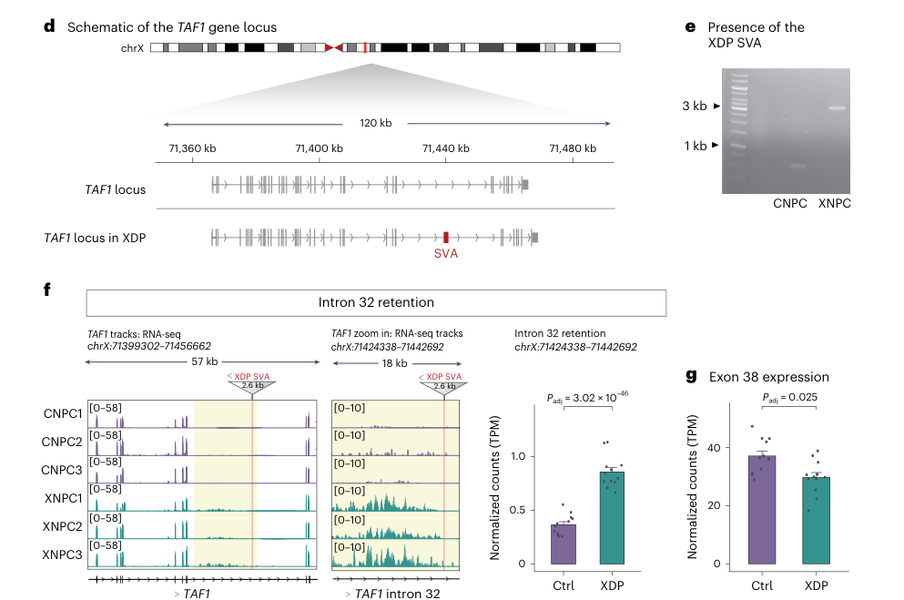

## Question

# Disease Characteristics Research Template

## Target Disease
- **Disease Name:** X-linked Dystonia-Parkinsonism
- **MONDO ID:**  (if available)
- **Category:** Mendelian

## Research Objectives

Please provide a comprehensive research report on **X-linked Dystonia-Parkinsonism** covering all of the
disease characteristics listed below. This report will be used to populate a disease knowledge
base entry. Be thorough and cite primary literature (PMID preferred) for all claims.

For each section, **suggested databases/resources** are listed. These are the first places
you should search for information on each topic.

---

### 1. Disease Information
> **Search first:** OMIM, Orphanet, ICD-10/ICD-11, MeSH, PubMed

- What is the disease? Provide a concise overview.
- What are the key identifiers? (OMIM, Orphanet, ICD-10/ICD-11, MeSH, Mondo)
- What are the common synonyms and alternative names?
- Is the information derived from individual patients (e.g., EHR) or aggregated disease-level resources?

### 2. Etiology

- **Disease Causal Factors**: What are the primary causes? (genetic, environmental, infectious, mechanistic)
- **Risk Factors**:
  > **Search first:** PubMed, Cochrane Library, UpToDate, clinical guidelines, ClinVar, ClinGen, GWAS Catalog, PheGenI, CTD, CDC, WHO, epidemiological databases
  - Genetic risk factors (causal variants, susceptibility loci, modifier genes)
  - Environmental risk factors (toxins, lifestyle, occupational exposures, age, sex, family history)
- **Protective Factors**:
  > **Search first:** PubMed, Cochrane Library, clinical trial databases, GWAS Catalog, gnomAD, WHO, CDC, nutrition databases
  - Genetic protective factors (protective variants, modifier alleles)
  - Environmental protective factors (diet, lifestyle, exposures that reduce risk)
- **Gene-Environment Interactions**: How do genetic and environmental factors interact to influence disease?
  > **Search first:** CTD, PubMed, PheGenI, GxE databases

### 3. Phenotypes
> **Search first:** HPO (Human Phenotype Ontology), OMIM, Orphanet, PubMed, clinicaltrials.gov, MedDRA, SNOMED CT, DECIPHER, LOINC

For each phenotype, provide:
- **Phenotype type**: symptoms, clinical signs, physical manifestations, behavioral changes, or laboratory abnormalities
  > For symptoms/signs: HPO, OMIM, Orphanet, PubMed
  > For behavioral changes: HPO, DSM, RDoC (Research Domain Criteria), PubMed
  > For laboratory abnormalities: LOINC, SNOMED CT, LabTests Online, PubMed
- **Phenotype characteristics**:
  > **Search first:** OMIM, Orphanet, HPO, PubMed
  - Age of symptom onset (neonatal, childhood, adult-onset, late-onset)
  - Symptom severity (mild, moderate, severe, variable)
  - Symptom progression (stable, progressive, episodic, fluctuating)
  - Frequency among affected individuals (percentage or qualitative)
- **Quality of life impact**: Effects on daily functioning and well-being (per-phenotype when possible)
  > **Search first:** EQ-5D database, SF-36, WHO QOL databases, PubMed
- Suggest HPO (Human Phenotype Ontology) terms for each phenotype

### 4. Genetic/Molecular Information

- **Causal Genes**: Gene mutations or chromosomal abnormalities responsible for disease (gene symbols, OMIM IDs)
  > **Search first:** OMIM, ClinVar, HGMD, Ensembl, NCBI Gene
- **Pathogenic Variants**:
  - Affected genes (gene symbols, HGNC IDs)
    > **Search first:** OMIM, NCBI Gene, Ensembl, HGNC, UniProt, GeneCards
  - Variant classification (pathogenic, likely pathogenic, VUS per ACMG/AMP guidelines)
    > **Search first:** ClinVar, ClinGen, ACMG/AMP guidelines, VarSome
  - Variant type/class (missense, frameshift, nonsense, splice-site, structural)
  - Allele frequency in population databases
    > **Search first:** gnomAD, 1000 Genomes, ExAC, TOPMed, dbSNP
  - Somatic vs germline origin
    > **Search first:** COSMIC (somatic), ClinVar, ICGC, TCGA
  - Functional consequences (loss of function, gain of function, dominant negative)
- **Modifier Genes**: Genes that modify disease severity or expression
- **Epigenetic Information**: DNA methylation, histone modifications, chromatin changes affecting disease
  > **Search first:** ENCODE, Roadmap Epigenomics, MethBase, DiseaseMeth
- **Chromosomal Abnormalities**: Large-scale genetic changes (aneuploidy, translocations, inversions)
  > **Search first:** DECIPHER, ClinVar, ECARUCA, UCSC Genome Browser

### 5. Environmental Information

- **Environmental Factors**: Non-genetic contributing factors (toxins, radiation, pollution, occupational exposure)
  > **Search first:** CTD (Comparative Toxicogenomics Database), TOXNET, PubMed, EPA databases
- **Lifestyle Factors**: Behavioral factors (smoking, diet, exercise, alcohol consumption)
  > **Search first:** CDC databases, WHO, PubMed, NHANES
- **Infectious Agents**: If applicable, pathogens causing or triggering disease (bacteria, viruses, fungi, parasites)
  > **Search first:** NCBI Taxonomy, ViPR, BV-BRC, MicrobeDB, GIDEON

### 6. Mechanism / Pathophysiology

- **Molecular Pathways**: Specific signaling cascades or biochemical pathways involved (Wnt, MAPK, mTOR, PI3K-AKT, etc.)
  > **Search first:** KEGG, Reactome, WikiPathways, PathBank, BioCyc
- **Cellular Processes**: Cell-level mechanisms (apoptosis, autophagy, cell cycle dysregulation, inflammation, etc.)
  > **Search first:** Gene Ontology (GO), Reactome, KEGG, PubMed
- **Protein Dysfunction**: How protein structure or function is altered (misfolding, aggregation, loss of function, gain of function)
  > **Search first:** UniProt, PDB (Protein Data Bank), InterPro, Pfam, AlphaFold
- **Metabolic Changes**: Alterations in metabolic processes (energy metabolism, lipid metabolism, amino acid metabolism)
  > **Search first:** KEGG, BioCyc, HMDB (Human Metabolome Database), BRENDA
- **Immune System Involvement**: Role of immune response (autoimmunity, immunodeficiency, chronic inflammation)
  > **Search first:** ImmPort, Immunome Database, IEDB, Gene Ontology
- **Tissue Damage Mechanisms**: How tissues/ are injured (oxidative stress, ischemia, fibrosis, necrosis)
  > **Search first:** PubMed, Gene Ontology, Reactome
- **Biochemical Abnormalities**: Specific molecular defects (enzyme deficiencies, receptor dysfunction, ion channel defects)
  > **Search first:** BRENDA, UniProt, KEGG, OMIM, PubMed
- **Epigenetic Changes**: DNA methylation, histone modifications affecting gene expression in disease
  > **Search first:** ENCODE, Roadmap Epigenomics, MethBase, DiseaseMeth
- **Molecular Profiling** (if available):
  - Transcriptomics/gene expression changes
    > **Search first:** GEO (Gene Expression Omnibus), ArrayExpress, GTEx, Human Cell Atlas, SRA
  - Proteomics findings
    > **Search first:** PRIDE, ProteomeXchange, Human Protein Atlas, STRING, BioGRID
  - Metabolomics signatures
    > **Search first:** MetaboLights, Metabolomics Workbench, HMDB, METLIN
  - Lipidomics alterations
    > **Search first:** LIPID MAPS, SwissLipids, LipidHome, Metabolomics Workbench
  - Genomic structural features
    > **Search first:** UCSC Genome Browser, Ensembl, NCBI, dbVar, DGV
- **Advanced Technologies** (if applicable):
  - Single-cell analysis findings (cell-type specific mechanisms, cellular heterogeneity)
    > **Search first:** Human Cell Atlas, Single Cell Portal, GEO, CELLxGENE
  - Spatial transcriptomics findings
    > **Search first:** GEO, Spatial Research, Vizgen, 10x Genomics data
  - Multi-omics integration results
    > **Search first:** TCGA, ICGC, cBioPortal, LinkedOmics, PubMed
  - Functional genomics screens (CRISPR, RNAi)
    > **Search first:** DepMap, GenomeRNAi, PubMed, BioGRID ORCS

For each mechanism, describe:
- The causal chain from initial trigger to clinical manifestation
- Which mechanisms are upstream vs downstream
- What cell types and biological processes are involved
- Suggest GO terms for biological processes and CL terms for cell types

### 7. Anatomical Structures Affected

- **Organ Level**:
  - Primary organs directly affected
  - Secondary organ involvement (complications, secondary effects)
  - Body systems involved (cardiovascular, nervous, digestive, respiratory, endocrine, etc.)
  > **Search first:** Uberon, FMA (Foundational Model of Anatomy), OMIM, HPO, ICD-11, MeSH, SNOMED CT
- **Tissue and Cell Level**:
  - Specific tissue types affected (epithelial, connective, muscle, nervous)
  - Specific cell populations targeted (with Cell Ontology terms)
  > **Search first:** Uberon, Human Protein Atlas, Cell Ontology, Human Cell Atlas, CellMarker, PanglaoDB
- **Subcellular Level**:
  - Cellular compartments involved (mitochondria, nucleus, ER, lysosomes) (with GO Cellular Component terms)
  > **Search first:** Gene Ontology (Cellular Component), UniProt, Human Protein Atlas
- **Localization**:
  - Specific anatomical sites (with UBERON terms)
    > **Search first:** FMA, Uberon, NeuroNames (for brain), SNOMED CT
  - Lateralization (unilateral, bilateral, asymmetric)
    > **Search first:** HPO, clinical literature, imaging databases

### 8. Temporal Development

- **Onset**:
  - Typical age of onset (congenital, pediatric, adult, geriatric)
  - Onset pattern (acute, subacute, chronic, insidious)
  > **Search first:** OMIM, Orphanet, HPO, PubMed
- **Progression**:
  - Disease stages (early, intermediate, advanced, end-stage)
    > **Search first:** Cancer Staging Manual (AJCC), WHO classifications, PubMed
  - Progression rate (rapid, slow, variable)
  - Disease course pattern (episodic, relapsing-remitting, progressive, stable)
  - Disease duration (self-limited, chronic lifelong)
  > **Search first:** Disease registries, longitudinal cohort databases, natural history studies, PubMed, Orphanet, OMIM
- **Patterns**:
  - Remission patterns (spontaneous, treatment-induced)
    > **Search first:** Clinical trial databases, disease registries, PubMed
  - Critical periods (time windows of vulnerability or opportunity for intervention)
    > **Search first:** PubMed, developmental biology databases, clinical guidelines

### 9. Inheritance and Population

- **Epidemiology**:
  - Prevalence (cases per 100,000 at given time)
  - Incidence (new cases per 100,000 per year)
  > **Search first:** Orphanet, CDC, WHO, GBD (Global Burden of Disease), national registries, SEER, disease registries
- **For Genetic Etiology**:
  - Inheritance pattern (AD, AR, X-linked, mitochondrial, multifactorial, polygenic)
    > **Search first:** OMIM, Orphanet, ClinVar, GTR (Genetic Testing Registry)
  - Penetrance (complete, incomplete, age-dependent)
    > **Search first:** ClinVar, OMIM, PubMed, ClinGen
  - Expressivity (variable, consistent)
    > **Search first:** OMIM, ClinVar, PubMed
  - Genetic anticipation (increasing severity in successive generations)
    > **Search first:** OMIM, PubMed (especially for repeat expansion disorders)
  - Germline mosaicism
    > **Search first:** ClinVar, OMIM, genetic counseling literature, PubMed
  - Founder effects (population-specific mutations)
    > **Search first:** gnomAD, population genetics databases, PubMed
  - Consanguinity role
    > **Search first:** OMIM, population studies, genetic counseling resources
  - Carrier frequency
    > **Search first:** gnomAD, carrier screening databases, GeneReviews, GTR
- **Population Demographics**:
  - Affected populations (ethnic or demographic groups with higher prevalence)
    > **Search first:** gnomAD, 1000 Genomes, PAGE Study, PubMed, population registries
  - Geographic distribution (endemic areas, regional variation)
    > **Search first:** WHO, CDC, GBD, Orphanet, geographic epidemiology databases
  - Geographic distribution of specific variants
  - Sex ratio (male:female)
    > **Search first:** Disease registries, OMIM, PubMed, epidemiological databases
  - Age distribution of affected individuals
    > **Search first:** CDC, disease registries, SEER, Orphanet

### 10. Diagnostics

- **Clinical Tests**:
  - Laboratory tests (blood, urine, tissue chemistry, specific enzyme assays)
    > **Search first:** LOINC, LabTests Online, PubMed
  - Biomarkers (proteins, metabolites, genetic markers, circulating biomarkers)
    > **Search first:** FDA Biomarker List, BEST (Biomarkers, EndpointS, and other Tools), PubMed
  - Imaging studies (X-ray, CT, MRI, PET, ultrasound)
    > **Search first:** RadLex, DICOM, Radiopaedia, imaging databases
  - Functional tests (pulmonary function, cardiac stress tests)
    > **Search first:** LOINC, clinical guidelines, PubMed
  - Electrophysiology (EEG, EMG, ECG, nerve conduction studies)
    > **Search first:** LOINC, clinical neurophysiology databases, PubMed
  - Biopsy findings (histopathology, immunohistochemistry)
    > **Search first:** SNOMED CT, College of American Pathologists resources, PubMed
  - Pathology findings (microscopic examination)
    > **Search first:** SNOMED CT, Digital Pathology databases, PubMed
- **Genetic Testing**:
  > **Search first:** GTR (Genetic Testing Registry), GeneReviews, ClinGen
  - Overview of recommended genetic testing approach
  - Whole genome sequencing (WGS) utility
    > **Search first:** GTR, ClinVar, GEL (Genomics England), gnomAD
  - Whole exome sequencing (WES) utility
    > **Search first:** GTR, ClinVar, OMIM, GeneMatcher
  - Gene panels (which panels, which genes)
    > **Search first:** GTR, ClinVar, laboratory-specific databases
  - Single gene testing
    > **Search first:** GTR, ClinVar, OMIM, GeneReviews
  - Chromosomal microarray (CMA)
    > **Search first:** DECIPHER, ClinVar, dbVar, ECARUCA
  - Karyotyping
    > **Search first:** Chromosome Abnormality Database, ClinVar, cytogenetics resources
  - FISH
    > **Search first:** ClinVar, cytogenetics databases, PubMed
  - Mitochondrial DNA testing
    > **Search first:** MITOMAP, MSeqDR, ClinVar, GTR
  - Repeat expansion testing
    > **Search first:** GTR, ClinVar, repeat expansion databases, PubMed
- **Omics-Based Diagnostics** (if applicable):
  - RNA sequencing / transcriptomics
    > **Search first:** GEO, ArrayExpress, GTEx, RNA-seq databases
  - Proteomics
    > **Search first:** PRIDE, ProteomeXchange, FDA Biomarker database
  - Metabolomics
    > **Search first:** MetaboLights, Metabolomics Workbench, HMDB
  - Epigenomics
    > **Search first:** GEO, ENCODE, Roadmap Epigenomics, MethBase
  - Liquid biopsy
    > **Search first:** COSMIC, ClinVar, liquid biopsy databases, PubMed
- **Clinical Criteria**:
  - Standardized diagnostic criteria (DSM, ICD, society guidelines)
    > **Search first:** DSM-5, ICD-11, clinical society guidelines, UpToDate
  - Differential diagnosis (other conditions to rule out, with distinguishing features)
    > **Search first:** DynaMed, UpToDate, clinical decision support systems
- **Screening**:
  - Screening methods for asymptomatic individuals (newborn screening, carrier screening, cascade screening)
    > **Search first:** ACMG recommendations, CDC newborn screening, GTR

### 11. Outcome/Prognosis

- **Survival and Mortality**:
  - Survival rate (5-year, 10-year, overall)
    > **Search first:** SEER, cancer registries, disease-specific registries, PubMed
  - Life expectancy (with and without treatment if applicable)
    > **Search first:** Orphanet, disease registries, actuarial databases, PubMed
  - Mortality rate
    > **Search first:** CDC, WHO, GBD, national mortality databases
  - Disease-specific mortality (deaths directly attributable to disease)
    > **Search first:** Disease registries, CDC Wonder, GBD, PubMed
- **Morbidity and Function**:
  - Morbidity (disease-related disability and health impacts)
    > **Search first:** GBD, WHO, disability databases, PubMed
  - Disability outcomes (long-term functional impairments)
    > **Search first:** ICF (International Classification of Functioning), disability registries
  - Quality of life measures (EQ-5D, SF-36, PROMIS, disease-specific tools)
    > **Search first:** EQ-5D database, SF-36, PROMIS, PubMed
- **Disease Course**:
  - Complications (secondary problems: infections, organ failure, etc.)
    > **Search first:** ICD codes, disease registries, clinical databases, PubMed
  - Recovery potential (likelihood and extent of recovery, with vs without treatment)
    > **Search first:** Natural history studies, rehabilitation databases, PubMed
- **Prediction**:
  - Prognostic factors (age, disease severity, biomarkers, treatment response)
    > **Search first:** Prognostic models databases, clinical calculators, PubMed
  - Prognostic biomarkers (molecular markers predicting disease course)
    > **Search first:** FDA Biomarker database, PubMed, cancer prognostic databases

### 12. Treatment

- **Pharmacotherapy**:
  - Pharmacological treatments (drug names, drug classes, mechanisms of action)
    > **Search first:** DrugBank, RxNorm, ATC classification, DailyMed, FDA databases
  - Pharmacogenomics (how genetic variants affect drug metabolism, efficacy, toxicity)
    > **Search first:** PharmGKB, CPIC (Clinical Pharmacogenetics), FDA Table of PGx Biomarkers
- **Advanced Therapeutics**:
  - Gene therapy (viral vectors, CRISPR, gene replacement, gene editing)
    > **Search first:** ClinicalTrials.gov, FDA gene therapy database, ASGCT resources
  - Cell therapy (stem cell transplant, CAR-T, cellular therapeutics)
    > **Search first:** ClinicalTrials.gov, FDA cell therapy database, FACT standards
  - RNA-based therapies (ASOs, siRNA, mRNA therapies)
    > **Search first:** ClinicalTrials.gov, FDA approvals, PubMed
  - Targeted therapies (treatments directed at specific molecular targets)
    > **Search first:** My Cancer Genome, OncoKB, ClinicalTrials.gov, FDA approvals
  - Immunotherapies (checkpoint inhibitors, monoclonal antibodies)
    > **Search first:** Cancer Immunotherapy Database, FDA approvals, ClinicalTrials.gov
- **Surgical and Interventional**:
  - Surgical interventions (types of surgery, timing, outcomes)
    > **Search first:** CPT codes, surgical registries, clinical guidelines, PubMed
- **Supportive and Rehabilitative**:
  - Supportive care (symptom management, pain control, nutrition)
    > **Search first:** Clinical guidelines, Cochrane Library, PubMed
  - Rehabilitation (physical therapy, occupational therapy, speech therapy)
    > **Search first:** Rehabilitation medicine databases, clinical guidelines, PubMed
- **Experimental**:
  - Experimental treatments in clinical trials (with NCT identifiers if available)
    > **Search first:** ClinicalTrials.gov, EU Clinical Trials Register, WHO ICTRP
- **Treatment Outcomes**:
  - Treatment response rates
    > **Search first:** Clinical trial databases, FDA reviews, systematic reviews, PubMed
  - Side effects and adverse events
    > **Search first:** FDA Adverse Event Reporting System (FAERS), MedWatch, PubMed
- **Treatment Strategy**:
  - Treatment algorithms (clinical pathways, decision trees)
    > **Search first:** Clinical practice guidelines, NCCN Guidelines, UpToDate
  - Combination therapies
    > **Search first:** ClinicalTrials.gov, treatment guidelines, PubMed
  - Personalized medicine approaches (genotype-guided treatment)
    > **Search first:** My Cancer Genome, CIViC, PharmGKB, precision medicine databases

For each treatment, suggest MAXO (Medical Action Ontology) terms where applicable.

### 13. Prevention

- **Prevention Levels**:
  - Primary prevention (preventing disease occurrence: vaccination, risk factor modification)
    > **Search first:** CDC, WHO, USPSTF recommendations, Cochrane Library
  - Secondary prevention (early detection and treatment: screening programs, early intervention)
    > **Search first:** USPSTF, CDC screening guidelines, WHO
  - Tertiary prevention (preventing complications in those with disease)
    > **Search first:** Clinical guidelines, disease management protocols, PubMed
- **Immunization**: Vaccine strategies (if applicable)
  > **Search first:** CDC vaccine schedules, WHO immunization, FDA vaccine database
- **Screening and Early Detection**:
  - Screening programs (population-based: newborn screening, cancer screening)
    > **Search first:** CDC screening programs, USPSTF, cancer screening databases
  - Genetic screening (carrier screening, preimplantation genetic diagnosis, prenatal testing)
    > **Search first:** ACMG recommendations, ACOG guidelines, GTR
  - Risk stratification (identifying high-risk individuals for targeted prevention)
    > **Search first:** Risk prediction models, clinical calculators, PubMed
- **Behavioral Interventions**: Lifestyle modifications to reduce risk
  > **Search first:** CDC, WHO, behavioral intervention databases, Cochrane Library
- **Counseling**: Genetic counseling (risk assessment, family planning guidance)
  > **Search first:** NSGC resources, ACMG guidelines, GeneReviews
- **Public Health**:
  - Public health interventions (sanitation, vector control, health education)
    > **Search first:** CDC, WHO, public health databases, PubMed
  - Environmental interventions (reducing environmental risk factors)
    > **Search first:** EPA databases, WHO environmental health, PubMed
- **Prophylaxis**: Preventive medications or procedures
  > **Search first:** Clinical guidelines, FDA approvals, PubMed

### 14. Other Species / Natural Disease

- **Taxonomy**: Species affected (with NCBI Taxon identifiers)
  > **Search first:** NCBI Taxonomy
- **Breed**: Specific breeds affected (with VBO identifiers if applicable)
  > **Search first:** VBO (Vertebrate Breed Ontology)
- **Gene**: Orthologous genes in other species (with NCBI Gene IDs)
  > **Search first:** NCBI Gene
- **Natural Disease**:
  - Naturally occurring disease in other species (companion animals, wildlife)
    > **Search first:** OMIA (Online Mendelian Inheritance in Animals), VetCompass, PubMed
  - Veterinary relevance and importance in animal health
    > **Search first:** OMIA, veterinary databases, PubMed
- **Comparative Biology**:
  - Comparative pathology (similarities and differences across species)
    > **Search first:** OMIA, comparative pathology databases, PubMed
  - Evolutionary conservation of disease mechanisms
    > **Search first:** HomoloGene, OrthoMCL, Alliance of Genome Resources
- **Transmission** (if applicable):
  - Zoonotic potential
    > **Search first:** CDC zoonotic diseases, WHO zoonoses, GIDEON
  - Cross-species susceptibility
    > **Search first:** NCBI Taxonomy, veterinary databases, PubMed

### 15. Model Organisms

- **Model Types**:
  - Model organism type (mammalian, invertebrate, cellular, in vitro)
    > **Search first:** Alliance of Genome Resources, model organism databases
  - Specific model systems (mouse, rat, zebrafish, Drosophila, C. elegans, yeast, cell lines, organoids, iPSCs)
    > **Search first:** MGI, RGD, ZFIN, FlyBase, WormBase, SGD, ATCC, Cellosaurus
  - Induced models (drug treatment, surgical intervention, environmental manipulation)
    > **Search first:** MGI, model organism databases, PubMed
- **Genetic Models**:
  - Types available (knockout, knock-in, transgenic, conditional, humanized)
    > **Search first:** MGI, IMPC, KOMP, EuMMCR, IMSR
- **Model Characteristics**:
  - Phenotype recapitulation (how well model reproduces human disease features)
    > **Search first:** Model organism databases, comparative studies, PubMed
  - Model limitations (aspects of human disease not captured)
    > **Search first:** Model organism databases, PubMed, review articles
- **Applications**:
  - Research applications (what aspects of disease can be studied)
    > **Search first:** Model organism databases, PubMed
- **Resources**:
  - Model databases
    > **Search first:** MGI, RGD, ZFIN, FlyBase, WormBase, IMSR, EMMA, MMRRC

---

## Citation Requirements

- Cite primary literature (PMID preferred) for all mechanistic and clinical claims
- Prioritize recent reviews and landmark papers
- Include direct quotes from abstracts where possible to support key statements
- Distinguish evidence source types: human clinical, model organism, in vitro, computational

## Output Format

Structure your response as a comprehensive narrative organized by the sections above.
For each section, provide:
- Factual content with specific details (numbers, percentages, gene names, variant nomenclature)
- Ontology term suggestions (HPO, GO, CL, UBERON, CHEBI, MAXO, MONDO) where applicable
- Evidence citations with PMIDs
- Direct quotes from abstracts to support key claims
- Clear indication when information is not available or not applicable for this disease

This report will be used to populate a disease knowledge base entry with:
- Pathophysiology descriptions with causal chains
- Gene/protein annotations (HGNC, GO terms)
- Phenotype associations (HP terms) with frequencies
- Cell type involvement (CL terms)
- Anatomical locations (UBERON terms)
- Chemical entities (CHEBI terms)
- Treatment annotations (MAXO terms)
- Evidence items with PMIDs and exact abstract quotes
- Epidemiology, prognosis, diagnostic, and prevention information
- Animal model descriptions with phenotype recapitulation details

## Output

Question: You are an expert researcher providing comprehensive, well-cited information.

Provide detailed information focusing on:
1. Key concepts and definitions with current understanding
2. Recent developments and latest research (prioritize 2023-2024 sources)
3. Current applications and real-world implementations
4. Expert opinions and analysis from authoritative sources
5. Relevant statistics and data from recent studies

Format as a comprehensive research report with proper citations. Include URLs and publication dates where available.
Always prioritize recent, authoritative sources and provide specific citations for all major claims.

# Disease Characteristics Research Template

## Target Disease
- **Disease Name:** X-linked Dystonia-Parkinsonism
- **MONDO ID:**  (if available)
- **Category:** Mendelian

## Research Objectives

Please provide a comprehensive research report on **X-linked Dystonia-Parkinsonism** covering all of the
disease characteristics listed below. This report will be used to populate a disease knowledge
base entry. Be thorough and cite primary literature (PMID preferred) for all claims.

For each section, **suggested databases/resources** are listed. These are the first places
you should search for information on each topic.

---

### 1. Disease Information
> **Search first:** OMIM, Orphanet, ICD-10/ICD-11, MeSH, PubMed

- What is the disease? Provide a concise overview.
- What are the key identifiers? (OMIM, Orphanet, ICD-10/ICD-11, MeSH, Mondo)
- What are the common synonyms and alternative names?
- Is the information derived from individual patients (e.g., EHR) or aggregated disease-level resources?

### 2. Etiology

- **Disease Causal Factors**: What are the primary causes? (genetic, environmental, infectious, mechanistic)
- **Risk Factors**:
  > **Search first:** PubMed, Cochrane Library, UpToDate, clinical guidelines, ClinVar, ClinGen, GWAS Catalog, PheGenI, CTD, CDC, WHO, epidemiological databases
  - Genetic risk factors (causal variants, susceptibility loci, modifier genes)
  - Environmental risk factors (toxins, lifestyle, occupational exposures, age, sex, family history)
- **Protective Factors**:
  > **Search first:** PubMed, Cochrane Library, clinical trial databases, GWAS Catalog, gnomAD, WHO, CDC, nutrition databases
  - Genetic protective factors (protective variants, modifier alleles)
  - Environmental protective factors (diet, lifestyle, exposures that reduce risk)
- **Gene-Environment Interactions**: How do genetic and environmental factors interact to influence disease?
  > **Search first:** CTD, PubMed, PheGenI, GxE databases

### 3. Phenotypes
> **Search first:** HPO (Human Phenotype Ontology), OMIM, Orphanet, PubMed, clinicaltrials.gov, MedDRA, SNOMED CT, DECIPHER, LOINC

For each phenotype, provide:
- **Phenotype type**: symptoms, clinical signs, physical manifestations, behavioral changes, or laboratory abnormalities
  > For symptoms/signs: HPO, OMIM, Orphanet, PubMed
  > For behavioral changes: HPO, DSM, RDoC (Research Domain Criteria), PubMed
  > For laboratory abnormalities: LOINC, SNOMED CT, LabTests Online, PubMed
- **Phenotype characteristics**:
  > **Search first:** OMIM, Orphanet, HPO, PubMed
  - Age of symptom onset (neonatal, childhood, adult-onset, late-onset)
  - Symptom severity (mild, moderate, severe, variable)
  - Symptom progression (stable, progressive, episodic, fluctuating)
  - Frequency among affected individuals (percentage or qualitative)
- **Quality of life impact**: Effects on daily functioning and well-being (per-phenotype when possible)
  > **Search first:** EQ-5D database, SF-36, WHO QOL databases, PubMed
- Suggest HPO (Human Phenotype Ontology) terms for each phenotype

### 4. Genetic/Molecular Information

- **Causal Genes**: Gene mutations or chromosomal abnormalities responsible for disease (gene symbols, OMIM IDs)
  > **Search first:** OMIM, ClinVar, HGMD, Ensembl, NCBI Gene
- **Pathogenic Variants**:
  - Affected genes (gene symbols, HGNC IDs)
    > **Search first:** OMIM, NCBI Gene, Ensembl, HGNC, UniProt, GeneCards
  - Variant classification (pathogenic, likely pathogenic, VUS per ACMG/AMP guidelines)
    > **Search first:** ClinVar, ClinGen, ACMG/AMP guidelines, VarSome
  - Variant type/class (missense, frameshift, nonsense, splice-site, structural)
  - Allele frequency in population databases
    > **Search first:** gnomAD, 1000 Genomes, ExAC, TOPMed, dbSNP
  - Somatic vs germline origin
    > **Search first:** COSMIC (somatic), ClinVar, ICGC, TCGA
  - Functional consequences (loss of function, gain of function, dominant negative)
- **Modifier Genes**: Genes that modify disease severity or expression
- **Epigenetic Information**: DNA methylation, histone modifications, chromatin changes affecting disease
  > **Search first:** ENCODE, Roadmap Epigenomics, MethBase, DiseaseMeth
- **Chromosomal Abnormalities**: Large-scale genetic changes (aneuploidy, translocations, inversions)
  > **Search first:** DECIPHER, ClinVar, ECARUCA, UCSC Genome Browser

### 5. Environmental Information

- **Environmental Factors**: Non-genetic contributing factors (toxins, radiation, pollution, occupational exposure)
  > **Search first:** CTD (Comparative Toxicogenomics Database), TOXNET, PubMed, EPA databases
- **Lifestyle Factors**: Behavioral factors (smoking, diet, exercise, alcohol consumption)
  > **Search first:** CDC databases, WHO, PubMed, NHANES
- **Infectious Agents**: If applicable, pathogens causing or triggering disease (bacteria, viruses, fungi, parasites)
  > **Search first:** NCBI Taxonomy, ViPR, BV-BRC, MicrobeDB, GIDEON

### 6. Mechanism / Pathophysiology

- **Molecular Pathways**: Specific signaling cascades or biochemical pathways involved (Wnt, MAPK, mTOR, PI3K-AKT, etc.)
  > **Search first:** KEGG, Reactome, WikiPathways, PathBank, BioCyc
- **Cellular Processes**: Cell-level mechanisms (apoptosis, autophagy, cell cycle dysregulation, inflammation, etc.)
  > **Search first:** Gene Ontology (GO), Reactome, KEGG, PubMed
- **Protein Dysfunction**: How protein structure or function is altered (misfolding, aggregation, loss of function, gain of function)
  > **Search first:** UniProt, PDB (Protein Data Bank), InterPro, Pfam, AlphaFold
- **Metabolic Changes**: Alterations in metabolic processes (energy metabolism, lipid metabolism, amino acid metabolism)
  > **Search first:** KEGG, BioCyc, HMDB (Human Metabolome Database), BRENDA
- **Immune System Involvement**: Role of immune response (autoimmunity, immunodeficiency, chronic inflammation)
  > **Search first:** ImmPort, Immunome Database, IEDB, Gene Ontology
- **Tissue Damage Mechanisms**: How tissues/ are injured (oxidative stress, ischemia, fibrosis, necrosis)
  > **Search first:** PubMed, Gene Ontology, Reactome
- **Biochemical Abnormalities**: Specific molecular defects (enzyme deficiencies, receptor dysfunction, ion channel defects)
  > **Search first:** BRENDA, UniProt, KEGG, OMIM, PubMed
- **Epigenetic Changes**: DNA methylation, histone modifications affecting gene expression in disease
  > **Search first:** ENCODE, Roadmap Epigenomics, MethBase, DiseaseMeth
- **Molecular Profiling** (if available):
  - Transcriptomics/gene expression changes
    > **Search first:** GEO (Gene Expression Omnibus), ArrayExpress, GTEx, Human Cell Atlas, SRA
  - Proteomics findings
    > **Search first:** PRIDE, ProteomeXchange, Human Protein Atlas, STRING, BioGRID
  - Metabolomics signatures
    > **Search first:** MetaboLights, Metabolomics Workbench, HMDB, METLIN
  - Lipidomics alterations
    > **Search first:** LIPID MAPS, SwissLipids, LipidHome, Metabolomics Workbench
  - Genomic structural features
    > **Search first:** UCSC Genome Browser, Ensembl, NCBI, dbVar, DGV
- **Advanced Technologies** (if applicable):
  - Single-cell analysis findings (cell-type specific mechanisms, cellular heterogeneity)
    > **Search first:** Human Cell Atlas, Single Cell Portal, GEO, CELLxGENE
  - Spatial transcriptomics findings
    > **Search first:** GEO, Spatial Research, Vizgen, 10x Genomics data
  - Multi-omics integration results
    > **Search first:** TCGA, ICGC, cBioPortal, LinkedOmics, PubMed
  - Functional genomics screens (CRISPR, RNAi)
    > **Search first:** DepMap, GenomeRNAi, PubMed, BioGRID ORCS

For each mechanism, describe:
- The causal chain from initial trigger to clinical manifestation
- Which mechanisms are upstream vs downstream
- What cell types and biological processes are involved
- Suggest GO terms for biological processes and CL terms for cell types

### 7. Anatomical Structures Affected

- **Organ Level**:
  - Primary organs directly affected
  - Secondary organ involvement (complications, secondary effects)
  - Body systems involved (cardiovascular, nervous, digestive, respiratory, endocrine, etc.)
  > **Search first:** Uberon, FMA (Foundational Model of Anatomy), OMIM, HPO, ICD-11, MeSH, SNOMED CT
- **Tissue and Cell Level**:
  - Specific tissue types affected (epithelial, connective, muscle, nervous)
  - Specific cell populations targeted (with Cell Ontology terms)
  > **Search first:** Uberon, Human Protein Atlas, Cell Ontology, Human Cell Atlas, CellMarker, PanglaoDB
- **Subcellular Level**:
  - Cellular compartments involved (mitochondria, nucleus, ER, lysosomes) (with GO Cellular Component terms)
  > **Search first:** Gene Ontology (Cellular Component), UniProt, Human Protein Atlas
- **Localization**:
  - Specific anatomical sites (with UBERON terms)
    > **Search first:** FMA, Uberon, NeuroNames (for brain), SNOMED CT
  - Lateralization (unilateral, bilateral, asymmetric)
    > **Search first:** HPO, clinical literature, imaging databases

### 8. Temporal Development

- **Onset**:
  - Typical age of onset (congenital, pediatric, adult, geriatric)
  - Onset pattern (acute, subacute, chronic, insidious)
  > **Search first:** OMIM, Orphanet, HPO, PubMed
- **Progression**:
  - Disease stages (early, intermediate, advanced, end-stage)
    > **Search first:** Cancer Staging Manual (AJCC), WHO classifications, PubMed
  - Progression rate (rapid, slow, variable)
  - Disease course pattern (episodic, relapsing-remitting, progressive, stable)
  - Disease duration (self-limited, chronic lifelong)
  > **Search first:** Disease registries, longitudinal cohort databases, natural history studies, PubMed, Orphanet, OMIM
- **Patterns**:
  - Remission patterns (spontaneous, treatment-induced)
    > **Search first:** Clinical trial databases, disease registries, PubMed
  - Critical periods (time windows of vulnerability or opportunity for intervention)
    > **Search first:** PubMed, developmental biology databases, clinical guidelines

### 9. Inheritance and Population

- **Epidemiology**:
  - Prevalence (cases per 100,000 at given time)
  - Incidence (new cases per 100,000 per year)
  > **Search first:** Orphanet, CDC, WHO, GBD (Global Burden of Disease), national registries, SEER, disease registries
- **For Genetic Etiology**:
  - Inheritance pattern (AD, AR, X-linked, mitochondrial, multifactorial, polygenic)
    > **Search first:** OMIM, Orphanet, ClinVar, GTR (Genetic Testing Registry)
  - Penetrance (complete, incomplete, age-dependent)
    > **Search first:** ClinVar, OMIM, PubMed, ClinGen
  - Expressivity (variable, consistent)
    > **Search first:** OMIM, ClinVar, PubMed
  - Genetic anticipation (increasing severity in successive generations)
    > **Search first:** OMIM, PubMed (especially for repeat expansion disorders)
  - Germline mosaicism
    > **Search first:** ClinVar, OMIM, genetic counseling literature, PubMed
  - Founder effects (population-specific mutations)
    > **Search first:** gnomAD, population genetics databases, PubMed
  - Consanguinity role
    > **Search first:** OMIM, population studies, genetic counseling resources
  - Carrier frequency
    > **Search first:** gnomAD, carrier screening databases, GeneReviews, GTR
- **Population Demographics**:
  - Affected populations (ethnic or demographic groups with higher prevalence)
    > **Search first:** gnomAD, 1000 Genomes, PAGE Study, PubMed, population registries
  - Geographic distribution (endemic areas, regional variation)
    > **Search first:** WHO, CDC, GBD, Orphanet, geographic epidemiology databases
  - Geographic distribution of specific variants
  - Sex ratio (male:female)
    > **Search first:** Disease registries, OMIM, PubMed, epidemiological databases
  - Age distribution of affected individuals
    > **Search first:** CDC, disease registries, SEER, Orphanet

### 10. Diagnostics

- **Clinical Tests**:
  - Laboratory tests (blood, urine, tissue chemistry, specific enzyme assays)
    > **Search first:** LOINC, LabTests Online, PubMed
  - Biomarkers (proteins, metabolites, genetic markers, circulating biomarkers)
    > **Search first:** FDA Biomarker List, BEST (Biomarkers, EndpointS, and other Tools), PubMed
  - Imaging studies (X-ray, CT, MRI, PET, ultrasound)
    > **Search first:** RadLex, DICOM, Radiopaedia, imaging databases
  - Functional tests (pulmonary function, cardiac stress tests)
    > **Search first:** LOINC, clinical guidelines, PubMed
  - Electrophysiology (EEG, EMG, ECG, nerve conduction studies)
    > **Search first:** LOINC, clinical neurophysiology databases, PubMed
  - Biopsy findings (histopathology, immunohistochemistry)
    > **Search first:** SNOMED CT, College of American Pathologists resources, PubMed
  - Pathology findings (microscopic examination)
    > **Search first:** SNOMED CT, Digital Pathology databases, PubMed
- **Genetic Testing**:
  > **Search first:** GTR (Genetic Testing Registry), GeneReviews, ClinGen
  - Overview of recommended genetic testing approach
  - Whole genome sequencing (WGS) utility
    > **Search first:** GTR, ClinVar, GEL (Genomics England), gnomAD
  - Whole exome sequencing (WES) utility
    > **Search first:** GTR, ClinVar, OMIM, GeneMatcher
  - Gene panels (which panels, which genes)
    > **Search first:** GTR, ClinVar, laboratory-specific databases
  - Single gene testing
    > **Search first:** GTR, ClinVar, OMIM, GeneReviews
  - Chromosomal microarray (CMA)
    > **Search first:** DECIPHER, ClinVar, dbVar, ECARUCA
  - Karyotyping
    > **Search first:** Chromosome Abnormality Database, ClinVar, cytogenetics resources
  - FISH
    > **Search first:** ClinVar, cytogenetics databases, PubMed
  - Mitochondrial DNA testing
    > **Search first:** MITOMAP, MSeqDR, ClinVar, GTR
  - Repeat expansion testing
    > **Search first:** GTR, ClinVar, repeat expansion databases, PubMed
- **Omics-Based Diagnostics** (if applicable):
  - RNA sequencing / transcriptomics
    > **Search first:** GEO, ArrayExpress, GTEx, RNA-seq databases
  - Proteomics
    > **Search first:** PRIDE, ProteomeXchange, FDA Biomarker database
  - Metabolomics
    > **Search first:** MetaboLights, Metabolomics Workbench, HMDB
  - Epigenomics
    > **Search first:** GEO, ENCODE, Roadmap Epigenomics, MethBase
  - Liquid biopsy
    > **Search first:** COSMIC, ClinVar, liquid biopsy databases, PubMed
- **Clinical Criteria**:
  - Standardized diagnostic criteria (DSM, ICD, society guidelines)
    > **Search first:** DSM-5, ICD-11, clinical society guidelines, UpToDate
  - Differential diagnosis (other conditions to rule out, with distinguishing features)
    > **Search first:** DynaMed, UpToDate, clinical decision support systems
- **Screening**:
  - Screening methods for asymptomatic individuals (newborn screening, carrier screening, cascade screening)
    > **Search first:** ACMG recommendations, CDC newborn screening, GTR

### 11. Outcome/Prognosis

- **Survival and Mortality**:
  - Survival rate (5-year, 10-year, overall)
    > **Search first:** SEER, cancer registries, disease-specific registries, PubMed
  - Life expectancy (with and without treatment if applicable)
    > **Search first:** Orphanet, disease registries, actuarial databases, PubMed
  - Mortality rate
    > **Search first:** CDC, WHO, GBD, national mortality databases
  - Disease-specific mortality (deaths directly attributable to disease)
    > **Search first:** Disease registries, CDC Wonder, GBD, PubMed
- **Morbidity and Function**:
  - Morbidity (disease-related disability and health impacts)
    > **Search first:** GBD, WHO, disability databases, PubMed
  - Disability outcomes (long-term functional impairments)
    > **Search first:** ICF (International Classification of Functioning), disability registries
  - Quality of life measures (EQ-5D, SF-36, PROMIS, disease-specific tools)
    > **Search first:** EQ-5D database, SF-36, PROMIS, PubMed
- **Disease Course**:
  - Complications (secondary problems: infections, organ failure, etc.)
    > **Search first:** ICD codes, disease registries, clinical databases, PubMed
  - Recovery potential (likelihood and extent of recovery, with vs without treatment)
    > **Search first:** Natural history studies, rehabilitation databases, PubMed
- **Prediction**:
  - Prognostic factors (age, disease severity, biomarkers, treatment response)
    > **Search first:** Prognostic models databases, clinical calculators, PubMed
  - Prognostic biomarkers (molecular markers predicting disease course)
    > **Search first:** FDA Biomarker database, PubMed, cancer prognostic databases

### 12. Treatment

- **Pharmacotherapy**:
  - Pharmacological treatments (drug names, drug classes, mechanisms of action)
    > **Search first:** DrugBank, RxNorm, ATC classification, DailyMed, FDA databases
  - Pharmacogenomics (how genetic variants affect drug metabolism, efficacy, toxicity)
    > **Search first:** PharmGKB, CPIC (Clinical Pharmacogenetics), FDA Table of PGx Biomarkers
- **Advanced Therapeutics**:
  - Gene therapy (viral vectors, CRISPR, gene replacement, gene editing)
    > **Search first:** ClinicalTrials.gov, FDA gene therapy database, ASGCT resources
  - Cell therapy (stem cell transplant, CAR-T, cellular therapeutics)
    > **Search first:** ClinicalTrials.gov, FDA cell therapy database, FACT standards
  - RNA-based therapies (ASOs, siRNA, mRNA therapies)
    > **Search first:** ClinicalTrials.gov, FDA approvals, PubMed
  - Targeted therapies (treatments directed at specific molecular targets)
    > **Search first:** My Cancer Genome, OncoKB, ClinicalTrials.gov, FDA approvals
  - Immunotherapies (checkpoint inhibitors, monoclonal antibodies)
    > **Search first:** Cancer Immunotherapy Database, FDA approvals, ClinicalTrials.gov
- **Surgical and Interventional**:
  - Surgical interventions (types of surgery, timing, outcomes)
    > **Search first:** CPT codes, surgical registries, clinical guidelines, PubMed
- **Supportive and Rehabilitative**:
  - Supportive care (symptom management, pain control, nutrition)
    > **Search first:** Clinical guidelines, Cochrane Library, PubMed
  - Rehabilitation (physical therapy, occupational therapy, speech therapy)
    > **Search first:** Rehabilitation medicine databases, clinical guidelines, PubMed
- **Experimental**:
  - Experimental treatments in clinical trials (with NCT identifiers if available)
    > **Search first:** ClinicalTrials.gov, EU Clinical Trials Register, WHO ICTRP
- **Treatment Outcomes**:
  - Treatment response rates
    > **Search first:** Clinical trial databases, FDA reviews, systematic reviews, PubMed
  - Side effects and adverse events
    > **Search first:** FDA Adverse Event Reporting System (FAERS), MedWatch, PubMed
- **Treatment Strategy**:
  - Treatment algorithms (clinical pathways, decision trees)
    > **Search first:** Clinical practice guidelines, NCCN Guidelines, UpToDate
  - Combination therapies
    > **Search first:** ClinicalTrials.gov, treatment guidelines, PubMed
  - Personalized medicine approaches (genotype-guided treatment)
    > **Search first:** My Cancer Genome, CIViC, PharmGKB, precision medicine databases

For each treatment, suggest MAXO (Medical Action Ontology) terms where applicable.

### 13. Prevention

- **Prevention Levels**:
  - Primary prevention (preventing disease occurrence: vaccination, risk factor modification)
    > **Search first:** CDC, WHO, USPSTF recommendations, Cochrane Library
  - Secondary prevention (early detection and treatment: screening programs, early intervention)
    > **Search first:** USPSTF, CDC screening guidelines, WHO
  - Tertiary prevention (preventing complications in those with disease)
    > **Search first:** Clinical guidelines, disease management protocols, PubMed
- **Immunization**: Vaccine strategies (if applicable)
  > **Search first:** CDC vaccine schedules, WHO immunization, FDA vaccine database
- **Screening and Early Detection**:
  - Screening programs (population-based: newborn screening, cancer screening)
    > **Search first:** CDC screening programs, USPSTF, cancer screening databases
  - Genetic screening (carrier screening, preimplantation genetic diagnosis, prenatal testing)
    > **Search first:** ACMG recommendations, ACOG guidelines, GTR
  - Risk stratification (identifying high-risk individuals for targeted prevention)
    > **Search first:** Risk prediction models, clinical calculators, PubMed
- **Behavioral Interventions**: Lifestyle modifications to reduce risk
  > **Search first:** CDC, WHO, behavioral intervention databases, Cochrane Library
- **Counseling**: Genetic counseling (risk assessment, family planning guidance)
  > **Search first:** NSGC resources, ACMG guidelines, GeneReviews
- **Public Health**:
  - Public health interventions (sanitation, vector control, health education)
    > **Search first:** CDC, WHO, public health databases, PubMed
  - Environmental interventions (reducing environmental risk factors)
    > **Search first:** EPA databases, WHO environmental health, PubMed
- **Prophylaxis**: Preventive medications or procedures
  > **Search first:** Clinical guidelines, FDA approvals, PubMed

### 14. Other Species / Natural Disease

- **Taxonomy**: Species affected (with NCBI Taxon identifiers)
  > **Search first:** NCBI Taxonomy
- **Breed**: Specific breeds affected (with VBO identifiers if applicable)
  > **Search first:** VBO (Vertebrate Breed Ontology)
- **Gene**: Orthologous genes in other species (with NCBI Gene IDs)
  > **Search first:** NCBI Gene
- **Natural Disease**:
  - Naturally occurring disease in other species (companion animals, wildlife)
    > **Search first:** OMIA (Online Mendelian Inheritance in Animals), VetCompass, PubMed
  - Veterinary relevance and importance in animal health
    > **Search first:** OMIA, veterinary databases, PubMed
- **Comparative Biology**:
  - Comparative pathology (similarities and differences across species)
    > **Search first:** OMIA, comparative pathology databases, PubMed
  - Evolutionary conservation of disease mechanisms
    > **Search first:** HomoloGene, OrthoMCL, Alliance of Genome Resources
- **Transmission** (if applicable):
  - Zoonotic potential
    > **Search first:** CDC zoonotic diseases, WHO zoonoses, GIDEON
  - Cross-species susceptibility
    > **Search first:** NCBI Taxonomy, veterinary databases, PubMed

### 15. Model Organisms

- **Model Types**:
  - Model organism type (mammalian, invertebrate, cellular, in vitro)
    > **Search first:** Alliance of Genome Resources, model organism databases
  - Specific model systems (mouse, rat, zebrafish, Drosophila, C. elegans, yeast, cell lines, organoids, iPSCs)
    > **Search first:** MGI, RGD, ZFIN, FlyBase, WormBase, SGD, ATCC, Cellosaurus
  - Induced models (drug treatment, surgical intervention, environmental manipulation)
    > **Search first:** MGI, model organism databases, PubMed
- **Genetic Models**:
  - Types available (knockout, knock-in, transgenic, conditional, humanized)
    > **Search first:** MGI, IMPC, KOMP, EuMMCR, IMSR
- **Model Characteristics**:
  - Phenotype recapitulation (how well model reproduces human disease features)
    > **Search first:** Model organism databases, comparative studies, PubMed
  - Model limitations (aspects of human disease not captured)
    > **Search first:** Model organism databases, PubMed, review articles
- **Applications**:
  - Research applications (what aspects of disease can be studied)
    > **Search first:** Model organism databases, PubMed
- **Resources**:
  - Model databases
    > **Search first:** MGI, RGD, ZFIN, FlyBase, WormBase, IMSR, EMMA, MMRRC

---

## Citation Requirements

- Cite primary literature (PMID preferred) for all mechanistic and clinical claims
- Prioritize recent reviews and landmark papers
- Include direct quotes from abstracts where possible to support key statements
- Distinguish evidence source types: human clinical, model organism, in vitro, computational

## Output Format

Structure your response as a comprehensive narrative organized by the sections above.
For each section, provide:
- Factual content with specific details (numbers, percentages, gene names, variant nomenclature)
- Ontology term suggestions (HPO, GO, CL, UBERON, CHEBI, MAXO, MONDO) where applicable
- Evidence citations with PMIDs
- Direct quotes from abstracts to support key claims
- Clear indication when information is not available or not applicable for this disease

This report will be used to populate a disease knowledge base entry with:
- Pathophysiology descriptions with causal chains
- Gene/protein annotations (HGNC, GO terms)
- Phenotype associations (HP terms) with frequencies
- Cell type involvement (CL terms)
- Anatomical locations (UBERON terms)
- Chemical entities (CHEBI terms)
- Treatment annotations (MAXO terms)
- Evidence items with PMIDs and exact abstract quotes
- Epidemiology, prognosis, diagnostic, and prevention information
- Animal model descriptions with phenotype recapitulation details

# X-linked Dystonia–Parkinsonism (XDP; “Lubag”) — Comprehensive Disease Characteristics Report

## Target disease
**Disease:** X-linked dystonia–parkinsonism (XDP)  
**Category:** Mendelian; X-linked (recessive) movement disorder  
**Key synonym set:** DYT3; DYT/PARK-TAF1; “Lubag” (pozojevic2022xlinkeddystoniaparkinsonismover pages 1-2, pozojevic2022factorsinfluencingreduced pages 1-2)

## Executive summary (current understanding)
XDP is an adult-onset, progressive neurodegenerative movement disorder with a strong founder effect in individuals of Filipino ancestry, especially from Panay Island in the Philippines. Clinically, it most often begins as focal dystonia that generalizes over several years and later evolves toward combined dystonia–parkinsonism and then a parkinsonian-predominant phase in surviving patients. The causal variant is a founder SINE–VNTR–Alu (SVA) retrotransposon insertion in **TAF1** intron 32 that disrupts **TAF1** transcription and RNA processing; a polymorphic intronic **(CCCTCT)n** hexamer repeat within the SVA strongly modifies age at onset and shows tissue-specific somatic instability. Recent 2024 work provides mechanistic detail implicating (i) **G-quadruplex** formation within the amplified repeat domain and (ii) an **innate epigenetic defense** mediated by the KRAB zinc-finger protein **ZNF91** that deposits H3K9me3/DNA methylation (“mini-heterochromatin”) over SVAs and modulates the XDP molecular phenotype. (nicoletto2024gquadruplexesinan pages 1-2, horvath2024miniheterochromatindomainsconstrain pages 1-2)

## 1. Disease information
### 1.1 What is the disease?
XDP is an adult-onset neurodegenerative movement disorder characterized by dystonia and parkinsonism, endemic to the Philippines with strong association to Panay Island and Filipino ancestry. It is X-linked and predominantly affects males. (jamora2023transcranialmagneticresonanceguided pages 1-2, pozojevic2022xlinkeddystoniaparkinsonismover pages 1-2)

### 1.2 Key identifiers
- **OMIM:** **314250** (XDP; DYT/PARK-TAF1) (pozojevic2022xlinkeddystoniaparkinsonismover pages 1-2, campion2022tissuespecificandrepeat pages 1-2)
- **Other IDs (Orphanet, MeSH, MONDO, ICD-10/ICD-11):** Not found in the retrieved, tool-accessible corpus; these should be added from OMIM/Orphanet/MONDO cross-references during curation.

### 1.3 Synonyms / alternative names
- X-linked dystonia–parkinsonism (XDP)  
- DYT3  
- DYT/PARK-TAF1  
- Lubag  
(pozojevic2022xlinkeddystoniaparkinsonismover pages 1-2, pozojevic2022factorsinfluencingreduced pages 1-2)

### 1.4 Evidence type note
The information synthesized here is derived from aggregated disease-level reviews and primary human studies, including patient-derived cell models, postmortem references, and clinical study protocols/registries. (nicoletto2024gquadruplexesinan pages 1-2, tshilenge2024proteomicanalysisof pages 1-2, jamora2023transcranialmagneticresonanceguided pages 1-2)

## 2. Etiology
### 2.1 Primary causal factors (genetic)
**Causal locus and structural variant**
- XDP is caused by a **founder SVA retrotransposon insertion** in **intron 32 of TAF1**, with associated disruption of TAF1 RNA processing and expression. (tshilenge2024proteomicanalysisof pages 1-2, crombie2024therolesof pages 13-14)

**Repeat feature within the SVA**
- The pathogenic SVA contains a polymorphic **(CCCTCT)n** hexameric repeat (often reported in the ~30–55 range), which correlates with disease expressivity/age at onset and is somatically unstable. (crombie2024therolesof pages 11-13, campion2022tissuespecificandrepeat pages 1-2)

### 2.2 Risk factors
- **Genetic:** Carrying the XDP founder haplotype/TAF1 intron 32 SVA insertion is the primary determinant (Mendelian). (tshilenge2024proteomicanalysisof pages 1-2)
- **Sex:** Male predominance due to X-linked inheritance; ~95% male in one summary/protocol context. (jamora2023transcranialmagneticresonanceguided pages 1-2)
- **Repeat length:** Longer (CCCTCT)n repeat is associated with earlier onset; additionally, somatic expansion is implicated as a disease driver. (campion2022tissuespecificandrepeat pages 1-2, pozojevic2022xlinkeddystoniaparkinsonismover pages 2-4)

### 2.3 Protective factors
No validated protective environmental or pharmacologic factors were identified in the retrieved evidence. Genetic “protective” alleles are implied via modifier loci (e.g., MSH3/PMS2) that delay onset. (pozojevic2022xlinkeddystoniaparkinsonismover pages 2-4, campion2022tissuespecificandrepeat pages 1-2)

### 2.4 Gene–environment interactions
No specific gene–environment interaction evidence was found in the retrieved corpus.

## 3. Phenotypes
### 3.1 Core phenotype spectrum (with suggested HPO terms)
**Dystonia (dominant early feature)**
- Typical presentation: **focal dystonia** that often **generalizes within ~2–5 years**. (pozojevic2022factorsinfluencingreduced pages 1-2, jamora2023transcranialmagneticresonanceguided pages 1-2)
- Suggested HPO terms: Dystonia (HP:0001332); Focal dystonia (HP:0004370); Generalized dystonia (HP:0007256); Segmental dystonia (HP:0002540).

**Distribution/frequencies (useful for knowledge base)**
- Craniocervical onset ~60%; limb onset ~37%; truncal ~4%. (pozojevic2022factorsinfluencingreduced pages 1-2)
- Blepharospasm ~28%; mouth/tongue dystonia ~23%. (pozojevic2022factorsinfluencingreduced pages 1-2)
- Suggested HPO terms: Cervical dystonia (HP:0001333); Blepharospasm (HP:0000520); Oromandibular dystonia (HP:0000180); Limb dystonia (HP:0002456); Truncal dystonia (HP:0002547).

**Parkinsonism (often later; sometimes initial)**
- Parkinsonism can present initially (~14% in one summary) or typically emerges later, often beyond the ~10th year, with tremor, bradykinesia, and gait instability. (pozojevic2022factorsinfluencingreduced pages 1-2, jamora2023transcranialmagneticresonanceguided pages 1-2)
- Suggested HPO terms: Parkinsonism (HP:0001300); Bradykinesia (HP:0002067); Gait instability (HP:0002317); Tremor (HP:0001337).

### 3.2 Age of onset / severity / progression
- **Typical onset:** mean/median ~39–40 years; range reported **20–67 years** in genetically confirmed series (and other series reporting broader ranges). (pozojevic2022factorsinfluencingreduced pages 1-2, jamora2023transcranialmagneticresonanceguided pages 1-2)
- **Progression:** focal dystonia → generalized dystonia → combined dystonia–parkinsonism → parkinsonian predominance in survivors. (pozojevic2022factorsinfluencingreduced pages 1-2)

### 3.3 Quality of life impact
XDP is associated with poor quality of life and decreased life expectancy; the MRgFUS study protocol includes EQ-5D-5L as a QoL metric, reflecting clinical emphasis on functional impact. (jamora2023transcranialmagneticresonanceguided pages 1-2)

## 4. Genetic / molecular information
### 4.1 Causal gene(s)
- **TAF1** (TATA-binding protein associated factor 1), Xq13.1; disease mechanism arises from a noncoding structural variant (SVA insertion) in intron 32 that perturbs transcription and RNA processing. (crombie2024therolesof pages 1-2, tshilenge2024proteomicanalysisof pages 1-2)

### 4.2 Pathogenic variant type/class
- **Structural variant / mobile element insertion:** SVA retrotransposon insertion in **TAF1 intron 32**. (tshilenge2024proteomicanalysisof pages 1-2)
- **Embedded repeat:** polymorphic **(CCCTCT)n** repeat tract within SVA; variable length and unstable. (campion2022tissuespecificandrepeat pages 1-2)

### 4.3 Modifier genes
- DNA mismatch repair genes **MSH3** and **PMS2** are reported modifiers of age-related penetrance/age at onset, linking XDP to somatic repeat instability biology. (pozojevic2022xlinkeddystoniaparkinsonismover pages 2-4, campion2022tissuespecificandrepeat pages 1-2)

### 4.4 Epigenetic information
Multiple lines of evidence indicate epigenetic regulation at/around the SVA influences the molecular phenotype, including heterochromatin-based repression of SVAs (ZNF91-driven) and disease-related chromatin changes reversible by SVA excision in model systems. (horvath2024miniheterochromatindomainsconstrain pages 1-2, crombie2024therolesof pages 13-14)

## 5. Environmental information
No specific toxins, lifestyle factors, or infectious triggers were supported by retrieved evidence as contributors to XDP risk or progression.

## 6. Mechanism / pathophysiology
### 6.1 Causal chain (from variant to phenotype)
**Upstream lesion:** Founder SVA insertion (with amplified (CCCTCT)n repeat) in TAF1 intron 32 (tshilenge2024proteomicanalysisof pages 1-2).

**Intermediate molecular effects (RNA + chromatin + transcription)**
1) **Aberrant TAF1 RNA processing**: altered splicing with **partial intron 32 retention** and decreased transcription downstream of the insertion is repeatedly described across XDP neural models. (tshilenge2024proteomicanalysisof pages 1-2)
2) **Cryptic exon/aberrant transcript**: a disease-associated intronic exon (“32i”) produces **TAF1−32i**, disrupting the ORF and linked to premature termination/NMD in review synthesis. (crombie2024therolesof pages 13-14)
3) **G-quadruplex mechanism (2024 primary advance):** Nicoletto et al. (Nucleic Acids Research; advance access 17 Sep 2024; https://doi.org/10.1093/nar/gkae797) report that stable G4s form at the XDP SVA and modulate TAF1 transcription. Abstract quote: “**Our data indicate that G4 formation in the XDP SVA is a major cause of aberrant TAF1 expression**.” (nicoletto2024gquadruplexesinan pages 1-2)
4) **Epigenetic repression / innate defense (2024 primary advance):** Horváth et al. (Nature Structural & Molecular Biology; accepted 17 Apr 2024; https://doi.org/10.1038/s41594-024-01320-8) show ZNF91 establishes H3K9me3 and DNA methylation over SVAs; “**removal of local heterochromatin severely aggravates the XDP molecular phenotype, resulting in increased TAF1 intron retention and reduced expression**.” (horvath2024miniheterochromatindomainsconstrain pages 1-2)
5) **Age-related modulation (2024):** Rosenkrantz et al. (PNAS; published 5 Aug 2024; https://doi.org/10.1073/pnas.2401217121) report ZNF91 binds G4-prone DNA and propose age-related decline in ZNF91 may contribute to late onset; the paper describes ZNF91 binding to DNA with “high G4 propensity” and hypothesizes ZNF91 “binds to and prevents the formation of G4s…within the XDP-SVA.” (rosenkrantz2024znf91isan pages 1-2)

**Downstream cellular/tissue pathology**
- Preferential vulnerability/degeneration of **striatal medium spiny neurons (MSNs)** and striatal atrophy (caudate/putamen). (tshilenge2024proteomicanalysisof pages 1-2, crombie2024therolesof pages 13-14)
- Proteomics (2024) indicates broad dysregulation of RNA metabolism/splicing, mitochondrial function, chromatin assembly, and neurodegeneration-related pathways in patient-derived MSNs. (tshilenge2024proteomicanalysisof pages 1-2)

### 6.2 Molecular pathways and processes (suggested GO terms)
Representative GO biological process terms to support annotation (based on evidence above):
- Regulation of transcription by RNA polymerase II; transcription initiation by RNA polymerase II (tshilenge2024proteomicanalysisof pages 2-4)
- mRNA processing; RNA splicing; intron retention (tshilenge2024proteomicanalysisof pages 1-2, horvath2024miniheterochromatindomainsconstrain pages 1-2)
- Nonsense-mediated mRNA decay (NMD) (crombie2024therolesof pages 13-14)
- Chromatin-mediated transcriptional repression; establishment of H3K9 methylation; DNA methylation (horvath2024miniheterochromatindomainsconstrain pages 1-2)
- Mitochondrial function / mitochondrial disassembly (tshilenge2024proteomicanalysisof pages 1-2)

### 6.3 Cell types (suggested CL terms)
- Medium spiny neuron (striatal projection neuron; GABAergic) (tshilenge2024proteomicanalysisof pages 1-2)
- Neural stem cell; neural progenitor cell (NPC) (tshilenge2024proteomicanalysisof pages 1-2, horvath2024miniheterochromatindomainsconstrain pages 1-2)

### 6.4 Anatomical structures (suggested UBERON terms)
- Striatum; caudate nucleus; putamen; basal ganglia (crombie2024therolesof pages 13-14)
- Additional regions implicated in summaries: cerebral cortex, substantia nigra, cerebellum (campion2022tissuespecificandrepeat pages 1-2, tshilenge2024proteomicanalysisof pages 1-2)

### 6.5 Visual evidence (locus + intron retention)
Figure evidence from Horváth et al. shows the TAF1 locus with the XDP SVA insertion and RNA-seq tracks illustrating intron 32 retention in XDP NPC models. (horvath2024miniheterochromatindomainsconstrain media 7af698dd)

## 7. Anatomical structures affected
- **Primary system:** nervous system (motor control circuits). (pozojevic2022xlinkeddystoniaparkinsonismover pages 1-2)
- **Primary structures:** striatum (caudate/putamen) with preferential MSN degeneration. (tshilenge2024proteomicanalysisof pages 1-2)
- **Additional involvement:** cortex, substantia nigra, cerebellum referenced in disease context and pathology discussions. (campion2022tissuespecificandrepeat pages 1-2, tshilenge2024proteomicanalysisof pages 1-2)

## 8. Temporal development
- **Onset:** adult (mean ~39–40 years; range commonly cited 20–67 in genetically confirmed series). (pozojevic2022factorsinfluencingreduced pages 1-2, jamora2023transcranialmagneticresonanceguided pages 1-2)
- **Progression:** generalization of dystonia within 2–5 years; parkinsonism typically beyond ~10 years. (jamora2023transcranialmagneticresonanceguided pages 1-2)

## 9. Inheritance and population
- **Inheritance:** X-linked recessive; male predominance; rare affected females via homozygosity or skewed X-inactivation/aneuploidy described in reviews. (pozojevic2022factorsinfluencingreduced pages 1-2, crombie2024therolesof pages 14-16)
- **Epidemiology:** prevalence ~**5.74/100,000** on Panay; also reported **0.31/100,000** in the Philippines overall. (jamora2023transcranialmagneticresonanceguided pages 1-2)
- **Population demography:** predominantly Filipino ancestry; founder effect. (pozojevic2022xlinkeddystoniaparkinsonismover pages 1-2)

## 10. Diagnostics
### 10.1 Clinical diagnosis
Suspect XDP in adult-onset focal-to-generalized dystonia with evolving parkinsonism in individuals with Filipino/Panay ancestry or relevant family history. (jamora2023transcranialmagneticresonanceguided pages 1-2)

### 10.2 Genetic testing (confirmatory)
- Confirmatory testing targets the **TAF1 intron 32 SVA insertion** / founder haplotype. This is operationalized in clinical protocols requiring “genetically confirmed XDP” for enrollment. (NCT05592028 chunk 1, jamora2023transcranialmagneticresonanceguided pages 1-2)

### 10.3 Molecular/omics assays used in recent research (informing diagnostic biomarker development)
- RNA-seq/Capture RNA-seq to quantify intron 32 retention / aberrant TAF1 isoforms (tshilenge2024proteomicanalysisof pages 1-2)
- Anti-G4 ChIP-seq/qPCR to detect folded G-quadruplexes at XDP SVA in patient cells (nicoletto2024gquadruplexesinan pages 1-2)
- Chromatin profiling (H3K9me3, DNA methylation) in NPC models to assess SVA repression (horvath2024miniheterochromatindomainsconstrain pages 1-2)

### 10.4 Differential diagnosis
Differential diagnosis content (distinguishing from other dystonia-parkinsonism syndromes) was not comprehensively retrievable from the current evidence set.

## 11. Outcome / prognosis
- **Mean duration of illness:** ~16 years (jamora2023transcranialmagneticresonanceguided pages 1-2)
- **Mean age of death:** ~55.6 years (jamora2023transcranialmagneticresonanceguided pages 1-2)
- **Major complications/causes of death:** aspiration (aspiration pneumonia), starvation/weight loss, and suicide are cited as contributors to shortened lifespan; many do not survive >10 years after onset in one summary. (pozojevic2022factorsinfluencingreduced pages 1-2)

## 12. Treatment
### 12.1 Symptomatic pharmacotherapy and chemodenervation (real-world practice)
Jamora et al. (BMC Neurology; Aug 2023; https://doi.org/10.1186/s12883-023-03344-x) list oral medications used symptomatically (e.g., carbidopa/levodopa, trihexyphenidyl, biperiden, haloperidol, diazepam, zolpidem, milacemide, anticonvulsants, antihistamines), noting variable/suboptimal response. Botulinum toxin A and muscle afferent blockade are also used. (jamora2023transcranialmagneticresonanceguided pages 1-2)

**Suggested MAXO terms** (examples): pharmacotherapy; levodopa therapy; anticholinergic therapy; benzodiazepine therapy; botulinum toxin injection; supportive care.

### 12.2 Deep brain stimulation (DBS)
DBS has been reported as “immediately effective and robust” for alleviating debilitating XDP symptoms, but is costly and often unaffordable in endemic settings. (jamora2023transcranialmagneticresonanceguided pages 2-4)

**Suggested MAXO term:** deep brain stimulation.

### 12.3 Ablative and incisionless interventions: MR-guided focused ultrasound (MRgFUS)
**Rationale and protocolized implementation (2023–ongoing):**
- Jamora et al. describe a prospective MRgFUS pallidothalamic tractotomy protocol at Philippine General Hospital using XDP-MDSP as primary outcome and BFMDRS + MDS-UPDRS Part III as additional measures; the protocol is registered as NCT05592028 and includes EQ-5D-5L and MoCA. (jamora2023transcranialmagneticresonanceguided pages 1-2, NCT05592028 chunk 1)

**Clinical outcomes (small series):**
- Four genetically confirmed Filipino XDP patients treated with MRgFUS pallidothalamic tract lesioning reported **~30–36% improvement** in XDP-MDSP scores at 6 months and 1 year (as summarized in the protocol paper). (jamora2023transcranialmagneticresonanceguided pages 1-2)

**Suggested MAXO terms:** MR-guided focused ultrasound ablation; pallidothalamic tractotomy.

### 12.4 Experimental / precision-medicine directions (preclinical)
Recent mechanistic work suggests several therapeutic hypotheses:
- Targeting G-quadruplex structures to restore TAF1 transcriptional output (nicoletto2024gquadruplexesinan pages 1-2)
- Modulating SVA repression pathways (ZNF91/heterochromatin) (horvath2024miniheterochromatindomainsconstrain pages 1-2)
- Correcting aberrant splicing and/or directly excising the SVA (CRISPR rescue in model systems cited in reviews/primary summaries) (pozojevic2022xlinkeddystoniaparkinsonismover pages 2-4, crombie2024therolesof pages 13-14)

## 13. Prevention
- **Primary prevention:** Not established.  
- **Secondary prevention:** Potential future direction is identification of prodromal molecular/physiologic markers (e.g., intron-retention signatures), but not validated for routine screening in retrieved evidence. (crombie2024therolesof pages 13-14)
- **Genetic counseling:** Implied as central preventive action (family planning, cascade testing) given X-linked inheritance and documented affected females via special mechanisms. (pozojevic2022factorsinfluencingreduced pages 1-2, crombie2024therolesof pages 14-16)

## 14. Other species / natural disease
No naturally occurring XDP-like disease in non-human species was identified in the retrieved evidence.

## 15. Model organisms / model systems
### 15.1 Human cellular models (high relevance)
- iPSC-derived neural stem cells and iPSC-derived medium spiny neurons used for quantitative proteomics and TAF1 splicing/intron retention observations. (tshilenge2024proteomicanalysisof pages 1-2)
- Human neural progenitor cell (NPC) models used for epigenetic regulation of SVAs and XDP molecular phenotype modulation. (horvath2024miniheterochromatindomainsconstrain pages 1-2)
- Patient-derived fibroblasts and NPCs used to demonstrate G4 folding at the SVA and to modulate TAF1 transcription using G4 ligands/unfolders. (nicoletto2024gquadruplexesinan pages 1-2)

### 15.2 Non-human models
A mouse knockdown model affecting nTaf1 is mentioned in review-level synthesis as producing motor defects, but detailed model phenotyping was not available in the retrieved evidence set. (crombie2024therolesof pages 11-13)

## Recent developments (prioritizing 2023–2024)
1) **G-quadruplex-driven transcriptional dysregulation**: Nucleic Acids Research (Sept 2024) provides experimental evidence that stable G4s form within the XDP SVA in patient cells and that pharmacologic stabilization/destabilization shifts TAF1 transcript patterns. (nicoletto2024gquadruplexesinan pages 1-2)
2) **Innate epigenetic defense against SVAs**: Nature Structural & Molecular Biology (June 2024) shows ZNF91-dependent mini-heterochromatin (H3K9me3 + DNA methylation) constrains SVA cis-regulatory effects and that loss of local heterochromatin worsens TAF1 intron retention/expression in XDP NPCs. (horvath2024miniheterochromatindomainsconstrain pages 1-2)
3) **Proteome-level signatures in striatal neurons**: Neurobiology of Disease (Jan 2024) describes pathway enrichments implicating RNA metabolism/splicing and mitochondrial/chromatin processes in patient-derived MSNs, reinforcing RNA-processing as a central disease axis. (tshilenge2024proteomicanalysisof pages 1-2)
4) **Clinical translation efforts in endemic regions**: BMC Neurology (Aug 2023) protocol and ClinicalTrials.gov expanded-access listing reflect real-world implementation of MRgFUS pallidothalamic tractotomy with XDP-specific outcome measures. (jamora2023transcranialmagneticresonanceguided pages 1-2, NCT05592028 chunk 1)

## Current applications / real-world implementations
- Symptomatic oral pharmacotherapy and botulinum toxin are used clinically, with variable response. (jamora2023transcranialmagneticresonanceguided pages 1-2)
- Surgical/lesional interventions: DBS is effective but costly; MRgFUS is being developed as a potentially more accessible incisionless alternative, with protocols deployed in the Philippines and small series experience. (jamora2023transcranialmagneticresonanceguided pages 2-4, jamora2023transcranialmagneticresonanceguided pages 1-2)

## Clinical trials and registries (URLs + key metadata)
- **NCT05592028** (Expanded Access; AVAILABLE): “High Intensity Focused Ultrasound for X-linked Dystonia-parkinsonism” (MRgFUS pallidothalamic tractotomy; PGH, Philippines). Outcomes include XDP-MDSP, XDP staging, BFMDRS, UPDRS with follow-up through 12 months. (NCT05592028 chunk 1)
- **NCT03019458** (Completed; 50 participants): “MINGO Supplemental Trial in X-linked Dystonia-Parkinsonism Patients” (nutritional supplement; BMI primary endpoint; Roxas City, Philippines). (NCT03019458 chunk 1)
- **NCT05713721** (Observational; includes DYT/PARK-TAF1 arm): sensorimotor integration study including DBS on/off evaluation in symptomatic carriers; neurophysiology via TMS short-latency afferent inhibition and blinded video ratings. (NCT05713721 chunk 2)

## Statistics and data highlights (human studies)
- **Prevalence:** Panay ~**5.74/100,000**; Philippines ~**0.31/100,000** (jamora2023transcranialmagneticresonanceguided pages 1-2)
- **Sex distribution:** ~95% male in one report (jamora2023transcranialmagneticresonanceguided pages 1-2)
- **Age at onset:** ~39–40 years typical; ranges reported 20–67 (and other reports 12–64) (pozojevic2022factorsinfluencingreduced pages 1-2, campion2022tissuespecificandrepeat pages 1-2)
- **Clinical progression:** generalization within ~2–5 years (jamora2023transcranialmagneticresonanceguided pages 1-2)
- **Outcome:** mean duration ~16 years; mean age of death ~55.6 years (jamora2023transcranialmagneticresonanceguided pages 1-2)
- **Phenotype frequencies:** craniocervical onset ~60%, limb ~37%, truncal ~4%; blepharospasm 28%; mouth/tongue dystonia 23% (pozojevic2022factorsinfluencingreduced pages 1-2)

## Structured summary table
| Domain | Key facts | Evidence type | Key citations |
|---|---|---|---|
| Identifiers | X-linked dystonia-parkinsonism (XDP); synonyms: DYT/PARK-TAF1, DYT3, Lubag; OMIM #314250; adult-onset X-linked neurodegenerative movement disorder, endemic in the Philippines/Panay founder population | Review | (pozojevic2022factorsinfluencingreduced pages 1-2, pozojevic2022xlinkeddystoniaparkinsonismover pages 1-2) |
| Genetics | Causal lesion is a ~2.6 kb SINE-VNTR-Alu (SVA) retrotransposon inserted in intron 32 of **TAF1** on Xq13.1; all probands share a founder haplotype around TAF1; CRISPR excision of the SVA restores TAF1 mRNA in model cells | Review + primary | (pozojevic2022xlinkeddystoniaparkinsonismover pages 1-2, crombie2024therolesof pages 1-2, pozojevic2022xlinkeddystoniaparkinsonismover pages 2-4) |
| Repeat feature | The pathogenic SVA contains a polymorphic hexameric **(CCCTCT)n** repeat; typical reported range ~30–55 repeats, with amplified HEX tract compared with typical SVAs; repeat length inversely correlates with age at onset and age at death | Review + primary | (nicoletto2024gquadruplexesinan pages 1-2, campion2022tissuespecificandrepeat pages 1-2, crombie2024therolesof pages 11-13, pozojevic2022xlinkeddystoniaparkinsonismover pages 2-4) |
| Modifiers | Each additional hexamer repeat shortens age at onset by ~1.4 years in larger cohorts; repeat length explained ~50% of age-at-onset variance initially, and repeat plus known modifiers explain only ~65%, implying additional factors | Review | (pozojevic2022xlinkeddystoniaparkinsonismover pages 4-5) |
| DNA repair modifiers | **MSH3** and **PMS2** modify age-associated penetrance/expressivity; protective alleles delay onset; findings link XDP to repeat-instability biology shared with Huntington disease | Review + primary | (pozojevic2022factorsinfluencingreduced pages 1-2, campion2022tissuespecificandrepeat pages 1-2, crombie2024therolesof pages 14-16, pozojevic2022xlinkeddystoniaparkinsonismover pages 2-4) |
| Inheritance / penetrance | X-linked recessive; predominantly affects Filipino males; rare affected females occur via homozygosity, skewed X-inactivation, or aneuploidy; penetrance is age-dependent | Review | (pozojevic2022factorsinfluencingreduced pages 1-2, crombie2024therolesof pages 14-16) |
| Epidemiology | Endemic on Panay island, Philippines; reported prevalence ~5.74 per 100,000 in Panay; strong founder effect with indigenous Philippine haplotype | Review + primary summary | (pozojevic2022xlinkeddystoniaparkinsonismover pages 1-2, tshilenge2024proteomicanalysisof pages 1-2) |
| Age at onset | Median/average onset ~39–40 years; reported onset range 20–67 years; disease is chronic, progressive, and fatal | Review + primary | (pozojevic2022factorsinfluencingreduced pages 1-2, campion2022tissuespecificandrepeat pages 1-2, crombie2024therolesof pages 11-13) |
| Core clinical phenotype | >80% present with focal dystonia; dystonia is initial feature in ~93% in some series; onset distribution ~60% craniocervical, ~37% limb, ~4% truncal; dystonia typically generalizes within 5 years (5–10 years in some reviews), then parkinsonism may emerge and later predominate | Review | (pozojevic2022factorsinfluencingreduced pages 1-2, pozojevic2022xlinkeddystoniaparkinsonismover pages 1-2, crombie2024therolesof pages 11-13) |
| Morbidity / outcome | Severe disability is common; aspiration contributes to premature death; mean age at death reported ~55.6 years; no obvious correlation between repeat length and disease duration in one primary study | Review + primary | (pozojevic2022xlinkeddystoniaparkinsonismover pages 1-2, campion2022tissuespecificandrepeat pages 1-2, crombie2024therolesof pages 11-13) |
| Neuropathology | Preferential degeneration of striatal medium spiny neurons with caudate/putaminal atrophy; iron accumulation in anteromedial putamen reported; subventricular zone neural progenitor loss also described | Review + primary/review | (pozojevic2022xlinkeddystoniaparkinsonismover pages 1-2, crombie2024therolesof pages 11-13, tshilenge2024proteomicanalysisof pages 1-2) |
| Molecular mechanism: TAF1 | XDP SVA is associated with reduced/aberrant **TAF1** expression, altered splicing, partial intron 32 retention, and disease-associated transcript **TAF1-32i** from cryptic exon 32i that disrupts the ORF and can trigger nonsense-mediated decay | Review + primary | (tshilenge2024proteomicanalysisof pages 1-2, crombie2024therolesof pages 13-14) |
| Mechanism: G-quadruplexes | G-rich XDP SVA sequences form stable G-quadruplexes in vitro and in patient fibroblasts/NPCs; G4 stabilization (BRACO-19, quarfloxin) reduces downstream TAF1 transcripts and increases upstream transcripts, while G4 destabilization (PhpC) increases TAF1 transcripts | Primary | (nicoletto2024gquadruplexesinan pages 1-2) |
| Mechanism: epigenetic repression | **ZNF91** binds SVAs and, with TRIM28, helps establish local mini-heterochromatin marked by **H3K9me3** and DNA methylation; removing this repression worsens the XDP molecular phenotype, increasing TAF1 intron retention and reducing TAF1 expression | Primary | (horvath2024miniheterochromatindomainsconstrain pages 10-11, horvath2024miniheterochromatindomainsconstrain pages 1-2) |
| Mechanism: aging modifier | ZNF91 expression declines with age in brain/blood; reported associations include frontal cortex dR2 = -0.10354 (P = 2.02E-06), cerebellum dR2 = -0.0484 (P = 5.79E-04), nucleus accumbens dR2 = -0.05257 (P = 0.0003); this may help explain late onset | Primary | (rosenkrantz2024znf91isan pages 8-9, rosenkrantz2024znf91isan pages 7-8) |
| Somatic instability | Repeat instability is expansion-biased, length-dependent, and tissue-specific; brain shows greater expansion than blood; cortical regions show relatively high instability, cerebellum low instability; observed changes range from small shifts (up to ±5 repeats) to rarer large expansions (~20 to >100 repeats) and contractions (~20–40 repeats) | Primary | (campion2022tissuespecificandrepeat pages 1-2) |
| Molecular profiling | Proteomics in patient-derived striatal neurons/MSNs shows altered RNA metabolism, splicing, mitochondrial pathways, chromatin assembly, and overlap with neurodegeneration networks; TAF1, YY1, ATF2, USF1, and MYC emerged as enriched regulators | Primary | (tshilenge2024proteomicanalysisof pages 1-2) |
| Biomarkers | Disease-specific TAF1 intron-retention / TAF1-32i transcripts are candidate molecular biomarkers; reviews also cite neurofilament light chain as a proposed biomarker direction, but validated clinical biomarker use remains limited | Review + primary | (crombie2024therolesof pages 13-14, pozojevic2022xlinkeddystoniaparkinsonismover pages 2-4, pozojevic2022xlinkeddystoniaparkinsonismover pages 1-2) |
| Diagnostics | Diagnosis integrates characteristic phenotype, Panay/Filipino ancestry or family history, and confirmatory genetic testing for the TAF1 intron 32 SVA insertion/associated haplotype; repeat sizing and long-read/nanopore approaches are relevant for research and may aid molecular characterization | Review | (pozojevic2022factorsinfluencingreduced pages 1-2, pozojevic2022xlinkeddystoniaparkinsonismover pages 5-6, crombie2024therolesof pages 11-13) |
| Intervention landscape | Current care is largely symptomatic/supportive; mechanistically motivated experimental avenues include SVA excision, splicing correction, G4 destabilization, and modulation of epigenetic repressors/TAF1 expression | Review + primary | (nicoletto2024gquadruplexesinan pages 1-2, crombie2024therolesof pages 13-14, pozojevic2022xlinkeddystoniaparkinsonismover pages 2-4) |
| Trial: focused ultrasound | **NCT05592028**: MR-guided focused ultrasound pallidothalamic tractotomy, expanded access, AVAILABLE; adult genetically confirmed male XDP; outcomes include XDP-MDSP scale, XDP clinical/functional staging, BFMDRS, UPDRS with follow-up to 12 months | Clinical trial registry | (NCT05592028 chunk 1) |
| Trial: nutritional support | **NCT03019458**: MINGO supplement trial, randomized open-label, COMPLETED, n = 50; intervention = moringa/rice/mung-bean supplement for 12 weeks; primary endpoint = BMI; secondary endpoints = mortality, infectious-cause hospitalizations, MUAC | Clinical trial registry | (NCT03019458 chunk 1) |
| Trial: sensorimotor / DBS assessment | **NCT05713721**: observational sensorimotor integration study including DYT/PARK-TAF1 carriers; evaluates TMS short-latency afferent inhibition, video-based clinical outcomes, and effects of deep brain stimulation on/off in symptomatic participants | Clinical trial registry | (NCT05713721 chunk 2, NCT05713721 chunk 1) |

*Table: This table condenses the main structured facts about X-linked dystonia-parkinsonism across identifiers, genetics, modifiers, epidemiology, clinical features, mechanisms, biomarkers, and current trial activity. It is designed to support rapid knowledge-base population while preserving traceability to the gathered evidence.*

## Key limitations of this synthesis (evidence gaps)
- Orphanet/MONDO/MeSH/ICD identifiers were not recoverable from the tool-accessible corpus and should be added from external ontology resources.
- Detailed, standardized diagnostic criteria and differential diagnosis algorithms were not present in retrieved sources.
- Many mechanistic and therapeutic directions (e.g., splicing-targeted ASOs, gene editing) are supported primarily by cell-model work referenced in reviews; additional clinical translation evidence was not retrievable here.

References

1. (pozojevic2022xlinkeddystoniaparkinsonismover pages 1-2): Jelena Pozojevic, Joseph Neos Cruz, and Ana Westenberger. X-linked dystonia-parkinsonism: over and above a repeat disorder. Medizinische Genetik, 33:319-324, Dec 2022. URL: https://doi.org/10.1515/medgen-2021-2105, doi:10.1515/medgen-2021-2105. This article has 8 citations.

2. (pozojevic2022factorsinfluencingreduced pages 1-2): J. Pozojevic, Björn-Hergen Laabs von Holt, and A. Westenberger. Factors influencing reduced penetrance and variable expressivity in x-linked dystonia-parkinsonism. Medizinische Genetik, 34:97-102, Jun 2022. URL: https://doi.org/10.1515/medgen-2022-2135, doi:10.1515/medgen-2022-2135. This article has 4 citations.

3. (nicoletto2024gquadruplexesinan pages 1-2): Giulia Nicoletto, Marianna Terreri, Ilaria Maurizio, Emanuela Ruggiero, Filippo M Cernilogar, Christine A Vaine, Maria Vittoria Cottini, Irina Shcherbakova, Ellen B Penney, Irene Gallina, David Monchaud, D Cristopher Bragg, Gunnar Schotta, and Sara N Richter. G-quadruplexes in an sva retrotransposon cause aberrant taf1 gene expression in x-linked dystonia parkinsonism. Nucleic Acids Research, 52:11571-11586, Sep 2024. URL: https://doi.org/10.1093/nar/gkae797, doi:10.1093/nar/gkae797. This article has 26 citations and is from a highest quality peer-reviewed journal.

4. (horvath2024miniheterochromatindomainsconstrain pages 1-2): Vivien Horváth, Raquel Garza, Marie E. Jönsson, Pia A. Johansson, Anita Adami, Georgia Christoforidou, Ofelia Karlsson, Laura Castilla Vallmanya, Symela Koutounidou, Patricia Gerdes, Ninoslav Pandiloski, Christopher H. Douse, and Johan Jakobsson. Mini-heterochromatin domains constrain the cis-regulatory impact of sva transposons in human brain development and disease. Nature Structural &amp; Molecular Biology, 31:1543-1556, Jun 2024. URL: https://doi.org/10.1038/s41594-024-01320-8, doi:10.1038/s41594-024-01320-8. This article has 25 citations and is from a highest quality peer-reviewed journal.

5. (jamora2023transcranialmagneticresonanceguided pages 1-2): Roland Dominic G. Jamora, Kathleen Joy O. Khu, Marie Charmaine C. Sy, Juan Silvestre G. Pascual, Gerardo D. Legaspi, and Jose A. Aguilar. Transcranial magnetic resonance-guided focused ultrasound pallidothalamic tractotomy for patients with x-linked dystonia-parkinsonism: a study protocol. BMC Neurology, Aug 2023. URL: https://doi.org/10.1186/s12883-023-03344-x, doi:10.1186/s12883-023-03344-x. This article has 8 citations and is from a peer-reviewed journal.

6. (campion2022tissuespecificandrepeat pages 1-2): Lindsey N. Campion, Alan Mejia Maza, Rachita Yadav, Ellen B. Penney, Micaela G. Murcar, Kevin Correia, Tammy Gillis, Cara Fernandez-Cerado, M. Salvie Velasco-Andrada, G. Paul Legarda, Niecy G. Ganza-Bautista, J. Benedict B. Lagarde, Patrick J. Acuña, Trisha Multhaupt-Buell, Gabrielle Aldykiewicz, Melanie L. Supnet, Jan K. De Guzman, Criscely Go, Nutan Sharma, Edwin L. Munoz, Mark C. Ang, Cid Czarina E. Diesta, D. Cristopher Bragg, Laurie J. Ozelius, and Vanessa C. Wheeler. Tissue-specific and repeat length-dependent somatic instability of the x-linked dystonia parkinsonism-associated ccctct repeat. Acta Neuropathologica Communications, Apr 2022. URL: https://doi.org/10.1186/s40478-022-01349-0, doi:10.1186/s40478-022-01349-0. This article has 19 citations and is from a peer-reviewed journal.

7. (tshilenge2024proteomicanalysisof pages 1-2): Kizito-Tshitoko Tshilenge, Joanna Bons, Carlos Galicia Aguirre, Cristian Geronimo-Olvera, Samah Shah, Jacob Rose, Akos A. Gerencser, Sally K. Mak, Michelle E. Ehrlich, D. Cristopher Bragg, Birgit Schilling, and Lisa M. Ellerby. Proteomic analysis of x-linked dystonia parkinsonism disease striatal neurons reveals altered rna metabolism and splicing. Jan 2024. URL: https://doi.org/10.1016/j.nbd.2023.106367, doi:10.1016/j.nbd.2023.106367. This article has 13 citations and is from a domain leading peer-reviewed journal.

8. (crombie2024therolesof pages 13-14): Elisa M. Crombie, Karen Cleverley, H. T. Marc Timmers, and Elizabeth M. C. Fisher. The roles of taf1 in neuroscience and beyond. Royal Society Open Science, Sep 2024. URL: https://doi.org/10.1098/rsos.240790, doi:10.1098/rsos.240790. This article has 15 citations and is from a peer-reviewed journal.

9. (crombie2024therolesof pages 11-13): Elisa M. Crombie, Karen Cleverley, H. T. Marc Timmers, and Elizabeth M. C. Fisher. The roles of taf1 in neuroscience and beyond. Royal Society Open Science, Sep 2024. URL: https://doi.org/10.1098/rsos.240790, doi:10.1098/rsos.240790. This article has 15 citations and is from a peer-reviewed journal.

10. (pozojevic2022xlinkeddystoniaparkinsonismover pages 2-4): Jelena Pozojevic, Joseph Neos Cruz, and Ana Westenberger. X-linked dystonia-parkinsonism: over and above a repeat disorder. Medizinische Genetik, 33:319-324, Dec 2022. URL: https://doi.org/10.1515/medgen-2021-2105, doi:10.1515/medgen-2021-2105. This article has 8 citations.

11. (crombie2024therolesof pages 1-2): Elisa M. Crombie, Karen Cleverley, H. T. Marc Timmers, and Elizabeth M. C. Fisher. The roles of taf1 in neuroscience and beyond. Royal Society Open Science, Sep 2024. URL: https://doi.org/10.1098/rsos.240790, doi:10.1098/rsos.240790. This article has 15 citations and is from a peer-reviewed journal.

12. (rosenkrantz2024znf91isan pages 1-2): Jimi L. Rosenkrantz, J. Elias Brandorff, Sanaz Raghib, Ashni Kapadia, Christine A. Vaine, D. Cristopher Bragg, Grace Farmiloe, and Frank M. J. Jacobs. Znf91 is an endogenous repressor of the molecular phenotype associated with x-linked dystonia–parkinsonism (xdp). Proceedings of the National Academy of Sciences of the United States of America, Aug 2024. URL: https://doi.org/10.1073/pnas.2401217121, doi:10.1073/pnas.2401217121. This article has 8 citations and is from a highest quality peer-reviewed journal.

13. (tshilenge2024proteomicanalysisof pages 2-4): Kizito-Tshitoko Tshilenge, Joanna Bons, Carlos Galicia Aguirre, Cristian Geronimo-Olvera, Samah Shah, Jacob Rose, Akos A. Gerencser, Sally K. Mak, Michelle E. Ehrlich, D. Cristopher Bragg, Birgit Schilling, and Lisa M. Ellerby. Proteomic analysis of x-linked dystonia parkinsonism disease striatal neurons reveals altered rna metabolism and splicing. Jan 2024. URL: https://doi.org/10.1016/j.nbd.2023.106367, doi:10.1016/j.nbd.2023.106367. This article has 13 citations and is from a domain leading peer-reviewed journal.

14. (horvath2024miniheterochromatindomainsconstrain media 7af698dd): Vivien Horváth, Raquel Garza, Marie E. Jönsson, Pia A. Johansson, Anita Adami, Georgia Christoforidou, Ofelia Karlsson, Laura Castilla Vallmanya, Symela Koutounidou, Patricia Gerdes, Ninoslav Pandiloski, Christopher H. Douse, and Johan Jakobsson. Mini-heterochromatin domains constrain the cis-regulatory impact of sva transposons in human brain development and disease. Nature Structural &amp; Molecular Biology, 31:1543-1556, Jun 2024. URL: https://doi.org/10.1038/s41594-024-01320-8, doi:10.1038/s41594-024-01320-8. This article has 25 citations and is from a highest quality peer-reviewed journal.

15. (crombie2024therolesof pages 14-16): Elisa M. Crombie, Karen Cleverley, H. T. Marc Timmers, and Elizabeth M. C. Fisher. The roles of taf1 in neuroscience and beyond. Royal Society Open Science, Sep 2024. URL: https://doi.org/10.1098/rsos.240790, doi:10.1098/rsos.240790. This article has 15 citations and is from a peer-reviewed journal.

16. (NCT05592028 chunk 1): Roland Dominic G. Jamora. High Intensity Focused Ultrasound for X-linked Dystonia-parkinsonism. University of the Philippines Manila - Philippine General Hospital. ClinicalTrials.gov Identifier: NCT05592028

17. (jamora2023transcranialmagneticresonanceguided pages 2-4): Roland Dominic G. Jamora, Kathleen Joy O. Khu, Marie Charmaine C. Sy, Juan Silvestre G. Pascual, Gerardo D. Legaspi, and Jose A. Aguilar. Transcranial magnetic resonance-guided focused ultrasound pallidothalamic tractotomy for patients with x-linked dystonia-parkinsonism: a study protocol. BMC Neurology, Aug 2023. URL: https://doi.org/10.1186/s12883-023-03344-x, doi:10.1186/s12883-023-03344-x. This article has 8 citations and is from a peer-reviewed journal.

18. (NCT03019458 chunk 1):  MINGO Supplemental Trial in X-linked Dystonia-Parkinsonism Patients. Sunshine Care Foundation. 2017. ClinicalTrials.gov Identifier: NCT03019458

19. (NCT05713721 chunk 2): Anne Weißbach. Sensorimotor Integration in Monogenic Parkinson-dystonia Syndromes. University Hospital Schleswig-Holstein. 2023. ClinicalTrials.gov Identifier: NCT05713721

20. (pozojevic2022xlinkeddystoniaparkinsonismover pages 4-5): Jelena Pozojevic, Joseph Neos Cruz, and Ana Westenberger. X-linked dystonia-parkinsonism: over and above a repeat disorder. Medizinische Genetik, 33:319-324, Dec 2022. URL: https://doi.org/10.1515/medgen-2021-2105, doi:10.1515/medgen-2021-2105. This article has 8 citations.

21. (horvath2024miniheterochromatindomainsconstrain pages 10-11): Vivien Horváth, Raquel Garza, Marie E. Jönsson, Pia A. Johansson, Anita Adami, Georgia Christoforidou, Ofelia Karlsson, Laura Castilla Vallmanya, Symela Koutounidou, Patricia Gerdes, Ninoslav Pandiloski, Christopher H. Douse, and Johan Jakobsson. Mini-heterochromatin domains constrain the cis-regulatory impact of sva transposons in human brain development and disease. Nature Structural &amp; Molecular Biology, 31:1543-1556, Jun 2024. URL: https://doi.org/10.1038/s41594-024-01320-8, doi:10.1038/s41594-024-01320-8. This article has 25 citations and is from a highest quality peer-reviewed journal.

22. (rosenkrantz2024znf91isan pages 8-9): Jimi L. Rosenkrantz, J. Elias Brandorff, Sanaz Raghib, Ashni Kapadia, Christine A. Vaine, D. Cristopher Bragg, Grace Farmiloe, and Frank M. J. Jacobs. Znf91 is an endogenous repressor of the molecular phenotype associated with x-linked dystonia–parkinsonism (xdp). Proceedings of the National Academy of Sciences of the United States of America, Aug 2024. URL: https://doi.org/10.1073/pnas.2401217121, doi:10.1073/pnas.2401217121. This article has 8 citations and is from a highest quality peer-reviewed journal.

23. (rosenkrantz2024znf91isan pages 7-8): Jimi L. Rosenkrantz, J. Elias Brandorff, Sanaz Raghib, Ashni Kapadia, Christine A. Vaine, D. Cristopher Bragg, Grace Farmiloe, and Frank M. J. Jacobs. Znf91 is an endogenous repressor of the molecular phenotype associated with x-linked dystonia–parkinsonism (xdp). Proceedings of the National Academy of Sciences of the United States of America, Aug 2024. URL: https://doi.org/10.1073/pnas.2401217121, doi:10.1073/pnas.2401217121. This article has 8 citations and is from a highest quality peer-reviewed journal.

24. (pozojevic2022xlinkeddystoniaparkinsonismover pages 5-6): Jelena Pozojevic, Joseph Neos Cruz, and Ana Westenberger. X-linked dystonia-parkinsonism: over and above a repeat disorder. Medizinische Genetik, 33:319-324, Dec 2022. URL: https://doi.org/10.1515/medgen-2021-2105, doi:10.1515/medgen-2021-2105. This article has 8 citations.

25. (NCT05713721 chunk 1): Anne Weißbach. Sensorimotor Integration in Monogenic Parkinson-dystonia Syndromes. University Hospital Schleswig-Holstein. 2023. ClinicalTrials.gov Identifier: NCT05713721

## Artifacts

- [Edison artifact artifact-00](X-linked_Dystonia-Parkinsonism-deep-research-falcon_artifacts/artifact-00.md)
