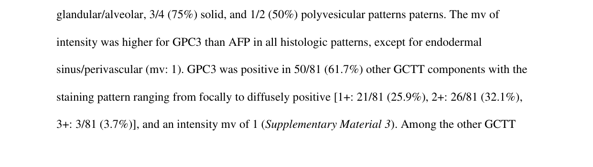

## Question

# Disease Characteristics Research Template

## Target Disease
- **Disease Name:** Yolk Sac Tumor
- **MONDO ID:**  (if available)
- **Category:** Complex

## Research Objectives

Please provide a comprehensive research report on **Yolk Sac Tumor** covering all of the
disease characteristics listed below. This report will be used to populate a disease knowledge
base entry. Be thorough and cite primary literature (PMID preferred) for all claims.

For each section, **suggested databases/resources** are listed. These are the first places
you should search for information on each topic.

---

### 1. Disease Information
> **Search first:** OMIM, Orphanet, ICD-10/ICD-11, MeSH, PubMed

- What is the disease? Provide a concise overview.
- What are the key identifiers? (OMIM, Orphanet, ICD-10/ICD-11, MeSH, Mondo)
- What are the common synonyms and alternative names?
- Is the information derived from individual patients (e.g., EHR) or aggregated disease-level resources?

### 2. Etiology

- **Disease Causal Factors**: What are the primary causes? (genetic, environmental, infectious, mechanistic)
- **Risk Factors**:
  > **Search first:** PubMed, Cochrane Library, UpToDate, clinical guidelines, ClinVar, ClinGen, GWAS Catalog, PheGenI, CTD, CDC, WHO, epidemiological databases
  - Genetic risk factors (causal variants, susceptibility loci, modifier genes)
  - Environmental risk factors (toxins, lifestyle, occupational exposures, age, sex, family history)
- **Protective Factors**:
  > **Search first:** PubMed, Cochrane Library, clinical trial databases, GWAS Catalog, gnomAD, WHO, CDC, nutrition databases
  - Genetic protective factors (protective variants, modifier alleles)
  - Environmental protective factors (diet, lifestyle, exposures that reduce risk)
- **Gene-Environment Interactions**: How do genetic and environmental factors interact to influence disease?
  > **Search first:** CTD, PubMed, PheGenI, GxE databases

### 3. Phenotypes
> **Search first:** HPO (Human Phenotype Ontology), OMIM, Orphanet, PubMed, clinicaltrials.gov, MedDRA, SNOMED CT, DECIPHER, LOINC

For each phenotype, provide:
- **Phenotype type**: symptoms, clinical signs, physical manifestations, behavioral changes, or laboratory abnormalities
  > For symptoms/signs: HPO, OMIM, Orphanet, PubMed
  > For behavioral changes: HPO, DSM, RDoC (Research Domain Criteria), PubMed
  > For laboratory abnormalities: LOINC, SNOMED CT, LabTests Online, PubMed
- **Phenotype characteristics**:
  > **Search first:** OMIM, Orphanet, HPO, PubMed
  - Age of symptom onset (neonatal, childhood, adult-onset, late-onset)
  - Symptom severity (mild, moderate, severe, variable)
  - Symptom progression (stable, progressive, episodic, fluctuating)
  - Frequency among affected individuals (percentage or qualitative)
- **Quality of life impact**: Effects on daily functioning and well-being (per-phenotype when possible)
  > **Search first:** EQ-5D database, SF-36, WHO QOL databases, PubMed
- Suggest HPO (Human Phenotype Ontology) terms for each phenotype

### 4. Genetic/Molecular Information

- **Causal Genes**: Gene mutations or chromosomal abnormalities responsible for disease (gene symbols, OMIM IDs)
  > **Search first:** OMIM, ClinVar, HGMD, Ensembl, NCBI Gene
- **Pathogenic Variants**:
  - Affected genes (gene symbols, HGNC IDs)
    > **Search first:** OMIM, NCBI Gene, Ensembl, HGNC, UniProt, GeneCards
  - Variant classification (pathogenic, likely pathogenic, VUS per ACMG/AMP guidelines)
    > **Search first:** ClinVar, ClinGen, ACMG/AMP guidelines, VarSome
  - Variant type/class (missense, frameshift, nonsense, splice-site, structural)
  - Allele frequency in population databases
    > **Search first:** gnomAD, 1000 Genomes, ExAC, TOPMed, dbSNP
  - Somatic vs germline origin
    > **Search first:** COSMIC (somatic), ClinVar, ICGC, TCGA
  - Functional consequences (loss of function, gain of function, dominant negative)
- **Modifier Genes**: Genes that modify disease severity or expression
- **Epigenetic Information**: DNA methylation, histone modifications, chromatin changes affecting disease
  > **Search first:** ENCODE, Roadmap Epigenomics, MethBase, DiseaseMeth
- **Chromosomal Abnormalities**: Large-scale genetic changes (aneuploidy, translocations, inversions)
  > **Search first:** DECIPHER, ClinVar, ECARUCA, UCSC Genome Browser

### 5. Environmental Information

- **Environmental Factors**: Non-genetic contributing factors (toxins, radiation, pollution, occupational exposure)
  > **Search first:** CTD (Comparative Toxicogenomics Database), TOXNET, PubMed, EPA databases
- **Lifestyle Factors**: Behavioral factors (smoking, diet, exercise, alcohol consumption)
  > **Search first:** CDC databases, WHO, PubMed, NHANES
- **Infectious Agents**: If applicable, pathogens causing or triggering disease (bacteria, viruses, fungi, parasites)
  > **Search first:** NCBI Taxonomy, ViPR, BV-BRC, MicrobeDB, GIDEON

### 6. Mechanism / Pathophysiology

- **Molecular Pathways**: Specific signaling cascades or biochemical pathways involved (Wnt, MAPK, mTOR, PI3K-AKT, etc.)
  > **Search first:** KEGG, Reactome, WikiPathways, PathBank, BioCyc
- **Cellular Processes**: Cell-level mechanisms (apoptosis, autophagy, cell cycle dysregulation, inflammation, etc.)
  > **Search first:** Gene Ontology (GO), Reactome, KEGG, PubMed
- **Protein Dysfunction**: How protein structure or function is altered (misfolding, aggregation, loss of function, gain of function)
  > **Search first:** UniProt, PDB (Protein Data Bank), InterPro, Pfam, AlphaFold
- **Metabolic Changes**: Alterations in metabolic processes (energy metabolism, lipid metabolism, amino acid metabolism)
  > **Search first:** KEGG, BioCyc, HMDB (Human Metabolome Database), BRENDA
- **Immune System Involvement**: Role of immune response (autoimmunity, immunodeficiency, chronic inflammation)
  > **Search first:** ImmPort, Immunome Database, IEDB, Gene Ontology
- **Tissue Damage Mechanisms**: How tissues/ are injured (oxidative stress, ischemia, fibrosis, necrosis)
  > **Search first:** PubMed, Gene Ontology, Reactome
- **Biochemical Abnormalities**: Specific molecular defects (enzyme deficiencies, receptor dysfunction, ion channel defects)
  > **Search first:** BRENDA, UniProt, KEGG, OMIM, PubMed
- **Epigenetic Changes**: DNA methylation, histone modifications affecting gene expression in disease
  > **Search first:** ENCODE, Roadmap Epigenomics, MethBase, DiseaseMeth
- **Molecular Profiling** (if available):
  - Transcriptomics/gene expression changes
    > **Search first:** GEO (Gene Expression Omnibus), ArrayExpress, GTEx, Human Cell Atlas, SRA
  - Proteomics findings
    > **Search first:** PRIDE, ProteomeXchange, Human Protein Atlas, STRING, BioGRID
  - Metabolomics signatures
    > **Search first:** MetaboLights, Metabolomics Workbench, HMDB, METLIN
  - Lipidomics alterations
    > **Search first:** LIPID MAPS, SwissLipids, LipidHome, Metabolomics Workbench
  - Genomic structural features
    > **Search first:** UCSC Genome Browser, Ensembl, NCBI, dbVar, DGV
- **Advanced Technologies** (if applicable):
  - Single-cell analysis findings (cell-type specific mechanisms, cellular heterogeneity)
    > **Search first:** Human Cell Atlas, Single Cell Portal, GEO, CELLxGENE
  - Spatial transcriptomics findings
    > **Search first:** GEO, Spatial Research, Vizgen, 10x Genomics data
  - Multi-omics integration results
    > **Search first:** TCGA, ICGC, cBioPortal, LinkedOmics, PubMed
  - Functional genomics screens (CRISPR, RNAi)
    > **Search first:** DepMap, GenomeRNAi, PubMed, BioGRID ORCS

For each mechanism, describe:
- The causal chain from initial trigger to clinical manifestation
- Which mechanisms are upstream vs downstream
- What cell types and biological processes are involved
- Suggest GO terms for biological processes and CL terms for cell types

### 7. Anatomical Structures Affected

- **Organ Level**:
  - Primary organs directly affected
  - Secondary organ involvement (complications, secondary effects)
  - Body systems involved (cardiovascular, nervous, digestive, respiratory, endocrine, etc.)
  > **Search first:** Uberon, FMA (Foundational Model of Anatomy), OMIM, HPO, ICD-11, MeSH, SNOMED CT
- **Tissue and Cell Level**:
  - Specific tissue types affected (epithelial, connective, muscle, nervous)
  - Specific cell populations targeted (with Cell Ontology terms)
  > **Search first:** Uberon, Human Protein Atlas, Cell Ontology, Human Cell Atlas, CellMarker, PanglaoDB
- **Subcellular Level**:
  - Cellular compartments involved (mitochondria, nucleus, ER, lysosomes) (with GO Cellular Component terms)
  > **Search first:** Gene Ontology (Cellular Component), UniProt, Human Protein Atlas
- **Localization**:
  - Specific anatomical sites (with UBERON terms)
    > **Search first:** FMA, Uberon, NeuroNames (for brain), SNOMED CT
  - Lateralization (unilateral, bilateral, asymmetric)
    > **Search first:** HPO, clinical literature, imaging databases

### 8. Temporal Development

- **Onset**:
  - Typical age of onset (congenital, pediatric, adult, geriatric)
  - Onset pattern (acute, subacute, chronic, insidious)
  > **Search first:** OMIM, Orphanet, HPO, PubMed
- **Progression**:
  - Disease stages (early, intermediate, advanced, end-stage)
    > **Search first:** Cancer Staging Manual (AJCC), WHO classifications, PubMed
  - Progression rate (rapid, slow, variable)
  - Disease course pattern (episodic, relapsing-remitting, progressive, stable)
  - Disease duration (self-limited, chronic lifelong)
  > **Search first:** Disease registries, longitudinal cohort databases, natural history studies, PubMed, Orphanet, OMIM
- **Patterns**:
  - Remission patterns (spontaneous, treatment-induced)
    > **Search first:** Clinical trial databases, disease registries, PubMed
  - Critical periods (time windows of vulnerability or opportunity for intervention)
    > **Search first:** PubMed, developmental biology databases, clinical guidelines

### 9. Inheritance and Population

- **Epidemiology**:
  - Prevalence (cases per 100,000 at given time)
  - Incidence (new cases per 100,000 per year)
  > **Search first:** Orphanet, CDC, WHO, GBD (Global Burden of Disease), national registries, SEER, disease registries
- **For Genetic Etiology**:
  - Inheritance pattern (AD, AR, X-linked, mitochondrial, multifactorial, polygenic)
    > **Search first:** OMIM, Orphanet, ClinVar, GTR (Genetic Testing Registry)
  - Penetrance (complete, incomplete, age-dependent)
    > **Search first:** ClinVar, OMIM, PubMed, ClinGen
  - Expressivity (variable, consistent)
    > **Search first:** OMIM, ClinVar, PubMed
  - Genetic anticipation (increasing severity in successive generations)
    > **Search first:** OMIM, PubMed (especially for repeat expansion disorders)
  - Germline mosaicism
    > **Search first:** ClinVar, OMIM, genetic counseling literature, PubMed
  - Founder effects (population-specific mutations)
    > **Search first:** gnomAD, population genetics databases, PubMed
  - Consanguinity role
    > **Search first:** OMIM, population studies, genetic counseling resources
  - Carrier frequency
    > **Search first:** gnomAD, carrier screening databases, GeneReviews, GTR
- **Population Demographics**:
  - Affected populations (ethnic or demographic groups with higher prevalence)
    > **Search first:** gnomAD, 1000 Genomes, PAGE Study, PubMed, population registries
  - Geographic distribution (endemic areas, regional variation)
    > **Search first:** WHO, CDC, GBD, Orphanet, geographic epidemiology databases
  - Geographic distribution of specific variants
  - Sex ratio (male:female)
    > **Search first:** Disease registries, OMIM, PubMed, epidemiological databases
  - Age distribution of affected individuals
    > **Search first:** CDC, disease registries, SEER, Orphanet

### 10. Diagnostics

- **Clinical Tests**:
  - Laboratory tests (blood, urine, tissue chemistry, specific enzyme assays)
    > **Search first:** LOINC, LabTests Online, PubMed
  - Biomarkers (proteins, metabolites, genetic markers, circulating biomarkers)
    > **Search first:** FDA Biomarker List, BEST (Biomarkers, EndpointS, and other Tools), PubMed
  - Imaging studies (X-ray, CT, MRI, PET, ultrasound)
    > **Search first:** RadLex, DICOM, Radiopaedia, imaging databases
  - Functional tests (pulmonary function, cardiac stress tests)
    > **Search first:** LOINC, clinical guidelines, PubMed
  - Electrophysiology (EEG, EMG, ECG, nerve conduction studies)
    > **Search first:** LOINC, clinical neurophysiology databases, PubMed
  - Biopsy findings (histopathology, immunohistochemistry)
    > **Search first:** SNOMED CT, College of American Pathologists resources, PubMed
  - Pathology findings (microscopic examination)
    > **Search first:** SNOMED CT, Digital Pathology databases, PubMed
- **Genetic Testing**:
  > **Search first:** GTR (Genetic Testing Registry), GeneReviews, ClinGen
  - Overview of recommended genetic testing approach
  - Whole genome sequencing (WGS) utility
    > **Search first:** GTR, ClinVar, GEL (Genomics England), gnomAD
  - Whole exome sequencing (WES) utility
    > **Search first:** GTR, ClinVar, OMIM, GeneMatcher
  - Gene panels (which panels, which genes)
    > **Search first:** GTR, ClinVar, laboratory-specific databases
  - Single gene testing
    > **Search first:** GTR, ClinVar, OMIM, GeneReviews
  - Chromosomal microarray (CMA)
    > **Search first:** DECIPHER, ClinVar, dbVar, ECARUCA
  - Karyotyping
    > **Search first:** Chromosome Abnormality Database, ClinVar, cytogenetics resources
  - FISH
    > **Search first:** ClinVar, cytogenetics databases, PubMed
  - Mitochondrial DNA testing
    > **Search first:** MITOMAP, MSeqDR, ClinVar, GTR
  - Repeat expansion testing
    > **Search first:** GTR, ClinVar, repeat expansion databases, PubMed
- **Omics-Based Diagnostics** (if applicable):
  - RNA sequencing / transcriptomics
    > **Search first:** GEO, ArrayExpress, GTEx, RNA-seq databases
  - Proteomics
    > **Search first:** PRIDE, ProteomeXchange, FDA Biomarker database
  - Metabolomics
    > **Search first:** MetaboLights, Metabolomics Workbench, HMDB
  - Epigenomics
    > **Search first:** GEO, ENCODE, Roadmap Epigenomics, MethBase
  - Liquid biopsy
    > **Search first:** COSMIC, ClinVar, liquid biopsy databases, PubMed
- **Clinical Criteria**:
  - Standardized diagnostic criteria (DSM, ICD, society guidelines)
    > **Search first:** DSM-5, ICD-11, clinical society guidelines, UpToDate
  - Differential diagnosis (other conditions to rule out, with distinguishing features)
    > **Search first:** DynaMed, UpToDate, clinical decision support systems
- **Screening**:
  - Screening methods for asymptomatic individuals (newborn screening, carrier screening, cascade screening)
    > **Search first:** ACMG recommendations, CDC newborn screening, GTR

### 11. Outcome/Prognosis

- **Survival and Mortality**:
  - Survival rate (5-year, 10-year, overall)
    > **Search first:** SEER, cancer registries, disease-specific registries, PubMed
  - Life expectancy (with and without treatment if applicable)
    > **Search first:** Orphanet, disease registries, actuarial databases, PubMed
  - Mortality rate
    > **Search first:** CDC, WHO, GBD, national mortality databases
  - Disease-specific mortality (deaths directly attributable to disease)
    > **Search first:** Disease registries, CDC Wonder, GBD, PubMed
- **Morbidity and Function**:
  - Morbidity (disease-related disability and health impacts)
    > **Search first:** GBD, WHO, disability databases, PubMed
  - Disability outcomes (long-term functional impairments)
    > **Search first:** ICF (International Classification of Functioning), disability registries
  - Quality of life measures (EQ-5D, SF-36, PROMIS, disease-specific tools)
    > **Search first:** EQ-5D database, SF-36, PROMIS, PubMed
- **Disease Course**:
  - Complications (secondary problems: infections, organ failure, etc.)
    > **Search first:** ICD codes, disease registries, clinical databases, PubMed
  - Recovery potential (likelihood and extent of recovery, with vs without treatment)
    > **Search first:** Natural history studies, rehabilitation databases, PubMed
- **Prediction**:
  - Prognostic factors (age, disease severity, biomarkers, treatment response)
    > **Search first:** Prognostic models databases, clinical calculators, PubMed
  - Prognostic biomarkers (molecular markers predicting disease course)
    > **Search first:** FDA Biomarker database, PubMed, cancer prognostic databases

### 12. Treatment

- **Pharmacotherapy**:
  - Pharmacological treatments (drug names, drug classes, mechanisms of action)
    > **Search first:** DrugBank, RxNorm, ATC classification, DailyMed, FDA databases
  - Pharmacogenomics (how genetic variants affect drug metabolism, efficacy, toxicity)
    > **Search first:** PharmGKB, CPIC (Clinical Pharmacogenetics), FDA Table of PGx Biomarkers
- **Advanced Therapeutics**:
  - Gene therapy (viral vectors, CRISPR, gene replacement, gene editing)
    > **Search first:** ClinicalTrials.gov, FDA gene therapy database, ASGCT resources
  - Cell therapy (stem cell transplant, CAR-T, cellular therapeutics)
    > **Search first:** ClinicalTrials.gov, FDA cell therapy database, FACT standards
  - RNA-based therapies (ASOs, siRNA, mRNA therapies)
    > **Search first:** ClinicalTrials.gov, FDA approvals, PubMed
  - Targeted therapies (treatments directed at specific molecular targets)
    > **Search first:** My Cancer Genome, OncoKB, ClinicalTrials.gov, FDA approvals
  - Immunotherapies (checkpoint inhibitors, monoclonal antibodies)
    > **Search first:** Cancer Immunotherapy Database, FDA approvals, ClinicalTrials.gov
- **Surgical and Interventional**:
  - Surgical interventions (types of surgery, timing, outcomes)
    > **Search first:** CPT codes, surgical registries, clinical guidelines, PubMed
- **Supportive and Rehabilitative**:
  - Supportive care (symptom management, pain control, nutrition)
    > **Search first:** Clinical guidelines, Cochrane Library, PubMed
  - Rehabilitation (physical therapy, occupational therapy, speech therapy)
    > **Search first:** Rehabilitation medicine databases, clinical guidelines, PubMed
- **Experimental**:
  - Experimental treatments in clinical trials (with NCT identifiers if available)
    > **Search first:** ClinicalTrials.gov, EU Clinical Trials Register, WHO ICTRP
- **Treatment Outcomes**:
  - Treatment response rates
    > **Search first:** Clinical trial databases, FDA reviews, systematic reviews, PubMed
  - Side effects and adverse events
    > **Search first:** FDA Adverse Event Reporting System (FAERS), MedWatch, PubMed
- **Treatment Strategy**:
  - Treatment algorithms (clinical pathways, decision trees)
    > **Search first:** Clinical practice guidelines, NCCN Guidelines, UpToDate
  - Combination therapies
    > **Search first:** ClinicalTrials.gov, treatment guidelines, PubMed
  - Personalized medicine approaches (genotype-guided treatment)
    > **Search first:** My Cancer Genome, CIViC, PharmGKB, precision medicine databases

For each treatment, suggest MAXO (Medical Action Ontology) terms where applicable.

### 13. Prevention

- **Prevention Levels**:
  - Primary prevention (preventing disease occurrence: vaccination, risk factor modification)
    > **Search first:** CDC, WHO, USPSTF recommendations, Cochrane Library
  - Secondary prevention (early detection and treatment: screening programs, early intervention)
    > **Search first:** USPSTF, CDC screening guidelines, WHO
  - Tertiary prevention (preventing complications in those with disease)
    > **Search first:** Clinical guidelines, disease management protocols, PubMed
- **Immunization**: Vaccine strategies (if applicable)
  > **Search first:** CDC vaccine schedules, WHO immunization, FDA vaccine database
- **Screening and Early Detection**:
  - Screening programs (population-based: newborn screening, cancer screening)
    > **Search first:** CDC screening programs, USPSTF, cancer screening databases
  - Genetic screening (carrier screening, preimplantation genetic diagnosis, prenatal testing)
    > **Search first:** ACMG recommendations, ACOG guidelines, GTR
  - Risk stratification (identifying high-risk individuals for targeted prevention)
    > **Search first:** Risk prediction models, clinical calculators, PubMed
- **Behavioral Interventions**: Lifestyle modifications to reduce risk
  > **Search first:** CDC, WHO, behavioral intervention databases, Cochrane Library
- **Counseling**: Genetic counseling (risk assessment, family planning guidance)
  > **Search first:** NSGC resources, ACMG guidelines, GeneReviews
- **Public Health**:
  - Public health interventions (sanitation, vector control, health education)
    > **Search first:** CDC, WHO, public health databases, PubMed
  - Environmental interventions (reducing environmental risk factors)
    > **Search first:** EPA databases, WHO environmental health, PubMed
- **Prophylaxis**: Preventive medications or procedures
  > **Search first:** Clinical guidelines, FDA approvals, PubMed

### 14. Other Species / Natural Disease

- **Taxonomy**: Species affected (with NCBI Taxon identifiers)
  > **Search first:** NCBI Taxonomy
- **Breed**: Specific breeds affected (with VBO identifiers if applicable)
  > **Search first:** VBO (Vertebrate Breed Ontology)
- **Gene**: Orthologous genes in other species (with NCBI Gene IDs)
  > **Search first:** NCBI Gene
- **Natural Disease**:
  - Naturally occurring disease in other species (companion animals, wildlife)
    > **Search first:** OMIA (Online Mendelian Inheritance in Animals), VetCompass, PubMed
  - Veterinary relevance and importance in animal health
    > **Search first:** OMIA, veterinary databases, PubMed
- **Comparative Biology**:
  - Comparative pathology (similarities and differences across species)
    > **Search first:** OMIA, comparative pathology databases, PubMed
  - Evolutionary conservation of disease mechanisms
    > **Search first:** HomoloGene, OrthoMCL, Alliance of Genome Resources
- **Transmission** (if applicable):
  - Zoonotic potential
    > **Search first:** CDC zoonotic diseases, WHO zoonoses, GIDEON
  - Cross-species susceptibility
    > **Search first:** NCBI Taxonomy, veterinary databases, PubMed

### 15. Model Organisms

- **Model Types**:
  - Model organism type (mammalian, invertebrate, cellular, in vitro)
    > **Search first:** Alliance of Genome Resources, model organism databases
  - Specific model systems (mouse, rat, zebrafish, Drosophila, C. elegans, yeast, cell lines, organoids, iPSCs)
    > **Search first:** MGI, RGD, ZFIN, FlyBase, WormBase, SGD, ATCC, Cellosaurus
  - Induced models (drug treatment, surgical intervention, environmental manipulation)
    > **Search first:** MGI, model organism databases, PubMed
- **Genetic Models**:
  - Types available (knockout, knock-in, transgenic, conditional, humanized)
    > **Search first:** MGI, IMPC, KOMP, EuMMCR, IMSR
- **Model Characteristics**:
  - Phenotype recapitulation (how well model reproduces human disease features)
    > **Search first:** Model organism databases, comparative studies, PubMed
  - Model limitations (aspects of human disease not captured)
    > **Search first:** Model organism databases, PubMed, review articles
- **Applications**:
  - Research applications (what aspects of disease can be studied)
    > **Search first:** Model organism databases, PubMed
- **Resources**:
  - Model databases
    > **Search first:** MGI, RGD, ZFIN, FlyBase, WormBase, IMSR, EMMA, MMRRC

---

## Citation Requirements

- Cite primary literature (PMID preferred) for all mechanistic and clinical claims
- Prioritize recent reviews and landmark papers
- Include direct quotes from abstracts where possible to support key statements
- Distinguish evidence source types: human clinical, model organism, in vitro, computational

## Output Format

Structure your response as a comprehensive narrative organized by the sections above.
For each section, provide:
- Factual content with specific details (numbers, percentages, gene names, variant nomenclature)
- Ontology term suggestions (HPO, GO, CL, UBERON, CHEBI, MAXO, MONDO) where applicable
- Evidence citations with PMIDs
- Direct quotes from abstracts to support key claims
- Clear indication when information is not available or not applicable for this disease

This report will be used to populate a disease knowledge base entry with:
- Pathophysiology descriptions with causal chains
- Gene/protein annotations (HGNC, GO terms)
- Phenotype associations (HP terms) with frequencies
- Cell type involvement (CL terms)
- Anatomical locations (UBERON terms)
- Chemical entities (CHEBI terms)
- Treatment annotations (MAXO terms)
- Evidence items with PMIDs and exact abstract quotes
- Epidemiology, prognosis, diagnostic, and prevention information
- Animal model descriptions with phenotype recapitulation details

## Output

Question: You are an expert researcher providing comprehensive, well-cited information.

Provide detailed information focusing on:
1. Key concepts and definitions with current understanding
2. Recent developments and latest research (prioritize 2023-2024 sources)
3. Current applications and real-world implementations
4. Expert opinions and analysis from authoritative sources
5. Relevant statistics and data from recent studies

Format as a comprehensive research report with proper citations. Include URLs and publication dates where available.
Always prioritize recent, authoritative sources and provide specific citations for all major claims.

# Disease Characteristics Research Template

## Target Disease
- **Disease Name:** Yolk Sac Tumor
- **MONDO ID:**  (if available)
- **Category:** Complex

## Research Objectives

Please provide a comprehensive research report on **Yolk Sac Tumor** covering all of the
disease characteristics listed below. This report will be used to populate a disease knowledge
base entry. Be thorough and cite primary literature (PMID preferred) for all claims.

For each section, **suggested databases/resources** are listed. These are the first places
you should search for information on each topic.

---

### 1. Disease Information
> **Search first:** OMIM, Orphanet, ICD-10/ICD-11, MeSH, PubMed

- What is the disease? Provide a concise overview.
- What are the key identifiers? (OMIM, Orphanet, ICD-10/ICD-11, MeSH, Mondo)
- What are the common synonyms and alternative names?
- Is the information derived from individual patients (e.g., EHR) or aggregated disease-level resources?

### 2. Etiology

- **Disease Causal Factors**: What are the primary causes? (genetic, environmental, infectious, mechanistic)
- **Risk Factors**:
  > **Search first:** PubMed, Cochrane Library, UpToDate, clinical guidelines, ClinVar, ClinGen, GWAS Catalog, PheGenI, CTD, CDC, WHO, epidemiological databases
  - Genetic risk factors (causal variants, susceptibility loci, modifier genes)
  - Environmental risk factors (toxins, lifestyle, occupational exposures, age, sex, family history)
- **Protective Factors**:
  > **Search first:** PubMed, Cochrane Library, clinical trial databases, GWAS Catalog, gnomAD, WHO, CDC, nutrition databases
  - Genetic protective factors (protective variants, modifier alleles)
  - Environmental protective factors (diet, lifestyle, exposures that reduce risk)
- **Gene-Environment Interactions**: How do genetic and environmental factors interact to influence disease?
  > **Search first:** CTD, PubMed, PheGenI, GxE databases

### 3. Phenotypes
> **Search first:** HPO (Human Phenotype Ontology), OMIM, Orphanet, PubMed, clinicaltrials.gov, MedDRA, SNOMED CT, DECIPHER, LOINC

For each phenotype, provide:
- **Phenotype type**: symptoms, clinical signs, physical manifestations, behavioral changes, or laboratory abnormalities
  > For symptoms/signs: HPO, OMIM, Orphanet, PubMed
  > For behavioral changes: HPO, DSM, RDoC (Research Domain Criteria), PubMed
  > For laboratory abnormalities: LOINC, SNOMED CT, LabTests Online, PubMed
- **Phenotype characteristics**:
  > **Search first:** OMIM, Orphanet, HPO, PubMed
  - Age of symptom onset (neonatal, childhood, adult-onset, late-onset)
  - Symptom severity (mild, moderate, severe, variable)
  - Symptom progression (stable, progressive, episodic, fluctuating)
  - Frequency among affected individuals (percentage or qualitative)
- **Quality of life impact**: Effects on daily functioning and well-being (per-phenotype when possible)
  > **Search first:** EQ-5D database, SF-36, WHO QOL databases, PubMed
- Suggest HPO (Human Phenotype Ontology) terms for each phenotype

### 4. Genetic/Molecular Information

- **Causal Genes**: Gene mutations or chromosomal abnormalities responsible for disease (gene symbols, OMIM IDs)
  > **Search first:** OMIM, ClinVar, HGMD, Ensembl, NCBI Gene
- **Pathogenic Variants**:
  - Affected genes (gene symbols, HGNC IDs)
    > **Search first:** OMIM, NCBI Gene, Ensembl, HGNC, UniProt, GeneCards
  - Variant classification (pathogenic, likely pathogenic, VUS per ACMG/AMP guidelines)
    > **Search first:** ClinVar, ClinGen, ACMG/AMP guidelines, VarSome
  - Variant type/class (missense, frameshift, nonsense, splice-site, structural)
  - Allele frequency in population databases
    > **Search first:** gnomAD, 1000 Genomes, ExAC, TOPMed, dbSNP
  - Somatic vs germline origin
    > **Search first:** COSMIC (somatic), ClinVar, ICGC, TCGA
  - Functional consequences (loss of function, gain of function, dominant negative)
- **Modifier Genes**: Genes that modify disease severity or expression
- **Epigenetic Information**: DNA methylation, histone modifications, chromatin changes affecting disease
  > **Search first:** ENCODE, Roadmap Epigenomics, MethBase, DiseaseMeth
- **Chromosomal Abnormalities**: Large-scale genetic changes (aneuploidy, translocations, inversions)
  > **Search first:** DECIPHER, ClinVar, ECARUCA, UCSC Genome Browser

### 5. Environmental Information

- **Environmental Factors**: Non-genetic contributing factors (toxins, radiation, pollution, occupational exposure)
  > **Search first:** CTD (Comparative Toxicogenomics Database), TOXNET, PubMed, EPA databases
- **Lifestyle Factors**: Behavioral factors (smoking, diet, exercise, alcohol consumption)
  > **Search first:** CDC databases, WHO, PubMed, NHANES
- **Infectious Agents**: If applicable, pathogens causing or triggering disease (bacteria, viruses, fungi, parasites)
  > **Search first:** NCBI Taxonomy, ViPR, BV-BRC, MicrobeDB, GIDEON

### 6. Mechanism / Pathophysiology

- **Molecular Pathways**: Specific signaling cascades or biochemical pathways involved (Wnt, MAPK, mTOR, PI3K-AKT, etc.)
  > **Search first:** KEGG, Reactome, WikiPathways, PathBank, BioCyc
- **Cellular Processes**: Cell-level mechanisms (apoptosis, autophagy, cell cycle dysregulation, inflammation, etc.)
  > **Search first:** Gene Ontology (GO), Reactome, KEGG, PubMed
- **Protein Dysfunction**: How protein structure or function is altered (misfolding, aggregation, loss of function, gain of function)
  > **Search first:** UniProt, PDB (Protein Data Bank), InterPro, Pfam, AlphaFold
- **Metabolic Changes**: Alterations in metabolic processes (energy metabolism, lipid metabolism, amino acid metabolism)
  > **Search first:** KEGG, BioCyc, HMDB (Human Metabolome Database), BRENDA
- **Immune System Involvement**: Role of immune response (autoimmunity, immunodeficiency, chronic inflammation)
  > **Search first:** ImmPort, Immunome Database, IEDB, Gene Ontology
- **Tissue Damage Mechanisms**: How tissues/ are injured (oxidative stress, ischemia, fibrosis, necrosis)
  > **Search first:** PubMed, Gene Ontology, Reactome
- **Biochemical Abnormalities**: Specific molecular defects (enzyme deficiencies, receptor dysfunction, ion channel defects)
  > **Search first:** BRENDA, UniProt, KEGG, OMIM, PubMed
- **Epigenetic Changes**: DNA methylation, histone modifications affecting gene expression in disease
  > **Search first:** ENCODE, Roadmap Epigenomics, MethBase, DiseaseMeth
- **Molecular Profiling** (if available):
  - Transcriptomics/gene expression changes
    > **Search first:** GEO (Gene Expression Omnibus), ArrayExpress, GTEx, Human Cell Atlas, SRA
  - Proteomics findings
    > **Search first:** PRIDE, ProteomeXchange, Human Protein Atlas, STRING, BioGRID
  - Metabolomics signatures
    > **Search first:** MetaboLights, Metabolomics Workbench, HMDB, METLIN
  - Lipidomics alterations
    > **Search first:** LIPID MAPS, SwissLipids, LipidHome, Metabolomics Workbench
  - Genomic structural features
    > **Search first:** UCSC Genome Browser, Ensembl, NCBI, dbVar, DGV
- **Advanced Technologies** (if applicable):
  - Single-cell analysis findings (cell-type specific mechanisms, cellular heterogeneity)
    > **Search first:** Human Cell Atlas, Single Cell Portal, GEO, CELLxGENE
  - Spatial transcriptomics findings
    > **Search first:** GEO, Spatial Research, Vizgen, 10x Genomics data
  - Multi-omics integration results
    > **Search first:** TCGA, ICGC, cBioPortal, LinkedOmics, PubMed
  - Functional genomics screens (CRISPR, RNAi)
    > **Search first:** DepMap, GenomeRNAi, PubMed, BioGRID ORCS

For each mechanism, describe:
- The causal chain from initial trigger to clinical manifestation
- Which mechanisms are upstream vs downstream
- What cell types and biological processes are involved
- Suggest GO terms for biological processes and CL terms for cell types

### 7. Anatomical Structures Affected

- **Organ Level**:
  - Primary organs directly affected
  - Secondary organ involvement (complications, secondary effects)
  - Body systems involved (cardiovascular, nervous, digestive, respiratory, endocrine, etc.)
  > **Search first:** Uberon, FMA (Foundational Model of Anatomy), OMIM, HPO, ICD-11, MeSH, SNOMED CT
- **Tissue and Cell Level**:
  - Specific tissue types affected (epithelial, connective, muscle, nervous)
  - Specific cell populations targeted (with Cell Ontology terms)
  > **Search first:** Uberon, Human Protein Atlas, Cell Ontology, Human Cell Atlas, CellMarker, PanglaoDB
- **Subcellular Level**:
  - Cellular compartments involved (mitochondria, nucleus, ER, lysosomes) (with GO Cellular Component terms)
  > **Search first:** Gene Ontology (Cellular Component), UniProt, Human Protein Atlas
- **Localization**:
  - Specific anatomical sites (with UBERON terms)
    > **Search first:** FMA, Uberon, NeuroNames (for brain), SNOMED CT
  - Lateralization (unilateral, bilateral, asymmetric)
    > **Search first:** HPO, clinical literature, imaging databases

### 8. Temporal Development

- **Onset**:
  - Typical age of onset (congenital, pediatric, adult, geriatric)
  - Onset pattern (acute, subacute, chronic, insidious)
  > **Search first:** OMIM, Orphanet, HPO, PubMed
- **Progression**:
  - Disease stages (early, intermediate, advanced, end-stage)
    > **Search first:** Cancer Staging Manual (AJCC), WHO classifications, PubMed
  - Progression rate (rapid, slow, variable)
  - Disease course pattern (episodic, relapsing-remitting, progressive, stable)
  - Disease duration (self-limited, chronic lifelong)
  > **Search first:** Disease registries, longitudinal cohort databases, natural history studies, PubMed, Orphanet, OMIM
- **Patterns**:
  - Remission patterns (spontaneous, treatment-induced)
    > **Search first:** Clinical trial databases, disease registries, PubMed
  - Critical periods (time windows of vulnerability or opportunity for intervention)
    > **Search first:** PubMed, developmental biology databases, clinical guidelines

### 9. Inheritance and Population

- **Epidemiology**:
  - Prevalence (cases per 100,000 at given time)
  - Incidence (new cases per 100,000 per year)
  > **Search first:** Orphanet, CDC, WHO, GBD (Global Burden of Disease), national registries, SEER, disease registries
- **For Genetic Etiology**:
  - Inheritance pattern (AD, AR, X-linked, mitochondrial, multifactorial, polygenic)
    > **Search first:** OMIM, Orphanet, ClinVar, GTR (Genetic Testing Registry)
  - Penetrance (complete, incomplete, age-dependent)
    > **Search first:** ClinVar, OMIM, PubMed, ClinGen
  - Expressivity (variable, consistent)
    > **Search first:** OMIM, ClinVar, PubMed
  - Genetic anticipation (increasing severity in successive generations)
    > **Search first:** OMIM, PubMed (especially for repeat expansion disorders)
  - Germline mosaicism
    > **Search first:** ClinVar, OMIM, genetic counseling literature, PubMed
  - Founder effects (population-specific mutations)
    > **Search first:** gnomAD, population genetics databases, PubMed
  - Consanguinity role
    > **Search first:** OMIM, population studies, genetic counseling resources
  - Carrier frequency
    > **Search first:** gnomAD, carrier screening databases, GeneReviews, GTR
- **Population Demographics**:
  - Affected populations (ethnic or demographic groups with higher prevalence)
    > **Search first:** gnomAD, 1000 Genomes, PAGE Study, PubMed, population registries
  - Geographic distribution (endemic areas, regional variation)
    > **Search first:** WHO, CDC, GBD, Orphanet, geographic epidemiology databases
  - Geographic distribution of specific variants
  - Sex ratio (male:female)
    > **Search first:** Disease registries, OMIM, PubMed, epidemiological databases
  - Age distribution of affected individuals
    > **Search first:** CDC, disease registries, SEER, Orphanet

### 10. Diagnostics

- **Clinical Tests**:
  - Laboratory tests (blood, urine, tissue chemistry, specific enzyme assays)
    > **Search first:** LOINC, LabTests Online, PubMed
  - Biomarkers (proteins, metabolites, genetic markers, circulating biomarkers)
    > **Search first:** FDA Biomarker List, BEST (Biomarkers, EndpointS, and other Tools), PubMed
  - Imaging studies (X-ray, CT, MRI, PET, ultrasound)
    > **Search first:** RadLex, DICOM, Radiopaedia, imaging databases
  - Functional tests (pulmonary function, cardiac stress tests)
    > **Search first:** LOINC, clinical guidelines, PubMed
  - Electrophysiology (EEG, EMG, ECG, nerve conduction studies)
    > **Search first:** LOINC, clinical neurophysiology databases, PubMed
  - Biopsy findings (histopathology, immunohistochemistry)
    > **Search first:** SNOMED CT, College of American Pathologists resources, PubMed
  - Pathology findings (microscopic examination)
    > **Search first:** SNOMED CT, Digital Pathology databases, PubMed
- **Genetic Testing**:
  > **Search first:** GTR (Genetic Testing Registry), GeneReviews, ClinGen
  - Overview of recommended genetic testing approach
  - Whole genome sequencing (WGS) utility
    > **Search first:** GTR, ClinVar, GEL (Genomics England), gnomAD
  - Whole exome sequencing (WES) utility
    > **Search first:** GTR, ClinVar, OMIM, GeneMatcher
  - Gene panels (which panels, which genes)
    > **Search first:** GTR, ClinVar, laboratory-specific databases
  - Single gene testing
    > **Search first:** GTR, ClinVar, OMIM, GeneReviews
  - Chromosomal microarray (CMA)
    > **Search first:** DECIPHER, ClinVar, dbVar, ECARUCA
  - Karyotyping
    > **Search first:** Chromosome Abnormality Database, ClinVar, cytogenetics resources
  - FISH
    > **Search first:** ClinVar, cytogenetics databases, PubMed
  - Mitochondrial DNA testing
    > **Search first:** MITOMAP, MSeqDR, ClinVar, GTR
  - Repeat expansion testing
    > **Search first:** GTR, ClinVar, repeat expansion databases, PubMed
- **Omics-Based Diagnostics** (if applicable):
  - RNA sequencing / transcriptomics
    > **Search first:** GEO, ArrayExpress, GTEx, RNA-seq databases
  - Proteomics
    > **Search first:** PRIDE, ProteomeXchange, FDA Biomarker database
  - Metabolomics
    > **Search first:** MetaboLights, Metabolomics Workbench, HMDB
  - Epigenomics
    > **Search first:** GEO, ENCODE, Roadmap Epigenomics, MethBase
  - Liquid biopsy
    > **Search first:** COSMIC, ClinVar, liquid biopsy databases, PubMed
- **Clinical Criteria**:
  - Standardized diagnostic criteria (DSM, ICD, society guidelines)
    > **Search first:** DSM-5, ICD-11, clinical society guidelines, UpToDate
  - Differential diagnosis (other conditions to rule out, with distinguishing features)
    > **Search first:** DynaMed, UpToDate, clinical decision support systems
- **Screening**:
  - Screening methods for asymptomatic individuals (newborn screening, carrier screening, cascade screening)
    > **Search first:** ACMG recommendations, CDC newborn screening, GTR

### 11. Outcome/Prognosis

- **Survival and Mortality**:
  - Survival rate (5-year, 10-year, overall)
    > **Search first:** SEER, cancer registries, disease-specific registries, PubMed
  - Life expectancy (with and without treatment if applicable)
    > **Search first:** Orphanet, disease registries, actuarial databases, PubMed
  - Mortality rate
    > **Search first:** CDC, WHO, GBD, national mortality databases
  - Disease-specific mortality (deaths directly attributable to disease)
    > **Search first:** Disease registries, CDC Wonder, GBD, PubMed
- **Morbidity and Function**:
  - Morbidity (disease-related disability and health impacts)
    > **Search first:** GBD, WHO, disability databases, PubMed
  - Disability outcomes (long-term functional impairments)
    > **Search first:** ICF (International Classification of Functioning), disability registries
  - Quality of life measures (EQ-5D, SF-36, PROMIS, disease-specific tools)
    > **Search first:** EQ-5D database, SF-36, PROMIS, PubMed
- **Disease Course**:
  - Complications (secondary problems: infections, organ failure, etc.)
    > **Search first:** ICD codes, disease registries, clinical databases, PubMed
  - Recovery potential (likelihood and extent of recovery, with vs without treatment)
    > **Search first:** Natural history studies, rehabilitation databases, PubMed
- **Prediction**:
  - Prognostic factors (age, disease severity, biomarkers, treatment response)
    > **Search first:** Prognostic models databases, clinical calculators, PubMed
  - Prognostic biomarkers (molecular markers predicting disease course)
    > **Search first:** FDA Biomarker database, PubMed, cancer prognostic databases

### 12. Treatment

- **Pharmacotherapy**:
  - Pharmacological treatments (drug names, drug classes, mechanisms of action)
    > **Search first:** DrugBank, RxNorm, ATC classification, DailyMed, FDA databases
  - Pharmacogenomics (how genetic variants affect drug metabolism, efficacy, toxicity)
    > **Search first:** PharmGKB, CPIC (Clinical Pharmacogenetics), FDA Table of PGx Biomarkers
- **Advanced Therapeutics**:
  - Gene therapy (viral vectors, CRISPR, gene replacement, gene editing)
    > **Search first:** ClinicalTrials.gov, FDA gene therapy database, ASGCT resources
  - Cell therapy (stem cell transplant, CAR-T, cellular therapeutics)
    > **Search first:** ClinicalTrials.gov, FDA cell therapy database, FACT standards
  - RNA-based therapies (ASOs, siRNA, mRNA therapies)
    > **Search first:** ClinicalTrials.gov, FDA approvals, PubMed
  - Targeted therapies (treatments directed at specific molecular targets)
    > **Search first:** My Cancer Genome, OncoKB, ClinicalTrials.gov, FDA approvals
  - Immunotherapies (checkpoint inhibitors, monoclonal antibodies)
    > **Search first:** Cancer Immunotherapy Database, FDA approvals, ClinicalTrials.gov
- **Surgical and Interventional**:
  - Surgical interventions (types of surgery, timing, outcomes)
    > **Search first:** CPT codes, surgical registries, clinical guidelines, PubMed
- **Supportive and Rehabilitative**:
  - Supportive care (symptom management, pain control, nutrition)
    > **Search first:** Clinical guidelines, Cochrane Library, PubMed
  - Rehabilitation (physical therapy, occupational therapy, speech therapy)
    > **Search first:** Rehabilitation medicine databases, clinical guidelines, PubMed
- **Experimental**:
  - Experimental treatments in clinical trials (with NCT identifiers if available)
    > **Search first:** ClinicalTrials.gov, EU Clinical Trials Register, WHO ICTRP
- **Treatment Outcomes**:
  - Treatment response rates
    > **Search first:** Clinical trial databases, FDA reviews, systematic reviews, PubMed
  - Side effects and adverse events
    > **Search first:** FDA Adverse Event Reporting System (FAERS), MedWatch, PubMed
- **Treatment Strategy**:
  - Treatment algorithms (clinical pathways, decision trees)
    > **Search first:** Clinical practice guidelines, NCCN Guidelines, UpToDate
  - Combination therapies
    > **Search first:** ClinicalTrials.gov, treatment guidelines, PubMed
  - Personalized medicine approaches (genotype-guided treatment)
    > **Search first:** My Cancer Genome, CIViC, PharmGKB, precision medicine databases

For each treatment, suggest MAXO (Medical Action Ontology) terms where applicable.

### 13. Prevention

- **Prevention Levels**:
  - Primary prevention (preventing disease occurrence: vaccination, risk factor modification)
    > **Search first:** CDC, WHO, USPSTF recommendations, Cochrane Library
  - Secondary prevention (early detection and treatment: screening programs, early intervention)
    > **Search first:** USPSTF, CDC screening guidelines, WHO
  - Tertiary prevention (preventing complications in those with disease)
    > **Search first:** Clinical guidelines, disease management protocols, PubMed
- **Immunization**: Vaccine strategies (if applicable)
  > **Search first:** CDC vaccine schedules, WHO immunization, FDA vaccine database
- **Screening and Early Detection**:
  - Screening programs (population-based: newborn screening, cancer screening)
    > **Search first:** CDC screening programs, USPSTF, cancer screening databases
  - Genetic screening (carrier screening, preimplantation genetic diagnosis, prenatal testing)
    > **Search first:** ACMG recommendations, ACOG guidelines, GTR
  - Risk stratification (identifying high-risk individuals for targeted prevention)
    > **Search first:** Risk prediction models, clinical calculators, PubMed
- **Behavioral Interventions**: Lifestyle modifications to reduce risk
  > **Search first:** CDC, WHO, behavioral intervention databases, Cochrane Library
- **Counseling**: Genetic counseling (risk assessment, family planning guidance)
  > **Search first:** NSGC resources, ACMG guidelines, GeneReviews
- **Public Health**:
  - Public health interventions (sanitation, vector control, health education)
    > **Search first:** CDC, WHO, public health databases, PubMed
  - Environmental interventions (reducing environmental risk factors)
    > **Search first:** EPA databases, WHO environmental health, PubMed
- **Prophylaxis**: Preventive medications or procedures
  > **Search first:** Clinical guidelines, FDA approvals, PubMed

### 14. Other Species / Natural Disease

- **Taxonomy**: Species affected (with NCBI Taxon identifiers)
  > **Search first:** NCBI Taxonomy
- **Breed**: Specific breeds affected (with VBO identifiers if applicable)
  > **Search first:** VBO (Vertebrate Breed Ontology)
- **Gene**: Orthologous genes in other species (with NCBI Gene IDs)
  > **Search first:** NCBI Gene
- **Natural Disease**:
  - Naturally occurring disease in other species (companion animals, wildlife)
    > **Search first:** OMIA (Online Mendelian Inheritance in Animals), VetCompass, PubMed
  - Veterinary relevance and importance in animal health
    > **Search first:** OMIA, veterinary databases, PubMed
- **Comparative Biology**:
  - Comparative pathology (similarities and differences across species)
    > **Search first:** OMIA, comparative pathology databases, PubMed
  - Evolutionary conservation of disease mechanisms
    > **Search first:** HomoloGene, OrthoMCL, Alliance of Genome Resources
- **Transmission** (if applicable):
  - Zoonotic potential
    > **Search first:** CDC zoonotic diseases, WHO zoonoses, GIDEON
  - Cross-species susceptibility
    > **Search first:** NCBI Taxonomy, veterinary databases, PubMed

### 15. Model Organisms

- **Model Types**:
  - Model organism type (mammalian, invertebrate, cellular, in vitro)
    > **Search first:** Alliance of Genome Resources, model organism databases
  - Specific model systems (mouse, rat, zebrafish, Drosophila, C. elegans, yeast, cell lines, organoids, iPSCs)
    > **Search first:** MGI, RGD, ZFIN, FlyBase, WormBase, SGD, ATCC, Cellosaurus
  - Induced models (drug treatment, surgical intervention, environmental manipulation)
    > **Search first:** MGI, model organism databases, PubMed
- **Genetic Models**:
  - Types available (knockout, knock-in, transgenic, conditional, humanized)
    > **Search first:** MGI, IMPC, KOMP, EuMMCR, IMSR
- **Model Characteristics**:
  - Phenotype recapitulation (how well model reproduces human disease features)
    > **Search first:** Model organism databases, comparative studies, PubMed
  - Model limitations (aspects of human disease not captured)
    > **Search first:** Model organism databases, PubMed, review articles
- **Applications**:
  - Research applications (what aspects of disease can be studied)
    > **Search first:** Model organism databases, PubMed
- **Resources**:
  - Model databases
    > **Search first:** MGI, RGD, ZFIN, FlyBase, WormBase, IMSR, EMMA, MMRRC

---

## Citation Requirements

- Cite primary literature (PMID preferred) for all mechanistic and clinical claims
- Prioritize recent reviews and landmark papers
- Include direct quotes from abstracts where possible to support key statements
- Distinguish evidence source types: human clinical, model organism, in vitro, computational

## Output Format

Structure your response as a comprehensive narrative organized by the sections above.
For each section, provide:
- Factual content with specific details (numbers, percentages, gene names, variant nomenclature)
- Ontology term suggestions (HPO, GO, CL, UBERON, CHEBI, MAXO, MONDO) where applicable
- Evidence citations with PMIDs
- Direct quotes from abstracts to support key claims
- Clear indication when information is not available or not applicable for this disease

This report will be used to populate a disease knowledge base entry with:
- Pathophysiology descriptions with causal chains
- Gene/protein annotations (HGNC, GO terms)
- Phenotype associations (HP terms) with frequencies
- Cell type involvement (CL terms)
- Anatomical locations (UBERON terms)
- Chemical entities (CHEBI terms)
- Treatment annotations (MAXO terms)
- Evidence items with PMIDs and exact abstract quotes
- Epidemiology, prognosis, diagnostic, and prevention information
- Animal model descriptions with phenotype recapitulation details

## Comprehensive Research Report: Yolk Sac Tumor (YST)

### Executive summary
Yolk sac tumor (YST) is a highly malignant germ cell tumor (GCT) characterized by yolk-sac (extra-embryonic endodermal) differentiation and classically associated with markedly elevated alpha‑fetoprotein (AFP) in serum and tumor tissue. It occurs most often in gonads (testis/ovary) but can arise at extragonadal sites (e.g., sacrococcygeal region, mediastinum, endometrium) and may be “germ cell–derived” or “somatically derived” (YST differentiation arising within a somatic carcinoma). Diagnostic accuracy has improved through immunohistochemical (IHC) panels (e.g., SALL4, GPC3, AFP) and newer markers such as FOXA2 in postpubertal-type YST. Recent molecular work emphasizes recurrent copy-number alterations (notably 12p gain) and subtype/site-specific copy-number patterns (e.g., 3p gains), while mutational burden is often low in pediatric GCTs.

| Item category | Specific item | Notes (e.g., postpubertal-type, patterns) | Key evidence snippet (short) | Source (authors, year, journal, DOI URL) |
|---|---|---|---|---|
| Synonym | Endodermal sinus tumor | Common synonym for yolk sac tumor, especially in ovarian literature | “yolk sac tumor (endodermal sinus tumor)” (maria2025malignantgermcells pages 2-4) | De Maria et al., 2025, *Journal of Gynecologic Oncology*, https://doi.org/10.3802/jgo.2025.36.e108 |
| Classification | Malignant germ cell tumor | Derived from primordial germ cells; includes gonadal and extragonadal presentations | “a highly malignant germ cell tumor” (wang2024giantovarianyolk pages 2-3, pinto2023molecularbiologyof pages 1-3) | Wang et al., 2024, *Frontiers in Oncology*, https://doi.org/10.3389/fonc.2024.1437728; Pinto et al., 2023, *Cancers*, https://doi.org/10.3390/cancers15112990 |
| Classification | WHO ovarian germ cell tumor entity | Listed as a distinct entity in WHO 2020 ovarian germ cell tumor classification | “yolk sac tumor (endodermal sinus tumor) is listed as a distinct entity in the WHO 2020 classification” (maria2025malignantgermcells pages 2-4) | De Maria et al., 2025, *Journal of Gynecologic Oncology*, https://doi.org/10.3802/jgo.2025.36.e108 |
| Classification | Postpubertal-type yolk sac tumor | Testicular/postpubertal context; broad histologic spectrum complicates diagnosis | “YSTpt shows a wide range of histological patterns and is challenging to diagnose” (ricci2023foxa2isa pages 19-23) | Ricci et al., 2023, *Histopathology*, https://doi.org/10.1111/his.14968 |
| Biomarker | Alpha-fetoprotein (AFP), serum | Core serum marker for diagnosis and monitoring; may be markedly elevated but not universally positive | “AFP is a highly specific diagnostic and monitoring marker” and “most patients have AFP >1,000 ng/mL” (cui2025aendometrialmalignant pages 2-4); “AFP was elevated in all patients (100%, 16/16)” (chen2024ultrasonographicandclinicopathological pages 3-5) | Cui et al., 2025, *Frontiers in Oncology*, https://doi.org/10.3389/fonc.2025.1551266; Chen et al., 2024, *Frontiers in Oncology*, https://doi.org/10.3389/fonc.2024.1417761 |
| Biomarker | AFP, immunohistochemistry | Often positive, but can be focal/weak or occasionally negative compared with other markers | “AFP is often only focal and weak or absent” in some YSTpt patterns (ricci2023foxa2isa pages 19-23) | Ricci et al., 2023, *Histopathology*, https://doi.org/10.1111/his.14968 |
| Biomarker | Glypican-3 (GPC3) | Sensitive YST IHC marker; may outperform AFP in sensitivity | “GPC-3 is a sensitive YST marker and can outperform AFP” (cui2025aendometrialmalignant pages 4-6); “roughly threefold higher sensitivity than AFP” (wang2024giantovarianyolk pages 2-3) | Cui et al., 2025, *Frontiers in Oncology*, https://doi.org/10.3389/fonc.2025.1551266; Wang et al., 2024, *Frontiers in Oncology*, https://doi.org/10.3389/fonc.2024.1437728 |
| Biomarker | SALL4 | Sensitive germ cell marker; useful in differential diagnosis | “SALL4 is expressed in all germ cell tumors except choriocarcinoma” and recommended in combined panels (cui2025aendometrialmalignant pages 4-6) | Cui et al., 2025, *Frontiers in Oncology*, https://doi.org/10.3389/fonc.2025.1551266 |
| Biomarker | FOXA2 | Reliable nuclear marker for postpubertal-type YST across patterns | “FOXA2 gives a clear, easily interpretable nuclear signal” with “diffuse and strong stain” (ricci2023foxa2isa pages 19-23) | Ricci et al., 2023, *Histopathology*, https://doi.org/10.1111/his.14968 |
| Biomarker | OCT3/4 negativity | Helpful exclusion marker against embryonal carcinoma in ovarian YST workup | “OCT3/4 negativity helping exclude embryonal carcinoma” (brock2026yolksactumor pages 5-6) | Brock et al., 2026, *GSC Advanced Research and Reviews*, https://doi.org/10.30574/gscarr.2026.26.1.0023 |
| Biomarker | Combined IHC panel: AFP + GPC3 + SALL4 | Best used with morphology; at least 2 markers can strengthen diagnosis | “combined IHC (≥2 markers among SALL4, GPC-3, AFP) plus morphology is recommended” (cui2025aendometrialmalignant pages 4-6) | Cui et al., 2025, *Frontiers in Oncology*, https://doi.org/10.3389/fonc.2025.1551266 |
| Classification | Histologic hallmarks | Classic patterns include reticular/microcystic growth and Schiller–Duval bodies | “characteristic Schiller–Duval bodies” (wang2024giantovarianyolk pages 2-3); “reticular pattern, Schiller-Duval bodies” (cui2025aendometrialmalignant pages 4-6) | Wang et al., 2024, *Frontiers in Oncology*, https://doi.org/10.3389/fonc.2024.1437728; Cui et al., 2025, *Frontiers in Oncology*, https://doi.org/10.3389/fonc.2025.1551266 |
| Classification | Polyvesicular-vitelline (PVV) pattern | Uncommon ovarian YST variant; can mimic benign cystic lesions | “PVV histologic pattern occurs in roughly 25%” and may lack Schiller-Duval bodies (brock2026yolksactumor pages 5-6, brock2026yolksactumor pages 6-8) | Brock et al., 2026, *GSC Advanced Research and Reviews*, https://doi.org/10.30574/gscarr.2026.26.1.0023 |

*Table: This table summarizes key synonyms, classification descriptors, and the most clinically useful serum and immunohistochemical biomarkers for yolk sac tumor. It is useful for building a disease knowledge base entry and for rapid diagnostic reference.*

---

## 1. Disease information

### 1.1 What is the disease?
YST (also called endodermal sinus tumor) is a malignant germ cell tumor with yolk-sac differentiation; in ovarian literature it is typically grouped among malignant ovarian germ cell tumors (MOGCTs) and is recognized as a distinct entity in WHO classification schemes. (maria2025malignantgermcells pages 2-4, wang2024giantovarianyolk pages 2-3)

**Synonyms / alternative names**
- Yolk sac tumor (YST) (maria2025malignantgermcells pages 2-4)
- Endodermal sinus tumor (maria2025malignantgermcells pages 2-4)
- “Ovarian yolk sac tumor” (OYST) for ovarian presentations (wang2024giantovarianyolk pages 2-3)

### 1.2 Key identifiers (ontology / coding)
**Not fully retrievable with the current tool context.** The current retrieved literature does not provide explicit MONDO, MeSH, ICD‑10/ICD‑11, OMIM, or Orphanet IDs for YST. Therefore:
- **MONDO ID:** Not available from retrieved sources.
- **MeSH/ICD/Orphanet/OMIM:** Not available from retrieved sources.

### 1.3 Data source type
The evidence assembled here is predominantly **aggregated disease-level resources** (reviews, retrospective cohorts, and trial registry entries) plus case reports illustrating rare anatomic sites and somatic derivation. (pinto2023molecularbiologyof pages 1-3, chen2024ultrasonographicandclinicopathological pages 1-2, NCT06341998 chunk 1)

---

## 2. Etiology

### 2.1 Disease causal factors (current understanding)
YST is understood as arising from aberrant transformation of primordial germ cells (PGCs) during development, with germ cell tumors reflecting arrested/aberrant PGC development and migration. (pinto2023molecularbiologyof pages 1-3)

A clinically important etiologic nuance is that YST-like differentiation can also occur **within somatic carcinomas** (somatic derivation), particularly in older patients and in endometrial tumors, complicating classification and management. (cui2025aendometrialmalignant pages 4-6, cui2025aendometrialmalignant pages 2-4)

### 2.2 Risk factors / protective factors
**Limited disease-specific epidemiologic risk-factor data** were available in the retrieved sources. However, several consistent clinical associations (not “risk factors” per se) emerge:
- Predominant occurrence in **children/adolescents/young adults** for ovarian/pelvic YST (mean ages in cohorts and reviews in the 20s; most <30). (chen2024ultrasonographicandclinicopathological pages 2-3, brock2026yolksactumor pages 5-6)
- In endometrial YST series, **older age** is common for mixed/somatic-derived cases and is associated with worse outcomes (age >50 associated with higher mortality in one literature review). (cui2025aendometrialmalignant pages 4-6)

No clear protective factors or gene–environment interactions were identified in the retrieved sources.

---

## 3. Phenotypes (clinical presentation)

### 3.1 Common phenotypes and suggested HPO terms
Phenotypes vary by anatomic site; below are common patterns supported by recent cohort data.

**A. Ovarian/pelvic YST in women (Frontiers in Oncology 2024 retrospective cohort, n=16)**
- Abdominal/pelvic pain (14/16; 87.5%). Suggested HPO: **HP:0002027 Abdominal pain**. (chen2024ultrasonographicandclinicopathological pages 3-5, chen2024ultrasonographicandclinicopathological pages 2-3)
- Pelvic/abdominal mass. Suggested HPO: **HP:0100542 Pelvic mass** (or HP:0031166 Abdominal mass). (maria2025malignantgermcells pages 2-4)
- Laboratory abnormality: elevated serum AFP in essentially all cases in this cohort (16/16; 100%). Suggested HPO: **HP:0040215 Elevated circulating alpha-fetoprotein**. (chen2024ultrasonographicandclinicopathological pages 3-5, chen2024ultrasonographicandclinicopathological pages 2-3)
- Ascites (reported in subset). Suggested HPO: **HP:0001541 Ascites**. (chen2024ultrasonographicandclinicopathological pages 7-9)

**B. Pediatric testicular YST**
- Testicular/scrotal mass. Suggested HPO: **HP:0000023 Scrotal mass** or **HP:0000035 Testicular tumor/mass**. (yu2024nomogramforpredicting pages 2-3)
- Elevated AFP is highly prevalent but not universal (e.g., 27/29 elevated in one 2024 cohort). Suggested HPO: **HP:0040215 Elevated circulating alpha-fetoprotein**. (yu2024nomogramforpredicting pages 2-3, yu2024nomogramforpredicting pages 5-6)

**C. Endometrial YST (rare, often mixed/somatic-derived)**
- Irregular vaginal bleeding / postmenopausal bleeding. Suggested HPO: **HP:0000140 Abnormal uterine bleeding**. (cui2025aendometrialmalignant pages 4-6)

### 3.2 Onset, severity, progression
- Ovarian/pelvic YST predominantly affects children and young women (e.g., 68.75% <30 in one pelvic cohort), often presenting with symptomatic pain and large masses, implying relatively **rapid growth** and clinically apparent disease. (chen2024ultrasonographicandclinicopathological pages 2-3, maria2025malignantgermcells pages 2-4)
- Pediatric testicular YST tends to present in very young children (median 14 months in one cohort), supporting very early onset in that presentation. (yu2024nomogramforpredicting pages 2-3)

Quality-of-life measures (EQ‑5D/SF‑36/PROMIS) were not available in the retrieved sources.

---

## 4. Genetic / molecular information

### 4.1 Causal genes
YST is not a Mendelian single-gene disorder; “causal genes” in the inherited-disease sense are not established in the retrieved sources. Molecular drivers are primarily somatic and chromosomal.

### 4.2 Chromosomal abnormalities and copy-number alterations (key recent findings)
**12p gain / 12p abnormalities**
- Recurrent 12p gain is a hallmark across germ cell tumors, including ovarian malignant GCTs; pediatric series summarized in a 2023 review report 12p gain in 44% (15/34) of malignant GCTs and in 10/14 tumors in patients <15, with 4/14 YSTs in children <5 showing 12p gains. (pinto2023molecularbiologyof pages 7-9)
- A 2025 ovarian GCT review notes that YST is a WHO-recognized entity and emphasizes tumor markers rather than genomics, but the broader 2023 clinical challenges review reports that many YSTs show 12p gains plus additional gains/losses. (maria2025malignantgermcells pages 2-4, saani2023clinicalchallengesin pages 9-10)

**3p25.3 gain as a prognostic marker in CNS GCTs with YST components (Scientific Reports 2023)**
- In a cohort of 81 CNS GCTs, 3p25.3 gain occurred in 5/81 (6.2%), exclusively among non-germinomatous GCTs (5/40; 12.5%; p=0.03). (takami2023distinctpatternsof pages 1-2)
- Among NGGCTs, presence of a YST component was associated with a higher frequency of 3p25.3 gain (18.2% with YST component vs 1.5% without; p=0.048). (takami2023distinctpatternsof pages 1-2)
- 3p25.3 gain was associated with significantly shorter progression-free survival (p=0.047), suggesting a potential risk-stratification biomarker (with the caveat of small sample sizes and need for validation). (takami2023distinctpatternsof pages 3-4, takami2023distinctpatternsof pages 6-7)

### 4.3 Somatic mutations / mutational burden / MSI/TMB
- Pediatric ovarian GCTs are described as having generally **lower mutational burden** than adult tumors, with epigenetic and copy-number alterations emphasized. (pinto2023molecularbiologyof pages 7-9)
- In a mixed endometrial carcinoma with YST differentiation (somatic derivation), targeted sequencing identified **TP53 C275Y** (VAF 17.5%), **microsatellite stable** status, and **low TMB (3.110 mutations/Mb)**, illustrating that somatically derived YST differentiation can occur in a genomically “carcinoma-like” context rather than classic germ-cell genomics. (cui2025aendometrialmalignant pages 2-4)

### 4.4 Epigenetics and microRNAs (recent synthesis)
A 2023 molecular review of ovarian GCTs highlights:
- **Imprinting/methylation abnormalities** (e.g., involving H19 and IGF2) in pediatric germ cell tumors and histology-specific methylation signatures that may reflect the PGC developmental stage at transformation. (pinto2023molecularbiologyof pages 18-19, pinto2023molecularbiologyof pages 12-13)
- Consistent dysregulation of circulating and tumor miRNAs, particularly **miR‑371a‑3p**, with reported sensitivity 84.7% and specificity 99% for GCT detection in the cited synthesis, and decline after tumor resection—supporting real-world biomarker application. (pinto2023molecularbiologyof pages 12-13)

### 4.5 Suggested ontology terms (molecular)
- **GO biological process (examples):**
  - GO:0007281 *germ cell development* (fits PGC transformation paradigm) (pinto2023molecularbiologyof pages 1-3)
  - GO:0006306 *DNA methylation* (epigenetic emphasis) (pinto2023molecularbiologyof pages 12-13)
- **Cell Ontology (CL) (examples):**
  - CL:0000670 *primordial germ cell* (conceptual cell of origin) (pinto2023molecularbiologyof pages 1-3)

---

## 5. Environmental information
No specific environmental toxins, lifestyle factors, or infectious agents were identified as causal or modifying factors in the retrieved sources for YST.

---

## 6. Mechanism / pathophysiology

### 6.1 Conceptual causal chain
1) **Initiating event**: aberrant transformation/arrest of PGC development (germ-cell–derived YST) or aberrant somatic differentiation in carcinoma (somatic-derived YST component). (pinto2023molecularbiologyof pages 1-3, cui2025aendometrialmalignant pages 4-6)
2) **Molecular landscape**: predominant chromosomal/copy-number alterations (e.g., 12p gain; subtype/site-specific gains/losses such as 3p gains) with relatively low somatic mutation burden in many pediatric cases. (pinto2023molecularbiologyof pages 7-9, saani2023clinicalchallengesin pages 9-10)
3) **Tumor differentiation program**: yolk-sac/endodermal differentiation reflected by expression of AFP and endodermal-associated markers (e.g., GPC3, SALL4; FOXA2 in postpubertal-type). (ricci2023foxa2isa pages 19-23, cui2025aendometrialmalignant pages 4-6)
4) **Clinical manifestations**: rapidly enlarging masses (ovary/testis/extragonadal) causing pain or bleeding, and high serum AFP providing a measurable tumor burden proxy. (chen2024ultrasonographicandclinicopathological pages 3-5, cui2025aendometrialmalignant pages 4-6)

### 6.2 Pathology and key diagnostic histologic features
- Schiller–Duval bodies are classic features in many YSTs. (wang2024giantovarianyolk pages 2-3)
- Broad morphologic spectrum can create diagnostic pitfalls; reticular/microcystic and other patterns occur, and polyvesicular‑vitelline patterns may lack Schiller–Duval bodies and mimic benign lesions. (cui2025aendometrialmalignant pages 4-6, brock2026yolksactumor pages 5-6)

---

## 7. Anatomical structures affected

### 7.1 Organ and site distribution (examples from recent cohorts)
- **Pelvic YST in women (n=16):** ovary (13/16; 81.25%), sacrococcygeal region (2/16; 12.5%), mesentery (1/16; 6.25%). (chen2024ultrasonographicandclinicopathological pages 3-5, chen2024ultrasonographicandclinicopathological pages 1-2)

### 7.2 Suggested UBERON terms (examples)
- Ovary: **UBERON:0000992** (supported by ovarian predominance in pelvic cohort). (chen2024ultrasonographicandclinicopathological pages 3-5)
- Testis: **UBERON:0000473** (pediatric testicular YST cohorts). (yu2024nomogramforpredicting pages 2-3)
- Sacrococcygeal region (approximate): **UBERON:0001474 Coccyx** / adjacent pelvic region (site reported in cohort). (chen2024ultrasonographicandclinicopathological pages 3-5)

---

## 8. Temporal development

### 8.1 Onset patterns
- Pediatric testicular YST: very early childhood presentation (median ~14 months in one cohort). (yu2024nomogramforpredicting pages 2-3)
- Ovarian/pelvic YST: predominantly in young women but can occur across a wide age range (1–72 years in a pelvic cohort). (chen2024ultrasonographicandclinicopathological pages 2-3)

### 8.2 Staging and progression
Formal unified staging across all YST sites is not captured in the retrieved sources; ovarian YST typically uses FIGO staging (not fully detailed in retrieved evidence). However, endometrial YST literature review data show many cases presenting beyond stage I and that pure YSTs present earlier than mixed tumors in that site-specific literature. (cui2025aendometrialmalignant pages 4-6)

---

## 9. Inheritance and population
YST is not described in the retrieved sources as an inherited Mendelian disorder (no AD/AR/X-linked pattern reported). Population-level incidence statistics were limited:
- A 2025 ovarian malignant GCT review gives age-specific incidence estimates for malignant ovarian GCTs overall (not YST-specific): ≈5.7 per million at age 14 and ≈27 per million at ages 15–19. (maria2025malignantgermcells pages 2-4)

Robust global prevalence/incidence estimates specifically for YST (per 100,000) were not available from retrieved sources.

---

## 10. Diagnostics

### 10.1 Core biomarkers (serum)
- **AFP** is the central serum biomarker for YST diagnosis and monitoring; in pelvic YST cohort data AFP was elevated in 100% (16/16). (chen2024ultrasonographicandclinicopathological pages 3-5)
- AFP is highly informative but not perfectly sensitive: in a 2024 pediatric testicular cohort, 27/29 (93.1%) YST had elevated AFP, and 3 YST cases had normal AFP in the same study’s narrative discussion. (yu2024nomogramforpredicting pages 2-3, yu2024nomogramforpredicting pages 5-6)

### 10.2 Pathology and IHC panels (key recent developments)
YST diagnosis relies on morphology plus IHC markers; commonly used markers include **AFP, GPC3, SALL4**, and additional markers to exclude mimics (e.g., OCT3/4 negative helps exclude embryonal carcinoma). (cui2025aendometrialmalignant pages 4-6, brock2026yolksactumor pages 5-6)

**FOXA2 as a 2023 diagnostic advance (postpubertal-type YST):**
- In a Histopathology 2023 study, FOXA2 is described as giving a clear nuclear signal with “complete absence of background reactivity” and “diffuse and strong stain” across multiple YST patterns where AFP may be “focal and weak” or absent, supporting FOXA2 as a reliable marker for YSTpt diagnosis. (ricci2023foxa2isa pages 19-23, ricci2023foxa2isa media d654aa6d)

### 10.3 Imaging and real-world implementation (2024 quantitative studies)
**Pediatric testicular YST (Frontiers in Pediatrics 2024 nomogram, n=119; 29 YST):**
- Age and ultrasound features plus AFP improve preoperative discrimination: elevated AFP in 93.1% (27/29) vs 2.2% (2/90) benign; strong Doppler blood-flow signals in 93.1% vs 5.6% benign. (yu2024nomogramforpredicting pages 2-3)
- Combined model (age + AFP + ultrasound blood flow) achieved **AUC 0.984**, sensitivity **0.978**, and specificity ≈**0.966**, with reported accuracy ≈**0.98**. (yu2024nomogramforpredicting pages 2-3)

**Pediatric testicular YST (World Journal of Surgical Oncology 2024 MRI study, n=80; 40 YST):**
- MRI “signal intensity” achieved **AUC 0.936** (95% CI 0.877–0.995) for discriminating YST; “bright dot sign” present in 57.5% and spermatic cord thickening in 95%. (zheng2024diagnosticfeaturesof pages 1-3, zheng2024diagnosticfeaturesof pages 3-5)

**Pelvic YST in women (Frontiers in Oncology 2024, n=16):**
- Ultrasound patterns: cystic (12.5%), mixed (25%), solid (62.5%), often with rich vascularity and low–moderate resistance indices (RI 0.21–0.63). (chen2024ultrasonographicandclinicopathological pages 3-5, chen2024ultrasonographicandclinicopathological pages 7-9)

### 10.4 Differential diagnosis (examples)
- Ovarian clear cell carcinoma can be a key mimic; SALL4 (and broader germ cell marker panels) can help distinguish YST from clear cell adenocarcinoma. (wang2024giantovarianyolk pages 2-3)

---

## 11. Outcome / prognosis

### 11.1 Survival statistics
Survival varies strongly by site and stage; robust population-level YST survival was not available in the retrieved cohort papers, but ovarian YST literature summarized in a 2026 review reports:
- 5‑year survival approximately **75–100% for stage I** and **63–75% for stages II–IV** with BEP-based treatment, in the cited series-level summaries. (brock2026yolksactumor pages 5-6)

### 11.2 Prognostic biomarkers / factors
- In CNS NGGCTs, **3p25.3 gain** was associated with YST components and shorter PFS (p=0.047), suggesting prognostic stratification potential. (takami2023distinctpatternsof pages 1-2, takami2023distinctpatternsof pages 3-4)
- In endometrial YST literature review data, older age (>50) associated with higher mortality and mixed tumors tended to occur in older patients. (cui2025aendometrialmalignant pages 4-6)

---

## 12. Treatment

### 12.1 Standard of care (real-world implementation)
**Surgery + platinum-based chemotherapy**
- Ovarian YST: standard management is surgical resection (often fertility-sparing in young patients when appropriate) followed by **BEP** chemotherapy (bleomycin, etoposide, cisplatin). (brock2026yolksactumor pages 5-6, brock2026yolksactumor pages 3-5)
- A 2026 ovarian YST case report shows AFP normalization after BEP cycle 2 and durable 3‑year remission after fertility-sparing surgery plus BEP. (brock2026yolksactumor pages 3-5)

**MAXO term suggestions (examples)**
- Surgical tumor resection / oophorectomy: **MAXO:0000004 Surgical procedure** (site-specific refinements needed)
- Platinum-based combination chemotherapy: **MAXO:0000058 Chemotherapy**

### 12.2 Treatment in rare sites / somatic-derived YST
- Endometrial tumors with YST components: therapy is heterogeneous; one reported approach includes surgery + BEP, with recurrence prompting consideration of other systemic regimens including immune checkpoint inhibitor use in a case context. (cui2025aendometrialmalignant pages 2-4)

### 12.3 Clinical trials (recent registry evidence; pediatric recurrent/refractory YST)
Two ClinicalTrials.gov studies explicitly targeted relapsed/refractory YST in children (both completed; results not available in retrieved registry excerpts):

- **NCT06341998** (ClinicalTrials.gov; primary completion 2024‑01‑01; URL: https://clinicaltrials.gov/study/NCT06341998): sirolimus + TIC (nab‑paclitaxel, ifosfamide, carboplatin) “S‑TIC” regimen for recurrent/refractory extracranial YST in children (≤18 years); Simon two-stage design; primary endpoint ORR; secondary endpoints PFS/OS/safety; AFP monitored each cycle. (NCT06341998 chunk 1)

- **NCT06470464** (ClinicalTrials.gov; completed; URL: https://clinicaltrials.gov/study/NCT06470464): thalidomide + TGA (nab‑paclitaxel, gemcitabine, epirubicin) for repeatedly relapsed/refractory pediatric YST; primary endpoint ORR (RECIST 1.1 plus AFP reduction ≥90%). (NCT06470464 chunk 1)

---

## 13. Prevention
No primary prevention strategies specific to YST were identified in the retrieved sources. Secondary prevention is generally limited to early detection of masses and prompt diagnostic evaluation with imaging plus AFP (and appropriate interpretation of AFP in infancy). (yu2024nomogramforpredicting pages 2-3)

---

## 14. Other species / natural disease
No naturally occurring YST data in non-human species were retrieved in the current evidence set.

---

## 15. Model organisms / model systems
The retrieved sources indicate active development of in vitro and in vivo models for ovarian GCTs (including YST) but do not provide concrete model organism IDs or specific cell line names within the available excerpts. (pinto2023molecularbiologyof pages 1-3)

---

## Expert opinion / authoritative synthesis (what experts emphasize)
- **Diagnostic certainty requires morphology + IHC panels**: multiple sources emphasize that AFP alone is not sufficient (can be focal/weak or rarely negative in tissue; serum AFP can be non-specific in infants), and that combined markers (SALL4, GPC3, AFP) plus morphology improve reliability. (ricci2023foxa2isa pages 19-23, cui2025aendometrialmalignant pages 4-6, yu2024nomogramforpredicting pages 5-6)
- **FOXA2 is emerging as a high-value marker** for postpubertal-type YST because it can be diffusely positive where AFP is not, with clean nuclear staining and minimal background—useful in challenging patterns and small biopsies. (ricci2023foxa2isa pages 19-23)
- **Risk stratification may increasingly use genomic copy-number features** (e.g., 12p and 3p25.3 gains), particularly in CNS NGGCTs, but validation is needed before routine clinical application. (takami2023distinctpatternsof pages 1-2, takami2023distinctpatternsof pages 6-7)

---

## Key gaps / limitations of this report
- Formal ontology identifiers (MONDO/MeSH/ICD/Orphanet/OMIM) could not be extracted from the retrieved evidence set and would require targeted database queries beyond the current retrieved texts.
- Large 2023–2024 genomic cohort studies specific to YST (with mutation frequencies by site and validated epigenetic signatures) were not fully available in the retrieved corpus; conclusions about genetics therefore emphasize copy-number trends and review-level synthesis.
- Trial registry excerpts did not include outcome results; therefore efficacy conclusions for NCT06341998 and NCT06470464 cannot be drawn here.

References

1. (maria2025malignantgermcells pages 2-4): Francesca De Maria, Frédéric Amant, Valentina Chiappa, Biagio Paolini, Alice Bergamini, Robert Fruscio, Giovanni Corso, Francesco Raspagliesi, and Giorgio Bogani. Malignant germ cells tumor of the ovary. Journal of Gynecologic Oncology, Apr 2025. URL: https://doi.org/10.3802/jgo.2025.36.e108, doi:10.3802/jgo.2025.36.e108. This article has 13 citations and is from a peer-reviewed journal.

2. (wang2024giantovarianyolk pages 2-3): Qin Wang, Jianxin Zuo, Chong Liu, Huansheng Zhou, Wenjie Wang, and Yankui Wang. Giant ovarian yolk sac tumor during late pregnancy: a case report and literature review. Frontiers in Oncology, Sep 2024. URL: https://doi.org/10.3389/fonc.2024.1437728, doi:10.3389/fonc.2024.1437728. This article has 0 citations.

3. (pinto2023molecularbiologyof pages 1-3): Mariana Tomazini Pinto, Gisele Eiras Martins, Ana Glenda Santarosa Vieira, Janaina Mello Soares Galvão, Cristiano de Pádua Souza, Carla Renata Pacheco Donato Macedo, and Luiz Fernando Lopes. Molecular biology of pediatric and adult ovarian germ cell tumors: a review. Cancers, 15:2990, May 2023. URL: https://doi.org/10.3390/cancers15112990, doi:10.3390/cancers15112990. This article has 21 citations.

4. (ricci2023foxa2isa pages 19-23): Costantino Ricci, Francesca Ambrosi, Tania Franceschini, Francesca Giunchi, Giorgia Di Filippo, Eugenia Franchini, Francesco Massari, Veronica Mollica, Valentina Tateo, Federico Mineo Bianchi, Maurizio Colecchia, Andres Martin Acosta, and Michelangelo Fiorentino. Foxa2 is a reliable marker for the diagnosis of yolk sac tumour postpubertal‐type. Histopathology, 83:465-476, Jun 2023. URL: https://doi.org/10.1111/his.14968, doi:10.1111/his.14968. This article has 23 citations and is from a domain leading peer-reviewed journal.

5. (cui2025aendometrialmalignant pages 2-4): Zicheng Cui, Yuping Shan, Huijun Chu, and Aiping Chen. A endometrial malignant tumor with yolk sac tumor component: a case report and literature review. Frontiers in Oncology, Sep 2025. URL: https://doi.org/10.3389/fonc.2025.1551266, doi:10.3389/fonc.2025.1551266. This article has 0 citations.

6. (chen2024ultrasonographicandclinicopathological pages 3-5): Mei Chen, Shengmin Zhang, Xiupeng Jia, Youfeng Xu, Yaping Wei, and Shusheng Liao. Ultrasonographic and clinicopathological features of pelvic yolk sac tumors in women: a single-center retrospective analysis. Frontiers in Oncology, Jun 2024. URL: https://doi.org/10.3389/fonc.2024.1417761, doi:10.3389/fonc.2024.1417761. This article has 5 citations.

7. (cui2025aendometrialmalignant pages 4-6): Zicheng Cui, Yuping Shan, Huijun Chu, and Aiping Chen. A endometrial malignant tumor with yolk sac tumor component: a case report and literature review. Frontiers in Oncology, Sep 2025. URL: https://doi.org/10.3389/fonc.2025.1551266, doi:10.3389/fonc.2025.1551266. This article has 0 citations.

8. (brock2026yolksactumor pages 5-6): Anna Claire Brock, Kassandra Piris, Jennifer C Ejeh, Sara Naser, Elizabeth Sánchez, Idanys Albanes, Jessica Jahoda, and Mohamed Aziz. Yolk sac tumor of the ovary with polyvesicular-vitelline pattern: case report of an uncommon tumor and a brief review of the literature. GSC Advanced Research and Reviews, 26:209-216, Jan 2026. URL: https://doi.org/10.30574/gscarr.2026.26.1.0023, doi:10.30574/gscarr.2026.26.1.0023. This article has 0 citations.

9. (brock2026yolksactumor pages 6-8): Anna Claire Brock, Kassandra Piris, Jennifer C Ejeh, Sara Naser, Elizabeth Sánchez, Idanys Albanes, Jessica Jahoda, and Mohamed Aziz. Yolk sac tumor of the ovary with polyvesicular-vitelline pattern: case report of an uncommon tumor and a brief review of the literature. GSC Advanced Research and Reviews, 26:209-216, Jan 2026. URL: https://doi.org/10.30574/gscarr.2026.26.1.0023, doi:10.30574/gscarr.2026.26.1.0023. This article has 0 citations.

10. (chen2024ultrasonographicandclinicopathological pages 1-2): Mei Chen, Shengmin Zhang, Xiupeng Jia, Youfeng Xu, Yaping Wei, and Shusheng Liao. Ultrasonographic and clinicopathological features of pelvic yolk sac tumors in women: a single-center retrospective analysis. Frontiers in Oncology, Jun 2024. URL: https://doi.org/10.3389/fonc.2024.1417761, doi:10.3389/fonc.2024.1417761. This article has 5 citations.

11. (NCT06341998 chunk 1):  Clinical Study of Chemotherapy in the Treatment of Recurrent/Refractory Yolk Sac Tumor in Children. Shandong First Medical University. 2020. ClinicalTrials.gov Identifier: NCT06341998

12. (chen2024ultrasonographicandclinicopathological pages 2-3): Mei Chen, Shengmin Zhang, Xiupeng Jia, Youfeng Xu, Yaping Wei, and Shusheng Liao. Ultrasonographic and clinicopathological features of pelvic yolk sac tumors in women: a single-center retrospective analysis. Frontiers in Oncology, Jun 2024. URL: https://doi.org/10.3389/fonc.2024.1417761, doi:10.3389/fonc.2024.1417761. This article has 5 citations.

13. (chen2024ultrasonographicandclinicopathological pages 7-9): Mei Chen, Shengmin Zhang, Xiupeng Jia, Youfeng Xu, Yaping Wei, and Shusheng Liao. Ultrasonographic and clinicopathological features of pelvic yolk sac tumors in women: a single-center retrospective analysis. Frontiers in Oncology, Jun 2024. URL: https://doi.org/10.3389/fonc.2024.1417761, doi:10.3389/fonc.2024.1417761. This article has 5 citations.

14. (yu2024nomogramforpredicting pages 2-3): Huan Yu, Hui Wang, Yi-Chen Huang, Huiyong Hu, Yue Zhang, Min Wu, Yiqing Lyu, Yan Chen, Lijun Zhou, Yan Liang, Huizhen Sun, Xiaoling Lin, Hua Xie, and Fang Chen. Nomogram for predicting testicular yolk sac tumor in children based on age, alpha-fetoprotein, and ultrasonography. Frontiers in Pediatrics, Nov 2024. URL: https://doi.org/10.3389/fped.2024.1407120, doi:10.3389/fped.2024.1407120. This article has 3 citations.

15. (yu2024nomogramforpredicting pages 5-6): Huan Yu, Hui Wang, Yi-Chen Huang, Huiyong Hu, Yue Zhang, Min Wu, Yiqing Lyu, Yan Chen, Lijun Zhou, Yan Liang, Huizhen Sun, Xiaoling Lin, Hua Xie, and Fang Chen. Nomogram for predicting testicular yolk sac tumor in children based on age, alpha-fetoprotein, and ultrasonography. Frontiers in Pediatrics, Nov 2024. URL: https://doi.org/10.3389/fped.2024.1407120, doi:10.3389/fped.2024.1407120. This article has 3 citations.

16. (pinto2023molecularbiologyof pages 7-9): Mariana Tomazini Pinto, Gisele Eiras Martins, Ana Glenda Santarosa Vieira, Janaina Mello Soares Galvão, Cristiano de Pádua Souza, Carla Renata Pacheco Donato Macedo, and Luiz Fernando Lopes. Molecular biology of pediatric and adult ovarian germ cell tumors: a review. Cancers, 15:2990, May 2023. URL: https://doi.org/10.3390/cancers15112990, doi:10.3390/cancers15112990. This article has 21 citations.

17. (saani2023clinicalchallengesin pages 9-10): Iqra Saani, Nitish Raj, Raja Sood, Shahbaz Ansari, Haider Abbas Mandviwala, Elisabet Sanchez, and Stergios Boussios. Clinical challenges in the management of malignant ovarian germ cell tumours. International Journal of Environmental Research and Public Health, 20:6089, Jun 2023. URL: https://doi.org/10.3390/ijerph20126089, doi:10.3390/ijerph20126089. This article has 85 citations.

18. (takami2023distinctpatternsof pages 1-2): Hirokazu Takami, Kaishi Satomi, Kohei Fukuoka, Taishi Nakamura, Shota Tanaka, Akitake Mukasa, Nobuhito Saito, Tomonari Suzuki, Takaaki Yanagisawa, Kazuhiko Sugiyama, Masayuki Kanamori, Toshihiro Kumabe, Teiji Tominaga, Kaoru Tamura, Taketoshi Maehara, Masahiro Nonaka, Akio Asai, Kiyotaka Yokogami, Hideo Takeshima, Toshihiko Iuchi, Keiichi Kobayashi, Koji Yoshimoto, Keiichi Sakai, Yoichi Nakazato, Masao Matsutani, Motoo Nagane, Ryo Nishikawa, and Koichi Ichimura. Distinct patterns of copy number alterations may predict poor outcome in central nervous system germ cell tumors. Scientific Reports, Sep 2023. URL: https://doi.org/10.1038/s41598-023-42842-3, doi:10.1038/s41598-023-42842-3. This article has 11 citations and is from a peer-reviewed journal.

19. (takami2023distinctpatternsof pages 3-4): Hirokazu Takami, Kaishi Satomi, Kohei Fukuoka, Taishi Nakamura, Shota Tanaka, Akitake Mukasa, Nobuhito Saito, Tomonari Suzuki, Takaaki Yanagisawa, Kazuhiko Sugiyama, Masayuki Kanamori, Toshihiro Kumabe, Teiji Tominaga, Kaoru Tamura, Taketoshi Maehara, Masahiro Nonaka, Akio Asai, Kiyotaka Yokogami, Hideo Takeshima, Toshihiko Iuchi, Keiichi Kobayashi, Koji Yoshimoto, Keiichi Sakai, Yoichi Nakazato, Masao Matsutani, Motoo Nagane, Ryo Nishikawa, and Koichi Ichimura. Distinct patterns of copy number alterations may predict poor outcome in central nervous system germ cell tumors. Scientific Reports, Sep 2023. URL: https://doi.org/10.1038/s41598-023-42842-3, doi:10.1038/s41598-023-42842-3. This article has 11 citations and is from a peer-reviewed journal.

20. (takami2023distinctpatternsof pages 6-7): Hirokazu Takami, Kaishi Satomi, Kohei Fukuoka, Taishi Nakamura, Shota Tanaka, Akitake Mukasa, Nobuhito Saito, Tomonari Suzuki, Takaaki Yanagisawa, Kazuhiko Sugiyama, Masayuki Kanamori, Toshihiro Kumabe, Teiji Tominaga, Kaoru Tamura, Taketoshi Maehara, Masahiro Nonaka, Akio Asai, Kiyotaka Yokogami, Hideo Takeshima, Toshihiko Iuchi, Keiichi Kobayashi, Koji Yoshimoto, Keiichi Sakai, Yoichi Nakazato, Masao Matsutani, Motoo Nagane, Ryo Nishikawa, and Koichi Ichimura. Distinct patterns of copy number alterations may predict poor outcome in central nervous system germ cell tumors. Scientific Reports, Sep 2023. URL: https://doi.org/10.1038/s41598-023-42842-3, doi:10.1038/s41598-023-42842-3. This article has 11 citations and is from a peer-reviewed journal.

21. (pinto2023molecularbiologyof pages 18-19): Mariana Tomazini Pinto, Gisele Eiras Martins, Ana Glenda Santarosa Vieira, Janaina Mello Soares Galvão, Cristiano de Pádua Souza, Carla Renata Pacheco Donato Macedo, and Luiz Fernando Lopes. Molecular biology of pediatric and adult ovarian germ cell tumors: a review. Cancers, 15:2990, May 2023. URL: https://doi.org/10.3390/cancers15112990, doi:10.3390/cancers15112990. This article has 21 citations.

22. (pinto2023molecularbiologyof pages 12-13): Mariana Tomazini Pinto, Gisele Eiras Martins, Ana Glenda Santarosa Vieira, Janaina Mello Soares Galvão, Cristiano de Pádua Souza, Carla Renata Pacheco Donato Macedo, and Luiz Fernando Lopes. Molecular biology of pediatric and adult ovarian germ cell tumors: a review. Cancers, 15:2990, May 2023. URL: https://doi.org/10.3390/cancers15112990, doi:10.3390/cancers15112990. This article has 21 citations.

23. (ricci2023foxa2isa media d654aa6d): Costantino Ricci, Francesca Ambrosi, Tania Franceschini, Francesca Giunchi, Giorgia Di Filippo, Eugenia Franchini, Francesco Massari, Veronica Mollica, Valentina Tateo, Federico Mineo Bianchi, Maurizio Colecchia, Andres Martin Acosta, and Michelangelo Fiorentino. Foxa2 is a reliable marker for the diagnosis of yolk sac tumour postpubertal‐type. Histopathology, 83:465-476, Jun 2023. URL: https://doi.org/10.1111/his.14968, doi:10.1111/his.14968. This article has 23 citations and is from a domain leading peer-reviewed journal.

24. (zheng2024diagnosticfeaturesof pages 1-3): Xiaoli Zheng, Siqi Zhang, Taiya Chen, Huan Zhang, Shoulin Li, Hongwu Zeng, and Wenhong Ye. Diagnostic features of pediatric testicular yolk sac tumors: a 13-year retrospective analysis. World Journal of Surgical Oncology, Dec 2024. URL: https://doi.org/10.1186/s12957-024-03611-2, doi:10.1186/s12957-024-03611-2. This article has 4 citations and is from a peer-reviewed journal.

25. (zheng2024diagnosticfeaturesof pages 3-5): Xiaoli Zheng, Siqi Zhang, Taiya Chen, Huan Zhang, Shoulin Li, Hongwu Zeng, and Wenhong Ye. Diagnostic features of pediatric testicular yolk sac tumors: a 13-year retrospective analysis. World Journal of Surgical Oncology, Dec 2024. URL: https://doi.org/10.1186/s12957-024-03611-2, doi:10.1186/s12957-024-03611-2. This article has 4 citations and is from a peer-reviewed journal.

26. (brock2026yolksactumor pages 3-5): Anna Claire Brock, Kassandra Piris, Jennifer C Ejeh, Sara Naser, Elizabeth Sánchez, Idanys Albanes, Jessica Jahoda, and Mohamed Aziz. Yolk sac tumor of the ovary with polyvesicular-vitelline pattern: case report of an uncommon tumor and a brief review of the literature. GSC Advanced Research and Reviews, 26:209-216, Jan 2026. URL: https://doi.org/10.30574/gscarr.2026.26.1.0023, doi:10.30574/gscarr.2026.26.1.0023. This article has 0 citations.

27. (NCT06470464 chunk 1):  Thalidomide Combined With Chemotherapy in the Treatment of Relapsed or Refractory Yolk Sac Tumor. Shandong First Medical University. 2021. ClinicalTrials.gov Identifier: NCT06470464

## Artifacts

- [Edison artifact artifact-00](Yolk_Sac_Tumor-deep-research-falcon_artifacts/artifact-00.md)
