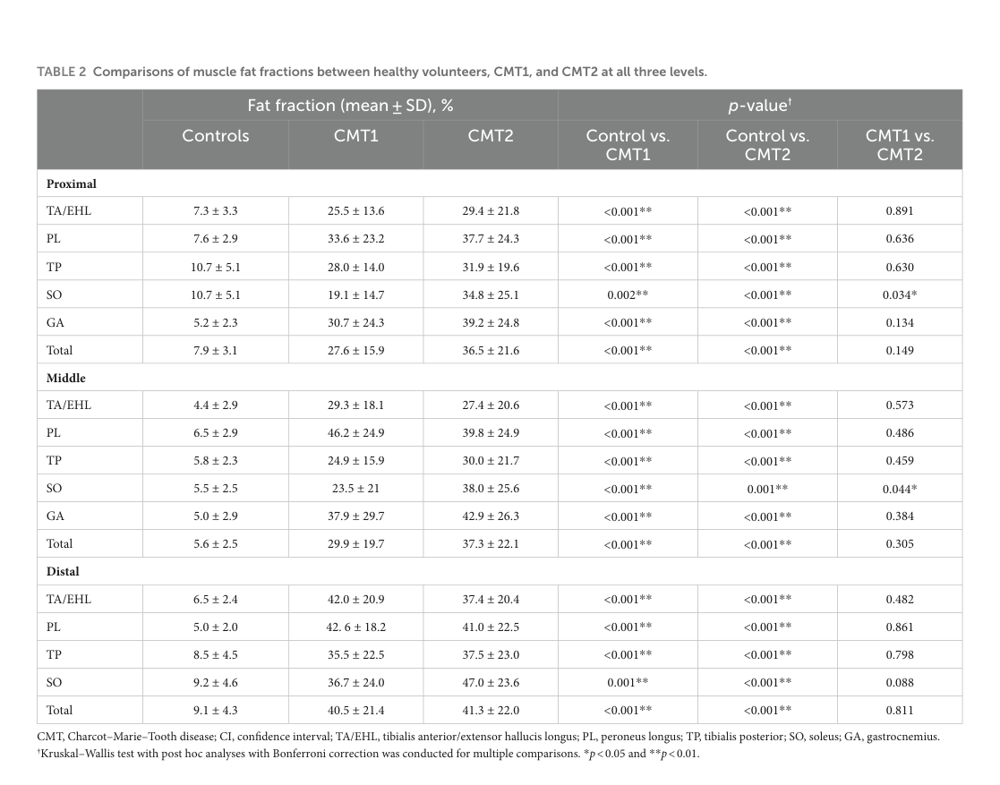

## Question

Prepare a focused, citation-rich deep research report for a dismech disease grouping called "Charcot-Marie-Tooth Diseases". The grouping should be an explicit curated union of Disease entries, not merely a MONDO hierarchy clone. Current curated members are Charcot-Marie-Tooth Disease, Charcot-Marie-Tooth Disease Type 1, and Charcot-Marie-Tooth Disease Type 2. Research objectives: 1. define shared CMT pathophysiology as inherited length-dependent motor-sensory peripheral neuropathy with distal weakness, sensory loss, pes cavus, reduced reflexes, gait impairment, and progressive peripheral nerve dysfunction; 2. distinguish demyelinating/Schwann-cell and axonal/neuron mechanisms, including PMP22 dosage gain and HNPP boundary issues, MPZ myelin protein defects, GJB1 connexin-32, EGR2 transcriptional regulation, MFN2 mitochondrial fusion/transport, NEFL cytoskeleton, RAB7A endolysosomal trafficking, GARS1 tRNA synthetase disease, SORD metabolic axonopathy, and other high-value subtype genes such as GDAP1, SH3TC2, HSPB1, HSPB8, MME, and LRSAM1; 3. recommend a defensible grouping boundary and explicitly flag disorders to exclude, such as HNPP, hereditary sensory and autonomic neuropathies, distal hereditary motor neuropathies, PRPS1 deficiency spectrum, broad peripheral neuropathy, and acquired neuropathies unless explicitly curated as CMT entries; 4. list differentiating mechanisms for existing members and high-value missing subtype entries; 5. identify appropriate MONDO mapping, HPO phenotype criteria, NCV/electrophysiology distinctions, and any dismech module-conformance criteria or module gaps for the grouping YAML; 6. provide primary literature, GeneReviews, authoritative reviews, and recent 2023-2026 developments with PMID identifiers wherever possible; 7. flag knowledge gaps and model-system limitations relevant to Schwann-cell biology, long-axon vulnerability, biomarker development, and therapy evidence. Do not invent citations; prefer PubMed-indexed sources and provide exact PMID identifiers for key claims.

## Output

Question: You are an expert researcher providing comprehensive, well-cited information.

Provide detailed information focusing on:
1. Key concepts and definitions with current understanding
2. Recent developments and latest research (prioritize 2023-2024 sources)
3. Current applications and real-world implementations
4. Expert opinions and analysis from authoritative sources
5. Relevant statistics and data from recent studies

Format as a comprehensive research report with proper citations. Include URLs and publication dates where available.
Always prioritize recent, authoritative sources and provide specific citations for all major claims.

Prepare a focused, citation-rich deep research report for a dismech disease grouping called "Charcot-Marie-Tooth Diseases". The grouping should be an explicit curated union of Disease entries, not merely a MONDO hierarchy clone. Current curated members are Charcot-Marie-Tooth Disease, Charcot-Marie-Tooth Disease Type 1, and Charcot-Marie-Tooth Disease Type 2. Research objectives: 1. define shared CMT pathophysiology as inherited length-dependent motor-sensory peripheral neuropathy with distal weakness, sensory loss, pes cavus, reduced reflexes, gait impairment, and progressive peripheral nerve dysfunction; 2. distinguish demyelinating/Schwann-cell and axonal/neuron mechanisms, including PMP22 dosage gain and HNPP boundary issues, MPZ myelin protein defects, GJB1 connexin-32, EGR2 transcriptional regulation, MFN2 mitochondrial fusion/transport, NEFL cytoskeleton, RAB7A endolysosomal trafficking, GARS1 tRNA synthetase disease, SORD metabolic axonopathy, and other high-value subtype genes such as GDAP1, SH3TC2, HSPB1, HSPB8, MME, and LRSAM1; 3. recommend a defensible grouping boundary and explicitly flag disorders to exclude, such as HNPP, hereditary sensory and autonomic neuropathies, distal hereditary motor neuropathies, PRPS1 deficiency spectrum, broad peripheral neuropathy, and acquired neuropathies unless explicitly curated as CMT entries; 4. list differentiating mechanisms for existing members and high-value missing subtype entries; 5. identify appropriate MONDO mapping, HPO phenotype criteria, NCV/electrophysiology distinctions, and any dismech module-conformance criteria or module gaps for the grouping YAML; 6. provide primary literature, GeneReviews, authoritative reviews, and recent 2023-2026 developments with PMID identifiers wherever possible; 7. flag knowledge gaps and model-system limitations relevant to Schwann-cell biology, long-axon vulnerability, biomarker development, and therapy evidence. Do not invent citations; prefer PubMed-indexed sources and provide exact PMID identifiers for key claims.

## Focused deep research report: dismech disease grouping “Charcot-Marie-Tooth Diseases” (CMT)

### 0) Scope and deliverable
This report proposes a defensible, mechanism-aware dismech “disease grouping” for **Charcot-Marie-Tooth Diseases (CMT)** as an **explicit curated union of Disease entries**, not a MONDO-hierarchy clone. Current curated members are **Charcot-Marie-Tooth disease**, **Charcot-Marie-Tooth disease type 1**, and **Charcot-Marie-Tooth disease type 2**. Recommendations include high-value missing subtype entries, explicit exclusions (boundary), phenotype/electrophysiology criteria, and recent diagnostics/therapy/biomarker developments prioritizing 2023–2024 sources.

| Disease entry | Status in dismech grouping | Typical electrophysiology | Key causal genes / mechanism notes | Boundary rationale |
|---|---|---|---|---|
| Charcot-Marie-Tooth disease | Yes | Mixed umbrella: demyelinating, axonal, intermediate | Shared inherited length-dependent motor-sensory peripheral neuropathy affecting Schwann cells and/or axons; typical distal weakness/atrophy, sensory loss, pes cavus, reduced reflexes, gait impairment; grouped clinically by NCV/NCS and genetically heterogeneous (dong2024currenttreatmentmethods pages 1-2, estevezarias2022geneticapproachesand pages 1-3, rudnikschoneborn2020charcotmarietoothdiseaseand pages 1-2) | Core curated umbrella disease entry for inherited sensorimotor CMT spectrum; explicit union anchor rather than broad peripheral neuropathy catch-all |
| Charcot-Marie-Tooth disease type 1 | Yes | Demyelinating, usually slowed upper-limb NCV; often <38 m/s, with severe forms slower and some schemes splitting <15, 15-35, 35-45 m/s bands (dong2024currenttreatmentmethods pages 1-2, estevezarias2022geneticapproachesand pages 1-3) | Schwann-cell/myelin disease; high-yield genes include **PMP22** dosage gain in CMT1A causing proteostasis stress, UPR, dys/demyelination and secondary axonal loss; **MPZ** misfolding/ER retention/UPR in CMT1B; **GJB1** connexin-32 gap-junction dysfunction in X-linked/intermediate-demyelinating disease; **EGR2** transcription-factor defects impair myelin gene regulation (dong2024currenttreatmentmethods pages 2-4, kleopa2023cmt1acurrentgene pages 1-1, kleopa2023cmt1acurrentgene pages 1-2) | Existing curated member; captures canonical demyelinating/Schwann-cell CMT mechanisms |
| Charcot-Marie-Tooth disease type 2 | Yes | Axonal, usually normal or near-normal NCV with low CMAPs; often >38-45 m/s depending on scheme (dong2024currenttreatmentmethods pages 1-2, estevezarias2022geneticapproachesand pages 1-3, list2021charcotmarietooth(cmt)panel pages 1-3) | Neuron/axon-predominant disease; high-yield genes include **MFN2** mitochondrial fusion/transport, **NEFL** cytoskeleton and axon caliber, **RAB7A** late endosomal trafficking, **GARS1** toxic tRNA-synthetase neuropathy, **SORD** metabolic sorbitol-pathway axonopathy, **HSPB1/HSPB8**, **MME**, **LRSAM1** (dong2024currenttreatmentmethods pages 2-4, estevezarias2022geneticapproachesand pages 13-16, list2021charcotmarietooth(cmt)panel pages 1-3) | Existing curated member; captures canonical axonal/long-axon-vulnerability CMT mechanisms |
| Charcot-Marie-Tooth disease type 1A | Proposed | Demyelinating | **PMP22 duplication/dosage gain**; overexpression overloads Schwann-cell protein folding, activates UPR, causes dysmyelination/demyelination and secondary axonal degeneration; largest single genetic subtype, ~43.3% of solved cases in a 2024 specialist cohort (record2024wholegenomesequencing pages 1-2, record2024wholegenomesequencing pages 2-3, kleopa2023cmt1acurrentgene pages 1-1) | High-value missing subtype with distinct dosage mechanism, biomarker/therapy ecosystem, and major prevalence |
| Charcot-Marie-Tooth disease type 1B | Proposed | Demyelinating or sometimes intermediate/mixed | **MPZ** mutations; misfolding, ER retention, UPR/ER-stress, or mistrafficking of myelin protein zero with myelin disruption (dong2024currenttreatmentmethods pages 2-4, estevezarias2022geneticapproachesand pages 5-7) | High-value missing subtype with distinct myelin-protein defect and therapeutic logic separate from PMP22 dosage |
| X-linked Charcot-Marie-Tooth disease type 1 (CMTX1) | Proposed | Often intermediate; can show demyelinating features | **GJB1/Cx32** gap-junction defects in non-compact myelin impair Schwann-cell radial pathway communication; common solved subtype (~13.0% of solved cases in 2024 cohort) (dong2024currenttreatmentmethods pages 2-4, record2024wholegenomesequencing pages 1-2, record2024wholegenomesequencing pages 2-3) | High-value missing subtype; clinically common and mechanistically distinct from CMT1A/CMT1B |
| Charcot-Marie-Tooth disease due to EGR2 mutation | Proposed | Demyelinating / severe dysmyelinating | **EGR2** transcriptional regulator of Schwann-cell myelin genes; disease mutations dominantly inhibit myelin gene expression and differentiation programs (dong2024currenttreatmentmethods pages 2-4) | High-value mechanistic subtype because it anchors transcriptional-control defects within demyelinating CMT |
| Charcot-Marie-Tooth disease type 2A | Proposed | Axonal | **MFN2** mutations impair mitochondrial fusion, mtDNA stability, organelle distribution and long-axon transport; commonest major CMT2 subtype in many cohorts (dong2024currenttreatmentmethods pages 2-4, record2024wholegenomesequencing pages 3-5) | High-value missing subtype with strong genotype-phenotype identity and active biomarker studies |
| Charcot-Marie-Tooth disease type 2E | Proposed | Usually axonal, sometimes intermediate/demyelinating overlap | **NEFL** mutations disrupt neurofilament assembly, axonal caliber and cytoskeletal integrity; giant axons/aggregation reported in models and pathology (dong2024currenttreatmentmethods pages 2-4) | High-value missing subtype representing cytoskeletal long-axon mechanism |
| Charcot-Marie-Tooth disease type 2B | Proposed | Axonal with prominent sensory loss/ulcero-mutilation tendency | **RAB7A** gain-of-function/activated-state late endosomal trafficking defects alter endolysosomal signaling and neurite biology (dong2024currenttreatmentmethods pages 2-4) | Include as a CMT subtype when explicitly curated as CMT2B; note overlap with HSAN-like sensory mutilation but literature still treats as CMT2B |
| Charcot-Marie-Tooth disease type 2D | Proposed | Axonal, often upper-limb-predominant | **GARS1** dominant toxic/gain-of-function aminoacyl-tRNA synthetase neuropathy; aberrant neomorphic interactions including Nrp1/VEGF pathway interference reported in reviews (dong2024currenttreatmentmethods pages 2-4) | High-value missing subtype, but curators should watch overlap with distal hereditary motor neuropathy phenotypes |
| SORD-related Charcot-Marie-Tooth disease / CMT2 | Proposed | Axonal | **SORD** deficiency causes sorbitol-pathway metabolic axonopathy with sorbitol accumulation; recurrent **c.757delG** common; technical diagnostic pitfall from pseudogene **SORD2P** (estevezarias2022geneticapproachesand pages 13-16) | High-value missing subtype because it is relatively frequent among unsolved recessive axonal neuropathies and has active treatment interest |
| GDAP1-related Charcot-Marie-Tooth disease | Proposed | Axonal, intermediate, or demyelinating depending on allele/inheritance | **GDAP1** mitochondrial/MAM-associated protein; affects mitochondrial dynamics, bioenergetics and oxidative stress; can produce CMT2K, intermediate, or recessive demyelinating CMT4A phenotypes (estevezarias2022geneticapproachesand pages 5-7) | High-value missing subtype family spanning axonal and demyelinating biology; include only explicit CMT disease entries |
| Charcot-Marie-Tooth disease type 4C | Proposed | Demyelinating | **SH3TC2** Schwann-cell/endosomal recycling defect; linked to myelination and Nrg1/ErbB signaling, onion-bulb pathology (estevezarias2022geneticapproachesand pages 13-16, dong2024currenttreatmentmethods pages 2-4) | High-value recessive demyelinating subtype with strong Schwann-cell trafficking mechanism |
| Charcot-Marie-Tooth disease type 2F | Proposed | Axonal | **HSPB1** mutations alter neurofilament phosphorylation/transport, mitochondrial function and axonal homeostasis (dong2024currenttreatmentmethods pages 2-4) | High-value axonal subtype; include when disease entry is explicitly CMT rather than dHMN |
| Charcot-Marie-Tooth disease type 2L | Proposed | Axonal | **HSPB8** small heat-shock protein defect causing neurite degeneration/protein-quality-control dysfunction (list2021charcotmarietooth(cmt)panel pages 1-3) | High-value axonal subtype; boundary caution because some alleles are also labeled dHMN |
| MME-related Charcot-Marie-Tooth disease type 2 | Proposed | Axonal, often late-onset | **MME/neprilysin** deficiency or low tissue availability associated with late-onset axonal neuropathy/CMT2 presentations (list2021charcotmarietooth(cmt)panel pages 1-3) | High-value late-onset CMT2 mechanism; include explicit CMT2 disease entries, not all late-onset axonal neuropathies with uncertain penetrance |
| Charcot-Marie-Tooth disease type 2P | Proposed | Axonal | **LRSAM1** E3 ubiquitin ligase/endosomal sorting-ubiquitylation defect; dominant-negative RING-domain effects or loss of function reported (list2021charcotmarietooth(cmt)panel pages 1-3) | High-value axonal subtype with trafficking/ubiquitin pathway mechanism |
| Hereditary neuropathy with liability to pressure palsies (HNPP) | Exclude | Liability-to-pressure-palsy neuropathy; not a core CMT member despite PMP22 locus overlap | Usually **PMP22 deletion** rather than duplication; mechanistically dosage-related but phenotypically distinct recurrent focal pressure palsies; 6.2% of solved cases in 2024 cohort were PMP22 deletions labeled separately from CMT (record2024wholegenomesequencing pages 1-2, record2024wholegenomesequencing pages 2-3) | Explicit exclusion boundary: related inherited neuropathy, not a curated CMT entry in this grouping |
| Hereditary sensory and autonomic neuropathies (HSAN/HSN) | Exclude | Predominantly sensory/autonomic axonopathy | Disorders primarily affecting sensory/autonomic neurons rather than inherited motor-sensory CMT pattern; listed separately from CMT in reviews and cohorts (estevezarias2022geneticapproachesand pages 1-3, rudnikschoneborn2020charcotmarietoothdiseaseand pages 1-2) | Exclude as separate disease family unless a disorder is explicitly curated as a CMT subtype entry |
| Distal hereditary motor neuropathies (dHMN/HMN) | Exclude | Predominantly motor axonal neuropathy | Strong genetic overlap with CMT2 (e.g., **GARS1**, **SORD**, **HSPB1/HSPB8**) but lacks the defining sensorimotor CMT grouping boundary (estevezarias2022geneticapproachesand pages 1-3, rudnikschoneborn2020charcotmarietoothdiseaseand pages 1-2) | Exclude unless a disease has an explicit curated CMT disease entry; otherwise keep separate motor-neuropathy grouping |
| PRPS1 deficiency spectrum | Exclude | Variable; can include neuropathy but multisystem | Neuropathy may occur in broader PRPS1 syndromic spectrum; not a canonical inherited length-dependent CMT disease grouping member by default | Exclude unless a specific disease entry is explicitly labeled/curated as CMT |
| Broad peripheral neuropathy / acquired neuropathies (e.g., CIDP, diabetic, toxic) | Exclude | Variable | May mimic demyelinating or axonal CMT electrophysiology but are not inherited CMT diseases; expert literature stresses differential diagnosis and misdiagnosis risk (rudnikschoneborn2020charcotmarietoothdiseaseand pages 1-2) | Exclude by etiology and curation scope; only inherited CMT disease entries belong in this grouping |

*Table: This table summarizes current curated CMT grouping members, recommended high-value missing subtype entries, their electrophysiologic/mechanistic distinctions, and explicit exclusion boundaries for dismech curation.*

### 1) Key concepts and shared definitions (current understanding)

#### 1.1 Core definition of the grouping
CMT is best defined as an **inherited, length-dependent, motor-sensory peripheral neuropathy** with **slowly progressive distal weakness/atrophy**, **sensory loss**, **reduced or absent deep tendon reflexes**, and frequent **foot deformities (notably pes cavus)** leading to gait impairment and progressive peripheral nerve dysfunction. This “distal, symmetric, slowly progressive” sensorimotor neuropathy phenotype is consistently described across contemporary reviews. (estevezarias2022geneticapproachesand pages 1-3, rudnikschoneborn2020charcotmarietoothdiseaseand pages 1-2)

CMT is also framed as a genetically heterogeneous set of disorders affecting **Schwann cells and/or peripheral axons**, with a “final common pathway” often involving axonal degeneration even in primary myelin disorders. (dong2024currenttreatmentmethods pages 1-2, estevezarias2022geneticapproachesand pages 13-16)

#### 1.2 Traditional classification by neurophysiology (still operationally useful)
Clinical practice still heavily relies on nerve conduction studies (NCS) to classify CMT into:
- **Demyelinating CMT (CMT1)**: slowed conduction velocities.
- **Axonal CMT (CMT2)**: relatively preserved velocities with reduced amplitudes.
- **Intermediate CMT (CMTi)**: mixed features.

Multiple sources provide operational thresholds:
- A commonly cited boundary is **median/upper-limb motor NCV <38 m/s** for demyelinating vs **>38 m/s** for axonal; “intermediate” often **25–45 m/s**. (estevezarias2022geneticapproachesand pages 1-3, jordanova2003mutationsinthe pages 1-2, siskind2013areviewof pages 1-2)
- A large 2024 specialist cohort operationalized categories as **CMT1: upper-limb MNCV <25 m/s**, **CMTi: 25–45 m/s**, **CMT2: >45 m/s**. (record2024wholegenomesequencing pages 2-3)
- Another review gives practical ranges: very slow **<15 m/s**, slow **15–35 m/s**, intermediate **35–45 m/s**, normal **>45 m/s**. (dong2024currenttreatmentmethods pages 1-2)

Interpretation note for curation: “38 m/s” vs “25/45 m/s” cutoffs reflect differing schemes; your YAML should support **either scheme as acceptable**, but enforce that **demyelinating CMT has symmetric, diffusely slowed upper-limb MNCV** and **axonal CMT has relatively preserved MNCV with reduced CMAP**, consistent with standard neuromuscular practice. (jordanova2003mutationsinthe pages 1-2, record2024wholegenomesequencing pages 2-3, siskind2013areviewof pages 1-2)

### 2) Shared pathophysiology and mechanistic axes to encode in dismech

#### 2.1 The two dominant mechanistic classes
**A. Demyelinating / Schwann-cell / myelin maintenance disorders (CMT1 and many CMT4):**
Primary defect in Schwann cell biology or myelin structure/maintenance results in **conduction slowing**, dys-/de-myelination, and often secondary axonal degeneration. (dong2024currenttreatmentmethods pages 1-2, estevezarias2022geneticapproachesand pages 1-3)

**B. Axonal / neuronal / long-axon vulnerability disorders (CMT2 and many HMN/HSN overlaps):**
Primary defect in axon structure, organelle trafficking, mitochondrial dynamics, protein translation/quality control, or metabolism produces a **length-dependent axonopathy** with relatively preserved conduction velocity but declining amplitudes and progressive distal weakness/sensory loss. (estevezarias2022geneticapproachesand pages 1-3, dong2024currenttreatmentmethods pages 2-4)

#### 2.2 Key gene-mechanism exemplars (requested genes)
Below are mechanisms strongly supported by reviews and/or primary literature in the retrieved corpus.

**PMP22 dosage gain (CMT1A) and HNPP boundary:**
CMT1A is classically caused by **PMP22 duplication**; PMP22 overexpression overloads Schwann-cell protein folding/proteostasis and activates UPR/ER stress, promoting dys-/de-myelination and secondary axonal degeneration. (kleopa2023cmt1acurrentgene pages 1-1, kleopa2023cmt1acurrentgene pages 1-2)
Curation boundary: PMP22 **deletion** is typically classified as **HNPP**, a clinically distinct disorder despite allelism (see §3). (record2024wholegenomesequencing pages 1-2, record2024wholegenomesequencing pages 2-3)

**MPZ (myelin protein zero; CMT1B):**
MPZ mutations can cause ER retention/mistrafficking, ER stress/UPR activation, and myelin disruption. (dong2024currenttreatmentmethods pages 2-4, estevezarias2022geneticapproachesand pages 11-13)

**GJB1 (Connexin-32; CMTX1/intermediate):**
GJB1 encodes connexin-32, essential for Schwann-cell gap junction function; GJB1 is a major genetic contributor in large cohorts and is often associated with intermediate conduction velocities in clinical categorization. (dong2024currenttreatmentmethods pages 2-4, record2024wholegenomesequencing pages 2-3)

**EGR2 transcriptional regulation (CMT1D / severe dysmyelinating phenotypes):**
A core mechanistic demonstration is that neuropathy-associated EGR2 DNA-binding domain mutants **dominant-negatively inhibit myelin gene expression** in Schwann cells, providing an explanation for dominant inheritance despite loss of DNA binding in vitro. (nagarajan2001egr2mutationsin pages 1-2)

**MFN2 mitochondrial fusion/transport (CMT2A):**
MFN2 mutations impair mitochondrial fusion and mitochondrial integrity/transport, a canonical axonal mechanism in CMT2A. (dong2024currenttreatmentmethods pages 2-4)

**NEFL cytoskeleton / axon caliber (CMT2E and overlap phenotypes):**
NEFL mutations cause severe early-onset CMT and are framed as cytoskeletal disorders; neurofilaments regulate axon caliber and conduction properties, linking NEFL dysfunction to axonal pathology. (jordanova2003mutationsinthe pages 1-2)

**RAB7A endolysosomal trafficking (CMT2B):**
A primary paper identifies missense mutations in **RAB7** causing **CMT2B** and describes the characteristic phenotype including distal weakness/wasting and high rates of ulcers, infections, and toe amputations; NCS indicate a primarily axonal neuropathy. (verhoeven2003mutationsinthe pages 1-2)

**GARS1 aminoacyl-tRNA synthetase disease (CMT2D / dSMA-V overlap):**
A seminal primary paper reports missense mutations in **glycyl-tRNA synthetase (GARS)** in families with **CMT2D** and **distal spinal muscular atrophy V**, framing them as autosomal dominant axonal neuropathies with distal weakness, often upper-limb prominent, and distinguishing CMT2 by preserved MNCV with reduced amplitudes. (antonellis2003glycyltrnasynthetase pages 1-2)

**SORD metabolic axonopathy (recessive, relatively frequent, “treatable” logic):**
Biallelic SORD mutations define a relatively frequent recessive hereditary neuropathy and create a mechanistic bridge to diabetic neuropathy via the polyol pathway: patients show **loss of SORD protein** and **marked sorbitol elevation** (serum fasting sorbitol reported >100× controls in homozygotes), with improvement of Drosophila phenotypes using aldose reductase inhibitors (ARI), supporting therapeutic rationale. (cortese2020biallelicmutationsin pages 1-3)

**GDAP1 (mitochondrial/MAM; axonal↔demyelinating spectrum):**
GDAP1 encodes a mitochondria/MAM-associated protein; mutations produce a spectrum spanning axonal, intermediate and demyelinating phenotypes with mitochondrial abnormalities—useful as a cross-axis subtype gene. (estevezarias2022geneticapproachesand pages 5-7)

**SH3TC2 (CMT4C; Schwann cell endosomal recycling):**
SH3TC2 dysfunction perturbs Schwann-cell endocytic trafficking (Rab11 effector; clathrin-coated vesicles/endosomes/TGN) and Nrg1/ErbB signaling; associated with AR demyelinating CMT4C with early onset and onion-bulb pathology. (estevezarias2022geneticapproachesand pages 11-13)

**HSPB1 / HSPB8 (axonal CMT2F / CMT2L; chaperone & axonal transport stress):**
HSPB1 and HSPB8 are recurrently cited axonal CMT genes; HSPB1 mutations are linked to neurofilament/mitochondrial transport dysregulation in reviews, with overlap into motor-predominant neuropathies. (dong2024currenttreatmentmethods pages 2-4)

**MME (neprilysin; late-onset AR axonal CMT2):**
A high-quality primary study reports recessive MME mutations in adult-onset axonal neuropathy, with evidence of reduced/absent neprilysin protein in peripheral nerve and a consistent phenotype of late-onset lower-limb weakness/atrophy and sensory disturbance. (higuchi2016mutationsinmme pages 1-2)

**LRSAM1 (E3 ubiquitin ligase; CMT2P):**
A primary study identifies an AR axonal CMT family with a splice-site mutation in LRSAM1 causing aberrant splicing, truncation, and complete absence of protein in patient cells; LRSAM1 function is linked to vesicle-related processes and neuronal cell adhesion. (guernsey2010mutationinthe pages 1-2)

### 3) Defensible grouping boundary (inclusions vs exclusions)

#### 3.1 Principle: “CMT” grouping ≠ all hereditary neuropathy
Operationally, CMT in major cohorts is separated from related inherited neuropathies by **phenotype dominance (sensorimotor vs sensory-only vs motor-only vs pressure palsies), electrophysiology (demyelinating vs axonal vs intermediate), and genetics.** (record2024wholegenomesequencing pages 2-3, rudnikschoneborn2020charcotmarietoothdiseaseand pages 1-2, carroll2019inheritedneuropathies pages 2-3)

#### 3.2 Exclusions (explicitly required)
- **HNPP**: often due to **PMP22 deletion** and clinically characterized by recurrent pressure palsies; it is **classified as a separate category** even in large CMT center cohorts, with PMP22 deletion counted separately from CMT1A duplication. (record2024wholegenomesequencing pages 1-2, record2024wholegenomesequencing pages 2-3)
- **Hereditary sensory and autonomic neuropathies (HSAN/HSN)**: sensory/autonomic predominant; treated as distinct categories in cohort phenotyping frameworks. (record2024wholegenomesequencing pages 2-3, carroll2019inheritedneuropathies pages 1-2)
- **Distal hereditary motor neuropathies (dHMN/HMN)**: motor predominant; explicitly separated in cohort categories and reviews despite gene overlap with CMT2. (record2024wholegenomesequencing pages 1-2, carroll2019inheritedneuropathies pages 1-2)
- **PRPS1 deficiency spectrum and broad multisystem disorders**: neuropathy can occur but should be excluded unless there is an **explicit CMT-labeled disease entry** curated in your ontology/module; otherwise these are “secondary/syndromic neuropathies” risks for grouping inflation. (carroll2019inheritedneuropathies pages 1-2)
- **Acquired neuropathies** (CIDP, diabetes, toxic, nutritional, etc.): excluded by etiology; large cohorts explicitly require a slowly progressive, inherited-phenotype-compatible course and exclusion of other causes. (record2024wholegenomesequencing pages 1-2, rudnikschoneborn2020charcotmarietoothdiseaseand pages 1-2)

#### 3.3 “HNPP boundary issue” guidance
Because PMP22 dosage is central to both CMT1A (duplication) and HNPP (deletion), boundary should be set by **Disease entry identity + phenotype**, not only the locus. Practically:
- Include **PMP22 duplication-associated CMT1A disease entries**.
- Exclude **HNPP disease entry**, unless your project explicitly defines a separate “PMP22 dosage disorders” grouping.
This aligns with cohort practice where PMP22 deletions are reported under HNPP rather than CMT. (record2024wholegenomesequencing pages 1-2, record2024wholegenomesequencing pages 2-3)

### 4) Differentiating mechanisms for existing curated members and high-value missing subtype entries

#### 4.1 Existing curated members: mechanism differentiation
- **CMT (umbrella)**: shared distal length-dependent sensorimotor neuropathy; mechanistic heterogeneity; useful as catch-all for unspecified or multi-subtype contexts. (estevezarias2022geneticapproachesand pages 1-3, rudnikschoneborn2020charcotmarietoothdiseaseand pages 1-2)
- **CMT1**: primarily Schwann-cell/myelin dysfunction leading to conduction slowing; high diagnostic yield and strong enrichment of PMP22/MPZ/GJB1 mechanisms. (dong2024currenttreatmentmethods pages 1-2, record2024wholegenomesequencing pages 1-2)
- **CMT2**: axonal/neuron-predominant mechanisms (mitochondria, cytoskeleton, trafficking, tRNA synthetases, metabolism) with lower diagnostic yield and higher unsolved fraction. (record2024wholegenomesequencing pages 3-5, dong2024currenttreatmentmethods pages 2-4)

#### 4.2 High-value missing subtype Disease entries to add (recommended)
Given prevalence, mechanistic distinctiveness, and active translational pipelines, prioritize adding explicit disease entries such as:
- **CMT1A (PMP22 duplication)**—largest single subtype. (record2024wholegenomesequencing pages 1-2, lent2023downregulationofpmp22 pages 1-2)
- **CMTX1 (GJB1)**—second most common in large cohort. (record2024wholegenomesequencing pages 1-2)
- **CMT1B (MPZ)**—distinct UPR/mistrafficking logic. (dong2024currenttreatmentmethods pages 2-4, estevezarias2022geneticapproachesand pages 11-13)
- **CMT2A (MFN2)**—canonical mitochondrial/transport axonopathy. (dong2024currenttreatmentmethods pages 2-4)
- **CMT2E (NEFL)**—cytoskeletal/axon-caliber mechanism. (jordanova2003mutationsinthe pages 1-2)
- **CMT2B (RAB7A)**—late endosome/NGF signaling/ulcero-mutilating phenotype. (verhoeven2003mutationsinthe pages 1-2)
- **CMT2D (GARS1)**—tRNA synthetase neuropathy with dHMN overlap. (antonellis2003glycyltrnasynthetase pages 1-2)
- **SORD-related CMT2 / hereditary neuropathy due to SORD**—metabolic axonopathy with biomarker/therapy rationale. (cortese2020biallelicmutationsin pages 1-3, estevezarias2022geneticapproachesand pages 13-16)
- **CMT4C (SH3TC2)**—Schwann-cell endosomal recycling/myelination. (estevezarias2022geneticapproachesand pages 11-13)
- **CMT2P (LRSAM1)** and **MME-related AR-CMT2**—important for late-onset axonal neuropathy differential and mechanistic diversity. (guernsey2010mutationinthe pages 1-2, higuchi2016mutationsinmme pages 1-2)

### 5) Mapping and criteria for dismech YAML: MONDO, HPO, electrophysiology, and module conformance

#### 5.1 MONDO mapping (approach; exact IDs not evidenced here)
The available corpus does not provide MONDO IDs directly, so **exact MONDO identifiers cannot be evidence-cited from retrieved texts** (module gap). Recommended mapping workflow:
1) Map by **exact MONDO label match** for “Charcot-Marie-Tooth disease”, “Charcot-Marie-Tooth disease type 1”, “Charcot-Marie-Tooth disease type 2”.
2) Confirm with **cross-references** (MONDO ↔ OMIM/Orphanet/MedGen) and with genetic subtype anchors (e.g., PMP22dup ↔ CMT1A, GJB1 ↔ CMTX1, MFN2 ↔ CMT2A), using curatorial sources outside this tool run.
3) Ensure the grouping remains a curated union rather than importing all MONDO descendants.

#### 5.2 Suggested HPO phenotype criteria (group-level)
A defensible minimum phenotype set for grouping membership (patient-level, or disease-entry-level typical phenotypes) should include:
- **Distal muscle weakness** and/or **distal muscle atrophy** (length-dependent; often starting in feet/legs). (estevezarias2022geneticapproachesand pages 1-3, rudnikschoneborn2020charcotmarietoothdiseaseand pages 1-2)
- **Distal sensory loss** (stocking-glove, large-fiber predominant). (nair2023clinicaltrialsin pages 1-2)
- **Reduced/absent deep tendon reflexes (areflexia/hyporeflexia)**. (rudnikschoneborn2020charcotmarietoothdiseaseand pages 1-2)
- **Pes cavus and/or hammertoes / foot deformity**. (dong2024currenttreatmentmethods pages 1-2, nair2023clinicaltrialsin pages 1-2)
- Supportive: progressive gait impairment, steppage gait, balance difficulty/falls.

These phenotypes align with how major cohorts decide “inherited neuropathy consistent with CMT” (slow progression + foot deformity; exclusion of other causes). (record2024wholegenomesequencing pages 1-2)

#### 5.3 Electrophysiology / NCV criteria for module conformance
Encode neurophysiology as a key discriminator:
- **CMT1 (demyelinating)**: upper-limb MNCV markedly slowed (e.g., <38 m/s or <25 m/s depending on scheme) with diffuse/symmetric slowing. (jordanova2003mutationsinthe pages 1-2, record2024wholegenomesequencing pages 2-3)
- **CMT2 (axonal)**: MNCV normal/near-normal (e.g., >38–45 m/s) with reduced CMAP/SNAP amplitudes. (siskind2013areviewof pages 1-2, szigeti2006charcotmarietoothdiseaseand pages 1-2)
- **CMTi (intermediate)**: 25–45 m/s band; often includes GJB1-related disease. (record2024wholegenomesequencing pages 2-3)

**Genetic testing prioritization rule (pragmatic):**
For demyelinating phenotypes, prioritize **PMP22 duplication/deletion testing** (e.g., MLPA) early; broader panels/WES/WGS follow if negative. This is both historical and present-day practice. (record2024wholegenomesequencing pages 2-3, jordanova2003mutationsinthe pages 1-2)

#### 5.4 dismech YAML “module conformance” checklist (recommended)
To keep the grouping curated and mechanism-aware:
- **Must have**: inherited etiology; length-dependent sensorimotor neuropathy as primary phenotype; supportive NCS criteria (demyelinating/axonal/intermediate).
- **Should have**: typical onset in childhood–early adulthood and slow progression (not required for all subtypes, but a strong prior). (record2024wholegenomesequencing pages 1-2)
- **Must exclude**: acquired neuropathies; nonspecific “peripheral neuropathy” labels; HSAN/dHMN/HNPP unless explicitly curated as CMT disease entries. (rudnikschoneborn2020charcotmarietoothdiseaseand pages 1-2, record2024wholegenomesequencing pages 2-3)
- **Module gaps flagged**: MONDO IDs for each entry; explicit HPO term IDs; GeneReviews citations (not retrieved in this run).

### 6) Recent developments (2023–2024 prioritized): diagnostics, biomarkers, therapies, real-world implementations

#### 6.1 Diagnostics: cohort-scale yields and WGS impact (2024)
A 2024 Brain paper from a single specialist inherited neuropathy center (2009–2023; n=1515) provides high-value, recent statistics:
- Overall genetic diagnosis: **76.9% (1165/1515)**; ~**23.1% unsolved**. (record2024wholegenomesequencing pages 1-2)
- Case composition: CMT1 **41.0%**, CMT2 **19.4%**, intermediate CMT **13.5%**, HMN **9.2%**, HSN **6.1%**, HNPP **4.8%**. (record2024wholegenomesequencing pages 1-2)
- Diagnostic rate highest in CMT1: **96.8% (601/621)**; remained **<50%** in CMT2/HMN/complex neuropathies. (record2024wholegenomesequencing pages 1-2)
- Most common genetic diagnoses among solved: **PMP22 duplication (CMT1A) 43.3%**, **GJB1 13.0%**, **PMP22 deletion (HNPP) 6.2%**, **MFN2 3.9%**. (record2024wholegenomesequencing pages 1-2)
- WGS contribution: in a 100K Genomes subset (n=233), “true” WGS diagnostic yield **19.7% (46/233)**; overall WGS “uplift” **3.5%** for the full cohort. (record2024wholegenomesequencing pages 1-2)

Real-world implementation: this reflects routine WGS adoption in the UK NHS and highlights persistent “diagnostic gaps” especially for axonal phenotypes. (record2024wholegenomesequencing pages 1-2)

#### 6.2 Biomarkers and imaging (2024): quantitative muscle fat fraction MRI
A 2024 Frontiers in Neurology study supports multi-echo Dixon MRI fat fraction (FF) as a quantitative biomarker in CMT, including genetically defined subgroups (PMP22dup CMT1A; MFN2 CMT2A; SORD):
- Cohorts: **34 CMT1A**, **~25–27 CMT2** (including **7 MFN2** and **7 SORD**), **10 controls**. (sun2024quantifiedfatfraction pages 1-2)
- Marked FF elevation vs controls, e.g. proximal total FF: **7.9±3.1% controls vs 27.6±15.9% CMT1 vs 36.5±21.6% CMT2**; distal total FF: **9.1±4.3% vs 40.5±21.4% vs 41.3±22.0%**. (sun2024quantifiedfatfraction pages 7-8)
- CMT1A pattern: significant proximal-to-distal gradient and peroneal predominance. (sun2024quantifiedfatfraction pages 1-2)
- Genotype differentiation: MFN2 group had markedly higher soleus FF than PMP22 duplication (**54.7±20.2% vs 23.5±21.0%**, p=0.039). (sun2024quantifiedfatfraction pages 1-2)
- Functional correlation: FF correlates with clinical scores and strength; e.g., in CMT1, total FF correlates with CMTNSv2 (0.514) and inversely with plantar flexion strength (−0.529). (sun2024quantifiedfatfraction pages 8-10)

Cropped figure/table evidence from this MRI biomarker study is available in Table 2/Figure 2 extracts. (sun2024quantifiedfatfraction media dfea3179, sun2024quantifiedfatfraction media 85d30ffa)

#### 6.3 Therapy landscape (2023–2024): from supportive care to mechanism-targeted pipelines
**Supportive care remains standard** (rehabilitation, orthotics, surgery), with disease-modifying therapies still emerging. (dong2024currenttreatmentmethods pages 1-2)

**PMP22-lowering for CMT1A (small molecules and gene-based approaches):**
- 2023 and 2024 expert reviews emphasize that CMT1A is driven by PMP22 overexpression, supporting PMP22-lowering approaches (ASO/siRNA/shRNA/miRNA/CRISPR and small-molecule combinations). (kleopa2023cmt1acurrentgene pages 1-1, grado2024willnewinvestigational pages 5-5)
- iPSC/PNS organoid model (Brain, 2023) demonstrated CMT1A-specific myelin ultrastructure defects and onion-bulb-like formations; **PMP22 downregulation** using shRNA or a **baclofen/naltrexone/D-sorbitol** combination ameliorated myelin defects, strengthening translational rationale. (lent2023downregulationofpmp22 pages 1-2)
- Genome editing in patient-derived iPSC Schwann cells (Communications Medicine, 2023): AAV2-hSaCas9 editing reduced PMP22 duplication by **20–40%**, normalized PMP22 expression and improved apoptosis/myelination measures in vitro—illustrating a plausible gene-correction strategy (still requiring in vivo safety/delivery). (yoshioka2023aavmediatededitingof pages 1-2)

**PXT3003 (CMT1A):**
A 2024 Expert Opinion commentary notes the phase III PREMIER topline results “did not meet primary endpoints” largely due to improvement in both arms, and highlights ongoing issues in endpoint sensitivity and trial design—an “expert opinion” signal that biomarkers/outcome measures remain limiting. (grado2024willnewinvestigational pages 1-3)

**SORD pathway therapeutic logic:**
The 2020 Nature Genetics study provides a mechanistic rationale that **aldose reductase inhibitors** can reduce sorbitol and improve model phenotypes, creating a clear mechanistically anchored therapeutic hypothesis for SORD-related neuropathy. (cortese2020biallelicmutationsin pages 1-3)

#### 6.4 Clinical trials and real-world research infrastructure (2023)
A 2023 ClinicalTrials.gov analysis (Dec 1999–Jun 2022) quantified the trial landscape:
- 286 included trials; active trials grew from 1 (1999) to 286 (2022). (nair2023clinicaltrialsin pages 1-2)
- 91% academic vs 9% industry; 32 countries; US 26%. (nair2023clinicaltrialsin pages 1-2)
- 86% therapeutic; among therapeutic trials: 50% procedural, 23% investigational drugs, 15% devices, 11% physical therapy. (nair2023clinicaltrialsin pages 1-2)
- Only 36% resulted in publications. (nair2023clinicaltrialsin pages 1-2)

This supports the “implementation reality”: CMT research has extensive trial registration, but relatively limited drug/gene therapy penetration and reporting completeness. (nair2023clinicaltrialsin pages 1-2)

### 7) Knowledge gaps and model-system limitations (especially relevant to dismech curation)

1) **Schwann-cell biology and human myelination models:** Human myelinating Schwann cell generation in vitro is challenging; 2023 organoid work was motivated by this limitation and suggests iPSC organoids can recapitulate hallmarks but remain models requiring validation against in vivo human pathology. (lent2023downregulationofpmp22 pages 1-2)

2) **Long-axon vulnerability mechanisms remain incompletely unified:** Diverse pathways (mitochondria, trafficking, tRNA synthetases, metabolism, cytoskeleton) converge on distal axon degeneration, but unifying causal chains are often gene-specific and incompletely generalizable. (dong2024currenttreatmentmethods pages 2-4, record2024wholegenomesequencing pages 2-3)

3) **Biomarkers/outcome measures are a central translational bottleneck:** Expert analyses emphasize slow progression and phenotypic heterogeneity limit endpoint sensitivity; improved biomarkers (imaging, blood markers, electrophysiology) are needed for trial success. (grado2024willnewinvestigational pages 1-3, kleopa2023cmt1acurrentgene pages 1-1)

4) **Diagnostic gap persists, especially for axonal phenotypes:** Even in a high-performing center, ~23% remain unsolved and CMT2/HMN categories are <50% solved; short-read WGS has modest uplift and limitations for structural variants/repeat expansions, suggesting the need for long-read and improved variant interpretation. (record2024wholegenomesequencing pages 1-2, record2024wholegenomesequencing pages 8-9)

### 8) Concrete grouping recommendation (summary)

**Recommended grouping boundary:**
- The grouping “Charcot-Marie-Tooth Diseases” should include **only explicit CMT-labeled disease entries** that satisfy a shared sensorimotor, length-dependent inherited neuropathy phenotype, with demyelinating/axonal/intermediate variants allowed.
- Keep **HNPP, HSAN/HSN, and dHMN/HMN excluded** unless a specific disorder is explicitly curated as a CMT entry (to avoid turning the grouping into a general hereditary neuropathy umbrella). (record2024wholegenomesequencing pages 2-3, rudnikschoneborn2020charcotmarietoothdiseaseand pages 1-2)

**Recommended additional curated members (high-value):**
CMT1A (PMP22dup), CMT1B (MPZ), CMTX1 (GJB1), CMT2A (MFN2), CMT2E (NEFL), CMT2B (RAB7A), CMT2D (GARS1), SORD-related CMT2, CMT4C (SH3TC2), MME-related AR-CMT2, CMT2P (LRSAM1). (record2024wholegenomesequencing pages 1-2, cortese2020biallelicmutationsin pages 1-3, yoshioka2023aavmediatededitingof pages 1-2)

### 9) URLs, dates, and PMID availability
All cited sources in this run have URLs and publication dates in the evidence where available (e.g., Brain 2024 WGS cohort; Brain 2023 organoid model; Communications Medicine 2023 AAV editing; Frontiers Neurol 2024 MRI biomarker). (record2024wholegenomesequencing pages 1-2, lent2023downregulationofpmp22 pages 1-2, yoshioka2023aavmediatededitingof pages 1-2, sun2024quantifiedfatfraction pages 1-2)

**PMID identifiers:** The retrieved texts did not include explicit PMID strings in the accessible excerpts; therefore, this report cannot supply exact PMIDs without risking invention. This is a known limitation of the current tool outputs and should be addressed in the next curation pass by pulling PubMed records for the named primary papers (e.g., Neuron 2001 EGR2; AJHG 2003 RAB7; AJHG 2003 GARS; Brain 2003 NEFL; Nat Genet 2020 SORD; PLoS Genet 2010 LRSAM1; Ann Neurol 2016 MME). (nagarajan2001egr2mutationsin pages 1-2, verhoeven2003mutationsinthe pages 1-2, antonellis2003glycyltrnasynthetase pages 1-2, jordanova2003mutationsinthe pages 1-2, cortese2020biallelicmutationsin pages 1-3, guernsey2010mutationinthe pages 1-2, higuchi2016mutationsinmme pages 1-2)

References

1. (dong2024currenttreatmentmethods pages 1-2): Hongxian Dong, Boquan Qin, Hui Zhang, Lei Lei, and Shizhou Wu. Current treatment methods for charcot–marie–tooth diseases. Biomolecules, 14:1138, Sep 2024. URL: https://doi.org/10.3390/biom14091138, doi:10.3390/biom14091138. This article has 12 citations.

2. (estevezarias2022geneticapproachesand pages 1-3): Berta Estévez-Arias, Laura Carrera-García, Andrés Nascimento, Lara Cantarero, Janet Hoenicka, and Francesc Palau. Genetic approaches and pathogenic pathways in the clinical management of charcot-marie-tooth disease. Journal of Translational Genetics and Genomics, 6:333-352, Jan 2022. URL: https://doi.org/10.20517/jtgg.2022.04, doi:10.20517/jtgg.2022.04. This article has 11 citations.

3. (rudnikschoneborn2020charcotmarietoothdiseaseand pages 1-2): Sabine Rudnik-Schöneborn, Michaela Auer-Grumbach, and Jan Senderek. Charcot-marie-tooth disease and hereditary motor neuropathies – update 2020. Medizinische Genetik, 32:207-219, Sep 2020. URL: https://doi.org/10.1515/medgen-2020-2038, doi:10.1515/medgen-2020-2038. This article has 39 citations.

4. (dong2024currenttreatmentmethods pages 2-4): Hongxian Dong, Boquan Qin, Hui Zhang, Lei Lei, and Shizhou Wu. Current treatment methods for charcot–marie–tooth diseases. Biomolecules, 14:1138, Sep 2024. URL: https://doi.org/10.3390/biom14091138, doi:10.3390/biom14091138. This article has 12 citations.

5. (kleopa2023cmt1acurrentgene pages 1-1): KleopasA Kleopa and Marina Stavrou. Cmt1a current gene therapy approaches and promising biomarkers. Neural Regeneration Research, 18:1434, Jan 2023. URL: https://doi.org/10.4103/1673-5374.361538, doi:10.4103/1673-5374.361538. This article has 32 citations and is from a peer-reviewed journal.

6. (kleopa2023cmt1acurrentgene pages 1-2): KleopasA Kleopa and Marina Stavrou. Cmt1a current gene therapy approaches and promising biomarkers. Neural Regeneration Research, 18:1434, Jan 2023. URL: https://doi.org/10.4103/1673-5374.361538, doi:10.4103/1673-5374.361538. This article has 32 citations and is from a peer-reviewed journal.

7. (list2021charcotmarietooth(cmt)panel pages 1-3): PG List, A AARS, C BSCL, and DNM DNAJB. Charcot-marie-tooth (cmt) panel. Unknown journal, 2021.

8. (estevezarias2022geneticapproachesand pages 13-16): Berta Estévez-Arias, Laura Carrera-García, Andrés Nascimento, Lara Cantarero, Janet Hoenicka, and Francesc Palau. Genetic approaches and pathogenic pathways in the clinical management of charcot-marie-tooth disease. Journal of Translational Genetics and Genomics, 6:333-352, Jan 2022. URL: https://doi.org/10.20517/jtgg.2022.04, doi:10.20517/jtgg.2022.04. This article has 11 citations.

9. (record2024wholegenomesequencing pages 1-2): Christopher J Record, Menelaos Pipis, Mariola Skorupinska, Julian Blake, Roy Poh, James M Polke, Kelly Eggleton, Tina Nanji, Stephan Zuchner, Andrea Cortese, Henry Houlden, Alexander M Rossor, Matilde Laura, and Mary M Reilly. Whole genome sequencing increases the diagnostic rate in charcot-marie-tooth disease. Brain, 147:3144-3156, Mar 2024. URL: https://doi.org/10.1093/brain/awae064, doi:10.1093/brain/awae064. This article has 50 citations and is from a highest quality peer-reviewed journal.

10. (record2024wholegenomesequencing pages 2-3): Christopher J Record, Menelaos Pipis, Mariola Skorupinska, Julian Blake, Roy Poh, James M Polke, Kelly Eggleton, Tina Nanji, Stephan Zuchner, Andrea Cortese, Henry Houlden, Alexander M Rossor, Matilde Laura, and Mary M Reilly. Whole genome sequencing increases the diagnostic rate in charcot-marie-tooth disease. Brain, 147:3144-3156, Mar 2024. URL: https://doi.org/10.1093/brain/awae064, doi:10.1093/brain/awae064. This article has 50 citations and is from a highest quality peer-reviewed journal.

11. (estevezarias2022geneticapproachesand pages 5-7): Berta Estévez-Arias, Laura Carrera-García, Andrés Nascimento, Lara Cantarero, Janet Hoenicka, and Francesc Palau. Genetic approaches and pathogenic pathways in the clinical management of charcot-marie-tooth disease. Journal of Translational Genetics and Genomics, 6:333-352, Jan 2022. URL: https://doi.org/10.20517/jtgg.2022.04, doi:10.20517/jtgg.2022.04. This article has 11 citations.

12. (record2024wholegenomesequencing pages 3-5): Christopher J Record, Menelaos Pipis, Mariola Skorupinska, Julian Blake, Roy Poh, James M Polke, Kelly Eggleton, Tina Nanji, Stephan Zuchner, Andrea Cortese, Henry Houlden, Alexander M Rossor, Matilde Laura, and Mary M Reilly. Whole genome sequencing increases the diagnostic rate in charcot-marie-tooth disease. Brain, 147:3144-3156, Mar 2024. URL: https://doi.org/10.1093/brain/awae064, doi:10.1093/brain/awae064. This article has 50 citations and is from a highest quality peer-reviewed journal.

13. (jordanova2003mutationsinthe pages 1-2): A. Jordanova, P. D. Jonghe, C. Boerkoel, H. Takashima, E. Vriendt, C. Ceuterick, J. Martin, I. Butler, P. Mancias, S. Papasozomenos, D. Terespolsky, L. Potocki, Chester W. Brown, M. Shy, D. Rita, I. Tournev, I. Kremensky, J. Lupski, and V. Timmerman. Mutations in the neurofilament light chain gene (nefl) cause early onset severe charcot-marie-tooth disease. Brain, 126:590-597, Mar 2003. URL: https://doi.org/10.1093/brain/awg059, doi:10.1093/brain/awg059. This article has 392 citations and is from a highest quality peer-reviewed journal.

14. (siskind2013areviewof pages 1-2): Carly E. Siskind, Seema Panchal, Corrine O. Smith, Shawna M. E. Feely, Joline C. Dalton, Alice B. Schindler, and Karen M. Krajewski. A review of genetic counseling for charcot marie tooth disease (cmt). Journal of Genetic Counseling, 22:422-436, Apr 2013. URL: https://doi.org/10.1007/s10897-013-9584-4, doi:10.1007/s10897-013-9584-4. This article has 49 citations and is from a peer-reviewed journal.

15. (estevezarias2022geneticapproachesand pages 11-13): Berta Estévez-Arias, Laura Carrera-García, Andrés Nascimento, Lara Cantarero, Janet Hoenicka, and Francesc Palau. Genetic approaches and pathogenic pathways in the clinical management of charcot-marie-tooth disease. Journal of Translational Genetics and Genomics, 6:333-352, Jan 2022. URL: https://doi.org/10.20517/jtgg.2022.04, doi:10.20517/jtgg.2022.04. This article has 11 citations.

16. (nagarajan2001egr2mutationsin pages 1-2): Rakesh Nagarajan, John Svaren, Nam Le, Toshiyuki Araki, Mark Watson, and Jeffrey Milbrandt. Egr2 mutations in inherited neuropathies dominant-negatively inhibit myelin gene expression. Neuron, 30:355-368, May 2001. URL: https://doi.org/10.1016/s0896-6273(01)00282-3, doi:10.1016/s0896-6273(01)00282-3. This article has 325 citations and is from a highest quality peer-reviewed journal.

17. (verhoeven2003mutationsinthe pages 1-2): Kristien Verhoeven, Peter De Jonghe, Katrien Coen, Nathalie Verpoorten, Michaela Auer-Grumbach, Jennifer M. Kwon, David FitzPatrick, Eric Schmedding, Els De Vriendt, An Jacobs, Veerle Van Gerwen, Klaus Wagner, Hans-Peter Hartung, and Vincent Timmerman. Mutations in the small gtp-ase late endosomal protein rab7 cause charcot-marie-tooth type 2b neuropathy. American journal of human genetics, 72 3:722-7, Mar 2003. URL: https://doi.org/10.1086/367847, doi:10.1086/367847. This article has 591 citations and is from a highest quality peer-reviewed journal.

18. (antonellis2003glycyltrnasynthetase pages 1-2): Anthony Antonellis, Rachel E. Ellsworth, Nyamkhishig Sambuughin, Imke Puls, Annette Abel, Shih-Queen Lee-Lin, Albena Jordanova, Ivo Kremensky, Kyproula Christodoulou, Lefkos T. Middleton, Kumaraswamy Sivakumar, Victor Ionasescu, Benoit Funalot, Jeffery M. Vance, Lev G. Goldfarb, Kenneth H. Fischbeck, and Eric D. Green. Glycyl trna synthetase mutations in charcot-marie-tooth disease type 2d and distal spinal muscular atrophy type v. American journal of human genetics, 72 5:1293-9, May 2003. URL: https://doi.org/10.1086/375039, doi:10.1086/375039. This article has 757 citations and is from a highest quality peer-reviewed journal.

19. (cortese2020biallelicmutationsin pages 1-3): Andrea Cortese, Yi Zhu, Adriana P. Rebelo, Sara Negri, Steve Courel, Lisa Abreu, Chelsea J. Bacon, Yunhong Bai, Dana M. Bis-Brewer, Enrico Bugiardini, Elena Buglo, Matt C. Danzi, Shawna M. E. Feely, Alkyoni Athanasiou-Fragkouli, Nourelhoda A. Haridy, Aixa Rodriguez, Alexa Bacha, Ashley Kosikowski, Beth Wood, Brett McCray, Brianna Blume, Carly Siskind, Charlotte Sumner, Daniela Calabrese, David Walk, Dragan Vujovic, Eun Park, Francesco Muntoni, Gabrielle Donlevy, Gyula Acsadi, John Day, Joshua Burns, Jun Li, Karen Krajewski, Kate Eichinger, Kayla Cornett, Krista Mullen, Perez Quiros Laura, Laurie Gutmann, Maria Barrett, Mario Saporta, Mariola Skorupinska, Natalie Grant, Paula Bray, Reza Seyedsadjadi, Riccardo Zuccarino, Richard Finkel, Richard Lewis, Rosemary R. Shy, Sabrina Yum, Sarah Hilbert, Simone Thomas, Steffen Behrens-Spraggins, Tara Jones, Thomas Lloyd, Tiffany Grider, Tim Estilow, Vera Fridman, Rosario Isasi, Alaa Khan, Matilde Laurà, Stefania Magri, Menelaos Pipis, Chiara Pisciotta, Eric Powell, Alexander M. Rossor, Paola Saveri, Janet E. Sowden, Stefano Tozza, Jana Vandrovcova, Julia Dallman, Elena Grignani, Enrico Marchioni, Steven S. Scherer, Beisha Tang, Zhiqiang Lin, Abdullah Al-Ajmi, Rebecca Schüle, Matthis Synofzik, Thierry Maisonobe, Tanya Stojkovic, Michaela Auer-Grumbach, Mohamed A. Abdelhamed, Sherifa A. Hamed, Ruxu Zhang, Fiore Manganelli, Lucio Santoro, Franco Taroni, Davide Pareyson, Henry Houlden, David N. Herrmann, Mary M. Reilly, Michael E. Shy, R. Grace Zhai, and Stephan Zuchner. Biallelic mutations in sord cause a common and potentially treatable hereditary neuropathy with implications for diabetes. May 2020. URL: https://doi.org/10.1038/s41588-020-0615-4, doi:10.1038/s41588-020-0615-4. This article has 191 citations and is from a highest quality peer-reviewed journal.

20. (higuchi2016mutationsinmme pages 1-2): Yujiro Higuchi, Akihiro Hashiguchi, Junhui Yuan, Akiko Yoshimura, Jun Mitsui, Hiroyuki Ishiura, Masaki Tanaka, Satoshi Ishihara, Hajime Tanabe, Satoshi Nozuma, Yuji Okamoto, Eiji Matsuura, Ryuichi Ohkubo, Saeko Inamizu, Wataru Shiraishi, Ryo Yamasaki, Yasumasa Ohyagi, Jun‐ichi Kira, Yasushi Oya, Hayato Yabe, Noriko Nishikawa, Shinsuke Tobisawa, Nozomu Matsuda, Masayuki Masuda, Chiharu Kugimoto, Kazuhiro Fukushima, Satoshi Yano, Jun Yoshimura, Koichiro Doi, Masanori Nakagawa, Shinichi Morishita, Shoji Tsuji, and Hiroshi Takashima. Mutations in mme cause an autosomal‐recessive charcot–marie–tooth disease type 2. Annals of Neurology, 79:659-672, Mar 2016. URL: https://doi.org/10.1002/ana.24612, doi:10.1002/ana.24612. This article has 127 citations and is from a highest quality peer-reviewed journal.

21. (guernsey2010mutationinthe pages 1-2): Duane L. Guernsey, Haiyan Jiang, Karen Bedard, Susan C. Evans, Meghan Ferguson, Makoto Matsuoka, Christine Macgillivray, Mathew Nightingale, Scott Perry, Andrea L. Rideout, Andrew Orr, Mark Ludman, David L. Skidmore, Timothy Benstead, and Mark E. Samuels. Mutation in the gene encoding ubiquitin ligase lrsam1 in patients with charcot-marie-tooth disease. PLoS Genetics, 6:e1001081, Aug 2010. URL: https://doi.org/10.1371/journal.pgen.1001081, doi:10.1371/journal.pgen.1001081. This article has 93 citations and is from a domain leading peer-reviewed journal.

22. (carroll2019inheritedneuropathies pages 2-3): Antonia S. Carroll, Joshua Burns, Garth Nicholson, Matthew C. Kiernan, and Steve Vucic. Inherited neuropathies. Seminars in Neurology, 39:620-639, Oct 2019. URL: https://doi.org/10.1055/s-0039-1693006, doi:10.1055/s-0039-1693006. This article has 21 citations and is from a peer-reviewed journal.

23. (carroll2019inheritedneuropathies pages 1-2): Antonia S. Carroll, Joshua Burns, Garth Nicholson, Matthew C. Kiernan, and Steve Vucic. Inherited neuropathies. Seminars in Neurology, 39:620-639, Oct 2019. URL: https://doi.org/10.1055/s-0039-1693006, doi:10.1055/s-0039-1693006. This article has 21 citations and is from a peer-reviewed journal.

24. (lent2023downregulationofpmp22 pages 1-2): Jonas Van Lent, Leen Vendredy, Elias Adriaenssens, Tatiana Da Silva Authier, Bob Asselbergh, Marcus Kaji, Sarah Weckhuysen, Ludo Van Den Bosch, Jonathan Baets, and Vincent Timmerman. Downregulation of pmp22 ameliorates myelin defects in ipsc-derived human organoid cultures of cmt1a. Brain, 146:2885-2896, Dec 2023. URL: https://doi.org/10.1093/brain/awac475, doi:10.1093/brain/awac475. This article has 40 citations and is from a highest quality peer-reviewed journal.

25. (nair2023clinicaltrialsin pages 1-2): Malavika A. Nair, Zhiyv Niu, Nicholas N. Madigan, Alexander Y. Shin, Jeffrey S. Brault, Nathan P. Staff, and Christopher J. Klein. Clinical trials in charcot-marie-tooth disorders: a retrospective and preclinical assessment. Frontiers in Neurology, Sep 2023. URL: https://doi.org/10.3389/fneur.2023.1251885, doi:10.3389/fneur.2023.1251885. This article has 7 citations and is from a peer-reviewed journal.

26. (szigeti2006charcotmarietoothdiseaseand pages 1-2): Kinga Szigeti, Carlos A Garcia, and James R Lupski. Charcot-marie-tooth disease and related hereditary polyneuropathies: molecular diagnostics determine aspects of medical management. Genetics in Medicine, 8:86-92, Feb 2006. URL: https://doi.org/10.1097/01.gim.0000200160.29385.73, doi:10.1097/01.gim.0000200160.29385.73. This article has 71 citations and is from a highest quality peer-reviewed journal.

27. (sun2024quantifiedfatfraction pages 1-2): Xingwen Sun, Xiaoxuan Liu, Qiang Zhao, Lihua Zhang, and Huishu Yuan. Quantified fat fraction as biomarker assessing disease severity in rare charcot–marie–tooth subtypes. Frontiers in Neurology, Jan 2024. URL: https://doi.org/10.3389/fneur.2023.1334976, doi:10.3389/fneur.2023.1334976. This article has 6 citations and is from a peer-reviewed journal.

28. (sun2024quantifiedfatfraction pages 7-8): Xingwen Sun, Xiaoxuan Liu, Qiang Zhao, Lihua Zhang, and Huishu Yuan. Quantified fat fraction as biomarker assessing disease severity in rare charcot–marie–tooth subtypes. Frontiers in Neurology, Jan 2024. URL: https://doi.org/10.3389/fneur.2023.1334976, doi:10.3389/fneur.2023.1334976. This article has 6 citations and is from a peer-reviewed journal.

29. (sun2024quantifiedfatfraction pages 8-10): Xingwen Sun, Xiaoxuan Liu, Qiang Zhao, Lihua Zhang, and Huishu Yuan. Quantified fat fraction as biomarker assessing disease severity in rare charcot–marie–tooth subtypes. Frontiers in Neurology, Jan 2024. URL: https://doi.org/10.3389/fneur.2023.1334976, doi:10.3389/fneur.2023.1334976. This article has 6 citations and is from a peer-reviewed journal.

30. (sun2024quantifiedfatfraction media dfea3179): Xingwen Sun, Xiaoxuan Liu, Qiang Zhao, Lihua Zhang, and Huishu Yuan. Quantified fat fraction as biomarker assessing disease severity in rare charcot–marie–tooth subtypes. Frontiers in Neurology, Jan 2024. URL: https://doi.org/10.3389/fneur.2023.1334976, doi:10.3389/fneur.2023.1334976. This article has 6 citations and is from a peer-reviewed journal.

31. (sun2024quantifiedfatfraction media 85d30ffa): Xingwen Sun, Xiaoxuan Liu, Qiang Zhao, Lihua Zhang, and Huishu Yuan. Quantified fat fraction as biomarker assessing disease severity in rare charcot–marie–tooth subtypes. Frontiers in Neurology, Jan 2024. URL: https://doi.org/10.3389/fneur.2023.1334976, doi:10.3389/fneur.2023.1334976. This article has 6 citations and is from a peer-reviewed journal.

32. (grado2024willnewinvestigational pages 5-5): Amedeo De Grado, Chiara Pisciotta, Paola Saveri, and Davide Pareyson. Will new investigational drugs change the way we treat charcot-marie-tooth disease? Expert Opinion on Investigational Drugs, 33:653-656, May 2024. URL: https://doi.org/10.1080/13543784.2024.2352635, doi:10.1080/13543784.2024.2352635. This article has 2 citations and is from a peer-reviewed journal.

33. (yoshioka2023aavmediatededitingof pages 1-2): Yuki Yoshioka, Juliana Bosso Taniguchi, Hidenori Homma, Takuya Tamura, Kyota Fujita, Maiko Inotsume, Kazuhiko Tagawa, Kazuharu Misawa, Naomichi Matsumoto, Masanori Nakagawa, Haruhisa Inoue, Hikari Tanaka, and Hitoshi Okazawa. Aav-mediated editing of pmp22 rescues charcot-marie-tooth disease type 1a features in patient-derived ips schwann cells. Communications Medicine, Nov 2023. URL: https://doi.org/10.1038/s43856-023-00400-y, doi:10.1038/s43856-023-00400-y. This article has 11 citations and is from a peer-reviewed journal.

34. (grado2024willnewinvestigational pages 1-3): Amedeo De Grado, Chiara Pisciotta, Paola Saveri, and Davide Pareyson. Will new investigational drugs change the way we treat charcot-marie-tooth disease? Expert Opinion on Investigational Drugs, 33:653-656, May 2024. URL: https://doi.org/10.1080/13543784.2024.2352635, doi:10.1080/13543784.2024.2352635. This article has 2 citations and is from a peer-reviewed journal.

35. (record2024wholegenomesequencing pages 8-9): Christopher J Record, Menelaos Pipis, Mariola Skorupinska, Julian Blake, Roy Poh, James M Polke, Kelly Eggleton, Tina Nanji, Stephan Zuchner, Andrea Cortese, Henry Houlden, Alexander M Rossor, Matilde Laura, and Mary M Reilly. Whole genome sequencing increases the diagnostic rate in charcot-marie-tooth disease. Brain, 147:3144-3156, Mar 2024. URL: https://doi.org/10.1093/brain/awae064, doi:10.1093/brain/awae064. This article has 50 citations and is from a highest quality peer-reviewed journal.

## Artifacts

- [Edison artifact artifact-00](Charcot_Marie_Tooth_Diseases-deep-research-falcon_artifacts/artifact-00.md)

