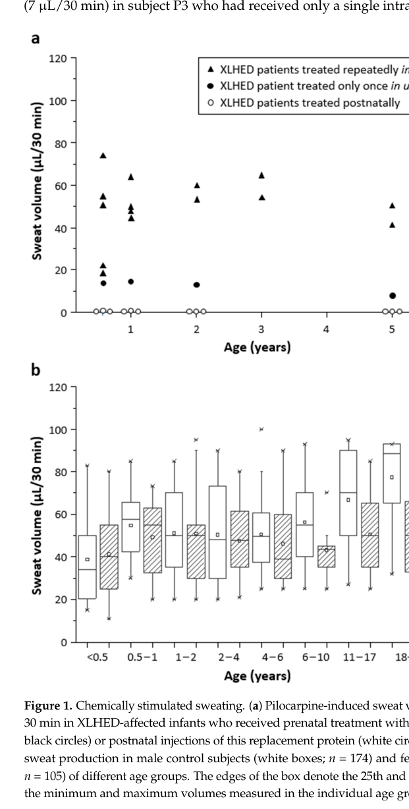

## Question

Prepare a focused, citation-rich deep research report for a dismech disease grouping called "Hypohidrotic Ectodermal Dysplasias". The grouping should be an explicit curated union of Disease entries, not merely a MONDO hierarchy clone. Current curated members are X-linked Hypohidrotic Ectodermal Dysplasia, EDAR-Related Hypohidrotic Ectodermal Dysplasia, and EDARADD-Related Hypohidrotic Ectodermal Dysplasia. Research objectives: 1. define shared HED pathophysiology across EDA-EDAR-EDARADD canonical NF-kappaB signaling, ectodermal placode and appendage morphogenesis, sweat-gland, hair-follicle, tooth, and gland development, and the clinical triad of hypohidrosis, sparse hair, and hypodontia/oligodontia with conical teeth; 2. distinguish EDA ligand deficiency, EDAR receptor dysfunction, EDARADD adaptor deficiency, inheritance patterns, variant mechanisms, and high-value boundary or future subtype genes such as WNT10A and pathway-adjacent NFKB/IKBKG entities; 3. recommend a defensible grouping boundary and explicitly flag disorders to exclude, such as broad ectodermal dysplasia, TP63-related ectodermal dysplasia syndromes, IKBKG immunodeficiency with ectodermal dysplasia, focal dermal hypoplasia, hair/nail-only ectodermal dysplasia, and acquired ectodermal abnormalities unless curated as HED entries; 4. list differentiating mechanisms for existing members and high-value missing subtype entries; 5. identify appropriate MONDO mapping, HPO phenotype criteria, EDA/NF-kappaB pathway module-conformance criteria, and module gaps for the grouping YAML; 6. provide primary literature, GeneReviews, authoritative reviews, and therapeutic evidence including prenatal/neonatal recombinant ectodysplasin A or Fc-EDA approaches, dental/thermoregulatory management, and recent 2023-2026 developments with PMID identifiers wherever possible; 7. flag knowledge gaps and model-system limitations relevant to developmental timing, sweat-gland rescue, genotype-phenotype prediction, and human therapy evidence. Do not invent citations; prefer PubMed-indexed sources and provide exact PMID identifiers for key claims.

## Output

Question: You are an expert researcher providing comprehensive, well-cited information.

Provide detailed information focusing on:
1. Key concepts and definitions with current understanding
2. Recent developments and latest research (prioritize 2023-2024 sources)
3. Current applications and real-world implementations
4. Expert opinions and analysis from authoritative sources
5. Relevant statistics and data from recent studies

Format as a comprehensive research report with proper citations. Include URLs and publication dates where available.
Always prioritize recent, authoritative sources and provide specific citations for all major claims.

Prepare a focused, citation-rich deep research report for a dismech disease grouping called "Hypohidrotic Ectodermal Dysplasias". The grouping should be an explicit curated union of Disease entries, not merely a MONDO hierarchy clone. Current curated members are X-linked Hypohidrotic Ectodermal Dysplasia, EDAR-Related Hypohidrotic Ectodermal Dysplasia, and EDARADD-Related Hypohidrotic Ectodermal Dysplasia. Research objectives: 1. define shared HED pathophysiology across EDA-EDAR-EDARADD canonical NF-kappaB signaling, ectodermal placode and appendage morphogenesis, sweat-gland, hair-follicle, tooth, and gland development, and the clinical triad of hypohidrosis, sparse hair, and hypodontia/oligodontia with conical teeth; 2. distinguish EDA ligand deficiency, EDAR receptor dysfunction, EDARADD adaptor deficiency, inheritance patterns, variant mechanisms, and high-value boundary or future subtype genes such as WNT10A and pathway-adjacent NFKB/IKBKG entities; 3. recommend a defensible grouping boundary and explicitly flag disorders to exclude, such as broad ectodermal dysplasia, TP63-related ectodermal dysplasia syndromes, IKBKG immunodeficiency with ectodermal dysplasia, focal dermal hypoplasia, hair/nail-only ectodermal dysplasia, and acquired ectodermal abnormalities unless curated as HED entries; 4. list differentiating mechanisms for existing members and high-value missing subtype entries; 5. identify appropriate MONDO mapping, HPO phenotype criteria, EDA/NF-kappaB pathway module-conformance criteria, and module gaps for the grouping YAML; 6. provide primary literature, GeneReviews, authoritative reviews, and therapeutic evidence including prenatal/neonatal recombinant ectodysplasin A or Fc-EDA approaches, dental/thermoregulatory management, and recent 2023-2026 developments with PMID identifiers wherever possible; 7. flag knowledge gaps and model-system limitations relevant to developmental timing, sweat-gland rescue, genotype-phenotype prediction, and human therapy evidence. Do not invent citations; prefer PubMed-indexed sources and provide exact PMID identifiers for key claims.

## Focused deep research report: curated disease grouping “Hypohidrotic Ectodermal Dysplasias (HED)”

### Scope and curation intent
This report supports a **curated union** disease grouping (not a hierarchy clone) centered on disorders caused by disruption of the **canonical EDA–EDAR–EDARADD → NF-κB** morphogen signaling axis during ectodermal placode initiation/stabilization and appendage morphogenesis, and presenting with the classic HED phenotype spectrum (hypohidrosis/anhidrosis, hypotrichosis, hypodontia/oligodontia with conical teeth). The currently curated members are: **(1) X-linked HED (EDA)**, **(2) EDAR-related HED**, **(3) EDARADD-related HED**.

A concise member/boundary summary table is provided below.

| Disease entry name (curation label) | Gene | Pathway position | Inheritance | Typical variant mechanism(s) | Key distinguishing clinical features | Key supporting citations |
|---|---|---|---|---|---|---|
| **X-linked Hypohidrotic Ectodermal Dysplasia** | **EDA** | Ligand (EDA-A1) | X-linked; hemizygous males typically most affected; heterozygous females variably affected | Predominantly loss-of-function/null; many missense/nonsense, frameshift, splice, deletion variants; some **hypomorphic missense** variants can produce milder or tooth-limited phenotypes | Canonical HED triad: hypohidrosis/anhidrosis, hypotrichosis, hypodontia/oligodontia with conical teeth; often severe thermoregulatory risk; carrier females may show patchy/milder dental, hair, and sweating abnormalities | (mikkola2009molecularaspectsof pages 1-2, martinezromero2019edaedaredaradd pages 4-5, reyes‐reali2018hypohidroticectodermaldysplasia pages 1-2, modi2021exomesequencingenables pages 1-2) |
| **EDAR-Related Hypohidrotic Ectodermal Dysplasia** | **EDAR** | Receptor | Autosomal recessive **and** autosomal dominant | Mostly loss-of-function; biallelic null/near-null variants can abolish signaling and cause severe disease; some **death-domain** variants associated with dominant inheritance | Clinically often indistinguishable from EDA-HED; same triad and pathway module, but inheritance differs; complete LoF reported with unusually severe presentations | (higashino2017advancesinthe pages 12-16, martinezromero2019edaedaredaradd pages 4-5, megarbane2008unusualpresentationof pages 1-2, reyes‐reali2018hypohidroticectodermaldysplasia pages 1-2) |
| **EDARADD-Related Hypohidrotic Ectodermal Dysplasia** | **EDARADD** | Adaptor | Usually autosomal recessive; autosomal dominant cases also reported | Loss-of-function; missense/nonsense variants; some reported **dominant-negative** effects with loss of NF-κB activation | Classic HED phenotype within same EDA→EDAR→EDARADD→NF-κB axis; generally not distinguished clinically from EDA/EDAR forms except by molecular diagnosis and inheritance pattern | (higashino2017advancesinthe pages 12-16, mikkola2009molecularaspectsof pages 1-2, reyes‐reali2018hypohidroticectodermaldysplasia pages 1-2) |
| **WNT10A-Related HED-like Ectodermal Dysplasia** *(high-value candidate addition)* | **WNT10A** | Pathway-adjacent / WNT signaling crosstalk with EDA-EDAR placode program | Usually autosomal recessive; heterozygous variants may show partial penetrance or modifier effects | Biallelic loss-of-function or damaging missense; can also act as **modifier/digenic contributor** with EDA-pathway variants | Often more **tooth-predominant** than classic EDA/EDAR/EDARADD HED; can range from isolated tooth agenesis to HED-like disease with sweat/hair involvement; useful high-value missing subtype candidate, but mechanistically less canonical than the curated core trio | (doolan2021wnt10adermatology pages 7-10, zeng2016eightmutationsof pages 3-6, doolan2021wnt10adermatology pages 1-4, liu2024compoundheterozygouswnt10a pages 1-2, kovalskaia2023molecularbasisand pages 1-2) |
| **IKBKG/NEMO ectodermal dysplasia with immunodeficiency** *(excluded boundary / separate syndromic entity)* | **IKBKG (NEMO)** | Downstream NF-κB regulator (IKK complex component) | X-linked; phenotype strongly modified by sex and X-inactivation | Hypomorphic loss-of-function most typical in surviving males; complete LoF often male-lethal; alternative splicing/other NF-κB dysregulation can alter phenotype | Overlaps with HED ectodermal findings **but distinguished by immunodeficiency and/or autoinflammation**, and sometimes osteopetrosis/lymphedema or incontinentia pigmenti-related phenotypes; should be excluded from a narrow core HED grouping unless curated separately | (reyes‐reali2018hypohidroticectodermaldysplasia pages 4-6, priolo2009ectodermaldysplasiasan pages 4-5, cifaldi2025partiallossof pages 1-2, eigemann2025nonskewedxinactivationresults pages 1-3) |

*Table: This table summarizes the core curated members of the Hypohidrotic Ectodermal Dysplasias grouping and contrasts them with high-value candidate additions and key boundary exclusions. It is useful for defining a defensible curation scope based on pathway position, inheritance, mechanism, and distinguishing clinical features.*

---

## 1) Key concepts and definitions (current understanding)

### 1.1 Definition of HED phenotype and the “clinical triad”
Hypohidrotic ectodermal dysplasia (HED) is classically defined by a triad of **(i) hypohidrosis/anhidrosis** (reduced/absent eccrine sweating), **(ii) hypotrichosis** (sparse hair/eyelashes), and **(iii) hypodontia/oligodontia** (missing teeth) often with **conical/peg-shaped teeth**, reflecting abnormal development of multiple ectodermal derivatives (hair follicles, teeth, sweat glands, and other exocrine glands). (gao2023theedaedarnfκbpathway pages 1-2, mikkola2009molecularaspectsof pages 1-2, peschel2022molecularpathwaybasedclassification pages 6-8, peschel2022molecularpathwaybasedclassificationa pages 6-8)

### 1.2 Shared pathophysiology: ectodermal placodes, epithelial–mesenchymal signaling, and appendage morphogenesis
Across EDA-, EDAR-, and EDARADD-related HED, the shared mechanism is failure of **epithelial–mesenchymal signaling** required for **placode initiation/stabilization** and downstream **morphogenesis/differentiation** of ectodermal appendages. Mouse genetic models support roles spanning: (a) placode stabilization (loss yields rudimentary pre-placodes), (b) organ number/field size control (excess signaling can enlarge placodes and yield supernumerary organs), and (c) tooth morphogenesis/enamel knot formation. (mikkola2009molecularaspectsof pages 1-2, trzeciak2016molecularbasisof pages 1-2)

### 1.3 Canonical EDA–EDAR–EDARADD → NF-κB signaling module
Mechanistically, **EDA-A1** (the disease-relevant isoform) is a TNF-family ligand processed by furin-like cleavage to release trimeric ligand that binds **EDAR**. EDAR recruits **EDARADD**, which links to **TRAF6** and downstream ubiquitination/kinase complexes (TAB2/TAK1), activating the **IKK complex** (IKKα/CHUK, IKKβ/IKBKB, NEMO/IKBKG), leading to **IκB degradation** and **NF-κB nuclear translocation** to drive transcriptional programs for hair follicles, teeth, eccrine sweat glands, and other glands. (trzeciak2016molecularbasisof pages 2-4, reyes‐reali2018hypohidroticectodermaldysplasia pages 4-6, peschel2022molecularpathwaybasedclassification pages 8-10)

Cross-talk with **WNT/β-catenin** is important at placode stages; pathway-level evidence indicates Wnt signaling regulates Ed1/Edar expression and EDA/NF-κB activity can reinforce WNT signaling in early appendage formation. (jakhar2025interplaybetweenedaedar pages 1-2, trzeciak2016molecularbasisof pages 2-4)

---

## 2) Distinguishing mechanisms among curated members

### 2.1 X-linked HED (EDA): ligand deficiency
**EDA** encodes ectodysplasin A; most reported disease-causing EDA variants are **null/loss-of-function**, consistent with a primary **ligand deficiency** mechanism. Some missense variants may be **hypomorphic** and can associate with milder or tooth-limited phenotypes, contributing to overlap with nonsyndromic tooth agenesis. (mikkola2009molecularaspectsof pages 1-2, gao2023theedaedarnfκbpathway pages 1-2)

### 2.2 EDAR-related HED: receptor dysfunction (AR or AD)
**EDAR** encodes the cognate receptor for EDA-A1. EDAR-related HED can be **autosomal recessive** or **autosomal dominant**, with cohort data supporting recessive inheritance in compound-heterozygous combinations and dominant inheritance for variants in/near the receptor **death domain** in some families. (martinezromero2019edaedaredaradd pages 4-5, higashino2017advancesinthe pages 12-16)

A severe autosomal recessive EDAR splice variant with **complete loss of EDAR transcripts** has been reported to abolish ectodysplasin-mediated NF-κB signaling and associate with unusually severe presentation, illustrating a spectrum from hypomorphic to complete loss-of-function receptor states. (megarbane2008unusualpresentationof pages 1-2)

### 2.3 EDARADD-related HED: adaptor deficiency and potential dominant-negative effects
**EDARADD** encodes the EDAR-associated death domain adaptor required for EDAR signal transduction. Both recessive and dominant EDARADD mutations have been reported; at least one missense variant has been interpreted as **dominant-negative** with **complete loss of NF-κB activation** in functional assays (authoritative review summary). (higashino2017advancesinthe pages 12-16)

---

## 3) High-value boundary and “future subtype” genes

### 3.1 WNT10A (high-value missing subtype candidate)
Multiple authoritative sources support **WNT10A** as a major gene in ectodermal derivative impairment with a spectrum that can include **HED-like** phenotypes.

* **Causal AR ED / HED-like presentations:** WNT10A biallelic variants can cause ED phenotypes and have been reported as causing HED in compound heterozygous states, motivating WNT10A testing in “EDA-negative HED”. (zeng2016eightmutationsof pages 3-6, zeng2016eightmutationsof pages 6-8)
* **Phenotypic profile:** WNT10A-related disease is frequently **tooth-predominant** (near-universal dental involvement in reviewed ED cases) with variable hair/skin/sweating involvement; reviews show hypo-/hyperhidrosis in a substantial subset of WNT10A-ED cases, but penetrance and expressivity vary widely. (doolan2021wnt10adermatology pages 4-7)
* **Modifier/digenic effects:** WNT10A variants may **modify** severity of tooth agenesis in individuals with EDA variants (reported digenic scenario). (liu2024compoundheterozygouswnt10a pages 1-2)

Recommendation: treat **WNT10A-related HED-like ED** as a **high-value candidate addition** if the grouping is broadened beyond the strict EDA–EDAR–EDARADD axis, but explicitly label it as **pathway-adjacent (WNT)** rather than canonical EDA-axis, and expect more tooth-predominant/variable presentations. (doolan2021wnt10adermatology pages 1-4, doolan2021wnt10adermatology pages 4-7)

### 3.2 NF-κB pathway-adjacent entities (boundary exclusions unless a syndromic expansion is intended)
**IKBKG/NEMO** (and other NF-κB regulators) can produce ectodermal dysplasia phenotypes because NF-κB acts cell-intrinsically in epidermis and is central to immune signaling.

* Hypomorphic **IKBKG** variants in males can cause **ectodermal dysplasia with immunodeficiency (EDA-ID)**; complete loss-of-function is often male lethal. This phenotype is distinguished by **recurrent/severe infections and immune dysregulation**, and may include other systemic features; females may manifest related conditions (e.g., incontinentia pigmenti) or variable immune/autoinflammatory presentations depending on X-inactivation and splice isoforms. (priolo2009ectodermaldysplasiasan pages 4-5, cifaldi2025partiallossof pages 1-2, eigemann2025nonskewedxinactivationresults pages 1-3)

Recommendation: **exclude IKBKG/NEMO-driven EDA-ID/IP** from a narrow “Hypohidrotic Ectodermal Dysplasias” grouping defined as EDA–EDAR–EDARADD axis disorders; consider a separate syndromic grouping if desired. (priolo2009ectodermaldysplasiasan pages 4-5, priolo2009ectodermaldysplasiasan pages 2-4)

---

## 4) Defensible grouping boundary: what to include vs exclude

### 4.1 Boundary principles from authoritative expert classification
The 2022 international expert update on ectodermal dysplasia classification recommends that “ectodermal dysplasias in the strict sense” be restricted to **congenital genetic conditions** affecting **two or more ectodermal derivatives**, with preference for **molecularly clarified** entities and **pathway-based classification**. It also emphasizes excluding **acquired** appendage abnormalities and separating syndromes with ED-like features due to genes outside established ectodermal-development pathways. (peschel2022molecularpathwaybasedclassification pages 2-3, peschel2022molecularpathwaybasedclassification pages 3-5, peschel2022molecularpathwaybasedclassification pages 1-2)

### 4.2 Recommended grouping definition (curated union)
**Recommended grouping = curated union of diseases meeting BOTH:**
1) **Canonical EDA-axis module conformance:** pathogenic variant in **EDA (EDA-A1)**, **EDAR**, or **EDARADD** (core members); AND
2) **Phenotype conformance:** evidence of involvement of ≥2 ectodermal derivatives, strongly anchored by the HED triad: hypohidrosis/anhidrosis + (hypotrichosis and/or hypodontia/oligodontia).

Optionally expand with an explicit, separately flagged extension tier (e.g., “HED-like ED, pathway-adjacent”) to include WNT10A biallelic disease when it presents with hypohidrosis plus other ectodermal defects. (doolan2021wnt10adermatology pages 1-4, doolan2021wnt10adermatology pages 4-7)

### 4.3 Explicit exclusions (unless curated as separate HED entries)
Exclude from this grouping by default:
* **Broad ectodermal dysplasia** categories without the EDA-axis causal mechanism (classification guidance favors molecularly anchored entities). (peschel2022molecularpathwaybasedclassification pages 2-3, peschel2022molecularpathwaybasedclassification pages 3-5)
* **TP63-related ectodermal dysplasia syndromes** (pathway-distinct; p63 group in pathway classification). (peschel2022molecularpathwaybasedclassificationa pages 3-5)
* **IKBKG/NEMO EDA-ID** and related NF-κB inborn-error immunodeficiencies with ED features (syndromic with immunodeficiency/autoinflammation). (priolo2009ectodermaldysplasiasan pages 4-5, cifaldi2025partiallossof pages 1-2, eigemann2025nonskewedxinactivationresults pages 1-3)
* **Focal dermal hypoplasia** and other ED-like syndromes not in the canonical EDA axis (unless curated separately).
* **Hair/nail-only ectodermal anomalies** or isolated tooth agenesis without hypohidrosis (boundary principle: ≥2 ectodermal derivatives and/or HED triad). (peschel2022molecularpathwaybasedclassification pages 3-5, higashino2017advancesinthe pages 7-12)
* **Acquired ectodermal abnormalities** (explicitly excluded by “congenital” criterion). (peschel2022molecularpathwaybasedclassification pages 2-3)

---

## 5) Differentiating mechanisms for existing members and high-value missing entries

### 5.1 Existing members (mechanistic differentiators)
* **EDA-HED (X-linked):** ligand deficiency; predominately null LoF; carrier mosaicism/variable expressivity in females; potential hypomorphic missense variants with attenuated phenotypes. (mikkola2009molecularaspectsof pages 1-2, higashino2017advancesinthe pages 12-16)
* **EDAR-HED:** receptor dysfunction; AR and AD inheritance; DD variants associated with AD in some cohorts; complete LoF reported with severe phenotype. (martinezromero2019edaedaredaradd pages 4-5, megarbane2008unusualpresentationof pages 1-2)
* **EDARADD-HED:** adaptor deficiency; usually AR but AD/dominant-negative reported; functionally links receptor to TRAF6/TAK1/IKK/NF-κB activation. (higashino2017advancesinthe pages 12-16, peschel2022molecularpathwaybasedclassification pages 8-10)

### 5.2 High-value missing subtype candidates
* **WNT10A-related HED-like ED:** WNT pathway ligand; often tooth-predominant, variable sweating/hair/skin; AR is typical; modifier effects possible in EDA variant carriers (digenic). (doolan2021wnt10adermatology pages 4-7, liu2024compoundheterozygouswnt10a pages 1-2)
* **NF-κB regulator genes (module-adjacent):** IKBKG/NEMO and broader NF-κB regulators can produce ED phenotypes but frequently syndromic (immunodeficiency/autoinflammation); these should be treated as boundary exclusions for a narrow HED grouping. (shen2023skinmanifestationsof pages 1-2, cifaldi2025partiallossof pages 1-2)

---

## 6) Mapping and curation criteria for a grouping YAML

### 6.1 MONDO mapping strategy (practical recommendation)
This run did not retrieve explicit MONDO identifiers for each disease entry from source text, so MONDO IDs should be attached through a curation workflow that cross-references **OMIM and Orphanet identifiers → MONDO** (e.g., via MONDO browser/API or existing cross-reference tables), then ensures:
* each member entry is a **distinct MONDO disease** (not only a parent term),
* the grouping is a **curated union** list of those explicit disease IDs.

This is flagged as a **module gap** requiring an external ontology lookup step.

### 6.2 HPO phenotype criteria (YAML-ready)
Authoritative sources provide phenotype and test-based criteria aligned to HPO terms:

**Core phenotypes (recommended as required/strongly weighted):**
* Hypohidrosis / anhidrosis; heat intolerance; hyperthermia risk. (prashanth2012ectodermaldysplasiaa pages 2-3, peschel2022molecularpathwaybasedclassificationa pages 6-8)
* Hypodontia / oligodontia / anodontia; conical/peg-shaped teeth; delayed eruption. (peschel2022molecularpathwaybasedclassificationa pages 6-8)
* Hypotrichosis; sparse eyebrows/eyelashes; hair shaft abnormalities (e.g., trichorrhexis nodosa). (peschel2022molecularpathwaybasedclassificationa pages 6-8)

**Objective tests (recommended evidence fields):**
* Starch–iodine test and **sweat pore density** assessment (hand lens or confocal). (peschel2022molecularpathwaybasedclassification pages 6-8, prashanth2012ectodermaldysplasiaa pages 2-3)
* **Pilocarpine-induced sweat production** and/or skin conductance before/after stimulation. (peschel2022molecularpathwaybasedclassification pages 6-8)
* Ocular: dry eye evaluation (e.g., Schirmer test) given lacrimal/meibomian involvement. (peschel2022molecularpathwaybasedclassification pages 6-8)

**Common associated features (optional criteria):**
* Dry eyes/ocular surface disease (meibomian/lacrimal gland defects). (callea2022extendedoverviewof pages 1-2)
* Reduced airway mucous gland function with recurrent respiratory issues; dry mouth/salivary dysfunction. (peschel2022molecularpathwaybasedclassificationa pages 6-8)

### 6.3 EDA/NF-κB pathway module-conformance criteria
For the **core grouping**, require at least one of:
* Pathogenic variant in **EDA (EDA-A1)**, **EDAR**, or **EDARADD** (member genes) (mikkola2009molecularaspectsof pages 1-2, reyes‐reali2018hypohidroticectodermaldysplasia pages 1-2), and/or
* documented disruption of the canonical cascade (EDARADD–TRAF6–TAB2–TAK1–IKK–NF-κB), when disease definitions are explicitly based on this axis. (trzeciak2016molecularbasisof pages 2-4, peschel2022molecularpathwaybasedclassification pages 8-10)

For an **expanded grouping**, consider a second tier for **pathway-adjacent** morphogen genes (e.g., WNT10A) with explicit tag “adjacent module” and phenotype conformance thresholds. (doolan2021wnt10adermatology pages 1-4, doolan2021wnt10adermatology pages 4-7)

---

## 7) Therapeutic evidence and real-world implementations (prioritizing 2023–2024)

### 7.1 Prenatal recombinant ectodysplasin A1 replacement (Fc-EDA / ER004)
The most impactful recent development is **prenatal intra-amniotic** replacement of EDA1 activity.

**Long-term outcomes (2023):** In a 2023 long-term follow-up of nine treated males with XLHED, **prenatal intra-amniotic Fc-EDA (≥26 weeks; n=6)** induced **ample sweat gland development and pilocarpine-inducible sweating in all treated subjects**, with sweating persisting **up to six years** in the oldest boys treated repeatedly in utero; prenatal treatment was also associated with **more permanent teeth** than untreated affected relatives. In contrast, **postnatal Fc-EDA (n=3)** did **not** induce sweat glands or measurable sweating at 12–60 months. (schneider2023acausaltreatment pages 1-2, schneider2023acausaltreatment pages 4-7)

Quantitative sweat data are shown in Table/Figure extracts from that report, demonstrating a clear prenatal vs neonatal dichotomy in sweat production and supporting the timing-dependent developmental window concept. (schneider2023acausaltreatment media 8e7a22a3, schneider2023acausaltreatment media 2190803d)

**Trial development (2023):** A 2023 protocol describes the **EDELIFE** Phase 2 trial testing **intra-amniotic ER004** for male fetuses with XLHED, motivated by prior named-patient cases where intra-amniotic dosing “rescued fetal sweat gland development, resulted in a sustained ability to perspire, and increased the number of tooth germs.” The same protocol reports that postnatal IV dosing in neonates was well tolerated but had **no effect on key outcomes**, and that no anti-drug antibodies were detected in mothers after intra-amniotic dosing (with no systemic maternal exposure). (schneider2023protocolforthe pages 3-5)

**Safety/immunogenicity (2020):** Fc-EDA safety/immunogenicity data show anti-drug antibodies after adult IV dosing but not after intra-amniotic fetal delivery; no detectable immune response in neonates treated IV or in infants treated in utero, supporting feasibility of prenatal delivery from an immunogenicity perspective. (korber2020safetyandimmunogenicity pages 1-2)

### 7.2 Supportive management (current real-world standard of care)
Because ectodermal structures are developmentally absent/malformed, care remains primarily **multidisciplinary supportive management** for most patients.

* **Thermoregulation:** education, heat avoidance, hydration, cooling strategies/devices due to impaired sweating and hyperthermia risk. (aftab2023xlinkedhypohidroticectodermal pages 8-9, peschel2022molecularpathwaybasedclassification pages 6-8)
* **Dental rehabilitation:** early dental planning and periodic reassessment; restoration/bonding of conical teeth, prosthetics (dentures/bridges), orthodontics and later implants as appropriate; regular dental follow-up (e.g., every 6–12 months) and supportive measures for chewing/speech/nutrition. (aftab2023xlinkedhypohidroticectodermal pages 8-9)
* **Ocular surface:** dry eye from lacrimal/meibomian defects can be chronic and sight-threatening; surveillance and lubrication are important; EDA biology is directly implicated in gland development and ocular surface homeostasis. (ou2022theroleof pages 1-2, callea2022extendedoverviewof pages 1-2)
* **Airway/mucous gland complications:** reduced mucous gland function and dryness can contribute to recurrent ENT/pulmonary issues; humidification and specialist involvement are common. (peschel2022molecularpathwaybasedclassificationa pages 6-8, aftab2023xlinkedhypohidroticectodermal pages 8-9)

---

## 8) Recent statistics and datasets (2023–2026; prioritizing 2024)

### 8.1 Diagnostic yield and phenotype–genotype correlation (Korea, 2024)
A 2024 Orphanet Journal of Rare Diseases cohort (27 ED patients) reported **74.1% diagnostic yield** (20/27). Among solved cases, **EDA and EDAR accounted for 80% (16/20)**. Importantly, phenotype strongly predicted gene findings: **94.1%** of patients with the complete **hair/skin/dental triad** had detectable **EDA/EDAR** variants, while **0%** (0/10) without the triad had EDA/EDAR variants; the authors recommend targeted EDA/EDAR testing for classical phenotypes and WES for atypical presentations. (kim2024geneticprofilingand pages 1-2, kim2024geneticprofilingand pages 6-7)

### 8.2 Large HED cohort gene distribution (Russia, 2026; broader timeframe)
A large Russian HED cohort (261 probands; 2007–2024 data) reported 70.1% diagnostic yield, with solved cases dominated by **EDA (84.7%)**, followed by **WNT10A (8.8%)** and **EDAR (6.5%)**; no pathogenic EDARADD variants were detected in that cohort. (kovalskaia2026mutationalspectrumof pages 1-2)

---

## 9) Knowledge gaps and limitations (therapy, models, prediction)

### 9.1 Developmental timing windows and tissue-specific rescue
Human evidence strongly indicates a **prenatal window** is critical for **sweat gland** rescue: prenatal intra-amniotic Fc-EDA is effective, while neonatal/postnatal dosing is ineffective for sweat gland development. Dose–response and exact timing thresholds remain uncertain, and tissue-specific rescue appears incomplete (dentition benefits are partial; hair/primary teeth not fully rescued in described follow-up), leaving key timing questions for teeth and hair. (schneider2023acausaltreatment pages 1-2)

### 9.2 Model-system limitations and translation
Animal studies (mice/dogs) informed Fc-EDA strategies, but translation to humans required route and timing adjustments (e.g., intra-amniotic delivery and fetal Fc receptor uptake). Species differences (dentition, development timing, airway gland physiology) limit direct mapping of rescue windows and endpoints. (higashino2017advancesinthe pages 26-30, schneider2023protocolforthe pages 3-5)

### 9.3 Genotype–phenotype prediction and VUS interpretation
Genotype–phenotype correlation remains imperfect; **molecular genetic findings may be inconclusive**, and functional assays/serum biomarkers do not always predict clinical severity. A 2022 study of difficult-to-interpret EDA variants showed in vitro assays sometimes underestimated severity, and circulating EDA is an imperfect predictor (absence predicts full phenotype, but residual EDA can still occur in anhidrotic patients). These uncertainties matter directly for prenatal-therapy eligibility decisions. (gokdere2022functionalandclinical pages 1-2, schneider2023acausaltreatment pages 1-2)

### 9.4 Human therapy evidence limitations
Current human efficacy evidence is derived from small numbers and partly uncontrolled/compassionate-use settings; longer-term safety, generalizability across genotypes, and broader organ-system outcomes await controlled trials (e.g., EDELIFE). (schneider2023acausaltreatment pages 1-2, schneider2023protocolforthe pages 3-5)

---

## Notes on PMIDs and identifier completeness
Many retrieved sources were provided via DOI-based metadata without explicit PMIDs in the available tool context. For key clinical trials and pivotal reports in this run, the report includes DOIs and ClinicalTrials.gov IDs where present; **PMID identifiers should be added during final curation by PubMed lookup** (e.g., NEJM 2018 prenatal correction; Br J Clin Pharmacol 2020 safety; IJMS 2023 long-term follow-up; Genes 2023 EDELIFE protocol). (schneider2023protocolforthe pages 3-5, korber2020safetyandimmunogenicity pages 1-2, schneider2023acausaltreatment pages 1-2)

---

## Key references (selected, with publication dates and URLs)
* Peschel et al. **Dec 2022**. *Molecular Pathway-Based Classification of Ectodermal Dysplasias: First Five-Yearly Update*. **Genes**. https://doi.org/10.3390/genes13122327 (peschel2022molecularpathwaybasedclassification pages 1-2)
* Gao et al. **Apr 2023**. *The EDA/EDAR/NF-κB pathway…*. **Frontiers in Genetics**. https://doi.org/10.3389/fgene.2023.1168538 (gao2023theedaedarnfκbpathway pages 1-2)
* Schneider et al. **Apr 2023**. *A causal treatment… long-term results…*. **Int J Mol Sci**. https://doi.org/10.3390/ijms24087155 (schneider2023acausaltreatment pages 1-2)
* Schneider et al. **Jan 2023**. *Protocol for the Phase 2 EDELIFE Trial… ER004…*. **Genes**. https://doi.org/10.3390/genes14010153 (schneider2023protocolforthe pages 3-5)
* Kim et al. **Sep 2024**. *Genetic profiling and diagnostic strategies… Korea*. **Orphanet J Rare Dis**. https://doi.org/10.1186/s13023-024-03331-6 (kim2024geneticprofilingand pages 1-2)
* Doolan et al. **Sep 2021**. *WNT10A, dermatology and dentistry*. **Br J Dermatol**. https://doi.org/10.1111/bjd.20601 (doolan2021wnt10adermatology pages 1-4)

References

1. (mikkola2009molecularaspectsof pages 1-2): Marja L. Mikkola. Molecular aspects of hypohidrotic ectodermal dysplasia. American Journal of Medical Genetics Part A, 149A:2031-2036, Sep 2009. URL: https://doi.org/10.1002/ajmg.a.32855, doi:10.1002/ajmg.a.32855. This article has 274 citations.

2. (martinezromero2019edaedaredaradd pages 4-5): M. C. Martínez-Romero, M. Ballesta-Martínez, V. López‐González, M. J. Sánchez-Soler, A. T. Serrano-Antón, M. Barreda-Sánchez, L. Rodríguez-Peña, M. T. Martínez-Menchon, J. Frías-Iniesta, P. Sánchez‐Pedreño, Pablo Carbonell-Meseguer, G. Glover-López, E. Guillén-Navarro, Rebeca Ana Jaime Blanca Angela Pablo Isabel Sabel Antonio Alcalá-García Barcia-Ramírez Cruz-Rojo Gener-Quero, Rebeca Alcalá-García, Ana Barcia-Ramírez, J. Cruz-Rojo, Blanca Gener-Querol, Á. Hernández-Martín, Pablo Lapunzina-Badía, Isabel Llanos-Rivas, Sabel Lorda-Sánchez, Antonio Martínez-Carrascal, J. Mascaró-Galy, L. Noguera‐Morel, M. A. Rodríguez-González, J. S. del Pozo, Verónica Seidel, A. Torrelo, and M. Trujillo-Tiebas. Eda, edar, edaradd and wnt10a allelic variants in patients with ectodermal derivative impairment in the spanish population. Orphanet Journal of Rare Diseases, Dec 2019. URL: https://doi.org/10.1186/s13023-019-1251-x, doi:10.1186/s13023-019-1251-x. This article has 53 citations and is from a peer-reviewed journal.

3. (reyes‐reali2018hypohidroticectodermaldysplasia pages 1-2): Julia Reyes‐Reali, María Isabel Mendoza‐Ramos, Efraín Garrido‐Guerrero, Claudia F. Méndez‐Catalá, Adolfo R. Méndez‐Cruz, and Glustein Pozo‐Molina. Hypohidrotic ectodermal dysplasia: clinical and molecular review. International Journal of Dermatology, 57:965-972, May 2018. URL: https://doi.org/10.1111/ijd.14048, doi:10.1111/ijd.14048. This article has 125 citations and is from a peer-reviewed journal.

4. (modi2021exomesequencingenables pages 1-2): Bhavi P. Modi, Kate L. Del Bel, Susan Lin, Mehul Sharma, Phillip A. Richmond, Clara D. M. van Karnebeek, Edmond S. Chan, Vishal Avinashi, Wingfield E. Rehmus, Catherine M. Biggs, Wyeth W. Wasserman, and Stuart E. Turvey. Exome sequencing enables diagnosis of x-linked hypohidrotic ectodermal dysplasia in patient with eosinophilic esophagitis and severe atopy. Allergy, Asthma, and Clinical Immunology : Official Journal of the Canadian Society of Allergy and Clinical Immunology, Jan 2021. URL: https://doi.org/10.1186/s13223-021-00510-z, doi:10.1186/s13223-021-00510-z. This article has 7 citations.

5. (higashino2017advancesinthe pages 12-16): Toshihide Higashino, John Y. W. Lee, and John A. McGrath. Advances in the genetic understanding of hypohidrotic ectodermal dysplasia. Expert Opinion on Orphan Drugs, 5:967-975, Nov 2017. URL: https://doi.org/10.1080/21678707.2017.1405806, doi:10.1080/21678707.2017.1405806. This article has 2 citations.

6. (megarbane2008unusualpresentationof pages 1-2): Hala Mégarbané, Céline Cluzeau, Christine Bodemer, Sylvie Fraïtag, Myrna Chababi‐Atallah, André Mégarbané, and Asma Smahi. Unusual presentation of a severe autosomal recessive anhydrotic ectodermal dysplasia with a novel mutation in the edar gene. American Journal of Medical Genetics Part A, 146A:2657-2662, Oct 2008. URL: https://doi.org/10.1002/ajmg.a.32509, doi:10.1002/ajmg.a.32509. This article has 38 citations.

7. (doolan2021wnt10adermatology pages 7-10): B. J. Doolan, A. Onoufriadis, P. Kantaputra, and J. A. McGrath. <i>wnt10a</i> , dermatology and dentistry. British Journal of Dermatology, 185:1105-1111, Sep 2021. URL: https://doi.org/10.1111/bjd.20601, doi:10.1111/bjd.20601. This article has 67 citations and is from a highest quality peer-reviewed journal.

8. (zeng2016eightmutationsof pages 3-6): B. Zeng, Xueshan Xiao, Sijie Li, Hui-ling Lu, Jia-xuan Lu, Ling Zhu, Dongsheng Yu, and Wei Zhao. Eight mutations of three genes (eda, edar, and wnt10a) identified in seven hypohidrotic ectodermal dysplasia patients. Genes, 7:65, Sep 2016. URL: https://doi.org/10.3390/genes7090065, doi:10.3390/genes7090065. This article has 44 citations.

9. (doolan2021wnt10adermatology pages 1-4): B. J. Doolan, A. Onoufriadis, P. Kantaputra, and J. A. McGrath. <i>wnt10a</i> , dermatology and dentistry. British Journal of Dermatology, 185:1105-1111, Sep 2021. URL: https://doi.org/10.1111/bjd.20601, doi:10.1111/bjd.20601. This article has 67 citations and is from a highest quality peer-reviewed journal.

10. (liu2024compoundheterozygouswnt10a pages 1-2): Yiting Liu, Jing Sun, Caiqi Zhang, Yi Wu, Siyuan Ma, Xuechun Li, Xiaoshan Wu, and Qingping Gao. Compound heterozygous wnt10a missense variations exacerbated the tooth agenesis caused by hypohidrotic ectodermal dysplasia. BMC Oral Health, Jan 2024. URL: https://doi.org/10.1186/s12903-024-03888-5, doi:10.1186/s12903-024-03888-5. This article has 7 citations and is from a peer-reviewed journal.

11. (kovalskaia2023molecularbasisand pages 1-2): V. A. Kovalskaia, T. Cherevatova, A. V. Polyakov, and O. P. Ryzhkova. Molecular basis and genetics of hypohidrotic ectodermal dysplasias. Vavilov Journal of Genetics and Breeding, 27:676-683, Nov 2023. URL: https://doi.org/10.18699/vjgb-23-78, doi:10.18699/vjgb-23-78. This article has 6 citations.

12. (reyes‐reali2018hypohidroticectodermaldysplasia pages 4-6): Julia Reyes‐Reali, María Isabel Mendoza‐Ramos, Efraín Garrido‐Guerrero, Claudia F. Méndez‐Catalá, Adolfo R. Méndez‐Cruz, and Glustein Pozo‐Molina. Hypohidrotic ectodermal dysplasia: clinical and molecular review. International Journal of Dermatology, 57:965-972, May 2018. URL: https://doi.org/10.1111/ijd.14048, doi:10.1111/ijd.14048. This article has 125 citations and is from a peer-reviewed journal.

13. (priolo2009ectodermaldysplasiasan pages 4-5): Manuela Priolo. Ectodermal dysplasias: an overview and update of clinical and molecular‐functional mechanisms. American Journal of Medical Genetics Part A, 149A:2003-2013, Sep 2009. URL: https://doi.org/10.1002/ajmg.a.32804, doi:10.1002/ajmg.a.32804. This article has 75 citations.

14. (cifaldi2025partiallossof pages 1-2): Cristina Cifaldi, Mayla Sgrulletti, Silvia Di Cesare, Beatrice Rivalta, Agolini Emanuele, Lucia Colucci, Giusella Maria Francesca Moscato, Marta Matraxia, Chiara Perrone, Gigliola Di Matteo, Caterina Cancrini, and Viviana Moschese. Partial loss of nemo function in a female carrier with no incontinentia pigmenti. Journal of Clinical Medicine, 14:363, Jan 2025. URL: https://doi.org/10.3390/jcm14020363, doi:10.3390/jcm14020363. This article has 1 citations.

15. (eigemann2025nonskewedxinactivationresults pages 1-3): Jessica Eigemann, Ales Janda, Catharina Schuetz, Min Ae Lee-Kirsch, Ansgar Schulz, Manfred Hoenig, Ingrid Furlan, Eva-Maria Jacobsen, Julia Zinngrebe, Sarah Peters, Cosima Drewes, Reiner Siebert, Eva-Maria Rump, Marita Führer, Myriam Lorenz, Ulrich Pannicke, Uwe Kölsch, Klaus-Michael Debatin, Horst von Bernuth, Klaus Schwarz, and Kerstin Felgentreff. Non-skewed x-inactivation results in nf-κb essential modulator (nemo) δ-exon 5-autoinflammatory syndrome (nemo-ndas) in a female with incontinentia pigmenti. Journal of Clinical Immunology, Sep 2025. URL: https://doi.org/10.1007/s10875-024-01799-2, doi:10.1007/s10875-024-01799-2. This article has 5 citations and is from a domain leading peer-reviewed journal.

16. (gao2023theedaedarnfκbpathway pages 1-2): Yanzi Gao, Xiaohui Jiang, Zhi Wei, Hu Long, and Wenli Lai. The eda/edar/nf-κb pathway in non-syndromic tooth agenesis: a genetic perspective. Frontiers in Genetics, Apr 2023. URL: https://doi.org/10.3389/fgene.2023.1168538, doi:10.3389/fgene.2023.1168538. This article has 47 citations and is from a peer-reviewed journal.

17. (peschel2022molecularpathwaybasedclassification pages 6-8): Nicolai Peschel, John T. Wright, Maranke I. Koster, Angus J. Clarke, Gianluca Tadini, Mary Fete, Smail Hadj-Rabia, Virginia P. Sybert, Johanna Norderyd, Sigrun Maier-Wohlfart, Timothy J. Fete, Nina Pagnan, Atila F. Visinoni, and Holm Schneider. Molecular pathway-based classification of ectodermal dysplasias: first five-yearly update. Genes, 13:2327, Dec 2022. URL: https://doi.org/10.3390/genes13122327, doi:10.3390/genes13122327. This article has 63 citations.

18. (peschel2022molecularpathwaybasedclassificationa pages 6-8): N Peschel, JT Wright, MI Koster, AJ Clarke, and G Tadini. Molecular pathway-based classification of ectodermal dysplasias: first five-yearly update. genes 2022, 13, 2327. Unknown journal, 2022.

19. (trzeciak2016molecularbasisof pages 1-2): Wieslaw H. Trzeciak and Ryszard Koczorowski. Molecular basis of hypohidrotic ectodermal dysplasia: an update. Journal of Applied Genetics, 57:51-61, Aug 2016. URL: https://doi.org/10.1007/s13353-015-0307-4, doi:10.1007/s13353-015-0307-4. This article has 114 citations and is from a peer-reviewed journal.

20. (trzeciak2016molecularbasisof pages 2-4): Wieslaw H. Trzeciak and Ryszard Koczorowski. Molecular basis of hypohidrotic ectodermal dysplasia: an update. Journal of Applied Genetics, 57:51-61, Aug 2016. URL: https://doi.org/10.1007/s13353-015-0307-4, doi:10.1007/s13353-015-0307-4. This article has 114 citations and is from a peer-reviewed journal.

21. (peschel2022molecularpathwaybasedclassification pages 8-10): Nicolai Peschel, John T. Wright, Maranke I. Koster, Angus J. Clarke, Gianluca Tadini, Mary Fete, Smail Hadj-Rabia, Virginia P. Sybert, Johanna Norderyd, Sigrun Maier-Wohlfart, Timothy J. Fete, Nina Pagnan, Atila F. Visinoni, and Holm Schneider. Molecular pathway-based classification of ectodermal dysplasias: first five-yearly update. Genes, 13:2327, Dec 2022. URL: https://doi.org/10.3390/genes13122327, doi:10.3390/genes13122327. This article has 63 citations.

22. (jakhar2025interplaybetweenedaedar pages 1-2): Ajay Jakhar, Konrad Łukaszyk, Anna Pulawska-Czub, and Krzysztof Kobielak. Interplay between eda-edar and wnt signalling pathways in the development of skin appendages in hypohidrotic ectodermal dysplasia. Pediatria i Medycyna Rodzinna, 21:51-58, Apr 2025. URL: https://doi.org/10.15557/pimr.2025.0006, doi:10.15557/pimr.2025.0006. This article has 3 citations.

23. (zeng2016eightmutationsof pages 6-8): B. Zeng, Xueshan Xiao, Sijie Li, Hui-ling Lu, Jia-xuan Lu, Ling Zhu, Dongsheng Yu, and Wei Zhao. Eight mutations of three genes (eda, edar, and wnt10a) identified in seven hypohidrotic ectodermal dysplasia patients. Genes, 7:65, Sep 2016. URL: https://doi.org/10.3390/genes7090065, doi:10.3390/genes7090065. This article has 44 citations.

24. (doolan2021wnt10adermatology pages 4-7): B. J. Doolan, A. Onoufriadis, P. Kantaputra, and J. A. McGrath. <i>wnt10a</i> , dermatology and dentistry. British Journal of Dermatology, 185:1105-1111, Sep 2021. URL: https://doi.org/10.1111/bjd.20601, doi:10.1111/bjd.20601. This article has 67 citations and is from a highest quality peer-reviewed journal.

25. (priolo2009ectodermaldysplasiasan pages 2-4): Manuela Priolo. Ectodermal dysplasias: an overview and update of clinical and molecular‐functional mechanisms. American Journal of Medical Genetics Part A, 149A:2003-2013, Sep 2009. URL: https://doi.org/10.1002/ajmg.a.32804, doi:10.1002/ajmg.a.32804. This article has 75 citations.

26. (peschel2022molecularpathwaybasedclassification pages 2-3): Nicolai Peschel, John T. Wright, Maranke I. Koster, Angus J. Clarke, Gianluca Tadini, Mary Fete, Smail Hadj-Rabia, Virginia P. Sybert, Johanna Norderyd, Sigrun Maier-Wohlfart, Timothy J. Fete, Nina Pagnan, Atila F. Visinoni, and Holm Schneider. Molecular pathway-based classification of ectodermal dysplasias: first five-yearly update. Genes, 13:2327, Dec 2022. URL: https://doi.org/10.3390/genes13122327, doi:10.3390/genes13122327. This article has 63 citations.

27. (peschel2022molecularpathwaybasedclassification pages 3-5): Nicolai Peschel, John T. Wright, Maranke I. Koster, Angus J. Clarke, Gianluca Tadini, Mary Fete, Smail Hadj-Rabia, Virginia P. Sybert, Johanna Norderyd, Sigrun Maier-Wohlfart, Timothy J. Fete, Nina Pagnan, Atila F. Visinoni, and Holm Schneider. Molecular pathway-based classification of ectodermal dysplasias: first five-yearly update. Genes, 13:2327, Dec 2022. URL: https://doi.org/10.3390/genes13122327, doi:10.3390/genes13122327. This article has 63 citations.

28. (peschel2022molecularpathwaybasedclassification pages 1-2): Nicolai Peschel, John T. Wright, Maranke I. Koster, Angus J. Clarke, Gianluca Tadini, Mary Fete, Smail Hadj-Rabia, Virginia P. Sybert, Johanna Norderyd, Sigrun Maier-Wohlfart, Timothy J. Fete, Nina Pagnan, Atila F. Visinoni, and Holm Schneider. Molecular pathway-based classification of ectodermal dysplasias: first five-yearly update. Genes, 13:2327, Dec 2022. URL: https://doi.org/10.3390/genes13122327, doi:10.3390/genes13122327. This article has 63 citations.

29. (peschel2022molecularpathwaybasedclassificationa pages 3-5): N Peschel, JT Wright, MI Koster, AJ Clarke, and G Tadini. Molecular pathway-based classification of ectodermal dysplasias: first five-yearly update. genes 2022, 13, 2327. Unknown journal, 2022.

30. (higashino2017advancesinthe pages 7-12): Toshihide Higashino, John Y. W. Lee, and John A. McGrath. Advances in the genetic understanding of hypohidrotic ectodermal dysplasia. Expert Opinion on Orphan Drugs, 5:967-975, Nov 2017. URL: https://doi.org/10.1080/21678707.2017.1405806, doi:10.1080/21678707.2017.1405806. This article has 2 citations.

31. (shen2023skinmanifestationsof pages 1-2): Yitong Shen, Anne P. R. Boulton, Robert L. Yellon, and Matthew C. Cook. Skin manifestations of inborn errors of nf-κb. Frontiers in Pediatrics, Jan 2023. URL: https://doi.org/10.3389/fped.2022.1098426, doi:10.3389/fped.2022.1098426. This article has 21 citations.

32. (prashanth2012ectodermaldysplasiaa pages 2-3): S Prashanth and Seema Deshmukh. Ectodermal dysplasia: a genetic review. International Journal of Clinical Pediatric Dentistry, 5:197-202, Sep 2012. URL: https://doi.org/10.5005/jp-journals-10005-1165, doi:10.5005/jp-journals-10005-1165. This article has 178 citations.

33. (callea2022extendedoverviewof pages 1-2): Michele Callea, Stefano Bignotti, Francesco Semeraro, Francisco Cammarata-Scalisi, Jinia El-Feghaly, Antonino Morabito, Vito Romano, and Colin E. Willoughby. Extended overview of ocular phenotype with recent advances in hypohidrotic ectodermal dysplasia. Children, 9:1357, Sep 2022. URL: https://doi.org/10.3390/children9091357, doi:10.3390/children9091357. This article has 9 citations.

34. (schneider2023acausaltreatment pages 1-2): Holm Schneider, Christine Schweikl, Florian Faschingbauer, Smail Hadj-Rabia, and Pascal Schneider. A causal treatment for x-linked hypohidrotic ectodermal dysplasia: long-term results of short-term perinatal ectodysplasin a1 replacement. International Journal of Molecular Sciences, 24:7155, Apr 2023. URL: https://doi.org/10.3390/ijms24087155, doi:10.3390/ijms24087155. This article has 43 citations.

35. (schneider2023acausaltreatment pages 4-7): Holm Schneider, Christine Schweikl, Florian Faschingbauer, Smail Hadj-Rabia, and Pascal Schneider. A causal treatment for x-linked hypohidrotic ectodermal dysplasia: long-term results of short-term perinatal ectodysplasin a1 replacement. International Journal of Molecular Sciences, 24:7155, Apr 2023. URL: https://doi.org/10.3390/ijms24087155, doi:10.3390/ijms24087155. This article has 43 citations.

36. (schneider2023acausaltreatment media 8e7a22a3): Holm Schneider, Christine Schweikl, Florian Faschingbauer, Smail Hadj-Rabia, and Pascal Schneider. A causal treatment for x-linked hypohidrotic ectodermal dysplasia: long-term results of short-term perinatal ectodysplasin a1 replacement. International Journal of Molecular Sciences, 24:7155, Apr 2023. URL: https://doi.org/10.3390/ijms24087155, doi:10.3390/ijms24087155. This article has 43 citations.

37. (schneider2023acausaltreatment media 2190803d): Holm Schneider, Christine Schweikl, Florian Faschingbauer, Smail Hadj-Rabia, and Pascal Schneider. A causal treatment for x-linked hypohidrotic ectodermal dysplasia: long-term results of short-term perinatal ectodysplasin a1 replacement. International Journal of Molecular Sciences, 24:7155, Apr 2023. URL: https://doi.org/10.3390/ijms24087155, doi:10.3390/ijms24087155. This article has 43 citations.

38. (schneider2023protocolforthe pages 3-5): Holm Schneider, Smail Hadj-Rabia, Florian Faschingbauer, Christine Bodemer, Dorothy K. Grange, Mary E. Norton, Riccardo Cavalli, Gianluca Tadini, Holger Stepan, Angus Clarke, Encarna Guillén-Navarro, Sigrun Maier-Wohlfart, Athmane Bouroubi, and Florence Porte. Protocol for the phase 2 edelife trial investigating the efficacy and safety of intra-amniotic er004 administration to male subjects with x-linked hypohidrotic ectodermal dysplasia. Genes, 14:153, Jan 2023. URL: https://doi.org/10.3390/genes14010153, doi:10.3390/genes14010153. This article has 28 citations.

39. (korber2020safetyandimmunogenicity pages 1-2): Iris Körber, Ophir D. Klein, Patrick Morhart, Florian Faschingbauer, Dorothy K. Grange, Angus Clarke, Christine Bodemer, Silvia Maitz, Kenneth Huttner, Neil Kirby, Caroline Durand, and Holm Schneider. Safety and immunogenicity of fc‐eda, a recombinant ectodysplasin a1 replacement protein, in human subjects. British Journal of Clinical Pharmacology, 86:2063-2069, Apr 2020. URL: https://doi.org/10.1111/bcp.14301, doi:10.1111/bcp.14301. This article has 35 citations and is from a domain leading peer-reviewed journal.

40. (aftab2023xlinkedhypohidroticectodermal pages 8-9): Hammad Aftab, Ivan A Escudero, and Fatin Sahhar. X-linked hypohidrotic ectodermal dysplasia (xlhed): a case report and overview of the diagnosis and multidisciplinary modality treatments. Cureus, Jun 2023. URL: https://doi.org/10.7759/cureus.40383, doi:10.7759/cureus.40383. This article has 10 citations.

41. (ou2022theroleof pages 1-2): Shangkun Ou, Mani Vimalin Jeyalatha, Yi Mao, Junqi Wang, Chao Chen, Minjie Zhang, Xiaodong Liu, Minghui Liang, Sijie Lin, Yiming Wu, Yixuan Li, and Wei Li. The role of ectodysplasin a on the ocular surface homeostasis. International Journal of Molecular Sciences, 23:15700, Dec 2022. URL: https://doi.org/10.3390/ijms232415700, doi:10.3390/ijms232415700. This article has 16 citations.

42. (kim2024geneticprofilingand pages 1-2): Man Jin Kim, Jee-Soo Lee, Seung Won Chae, Sung Im Cho, Jangsup Moon, Jung Min Ko, Jong-Hee Chae, and Moon-Woo Seong. Genetic profiling and diagnostic strategies for patients with ectodermal dysplasias in korea. Orphanet Journal of Rare Diseases, Sep 2024. URL: https://doi.org/10.1186/s13023-024-03331-6, doi:10.1186/s13023-024-03331-6. This article has 1 citations and is from a peer-reviewed journal.

43. (kim2024geneticprofilingand pages 6-7): Man Jin Kim, Jee-Soo Lee, Seung Won Chae, Sung Im Cho, Jangsup Moon, Jung Min Ko, Jong-Hee Chae, and Moon-Woo Seong. Genetic profiling and diagnostic strategies for patients with ectodermal dysplasias in korea. Orphanet Journal of Rare Diseases, Sep 2024. URL: https://doi.org/10.1186/s13023-024-03331-6, doi:10.1186/s13023-024-03331-6. This article has 1 citations and is from a peer-reviewed journal.

44. (kovalskaia2026mutationalspectrumof pages 1-2): Valeriia A. Kovalskaia, Tatiana B. Cherevatova, Elena V. Zinina, Olga A. Shagina, Ekaterina O. Vorontsova, Galina N. Matyushchenko, Nina A. Demina, Marina P. Petukhova, Tatiana V. Markova, Daria M. Guseva, Varvara A. Galkina, Inga V. Anisimova, Anna A. Stepanova, Alena L. Chuhrova, Margarita V. Sharova, Fatima M. Bostanova, Anahit E. Voskanyan, Aleksander V. Polyakov, and Oxana P. Ryzhkova. Mutational spectrum of eda, edar, edaradd, and wnt10a genes in the largest cohort of russian patients with hypohidrotic ectodermal dysplasia. Orphanet Journal of Rare Diseases, Feb 2026. URL: https://doi.org/10.1186/s13023-026-04211-x, doi:10.1186/s13023-026-04211-x. This article has 0 citations and is from a peer-reviewed journal.

45. (higashino2017advancesinthe pages 26-30): Toshihide Higashino, John Y. W. Lee, and John A. McGrath. Advances in the genetic understanding of hypohidrotic ectodermal dysplasia. Expert Opinion on Orphan Drugs, 5:967-975, Nov 2017. URL: https://doi.org/10.1080/21678707.2017.1405806, doi:10.1080/21678707.2017.1405806. This article has 2 citations.

46. (gokdere2022functionalandclinical pages 1-2): Sare Gökdere, Holm Schneider, Ute Hehr, Laure Willen, Pascal Schneider, and Sigrun Maier-Wohlfart. Functional and clinical analysis of five eda variants associated with ectodermal dysplasia but with a hard-to-predict significance. Frontiers in Genetics, Jul 2022. URL: https://doi.org/10.3389/fgene.2022.934395, doi:10.3389/fgene.2022.934395. This article has 11 citations and is from a peer-reviewed journal.

## Artifacts

- [Edison artifact artifact-00](Hypohidrotic_Ectodermal_Dysplasias-deep-research-falcon_artifacts/artifact-00.md)

