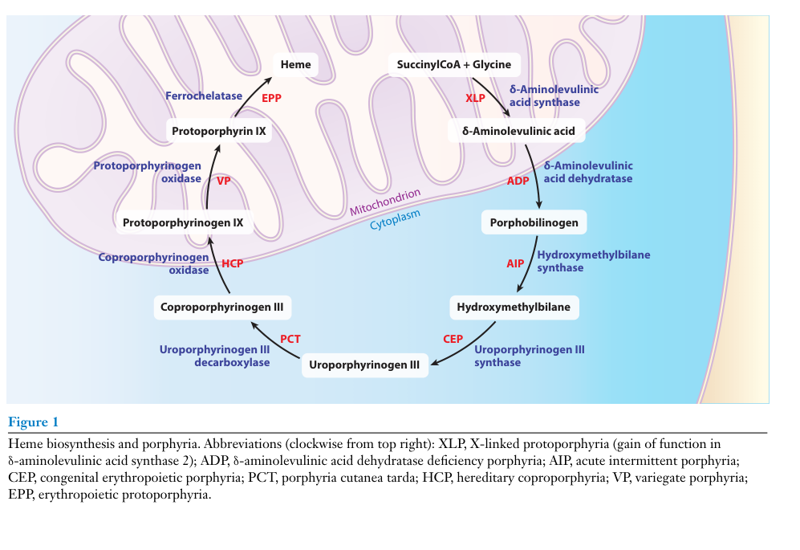

## Question

Prepare a focused, citation-rich deep research report for a dismech disease grouping called "Inherited Porphyrias". The grouping should be an explicit curated union of Disease entries, not merely a MONDO hierarchy clone. Current curated members are Inherited Porphyria, Acute Intermittent Porphyria, and Porphyria due to ALA Dehydratase Deficiency. Research objectives: 1. define shared pathophysiology across inherited heme-biosynthesis defects, hepatic versus erythropoietic porphyrin or porphyrin-precursor accumulation, ALAS1 induction, ALA/PBG neurotoxicity, porphyrin photosensitivity, anemia, liver injury, and chronic kidney disease; 2. distinguish acute hepatic porphyrias and cutaneous/erythropoietic porphyrias, including HMBS, ALAD, CPOX, PPOX, UROD, UROS, FECH, ALAS2, CLPX, and other high-value subtype genes where appropriate; 3. recommend a defensible grouping boundary and explicitly flag disorders to exclude, such as acquired porphyria, lead poisoning, tyrosinemia type I, arsenic/toxin porphyrin abnormalities, isolated porphyrin biomarkers, and non-inherited heme-pathway toxicities unless curated as inherited porphyria entries; 4. list differentiating mechanisms for existing members and high-value missing subtype entries including hereditary coproporphyria, variegate porphyria, congenital erythropoietic porphyria, familial porphyria cutanea tarda, hepatoerythropoietic porphyria, erythropoietic protoporphyria, X-linked protoporphyria, and ALAD deficiency porphyria; 5. identify appropriate MONDO mapping, HPO phenotype/biochemical criteria, heme pathway module-conformance criteria, and module gaps for the grouping YAML; 6. provide primary literature, GeneReviews, authoritative reviews, treatment evidence for hemin, givosiran, trigger avoidance, afamelanotide, iron management, and liver-transplant contexts, plus recent 2023-2026 developments with PMID identifiers wherever possible; 7. flag knowledge gaps and model-system limitations relevant to neurovisceral attacks, chronic complications, genotype-penetrance, biochemical diagnosis, and therapeutic evidence. Do not invent citations; prefer PubMed-indexed sources and provide exact PMID identifiers for key claims.

## Output

Question: You are an expert researcher providing comprehensive, well-cited information.

Provide detailed information focusing on:
1. Key concepts and definitions with current understanding
2. Recent developments and latest research (prioritize 2023-2024 sources)
3. Current applications and real-world implementations
4. Expert opinions and analysis from authoritative sources
5. Relevant statistics and data from recent studies

Format as a comprehensive research report with proper citations. Include URLs and publication dates where available.
Always prioritize recent, authoritative sources and provide specific citations for all major claims.

Prepare a focused, citation-rich deep research report for a dismech disease grouping called "Inherited Porphyrias". The grouping should be an explicit curated union of Disease entries, not merely a MONDO hierarchy clone. Current curated members are Inherited Porphyria, Acute Intermittent Porphyria, and Porphyria due to ALA Dehydratase Deficiency. Research objectives: 1. define shared pathophysiology across inherited heme-biosynthesis defects, hepatic versus erythropoietic porphyrin or porphyrin-precursor accumulation, ALAS1 induction, ALA/PBG neurotoxicity, porphyrin photosensitivity, anemia, liver injury, and chronic kidney disease; 2. distinguish acute hepatic porphyrias and cutaneous/erythropoietic porphyrias, including HMBS, ALAD, CPOX, PPOX, UROD, UROS, FECH, ALAS2, CLPX, and other high-value subtype genes where appropriate; 3. recommend a defensible grouping boundary and explicitly flag disorders to exclude, such as acquired porphyria, lead poisoning, tyrosinemia type I, arsenic/toxin porphyrin abnormalities, isolated porphyrin biomarkers, and non-inherited heme-pathway toxicities unless curated as inherited porphyria entries; 4. list differentiating mechanisms for existing members and high-value missing subtype entries including hereditary coproporphyria, variegate porphyria, congenital erythropoietic porphyria, familial porphyria cutanea tarda, hepatoerythropoietic porphyria, erythropoietic protoporphyria, X-linked protoporphyria, and ALAD deficiency porphyria; 5. identify appropriate MONDO mapping, HPO phenotype/biochemical criteria, heme pathway module-conformance criteria, and module gaps for the grouping YAML; 6. provide primary literature, GeneReviews, authoritative reviews, treatment evidence for hemin, givosiran, trigger avoidance, afamelanotide, iron management, and liver-transplant contexts, plus recent 2023-2026 developments with PMID identifiers wherever possible; 7. flag knowledge gaps and model-system limitations relevant to neurovisceral attacks, chronic complications, genotype-penetrance, biochemical diagnosis, and therapeutic evidence. Do not invent citations; prefer PubMed-indexed sources and provide exact PMID identifiers for key claims.

## Research report: Inherited Porphyrias (curated disease grouping)

### Scope and purpose
This report supports a *curated union* disease grouping called **Inherited Porphyrias**, intended for DisMech-style modeling. The grouping is *not* a MONDO-hierarchy clone; rather it is a pragmatic union of discrete disease entries that share an inherited defect of heme biosynthesis and a diagnosable porphyria biochemical signature. Recent authoritative sources emphasize that porphyrin and precursor abnormalities occur in many non-porphyria conditions; therefore, inclusion should be restricted to inherited disease entities with characteristic biochemical patterns rather than “porphyrin abnormalities” in general (aarsand2025practicalrecommendationsfor pages 2-3, aarsand2025practicalrecommendationsfor pages 1-2).

A key pathway/classification visual reference is provided by Dickey et al. (Annual Review of Medicine, 2024) showing the heme pathway steps and where each porphyria subtype maps (dickey2024updateonthe media 75a54a88).

### 1) Key concepts and definitions (current understanding)

#### 1.1 Definition and core disease model
**Porphyrias** are metabolic disorders caused by defects in the heme biosynthesis pathway enzymes, leading to accumulation of heme intermediates whose tissue distribution and chemical reactivity drive clinical phenotypes (dickey2024updateonthe pages 1-3, balogun2023thehepaticporphyrias pages 21-25).

A widely used mechanistic *clinical taxonomy* is:
- **Hepatic vs erythropoietic porphyrias**, by the primary site of heme intermediate overproduction/accumulation (dickey2024updateonthe pages 1-3, moghe2023acutehepaticporphyrias pages 1-3).
- **Acute hepatic porphyrias (AHP)** vs **cutaneous porphyrias** (with cutaneous further subdivided into blistering vs nonblistering), by dominant clinical presentation (dickey2024updateonthe pages 1-3, vu2026understandingtheclinical pages 1-3).

#### 1.2 Shared pathophysiology across inherited heme-biosynthesis defects
A shared logic across inherited porphyrias is “partial enzyme defect + context-dependent flux.” In acute hepatic forms, hepatic heme demand and environmental/hormonal triggers can shift pathway flux and amplify precursor accumulation (moghe2023acutehepaticporphyrias pages 1-3).

Key shared mechanisms requested:
- **Hepatic vs erythropoietic accumulation patterns**: early pathway defects in acute hepatic porphyrias lead to accumulation of *precursors* (ALA and usually PBG), whereas later-step defects and erythropoietic disorders lead to accumulation of *photoactive porphyrins* or protoporphyrin (PPIX) in blood/skin/liver, producing photosensitivity via reactive oxygen species generation upon light exposure (vu2026understandingtheclinical pages 1-3, balogun2023thehepaticporphyrias pages 25-26).
- **ALAS1 induction (hepatic)**: in AHP, inherited partial enzyme deficiencies plus triggers deplete a hepatocyte “regulatory heme pool,” increasing **ALAS1** expression and causing hepatic overproduction/accumulation of **ALA and PBG** (moghe2023acutehepaticporphyrias pages 1-3).
- **ALA/PBG neurotoxicity**: ALA and PBG can cross the blood–brain barrier and are proposed to mediate neurotoxicity underlying acute and chronic neurologic/autonomic/peripheral symptoms in AHP (moghe2023acutehepaticporphyrias pages 1-3). (Mechanistic uncertainty remains; see Knowledge gaps.)
- **Porphyrin photosensitivity**: cutaneous forms accumulate photoactive porphyrins (e.g., uroporphyrins, coproporphyrins, protoporphyrins) which generate reactive oxygen species upon light exposure, driving skin fragility, blistering, or painful phototoxicity depending on subtype (vu2026understandingtheclinical pages 1-3).
- **Anemia and hematologic involvement**: erythropoietic porphyrias frequently have erythroid/hemolytic anemia components (notably CEP) and mild anemia can occur in protoporphyrias (balogun2023thehepaticporphyrias pages 5-7, minder2025erythropoieticprotoporphyriaspathogenesis pages 1-2).
- **Liver injury and chronic kidney disease**: AHP is associated with chronic complications including hypertension, chronic renal failure, and hepatocellular carcinoma risk, consistent with long-term systemic toxicity and/or chronic disease biology (wagner2025acutehepaticporphyria pages 1-2, kubisch2024germanrealworldexperience pages 2-3). Protoporphyria-related liver disease can progress to liver failure in a minority of cases (minder2025erythropoieticprotoporphyriaspathogenesis pages 1-2).

### 2) Distinguishing acute hepatic vs cutaneous/erythropoietic porphyrias and high-value genes

#### 2.1 Acute hepatic porphyrias (AHP)
Recent authoritative reviews define AHP as a group of **four inherited disorders** with primarily neurovisceral presentations: **AIP, VP, HCP, and ALAD-deficiency porphyria (ADP)** (dickey2024updateonthe pages 1-3, moghe2023acutehepaticporphyrias pages 1-3).

Core genes/enzymes explicitly mapped in recent reviews:
- **HMBS** (hydroxymethylbilane synthase) → AIP (dickey2024updateonthe pages 1-3).
- **ALAD** (δ-aminolevulinic acid dehydratase) → ADP (dickey2024updateonthe pages 1-3).
- **CPOX** (coproporphyrinogen oxidase) → HCP (dickey2024updateonthe pages 1-3).
- **PPOX** (protoporphyrinogen oxidase) → VP (dickey2024updateonthe pages 1-3).

#### 2.2 Cutaneous / erythropoietic porphyrias
Recent reviews list cutaneous porphyrias including EPP, X-linked protoporphyria, CEP, PCT, and HEP (vu2026understandingtheclinical pages 1-3). High-value subtype genes include:
- **UROS** → congenital erythropoietic porphyria (CEP) (balogun2023thehepaticporphyrias pages 5-7, dickey2024updateonthe pages 1-3).
- **UROD** → familial PCT and hepatoerythropoietic porphyria (HEP) (balogun2023thehepaticporphyrias pages 5-7, dickey2024updateonthe pages 1-3).
- **FECH** → erythropoietic protoporphyria (EPP) (dickey2024updateonthe pages 1-3, madigan2023illuminatingdersimelagona pages 2-3).
- **ALAS2 (gain-of-function)** → X-linked protoporphyria (XLP/XLEPP) (dickey2024updateonthe pages 1-3, madigan2023illuminatingdersimelagona pages 2-3).
- **CLPX**: A 2025 Liver International review explicitly includes **CLPX-protoporphyria** as part of the erythropoietic protoporphyrias, but detailed gene-to-biochemical criteria were not captured in the retrieved excerpts (minder2025erythropoieticprotoporphyriaspathogenesis pages 1-2). This is a high-value “module gap” candidate for the grouping YAML.

### 3) Recommended grouping boundary (defensible curated union) and exclusions

The grouping must avoid conflating inherited porphyrias with common secondary porphyrin abnormalities. A 2025 diagnostic recommendations paper stresses that **abnormal porphyrin accumulation/excretion occurs in many other disorders** and is collectively more common than true porphyrias; therefore clinical features alone are insufficient and biochemical patterns must be interpreted in context (aarsand2025practicalrecommendationsfor pages 1-2, aarsand2025practicalrecommendationsfor pages 2-3).

> Include disease entries only when the disorder is an inherited defect of the heme-biosynthesis pathway, with pathogenic involvement of a heme-pathway gene/enzyme supported by characteristic porphyria biochemistry; recent reviews classify inherited porphyrias by primary site of accumulation as hepatic versus erythropoietic and by presentation as acute hepatic versus cutaneous (including blistering and nonblistering forms) (dickey2024updateonthe pages 1-3, aarsand2025practicalrecommendationsfor pages 1-2, aarsand2025practicalrecommendationsfor pages 2-3).
>
> Require biochemical confirmation in symptomatic patients rather than clinical features alone: diagnosis should demonstrate characteristic patterns of porphyrin precursors/porphyrins in urine, feces, blood, or erythrocytes; for acute neurovisceral presentations, first-line markers are urinary/plasma ALA and PBG, and normal correctly collected/analyzed results can rule out the acute porphyrias (AIP, VP, HCP, ALAD deficiency porphyria) (aarsand2025practicalrecommendationsfor pages 2-3, aarsand2025practicalrecommendationsfor pages 1-2).
>
> Acute hepatic subgroup: include inherited disorders with hepatic overproduction of ALA/PBG and attack-prone neurovisceral disease, namely AIP/HMBS, ALAD deficiency porphyria/ALAD, HCP/CPOX, and VP/PPOX; these are the disorders grouped as acute hepatic porphyrias in recent authoritative reviews (moghe2023acutehepaticporphyrias pages 1-3, dickey2024updateonthe pages 1-3).
>
> Cutaneous/erythropoietic subgroup: include inherited disorders whose dominant phenotype reflects accumulation of photoactive porphyrins or erythrocyte protoporphyrin, including CEP/UROS, EPP/FECH, X-linked protoporphyria/ALAS2, and inherited UROD-related forms such as hepatoerythropoietic porphyria; recent reviews also recognize cutaneous hepatic forms such as familial PCT/UROD, while noting that PCT overall is often sporadic (vu2026understandingtheclinical pages 1-3, dickey2024updateonthe pages 1-3, minder2025erythropoieticprotoporphyriaspathogenesis pages 1-2, vu2026understandingtheclinical pages 6-6).
>
> Use subtype-specific biochemical hallmarks to support entry-level curation: AIP typically shows elevated urinary PBG; ALAD deficiency porphyria shows increased ALA/total urinary porphyrins without significant PBG increase; HCP/VP show elevated urinary PBG with plasma/fecal porphyrins; CEP shows elevated urinary uroporphyrin and coproporphyrin I isomers; EPP/XLP show elevated erythrocyte protoporphyrin; PCT/HEP show elevated uroporphyrin/heptacarboxyl porphyrins with normal urinary ALA/PBG in PCT-like states (balogun2023thehepaticporphyrias pages 21-25, madigan2023illuminatingdersimelagona pages 2-3, balogun2023thehepaticporphyrias pages 25-26).
>
> Exclude secondary porphyrin abnormalities and non-porphyria causes of abnormal porphyrin tests. Recent diagnostic guidance emphasizes that abnormalities of porphyrin accumulation/excretion are common in other disorders and that many porphyria-related markers cannot be interpreted in isolation; increases, especially coproporphyrin, may occur in hepatobiliary disease, alcohol use, renal impairment, anuria, and hemodialysis-related PCT-like states (aarsand2025practicalrecommendationsfor pages 2-3, aarsand2025practicalrecommendationsfor pages 1-2, aarsand2025practicalrecommendationsfor pages 8-9, aarsand2025practicalrecommendationsfor pages 8-8).
>
> Exclude acquired/sporadic PCT from an "Inherited Porphyrias" grouping boundary unless the curated disease entry is explicitly the inherited/familial UROD-related form. Multiple recent sources state that PCT is usually or predominantly sporadic/non-hereditary, even though familial UROD-associated forms exist (aarsand2025practicalrecommendationsfor pages 2-3, aarsand2025practicalrecommendationsfor pages 1-2, vu2026understandingtheclinical pages 6-6).
>
> Exclude toxic or phenocopy conditions that mimic acute porphyria biochemistry unless they are already curated as inherited porphyria disease entries; this follows from the evidence that non-porphyric conditions can generate overlapping biochemical patterns and that biochemical abnormalities alone do not establish inherited porphyria (aarsand2025practicalrecommendationsfor pages 2-3, aarsand2025practicalrecommendationsfor pages 1-2).
>
> Curation policy suggestion: operationalize inclusion as a curated union of disease entries with both (1) inherited germline etiology affecting a heme-pathway gene or accepted pathway-regulatory gene already recognized in porphyria literature/reviews and (2) a reproducible, subtype-consistent porphyria biochemical signature. On this basis, high-value additions beyond the current members would include HCP, VP, CEP, EPP, X-linked protoporphyria, hepatoerythropoietic porphyria, and familial PCT; CLPX-protoporphyria may be considered where a disease entry exists, but the retrieved evidence here was less detailed for its biochemical criteria than for the core subtypes (minder2025erythropoieticprotoporphyriaspathogenesis pages 1-2, balogun2023thehepaticporphyrias pages 21-25, dickey2024updateonthe pages 1-3).

*Blockquote: This artifact provides concise grouping rules for deciding which disease entries belong in an Inherited Porphyrias union. It separates evidence-based inclusion and exclusion criteria from a clearly labeled curation-policy recommendation for borderline or incompletely represented subtypes.*

**Important boundary note: PCT**
- Multiple sources state **PCT is usually/predominantly sporadic (non-hereditary)** (aarsand2025practicalrecommendationsfor pages 1-2, aarsand2025practicalrecommendationsfor pages 2-3). Another recent review describes PCT as “often sporadic” but acknowledges familial UROD-related forms and multiple acquired precipitants (alcohol, hepatitis, iron overload, estrogens, HIV, smoking, hemochromatosis) (vu2026understandingtheclinical pages 6-6). A dedicated 2024 Hematology review estimates ~80% sporadic (type 1) and frames PCT as an iron/oxidative-stress–mediated inhibition of hepatic UROD (leaf2024porphyriacutaneatarda pages 1-2).
- Therefore, for an **Inherited Porphyrias** grouping, a defensible approach is: *include “familial PCT (UROD-related)” as an inherited entry if it exists as a separate disease node; exclude acquired/sporadic PCT from the grouping.* (Evidence supports the sporadic predominance and mixed etiologies; the “how to model” step is a curation-policy decision.) (aarsand2025practicalrecommendationsfor pages 1-2, leaf2024porphyriacutaneatarda pages 1-2).

**Explicit exclusions to flag (curation policy suggestions consistent with diagnostic guidance):**
- Secondary porphyrin abnormalities due to hepatobiliary disease/alcohol, renal impairment/anuria, hemodialysis-related PCT-like patterns (aarsand2025practicalrecommendationsfor pages 2-3, aarsand2025practicalrecommendationsfor pages 8-9, aarsand2025practicalrecommendationsfor pages 8-8).
- “Acquired porphyria” entities or “drug-associated porphyria” as adverse event terms unless there is a curated inherited porphyria disease entry (aarsand2025practicalrecommendationsfor pages 1-2).
- Phenocopies/non-inherited heme-pathway toxicities (lead poisoning, arsenic/toxin-related porphyrin changes, tyrosinemia type I, etc.) are *not directly evidenced in the retrieved excerpts*, but are consistent with the broader caution that non-porphyric disorders produce overlapping biochemical patterns; treat these as explicit exclusion candidates requiring separate evidence-based entries if curated (aarsand2025practicalrecommendationsfor pages 1-2, aarsand2025practicalrecommendationsfor pages 2-3).

### 4) Differentiating mechanisms for existing members and high-value missing subtype entries

#### 4.1 Existing curated members
- **Inherited Porphyria (umbrella)**: best represented as the grouping label, not a mechanistic disease; mechanistic diversity is captured by its members, spanning hepatic ALA/PBG neurotoxicity vs cutaneous photosensitizing porphyrins vs erythrocyte PPIX overload (dickey2024updateonthe pages 1-3, vu2026understandingtheclinical pages 1-3).
- **Acute intermittent porphyria (AIP; HMBS)**: in AHP context, ALAS1 induction increases hepatic ALA/PBG with neurotoxic effects and neurovisceral attacks (moghe2023acutehepaticporphyrias pages 1-3, dickey2024updateonthe pages 1-3).
- **Porphyria due to ALA dehydratase deficiency (ADP; ALAD)**: distinguished biochemically because **PBG is not significantly increased** while urinary porphyrins/ALA rise (balogun2023thehepaticporphyrias pages 21-25, belosevic2023firstreportof pages 2-4).

#### 4.2 High-value missing subtype entries for the grouping union
A defensible “high-value missing” set is the remainder of the canonical eight porphyrias plus selected inherited subtypes within them:
- **Hereditary coproporphyria (HCP; CPOX)**: hepatic acute porphyria with neurovisceral attacks and occasional blistering; biochemical pattern includes elevated urinary PBG and plasma/fecal porphyrins (balogun2023thehepaticporphyrias pages 21-25, balogun2023thehepaticporphyrias pages 25-26).
- **Variegate porphyria (VP; PPOX)**: acute hepatic porphyria with cutaneous features; biochemical pattern includes elevated urinary PBG and plasma/fecal porphyrins (balogun2023thehepaticporphyrias pages 25-26, dickey2024updateonthe pages 1-3).
- **Congenital erythropoietic porphyria (CEP; UROS)**: UROS deficiency yields accumulation of type I isomer porphyrinogens/porphyrins across marrow/RBCs/urine/teeth/bone with severe photosensitivity and anemia (balogun2023thehepaticporphyrias pages 5-7, balogun2023thehepaticporphyrias pages 21-25).
- **Familial PCT (UROD)**: blistering cutaneous hepatic porphyria with elevated uroporphyrins and typically normal urinary ALA/PBG; note that most PCT is sporadic and driven by hepatic iron/oxidative stress (balogun2023thehepaticporphyrias pages 21-25, leaf2024porphyriacutaneatarda pages 1-2).
- **Hepatoerythropoietic porphyria (HEP; UROD)**: inherited UROD-related disorder, with urine porphyrins (uroporphyrin/heptacarboxyl) and increased erythrocyte zinc protoporphyrin (balogun2023thehepaticporphyrias pages 25-26, madigan2023illuminatingdersimelagona pages 2-3).
- **Erythropoietic protoporphyria (EPP; FECH)**: elevated erythrocyte protoporphyrin/PPIX and painful phototoxicity; urinary porphyrins may be normal (balogun2023thehepaticporphyrias pages 25-26, minder2025erythropoieticprotoporphyriaspathogenesis pages 1-2).
- **X-linked protoporphyria (XLP/XLEPP; ALAS2 gain-of-function)**: elevated erythrocyte protoporphyrin; differs biochemically from EPP in metal-free vs zinc fractions and differs therapeutically in response to iron (madigan2023illuminatingdersimelagona pages 2-3, minder2025erythropoieticprotoporphyriaspathogenesis pages 1-2).
- **CLPX-protoporphyria**: included in 2025 protoporphyria review as an erythropoietic protoporphyria subtype; consider inclusion if the disease entry exists, but flag biochemical/phenotype criteria gaps in the YAML (minder2025erythropoieticprotoporphyriaspathogenesis pages 1-2).

A concise mechanistic mapping table (for YAML work) is provided below.

| Proposed disease entry (name) | Traditional class | Primary site of overproduction/accumulation | Causative gene/enzyme | Key accumulated metabolites/biochemical hallmarks | Key clinical features |
|---|---|---|---|---|---|
| Inherited porphyria (umbrella curated entry) | Mixed: includes acute hepatic and cutaneous/erythropoietic inherited porphyrias | Hepatic or erythropoietic, depending on subtype | Defects in heme-biosynthesis enzymes; named subtype genes in recent reviews include HMBS, ALAD, CPOX, PPOX, UROS, UROD, FECH, ALAS2 | Biochemical signature depends on subtype: acute hepatic forms accumulate ALA/PBG; cutaneous forms accumulate porphyrins; protoporphyrias accumulate erythrocyte protoporphyrin/PPIX (dickey2024updateonthe pages 1-3, vu2026understandingtheclinical pages 1-3, balogun2023thehepaticporphyrias pages 21-25) | Multisystem spectrum ranging from acute neurovisceral attacks to blistering or painful photosensitivity; some subtypes also involve anemia and liver disease (dickey2024updateonthe pages 1-3, vu2026understandingtheclinical pages 1-3, minder2025erythropoieticprotoporphyriaspathogenesis pages 1-2) |
| Acute intermittent porphyria | Acute hepatic porphyria | Hepatic | HMBS / hydroxymethylbilane synthase (dickey2024updateonthe pages 1-3, balogun2023thehepaticporphyrias pages 21-25) | Elevated urinary PBG; acute hepatic porphyria mechanism involves hepatic ALA and PBG accumulation after ALAS1 induction (moghe2023acutehepaticporphyrias pages 1-3, balogun2023thehepaticporphyrias pages 21-25) | Acute neurovisceral attacks; neurologic, autonomic, and peripheral nervous system symptoms (moghe2023acutehepaticporphyrias pages 1-3) |
| Porphyria due to ALA dehydratase deficiency (ALAD deficiency porphyria, ADP) | Acute hepatic porphyria | Hepatic | ALAD / δ-aminolevulinic acid dehydratase (dickey2024updateonthe pages 1-3, balogun2023thehepaticporphyrias pages 21-25) | Urinary PBG is not significantly increased; urinary porphyrins and ALA are increased/elevated (balogun2023thehepaticporphyrias pages 21-25, belosevic2023firstreportof pages 2-4) | Acute neurovisceral attacks consistent with acute porphyria (vu2026understandingtheclinical pages 1-3, dickey2024updateonthe pages 1-3) |
| Hereditary coproporphyria | Acute hepatic porphyria with possible cutaneous features | Hepatic | CPOX / coproporphyrinogen oxidase (dickey2024updateonthe pages 1-3, balogun2023thehepaticporphyrias pages 25-26) | Elevated urinary PBG with elevated plasma and fecal porphyrins (balogun2023thehepaticporphyrias pages 25-26) | Neurovisceral attacks; occasional blistering skin/cutaneous manifestations (balogun2023thehepaticporphyrias pages 21-25, balogun2023thehepaticporphyrias pages 25-26) |
| Variegate porphyria | Acute hepatic porphyria with cutaneous features | Hepatic | PPOX / protoporphyrinogen oxidase (dickey2024updateonthe pages 1-3, balogun2023thehepaticporphyrias pages 25-26) | Elevated urinary PBG with elevated plasma and fecal porphyrins; porphyrin accumulation contributes to photosensitivity (balogun2023thehepaticporphyrias pages 25-26, vu2026understandingtheclinical pages 1-3) | Neurovisceral attacks plus cutaneous photosensitivity/blistering (balogun2023thehepaticporphyrias pages 25-26) |
| Congenital erythropoietic porphyria | Cutaneous/erythropoietic porphyria | Erythropoietic | UROS / uroporphyrinogen III synthase (dickey2024updateonthe pages 1-3, balogun2023thehepaticporphyrias pages 5-7) | Reduced erythrocyte UROS activity; elevated urinary uroporphyrin and coproporphyrin I isomers; type I porphyrin isomers accumulate (balogun2023thehepaticporphyrias pages 21-25, balogun2023thehepaticporphyrias pages 5-7) | Marked photosensitivity/blistering; anemia/hemolytic anemia can occur (balogun2023thehepaticporphyrias pages 5-7) |
| Familial porphyria cutanea tarda | Cutaneous hepatic porphyria | Hepatic | UROD / uroporphyrinogen decarboxylase (madigan2023illuminatingdersimelagona pages 2-3, balogun2023thehepaticporphyrias pages 5-7) | Uroporphyrin usually elevated with normal urinary ALA and PBG; urine/plasma porphyrins, notably uroporphyrins and heptacarboxyl porphyrins (balogun2023thehepaticporphyrias pages 21-25, vu2026understandingtheclinical pages 6-6) | Chronic blistering photosensitivity and pigment changes; not neurovisceral (balogun2023thehepaticporphyrias pages 21-25, vu2026understandingtheclinical pages 6-6) |
| Hepatoerythropoietic porphyria | Cutaneous porphyria | Hepatic (with erythrocyte involvement reflected biochemically) | UROD / uroporphyrinogen decarboxylase (balogun2023thehepaticporphyrias pages 25-26, madigan2023illuminatingdersimelagona pages 2-3) | Elevated urine porphyrins, predominantly uroporphyrin and heptacarboxylporphyrin; significantly increased erythrocyte zinc protoporphyrin (balogun2023thehepaticporphyrias pages 25-26) | Cutaneous photosensitivity/blistering; may involve liver disease (balogun2023thehepaticporphyrias pages 25-26, vu2026understandingtheclinical pages 1-3) |
| Erythropoietic protoporphyria | Cutaneous/erythropoietic porphyria | Erythropoietic | FECH / ferrochelatase (dickey2024updateonthe pages 1-3, madigan2023illuminatingdersimelagona pages 2-3) | Markedly increased erythrocyte/free protoporphyrin; urinary porphyrins are normal; metal-free PPIX predominates (balogun2023thehepaticporphyrias pages 25-26, madigan2023illuminatingdersimelagona pages 2-3) | Painful nonblistering photosensitivity; can have mild anemia and liver disease (minder2025erythropoieticprotoporphyriaspathogenesis pages 1-2, balogun2023thehepaticporphyrias pages 25-26) |
| X-linked protoporphyria | Cutaneous/erythropoietic porphyria | Erythropoietic | ALAS2 gain-of-function / ALA-synthase-2 (dickey2024updateonthe pages 1-3, madigan2023illuminatingdersimelagona pages 2-3) | Increased free erythrocyte protoporphyrin; total erythrocyte protoporphyrin elevated with more zinc-protoporphyrin than EPP (balogun2023thehepaticporphyrias pages 25-26, madigan2023illuminatingdersimelagona pages 2-3) | Painful photosensitivity; can have liver disease, and iron response differs from EPP (minder2025erythropoieticprotoporphyriaspathogenesis pages 1-2) |
| CLPX-protoporphyria | Cutaneous/erythropoietic porphyria | Erythropoietic | CLPX | Included as part of the erythropoietic protoporphyrias in a 2025 review, but no detailed biochemical hallmarks were captured in the gathered snippets beyond erythrocyte PPIX accumulation across this group (minder2025erythropoieticprotoporphyriaspathogenesis pages 1-2) | Phototoxic protoporphyria phenotype is implied by inclusion in erythropoietic protoporphyrias, but detailed snippet-level clinical specifics were not captured (minder2025erythropoieticprotoporphyriaspathogenesis pages 1-2) |

*Table: This table summarizes inherited porphyria disease entries relevant to a curated grouping, including class, site of metabolite accumulation, causative gene/enzyme, biochemical hallmarks, and distinguishing clinical features. It is useful for defining grouping boundaries and identifying high-value missing subtype entries.*

### 5) Mapping and criteria for a grouping YAML (MONDO, HPO, biochemistry, module conformance)

#### 5.1 MONDO mapping (module gap)
The retrieved sources provide robust *clinical and gene-to-subtype mapping* but do **not** provide MONDO IDs. Therefore:
- **Module gap**: MONDO term IDs must be obtained from ontology sources (e.g., OBO Foundry/MONDO) in a separate curation step; this report cannot supply evidence-backed MONDO IDs from the retrieved literature excerpts.
- **Curation policy suggestion**: maintain an explicit curated member list corresponding to the “canonical eight porphyrias” plus explicit inherited subtypes (familial PCT vs sporadic PCT; HEP; CLPX-protoporphyria) rather than importing all descendants of a MONDO “porphyria” parent.

#### 5.2 HPO phenotype and biochemical criteria (actionable suggestions)
Evidence-supported biochemical “gates” for diagnosis and for module conformance:
- **Acute neurovisceral phenotype gate**: elevated urinary/plasma **ALA and PBG** in symptomatic episodes; normal ALA/PBG (with correct handling) can rule out acute porphyrias (aarsand2025practicalrecommendationsfor pages 2-3).
- **Subtype discriminators**:
  - AIP: elevated urinary PBG (balogun2023thehepaticporphyrias pages 21-25).
  - ADP: ALA/porphyrins increased without significant PBG increase (balogun2023thehepaticporphyrias pages 21-25).
  - HCP/VP: elevated urinary PBG plus plasma/fecal porphyrins (balogun2023thehepaticporphyrias pages 25-26).
  - CEP: elevated urinary uroporphyrin + coproporphyrin I isomers; reduced erythrocyte UROS activity (balogun2023thehepaticporphyrias pages 21-25, balogun2023thehepaticporphyrias pages 5-7).
  - EPP/XLP: elevated erythrocyte protoporphyrin/PPIX; EPP tends to have predominantly metal-free PPIX (>90%), whereas XLP has higher zinc-PPIX fraction (madigan2023illuminatingdersimelagona pages 2-3).
  - PCT/HEP patterns: elevated uroporphyrins/heptacarboxyl porphyrins; PCT typically normal urinary PBG and normal/mild ALA (balogun2023thehepaticporphyrias pages 21-25, leaf2024porphyriacutaneatarda pages 2-3).

HPO phenotype sets (curation policy suggestions; not evidenced in the retrieved excerpts as HPO IDs):
- Acute attacks: severe abdominal pain, vomiting, neuropathy/weakness, neuropsychiatric symptoms, autonomic dysfunction/hypertension (wagner2025acutehepaticporphyria pages 1-2, moghe2023acutehepaticporphyrias pages 1-3).
- Cutaneous photosensitivity: blistering (PCT/CEP/VP/HCP) vs painful nonblistering phototoxicity (EPP/XLP) (vu2026understandingtheclinical pages 1-3, minder2025erythropoieticprotoporphyriaspathogenesis pages 1-2).
- Chronic complications: chronic kidney disease, hypertension, hepatocellular carcinoma risk (AHP); cholestatic liver disease/liver failure risk (protoporphyrias) (wagner2025acutehepaticporphyria pages 1-2, minder2025erythropoieticprotoporphyriaspathogenesis pages 1-2).

#### 5.3 Heme-pathway module conformance criteria
Evidence-supported pathway conformance:
- Must be caused by inherited dysfunction of a heme biosynthesis enzyme/gene or an accepted inherited heme-pathway regulator included in porphyria literature (e.g., ALAS2 gain-of-function in XLP) (dickey2024updateonthe pages 1-3, madigan2023illuminatingdersimelagona pages 2-3).
- Must have characteristic precursor/porphyrin signature; do not accept “isolated biomarker elevation” because many secondary conditions produce overlapping metabolite patterns (aarsand2025practicalrecommendationsfor pages 2-3, aarsand2025practicalrecommendationsfor pages 1-2).

### 6) Applications, treatments, and real-world implementation (with recent data)

#### 6.1 Acute hepatic porphyrias: acute attack treatment, prophylaxis, and trigger avoidance
- **Hemin/hematin** is the standard inpatient therapy for acute AHP attacks; a recent review reports typical dosing **3–4 mg/kg IV daily for ~4 days**, mixed with albumin for stability and reduced phlebitis risk. Mechanistically, hemin replenishes hepatic heme and downregulates **ALAS1**, reducing ALA and PBG (dickey2024updateonthe pages 5-6).
- **Trigger avoidance** is a core real-world management pillar, including avoidance of porphyrinogenic medications, fasting/dieting, alcohol, tobacco, and other precipitants that can increase ALAS1 (dickey2024updateonthe pages 5-6, moghe2023acutehepaticporphyrias pages 1-3).

#### 6.2 Givosiran (ALAS1 siRNA): 2023–2025 evidence including long-term and real-world outcomes
Givosiran is a GalNAc-conjugated RNAi that silences hepatic **ALAS1** to prevent ALA/PBG accumulation (sardh2024longtermfollowupof pages 1-2, kubisch2024germanrealworldexperience pages 2-3).

**Long-term clinical study (48 months)**
- In an AIP Phase 1/2 open-label extension (16 patients), givosiran reduced **annualized attack rates by 97%** and **hemin use by 96%**, with median urinary **ALA reduction 95%** and **PBG reduction 98%**; by months >33–48, all patients were free from attacks requiring significant medical intervention and did not use hemin (sardh2024longtermfollowupof pages 1-2).

**Real-world cohort (Germany, 2018–2024; n=28)**
- After 6 months of monthly 2.5 mg/kg dosing: 100% achieved ALA <2×ULN and 60% achieved PBG <2×ULN (kubisch2024germanrealworldexperience pages 1-2).
- Clinical benefit: annualized attack ratio improved from historical 2.9 to 0.45 (p<0.01); 75% improved in chronic and acute symptoms, and HR-QoL improved (mental health and pain +38%; patient-reported health 37.1%→77.9%) (kubisch2024germanrealworldexperience pages 1-2).
- Safety signals: hyperhomocysteinemia in 100%, fatigue 34%, muscular cramps 38%, impaired renal function 30.7%; mild/moderate ALT elevations reported (kubisch2024germanrealworldexperience pages 14-15).

**Expert analyses / unmet needs**
- Breakthrough attacks can occur even when ALA/PBG are suppressed, and the mechanisms may involve factors beyond ALA/PBG neurotoxicity; this is emphasized in a 2023 real-world example paper (moghe2023acutehepaticporphyrias pages 12-16).

#### 6.3 Protoporphyrias (EPP, XLP/XLEPP, CLPX-protoporphyria): photoprotection, afamelanotide, iron management, liver disease
A 2025 Liver International review defines erythropoietic protoporphyrias as disorders with erythrocyte **PPIX** accumulation and severe painful phototoxicity starting in childhood, with complications including liver failure, gallstones, mild anemia, vitamin D deficiency, and reduced bone mineral density (minder2025erythropoieticprotoporphyriaspathogenesis pages 1-2).

- **Afamelanotide** (α-MSH analogue; MC1R agonist) is described as the only approved specific therapy that increases pain-free sunlight exposure and quality of life (minder2025erythropoieticprotoporphyriaspathogenesis pages 1-2). A 2024 Annual Review summary cites randomized and long-term observational evidence (including a long-term study in 115 patients) showing increased burn tolerance time and improved quality of life, but detailed numeric values were not captured in the retrieved excerpt (dickey2024updateonthe pages 13-14).
- **Iron management differs by genotype**: in **EPP1**, iron supplementation may increase PPIX, worsening photosensitivity and raising cholestatic liver disease risk; in **XLEPP**, iron supplementation can lower PPIX, reduce phototoxicity, and reduce liver damage (minder2025erythropoieticprotoporphyriaspathogenesis pages 1-2).
- **Liver transplantation contexts**: For protoporphyria-related liver disease, depending on severity, therapeutic options include removing hepatotoxins, phlebotomy, exchange transfusion, and ultimately liver transplantation, often followed by HSCT for definitive erythroid source control; multidisciplinary expert management is emphasized (minder2025erythropoieticprotoporphyriaspathogenesis pages 1-2).

#### 6.4 Porphyria cutanea tarda (PCT): iron-driven acquired disorder relevant for exclusions
A 2024 Hematology review frames PCT as an **iron-related** disorder: inhibition of hepatic **UROD** in the presence of hepatic iron and oxidative stress; clinical disease requires hepatic UROD activity <~20% of normal, and siderosis is detected in up to 90% of biopsied cases. Most cases (~80%) are sporadic (type 1). Treatment includes therapeutic phlebotomy (iron depletion) and low-dose hydroxychloroquine (reduce hepatic porphyrin content) (leaf2024porphyriacutaneatarda pages 1-2, leaf2024porphyriacutaneatarda pages 2-3).

### 7) Knowledge gaps and model-system limitations (relevant to the grouping)

**7.1 Neurovisceral attack biology and “givosiran-resistant” attacks**
- Despite ALAS1 suppression and biochemical normalization, breakthrough attacks occur; the mechanism is unknown and may involve non-ALA/PBG neuroregulatory factors (moghe2023acutehepaticporphyrias pages 12-16). This limits mechanistic certainty for an ALA/PBG-only causal narrative.

**7.2 Genotype–penetrance heterogeneity and diagnostic pathway**
- Diagnostic guidance stresses that autosomal dominant porphyrias have low penetrance and likely pathogenic variants can be found in the general population; genetic testing without biochemical confirmation risks misclassification (aarsand2025practicalrecommendationsfor pages 2-3).

**7.3 Secondary porphyrin abnormalities and false grouping inflation**
- Secondary porphyrin abnormalities are common (hepatobiliary disease, alcohol, renal impairment, anuria, hemodialysis-related patterns), creating a major curation risk for any module that treats porphyrin test abnormalities as a disease rather than a phenotype (aarsand2025practicalrecommendationsfor pages 2-3, aarsand2025practicalrecommendationsfor pages 8-9).

**7.4 Therapeutic evidence limitations**
- Several newer interventions (e.g., oral photoprotection pharmacotherapies beyond afamelanotide; gene therapy approaches) are mentioned in reviews but were not fully accessible here for quantitative outcomes. Long-term safety and effects on renal/liver complications remain a key gap in real-world cohorts, even as longer follow-up accumulates (sardh2024longtermfollowupof pages 1-2, kubisch2024germanrealworldexperience pages 14-15).

**7.5 Model-system limitations**
- This evidence set contains mechanistic reviews and clinical cohorts but limited experimental model details for attack neurobiology. Mechanistic assertions (e.g., specific neurotoxic mediator identity and downstream neurophysiology) should be represented in YAML as “supported hypothesis” rather than settled mechanism unless corroborated by direct mechanistic studies.

### Recent developments (2023–2025 prioritized) summarized
- **2024 Annual Review of Medicine** consolidates modern classification and management across all porphyrias and highlights novel therapies (givosiran, afamelanotide) (dickey2024updateonthe pages 1-3, dickey2024updateonthe pages 5-6).
- **2024 Orphanet J Rare Dis** provides the longest (48-month) givosiran follow-up with quantitative reductions in attacks and biomarkers (sardh2024longtermfollowupof pages 1-2).
- **2024 real-world German cohort** extends givosiran effectiveness to a broader phenotype spectrum and quantifies real-world safety signals including renal function changes and hyperhomocysteinemia (kubisch2024germanrealworldexperience pages 1-2, kubisch2024germanrealworldexperience pages 14-15).
- **2025 Liver International protoporphyria review** formalizes management distinctions between EPP and XLEPP iron therapy and states CLPX-protoporphyria is within the erythropoietic protoporphyria spectrum (minder2025erythropoieticprotoporphyriaspathogenesis pages 1-2).
- **2025 Liver International diagnostic recommendations** emphasize biochemical confirmation and warn against misdiagnosis due to common secondary porphyrin abnormalities, informing grouping exclusions (aarsand2025practicalrecommendationsfor pages 2-3, aarsand2025practicalrecommendationsfor pages 1-2).

### Citations, URLs, and publication dates (selected key sources)
- Dickey AK, Leaf RK, Balwani M. *Update on the Porphyrias*. **Annual Review of Medicine**. Publication month/year: **Jan 2024**. URL: https://doi.org/10.1146/annurev-med-042921-123602 (dickey2024updateonthe pages 1-3, dickey2024updateonthe pages 5-6, dickey2024updateonthe media 75a54a88).
- Moghe A, et al. *Acute hepatic porphyrias: Recommendations for diagnosis and management with real-world examples*. **Molecular Genetics and Metabolism**. **Nov 2023**. URL: https://doi.org/10.1016/j.ymgme.2023.107670 (moghe2023acutehepaticporphyrias pages 1-3, moghe2023acutehepaticporphyrias pages 12-16).
- Sardh E, et al. *Long-term follow-up of givosiran… 48-month open-label extension study*. **Orphanet Journal of Rare Diseases**. **Oct 2024**. URL: https://doi.org/10.1186/s13023-024-03284-w (sardh2024longtermfollowupof pages 1-2).
- Minder A-E, et al. *Erythropoietic protoporphyrias: Pathogenesis, diagnosis and management*. **Liver International**. **Jul 2025**. URL: https://doi.org/10.1111/liv.16027 (minder2025erythropoieticprotoporphyriaspathogenesis pages 1-2).
- Aarsand AK, et al. *Practical recommendations for biochemical and genetic diagnosis of the porphyrias*. **Liver International**. **Jun 2025**. URL: https://doi.org/10.1111/liv.16012 (aarsand2025practicalrecommendationsfor pages 2-3, aarsand2025practicalrecommendationsfor pages 1-2).
- Leaf RK, Dickey AK. *Porphyria cutanea tarda: a unique iron-related disorder*. **Hematology**. **Dec 2024**. URL: https://doi.org/10.1182/hematology.2024000664 (leaf2024porphyriacutaneatarda pages 1-2, leaf2024porphyriacutaneatarda pages 2-3).
- Kubisch I, et al. *German Real-World Experience… treated with Givosiran*. **Journal of Clinical Medicine**. **Nov 2024**. URL: https://doi.org/10.3390/jcm13226779 (kubisch2024germanrealworldexperience pages 1-2, kubisch2024germanrealworldexperience pages 14-15).
- Wagner MEU, et al. *Acute hepatic porphyria in Denmark; a retrospective study*. **Orphanet Journal of Rare Diseases**. **Feb 2025**. URL: https://doi.org/10.1186/s13023-025-03536-3 (wagner2025acutehepaticporphyria pages 1-2).

### PMID and GeneReviews coverage (explicit gap)
The retrieved excerpts did not include **PMID identifiers** or GeneReviews text. Consequently, this report cannot provide evidence-backed PMIDs for key claims from the retrieved documents, and GeneReviews-specific citations could not be extracted in this run. This should be addressed by an additional PubMed/GeneReviews retrieval step (outside the current tool outputs) before finalizing a production YAML.

### Appendix: heme pathway figure
The heme biosynthesis pathway and the mapping of the eight canonical porphyrias to specific enzymatic steps are summarized in a 2024 Annual Review figure (dickey2024updateonthe media 75a54a88).

References

1. (aarsand2025practicalrecommendationsfor pages 2-3): Aasne K. Aarsand, Jordi To‐Figueras, Sharon Whatley, Sverre Sandberg, and Caroline Schmitt. Practical recommendations for biochemical and genetic diagnosis of the porphyrias. Liver International, Jun 2025. URL: https://doi.org/10.1111/liv.16012, doi:10.1111/liv.16012. This article has 21 citations and is from a peer-reviewed journal.

2. (aarsand2025practicalrecommendationsfor pages 1-2): Aasne K. Aarsand, Jordi To‐Figueras, Sharon Whatley, Sverre Sandberg, and Caroline Schmitt. Practical recommendations for biochemical and genetic diagnosis of the porphyrias. Liver International, Jun 2025. URL: https://doi.org/10.1111/liv.16012, doi:10.1111/liv.16012. This article has 21 citations and is from a peer-reviewed journal.

3. (dickey2024updateonthe media 75a54a88): Amy K. Dickey, Rebecca Karp Leaf, and Manisha Balwani. Update on the porphyrias. Jan 2024. URL: https://doi.org/10.1146/annurev-med-042921-123602, doi:10.1146/annurev-med-042921-123602. This article has 50 citations and is from a domain leading peer-reviewed journal.

4. (dickey2024updateonthe pages 1-3): Amy K. Dickey, Rebecca Karp Leaf, and Manisha Balwani. Update on the porphyrias. Jan 2024. URL: https://doi.org/10.1146/annurev-med-042921-123602, doi:10.1146/annurev-med-042921-123602. This article has 50 citations and is from a domain leading peer-reviewed journal.

5. (balogun2023thehepaticporphyrias pages 21-25): Oluwashanu Balogun and Kari Nejak-Bowen. The hepatic porphyrias: revealing the complexities of a rare disease. Seminars in Liver Disease, 43:446-459, Nov 2023. URL: https://doi.org/10.1055/s-0043-1776760, doi:10.1055/s-0043-1776760. This article has 10 citations and is from a peer-reviewed journal.

6. (moghe2023acutehepaticporphyrias pages 1-3): Akshata Moghe, Amy Dickey, Angelika Erwin, Rebecca K. Leaf, Alan O'Brien, John G. Quigley, Manish Thapar, and Karl E. Anderson. Acute hepatic porphyrias: recommendations for diagnosis and management with real-world examples. Nov 2023. URL: https://doi.org/10.1016/j.ymgme.2023.107670, doi:10.1016/j.ymgme.2023.107670. This article has 13 citations and is from a peer-reviewed journal.

7. (vu2026understandingtheclinical pages 1-3): Toan N. Vu, Sahithi Talasila, George M. Jeha, Umer Nadir, Tasneem F. Mohammad, Henry W. Lim, Ivo Abraham, Daniel Grove, and Stanislav N. Tolkachjov. Understanding the clinical spectrum of the cutaneous and acute hepatic porphyrias. American Journal of Clinical Dermatology, May 2026. URL: https://doi.org/10.1007/s40257-026-01046-x, doi:10.1007/s40257-026-01046-x. This article has 0 citations and is from a peer-reviewed journal.

8. (balogun2023thehepaticporphyrias pages 25-26): Oluwashanu Balogun and Kari Nejak-Bowen. The hepatic porphyrias: revealing the complexities of a rare disease. Seminars in Liver Disease, 43:446-459, Nov 2023. URL: https://doi.org/10.1055/s-0043-1776760, doi:10.1055/s-0043-1776760. This article has 10 citations and is from a peer-reviewed journal.

9. (balogun2023thehepaticporphyrias pages 5-7): Oluwashanu Balogun and Kari Nejak-Bowen. The hepatic porphyrias: revealing the complexities of a rare disease. Seminars in Liver Disease, 43:446-459, Nov 2023. URL: https://doi.org/10.1055/s-0043-1776760, doi:10.1055/s-0043-1776760. This article has 10 citations and is from a peer-reviewed journal.

10. (minder2025erythropoieticprotoporphyriaspathogenesis pages 1-2): Anna‐Elisabeth Minder, Louisa G. Kluijver, Jasmin Barman‐Aksözen, Elisabeth I. Minder, and Janneke G. Langendonk. Erythropoietic protoporphyrias: pathogenesis, diagnosis and management. Liver International, Jul 2025. URL: https://doi.org/10.1111/liv.16027, doi:10.1111/liv.16027. This article has 27 citations and is from a peer-reviewed journal.

11. (wagner2025acutehepaticporphyria pages 1-2): Magnus Emil Ulrich Wagner, Morten Frost, and Jan Frystyk. Acute hepatic porphyria in denmark; a retrospective study. Orphanet Journal of Rare Diseases, Feb 2025. URL: https://doi.org/10.1186/s13023-025-03536-3, doi:10.1186/s13023-025-03536-3. This article has 1 citations and is from a peer-reviewed journal.

12. (kubisch2024germanrealworldexperience pages 2-3): Ilja Kubisch, Nils Wohmann, Thaddäus Till Wissniowski, Thomas Stauch, Lucienne Oettel, Eva Diehl-Wiesenecker, Rajan Somasundaram, and Ulrich Stölzel. German real-world experience of patients with diverse features of acute intermittent porphyria treated with givosiran. Journal of Clinical Medicine, 13:6779, Nov 2024. URL: https://doi.org/10.3390/jcm13226779, doi:10.3390/jcm13226779. This article has 10 citations.

13. (madigan2023illuminatingdersimelagona pages 2-3): Katelyn E. Madigan, Sean R. Rudnick, Matthew A. Agnew, Numra Urooj, and Herbert L. Bonkovsky. Illuminating dersimelagon: a novel agent in the treatment of erythropoietic protoporphyria and x-linked protoporphyria. Pharmaceuticals, 17:31, Dec 2023. URL: https://doi.org/10.3390/ph17010031, doi:10.3390/ph17010031. This article has 8 citations.

14. (vu2026understandingtheclinical pages 6-6): Toan N. Vu, Sahithi Talasila, George M. Jeha, Umer Nadir, Tasneem F. Mohammad, Henry W. Lim, Ivo Abraham, Daniel Grove, and Stanislav N. Tolkachjov. Understanding the clinical spectrum of the cutaneous and acute hepatic porphyrias. American Journal of Clinical Dermatology, May 2026. URL: https://doi.org/10.1007/s40257-026-01046-x, doi:10.1007/s40257-026-01046-x. This article has 0 citations and is from a peer-reviewed journal.

15. (aarsand2025practicalrecommendationsfor pages 8-9): Aasne K. Aarsand, Jordi To‐Figueras, Sharon Whatley, Sverre Sandberg, and Caroline Schmitt. Practical recommendations for biochemical and genetic diagnosis of the porphyrias. Liver International, Jun 2025. URL: https://doi.org/10.1111/liv.16012, doi:10.1111/liv.16012. This article has 21 citations and is from a peer-reviewed journal.

16. (aarsand2025practicalrecommendationsfor pages 8-8): Aasne K. Aarsand, Jordi To‐Figueras, Sharon Whatley, Sverre Sandberg, and Caroline Schmitt. Practical recommendations for biochemical and genetic diagnosis of the porphyrias. Liver International, Jun 2025. URL: https://doi.org/10.1111/liv.16012, doi:10.1111/liv.16012. This article has 21 citations and is from a peer-reviewed journal.

17. (leaf2024porphyriacutaneatarda pages 1-2): Rebecca K. Leaf and Amy K. Dickey. Porphyria cutanea tarda: a unique iron-related disorder. Hematology, 2024:450-456, Dec 2024. URL: https://doi.org/10.1182/hematology.2024000664, doi:10.1182/hematology.2024000664. This article has 12 citations and is from a peer-reviewed journal.

18. (belosevic2023firstreportof pages 2-4): Adrian Belosevic, Anna-Elisabeth Minder, Morgan Gueuning, Franziska van Breemen, Gian Andri Thun, Maja P. Mattle-Greminger, Stefan Meyer, Alessandra Baumer, Elisabeth I. Minder, Xiaoye Schneider-Yin, and Jasmin Barman-Aksözen. First report of a low-frequency mosaic mutation in the hydroxymethylbilane synthase gene causing acute intermittent porphyria. Life, 13:1889, Sep 2023. URL: https://doi.org/10.3390/life13091889, doi:10.3390/life13091889. This article has 1 citations.

19. (leaf2024porphyriacutaneatarda pages 2-3): Rebecca K. Leaf and Amy K. Dickey. Porphyria cutanea tarda: a unique iron-related disorder. Hematology, 2024:450-456, Dec 2024. URL: https://doi.org/10.1182/hematology.2024000664, doi:10.1182/hematology.2024000664. This article has 12 citations and is from a peer-reviewed journal.

20. (dickey2024updateonthe pages 5-6): Amy K. Dickey, Rebecca Karp Leaf, and Manisha Balwani. Update on the porphyrias. Jan 2024. URL: https://doi.org/10.1146/annurev-med-042921-123602, doi:10.1146/annurev-med-042921-123602. This article has 50 citations and is from a domain leading peer-reviewed journal.

21. (sardh2024longtermfollowupof pages 1-2): Eliane Sardh, Manisha Balwani, David C. Rees, Karl E. Anderson, Gang Jia, Marianne T. Sweetser, and Bruce Wang. Long-term follow-up of givosiran treatment in patients with acute intermittent porphyria from a phase 1/2, 48-month open-label extension study. Orphanet Journal of Rare Diseases, Oct 2024. URL: https://doi.org/10.1186/s13023-024-03284-w, doi:10.1186/s13023-024-03284-w. This article has 14 citations and is from a peer-reviewed journal.

22. (kubisch2024germanrealworldexperience pages 1-2): Ilja Kubisch, Nils Wohmann, Thaddäus Till Wissniowski, Thomas Stauch, Lucienne Oettel, Eva Diehl-Wiesenecker, Rajan Somasundaram, and Ulrich Stölzel. German real-world experience of patients with diverse features of acute intermittent porphyria treated with givosiran. Journal of Clinical Medicine, 13:6779, Nov 2024. URL: https://doi.org/10.3390/jcm13226779, doi:10.3390/jcm13226779. This article has 10 citations.

23. (kubisch2024germanrealworldexperience pages 14-15): Ilja Kubisch, Nils Wohmann, Thaddäus Till Wissniowski, Thomas Stauch, Lucienne Oettel, Eva Diehl-Wiesenecker, Rajan Somasundaram, and Ulrich Stölzel. German real-world experience of patients with diverse features of acute intermittent porphyria treated with givosiran. Journal of Clinical Medicine, 13:6779, Nov 2024. URL: https://doi.org/10.3390/jcm13226779, doi:10.3390/jcm13226779. This article has 10 citations.

24. (moghe2023acutehepaticporphyrias pages 12-16): Akshata Moghe, Amy Dickey, Angelika Erwin, Rebecca K. Leaf, Alan O'Brien, John G. Quigley, Manish Thapar, and Karl E. Anderson. Acute hepatic porphyrias: recommendations for diagnosis and management with real-world examples. Nov 2023. URL: https://doi.org/10.1016/j.ymgme.2023.107670, doi:10.1016/j.ymgme.2023.107670. This article has 13 citations and is from a peer-reviewed journal.

25. (dickey2024updateonthe pages 13-14): Amy K. Dickey, Rebecca Karp Leaf, and Manisha Balwani. Update on the porphyrias. Jan 2024. URL: https://doi.org/10.1146/annurev-med-042921-123602, doi:10.1146/annurev-med-042921-123602. This article has 50 citations and is from a domain leading peer-reviewed journal.

## Artifacts

- [Edison artifact artifact-00](Inherited_Porphyrias-deep-research-falcon_artifacts/artifact-00.md)
- [Edison artifact artifact-01](Inherited_Porphyrias-deep-research-falcon_artifacts/artifact-01.md)

