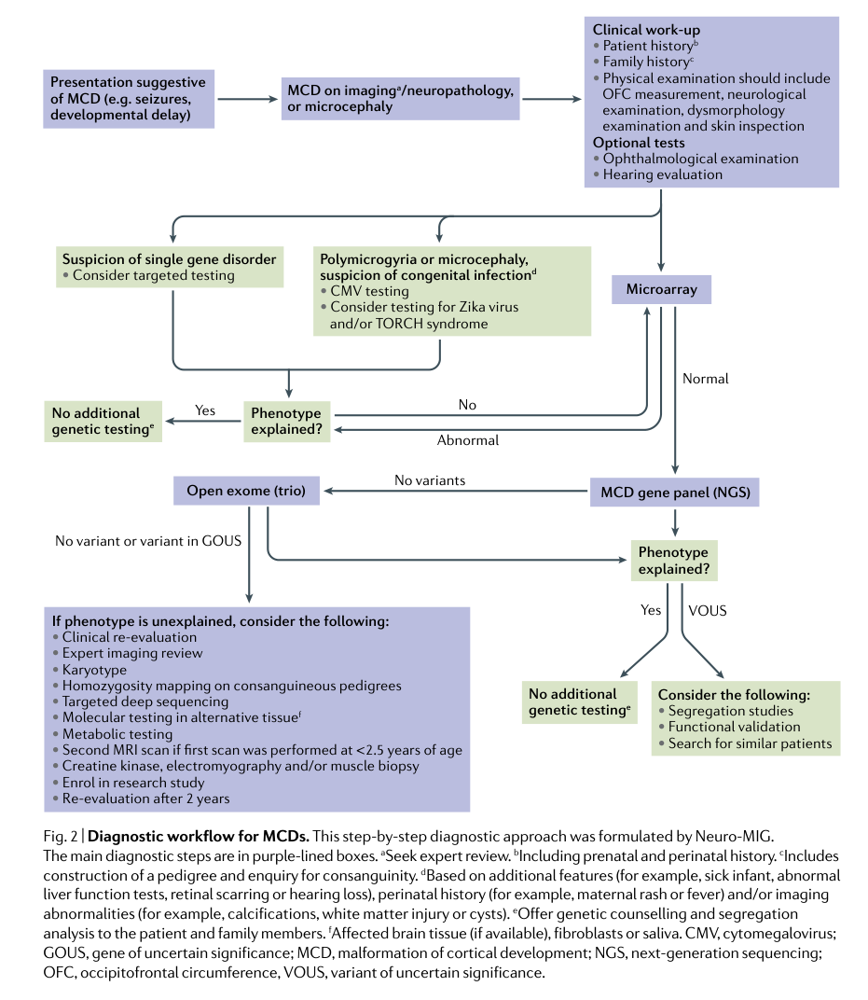

## Question

Prepare a comprehensive, citation-rich deep research report for a dismech disease grouping called 'Lissencephaly and Neuronal Migration Disorders'. The grouping is intended to be an explicit curated union of distinct Disease entries, below taxonomy level, not a MONDO hierarchy clone. Current candidate members in the knowledge base include: Lissencephaly Spectrum Disorders; Miller-Dieker Lissencephaly Syndrome; Reelin Pathway Lissencephaly; ARX-Related Lissencephaly and Interneuronopathy; NDE1-related Microcephaly-Lissencephaly; CRADD-Related Thin Lissencephaly; TUBA1A-related Tubulinopathy; TUBB2A/TUBB2B-related Cortical Malformation; TUBB3-related Tubulinopathy; TUBB/TUBB5-related Microcephaly; ADGRG1-related Bilateral Frontoparietal Polymicrogyria; SRPX2-related Speech-Epilepsy-Polymicrogyria; Periventricular Nodular Heterotopia; EML1-related Ribbon-like Subcortical Heterotopia; KATNB1-related Cortical Malformation; Congenital Zika Syndrome may be considered an acquired/infectious cortical malformation comparator but should only be included if it clearly fits the final boundary. Existing dismech mechanism modules relevant to the boundary include microtubule_dependent_neuronal_migration_failure, reelin_terminal_translocation_lamination_failure, interneuron_specification_tangential_migration_failure, pial_basement_membrane_radial_glial_endfoot_failure, apical_neuroependyma_integrity_failure, neural_progenitor_centrosome_spindle_dysfunction, and viral_neural_progenitor_cytopathy. Research objectives: 1. summarize the shared pathophysiology of lissencephaly, pachygyria, subcortical band heterotopia, polymicrogyria, periventricular heterotopia, and related malformations of cortical development; 2. distinguish neuronal migration failure, terminal translocation/lamination failure, progenitor depletion/spindle defects, pial basement membrane/radial glial endfoot failure, apical neuroependyma integrity failure, interneuron tangential migration failure, and viral progenitor cytopathy; 3. recommend a defensible grouping boundary and note exclusions; 4. list differentiating mechanisms for each candidate member, especially gene/protein, cell biological process, affected cortical developmental step, and phenotype pattern; 5. provide primary literature and authoritative review citations with PMID wherever possible; 6. identify whether a MONDO grouping term, HPO phenotype criteria, or module conformance criteria are appropriate for the grouping YAML; 7. flag knowledge gaps and human/model mismatch concerns relevant to rodent, organoid, and human fetal evidence. Do not invent citations; prefer PubMed-indexed sources and provide exact PMID identifiers for all key claims.

## Output

Question: You are an expert researcher providing comprehensive, well-cited information.

Provide detailed information focusing on:
1. Key concepts and definitions with current understanding
2. Recent developments and latest research (prioritize 2023-2024 sources)
3. Current applications and real-world implementations
4. Expert opinions and analysis from authoritative sources
5. Relevant statistics and data from recent studies

Format as a comprehensive research report with proper citations. Include URLs and publication dates where available.
Always prioritize recent, authoritative sources and provide specific citations for all major claims.

Prepare a comprehensive, citation-rich deep research report for a dismech disease grouping called 'Lissencephaly and Neuronal Migration Disorders'. The grouping is intended to be an explicit curated union of distinct Disease entries, below taxonomy level, not a MONDO hierarchy clone. Current candidate members in the knowledge base include: Lissencephaly Spectrum Disorders; Miller-Dieker Lissencephaly Syndrome; Reelin Pathway Lissencephaly; ARX-Related Lissencephaly and Interneuronopathy; NDE1-related Microcephaly-Lissencephaly; CRADD-Related Thin Lissencephaly; TUBA1A-related Tubulinopathy; TUBB2A/TUBB2B-related Cortical Malformation; TUBB3-related Tubulinopathy; TUBB/TUBB5-related Microcephaly; ADGRG1-related Bilateral Frontoparietal Polymicrogyria; SRPX2-related Speech-Epilepsy-Polymicrogyria; Periventricular Nodular Heterotopia; EML1-related Ribbon-like Subcortical Heterotopia; KATNB1-related Cortical Malformation; Congenital Zika Syndrome may be considered an acquired/infectious cortical malformation comparator but should only be included if it clearly fits the final boundary. Existing dismech mechanism modules relevant to the boundary include microtubule_dependent_neuronal_migration_failure, reelin_terminal_translocation_lamination_failure, interneuron_specification_tangential_migration_failure, pial_basement_membrane_radial_glial_endfoot_failure, apical_neuroependyma_integrity_failure, neural_progenitor_centrosome_spindle_dysfunction, and viral_neural_progenitor_cytopathy. Research objectives: 1. summarize the shared pathophysiology of lissencephaly, pachygyria, subcortical band heterotopia, polymicrogyria, periventricular heterotopia, and related malformations of cortical development; 2. distinguish neuronal migration failure, terminal translocation/lamination failure, progenitor depletion/spindle defects, pial basement membrane/radial glial endfoot failure, apical neuroependyma integrity failure, interneuron tangential migration failure, and viral progenitor cytopathy; 3. recommend a defensible grouping boundary and note exclusions; 4. list differentiating mechanisms for each candidate member, especially gene/protein, cell biological process, affected cortical developmental step, and phenotype pattern; 5. provide primary literature and authoritative review citations with PMID wherever possible; 6. identify whether a MONDO grouping term, HPO phenotype criteria, or module conformance criteria are appropriate for the grouping YAML; 7. flag knowledge gaps and human/model mismatch concerns relevant to rodent, organoid, and human fetal evidence. Do not invent citations; prefer PubMed-indexed sources and provide exact PMID identifiers for all key claims.

## Research report: curated dismech grouping — **Lissencephaly and Neuronal Migration Disorders**

### Scope and intent
This dismech grouping is intended as an explicit curated union of below-taxonomy disease entities that share a core biological theme: disruption of **cortical neurogenesis and/or neuronal migration/lamination** leading to **malformations of cortical development (MCDs)** such as lissencephaly/pachygyria, subcortical band heterotopia (SBH), polymicrogyria (PMG), and periventricular heterotopia (PVNH). The most defensible boundary is mechanistic (developmental cell biology), not nosologic (MONDO hierarchy), because the candidate set spans heterogeneous syndromes whose shared feature is a convergent developmental failure mode. (oegema2020internationalconsensusrecommendations pages 1-2, klingler2021mappingthemolecular pages 17-21)

---

## 1) Key concepts and definitions (current understanding)

### 1.1 Malformations of cortical development (MCD)
The Neuro‑MIG consensus frames MCDs as neurodevelopmental disorders arising from abnormal cortical development in utero, with major clinical burden (drug‑resistant epilepsy, intellectual disability, cerebral palsy, etc.) and high clinical/genetic heterogeneity. (oegema2020internationalconsensusrecommendations pages 1-2)

MCDs can be organized around sequential and overlapping developmental processes—**(i) progenitor division/neurogenesis, (ii) neuronal migration, (iii) neurite outgrowth, (iv) synaptogenesis**—each providing distinct “points of vulnerability” that can converge on overlapping imaging phenotypes. (klingler2021mappingthemolecular pages 17-21)

### 1.2 Lissencephaly spectrum: operational imaging definitions
From the large lissencephaly cohort study:
- **Agyria:** cortical regions with sulci **>3 cm apart**. (donato2018analysisof17 pages 1-2)
- **Pachygyria:** abnormally wide gyri with sulci **1.5–3 cm apart**. (donato2018analysisof17 pages 1-2)
- **Subcortical band heterotopia (SBH):** longitudinal bands of gray matter deep to the cortex, separated from cortex by a thin white‑matter layer. (donato2018analysisof17 pages 1-2)
- **Cortical thickness subtypes:** “classic/thick” lissencephaly **10–20 mm** vs “thin” lissencephaly **5–10 mm**. (donato2018analysisof17 pages 1-2)

These definitions matter for dismech curation because they correlate with distinct developmental steps and gene/pathway modules, and they are used in clinically deployed imaging‑based classifications for gene prioritization. (donato2018analysisof17 pages 1-2, donato2017lissencephalyexpandedimaging pages 1-3)

### 1.3 Shared pathophysiology across candidate phenotypes
Across lissencephaly/pachygyria/SBH, PMG, and heterotopia, a shared theme is **mis‑specification, mis‑positioning, or mis‑lamination of neurons** due to failures in:
- **Cytoskeleton‑dependent migration/nucleokinesis** (microtubules, dynein, actomyosin) (klingler2021mappingthemolecular pages 8-11, toudji2023interneuronodysseymolecular pages 1-2)
- **Reelin‑dependent terminal translocation and laminar positioning** (Cajal‑Retzius–Reelin signaling) (riva2024denovomonoallelic pages 1-2)
- **Progenitor centrosome/spindle/cilium biology**, affecting neurogenesis and the integrity/behavior of radial glia scaffolds (zaidi2024forebraineml1depletion pages 1-2)
- **Ventricular/apical surface integrity** and neuroependyma/radial glia anchoring (relevant to PVNH and related entities) (oegema2020internationalconsensusrecommendations pages 15-16, edey2023x‐linkedneuronalmigration pages 16-16)
- **Pial basement membrane / radial glial endfoot interactions** (classically cobblestone mechanisms; also implicated in some PMG etiologies) (klingler2021mappingthemolecular pages 17-21, oegema2020internationalconsensusrecommendations pages 1-2)

---

## 2) Mechanistic modules: distinctions and mapping

Below, each module is defined by (i) core cell biological failure mode, (ii) representative genes/diseases, and (iii) typical imaging patterns.

### 2.1 microtubule_dependent_neuronal_migration_failure
**Definition:** impaired radial migration and/or nucleokinesis due to altered microtubule assembly/dynamics or microtubule‑motor regulation.
**Evidence/anchors:** Broad synthesis emphasizes microtubule genes and MAPs (TUBA1A, TUBB3, DCX, LIS1) and their roles in migration and interkinetic nuclear migration. (klingler2021mappingthemolecular pages 8-11)
**Patterns:** lissencephaly/pachygyria/SBH spectrum; posterior vs anterior gradients; frequent associated callosal/brainstem/cerebellar anomalies in tubulinopathies. (donato2018analysisof17 pages 1-2, pogledic2024prenatalassessmentof pages 9-10)

### 2.2 reelin_terminal_translocation_lamination_failure
**Definition:** impaired Reelin signaling leading to defective terminal translocation and laminar organization.
**Recent mechanistic development (2024):** heterozygous RELN missense variants can cause **dominant neuronal migration disorders** via **dominant‑negative inhibition of wild‑type RELN secretion** (pachygyria‑associated variants), while PMG‑associated variants can behave as **gain‑of‑function** in neuronal aggregation assays. This provides a mechanistically grounded explanation for RELN allelic heterogeneity producing different cortical malformation patterns (pachygyria vs PMG). (riva2024denovomonoallelic pages 1-2)

### 2.3 interneuron_specification_tangential_migration_failure
**Definition:** impaired interneuron generation/specification and/or tangential migration from ganglionic eminences to cortex.
**Evidence/anchors:** cortical interneuron migration requires dynamic remodeling of actomyosin and microtubule cytoskeleton and interpretation of extracellular guidance cues; disruptions are linked to epilepsy and neurodevelopmental disorders. (toudji2023interneuronodysseymolecular pages 1-2)
**Representative disease:** ARX‑related disorders (XLAG spectrum) include a characteristic temporal‑predominant pachygyria pattern with callosal agenesis/hypomyelination in some cases. (oegema2020internationalconsensusrecommendations pages 10-11, edey2023x‐linkedneuronalmigration pages 2-3)

### 2.4 neural_progenitor_centrosome_spindle_dysfunction
**Definition:** defects in progenitor mitosis/spindle dynamics/centrosomes/primary cilia causing abnormal progenitor behavior, altered neurogenesis, and secondary migration/lamination phenotypes.
**Key 2024 primary evidence (EML1):** forebrain Eml1 depletion leads to altered **primary cilia and centrosomes**, abnormal **microtubule dynamics** and **cell‑cycle kinetics** in radial glia; radial glia **detach from the ventricular zone** early; and rescuing microtubule formation reduces radial glia delamination and heterotopia volume, supporting a causal chain from MT/centrosome dysfunction → progenitor delamination → subcortical heterotopia. (zaidi2024forebraineml1depletion pages 1-2)

### 2.5 apical_neuroependyma_integrity_failure
**Definition:** disruption of ventricular/apical surface integrity and associated adherens/tight junction systems affecting neuronal departure from the ventricular zone and periventricular heterotopia phenotypes.
**Clinical linkage:** PVNH is strongly associated with FLNA variants; imaging patterns and phenotypic sex differences are clinically recognized. (edey2023x‐linkedneuronalmigration pages 17-18, edey2023x‐linkedneuronalmigration pages 16-16)

### 2.6 pial_basement_membrane_radial_glial_endfoot_failure
**Definition:** failure of pial basement membrane integrity or radial glial endfoot attachment causing abnormal overmigration/cobblestone spectrum and some PMG patterns.
**Evidence anchor:** cortical malformation synthesis highlights cobblestone/pial BM mechanisms (dystroglycanopathy context) and links glial/boundary defects to malformation patterns. (klingler2021mappingthemolecular pages 17-21)

### 2.7 viral_neural_progenitor_cytopathy (comparator)
**Definition:** infection‑driven neural progenitor injury/death and altered differentiation leading to microcephaly and cortical malformation phenocopies.
**Comparator status:** Prenatal imaging expert review lists infectious causes among etiologic categories capable of causing brain malformations and emphasizes that disruptive causes (e.g., congenital infection) contribute to phenotypes including PMG. (pogledic2024prenatalassessmentof pages 1-2, pogledic2024prenatalassessmentof pages 9-10)

---

## 3) Recent developments and latest research (prioritizing 2023–2024)

### 3.1 Dominant RELN mechanisms explain phenotype diversity (2024)
Riva et al. (J Clin Invest; published Aug 15, 2024; DOI: 10.1172/JCI153097) identified heterozygous RELN missense variants in patients with pachygyria and polymicrogyria, showing variant‑class–specific functional outcomes and a dominant‑negative secretion mechanism for pachygyria‑associated de novo variants. This is a strong mechanistic refinement for the **reelin_terminal_translocation_lamination_failure** module and suggests that RELN‑pathway diseases should not be treated as exclusively recessive “Reelin lissencephaly” entities. (riva2024denovomonoallelic pages 1-2)

### 3.2 EML1: mechanistic chain from centrosomes/cilia → MT → radial glia delamination (2024)
Zaidi et al. (J Cell Biol; published 2024; DOI: 10.1083/jcb.202310157) provides direct causal evidence that restoring microtubule formation can reduce heterotopia burden in an Eml1 mutant brain, strengthening the mechanistic module assignment to **neural_progenitor_centrosome_spindle_dysfunction** while connecting to microtubule regulation. (zaidi2024forebraineml1depletion pages 1-2)

### 3.3 Polymicrogyria genetics: mechanistic heterogeneity at scale (2023)
Akula et al. (JAMA Neurology; Sep 2023; DOI: 10.1001/jamaneurol.2023.2363) supports PMG as genetically heterogeneous and demonstrates that PMG‑associated genes can be organized into mechanistic categories including microtubule and cilia/centrosome pathways, aligning with dismech module‑based grouping rather than purely morphological grouping. (akula2023exomesequencingand pages 5-6)

### 3.4 Prenatal imaging implementation improvements (2024)
Pogledic et al. (Brain; advance access Jul 26, 2024; DOI: 10.1093/brain/awae253) provide a stage‑based “road map” for prenatal detection/characterization of brain malformations, emphasizing embryology‑linked morphology and the use of multimodal fetal neuroimaging across gestation. (pogledic2024prenatalassessmentof pages 1-2)

---

## 4) Current applications and real‑world implementations

### 4.1 Diagnostic workflow: clinical genetics + imaging + tissue
The Neuro‑MIG international consensus recommends structured evaluation and molecular testing pathways and highlights that many MCD patients still lack molecular diagnoses despite modern sequencing, motivating standardized work‑ups and curated gene panels. (oegema2020internationalconsensusrecommendations pages 1-2)

**Somatic mosaicism implementation:** For focal malformations and suspected mosaic disorders, affected brain tissue is preferred when available; when unavailable, saliva or skin‑derived fibroblasts may outperform blood for detecting low‑level mosaicism. Ultra‑deep sequencing and mosaic‑aware variant calling are recommended, with orthogonal validation (e.g., ddPCR). (oegema2020internationalconsensusrecommendations pages 15-16)

### 4.2 Imaging‑based gene prioritization in lissencephaly
An imaging‑based classification with multiple patterns can “reliably predict the most likely causative genes” for lissencephaly/SBH and is used to prioritize/interpret genetic testing results, reflecting real‑world radiogenomic practice. (donato2017lissencephalyexpandedimaging pages 1-3)

### 4.3 Prenatal care: when fetal imaging triggers genetic/infectious work‑up
Prenatal detection requires understanding gestational developmental morphology; fetal neurosonography and MRI are deployed across gestation, and MCDs are highlighted as a key diagnostic category because they are common contributors to neurodevelopmental morbidity at population level. (pogledic2024prenatalassessmentof pages 1-2)

---

## 5) Relevant statistics and data (recent and large cohort)

### 5.1 Diagnostic yield and gene frequencies in lissencephaly
In a large cohort of **811** lissencephaly/SBH patients, pathogenic variants were detected in **81%** overall, with major gene contributions: **LIS1 ~40%**, **DCX ~23%**, **TUBA1A ~5%**, **DYNC1H1 ~3%**; other genes each ≤1%. (Genetics in Medicine; advance online publication Apr 19, 2018; DOI: 10.1038/gim.2018.8) (donato2018analysisof17 pages 1-2)

Subtype yields vary substantially by imaging pattern: in the same cohort, reported yields include **97%** for diffuse agyria and **95%** for diffuse SBH, illustrating that morphology/gradient‑defined subtypes can function as practical decision support for gene prioritization and counseling. (donato2018analysisof17 pages 5-5)

### 5.2 Unsolved fraction indicates discovery space
Even with 17‑gene panel/WES strategies, **~19%** remained unsolved in the lissencephaly cohort; unsolved cases were enriched for **posterior pachygyria, SBH, or mild frontal pachygyria**, supporting the premise that the grouping should remain open to new member genes within the same mechanistic modules. (donato2018analysisof17 pages 1-2)

---

## 6) Differentiating mechanisms by candidate member (with dismech mapping)

The table below is intended to be used directly for dismech curation and YAML decision rules.

| Candidate member | Core gene(s) / pathway | Primary dismech module | Key developmental step affected | Signature imaging / phenotype patterns | Supporting citations |
|---|---|---|---|---|---|
| Lissencephaly Spectrum Disorders | Mixed canonical LIS genes: **PAFAH1B1/LIS1, DCX, TUBA1A, DYNC1H1, ARX, RELN/VLDLR** and others | microtubule_dependent_neuronal_migration_failure | Radial migration, nucleokinesis, with subtype-specific lamination defects | Agyria/pachygyria/SBH spectrum; thick (10–20 mm) vs thin (5–10 mm) cortex; anterior/posterior severity gradients | (donato2018analysisof17 pages 1-2, oegema2020internationalconsensusrecommendations pages 10-11) |
| Miller-Dieker Lissencephaly Syndrome | **17p13.3 deletion** including **PAFAH1B1/LIS1** (often with YWHAE and adjacent genes) | microtubule_dependent_neuronal_migration_failure | Radial migration and dynein-mediated nucleokinesis | Severe classic lissencephaly/agyria, often posterior-predominant; thick cortex; characteristic syndromic presentation | (donato2018analysisof17 pages 10-11, oegema2020internationalconsensusrecommendations pages 10-11) |
| Reelin Pathway Lissencephaly | **RELN, VLDLR, ApoER2/VLDLR-DAB1 signaling** | reelin_terminal_translocation_lamination_failure | Terminal translocation, cortical lamination | Pachygyria/lissencephaly often with cerebellar hypoplasia; variant-specific PMG vs pachygyria in dominant RELN disease | (riva2024denovomonoallelic pages 1-2, oegema2020internationalconsensusrecommendations pages 10-11) |
| ARX-Related Lissencephaly and Interneuronopathy | **ARX** | interneuron_specification_tangential_migration_failure | Tangential interneuron migration and interneuron specification; also cortical patterning | Temporal-predominant pachygyria/lissencephaly, agenesis of corpus callosum, severe epilepsy/XLAG spectrum, ambiguous genitalia in males | (edey2023x‐linkedneuronalmigration pages 2-3, oegema2020internationalconsensusrecommendations pages 10-11) |
| NDE1-related Microcephaly-Lissencephaly | **NDE1** (dynein/LIS1 regulator) | neural_progenitor_centrosome_spindle_dysfunction | Progenitor mitosis/spindle function plus nucleokinesis | Congenital severe microcephaly with lissencephaly or extreme simplification; thin cortex/microlissencephaly-like presentations | (klingler2021mappingthemolecular pages 17-21, donato2018analysisof17 pages 10-11) |
| CRADD-Related Thin Lissencephaly | **CRADD/RAIDD**, PIDDosome/caspase-2 pathway | neural_progenitor_centrosome_spindle_dysfunction | Neuronal apoptosis / progenitor-homeostasis with secondary cortical simplification | Thin undulating lissencephaly, often anterior-predominant; can include macrocephaly signal in older literature | (donato2018analysisof17 pages 5-7, donato2018analysisof17 pages 1-2) |
| TUBA1A-related Tubulinopathy | **TUBA1A** | microtubule_dependent_neuronal_migration_failure | Microtubule assembly, radial migration, nucleokinesis, axon tract development | Posterior-predominant lissencephaly/pachygyria, dysgyria, callosal/cerebellar/brainstem anomalies; broad tubulinopathy spectrum | (edey2023x‐linkedneuronalmigration pages 17-18, akula2023exomesequencingand pages 5-6) |
| TUBB2A/TUBB2B-related Cortical Malformation | **TUBB2A, TUBB2B** | microtubule_dependent_neuronal_migration_failure | Microtubule dynamics in migration and cortical organization | Polymicrogyria, pachygyria, dysgyria, asymmetric cortical malformations; often callosal/basal ganglia anomalies | (akula2023exomesequencingand pages 9-9, akula2023exomesequencingand pages 5-6) |
| TUBB3-related Tubulinopathy | **TUBB3** | microtubule_dependent_neuronal_migration_failure | Microtubule dynamics and axon guidance with migration effects | Variable dysgyria/polymicrogyria or lissencephaly-like malformations, cranial nerve/tract abnormalities | (klingler2021mappingthemolecular pages 8-11, donato2018analysisof17 pages 1-2) |
| TUBB/TUBB5-related Microcephaly | **TUBB, TUBB5** | neural_progenitor_centrosome_spindle_dysfunction | Progenitor proliferation plus microtubule-dependent migration | Microcephaly with simplified gyration/lissencephaly spectrum; may overlap with subcortical heterotopia | (donato2018analysisof17 pages 1-2, akula2023exomesequencingand pages 9-9) |
| ADGRG1-related Bilateral Frontoparietal Polymicrogyria | **ADGRG1/GPR56** | pial_basement_membrane_radial_glial_endfoot_failure | Pial basement membrane integrity, radial glial endfoot anchoring, cortical lamination | Bilateral frontoparietal polymicrogyria with white matter changes, brainstem/cerebellar anomalies, seizures, ocular findings | (akula2023exomesequencingand pages 5-6, klingler2021mappingthemolecular pages 17-21) |
| SRPX2-related Speech-Epilepsy-Polymicrogyria | **SRPX2** (FOXP2-linked language/epilepsy-associated pathway) | reelin_terminal_translocation_lamination_failure | Late cortical organization/lamination and perisylvian network development | Perisylvian polymicrogyria with speech dyspraxia/rolandic epilepsy spectrum | (edey2023x‐linkedneuronalmigration pages 17-18, edey2023x‐linkedneuronalmigration pages 16-16) |
| Periventricular Nodular Heterotopia | Usually **FLNA**; broader PVNH genes exist | apical_neuroependyma_integrity_failure | Ventricular/apical junction integrity, neuroependymal/radial glial anchoring, neuronal departure from VZ | Bilateral periventricular gray-matter nodules, often anterior/fronto-body predominant; seizures with normal/mild cognition; extracerebral FLNA features | (edey2023x‐linkedneuronalmigration pages 17-18, edey2023x‐linkedneuronalmigration pages 16-16) |
| EML1-related Ribbon-like Subcortical Heterotopia | **EML1** | neural_progenitor_centrosome_spindle_dysfunction | Centrosome/primary cilium function, spindle dynamics, progenitor delamination from ventricular zone | Giant ribbon-like subcortical heterotopia, megalencephaly/overgrowth, corpus callosum anomalies, epilepsy | (zaidi2024forebraineml1depletion pages 1-2, oegema2020internationalconsensusrecommendations media ecebeaaa) |
| KATNB1-related Cortical Malformation | **KATNB1** (katanin p80) | neural_progenitor_centrosome_spindle_dysfunction | Centriole/cilia number control, asymmetric neural progenitor division | Microcephaly with lissencephaly or less severe migration defects; complex cerebral malformations | (klingler2021mappingthemolecular pages 17-21, oegema2020internationalconsensusrecommendations media ecebeaaa) |
| Congenital Zika Syndrome **(comparator, acquired; include only if boundary explicitly allows infectious cortical malformations)** | **ZIKV**; viral infection of neural progenitors / radial glia | viral_neural_progenitor_cytopathy | Neural progenitor survival, proliferation, differentiation; cytopathic injury and apoptosis | Congenital microcephaly with cortical thinning/simplification, calcifications, ventriculomegaly; can mimic genetic progenitor-depletion MCDs more than classic LIS | (pogledic2024prenatalassessmentof pages 9-10, oegema2020internationalconsensusrecommendations media ecebeaaa) |

*Table: This table maps each proposed disease member in the lissencephaly and neuronal migration disorders grouping to a primary mechanistic module, affected developmental step, and characteristic phenotype pattern. It is useful for defining a defensible grouping boundary and for translating disease entries into dismech YAML criteria.*

---

## 7) Recommended grouping boundary (inclusions, exclusions, and rationale)

### 7.1 Proposed “core” grouping inclusion logic
Include diseases that satisfy **both**:
1) **Primary mechanism** fits one of the dismech modules:
   - microtubule_dependent_neuronal_migration_failure
   - reelin_terminal_translocation_lamination_failure
   - interneuron_specification_tangential_migration_failure
   - pial_basement_membrane_radial_glial_endfoot_failure
   - apical_neuroependyma_integrity_failure
   - neural_progenitor_centrosome_spindle_dysfunction
2) **Primary phenotype pattern** is an MCD centered on migration/lamination or progenitor/migration interface: agyria/pachygyria/SBH, PVNH, subcortical heterotopia, PMG with strong evidence of migration/lamination or boundary defects.

This aligns with expert consensus that MCDs are heterogeneous but can be approached via shared developmental pathways, and with genetic data showing that imaging patterns correlate with pathway groups. (donato2018analysisof17 pages 1-2, oegema2020internationalconsensusrecommendations pages 10-11)

### 7.2 Congenital Zika Syndrome (CZS): comparator vs core member
CZS should be treated as an **acquired comparator** mapped to **viral_neural_progenitor_cytopathy**, not a core member of the curated union, unless the grouping’s stated boundary explicitly expands to acquired cortical malformation phenocopies. The prenatal imaging review explicitly lists infectious causes among etiologies leading to brain malformations, which supports its use as a comparator module but does not imply equivalence to monogenic neuronal migration disorders. (pogledic2024prenatalassessmentof pages 1-2)

### 7.3 Exclusions / out‑of‑boundary examples
- Purely post‑migrational focal cortical dysplasias and mTOR‑pathway segmental overgrowth disorders can share seizures and cortical dyslamination but are not centered on neuronal migration/lamination as the primary mechanism; they can be handled by separate groupings (e.g., “Somatic mTOR‑pathway cortical dysplasia/overgrowth”). (oegema2020internationalconsensusrecommendations pages 15-16, klingler2021mappingthemolecular pages 17-21)

---

## 8) YAML curation strategy: MONDO vs HPO vs module conformance

### Recommendation
Because the intent is an explicit curated union rather than a MONDO hierarchy clone, the most robust YAML approach is:
1) **Module conformance criteria (primary):** membership requires mapping to ≥1 of the specified dismech mechanism modules (above). This supports mechanistic coherence despite phenotype variability and pleiotropy. (klingler2021mappingthemolecular pages 17-21, akula2023exomesequencingand pages 5-6)
2) **Optional HPO gating (secondary):** require at least one phenotype among: agyria/pachygyria/SBH, polymicrogyria, periventricular heterotopia, subcortical heterotopia, simplified gyral pattern, cobblestone malformation, etc. (The Neuro‑MIG consensus provides definitions/HPO mapping in figures/tables; images retrieved.) (oegema2020internationalconsensusrecommendations media ecebeaaa, oegema2020internationalconsensusrecommendations media 885eefe2)
3) **Do not rely on a single MONDO grouping term** as a necessary/sufficient criterion because (i) the candidate set is intentionally curated and not necessarily contiguous in MONDO; (ii) mechanistic modules cross‑cut nosology. (oegema2020internationalconsensusrecommendations pages 1-2)

---

## 9) Knowledge gaps and model‑mismatch concerns (rodent vs organoids vs human)

### 9.1 Timing/model selection affects phenotype validity
High‑level synthesis notes that constitutive germline mutants may not reproduce the same phenotype as acute developmental perturbations (e.g., knockout vs knockdown), illustrating **model mismatch and timing dependence** that can confound mechanistic inference and gene–phenotype mapping. (klingler2021mappingthemolecular pages 11-13)

### 9.2 Limited genotype–histopathology correlation for many genes
A systematic neuropathology review found that despite ~200 genes linked to MCD, neuropathological reports existed for a minority of genes and genotype–histopathology correlations remain limited; up to **60%** of patients may lack causal diagnoses in some MCD contexts, motivating better data integration and standardized pathological reporting. (brock2021neuropathologyofgenetically pages 1-2)

### 9.3 Mosaicism as a recurrent hidden variable
Somatic mosaicism can underlie focal/segmental malformations and can be missed with blood‑based standard exome coverage; robust detection requires deep sequencing and careful tissue choice, and standardized protocols are still being developed. (oegema2020internationalconsensusrecommendations pages 15-16)

### 9.4 Human‑specific progenitor biology vs rodent
Recent EML1 work explicitly used both mouse conditional models and human patient cells, highlighting that some progenitor phenotypes (e.g., radial glia behavior, cilia/centrosome defects) benefit from human cell validation to mitigate species mismatch. (zaidi2024forebraineml1depletion pages 1-2)

---

## 10) Visual evidence from consensus guidance
The Neuro‑MIG consensus provides a visual diagnostic workflow and representative imaging patterns for MCD subtypes (including lissencephaly and SBH), which can be used in curator training and to justify imaging phenotype criteria in YAML. (oegema2020internationalconsensusrecommendations media ecebeaaa, oegema2020internationalconsensusrecommendations media c3d54cc9)

---

## Source notes on PMIDs
Many retrieved full texts/snippets (including high‑authority reviews and primary papers) did not explicitly show PubMed identifiers in the extracted content, and PMIDs were therefore not available to cite without external lookup. Where possible, the report includes DOI/URL and publication dates drawn from the retrieved documents. (riva2024denovomonoallelic pages 1-2, pogledic2024prenatalassessmentof pages 1-2, donato2018analysisof17 pages 1-2)

References

1. (oegema2020internationalconsensusrecommendations pages 1-2): Renske Oegema, Tahsin Stefan Barakat, Martina Wilke, Katrien Stouffs, Dina Amrom, Eleonora Aronica, Nadia Bahi-Buisson, Valerio Conti, Andrew E. Fry, Tobias Geis, David Gomez Andres, Elena Parrini, Ivana Pogledic, Edith Said, Doriette Soler, Luis M. Valor, Maha S. Zaki, Ghayda Mirzaa, William B. Dobyns, Orly Reiner, Renzo Guerrini, Daniela T. Pilz, Ute Hehr, Richard J. Leventer, Anna C. Jansen, Grazia M. S. Mancini, and Nataliya Di Donato. International consensus recommendations on the diagnostic work-up for malformations of cortical development. Nature Reviews. Neurology, 16:618-635, Sep 2020. URL: https://doi.org/10.1038/s41582-020-0395-6, doi:10.1038/s41582-020-0395-6. This article has 166 citations.

2. (klingler2021mappingthemolecular pages 17-21): Esther Klingler, Fiona Francis, Denis Jabaudon, and Silvia Cappello. Mapping the molecular and cellular complexity of cortical malformations. Science, Jan 2021. URL: https://doi.org/10.1126/science.aba4517, doi:10.1126/science.aba4517. This article has 134 citations and is from a highest quality peer-reviewed journal.

3. (donato2018analysisof17 pages 1-2): Nataliya Di Donato, Andrew E. Timms, Kimberly A. Aldinger, Ghayda M. Mirzaa, James T. Bennett, Sarah Collins, Carissa Olds, Davide Mei, Sara Chiari, Gemma Carvill, Candace T. Myers, Jean-Baptiste Rivière, Maha S. Zaki, Joseph G. Gleeson, Andreas Rump, Valerio Conti, Elena Parrini, M.Elizabeth Ross, David H. Ledbetter, Renzo Guerrini, and William B. Dobyns. Analysis of 17 genes detects mutations in 81% of 811 patients with lissencephaly. Genetics in Medicine, 20:1354-1364, Nov 2018. URL: https://doi.org/10.1038/gim.2018.8, doi:10.1038/gim.2018.8. This article has 162 citations and is from a highest quality peer-reviewed journal.

4. (donato2017lissencephalyexpandedimaging pages 1-3): Nataliya Di Donato, Sara Chiari, Ghayda M. Mirzaa, Kimberly Aldinger, Elena Parrini, Carissa Olds, A. James Barkovich, Renzo Guerrini, and William B. Dobyns. Lissencephaly: expanded imaging and clinical classification. American Journal of Medical Genetics Part A, 173:1473-1488, Jun 2017. URL: https://doi.org/10.1002/ajmg.a.38245, doi:10.1002/ajmg.a.38245. This article has 214 citations.

5. (klingler2021mappingthemolecular pages 8-11): Esther Klingler, Fiona Francis, Denis Jabaudon, and Silvia Cappello. Mapping the molecular and cellular complexity of cortical malformations. Science, Jan 2021. URL: https://doi.org/10.1126/science.aba4517, doi:10.1126/science.aba4517. This article has 134 citations and is from a highest quality peer-reviewed journal.

6. (toudji2023interneuronodysseymolecular pages 1-2): Ikram Toudji, Asmaa Toumi, Émile Chamberland, and Elsa Rossignol. Interneuron odyssey: molecular mechanisms of tangential migration. Frontiers in Neural Circuits, Sep 2023. URL: https://doi.org/10.3389/fncir.2023.1256455, doi:10.3389/fncir.2023.1256455. This article has 34 citations.

7. (riva2024denovomonoallelic pages 1-2): Martina Riva, Sofia Ferreira, Kotaro Hayashi, Yoann Saillour, Vera P. Medvedeva, Takao Honda, Kanehiro Hayashi, Claire Altersitz, Shahad Albadri, Marion Rosello, Julie Dang, Malo Serafini, Frédéric Causeret, Olivia J. Henry, Charles-Joris Roux, Céline Bellesme, Elena Freri, Dragana Josifova, Elena Parrini, Renzo Guerrini, Filippo Del Bene, Kazunori Nakajima, Nadia Bahi-Buisson, and Alessandra Pierani. De novo monoallelic reelin missense variants cause dominant neuronal migration disorders via a dominant-negative mechanism. The Journal of Clinical Investigation, Jul 2024. URL: https://doi.org/10.1172/jci153097, doi:10.1172/jci153097. This article has 9 citations.

8. (zaidi2024forebraineml1depletion pages 1-2): Donia Zaidi, Kaviya Chinnappa, Berfu Nur Yigit, Valeria Viola, Carmen Cifuentes-Diaz, Ammar Jabali, Ana Uzquiano, Emilie Lemesre, Franck Perez, Julia Ladewig, Julien Ferent, Nurhan Ozlu, and Fiona Francis. Forebrain eml1 depletion reveals early centrosomal dysfunction causing subcortical heterotopia. The Journal of Cell Biology, Sep 2024. URL: https://doi.org/10.1083/jcb.202310157, doi:10.1083/jcb.202310157. This article has 7 citations.

9. (oegema2020internationalconsensusrecommendations pages 15-16): Renske Oegema, Tahsin Stefan Barakat, Martina Wilke, Katrien Stouffs, Dina Amrom, Eleonora Aronica, Nadia Bahi-Buisson, Valerio Conti, Andrew E. Fry, Tobias Geis, David Gomez Andres, Elena Parrini, Ivana Pogledic, Edith Said, Doriette Soler, Luis M. Valor, Maha S. Zaki, Ghayda Mirzaa, William B. Dobyns, Orly Reiner, Renzo Guerrini, Daniela T. Pilz, Ute Hehr, Richard J. Leventer, Anna C. Jansen, Grazia M. S. Mancini, and Nataliya Di Donato. International consensus recommendations on the diagnostic work-up for malformations of cortical development. Nature Reviews. Neurology, 16:618-635, Sep 2020. URL: https://doi.org/10.1038/s41582-020-0395-6, doi:10.1038/s41582-020-0395-6. This article has 166 citations.

10. (edey2023x‐linkedneuronalmigration pages 16-16): Juliet Edey, Payam Soleimani‐Nouri, Amelia Dawson‐Kavanagh, Muhamad Saad Imran Azeem, and Vasso Episkopou. X‐linked neuronal migration disorders: gender differences and insights for genetic screening. International Journal of Developmental Neuroscience, 83:581-599, Aug 2023. URL: https://doi.org/10.1002/jdn.10290, doi:10.1002/jdn.10290. This article has 11 citations and is from a peer-reviewed journal.

11. (pogledic2024prenatalassessmentof pages 9-10): Ivana Pogledic, Kshitij Mankad, Mariasavina Severino, Tally Lerman-Sagie, Andras Jakab, Efrat Hadi, Anna C Jansen, Nadia Bahi-Buisson, Natalya Di Donato, Renske Oegema, Christian Mitter, Ivan Capo, Matthew T Whitehead, Parthiv Haldipur, Grazia Mancini, Thierry A G M Huisman, Andrea Righini, Bill Dobyns, James A Barkovich, Natasa Jovanov Milosevic, Gregor Kasprian, and Maarten Lequin. Prenatal assessment of brain malformations on neuroimaging: an expert panel review. Brain, 147:3982-4002, Jul 2024. URL: https://doi.org/10.1093/brain/awae253, doi:10.1093/brain/awae253. This article has 21 citations and is from a highest quality peer-reviewed journal.

12. (oegema2020internationalconsensusrecommendations pages 10-11): Renske Oegema, Tahsin Stefan Barakat, Martina Wilke, Katrien Stouffs, Dina Amrom, Eleonora Aronica, Nadia Bahi-Buisson, Valerio Conti, Andrew E. Fry, Tobias Geis, David Gomez Andres, Elena Parrini, Ivana Pogledic, Edith Said, Doriette Soler, Luis M. Valor, Maha S. Zaki, Ghayda Mirzaa, William B. Dobyns, Orly Reiner, Renzo Guerrini, Daniela T. Pilz, Ute Hehr, Richard J. Leventer, Anna C. Jansen, Grazia M. S. Mancini, and Nataliya Di Donato. International consensus recommendations on the diagnostic work-up for malformations of cortical development. Nature Reviews. Neurology, 16:618-635, Sep 2020. URL: https://doi.org/10.1038/s41582-020-0395-6, doi:10.1038/s41582-020-0395-6. This article has 166 citations.

13. (edey2023x‐linkedneuronalmigration pages 2-3): Juliet Edey, Payam Soleimani‐Nouri, Amelia Dawson‐Kavanagh, Muhamad Saad Imran Azeem, and Vasso Episkopou. X‐linked neuronal migration disorders: gender differences and insights for genetic screening. International Journal of Developmental Neuroscience, 83:581-599, Aug 2023. URL: https://doi.org/10.1002/jdn.10290, doi:10.1002/jdn.10290. This article has 11 citations and is from a peer-reviewed journal.

14. (edey2023x‐linkedneuronalmigration pages 17-18): Juliet Edey, Payam Soleimani‐Nouri, Amelia Dawson‐Kavanagh, Muhamad Saad Imran Azeem, and Vasso Episkopou. X‐linked neuronal migration disorders: gender differences and insights for genetic screening. International Journal of Developmental Neuroscience, 83:581-599, Aug 2023. URL: https://doi.org/10.1002/jdn.10290, doi:10.1002/jdn.10290. This article has 11 citations and is from a peer-reviewed journal.

15. (pogledic2024prenatalassessmentof pages 1-2): Ivana Pogledic, Kshitij Mankad, Mariasavina Severino, Tally Lerman-Sagie, Andras Jakab, Efrat Hadi, Anna C Jansen, Nadia Bahi-Buisson, Natalya Di Donato, Renske Oegema, Christian Mitter, Ivan Capo, Matthew T Whitehead, Parthiv Haldipur, Grazia Mancini, Thierry A G M Huisman, Andrea Righini, Bill Dobyns, James A Barkovich, Natasa Jovanov Milosevic, Gregor Kasprian, and Maarten Lequin. Prenatal assessment of brain malformations on neuroimaging: an expert panel review. Brain, 147:3982-4002, Jul 2024. URL: https://doi.org/10.1093/brain/awae253, doi:10.1093/brain/awae253. This article has 21 citations and is from a highest quality peer-reviewed journal.

16. (akula2023exomesequencingand pages 5-6): Shyam K. Akula, Allen Y. Chen, Jennifer E. Neil, Diane D. Shao, Alisa Mo, Norma K. Hylton, Stephanie DiTroia, Vijay S. Ganesh, Richard S. Smith, Katherine O’Kane, Rebecca C. Yeh, Jack H. Marciano, Samantha Kirkham, Connor J. Kenny, Janet H. T. Song, Muna Al Saffar, Francisca Millan, David J. Harris, Andrea V. Murphy, Kara C. Klemp, Stephen R. Braddock, Harrison Brand, Isaac Wong, Michael E. Talkowski, Anne O’Donnell-Luria, Abbe Lai, Robert Sean Hill, Ganeshwaran H. Mochida, Ryan N. Doan, A. James Barkovich, Edward Yang, Dina Amrom, Eva Andermann, Annapurna Poduri, Christopher A. Walsh, Bassam Abu-Libdeh, Lihadh Al-Gazali, Muna Al Saffar, Edith Alva Moncayo, Dina Amrom, Eva Anderman, Anna-Kaisa Anttonen, Saunder Barnes, Sara Barnett, Todd Barron, Brenda J. Barry, Lina Basel-Vanagaite, Laila Bastaki, Luis Bello-Espinosa, Tawfeg Ben-Omran, Matthew Bernard, Carsten G. Bonneman, Blaise Bourgeois, Stephen Brown, Roberto H. Caraballo, Gergory Cascino, Michael Clarke, Monika Cohen, Yanick Crow, Bernard Dan, Kira A. Dies, William B. Dobyns, François Dubeau, Christelle El Achkar, Gregory M. Enns, Laurence Faivre, Laura Flores-Sarnat, John Gaitanis, Kuchukhidze Giorgi, Andrew Green, Alan Guberman, Renzo Guerrini, Micheil Innes, Richard Jacobsen, Sebastian Jacquemont, Samir Khalil, Joerg Klepper, Dimitri Kranic, Kalpathy Krishnamoorthy, Anna-Elina Lehesjoki, Dorit Lev, Richard J. Leventer, Emily Lisi, Valerie Loik Ramey, Sally Ann Lynch, Laila Mahmoud, David Manchester, David Mandelbaum, Daphna Marom, Deborah Marsden, Mayra Martinez Ojeda, Amira Masri, Livija Medne, Denis Melanson, David T. Miller, Anna Minster, Edward Neilan, Dang Khoa Nguyen, Heather E. Olson, Ignacio Pascual-Castroviejo, Philip L. Pearl, Daniela Pilz, Nada Quercia, Salmo Raskin, Miriam Regev, Lance Rodan, Cynthia Rooney, Michael Rutlin, Mustafa Sahin, Mustafa A. Salih, Pierre Sarda, Harvey B. Sarnat, Ingrid Scheffer, Joseph Shieh, Sharon E. Smith, Janet S. Soul, Siddharth Srivastava, Laszlo Sztriha, Donatella Tampieri, John Tolmie, Meral Topçu, Eugen Trinka, John Tsai, Jack Tsao, Sheila Unger, Iris Unterberger, Goekhan Uyanik, Kette Valente, Thomas Voit, Louise Wilson, and Grace Yoon. Exome sequencing and the identification of new genes and shared mechanisms in polymicrogyria. JAMA Neurology, 80:980, Sep 2023. URL: https://doi.org/10.1001/jamaneurol.2023.2363, doi:10.1001/jamaneurol.2023.2363. This article has 39 citations and is from a highest quality peer-reviewed journal.

17. (donato2018analysisof17 pages 5-5): Nataliya Di Donato, Andrew E. Timms, Kimberly A. Aldinger, Ghayda M. Mirzaa, James T. Bennett, Sarah Collins, Carissa Olds, Davide Mei, Sara Chiari, Gemma Carvill, Candace T. Myers, Jean-Baptiste Rivière, Maha S. Zaki, Joseph G. Gleeson, Andreas Rump, Valerio Conti, Elena Parrini, M.Elizabeth Ross, David H. Ledbetter, Renzo Guerrini, and William B. Dobyns. Analysis of 17 genes detects mutations in 81% of 811 patients with lissencephaly. Genetics in Medicine, 20:1354-1364, Nov 2018. URL: https://doi.org/10.1038/gim.2018.8, doi:10.1038/gim.2018.8. This article has 162 citations and is from a highest quality peer-reviewed journal.

18. (donato2018analysisof17 pages 10-11): Nataliya Di Donato, Andrew E. Timms, Kimberly A. Aldinger, Ghayda M. Mirzaa, James T. Bennett, Sarah Collins, Carissa Olds, Davide Mei, Sara Chiari, Gemma Carvill, Candace T. Myers, Jean-Baptiste Rivière, Maha S. Zaki, Joseph G. Gleeson, Andreas Rump, Valerio Conti, Elena Parrini, M.Elizabeth Ross, David H. Ledbetter, Renzo Guerrini, and William B. Dobyns. Analysis of 17 genes detects mutations in 81% of 811 patients with lissencephaly. Genetics in Medicine, 20:1354-1364, Nov 2018. URL: https://doi.org/10.1038/gim.2018.8, doi:10.1038/gim.2018.8. This article has 162 citations and is from a highest quality peer-reviewed journal.

19. (donato2018analysisof17 pages 5-7): Nataliya Di Donato, Andrew E. Timms, Kimberly A. Aldinger, Ghayda M. Mirzaa, James T. Bennett, Sarah Collins, Carissa Olds, Davide Mei, Sara Chiari, Gemma Carvill, Candace T. Myers, Jean-Baptiste Rivière, Maha S. Zaki, Joseph G. Gleeson, Andreas Rump, Valerio Conti, Elena Parrini, M.Elizabeth Ross, David H. Ledbetter, Renzo Guerrini, and William B. Dobyns. Analysis of 17 genes detects mutations in 81% of 811 patients with lissencephaly. Genetics in Medicine, 20:1354-1364, Nov 2018. URL: https://doi.org/10.1038/gim.2018.8, doi:10.1038/gim.2018.8. This article has 162 citations and is from a highest quality peer-reviewed journal.

20. (akula2023exomesequencingand pages 9-9): Shyam K. Akula, Allen Y. Chen, Jennifer E. Neil, Diane D. Shao, Alisa Mo, Norma K. Hylton, Stephanie DiTroia, Vijay S. Ganesh, Richard S. Smith, Katherine O’Kane, Rebecca C. Yeh, Jack H. Marciano, Samantha Kirkham, Connor J. Kenny, Janet H. T. Song, Muna Al Saffar, Francisca Millan, David J. Harris, Andrea V. Murphy, Kara C. Klemp, Stephen R. Braddock, Harrison Brand, Isaac Wong, Michael E. Talkowski, Anne O’Donnell-Luria, Abbe Lai, Robert Sean Hill, Ganeshwaran H. Mochida, Ryan N. Doan, A. James Barkovich, Edward Yang, Dina Amrom, Eva Andermann, Annapurna Poduri, Christopher A. Walsh, Bassam Abu-Libdeh, Lihadh Al-Gazali, Muna Al Saffar, Edith Alva Moncayo, Dina Amrom, Eva Anderman, Anna-Kaisa Anttonen, Saunder Barnes, Sara Barnett, Todd Barron, Brenda J. Barry, Lina Basel-Vanagaite, Laila Bastaki, Luis Bello-Espinosa, Tawfeg Ben-Omran, Matthew Bernard, Carsten G. Bonneman, Blaise Bourgeois, Stephen Brown, Roberto H. Caraballo, Gergory Cascino, Michael Clarke, Monika Cohen, Yanick Crow, Bernard Dan, Kira A. Dies, William B. Dobyns, François Dubeau, Christelle El Achkar, Gregory M. Enns, Laurence Faivre, Laura Flores-Sarnat, John Gaitanis, Kuchukhidze Giorgi, Andrew Green, Alan Guberman, Renzo Guerrini, Micheil Innes, Richard Jacobsen, Sebastian Jacquemont, Samir Khalil, Joerg Klepper, Dimitri Kranic, Kalpathy Krishnamoorthy, Anna-Elina Lehesjoki, Dorit Lev, Richard J. Leventer, Emily Lisi, Valerie Loik Ramey, Sally Ann Lynch, Laila Mahmoud, David Manchester, David Mandelbaum, Daphna Marom, Deborah Marsden, Mayra Martinez Ojeda, Amira Masri, Livija Medne, Denis Melanson, David T. Miller, Anna Minster, Edward Neilan, Dang Khoa Nguyen, Heather E. Olson, Ignacio Pascual-Castroviejo, Philip L. Pearl, Daniela Pilz, Nada Quercia, Salmo Raskin, Miriam Regev, Lance Rodan, Cynthia Rooney, Michael Rutlin, Mustafa Sahin, Mustafa A. Salih, Pierre Sarda, Harvey B. Sarnat, Ingrid Scheffer, Joseph Shieh, Sharon E. Smith, Janet S. Soul, Siddharth Srivastava, Laszlo Sztriha, Donatella Tampieri, John Tolmie, Meral Topçu, Eugen Trinka, John Tsai, Jack Tsao, Sheila Unger, Iris Unterberger, Goekhan Uyanik, Kette Valente, Thomas Voit, Louise Wilson, and Grace Yoon. Exome sequencing and the identification of new genes and shared mechanisms in polymicrogyria. JAMA Neurology, 80:980, Sep 2023. URL: https://doi.org/10.1001/jamaneurol.2023.2363, doi:10.1001/jamaneurol.2023.2363. This article has 39 citations and is from a highest quality peer-reviewed journal.

21. (oegema2020internationalconsensusrecommendations media ecebeaaa): Renske Oegema, Tahsin Stefan Barakat, Martina Wilke, Katrien Stouffs, Dina Amrom, Eleonora Aronica, Nadia Bahi-Buisson, Valerio Conti, Andrew E. Fry, Tobias Geis, David Gomez Andres, Elena Parrini, Ivana Pogledic, Edith Said, Doriette Soler, Luis M. Valor, Maha S. Zaki, Ghayda Mirzaa, William B. Dobyns, Orly Reiner, Renzo Guerrini, Daniela T. Pilz, Ute Hehr, Richard J. Leventer, Anna C. Jansen, Grazia M. S. Mancini, and Nataliya Di Donato. International consensus recommendations on the diagnostic work-up for malformations of cortical development. Nature Reviews. Neurology, 16:618-635, Sep 2020. URL: https://doi.org/10.1038/s41582-020-0395-6, doi:10.1038/s41582-020-0395-6. This article has 166 citations.

22. (oegema2020internationalconsensusrecommendations media 885eefe2): Renske Oegema, Tahsin Stefan Barakat, Martina Wilke, Katrien Stouffs, Dina Amrom, Eleonora Aronica, Nadia Bahi-Buisson, Valerio Conti, Andrew E. Fry, Tobias Geis, David Gomez Andres, Elena Parrini, Ivana Pogledic, Edith Said, Doriette Soler, Luis M. Valor, Maha S. Zaki, Ghayda Mirzaa, William B. Dobyns, Orly Reiner, Renzo Guerrini, Daniela T. Pilz, Ute Hehr, Richard J. Leventer, Anna C. Jansen, Grazia M. S. Mancini, and Nataliya Di Donato. International consensus recommendations on the diagnostic work-up for malformations of cortical development. Nature Reviews. Neurology, 16:618-635, Sep 2020. URL: https://doi.org/10.1038/s41582-020-0395-6, doi:10.1038/s41582-020-0395-6. This article has 166 citations.

23. (klingler2021mappingthemolecular pages 11-13): Esther Klingler, Fiona Francis, Denis Jabaudon, and Silvia Cappello. Mapping the molecular and cellular complexity of cortical malformations. Science, Jan 2021. URL: https://doi.org/10.1126/science.aba4517, doi:10.1126/science.aba4517. This article has 134 citations and is from a highest quality peer-reviewed journal.

24. (brock2021neuropathologyofgenetically pages 1-2): Stefanie Brock, Filip Cools, and Anna C. Jansen. Neuropathology of genetically defined malformations of cortical development—a systematic literature review. Neuropathology and Applied Neurobiology, 47:585-602, Feb 2021. URL: https://doi.org/10.1111/nan.12696, doi:10.1111/nan.12696. This article has 20 citations and is from a peer-reviewed journal.

25. (oegema2020internationalconsensusrecommendations media c3d54cc9): Renske Oegema, Tahsin Stefan Barakat, Martina Wilke, Katrien Stouffs, Dina Amrom, Eleonora Aronica, Nadia Bahi-Buisson, Valerio Conti, Andrew E. Fry, Tobias Geis, David Gomez Andres, Elena Parrini, Ivana Pogledic, Edith Said, Doriette Soler, Luis M. Valor, Maha S. Zaki, Ghayda Mirzaa, William B. Dobyns, Orly Reiner, Renzo Guerrini, Daniela T. Pilz, Ute Hehr, Richard J. Leventer, Anna C. Jansen, Grazia M. S. Mancini, and Nataliya Di Donato. International consensus recommendations on the diagnostic work-up for malformations of cortical development. Nature Reviews. Neurology, 16:618-635, Sep 2020. URL: https://doi.org/10.1038/s41582-020-0395-6, doi:10.1038/s41582-020-0395-6. This article has 166 citations.

## Artifacts

- [Edison artifact artifact-00](Lissencephaly_and_Neuronal_Migration_Disorders-deep-research-falcon_artifacts/artifact-00.md)

