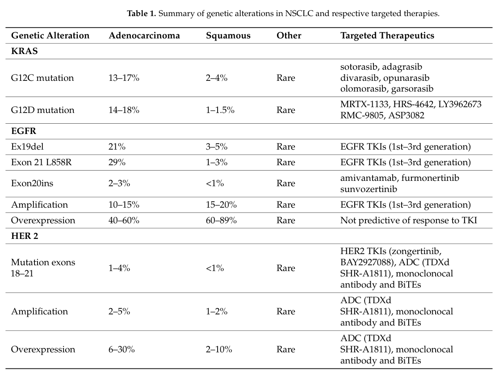

## Question

Prepare a focused, citation-rich deep research report for a dismech disease grouping called "Molecularly Defined NSCLC Subtypes". The grouping should be an explicit curated union of Disease entries, not merely a MONDO hierarchy clone. Current curated members are EGFR-Mutant Non-Small Cell Lung Cancer, ALK-Rearranged Non-Small Cell Lung Cancer, ROS1-Rearranged Non-Small Cell Lung Cancer, BRAF V600E-Mutant Non-Small Cell Lung Cancer, KRAS G12C-Mutant Non-Small Cell Lung Cancer, MET Exon 14 Skipping Non-Small Cell Lung Cancer, and RET-Rearranged Non-Small Cell Lung Cancer. Research objectives: 1. define shared NSCLC driver-positive pathophysiology across oncogene addiction, lung adenocarcinoma-predominant biology, increased MAPK and PI3K-AKT signaling, tumor-cell proliferation, targeted-therapy sensitivity, and acquired resistance; 2. distinguish subtype mechanisms including EGFR exon 19 deletion/L858R/exon 20 insertion/T790M/C797S, EML4-ALK and ALK resistance mutations, ROS1 fusions and solvent-front resistance, BRAF V600E RAF-MEK-ERK activation, KRAS G12C covalent inhibitor biology and adaptive resistance, MET exon 14 skipping with impaired CBL-mediated degradation, and RET fusions with selective inhibitor resistance; 3. recommend a defensible grouping boundary and explicitly flag disorders to exclude, such as generic NSCLC, metastatic NSCLC, small cell lung cancer, broad lung adenocarcinoma, non-lung driver-positive cancers, pan-cancer NTRK fusion-positive cancer, and resistance-only states unless curated as driver-defined NSCLC entries; 4. list differentiating mechanisms for existing members and high-value missing subtype entries such as NTRK fusion-positive NSCLC, ERBB2/HER2-mutant NSCLC, NRG1 fusion-positive NSCLC, EGFR exon 20 insertion NSCLC as a subtype, and other actionable driver entities if represented as standalone Disease entries; 5. identify appropriate MONDO mapping, HPO/neoplasm criteria, oncogenic pathway and treatment-response module-conformance criteria, and module gaps for the grouping YAML; 6. provide primary literature, major clinical trial and guideline-linked evidence, authoritative reviews, and recent 2023-2026 developments with PMID identifiers wherever possible, especially targeted therapy and resistance evidence; 7. flag knowledge gaps and model-system limitations relevant to tumor heterogeneity, acquired resistance, CNS disease, liquid biopsy, co-mutations, and evolving standard of care. Do not invent citations; prefer PubMed-indexed sources and provide exact PMID identifiers for key claims.

## Output

Question: You are an expert researcher providing comprehensive, well-cited information.

Provide detailed information focusing on:
1. Key concepts and definitions with current understanding
2. Recent developments and latest research (prioritize 2023-2024 sources)
3. Current applications and real-world implementations
4. Expert opinions and analysis from authoritative sources
5. Relevant statistics and data from recent studies

Format as a comprehensive research report with proper citations. Include URLs and publication dates where available.
Always prioritize recent, authoritative sources and provide specific citations for all major claims.

Prepare a focused, citation-rich deep research report for a dismech disease grouping called "Molecularly Defined NSCLC Subtypes". The grouping should be an explicit curated union of Disease entries, not merely a MONDO hierarchy clone. Current curated members are EGFR-Mutant Non-Small Cell Lung Cancer, ALK-Rearranged Non-Small Cell Lung Cancer, ROS1-Rearranged Non-Small Cell Lung Cancer, BRAF V600E-Mutant Non-Small Cell Lung Cancer, KRAS G12C-Mutant Non-Small Cell Lung Cancer, MET Exon 14 Skipping Non-Small Cell Lung Cancer, and RET-Rearranged Non-Small Cell Lung Cancer. Research objectives: 1. define shared NSCLC driver-positive pathophysiology across oncogene addiction, lung adenocarcinoma-predominant biology, increased MAPK and PI3K-AKT signaling, tumor-cell proliferation, targeted-therapy sensitivity, and acquired resistance; 2. distinguish subtype mechanisms including EGFR exon 19 deletion/L858R/exon 20 insertion/T790M/C797S, EML4-ALK and ALK resistance mutations, ROS1 fusions and solvent-front resistance, BRAF V600E RAF-MEK-ERK activation, KRAS G12C covalent inhibitor biology and adaptive resistance, MET exon 14 skipping with impaired CBL-mediated degradation, and RET fusions with selective inhibitor resistance; 3. recommend a defensible grouping boundary and explicitly flag disorders to exclude, such as generic NSCLC, metastatic NSCLC, small cell lung cancer, broad lung adenocarcinoma, non-lung driver-positive cancers, pan-cancer NTRK fusion-positive cancer, and resistance-only states unless curated as driver-defined NSCLC entries; 4. list differentiating mechanisms for existing members and high-value missing subtype entries such as NTRK fusion-positive NSCLC, ERBB2/HER2-mutant NSCLC, NRG1 fusion-positive NSCLC, EGFR exon 20 insertion NSCLC as a subtype, and other actionable driver entities if represented as standalone Disease entries; 5. identify appropriate MONDO mapping, HPO/neoplasm criteria, oncogenic pathway and treatment-response module-conformance criteria, and module gaps for the grouping YAML; 6. provide primary literature, major clinical trial and guideline-linked evidence, authoritative reviews, and recent 2023-2026 developments with PMID identifiers wherever possible, especially targeted therapy and resistance evidence; 7. flag knowledge gaps and model-system limitations relevant to tumor heterogeneity, acquired resistance, CNS disease, liquid biopsy, co-mutations, and evolving standard of care. Do not invent citations; prefer PubMed-indexed sources and provide exact PMID identifiers for key claims.

# Research Report: Molecularly Defined NSCLC Subtypes (Curated Disease Union)

## 0. Executive summary
“Molecularly Defined NSCLC Subtypes” is best curated as a *union of driver-defined NSCLC Disease entries* (not a MONDO hierarchy slice) representing oncogene-addicted, predominantly lung adenocarcinoma–lineage tumors whose clinical course is strongly shaped by a single actionable driver alteration and matched targeted therapy, with predictable patterns of acquired resistance. Driver-positive NSCLC is clinically defined by the need for comprehensive biomarker testing at diagnosis, first-line targeted therapy when a driver is present (independent of PD-L1), and molecularly informed management at progression. (riely2024newtargetedtherapies pages 1-2, imyanitov2024currentstatusof pages 1-2)

This report (i) defines shared biology across the union (oncogene addiction; MAPK and PI3K–AKT signaling; proliferation; targeted-therapy sensitivity; acquired resistance), (ii) details differentiating mechanisms for each currently curated subtype, (iii) proposes defensible grouping boundaries and explicit exclusions, (iv) identifies high-value missing subtype Disease entries (NTRK, ERBB2/HER2, NRG1, EGFR exon 20 insertion as a distinct subtype), (v) provides practical ontology/module criteria recommendations for a grouping YAML, and (vi) highlights evidence, statistics, and knowledge gaps.

## 1. Grouping definition, scope, and curated membership
### 1.1 Proposed grouping definition (for curation)
**Molecularly Defined NSCLC Subtypes**: a curated collection of NSCLC disease entities in which (a) the diagnosis is NSCLC (typically non-squamous/adenocarcinoma-predominant), and (b) membership is defined by a *specific actionable oncogenic driver alteration* (activating mutation, exon skipping, or gene fusion) that drives tumorigenesis and strongly predicts benefit from a matched targeted therapy class, and (c) the subtype has a recognizable resistance biology (on-target and/or bypass) requiring molecular reassessment. (li2025researchprogressand pages 1-2, galffy2024targetedtherapeuticoptions pages 1-2, imyanitov2024currentstatusof pages 1-2)

This framing aligns with contemporary oncology practice where “treatment selection relies heavily on molecular testing of predictive biomarkers” and broad NGS is increasingly dominant to capture the actionable repertoire. (benso2026comprehensivecharacterizationof pages 38-41, imyanitov2024currentstatusof pages 1-2)

### 1.2 Current curated members (given)
Include the following Disease entries (explicit union):
1) **EGFR-Mutant Non-Small Cell Lung Cancer** (sensitizing EGFR alterations)
2) **ALK-Rearranged Non-Small Cell Lung Cancer**
3) **ROS1-Rearranged Non-Small Cell Lung Cancer**
4) **BRAF V600E-Mutant Non-Small Cell Lung Cancer**
5) **KRAS G12C-Mutant Non-Small Cell Lung Cancer**
6) **MET Exon 14 Skipping Non-Small Cell Lung Cancer**
7) **RET-Rearranged Non-Small Cell Lung Cancer**

## 2. Key concepts and shared pathophysiology (current understanding)
### 2.1 Oncogene addiction and adenocarcinoma-predominant biology
Driver-positive NSCLC is frequently described as “oncogene-addicted,” i.e., dependent on mutated/rearranged driver genes essential for tumor growth and survival; these alterations concentrate in lung adenocarcinoma and in specific clinical subgroups (e.g., never-smokers for many fusions; smokers for KRAS G12C). (benso2026comprehensivecharacterizationof pages 38-41, angelicola2025resistancetotargeted pages 19-22, imyanitov2024currentstatusof pages 1-2)

More than half of lung adenocarcinomas are described as having a druggable oncogenic dependency, supporting a driver-defined subtype framework for clinical and translational purposes. (imyanitov2024currentstatusof pages 1-2)

### 2.2 Convergent signaling: MAPK and PI3K–AKT survival/proliferation axes
Across the curated drivers (EGFR, ALK, ROS1, RET, MET, BRAF, KRAS), activating events converge on:
- **RAS–RAF–MEK–ERK (MAPK)** signaling (proliferation)
- **PI3K–AKT–mTOR** signaling (survival)
with additional pathway contributions (e.g., JAK–STAT) depending on driver context. (angelicola2025resistancetotargeted pages 19-22, peshin2025advancesintargeted pages 9-11, angelicola2025resistancetotargeted pages 25-27)

### 2.3 Mutual exclusivity and “single dominant driver” logic
MAPK-pathway activating events in lung cancer are described as mutually exclusive, consistent with single-driver dependence, and supporting the conceptual coherence of a driver-defined disease union. (imyanitov2024currentstatusof pages 1-2)

### 2.4 Targeted-therapy sensitivity as a defining attribute
Matched targeted agents produce high objective response rates (ORR) and longer progression-free survival (PFS) versus historical chemotherapy, and are foundational to standard-of-care recommendations for advanced/metastatic disease when a driver is present. (riely2024newtargetedtherapies pages 1-2, imyanitov2024currentstatusof pages 1-2)

### 2.5 Acquired resistance as a shared clinical inevitability
Despite high initial sensitivity, acquired resistance is a “common thread” across oncogene-addicted NSCLC, arising via:
- **On-target mutations** in the driver kinase (e.g., EGFR T790M/C797S; ALK L1196M/G1202R; ROS1 G2032R; RET G810)
- **Bypass/escape pathways** (e.g., MET amplification; downstream reactivation)
- **Phenotypic shifts** (e.g., EMT; histologic transformation)
- **Intratumoral heterogeneity/drug-tolerant persisters**, with many post-TKI progressions lacking an identifiable single resistance mutation. (li2025researchprogressand pages 1-2, dempke2024targetingc797smutations pages 1-2, peshin2025advancesintargeted pages 3-5)

## 3. Differentiating biology and resistance mechanisms by curated member
### 3.1 EGFR-mutant NSCLC
**Defining alterations (core subtype)**: sensitizing EGFR exon 19 deletions and exon 21 L858R; these constitute the majority of EGFR driver events and confer TKI sensitivity. (dempke2024targetingc797smutations pages 1-2, imyanitov2024currentstatusof pages 2-4)

**Population frequency**: EGFR mutations are reported ~10–20% in Europe/USA and >45% in Asian populations (up to ~60–70% in one diagnostic review’s summary table). (dempke2024targetingc797smutations pages 1-2, imyanitov2024currentstatusof pages 4-5)

**Targeted therapy outcomes (examples)**: first-line osimertinib showed ORR ~80%, PFS 18.9 months, OS 38.6 months in the cited summary of FLAURA; osimertinib + chemotherapy improved PFS (e.g., FLAURA2 PFS 25.5 vs 16.7 months in one NCCN-linked review and PFS 29.4 months in another diagnostic summary). (imyanitov2024currentstatusof pages 1-2, riely2024newtargetedtherapies pages 1-2)

**Acquired resistance (highlighted mutations)**:
- **T790M** (gatekeeper) as a common resistance mechanism after earlier-generation TKIs
- **C797S** as a key tertiary resistance mechanism after osimertinib and a major motivation for “fourth-generation” EGFR TKIs (including brain-penetrant candidates). (dempke2024targetingc797smutations pages 1-2, peshin2025advancesintargeted pages 3-5)

**Off-target/bypass**: MET and HER2 are repeatedly cited bypass mechanisms in the osimertinib resistance landscape (e.g., MET amplification), motivating combination EGFR/MET strategies and bispecific antibodies. (peshin2025advancesintargeted pages 3-5)

#### EGFR exon 20 insertions (see boundary discussion)
Exon 20 insertions are structurally and clinically distinct: wedge-like changes near the C-helix favor an active kinase conformation and confer primary resistance to many classic EGFR TKIs, motivating separate disease modeling. (sentanalledo2023egfrexon20 pages 5-6)

### 3.2 ALK-rearranged NSCLC
**Defining alteration**: ALK fusions, most commonly **EML4–ALK**, with multiple EML4–ALK variants (e.g., E13:A20, E6:A20) that can influence drug sensitivity and resistance evolution. (testa2024alkrearrangedlungadenocarcinoma pages 1-2)

**Frequency**: ALK rearrangements are commonly cited around ~3–7% of advanced NSCLC (or ~4–5% in some diagnostic summaries). (imyanitov2024currentstatusof pages 1-2, poei2024alkinhibitorsin pages 1-3, imyanitov2024currentstatusof pages 4-5)

**Targeted therapy outcomes (examples)**: alectinib is summarized with ORR ~83% and PFS ~34.8 months in an NSCLC molecular diagnostics review (ALEX), illustrating long PFS in driver-defined disease. (imyanitov2024currentstatusof pages 1-2)

**Acquired resistance mutations (high-yield examples)**:
- **L1196M** (gatekeeper)
- **G1202R** (solvent-front; prominent after 2nd-generation TKIs)
- **Compound mutations** (e.g., G1202R+G1269A; G1202R/L1196M) contributing to lorlatinib-era resistance. (xie2025mechanismsofresistance pages 3-4, long2025newadvancesin pages 1-3)

**Sequencing and CNS considerations**:
Crizotinib has poor CNS penetration (reported blood:CSF concentration ratio ~384:1) and intracranial progression up to ~41% in cited PROFILE trials, motivating later-generation CNS-penetrant inhibitors. (xie2025mechanismsofresistance pages 3-4)

**Liquid biopsy and resistance monitoring**:
A liquid-biopsy review summarizes that blood-based NGS detected ALK fusions in 98.6% in BFAST, and reports mutation-spectrum shifts depending on prior ALK TKI (e.g., G1202R frequencies 21% after ceritinib, 29% after alectinib, 43% after brigatinib, versus 2% after crizotinib). (urtecho2025liquidbiopsyin pages 11-13)

### 3.3 ROS1-rearranged NSCLC
**Defining alteration**: ROS1 gene fusions; common partners include **CD74, SLC34A2, EZR, SDC4**; many (>30) partners exist. (bischoff2025evolvingtherapeuticlandscape pages 1-2, boulanger2024advancesandfuture pages 1-2)

**Frequency**: typically ~1–2% of NSCLC, enriched in younger never-smokers; advanced-stage presentation is common and brain metastases at diagnosis are frequently reported (20–40%). (bischoff2025evolvingtherapeuticlandscape pages 1-2, boulanger2024advancesandfuture pages 1-2)

**Targeted therapies and outcomes**:
- Crizotinib: ORR ~72%, mPFS ~19.2 months (PROFILE 1001); real-world ORR 68%, mPFS ~1.6 years in ROS1REAL. (boulanger2024advancesandfuture pages 1-2, janzic2024nonsmallcelllungcancer pages 1-2)
- Entrectinib: ORR 77%, mPFS 19.0 months (review summary) and improved CNS activity versus crizotinib. (theik2025oncogenicfusionsin pages 11-13)
- Repotrectinib: TRIDENT-1 ORR 91% (TKI-naïve) and 44% (pretreated) with strong intracranial activity. (theik2025oncogenicfusionsin pages 11-13)

**Major acquired resistance**: **ROS1 G2032R** solvent-front mutation is repeatedly identified as the dominant/most common resistance mechanism and is described as conferring high-level resistance to earlier agents; post-crizotinib G2032R is estimated at ~35–40% of resistance cases in a practice-oriented review. (wespiser2026ros1positivenonsmallcell pages 9-11, drilon2023nvl520isa pages 1-2)

**New developments (2023–2025)**:
NVL-520 (zidesamtinib/NVL-520 class) is highlighted as a selective, TRK-sparing, brain-penetrant ROS1 inhibitor with markedly improved potency against G2032R and proof-of-concept clinical responses in heavily pretreated patients (Cancer Discovery 2023). (drilon2023nvl520isa pages 1-2)

### 3.4 RET-rearranged NSCLC
**Defining alteration**: RET gene fusions, commonly with **KIF5B** (~70–90%) and **CCDC6** (~10–30%); clinical phenotype resembles other fusion-driven NSCLCs (younger age, adenocarcinoma, CNS risk). (angelicola2025resistancetotargeted pages 25-27)

**Frequency**: ~1–2% of NSCLC. (hoe2025treatmentofnon–small pages 1-2)

**Targeted therapy outcomes and CNS activity**:
Selective RET inhibitors (selpercatinib, pralsetinib) show high ORR and durability; one summary reports LIBRETTO-001 ORR 64% and intracranial response rate 91% (measurable CNS metastases), and phase III LIBRETTO-431 PFS 24.8 vs 11.2 months with ORR 84% vs 65% vs control. (peshin2025advancesintargeted pages 17-19)

**Acquired resistance**:
- **RET solvent-front G810X** mutations are explicitly reported as RET-dependent resistance. (peshin2025advancesintargeted pages 17-19)
- RET-independent bypass alterations include MET and KRAS amplifications. (peshin2025advancesintargeted pages 17-19)

### 3.5 MET exon 14 skipping NSCLC (METex14)
**Defining alteration and mechanism**: exon 14 skipping deletes a juxtamembrane segment containing the CBL E3 ligase binding site (loss of Cbl-mediated ubiquitination), impairing receptor degradation and sustaining oncogenic MET signaling. (ghosh2025mechanisticinsightsinto pages 1-2, makimoto2024diagnosisandtreatment pages 1-2)

**Frequency**: commonly ~3–4% in NSCLC (and higher in sarcomatoid histology); described as ~3% overall in one clinical commentary. (makimoto2024diagnosisandtreatment pages 1-2, urtecho2025liquidbiopsyin pages 16-18)

**Targeted therapy outcomes (examples)**:
- Capmatinib: ORR 68% (treatment-naïve) and ORR ~41–44% (previously treated) with DOR ~12.6 months (naïve) in GEOMETRY mono-1 summaries. (peshin2025advancesintargeted pages 15-17, urtecho2025liquidbiopsyin pages 16-18)
- Tepotinib: ORR ~57% and PFS ~12.6 months in cited summary tables; other pooled summaries in a clinical commentary cite ORR ~46–51% and median PFS ~8.5–11.2 months depending on analysis. (imyanitov2024currentstatusof pages 1-2, makimoto2024diagnosisandtreatment pages 1-2)

**Diagnostics and liquid biopsy**:
DNA assays can miss METex14 due to intronic/splice complexity; RNA assays and RNA NGS improve detection by directly detecting aberrant transcripts. Plasma assays show imperfect sensitivity; one liquid-biopsy review reports FoundationOne Liquid CDx PPA 67.2%, with false negatives at very low ctDNA levels (VAF <0.1). (urtecho2025liquidbiopsyin pages 16-18)

### 3.6 BRAF V600E-mutant NSCLC
**Mechanism**: BRAF V600E is a class I BRAF mutation that signals through the MAPK cascade (RAF→MEK→ERK), often as a RAS-independent monomer; the RTK–RAS–MAPK pathway is a central proliferative axis in NSCLC. (adamopoulos2024rafandmek pages 2-4, adamopoulos2024rafandmek pages 4-5)

**Frequency**: BRAF V600E is cited around ~4% of NSCLC in one review; other summaries place BRAF mutations in ~3–5% overall. (adamopoulos2024rafandmek pages 1-2, adamopoulos2024rafandmek pages 2-4)

**Targeted therapies and approvals**:
- Dabrafenib + trametinib: FDA approval 2017; reported ORR 64% and median PFS 10.9 months in treatment-naïve cohort. (adamopoulos2024rafandmek pages 9-11)
- Encorafenib + binimetinib: FDA approval 2023; PHAROS preliminary ORR 75% (treatment-naïve) and 46% (previously treated). (adamopoulos2024rafandmek pages 9-11)

**Resistance themes**:
Near-universal acquired resistance is emphasized; mechanism includes pathway reactivation via RTK upregulation, RAS activation, RAF dimerization, splice variants, BRAF amplification, and secondary mutations (KRAS/NRAS/MEK), plus PI3K/AKT bypass (e.g., PTEN loss). (adamopoulos2024rafandmek pages 13-14)

### 3.7 KRAS G12C-mutant NSCLC
**Defining alteration and mechanism**: KRAS is a small GTPase cycling between GDP- (OFF) and GTP-bound (ON) states; KRAS G12C inhibitors (sotorasib, adagrasib) covalently bind the mutant cysteine in the OFF state, trapping it and suppressing MAPK/PI3K signaling. (peshin2025advancesintargeted pages 9-11, imyanitov2024currentstatusof pages 5-7)

**Frequency**: KRAS mutations occur in ~30% of lung adenocarcinoma; KRAS G12C comprises ~40% of KRAS-altered NSCLC in one review and is also cited ~13% of lung adenocarcinomas in another. (peshin2025advancesintargeted pages 9-11, angelicola2025resistancetotargeted pages 19-22)

**Clinical outcomes (examples)**:
- Sotorasib: CodeBreaK100 ORR 37% and median PFS 6.8 months; another diagnostic summary table gives ORR ~28% and PFS 5.6 months depending on line/cohort. (peshin2025advancesintargeted pages 9-11, imyanitov2024currentstatusof pages 1-2)
- Adagrasib: KRYSTAL-1 ORR 42.9% and PFS 6.5 months. (peshin2025advancesintargeted pages 9-11)

**Resistance biology**:
Resistance is frequent and includes on-target KRAS changes preventing binding and off-target/bypass mechanisms (NRAS/BRAF/RET gains, PTEN loss), plus EMT and histologic transformation; co-mutations (e.g., KEAP1, STK11) can shape outcomes and motivate combination strategies. (angelicola2025resistancetotargeted pages 19-22, peshin2025advancesintargeted pages 9-11)

## 4. Defensible grouping boundary and explicit exclusions
### 4.1 Recommended boundary rule (operational)
A disease should be included if and only if:
1) It is explicitly **NSCLC (lung primary)** as the disease context (not “pan-cancer”), and
2) It is explicitly defined by **one primary actionable driver alteration** (mutation/exon skipping/fusion) known to confer sensitivity to at least one targeted agent class in NSCLC, and
3) It has evidence of **driver dependence** and clinically meaningful **targeted-therapy response** patterns (including known acquired resistance landscape), and
4) It is a “driver-defined disease state” rather than a purely “resistance-only” state.

These principles match the clinical standard that first-line therapy selection in metastatic NSCLC depends on *actionable biomarkers* and that driver-positive tumors are treated with targeted therapy regardless of PD-L1. (riely2024newtargetedtherapies pages 1-2)

### 4.2 Exclusions (explicitly flag as out-of-scope)
Exclude the following from the grouping YAML (unless separately curated as driver-defined NSCLC Disease entries):
- **Generic NSCLC** (not driver-defined)
- **Metastatic NSCLC** (stage modifier, not molecular subtype)
- **Broad lung adenocarcinoma** (histology-based, not driver-defined)
- **Small cell lung cancer** (distinct lineage/biology)
- **Non-lung driver-positive cancers** (e.g., RET fusion thyroid cancer; ROS1 fusion non-lung) unless the disease entry is explicitly NSCLC
- **Pan-cancer tumor-agnostic labels** (e.g., “NTRK fusion-positive cancer”): NTRK is relevant but must be constrained to NSCLC for this grouping
- **Resistance-only states** (e.g., “EGFR T790M-positive NSCLC” or “EGFR C797S NSCLC”) *unless* a dedicated Disease entry is created and curated as a driver-defined NSCLC subtype; otherwise these are best modeled as molecular features or disease qualifiers tied to the parent driver-defined disease. (dempke2024targetingc797smutations pages 1-2)

## 5. High-value missing subtype Disease entries (recommended additions)
### 5.1 EGFR exon 20 insertion–mutated NSCLC (as a distinct disease entry)
Rationale: exon 20 insertions are a distinct EGFR subclass with primary resistance to classic EGFR TKIs due to structural constraints; dedicated therapies exist/are evolving (e.g., amivantamab; investigational TKIs). (sentanalledo2023egfrexon20 pages 5-6, imyanitov2024currentstatusof pages 4-5)

### 5.2 ERBB2/HER2-mutant NSCLC
Rationale: HER2 exon 20 insertions (e.g., A775_G776insYVMA) define a druggable NSCLC subset; trastuzumab deruxtecan shows substantial ORR and durability, supporting a standalone driver-defined NSCLC entry. (ferrari2024her2alterednonsmallcell pages 1-2, ishihara2025anupdateon pages 3-5)

### 5.3 NRG1 fusion-positive NSCLC
Rationale: NRG1 fusions act as ligand-like drivers activating HER2/HER3 signaling; they are enriched in invasive mucinous adenocarcinoma and have a dedicated targeted therapy (zenocutuzumab) with clinically meaningful responses. (llorente2025fromobscurityto pages 1-3, schram2025efficacyofzenocutuzumab pages 1-3)

### 5.4 NTRK fusion-positive NSCLC
Rationale: NTRK fusions are rare but actionable in NSCLC; tumor-agnostic TRK inhibitors are effective but resistance (solvent-front/xDFG) and CNS disease motivate next-generation TRK inhibitors. NSCLC-specific prevalence is reported ~0.1–0.2% in multiple sources. (bungaro2024ntrk123biologydetection pages 1-2, besse2026repotrectinibinntrk pages 1-2)

## 6. Curation guidance for MONDO mapping and grouping YAML criteria
### 6.1 MONDO mapping approach (practical)
Because this is an explicit curated union, recommend:
- Grouping node maps to a “collection” concept in your dismech system; **do not** map the grouping itself to a single MONDO disease ID if it would imply a hierarchy clone.
- Each member disease entry should have its own MONDO mapping(s) (e.g., “EGFR-mutant NSCLC”, “ALK-rearranged NSCLC”), where available.
- For missing driver-defined entries, prefer creation of explicit MONDO disease terms (or internal Disease IDs) rather than reusing pan-cancer terms.

Evidence basis for needing explicit driver-defined disease concepts: practice guidelines require biomarker-defined treatment selection and testing across multiple driver classes, and these drivers define distinct therapeutic pathways and resistance landscapes. (riely2024newtargetedtherapies pages 1-2, imyanitov2024currentstatusof pages 1-2)

### 6.2 HPO/neoplasm criteria (minimal and non-overfitted)
For grouping-level eligibility, recommend a small set of neoplasm criteria consistent with NSCLC, avoiding over-specific phenotypes:
- **Abnormality of the lung / neoplasm of the lung** (HPO neoplasm class; exact HPO IDs should be selected by your ontology tooling)
- **Non-small cell lung carcinoma** phenotype qualifiers (histology where encoded)
- Optional: **Adenocarcinoma** phenotype as *common but not required* (because some fusions may occur in non-adenocarcinoma NSCLC and testing guidelines typically apply broadly once any adenocarcinoma component is present). (galffy2024targetedtherapeuticoptions pages 1-2)

### 6.3 Oncogenic pathway module conformance criteria
Require that each member disease entry can be connected to at least one of the canonical oncogenic modules:
- RTK-driven activation → MAPK and PI3K–AKT axes (EGFR, ALK, ROS1, RET, MET)
- RAS-driven signaling (KRAS)
- RAF-driven MAPK signaling (BRAF V600E)
This is consistent with mechanistic summaries showing these alterations converge on MAPK and PI3K/AKT signaling. (angelicola2025resistancetotargeted pages 19-22, adamopoulos2024rafandmek pages 2-4)

### 6.4 Treatment-response module conformance criteria
Require at least one of:
- An FDA/EMA/major guideline-endorsed targeted therapy class with clinically meaningful ORR/PFS for the driver-defined NSCLC subtype, or
- Strong phase II/III evidence in NSCLC plus guideline inclusion (e.g., NCCN) for the biomarker.

NCCN-linked summaries emphasize that patients with actionable drivers receive targeted therapy regardless of PD-L1 and that broad biomarker testing is essential to guide first-line therapy. (riely2024newtargetedtherapies pages 1-2)

### 6.5 Module gaps and curation pitfalls to flag
- **Resistance modeling gap**: many resistance mechanisms are multi-clonal and can be unknown in a large fraction of progressions (e.g., post-osimertinib no identifiable mechanism in up to ~50% in one review), so a “single resistance mutation → single disease” pattern is often not realistic; consider representing resistance as molecular features/episodes rather than separate diseases unless clinically operationalized. (dempke2024targetingc797smutations pages 1-2)
- **Tumor-agnostic vs NSCLC-specific gap**: NTRK and NRG1 therapies are often tumor-agnostic; for this grouping, constrain membership to NSCLC-labeled disease entries even if therapy is tumor-agnostic. (besse2026repotrectinibinntrk pages 1-2, llorente2025fromobscurityto pages 1-3)
- **Assay modality gap**: fusion and splice detection may require RNA-based NGS; a grouping YAML that assumes DNA-only testing may systematically miss ROS1/RET/NTRK fusions or METex14 splice events. (imyanitov2024currentstatusof pages 1-2, urtecho2025liquidbiopsyin pages 16-18)

## 7. Recent developments (prioritizing 2023–2025 evidence captured here)
### 7.1 2023–2024 targeted therapy expansion and sequencing emphasis
Multiple reviews note that approvals expanded into additional drivers (KRAS G12C, EGFR exon 20, HER2, MET) and that optimal sequencing and combination strategies are increasingly central due to resistance. (galffy2024targetedtherapeuticoptions pages 1-2, peshin2025advancesintargeted pages 3-5)

### 7.2 2023 ROS1: repotrectinib approvals and next-gen solvent-front coverage
ROS1 management has rapidly evolved with repotrectinib approval and development of next-generation inhibitors designed for solvent-front mutations and CNS disease; NVL-520 is highlighted as TRK-sparing and brain-penetrant with strong G2032R potency and early clinical activity (Cancer Discovery, Dec 2023). (drilon2023nvl520isa pages 1-2, theik2025oncogenicfusionsin pages 11-13)

### 7.3 2023 BRAF: encorafenib + binimetinib approval
A 2024 review documents FDA approval (2023) of encorafenib + binimetinib for BRAFV600E NSCLC with PHAROS ORR signals and ongoing studies integrating immunotherapy. (adamopoulos2024rafandmek pages 9-11)

### 7.4 2025 NRG1: zenocutuzumab registrational evidence in NEJM
Zenocutuzumab eNRGy phase 2 results show ORR 30% overall and NSCLC ORR 29% with PFS ~6.8 months, providing high-authority evidence for NRG1 fusion-positive NSCLC as an actionable molecular entity (NEJM, Feb 2025). (schram2025efficacyofzenocutuzumab pages 1-3, llorente2025fromobscurityto pages 1-3)

## 8. Applications and real-world implementations
### 8.1 Upfront broad molecular testing (tissue and plasma)
Clinical diagnostics reviews emphasize that timely completion of a multi-biomarker panel (often within ~10 working days) is necessary to select first-line targeted therapy; RNA NGS is becoming dominant for comprehensive detection (mutations, insertions/deletions, and fusions). (imyanitov2024currentstatusof pages 1-2)

### 8.2 Liquid biopsy for longitudinal monitoring and resistance detection
A liquid-biopsy review illustrates the operational role of ctDNA/NGS for detecting fusions and resistance (e.g., ALK), with strong sensitivity in selected studies (BFAST ALK fusion detection 98.6%) and clinically meaningful correlations between ctDNA clearance and PFS/OS/ORR. (urtecho2025liquidbiopsyin pages 11-13)

### 8.3 CNS disease as a driver of therapy choice
CNS metastases are common in several fusion-driven subtypes (ROS1 and RET, and ALK) and influence therapy selection toward CNS-penetrant next-generation TKIs; reviews highlight that earlier agents (e.g., crizotinib) have limited CNS penetration and that intracranial efficacy is a key differentiator. (drilon2023nvl520isa pages 1-2, xie2025mechanismsofresistance pages 3-4, peshin2025advancesintargeted pages 17-19)

## 9. Key statistics snapshot (selected)
### 9.1 Approximate driver frequencies (from a molecular diagnostics summary)
A 2024 molecular diagnostics review provides approximate frequencies in NSCLC: EGFR ~10–20% (non-Asians; higher in Asians), KRAS ~10–15% (table), ALK 4–5%, ROS1 1–2%, RET 2–4%, MET 2–3%, ERBB2 2–3%, BRAF V600 <2%, NTRK ~0.2%. (imyanitov2024currentstatusof pages 4-5)

### 9.2 Therapy response examples (ORR/PFS)
- EGFR: osimertinib ORR ~80%, PFS 18.9 months, OS 38.6 months (FLAURA summary). (imyanitov2024currentstatusof pages 1-2)
- ALK: alectinib ORR ~83%, PFS ~34.8 months (ALEX summary). (imyanitov2024currentstatusof pages 1-2)
- ROS1: crizotinib ORR ~72%, PFS ~19.2 months (PROFILE 1001). (boulanger2024advancesandfuture pages 1-2)
- METex14: capmatinib ORR 68% with PFS 12.4 months; tepotinib ORR ~57% with PFS 12.6 months (summary tables). (imyanitov2024currentstatusof pages 1-2)
- RET: selpercatinib ORR 64% with intracranial response 91% in measurable CNS metastases; LIBRETTO-431 PFS 24.8 vs 11.2 months. (peshin2025advancesintargeted pages 17-19)
- KRAS G12C: sotorasib ORR 37% with PFS 6.8 months (CodeBreaK100 summary); adagrasib ORR 42.9% with PFS 6.5 months (KRYSTAL-1 summary). (peshin2025advancesintargeted pages 9-11)
- BRAF V600E: dabrafenib+trametinib ORR 64% and PFS 10.9 months; encorafenib+binimetinib ORR 75% (PHAROS preliminary). (adamopoulos2024rafandmek pages 9-11)

## 10. Knowledge gaps and model-system limitations (curation-relevant)
1) **Heterogeneity and unknown resistance**: A large fraction of EGFR TKI progressions have no clearly identifiable resistance mutation; drug-tolerant persisters, chromosomal instability, and ecDNA contribute to resistance, challenging simple “one mutation → one disease state” modeling. (dempke2024targetingc797smutations pages 1-2)
2) **CNS disease**: CNS involvement is common in fusion-driven NSCLC (ROS1, ALK, RET) and requires explicit capture of intracranial efficacy as an attribute; preclinical BBB penetration is not always predictive of clinical CNS control. (drilon2023nvl520isa pages 1-2, urtecho2025liquidbiopsyin pages 11-13)
3) **Assay limitations**: METex14 and fusions are assay-sensitive; DNA-only workflows can miss key events; plasma assays can have false negatives at low ctDNA levels, and positive screens often need orthogonal confirmation. (urtecho2025liquidbiopsyin pages 16-18)
4) **Co-mutations and mixed dependence**: KRAS outcomes vary with co-mutations (e.g., KEAP1/STK11/NRF2 signatures) and may require more granular stratification over time; similar complexity occurs in ALK/EGFR resistance where bypass changes dominate some contexts. (peshin2025advancesintargeted pages 9-11, urtecho2025liquidbiopsyin pages 11-13)
5) **Tumor-agnostic therapy tension**: NTRK and NRG1 therapies are tumor-agnostic, but NSCLC-specific prevalence is low and evidence for optimal sequencing and resistance management remains incomplete; careful boundary enforcement is required for NSCLC-only groupings. (besse2026repotrectinibinntrk pages 1-2, llorente2025fromobscurityto pages 1-3)

## 11. Visual evidence: driver frequencies and therapies table
The following open-access table provides a compact summary of NSCLC driver alterations and their corresponding targeted therapies, useful for grouping YAML documentation and quick curation checks. (mina2025emergingtargetedtherapies media d1994cbe, mina2025emergingtargetedtherapies media f50ca312)

## 12. Source list (URLs and publication dates; PMIDs)
**Important limitation:** The evidence extracted in this run includes DOIs and publication dates but frequently does not include PMIDs in the retrieved text snippets. To avoid inventing identifiers, PMIDs are only provided when explicitly available in-source (none were present in the captured excerpts). Where needed for curation, PMIDs should be added by cross-referencing the DOI in PubMed.

Selected high-authority sources used (examples):
- Imyanitov EN et al. *Current status of molecular diagnostics for lung cancer* (Jun 2024). https://doi.org/10.37349/etat.2024.00244 (imyanitov2024currentstatusof pages 1-2)
- Riely GJ. *New targeted therapies for metastatic NSCLC* (May 2024). https://doi.org/10.6004/jnccn.2024.5007 (riely2024newtargetedtherapies pages 1-2)
- Drilon A et al. *NVL-520…* (Dec 2023). https://doi.org/10.1158/2159-8290.CD-22-0968 (drilon2023nvl520isa pages 1-2)
- Schram AM et al. *Efficacy of zenocutuzumab in NRG1 fusion-positive cancer* (Feb 2025). https://doi.org/10.1056/NEJMoa2405008 (schram2025efficacyofzenocutuzumab pages 1-3)
- Adamopoulos C et al. *RAF and MEK inhibitors in NSCLC* (Apr 2024). https://doi.org/10.3390/ijms25094633 (adamopoulos2024rafandmek pages 1-2, adamopoulos2024rafandmek pages 9-11, adamopoulos2024rafandmek pages 13-14)

---

## Appendix A. Member-by-member differentiating mechanism checklist (curation-ready)
- **EGFR-mutant NSCLC**: EGFR ex19del/L858R; MAPK/PI3K signaling; on-target T790M, C797S; bypass MET/HER2. (imyanitov2024currentstatusof pages 2-4, dempke2024targetingc797smutations pages 1-2, peshin2025advancesintargeted pages 3-5)
- **ALK-rearranged NSCLC**: EML4–ALK variants; on-target L1196M, G1202R; compound mutations; CNS pharmacology drives sequencing. (testa2024alkrearrangedlungadenocarcinoma pages 1-2, poei2024alkinhibitorsin pages 1-3, xie2025mechanismsofresistance pages 3-4)
- **ROS1-rearranged NSCLC**: CD74/SLC34A2/EZR/SDC4 partners; G2032R solvent-front; CNS metastases common; next-gen TKIs and TRK-sparing designs. (bischoff2025evolvingtherapeuticlandscape pages 1-2, wespiser2026ros1positivenonsmallcell pages 9-11, drilon2023nvl520isa pages 1-2)
- **BRAF V600E-mutant NSCLC**: RAF–MEK–ERK activation; dabrafenib+trametinib; encorafenib+binimetinib; resistance via MAPK reactivation/RTK upregulation/BRAF amplification/MEK mutations. (adamopoulos2024rafandmek pages 9-11, adamopoulos2024rafandmek pages 13-14)
- **KRAS G12C-mutant NSCLC**: OFF-state covalent inhibitors; adaptive resistance; bypass via NRAS/BRAF/RET, PTEN loss; comutation effects. (peshin2025advancesintargeted pages 9-11, angelicola2025resistancetotargeted pages 19-22)
- **METex14 NSCLC**: loss of CBL binding site; capmatinib/tepotinib; assay sensitivity (RNA); mixed durability due to resistance. (makimoto2024diagnosisandtreatment pages 1-2, ghosh2025mechanisticinsightsinto pages 1-2, urtecho2025liquidbiopsyin pages 16-18)
- **RET-rearranged NSCLC**: KIF5B/CCDC6; selpercatinib/pralsetinib; solvent-front G810X; bypass via MET/KRAS amplification. (angelicola2025resistancetotargeted pages 25-27, peshin2025advancesintargeted pages 17-19)

References

1. (riely2024newtargetedtherapies pages 1-2): Gregory J. Riely. New targeted therapies for metastatic non–small cell lung cancer. Journal of the National Comprehensive Cancer Network, May 2024. URL: https://doi.org/10.6004/jnccn.2024.5007, doi:10.6004/jnccn.2024.5007. This article has 4 citations and is from a domain leading peer-reviewed journal.

2. (imyanitov2024currentstatusof pages 1-2): Evgeny N. Imyanitov, Elena V. Preobrazhenskaya, and Sergey V. Orlov. Current status of molecular diagnostics for lung cancer. Exploration of Targeted Anti-tumor Therapy, 5:742-765, Jun 2024. URL: https://doi.org/10.37349/etat.2024.00244, doi:10.37349/etat.2024.00244. This article has 12 citations.

3. (li2025researchprogressand pages 1-2): Hanyi Li, Xuanguang Li, Tong Li, Fan Ren, Haochuan Yu, Dianxun Fu, Zuoqing Song, and Song‐Tao Xu. Research progress and challenges in the treatment of oncogene-addicted non-small cell lung cancer. Cancer Biology &amp; Medicine, 22:1-19, Sep 2025. URL: https://doi.org/10.20892/j.issn.2095-3941.2025.0153, doi:10.20892/j.issn.2095-3941.2025.0153. This article has 2 citations.

4. (galffy2024targetedtherapeuticoptions pages 1-2): Gabriella Gálffy, Éva Morócz, Réka Korompay, Réka Hécz, Réka Bujdosó, Rita Puskás, Tímea Lovas, Eszter Gáspár, Kamel Yahya, Péter Király, and Zoltán Lohinai. Targeted therapeutic options in early and metastatic nsclc-overview. Pathology and Oncology Research, Mar 2024. URL: https://doi.org/10.3389/pore.2024.1611715, doi:10.3389/pore.2024.1611715. This article has 51 citations.

5. (benso2026comprehensivecharacterizationof pages 38-41): F Benso. Comprehensive characterization of oncogene-addicted non-small cell lung cancer and its immune microenvironment. Unknown journal, 2026.

6. (angelicola2025resistancetotargeted pages 19-22): S Angelicola. Resistance to targeted therapy and immunotherapy in non-small cell lung cancer (nsclc) and development of novel therapeutic approaches. Unknown journal, 2025.

7. (peshin2025advancesintargeted pages 9-11): Supriya Peshin, Ehab Takrori, Joseph H. Yazji, Johum Haque, Adit Dharia, Mohammad Sajid Mithani, Fnu Anum, Ummul Asfeen, Jill Kristen Couch, Mabe Donovan, and Sakshi Singal. Advances in targeted therapy for non-small-cell lung cancer: current progress and future directions. International Journal of Molecular Sciences, 26(23):11517, Nov 2025. URL: https://doi.org/10.3390/ijms262311517, doi:10.3390/ijms262311517. This article has 5 citations.

8. (angelicola2025resistancetotargeted pages 25-27): S Angelicola. Resistance to targeted therapy and immunotherapy in non-small cell lung cancer (nsclc) and development of novel therapeutic approaches. Unknown journal, 2025.

9. (dempke2024targetingc797smutations pages 1-2): Wolfram C. M. Dempke and Klaus Fenchel. Targeting c797s mutations and beyond in non-small cell lung cancer—a mini-review. Translational Cancer Research, 13:6540-6549, Nov 2024. URL: https://doi.org/10.21037/tcr-24-690, doi:10.21037/tcr-24-690. This article has 5 citations.

10. (peshin2025advancesintargeted pages 3-5): Supriya Peshin, Ehab Takrori, Joseph H. Yazji, Johum Haque, Adit Dharia, Mohammad Sajid Mithani, Fnu Anum, Ummul Asfeen, Jill Kristen Couch, Mabe Donovan, and Sakshi Singal. Advances in targeted therapy for non-small-cell lung cancer: current progress and future directions. International Journal of Molecular Sciences, 26(23):11517, Nov 2025. URL: https://doi.org/10.3390/ijms262311517, doi:10.3390/ijms262311517. This article has 5 citations.

11. (imyanitov2024currentstatusof pages 2-4): Evgeny N. Imyanitov, Elena V. Preobrazhenskaya, and Sergey V. Orlov. Current status of molecular diagnostics for lung cancer. Exploration of Targeted Anti-tumor Therapy, 5:742-765, Jun 2024. URL: https://doi.org/10.37349/etat.2024.00244, doi:10.37349/etat.2024.00244. This article has 12 citations.

12. (imyanitov2024currentstatusof pages 4-5): Evgeny N. Imyanitov, Elena V. Preobrazhenskaya, and Sergey V. Orlov. Current status of molecular diagnostics for lung cancer. Exploration of Targeted Anti-tumor Therapy, 5:742-765, Jun 2024. URL: https://doi.org/10.37349/etat.2024.00244, doi:10.37349/etat.2024.00244. This article has 12 citations.

13. (sentanalledo2023egfrexon20 pages 5-6): Daniel Sentana-Lledo, Emmeline Academia, Hollis Viray, Deepa Rangachari, Susumu S. Kobayashi, Paul A. VanderLaan, and Daniel B. Costa. Egfr exon 20 insertion mutations and erbb2 mutations in lung cancer: a narrative review on approved targeted therapies from oral kinase inhibitors to antibody-drug conjugates. Translational Lung Cancer Research, 12:1590-1610, Jul 2023. URL: https://doi.org/10.21037/tlcr-23-98, doi:10.21037/tlcr-23-98. This article has 37 citations and is from a peer-reviewed journal.

14. (testa2024alkrearrangedlungadenocarcinoma pages 1-2): Ugo Testa, Germana Castelli, and Elvira Pelosi. Alk-rearranged lung adenocarcinoma: from molecular genetics to therapeutic targeting. Tumori, 110:88-95, Sep 2024. URL: https://doi.org/10.1177/03008916231202149, doi:10.1177/03008916231202149. This article has 21 citations and is from a peer-reviewed journal.

15. (poei2024alkinhibitorsin pages 1-3): Darin Poei, Sana Ali, Shirley Ye, and Robert Hsu. Alk inhibitors in cancer: mechanisms of resistance and therapeutic management strategies. Cancer Drug Resistance, May 2024. URL: https://doi.org/10.20517/cdr.2024.25, doi:10.20517/cdr.2024.25. This article has 51 citations.

16. (xie2025mechanismsofresistance pages 3-4): Jiajun Xie, Yinghao Gao, Weiguo Xu, and Jing Zhu. Mechanisms of resistance to alk inhibitors and corresponding treatment strategies in lung cancer. International Journal of General Medicine, 18:2151-2171, Apr 2025. URL: https://doi.org/10.2147/ijgm.s512395, doi:10.2147/ijgm.s512395. This article has 11 citations.

17. (long2025newadvancesin pages 1-3): Mengle Long, Shixuan Peng, Qingyang Wen, Zhijian Yin, Xinwen Zhang, Haoyu Tan, Yun Xu, and Yongjun Wu. New advances in understanding the mechanisms and treatment challenges of alk-targeted therapy resistance in lung cancer. Cancer Drug Resistance, Aug 2025. URL: https://doi.org/10.20517/cdr.2025.122, doi:10.20517/cdr.2025.122. This article has 7 citations.

18. (urtecho2025liquidbiopsyin pages 11-13): Scarlet B. Urtecho, Beatriz Jimenez Munarriz, Mary R. Rabey, and Natasha B. Leighl. Liquid biopsy in lung cancer: tracking resistance to targeted therapies. Cancers, 17(21):3474, Oct 2025. URL: https://doi.org/10.3390/cancers17213474, doi:10.3390/cancers17213474. This article has 2 citations.

19. (bischoff2025evolvingtherapeuticlandscape pages 1-2): Hervé Bischoff, Sébastien Gendarme, Laura Somme, Christos Chouaid, and Roland Schott. Evolving therapeutic landscape of ros1-positive non-small cell lung cancer: an updated review. Current Oncology, 32:626, Nov 2025. URL: https://doi.org/10.3390/curroncol32110626, doi:10.3390/curroncol32110626. This article has 5 citations.

20. (boulanger2024advancesandfuture pages 1-2): Mary C Boulanger, Jaime L Schneider, and Jessica J Lin. Advances and future directions in ros1 fusion-positive lung cancer. The Oncologist, 29:943-956, Aug 2024. URL: https://doi.org/10.1093/oncolo/oyae205, doi:10.1093/oncolo/oyae205. This article has 42 citations.

21. (janzic2024nonsmallcelllungcancer pages 1-2): Urska Janzic, Natalie Maimon Rabinovich, Walid Shalata, Waleed Kian, Katarzyna Szymczak, Rafal Dziadziuszko, Marko Jakopovic, Giannis Mountzios, Adam Pluzanski, Antonio Araujo, Andriani Charpidou, Sameh Daher, and Abed Agbarya. Non-small-cell lung cancer patients harboring ros1 rearrangement: real world testing practices, characteristics and treatment patterns (ros1real study). Current Oncology, 31:4369-4381, Jul 2024. URL: https://doi.org/10.3390/curroncol31080326, doi:10.3390/curroncol31080326. This article has 7 citations.

22. (theik2025oncogenicfusionsin pages 11-13): Nyein Wint Yee Theik, Suset Almuinas De Armas, Daniel Rosas, Amy Kiamos, Nyein Nyein Thaw Dar, Ahmed Shoreibah, Atif Hussein, and Luis E. Raez. Oncogenic fusions in nsclc: from mechanisms to clinical applications. Apr 2025. URL: https://doi.org/10.3390/ijms26083802, doi:10.3390/ijms26083802. This article has 4 citations.

23. (wespiser2026ros1positivenonsmallcell pages 9-11): Mylène Wespiser, Romane Gille, and Maurice Pérol. Ros1-positive non-small cell lung cancer: from genomics to treatment decisions. Frontiers in Oncology, Feb 2026. URL: https://doi.org/10.3389/fonc.2026.1739598, doi:10.3389/fonc.2026.1739598. This article has 0 citations.

24. (drilon2023nvl520isa pages 1-2): Alexander Drilon, Joshua C. Horan, Anupong Tangpeerachaikul, Benjamin Besse, Sai-Hong Ignatius Ou, Shirish M. Gadgeel, D. Ross Camidge, Anthonie J. van der Wekken, Linh Nguyen-Phuong, Adam Acker, Clare Keddy, Katelyn S. Nicholson, Satoshi Yoda, Scot Mente, Yuting Sun, John R. Soglia, Nancy E. Kohl, James R. Porter, Matthew D. Shair, Viola Zhu, Monika A. Davare, Aaron N. Hata, Henry E. Pelish, and Jessica J. Lin. Nvl-520 is a selective, trk-sparing, and brain-penetrant inhibitor of ros1 fusions and secondary resistance mutations. Cancer Discovery, 13:598-615, Dec 2023. URL: https://doi.org/10.1158/2159-8290.cd-22-0968, doi:10.1158/2159-8290.cd-22-0968. This article has 48 citations and is from a highest quality peer-reviewed journal.

25. (hoe2025treatmentofnon–small pages 1-2): Hui Jing Hoe and Benjamin J. Solomon. Treatment of non–small cell lung cancer with ret rearrangements. Cancer, Mar 2025. URL: https://doi.org/10.1002/cncr.35779, doi:10.1002/cncr.35779. This article has 14 citations and is from a domain leading peer-reviewed journal.

26. (peshin2025advancesintargeted pages 17-19): Supriya Peshin, Ehab Takrori, Joseph H. Yazji, Johum Haque, Adit Dharia, Mohammad Sajid Mithani, Fnu Anum, Ummul Asfeen, Jill Kristen Couch, Mabe Donovan, and Sakshi Singal. Advances in targeted therapy for non-small-cell lung cancer: current progress and future directions. International Journal of Molecular Sciences, 26(23):11517, Nov 2025. URL: https://doi.org/10.3390/ijms262311517, doi:10.3390/ijms262311517. This article has 5 citations.

27. (ghosh2025mechanisticinsightsinto pages 1-2): Promita Ghosh, Isabella Pecora, and Morag Park. Mechanistic insights into met exon 14 skipping mutations and their role in tumor progression. Biochemical Society Transactions, 53:1181-1194, Sep 2025. URL: https://doi.org/10.1042/bst20253091, doi:10.1042/bst20253091. This article has 2 citations and is from a peer-reviewed journal.

28. (makimoto2024diagnosisandtreatment pages 1-2): Go Makimoto. Diagnosis and treatment of non-small cell lung cancer (nsclc) harboring met ex14 skipping: have we met the desired drug? Jun 2024. URL: https://doi.org/10.21037/tlcr-24-93, doi:10.21037/tlcr-24-93. This article has 2 citations and is from a peer-reviewed journal.

29. (urtecho2025liquidbiopsyin pages 16-18): Scarlet B. Urtecho, Beatriz Jimenez Munarriz, Mary R. Rabey, and Natasha B. Leighl. Liquid biopsy in lung cancer: tracking resistance to targeted therapies. Cancers, 17(21):3474, Oct 2025. URL: https://doi.org/10.3390/cancers17213474, doi:10.3390/cancers17213474. This article has 2 citations.

30. (peshin2025advancesintargeted pages 15-17): Supriya Peshin, Ehab Takrori, Joseph H. Yazji, Johum Haque, Adit Dharia, Mohammad Sajid Mithani, Fnu Anum, Ummul Asfeen, Jill Kristen Couch, Mabe Donovan, and Sakshi Singal. Advances in targeted therapy for non-small-cell lung cancer: current progress and future directions. International Journal of Molecular Sciences, 26(23):11517, Nov 2025. URL: https://doi.org/10.3390/ijms262311517, doi:10.3390/ijms262311517. This article has 5 citations.

31. (adamopoulos2024rafandmek pages 2-4): Christos Adamopoulos, Kostas A. Papavassiliou, Poulikos I. Poulikakos, and Athanasios G. Papavassiliou. Raf and mek inhibitors in non-small cell lung cancer. International Journal of Molecular Sciences, 25:4633, Apr 2024. URL: https://doi.org/10.3390/ijms25094633, doi:10.3390/ijms25094633. This article has 19 citations.

32. (adamopoulos2024rafandmek pages 4-5): Christos Adamopoulos, Kostas A. Papavassiliou, Poulikos I. Poulikakos, and Athanasios G. Papavassiliou. Raf and mek inhibitors in non-small cell lung cancer. International Journal of Molecular Sciences, 25:4633, Apr 2024. URL: https://doi.org/10.3390/ijms25094633, doi:10.3390/ijms25094633. This article has 19 citations.

33. (adamopoulos2024rafandmek pages 1-2): Christos Adamopoulos, Kostas A. Papavassiliou, Poulikos I. Poulikakos, and Athanasios G. Papavassiliou. Raf and mek inhibitors in non-small cell lung cancer. International Journal of Molecular Sciences, 25:4633, Apr 2024. URL: https://doi.org/10.3390/ijms25094633, doi:10.3390/ijms25094633. This article has 19 citations.

34. (adamopoulos2024rafandmek pages 9-11): Christos Adamopoulos, Kostas A. Papavassiliou, Poulikos I. Poulikakos, and Athanasios G. Papavassiliou. Raf and mek inhibitors in non-small cell lung cancer. International Journal of Molecular Sciences, 25:4633, Apr 2024. URL: https://doi.org/10.3390/ijms25094633, doi:10.3390/ijms25094633. This article has 19 citations.

35. (adamopoulos2024rafandmek pages 13-14): Christos Adamopoulos, Kostas A. Papavassiliou, Poulikos I. Poulikakos, and Athanasios G. Papavassiliou. Raf and mek inhibitors in non-small cell lung cancer. International Journal of Molecular Sciences, 25:4633, Apr 2024. URL: https://doi.org/10.3390/ijms25094633, doi:10.3390/ijms25094633. This article has 19 citations.

36. (imyanitov2024currentstatusof pages 5-7): Evgeny N. Imyanitov, Elena V. Preobrazhenskaya, and Sergey V. Orlov. Current status of molecular diagnostics for lung cancer. Exploration of Targeted Anti-tumor Therapy, 5:742-765, Jun 2024. URL: https://doi.org/10.37349/etat.2024.00244, doi:10.37349/etat.2024.00244. This article has 12 citations.

37. (ferrari2024her2alterednonsmallcell pages 1-2): Giorgia Ferrari, Benedetta Del Rio, Silvia Novello, and Francesco Passiglia. Her2-altered non-small cell lung cancer: a journey from current approaches to emerging strategies. Cancers, 16:2018, May 2024. URL: https://doi.org/10.3390/cancers16112018, doi:10.3390/cancers16112018. This article has 20 citations.

38. (ishihara2025anupdateon pages 3-5): Masashi Ishihara, Shigeru Tanzawa, Takeshi Honda, Yasuko Ichikawa, Kiyotaka Watanabe, and Nobuhiko Seki. An update on therapeutic strategies for her2-mutated non-small cell lung cancer. Journal of Clinical Question, Oct 2025. URL: https://doi.org/10.69854/jcq.2025.0029, doi:10.69854/jcq.2025.0029. This article has 0 citations.

39. (llorente2025fromobscurityto pages 1-3): Sofía Llorente, Angela Lamarca, and Tian V. Tian. From obscurity to opportunity: targeting neuregulin 1 fusions in solid tumors. Signal Transduction and Targeted Therapy, Jun 2025. URL: https://doi.org/10.1038/s41392-025-02283-y, doi:10.1038/s41392-025-02283-y. This article has 1 citations and is from a peer-reviewed journal.

40. (schram2025efficacyofzenocutuzumab pages 1-3): Alison M. Schram, Koichi Goto, Dong-Wan Kim, Teresa Macarulla, Antoine Hollebecque, Eileen M. O’Reilly, Sai-Hong Ignatius Ou, Jordi Rodon, Sun Young Rha, Kazumi Nishino, Michaël Duruisseaux, Joon Oh Park, Cindy Neuzillet, Stephen V. Liu, Benjamin A. Weinberg, James M. Cleary, Emiliano Calvo, Kumiko Umemoto, Misako Nagasaka, Christoph Springfeld, Tanios Bekaii-Saab, Grainne M. O’Kane, Frans Opdam, Kim A. Reiss, Andrew K. Joe, Ernesto Wasserman, Viktoriya Stalbovskaya, Jim Ford, Shola Adeyemi, Lokesh Jain, Shekeab Jauhari, and Alexander Drilon. Efficacy of zenocutuzumab in nrg1 fusion-positive cancer. The New England journal of medicine, 392:566-576, Feb 2025. URL: https://doi.org/10.1056/nejmoa2405008, doi:10.1056/nejmoa2405008. This article has 132 citations and is from a highest quality peer-reviewed journal.

41. (bungaro2024ntrk123biologydetection pages 1-2): Maristella Bungaro and Edoardo Garbo. Ntrk1/2/3: biology, detection and therapy. Precision Cancer Medicine, 6:3-3, Sep 2024. URL: https://doi.org/10.21037/pcm-23-19, doi:10.21037/pcm-23-19. This article has 11 citations.

42. (besse2026repotrectinibinntrk pages 1-2): Benjamin Besse, Jessica J. Lin, Lyudmila Bazhenova, Koichi Goto, Adrianus Johannes de Langen, Dong-Wan Kim, Jürgen Wolf, Christoph Springfeld, Sanjay Popat, Darren W. T. Lim, Misako Nagasaka, Jung Yong Hong, Christina S. Baik, Alice Hervieu, Victor Moreno, Nong Yang, Kanthi Kollengode, Haisu Yang, Yuanfang Xu, Christophe Y. Calvet, Yong Yuan, Amy B. Hammell, Alexander Drilon, and Benjamin J. Solomon. Repotrectinib in ntrk fusion–positive advanced solid tumors: a phase 1/2 trial. Nature Medicine, 32:682-689, Feb 2026. URL: https://doi.org/10.1038/s41591-025-04079-7, doi:10.1038/s41591-025-04079-7. This article has 11 citations and is from a highest quality peer-reviewed journal.

43. (mina2025emergingtargetedtherapies media d1994cbe): Syeda A. Mina, Mohamed Shanshal, Konstantinos Leventakos, and Kaushal Parikh. Emerging targeted therapies in non-small-cell lung cancer (nsclc). Cancers, 17:353, Jan 2025. URL: https://doi.org/10.3390/cancers17030353, doi:10.3390/cancers17030353. This article has 32 citations.

44. (mina2025emergingtargetedtherapies media f50ca312): Syeda A. Mina, Mohamed Shanshal, Konstantinos Leventakos, and Kaushal Parikh. Emerging targeted therapies in non-small-cell lung cancer (nsclc). Cancers, 17:353, Jan 2025. URL: https://doi.org/10.3390/cancers17030353, doi:10.3390/cancers17030353. This article has 32 citations.

## Artifacts

