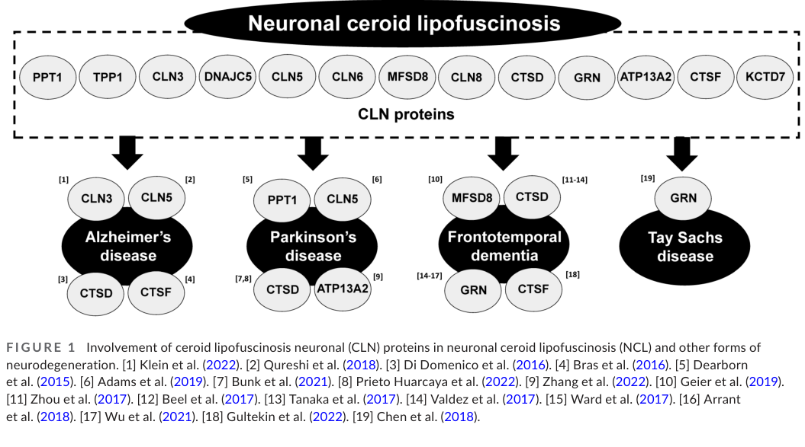

## Question

Prepare a focused, citation-rich deep research report for a dismech disease grouping called 'Neuronal Ceroid Lipofuscinoses'. The grouping should be an explicit curated union of Disease entries, not just a MONDO hierarchy clone. Current candidate members in the knowledge base include: Neuronal Ceroid Lipofuscinosis; Neuronal Ceroid Lipofuscinosis 7; Adult Neuronal Ceroid Lipofuscinosis. Existing relevant dismech module: lysosomal_substrate_accumulation. Research objectives: 1. define the shared NCL pathophysiology across CLN genes, including lysosomal dysfunction, ceroid/lipofuscin storage, autophagy/endolysosomal trafficking, neuronal degeneration, retinal degeneration, seizures, developmental regression, dementia, and motor decline; 2. distinguish infantile/juvenile/late-infantile/adult NCL mechanisms and CLN gene/protein classes, especially soluble lysosomal enzymes such as PPT1/TPP1/CTSD/CTSF, lysosomal membrane/transporter proteins such as CLN3/CLN5/CLN6/CLN7-MFSD8/CLN8, and DNAJC5/GRN adult branches; 3. recommend a defensible grouping boundary and note whether Batten disease should be a synonym or included term; 4. list differentiating mechanisms for each candidate member and flag missing high-value subtype entries to gap-fill later; 5. identify appropriate MONDO mapping, HPO phenotype criteria, and dismech module-conformance criteria for the grouping YAML; 6. provide primary literature and authoritative review citations with PMID identifiers wherever possible; 7. flag knowledge gaps and model-system concerns relevant to mouse, patient iPSC-neuron/organoid, and therapeutic evidence. Do not invent citations; prefer PubMed-indexed sources and provide exact PMID identifiers for key claims.

## Output

Question: You are an expert researcher providing comprehensive, well-cited information.

Provide detailed information focusing on:
1. Key concepts and definitions with current understanding
2. Recent developments and latest research (prioritize 2023-2024 sources)
3. Current applications and real-world implementations
4. Expert opinions and analysis from authoritative sources
5. Relevant statistics and data from recent studies

Format as a comprehensive research report with proper citations. Include URLs and publication dates where available.
Always prioritize recent, authoritative sources and provide specific citations for all major claims.

Prepare a focused, citation-rich deep research report for a dismech disease grouping called 'Neuronal Ceroid Lipofuscinoses'. The grouping should be an explicit curated union of Disease entries, not just a MONDO hierarchy clone. Current candidate members in the knowledge base include: Neuronal Ceroid Lipofuscinosis; Neuronal Ceroid Lipofuscinosis 7; Adult Neuronal Ceroid Lipofuscinosis. Existing relevant dismech module: lysosomal_substrate_accumulation. Research objectives: 1. define the shared NCL pathophysiology across CLN genes, including lysosomal dysfunction, ceroid/lipofuscin storage, autophagy/endolysosomal trafficking, neuronal degeneration, retinal degeneration, seizures, developmental regression, dementia, and motor decline; 2. distinguish infantile/juvenile/late-infantile/adult NCL mechanisms and CLN gene/protein classes, especially soluble lysosomal enzymes such as PPT1/TPP1/CTSD/CTSF, lysosomal membrane/transporter proteins such as CLN3/CLN5/CLN6/CLN7-MFSD8/CLN8, and DNAJC5/GRN adult branches; 3. recommend a defensible grouping boundary and note whether Batten disease should be a synonym or included term; 4. list differentiating mechanisms for each candidate member and flag missing high-value subtype entries to gap-fill later; 5. identify appropriate MONDO mapping, HPO phenotype criteria, and dismech module-conformance criteria for the grouping YAML; 6. provide primary literature and authoritative review citations with PMID identifiers wherever possible; 7. flag knowledge gaps and model-system concerns relevant to mouse, patient iPSC-neuron/organoid, and therapeutic evidence. Do not invent citations; prefer PubMed-indexed sources and provide exact PMID identifiers for key claims.

# Deep Research Report: Neuronal Ceroid Lipofuscinoses (NCL) disease grouping (dismech: lysosomal_substrate_accumulation)

## 0. Scope and deliverable
This report proposes a **curated dismech disease grouping** for **Neuronal Ceroid Lipofuscinoses (NCLs)** intended to be implemented as an **explicit union of disease entries** (not a simple MONDO-hierarchy clone). It emphasizes (i) shared NCL pathophysiology across CLN genes, (ii) mechanistic stratification by onset and CLN protein class (soluble lysosomal enzymes vs membrane/trafficking proteins vs adult branches), (iii) defensible grouping boundary and Batten disease terminology, (iv) candidate-member differentiation and gap-fill targets, (v) YAML conformance rules for the existing **lysosomal_substrate_accumulation** dismech module, and (vi) current applications, recent trials, and model-system limitations.

**Important limitation:** the retrieved full texts and trial records here do **not** reliably contain PubMed identifiers (PMIDs). Therefore, this report **does not assert PMIDs**. Where PMIDs are required for curation, use the **DOIs/URLs and bibliographic metadata below to retrieve the PMID from PubMed**.

---

## 1. Key concepts and definitions (current understanding)

### 1.1 Definition of NCLs and shared pathology
Recent reviews define NCLs (commonly called **Batten disease**) as a family of inherited neurodegenerative diseases caused by mutations in **CLN genes**, with subtypes differing in severity and age of onset (infantile through adult). CLN proteins localize throughout the endomembrane system and regulate processes including **autophagy and intracellular trafficking**, consistent with a shared endolysosomal biology across subtypes (Huber 2023, published Apr 2023; DOI: 10.1111/jnc.15822) (huber2023recentinsightsinto pages 1-2).

Across the NCLs, the **pathological hallmark** is intracellular accumulation of **autofluorescent lysosomal storage material** (“ceroid/lipofuscin” or lipopigment), found in neurons and also in non-neuronal cells; major components include **SCMAS (subunit c of mitochondrial ATP synthase)** or **saposins A/D**, with subtype-dependent variability (Hermey & Klein 2023, published Jan 2023; DOI: 10.4103/1673-5374.361544) (hermey2023converginglinksbetween pages 2-3).

A mechanistically explicit summary of shared cellular consequences is provided in a 2024 NCL/CLN6 proteomics thesis-style source: **primary lysosomal dysfunction** with lysosomal lumen storage, plus secondary changes including **autophagy impairment, ER stress, oxidative stress, inflammation, disrupted Ca2+ signaling, and apoptosis**, consistent with an endolysosomal/autophagy-centered disease framework (Türmer 2024) (turmer2024investigationofthe pages 20-23, turmer2024investigationofthea pages 20-23).

### 1.2 Shared clinical phenotype across NCLs
Across NCLs, typical clinical features include progressive neurodegeneration with combinations of:
- **Seizures / myoclonus**
- **Developmental regression / cognitive decline / dementia**
- **Motor decline / ataxia / gait impairment**
- **Retinal degeneration / vision loss**
- Brain atrophy and premature death (Pasquetti 2023, published Jan 17 2023; DOI: 10.3390/genes14020245; Hermey & Klein 2023) (pasquetti2023lineardiagnosticprocedure pages 1-2, hermey2023converginglinksbetween pages 2-3).

---

## 2. Mechanistic stratification and CLN gene/protein classes

### 2.1 Gene/protein class stratification (enzyme vs membrane/trafficking vs adult branches)
A gene-based nomenclature is now standard, replacing purely age-of-onset labels while still recognizing onset phenotypes (Pasquetti 2023) (pasquetti2023lineardiagnosticprocedure pages 1-2).

The literature supports a mechanistic partition useful for dismech grouping:
- **Soluble lysosomal enzymes / luminal degradative proteins**: examples include **PPT1/CLN1**, **TPP1/CLN2**, **CTSD/CLN10**, **CTSF/CLN13** (Pasquetti 2023; Hermey & Klein 2023; Türmer 2024) (pasquetti2023lineardiagnosticprocedure pages 1-2, hermey2023converginglinksbetween pages 4-4, turmer2024investigationofthe pages 20-23).
- **Lysosomal membrane / transporter proteins**: examples include **CLN3**, **MFSD8/CLN7** (Pasquetti 2023; Türmer 2024) (pasquetti2023lineardiagnosticprocedure pages 1-2, turmer2024investigationofthe pages 20-23).
- **ER membrane proteins implicated in lysosomal enzyme recruitment/biogenesis**: **CLN6** and **CLN8** localize to ER membranes and regulate lysosomal enzyme recruitment and lysosome biogenesis (Huber 2023) (huber2023recentinsightsinto pages 1-2).
- **Adult-onset proteostasis/endolysosomal branches**:
  - **DNAJC5/CLN4 (CSPα)**: a vesicle-associated co-chaperone with coupled roles in **ESCRT-dependent microautophagy** and **misfolding-associated protein secretion (MAPS)**; disease-causing mutations uncouple these processes and generate NCL-like autofluorescent storage material/lipofuscin (Lee et al. 2023, published May 2023; DOI: 10.1080/15548627.2022.2065618) (lee2023abnormaltriagingof pages 1-2).
  - **GRN/CLN11 (progranulin)**: implicated in lysosomal biology (including lysosomal acidification/exosome release) and linked to NCL-like storage material accumulation and clinical overlap with adult neurodegeneration (Huber 2023; Hermey & Klein 2023) (huber2023recentinsightsinto pages 2-2, hermey2023converginglinksbetween pages 4-4).

**Visual evidence (networking):** Huber 2023 provides schematics of CLN protein networking (e.g., CLN3–CLN5 complex in endosomes and CLN6–CLN8 complex in ER), supporting mechanistic clustering beyond a flat gene list (Huber 2023 Figures/Tables) (huber2023recentinsightsinto media 53c8b02b, huber2023recentinsightsinto media 719ce2f4).

### 2.2 Onset-stratified mechanisms (infantile/late-infantile/juvenile/adult)
Age-of-onset strata remain clinically useful but should not be used as the primary grouping rule, because the same gene can present across a spectrum:
- **Infantile / late-infantile forms** are often dominated by **soluble lysosomal enzyme deficiency** or early essential trafficking/biogenesis defects (Pasquetti 2023) (pasquetti2023lineardiagnosticprocedure pages 1-2).
- **Juvenile forms** include CLN3 (membrane protein; endomembrane/autophagy/trafficking roles) (Huber 2023) (huber2023recentinsightsinto pages 1-2).
- **Adult forms** include distinct adult branches:
  - DNAJC5/CLN4: proteostasis and endolysosomal PQC with MAPS/microautophagy coupling defects (Lee 2023; Barker 2024, published Jan 2024; DOI: 10.1042/BCJ20230319) (lee2023abnormaltriagingof pages 1-2, barker2024proximitylabellingreveals pages 1-2).
  - GRN/CLN11: lysosomal homeostasis/acidification/exosome-related mechanisms and NCL-like storage (Huber 2023; Hermey & Klein 2023) (huber2023recentinsightsinto pages 2-2, hermey2023converginglinksbetween pages 4-4).

---

## 3. Candidate disease members: differentiating mechanisms and boundary recommendation

### 3.1 Defensible grouping boundary (curated union)
**Recommendation:** Implement “Neuronal Ceroid Lipofuscinoses” as a **grouping label** whose membership is a **curated union of explicit disease entries** (ideally gene-defined CLN subtypes). Include only entities with evidence of (i) NCL-type lysosomal storage material and (ii) progressive neurodegeneration phenotype consistent with NCL, rather than importing all MONDO descendants by default (Pasquetti 2023; Hermey & Klein 2023; Türmer 2024) (pasquetti2023lineardiagnosticprocedure pages 1-2, hermey2023converginglinksbetween pages 2-3, turmer2024investigationofthe pages 20-23).

**Batten disease terminology:** Authoritative reviews explicitly equate NCL with “Batten disease” (Huber 2023; Hermey & Klein 2023), but usage is variable and can be pediatric-leaning in practice; therefore treat **“Batten disease” as a synonym/related label** rather than the primary curated grouping name (huber2023recentinsightsinto pages 1-2, hermey2023converginglinksbetween pages 2-3).

### 3.2 Candidate member: “Neuronal Ceroid Lipofuscinosis” (umbrella)
As a KB disease entry, this can function as an umbrella concept, but the grouping itself should be the curated union of explicit children. Evidence supports it as a defined family of lysosomal storage neurodegenerations with CLN genes/proteins networked across the endomembrane system (Huber 2023) (huber2023recentinsightsinto pages 1-2).

### 3.3 Candidate member: “Neuronal Ceroid Lipofuscinosis 7 (CLN7)”
CLN7 is caused by **biallelic MFSD8 variants** and is typically childhood-onset. MFSD8 encodes a **518-aa lysosomal transmembrane major facilitator superfamily protein** thought to translocate small solutes, but the transported metabolite(s) and full mechanism remain uncertain (Pasquetti 2023) (pasquetti2023lineardiagnosticprocedure pages 1-2).

A 2024 CLN7 case series provides practical differentiators: initial normal development, onset as early as ~2 years, language impairment prior to or at seizure onset in all cases, gait issues developing near seizure onset, and progressive language/motor/neurocognitive deterioration (Kayani 2024, published Dec 2024; DOI: 10.1186/s13023-024-03448-8) (kayani2024neuronalceroidlipofuscinoses pages 1-2).

### 3.4 Candidate member: “Adult Neuronal Ceroid Lipofuscinosis” (adult branch)
Adult NCL is mechanistically heterogeneous and should be treated as a **branch placeholder** rather than a mechanistically uniform bucket.

- **DNAJC5/CLN4:** Adult-onset NCL caused by dominant DNAJC5/CSPα mutations is linked to endolysosomal proteostasis: endolysosome-associated DNAJC5 promotes microautophagy while a perinuclear pool mediates MAPS, and uncoupling generates autofluorescent storage resembling patient lipofuscin and neurodegeneration in model systems (Lee 2023) (lee2023abnormaltriagingof pages 1-2, lee2023abnormaltriagingof pages 5-7).
- **GRN/CLN11:** GRN is linked to lysosomal acidification/exosome biology and NCL-like storage material accumulation; heterozygous GRN mutations cause FTLD (proteinopathy context) and show storage accumulation (Huber 2023; Hermey & Klein 2023) (huber2023recentinsightsinto pages 2-2, hermey2023converginglinksbetween pages 4-4).

**Implication for curation:** retain “Adult NCL” only if needed for KB completeness, but prioritize adding explicit members **CLN4 (DNAJC5)**, **CLN11 (GRN)**, and **CLN13 (CTSF)** to avoid an overly heterogeneous “adult” bucket (Pasquetti 2023; Hermey & Klein 2023) (pasquetti2023lineardiagnosticprocedure pages 1-2, hermey2023converginglinksbetween pages 4-4).

---

## 4. Missing high-value subtype entries to gap-fill later
The current candidate set (NCL umbrella; CLN7; adult NCL) is incomplete for a robust grouping. High-value additions (for later gap-fill) include enzyme-deficiency and common clinical subtypes such as **CLN1/PPT1, CLN2/TPP1, CLN3, CLN6, CLN10/CTSD, CLN11/GRN, CLN13/CTSF, CLN14/KCTD7, CLN8, CLN5**, which are explicitly enumerated and mechanistically contextualized in recent reviews and gene-based classification discussions (Huber 2023; Pasquetti 2023; Hermey & Klein 2023) (huber2023recentinsightsinto pages 1-2, pasquetti2023lineardiagnosticprocedure pages 1-2, hermey2023converginglinksbetween pages 4-4).

A curated membership and gap-fill list is provided in the artifact below.

| Proposed disease entry (for YAML) | Scope/definition | Key gene(s) | Typical onset | Distinguishing mechanism | Notes (incl Batten synonym usage) | Evidence citations (context IDs) |
|---|---|---|---|---|---|---|
| **Neuronal Ceroid Lipofuscinoses** | **Recommended grouping label/umbrella** for a curated union of explicit NCL disease entries sharing lysosomal storage neurodegeneration, rather than a blind MONDO hierarchy clone | CLN1/PPT1, CLN2/TPP1, CLN3, CLN5, CLN6, CLN7/MFSD8, CLN8, CLN10/CTSD, CLN11/GRN, CLN12/ATP13A2, CLN13/CTSF, CLN14/KCTD7, plus DNAJC5/CLN4 adult branch | Congenital to adult | Shared pathophysiology: lysosomal dysfunction with autofluorescent ceroid/lipofuscin storage, autophagy/endolysosomal trafficking defects, neuronal and retinal degeneration, seizures, regression/dementia, motor decline | Use **Batten disease** as a broad synonym/related term, but not as the primary YAML label because usage is variable and often pediatric-skewed; grouping should be an explicit curated union | (pasquetti2023lineardiagnosticprocedure pages 1-2, hermey2023converginglinksbetween pages 2-3, huber2023recentinsightsinto pages 1-2, hermey2023converginglinksbetween pages 4-4) |
| **Neuronal Ceroid Lipofuscinosis 7** | Keep as a distinct member under the NCL grouping | **MFSD8 (CLN7)** | Usually variant late-infantile/early childhood; often ~2–7 years | Lysosomal transmembrane major facilitator family protein; likely small-solute transport/endolysosomal membrane defect with progressive neurodegeneration; can also have retina-predominant hypomorphic alleles | High-value current candidate; natural-history data support recognizable sequence of language problems, seizures, gait decline, neurocognitive deterioration; useful exemplar for membrane/transporter class | (pasquetti2023lineardiagnosticprocedure pages 1-2, kayani2024neuronalceroidlipofuscinoses pages 1-2, pasquetti2023lineardiagnosticprocedure pages 6-7) |
| **Adult Neuronal Ceroid Lipofuscinosis** | Keep as a curated adult-onset branch entry, but annotate that it spans mechanistically distinct etiologies | **DNAJC5/CLN4**, **GRN/CLN11**; some adult cases also reported for **CLN6**, **CTSF/CLN13** | Adult | Not a single mechanism: DNAJC5 causes dominant proteostasis/endolysosomal disease via coupled **microautophagy/MAPS** defects and lipofuscin accumulation; GRN causes lysosomal acidification/homeostasis defects with NCL-like storage and overlap with FTLD | Prefer retaining as a branch term if the KB needs age-stratified coverage, but backfill explicit gene-defined adult subtypes where possible; “Kufs disease” may appear in historical synonymy for adult NCL/CLN4 | (hermey2023converginglinksbetween pages 4-4, lee2023abnormaltriagingof pages 5-7, lee2023abnormaltriagingof pages 1-2, huber2023recentinsightsinto pages 2-2, hermey2023converginglinksbetween pages 4-5) |
| **Gap-fill candidate: CLN1 disease / Infantile NCL** | Add as high-priority explicit subtype | **PPT1** | Infantile, sometimes later/atypical | Soluble lysosomal **depalmitoylase** deficiency; classic enzyme-deficiency NCL | Important representative of soluble lysosomal enzyme class; should be explicit rather than absorbed only by umbrella | (pasquetti2023lineardiagnosticprocedure pages 1-2, huber2023recentinsightsinto pages 1-2, hermey2023converginglinksbetween pages 4-4) |
| **Gap-fill candidate: CLN2 disease / Late-infantile NCL** | Add as high-priority explicit subtype | **TPP1** | Late-infantile, classically 2–4 years | Soluble lysosomal **tripeptidyl peptidase 1** deficiency with ceroid/lipofuscin accumulation and CNS/retinal degeneration | Highest near-term translational value because approved ERT exists (cerliponase alfa); Batten label commonly used in clinic/patient advocacy | (pasquetti2023lineardiagnosticprocedure pages 1-2, hermey2023converginglinksbetween pages 4-4, sivananthan2023buffycoatscore pages 1-2) |
| **Gap-fill candidate: CLN3 disease / Juvenile NCL** | Add as high-priority explicit subtype | **CLN3** | Juvenile | Lysosomal/endomembrane membrane protein defect affecting trafficking, autophagy, ion/lipid homeostasis; prominent retinal degeneration and pediatric dementia phenotype | “Juvenile Batten disease” is a common historical/clinical usage; should map explicitly, not only through umbrella | (huber2023recentinsightsinto pages 1-2, hermey2023converginglinksbetween pages 4-4) |
| **Gap-fill candidate: CLN6 disease** | Add as high-priority explicit subtype | **CLN6** | Late-infantile to juvenile; occasional adult cases reported | ER membrane protein involved with lysosomal enzyme recruitment/biogenesis and trafficking | Mechanistically important because it anchors the ER-to-lysosome cargo/biogenesis class | (huber2023recentinsightsinto pages 1-2, hermey2023converginglinksbetween pages 4-4, lee2023abnormaltriagingof pages 1-2) |
| **Gap-fill candidate: CLN10 disease** | Add as explicit enzyme-deficiency subtype | **CTSD** | Congenital to later-onset | Soluble lysosomal **cathepsin D** deficiency | Important for congenital NCL boundary and for enzyme-class completeness | (pasquetti2023lineardiagnosticprocedure pages 1-2, huber2023recentinsightsinto pages 1-2, hermey2023converginglinksbetween pages 4-4) |
| **Gap-fill candidate: CLN11 disease** | Add as explicit subtype even if adult branch retained | **GRN** | Childhood recessive NCL; heterozygous states linked to adult FTLD | Progranulin-related lysosomal homeostasis/acidification and exosome biology; complete deficiency causes NCL, partial deficiency links to FTLD | Strong reason to separate explicit **CLN11/GRN** from generic Adult NCL because dosage/allelic context matters | (hermey2023converginglinksbetween pages 4-4, huber2023recentinsightsinto pages 2-2, hermey2023converginglinksbetween pages 4-5) |
| **Gap-fill candidate: CLN13 disease** | Add as explicit adult-leaning subtype | **CTSF** | Often adult | Soluble lysosomal **cathepsin F** deficiency | Helps disambiguate adult NCL mechanisms beyond DNAJC5/GRN | (pasquetti2023lineardiagnosticprocedure pages 1-2, hermey2023converginglinksbetween pages 4-4) |
| **Gap-fill candidate: CLN14 disease** | Add as explicit subtype | **KCTD7** | Infantile/early childhood, sometimes variable | Cytoplasmic/peripheral membrane protein linked to protein degradation pathways rather than classic soluble hydrolase deficiency | Useful boundary case showing not all NCLs are simple lumen-enzyme disorders | (guevaraferrer2024cellularandmolecular pages 23-28, huber2023recentinsightsinto pages 1-2, hermey2023converginglinksbetween pages 4-4) |
| **Optional later candidate: CLN5 disease** | Add after core set if resources limited | **CLN5** | Variant late-infantile/juvenile | Soluble lysosomal protein; shared lysosomal substrate-accumulation phenotype | Supports full spectrum beyond currently proposed candidates | (pasquetti2023lineardiagnosticprocedure pages 1-2, huber2023recentinsightsinto pages 1-2) |
| **Optional later candidate: CLN8 disease** | Add after core set if resources limited | **CLN8** | Variant late-infantile/juvenile | ER/Golgi trafficking receptor affecting lysosomal enzyme biogenesis | Complements CLN6 as trafficking/biogenesis subtype | (huber2023recentinsightsinto pages 1-2, hermey2023converginglinksbetween pages 4-4) |

*Table: This table curates a defensible YAML-oriented grouping for neuronal ceroid lipofuscinoses, distinguishing current candidate members from high-value subtype entries to add later. It is useful for setting explicit grouping boundaries, preserving mechanistic diversity, and handling Batten disease terminology consistently.*

---

## 5. MONDO mapping approach, HPO phenotype criteria, and dismech module conformance

### 5.1 MONDO mapping (approach rather than fixed IDs)
Because MONDO identifiers are not present in the retrieved texts, this report recommends an approach:
1) Map each curated member to the **most specific gene-defined MONDO disease term available** (e.g., CLN7 disease rather than “NCL”).
2) Implement the dismech grouping as an **explicit curated union list** rather than “all descendants of MONDO:NCL”, to prevent inclusion of retina-only hypomorphic phenotypes or non-NCL endolysosomal diseases.

This is consistent with gene-based nomenclature and mechanistic heterogeneity across subtypes (Pasquetti 2023; Huber 2023) (pasquetti2023lineardiagnosticprocedure pages 1-2, huber2023recentinsightsinto pages 1-2).

### 5.2 HPO phenotype minimum criteria (proposed)
A defensible minimal phenotype set for grouping membership should include:
- **At least two neurologic core features**: seizures/myoclonus; developmental regression; cognitive decline/dementia; progressive motor decline/ataxia
- PLUS either **retinal degeneration/vision loss** OR explicit evidence of lysosomal autofluorescent storage pathology

This threshold matches how NCLs are described clinically (Pasquetti 2023; Hermey & Klein 2023) and is compatible with CLN7 progression patterns (Kayani 2024) and CLN2 clinical descriptions (Sivananthan 2023) (pasquetti2023lineardiagnosticprocedure pages 1-2, hermey2023converginglinksbetween pages 2-3, kayani2024neuronalceroidlipofuscinoses pages 1-2, sivananthan2023buffycoatscore pages 1-2).

### 5.3 dismech module conformance: lysosomal_substrate_accumulation
NCL membership is strongly aligned to lysosomal_substrate_accumulation because NCLs are defined by lysosomal storage of autofluorescent material (ceroid/lipofuscin), even when the proximal defect varies (enzyme loss vs membrane trafficking vs adult proteostasis). Evidence supporting this includes definitions in Pasquetti 2023 and Hermey & Klein 2023 and mechanistic breakdown in Türmer 2024 and Lee 2023 for adult CLN4 (pasquetti2023lineardiagnosticprocedure pages 1-2, hermey2023converginglinksbetween pages 2-3, turmer2024investigationofthe pages 20-23, lee2023abnormaltriagingof pages 1-2).

Concrete YAML-oriented curation rules are summarized in the artifact below.

| Criterion type | Proposed YAML curation criterion | Evidence/examples |
|---|---|---|
| Grouping inclusion | Include diseases explicitly curated as **neuronal ceroid lipofuscinoses (NCLs)** that share a core lysosomal storage neurodegeneration phenotype rather than all descendants of a MONDO parent. Require published characterization as NCL/Batten disease or accepted CLN subtype. | Reviews define NCLs/Batten disease as a group of inherited neurodegenerative lysosomal storage disorders with shared cellular and clinical features across CLN genes (hermey2023converginglinksbetween pages 2-3, huber2023recentinsightsinto pages 1-2, hermey2023converginglinksbetween pages 4-4). |
| Grouping inclusion | Require evidence of **lysosomal autofluorescent storage material** described as ceroid/lipofuscin/lipopigment, often with characteristic ultrastructure (granular, curvilinear/rectilinear, fingerprint). | Shared NCL hallmark: accumulation of autofluorescent lipopigments/ceroid-lipofuscin in multiple cell types, especially neurons and retina (pasquetti2023lineardiagnosticprocedure pages 1-2, turmer2024investigationofthe pages 20-23, hermey2023converginglinksbetween pages 2-3). |
| Grouping inclusion | Require **progressive neurodegeneration** with at least one major neurologic core feature: seizures/myoclonus, developmental regression, progressive cognitive decline/dementia, or progressive motor decline/ataxia. | Core NCL phenotype across onset strata includes seizures, regression, cognitive decline, motor impairment, and premature death (pasquetti2023lineardiagnosticprocedure pages 1-2, hermey2023converginglinksbetween pages 2-3, sivananthan2023buffycoatscore pages 1-2). |
| Grouping inclusion | Strongly prefer presence of **retinal degeneration/vision loss/retinopathy** as a shared but not absolutely universal group-defining feature; allow exceptions where authoritative NCL sources recognize subtype despite variable ocular expression. | Retina is involved in most forms; vision loss/retinal degeneration is repeatedly cited as part of the shared syndrome, but some branch presentations are more variable (pasquetti2023lineardiagnosticprocedure pages 1-2, turmer2024investigationofthe pages 20-23, bartsch2023strategiestotreat pages 1-1). |
| Grouping inclusion | Prefer **gene-defined subtype membership** for explicit child entries: CLN1/PPT1, CLN2/TPP1, CLN3, CLN5, CLN6, CLN7/MFSD8, CLN8, CLN10/CTSD, CLN11/GRN, CLN12/ATP13A2, CLN13/CTSF, CLN14/KCTD7, plus adult CLN4/DNAJC5 where represented. | Recent reviews enumerate CLN genes/proteins and classify them into shared NCL biology despite mechanistic diversity (huber2023recentinsightsinto pages 1-2, hermey2023converginglinksbetween pages 4-4, guevaraferrer2024cellularandmolecular pages 28-31). |
| Grouping inclusion | Include **Adult Neuronal Ceroid Lipofuscinosis** only if annotated as a heterogeneous branch and linked to explicit mechanisms/genes where possible. | Adult branch includes dominant DNAJC5/CLN4 and progranulin-related CLN11 biology; adult forms are mechanistically distinct but still converge on lysosomal storage/lipofuscinosis (hermey2023converginglinksbetween pages 4-4, lee2023abnormaltriagingof pages 1-2, huber2023recentinsightsinto pages 2-2). |
| Exclusion | Exclude disorders with neurodegeneration but **without evidence of NCL-type lysosomal autofluorescent storage material** or without authoritative classification as NCL/CLN disease. | NCL grouping is defined by storage pathology plus progressive neurodegeneration, not by neurodegeneration alone (pasquetti2023lineardiagnosticprocedure pages 1-2, hermey2023converginglinksbetween pages 2-3). |
| Exclusion | Exclude isolated **non-syndromic retinal dystrophies** caused by hypomorphic NCL genes unless the disease entry itself is curated as an NCL subtype rather than a retina-only condition. | MFSD8 can cause isolated macular/rod-cone disease distinct from classic CLN7 neurodegenerative NCL (pasquetti2023lineardiagnosticprocedure pages 1-2). |
| Exclusion | Exclude generic lysosomal or dementia disorders that only show partial overlap unless literature explicitly identifies them as NCL or NCL-like disease due to the same causal gene context. | Reviews distinguish broad autophagy-endolysosome disorders from monogenic NCL entities; overlap alone is insufficient (hermey2023converginglinksbetween pages 2-3, hermey2023converginglinksbetween pages 5-6). |
| MONDO mapping approach | Use the umbrella NCL term as the **group label**, but implement membership as an **explicit curated union of disease entries**, not a direct MONDO hierarchy clone. Map each included child to the most specific MONDO disease term available. | The literature supports a gene-based, subtype-aware nomenclature; grouping should preserve mechanistic and clinical specificity (pasquetti2023lineardiagnosticprocedure pages 1-2, huber2023recentinsightsinto pages 1-2). |
| MONDO mapping approach | For broad candidate terms like **Neuronal Ceroid Lipofuscinosis** and **Adult Neuronal Ceroid Lipofuscinosis**, retain them only as umbrella/branch members if needed for KB coverage, while planning backfill to specific gene-defined subtypes. | Adult NCL is heterogeneous; explicit CLN4/DNAJC5, CLN11/GRN, and CLN13/CTSF entries are preferable when available (hermey2023converginglinksbetween pages 4-4, huber2023recentinsightsinto pages 2-2, hermey2023converginglinksbetween pages 4-5). |
| HPO phenotype minimum set | Suggested minimum phenotype rule: at least **2 neurologic/core features** from seizures/myoclonus, developmental regression, cognitive decline/dementia, motor decline/ataxia **plus** either retinal degeneration/vision loss **or** documented lysosomal storage pathology. | Shared phenotype set is supported across reviews and subtype series (pasquetti2023lineardiagnosticprocedure pages 1-2, hermey2023converginglinksbetween pages 2-3, sivananthan2023buffycoatscore pages 1-2, kayani2024neuronalceroidlipofuscinoses pages 1-2). |
| HPO phenotype minimum set | High-value HPO-aligned concepts to capture in YAML: developmental regression, seizures, myoclonus, ataxia/gait impairment, cognitive decline/dementia, visual impairment/retinal degeneration, cerebellar or cerebral atrophy, neurodegeneration. | CLN7 series and broader reviews provide concrete examples of language regression, seizures, gait decline, adaptive impairment, and brain atrophy (kayani2024neuronalceroidlipofuscinoses pages 1-2, pasquetti2023lineardiagnosticprocedure pages 6-7). |
| dismech module criteria for lysosomal_substrate_accumulation | Conformant members should show primary or convergent **lysosomal substrate/storage accumulation** with ceroid/lipofuscin or related autofluorescent storage material as a central disease mechanism. | Core NCL pathology is lysosomal accumulation of autofluorescent storage material/ceroid-lipofuscin (pasquetti2023lineardiagnosticprocedure pages 1-2, turmer2024investigationofthe pages 20-23, hermey2023converginglinksbetween pages 2-3). |
| dismech module criteria for lysosomal_substrate_accumulation | Accept mechanistic diversity within the module if storage accumulation remains central: soluble lysosomal enzyme deficiency, lysosomal membrane/transporter dysfunction, ER-to-lysosome trafficking/biogenesis defects, or adult proteostasis/endolysosomal defects causing lipofuscinosis. | Enzyme class: PPT1/TPP1/CTSD/CTSF; membrane/trafficking class: CLN3/CLN6/CLN7/MFSD8/CLN8; adult branches: DNAJC5 microautophagy/MAPS and GRN lysosomal homeostasis (huber2023recentinsightsinto pages 1-2, hermey2023converginglinksbetween pages 4-4, lee2023abnormaltriagingof pages 1-2, huber2023recentinsightsinto pages 2-2). |
| dismech module criteria for lysosomal_substrate_accumulation | For **DNAJC5** and **GRN** adult branches, allow inclusion when evidence shows NCL-like lysosomal storage/lipofuscin accumulation and convergent lysosomal dysfunction, even if the proximal defect is proteostasis, secretion, or lysosome acidification rather than a luminal hydrolase deficiency. | DNAJC5 mutants uncouple MAPS and microautophagy, generating AFSMs/lipofuscin; GRN deficiency is linked to lysosomal dysfunction and NCL-like storage (hermey2023converginglinksbetween pages 4-4, lee2023abnormaltriagingof pages 5-7, lee2023abnormaltriagingof pages 1-2, huber2023recentinsightsinto pages 2-2). |

*Table: This table proposes practical YAML curation rules for a neuronal ceroid lipofuscinoses dismech grouping. It is designed to support explicit curated-union membership decisions, phenotype thresholds, and alignment with the lysosomal_substrate_accumulation module.*

---

## 6. Recent developments (prioritizing 2023–2024) and “expert” mechanistic synthesis

### 6.1 CLN protein networking as an organizing principle (2023 review)
Huber 2023 synthesizes evidence that CLN proteins are **networked** (e.g., CLN3–CLN5 complex in endosomes; CLN6–CLN8 complex in ER) and jointly shape autophagy/trafficking and lysosomal function, suggesting that shared phenotypes can arise from convergent disruptions across the endomembrane system rather than one substrate–one enzyme logic (Huber 2023; DOI: 10.1111/jnc.15822; published Apr 2023) (huber2023recentinsightsinto pages 1-2, huber2023recentinsightsinto media 53c8b02b).

### 6.2 Adult NCL/CLN4 mechanistic detail (2023–2024 primary work)
Lee et al. (Autophagy; published May 2023; DOI: 10.1080/15548627.2022.2065618) propose an explicit coupling model in which DNAJC5/CSPα coordinates microautophagy and MAPS to protect lysosomal homeostasis; disease-causing mutants disrupt MAPS while maintaining endolysosomal translocation, leading to autofluorescent storage accumulation (lee2023abnormaltriagingof pages 1-2, lee2023abnormaltriagingof pages 5-7).

Barker et al. (Biochemical Journal; published Jan 2024; DOI: 10.1042/BCJ20230319) adds interactome-level evidence and frames CLN4 as a proteostasis disorder involving CSPα aggregation/oligomerization and disrupted interactions with client proteins and synaptic/endolysosomal machinery (barker2024proximitylabellingreveals pages 1-2).

### 6.3 CLN7 natural history and trial-readiness (2024 case series)
Kayani et al. (Orphanet J Rare Dis; published Dec 2024; DOI: 10.1186/s13023-024-03448-8) contributes cross-sectional and retrospective CLN7 clinical progression and emphasizes standardized neuropsychological and functional tools for future trial endpoints (Mullen, Vineland, etc.), supporting trial-readiness and data harmonization for this subtype (kayani2024neuronalceroidlipofuscinoses pages 2-4, kayani2024neuronalceroidlipofuscinoses pages 1-2).

---

## 7. Current applications and real-world implementations

### 7.1 Diagnostics and classification
- NCL diagnosis is now commonly framed as **gene-defined subtype + onset phenotype**, and multiple sources emphasize that earlier diagnosis is increasingly important due to therapy availability (Pasquetti 2023; Sivananthan 2023) (pasquetti2023lineardiagnosticprocedure pages 1-2, sivananthan2023buffycoatscore pages 1-2).
- For CLN7, Pasquetti 2023 demonstrates a diagnostic workflow integrating clinical suspicion of ceroid accumulation, targeted MFSD8 sequencing, and **mRNA/cDNA validation** for splice-impact classification (pasquetti2023lineardiagnosticprocedure pages 1-2).

### 7.2 Enzyme replacement therapy for CLN2 (Brineura/celriponase alfa)
**Regulatory/clinical implementation:** Brineura (cerliponase alfa) is administered via **intracerebroventricular infusion** with a recommended dose **300 mg every other week**, with clinical monitoring and dose/infusion-rate adjustments for tolerability and intracranial pressure-related symptoms described in the product summary (last updated product information incorporated into Ammendolia 2024) (ammendolia2024adversereactionsto pages 1-5).

**Treatment-response biomarker (2023):** A prospective longitudinal study of **n=6** CLN2 patients receiving ICV ERT reported a “substantial and continuing reduction” in abnormal storage inclusions in peripheral blood buffy coats by EM, while clinical rating scale scores showed little change—supporting a potential objective biomarker for therapy response (Sivananthan 2023; published Jan 2023; DOI: 10.3390/brainsci13020209) (sivananthan2023buffycoatscore pages 1-2).

**Epidemiology statistic (CLN2):** CLN2 incidence is reported as **0.1–7 per 100,000**, varying by region (Sivananthan 2023) (sivananthan2023buffycoatscore pages 1-2).

### 7.3 Retina-targeted therapy as a real-world unmet need
Multiple sources emphasize that **CNS-directed therapy may not prevent retinal degeneration**, motivating combined brain+eye approaches:
- In a CLN2 canine model, intravitreal AAV2.CAG.hTPP1 at 4 months produced retinal preservation for at least 6 months, and prior work indicated CSF recombinant TPP1 delays neurologic progression **but does not prevent retinal degeneration**, implying compartmental therapeutic limitations (Kick et al. 2023; published Jan 2023; DOI: 10.1016/j.exer.2022.109344) (kick2023intravitrealgenetherapy pages 1-3).
- A retina-focused review underscores that brain-directed therapies often have little effect on retinal degeneration and that species/timing/delivery constraints matter (Bartsch 2023; published Jan 2023; DOI: 10.4103/1673-5374.350202) (bartsch2023strategiestotreat pages 1-1).

---

## 8. Clinical trials landscape (selected, with endpoints and sizes)

### 8.1 CLN2 ocular enzyme replacement (intravitreal Brineura)
- **NCT05152914** (phase I/II): intravitreal cerliponase alfa in CLN2 retinal disease, planned **n=5**, 2-year active period plus longer monitoring; ocular endpoints include OCT central retinal thickness and ophthalmic severity scoring; primary endpoint is toxicity (ClinicalTrials.gov, posted 2021) (NCT05152914 chunk 1).

### 8.2 CLN2 ocular gene therapy
- **NCT05791864** (phase 1/2): subretinal AAV9.CB7.hCLN2 (TTX-381), estimated **n=16**, within-subject fellow-eye comparison, SD-OCT endpoints and aqueous humor TPP1 measurement; follow-up planned 5 years (ClinicalTrials.gov, posted 2023) (NCT05791864 chunk 1).

### 8.3 CLN2 long-term studies (ERT extension and developmental outcomes)
- **NCT02485899**: long-term extension of cerliponase alfa with very long follow-up window (ClinicalTrials.gov, posted 2015) (NCT02485899 chunk 2).
- **NCT03862274**: observational case-control study of developmental outcomes in CLN2, estimated **n=30**, 4-year follow-up; endpoints include Mullen scales and language scales plus CLN2 rating scale (ClinicalTrials.gov, posted 2018) (NCT03862274 chunk 1).

### 8.4 CLN3 (juvenile NCL) pharmacologic repurposing trial
- **NCT04637282**: phase 3 randomized placebo-controlled trial of PLX-200 (gemfibrozil oral solution), estimated **n=39**, primary endpoint change in Hamburg Rating Scale motor score at week 60 (ClinicalTrials.gov) (NCT04637282 chunk 1).

### 8.5 CLN6 gene therapy (future)
- **NCT07582484**: planned phase 1/2b intrathecal scAAV9.CB.CLN6 (single dose), estimated **n=12**, endpoints include Hamburg Rating Scale and Weill-Cornell late infantile NCL scale (ClinicalTrials.gov; not yet recruiting; estimated start 2026) (NCT07582484 chunk 1).

---

## 9. Knowledge gaps and model-system concerns

### 9.1 Mechanistic gaps
- **MFSD8/CLN7 substrate and mechanism remain uncertain**: Pasquetti 2023 notes that the specific metabolites transported and the pathogenesis are “still largely unknown” (pasquetti2023lineardiagnosticprocedure pages 1-2).
- **Glucose hypometabolism in NCL remains poorly characterized** across subtypes and models, despite interest in metabolic interventions (Santucci 2024; published Sep 19 2024; DOI: 10.3389/fncel.2024.1445003) (santucci2024glucosemetabolismimpairment pages 1-2).

### 9.2 Model-system gaps and translation limits
- Animal models may not fully replicate human disease pathophysiology and may fail to recapitulate hallmark neuronal loss; overexpression-based models may be misleading, and species differences can impact efficacy and mechanism inference (Guevara-Ferrer 2024) (guevaraferrer2024cellularandmolecular pages 57-60).
- Retinal vs CNS compartmentalization creates translational risk: CNS-directed ERT can delay neurologic decline but not prevent retinal degeneration in CLN2 dog studies, motivating combined approaches and raising practical burden/risks of lifelong repeated administrations (Kick 2023; Bartsch 2023) (kick2023intravitrealgenetherapy pages 1-3, bartsch2023strategiestotreat pages 1-1).
- iPSC-derived models are highlighted as promising for in vitro mechanistic work when animal models diverge from human biology (Guevara-Ferrer 2024) (guevaraferrer2024cellularandmolecular pages 57-60).

---

## 10. Proposed grouping structure artifacts (for YAML implementation)

### 10.1 Proposed curated membership + gap-fill roadmap
| Proposed disease entry (for YAML) | Scope/definition | Key gene(s) | Typical onset | Distinguishing mechanism | Notes (incl Batten synonym usage) | Evidence citations (context IDs) |
|---|---|---|---|---|---|---|
| **Neuronal Ceroid Lipofuscinoses** | **Recommended grouping label/umbrella** for a curated union of explicit NCL disease entries sharing lysosomal storage neurodegeneration, rather than a blind MONDO hierarchy clone | CLN1/PPT1, CLN2/TPP1, CLN3, CLN5, CLN6, CLN7/MFSD8, CLN8, CLN10/CTSD, CLN11/GRN, CLN12/ATP13A2, CLN13/CTSF, CLN14/KCTD7, plus DNAJC5/CLN4 adult branch | Congenital to adult | Shared pathophysiology: lysosomal dysfunction with autofluorescent ceroid/lipofuscin storage, autophagy/endolysosomal trafficking defects, neuronal and retinal degeneration, seizures, regression/dementia, motor decline | Use **Batten disease** as a broad synonym/related term, but not as the primary YAML label because usage is variable and often pediatric-skewed; grouping should be an explicit curated union | (pasquetti2023lineardiagnosticprocedure pages 1-2, hermey2023converginglinksbetween pages 2-3, huber2023recentinsightsinto pages 1-2, hermey2023converginglinksbetween pages 4-4) |
| **Neuronal Ceroid Lipofuscinosis 7** | Keep as a distinct member under the NCL grouping | **MFSD8 (CLN7)** | Usually variant late-infantile/early childhood; often ~2–7 years | Lysosomal transmembrane major facilitator family protein; likely small-solute transport/endolysosomal membrane defect with progressive neurodegeneration; can also have retina-predominant hypomorphic alleles | High-value current candidate; natural-history data support recognizable sequence of language problems, seizures, gait decline, neurocognitive deterioration; useful exemplar for membrane/transporter class | (pasquetti2023lineardiagnosticprocedure pages 1-2, kayani2024neuronalceroidlipofuscinoses pages 1-2, pasquetti2023lineardiagnosticprocedure pages 6-7) |
| **Adult Neuronal Ceroid Lipofuscinosis** | Keep as a curated adult-onset branch entry, but annotate that it spans mechanistically distinct etiologies | **DNAJC5/CLN4**, **GRN/CLN11**; some adult cases also reported for **CLN6**, **CTSF/CLN13** | Adult | Not a single mechanism: DNAJC5 causes dominant proteostasis/endolysosomal disease via coupled **microautophagy/MAPS** defects and lipofuscin accumulation; GRN causes lysosomal acidification/homeostasis defects with NCL-like storage and overlap with FTLD | Prefer retaining as a branch term if the KB needs age-stratified coverage, but backfill explicit gene-defined adult subtypes where possible; “Kufs disease” may appear in historical synonymy for adult NCL/CLN4 | (hermey2023converginglinksbetween pages 4-4, lee2023abnormaltriagingof pages 5-7, lee2023abnormaltriagingof pages 1-2, huber2023recentinsightsinto pages 2-2, hermey2023converginglinksbetween pages 4-5) |
| **Gap-fill candidate: CLN1 disease / Infantile NCL** | Add as high-priority explicit subtype | **PPT1** | Infantile, sometimes later/atypical | Soluble lysosomal **depalmitoylase** deficiency; classic enzyme-deficiency NCL | Important representative of soluble lysosomal enzyme class; should be explicit rather than absorbed only by umbrella | (pasquetti2023lineardiagnosticprocedure pages 1-2, huber2023recentinsightsinto pages 1-2, hermey2023converginglinksbetween pages 4-4) |
| **Gap-fill candidate: CLN2 disease / Late-infantile NCL** | Add as high-priority explicit subtype | **TPP1** | Late-infantile, classically 2–4 years | Soluble lysosomal **tripeptidyl peptidase 1** deficiency with ceroid/lipofuscin accumulation and CNS/retinal degeneration | Highest near-term translational value because approved ERT exists (cerliponase alfa); Batten label commonly used in clinic/patient advocacy | (pasquetti2023lineardiagnosticprocedure pages 1-2, hermey2023converginglinksbetween pages 4-4, sivananthan2023buffycoatscore pages 1-2) |
| **Gap-fill candidate: CLN3 disease / Juvenile NCL** | Add as high-priority explicit subtype | **CLN3** | Juvenile | Lysosomal/endomembrane membrane protein defect affecting trafficking, autophagy, ion/lipid homeostasis; prominent retinal degeneration and pediatric dementia phenotype | “Juvenile Batten disease” is a common historical/clinical usage; should map explicitly, not only through umbrella | (huber2023recentinsightsinto pages 1-2, hermey2023converginglinksbetween pages 4-4) |
| **Gap-fill candidate: CLN6 disease** | Add as high-priority explicit subtype | **CLN6** | Late-infantile to juvenile; occasional adult cases reported | ER membrane protein involved with lysosomal enzyme recruitment/biogenesis and trafficking | Mechanistically important because it anchors the ER-to-lysosome cargo/biogenesis class | (huber2023recentinsightsinto pages 1-2, hermey2023converginglinksbetween pages 4-4, lee2023abnormaltriagingof pages 1-2) |
| **Gap-fill candidate: CLN10 disease** | Add as explicit enzyme-deficiency subtype | **CTSD** | Congenital to later-onset | Soluble lysosomal **cathepsin D** deficiency | Important for congenital NCL boundary and for enzyme-class completeness | (pasquetti2023lineardiagnosticprocedure pages 1-2, huber2023recentinsightsinto pages 1-2, hermey2023converginglinksbetween pages 4-4) |
| **Gap-fill candidate: CLN11 disease** | Add as explicit subtype even if adult branch retained | **GRN** | Childhood recessive NCL; heterozygous states linked to adult FTLD | Progranulin-related lysosomal homeostasis/acidification and exosome biology; complete deficiency causes NCL, partial deficiency links to FTLD | Strong reason to separate explicit **CLN11/GRN** from generic Adult NCL because dosage/allelic context matters | (hermey2023converginglinksbetween pages 4-4, huber2023recentinsightsinto pages 2-2, hermey2023converginglinksbetween pages 4-5) |
| **Gap-fill candidate: CLN13 disease** | Add as explicit adult-leaning subtype | **CTSF** | Often adult | Soluble lysosomal **cathepsin F** deficiency | Helps disambiguate adult NCL mechanisms beyond DNAJC5/GRN | (pasquetti2023lineardiagnosticprocedure pages 1-2, hermey2023converginglinksbetween pages 4-4) |
| **Gap-fill candidate: CLN14 disease** | Add as explicit subtype | **KCTD7** | Infantile/early childhood, sometimes variable | Cytoplasmic/peripheral membrane protein linked to protein degradation pathways rather than classic soluble hydrolase deficiency | Useful boundary case showing not all NCLs are simple lumen-enzyme disorders | (guevaraferrer2024cellularandmolecular pages 23-28, huber2023recentinsightsinto pages 1-2, hermey2023converginglinksbetween pages 4-4) |
| **Optional later candidate: CLN5 disease** | Add after core set if resources limited | **CLN5** | Variant late-infantile/juvenile | Soluble lysosomal protein; shared lysosomal substrate-accumulation phenotype | Supports full spectrum beyond currently proposed candidates | (pasquetti2023lineardiagnosticprocedure pages 1-2, huber2023recentinsightsinto pages 1-2) |
| **Optional later candidate: CLN8 disease** | Add after core set if resources limited | **CLN8** | Variant late-infantile/juvenile | ER/Golgi trafficking receptor affecting lysosomal enzyme biogenesis | Complements CLN6 as trafficking/biogenesis subtype | (huber2023recentinsightsinto pages 1-2, hermey2023converginglinksbetween pages 4-4) |

*Table: This table curates a defensible YAML-oriented grouping for neuronal ceroid lipofuscinoses, distinguishing current candidate members from high-value subtype entries to add later. It is useful for setting explicit grouping boundaries, preserving mechanistic diversity, and handling Batten disease terminology consistently.*

### 10.2 Mechanistic and onset stratification table
| CLN subtype (gene) | Protein class/localization | Mechanistic theme | Typical onset bucket | Key shared clinical phenotypes | Citations |
|---|---|---|---|---|---|
| CLN1 (PPT1) | Soluble lysosomal enzyme | Lysosomal degradation; depalmitoylation failure leading to lysosomal substrate accumulation and neurodegeneration | Infantile | Developmental regression, seizures/myoclonus, motor decline/ataxia, retinal degeneration/vision loss, dementia | (pasquetti2023lineardiagnosticprocedure pages 1-2, huber2023recentinsightsinto pages 1-2, hermey2023converginglinksbetween pages 4-4) |
| CLN2 (TPP1) | Soluble lysosomal enzyme | Lysosomal degradation; tripeptidyl peptidase deficiency with ceroid/lipofuscin accumulation | Late-infantile | Language delay/regression, seizures, motor decline, cognitive decline, retinal involvement, premature death | (pasquetti2023lineardiagnosticprocedure pages 1-2, hermey2023converginglinksbetween pages 4-4, sivananthan2023buffycoatscore pages 1-2) |
| CLN10 (CTSD) | Soluble lysosomal enzyme | Lysosomal degradation; cathepsin D deficiency | Congenital | Severe early neurodegeneration, regression, seizures, brain atrophy, visual impairment/retinal disease | (pasquetti2023lineardiagnosticprocedure pages 1-2, guevaraferrer2024cellularandmolecular pages 23-28, hermey2023converginglinksbetween pages 4-4) |
| CLN13 (CTSF) | Soluble lysosomal enzyme | Lysosomal degradation; cathepsin F deficiency | Adult | Progressive dementia, seizures, motor decline, neurodegeneration with lysosomal storage features | (pasquetti2023lineardiagnosticprocedure pages 1-2, hermey2023converginglinksbetween pages 4-4) |
| CLN3 | Lysosomal membrane/transporter | Trafficking/biogenesis; endomembrane, autophagy, ion/lipid homeostasis dysfunction | Juvenile | Retinal degeneration/vision loss, cognitive decline/dementia, behavioral changes, seizures, motor decline | (huber2023recentinsightsinto pages 1-2, hermey2023converginglinksbetween pages 4-4) |
| CLN6 | ER trafficking | Trafficking/biogenesis; ER-localized lysosomal enzyme recruitment and lysosome biogenesis defect | Late-infantile | Regression, seizures, motor decline/ataxia, retinal degeneration, premature death | (huber2023recentinsightsinto pages 1-2, hermey2023converginglinksbetween pages 4-4, lee2023abnormaltriagingof pages 1-2) |
| CLN7 (MFSD8) | Lysosomal membrane/transporter | Trafficking/biogenesis; lysosomal transmembrane small-solute transport/endolysosomal dysfunction | Late-infantile | Language problems, seizures, gait decline, neurocognitive deterioration, visual loss, ataxia | (pasquetti2023lineardiagnosticprocedure pages 1-2, kayani2024neuronalceroidlipofuscinoses pages 1-2) |
| CLN8 | ER trafficking | Trafficking/biogenesis; ER/Golgi lysosomal cargo receptor and enzyme biogenesis defect | Late-infantile | Seizures, regression, cognitive decline, motor impairment, visual decline | (huber2023recentinsightsinto pages 1-2, hermey2023converginglinksbetween pages 4-4) |
| CLN4 (DNAJC5) | Peripheral membrane/cytosolic | Proteostasis/MAPS; coupled microautophagy and misfolding-associated protein secretion defect with lipofuscin accumulation | Adult | Dementia, seizures, motor dysfunction/ataxia, neurodegeneration, lysosomal autofluorescent storage | (hermey2023converginglinksbetween pages 4-4, lee2023abnormaltriagingof pages 5-7, lee2023abnormaltriagingof pages 1-2, barker2024proximitylabellingreveals pages 1-2) |
| CLN11 (GRN) | Secreted/lysosomal regulator | Lysosome acidification/exosomes; progranulin-linked lysosomal homeostasis defect and NCL-like storage | Adult | Dementia/neurodegeneration, lysosomal storage material accumulation, motor/cognitive decline; some recessive forms are childhood NCL | (hermey2023converginglinksbetween pages 4-4, huber2023recentinsightsinto pages 2-2, hermey2023converginglinksbetween pages 4-5) |
| CLN14 (KCTD7) | Peripheral membrane/cytosolic | Proteostasis/MAPS; protein degradation/proteostasis-associated mechanism rather than classic luminal hydrolase deficiency | Infantile | Psychomotor regression, myoclonus, seizures, vision loss, brain atrophy, motor decline | (guevaraferrer2024cellularandmolecular pages 23-28, huber2023recentinsightsinto pages 1-2, hermey2023converginglinksbetween pages 4-4) |

*Table: This table organizes major NCL subtypes by protein class, mechanistic theme, and onset bucket. It is useful for defining grouping-YAML boundaries that reflect shared lysosomal substrate-accumulation biology while preserving mechanistic diversity across enzyme, membrane, ER-trafficking, and adult proteostasis branches.*

### 10.3 YAML conformance and phenotype criteria
| Criterion type | Proposed YAML curation criterion | Evidence/examples |
|---|---|---|
| Grouping inclusion | Include diseases explicitly curated as **neuronal ceroid lipofuscinoses (NCLs)** that share a core lysosomal storage neurodegeneration phenotype rather than all descendants of a MONDO parent. Require published characterization as NCL/Batten disease or accepted CLN subtype. | Reviews define NCLs/Batten disease as a group of inherited neurodegenerative lysosomal storage disorders with shared cellular and clinical features across CLN genes (hermey2023converginglinksbetween pages 2-3, huber2023recentinsightsinto pages 1-2, hermey2023converginglinksbetween pages 4-4). |
| Grouping inclusion | Require evidence of **lysosomal autofluorescent storage material** described as ceroid/lipofuscin/lipopigment, often with characteristic ultrastructure (granular, curvilinear/rectilinear, fingerprint). | Shared NCL hallmark: accumulation of autofluorescent lipopigments/ceroid-lipofuscin in multiple cell types, especially neurons and retina (pasquetti2023lineardiagnosticprocedure pages 1-2, turmer2024investigationofthe pages 20-23, hermey2023converginglinksbetween pages 2-3). |
| Grouping inclusion | Require **progressive neurodegeneration** with at least one major neurologic core feature: seizures/myoclonus, developmental regression, progressive cognitive decline/dementia, or progressive motor decline/ataxia. | Core NCL phenotype across onset strata includes seizures, regression, cognitive decline, motor impairment, and premature death (pasquetti2023lineardiagnosticprocedure pages 1-2, hermey2023converginglinksbetween pages 2-3, sivananthan2023buffycoatscore pages 1-2). |
| Grouping inclusion | Strongly prefer presence of **retinal degeneration/vision loss/retinopathy** as a shared but not absolutely universal group-defining feature; allow exceptions where authoritative NCL sources recognize subtype despite variable ocular expression. | Retina is involved in most forms; vision loss/retinal degeneration is repeatedly cited as part of the shared syndrome, but some branch presentations are more variable (pasquetti2023lineardiagnosticprocedure pages 1-2, turmer2024investigationofthe pages 20-23, bartsch2023strategiestotreat pages 1-1). |
| Grouping inclusion | Prefer **gene-defined subtype membership** for explicit child entries: CLN1/PPT1, CLN2/TPP1, CLN3, CLN5, CLN6, CLN7/MFSD8, CLN8, CLN10/CTSD, CLN11/GRN, CLN12/ATP13A2, CLN13/CTSF, CLN14/KCTD7, plus adult CLN4/DNAJC5 where represented. | Recent reviews enumerate CLN genes/proteins and classify them into shared NCL biology despite mechanistic diversity (huber2023recentinsightsinto pages 1-2, hermey2023converginglinksbetween pages 4-4, guevaraferrer2024cellularandmolecular pages 28-31). |
| Grouping inclusion | Include **Adult Neuronal Ceroid Lipofuscinosis** only if annotated as a heterogeneous branch and linked to explicit mechanisms/genes where possible. | Adult branch includes dominant DNAJC5/CLN4 and progranulin-related CLN11 biology; adult forms are mechanistically distinct but still converge on lysosomal storage/lipofuscinosis (hermey2023converginglinksbetween pages 4-4, lee2023abnormaltriagingof pages 1-2, huber2023recentinsightsinto pages 2-2). |
| Exclusion | Exclude disorders with neurodegeneration but **without evidence of NCL-type lysosomal autofluorescent storage material** or without authoritative classification as NCL/CLN disease. | NCL grouping is defined by storage pathology plus progressive neurodegeneration, not by neurodegeneration alone (pasquetti2023lineardiagnosticprocedure pages 1-2, hermey2023converginglinksbetween pages 2-3). |
| Exclusion | Exclude isolated **non-syndromic retinal dystrophies** caused by hypomorphic NCL genes unless the disease entry itself is curated as an NCL subtype rather than a retina-only condition. | MFSD8 can cause isolated macular/rod-cone disease distinct from classic CLN7 neurodegenerative NCL (pasquetti2023lineardiagnosticprocedure pages 1-2). |
| Exclusion | Exclude generic lysosomal or dementia disorders that only show partial overlap unless literature explicitly identifies them as NCL or NCL-like disease due to the same causal gene context. | Reviews distinguish broad autophagy-endolysosome disorders from monogenic NCL entities; overlap alone is insufficient (hermey2023converginglinksbetween pages 2-3, hermey2023converginglinksbetween pages 5-6). |
| MONDO mapping approach | Use the umbrella NCL term as the **group label**, but implement membership as an **explicit curated union of disease entries**, not a direct MONDO hierarchy clone. Map each included child to the most specific MONDO disease term available. | The literature supports a gene-based, subtype-aware nomenclature; grouping should preserve mechanistic and clinical specificity (pasquetti2023lineardiagnosticprocedure pages 1-2, huber2023recentinsightsinto pages 1-2). |
| MONDO mapping approach | For broad candidate terms like **Neuronal Ceroid Lipofuscinosis** and **Adult Neuronal Ceroid Lipofuscinosis**, retain them only as umbrella/branch members if needed for KB coverage, while planning backfill to specific gene-defined subtypes. | Adult NCL is heterogeneous; explicit CLN4/DNAJC5, CLN11/GRN, and CLN13/CTSF entries are preferable when available (hermey2023converginglinksbetween pages 4-4, huber2023recentinsightsinto pages 2-2, hermey2023converginglinksbetween pages 4-5). |
| HPO phenotype minimum set | Suggested minimum phenotype rule: at least **2 neurologic/core features** from seizures/myoclonus, developmental regression, cognitive decline/dementia, motor decline/ataxia **plus** either retinal degeneration/vision loss **or** documented lysosomal storage pathology. | Shared phenotype set is supported across reviews and subtype series (pasquetti2023lineardiagnosticprocedure pages 1-2, hermey2023converginglinksbetween pages 2-3, sivananthan2023buffycoatscore pages 1-2, kayani2024neuronalceroidlipofuscinoses pages 1-2). |
| HPO phenotype minimum set | High-value HPO-aligned concepts to capture in YAML: developmental regression, seizures, myoclonus, ataxia/gait impairment, cognitive decline/dementia, visual impairment/retinal degeneration, cerebellar or cerebral atrophy, neurodegeneration. | CLN7 series and broader reviews provide concrete examples of language regression, seizures, gait decline, adaptive impairment, and brain atrophy (kayani2024neuronalceroidlipofuscinoses pages 1-2, pasquetti2023lineardiagnosticprocedure pages 6-7). |
| dismech module criteria for lysosomal_substrate_accumulation | Conformant members should show primary or convergent **lysosomal substrate/storage accumulation** with ceroid/lipofuscin or related autofluorescent storage material as a central disease mechanism. | Core NCL pathology is lysosomal accumulation of autofluorescent storage material/ceroid-lipofuscin (pasquetti2023lineardiagnosticprocedure pages 1-2, turmer2024investigationofthe pages 20-23, hermey2023converginglinksbetween pages 2-3). |
| dismech module criteria for lysosomal_substrate_accumulation | Accept mechanistic diversity within the module if storage accumulation remains central: soluble lysosomal enzyme deficiency, lysosomal membrane/transporter dysfunction, ER-to-lysosome trafficking/biogenesis defects, or adult proteostasis/endolysosomal defects causing lipofuscinosis. | Enzyme class: PPT1/TPP1/CTSD/CTSF; membrane/trafficking class: CLN3/CLN6/CLN7/MFSD8/CLN8; adult branches: DNAJC5 microautophagy/MAPS and GRN lysosomal homeostasis (huber2023recentinsightsinto pages 1-2, hermey2023converginglinksbetween pages 4-4, lee2023abnormaltriagingof pages 1-2, huber2023recentinsightsinto pages 2-2). |
| dismech module criteria for lysosomal_substrate_accumulation | For **DNAJC5** and **GRN** adult branches, allow inclusion when evidence shows NCL-like lysosomal storage/lipofuscin accumulation and convergent lysosomal dysfunction, even if the proximal defect is proteostasis, secretion, or lysosome acidification rather than a luminal hydrolase deficiency. | DNAJC5 mutants uncouple MAPS and microautophagy, generating AFSMs/lipofuscin; GRN deficiency is linked to lysosomal dysfunction and NCL-like storage (hermey2023converginglinksbetween pages 4-4, lee2023abnormaltriagingof pages 5-7, lee2023abnormaltriagingof pages 1-2, huber2023recentinsightsinto pages 2-2). |

*Table: This table proposes practical YAML curation rules for a neuronal ceroid lipofuscinoses dismech grouping. It is designed to support explicit curated-union membership decisions, phenotype thresholds, and alignment with the lysosomal_substrate_accumulation module.*

---

## 11. Implementation notes for the dismech grouping YAML
1) **Group name:** `Neuronal_Ceroid_Lipofuscinoses` (or equivalent) with synonym “Batten disease” (huber2023recentinsightsinto pages 1-2, hermey2023converginglinksbetween pages 2-3).
2) **Membership style:** explicit curated union list of disease entries (do not import MONDO descendants wholesale) (pasquetti2023lineardiagnosticprocedure pages 1-2, huber2023recentinsightsinto pages 1-2).
3) **Module mapping:** `lysosomal_substrate_accumulation` should be required because lysosomal storage is a core hallmark across NCLs (turmer2024investigationofthe pages 20-23, hermey2023converginglinksbetween pages 2-3).
4) **Adult branch handling:** if “Adult NCL” is retained, also create/require gene-defined members (CLN4/DNAJC5; CLN11/GRN; CLN13/CTSF) to avoid mechanistic heterogeneity (hermey2023converginglinksbetween pages 4-4, barker2024proximitylabellingreveals pages 1-2, pasquetti2023lineardiagnosticprocedure pages 1-2).

---

## References (retrieved in this run; URLs/DOIs and publication timing)
- Huber RJ. *Recent insights into the networking of CLN genes and proteins in mammalian cells.* **Journal of Neurochemistry**. Published 2023 (Apr). DOI/URL: https://doi.org/10.1111/jnc.15822 (huber2023recentinsightsinto pages 1-2, huber2023recentinsightsinto media 53c8b02b).
- Hermey G, Klein M. *Converging links between Alzheimer’s disease and neuronal ceroid lipofuscinosis?* **Neural Regeneration Research**. Published 2023 (Jan). DOI/URL: https://doi.org/10.4103/1673-5374.361544 (hermey2023converginglinksbetween pages 2-3, hermey2023converginglinksbetween pages 4-4).
- Pasquetti D, et al. *Linear diagnostic procedure… in neuronal ceroid lipofuscinosis 7… MFSD8.* **Genes**. Published 2023-01-17. DOI/URL: https://doi.org/10.3390/genes14020245 (pasquetti2023lineardiagnosticprocedure pages 1-2).
- Kayani S, et al. *Neuronal ceroid lipofuscinoses type 7 (CLN7)…* **Orphanet Journal of Rare Diseases**. Published 2024 (Dec). DOI/URL: https://doi.org/10.1186/s13023-024-03448-8 (kayani2024neuronalceroidlipofuscinoses pages 1-2).
- Lee J, et al. *Abnormal triaging of misfolded proteins by ANCL-associated DNAJC5/CSPα mutants causes lipofuscin accumulation.* **Autophagy**. Published 2023 (May). DOI/URL: https://doi.org/10.1080/15548627.2022.2065618 (lee2023abnormaltriagingof pages 1-2).
- Barker E, et al. *Proximity labelling… DNAJC5/CSPα interactome.* **Biochemical Journal**. Published 2024 (Jan). DOI/URL: https://doi.org/10.1042/bcj20230319 (barker2024proximitylabellingreveals pages 1-2).
- Sivananthan S, et al. *Buffy Coat Score… CLN2.* **Brain Sciences**. Published 2023-01-27. DOI/URL: https://doi.org/10.3390/brainsci13020209 (sivananthan2023buffycoatscore pages 1-2).
- Santucci L, et al. *Glucose metabolism impairment… focus on NCLs.* **Frontiers in Cellular Neuroscience**. Published 2024-09-19. DOI/URL: https://doi.org/10.3389/fncel.2024.1445003 (santucci2024glucosemetabolismimpairment pages 1-2).
- Kick GR, et al. *Intravitreal gene therapy preserves retinal function in a canine CLN2 model.* **Experimental Eye Research**. Published 2023 (Jan). DOI/URL: https://doi.org/10.1016/j.exer.2022.109344 (kick2023intravitrealgenetherapy pages 1-3).
- Bartsch U. *Strategies to treat neurodegeneration in NCL: a view onto the retina.* **Neural Regeneration Research**. Published 2023 (Jan). DOI/URL: https://doi.org/10.4103/1673-5374.350202 (bartsch2023strategiestotreat pages 1-1).
- ClinicalTrials.gov: NCT05152914 (intravitreal ERT for CLN2 retina) (NCT05152914 chunk 1); NCT05791864 (subretinal AAV9 CLN2 ocular gene therapy) (NCT05791864 chunk 1); NCT02485899 (BMN190 extension) (NCT02485899 chunk 2); NCT03862274 (CLN2 developmental outcomes) (NCT03862274 chunk 1); NCT04637282 (PLX-200/gemfibrozil for CLN3) (NCT04637282 chunk 1); NCT07582484 (planned CLN6 gene therapy) (NCT07582484 chunk 1).

References

1. (huber2023recentinsightsinto pages 1-2): Robert J. Huber. Recent insights into the networking of <i>cln</i> genes and proteins in mammalian cells. Journal of Neurochemistry, 165:643-659, Apr 2023. URL: https://doi.org/10.1111/jnc.15822, doi:10.1111/jnc.15822. This article has 19 citations and is from a domain leading peer-reviewed journal.

2. (hermey2023converginglinksbetween pages 2-3): Guido Hermey and Marcel Klein. Converging links between adult-onset neurodegenerative alzheimer’s disease and early life neurodegenerative neuronal ceroid lipofuscinosis? Neural Regeneration Research, 18(7):1463, Jan 2023. URL: https://doi.org/10.4103/1673-5374.361544, doi:10.4103/1673-5374.361544. This article has 11 citations and is from a peer-reviewed journal.

3. (turmer2024investigationofthe pages 20-23): A Türmer. Investigation of the lysosomal proteome in neuronal ceroid lipofuscinosis caused by cln6 deficiency and interactome studies to identify novel interaction partners of …. Unknown journal, 2024.

4. (turmer2024investigationofthea pages 20-23): A Türmer. Investigation of the lysosomal proteome in neuronal ceroid lipofuscinosis caused by cln6 deficiency and interactome studies to identify novel interaction partners of …. Unknown journal, 2024.

5. (pasquetti2023lineardiagnosticprocedure pages 1-2): Domizia Pasquetti, Giuseppe Marangi, Daniela Orteschi, Marina Carapelle, Federica Francesca L’Erario, Romina Venditti, Sabrina Maietta, Domenica Immacolata Battaglia, Ilaria Contaldo, Chiara Veredice, and Marcella Zollino. Linear diagnostic procedure elicited by clinical genetics and validated by mrna analysis in neuronal ceroid lipofuscinosis 7 associated with a novel non-canonical splice site variant in mfsd8. Genes, 14:245, Jan 2023. URL: https://doi.org/10.3390/genes14020245, doi:10.3390/genes14020245. This article has 6 citations.

6. (hermey2023converginglinksbetween pages 4-4): Guido Hermey and Marcel Klein. Converging links between adult-onset neurodegenerative alzheimer’s disease and early life neurodegenerative neuronal ceroid lipofuscinosis? Neural Regeneration Research, 18(7):1463, Jan 2023. URL: https://doi.org/10.4103/1673-5374.361544, doi:10.4103/1673-5374.361544. This article has 11 citations and is from a peer-reviewed journal.

7. (lee2023abnormaltriagingof pages 1-2): Juhyung Lee, Yue Xu, Layla Saidi, Miao Xu, Konrad Zinsmaier, and Yihong Ye. Abnormal triaging of misfolded proteins by adult neuronal ceroid lipofuscinosis-associated dnajc5/cspα mutants causes lipofuscin accumulation. Autophagy, 19:204-223, May 2023. URL: https://doi.org/10.1080/15548627.2022.2065618, doi:10.1080/15548627.2022.2065618. This article has 53 citations and is from a domain leading peer-reviewed journal.

8. (huber2023recentinsightsinto pages 2-2): Robert J. Huber. Recent insights into the networking of <i>cln</i> genes and proteins in mammalian cells. Journal of Neurochemistry, 165:643-659, Apr 2023. URL: https://doi.org/10.1111/jnc.15822, doi:10.1111/jnc.15822. This article has 19 citations and is from a domain leading peer-reviewed journal.

9. (huber2023recentinsightsinto media 53c8b02b): Robert J. Huber. Recent insights into the networking of <i>cln</i> genes and proteins in mammalian cells. Journal of Neurochemistry, 165:643-659, Apr 2023. URL: https://doi.org/10.1111/jnc.15822, doi:10.1111/jnc.15822. This article has 19 citations and is from a domain leading peer-reviewed journal.

10. (huber2023recentinsightsinto media 719ce2f4): Robert J. Huber. Recent insights into the networking of <i>cln</i> genes and proteins in mammalian cells. Journal of Neurochemistry, 165:643-659, Apr 2023. URL: https://doi.org/10.1111/jnc.15822, doi:10.1111/jnc.15822. This article has 19 citations and is from a domain leading peer-reviewed journal.

11. (barker2024proximitylabellingreveals pages 1-2): Eleanor Barker, Amy E. Milburn, Nordine Helassa, Dean E. Hammond, Natalia Sanchez-Soriano, Alan Morgan, and Jeff W. Barclay. Proximity labelling reveals effects of disease-causing mutation on the dnajc5/cysteine string protein α interactome. Biochemical Journal, 481:141-160, Jan 2024. URL: https://doi.org/10.1042/bcj20230319, doi:10.1042/bcj20230319. This article has 8 citations and is from a domain leading peer-reviewed journal.

12. (kayani2024neuronalceroidlipofuscinoses pages 1-2): Saima Kayani, Veronica BordesEdgar, Andrea Lowden, Emily R. Nettesheim, Hamza Dahshi, Souad Messahel, Berge A. Minassian, and Benjamin M. Greenberg. Neuronal ceroid lipofuscinoses type 7 (cln7): a case series reporting cross sectional and retrospective clinical data to evaluate validity of standardized tools to assess disease progression, quality of life, and adaptive skills. Orphanet Journal of Rare Diseases, Dec 2024. URL: https://doi.org/10.1186/s13023-024-03448-8, doi:10.1186/s13023-024-03448-8. This article has 6 citations and is from a peer-reviewed journal.

13. (lee2023abnormaltriagingof pages 5-7): Juhyung Lee, Yue Xu, Layla Saidi, Miao Xu, Konrad Zinsmaier, and Yihong Ye. Abnormal triaging of misfolded proteins by adult neuronal ceroid lipofuscinosis-associated dnajc5/cspα mutants causes lipofuscin accumulation. Autophagy, 19:204-223, May 2023. URL: https://doi.org/10.1080/15548627.2022.2065618, doi:10.1080/15548627.2022.2065618. This article has 53 citations and is from a domain leading peer-reviewed journal.

14. (pasquetti2023lineardiagnosticprocedure pages 6-7): Domizia Pasquetti, Giuseppe Marangi, Daniela Orteschi, Marina Carapelle, Federica Francesca L’Erario, Romina Venditti, Sabrina Maietta, Domenica Immacolata Battaglia, Ilaria Contaldo, Chiara Veredice, and Marcella Zollino. Linear diagnostic procedure elicited by clinical genetics and validated by mrna analysis in neuronal ceroid lipofuscinosis 7 associated with a novel non-canonical splice site variant in mfsd8. Genes, 14:245, Jan 2023. URL: https://doi.org/10.3390/genes14020245, doi:10.3390/genes14020245. This article has 6 citations.

15. (hermey2023converginglinksbetween pages 4-5): Guido Hermey and Marcel Klein. Converging links between adult-onset neurodegenerative alzheimer’s disease and early life neurodegenerative neuronal ceroid lipofuscinosis? Neural Regeneration Research, 18(7):1463, Jan 2023. URL: https://doi.org/10.4103/1673-5374.361544, doi:10.4103/1673-5374.361544. This article has 11 citations and is from a peer-reviewed journal.

16. (sivananthan2023buffycoatscore pages 1-2): Siyamini Sivananthan, Laura Lee, Glenn Anderson, Barbara Csanyi, Ruth Williams, and Paul Gissen. Buffy coat score as a biomarker of treatment response in neuronal ceroid lipofuscinosis type 2. Brain Sciences, 13:209, Jan 2023. URL: https://doi.org/10.3390/brainsci13020209, doi:10.3390/brainsci13020209. This article has 6 citations.

17. (guevaraferrer2024cellularandmolecular pages 23-28): M Guevara-Ferrer. Cellular and molecular characterisation of mfsd8 mutations associated with the variant late-infantile ncl cln7. Unknown journal, 2024.

18. (bartsch2023strategiestotreat pages 1-1): Udo Bartsch. Strategies to treat neurodegeneration in neuronal ceroid lipofuscinosis: a view onto the retina. Jan 2023. URL: https://doi.org/10.4103/1673-5374.350202, doi:10.4103/1673-5374.350202. This article has 2 citations and is from a peer-reviewed journal.

19. (guevaraferrer2024cellularandmolecular pages 28-31): M Guevara-Ferrer. Cellular and molecular characterisation of mfsd8 mutations associated with the variant late-infantile ncl cln7. Unknown journal, 2024.

20. (hermey2023converginglinksbetween pages 5-6): Guido Hermey and Marcel Klein. Converging links between adult-onset neurodegenerative alzheimer’s disease and early life neurodegenerative neuronal ceroid lipofuscinosis? Neural Regeneration Research, 18(7):1463, Jan 2023. URL: https://doi.org/10.4103/1673-5374.361544, doi:10.4103/1673-5374.361544. This article has 11 citations and is from a peer-reviewed journal.

21. (kayani2024neuronalceroidlipofuscinoses pages 2-4): Saima Kayani, Veronica BordesEdgar, Andrea Lowden, Emily R. Nettesheim, Hamza Dahshi, Souad Messahel, Berge A. Minassian, and Benjamin M. Greenberg. Neuronal ceroid lipofuscinoses type 7 (cln7): a case series reporting cross sectional and retrospective clinical data to evaluate validity of standardized tools to assess disease progression, quality of life, and adaptive skills. Orphanet Journal of Rare Diseases, Dec 2024. URL: https://doi.org/10.1186/s13023-024-03448-8, doi:10.1186/s13023-024-03448-8. This article has 6 citations and is from a peer-reviewed journal.

22. (ammendolia2024adversereactionsto pages 1-5): Ilaria Ammendolia, Maria Sframeli, Emanuela Esposito, Luigi Cardia, Alberto Noto, Mariaconcetta Currò, Gioacchino Calapai, Maria De Pasquale, Carmen Mannucci, and Fabrizio Calapai. Adverse reactions to the orphan drug cerliponase alfa in the treatment of neurolipofuscinosis type 2 (cln2). Pharmaceuticals, 17:1513, Nov 2024. URL: https://doi.org/10.3390/ph17111513, doi:10.3390/ph17111513. This article has 3 citations.

23. (kick2023intravitrealgenetherapy pages 1-3): Grace Robinson Kick, Rebecca E.H. Whiting, Juri Ota-Kuroki, Leilani J. Castaner, Brandie Morgan-Jack, Julianna C. Sabol, Elizabeth J. Meiman, Francheska Ortiz, and Martin L. Katz. Intravitreal gene therapy preserves retinal function in a canine model of cln2 neuronal ceroid lipofuscinosis. Jan 2023. URL: https://doi.org/10.1016/j.exer.2022.109344, doi:10.1016/j.exer.2022.109344. This article has 12 citations and is from a peer-reviewed journal.

24. (NCT05152914 chunk 1): David L Rogers, MD. Intravitreal ERT to Prevent Retinal Disease Progression in Children With CLN2. David L Rogers, MD. 2021. ClinicalTrials.gov Identifier: NCT05152914

25. (NCT05791864 chunk 1):  A First-in-Human, Open-Label, Dose-Escalation Study to Evaluate the Safety and Tolerability of Gene Therapy With TTX-381 for the Ocular Manifestations Associated With Neuronal Ceroid Lipofuscinosis Type 2 (CLN2) Disease. Tern Therapeutics, LLC. 2023. ClinicalTrials.gov Identifier: NCT05791864

26. (NCT02485899 chunk 2):  An Extension Study to Evaluate the Long-Term Efficacy and Safety of BMN 190 in Patients With CLN2 Disease. BioMarin Pharmaceutical. 2015. ClinicalTrials.gov Identifier: NCT02485899

27. (NCT03862274 chunk 1): Jessica Scherr. Examining Developmental Outcomes of Children Diagnosed With CLN2 Disease. Jessica Scherr. 2018. ClinicalTrials.gov Identifier: NCT03862274

28. (NCT04637282 chunk 1):  Safety, Tolerability, and Efficacy of PLX-200 in Patients With CLN3. Polaryx Therapeutics, Inc.. 2026. ClinicalTrials.gov Identifier: NCT04637282

29. (NCT07582484 chunk 1):  Gene Therapy Trial for CLN6 Batten Disease. The Charlotte and Gwenyth Gray Foundation. 2026. ClinicalTrials.gov Identifier: NCT07582484

30. (santucci2024glucosemetabolismimpairment pages 1-2): Lorenzo Santucci, Sara Bernardi, Rachele Vivarelli, Filippo Maria Santorelli, and Maria Marchese. Glucose metabolism impairment as a hallmark of progressive myoclonus epilepsies: a focus on neuronal ceroid lipofuscinoses. Frontiers in Cellular Neuroscience, Sep 2024. URL: https://doi.org/10.3389/fncel.2024.1445003, doi:10.3389/fncel.2024.1445003. This article has 4 citations.

31. (guevaraferrer2024cellularandmolecular pages 57-60): M Guevara-Ferrer. Cellular and molecular characterisation of mfsd8 mutations associated with the variant late-infantile ncl cln7. Unknown journal, 2024.

## Artifacts

- [Edison artifact artifact-00](Neuronal_Ceroid_Lipofuscinoses-deep-research-falcon_artifacts/artifact-00.md)
- [Edison artifact artifact-01](Neuronal_Ceroid_Lipofuscinoses-deep-research-falcon_artifacts/artifact-01.md)
- [Edison artifact artifact-02](Neuronal_Ceroid_Lipofuscinoses-deep-research-falcon_artifacts/artifact-02.md)

