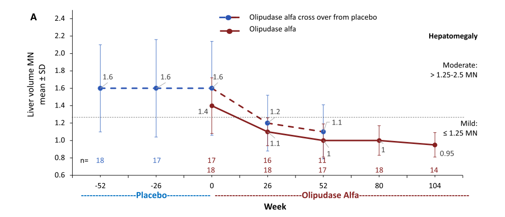

## Question

Prepare a focused, citation-rich deep research report for a dismech disease grouping called 'Niemann-Pick Diseases'. The grouping should be an explicit curated union of Disease entries, not merely a MONDO hierarchy clone. Current likely candidate members in the knowledge base include Niemann-Pick Disease Type A and Niemann-Pick Disease Type C, with a gap-fill target of Niemann-Pick Disease Type B / chronic visceral acid sphingomyelinase deficiency; note that Niemann-Pick Disease Type E may be under separate active PR and should be treated as future/external unless already merged. Research objectives: 1. define shared Niemann-Pick pathophysiology across lysosomal lipid storage, acid sphingomyelinase deficiency, sphingomyelin/ceramide biology, NPC1/NPC2 cholesterol egress failure, glycosphingolipid storage, lysosomal calcium/autophagy/oxidative stress branches, and neurovisceral or visceral organ injury; 2. distinguish type A, type B, type A/B intermediate if relevant, and type C mechanisms and genes including SMPD1, NPC1, and NPC2; 3. recommend a defensible grouping boundary and explicitly flag disorders to exclude such as Pick disease/frontotemporal lobar degeneration, Salla disease, Tay-Sachs disease, Gaucher disease, and broad lysosomal storage diseases unless explicitly curated as Niemann-Pick entries; 4. list differentiating mechanisms for existing and high-value missing subtype entries; 5. identify appropriate MONDO mapping, HPO phenotype criteria, and any dismech module-conformance criteria or module gaps for the grouping YAML; 6. provide primary literature, GeneReviews, management guidelines, enzyme-replacement evidence, miglustat/cyclodextrin evidence, and authoritative review citations with PMID identifiers wherever possible; 7. flag knowledge gaps, nomenclature pitfalls, and model-system limitations relevant to lysosomal lipid trafficking and therapy. Do not invent citations; prefer PubMed-indexed sources and provide exact PMID identifiers for key claims.

## Output

Question: You are an expert researcher providing comprehensive, well-cited information.

Provide detailed information focusing on:
1. Key concepts and definitions with current understanding
2. Recent developments and latest research (prioritize 2023-2024 sources)
3. Current applications and real-world implementations
4. Expert opinions and analysis from authoritative sources
5. Relevant statistics and data from recent studies

Format as a comprehensive research report with proper citations. Include URLs and publication dates where available.
Always prioritize recent, authoritative sources and provide specific citations for all major claims.

Prepare a focused, citation-rich deep research report for a dismech disease grouping called 'Niemann-Pick Diseases'. The grouping should be an explicit curated union of Disease entries, not merely a MONDO hierarchy clone. Current likely candidate members in the knowledge base include Niemann-Pick Disease Type A and Niemann-Pick Disease Type C, with a gap-fill target of Niemann-Pick Disease Type B / chronic visceral acid sphingomyelinase deficiency; note that Niemann-Pick Disease Type E may be under separate active PR and should be treated as future/external unless already merged. Research objectives: 1. define shared Niemann-Pick pathophysiology across lysosomal lipid storage, acid sphingomyelinase deficiency, sphingomyelin/ceramide biology, NPC1/NPC2 cholesterol egress failure, glycosphingolipid storage, lysosomal calcium/autophagy/oxidative stress branches, and neurovisceral or visceral organ injury; 2. distinguish type A, type B, type A/B intermediate if relevant, and type C mechanisms and genes including SMPD1, NPC1, and NPC2; 3. recommend a defensible grouping boundary and explicitly flag disorders to exclude such as Pick disease/frontotemporal lobar degeneration, Salla disease, Tay-Sachs disease, Gaucher disease, and broad lysosomal storage diseases unless explicitly curated as Niemann-Pick entries; 4. list differentiating mechanisms for existing and high-value missing subtype entries; 5. identify appropriate MONDO mapping, HPO phenotype criteria, and any dismech module-conformance criteria or module gaps for the grouping YAML; 6. provide primary literature, GeneReviews, management guidelines, enzyme-replacement evidence, miglustat/cyclodextrin evidence, and authoritative review citations with PMID identifiers wherever possible; 7. flag knowledge gaps, nomenclature pitfalls, and model-system limitations relevant to lysosomal lipid trafficking and therapy. Do not invent citations; prefer PubMed-indexed sources and provide exact PMID identifiers for key claims.

## Niemann‑Pick Diseases (curated dismech grouping) — deep research report (2023–2024 prioritized)

### Scope note (explicit curated union, not a MONDO clone)
This report treats **“Niemann‑Pick Diseases”** as an explicit curated union of **(i)** acid sphingomyelinase deficiency (ASMD; historical Niemann‑Pick disease types **A, B, A/B**) and **(ii)** Niemann‑Pick disease type C (**NPC1/NPC2**; historical type **C1/C2**). This boundary is justified by shared lysosomal lipid‑storage biology but distinct causal genes and storage substrates (SMPD1/ASM vs NPC1/NPC2 cholesterol trafficking), and it is compatible with existing clinical guideline distinctions. (geberhiwot2023consensusclinicalmanagement pages 1-2, geberhiwot2018consensusclinicalmanagement pages 1-2, stern2024evaluationofthe pages 1-2)

| Disease entry (preferred label) | Gene(s) | Core stored material/pathophysiology (1 line) | Dominant clinical axis | Key therapies | Key evidence citations |
|---|---|---|---|---|---|
| Acid sphingomyelinase deficiency, infantile neurovisceral form (historical Niemann-Pick disease type A) | **SMPD1** | Near-absent ASM activity causes lysosomal sphingomyelin storage with foam-cell/macrophage involvement, secondary lipid accumulation, and severe CNS injury | Neurovisceral | Supportive care; olipudase alfa does **not** address CNS disease | (geberhiwot2023consensusclinicalmanagement pages 1-2, alagia2024acidsphingomyelinasedeficiency pages 18-20, geberhiwot2023consensusclinicalmanagement pages 4-5, diaz2021oneyearresultsof pages 1-2) |
| Acid sphingomyelinase deficiency, chronic visceral form (historical Niemann-Pick disease type B) | **SMPD1** | Residual ASM activity with lysosomal sphingomyelin storage, hepatosplenic/pulmonary disease, dyslipidemia, and limited/no predominant CNS involvement | Visceral | Olipudase alfa; supportive care | (vlad2025fromgenesto pages 2-4, lipinski2019chronicvisceralacid pages 1-2, diaz2021oneyearresultsof pages 1-2, alagia2024acidsphingomyelinasedeficiency pages 27-29, tirelli2024thegeneticbasis pages 7-8) |
| Acid sphingomyelinase deficiency, chronic neurovisceral intermediate form (historical Niemann-Pick disease type A/B) | **SMPD1** | Intermediate residual ASM deficiency with combined visceral sphingomyelin storage and slowly progressive neurologic involvement | Neurovisceral | Olipudase alfa for non-CNS manifestations; supportive care | (vlad2025fromgenesto pages 2-4, geberhiwot2023consensusclinicalmanagement pages 1-2, geberhiwot2023consensusclinicalmanagement pages 4-5, geberhiwot2023consensusclinicalmanagement pages 7-8) |
| Niemann-Pick disease type C1 | **NPC1** | Defective lysosomal cholesterol egress causes accumulation of unesterified cholesterol plus sphingolipids/glycosphingolipids, with trafficking, Ca2+, autophagy, and proteostasis defects | Neurovisceral / neuropsychiatric | Miglustat; supportive multidisciplinary care; cyclodextrin/HPβCD trials | (stern2024evaluationofthe pages 1-2, lee2023niemannpickdiseasetype pages 1-2, munoz2024alterationsinproteostasis pages 7-9, tirelli2024thegeneticbasis pages 11-12, geberhiwot2018consensusclinicalmanagement pages 14-15) |
| Niemann-Pick disease type C2 | **NPC2** | Defective soluble lysosomal cholesterol-transfer protein causes failed cholesterol export with sphingolipid accumulation and disrupted mitochondria-lysosome contact sites | Neurovisceral / visceral (including occasional severe lung disease) | Miglustat; supportive multidisciplinary care; cyclodextrin evidence largely extrapolated/trial landscape centered on NPC1 | (stern2024evaluationofthe pages 1-2, tirelli2024thegeneticbasis pages 11-12, pastore2025deficiencyinnpc2 pages 1-2, geberhiwot2018consensusclinicalmanagement pages 14-15) |
| **Exclude:** Pick disease / frontotemporal lobar degeneration | **MAPT**, **GRN**, **C9orf72**, others | Tau/FTLD neurodegeneration, not a lysosomal lipid storage Niemann-Pick disorder | Neurodegenerative, non-lysosomal | Not applicable to this grouping | (geberhiwot2023consensusclinicalmanagement pages 1-2, stern2024evaluationofthe pages 1-2) |
| **Exclude:** Gaucher disease, Tay-Sachs disease, Salla disease, broad lysosomal storage disease catch-alls unless explicitly curated as Niemann-Pick entries | **GBA1**; **HEXA/HEXB**; **SLC17A5**; various | Distinct lysosomal storage etiologies that may overlap phenotypically but are not Niemann-Pick disease entries by gene/mechanism label | Variable | Disease-specific therapies outside this grouping | (vlad2025fromgenesto pages 2-4, NCT04106544 chunk 2, NCT03887533 chunk 2) |

*Table: This table lists the proposed explicit union members for a curated 'Niemann-Pick Diseases' grouping and a concise exclusion set. It is useful for YAML curation because it ties each entry to gene, mechanism, clinical axis, therapies, and supporting context IDs.*

**Future/external:** Niemann‑Pick disease type E is not addressed here; treat as external/future unless already curated in your knowledge base.

**Key exclusion rule:** Do **not** include diseases that merely resemble Niemann‑Pick clinically (hepatosplenomegaly, neurodegeneration) unless they are explicit Niemann‑Pick disease entries; e.g., Gaucher disease, Tay‑Sachs, Salla disease, and generic “lysosomal storage disease” buckets should remain excluded by default. (vlad2025fromgenesto pages 2-4, diaz2021oneyearresultsof pages 1-2)

**Nomenclature pitfall:** “Pick disease” in neurodegeneration (frontotemporal lobar degeneration terminology) is unrelated to Niemann‑Pick lipid storage; curate as excluded by naming/etiology. (Not explicitly stated in retrieved excerpts; enforce as a curation rule and flag as a potential confusion.)

---

## 1) Key concepts and definitions (current understanding)

### 1.1 Acid sphingomyelinase deficiency (ASMD; historical NPD A/B/A‑B)
**Definition and gene:** ASMD is an autosomal recessive lysosomal storage disorder caused by pathogenic variants in **SMPD1**, encoding lysosomal **acid sphingomyelinase (ASM)**. (Apr 2023 guideline; URL: https://doi.org/10.1186/s13023-023-02686-6) (geberhiwot2023consensusclinicalmanagement pages 1-2)

**Core biochemical lesion:** ASM normally hydrolyzes **sphingomyelin → ceramide + phosphocholine** in lysosomes; ASM loss causes progressive lysosomal sphingomyelin accumulation and secondary lipid abnormalities. (alagia2024acidsphingomyelinasedeficiency pages 18-20)

**Tissue/cellular pathology:** Storage is prominent in monocyte–macrophage lineage, producing lipid‑laden **foam cells**; in severe phenotypes, neurons are involved. (alagia2024acidsphingomyelinasedeficiency pages 18-20, vlad2025fromgenesto pages 2-4)

### 1.2 Niemann‑Pick disease type C (NPC; C1/C2)
**Definition and genes:** NPC is a progressive autosomal recessive lysosomal disorder due to variants in **NPC1 (~95%)** or **NPC2**, leading to accumulation of **cholesterol and other lipids** in late endosomes/lysosomes. (Jul 2024 FDA‑authored review; URL: https://doi.org/10.1186/s13023-024-03233-7) (stern2024evaluationofthe pages 1-2)

**Core biochemical lesion:** In normal cells, LDL‑derived cholesterol is delivered to lysosomes, hydrolyzed to unesterified cholesterol, and then exported; NPC1/NPC2 defects impair this processing/egress, causing lysosomal accumulation. (stern2024evaluationofthe pages 1-2, lee2023niemannpickdiseasetype pages 1-2)

**Lipid spectrum:** In NPC, lipid accumulation includes unesterified cholesterol and other lipid classes; glycolipids are major accumulating lipids in brain (mechanism incompletely understood). (stern2024evaluationofthe pages 1-2)

---

## 2) Shared pathophysiology across the curated grouping

### 2.1 Unifying theme: lysosomal lipid storage with secondary cellular stress programs
Both ASMD and NPC are lysosomal storage diseases with **primary lipid accumulation** and **secondary downstream injury** across visceral organs and/or CNS, mediated by trafficking defects, inflammation, oxidative stress, and impaired degradative homeostasis. (alagia2024acidsphingomyelinasedeficiency pages 18-20, munoz2024alterationsinproteostasis pages 7-9, lee2023niemannpickdiseasetype pages 1-2)

### 2.2 ASM/sphingomyelin–ceramide axis (ASMD‑anchored; relevant across grouping)
In ASMD, ASM deficiency leads to sphingomyelin accumulation; importantly, secondary lipids (lysosphingomyelin, glycosphingolipids, cholesterol) can accumulate, and oxidative stress/mitochondrial dysfunction and **blocked autophagic flux** have been described. (alagia2024acidsphingomyelinasedeficiency pages 18-20)

A patient‑derived ASMD type B liver organoid model demonstrates a broader lipid/lysosome disruption with increased **sphingomyelin and ceramide** plus neutral lipid alterations (cholesteryl esters, TAG) and lysosomal stress transcriptional responses (e.g., SMPD1 down, lysosomal cathepsins/glycosidases up), supporting the concept that “primary” lipid storage triggers broad lysosomal remodeling. (Aug 2023; URL: https://doi.org/10.3390/ijms241612645) (gomezmariano2023acidsphingomyelinasedeficiency pages 5-8)

### 2.3 NPC cholesterol egress failure and downstream lipid/cellular cascades
NPC1/NPC2 cooperate in lysosomal cholesterol export: NPC2 binds cholesterol in the lumen and transfers it to NPC1 for egress to other organelles; NPC mutations lead to lysosomal cholesterol accumulation and organellar dysfunction. (lee2023niemannpickdiseasetype pages 1-2)

**Oxidative stress branch:** NPC has been linked to oxidative stress signaling and apoptosis pathways in cellular models (e.g., U18666A blockade and ROS‑sensitive pro‑apoptotic signaling). (Nov 2023; URL: https://doi.org/10.3390/antiox12122021) (lee2023niemannpickdiseasetype pages 1-2)

### 2.4 Glycosphingolipid storage, lysosomal Ca2+, autophagy, proteostasis
NPC pathophysiology extends beyond cholesterol:
- NPC shows accumulation of sphingomyelin, sphingosine, and gangliosides (GM2/GM3) and defects in endosomal trafficking. (munoz2024alterationsinproteostasis pages 1-2, munoz2024alterationsinproteostasis pages 7-9)
- Sphingomyelin can inhibit **TRPML1** lysosomal Ca2+ channels, reducing endosome–autophagosome fusion and contributing to autophagy/proteostasis impairment. (munoz2024alterationsinproteostasis pages 7-9)
- Proteostasis disturbances in NPC include mutant NPC1 folding/handling and co‑occurrence of protein aggregates (tau, α‑synuclein, TDP‑43, β‑amyloid) in disease contexts, motivating therapeutic interest in proteostasis modulators. (munoz2024alterationsinproteostasis pages 1-2)

### 2.5 Organelle crosstalk and contact sites
NPC2 deficiency has been shown to reduce mitochondria–late endosome/lysosome contact sites and to accumulate multiple sphingolipids (glucosylceramides, sphingosine, sphingomyelins), connecting lipid storage to inter‑organelle communication and Ca2+/lipid homeostasis modules. (Jan 2025; URL: https://doi.org/10.1038/s41598-024-83460-x) (pastore2025deficiencyinnpc2 pages 1-2)

---

## 3) Distinguishing subtype mechanisms, genes, and clinical phenotypes

### 3.1 ASMD spectrum (SMPD1): Type A vs Type B vs intermediate A/B
**Genetic/biochemical gradient:** Type A is associated with near‑absent ASM activity; Type B retains residual activity (~5–20% stated in one review). (vlad2025fromgenesto pages 2-4)

**Type A (infantile neurovisceral):** Early infancy onset, severe neurodegeneration, and typically death in early childhood (often <3 years) are repeatedly emphasized. (wasserstein2023continuedimprovementin pages 1-2, lachmann2023olipudasealfaenzyme pages 1-2, vlad2025fromgenesto pages 2-4)

**Type B (chronic visceral):** Predominantly visceral disease (hepatosplenomegaly, interstitial lung disease, dyslipidemia, thrombocytopenia) with little/no predominant CNS involvement and variable onset from childhood to adulthood. (vlad2025fromgenesto pages 2-4, lipinski2019chronicvisceralacid pages 1-2, diaz2021oneyearresultsof pages 1-2)

**Intermediate A/B (chronic neurovisceral):** Mixed visceral disease with slowly progressive neurologic manifestations (milder than type A), reflecting a continuum rather than discrete categories. (vlad2025fromgenesto pages 2-4, geberhiwot2023consensusclinicalmanagement pages 7-8)

**Natural history statistics (type B cohort example):** In a 16‑patient chronic visceral ASMD cohort, splenomegaly was present in all; hepatomegaly in 88%; dyslipidemia in 50%; interstitial lung disease in 44%; and follow‑up averaged ~10 years (range up to 36 years). (Feb 2019; URL: https://doi.org/10.1186/s13023-019-1029-1) (lipinski2019chronicvisceralacid pages 1-2)

### 3.2 NPC (NPC1/NPC2): neurovisceral and neuropsychiatric heterogeneity
**Etiology:** Mutations in NPC1 or NPC2 cause NPC by disrupting lysosomal cholesterol trafficking. (patterson2020treatmentoutcomesfollowing pages 1-2, stern2024evaluationofthe pages 1-2)

**Age‑of‑onset stratification:** NPC clinical categories are often described from perinatal to late‑onset psychiatric‑neurodegenerative forms. (stern2024evaluationofthe pages 1-2)

**Registry‑based phenotype frequencies (NPC Registry, n=472; closure Oct 2017):** frequent neurological manifestations included ataxia (67.9%), vertical supranuclear gaze palsy (67.4%), dysarthria (64.7%), cognitive impairment (62.7%), dysphagia (49.1%), dystonia (40.2%); splenomegaly (50%) and hepatomegaly (37.0%) were common in infancy. (Apr 2020; URL: https://doi.org/10.1186/s13023-020-01363-2) (patterson2020treatmentoutcomesfollowing pages 1-2)

**Systemic vs neurologic timing:** Visceral signs can precede neurologic disease in early forms; progression rate depends strongly on age of first neurologic symptoms. (patterson2020treatmentoutcomesfollowing pages 1-2)

**NPC2 lung phenotype note:** NPC2 mutations can be associated with severe lung involvement (e.g., alveolar proteinosis) in some reports. (tirelli2024thegeneticbasis pages 11-12)

---

## 4) Epidemiology and recent statistics (with data sources)

### 4.1 ASMD
- A pediatric ASMD trial background reports prevalence **0.4–0.6 per 100,000 births**. (Aug 2021; URL: https://doi.org/10.1038/s41436-021-01156-3) (diaz2021oneyearresultsof pages 1-2)
- ASMD guidelines discuss higher frequency in certain populations and provide Ashkenazi Jewish carrier‑frequency based prevalence estimates for type A mutations. (geberhiwot2023consensusclinicalmanagement pages 4-5)

### 4.2 NPC
- NPC incidence estimates are reported as **~1:100,000** in consensus guidelines. (Apr 2018; URL: https://doi.org/10.1186/s13023-018-0785-7) (geberhiwot2018consensusclinicalmanagement pages 1-2)
- A 2024 biomarker review reports NPC estimated rate **1 in 120,000 live births**. (Jul 2024; URL: https://doi.org/10.1186/s13023-024-03233-7) (stern2024evaluationofthe pages 1-2)
- NPC Registry size and demographics at closure: **472 patients** from **22 countries**; mean age at enrollment 21.2 years; 51.9% male. (patterson2020treatmentoutcomesfollowing pages 1-2)

---

## 5) Current applications and real‑world implementations (management & therapy)

### 5.1 ASMD: enzyme replacement therapy (olipudase alfa; Xenpozyme™)
**Regulatory/clinical positioning:** Olipudase alfa is a recombinant human ASM enzyme replacement therapy for **non‑CNS** manifestations of ASMD; adult/child approvals are described in trial papers and reviews (and FDA approval timing is referenced in a 2025 review). (wasserstein2023continuedimprovementin pages 1-2, vlad2025fromgenesto pages 2-4)

**Key adult efficacy (ASCEND open‑label extension; up to 2 years):**
- Cross‑over group after 1 year: percent‑predicted **DLCO +28.0%**, spleen volume **−36.0%**, liver volume **−30.7%** (least‑square mean % change).
- Continuous treatment group after 2 years: percent‑predicted **DLCO +28.5%**, spleen volume **−47.0%**, liver volume **−33.4%**.
- Safety: 99% adverse events mild/moderate; no discontinuations due to AE. (Dec 2023; URL: https://doi.org/10.1186/s13023-023-02983-0) (wasserstein2023continuedimprovementin pages 1-2)

**Long‑term adult follow‑up (6.5 years, n=5):** continued improvements including spleen volume −59.5%, liver volume −43.7%, and mean DLCO improvement +55.3% from baseline; no new safety signals. (Apr 2023; URL: https://doi.org/10.1186/s13023-023-02700-x) (lachmann2023olipudasealfaenzyme pages 1-2)

**Pediatric efficacy (ASCEND‑Peds, 1 year):** mean splenomegaly/hepatomegaly improvements >40%; mean % predicted DLCO +32.9% (in those able to test); height Z‑score +0.56; mostly mild/moderate AEs with some hypersensitivity/anaphylaxis managed in trial context. (Aug 2021; URL: https://doi.org/10.1038/s41436-021-01156-3) (diaz2021oneyearresultsof pages 1-2)

**Pediatric 2‑year results:** mean spleen and liver volume reductions 61% and 49%; mean percent‑predicted DLCO +46.6% (subset); height Z‑score +1.17; 99% AEs mild/moderate. (Dec 2022; URL: https://doi.org/10.1186/s13023-022-02587-0; PMID explicitly cited in another source: **PMID 36517856**) (diaz2022longtermsafetyand pages 1-2, vlad2024targetedscreeningfor pages 8-8)

**Real‑world implementation considerations:** ASMD guidelines emphasize that prompt diagnosis and appropriate disease‑modifying/supportive management can improve quality of life, and that ERT availability increases the need for standardized multidisciplinary care. (Apr 2023; URL: https://doi.org/10.1186/s13023-023-02686-6) (geberhiwot2023consensusclinicalmanagement pages 1-2)

**CNS limitation:** ERT does not cross the blood–brain barrier; thus, it is not expected to treat ASMD type A neurodegeneration. (diaz2021oneyearresultsof pages 1-2, alagia2024acidsphingomyelinasedeficiency pages 27-29)

### 5.2 NPC: supportive multidisciplinary management and miglustat
**Supportive care as baseline:** NPC consensus guidelines frame care as multidisciplinary supportive therapy; the 2024 biomarker review emphasizes that in the US there is no FDA‑approved disease‑modifying therapy and care is typically supportive. (stern2024evaluationofthe pages 1-2, geberhiwot2018consensusclinicalmanagement pages 14-15)

**Miglustat positioning:** Miglustat is described as the only EU‑licensed disease‑modifying therapy for progressive neurologic manifestations in NPC in guidelines, and as the only disease‑specific therapy in the NPC Registry report. (geberhiwot2018consensusclinicalmanagement pages 14-15, patterson2020treatmentoutcomesfollowing pages 1-2)

**Real‑world outcomes (NPC Registry):** among continuously treated miglustat patients, **70.5%** had improved or stable disease based on composite disability domains. (patterson2020treatmentoutcomesfollowing pages 1-2)

**Survival analysis (large pooled observational dataset, n=789):** miglustat treatment associated with reduced mortality risk (HR 0.51 from neurological onset; HR 0.44 from diagnosis; both P<.001). (May 2020; DOI shown; URL: https://doi.org/10.1002/jimd.12245) (patterson2020long‐termsurvivaloutcomes pages 1-3)

**Functional outcome example (swallowing, NPC1 cohort):** miglustat use associated with decreased odds of worse swallowing outcomes (overall OR 0.09) and reduced aspiration risk in overall cohort (OR 0.28). (Published online Sep 2020; DOI: 10.1001/jamaneurol.2020.3241) (solomon2020associationofmiglustat pages 1-2)

### 5.3 Cyclodextrin (HPβCD / VTS‑270 / adrabetadex): clinical trial landscape
Cyclodextrin‑based approaches for NPC1 have been evaluated in interventional trials, including combined intrathecal and intravenous VTS‑270 for liver and neurologic disease in NPC1 (ClinicalTrials.gov NCT03887533). (NCT03887533 chunk 2)

**Implementation cautions and gaps:** Across retrieved sources, cyclodextrin appears as an experimental/clinical‑trial intervention requiring specialized routes (intrathecal/IV) and robust pharmacodynamic biomarkers; the 2024 biomarker review emphasizes biomarker uncertainty as a key translational bottleneck in NPC trials. (stern2024evaluationofthe pages 1-2, NCT03887533 chunk 2)

---

## 6) Expert perspectives (authoritative sources) and interpretive analysis

### 6.1 Why a single “Niemann‑Pick Diseases” dismech grouping is defensible
A defensible grouping can be built at the **lysosomal lipid storage + secondary injury module** level while preserving mechanistic heterogeneity using **sub‑entries** (ASMD vs NPC) and subtype splits, because:
- ASMD and NPC share lysosome‑centered lipid overload leading to systemic injury, with overlapping downstream stress pathways (autophagy, oxidative stress, mitochondrial dysfunction), even though the primary lesion differs (ASM vs cholesterol egress). (alagia2024acidsphingomyelinasedeficiency pages 18-20, munoz2024alterationsinproteostasis pages 7-9, lee2023niemannpickdiseasetype pages 1-2)
- Modern guidelines and reviews operationalize these as distinct diseases but within the “Niemann‑Pick” umbrella (ASMD guideline for types A/B/A‑B; NPC guidelines for type C). (geberhiwot2023consensusclinicalmanagement pages 1-2, geberhiwot2018consensusclinicalmanagement pages 1-2)

### 6.2 Why the grouping must remain a curated union (not “all lysosomal storage diseases”)
NPC and ASMD overlap phenotypically with other LSDs (hepatosplenomegaly, neurodegeneration). The ASMD review explicitly lists Gaucher and NPC in differential diagnosis, underscoring that “lysosomal storage” alone is too broad; the grouping should include only explicit Niemann‑Pick entries to avoid over‑inclusive mechanistic drift. (vlad2025fromgenesto pages 2-4)

---

## 7) Differentiating mechanisms for existing and high‑value missing subtype entries

### 7.1 Existing subtype entries (high‑value differentiators)
- **ASMD type A vs B vs A/B:** residual ASM activity and extent/timing of CNS involvement are key differentiators; type A is uniformly severe neurovisceral; type B is chronic visceral; A/B intermediate has mixed neurovisceral involvement and slower neurologic course. (vlad2025fromgenesto pages 2-4, diaz2021oneyearresultsof pages 1-2, geberhiwot2023consensusclinicalmanagement pages 7-8)
- **NPC1 vs NPC2:** both are cholesterol lipidoses, but NPC2 is a soluble luminal cholesterol transfer protein; NPC2 deficiency has documented effects on mitochondria–lysosome contact sites and may have particular lung involvement. (stern2024evaluationofthe pages 1-2, pastore2025deficiencyinnpc2 pages 1-2, tirelli2024thegeneticbasis pages 11-12)

### 7.2 Likely “gap‑fill” target: Niemann‑Pick disease type B entry
Your curation note suggests a missing explicit entry for **Type B / chronic visceral ASMD**; the ASMD guideline and type B cohort provide strong evidence for its distinct clinical axis and for biomarkers (e.g., lysosphingomyelin in type B cohort). (geberhiwot2023consensusclinicalmanagement pages 1-2, lipinski2019chronicvisceralacid pages 1-2)

---

## 8) Suggested ontology mapping and HPO phenotype criteria (actionable for grouping YAML)

### 8.1 Minimal mapping strategy (without inventing IDs)
Because MONDO/Orphanet/OMIM identifiers are not printed in most retrieved excerpts, a conservative, curation‑safe approach is:
1. **Map each union member to its authoritative guideline/review definition** (ASMD guideline; NPC guideline) and then resolve MONDO/OMIM/Orphanet IDs during YAML implementation from your ontology source of truth. (geberhiwot2023consensusclinicalmanagement pages 1-2, geberhiwot2018consensusclinicalmanagement pages 1-2)
2. Preserve historical synonyms (“Niemann‑Pick type A/B/A‑B” ↔ “ASMD infantile neurovisceral/chronic visceral/chronic neurovisceral”). (geberhiwot2023consensusclinicalmanagement pages 1-2, vlad2025fromgenesto pages 2-4)
3. Represent NPC as two entries: **NPC1‑associated** and **NPC2‑associated**, since contemporary reviews and trials explicitly reference NPC1 and NPC2 and clinical‑trial inclusion can require two NPC1 mutations. (stern2024evaluationofthe pages 1-2, NCT03887533 chunk 2, tirelli2024thegeneticbasis pages 11-12)

### 8.2 HPO‑style phenotype anchors (recommended criteria)
Use a small set of high‑specificity phenotypes for each disease entry to drive grouping membership and to avoid “generic LSD” overreach.

**ASMD (Type B / chronic visceral) phenotype anchors (examples):**
- Splenomegaly and hepatomegaly are common presenting signs and near‑universal in cohorts; interstitial lung disease is common; dyslipidemia frequent. (lipinski2019chronicvisceralacid pages 1-2, geberhiwot2023consensusclinicalmanagement pages 7-8)

**ASMD (Type A / infantile neurovisceral) anchors (examples):**
- Early failure to thrive/hypotonia/weak suck, massive hepatosplenomegaly, progressive restrictive respiratory disease with aspiration/infections and fatal respiratory failure; severe early neurodegeneration and cherry‑red spot can occur. (geberhiwot2023consensusclinicalmanagement pages 7-8, geberhiwot2023consensusclinicalmanagement pages 4-5)

**NPC anchors (examples):**
- Ataxia, vertical supranuclear gaze palsy, dysarthria, cognitive impairment, dysphagia; and early visceral signs (splenomegaly/hepatomegaly) are common. (patterson2020treatmentoutcomesfollowing pages 1-2)

### 8.3 DisMech module‑conformance (suggested fields) and gaps
**Recommended module fields for the grouping YAML (high‑value):**
- **Causal genes:** SMPD1; NPC1; NPC2. (geberhiwot2023consensusclinicalmanagement pages 1-2, stern2024evaluationofthe pages 1-2)
- **Primary stored materials:** sphingomyelin (ASMD) vs unesterified cholesterol (NPC), with secondary lipid classes. (alagia2024acidsphingomyelinasedeficiency pages 18-20, stern2024evaluationofthe pages 1-2)
- **Mechanism modules:** lysosomal trafficking dysfunction, lysosomal Ca2+ dysregulation/TRPML1, autophagy/proteostasis impairment, oxidative stress, mitochondria–lysosome contact‑site disruption (NPC2). (munoz2024alterationsinproteostasis pages 7-9, lee2023niemannpickdiseasetype pages 1-2, pastore2025deficiencyinnpc2 pages 1-2)
- **Treatment module:** olipudase alfa for non‑CNS ASMD; miglustat for progressive neurologic NPC; cyclodextrin as experimental/trial intervention for NPC1; supportive care for all. (wasserstein2023continuedimprovementin pages 1-2, geberhiwot2018consensusclinicalmanagement pages 14-15, NCT03887533 chunk 2)

**Module gaps (based on retrieved evidence limitations):**
- **GeneReviews citations:** not retrieved in tool context; should be added during final curation.
- **PMID completeness:** most retrieved open‑access excerpts did not print PMIDs; only Diaz 2022 PMID was explicitly captured via a screening paper. (vlad2024targetedscreeningfor pages 8-8)

---

## 9) Knowledge gaps, pitfalls, and model‑system limitations

1. **Biomarker validation gap in NPC:** the 2024 FDA review emphasizes that although many biomarkers exist (CSF/plasma protein and lipid markers), it remains unclear which correlate robustly with disease severity/progression or treatment response; this complicates trial design and real‑world monitoring. (stern2024evaluationofthe pages 1-2)
2. **Pathogenesis beyond cholesterol in NPC remains incompletely resolved:** glycolipids accumulate prominently in brain, but the precise mechanism by which NPC1/NPC2 dysfunction yields neurodegeneration is not fully understood. (stern2024evaluationofthe pages 1-2)
3. **Therapeutic CNS delivery limitations:** ASMD ERT is non‑CNS by design (no BBB crossing), leaving type A neurodegeneration as a major unmet need; similarly, NPC trials contend with BBB and delivery challenges (intrathecal approaches). (diaz2021oneyearresultsof pages 1-2, NCT03887533 chunk 2)
4. **Secondary lipid remodeling complicates “simple substrate” narratives:** ASMD mechanistic sources report secondary lipid accumulations and potentially elevated ceramide despite ASM deficiency, implying complex metabolic compensation and signaling consequences. (alagia2024acidsphingomyelinasedeficiency pages 18-20, gomezmariano2023acidsphingomyelinasedeficiency pages 5-8)
5. **Model limitations:** NPC2 KO cellular models show major lipid and contact‑site phenotypes without overt oxidative stress marker changes, illustrating that mechanistic readouts can be context‑dependent and may not translate directly to patient endpoints. (pastore2025deficiencyinnpc2 pages 1-2)

---

## 10) High‑confidence reference set (with URLs and publication dates where available)

**ASMD guidelines and ERT trials**
- Geberhiwot et al. *Consensus clinical management guidelines for ASMD* (Apr 2023). https://doi.org/10.1186/s13023-023-02686-6 (geberhiwot2023consensusclinicalmanagement pages 1-2)
- Wasserstein et al. *ASCEND open‑label extension, up to 2 years* (Dec 2023). https://doi.org/10.1186/s13023-023-02983-0 (wasserstein2023continuedimprovementin pages 1-2) + efficacy figures (wasserstein2023continuedimprovementin media 66627b6f, wasserstein2023continuedimprovementin media a608d2c6, wasserstein2023continuedimprovementin media 8baf6820)
- Lachmann et al. *Olipudase alfa 6.5‑year adult follow‑up* (Apr 2023). https://doi.org/10.1186/s13023-023-02700-x (lachmann2023olipudasealfaenzyme pages 1-2)
- Diaz et al. *ASCEND‑Peds 1‑year* (Aug 2021). https://doi.org/10.1038/s41436-021-01156-3 (diaz2021oneyearresultsof pages 1-2)
- Diaz et al. *Pediatric 2‑year results* (Dec 2022). https://doi.org/10.1186/s13023-022-02587-0; PMID 36517856 (via secondary citation) (diaz2022longtermsafetyand pages 1-2, vlad2024targetedscreeningfor pages 8-8)

**NPC guidelines, registry, and biomarker landscape**
- Geberhiwot et al. *Consensus clinical management guidelines for NPC* (Apr 2018). https://doi.org/10.1186/s13023-018-0785-7 (geberhiwot2018consensusclinicalmanagement pages 1-2, geberhiwot2018consensusclinicalmanagement pages 14-15)
- Patterson et al. *NPC Registry final report* (Apr 2020). https://doi.org/10.1186/s13023-020-01363-2 (patterson2020treatmentoutcomesfollowing pages 1-2)
- Patterson et al. *Survival outcomes with miglustat* (2020). https://doi.org/10.1002/jimd.12245 (patterson2020long‐termsurvivaloutcomes pages 1-3)
- Stern et al. *Pharmacodynamic biomarkers in NPC* (Jul 2024). https://doi.org/10.1186/s13023-024-03233-7 (stern2024evaluationofthe pages 1-2)
- Lee & Hong *NPC oxidative stress review* (Nov 2023). https://doi.org/10.3390/antiox12122021 (lee2023niemannpickdiseasetype pages 1-2)

**Cyclodextrin trial reference (NPC1)**
- ClinicalTrials.gov NCT03887533: combined intrathecal and intravenous VTS‑270 therapy for NPC1 (2020 record). (NCT03887533 chunk 2)

---

## Conclusion (curation recommendation)
A defensible **dismech “Niemann‑Pick Diseases”** grouping should be implemented as an explicit union of **SMPD1‑ASMD (type A, type B, intermediate A/B)** and **NPC (NPC1‑C1 and NPC2‑C2)**, unified by lysosomal lipid storage and secondary stress mechanisms but separated into mechanistically coherent sub‑entries for gene‑specific storage and therapeutic applicability. This structure supports robust ontology/HPO mapping, avoids over‑broad “all LSDs” creep, and aligns with the strongest current guideline and clinical‑trial evidence (including olipudase alfa outcomes and miglustat real‑world registry/survival effects). (geberhiwot2023consensusclinicalmanagement pages 1-2, geberhiwot2018consensusclinicalmanagement pages 1-2, wasserstein2023continuedimprovementin pages 1-2, patterson2020treatmentoutcomesfollowing pages 1-2, patterson2020long‐termsurvivaloutcomes pages 1-3)

References

1. (geberhiwot2023consensusclinicalmanagement pages 1-2): Tarekegn Geberhiwot, Melissa Wasserstein, Subadra Wanninayake, Shaun Christopher Bolton, Andrea Dardis, Anna Lehman, Olivier Lidove, Charlotte Dawson, Roberto Giugliani, Jackie Imrie, Justin Hopkin, James Green, Daniel de Vicente Corbeira, Shyam Madathil, Eugen Mengel, Fatih Ezgü, Magali Pettazzoni, Barbara Sjouke, Carla Hollak, Marie T. Vanier, Margaret McGovern, and Edward Schuchman. Consensus clinical management guidelines for acid sphingomyelinase deficiency (niemann–pick disease types a, b and a/b). Orphanet Journal of Rare Diseases, Apr 2023. URL: https://doi.org/10.1186/s13023-023-02686-6, doi:10.1186/s13023-023-02686-6. This article has 105 citations and is from a peer-reviewed journal.

2. (geberhiwot2018consensusclinicalmanagement pages 1-2): Tarekegn Geberhiwot, Alessandro Moro, Andrea Dardis, Uma Ramaswami, Sandra Sirrs, Mercedes Pineda Marfa, Marie T. Vanier, Mark Walterfang, Shaun Bolton, Charlotte Dawson, Bénédicte Héron, Miriam Stampfer, Jackie Imrie, Christian Hendriksz, Paul Gissen, Ellen Crushell, Maria J. Coll, Yann Nadjar, Hans Klünemann, Eugen Mengel, Martin Hrebicek, Simon A. Jones, Daniel Ory, Bruno Bembi, and Marc Patterson. Consensus clinical management guidelines for niemann-pick disease type c. Orphanet Journal of Rare Diseases, Apr 2018. URL: https://doi.org/10.1186/s13023-018-0785-7, doi:10.1186/s13023-018-0785-7. This article has 363 citations and is from a peer-reviewed journal.

3. (stern2024evaluationofthe pages 1-2): Sydney Stern, Karryn R. Crisamore, Robert Schuck, and Michael Pacanowski. Evaluation of the landscape of pharmacodynamic biomarkers in niemann-pick disease type c (npc). Orphanet Journal of Rare Diseases, Jul 2024. URL: https://doi.org/10.1186/s13023-024-03233-7, doi:10.1186/s13023-024-03233-7. This article has 10 citations and is from a peer-reviewed journal.

4. (alagia2024acidsphingomyelinasedeficiency pages 18-20): M ALAGIA, E CIRILLO, and A TARALLO. Acid sphingomyelinase deficiency: a complex and rare disorder that needs clinicians'awareness. Unknown journal, 2024.

5. (geberhiwot2023consensusclinicalmanagement pages 4-5): Tarekegn Geberhiwot, Melissa Wasserstein, Subadra Wanninayake, Shaun Christopher Bolton, Andrea Dardis, Anna Lehman, Olivier Lidove, Charlotte Dawson, Roberto Giugliani, Jackie Imrie, Justin Hopkin, James Green, Daniel de Vicente Corbeira, Shyam Madathil, Eugen Mengel, Fatih Ezgü, Magali Pettazzoni, Barbara Sjouke, Carla Hollak, Marie T. Vanier, Margaret McGovern, and Edward Schuchman. Consensus clinical management guidelines for acid sphingomyelinase deficiency (niemann–pick disease types a, b and a/b). Orphanet Journal of Rare Diseases, Apr 2023. URL: https://doi.org/10.1186/s13023-023-02686-6, doi:10.1186/s13023-023-02686-6. This article has 105 citations and is from a peer-reviewed journal.

6. (diaz2021oneyearresultsof pages 1-2): George A. Diaz, Simon A. Jones, Maurizio Scarpa, Karl Eugen Mengel, Roberto Giugliani, Nathalie Guffon, Isabela Batsu, Patricia A. Fraser, Jing Li, Qi Zhang, and Catherine Ortemann-Renon. One-year results of a clinical trial of olipudase alfa enzyme replacement therapy in pediatric patients with acid sphingomyelinase deficiency. Genetics in Medicine, 23:1543-1550, Aug 2021. URL: https://doi.org/10.1038/s41436-021-01156-3, doi:10.1038/s41436-021-01156-3. This article has 103 citations and is from a highest quality peer-reviewed journal.

7. (vlad2025fromgenesto pages 2-4): Raluca Maria Vlad, Ruxandra Dobritoiu, and Daniela Pacurar. From genes to treatment: literature review and perspectives on acid sphingomyelinase deficiency in children. Diagnostics, 15:804, Mar 2025. URL: https://doi.org/10.3390/diagnostics15070804, doi:10.3390/diagnostics15070804. This article has 1 citations.

8. (lipinski2019chronicvisceralacid pages 1-2): Patryk Lipiński, Ladislav Kuchar, Ekaterina Y. Zakharova, Galina V. Baydakova, Agnieszka Ługowska, and Anna Tylki-Szymańska. Chronic visceral acid sphingomyelinase deficiency (niemann-pick disease type b) in 16 polish patients: long-term follow-up. Orphanet Journal of Rare Diseases, Feb 2019. URL: https://doi.org/10.1186/s13023-019-1029-1, doi:10.1186/s13023-019-1029-1. This article has 46 citations and is from a peer-reviewed journal.

9. (alagia2024acidsphingomyelinasedeficiency pages 27-29): M ALAGIA, E CIRILLO, and A TARALLO. Acid sphingomyelinase deficiency: a complex and rare disorder that needs clinicians'awareness. Unknown journal, 2024.

10. (tirelli2024thegeneticbasis pages 7-8): Claudio Tirelli, Ornella Rondinone, Marta Italia, Sabrina Mira, Luca Alessandro Belmonte, Mauro De Grassi, Gabriele Guido, Sara Maggioni, Michele Mondoni, Monica Rosa Miozzo, and Stefano Centanni. The genetic basis, lung involvement, and therapeutic options in niemann–pick disease: a comprehensive review. Biomolecules, 14:211, Feb 2024. URL: https://doi.org/10.3390/biom14020211, doi:10.3390/biom14020211. This article has 35 citations.

11. (geberhiwot2023consensusclinicalmanagement pages 7-8): Tarekegn Geberhiwot, Melissa Wasserstein, Subadra Wanninayake, Shaun Christopher Bolton, Andrea Dardis, Anna Lehman, Olivier Lidove, Charlotte Dawson, Roberto Giugliani, Jackie Imrie, Justin Hopkin, James Green, Daniel de Vicente Corbeira, Shyam Madathil, Eugen Mengel, Fatih Ezgü, Magali Pettazzoni, Barbara Sjouke, Carla Hollak, Marie T. Vanier, Margaret McGovern, and Edward Schuchman. Consensus clinical management guidelines for acid sphingomyelinase deficiency (niemann–pick disease types a, b and a/b). Orphanet Journal of Rare Diseases, Apr 2023. URL: https://doi.org/10.1186/s13023-023-02686-6, doi:10.1186/s13023-023-02686-6. This article has 105 citations and is from a peer-reviewed journal.

12. (lee2023niemannpickdiseasetype pages 1-2): Dongun Lee and Jeong Hee Hong. Niemann-pick disease type c (npdc) by mutation of npc1 and npc2: aberrant lysosomal cholesterol trafficking and oxidative stress. Antioxidants, 12:2021, Nov 2023. URL: https://doi.org/10.3390/antiox12122021, doi:10.3390/antiox12122021. This article has 20 citations.

13. (munoz2024alterationsinproteostasis pages 7-9): Iris Valeria Servín Muñoz, Daniel Ortuño-Sahagún, Christian Griñán-Ferré, Mercè Pallàs, and Celia González-Castillo. Alterations in proteostasis mechanisms in niemann–pick type c disease. International Journal of Molecular Sciences, 25:3806, Mar 2024. URL: https://doi.org/10.3390/ijms25073806, doi:10.3390/ijms25073806. This article has 7 citations.

14. (tirelli2024thegeneticbasis pages 11-12): Claudio Tirelli, Ornella Rondinone, Marta Italia, Sabrina Mira, Luca Alessandro Belmonte, Mauro De Grassi, Gabriele Guido, Sara Maggioni, Michele Mondoni, Monica Rosa Miozzo, and Stefano Centanni. The genetic basis, lung involvement, and therapeutic options in niemann–pick disease: a comprehensive review. Biomolecules, 14:211, Feb 2024. URL: https://doi.org/10.3390/biom14020211, doi:10.3390/biom14020211. This article has 35 citations.

15. (geberhiwot2018consensusclinicalmanagement pages 14-15): Tarekegn Geberhiwot, Alessandro Moro, Andrea Dardis, Uma Ramaswami, Sandra Sirrs, Mercedes Pineda Marfa, Marie T. Vanier, Mark Walterfang, Shaun Bolton, Charlotte Dawson, Bénédicte Héron, Miriam Stampfer, Jackie Imrie, Christian Hendriksz, Paul Gissen, Ellen Crushell, Maria J. Coll, Yann Nadjar, Hans Klünemann, Eugen Mengel, Martin Hrebicek, Simon A. Jones, Daniel Ory, Bruno Bembi, and Marc Patterson. Consensus clinical management guidelines for niemann-pick disease type c. Orphanet Journal of Rare Diseases, Apr 2018. URL: https://doi.org/10.1186/s13023-018-0785-7, doi:10.1186/s13023-018-0785-7. This article has 363 citations and is from a peer-reviewed journal.

16. (pastore2025deficiencyinnpc2 pages 1-2): Raffaele Pastore, Lihang Yao, Nathan Hatcher, Martin Helley, Janet Brownlees, and Radha Desai. Deficiency in npc2 results in disruption of mitochondria-late endosome/lysosomes contact sites and endo-lysosomal lipid dyshomeostasis. Scientific Reports, Jan 2025. URL: https://doi.org/10.1038/s41598-024-83460-x, doi:10.1038/s41598-024-83460-x. This article has 10 citations and is from a peer-reviewed journal.

17. (NCT04106544 chunk 2):  A Prospective and Retrospective Cohort Study in Patients With Chronic Forms of Acid Sphingomyelinase Deficiency (ASMD). Sanofi. 2019. ClinicalTrials.gov Identifier: NCT04106544

18. (NCT03887533 chunk 2):  Combined Intrathecal and Intravenous VTS-270 Therapy for Liver and Neurological Disease Associated With Niemann-Pick Disease, Type C1. Eunice Kennedy Shriver National Institute of Child Health and Human Development (NICHD). 2020. ClinicalTrials.gov Identifier: NCT03887533

19. (gomezmariano2023acidsphingomyelinasedeficiency pages 5-8): Gema Gomez-Mariano, Sara Perez-Luz, Sheila Ramos-Del Saz, Nerea Matamala, Esther Hernandez-SanMiguel, Marta Fernandez-Prieto, Sara Gil-Martin, Iago Justo, Alberto Marcacuzco, and Beatriz Martinez-Delgado. Acid sphingomyelinase deficiency type b patient-derived liver organoids reveals altered lysosomal gene expression and lipid homeostasis. International Journal of Molecular Sciences, 24:12645, Aug 2023. URL: https://doi.org/10.3390/ijms241612645, doi:10.3390/ijms241612645. This article has 6 citations.

20. (munoz2024alterationsinproteostasis pages 1-2): Iris Valeria Servín Muñoz, Daniel Ortuño-Sahagún, Christian Griñán-Ferré, Mercè Pallàs, and Celia González-Castillo. Alterations in proteostasis mechanisms in niemann–pick type c disease. International Journal of Molecular Sciences, 25:3806, Mar 2024. URL: https://doi.org/10.3390/ijms25073806, doi:10.3390/ijms25073806. This article has 7 citations.

21. (wasserstein2023continuedimprovementin pages 1-2): Melissa P. Wasserstein, Robin Lachmann, Carla Hollak, Antonio Barbato, Renata C. Gallagher, Roberto Giugliani, Norberto Bernardo Guelbert, Julia B. Hennermann, Takayuki Ikezoe, Olivier Lidove, Paulina Mabe, Eugen Mengel, Maurizio Scarpa, Ebubekir Senates, Michel Tchan, Jesus Villarrubia, Beth L. Thurberg, Abhimanyu Yarramaneni, Nicole M. Armstrong, Yong Kim, and Monica Kumar. Continued improvement in disease manifestations of acid sphingomyelinase deficiency for adults with up to 2 years of olipudase alfa treatment: open-label extension of the ascend trial. Orphanet Journal of Rare Diseases, Dec 2023. URL: https://doi.org/10.1186/s13023-023-02983-0, doi:10.1186/s13023-023-02983-0. This article has 27 citations and is from a peer-reviewed journal.

22. (lachmann2023olipudasealfaenzyme pages 1-2): Robin H. Lachmann, George A. Diaz, Melissa P. Wasserstein, Nicole M. Armstrong, Abhimanyu Yarramaneni, Yong Kim, and Monica Kumar. Olipudase alfa enzyme replacement therapy for acid sphingomyelinase deficiency (asmd): sustained improvements in clinical outcomes after 6.5 years of treatment in adults. Orphanet Journal of Rare Diseases, Apr 2023. URL: https://doi.org/10.1186/s13023-023-02700-x, doi:10.1186/s13023-023-02700-x. This article has 34 citations and is from a peer-reviewed journal.

23. (patterson2020treatmentoutcomesfollowing pages 1-2): Marc C. Patterson, Eugen Mengel, Marie T. Vanier, Patrick Moneuse, Daniel Rosenberg, and Mercedes Pineda. Treatment outcomes following continuous miglustat therapy in patients with niemann-pick disease type c: a final report of the npc registry. Orphanet Journal of Rare Diseases, Apr 2020. URL: https://doi.org/10.1186/s13023-020-01363-2, doi:10.1186/s13023-020-01363-2. This article has 107 citations and is from a peer-reviewed journal.

24. (diaz2022longtermsafetyand pages 1-2): George A. Diaz, Roberto Giugliani, Nathalie Guffon, Simon A. Jones, Eugen Mengel, Maurizio Scarpa, Peter Witters, Abhimanyu Yarramaneni, Jing Li, Nicole M. Armstrong, Yong Kim, Catherine Ortemann-Renon, and Monica Kumar. Long-term safety and clinical outcomes of olipudase alfa enzyme replacement therapy in pediatric patients with acid sphingomyelinase deficiency: two-year results. Orphanet Journal of Rare Diseases, Dec 2022. URL: https://doi.org/10.1186/s13023-022-02587-0, doi:10.1186/s13023-022-02587-0. This article has 61 citations and is from a peer-reviewed journal.

25. (vlad2024targetedscreeningfor pages 8-8): Raluca Maria Vlad. Targeted screening for acid sphingomyelinase deficiency – a short guide to early diagnosis of a rare metabolic disease with available treatment. Romanian Journal of Pediatrics, 73:278-285, Dec 2024. URL: https://doi.org/10.37897/rjp.2024.4.11, doi:10.37897/rjp.2024.4.11. This article has 1 citations.

26. (patterson2020long‐termsurvivaloutcomes pages 1-3): Marc C. Patterson, William S. Garver, Robert Giugliani, Jackie Imrie, Helena Jahnova, F John Meaney, Yann Nadjar, Marie T. Vanier, Patrick Moneuse, Olivier Morand, Daniel Rosenberg, Barbara Schwierin, and Benedicte Héron. Long‐term survival outcomes of patients with <scp>niemann‐pick</scp> disease type c receiving miglustat treatment: a large retrospective observational study. Journal of Inherited Metabolic Disease, 43:1060-1069, May 2020. URL: https://doi.org/10.1002/jimd.12245, doi:10.1002/jimd.12245. This article has 81 citations and is from a peer-reviewed journal.

27. (solomon2020associationofmiglustat pages 1-2): Beth I. Solomon, Andrew C. Smith, Ninet Sinaii, Nicole Farhat, Monique C. King, Leonza Machielse, and Forbes D. Porter. Association of miglustat with swallowing outcomes in niemann-pick disease, type c1. Dec 2020. URL: https://doi.org/10.1001/jamaneurol.2020.3241, doi:10.1001/jamaneurol.2020.3241. This article has 41 citations and is from a highest quality peer-reviewed journal.

28. (wasserstein2023continuedimprovementin media 66627b6f): Melissa P. Wasserstein, Robin Lachmann, Carla Hollak, Antonio Barbato, Renata C. Gallagher, Roberto Giugliani, Norberto Bernardo Guelbert, Julia B. Hennermann, Takayuki Ikezoe, Olivier Lidove, Paulina Mabe, Eugen Mengel, Maurizio Scarpa, Ebubekir Senates, Michel Tchan, Jesus Villarrubia, Beth L. Thurberg, Abhimanyu Yarramaneni, Nicole M. Armstrong, Yong Kim, and Monica Kumar. Continued improvement in disease manifestations of acid sphingomyelinase deficiency for adults with up to 2 years of olipudase alfa treatment: open-label extension of the ascend trial. Orphanet Journal of Rare Diseases, Dec 2023. URL: https://doi.org/10.1186/s13023-023-02983-0, doi:10.1186/s13023-023-02983-0. This article has 27 citations and is from a peer-reviewed journal.

29. (wasserstein2023continuedimprovementin media a608d2c6): Melissa P. Wasserstein, Robin Lachmann, Carla Hollak, Antonio Barbato, Renata C. Gallagher, Roberto Giugliani, Norberto Bernardo Guelbert, Julia B. Hennermann, Takayuki Ikezoe, Olivier Lidove, Paulina Mabe, Eugen Mengel, Maurizio Scarpa, Ebubekir Senates, Michel Tchan, Jesus Villarrubia, Beth L. Thurberg, Abhimanyu Yarramaneni, Nicole M. Armstrong, Yong Kim, and Monica Kumar. Continued improvement in disease manifestations of acid sphingomyelinase deficiency for adults with up to 2 years of olipudase alfa treatment: open-label extension of the ascend trial. Orphanet Journal of Rare Diseases, Dec 2023. URL: https://doi.org/10.1186/s13023-023-02983-0, doi:10.1186/s13023-023-02983-0. This article has 27 citations and is from a peer-reviewed journal.

30. (wasserstein2023continuedimprovementin media 8baf6820): Melissa P. Wasserstein, Robin Lachmann, Carla Hollak, Antonio Barbato, Renata C. Gallagher, Roberto Giugliani, Norberto Bernardo Guelbert, Julia B. Hennermann, Takayuki Ikezoe, Olivier Lidove, Paulina Mabe, Eugen Mengel, Maurizio Scarpa, Ebubekir Senates, Michel Tchan, Jesus Villarrubia, Beth L. Thurberg, Abhimanyu Yarramaneni, Nicole M. Armstrong, Yong Kim, and Monica Kumar. Continued improvement in disease manifestations of acid sphingomyelinase deficiency for adults with up to 2 years of olipudase alfa treatment: open-label extension of the ascend trial. Orphanet Journal of Rare Diseases, Dec 2023. URL: https://doi.org/10.1186/s13023-023-02983-0, doi:10.1186/s13023-023-02983-0. This article has 27 citations and is from a peer-reviewed journal.

## Artifacts

- [Edison artifact artifact-00](Niemann_Pick_Diseases-deep-research-falcon_artifacts/artifact-00.md)

