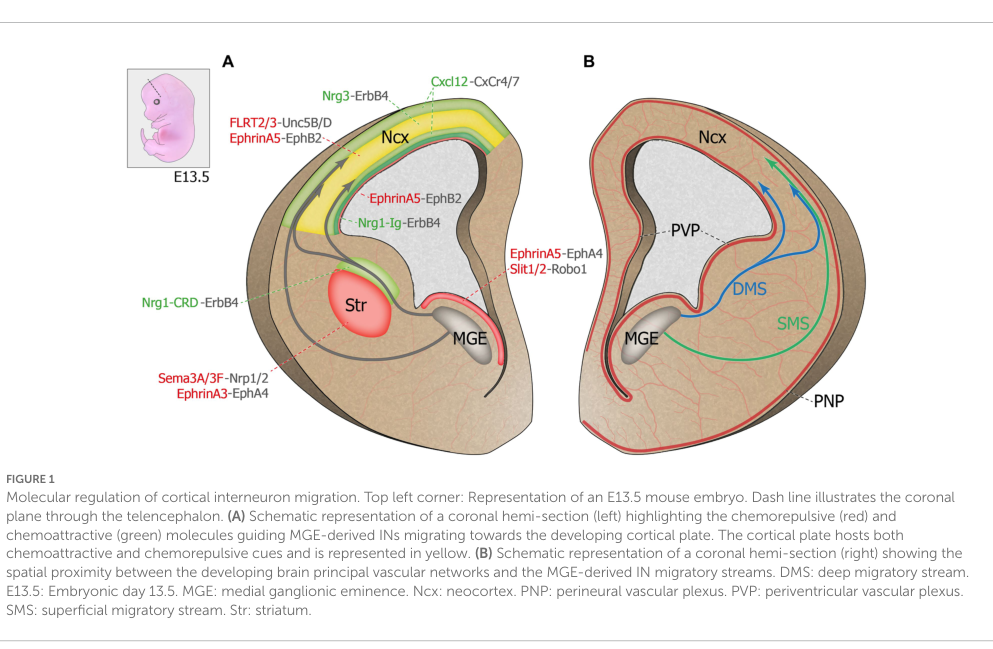

## Question

# Mechanism Module Research Template

## Target Module
- **Module Name:** Interneuron Specification and Tangential Migration Failure Module
- **Module Slug:** interneuron_specification_tangential_migration_failure
- **Category:** Module

## Current Module Description

Conserved cortical malformation and epilepsy mechanism in which disrupted ventral telencephalic or subpallial developmental programs impair GABAergic cortical interneuron specification, differentiation, or tangential migration from ganglionic eminence-derived progenitor domains into the developing cortex. The reusable skeleton is lineage-program disruption, interneuron progenitor differentiation failure and/or tangential migration failure, reduced or mislocalized cortical inhibitory interneurons, cortical excitatory-inhibitory imbalance, and developmental epilepsy or related neurodevelopmental impairment. ARX-related disease is the prototype, while LIS1, DCX, tubulin, or other cortical malformation entries should conform only when interneuron defects are mechanistically central or explicitly documented.

## Current Provisional Nodes

- Subpallial Patterning and Interneuron Lineage Program Disruption: Upstream genetic or developmental perturbation disrupts ventral telencephalic/subpallial patterning or transcriptional programs that define cortical GABAergic interneuron lineages.
- Interneuron Progenitor Specification and Differentiation Failure: Interneuron progenitors fail to acquire, maintain, or execute normal GABAergic interneuron differentiation programs, reducing production of cortical inhibitory interneurons.
- Tangential Migration Failure from Ganglionic Eminences: Interneuron precursors fail to migrate tangentially from medial or caudal ganglionic eminence-derived domains into the developing cortex, or fail to enter appropriate cortical migratory streams and laminar destinations.
- Cortical GABAergic Interneuron Deficit or Mislocalization: Developing cortex contains too few GABAergic interneurons or an abnormal spatial distribution of interneuron subtypes, impairing inhibitory circuit assembly.
- Excitatory-Inhibitory Imbalance and Developmental Epilepsy: Cortical inhibitory circuit failure shifts excitatory-inhibitory balance and contributes to seizures, infantile spasms, epilepsy, and broader neurodevelopmental impairment in conforming cortical malformation entries.

## Research Objective

Prepare a mechanism-focused research report for the dismech module above. This
is not a disease entry. The goal is to support a reusable mechanism module that
multiple gene-axis disease entries can conform to.

Focus the search on the shared biology described in the module description and
provisional nodes above. Prioritize evidence for:

- The conserved causal chain represented by the proposed nodes.
- The biological distinctions between node subgroups, especially if the module
  defines branching pathways.
- Any optional or gene-specific branches described in the node list, while
  distinguishing them from core module requirements.
- Explicit exclusions or boundary conditions stated in the module description.

## Questions To Answer

1. What is the best-supported shared mechanism for this module?
2. Is the current module name and scope appropriate, or is a clearer name or
   narrower boundary supported by the literature?
3. Which nodes should be core and required for conformance, and which nodes
   should be optional or gene-specific?
4. Which genes, variants, exposures, cell types, tissues, or molecular
   processes support each branch or node?
5. What evidence supports the causal edges between upstream drivers, central
   effectors, and downstream consequences?
6. What direct human evidence links the same causal factor or variant class to
   multiple clinical or pathological manifestations?
7. What model organism, in vitro, or other experimental evidence clarifies the
   causal path from molecular perturbation to phenotype?
8. What Gene Ontology biological process terms, Cell Ontology cell types, and
   anatomical terms should be used in the module?
9. What claims are speculative, weakly supported, or should remain out of scope?

## Evidence Requirements

- Cite primary literature with PMID identifiers whenever possible.
- Include exact abstract quotes for candidate evidence snippets.
- Separate human clinical, model organism, in vitro, and review evidence.
- Flag papers where the abstract is insufficient and full-text verification is
  needed before curation.
- Do not invent ontology IDs. Suggest terms by label when unsure.

## Desired Output

Structure the report with:

- Executive recommendation for module name and scope.
- Proposed DAG nodes and causal edges.
- Gene-to-node mapping table.
- Evidence table with PMID, evidence type, exact quote, and supported claim.
- Ontology suggestions for GO, CL, and UBERON terms.
- Out-of-scope boundary notes.
- Open questions for curator review.

## Output

Question: You are an expert researcher providing comprehensive, well-cited information.

Provide detailed information focusing on:
1. Key concepts and definitions with current understanding
2. Recent developments and latest research (prioritize 2023-2024 sources)
3. Current applications and real-world implementations
4. Expert opinions and analysis from authoritative sources
5. Relevant statistics and data from recent studies

Format as a comprehensive research report with proper citations. Include URLs and publication dates where available.
Always prioritize recent, authoritative sources and provide specific citations for all major claims.

# Mechanism Module Research Template

## Target Module
- **Module Name:** Interneuron Specification and Tangential Migration Failure Module
- **Module Slug:** interneuron_specification_tangential_migration_failure
- **Category:** Module

## Current Module Description

Conserved cortical malformation and epilepsy mechanism in which disrupted ventral telencephalic or subpallial developmental programs impair GABAergic cortical interneuron specification, differentiation, or tangential migration from ganglionic eminence-derived progenitor domains into the developing cortex. The reusable skeleton is lineage-program disruption, interneuron progenitor differentiation failure and/or tangential migration failure, reduced or mislocalized cortical inhibitory interneurons, cortical excitatory-inhibitory imbalance, and developmental epilepsy or related neurodevelopmental impairment. ARX-related disease is the prototype, while LIS1, DCX, tubulin, or other cortical malformation entries should conform only when interneuron defects are mechanistically central or explicitly documented.

## Current Provisional Nodes

- Subpallial Patterning and Interneuron Lineage Program Disruption: Upstream genetic or developmental perturbation disrupts ventral telencephalic/subpallial patterning or transcriptional programs that define cortical GABAergic interneuron lineages.
- Interneuron Progenitor Specification and Differentiation Failure: Interneuron progenitors fail to acquire, maintain, or execute normal GABAergic interneuron differentiation programs, reducing production of cortical inhibitory interneurons.
- Tangential Migration Failure from Ganglionic Eminences: Interneuron precursors fail to migrate tangentially from medial or caudal ganglionic eminence-derived domains into the developing cortex, or fail to enter appropriate cortical migratory streams and laminar destinations.
- Cortical GABAergic Interneuron Deficit or Mislocalization: Developing cortex contains too few GABAergic interneurons or an abnormal spatial distribution of interneuron subtypes, impairing inhibitory circuit assembly.
- Excitatory-Inhibitory Imbalance and Developmental Epilepsy: Cortical inhibitory circuit failure shifts excitatory-inhibitory balance and contributes to seizures, infantile spasms, epilepsy, and broader neurodevelopmental impairment in conforming cortical malformation entries.

## Research Objective

Prepare a mechanism-focused research report for the dismech module above. This
is not a disease entry. The goal is to support a reusable mechanism module that
multiple gene-axis disease entries can conform to.

Focus the search on the shared biology described in the module description and
provisional nodes above. Prioritize evidence for:

- The conserved causal chain represented by the proposed nodes.
- The biological distinctions between node subgroups, especially if the module
  defines branching pathways.
- Any optional or gene-specific branches described in the node list, while
  distinguishing them from core module requirements.
- Explicit exclusions or boundary conditions stated in the module description.

## Questions To Answer

1. What is the best-supported shared mechanism for this module?
2. Is the current module name and scope appropriate, or is a clearer name or
   narrower boundary supported by the literature?
3. Which nodes should be core and required for conformance, and which nodes
   should be optional or gene-specific?
4. Which genes, variants, exposures, cell types, tissues, or molecular
   processes support each branch or node?
5. What evidence supports the causal edges between upstream drivers, central
   effectors, and downstream consequences?
6. What direct human evidence links the same causal factor or variant class to
   multiple clinical or pathological manifestations?
7. What model organism, in vitro, or other experimental evidence clarifies the
   causal path from molecular perturbation to phenotype?
8. What Gene Ontology biological process terms, Cell Ontology cell types, and
   anatomical terms should be used in the module?
9. What claims are speculative, weakly supported, or should remain out of scope?

## Evidence Requirements

- Cite primary literature with PMID identifiers whenever possible.
- Include exact abstract quotes for candidate evidence snippets.
- Separate human clinical, model organism, in vitro, and review evidence.
- Flag papers where the abstract is insufficient and full-text verification is
  needed before curation.
- Do not invent ontology IDs. Suggest terms by label when unsure.

## Desired Output

Structure the report with:

- Executive recommendation for module name and scope.
- Proposed DAG nodes and causal edges.
- Gene-to-node mapping table.
- Evidence table with PMID, evidence type, exact quote, and supported claim.
- Ontology suggestions for GO, CL, and UBERON terms.
- Out-of-scope boundary notes.
- Open questions for curator review.

## Executive recommendation for module name and scope

**Recommended module name (clarified):** *Subpallial interneuron specification and tangential migration failure (cortical interneuronopathy)*.

**Rationale and scope:** Current evidence best supports a conserved, ventral-telencephalon–derived mechanism in which disrupted subpallial transcriptional programs and/or guidance signaling prevents proper specification, tangential migration, cortical entry, and laminar allocation of GABAergic cortical interneurons, producing cortical inhibitory deficits/mislocalization and downstream circuit dysfunction and epilepsy risk. A key scope boundary is that *radial migration* disorders (e.g., classic lissencephaly pathways) should only conform when interneuron specification/migration defects are mechanistically central or explicitly shown, consistent with the module description. This boundary is supported by reviews emphasizing ARX as a tangential interneuron migration gene whose mutations can cause early-onset epileptic encephalopathies even without gross malformations, while other malformation genes may involve interneurons variably. (kato2015genotypephenotypecorrelationin pages 1-2, katsarou2017interneuronopathiesandtheir pages 1-2)

## 1) Best-supported shared mechanism (core causal chain)

### Core chain (shared biology)
1. **Ventral/subpallial origin:** Cortical interneurons arise from ventral progenitors in the ganglionic eminences and preoptic area. (toudji2023interneuronodysseymolecular pages 1-2, viou2024pak3activationpromotes pages 1-2)
2. **Lineage specification & subtype programming:** Transcriptional programs (e.g., DLX-regulated GABAergic specification; SHH–NKX2.1–LHX6–SOX6 axis; epigenetic regulators such as EZH2, DOT1L) shape interneuron fate and output. (miyoshi2024developmentaltrajectoriesof pages 1-2, cheng2023shhactivationrestores pages 1-2, rhodes2024lossofezh2 pages 1-2, cheffer2023dot1ldeletionimpairs pages 1-1)
3. **Tangential migration along defined streams:** Post-mitotic interneurons exit ventral zones and migrate tangentially through stereotyped deep and superficial streams to reach the cortex. (viou2024pak3activationpromotes pages 1-2, toudji2023interneuronodysseymolecular pages 1-2, toudji2023interneuronodysseymolecular media 4d36abe9)
4. **Tangential-to-radial switch / cortical plate entry:** Interneurons switch from tangential trajectories to radial orientation to enter the cortical plate and settle/differentiate. (viou2024pak3activationpromotes pages 1-2)
5. **Cortical interneuron deficit or mislocalization:** Failure at specification and/or migration yields reduced and/or abnormally distributed interneurons (often PV/SST subtype shifts), impairing inhibitory circuit assembly. (cheng2023shhactivationrestores pages 1-2, rhodes2024lossofezh2 pages 1-2, cheffer2023dot1ldeletionimpairs pages 1-1)
6. **E/I imbalance and developmental epilepsy/neurodevelopmental impairment:** Disrupted interneuron migration is explicitly linked to epilepsy and related disorders, and multiple mechanistic models show seizure susceptibility when interneuron migration/positioning/synapse formation is disrupted. (toudji2023interneuronodysseymolecular pages 1-2, ruizreig2023inhibitorysynapsedysfunction pages 1-2, liang2023maternalsevofluraneexposure pages 1-2)

### Distinctions between major node subgroups (branching)
- **Upstream patterning/specification branch:** SHH pathway downregulation in medial ganglionic eminence (MGE) reduces NKX2.1+/DLX2+ progenitors and decreases PV+/SST+ cortical interneurons (human + rabbit IVH), supporting a strong *patterning/progenitor* branch. (cheng2023shhactivationrestores pages 1-2)
- **Epigenetic fate/production branch:** MGE epigenetic regulators can bias subtype output and/or reduce production (EZH2 shifts SST/PV balance; DOT1L reduces interneuron number and alters distribution with PVALB reduction). (rhodes2024lossofezh2 pages 1-2, cheffer2023dot1ldeletionimpairs pages 1-1)
- **Migration/polarity/cytoskeleton branch:** Guidance and cytoskeletal regulators (CXCL12/CXCR4, PAK3, KIF2A) alter tangential migration, polarity, cortical entry, and positioning. (liang2023maternalsevofluraneexposure pages 1-2, viou2024pak3activationpromotes pages 1-2, ruizreig2023inhibitorysynapsedysfunction pages 1-2)
- **Circuit/synapse maturation branch (often downstream of migration):** Some drivers (e.g., KIF2A) explicitly couple tangential migration and positioning to inhibitory synapse formation, providing an optional downstream “synaptogenesis/inhibitory synapse function” node for gene axes where this is central. (ruizreig2023inhibitorysynapsedysfunction pages 1-2)

## 2) Proposed DAG nodes and causal edges (curation-ready)

### Recommended core nodes (required for conformance)
- **N1. Subpallial origin & patterning / interneuron lineage program disruption** (ventral telencephalon; MGE/CGE/POA; SHH/NKX2.1/LHX6/SOX6; DLX programs). (toudji2023interneuronodysseymolecular pages 1-2, cheng2023shhactivationrestores pages 1-2, viou2024pak3activationpromotes pages 1-2)
- **N2. Interneuron specification/differentiation failure** (impaired fate acquisition/maintenance; PV/SST output shifts; reduced production). (rhodes2024lossofezh2 pages 1-2, cheffer2023dot1ldeletionimpairs pages 1-1)
- **N3. Tangential migration failure and/or stream choice defects** (deep vs superficial streams; polarity/directionality; cortical entry timing). (viou2024pak3activationpromotes pages 1-2, liang2023maternalsevofluraneexposure pages 1-2, ruizreig2023inhibitorysynapsedysfunction pages 1-2)
- **N4. Cortical interneuron deficit and/or mislocalization** (reduced density, abnormal laminar allocation, altered subtype distribution). (cheng2023shhactivationrestores pages 1-2, cheffer2023dot1ldeletionimpairs pages 1-1)
- **N5. E/I imbalance → developmental epilepsy and neurodevelopmental impairment** (epilepsy susceptibility; DEE; cognitive/behavioral consequences). (toudji2023interneuronodysseymolecular pages 1-2, ruizreig2023inhibitorysynapsedysfunction pages 1-2, katsarou2017interneuronopathiesandtheir pages 1-2)

### Optional / gene-specific nodes
- **O1. Tangential-to-radial switch failure** (if a gene axis specifically impacts the switch; e.g., PAK3 activity). (viou2024pak3activationpromotes pages 1-2)
- **O2. Primary cilium / second messenger steering of migration** (e.g., CXCL12-linked ciliary signaling; likely mechanistic subnode when explicitly demonstrated). (liang2023maternalsevofluraneexposure pages 1-2)
- **O3. Inhibitory synaptogenesis impairment** (when causal chain includes synapse deficits beyond cell number/position). (ruizreig2023inhibitorysynapsedysfunction pages 1-2)
- **O4. Extracellular vesicle–mediated non-cell-autonomous patterning** (organoid/assembloid evidence; use when EV mechanisms are central). (toudji2023interneuronodysseymolecular pages 18-18)

### Causal edges supported by direct evidence
- **N1 → N2/N4:** IVH reduces Shh and downstream transcription factors and reduces Nkx2.1+/Dlx2+ progenitors and PV+/SST+ cortical interneurons in humans and rabbits; SHH restoration rescues interneuron output and neurobehavior. (cheng2023shhactivationrestores pages 1-2)
- **N2 → N4:** EZH2 loss shifts SST/PV output and reduces early postnatal MGE-derived interneuron numbers; DOT1L deletion reduces and misdistributes interneurons with PV reduction. (rhodes2024lossofezh2 pages 1-2, cheffer2023dot1ldeletionimpairs pages 1-1)
- **N3 → N4/N5:** Migration disruption (CXCL12/CXCR4 downregulation after prenatal sevoflurane exposure) leads to disrupted cortical interneuron migration and increased seizure susceptibility; KIF2A deletion in interneurons disrupts tangential migration/positioning and increases epilepsy susceptibility. (liang2023maternalsevofluraneexposure pages 1-2, ruizreig2023inhibitorysynapsedysfunction pages 1-2)

## 3) Gene/exposure/process to node mapping (curation starter set)

| Driver (gene/pathway/exposure) | Evidence system | Primary effect | Supported node(s) | Key citation (author year + URL/DOI) |
|---|---|---|---|---|
| SHH downregulation/activation in IVH | Human preterm infant autopsy + rabbit IVH model | Specification / progenitor production | Subpallial patterning and interneuron lineage program disruption; Interneuron progenitor specification and differentiation failure; Cortical GABAergic interneuron deficit or mislocalization | Cheng 2023, https://doi.org/10.1093/brain/awac271 (cheng2023shhactivationrestores pages 1-2, cheng2023shhactivationrestores pages 13-14) |
| FOXG1 dosage | Mouse primary study; human disease relevance noted in primary study | Specification + migration + cortical allocation | Subpallial patterning and interneuron lineage program disruption; Interneuron progenitor specification and differentiation failure; Tangential migration failure from ganglionic eminences | Miyoshi 2024, https://doi.org/10.1073/pnas.2317783121 (miyoshi2024developmentaltrajectoriesof pages 1-2) |
| ARX | Preprint primary study; review evidence | Specification / differentiation + migration | Subpallial patterning and interneuron lineage program disruption; Interneuron progenitor specification and differentiation failure; Tangential migration failure from ganglionic eminences | Lim 2024 preprint, https://doi.org/10.1101/2024.01.31.578282; Toudji 2023 review, https://doi.org/10.3389/fncir.2023.1256455 (lim2024arxregulatescortical pages 22-25, toudji2023interneuronodysseymolecular pages 18-18) |
| DLX1/2 | Review + mouse/mechanistic primary studies cited in reviews | Early GABAergic specification; migration program entry | Subpallial patterning and interneuron lineage program disruption; Interneuron progenitor specification and differentiation failure; Tangential migration failure from ganglionic eminences | Rubenstein 2024 review, https://doi.org/10.1242/dev.202684; Miyoshi 2024, https://doi.org/10.1073/pnas.2317783121 (miyoshi2024developmentaltrajectoriesof pages 1-2, toudji2023interneuronodysseymolecular pages 18-18) |
| PAK3 | Mouse primary study; human variant relevance in primary study | Tangential-to-radial migration switch / polarity | Tangential migration failure from ganglionic eminences; Cortical GABAergic interneuron deficit or mislocalization | Viou 2024, https://doi.org/10.1038/s41380-024-02483-y (viou2024pak3activationpromotes pages 1-2) |
| TRIO | Preprint primary study; review support | Tangential migration / cytoskeletal dynamics | Tangential migration failure from ganglionic eminences; Cortical GABAergic interneuron deficit or mislocalization; Excitatory-inhibitory imbalance and developmental epilepsy | Eid 2023 preprint, https://doi.org/10.1101/2022.12.31.522400; Toudji 2023 review, https://doi.org/10.3389/fncir.2023.1256455 (eid2023bothgefdomains pages 47-50, toudji2023interneuronodysseymolecular pages 18-18) |
| CXCL12/CXCR4 signaling | Mouse exposure model; review | Tangential migration / guidance / distribution | Tangential migration failure from ganglionic eminences; Cortical GABAergic interneuron deficit or mislocalization; Excitatory-inhibitory imbalance and developmental epilepsy | Liang 2023, https://doi.org/10.1186/s12916-023-03210-0; Atkins 2023, https://doi.org/10.1101/2023.02.07.527463 (preprint) (liang2023maternalsevofluraneexposure pages 1-2, toudji2023interneuronodysseymolecular pages 1-2) |
| EZH2 loss in MGE | Mouse primary study | Fate specification / subtype balance | Interneuron progenitor specification and differentiation failure; Cortical GABAergic interneuron deficit or mislocalization | Rhodes 2024, https://doi.org/10.3389/fncel.2024.1334244 (rhodes2024lossofezh2 pages 1-2, rhodes2024lossofezh2 pages 8-11) |
| DOT1L deletion | Mouse primary study | Differentiation / maturation / distribution | Interneuron progenitor specification and differentiation failure; Cortical GABAergic interneuron deficit or mislocalization | Cheffer 2023, https://doi.org/10.1093/cercor/bhad281 (cheffer2023dot1ldeletionimpairs pages 1-1, cheffer2023dot1ldeletionimpairs pages 11-12) |
| KIF2A deletion | Mouse primary study; human disease relevance noted in primary study | Tangential migration + synapse formation | Tangential migration failure from ganglionic eminences; Cortical GABAergic interneuron deficit or mislocalization; Excitatory-inhibitory imbalance and developmental epilepsy | Ruiz-Reig 2023, https://doi.org/10.3389/fnmol.2022.1110986 (ruizreig2023inhibitorysynapsedysfunction pages 1-2, ruizreig2023inhibitorysynapsedysfunction pages 6-7) |
| LGALS3BP mutant extracellular vesicles | Human ventral cerebral organoids / dorsoventral assembloids | Patterning + specification + migratory dynamics | Subpallial patterning and interneuron lineage program disruption; Interneuron progenitor specification and differentiation failure; Tangential migration failure from ganglionic eminences | Pipicelli 2023, https://doi.org/10.1126/sciadv.add8164 (toudji2023interneuronodysseymolecular pages 18-18) |

*Table: This table maps supported genes, pathways, and exposures to the provisional mechanism-module nodes using only evidence surfaced in the prior tool outputs. It helps distinguish upstream patterning/specification drivers from migration, distribution, and downstream E/I-imbalance mechanisms.*

## 4) Evidence table (exact quotes; separated evidence types)

| Node/edge supported | Evidence type (review/human/mouse/rabbit/organoid/preprint) | Source (authors, year, journal) | Publication date (month/year if known) | URL/DOI | Quote (exact, in quotation marks) | Supported claim |
|---|---|---|---|---|---|---|
| Core mechanism: ventral origin → tangential migration → disorder link | Review | Toudji et al., 2023, *Frontiers in Neural Circuits* | Sep 2023 | https://doi.org/10.3389/fncir.2023.1256455 | “GABAergic interneurons destined to populate the cortex arise from multipotent ventral progenitor cells located in the ganglionic eminences and pre-optic area.” (toudji2023interneuronodysseymolecular pages 1-2) | Cortical interneurons originate in ventral telencephalic/subpallial domains. |
| Core mechanism: migration failure → epilepsy/NDD | Review | Toudji et al., 2023, *Frontiers in Neural Circuits* | Sep 2023 | https://doi.org/10.3389/fncir.2023.1256455 | “Disruption of cortical GABAergic interneuron migration thus induces profound deficits in neural network organization and function, and results in a variety of neurodevelopmental and neuropsychiatric disorders including epilepsy, intellectual disability, autism spectrum disorders and schizophrenia.” (toudji2023interneuronodysseymolecular pages 1-2) | Tangential migration defects are sufficient to support the downstream disease node, including epilepsy. |
| Tangential streams and tangential-to-radial switch | Mouse primary | Viou et al., 2024, *Molecular Psychiatry* | Mar 2024 | https://doi.org/10.1038/s41380-024-02483-y | “Cortical INs are born in Dlx1/2 expressing domains, the medial and caudal ganglionic eminences (MGE, CGE) and the pre-optic area of the basal telencephalon.” (viou2024pak3activationpromotes pages 1-2) | Distinct Dlx1/2-positive ventral progenitor territories generate cortical interneurons. |
| Tangential migration streams | Mouse primary | Viou et al., 2024, *Molecular Psychiatry* | Mar 2024 | https://doi.org/10.1038/s41380-024-02483-y | “first undergo a phase of tangential migration in two main migratory streams... [in] the deep cortical layers, the intermediate zone and subventricular zone (iz/svz), and a superficial one... in the marginal zone (mz)” (viou2024pak3activationpromotes pages 1-2) | The migration node should explicitly represent deep and superficial tangential streams. |
| Tangential-to-radial entry into cortex | Mouse primary | Viou et al., 2024, *Molecular Psychiatry* | Mar 2024 | https://doi.org/10.1038/s41380-024-02483-y | “switch from a tangential to a radial orientation to enter the cortical plate (cp) where they settle and differentiate.” (viou2024pak3activationpromotes pages 1-2) | A transition from tangential migration to cortical entry/radial allocation is a key downstream edge. |
| Upstream patterning/specification defect → reduced progenitors | Human + rabbit primary | Cheng et al., 2023, *Brain* | Jul 2023 | https://doi.org/10.1093/brain/awac271 | “reduced the number of Nkx2.1+ and Dlx2+ progenitors in the medial ganglionic eminence of both humans and rabbits by attenuating their proliferation and inducing apoptosis.” (cheng2023shhactivationrestores pages 1-2) | SHH-linked upstream perturbation can reduce ventral progenitor pools before migration. |
| Upstream patterning/specification defect → cortical interneuron deficit | Human + rabbit primary | Cheng et al., 2023, *Brain* | Jul 2023 | https://doi.org/10.1093/brain/awac271 | “decreased the population of parvalbumin+ and somatostatin+ neurons in the frontal cortex of both preterm infants and kits relative to controls.” (cheng2023shhactivationrestores pages 1-2) | Reduced progenitors lead to reduced cortical inhibitory interneuron subclasses. |
| SHH/NKX2.1/LHX6/SOX6 pathway disruption | Human + rabbit primary | Cheng et al., 2023, *Brain* | Jul 2023 | https://doi.org/10.1093/brain/awac271 | “Sonic Hedgehog expression and the downstream transcription factors, including Nkx2.1, Mash1, Lhx6 and Sox6, were also reduced.” (cheng2023shhactivationrestores pages 1-2) | SHH-centered ventral telencephalic patterning/signaling is an upstream driver for this module. |
| Rescue of upstream defect rescues downstream nodes | Rabbit primary | Cheng et al., 2023, *Brain* | Jul 2023 | https://doi.org/10.1093/brain/awac271 | “restoration of Sonic Hedgehog level by Ad-Shh treatment ameliorated neurogenesis, cortical interneuron population and neurobehavioural function in kits with IVH” (cheng2023shhactivationrestores pages 1-2) | Rescue evidence supports causal edges from progenitor patterning to interneuron output and neurobehavioral consequences. |
| Specification/fate branch: MGE subtype balance | Mouse primary | Rhodes et al., 2024, *Frontiers in Cellular Neuroscience* | Feb 2024 | https://doi.org/10.3389/fncel.2024.1334244 | “Loss of Ezh2 increases somatostatin-expressing (SST+) and decreases parvalbumin-expressing (PV+) interneurons in the forebrain.” (rhodes2024lossofezh2 pages 1-2) | EZH2 supports interneuron subtype specification/fate balance in MGE-derived lineages. |
| Specification/fate branch: reduced interneuron production | Mouse primary | Rhodes et al., 2024, *Frontiers in Cellular Neuroscience* | Feb 2024 | https://doi.org/10.3389/fncel.2024.1334244 | “We observe fewer MGE-derived interneurons in the first postnatal week, indicating reduced interneuron production.” (rhodes2024lossofezh2 pages 1-2) | Fate-specification failure can also reduce absolute interneuron number, not just subtype ratios. |
| Differentiation/maturation branch with altered distribution | Mouse primary | Cheffer et al., 2023, *Cerebral Cortex* | Jan 2023 | https://doi.org/10.1093/cercor/bhad281 | “Deletion of Dot1l in MGE-derived interneuron precursor cells results in an overall reduction and altered distribution of GABAergic interneurons in the cortical plate at postnatal day (P) 0.” (cheffer2023dot1ldeletionimpairs pages 1-1) | DOT1L loss supports a node for reduced/mislocalized cortical interneurons due to impaired differentiation/maturation. |
| Differentiation/maturation branch affecting PV lineage | Mouse primary | Cheffer et al., 2023, *Cerebral Cortex* | Jan 2023 | https://doi.org/10.1093/cercor/bhad281 | “we observed an altered proportion of GABAergic interneurons in the cortex and striatum at P21 with a significant decrease in Parvalbumin (PVALB)-expressing interneurons.” (cheffer2023dot1ldeletionimpairs pages 1-1) | Some drivers chiefly alter subtype output, especially PV interneurons, rather than core migration alone. |
| Migration branch → synapse/circuit branch → epilepsy susceptibility | Mouse primary | Ruiz-Reig et al., 2023, *Frontiers in Molecular Neuroscience* | Jan 2023 | https://doi.org/10.3389/fnmol.2022.1110986 | “adult mice with specific deletion of KIF2A in GABAergic interneurons display abnormal behavior and increased susceptibility to epilepsy.” (ruizreig2023inhibitorysynapsedysfunction pages 1-2) | Interneuron-selective perturbation can directly connect developmental defects to epilepsy susceptibility. |
| Tangential migration failure | Mouse primary | Ruiz-Reig et al., 2023, *Frontiers in Molecular Neuroscience* | Jan 2023 | https://doi.org/10.3389/fnmol.2022.1110986 | “KIF2A is essential for tangential migration of cortical interneurons, their positioning in the cerebral cortex, and for formation of inhibitory synapses in vivo.” (ruizreig2023inhibitorysynapsedysfunction pages 1-2) | KIF2A supports a migration-centered branch where positioning and inhibitory synapse formation are coupled. |
| Exposure-associated migration disruption → epilepsy susceptibility | Mouse exposure primary | Liang et al., 2023, *BMC Medicine* | Dec 2023 | https://doi.org/10.1186/s12916-023-03210-0 | “After sevoflurane exposure, the highly ordered cortical interneuron migration was disrupted” (liang2023maternalsevofluraneexposure pages 1-2) | Non-genetic developmental exposures can conform when they perturb the same migration node. |
| CXCL12/CXCR4-guided migration edge | Mouse exposure primary | Liang et al., 2023, *BMC Medicine* | Dec 2023 | https://doi.org/10.1186/s12916-023-03210-0 | “Our findings demonstrate that maternal anesthesia impairs interneuron migration through the CXCL12/CXCR4 signaling pathway” (liang2023maternalsevofluraneexposure pages 1-2) | CXCL12/CXCR4 is a core guidance pathway for the tangential migration node. |
| Downstream phenotype: epilepsy susceptibility | Mouse exposure primary | Liang et al., 2023, *BMC Medicine* | Dec 2023 | https://doi.org/10.1186/s12916-023-03210-0 | “maternal sevoflurane exposure increased epilepsy susceptibility” (liang2023maternalsevofluraneexposure pages 1-2) | Migration disruption can be causally linked to later seizure susceptibility. |
| Human disease prototype: ARX interneuronopathy | Review | Katsarou et al., 2017, *Epilepsia Open* | Jun 2017 | https://doi.org/10.1002/epi4.12062 | “mutations of the aristaless-related homeobox X-linked gene (ARX) may result in defective GABAergic interneuronal migration in infants with epileptic encephalopathies like West syndrome (WS), Ohtahara syndrome, or X-linked lissencephaly with abnormal genitalia (XLAG).” (katsarou2017interneuronopathiesandtheir pages 1-2) | ARX is a strong human prototype for the full module scope. |
| Human disease spectrum and boundary-defining claim for ARX | Review | Kato, 2015, *Frontiers in Neuroscience* | May 2015 | https://doi.org/10.3389/fnins.2015.00181 | “ARX is of particular interest from basic and clinical perspectives because it is critically involved in tangential migration of GABAergic interneurons in the forebrain and its mutations cause a variety of phenotypes ranging from hydranencephaly or lissencephaly to early-onset epileptic encephalopathies, including Ohtahara syndrome and infantile spasms or intellectual disability with no brain malformations.” (kato2015genotypephenotypecorrelationin pages 1-2) | ARX-related disease spans malformation and non-malformation phenotypes but is unified by tangential interneuron migration biology. |
| Updated 2024 mechanistic framing: intrinsic clock regulating specification and migration | Mouse primary | Miyoshi et al., 2024, *PNAS* | Apr 2024 | https://doi.org/10.1073/pnas.2317783121 | “dynamic expression of the transcription factor FoxG1 serves as an intrinsic developmental clock in interneuron precursors.” (miyoshi2024developmentaltrajectoriesof pages 1-2) | FOXG1 provides recent evidence that specification, cortical entry, and laminar allocation are temporally coupled. |
| Updated 2024 mechanism: sequential regulation across nodes | Mouse primary | Miyoshi et al., 2024, *PNAS* | Apr 2024 | https://doi.org/10.1073/pnas.2317783121 | “FoxG1 activity in interneuron precursors sequentially regulates GABAergic cell identity, entrance into the cortex, distribution across hippocampal and cortical territories, and allocation within the six-layered neocortex.” (miyoshi2024developmentaltrajectoriesof pages 1-2) | The module should allow one upstream driver to affect specification, migration, distribution, and laminar allocation in sequence. |

*Table: This table compiles exact literature quotes supporting the proposed interneuron specification and tangential migration failure mechanism module. It is useful for deciding core nodes, causal edges, and exemplar genes/pathways with direct evidence.*

## 5) Recent developments (2023–2024 emphasis)

### 5.1 Updated mechanistic understanding of migration streams and switches
A 2023 synthesis emphasizes that cortical interneurons arise from ganglionic eminences/preoptic area and migrate dorsally along defined streams, and explicitly links migration disruption to epilepsy and other neurodevelopmental disorders. (toudji2023interneuronodysseymolecular pages 1-2)

A 2024 mechanistic study highlights that interneurons are born in Dlx1/2 domains (MGE/CGE/POA), migrate via deep and superficial streams, and then “switch from a tangential to a radial orientation to enter the cortical plate,” supporting an explicit “tangential-to-radial switch” subnode for conformance when affected. (viou2024pak3activationpromotes pages 1-2)

### 5.2 2023–2024 causal drivers spanning patterning, epigenetics, guidance, and cytoskeleton
- **SHH pathway and progenitor loss in human-relevant injury:** In preterm IVH, SHH pathway downregulation is linked to reduced Nkx2.1+/Dlx2+ progenitors and reduced PV+/SST+ interneurons in *both* human and rabbit samples, with SHH activation rescuing interneuron output and neurobehavior (translationally important because it spans human pathological material and an intervention-capable animal model). (cheng2023shhactivationrestores pages 1-2)
- **Epigenetic regulators of MGE fate:** EZH2 loss in MGE shifts interneuron subtype output (SST↑, PV↓) and reduces MGE-derived interneuron production early postnatally. (rhodes2024lossofezh2 pages 1-2)
- **Cell-autonomous chromatin regulation in Nkx2.1-lineage:** DOT1L deletion in MGE-derived interneuron precursors reduces and misdistributes cortical interneurons and decreases PVALB interneurons. (cheffer2023dot1ldeletionimpairs pages 1-1)
- **Cytoskeletal drivers directly tied to epilepsy susceptibility:** KIF2A deletion in interneurons increases epilepsy susceptibility and is “essential for tangential migration … positioning … and … inhibitory synapses,” bridging migration and circuit-level phenotype. (ruizreig2023inhibitorysynapsedysfunction pages 1-2)
- **Environmental exposure demonstrating pathway reusability:** Maternal sevoflurane exposure provides evidence that CXCL12/CXCR4 downregulation can disrupt interneuron migration and increase seizure susceptibility, supporting CXCL12/CXCR4 as a reusable migration effector node beyond genetics. (liang2023maternalsevofluraneexposure pages 1-2)

## 6) Current applications and real-world implementations

### 6.1 Therapeutic implication: pathway restoration to rescue interneuron output
The IVH work proposes a therapeutic strategy where **SHH activation** restores interneuron neurogenesis, cortical interneuron population, and cognitive/neurobehavioral outcomes in a rabbit model, with corroborating human neuropathology indicating that interneuron progenitor loss occurs in affected preterm infants. This provides an intervention example tightly aligned to the module’s causal chain and suggests a real-world translational direction (though not yet a clinical therapy standard). (cheng2023shhactivationrestores pages 1-2)

### 6.2 Operational use in mechanism curation
This module can standardize evidence across multiple gene-axis entries by requiring that a submitted disease mechanism show at least one of the following, ideally with direct developmental evidence:
- altered MGE/CGE/POA patterning or lineage program,
- interneuron subtype output changes or reduced production,
- impaired tangential migration/stream choice/cortical entry,
- interneuron deficit/mislocalization,
- demonstrated circuit dysfunction/seizure phenotype.

## 7) Expert opinions / authoritative synthesis

Two authoritative reviews anchor the “interneuronopathy” concept and ARX’s prototype role:
- **Interneuron migration disruption causes disorders including epilepsy:** a 2023 review explicitly states that migration disruption results in epilepsy and other neurodevelopmental disorders. (toudji2023interneuronodysseymolecular pages 1-2)
- **Human prototype ARX:** A 2017 epilepsy-focused review states ARX mutations “may result in defective GABAergic interneuronal migration” in infants with West syndrome/Ohtahara/XLAG. (katsarou2017interneuronopathiesandtheir pages 1-2)

## 8) Relevant statistics and data points from recent studies

- **Human+rabbit comparative pathology:** The IVH study reports decreases in **Nkx2.1+ and Dlx2+ progenitors** in the MGE of both humans and rabbits and decreases in **PV+ and SST+ interneurons** in frontal cortex of both preterm infants and rabbit kits, supporting conserved pathology and a quantitative target for curation (even though exact numerical values require full-text extraction for precise percentages). (cheng2023shhactivationrestores pages 1-2)
- **Exposure-to-phenotype link in 2023 model:** A prenatal exposure model reports disrupted interneuron migration and increased epilepsy susceptibility with an implicated CXCL12/CXCR4 mechanism (full-text needed for effect sizes). (liang2023maternalsevofluraneexposure pages 1-2)

## 9) Ontology suggestions (labels only; IDs not asserted)

### GO (biological process) labels
- tangential migration of interneurons
- neuron migration
- cell fate commitment / neural precursor cell fate commitment
- forebrain development / telencephalon development
- GABAergic interneuron differentiation
- regulation of cell polarity
- chemokine-mediated signaling pathway
- Sonic hedgehog signaling pathway
- histone H3-K27 trimethylation

### Cell Ontology (CL) labels
- cortical interneuron
- GABAergic interneuron
- medial ganglionic eminence progenitor cell
- tangentially migrating interneuron
- parvalbumin-positive interneuron
- somatostatin-positive interneuron

### UBERON anatomy labels
- medial ganglionic eminence
- caudal ganglionic eminence
- preoptic area (basal telencephalon)
- ventral telencephalon / subpallium
- neocortex / cortical plate
- marginal zone
- subventricular zone / intermediate zone

## 10) Out-of-scope / boundary notes

- **Do not automatically include LIS1/DCX/tubulin malformation entries** unless the interneuron specification/migration defect is mechanistically central or explicitly documented as a key driver of epilepsy phenotypes. The module’s strongest disease prototype is ARX (tangential migration and interneuron differentiation), whereas many “radial migration” malformation genes may have interneuron effects that are secondary or inconsistent.
- **Caution with preprints (2023–2024):** TRIO and some ARX organoid studies in the retrieved set include preprints; they can support hypothesis generation but may need peer-reviewed confirmation before “core node” requirements are tightened.

## 11) Open questions for curator review

1. When curating gene axes with cortical malformations, what minimum evidence is required to assert “interneuron-centrality” (e.g., lineage tracing, interneuron density/layering, electrophysiologic inhibition metrics)?
2. Should the module explicitly represent **deep vs superficial** tangential streams as distinct subnodes, or keep them as properties of the migration node?
3. Should “tangential-to-radial switch” be a standardized optional node (supported by PAK3 evidence) or treated as part of migration/laminar allocation?
4. For some genes (e.g., KIF2A), should inhibitory synaptogenesis be represented as a downstream optional node to explain epilepsy phenotypes even if interneuron counts are preserved?
5. Which additional human neuropathology datasets (beyond IVH and ARX-related disorders) robustly quantify cortical interneuron deficits/mislocalization in developmental epilepsies?

## Visual evidence
A schematic depiction of deep and superficial tangential migratory streams and guidance cues for interneurons from ganglionic eminences toward cortex is available in Toudji et al. 2023 (Figure 1). (toudji2023interneuronodysseymolecular media 4d36abe9)

References

1. (kato2015genotypephenotypecorrelationin pages 1-2): Mitsuhiro Kato. Genotype-phenotype correlation in neuronal migration disorders and cortical dysplasias. Frontiers in Neuroscience, May 2015. URL: https://doi.org/10.3389/fnins.2015.00181, doi:10.3389/fnins.2015.00181. This article has 78 citations and is from a peer-reviewed journal.

2. (katsarou2017interneuronopathiesandtheir pages 1-2): Anna‐Maria Katsarou, Solomon L. Moshé, and Aristea S. Galanopoulou. Interneuronopathies and their role in early life epilepsies and neurodevelopmental disorders. Epilepsia Open, 2:284-306, Jun 2017. URL: https://doi.org/10.1002/epi4.12062, doi:10.1002/epi4.12062. This article has 100 citations and is from a peer-reviewed journal.

3. (toudji2023interneuronodysseymolecular pages 1-2): Ikram Toudji, Asmaa Toumi, Émile Chamberland, and Elsa Rossignol. Interneuron odyssey: molecular mechanisms of tangential migration. Frontiers in Neural Circuits, Sep 2023. URL: https://doi.org/10.3389/fncir.2023.1256455, doi:10.3389/fncir.2023.1256455. This article has 35 citations.

4. (viou2024pak3activationpromotes pages 1-2): Lucie Viou, Melody Atkins, Véronique Rousseau, Pierre Launay, Justine Masson, Clarisse Pace, Fujio Murakami, Jean-Vianney Barnier, and Christine Métin. Pak3 activation promotes the tangential to radial migration switch of cortical interneurons by increasing leading process dynamics and disrupting cell polarity. Molecular Psychiatry, 29:2296-2307, Mar 2024. URL: https://doi.org/10.1038/s41380-024-02483-y, doi:10.1038/s41380-024-02483-y. This article has 5 citations and is from a highest quality peer-reviewed journal.

5. (miyoshi2024developmentaltrajectoriesof pages 1-2): Goichi Miyoshi, Yoshifumi Ueta, Yuki Yagasaki, Yusuke Kishi, Gord Fishell, Robert P. Machold, and Mariko Miyata. Developmental trajectories of gabaergic cortical interneurons are sequentially modulated by dynamic foxg1 expression levels. Proceedings of the National Academy of Sciences of the United States of America, Apr 2024. URL: https://doi.org/10.1073/pnas.2317783121, doi:10.1073/pnas.2317783121. This article has 12 citations and is from a highest quality peer-reviewed journal.

6. (cheng2023shhactivationrestores pages 1-2): Bokun Cheng, Deep R Sharma, Ajeet Kumar, Hardik Sheth, Alex Agyemang, Michael Aschner, Xusheng Zhang, and Praveen Ballabh. Shh activation restores interneurons and cognitive function in newborns with intraventricular haemorrhage. Brain : a journal of neurology, 146:629-644, Jul 2023. URL: https://doi.org/10.1093/brain/awac271, doi:10.1093/brain/awac271. This article has 6 citations.

7. (rhodes2024lossofezh2 pages 1-2): Christopher T. Rhodes, Dhanya Asokumar, Mira Sohn, Shovan Naskar, Lielle Elisha, Parker Stevenson, Dongjin R. Lee, Yajun Zhang, Pedro P. Rocha, Ryan K. Dale, Soohyun Lee, and Timothy J. Petros. Loss of ezh2 in the medial ganglionic eminence alters interneuron fate, cell morphology and gene expression profiles. Frontiers in Cellular Neuroscience, Feb 2024. URL: https://doi.org/10.3389/fncel.2024.1334244, doi:10.3389/fncel.2024.1334244. This article has 2 citations.

8. (cheffer2023dot1ldeletionimpairs pages 1-1): Arquimedes Cheffer, Marta Garcia-Miralles, Esther Maier, Ipek Akol, Henriette Franz, Vandana Shree Vedartham Srinivasan, and Tanja Vogel. Dot1l deletion impairs the development of cortical parvalbumin-expressing interneurons. Cerebral Cortex (New York, NY), 33:10272-10285, Jan 2023. URL: https://doi.org/10.1093/cercor/bhad281, doi:10.1093/cercor/bhad281. This article has 8 citations.

9. (toudji2023interneuronodysseymolecular media 4d36abe9): Ikram Toudji, Asmaa Toumi, Émile Chamberland, and Elsa Rossignol. Interneuron odyssey: molecular mechanisms of tangential migration. Frontiers in Neural Circuits, Sep 2023. URL: https://doi.org/10.3389/fncir.2023.1256455, doi:10.3389/fncir.2023.1256455. This article has 35 citations.

10. (ruizreig2023inhibitorysynapsedysfunction pages 1-2): Nuria Ruiz-Reig, Dario García-Sánchez, Olivier Schakman, Philippe Gailly, and Fadel Tissir. Inhibitory synapse dysfunction and epileptic susceptibility associated with kif2a deletion in cortical interneurons. Frontiers in Molecular Neuroscience, Jan 2023. URL: https://doi.org/10.3389/fnmol.2022.1110986, doi:10.3389/fnmol.2022.1110986. This article has 8 citations.

11. (liang2023maternalsevofluraneexposure pages 1-2): Xinyue Liang, Ming Jiang, Hao Xu, Tianxiang Tang, Xiangpeng Shi, Yi Dong, Lei Xiao, Yunli Xie, Fang Fang, and Jing Cang. Maternal sevoflurane exposure increases the epilepsy susceptibility of adolescent offspring by interrupting interneuron development. BMC Medicine, Dec 2023. URL: https://doi.org/10.1186/s12916-023-03210-0, doi:10.1186/s12916-023-03210-0. This article has 14 citations and is from a domain leading peer-reviewed journal.

12. (toudji2023interneuronodysseymolecular pages 18-18): Ikram Toudji, Asmaa Toumi, Émile Chamberland, and Elsa Rossignol. Interneuron odyssey: molecular mechanisms of tangential migration. Frontiers in Neural Circuits, Sep 2023. URL: https://doi.org/10.3389/fncir.2023.1256455, doi:10.3389/fncir.2023.1256455. This article has 35 citations.

13. (cheng2023shhactivationrestores pages 13-14): Bokun Cheng, Deep R Sharma, Ajeet Kumar, Hardik Sheth, Alex Agyemang, Michael Aschner, Xusheng Zhang, and Praveen Ballabh. Shh activation restores interneurons and cognitive function in newborns with intraventricular haemorrhage. Brain : a journal of neurology, 146:629-644, Jul 2023. URL: https://doi.org/10.1093/brain/awac271, doi:10.1093/brain/awac271. This article has 6 citations.

14. (lim2024arxregulatescortical pages 22-25): Youngshin Lim, Shyam K Akula, Abigail K. Myers, Connie Chen, Katherine A. Rafael, Christopher A. Walsh, Jeffrey A Golden, and Ginam Cho. Arx regulates cortical interneuron differentiation and migration. bioRxiv, Jun 2024. URL: https://doi.org/10.1101/2024.01.31.578282, doi:10.1101/2024.01.31.578282. This article has 2 citations.

15. (eid2023bothgefdomains pages 47-50): Lara Eid, Ludmilla Lokmane, Praveen K. Raju, Samuel Boris Tene Tadoum, Xiao Jiang, Karolanne Toulouse, Alexis Lupien-Meilleur, François Charron-Ligez, Asmaa Toumi, Stéphanie Backer, Mathieu Lachance, Marisol Lavertu-Jolin, Marie Montseny, Jean-Claude Lacaille, Evelyne Bloch-Gallego, and Elsa Rossignol. Both gef domains of the autism and epilepsy-associated trio protein are required for proper tangential migration of gabaergic interneurons. bioRxiv, Jan 2023. URL: https://doi.org/10.1101/2022.12.31.522400, doi:10.1101/2022.12.31.522400. This article has 0 citations.

16. (rhodes2024lossofezh2 pages 8-11): Christopher T. Rhodes, Dhanya Asokumar, Mira Sohn, Shovan Naskar, Lielle Elisha, Parker Stevenson, Dongjin R. Lee, Yajun Zhang, Pedro P. Rocha, Ryan K. Dale, Soohyun Lee, and Timothy J. Petros. Loss of ezh2 in the medial ganglionic eminence alters interneuron fate, cell morphology and gene expression profiles. Frontiers in Cellular Neuroscience, Feb 2024. URL: https://doi.org/10.3389/fncel.2024.1334244, doi:10.3389/fncel.2024.1334244. This article has 2 citations.

17. (cheffer2023dot1ldeletionimpairs pages 11-12): Arquimedes Cheffer, Marta Garcia-Miralles, Esther Maier, Ipek Akol, Henriette Franz, Vandana Shree Vedartham Srinivasan, and Tanja Vogel. Dot1l deletion impairs the development of cortical parvalbumin-expressing interneurons. Cerebral Cortex (New York, NY), 33:10272-10285, Jan 2023. URL: https://doi.org/10.1093/cercor/bhad281, doi:10.1093/cercor/bhad281. This article has 8 citations.

18. (ruizreig2023inhibitorysynapsedysfunction pages 6-7): Nuria Ruiz-Reig, Dario García-Sánchez, Olivier Schakman, Philippe Gailly, and Fadel Tissir. Inhibitory synapse dysfunction and epileptic susceptibility associated with kif2a deletion in cortical interneurons. Frontiers in Molecular Neuroscience, Jan 2023. URL: https://doi.org/10.3389/fnmol.2022.1110986, doi:10.3389/fnmol.2022.1110986. This article has 8 citations.

## Artifacts

- [Edison artifact artifact-00](interneuron_specification_tangential_migration_failure-deep-research-falcon_artifacts/artifact-00.md)
- [Edison artifact artifact-01](interneuron_specification_tangential_migration_failure-deep-research-falcon_artifacts/artifact-01.md)

